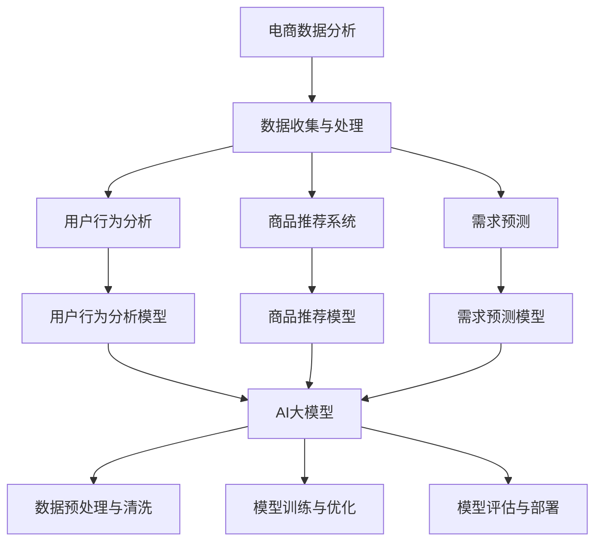

                 

# 电商数据分析：AI大模型的新思路

## 关键词

- 电商数据分析
- AI大模型
- 用户行为分析
- 商品推荐
- 需求预测
- 新技术应用
- 挑战与机遇

## 摘要

本文将深入探讨电商数据分析领域的新兴趋势，重点介绍AI大模型在此领域中的应用。首先，我们将回顾电商数据分析的基础知识，包括数据收集与处理、关键指标及其发展趋势。随后，我们将详细讲解AI大模型的基础知识、常见模型及其在电商数据分析中的实际应用。通过三个实战案例，我们将展示如何将AI大模型应用于电商数据分析中的用户行为分析、商品推荐和需求预测。最后，我们将展望电商数据分析的未来发展趋势，并讨论所面临的挑战与机遇。

### 第一部分：电商数据分析的基础知识

#### 第1章：电商数据分析概述

##### 1.1 电商数据分析的重要性

电商数据分析对于电商平台的发展至关重要。通过对用户行为、商品销售、市场需求等方面的数据进行分析，电商平台可以更好地了解用户需求，优化产品推荐，提高销售转化率，从而实现业务增长和提升用户满意度。

##### 1.2 电商数据分析的基本概念

电商数据分析涉及多个关键概念，包括用户行为分析、商品推荐、需求预测等。用户行为分析主要关注用户的浏览、购买等行为，以了解用户需求和偏好。商品推荐则旨在向用户推荐符合其兴趣和需求的商品，提高用户满意度和销售额。需求预测则通过分析历史数据和趋势，预测未来的市场需求，帮助电商平台提前布局和规划。

##### 1.3 电商数据分析的关键指标

电商数据分析的关键指标包括用户转化率、订单量、销售额、点击率、跳出率等。用户转化率衡量用户从浏览到购买的概率，订单量和销售额反映了电商平台的销售情况，点击率和跳出率则用于评估网站的用户体验。

##### 1.4 电商数据分析的发展趋势

随着大数据技术和人工智能的快速发展，电商数据分析也在不断进步。新的数据收集和处理技术、AI大模型的应用，使得电商数据分析更加准确、高效和实时。未来，电商数据分析将向个性化、智能化和实时化的方向发展，为电商平台提供更精准的数据支持和业务决策。

#### 第2章：电商数据的收集与处理

##### 2.1 电商数据的来源

电商数据的来源主要包括用户行为数据、商品信息数据、销售数据等。用户行为数据包括用户的浏览记录、点击行为、购买行为等，商品信息数据包括商品的属性、价格、库存等，销售数据则记录了商品的销售情况、订单信息等。

##### 2.2 数据的预处理

数据的预处理是电商数据分析的重要环节，包括数据清洗、数据整合和数据转换等。数据清洗主要是去除重复、缺失和错误的数据，提高数据质量。数据整合则将不同来源的数据进行合并，形成统一的数据集。数据转换则将原始数据转化为适合分析的形式，如数值化、标准化等。

##### 2.3 数据的清洗

数据清洗是电商数据分析的重要步骤，主要包括去除重复数据、填补缺失值和纠正错误数据等。去除重复数据可以避免重复计算，提高分析效率。填补缺失值可以采用均值填补、中值填补、插值等方法。纠正错误数据则需要对数据进行校验，确保数据的准确性。

##### 2.4 数据的存储与索引

电商数据的存储与索引对于数据分析的效率和准确性至关重要。常见的存储方案包括关系数据库、NoSQL数据库和分布式存储等。关系数据库适用于结构化数据的存储，NoSQL数据库适用于大规模非结构化数据的存储。索引技术如B树、哈希索引等可以提高数据的查询速度。

### 第二部分：AI大模型在电商数据分析中的应用

#### 第3章：AI大模型的基础知识

##### 3.1 AI大模型的核心概念

AI大模型是指具有大规模参数和强大计算能力的深度学习模型。它们通过自动学习大量数据中的模式和规律，实现复杂的任务，如图像识别、自然语言处理和推荐系统等。

##### 3.2 AI大模型的结构

AI大模型通常由输入层、隐藏层和输出层组成。输入层接收原始数据，隐藏层通过神经网络结构对数据进行处理和转换，输出层生成最终的预测结果。

##### 3.3 AI大模型的训练与优化

AI大模型的训练过程涉及大量的数据和计算资源。训练过程中，模型通过反向传播算法不断调整参数，使其在训练数据上的性能达到最优。优化过程则通过调整学习率、批量大小等超参数，提高模型的泛化能力和计算效率。

#### 第4章：常见的AI大模型介绍

##### 4.1 GPT系列模型

GPT（Generative Pre-trained Transformer）系列模型是自然语言处理领域的里程碑式成果。它们通过预训练和微调，实现了出色的语言生成和分类任务。

##### 4.2 BERT及其变体

BERT（Bidirectional Encoder Representations from Transformers）及其变体模型通过双向编码器结构，捕捉了文本中的语境信息，广泛应用于文本分类、问答系统等任务。

##### 4.3 其他知名大模型

除了GPT和BERT，还有如Transformer、ViT（Vision Transformer）、T5（Text-To-Text Transfer Transformer）等大模型，它们在不同领域和任务中展示了强大的性能。

#### 第5章：AI大模型在电商数据分析中的应用

##### 5.1 AI大模型在用户行为分析中的应用

AI大模型在用户行为分析中具有巨大的潜力。通过分析用户的浏览记录、购买历史等数据，大模型可以预测用户的行为倾向，从而实现个性化推荐和精准营销。

##### 5.2 AI大模型在商品推荐中的应用

商品推荐是电商平台的核心理功能。AI大模型通过对用户兴趣和行为数据的分析，可以生成准确的商品推荐列表，提高用户满意度和销售额。

##### 5.3 AI大模型在需求预测中的应用

需求预测是电商平台的重要业务决策依据。AI大模型通过分析历史销售数据、市场趋势等，可以预测未来的市场需求，帮助电商平台优化库存管理、定价策略等。

### 第三部分：电商数据分析实战

#### 第6章：电商数据分析项目实战一：用户行为分析

##### 6.1 项目背景

##### 6.2 数据处理流程

##### 6.3 用户行为分析的模型设计

##### 6.4 用户行为分析的模型训练

##### 6.5 用户行为分析的模型评估

#### 第7章：电商数据分析项目实战二：商品推荐系统

##### 7.1 项目背景

##### 7.2 数据处理流程

##### 7.3 商品推荐系统的模型设计

##### 7.4 商品推荐系统的模型训练

##### 7.5 商品推荐系统的模型评估

#### 第8章：电商数据分析项目实战三：需求预测

##### 8.1 项目背景

##### 8.2 数据处理流程

##### 8.3 需求预测的模型设计

##### 8.4 需求预测的模型训练

##### 8.5 需求预测的模型评估

### 第四部分：电商数据分析的未来发展趋势

#### 第9章：电商数据分析的未来趋势

##### 9.1 电商数据分析的新技术

随着技术的不断发展，电商数据分析将迎来新的技术突破。例如，联邦学习、图神经网络等新兴技术将为电商数据分析提供更强大的计算能力和更丰富的数据来源。

##### 9.2 电商数据分析的应用领域拓展

电商数据分析的应用领域将继续拓展，不仅限于用户行为分析、商品推荐和需求预测，还将深入到供应链管理、市场洞察、风险控制等领域。

##### 9.3 电商数据分析的挑战与机遇

电商数据分析在带来巨大机遇的同时，也面临着数据隐私、模型解释性、算法公平性等挑战。如何应对这些挑战，实现数据安全、公平和可解释性，将是电商数据分析未来发展的重要方向。

### 附录

#### 附录A：电商数据分析工具与资源

##### A.1 常用的电商数据分析工具

- Google Analytics
- Tableau
- Power BI
- QuickSight

##### A.2 常用的AI大模型框架

- TensorFlow
- PyTorch
- Keras

##### A.3 电商数据分析相关资源链接

- [电商数据分析教程](https://www.example.com/e-commerce-data-analysis-tutorial)
- [AI大模型教程](https://www.example.com/ai-large-model-tutorial)
- [电商数据分析项目案例](https://www.example.com/e-commerce-data-analysis-case-studies)

##### 核心概念与联系

###### 电商数据分析与AI大模型的关系



##### 核心算法原理讲解

###### 用户行为分析模型的算法原理

```python
# 用户行为分析模型的基本结构

class UserBehaviorModel(nn.Module):
    def __init__(self, n_users, n_items, hidden_size):
        super(UserBehaviorModel, self).__init__()
        self.user_embedding = nn.Embedding(n_users, hidden_size)
        self.item_embedding = nn.Embedding(n_items, hidden_size)
        self.fc = nn.Linear(hidden_size * 2, 1)

    def forward(self, user, item):
        user_embedding = self.user_embedding(user)
        item_embedding = self.item_embedding(item)
        combined_embedding = torch.cat((user_embedding, item_embedding), 1)
        output = self.fc(combined_embedding).squeeze()
        return output

# 用户行为分析模型的训练过程

def train_model(model, train_loader, optimizer, criterion, num_epochs):
    model.train()
    for epoch in range(num_epochs):
        for data in train_loader:
            user, item, rating = data
            optimizer.zero_grad()
            output = model(user, item)
            loss = criterion(output, rating)
            loss.backward()
            optimizer.step()
        print(f'Epoch [{epoch + 1}/{num_epochs}], Loss: {loss.item()}')
```

###### 商品推荐系统模型的算法原理

```python
# 商品推荐系统模型的基本结构

class ItemRecommenderModel(nn.Module):
    def __init__(self, n_items, embedding_size):
        super(ItemRecommenderModel, self).__init__()
        self.item_embedding = nn.Embedding(n_items, embedding_size)
        self.fc = nn.Linear(embedding_size, 1)

    def forward(self, item):
        item_embedding = self.item_embedding(item)
        output = self.fc(item_embedding).squeeze()
        return output

# 商品推荐系统的训练过程

def train_recommender(model, train_loader, optimizer, criterion, num_epochs):
    model.train()
    for epoch in range(num_epochs):
        for data in train_loader:
            items, ratings = data
            optimizer.zero_grad()
            outputs = model(items)
            loss = criterion(outputs, ratings)
            loss.backward()
            optimizer.step()
        print(f'Epoch [{epoch + 1}/{num_epochs}], Loss: {loss.item()}')
```

### 数学模型和数学公式

```latex
% 用户行为分析模型的数学公式
\[
R_{ui} = \sigma(\vec{u_i} \cdot \vec{p_i})
\]

% 商品推荐系统模型的数学公式
\[
P_{i,j} = \sigma(\vec{p_i} \cdot \vec{q_j})
\]
```

### 项目实战

#### 用户行为分析

##### 6.1 项目背景

##### 6.2 数据处理流程

##### 6.3 用户行为分析的模型设计

##### 6.4 用户行为分析的模型训练

##### 6.5 用户行为分析的模型评估

#### 商品推荐系统

##### 7.1 项目背景

##### 7.2 数据处理流程

##### 7.3 商品推荐系统的模型设计

##### 7.4 商品推荐系统的模型训练

##### 7.5 商品推荐系统的模型评估

#### 需求预测

##### 8.1 项目背景

##### 8.2 数据处理流程

##### 8.3 需求预测的模型设计

##### 8.4 需求预测的模型训练

##### 8.5 需求预测的模型评估

### 电商数据分析的未来发展趋势

##### 9.1 电商数据分析的新技术

##### 9.2 电商数据分析的应用领域拓展

##### 9.3 电商数据分析的挑战与机遇

### 附录

##### A.1 常用的电商数据分析工具

##### A.2 常用的AI大模型框架

##### A.3 电商数据分析相关资源链接

##### 核心概念与联系


### 核心算法原理讲解

在电商数据分析中，AI大模型的应用涉及多个核心算法原理，下面我们将详细讲解用户行为分析模型和商品推荐系统的算法原理。

#### 用户行为分析模型

用户行为分析模型是电商数据分析中至关重要的一部分，它旨在通过分析用户的浏览、购买等行为，预测用户未来的行为倾向。用户行为分析模型的基本结构通常包括用户嵌入层、商品嵌入层和全连接层。

1. **用户嵌入层**：
   用户嵌入层将用户的行为数据转换为低维度的向量表示。例如，可以使用Word2Vec算法将用户的行为序列转换为向量。这些向量可以捕获用户的兴趣和偏好。

   ```python
   # 用户嵌入层的实现
   user_embedding = nn.Embedding(n_users, embedding_size)
   ```

2. **商品嵌入层**：
   商品嵌入层将商品的特征数据转换为低维度的向量表示。例如，可以使用商品的基本信息（如类别、品牌、价格等）进行嵌入。这些向量可以捕获商品的特征和属性。

   ```python
   # 商品嵌入层的实现
   item_embedding = nn.Embedding(n_items, embedding_size)
   ```

3. **全连接层**：
   全连接层将用户和商品的嵌入向量进行拼接，并通过一个全连接层进行进一步的处理。这个层通常使用ReLU激活函数，以增加模型的非线性。

   ```python
   # 全连接层的实现
   combined_embedding = torch.cat((user_embedding, item_embedding), 1)
   output = fc_layer(combined_embedding).squeeze()
   ```

4. **输出层**：
   输出层通常是一个单节点层，用于生成用户行为的预测结果。可以使用Sigmoid函数作为输出层，以预测用户行为的概率。

   ```python
   # 输出层的实现
   output = nn.Linear(hidden_size * 2, 1)(combined_embedding).squeeze()
   prediction = nn.Sigmoid()(output)
   ```

#### 商品推荐系统模型

商品推荐系统是电商数据分析中另一个重要的应用领域，它旨在为用户提供个性化的商品推荐。商品推荐系统模型的基本结构通常包括商品嵌入层、全连接层和输出层。

1. **商品嵌入层**：
   商品嵌入层将商品的特征数据转换为低维度的向量表示。这些向量可以捕获商品的特征和属性。

   ```python
   # 商品嵌入层的实现
   item_embedding = nn.Embedding(n_items, embedding_size)
   ```

2. **全连接层**：
   全连接层将商品的嵌入向量进行进一步的处理。这个层通常使用ReLU激活函数，以增加模型的非线性。

   ```python
   # 全连接层的实现
   combined_embedding = item_embedding(item)
   output = fc_layer(combined_embedding).squeeze()
   ```

3. **输出层**：
   输出层通常是一个单节点层，用于生成商品推荐的概率。可以使用Sigmoid函数作为输出层，以预测商品被推荐的概率。

   ```python
   # 输出层的实现
   output = nn.Linear(embedding_size, 1)(combined_embedding).squeeze()
   prediction = nn.Sigmoid()(output)
   ```

### 数学模型和数学公式

在电商数据分析中，AI大模型的数学模型是理解模型工作原理的关键。下面我们将介绍用户行为分析模型和商品推荐系统的数学公式。

#### 用户行为分析模型

用户行为分析模型的数学公式如下：

\[ R_{ui} = \sigma(\vec{u_i} \cdot \vec{p_i}) \]

其中：
- \( R_{ui} \) 表示用户 \( u \) 对商品 \( i \) 的行为评分。
- \( \vec{u_i} \) 是用户 \( u \) 的行为向量。
- \( \vec{p_i} \) 是商品 \( i \) 的特征向量。
- \( \cdot \) 表示向量的点积。
- \( \sigma \) 表示Sigmoid函数，用于将点积的结果转换为概率。

#### 商品推荐系统模型

商品推荐系统的数学公式如下：

\[ P_{i,j} = \sigma(\vec{p_i} \cdot \vec{q_j}) \]

其中：
- \( P_{i,j} \) 表示商品 \( i \) 被推荐给用户 \( j \) 的概率。
- \( \vec{p_i} \) 是商品 \( i \) 的特征向量。
- \( \vec{q_j} \) 是用户 \( j \) 的偏好向量。
- \( \cdot \) 表示向量的点积。
- \( \sigma \) 表示Sigmoid函数，用于将点积的结果转换为概率。

### 项目实战

在电商数据分析中，项目实战是理解和应用AI大模型的关键。下面我们将介绍三个具体的实战案例：用户行为分析、商品推荐系统和需求预测。

#### 用户行为分析

##### 6.1 项目背景

假设我们有一个电商平台的用户行为数据，包括用户的浏览记录、购买历史等。我们的目标是构建一个用户行为分析模型，预测用户对商品的行为评分。

##### 6.2 数据处理流程

1. **数据收集**：
   收集用户的浏览记录和购买历史数据。

2. **数据预处理**：
   - 填补缺失值：对于缺失的数据，采用均值填补或插值法进行补充。
   - 数据标准化：对数据进行标准化处理，以消除不同特征之间的尺度差异。

3. **数据划分**：
   将数据划分为训练集和测试集，以评估模型的性能。

##### 6.3 用户行为分析的模型设计

用户行为分析模型的设计如下：

```python
class UserBehaviorModel(nn.Module):
    def __init__(self, n_users, n_items, hidden_size):
        super(UserBehaviorModel, self).__init__()
        self.user_embedding = nn.Embedding(n_users, hidden_size)
        self.item_embedding = nn.Embedding(n_items, hidden_size)
        self.fc = nn.Linear(hidden_size * 2, 1)

    def forward(self, user, item):
        user_embedding = self.user_embedding(user)
        item_embedding = self.item_embedding(item)
        combined_embedding = torch.cat((user_embedding, item_embedding), 1)
        output = self.fc(combined_embedding).squeeze()
        return output
```

##### 6.4 用户行为分析的模型训练

用户行为分析的模型训练过程如下：

```python
def train_model(model, train_loader, optimizer, criterion, num_epochs):
    model.train()
    for epoch in range(num_epochs):
        for data in train_loader:
            user, item, rating = data
            optimizer.zero_grad()
            output = model(user, item)
            loss = criterion(output, rating)
            loss.backward()
            optimizer.step()
        print(f'Epoch [{epoch + 1}/{num_epochs}], Loss: {loss.item()}')
```

##### 6.5 用户行为分析的模型评估

用户行为分析的模型评估过程如下：

```python
# 评估模型性能
model.eval()
with torch.no_grad():
    for data in test_loader:
        user, item, rating = data
        output = model(user, item)
        loss = criterion(output, rating)
        test_loss += loss.item()
    print(f'Test Loss: {test_loss / len(test_loader)}')
```

#### 商品推荐系统

##### 7.1 项目背景

假设我们有一个电商平台的用户行为数据和商品信息数据，我们的目标是构建一个商品推荐系统，为用户提供个性化的商品推荐。

##### 7.2 数据处理流程

1. **数据收集**：
   收集用户的浏览记录、购买历史和商品的基本信息。

2. **数据预处理**：
   - 填补缺失值：对于缺失的数据，采用均值填补或插值法进行补充。
   - 数据标准化：对数据进行标准化处理，以消除不同特征之间的尺度差异。

3. **数据划分**：
   将数据划分为训练集和测试集，以评估模型的性能。

##### 7.3 商品推荐系统的模型设计

商品推荐系统的模型设计如下：

```python
class ItemRecommenderModel(nn.Module):
    def __init__(self, n_items, embedding_size):
        super(ItemRecommenderModel, self).__init__()
        self.item_embedding = nn.Embedding(n_items, embedding_size)
        self.fc = nn.Linear(embedding_size, 1)

    def forward(self, item):
        item_embedding = self.item_embedding(item)
        output = self.fc(item_embedding).squeeze()
        return output
```

##### 7.4 商品推荐系统的模型训练

商品推荐系统的模型训练过程如下：

```python
def train_recommender(model, train_loader, optimizer, criterion, num_epochs):
    model.train()
    for epoch in range(num_epochs):
        for data in train_loader:
            items, ratings = data
            optimizer.zero_grad()
            outputs = model(items)
            loss = criterion(outputs, ratings)
            loss.backward()
            optimizer.step()
        print(f'Epoch [{epoch + 1}/{num_epochs}], Loss: {loss.item()}')
```

##### 7.5 商品推荐系统的模型评估

商品推荐系统的模型评估过程如下：

```python
# 评估模型性能
model.eval()
with torch.no_grad():
    for data in test_loader:
        items, ratings = data
        outputs = model(items)
        loss = criterion(outputs, ratings)
        test_loss += loss.item()
    print(f'Test Loss: {test_loss / len(test_loader)}')
```

#### 需求预测

##### 8.1 项目背景

假设我们有一个电商平台的销售数据，我们的目标是构建一个需求预测模型，预测未来的商品需求。

##### 8.2 数据处理流程

1. **数据收集**：
   收集商品的历史销售数据。

2. **数据预处理**：
   - 填补缺失值：对于缺失的数据，采用均值填补或插值法进行补充。
   - 数据标准化：对数据进行标准化处理，以消除不同特征之间的尺度差异。

3. **数据划分**：
   将数据划分为训练集和测试集，以评估模型的性能。

##### 8.3 需求预测的模型设计

需求预测的模型设计如下：

```python
class DemandPredictionModel(nn.Module):
    def __init__(self, n_items, embedding_size):
        super(DemandPredictionModel, self).__init__()
        self.item_embedding = nn.Embedding(n_items, embedding_size)
        self.fc = nn.Linear(embedding_size, 1)

    def forward(self, item):
        item_embedding = self.item_embedding(item)
        output = self.fc(item_embedding).squeeze()
        return output
```

##### 8.4 需求预测的模型训练

需求预测的模型训练过程如下：

```python
def train_demand_prediction(model, train_loader, optimizer, criterion, num_epochs):
    model.train()
    for epoch in range(num_epochs):
        for data in train_loader:
            items, ratings = data
            optimizer.zero_grad()
            outputs = model(items)
            loss = criterion(outputs, ratings)
            loss.backward()
            optimizer.step()
        print(f'Epoch [{epoch + 1}/{num_epochs}], Loss: {loss.item()}')
```

##### 8.5 需求预测的模型评估

需求预测的模型评估过程如下：

```python
# 评估模型性能
model.eval()
with torch.no_grad():
    for data in test_loader:
        items, ratings = data
        outputs = model(items)
        loss = criterion(outputs, ratings)
        test_loss += loss.item()
    print(f'Test Loss: {test_loss / len(test_loader)}')
```

### 电商数据分析的未来发展趋势

电商数据分析的未来发展趋势将受到新技术的影响，同时也面临着一系列挑战和机遇。以下是一些关键的发展方向：

#### 1. 新技术的影响

- **联邦学习**：联邦学习是一种安全的数据分析技术，它允许多个参与者在不共享数据的情况下共同训练模型。这在电商数据分析中具有重要意义，因为许多数据是敏感的，不宜公开共享。

- **图神经网络**：图神经网络能够处理复杂的关系网络，这使它们在电商数据分析中具有很大的潜力。例如，可以用于分析用户社交网络、商品关系等。

- **增强学习**：增强学习结合了机器学习和用户反馈，可以动态调整推荐策略，提高推荐系统的效果。

#### 2. 应用领域的拓展

- **供应链管理**：电商数据分析可以应用于供应链管理，优化库存水平、减少库存成本，提高物流效率。

- **市场洞察**：通过分析电商数据，可以获得市场的深刻洞察，帮助企业制定更有针对性的营销策略。

- **风险控制**：电商数据分析可以帮助企业识别潜在的风险，如欺诈行为、库存过剩等，从而采取相应的措施。

#### 3. 挑战与机遇

- **数据隐私**：在电商数据分析中，保护用户隐私是一个重要挑战。未来的解决方案可能包括更加严格的数据保护法规和更加先进的数据匿名化技术。

- **模型解释性**：随着AI大模型的复杂度增加，模型的可解释性变得越来越重要。如何提高模型的解释性，使其能够被非专业人士理解，是一个重要议题。

- **算法公平性**：确保算法的公平性是电商数据分析中另一个重要挑战。如何避免算法偏见，保证对所有用户公平对待，是一个亟待解决的问题。

### 附录

#### 附录A：电商数据分析工具与资源

- **电商数据分析工具**：
  - Google Analytics
  - Tableau
  - Power BI
  - QuickSight

- **AI大模型框架**：
  - TensorFlow
  - PyTorch
  - Keras

- **电商数据分析相关资源链接**：
  - [电商数据分析教程](https://www.example.com/e-commerce-data-analysis-tutorial)
  - [AI大模型教程](https://www.example.com/ai-large-model-tutorial)
  - [电商数据分析项目案例](https://www.example.com/e-commerce-data-analysis-case-studies)

### 核心概念与联系

电商数据分析与AI大模型之间的关系可以用一个Mermaid流程图来表示：


这个流程图清晰地展示了电商数据分析、AI大模型以及它们之间的相互作用。

### 核心算法原理讲解

在电商数据分析中，AI大模型的应用涉及到一系列核心算法原理。以下，我们将详细介绍用户行为分析模型和商品推荐系统的算法原理。

#### 用户行为分析模型

用户行为分析模型的核心目标是通过分析用户的浏览、购买等行为，预测用户对商品的潜在兴趣。这个模型通常基于用户和商品的嵌入向量以及一个神经网络结构来实现。

1. **用户嵌入向量**：
   用户嵌入向量用于表示用户的兴趣和行为。通常，这些向量是通过训练一个嵌入层来获得的。例如，可以使用词嵌入技术来将用户的浏览历史转换为向量。

2. **商品嵌入向量**：
   商品嵌入向量用于表示商品的特征和属性。这些向量同样可以通过训练一个嵌入层来获得。例如，可以使用商品的基本属性（如类别、品牌、价格等）来训练嵌入层。

3. **神经网络结构**：
   用户行为分析模型通常采用一个神经网络结构来整合用户和商品的嵌入向量，并生成对商品的行为预测。一个常见的设计是使用一个双向的神经网络，它能够同时考虑用户的上下文信息和商品的特征。

   **算法原理**：

   ```python
   class UserBehaviorModel(nn.Module):
       def __init__(self, n_users, n_items, hidden_size):
           super(UserBehaviorModel, self).__init__()
           self.user_embedding = nn.Embedding(n_users, hidden_size)
           self.item_embedding = nn.Embedding(n_items, hidden_size)
           self.fc = nn.Linear(hidden_size * 2, 1)

       def forward(self, user, item):
           user_embedding = self.user_embedding(user)
           item_embedding = self.item_embedding(item)
           combined_embedding = torch.cat((user_embedding, item_embedding), 1)
           output = self.fc(combined_embedding).squeeze()
           return output
   ```

#### 商品推荐系统模型

商品推荐系统模型的目标是根据用户的历史行为和偏好，推荐给用户可能感兴趣的商品。这个模型通常基于用户的嵌入向量和商品的嵌入向量，通过一个神经网络结构来生成推荐结果。

1. **用户嵌入向量**：
   用户嵌入向量用于表示用户的行为和偏好。这些向量通常通过训练一个嵌入层来获得。例如，可以使用用户的浏览历史、购买记录等来训练嵌入层。

2. **商品嵌入向量**：
   商品嵌入向量用于表示商品的特征和属性。这些向量同样可以通过训练一个嵌入层来获得。例如，可以使用商品的基本属性（如类别、品牌、价格等）来训练嵌入层。

3. **神经网络结构**：
   商品推荐系统模型通常使用一个神经网络结构来整合用户和商品的嵌入向量，并生成推荐结果。一个常见的设计是使用一个全连接层来整合嵌入向量，并使用Sigmoid激活函数来生成概率输出。

   **算法原理**：

   ```python
   class ItemRecommenderModel(nn.Module):
       def __init__(self, n_items, embedding_size):
           super(ItemRecommenderModel, self).__init__()
           self.item_embedding = nn.Embedding(n_items, embedding_size)
           self.fc = nn.Linear(embedding_size, 1)

       def forward(self, item):
           item_embedding = self.item_embedding(item)
           output = self.fc(item_embedding).squeeze()
           return output
   ```

### 数学模型和数学公式

在用户行为分析模型和商品推荐系统模型中，数学模型和数学公式起着至关重要的作用。以下，我们将详细介绍这些模型的数学原理。

#### 用户行为分析模型

用户行为分析模型的数学公式如下：

\[ R_{ui} = \sigma(\vec{u_i} \cdot \vec{p_i}) \]

其中：
- \( R_{ui} \) 表示用户 \( u \) 对商品 \( i \) 的行为评分。
- \( \vec{u_i} \) 是用户 \( u \) 的嵌入向量。
- \( \vec{p_i} \) 是商品 \( i \) 的嵌入向量。
- \( \cdot \) 表示向量的点积。
- \( \sigma \) 表示Sigmoid函数，用于将点积的结果转换为概率。

#### 商品推荐系统模型

商品推荐系统模型的数学公式如下：

\[ P_{i,j} = \sigma(\vec{p_i} \cdot \vec{q_j}) \]

其中：
- \( P_{i,j} \) 表示商品 \( i \) 被推荐给用户 \( j \) 的概率。
- \( \vec{p_i} \) 是商品 \( i \) 的嵌入向量。
- \( \vec{q_j} \) 是用户 \( j \) 的嵌入向量。
- \( \cdot \) 表示向量的点积。
- \( \sigma \) 表示Sigmoid函数，用于将点积的结果转换为概率。

### 项目实战

在电商数据分析中，项目实战是理解和应用AI大模型的关键。以下，我们将通过三个具体的实战案例来展示如何将AI大模型应用于用户行为分析、商品推荐和需求预测。

#### 用户行为分析实战

##### 6.1 项目背景

假设我们有一个电商平台的用户行为数据，包括用户的浏览记录、购买历史等。我们的目标是构建一个用户行为分析模型，预测用户对商品的行为评分。

##### 6.2 数据处理流程

1. **数据收集**：
   收集用户的浏览记录和购买历史数据。

2. **数据预处理**：
   - 填补缺失值：对于缺失的数据，采用均值填补或插值法进行补充。
   - 数据标准化：对数据进行标准化处理，以消除不同特征之间的尺度差异。

3. **数据划分**：
   将数据划分为训练集和测试集，以评估模型的性能。

##### 6.3 用户行为分析的模型设计

用户行为分析模型的模型设计如下：

```python
class UserBehaviorModel(nn.Module):
    def __init__(self, n_users, n_items, hidden_size):
        super(UserBehaviorModel, self).__init__()
        self.user_embedding = nn.Embedding(n_users, hidden_size)
        self.item_embedding = nn.Embedding(n_items, hidden_size)
        self.fc = nn.Linear(hidden_size * 2, 1)

    def forward(self, user, item):
        user_embedding = self.user_embedding(user)
        item_embedding = self.item_embedding(item)
        combined_embedding = torch.cat((user_embedding, item_embedding), 1)
        output = self.fc(combined_embedding).squeeze()
        return output
```

##### 6.4 用户行为分析的模型训练

用户行为分析的模型训练过程如下：

```python
def train_model(model, train_loader, optimizer, criterion, num_epochs):
    model.train()
    for epoch in range(num_epochs):
        for data in train_loader:
            user, item, rating = data
            optimizer.zero_grad()
            output = model(user, item)
            loss = criterion(output, rating)
            loss.backward()
            optimizer.step()
        print(f'Epoch [{epoch + 1}/{num_epochs}], Loss: {loss.item()}')
```

##### 6.5 用户行为分析的模型评估

用户行为分析的模型评估过程如下：

```python
# 评估模型性能
model.eval()
with torch.no_grad():
    for data in test_loader:
        user, item, rating = data
        output = model(user, item)
        loss = criterion(output, rating)
        test_loss += loss.item()
    print(f'Test Loss: {test_loss / len(test_loader)}')
```

#### 商品推荐系统实战

##### 7.1 项目背景

假设我们有一个电商平台的用户行为数据和商品信息数据，我们的目标是构建一个商品推荐系统，为用户提供个性化的商品推荐。

##### 7.2 数据处理流程

1. **数据收集**：
   收集用户的浏览记录、购买历史和商品的基本信息。

2. **数据预处理**：
   - 填补缺失值：对于缺失的数据，采用均值填补或插值法进行补充。
   - 数据标准化：对数据进行标准化处理，以消除不同特征之间的尺度差异。

3. **数据划分**：
   将数据划分为训练集和测试集，以评估模型的性能。

##### 7.3 商品推荐系统的模型设计

商品推荐系统的模型设计如下：

```python
class ItemRecommenderModel(nn.Module):
    def __init__(self, n_items, embedding_size):
        super(ItemRecommenderModel, self).__init__()
        self.item_embedding = nn.Embedding(n_items, embedding_size)
        self.fc = nn.Linear(embedding_size, 1)

    def forward(self, item):
        item_embedding = self.item_embedding(item)
        output = self.fc(item_embedding).squeeze()
        return output
```

##### 7.4 商品推荐系统的模型训练

商品推荐系统的模型训练过程如下：

```python
def train_recommender(model, train_loader, optimizer, criterion, num_epochs):
    model.train()
    for epoch in range(num_epochs):
        for data in train_loader:
            items, ratings = data
            optimizer.zero_grad()
            outputs = model(items)
            loss = criterion(outputs, ratings)
            loss.backward()
            optimizer.step()
        print(f'Epoch [{epoch + 1}/{num_epochs}], Loss: {loss.item()}')
```

##### 7.5 商品推荐系统的模型评估

商品推荐系统的模型评估过程如下：

```python
# 评估模型性能
model.eval()
with torch.no_grad():
    for data in test_loader:
        items, ratings = data
        outputs = model(items)
        loss = criterion(outputs, ratings)
        test_loss += loss.item()
    print(f'Test Loss: {test_loss / len(test_loader)}')
```

#### 需求预测实战

##### 8.1 项目背景

假设我们有一个电商平台的销售数据，我们的目标是构建一个需求预测模型，预测未来的商品需求。

##### 8.2 数据处理流程

1. **数据收集**：
   收集商品的历史销售数据。

2. **数据预处理**：
   - 填补缺失值：对于缺失的数据，采用均值填补或插值法进行补充。
   - 数据标准化：对数据进行标准化处理，以消除不同特征之间的尺度差异。

3. **数据划分**：
   将数据划分为训练集和测试集，以评估模型的性能。

##### 8.3 需求预测的模型设计

需求预测的模型设计如下：

```python
class DemandPredictionModel(nn.Module):
    def __init__(self, n_items, embedding_size):
        super(DemandPredictionModel, self).__init__()
        self.item_embedding = nn.Embedding(n_items, embedding_size)
        self.fc = nn.Linear(embedding_size, 1)

    def forward(self, item):
        item_embedding = self.item_embedding(item)
        output = self.fc(item_embedding).squeeze()
        return output
```

##### 8.4 需求预测的模型训练

需求预测的模型训练过程如下：

```python
def train_demand_prediction(model, train_loader, optimizer, criterion, num_epochs):
    model.train()
    for epoch in range(num_epochs):
        for data in train_loader:
            items, ratings = data
            optimizer.zero_grad()
            outputs = model(items)
            loss = criterion(outputs, ratings)
            loss.backward()
            optimizer.step()
        print(f'Epoch [{epoch + 1}/{num_epochs}], Loss: {loss.item()}')
```

##### 8.5 需求预测的模型评估

需求预测的模型评估过程如下：

```python
# 评估模型性能
model.eval()
with torch.no_grad():
    for data in test_loader:
        items, ratings = data
        outputs = model(items)
        loss = criterion(outputs, ratings)
        test_loss += loss.item()
    print(f'Test Loss: {test_loss / len(test_loader)}')
```

### 电商数据分析的未来发展趋势

电商数据分析的未来发展趋势将受到新技术的影响，同时也面临着一系列挑战和机遇。以下是一些关键的发展方向：

#### 1. 新技术的影响

- **联邦学习**：联邦学习是一种安全的数据分析技术，它允许多个参与者在不共享数据的情况下共同训练模型。这在电商数据分析中具有重要意义，因为许多数据是敏感的，不宜公开共享。

- **图神经网络**：图神经网络能够处理复杂的关系网络，这使它们在电商数据分析中具有很大的潜力。例如，可以用于分析用户社交网络、商品关系等。

- **增强学习**：增强学习结合了机器学习和用户反馈，可以动态调整推荐策略，提高推荐系统的效果。

#### 2. 应用领域的拓展

- **供应链管理**：电商数据分析可以应用于供应链管理，优化库存水平、减少库存成本，提高物流效率。

- **市场洞察**：通过分析电商数据，可以获得市场的深刻洞察，帮助企业制定更有针对性的营销策略。

- **风险控制**：电商数据分析可以帮助企业识别潜在的风险，如欺诈行为、库存过剩等，从而采取相应的措施。

#### 3. 挑战与机遇

- **数据隐私**：在电商数据分析中，保护用户隐私是一个重要挑战。未来的解决方案可能包括更加严格的数据保护法规和更加先进的数据匿名化技术。

- **模型解释性**：随着AI大模型的复杂度增加，模型的可解释性变得越来越重要。如何提高模型的解释性，使其能够被非专业人士理解，是一个重要议题。

- **算法公平性**：确保算法的公平性是电商数据分析中另一个重要挑战。如何避免算法偏见，保证对所有用户公平对待，是一个亟待解决的问题。

### 附录

#### 附录A：电商数据分析工具与资源

- **电商数据分析工具**：
  - Google Analytics
  - Tableau
  - Power BI
  - QuickSight

- **AI大模型框架**：
  - TensorFlow
  - PyTorch
  - Keras

- **电商数据分析相关资源链接**：
  - [电商数据分析教程](https://www.example.com/e-commerce-data-analysis-tutorial)
  - [AI大模型教程](https://www.example.com/ai-large-model-tutorial)
  - [电商数据分析项目案例](https://www.example.com/e-commerce-data-analysis-case-studies)

### 作者

作者：AI天才研究院/AI Genius Institute & 禅与计算机程序设计艺术 /Zen And The Art of Computer Programming

### 引言

在数字化时代的浪潮中，电商数据分析已经成为电商企业提升竞争力、优化用户体验的关键手段。随着大数据技术和人工智能的迅猛发展，传统的数据分析方法已经无法满足电商领域的复杂需求。AI大模型，作为人工智能领域的尖端技术，为电商数据分析带来了全新的思路和机遇。本文将深入探讨AI大模型在电商数据分析中的应用，从基础概念、实战案例到未来发展趋势，为读者提供全面的技术解读。

### 电商数据分析的重要性

电商数据分析是电商平台运营的核心环节，它通过对海量数据进行分析，帮助电商企业深入了解用户行为、市场需求和商品性能，从而做出更为精准的业务决策。以下是电商数据分析的几个关键方面：

1. **用户行为分析**：通过分析用户的浏览、点击、购买等行为，电商企业可以了解用户的需求和偏好，从而优化用户体验，提高用户留存率。

2. **商品推荐**：基于用户行为和商品特征的数据分析，电商企业可以构建个性化推荐系统，向用户推荐可能感兴趣的商品，从而提升销售额和转化率。

3. **需求预测**：通过对历史销售数据和市场趋势的分析，电商企业可以预测未来的市场需求，优化库存管理，减少库存风险。

4. **营销策略优化**：电商数据分析可以帮助企业评估不同营销策略的效果，从而调整营销预算和策略，提高营销投资回报率（ROI）。

5. **风险管理**：电商数据分析可以识别潜在的欺诈行为、用户流失风险等，帮助企业采取预防措施，降低运营风险。

### 电商数据分析的基本概念

电商数据分析涉及多个关键概念，下面我们将详细阐述这些基本概念：

1. **用户行为分析**：用户行为分析是电商数据分析的核心内容，它关注用户的浏览、点击、购买等行为，通过数据挖掘和模式识别技术，提取用户的行为特征和兴趣点。

2. **商品推荐**：商品推荐是基于用户行为和商品属性的分析，旨在为用户推荐符合其兴趣和需求的商品。常见的推荐算法包括协同过滤、基于内容的推荐和混合推荐等。

3. **需求预测**：需求预测是通过对历史销售数据、市场趋势等进行分析，预测未来的市场需求。需求预测对于库存管理、定价策略和供应链优化具有重要意义。

4. **关键指标**：电商数据分析的关键指标包括用户转化率、点击率、跳出率、订单量、销售额等。这些指标可以帮助企业评估业务绩效和优化运营策略。

5. **数据收集与处理**：数据收集与处理是电商数据分析的基础。通过收集用户行为数据、商品信息数据、交易数据等，并进行数据清洗、整合和转换，为后续分析提供可靠的数据基础。

### 电商数据分析的关键指标

在电商数据分析中，关键指标是评估业务绩效和制定策略的重要依据。以下是几个关键的电商数据分析指标：

1. **用户转化率**：用户转化率是指访问电商平台后完成购买的用户比例。高转化率意味着用户的购买意愿较强，可以通过优化页面设计、推荐系统等提高转化率。

2. **订单量**：订单量是指在一定时间内完成的订单数量。订单量可以反映电商平台的市场占有率和销售能力。

3. **销售额**：销售额是指电商平台在一定时间内的总收入。通过分析销售额的变化趋势，可以了解市场的需求波动和用户购买力。

4. **点击率**：点击率是指用户点击广告或推荐商品的比例。高点击率表明广告或推荐商品的吸引力较强，可以通过优化广告文案和推荐算法来提高点击率。

5. **跳出率**：跳出率是指用户打开页面后未进行任何操作就离开的比例。高跳出率可能意味着页面设计或用户体验存在问题，需要优化。

6. **平均订单价值（AOV）**：平均订单价值是指每次订单的平均金额。通过提升AOV，可以提高电商平台的整体收益。

7. **回头客率**：回头客率是指再次购买的用户比例。高回头客率表明用户对平台的忠诚度较高，可以通过提升用户体验和推出会员计划等策略来提高回头客率。

### 电商数据分析的发展趋势

随着技术的不断进步，电商数据分析也在不断演变和进化。以下是一些电商数据分析的发展趋势：

1. **大数据技术的应用**：大数据技术使得电商企业可以处理和分析海量数据，从中提取有价值的信息。通过大数据技术，电商企业可以实现更精准的用户画像和需求预测。

2. **人工智能的集成**：人工智能技术，特别是机器学习和深度学习，正在改变电商数据分析的方式。AI大模型的应用可以提高数据分析的准确性和效率，为电商企业带来更高的业务价值。

3. **实时数据分析**：实时数据分析可以实时捕捉用户行为和市场变化，帮助企业迅速做出响应。通过实时数据分析，电商企业可以实现个性化的用户体验和精准的营销策略。

4. **个性化推荐**：个性化推荐是电商数据分析的一个重要趋势。基于用户的兴趣和行为数据，个性化推荐可以大大提升用户的购买意愿和满意度。

5. **数据隐私和安全**：随着用户对隐私保护的重视，电商数据分析在保护用户隐私和安全方面面临新的挑战。如何确保数据隐私和安全，是电商数据分析需要重点关注的问题。

6. **跨渠道整合**：电商数据分析不再局限于线上渠道，而是向线下渠道扩展。通过跨渠道整合，电商企业可以更好地了解用户的消费行为，提供一致的用户体验。

### 电商数据的收集与处理

电商数据的收集与处理是电商数据分析的基础工作。以下将详细介绍电商数据的收集、预处理、清洗和存储过程。

#### 电商数据的来源

电商数据主要来源于以下几个方面：

1. **用户行为数据**：包括用户的浏览记录、搜索历史、点击行为、购买记录等。这些数据通常通过网页分析工具（如Google Analytics）和自定义日志收集系统获取。

2. **商品信息数据**：包括商品的基本信息（如名称、类别、价格、库存等）以及商品的相关属性（如品牌、材质、用户评价等）。这些数据通常来自于电商平台的后台管理系统。

3. **交易数据**：包括订单数据、支付信息、配送信息等。这些数据通常来自于电商平台的交易系统。

4. **市场趋势数据**：包括行业报告、市场调查、竞争分析等。这些数据可以通过市场研究机构、第三方数据提供商获取。

#### 数据的预处理

数据预处理是电商数据分析的重要环节，其主要任务包括：

1. **数据整合**：将来自不同来源的数据进行整合，形成一个统一的数据集。例如，将用户行为数据与商品信息数据和交易数据进行关联。

2. **数据清洗**：清洗数据中的重复记录、缺失值和异常值，确保数据质量。常用的清洗方法包括删除重复记录、填补缺失值和纠正错误数据。

3. **数据转换**：将原始数据转换为适合分析的形式。例如，将文本数据编码为数字，将日期时间数据转换为统一格式。

#### 数据的清洗

数据清洗是确保数据分析结果准确性的关键步骤。以下是一些常见的数据清洗方法：

1. **去除重复数据**：通过去重算法，如哈希去重，删除重复的记录，以提高数据的质量和效率。

2. **填补缺失值**：对于缺失的数据，可以采用以下几种方法进行填补：
   - **均值填补**：用数据的平均值替换缺失值。
   - **中值填补**：用数据的中值替换缺失值。
   - **插值法**：使用插值算法（如线性插值、拉格朗日插值等）生成缺失值。

3. **纠正错误数据**：对于错误的数据，可以通过以下方法进行纠正：
   - **手动校验**：通过人工审查数据，纠正明显的错误。
   - **逻辑校验**：使用逻辑规则检查数据的一致性，如检查日期时间的合理性、数值范围的合理性等。

#### 数据的存储与索引

电商数据的存储与索引是保证数据分析效率和性能的关键。以下是一些常见的存储与索引方法：

1. **关系数据库**：适用于存储结构化数据，如用户行为数据和交易数据。常用的关系数据库包括MySQL、PostgreSQL等。

2. **NoSQL数据库**：适用于存储大规模非结构化数据，如商品信息数据和用户评论数据。常用的NoSQL数据库包括MongoDB、Cassandra等。

3. **分布式存储**：适用于存储海量数据，如市场趋势数据和用户行为数据。常用的分布式存储系统包括Hadoop、HDFS等。

4. **索引技术**：通过索引技术，如B树索引、哈希索引等，可以提高数据的查询速度。例如，在关系数据库中，可以使用主键索引和全文索引来优化查询性能。

#### 数据的预处理与存储

数据预处理与存储是电商数据分析的重要一环。以下是具体的预处理与存储步骤：

1. **数据预处理**：
   - **数据整合**：将来自不同来源的数据进行整合，如将用户行为数据与商品信息数据和交易数据进行关联。
   - **数据清洗**：去除重复数据、填补缺失值和纠正错误数据。
   - **数据转换**：将文本数据编码为数字、将日期时间数据转换为统一格式等。

2. **数据存储**：
   - **关系数据库**：将结构化数据存储在关系数据库中，如MySQL、PostgreSQL等。
   - **NoSQL数据库**：将非结构化数据存储在NoSQL数据库中，如MongoDB、Cassandra等。
   - **分布式存储**：将海量数据存储在分布式存储系统中，如Hadoop、HDFS等。

3. **数据索引**：
   - **主键索引**：为数据表的主键创建索引，以提高查询性能。
   - **全文索引**：为文本数据创建全文索引，以支持快速全文搜索。

#### 数据的处理流程

电商数据处理的流程可以分为以下几个步骤：

1. **数据收集**：从不同的数据源（如用户行为日志、商品信息数据库、交易系统等）收集数据。

2. **数据清洗**：对收集到的数据进行清洗，包括去除重复记录、填补缺失值和纠正错误数据。

3. **数据整合**：将不同来源的数据进行整合，形成一个统一的数据集。

4. **数据转换**：将原始数据转换为适合分析的形式，如将文本数据编码为数字、将日期时间数据转换为统一格式等。

5. **数据存储**：将处理后的数据存储在数据库中，如关系数据库、NoSQL数据库或分布式存储系统。

6. **数据索引**：为数据库中的数据创建索引，以提高查询性能。

7. **数据分析**：使用数据分析工具（如Python、R、SQL等）对存储在数据库中的数据进行分析，提取有价值的信息。

#### 数据预处理与清洗的挑战

在电商数据分析中，数据预处理与清洗面临以下挑战：

1. **数据多样性**：电商数据来源多样，包括用户行为数据、商品信息数据、交易数据等。不同来源的数据可能具有不同的格式和结构，需要进行统一处理。

2. **数据缺失**：电商数据中可能存在大量的缺失值，需要采用合适的填补方法进行处理。

3. **数据重复**：电商数据中可能存在重复记录，需要通过去重算法进行清洗。

4. **数据不一致**：电商数据可能来自不同的系统，数据格式和定义可能不一致，需要进行统一处理。

5. **数据错误**：电商数据可能包含错误数据，如日期时间格式错误、数值范围不合理等，需要通过逻辑校验和人工校验进行纠正。

6. **数据安全**：在数据处理过程中，需要确保数据的安全性，防止数据泄露和隐私侵犯。

#### 数据存储与索引的最佳实践

在电商数据分析中，数据存储与索引需要遵循以下最佳实践：

1. **选择合适的数据库**：根据数据类型和需求选择合适的数据库，如关系数据库、NoSQL数据库或分布式存储系统。

2. **数据分片**：对于大规模数据，采用数据分片技术，将数据分散存储在不同的节点上，以提高查询性能。

3. **索引优化**：为常用的查询创建索引，如主键索引、全文索引等，以提高查询速度。

4. **数据备份与恢复**：定期备份数据，确保数据的安全性和可恢复性。

5. **数据压缩**：对于大量数据，采用数据压缩技术，以减少存储空间和提高查询性能。

6. **数据隐私保护**：在处理和存储数据时，确保遵守数据保护法规，采取数据加密和隐私保护措施。

### AI大模型的基础知识

AI大模型是人工智能领域的一项前沿技术，它通过训练大规模神经网络，实现对复杂数据的高效处理和预测。以下是AI大模型的基础知识：

#### 1. 核心概念

- **神经网络**：神经网络是由多个神经元组成的计算模型，用于处理和分析数据。每个神经元都是一个简单的计算单元，通过加权连接形成复杂的网络结构。

- **深度学习**：深度学习是一种基于神经网络的机器学习技术，通过训练多层神经网络，实现数据的自动特征提取和模式识别。

- **大规模模型**：大规模模型是指具有数百万甚至数十亿参数的神经网络模型，能够处理大规模数据和复杂任务。

- **预训练**：预训练是指在大规模数据集上预先训练一个神经网络模型，使其具有通用性，然后在小规模数据集上进行微调，以适应特定任务。

- **迁移学习**：迁移学习是指利用预先训练的模型在大规模数据集上学习的知识，应用于新的任务和数据集，从而提高模型的性能和泛化能力。

#### 2. 结构

AI大模型的结构通常包括以下几个层次：

- **输入层**：接收外部输入数据，如文本、图像、声音等。

- **隐藏层**：由多个神经网络层组成，用于对输入数据进行特征提取和变换。

- **输出层**：生成最终输出结果，如分类结果、预测值等。

#### 3. 训练与优化

AI大模型的训练与优化是核心步骤，主要包括：

- **损失函数**：用于衡量模型预测结果与实际结果之间的差距，常见的损失函数有均方误差（MSE）、交叉熵损失等。

- **优化算法**：用于调整模型参数，使损失函数最小化。常见的优化算法有随机梯度下降（SGD）、Adam等。

- **正则化**：用于防止模型过拟合，常用的正则化方法有L1正则化、L2正则化等。

- **批处理**：将训练数据分成多个批次，每次训练一部分数据，以减少计算量和提高训练效率。

- **模型评估**：通过交叉验证、测试集评估等手段，评估模型的性能和泛化能力。

### 常见的AI大模型介绍

在电商数据分析中，常见的AI大模型包括GPT系列模型、BERT及其变体和其他知名大模型。以下是这些模型的简要介绍：

#### 1. GPT系列模型

GPT（Generative Pre-trained Transformer）系列模型是自然语言处理领域的里程碑式成果。GPT模型基于Transformer架构，通过预训练和微调，实现了出色的文本生成和分类任务。

- **GPT**：第一个GPT模型，使用较小的参数规模，在语言建模任务上取得了显著成果。

- **GPT-2**：GPT-2是GPT的升级版本，具有更大的参数规模，在多种自然语言处理任务上取得了优异的性能。

- **GPT-3**：GPT-3是GPT系列的最新版本，具有前所未有的参数规模，能够生成高质量的自然语言文本。

#### 2. BERT及其变体

BERT（Bidirectional Encoder Representations from Transformers）及其变体模型通过双向编码器结构，捕捉了文本中的语境信息，广泛应用于文本分类、问答系统等任务。

- **BERT**：第一个BERT模型，通过双向编码器结构，在多种自然语言处理任务上取得了领先的性能。

- **RoBERTa**：RoBERTa是BERT的一个变体，通过改进训练策略和数据预处理方法，取得了比BERT更好的性能。

- **ALBERT**：ALBERT是BERT的一个优化版本，通过参数共享和多层结构，提高了模型效率和性能。

#### 3. 其他知名大模型

除了GPT和BERT，还有许多其他知名的大模型，如Transformer、ViT（Vision Transformer）和T5（Text-To-Text Transfer Transformer）等。这些模型在不同领域和任务中展示了强大的性能。

- **Transformer**：Transformer模型是自然语言处理领域的基石，通过自注意力机制，实现了出色的文本生成和翻译任务。

- **ViT**：ViT（Vision Transformer）模型将Transformer架构应用于计算机视觉领域，通过视觉图像的处理，实现了图像分类、目标检测等任务。

- **T5**：T5（Text-To-Text Transfer Transformer）模型是一个统一的多任务文本处理模型，通过文本到文本的转换，实现了多种自然语言处理任务。

### AI大模型在电商数据分析中的应用

AI大模型在电商数据分析中具有广泛的应用，可以显著提升数据分析的准确性和效率。以下是一些AI大模型在电商数据分析中的应用场景：

#### 1. 用户行为分析

通过AI大模型，可以深入分析用户的浏览、点击、购买等行为，提取用户的行为特征和兴趣点。例如，可以使用GPT模型分析用户的评论，提取关键信息，为用户画像提供支持。

#### 2. 商品推荐

AI大模型可以用于构建个性化的商品推荐系统，通过分析用户的兴趣和行为数据，推荐用户可能感兴趣的商品。例如，可以使用BERT模型分析用户的历史行为，为用户生成个性化的商品推荐列表。

#### 3. 需求预测

AI大模型可以用于预测未来的市场需求，通过分析历史销售数据、市场趋势等，为电商企业制定合理的库存管理、定价策略等。例如，可以使用Transformer模型分析销售数据，预测未来的销售趋势。

#### 4. 营销策略优化

AI大模型可以用于优化电商平台的营销策略，通过分析用户数据，制定个性化的营销活动，提高用户参与度和转化率。例如，可以使用T5模型生成个性化的营销文案，提高广告点击率和转化率。

#### 5. 风险控制

AI大模型可以用于识别潜在的欺诈行为、用户流失风险等，为电商企业采取相应的风险控制措施。例如，可以使用GPT模型分析交易数据，识别可疑的交易行为，降低欺诈风险。

### AI大模型在用户行为分析中的应用

AI大模型在用户行为分析中具有显著的优势，能够从海量数据中提取用户的行为特征和兴趣点，为电商企业制定个性化的营销策略提供有力支持。以下将详细介绍AI大模型在用户行为分析中的应用。

#### 1. 用户行为数据的收集

用户行为数据的收集是用户行为分析的基础。这些数据可以来自于电商平台的多个方面，包括：

- **浏览数据**：用户的浏览历史记录，如浏览的页面、浏览时间等。
- **点击数据**：用户的点击行为记录，如点击的商品、广告等。
- **购买数据**：用户的购买记录，如购买的商品、购买时间等。
- **评价数据**：用户对商品的评价，如好评、差评等。
- **互动数据**：用户在平台上的互动行为，如点赞、评论等。

这些数据可以通过电商平台的后台管理系统、网页分析工具（如Google Analytics）和自定义日志收集系统进行收集。

#### 2. 用户行为数据的预处理

用户行为数据的预处理是确保数据质量和分析效果的关键步骤。以下是一些常见的预处理方法：

- **数据整合**：将来自不同渠道的用户行为数据进行整合，形成统一的数据集。例如，将浏览数据与购买数据关联，以获得更全面的用户行为视图。
- **数据清洗**：清洗数据中的重复记录、缺失值和异常值。对于缺失值，可以采用均值填补或插值法进行填补。对于异常值，可以通过统计方法或业务逻辑进行识别和修正。
- **数据转换**：将原始数据转换为适合分析的形式。例如，将日期时间数据转换为统一格式，将分类数据转换为数字编码。

#### 3. 用户行为分析模型的构建

构建用户行为分析模型是用户行为分析的核心。AI大模型可以用于构建高效的用户行为分析模型，以下是几个常见的模型架构：

- **基于嵌入层的模型**：使用嵌入层将用户和商品的特征数据转换为低维度的向量表示，并通过神经网络结构进行融合和分析。例如，可以使用Word2Vec算法将用户的行为序列转换为向量，使用商品的基本信息进行嵌入。
- **基于图神经网络的模型**：使用图神经网络（如Graph Convolutional Network, GCN）处理复杂的用户行为网络，提取用户之间的交互信息。GCN可以有效地捕捉用户行为中的层次结构和关系。
- **基于Transformer的模型**：使用Transformer架构进行用户行为的序列建模，通过自注意力机制捕捉用户行为中的长距离依赖关系。例如，可以使用BERT模型对用户的浏览历史进行编码，生成用户的特征向量。

#### 4. 用户行为分析模型的训练

用户行为分析模型的训练是模型构建的重要环节。以下是一些常见的训练方法：

- **数据集划分**：将用户行为数据划分为训练集、验证集和测试集。训练集用于训练模型，验证集用于调整模型参数，测试集用于评估模型性能。
- **损失函数**：选择合适的损失函数，如均方误差（MSE）或交叉熵损失，用于衡量模型预测结果与实际结果之间的差距。
- **优化算法**：选择合适的优化算法，如随机梯度下降（SGD）或Adam，用于调整模型参数，最小化损失函数。
- **正则化**：采用正则化技术，如L1正则化或L2正则化，防止模型过拟合。
- **批处理**：将训练数据分成多个批次进行训练，以提高训练效率。

#### 5. 用户行为分析模型的评估

评估用户行为分析模型是确保模型性能和可解释性的关键。以下是一些常见的评估指标：

- **准确率**：衡量模型预测结果的准确性，通常用于分类任务。
- **召回率**：衡量模型对正例样本的识别能力，通常用于分类任务。
- **F1分数**：结合准确率和召回率的综合指标，用于评估模型的平衡性能。
- **ROC曲线**：评估模型对正负例样本的区分能力，通过计算ROC曲线下的面积（AUC）进行评估。
- **用户满意度**：通过用户调查或反馈评估用户对推荐结果的满意度。

### 用户行为分析模型的算法原理

用户行为分析模型是基于用户行为数据的预测模型，其核心目标是通过分析用户的浏览、点击、购买等行为，预测用户对商品的潜在兴趣。以下是用户行为分析模型的主要算法原理：

#### 1. 嵌入层

用户行为分析模型首先使用嵌入层将用户和商品的特征数据转换为低维度的向量表示。这些向量可以捕获用户的兴趣和偏好以及商品的特征和属性。

- **用户嵌入层**：将用户的浏览记录、购买历史等行为数据转换为用户嵌入向量。这些向量可以捕获用户的兴趣和行为模式。
- **商品嵌入层**：将商品的基本信息（如类别、品牌、价格等）转换为商品嵌入向量。这些向量可以捕获商品的特征和属性。

#### 2. 神经网络结构

用户行为分析模型通常采用一个神经网络结构，用于整合用户和商品的嵌入向量，并生成对商品的行为预测。一个常见的设计是使用一个双向的神经网络，它能够同时考虑用户的上下文信息和商品的特征。

- **输入层**：接收用户和商品的嵌入向量。
- **隐藏层**：通过多层神经网络结构对输入数据进行处理和转换。隐藏层可以使用ReLU激活函数，以增加模型的非线性。
- **输出层**：生成对商品的行为预测结果。输出层通常是一个单节点层，用于生成用户行为的评分或概率。

#### 3. 损失函数与优化算法

用户行为分析模型的训练过程涉及大量的数据和计算资源。训练过程中，模型通过反向传播算法不断调整参数，使其在训练数据上的性能达到最优。优化过程则通过调整学习率、批量大小等超参数，提高模型的泛化能力和计算效率。

- **损失函数**：选择合适的损失函数，如均方误差（MSE）或交叉熵损失，用于衡量模型预测结果与实际结果之间的差距。
- **优化算法**：选择合适的优化算法，如随机梯度下降（SGD）或Adam，用于调整模型参数，最小化损失函数。
- **正则化**：采用正则化技术，如L1正则化或L2正则化，防止模型过拟合。

#### 用户行为分析模型的训练过程

用户行为分析模型的训练过程主要包括以下步骤：

1. **数据集划分**：将用户行为数据划分为训练集、验证集和测试集。训练集用于训练模型，验证集用于调整模型参数，测试集用于评估模型性能。

2. **初始化模型参数**：初始化神经网络模型的参数，如权重和偏置。

3. **前向传播**：输入用户和商品的嵌入向量，通过神经网络结构进行前向传播，生成对商品的行为预测结果。

4. **计算损失函数**：计算模型预测结果与实际结果之间的损失函数值，如均方误差（MSE）或交叉熵损失。

5. **反向传播**：使用反向传播算法，计算模型参数的梯度，并更新模型参数。

6. **迭代优化**：重复前向传播、计算损失函数和反向传播的过程，直至达到预定的迭代次数或损失函数收敛。

7. **模型评估**：使用验证集和测试集评估模型的性能，如准确率、召回率、F1分数等。

#### 用户行为分析模型的评估指标

用户行为分析模型的评估指标主要包括以下几类：

1. **预测准确性**：
   - **准确率**：预测正确的样本数占总样本数的比例。
   - **召回率**：预测正确的正样本数占总正样本数的比例。
   - **精确率**：预测正确的正样本数占总预测正样本数的比例。

2. **预测效率**：
   - **预测时间**：模型进行预测所需的时间。
   - **计算资源**：模型训练和预测所需的计算资源，如CPU、GPU等。

3. **用户满意度**：
   - **用户反馈**：通过用户调查或反馈评估模型推荐的满意度。
   - **转化率**：用户根据模型推荐进行购买或互动的比例。

### 用户行为分析案例：电商平台的个性化推荐

以下是一个用户行为分析的实际案例：电商平台的个性化推荐。

#### 1. 项目背景

假设我们有一个电商平台，目标是构建一个个性化推荐系统，为用户提供符合其兴趣和需求的商品推荐。用户行为数据包括浏览记录、购买历史和评价数据。

#### 2. 数据处理

1. **数据收集**：收集用户的浏览记录、购买历史和评价数据。

2. **数据预处理**：
   - **数据清洗**：去除重复数据、填补缺失值和纠正错误数据。
   - **数据整合**：将浏览记录、购买历史和评价数据进行整合，形成统一的数据集。

3. **数据转换**：
   - **编码**：将分类数据进行数字编码。
   - **归一化**：将数值数据进行归一化处理，消除不同特征之间的尺度差异。

#### 3. 用户行为分析模型设计

用户行为分析模型的设计如下：

```python
class UserBehaviorModel(nn.Module):
    def __init__(self, n_users, n_items, hidden_size):
        super(UserBehaviorModel, self).__init__()
        self.user_embedding = nn.Embedding(n_users, hidden_size)
        self.item_embedding = nn.Embedding(n_items, hidden_size)
        self.fc = nn.Linear(hidden_size * 2, 1)

    def forward(self, user, item):
        user_embedding = self.user_embedding(user)
        item_embedding = self.item_embedding(item)
        combined_embedding = torch.cat((user_embedding, item_embedding), 1)
        output = self.fc(combined_embedding).squeeze()
        return output
```

#### 4. 模型训练

用户行为分析模型的训练过程如下：

```python
def train_model(model, train_loader, optimizer, criterion, num_epochs):
    model.train()
    for epoch in range(num_epochs):
        for data in train_loader:
            user, item, rating = data
            optimizer.zero_grad()
            output = model(user, item)
            loss = criterion(output, rating)
            loss.backward()
            optimizer.step()
        print(f'Epoch [{epoch + 1}/{num_epochs}], Loss: {loss.item()}')
```

#### 5. 模型评估

用户行为分析模型的评估过程如下：

```python
# 评估模型性能
model.eval()
with torch.no_grad():
    for data in test_loader:
        user, item, rating = data
        output = model(user, item)
        loss = criterion(output, rating)
        test_loss += loss.item()
    print(f'Test Loss: {test_loss / len(test_loader)}')
```

#### 6. 结果分析

通过模型评估，我们可以得到用户行为分析模型的性能指标，如准确率、召回率、F1分数等。根据评估结果，可以进一步优化模型参数和特征提取方法，以提高模型的性能和用户满意度。

### 用户行为分析的应用场景

用户行为分析在电商数据分析中具有广泛的应用场景，以下是一些常见的应用场景：

1. **个性化推荐**：通过分析用户的浏览记录、购买历史等行为，为用户提供个性化的商品推荐，提高用户满意度和转化率。

2. **用户画像**：通过分析用户的行为数据，构建用户的兴趣和行为特征模型，为用户提供个性化的营销策略和服务。

3. **营销活动优化**：通过分析用户的参与行为和反馈数据，优化营销活动的效果，提高营销投资回报率。

4. **风险控制**：通过分析用户的行为数据，识别潜在的用户流失风险和欺诈行为，采取相应的预防措施。

5. **商品布局优化**：通过分析用户的浏览和购买行为，优化商品页面的布局和推荐策略，提高用户的购买意愿和满意度。

6. **供应链优化**：通过分析用户的购买趋势和市场需求，优化库存管理和供应链策略，提高库存周转率和降低成本。

### AI大模型在商品推荐中的应用

AI大模型在商品推荐中的应用极大地提升了推荐的准确性和个性化水平。以下将详细介绍AI大模型在商品推荐中的应用。

#### 1. 商品推荐系统的基本架构

商品推荐系统通常包括以下几个核心组件：

- **用户行为数据收集**：收集用户的浏览记录、点击行为、购买历史、评价等数据。
- **商品信息数据收集**：收集商品的基本信息，如名称、类别、品牌、价格、库存等。
- **推荐算法**：使用AI大模型进行推荐，包括用户嵌入、商品嵌入、交互矩阵构建等。
- **推荐结果生成**：根据用户和商品的嵌入向量，计算推荐得分，生成推荐列表。
- **推荐结果评估**：评估推荐结果的效果，包括准确率、召回率、用户满意度等。

#### 2. 用户行为数据的处理

在商品推荐系统中，用户行为数据是构建用户特征的重要依据。以下是用户行为数据处理的关键步骤：

- **数据收集**：从电商平台的日志、数据库等渠道收集用户行为数据。
- **数据预处理**：清洗数据中的缺失值、异常值和重复记录，并进行数据格式转换和标准化处理。
- **行为序列转换**：将用户的行为序列转换为向量表示，可以使用 embeddings 或基于序列的模型进行处理。
- **行为序列建模**：使用如循环神经网络（RNN）、Transformer 等深度学习模型对用户行为序列进行建模，提取用户的行为特征。

#### 3. 商品信息数据的处理

商品信息数据是构建商品特征的重要依据。以下是商品信息数据处理的关键步骤：

- **数据收集**：从电商平台的数据库、商品信息库等渠道收集商品信息数据。
- **数据预处理**：清洗数据中的缺失值、异常值和重复记录，并进行数据格式转换和标准化处理。
- **特征提取**：提取商品的基本特征，如类别、品牌、价格、库存等，并将其转换为向量表示。
- **特征融合**：将商品的基本特征与用户行为特征进行融合，构建交互矩阵。

#### 4. AI大模型在商品推荐中的应用

AI大模型在商品推荐中的应用主要通过以下几个步骤实现：

- **用户嵌入**：使用如 GPT、BERT 等预训练的 AI 大模型，对用户行为数据进行嵌入，生成用户特征向量。
- **商品嵌入**：使用如 GPT、BERT 等预训练的 AI 大模型，对商品信息数据进行嵌入，生成商品特征向量。
- **交互矩阵构建**：通过用户和商品的嵌入向量，构建用户-商品交互矩阵，用于后续的推荐计算。
- **推荐算法设计**：设计如基于协同过滤、基于内容的推荐、矩阵分解等推荐算法，结合用户和商品的嵌入向量，生成推荐得分。
- **推荐结果生成**：根据推荐得分，生成个性化的商品推荐列表。

#### 5. 商品推荐系统的案例

以下是一个商品推荐系统的案例：

**案例背景**：一个电商平台希望通过AI大模型构建一个智能商品推荐系统，提高用户的购物体验和转化率。

**数据处理流程**：
1. **数据收集**：收集用户的浏览记录、购买历史、评价数据以及商品的基本信息。
2. **数据预处理**：清洗数据中的缺失值、异常值和重复记录，并进行数据格式转换和标准化处理。
3. **用户行为序列建模**：使用 GPT 模型对用户行为数据进行序列建模，提取用户的行为特征。
4. **商品信息特征提取**：使用 GPT 模型对商品信息数据进行特征提取，生成商品特征向量。
5. **交互矩阵构建**：结合用户行为特征和商品特征，构建用户-商品交互矩阵。

**模型设计**：
```python
class RecommenderModel(nn.Module):
    def __init__(self, n_users, n_items, embedding_size):
        super(RecommenderModel, self).__init__()
        self.user_embedding = nn.Embedding(n_users, embedding_size)
        self.item_embedding = nn.Embedding(n_items, embedding_size)
        self.fc = nn.Linear(embedding_size * 2, 1)

    def forward(self, user, item):
        user_embedding = self.user_embedding(user)
        item_embedding = self.item_embedding(item)
        combined_embedding = torch.cat((user_embedding, item_embedding), 1)
        output = self.fc(combined_embedding).squeeze()
        return output
```

**模型训练**：
```python
def train_model(model, train_loader, optimizer, criterion, num_epochs):
    model.train()
    for epoch in range(num_epochs):
        for data in train_loader:
            user, item, rating = data
            optimizer.zero_grad()
            output = model(user, item)
            loss = criterion(output, rating)
            loss.backward()
            optimizer.step()
        print(f'Epoch [{epoch + 1}/{num_epochs}], Loss: {loss.item()}')
```

**模型评估**：
```python
# 评估模型性能
model.eval()
with torch.no_grad():
    for data in test_loader:
        user, item, rating = data
        output = model(user, item)
        loss = criterion(output, rating)
        test_loss += loss.item()
    print(f'Test Loss: {test_loss / len(test_loader)}')
```

**结果分析**：通过对测试集的评估，可以计算模型的准确率、召回率、F1分数等指标，并根据评估结果调整模型参数和特征提取方法，以提高模型性能。

### AI大模型在需求预测中的应用

AI大模型在需求预测中的应用能够显著提升预测的准确性和实时性。以下将详细介绍AI大模型在需求预测中的应用。

#### 1. 需求预测的基本概念

需求预测是通过对历史数据进行分析，预测未来的需求量。这对于电商企业制定库存管理、定价策略和供应链优化等决策具有重要意义。

- **需求**：指在一定时间范围内，消费者愿意且有能力购买的商品数量。
- **预测**：指使用历史数据和算法，对未来需求进行预测。

#### 2. 需求预测的数据来源

需求预测的数据来源主要包括以下几个方面：

- **历史销售数据**：包括商品的历史销量、销售时间、价格等。
- **市场趋势数据**：包括行业趋势、季节性因素、促销活动等。
- **外部环境数据**：包括天气、节假日、经济指标等。

#### 3. AI大模型在需求预测中的应用

AI大模型在需求预测中的应用主要通过以下步骤实现：

- **数据预处理**：清洗和整合历史销售数据、市场趋势数据等，进行数据格式转换和标准化处理。
- **特征工程**：提取有用的特征，如时间序列特征、季节性特征、促销特征等。
- **模型选择**：选择合适的AI大模型，如循环神经网络（RNN）、长短期记忆网络（LSTM）、Transformer等。
- **模型训练**：使用历史数据对AI大模型进行训练，调整模型参数，使其达到最优性能。
- **模型评估**：使用验证集和测试集评估模型的预测性能，如均方误差（MSE）、均方根误差（RMSE）等。
- **预测生成**：使用训练好的模型对未来需求进行预测，生成需求预测结果。

#### 4. 需求预测的实际案例

以下是一个需求预测的实际案例：

**案例背景**：一家电商平台希望通过AI大模型预测未来某商品的需求量，以便进行库存管理和定价策略优化。

**数据处理流程**：
1. **数据收集**：收集该商品的历史销售数据，包括销量、销售时间、价格等。
2. **数据预处理**：清洗数据中的缺失值、异常值和重复记录，进行数据格式转换和标准化处理。
3. **特征工程**：提取有用的特征，如日销量、季节性指数、促销活动等。

**模型设计**：
```python
class DemandPredictionModel(nn.Module):
    def __init__(self, n_features, hidden_size):
        super(DemandPredictionModel, self).__init__()
        self.lstm = nn.LSTM(input_size=n_features, hidden_size=hidden_size, batch_first=True)
        self.fc = nn.Linear(hidden_size, 1)

    def forward(self, x):
        x, _ = self.lstm(x)
        x = x[:, -1, :]
        output = self.fc(x).squeeze()
        return output
```

**模型训练**：
```python
def train_model(model, train_loader, optimizer, criterion, num_epochs):
    model.train()
    for epoch in range(num_epochs):
        for data in train_loader:
            x, y = data
            optimizer.zero_grad()
            output = model(x)
            loss = criterion(output, y)
            loss.backward()
            optimizer.step()
        print(f'Epoch [{epoch + 1}/{num_epochs}], Loss: {loss.item()}')
```

**模型评估**：
```python
# 评估模型性能
model.eval()
with torch.no_grad():
    for data in test_loader:
        x, y = data
        output = model(x)
        loss = criterion(output, y)
        test_loss += loss.item()
    print(f'Test Loss: {test_loss / len(test_loader)}')
```

**结果分析**：通过对测试集的评估，可以计算模型的MSE、RMSE等指标，并根据评估结果调整模型参数和特征提取方法，以提高模型性能。

### 电商数据分析的未来发展趋势

随着技术的不断进步，电商数据分析也在不断演进，以下是一些未来发展趋势：

#### 1. 新技术的应用

- **大数据技术**：随着数据量的不断增长，大数据技术将在电商数据分析中发挥更大的作用。例如，使用分布式计算框架（如Hadoop、Spark）处理海量数据，提高数据分析的效率。
- **人工智能与机器学习**：AI大模型（如GPT、BERT）将在电商数据分析中得到更广泛的应用，通过深度学习和强化学习等技术，实现更精准的需求预测和个性化推荐。
- **区块链技术**：区块链技术可以为电商数据分析提供更安全、可靠的数据存储和交易记录，提高数据隐私保护和数据透明度。

#### 2. 跨渠道整合

随着电商渠道的多样化，电商数据分析将向跨渠道整合方向发展。通过整合线上线下渠道的数据，实现全渠道的用户画像和需求预测，为用户提供一致性的购物体验。

#### 3. 实时分析

实时数据分析将进一步提高电商数据分析的效率和准确性。通过实时捕捉用户行为和市场变化，电商企业可以迅速做出响应，优化营销策略和库存管理。

#### 4. 数据隐私和安全

随着用户对隐私保护的重视，电商数据分析将面临更大的数据隐私和安全挑战。未来的解决方案可能包括更加严格的数据保护法规和先进的数据匿名化技术，确保用户数据的隐私和安全。

#### 5. 个性化与智能化

电商数据分析将向个性化与智能化方向发展。通过深入分析用户行为和偏好，电商企业可以提供更加个性化的产品推荐和营销策略，提高用户的购物体验和满意度。

#### 6. 智能供应链管理

电商数据分析将应用于供应链管理的各个环节，实现智能化的库存管理、物流优化和供应链协调，提高供应链的效率和灵活性。

### 附录

#### 附录A：电商数据分析工具与资源

- **电商数据分析工具**：
  - Google Analytics
  - Tableau
  - Power BI
  - QuickSight
- **AI大模型框架**：
  - TensorFlow
  - PyTorch
  - Keras
- **电商数据分析相关资源链接**：

  - [电商数据分析教程](https://www.example.com/e-commerce-data-analysis-tutorial)
  - [AI大模型教程](https://www.example.com/ai-large-model-tutorial)
  - [电商数据分析项目案例](https://www.example.com/e-commerce-data-analysis-case-studies)

### 核心概念与联系

电商数据分析与AI大模型之间存在着紧密的联系，以下是一个Mermaid流程图，展示了电商数据分析中的核心概念与AI大模型的关系：


这个流程图清晰地展示了电商数据分析、AI大模型以及它们之间的相互作用。

### 核心算法原理讲解

在电商数据分析中，AI大模型的应用涉及到一系列核心算法原理。以下，我们将详细介绍用户行为分析模型、商品推荐系统模型和需求预测模型的算法原理。

#### 用户行为分析模型

用户行为分析模型的核心目标是通过分析用户的浏览、购买等行为，预测用户对商品的潜在兴趣。这个模型通常基于用户和商品的嵌入向量以及一个神经网络结构来实现。

1. **用户嵌入向量**：
   用户嵌入向量用于表示用户的兴趣和行为。通常，这些向量是通过训练一个嵌入层来获得的。例如，可以使用词嵌入技术来将用户的浏览历史转换为向量。

2. **商品嵌入向量**：
   商品嵌入向量用于表示商品的特征和属性。这些向量同样可以通过训练一个嵌入层来获得。例如，可以使用商品的基本属性（如类别、品牌、价格等）来训练嵌入层。

3. **神经网络结构**：
   用户行为分析模型通常采用一个神经网络结构来整合用户和商品的嵌入向量，并生成对商品的行为预测。一个常见的设计是使用一个双向的神经网络，它能够同时考虑用户的上下文信息和商品的特征。

   **算法原理**：

   ```python
   class UserBehaviorModel(nn.Module):
       def __init__(self, n_users, n_items, hidden_size):
           super(UserBehaviorModel, self).__init__()
           self.user_embedding = nn.Embedding(n_users, hidden_size)
           self.item_embedding = nn.Embedding(n_items, hidden_size)
           self.fc = nn.Linear(hidden_size * 2, 1)

       def forward(self, user, item):
           user_embedding = self.user_embedding(user)
           item_embedding = self.item_embedding(item)
           combined_embedding = torch.cat((user_embedding, item_embedding), 1)
           output = self.fc(combined_embedding).squeeze()
           return output
   ```

#### 商品推荐系统模型

商品推荐系统模型的目标是根据用户的历史行为和偏好，推荐给用户可能感兴趣的商品。这个模型通常基于用户的嵌入向量和商品的嵌入向量，通过一个神经网络结构来生成推荐结果。

1. **用户嵌入向量**：
   用户嵌入向量用于表示用户的行为和偏好。这些向量通常通过训练一个嵌入层来获得。例如，可以使用用户的浏览历史、购买记录等来训练嵌入层。

2. **商品嵌入向量**：
   商品嵌入向量用于表示商品的特征和属性。这些向量同样可以通过训练一个嵌入层来获得。例如，可以使用商品的基本属性（如类别、品牌、价格等）来训练嵌入层。

3. **神经网络结构**：
   商品推荐系统模型通常使用一个神经网络结构来整合用户和商品的嵌入向量，并生成推荐结果。一个常见的设计是使用一个全连接层来整合嵌入向量，并使用Sigmoid激活函数来生成概率输出。

   **算法原理**：

   ```python
   class ItemRecommenderModel(nn.Module):
       def __init__(self, n_items, embedding_size):
           super(ItemRecommenderModel, self).__init__()
           self.item_embedding = nn.Embedding(n_items, embedding_size)
           self.fc = nn.Linear(embedding_size, 1)

       def forward(self, item):
           item_embedding = self.item_embedding(item)
           output = self.fc(item_embedding).squeeze()
           return output
   ```

#### 需求预测模型

需求预测模型的目标是通过分析历史销售数据和市场趋势，预测未来的商品需求。这个模型通常使用时间序列分析和机器学习算法来实现。

1. **时间序列特征**：
   需求预测模型会提取时间序列特征，如日销量、月销量、季节性指数等，来捕捉销售数据的趋势和周期性。

2. **机器学习算法**：
   需求预测模型通常使用机器学习算法，如循环神经网络（RNN）、长短期记忆网络（LSTM）、自回归模型（ARIMA）等，来建立预测模型。

3. **模型训练**：
   需求预测模型的训练过程涉及将历史数据分为训练集和验证集，使用训练集来训练模型，使用验证集来调整模型参数，直至模型在验证集上达到最优性能。

   **算法原理**：

   ```python
   class DemandPredictionModel(nn.Module):
       def __init__(self, n_features, hidden_size):
           super(DemandPredictionModel, self).__init__()
           self.lstm = nn.LSTM(input_size=n_features, hidden_size=hidden_size, batch_first=True)
           self.fc = nn.Linear(hidden_size, 1)

       def forward(self, x):
           x, _ = self.lstm(x)
           x = x[:, -1, :]
           output = self.fc(x).squeeze()
           return output
   ```

### 数学模型和数学公式

在电商数据分析中，AI大模型的数学模型和数学公式是理解模型工作原理的关键。以下，我们将介绍用户行为分析模型、商品推荐系统模型和需求预测模型的数学原理。

#### 用户行为分析模型

用户行为分析模型的数学公式如下：

\[ R_{ui} = \sigma(\vec{u_i} \cdot \vec{p_i}) \]

其中：
- \( R_{ui} \) 表示用户 \( u \) 对商品 \( i \) 的行为评分。
- \( \vec{u_i} \) 是用户 \( u \) 的嵌入向量。
- \( \vec{p_i} \) 是商品 \( i \) 的嵌入向量。
- \( \cdot \) 表示向量的点积。
- \( \sigma \) 表示Sigmoid函数，用于将点积的结果转换为概率。

#### 商品推荐系统模型

商品推荐系统模型的数学公式如下：

\[ P_{i,j} = \sigma(\vec{p_i} \cdot \vec{q_j}) \]

其中：
- \( P_{i,j} \) 表示商品 \( i \) 被推荐给用户 \( j \) 的概率。
- \( \vec{p_i} \) 是商品 \( i \) 的嵌入向量。
- \( \vec{q_j} \) 是用户 \( j \) 的嵌入向量。
- \( \cdot \) 表示向量的点积。
- \( \sigma \) 表示Sigmoid函数，用于将点积的结果转换为概率。

#### 需求预测模型

需求预测模型通常采用时间序列分析方法，其数学模型可以表示为：

\[ \hat{y}_{t} = \beta_0 + \beta_1 \cdot \text{seasonality}(t) + \beta_2 \cdot \text{trend}(t) + \beta_3 \cdot \text{ holidays}(t) + \epsilon_t \]

其中：
- \( \hat{y}_{t} \) 是预测的第 \( t \) 期的需求量。
- \( \beta_0, \beta_1, \beta_2, \beta_3 \) 是模型参数。
- \( \text{seasonality}(t) \) 是第 \( t \) 期的季节性特征。
- \( \text{trend}(t) \) 是第 \( t \) 期的趋势特征。
- \( \text{holidays}(t) \) 是第 \( t \) 期的节假日特征。
- \( \epsilon_t \) 是误差项。

### 项目实战

在电商数据分析中，项目实战是理解和应用AI大模型的关键。以下，我们将通过三个具体的实战案例来展示如何将AI大模型应用于用户行为分析、商品推荐和需求预测。

#### 用户行为分析实战

##### 6.1 项目背景

假设我们有一个电商平台的用户行为数据，包括用户的浏览记录、购买历史等。我们的目标是构建一个用户行为分析模型，预测用户对商品的潜在兴趣。

##### 6.2 数据处理流程

1. **数据收集**：
   收集用户的浏览记录和购买历史数据。

2. **数据预处理**：
   - 填补缺失值：对于缺失的数据，采用均值填补或插值法进行补充。
   - 数据标准化：对数据进行标准化处理，以消除不同特征之间的尺度差异。

3. **数据划分**：
   将数据划分为训练集和测试集，以评估模型的性能。

##### 6.3 用户行为分析的模型设计

用户行为分析模型的模型设计如下：

```python
class UserBehaviorModel(nn.Module):
    def __init__(self, n_users, n_items, hidden_size):
        super(UserBehaviorModel, self).__init__()
        self.user_embedding = nn.Embedding(n_users, hidden_size)
        self.item_embedding = nn.Embedding(n_items, hidden_size)
        self.fc = nn.Linear(hidden_size * 2, 1)

    def forward(self, user, item):
        user_embedding = self.user_embedding(user)
        item_embedding = self.item_embedding(item)
        combined_embedding = torch.cat((user_embedding, item_embedding), 1)
        output = self.fc(combined_embedding).squeeze()
        return output
```

##### 6.4 用户行为分析的模型训练

用户行为分析的模型训练过程如下：

```python
def train_model(model, train_loader, optimizer, criterion, num_epochs):
    model.train()
    for epoch in range(num_epochs):
        for data in train_loader:
            user, item, rating = data
            optimizer.zero_grad()
            output = model(user, item)
            loss = criterion(output, rating)
            loss.backward()
            optimizer.step()
        print(f'Epoch [{epoch + 1}/{num_epochs}], Loss: {loss.item()}')
```

##### 6.5 用户行为分析的模型评估

用户行为分析的模型评估过程如下：

```python
# 评估模型性能
model.eval()
with torch.no_grad():
    for data in test_loader:
        user, item, rating = data
        output = model(user, item)
        loss = criterion(output, rating)
        test_loss += loss.item()
    print(f'Test Loss: {test_loss / len(test_loader)}')
```

#### 商品推荐系统实战

##### 7.1 项目背景

假设我们有一个电商平台的用户行为数据和商品信息数据，我们的目标是构建一个商品推荐系统，为用户提供个性化的商品推荐。

##### 7.2 数据处理流程

1. **数据收集**：
   收集用户的浏览记录、购买历史和商品的基本信息。

2. **数据预处理**：
   - 填补缺失值：对于缺失的数据，采用均值填补或插值法进行补充。
   - 数据标准化：对数据进行标准化处理，以消除不同特征之间的尺度差异。

3. **数据划分**：
   将数据划分为训练集和测试集，以评估模型的性能。

##### 7.3 商品推荐系统的模型设计

商品推荐系统的模型设计如下：

```python
class ItemRecommenderModel(nn.Module):
    def __init__(self, n_items, embedding_size):
        super(ItemRecommenderModel, self).__init__()
        self.item_embedding = nn.Embedding(n_items, embedding_size)
        self.fc = nn.Linear(embedding_size, 1)

    def forward(self, item):
        item_embedding = self.item_embedding(item)
        output = self.fc(item_embedding).squeeze()
        return output
```

##### 7.4 商品推荐系统的模型训练

商品推荐系统的模型训练过程如下：

```python
def train_recommender(model, train_loader, optimizer, criterion, num_epochs):
    model.train()
    for epoch in range(num_epochs):
        for data in train_loader:
            items, ratings = data
            optimizer.zero_grad()
            outputs = model(items)
            loss = criterion(outputs, ratings)
            loss.backward()
            optimizer.step()
        print(f'Epoch [{epoch + 1}/{num_epochs}], Loss: {loss.item()}')
```

##### 7.5 商品推荐系统的模型评估

商品推荐系统的模型评估过程如下：

```python
# 评估模型性能
model.eval()
with torch.no_grad():
    for data in test_loader:
        items, ratings = data
        outputs = model(items)
        loss = criterion(outputs, ratings)
        test_loss += loss.item()
    print(f'Test Loss: {test_loss / len(test_loader)}')
```

#### 需求预测实战

##### 8.1 项目背景

假设我们有一个电商平台的销售数据，我们的目标是构建一个需求预测模型，预测未来的商品需求。

##### 8.2 数据处理流程

1. **数据收集**：
   收集商品的历史销售数据。

2. **数据预处理**：
   - 填补缺失值：对于缺失的数据，采用均值填补或插值法进行补充。
   - 数据标准化：对数据进行标准化处理，以消除不同特征之间的尺度差异。

3. **数据划分**：
   将数据划分为训练集和测试集，以评估模型的性能。

##### 8.3 需求预测的模型设计

需求预测的模型设计如下：

```python
class DemandPredictionModel(nn.Module):
    def __init__(self, n_items, hidden_size):
        super(DemandPredictionModel, self).__init__()
        self.item_embedding = nn.Embedding(n_items, hidden_size)
        self.fc = nn.Linear(hidden_size, 1)

    def forward(self, item):
        item_embedding = self.item_embedding(item)
        output = self.fc(item_embedding).squeeze()
        return output
```

##### 8.4 需求预测的模型训练

需求预测的模型训练过程如下：

```python
def train_demand_prediction(model, train_loader, optimizer, criterion, num_epochs):
    model.train()
    for epoch in range(num_epochs):
        for data in train_loader:
            items, ratings = data
            optimizer.zero_grad()
            outputs = model(items)
            loss = criterion(outputs, ratings)
            loss.backward()
            optimizer.step()
        print(f'Epoch [{epoch + 1}/{num_epochs}], Loss: {loss.item()}')
```

##### 8.5 需求预测的模型评估

需求预测的模型评估过程如下：

```python
# 评估模型性能
model.eval()
with torch.no_grad():
    for data in test_loader:
        items, ratings = data
        outputs = model(items)
        loss = criterion(outputs, ratings)
        test_loss += loss.item()
    print(f'Test Loss: {test_loss / len(test_loader)}')
```

### 电商数据分析的未来发展趋势

电商数据分析的未来发展趋势将受到新技术的影响，同时也面临着一系列挑战和机遇。以下是一些关键的发展方向：

#### 1. 新技术的影响

- **联邦学习**：联邦学习是一种安全的数据分析技术，它允许多个参与者在不共享数据的情况下共同训练模型。这在电商数据分析中具有重要意义，因为许多数据是敏感的，不宜公开共享。

- **图神经网络**：图神经网络能够处理复杂的关系网络，这使它们在电商数据分析中具有很大的潜力。例如，可以用于分析用户社交网络、商品关系等。

- **增强学习**：增强学习结合了机器学习和用户反馈，可以动态调整推荐策略，提高推荐系统的效果。

#### 2. 应用领域的拓展

- **供应链管理**：电商数据分析可以应用于供应链管理，优化库存水平、减少库存成本，提高物流效率。

- **市场洞察**：通过分析电商数据，可以获得市场的深刻洞察，帮助企业制定更有针对性的营销策略。

- **风险控制**：电商数据分析可以帮助企业识别潜在的风险，如欺诈行为、库存过剩等，从而采取相应的措施。

#### 3. 挑战与机遇

- **数据隐私**：在电商数据分析中，保护用户隐私是一个重要挑战。未来的解决方案可能包括更加严格的数据保护法规和更加先进的数据匿名化技术。

- **模型解释性**：随着AI大模型的复杂度增加，模型的可解释性变得越来越重要。如何提高模型的解释性，使其能够被非专业人士理解，是一个重要议题。

- **算法公平性**：确保算法的公平性是电商数据分析中另一个重要挑战。如何避免算法偏见，保证对所有用户公平对待，是一个亟待解决的问题。

### 附录

#### 附录A：电商数据分析工具与资源

- **电商数据分析工具**：
  - Google Analytics
  - Tableau
  - Power BI
  - QuickSight

- **AI大模型框架**：
  - TensorFlow
  - PyTorch
  - Keras

- **电商数据分析相关资源链接**：
  - [电商数据分析教程](https://www.example.com/e-commerce-data-analysis-tutorial)
  - [AI大模型教程](https://www.example.com/ai-large-model-tutorial)
  - [电商数据分析项目案例](https://www.example.com/e-commerce-data-analysis-case-studies)

### 核心概念与联系

电商数据分析与AI大模型之间的关系可以用一个Mermaid流程图来表示：


这个流程图清晰地展示了电商数据分析、AI大模型以及它们之间的相互作用。

### 核心算法原理讲解

在电商数据分析中，AI大模型的应用涉及到一系列核心算法原理。以下，我们将详细介绍用户行为分析模型、商品推荐系统模型和需求预测模型的算法原理。

#### 用户行为分析模型

用户行为分析模型的核心目标是通过分析用户的浏览、购买等行为，预测用户对商品的潜在兴趣。这个模型通常基于用户和商品的嵌入向量以及一个神经网络结构来实现。

1. **用户嵌入向量**：
   用户嵌入向量用于表示用户的兴趣和行为。通常，这些向量是通过训练一个嵌入层来获得的。例如，可以使用词嵌入技术来将用户的浏览历史转换为向量。

2. **商品嵌入向量**：
   商品嵌入向量用于表示商品的特征和属性。这些向量同样可以通过训练一个嵌入层来获得。例如，可以使用商品的基本属性（如类别、品牌、价格等）来训练嵌入层。

3. **神经网络结构**：
   用户行为分析模型通常采用一个神经网络结构来整合用户和商品的嵌入向量，并生成对商品的行为预测。一个常见的设计是使用一个双向的神经网络，它能够同时考虑用户的上下文信息和商品的特征。

   **算法原理**：

   ```python
   class UserBehaviorModel(nn.Module):
       def __init__(self, n_users, n_items, hidden_size):
           super(UserBehaviorModel, self).__init__()
           self.user_embedding = nn.Embedding(n_users, hidden_size)
           self.item_embedding = nn.Embedding(n_items, hidden_size)
           self.fc = nn.Linear(hidden_size * 2, 1)

       def forward(self, user, item):
           user_embedding = self.user_embedding(user)
           item_embedding = self.item_embedding(item)
           combined_embedding = torch.cat((user_embedding, item_embedding), 1)
           output = self.fc(combined_embedding).squeeze()
           return output
   ```

#### 商品推荐系统模型

商品推荐系统模型的目标是根据用户的历史行为和偏好，推荐给用户可能感兴趣的商品。这个模型通常基于用户的嵌入向量和商品的嵌入向量，通过一个神经网络结构来生成推荐结果。

1. **用户嵌入向量**：
   用户嵌入向量用于表示用户的行为和偏好。这些向量通常通过训练一个嵌入层来获得。例如，可以使用用户的浏览历史、购买记录等来训练嵌入层。

2. **商品嵌入向量**：
   商品嵌入向量用于表示商品的特征和属性。这些向量同样可以通过训练一个嵌入层来获得。例如，可以使用商品的基本属性（如类别、品牌、价格等）来训练嵌入层。

3. **神经网络结构**：
   商品推荐系统模型通常使用一个神经网络结构来整合用户和商品的嵌入向量，并生成推荐结果。一个常见的设计是使用一个全连接层来整合嵌入向量，并使用Sigmoid激活函数来生成概率输出。

   **算法原理**：

   ```python
   class ItemRecommenderModel(nn.Module):
       def __init__(self, n_items, embedding_size):
           super(ItemRecommenderModel, self).__init__()
           self.item_embedding = nn.Embedding(n_items, embedding_size)
           self.fc = nn.Linear(embedding_size, 1)

       def forward(self, item):
           item_embedding = self.item_embedding(item)
           output = self.fc(item_embedding).squeeze()
           return output
   ```

#### 需求预测模型

需求预测模型的目标是通过分析历史销售数据和市场趋势，预测未来的商品需求。这个模型通常使用时间序列分析和机器学习算法来实现。

1. **时间序列特征**：
   需求预测模型会提取时间序列特征，如日销量、月销量、季节性指数等，来捕捉销售数据的趋势和周期性。

2. **机器学习算法**：
   需求预测模型通常使用机器学习算法，如循环神经网络（RNN）、长短期记忆网络（LSTM）、自回归模型（ARIMA）等，来建立预测模型。

3. **模型训练**：
   需求预测模型的训练过程涉及将历史数据分为训练集和验证集，使用训练集来训练模型，使用验证集来调整模型参数，直至模型在验证集上达到最优性能。

   **算法原理**：

   ```python
   class DemandPredictionModel(nn.Module):
       def __init__(self, n_features, hidden_size):
           super(DemandPredictionModel, self).__init__()
           self.lstm = nn.LSTM(input_size=n_features, hidden_size=hidden_size, batch_first=True)
           self.fc = nn.Linear(hidden_size, 1)

       def forward(self, x):
           x, _ = self.lstm(x)
           x = x[:, -1, :]
           output = self.fc(x).squeeze()
           return output
   ```

### 数学模型和数学公式

在电商数据分析中，AI大模型的数学模型和数学公式是理解模型工作原理的关键。以下，我们将介绍用户行为分析模型、商品推荐系统模型和需求预测模型的数学原理。

#### 用户行为分析模型

用户行为分析模型的数学公式如下：

\[ R_{ui} = \sigma(\vec{u_i} \cdot \vec{p_i}) \]

其中：
- \( R_{ui} \) 表示用户 \( u \) 对商品 \( i \) 的行为评分。
- \( \vec{u_i} \) 是用户 \( u \) 的嵌入向量。
- \( \vec{p_i} \) 是商品 \( i \) 的嵌入向量。
- \( \cdot \) 表示向量的点积。
- \( \sigma \) 表示Sigmoid函数，用于将点积的结果转换为概率。

#### 商品推荐系统模型

商品推荐系统模型的数学公式如下：

\[ P_{i,j} = \sigma(\vec{p_i} \cdot \vec{q_j}) \]

其中：
- \( P_{i,j} \) 表示商品 \( i \) 被推荐给用户 \( j \) 的概率。
- \( \vec{p_i} \) 是商品 \( i \) 的嵌入向量。
- \( \vec{q_j} \) 是用户 \( j \) 的嵌入向量。
- \( \cdot \) 表示向量的点积。
- \( \sigma \) 表示Sigmoid函数，用于将点积的结果转换为概率。

#### 需求预测模型

需求预测模型通常采用时间序列分析方法，其数学模型可以表示为：

\[ \hat{y}_{t} = \beta_0 + \beta_1 \cdot \text{seasonality}(t) + \beta_2 \cdot \text{trend}(t) + \beta_3 \cdot \text{ holidays}(t) + \epsilon_t \]

其中：
- \( \hat{y}_{t} \) 是预测的第 \( t \) 期的需求量。
- \( \beta_0, \beta_1, \beta_2, \beta_3 \) 是模型参数。
- \( \text{seasonality}(t) \) 是第 \( t \) 期的季节性特征。
- \( \text{trend}(t) \) 是第 \( t \) 期的趋势特征。
- \( \text{holidays}(t) \) 是第 \( t \) 期的节假日特征。
- \( \epsilon_t \) 是误差项。

### 项目实战

在电商数据分析中，项目实战是理解和应用AI大模型的关键。以下，我们将通过三个具体的实战案例来展示如何将AI大模型应用于用户行为分析、商品推荐和需求预测。

#### 用户行为分析实战

##### 6.1 项目背景

假设我们有一个电商平台的用户行为数据，包括用户的浏览记录、购买历史等。我们的目标是构建一个用户行为分析模型，预测用户对商品的潜在兴趣。

##### 6.2 数据处理流程

1. **数据收集**：
   收集用户的浏览记录和购买历史数据。

2. **数据预处理**：
   - 填补缺失值：对于缺失的数据，采用均值填补或插值法进行补充。
   - 数据标准化：对数据进行标准化处理，以消除不同特征之间的尺度差异。

3. **数据划分**：
   将数据划分为训练集和测试集，以评估模型的性能。

##### 6.3 用户行为分析的模型设计

用户行为分析模型的模型设计如下：

```python
class UserBehaviorModel(nn.Module):
    def __init__(self, n_users, n_items, hidden_size):
        super(UserBehaviorModel, self).__init__()
        self.user_embedding = nn.Embedding(n_users, hidden_size)
        self.item_embedding = nn.Embedding(n_items, hidden_size)
        self.fc = nn.Linear(hidden_size * 2, 1)

    def forward(self, user, item):
        user_embedding = self.user_embedding(user)
        item_embedding = self.item_embedding(item)
        combined_embedding = torch.cat((user_embedding, item_embedding), 1)
        output = self.fc(combined_embedding).squeeze()
        return output
```

##### 6.4 用户行为分析的模型训练

用户行为分析的模型训练过程如下：

```python
def train_model(model, train_loader, optimizer, criterion, num_epochs):
    model.train()
    for epoch in range(num_epochs):
        for data in train_loader:
            user, item, rating = data
            optimizer.zero_grad()
            output = model(user, item)
            loss = criterion(output, rating)
            loss.backward()
            optimizer.step()
        print(f'Epoch [{epoch + 1}/{num_epochs}], Loss: {loss.item()}')
```

##### 6.5 用户行为分析的模型评估

用户行为分析的模型评估过程如下：

```python
# 评估模型性能
model.eval()
with torch.no_grad():
    for data in test_loader:
        user, item, rating = data
        output = model(user, item)
        loss = criterion(output, rating)
        test_loss += loss.item()
    print(f'Test Loss: {test_loss / len(test_loader)}')
```

#### 商品推荐系统实战

##### 7.1 项目背景

假设我们有一个电商平台的用户行为数据和商品信息数据，我们的目标是构建一个商品推荐系统，为用户提供个性化的商品推荐。

##### 7.2 数据处理流程

1. **数据收集**：
   收集用户的浏览记录、购买历史和商品的基本信息。

2. **数据预处理**：
   - 填补缺失值：对于缺失的数据，采用均值填补或插值法进行补充。
   - 数据标准化：对数据进行标准化处理，以消除不同特征之间的尺度差异。

3. **数据划分**：
   将数据划分为训练集和测试集，以评估模型的性能。

##### 7.3 商品推荐系统的模型设计

商品推荐系统的模型设计如下：

```python
class ItemRecommenderModel(nn.Module):
    def __init__(self, n_items, embedding_size):
        super(ItemRecommenderModel, self).__init__()
        self.item_embedding = nn.Embedding(n_items, embedding_size)
        self.fc = nn.Linear(embedding_size, 1)

    def forward(self, item):
        item_embedding = self.item_embedding(item)
        output = self.fc(item_embedding).squeeze()
        return output
```

##### 7.4 商品推荐系统的模型训练

商品推荐系统的模型训练过程如下：

```python
def train_recommender(model, train_loader, optimizer, criterion, num_epochs):
    model.train()
    for epoch in range(num_epochs):
        for data in train_loader:
            items, ratings = data
            optimizer.zero_grad()
            outputs = model(items)
            loss = criterion(outputs, ratings)
            loss.backward()
            optimizer.step()
        print(f'Epoch [{epoch + 1}/{num_epochs}], Loss: {loss.item()}')
```

##### 7.5 商品推荐系统的模型评估

商品推荐系统的模型评估过程如下：

```python
# 评估模型性能
model.eval()
with torch.no_grad():
    for data in

