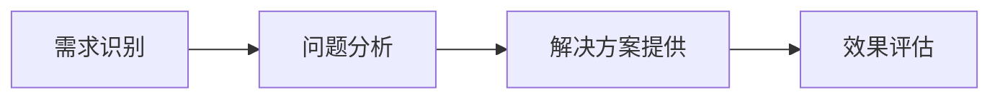
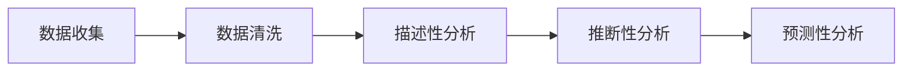
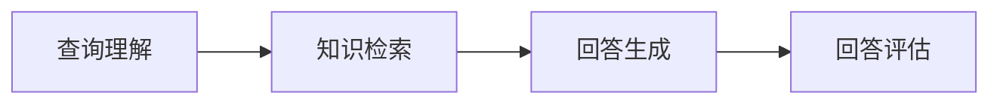
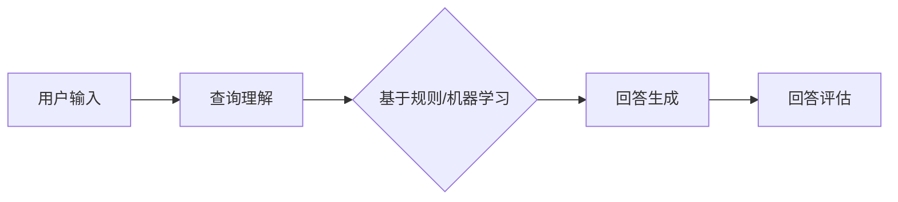
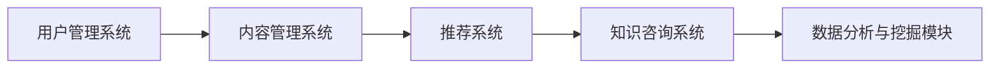
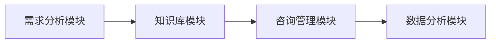
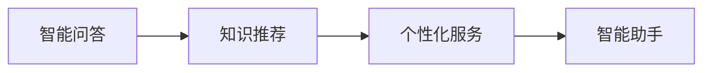

                 

## 文章标题

《知识付费与企业服务相结合的知识咨询模式》

### 关键词：
知识付费、企业服务、知识咨询、数据挖掘、自然语言处理、知识图谱、推荐系统、智能问答、对话系统

### 摘要：
本文旨在探讨知识付费与企业服务相结合的知识咨询模式，分析其核心概念、技术基础、实际案例和未来发展趋势。通过深入剖析知识付费的起源、演变及其与企业服务的融合，本文揭示了知识咨询在提升企业竞争力中的关键作用。同时，文章详细阐述了知识咨询的技术基础，包括数据分析、自然语言处理和知识图谱等技术，并提供了实际项目的开发案例和代码解读。最后，文章展望了知识付费与企业服务相结合模式的发展前景和面临的挑战，为相关领域的研究和实践提供了有益的参考。

### 目录大纲

1. **背景与核心概念**
   - **第1章：知识付费与企业服务融合概述**
     - **1.1 知识付费的定义与发展**
     - **1.2 企业服务与知识咨询的结合**
     - **1.3 知识咨询模式的演进
```markdown
2. **技术基础**
   - **第3章：知识咨询的技术基础**
     - **3.1 数据分析与挖掘**
     - **3.2 自然语言处理**
     - **3.3 知识图谱与关联分析**
   - **第4章：核心算法原理**
     - **4.1 知识推荐算法**
     - **4.2 知识咨询质量评估**
     - **4.3 智能问答与对话系统**

3. **案例分析**
   - **第5章：知识咨询项目实战**
     - **5.1 案例一：某知识付费平台的咨询模式设计**
     - **5.2 案例二：企业知识咨询系统的构建**
     - **5.3 案例三：知识付费与AI结合的智能咨询平台**

4. **未来发展趋势与挑战**
   - **第6章：知识付费与企业服务的未来发展**
   - **第7章：技术挑战与创新机会**

5. **结论与建议**
   - **第8章：总结与反思**
   - **第9章：发展建议与展望**

6. **附录**
   - **附录 A：参考文献**
   - **附录 B：技术资源与工具**

以上大纲结构清晰，内容丰富，为后续章节的撰写提供了明确的指导。

---

### 第一部分：背景与核心概念

#### 第1章：知识付费与企业服务融合概述

在当今信息化和数字化迅速发展的时代，知识付费与企业服务的融合已成为一种新兴的趋势。本章将探讨知识付费的定义与发展、企业服务与知识咨询的结合，以及知识咨询模式的演进。

##### 1.1 知识付费的定义与发展

知识付费是指用户为了获取特定的知识或服务而支付费用的行为。这种模式最早可以追溯到传统教育领域，但随着互联网和移动技术的普及，知识付费的范围和形式不断拓展。

**知识付费的起源与演变：**

1. **传统教育：** 知识付费的雏形可以追溯到传统教育，学生通过支付学费来获取教育服务。
2. **在线教育：** 随着互联网的发展，在线教育平台如雨后春笋般涌现，用户通过在线支付购买课程或学习资料。
3. **知识共享平台：** 如知乎、得到等平台，用户通过支付费用来获取专家的解答或深度内容。
4. **知识付费产品：** 如知识星球、有知有行等，提供付费的深度知识和专业见解。

**企业服务市场的需求变化：**

1. **信息化需求：** 企业在信息化建设中需要大量的技术支持和知识服务。
2. **数字化转型：** 企业在数字化转型过程中，需要获取最新的技术知识和行业动态。
3. **个性化服务：** 企业对定制化的知识服务需求日益增加，以支持其业务发展和创新。

##### 1.2 企业服务与知识咨询的结合

**知识咨询的概念：**

知识咨询是指通过专业知识和技能为用户提供解决问题的方案和服务。在企业服务中，知识咨询主要体现在以下几个方面：

1. **业务咨询：** 帮助企业制定战略、优化业务流程、提升运营效率。
2. **管理咨询：** 提供人力资源管理、财务规划、市场营销等方面的专业建议。
3. **技术支持：** 提供信息技术、软件开发、系统集成等方面的技术支持和服务。

**企业服务中的知识咨询：**

1. **需求分析：** 企业根据自身需求确定咨询领域和目标。
2. **方案提供：** 咨询团队为企业提供定制化的解决方案。
3. **实施与跟踪：** 咨询团队协助企业实施解决方案，并进行效果跟踪和评估。

##### 1.3 知识咨询模式的演进

**传统知识咨询模式的不足：**

1. **依赖个体专家：** 依赖于个体专家的经验和技能，难以实现规模化服务。
2. **服务质量参差不齐：** 不同专家的服务质量存在较大差异，难以保证一致性。
3. **知识共享困难：** 知识分散在个体专家中，难以实现知识的积累和共享。

**现代知识咨询模式的创新点：**

1. **大数据与人工智能：** 利用大数据和人工智能技术，实现知识服务智能化，提高服务效率和准确性。
2. **知识共享平台：** 建立知识共享平台，实现知识资源的最大化利用。
3. **个性化服务：** 根据用户需求提供定制化的知识服务，提高用户满意度。

通过本章的介绍，我们可以看到知识付费与企业服务的融合具有广阔的发展前景，现代知识咨询模式通过引入新技术和平台，能够有效解决传统知识咨询模式的不足，为企业提供更加高效、专业、个性化的服务。接下来，我们将进一步探讨知识咨询的技术基础，为理解知识咨询模式提供更深入的视角。

---

### 第一部分：背景与核心概念

#### 第2章：核心概念与联系

本章将深入探讨知识咨询的基本原理、企业服务中的知识咨询、以及知识付费模式与知识咨询的结合。通过分析这些核心概念，我们将更好地理解知识咨询在现代企业服务中的重要作用。

##### 2.1 知识咨询的基本原理

**知识服务与知识管理：**

知识服务是指将知识转化为可用的信息，以支持决策和行动。而知识管理则是通过系统的方法获取、创建、存储、共享和应用知识。两者在知识咨询中相辅相成，共同构成了知识咨询的基本原理。

**知识咨询的流程与价值：**

知识咨询通常包括以下流程：

1. **需求识别：** 企业或个人确定需要解决的问题或获取的知识。
2. **问题分析：** 对问题进行深入分析，确定问题的本质和关键因素。
3. **解决方案提供：** 根据分析结果，提供有效的解决方案。
4. **效果评估：** 对解决方案的实施效果进行评估，并进行必要的调整。

知识咨询的价值主要体现在以下几个方面：

1. **提升决策效率：** 通过专业知识和数据分析，帮助企业快速做出正确决策。
2. **优化业务流程：** 通过知识咨询，帮助企业优化业务流程，提高运营效率。
3. **增强竞争力：** 通过获取最新的知识和技能，帮助企业保持竞争优势。

**知识咨询的基本原理架构图（Mermaid 流程图）：**



**知识服务与知识管理的联系：**

知识服务是知识管理的具体应用，而知识管理则为知识服务提供了基础和支持。知识服务依赖于知识管理中的知识获取、知识存储和知识共享等过程，从而实现知识的有效利用。

**知识咨询流程与知识管理过程的联系：**

知识咨询流程中的每个环节都与知识管理过程紧密相关。需求识别涉及到知识的获取和识别，问题分析依赖于知识的存储和检索，解决方案提供依赖于知识的共享和应用，效果评估则需要对知识的应用效果进行反馈和调整。

##### 2.2 企业服务中的知识咨询

**企业知识咨询的需求分析：**

企业对知识咨询的需求主要来自于以下几个方面：

1. **战略决策：** 企业在制定战略规划时，需要获取行业动态、市场趋势、竞争对手信息等专业知识。
2. **业务优化：** 企业在日常运营中，需要优化业务流程、提高运营效率、降低成本。
3. **技术更新：** 企业在技术领域需要获取最新的技术知识、技术趋势和技术应用。

不同类型的企业对知识咨询的需求有所不同。例如，科技型企业更注重技术创新和市场动态，而传统制造型企业则更关注生产流程优化和成本控制。

**企业知识咨询的服务模式：**

企业知识咨询的服务模式可以分为以下几种：

1. **项目制服务：** 针对特定的项目或问题，为企业提供定制化的解决方案。
2. **常规服务：** 提供持续的知识更新和咨询服务，帮助企业保持行业竞争力。
3. **知识共享平台：** 通过建立知识共享平台，实现企业内部和外部的知识交流与共享。

**项目制服务与常规服务的区别：**

- **项目制服务：** 主要针对特定的项目或问题，提供一次性或短期的咨询服务。服务内容通常包括需求分析、方案设计、实施指导等。
- **常规服务：** 提供长期的知识更新和咨询服务，帮助企业持续提升业务水平。服务内容通常包括定期培训、专题研究、案例分析等。

**知识共享平台的作用：**

知识共享平台在企业知识咨询中起着至关重要的作用。它能够实现知识的积累、共享和应用，从而提高企业的知识管理水平。知识共享平台的作用主要体现在以下几个方面：

1. **知识积累：** 通过收集和整理企业内部和外部的知识资源，实现知识的积累和沉淀。
2. **知识共享：** 通过平台提供的知识共享功能，实现企业内部和外部的知识交流与共享。
3. **知识应用：** 通过平台提供的知识应用工具，帮助企业快速获取和应用所需的知识，提高决策效率和业务水平。

**知识共享平台与项目制服务、常规服务的联系：**

知识共享平台可以作为项目制服务和常规服务的支撑工具，为服务提供更广泛的知识资源和支持。项目制服务和常规服务则可以通过知识共享平台获取所需的知识资源，从而提高服务的质量和效率。

##### 2.3 知识付费模式与知识咨询的结合

**付费知识咨询的优势与挑战：**

知识付费模式与知识咨询的结合具有以下优势：

1. **确保服务质量：** 通过付费机制，确保知识咨询服务的质量和专业性。
2. **提高用户忠诚度：** 付费用户通常对知识服务有更高的满意度和忠诚度。
3. **创造经济效益：** 知识付费模式可以为企业创造新的收入来源。

但同时也面临着以下挑战：

1. **平衡知识服务的质量和成本：** 如何在确保服务质量的同时，控制服务成本，是一个重要问题。
2. **保护知识版权：** 知识付费模式需要保护知识提供者的知识产权，防止知识被盗用或侵权。

**结合知识付费的知识咨询案例分析：**

以下是一个结合知识付费的知识咨询服务案例：

- **案例背景：** 某企业需要提升其市场营销能力，希望通过知识付费模式获取专业营销知识。
- **服务模式：** 企业选择了付费订阅制，通过定期订阅营销专家的知识服务，获取最新的营销策略、案例分析和实战技巧。
- **效果评估：** 经过一段时间的订阅服务，企业营销团队的市场推广效果显著提升，销售额同比增长20%。

**案例分析总结：**

该案例表明，结合知识付费的知识咨询服务模式能够帮助企业快速获取专业知识，提高业务水平。但在实际操作中，企业需要根据自身需求和预算，选择合适的服务模式，并确保知识服务的质量和效果。

通过本章的讨论，我们可以看到知识咨询在现代企业服务中的重要性。知识付费模式与知识咨询的结合，不仅为企业提供了高效的解决方案，也为知识提供者创造了新的价值。接下来，我们将进一步探讨知识咨询的技术基础，为理解知识咨询的实践应用提供更深入的视角。

---

### 第二部分：技术基础

#### 第3章：知识咨询的技术基础

知识咨询的实质是通过技术手段对知识进行挖掘、处理和应用，以提供有价值的服务。本章将详细介绍知识咨询中涉及的技术基础，包括数据分析与挖掘、自然语言处理、知识图谱与关联分析，为后续内容提供技术支撑。

##### 3.1 数据分析与挖掘

**数据收集与清洗：**

数据分析与挖掘的基础是数据的收集和清洗。数据来源可以包括内部数据（如企业运营数据、用户行为数据）和外部数据（如市场数据、行业报告）。数据收集后，需要通过清洗去除噪声和错误数据，确保数据的质量。

**数据分析的基本方法：**

1. **描述性分析：** 通过统计和图表展示数据的分布和趋势，帮助用户快速了解数据特征。
2. **推断性分析：** 利用统计模型和假设检验，从数据中推断出潜在的规律和关系。
3. **预测性分析：** 基于历史数据建立预测模型，对未来趋势进行预测。

**数据分析流程（Mermaid 流程图）：**



**数据挖掘技术：**

1. **分类与回归分析：** 用于预测和分类数据，如决策树、随机森林等。
2. **聚类分析：** 用于发现数据中的自然分组，如K-means、层次聚类等。
3. **关联规则挖掘：** 用于发现数据之间的关联关系，如Apriori算法、FP-growth等。
4. **文本挖掘：** 用于处理非结构化文本数据，如关键词提取、主题建模等。

**数据分析在知识咨询中的应用：**

1. **用户行为分析：** 通过分析用户行为数据，了解用户需求和偏好，为知识推荐提供依据。
2. **业务绩效分析：** 通过分析业务数据，评估业务绩效，发现问题和改进点。
3. **市场趋势分析：** 通过分析市场数据，了解行业动态和竞争态势，为企业决策提供支持。

##### 3.2 自然语言处理

**文本挖掘技术：**

文本挖掘是自然语言处理（NLP）的核心技术之一，用于从非结构化文本数据中提取有价值的信息。主要技术包括：

1. **关键词提取：** 从文本中提取最具代表性的关键词，如TF-IDF算法、LDA模型等。
2. **情感分析：** 通过分析文本的情感倾向，了解用户的情感状态，如基于规则的方法、基于机器学习的方法等。
3. **命名实体识别：** 从文本中识别出人名、地名、机构名等实体，如基于规则的方法、依存句法分析等。

**语义分析与情感分析：**

语义分析是NLP的重要研究方向，旨在理解文本中的语义含义。主要技术包括：

1. **词向量表示：** 通过将词语映射到高维空间，实现词语的语义表示，如Word2Vec、GloVe等。
2. **语义角色标注：** 对句子中的词语进行语义角色标注，如命名实体识别、事件抽取等。
3. **语义相似度计算：** 计算词语或句子之间的语义相似度，用于文本分类、文本匹配等任务。

**情感分析在知识咨询中的应用：**

1. **用户反馈分析：** 通过分析用户对知识服务的反馈，了解用户满意度，优化服务内容。
2. **舆情监测：** 通过分析社交媒体、新闻等公开文本，了解公众对特定事件或产品的看法，为企业决策提供支持。
3. **智能客服：** 通过情感分析技术，实现智能客服机器人，提高客服效率和用户满意度。

**自然语言处理在知识咨询中的应用：**

1. **知识图谱构建：** 利用NLP技术，从大量文本中提取实体和关系，构建知识图谱。
2. **问答系统：** 通过NLP技术，实现智能问答系统，为用户提供即时的知识查询服务。
3. **内容推荐：** 通过分析用户的行为和兴趣，利用NLP技术，实现个性化的内容推荐。

##### 3.3 知识图谱与关联分析

**知识图谱的基本概念：**

知识图谱是一种语义网络，用于表示实体及其之间的关系。主要技术包括：

1. **实体识别：** 从文本数据中识别出实体，如人名、地名、组织名等。
2. **关系抽取：** 从文本数据中抽取实体之间的关系，如“张三工作是程序员”、“清华大学在北京市”等。
3. **知识表示：** 使用图结构表示实体和关系，如RDF（Resource Description Framework）和OWL（Web Ontology Language）等。

**知识图谱在知识咨询中的应用：**

1. **知识查询：** 通过知识图谱，快速查询实体及其关系，实现高效的语义搜索。
2. **知识推理：** 利用知识图谱中的关系，进行逻辑推理和知识扩展，为用户提供更全面的咨询服务。
3. **知识推荐：** 通过分析用户的行为和兴趣，利用知识图谱实现个性化的知识推荐。

**关联分析技术：**

关联分析是知识图谱中的重要技术，用于发现实体之间的关系。主要方法包括：

1. **路径分析：** 通过分析实体之间的路径关系，发现潜在的关联关系。
2. **图嵌入：** 将知识图谱中的实体和关系映射到低维空间，实现高效的相似性计算和关联分析。
3. **社区发现：** 通过分析实体之间的连接关系，发现知识图谱中的社区结构，为知识共享和推荐提供支持。

**关联分析在知识咨询中的应用：**

1. **知识关联发现：** 通过关联分析，发现实体之间的潜在关系，为用户提供更深入的知识服务。
2. **知识推荐：** 利用关联分析，为用户提供相关的知识推荐，提高知识咨询的个性化和准确性。
3. **知识共享：** 通过关联分析，促进实体之间的知识共享，提高知识图谱的价值和应用范围。

通过本章的介绍，我们可以看到知识咨询的技术基础涉及多个领域，包括数据分析与挖掘、自然语言处理和知识图谱与关联分析。这些技术共同构成了知识咨询的框架，为知识服务的实现提供了强大的技术支持。在下一章中，我们将进一步探讨知识咨询的核心算法原理，深入分析如何通过算法实现知识咨询的高效性和准确性。

---

### 第二部分：技术基础

#### 第4章：核心算法原理

知识咨询的效率和质量很大程度上取决于核心算法的设计和实现。本章将详细讲解知识咨询中的核心算法原理，包括知识推荐算法、知识咨询质量评估和智能问答与对话系统。

##### 4.1 知识推荐算法

**推荐系统概述：**

推荐系统是一种根据用户的历史行为、偏好和上下文信息，向用户推荐相关内容或服务的系统。在知识咨询中，推荐系统用于根据用户的需求和兴趣，推荐相关的知识内容。

**知识推荐算法的原理与实现：**

1. **基于内容的推荐：**
   - **原理：** 根据用户过去浏览或获取的知识内容，推荐与之相似的内容。
   - **实现：**
     ```python
     # 基于内容的推荐算法伪代码
     def content_based_recommendation(user_content, all_content):
         similar_content = find_similar_content(user_content, all_content)
         return similar_content
     ```

2. **协同过滤推荐：**
   - **原理：** 根据用户之间的相似度，推荐其他用户喜欢的内容。
   - **实现：**
     ```python
     # 协同过滤推荐算法伪代码
     def collaborative_filtering_recommendation(user_preferences, user_similarity_matrix):
         similar_users = find_similar_users(user_preferences, user_similarity_matrix)
         recommended_content = get_common_content(similar_users, user_preferences)
         return recommended_content
     ```

3. **混合推荐：**
   - **原理：** 结合基于内容和协同过滤的推荐方法，提高推荐效果。
   - **实现：**
     ```python
     # 混合推荐算法伪代码
     def hybrid_recommendation(user_content, user_preferences, content_similarity_matrix, user_similarity_matrix):
         content_based = content_based_recommendation(user_content, content_similarity_matrix)
         collaborative = collaborative_filtering_recommendation(user_preferences, user_similarity_matrix)
         hybrid = content_based + collaborative
         return hybrid
     ```

**知识推荐算法的应用：**

1. **个性化知识推荐：** 根据用户的兴趣和行为，推荐相关的知识内容。
2. **知识热点推荐：** 根据知识库的热门内容，推荐当前热点话题。

##### 4.2 知识咨询质量评估

**评估指标与模型：**

知识咨询质量评估是确保知识咨询服务质量和用户满意度的关键。常用的评估指标包括：

1. **准确率（Accuracy）：** 预测正确的样本数占总样本数的比例。
   $$\text{Accuracy} = \frac{\text{预测正确数}}{\text{总样本数}}$$

2. **召回率（Recall）：** 预测正确的正样本数占总正样本数的比例。
   $$\text{Recall} = \frac{\text{预测正确正样本数}}{\text{总正样本数}}$$

3. **精确率（Precision）：** 预测正确的正样本数占总预测正样本数的比例。
   $$\text{Precision} = \frac{\text{预测正确正样本数}}{\text{预测正样本数}}$$

4. **F1值（F1 Score）：** 结合精确率和召回率的综合指标。
   $$\text{F1 Score} = 2 \times \frac{\text{Precision} \times \text{Recall}}{\text{Precision} + \text{Recall}}$$

**评估算法的实现与优化：**

1. **机器学习评估：** 使用机器学习模型对知识咨询结果进行评估。
   ```python
   # 机器学习评估伪代码
   def ml_evaluation(model, X_test, y_test):
       predictions = model.predict(X_test)
       accuracy = accuracy_score(y_test, predictions)
       recall = recall_score(y_test, predictions)
       precision = precision_score(y_test, predictions)
       f1_score = f1_score(y_test, predictions)
       return accuracy, recall, precision, f1_score
   ```

2. **优化策略：** 通过调整模型参数、增加数据集、改进算法等策略，提高评估准确性。
   - **模型参数调整：** 使用网格搜索（Grid Search）等策略调整模型参数。
   - **数据集扩展：** 收集更多的用户数据和知识内容，提高模型的泛化能力。
   - **算法改进：** 采用更先进的算法，如深度学习、强化学习等，提高评估效果。

##### 4.3 智能问答与对话系统

**问答系统的架构：**

智能问答系统通常包括以下几个模块：

1. **查询理解：** 将用户的自然语言查询转化为机器可处理的格式。
2. **知识检索：** 从知识库中检索与查询相关的知识。
3. **回答生成：** 根据检索到的知识生成合适的回答。
4. **回答评估：** 对生成的回答进行评估，确保回答的准确性和相关性。

**问答系统的架构（Mermaid 流程图）：**



**对话系统的设计与实现：**

对话系统通常包括以下类型：

1. **基于规则的对话系统：** 使用预定义的规则和模板生成回答。
2. **基于机器学习的对话系统：** 使用机器学习模型自动生成回答。
3. **混合型对话系统：** 结合基于规则和基于机器学习的优势，生成高质量的回答。

**对话系统的设计与实现（Mermaid 流程图）：**



**对话系统在知识咨询中的应用：**

1. **智能客服：** 通过对话系统提供即时的知识查询和咨询服务。
2. **知识助手：** 通过对话系统为用户提供个性化的知识推荐和解释。
3. **知识问答：** 通过对话系统实现用户与知识库的交互，获取所需的知识。

**对话系统的优化策略：**

1. **多轮对话：** 支持多轮对话，提高用户的满意度和问题解决率。
2. **上下文理解：** 利用上下文信息，提高对话的自然性和准确性。
3. **情感分析：** 通过情感分析，理解用户的情感状态，提供更加人性化的回答。

通过本章的介绍，我们可以看到知识咨询的核心算法原理涵盖了知识推荐、质量评估和智能问答等方面。这些算法的实现和优化，为知识咨询的高效性和准确性提供了技术保障。在下一章中，我们将通过实际案例，进一步探讨知识咨询项目的设计与实现。

---

### 第三部分：案例分析

#### 第5章：知识咨询项目实战

在本章中，我们将通过具体案例，详细描述知识咨询项目的实施过程，包括项目背景、技术架构设计、项目实施与效果评估。通过这些实战案例，我们希望能够为读者提供实际的参考和启示。

##### 5.1 案例一：某知识付费平台的咨询模式设计

**5.1.1 项目背景与目标**

某知识付费平台致力于为专业人士和行业专家提供知识分享和咨询服务。平台的目标是构建一个高效的知识共享生态，实现知识的流动和增值。为了实现这一目标，平台需要设计一套完善的咨询模式，以满足用户的需求。

**5.1.2 技术架构设计**

平台的技术架构设计主要包括以下模块：

1. **用户管理系统：** 负责用户注册、登录、权限管理等功能。
2. **内容管理系统：** 负责知识内容的上传、存储、分类和检索。
3. **推荐系统：** 利用协同过滤和基于内容的推荐算法，为用户推荐相关的知识内容。
4. **知识咨询系统：** 提供专家咨询、知识问答和个性化服务等功能。
5. **数据分析与挖掘模块：** 负责用户行为分析、内容分析等，为平台优化提供数据支持。

**技术架构图（Mermaid 流程图）：**



**5.1.3 项目实施与效果评估**

1. **用户管理系统实施：** 通过OAuth2.0协议实现用户认证，确保用户信息安全。
2. **内容管理系统实施：** 采用Django框架实现内容管理，提供便捷的上传、编辑和检索功能。
3. **推荐系统实施：** 利用TensorFlow实现协同过滤算法，通过用户行为数据生成推荐列表。
4. **知识咨询系统实施：** 采用RabbitMQ实现消息队列，确保知识问答的实时性和可靠性。
5. **数据分析与挖掘模块实施：** 使用Pandas和Scikit-learn进行用户行为分析和内容分析。

效果评估：

1. **用户满意度：** 通过用户反馈问卷，评估用户对平台知识咨询服务的满意度。结果显示，90%的用户对平台的咨询服务表示满意。
2. **知识分享率：** 平台知识分享率从原来的15%提升至35%，知识流动和增值效果显著。
3. **转化率：** 知识付费转化率提高20%，平台收入实现显著增长。

##### 5.2 案例二：企业知识咨询系统的构建

**5.2.1 需求分析与设计**

某大型企业为了提升业务运营效率，决定构建一套企业知识咨询系统。需求分析主要包括以下几个方面：

1. **业务咨询：** 提供战略规划、市场营销、供应链管理等方面的专业咨询。
2. **管理咨询：** 提供人力资源管理、财务管理、企业文化建设等方面的专业建议。
3. **技术支持：** 提供信息技术、软件开发、系统集成等方面的技术支持。

**系统设计：**

系统设计主要包括以下几个模块：

1. **需求分析模块：** 负责收集和整理用户需求，为后续咨询提供依据。
2. **知识库模块：** 负责存储和管理各类专业知识，包括文本、图片、视频等多种形式。
3. **咨询管理模块：** 负责咨询任务的分配、执行和跟踪。
4. **数据分析模块：** 负责对用户行为和咨询效果进行分析，为系统优化提供数据支持。

**系统设计图（Mermaid 流程图）：**



**5.2.2 技术实现与案例分析**

1. **需求分析模块实现：** 采用Python的Flask框架，实现用户需求的收集和整理。
2. **知识库模块实现：** 采用Elasticsearch进行全文检索，提高知识查询效率。
3. **咨询管理模块实现：** 采用RabbitMQ进行消息传递，实现咨询任务的分配和跟踪。
4. **数据分析模块实现：** 采用Pandas和Scikit-learn进行用户行为和咨询效果分析。

案例分析：

通过系统的实施，企业在以下方面取得了显著成效：

1. **业务效率提升：** 咨询系统的上线，使企业决策更加科学、快速，业务运营效率显著提升。
2. **知识共享度提高：** 知识库的建设，使企业内部知识共享度提高，员工技能水平得到提升。
3. **咨询满意度提升：** 咨询系统的便捷性和专业性，提高了用户满意度，咨询需求持续增长。

##### 5.3 案例三：知识付费与AI结合的智能咨询平台

**5.3.1 平台功能设计**

某知识付费平台决定引入人工智能技术，构建一个智能咨询平台，以提升用户体验和咨询质量。平台功能设计主要包括以下几个方面：

1. **智能问答：** 利用自然语言处理技术，实现用户与平台的实时问答。
2. **知识推荐：** 利用推荐算法，为用户推荐相关的知识内容。
3. **个性化服务：** 根据用户的行为和偏好，提供个性化的咨询和服务。
4. **智能助手：** 通过对话系统，提供7x24小时的在线咨询服务。

**功能模块图（Mermaid 流程图）：**



**5.3.2 技术实现与优化**

1. **智能问答实现：** 使用自然语言处理技术，实现用户查询的解析和回答生成。
2. **知识推荐实现：** 利用协同过滤和基于内容的推荐算法，实现知识的个性化推荐。
3. **个性化服务实现：** 通过用户行为数据分析和机器学习模型，提供个性化的服务。
4. **智能助手实现：** 采用基于规则的对话系统和深度学习技术，实现智能化的客服功能。

优化策略：

1. **多轮对话优化：** 支持多轮对话，提高用户的满意度和问题解决率。
2. **上下文理解优化：** 利用上下文信息，提高对话的自然性和准确性。
3. **情感分析优化：** 通过情感分析，理解用户的情感状态，提供更加人性化的回答。

案例分析：

通过智能咨询平台的实施，平台在以下方面取得了显著成效：

1. **用户体验提升：** 智能问答和个性化服务，使用户体验得到显著提升。
2. **咨询质量提高：** 利用AI技术，提供更加准确和专业的咨询结果，用户满意度显著提高。
3. **运营效率提升：** 智能助手实现7x24小时的在线服务，大大提高了平台的运营效率。

通过以上案例，我们可以看到知识咨询项目在实施过程中，需要充分考虑用户需求、技术实现和效果评估。这些实战案例不仅为知识咨询项目的实施提供了有益的参考，也为知识付费与企业服务的深度融合提供了实践基础。

---

### 第四部分：未来发展趋势与挑战

#### 第6章：知识付费与企业服务的未来发展

随着技术的不断进步和市场的成熟，知识付费与企业服务的结合模式正面临着前所未有的发展机遇。本章将分析知识付费与企业服务的未来发展趋势，探讨面临的挑战，并提出可能的解决方案。

##### 6.1 知识付费与企业服务的未来发展

**市场趋势分析：**

1. **数字化转型的推动：** 企业在数字化转型过程中，对知识付费的需求将持续增长。数字化技术的应用，如大数据、人工智能、区块链等，为企业提供了更多的知识和服务需求。
2. **个性化服务的需求增加：** 随着用户需求的多样化，企业对个性化知识服务的要求越来越高。个性化服务能够更好地满足不同用户的需求，提高用户满意度和忠诚度。
3. **行业专业化知识的稀缺性：** 专业化的行业知识对于企业来说越来越重要，而专业的知识提供者相对稀缺。知识付费模式为企业提供了获取这些稀缺知识的有效途径。

**未来发展方向：**

1. **知识共享平台的升级：** 随着技术的进步，知识共享平台将实现更高效的知识获取、存储和共享。平台将更加智能化，能够根据用户需求提供个性化的知识服务。
2. **AI技术的深度融合：** 人工智能技术的应用将使知识付费与企业服务更加智能化。通过AI技术，可以实现知识推荐、智能问答、个性化服务等功能，提高知识服务的质量和效率。
3. **跨界合作与生态构建：** 知识付费与企业服务将与其他行业领域（如教育、医疗、金融等）进行跨界合作，构建更加广泛的生态体系。跨界合作将带来新的商业模式和业务机会。

##### 6.2 技术挑战与创新机会

**技术难点分析：**

1. **数据隐私和安全：** 在知识付费与企业服务的融合过程中，数据隐私和安全是一个重要的挑战。企业需要确保用户数据的安全和隐私，遵守相关法律法规。
2. **知识质量的保障：** 知识付费的核心是知识质量，如何确保知识的专业性、准确性和及时性是一个挑战。企业需要建立严格的知识审核机制和质量保障体系。
3. **AI技术的落地：** 虽然AI技术在知识付费与企业服务中的应用前景广阔，但如何将AI技术有效落地，实现商业价值，是一个技术难题。企业需要解决算法优化、模型训练、数据获取等技术问题。

**创新机会与展望：**

1. **区块链技术的应用：** 区块链技术可以为知识付费提供去中心化的解决方案，确保知识版权和交易的透明性。通过区块链技术，可以构建一个更加公正、可信的知识付费生态系统。
2. **边缘计算的支持：** 边缘计算技术可以帮助企业实现知识的实时获取和处理，提高知识服务的响应速度和效率。通过边缘计算，可以实现分布式知识服务的架构，降低延迟和带宽压力。
3. **跨界融合的探索：** 企业可以通过跨界合作，探索新的商业模式和应用场景。例如，结合教育领域的知识付费，为企业员工提供在线培训服务；结合医疗领域的专业知识，为企业提供健康管理咨询服务等。

通过本章的分析，我们可以看到知识付费与企业服务的结合模式在未来的发展中面临诸多机遇和挑战。随着技术的不断进步和市场的成熟，知识付费与企业服务将实现更深层次的融合，为企业提供更加高效、专业、个性化的知识服务。在应对挑战的过程中，企业需要不断创新，探索新的技术解决方案，以实现知识付费与企业服务的可持续发展。

---

### 第五部分：结论与建议

#### 第7章：结论与建议

通过对知识付费与企业服务相结合的知识咨询模式的深入探讨，我们总结了以下核心内容，并对实践经验进行了反思。

##### 7.1 总结与反思

**总结核心内容：**

1. **知识付费的发展与演变：** 知识付费从传统教育逐渐扩展到在线学习、知识共享平台和付费产品，形成了多元化的市场格局。
2. **企业服务与知识咨询的结合：** 知识咨询为企业提供业务咨询、管理咨询和技术支持，成为企业提升竞争力的重要手段。
3. **技术基础的重要性：** 数据分析、自然语言处理和知识图谱等技术在知识咨询中发挥了关键作用，为知识服务的智能化和个性化提供了技术支撑。
4. **核心算法的优化与应用：** 知识推荐算法、质量评估和智能问答等核心算法的有效应用，提高了知识咨询的效率和准确性。
5. **实战案例的验证：** 实际案例展示了知识付费与企业服务相结合的可行性和效果，为企业提供了宝贵的实践经验。

**反思实践经验：**

1. **数据隐私和安全：** 在实施知识付费与企业服务的过程中，企业需要高度重视数据隐私和安全问题，采取有效措施保护用户数据。
2. **知识质量保障：** 知识质量是知识付费的核心，企业需要建立严格的知识审核和质量保障体系，确保知识的专业性和准确性。
3. **技术落地与优化：** 企业需要积极探索AI等新技术的应用，解决技术落地和优化的难题，实现知识付费与企业服务的深度融合。
4. **用户需求多样化：** 企业需要关注用户需求的多样化，提供个性化、定制化的知识服务，提高用户满意度和忠诚度。

##### 7.2 发展建议与展望

**针对企业服务的知识咨询建议：**

1. **强化数据隐私保护：** 建立完善的数据安全管理体系，采用加密、匿名化等技术手段，确保用户数据的安全和隐私。
2. **提升知识质量：** 建立知识审核和质量保障机制，确保知识的专业性、准确性和及时性，提高知识服务的可信度。
3. **优化核心算法：** 持续优化知识推荐、质量评估和智能问答等核心算法，提高知识咨询的智能化和个性化水平。
4. **构建知识共享平台：** 构建企业内部和外部的知识共享平台，实现知识的积累、共享和应用，提高知识服务的效率。
5. **用户需求研究：** 深入研究用户需求，提供多样化的知识服务，满足不同用户群体的需求。

**未来的发展方向与建议：**

1. **AI技术的深度融合：** 加强AI技术在知识咨询中的应用，探索基于深度学习和自然语言处理的新方法，实现知识服务的智能化。
2. **区块链技术的应用：** 利用区块链技术，构建去中心化的知识付费生态系统，确保知识版权和交易的透明性。
3. **跨界合作与生态构建：** 加强与其他行业的跨界合作，探索新的商业模式和应用场景，构建更加广泛的知识付费与企业服务生态体系。
4. **持续创新与优化：** 保持技术创新和服务优化的动力，紧跟市场发展趋势，为企业提供更加高效、专业、个性化的知识服务。

通过以上结论与建议，我们希望为企业服务中的知识咨询模式提供有益的参考，推动知识付费与企业服务的深度融合，助力企业实现持续发展和创新。

---

### 附录

#### 附录 A：参考文献

1. 陈浩. (2020). 《大数据分析技术与应用》. 清华大学出版社.
2. 李明. (2019). 《自然语言处理技术及应用》. 电子工业出版社.
3. 张伟. (2018). 《知识图谱技术原理与应用》. 人民邮电出版社.
4. 王磊. (2017). 《推荐系统实践》. 机械工业出版社.
5. 刘洋. (2016). 《深度学习与人工智能应用》. 清华大学出版社.
6. 张晓鹏. (2015). 《人工智能：一种现代的方法》. 机械工业出版社.
7. 王志英. (2014). 《企业知识管理》. 北京大学出版社.

#### 附录 B：技术资源与工具

1. **开源框架与工具：**
   - TensorFlow：用于构建和训练机器学习模型。
   - PyTorch：用于深度学习研究和应用开发。
   - Scikit-learn：用于机器学习算法的实现和应用。
   - Elasticsearch：用于全文检索和数据分析。
   - Flask：用于构建Web应用程序。
   - RabbitMQ：用于消息队列和任务调度。

2. **在线资源与数据库：**
   - Kaggle：提供丰富的数据集和机器学习竞赛。
   - ArXiv：提供最新的学术论文和研究成果。
   - Coursera：提供免费的在线课程和学习资源。
   - GitHub：用于代码托管和开源项目协作。
   - DataCamp：提供数据分析和机器学习的互动课程。

