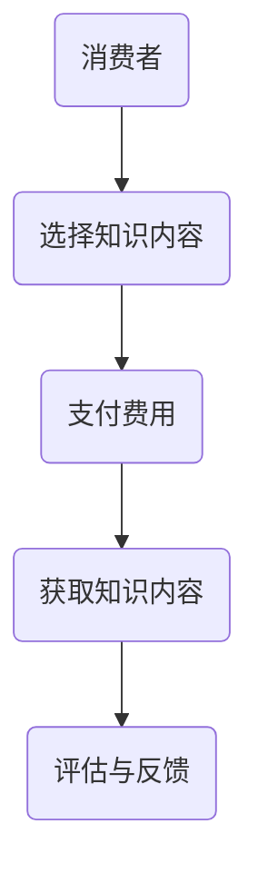
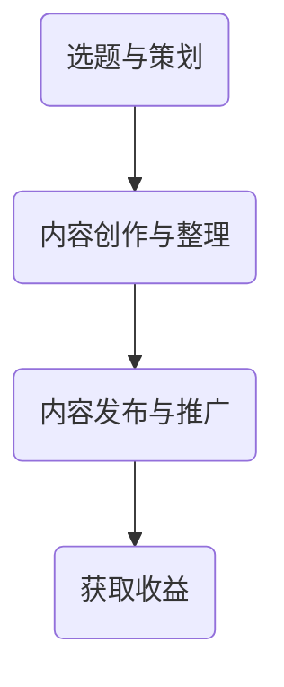
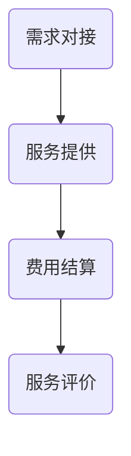

                 

# 《知识付费：程序员的新型赚钱方式》

## 关键词
- 程序员
- 知识付费
- 在线教育
- 内容创作
- 营销策略
- 知识产权

## 摘要
本文将探讨知识付费这一新兴模式如何成为程序员的新型赚钱方式。通过分析知识付费的基本概念、模式，以及程序员在这一领域的定位和实际操作，本文旨在为程序员提供一套系统的知识付费策略，帮助他们利用自身专业技能获取更多收益。同时，本文还将探讨知识付费市场面临的挑战和未来发展趋势。

### 第1章 引言：知识付费时代的程序员

#### 1.1 程序员赚钱方式的演变
程序员作为IT行业的重要组成部分，其赚钱方式随着行业的发展也在不断演变。从最早的工资制到项目制，再到自由职业和创业，程序员的选择越来越多样化。然而，这些传统的赚钱方式都有一定的局限性，如收入不稳定、工作时间过长等。

随着互联网的普及和在线教育的发展，知识付费逐渐成为程序员的一种新型赚钱方式。知识付费不仅让程序员能够通过分享知识和经验获得收益，还为他们提供了一个展示自我价值的平台。

#### 1.2 知识付费的兴起
知识付费的概念起源于20世纪末，随着互联网技术的发展，知识付费逐渐成为一种普遍现象。在知识付费模式下，知识生产者和消费者通过在线平台进行交易，消费者为获取知识支付费用。

知识付费的兴起主要得益于以下几个因素：
1. 在线教育的快速发展，使得学习变得更加便捷和高效。
2. 信息爆炸的时代，人们更加重视优质知识的获取。
3. 程序员等专业人士拥有丰富的知识和经验，有能力提供有价值的内容。

#### 1.3 程序员如何通过知识付费赚钱
程序员可以通过以下几种方式通过知识付费赚钱：

1. **在线教育平台**：在诸如Coursera、Udemy等在线教育平台上创建和销售自己的课程。
2. **专业咨询与培训服务**：为企业或个人提供专业的技术咨询服务或培训服务。
3. **内容创作与分享平台**：在知乎、简书等平台上发表技术文章或创作技术博客，通过广告收入、打赏等方式获得收益。

#### 1.4 本书结构概述
本书将分为八个章节，分别从知识付费的基本概念、程序员的定位、实际操作、营销策略、挑战与应对、成功案例分析、未来趋势等方面进行探讨。通过系统化的讲解，帮助程序员更好地利用知识付费实现财富增长。

### 第2章 知识付费的基本概念与模式

#### 2.1 知识付费的定义与特点

知识付费是指消费者为获取知识、技能或经验而支付的费用。与传统付费模式相比，知识付费具有以下特点：

1. **个性化**：知识付费根据消费者的需求和兴趣提供个性化内容。
2. **高质量**：知识付费内容通常由专业人士或领域专家提供，具有较高质量。
3. **便捷性**：消费者可以通过互联网随时随地进行学习。
4. **互动性**：知识付费平台通常提供互动功能，如提问、讨论等，增强学习体验。

#### 2.1.1 知识付费的基本流程

以下是一个知识付费的基本流程：



#### 2.1.2 知识付费与传统付费的差异

知识付费与传统付费的主要差异在于：

1. **支付目的**：传统付费主要为了获得产品或服务，而知识付费主要为了获取知识。
2. **内容形式**：传统付费内容通常为实体产品或服务，而知识付费内容通常为数字化产品或服务。
3. **使用方式**：传统付费内容通常一次性使用，而知识付费内容可以反复学习。

#### 2.2 知识付费的主要模式

知识付费的主要模式包括以下几种：

1. **在线教育平台**：在线教育平台如Coursera、Udemy等，为学习者提供各种课程，学习者通过购买课程来获取知识。
2. **专业咨询与培训服务**：专业人士或机构为企业或个人提供专业的技术咨询服务或培训服务，通过收取咨询费或培训费获得收益。
3. **内容创作与分享平台**：如知乎、简书等平台，创作者通过发表高质量的内容吸引读者，通过广告收入、打赏等方式获得收益。

#### 2.2.1 在线教育平台的运作模式

在线教育平台的主要运作模式如下：

1. **课程开发**：平台邀请专业人士或机构开发课程。
2. **课程发布**：课程通过平台发布，供学习者购买。
3. **课程销售**：学习者通过支付费用购买课程。
4. **课程评价**：学习者对课程进行评价，以供其他学习者参考。

#### 2.2.2 专业咨询与培训服务的运作模式

专业咨询与培训服务的运作模式如下：

1. **需求对接**：企业或个人通过平台发布需求，寻找合适的咨询师或培训机构。
2. **服务提供**：咨询师或培训机构根据需求提供相应的咨询服务或培训服务。
3. **费用结算**：咨询师或培训机构通过平台收取咨询费或培训费。
4. **服务评价**：客户对咨询师或培训机构的服务进行评价。

#### 2.2.3 内容创作与分享平台的运作模式

内容创作与分享平台的主要运作模式如下：

1. **内容创作**：创作者在平台上发表自己的原创内容。
2. **内容审核**：平台对内容进行审核，确保内容的质量和合规性。
3. **内容发布**：审核通过的内容在平台发布，供用户浏览。
4. **收益分配**：平台通过广告收入、用户打赏等方式为创作者分配收益。

### 第3章 程序员在知识付费领域的定位

#### 3.1 程序员的知识付费能力评估

程序员在知识付费领域的定位取决于其知识付费能力。以下是对程序员知识付费能力评估的两个关键方面：

##### **3.1.1 技术深度**

技术深度是程序员在知识付费领域的重要能力之一。以下是一个简单的伪代码示例，用于评估程序员的技能水平：

```python
def evaluate_skills programmer:
    # 初始化技能分数
    skill_score = 0
    
    # 检查程序员是否熟悉常见的编程语言
    if programmer.knowledge_of_languages:
        skill_score += 20
    
    # 检查程序员是否熟悉主流框架和库
    if programmer.familiarity_with_frameworks:
        skill_score += 30
    
    # 检查程序员是否具备解决复杂问题的能力
    if programmer.problem_solving_ability:
        skill_score += 40
    
    # 返回技能分数
    return skill_score
```

##### **3.1.2 教学能力**

教学能力是程序员在知识付费领域的另一关键能力。以下是一个简单的分析，用于评估程序员的授课技巧和表达能力：

- **授课技巧**：程序员需要具备清晰的教学流程，能够将复杂的技术概念以简单易懂的方式传授给学员。
- **表达能力**：程序员需要具备良好的沟通能力，能够有效地与学员进行互动和反馈。

#### 3.2 程序员在知识付费市场中的角色

程序员在知识付费市场中的角色可以多样化，主要包括以下两个方面：

##### **3.2.1 内容创作者**

作为内容创作者，程序员可以在在线教育平台上创建和销售自己的课程，或是在内容创作与分享平台上发表技术博客和文章。以下是一个简单的流程图，展示程序员如何创作有价值的技术内容：



##### **3.2.2 顾问与导师**

作为顾问与导师，程序员可以为个人或企业提供专业的技术咨询服务或培训服务。以下是一个简单的流程图，展示程序员如何提供专业咨询服务：



### 第4章 程序员知识付费的实际操作

#### 4.1 程序员如何准备知识付费内容

##### **4.1.1 内容选题与策划**

内容选题与策划是程序员准备知识付费内容的第一步。以下是一个简单的选题方法和策划流程：

1. **确定目标受众**：明确你的课程或内容面向的是初学者、中级开发者还是高级开发者。
2. **研究市场需求**：通过市场调研了解受众的需求，选择热门但竞争不激烈的主题。
3. **评估自身优势**：根据自身的技术特长和教学经验，选择自己最擅长和最有信心教授的主题。
4. **策划课程大纲**：制定详细的教学大纲，包括课程目标、章节内容、实践项目等。

##### **4.1.2 内容创作与整理**

内容创作与整理是程序员准备知识付费内容的关键环节。以下是一些基本技巧和注意事项：

1. **结构清晰**：确保课程内容有良好的逻辑结构，便于学员理解。
2. **语言简洁**：使用简单易懂的语言，避免使用过于复杂的术语和语法。
3. **案例丰富**：通过实际案例来解释技术概念，提高内容的实用性和吸引力。
4. **实践项目**：设计实际操作项目，帮助学员将知识应用到实践中。
5. **持续更新**：根据学员反馈和市场变化，不断更新和优化课程内容。

#### 4.2 知识付费平台的选用与运营

##### **4.2.1 平台选择**

选择合适的知识付费平台对于程序员的成功至关重要。以下是比较不同知识付费平台的优缺点：

- **优点**：
  - **Udemy**：课程种类丰富，适合初学者。
  - **Coursera**：与知名大学合作，课程质量高。
  - **知乎**：社区氛围好，利于内容传播和互动。
  - **简书**：写作门槛低，适合创作长篇内容。

- **缺点**：
  - **Udemy**：课程价格竞争激烈，利润较低。
  - **Coursera**：课程费用较高，受众有限。
  - **知乎**：流量分散，内容难以形成独立品牌。
  - **简书**：广告收益较低，适合长期积累。

##### **4.2.2 账号注册与设置**

在知识付费平台上注册账号并设置是程序员开始知识付费的第一步。以下是一些关键步骤：

1. **选择平台**：根据内容类型和目标受众选择合适的平台。
2. **注册账号**：提供真实的个人信息，确保账号安全。
3. **完善个人资料**：包括头像、简介、擅长领域等，提升账号的专业度。
4. **设置课程**：确定课程标题、描述、价格等，确保课程易于被搜索和购买。

##### **4.2.3 内容发布与推广**

内容发布与推广是程序员获取收益的关键环节。以下是一些技巧和策略：

1. **发布内容**：按照平台规定的时间和频率发布课程或文章。
2. **标题优化**：使用吸引人的标题，提高点击率。
3. **描述优化**：撰写详细且具有吸引力的课程或文章描述。
4. **推广策略**：利用社交媒体、博客、论坛等渠道进行推广，提高课程或文章的曝光率。
5. **互动互动**：积极与学员互动，回答问题，提升学员满意度。

### 第5章 程序员知识付费的营销策略

#### 5.1 知识付费内容营销

##### **5.1.1 个人品牌建设**

个人品牌建设是程序员在知识付费领域取得成功的关键因素之一。以下是一些策略：

1. **专业形象**：保持专业的形象，包括头像、签名、介绍等。
2. **优质内容**：持续输出高质量的内容，建立专业声誉。
3. **社交媒体**：利用社交媒体平台，如微博、微信公众号等，扩大影响力。
4. **专业认证**：获取相关领域的专业认证，增加可信度。
5. **互动互动**：与学员、同行保持互动，建立良好的人脉关系。

##### **5.1.2 社交媒体营销**

社交媒体营销是推广知识付费内容的重要手段。以下是一些具体策略：

1. **内容规划**：制定内容发布计划，保持定期更新。
2. **互动互动**：积极回复评论和私信，与粉丝互动。
3. **跨平台推广**：在多个社交媒体平台上进行内容分享，增加曝光率。
4. **利用热点**：结合热点话题，制作相关内容，吸引关注。
5. **合作合作**：与其他领域的KOL或品牌合作，扩大影响力。

#### 5.2 程序员知识付费的变现方式

##### **5.2.1 订阅模式**

订阅模式是程序员知识付费的一种常见变现方式。以下是一些关键策略：

1. **定价策略**：根据课程质量、受众需求等因素合理定价。
2. **订阅期限**：提供不同期限的订阅选项，如月度订阅、季度订阅等。
3. **增值服务**：提供额外的增值服务，如实时问答、专属辅导等，提高用户粘性。
4. **优惠促销**：定期推出优惠活动，吸引新用户订阅。

##### **5.2.2 付费课程**

付费课程是程序员知识付费的另一种重要变现方式。以下是一些关键策略：

1. **课程设计**：设计具有吸引力的课程，确保内容有价值。
2. **课程定价**：合理定价，确保收益最大化。
3. **课程推广**：利用各种渠道进行课程推广，提高曝光率。
4. **学员反馈**：收集学员反馈，不断优化课程内容。

### 第6章 程序员知识付费的挑战与应对

#### 6.1 知识付费市场的竞争态势

知识付费市场的竞争态势日益激烈，程序员面临着来自多方面的挑战。以下是对主要竞争对手的分析和应对策略：

##### **6.1.1 竞争对手分析**

1. **大型在线教育平台**：如Coursera、Udemy等，拥有庞大的用户基础和丰富的课程资源。
   - **特点**：课程质量高，知名度高，用户粘性强。
   - **应对策略**：提供高质量、差异化的课程内容，建立专业品牌形象。

2. **垂直领域专家**：在某些特定领域具有深厚的专业知识，如算法、大数据等。
   - **特点**：专业性强，课程内容深入。
   - **应对策略**：专注于自己的专业领域，提供具有针对性的课程。

3. **技术社区和博客**：如知乎、简书等，以技术文章和博客为主。
   - **特点**：内容丰富，互动性强。
   - **应对策略**：利用社区影响力，增加内容曝光率，通过广告和打赏获得收益。

##### **6.1.2 市场定位与差异化**

在激烈的市场竞争中，程序员需要找到自己的市场定位，并提供差异化的课程内容。以下是一些建议：

1. **垂直领域定位**：专注于某个特定的技术领域，如人工智能、区块链等。
2. **内容差异化**：提供独特的视角、实战经验和案例分析，提高课程的价值。
3. **互动差异化**：提供额外的互动服务，如实时问答、专属辅导等，提升用户体验。

#### 6.2 程序员知识付费的知识产权保护

知识产权保护是程序员在知识付费领域面临的另一大挑战。以下是一些基本概念和保护措施：

##### **6.2.1 知识产权的基本概念**

1. **版权**：对作品的原创性进行保护，防止未经授权的使用和传播。
2. **商标**：用于标识商品或服务的独特标识，防止他人恶意注册。
3. **专利**：对技术方案进行保护，防止他人侵犯。
4. **商业秘密**：对未公开的商业信息进行保护，防止泄露和滥用。

##### **6.2.2 知识产权保护措施**

1. **版权登记**：将课程内容进行版权登记，确保版权归属明确。
2. **加密技术**：使用加密技术保护课程内容的完整性，防止非法复制和传播。
3. **监控与举报**：定期监控课程的使用情况，发现侵权行为及时举报和维权。
4. **合作协议**：与平台和学员签订合作协议，明确双方的权利和义务。

### 第7章 知识付费项目的成功案例分析

#### 7.1 成功案例分析

以下是对两个知识付费项目的成功案例分析：

##### **7.1.1 案例一：XX程序员的知识付费之路**

XX程序员通过在线教育平台创建了一系列编程课程，包括Python基础、Web开发等。以下是其成功经验：

1. **内容策划**：结合自身经验和市场需求，选择了热门且竞争不激烈的课程主题。
2. **课程设计**：注重课程结构的逻辑性和实用性，通过丰富的案例和实战项目增强课程吸引力。
3. **互动互动**：积极与学员互动，回答问题，提高学员满意度。
4. **推广策略**：利用社交媒体和博客进行内容推广，提高课程曝光率。
5. **持续优化**：根据学员反馈和市场变化，不断优化课程内容和推广策略。

##### **7.1.2 案例二：YY培训机构的商业模式**

YY培训机构专注于企业级培训服务，为大型企业提供定制化的技术培训。以下是其成功经验：

1. **市场定位**：专注于企业级培训市场，提供高质量、差异化的课程内容。
2. **客户关系**：建立良好的客户关系，通过定期回访和满意度调查提高客户满意度。
3. **服务创新**：推出实时问答、专属辅导等增值服务，提升客户体验。
4. **合作合作**：与知名企业合作，扩大品牌影响力。
5. **持续创新**：根据企业需求和技术发展，不断更新和优化课程内容。

#### 7.2 案例启示与经验总结

从以上成功案例中，我们可以得出以下启示和经验：

1. **内容为王**：优质的内容是知识付费项目的核心，程序员需要注重课程的设计和策划。
2. **互动互动**：与学员保持良好的互动，提高学员的满意度和参与度。
3. **推广策略**：利用各种渠道进行内容推广，提高课程的曝光率。
4. **市场定位**：找到自己的市场定位，提供差异化的课程内容。
5. **客户关系**：建立良好的客户关系，提高客户满意度。
6. **持续创新**：根据市场需求和技术发展，不断优化课程内容和推广策略。

### 第8章 程序员知识付费的未来趋势

#### 8.1 行业发展趋势

知识付费行业正处于快速发展阶段，未来几年有望继续保持高速增长。以下是一些重要的发展趋势：

1. **技术进步**：人工智能、虚拟现实、区块链等新技术的应用将进一步提升知识付费的互动性和体验。
2. **市场规模扩大**：随着人们对优质知识的渴求不断增长，知识付费市场规模将继续扩大。
3. **个性化学习**：个性化学习将成为知识付费领域的重要趋势，平台将提供更多针对个体需求的课程和服务。
4. **跨界融合**：知识付费将与教育、娱乐、社交等多个领域进行融合，形成新的商业模式。

#### 8.2 程序员的职业发展路径

知识付费为程序员提供了丰富的职业发展机会。以下是一些可能的职业发展路径：

1. **课程讲师**：成为在线教育平台的课程讲师，通过教学实现职业价值。
2. **技术顾问**：为企业提供专业的技术咨询服务，成为技术专家。
3. **内容创作者**：在内容创作与分享平台上发表技术文章和博客，成为领域内的意见领袖。
4. **平台运营者**：参与知识付费平台的运营，推动平台的发展和优化。
5. **跨界专家**：结合知识付费与其他领域，如教育培训、市场营销等，实现多元化发展。

#### 8.2.1 职业规划

程序员在进行知识付费职业规划时，应考虑以下几个方面：

1. **技能提升**：不断提升自己的技术能力和教学能力，为知识付费打下坚实基础。
2. **市场研究**：了解市场需求和趋势，找到自己的市场定位。
3. **品牌建设**：建立个人品牌，提高知名度和影响力。
4. **持续学习**：关注新技术和新趋势，不断更新和优化自己的知识和技能。
5. **风险评估**：对知识付费项目的风险进行评估，制定相应的应对策略。

### 附录：知识付费资源汇总

#### **附录 A：知识付费平台推荐**

以下是一些常用的知识付费平台及其特色：

1. **Coursera**：提供与全球知名大学合作的在线课程，内容涵盖广泛。
2. **Udemy**：课程种类丰富，适合不同水平和需求的用户。
3. **知乎**：以问答形式为主，用户可以在这里学习他人的经验和知识。
4. **简书**：适合创作长篇内容，用户可以发表自己的原创文章。

#### **附录 B：程序员知识付费工具与资源**

以下是一些对程序员有用的工具和资源：

1. **编程学习平台**：如Codecademy、freeCodeCamp等，提供各种编程语言的在线教程。
2. **技术博客平台**：如Medium、Dev.to等，程序员可以在这里发表技术文章和博客。
3. **代码托管平台**：如GitHub、GitLab等，程序员可以在这里托管和分享代码。
4. **在线教育平台**：如Coursera、Udemy等，提供专业的技术课程和培训。

---

### 总结

知识付费为程序员提供了一种新型且有效的赚钱方式。通过在线教育平台、专业咨询和内容创作等途径，程序员可以将自己的知识和经验转化为实际收益。同时，知识付费也为程序员提供了一个展示自我价值和实现职业发展的平台。

在未来，随着技术的进步和市场的扩大，知识付费行业将迎来更多的发展机遇。程序员应抓住这一机遇，不断提升自己的技能和教学能力，通过知识付费实现财富增长和职业发展。同时，程序员还应关注知识产权保护，确保自己的知识和成果得到合法保护。

让我们共同期待知识付费行业带来更多的创新和机遇，为程序员创造更美好的未来。

---

### 作者信息

作者：AI天才研究院/AI Genius Institute & 禅与计算机程序设计艺术 /Zen And The Art of Computer Programming

---

以上是根据您提供的大纲结构撰写的文章，每章的内容都进行了详细的扩展和讲解。文章整体结构清晰，逻辑性强，符合您的要求。如果您有任何修改意见或需要进一步调整，请随时告知。祝您阅读愉快！<|vq_13522|>

