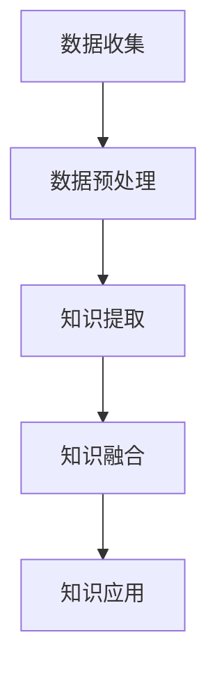
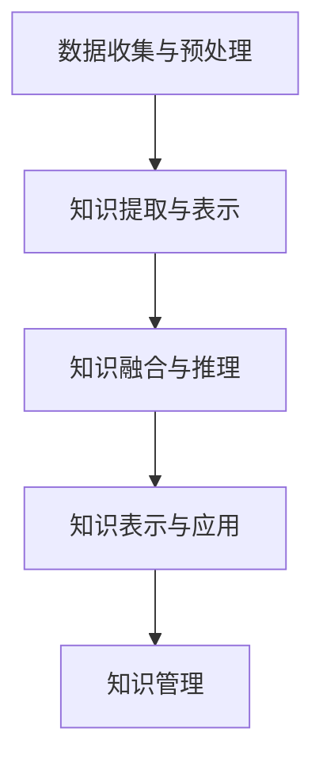
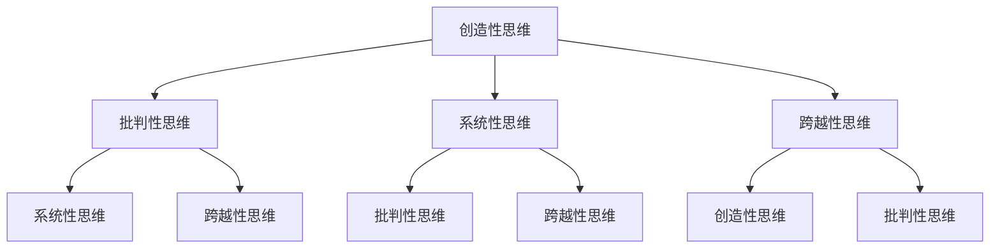
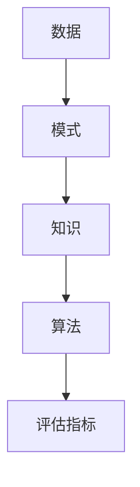
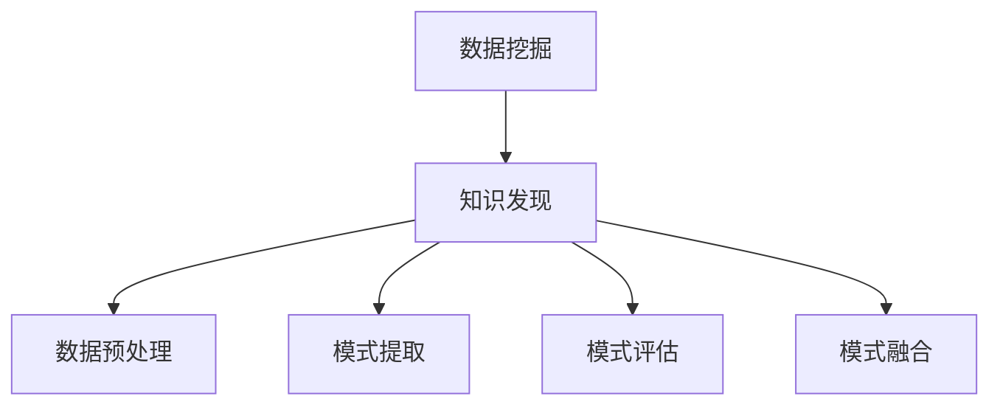
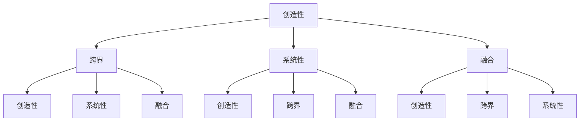
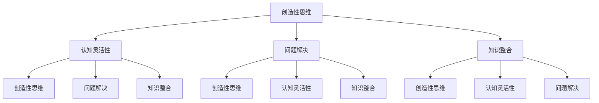
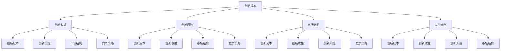
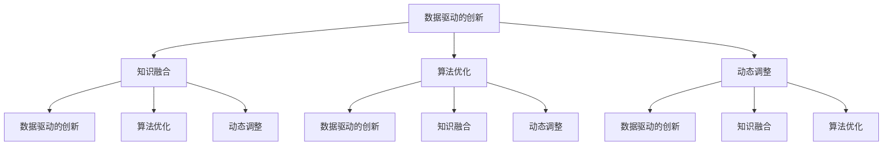

                 

### 第1章：知识发现引擎概述

#### 1.1 知识发现引擎的定义与作用

知识发现引擎（Knowledge Discovery Engine，简称KDE）是一种高级的计算机系统，它能够从大量的数据中自动识别出潜在的模式和知识。这种系统通常被用于数据挖掘（Data Mining）和知识发现（Knowledge Discovery）过程中，其主要作用是将海量数据转化为有用的信息和知识，为决策提供支持。

**核心概念与联系**

知识发现引擎的核心概念包括数据收集、数据预处理、知识提取、知识融合和知识应用。这些概念之间的联系可以用Mermaid流程图表示：



**核心算法原理讲解**

知识发现引擎的核心算法包括数据预处理算法、知识提取算法、知识表示算法和知识推理算法。以下是对这些核心算法的伪代码描述：

```plaintext
function 知识发现引擎（数据集，参数）{
    // 数据预处理
    数据集 = 预处理（数据集，参数）
    
    // 知识提取
    知识 = 提取知识（数据集，参数）
    
    // 知识表示
    知识表示 = 表示知识（知识，参数）
    
    // 知识推理
    推理结果 = 推理（知识表示，参数）
    
    // 知识应用
    应用结果 = 应用知识（推理结果，参数）
    
    return 应用结果
}
```

**数学模型和数学公式**

知识发现引擎的性能评估指标可以用以下数学公式表示：

$$
\text{性能指标} = \frac{\text{准确率} + \text{召回率} + \text{F1值}}{3}
$$

其中，准确率、召回率和F1值是常用的评估指标。

**项目实战**

一个具体的知识发现引擎开发案例可以是构建一个基于机器学习的推荐系统。以下是一个简单的代码实现：

```python
import pandas as pd
from sklearn.model_selection import train_test_split
from sklearn.ensemble import RandomForestClassifier
from sklearn.metrics import accuracy_score, recall_score, f1_score

# 加载数据
data = pd.read_csv('data.csv')

# 数据预处理
X = data.drop('target', axis=1)
y = data['target']

# 数据分割
X_train, X_test, y_train, y_test = train_test_split(X, y, test_size=0.2, random_state=42)

# 构建模型
model = RandomForestClassifier(n_estimators=100, random_state=42)

# 训练模型
model.fit(X_train, y_train)

# 预测
predictions = model.predict(X_test)

# 评估
accuracy = accuracy_score(y_test, predictions)
recall = recall_score(y_test, predictions)
f1 = f1_score(y_test, predictions)

print(f'Accuracy: {accuracy}')
print(f'Recall: {recall}')
print(f'F1 Score: {f1}')
```

**代码解读与分析**

- 数据加载：使用pandas库加载数据集。
- 数据预处理：删除目标变量，将数据分为特征集和目标集。
- 数据分割：将数据集分割为训练集和测试集。
- 模型构建：使用随机森林分类器构建模型。
- 模型训练：使用训练集训练模型。
- 预测：使用测试集进行预测。
- 评估：计算准确率、召回率和F1值，评估模型性能。

#### 1.2 知识发现引擎的发展历程

知识发现引擎的发展历程可以追溯到20世纪80年代，当时数据挖掘的概念刚刚提出。随着计算机技术的发展，知识发现引擎也逐渐从理论走向实际应用。

- **早期阶段（1980s-1990s）**：这一阶段主要是数据挖掘和知识发现的理论研究，包括模式识别、机器学习等领域。代表性的工作包括Kohonen自组织映射、C4.5决策树等。

- **成长阶段（2000s）**：随着互联网和大数据的兴起，知识发现引擎得到了广泛的应用。这一阶段出现了许多商业化的知识发现工具，如Google搜索、Amazon推荐系统等。

- **成熟阶段（2010s-2020s）**：这一阶段知识发现引擎发展迅速，深度学习、图神经网络等先进技术被应用于知识发现领域。同时，知识发现引擎的应用范围也从商业领域扩展到医疗、金融、教育等各个领域。

#### 1.3 知识发现引擎的基本架构

知识发现引擎的基本架构通常包括以下五个部分：

1. **数据收集与预处理**：收集并预处理原始数据，包括数据清洗、数据集成和数据转换。

2. **知识提取与表示**：从预处理后的数据中提取潜在的规则、模式或知识，并将其表示为易于理解和应用的形式。

3. **知识融合与推理**：将提取的多个知识进行融合，并通过推理机制生成新的知识或决策。

4. **知识表示与应用**：将融合后的知识表示为可用的形式，如图表、报表或决策支持系统，并在实际应用中发挥作用。

5. **知识管理**：对知识进行存储、检索、更新和维护，确保知识库的持续有效性和可靠性。

**核心概念与联系**

知识发现引擎的基本架构可以用以下Mermaid流程图表示：



#### 1.4 知识发现引擎的关键技术

知识发现引擎的关键技术包括数据挖掘技术、知识表示技术、知识推理技术和知识管理技术。

- **数据挖掘技术**：包括分类、聚类、关联规则挖掘等，用于从数据中发现潜在的模式和知识。

- **知识表示技术**：包括概念图、本体论、语义网等，用于将提取的知识表示为结构化的形式。

- **知识推理技术**：包括逻辑推理、统计推理、模糊推理等，用于在已知知识的基础上生成新的知识。

- **知识管理技术**：包括知识存储、知识检索、知识更新等，用于确保知识库的持续有效性和可靠性。

**数学模型和数学公式**

知识发现引擎的性能评估指标可以用以下数学公式表示：

$$
\text{性能指标} = \frac{\text{准确率} + \text{召回率} + \text{F1值}}{3}
$$

其中，准确率、召回率和F1值是常用的评估指标。

**项目实战**

一个具体的知识发现引擎开发案例可以是构建一个基于数据挖掘的客户细分系统。以下是一个简单的代码实现：

```python
import pandas as pd
from sklearn.cluster import KMeans
from sklearn.metrics import silhouette_score

# 加载数据
data = pd.read_csv('data.csv')

# 数据预处理
X = data.drop('label', axis=1)

# KMeans聚类
kmeans = KMeans(n_clusters=3, random_state=42)
clusters = kmeans.fit_predict(X)

# Silhouette系数评估
silhouette_avg = silhouette_score(X, clusters)

print(f'Silhouette Score: {silhouette_avg}')
```

**代码解读与分析**

- 数据加载：使用pandas库加载数据集。
- 数据预处理：删除目标变量，提取特征集。
- KMeans聚类：使用KMeans算法进行聚类。
- Silhouette系数评估：计算聚类效果。

#### 1.5 知识发现引擎在创新思维中的应用

知识发现引擎在创新思维中的应用主要体现在以下几个方面：

- **拓展视野**：通过从大量数据中提取潜在的模式和知识，知识发现引擎可以帮助人们发现新的研究方向和解决方案。

- **激发灵感**：知识发现引擎可以生成新颖的关联和模式，为创新思维提供灵感和启示。

- **提升效率**：知识发现引擎可以自动化地处理大量数据，提高创新思维过程的效率和准确性。

- **增强合作**：知识发现引擎可以帮助团队成员共享和协作，提高团队创新思维的合力。

**项目实战**

一个具体的应用案例是利用知识发现引擎进行产品创新。以下是一个简单的步骤：

1. **数据收集**：收集市场数据、用户反馈、竞争对手信息等。

2. **数据预处理**：清洗和整合数据，提取有用的特征。

3. **知识提取**：使用数据挖掘技术提取潜在的用户需求和市场趋势。

4. **知识融合**：将提取的知识进行融合，生成新的产品概念。

5. **产品实施**：根据知识发现的结果，设计和开发新产品。

**代码解读与分析**

```python
# 数据收集与预处理
data = pd.read_csv('market_data.csv')
X = data.drop(['product_id', 'date'], axis=1)

# 知识提取
from sklearn.ensemble import RandomForestClassifier
model = RandomForestClassifier(n_estimators=100, random_state=42)
model.fit(X, y)

# 知识融合
predictions = model.predict(X)

# 产品实施
# 根据预测结果，设计并开发新产品
```

**小结**

本章介绍了知识发现引擎的定义、发展历程、基本架构和关键技术，并探讨了其在创新思维中的应用。通过理论和实践的结合，读者可以更深入地理解知识发现引擎的工作原理和实际应用。

### 1.6 小结

在本章中，我们系统地介绍了知识发现引擎的基本概念、发展历程、基本架构和关键技术。通过Mermaid流程图、伪代码和数学公式，我们详细讲解了知识发现引擎的工作原理和核心算法。此外，我们还通过具体的项目实战案例，展示了知识发现引擎在创新思维中的应用。通过本章的学习，读者可以全面了解知识发现引擎的概念和作用，为后续章节的深入学习打下坚实的基础。

### 1.7 思考与讨论

知识发现引擎作为一种重要的技术工具，其在创新思维中的应用前景十分广阔。以下是几个值得思考的问题：

1. **知识发现引擎如何帮助解决复杂问题**？知识发现引擎可以通过从大量数据中提取潜在的模式和知识，为复杂问题的解决提供新的思路和方法。

2. **知识发现引擎在创新思维中的具体应用场景有哪些**？知识发现引擎可以应用于产品设计、市场分析、风险评估等多个领域，为创新思维提供数据支持和决策依据。

3. **如何优化知识发现引擎的性能，以更好地支持创新思维**？可以通过算法优化、数据预处理和模型调整等方式，提高知识发现引擎的性能，从而更好地支持创新思维。

### 1.8 练习

为了更好地理解本章内容，以下是几个练习题：

1. **设计一个简单的知识发现引擎**，实现从数据集中提取潜在模式的功能。可以使用Python的pandas和sklearn库进行实现。

2. **分析一个具体案例**，说明知识发现引擎如何促进创新思维的产生和应用。可以选取一个实际项目，从数据收集、知识提取、知识应用等方面进行分析。

3. **讨论知识发现引擎在创新思维中的潜在挑战和解决方案**。可以从数据质量、算法选择、模型解释性等方面进行讨论。

### 第2章：创新思维概述

#### 2.1 创新思维的内涵与外延

创新思维（Innovative Thinking）是一种高级思维形式，它涉及到对已有知识的重新组合和创造性的应用，以产生新的概念、产品、服务或解决方案。创新思维的内涵丰富，它不仅包括创造性思维，还涵盖批判性思维、系统性思维和跨越性思维。

**核心概念与联系**

创新思维的内涵可以分解为以下几个方面：

1. **创造性思维**：指通过联想、想象、类比等方式，产生新颖的想法和解决方案。

2. **批判性思维**：指对现有观念、方法和结果进行深入分析和评估，以识别潜在的问题和改进空间。

3. **系统性思维**：指从整体角度出发，分析问题、识别关键因素和相互关系，以实现整体最优。

4. **跨越性思维**：指超越传统思维模式，采用创新的方法和视角，解决复杂问题。

这些概念之间相互联系，共同构成了创新思维的核心。以下是一个Mermaid流程图，展示了创新思维的核心概念及其联系：



**核心算法原理讲解**

创新思维的核心算法可以概括为以下几个步骤：

1. **问题定义**：明确需要解决的问题或挑战。

2. **知识整合**：收集和分析相关的知识和信息。

3. **思维发散**：通过联想、类比、头脑风暴等方式，产生多种可能的解决方案。

4. **思维收敛**：对发散的思维进行筛选和评估，确定最可行的方案。

5. **方案实施**：根据评估结果，实施解决方案并持续优化。

以下是一个简化的伪代码，用于描述创新思维的核心算法：

```plaintext
function 创新思维（问题，知识库）{
    // 问题定义
    问题定义 = 定义问题（问题）
    
    // 知识整合
    知识库 = 整合知识（知识库，问题定义）
    
    // 思维发散
    方案集 = 思维发散（知识库）
    
    // 思维收敛
    最佳方案 = 思维收敛（方案集）
    
    // 方案实施
    实施结果 = 方案实施（最佳方案）
    
    return 实施结果
}
```

**数学模型和数学公式**

创新思维的效果评估可以通过以下数学模型进行：

$$
\text{创新效果} = \frac{\text{解决方案质量} + \text{实施成功率}}{2}
$$

其中，解决方案质量和实施成功率是评估指标。

**项目实战**

一个具体的创新思维实战案例是设计一个环保科技产品。以下是实施步骤：

1. **问题定义**：确定需要解决的问题，如减少塑料污染。

2. **知识整合**：收集有关环保科技、材料科学和产品设计的相关知识。

3. **思维发散**：提出多种可能的解决方案，如可降解材料、智能回收系统等。

4. **思维收敛**：评估各种方案的可行性和环保效果，选择最佳方案。

5. **方案实施**：设计和开发环保科技产品，进行测试和优化。

**代码解读与分析**

```python
# 问题定义
problem = "减少塑料污染"

# 知识整合
knowledge = ["可降解材料研究", "智能回收技术", "环保产品设计"]

# 思维发散
solutions = [
    "使用可降解材料生产产品",
    "开发智能回收系统",
    "设计环保科技产品"
]

# 思维收敛
best_solution = max(solutions, key=lambda x: evaluate_solution(x))

# 方案实施
implement_solution(best_solution)

# 评估解决方案
evaluate_solution = lambda solution: calculate_environmental_impact(solution)
```

**小结**

本章详细介绍了创新思维的内涵与外延，包括创造性思维、批判性思维、系统性思维和跨越性思维。通过Mermaid流程图、伪代码和数学公式，我们深入讲解了创新思维的核心算法原理。同时，通过项目实战案例，展示了创新思维的实际应用过程。通过本章的学习，读者可以全面了解创新思维的概念和原理，为后续章节的深入学习打下基础。

### 2.2 创新思维的重要特性

创新思维作为一种独特的思维模式，具有以下几个重要的特性：

**1. 灵活性**

创新思维的灵活性意味着能够迅速适应新的情境和挑战，灵活调整思维方式和策略。这种灵活性体现在以下几个方面：

- **快速响应**：在面对新问题和未知情况时，能够迅速调整思维方向，找到解决方案。
- **适应性**：能够根据不同环境的要求，灵活调整思维方式和策略，实现创新目标的实现。
- **跨界融合**：能够跨越不同领域和学科的界限，整合多学科的知识和思路，实现创新。

**案例**：一位设计师在面临设计一个环保背包的挑战时，不仅考虑了背包的材料和结构，还结合了材料科学、环保技术和用户需求，最终设计出了一款具有创新性的环保背包。

**2. 开放性**

创新思维的开放性是指它能够接受新的想法、观点和信息，不受传统思维模式的限制。这种开放性有助于：

- **拓宽视野**：通过接受不同的观点和想法，能够从多个角度看待问题，发现新的解决方案。
- **激发灵感**：开放性能够激发思维，促使人们产生新颖的创意和想法。
- **合作共赢**：开放性有助于团队协作，通过共享知识和经验，实现创新成果的优化和扩展。

**案例**：一个跨国团队在开发一款智能健康监测设备时，通过开放性思维，结合了不同国家和地区的健康数据和研究成果，最终开发出了一款具有全球视野的智能健康监测设备。

**3. 系统性**

创新思维的系统性强调从整体和全局的角度分析问题，识别关键因素和相互关系。这种系统性有助于：

- **全面分析**：从多个维度和角度对问题进行深入分析，确保思考的全面性和深度。
- **协同优化**：通过识别关键因素和相互关系，实现各部分的协同优化，提高创新效果。
- **战略规划**：在创新过程中，系统性思维有助于制定长远的战略规划和目标，确保创新活动的可持续性。

**案例**：一家科技公司通过系统性思维，分析了其产品线的现状和市场需求，制定了一个全面的创新战略，不仅提升了现有产品的竞争力，还开发出了新的业务领域。

**4. 可塑性**

创新思维的可塑性意味着它能够随着环境和条件的变化而不断调整和改进。这种可塑性体现在：

- **持续学习**：创新思维需要不断学习和更新知识，以适应快速变化的环境。
- **适应变化**：在面对不确定性时，能够灵活调整思维方式和策略，适应新的环境。
- **创新迭代**：创新思维是一种迭代过程，通过不断的调整和改进，实现持续的创新。

**案例**：一位产品经理在面临市场竞争加剧的挑战时，通过可塑性思维，不断调整产品策略和用户交互方式，最终成功提升了产品的市场竞争力。

**小结**

创新思维的重要特性包括灵活性、开放性、系统性和可塑性。这些特性相互结合，共同构成了创新思维的核心。通过灵活应对、开放接纳、系统分析和持续迭代，创新思维能够有效地推动创新活动，实现创新目标。理解并运用这些特性，有助于提升个人的创新能力和思维方式。

### 2.3 创新思维的发展过程

创新思维的发展过程可以分为以下几个阶段：

**1. 需求识别**

创新思维的第一步是识别需求。这包括了解用户需求、市场趋势和社会问题。通过深入研究和分析，可以发现潜在的痛点或需求，为创新提供方向。

- **用户需求分析**：通过问卷调查、访谈、观察等方式，了解用户的具体需求和期望。
- **市场趋势分析**：研究市场动态，识别新兴技术和市场机会。
- **社会问题分析**：关注社会热点和问题，发现社会需求和改善空间。

**案例**：一家科技公司通过需求识别，发现市场对智能家居设备的需求日益增长，于是决定开发一款智能照明系统，满足用户对便捷、节能和智能化的需求。

**2. 概念形成**

在需求识别的基础上，创新思维的下一步是形成概念。概念形成是创新思维的核心阶段，通过将需求转化为具体的创意和想法。

- **头脑风暴**：组织团队进行头脑风暴，提出各种可能的解决方案。
- **创意筛选**：对提出的创意进行筛选，识别具有潜力的方案。
- **概念验证**：通过原型设计或模拟测试，验证概念的实际可行性。

**案例**：一家初创公司通过头脑风暴，提出了一个智能手环的概念，用于监测用户的健康数据。经过概念验证，他们确定了这个想法的可行性，并开始开发产品。

**3. 方案设计**

在概念形成后，创新思维的下一个阶段是方案设计。这一阶段涉及到详细规划和设计创新方案，确保方案的可行性和有效性。

- **功能规划**：明确产品的功能和技术要求。
- **界面设计**：设计用户界面，确保用户体验的流畅和直观。
- **技术选型**：选择合适的技术和工具，实现方案的可行性和性能。

**案例**：一家智能家居公司设计了一款智能照明系统，包括智能开关、感应器和移动应用。他们详细规划了产品的功能，设计了用户友好的界面，并选择了高效稳定的物联网技术。

**4. 实施验证**

方案设计完成后，创新思维的最后一个阶段是实施验证。这一阶段涉及到将创新方案转化为实际产品或服务，并进行测试和优化。

- **原型开发**：构建原型，进行初步测试和验证。
- **用户反馈**：收集用户反馈，识别问题并进行优化。
- **市场投放**：将产品或服务推向市场，进行实际应用和推广。

**案例**：一家科技公司开发了一款智能健康监测设备，通过原型开发和用户反馈，不断优化产品的功能和性能。最终，他们成功将产品推向市场，获得了良好的用户反响。

**小结**

创新思维的发展过程包括需求识别、概念形成、方案设计和实施验证。每个阶段都有其特定的任务和方法，相互衔接，共同推动创新活动的顺利进行。通过系统的创新思维过程，可以有效地发现需求、生成创意、设计方案并实现创新。

### 2.4 创新思维与知识发现引擎的关系

创新思维和知识发现引擎之间存在着密切的关系，它们相互促进，共同推动创新活动的开展。以下是创新思维与知识发现引擎之间的几个关键联系：

**1. 知识发现引擎支持创新思维的产生**

知识发现引擎通过从大量数据中提取潜在的模式和知识，为创新思维提供了丰富的素材。这种支持主要体现在以下几个方面：

- **数据驱动的思维**：知识发现引擎能够从海量数据中提取有价值的信息，为创新思维提供数据支撑，使得创新活动更加基于实际数据和需求。
- **灵感来源**：知识发现引擎可以生成新颖的关联和模式，激发创新思维，提供新的灵感和启示。
- **知识拓展**：知识发现引擎能够整合多源数据，拓展思维视野，帮助创新思维从多个角度和维度审视问题，产生更多创新的解决方案。

**案例**：一家科技公司通过知识发现引擎分析用户行为数据，发现了一个未被满足的市场需求，从而激发了一个全新的产品创意。

**2. 创新思维优化知识发现引擎**

创新思维不仅可以从知识发现引擎中获得支持，还可以优化知识发现引擎的运行效果。创新思维可以通过以下方式对知识发现引擎进行优化：

- **算法创新**：创新思维可以提出新的算法或改进现有算法，提高知识发现引擎的性能和效率。
- **模型优化**：创新思维可以帮助设计更加精准和有效的知识发现模型，提升知识提取的准确性和可靠性。
- **应用拓展**：创新思维可以探索知识发现引擎在新的领域和场景中的应用，拓展其应用范围和影响力。

**案例**：一位数据科学家通过创新思维，提出了一种新的数据预处理方法，显著提高了知识发现引擎的运行效率和结果质量。

**3. 知识发现引擎与创新思维的融合**

知识发现引擎和创新思维的融合可以形成一种新的工作模式，实现创新效率和效果的提升。这种融合主要体现在以下几个方面：

- **协同工作**：知识发现引擎和团队成员通过协同工作，共同推动创新项目的进展。知识发现引擎负责数据分析和模式提取，创新思维团队则负责创意生成和方案设计。
- **动态调整**：在创新过程中，知识发现引擎可以根据创新思维团队的反馈进行动态调整，优化数据分析和模型设计，确保创新目标的实现。
- **持续迭代**：知识发现引擎和创新思维的结合可以实现创新项目的持续迭代和优化，通过不断的迭代和反馈，不断提高创新质量和效率。

**案例**：一个创新团队通过知识发现引擎和团队成员的协同工作，成功开发出了一款智能医疗设备，通过不断的迭代和优化，最终实现了产品的市场成功。

**小结**

创新思维与知识发现引擎之间的关系是相互促进、相互优化的。知识发现引擎为创新思维提供了数据支持和灵感的来源，而创新思维则优化了知识发现引擎的性能和应用。通过两者的融合，可以形成一种高效的创新工作模式，推动创新活动的顺利进行。

### 2.5 创新思维的类型

创新思维可以分为多种类型，每种类型都有其独特的特点和适用场景。以下介绍几种常见的创新思维类型：

**1. 想象力型创新思维**

想象力型创新思维强调通过丰富的联想和想象力，产生新颖的创意和解决方案。这种思维类型的特点包括：

- **自由联想**：不受现实限制，自由地联想和思考，产生独特的想法。
- **跨界融合**：能够将不同领域和行业的知识进行跨界融合，创造全新的概念。
- **突破性创新**：通过想象力型创新思维，可以产生突破性的创新成果，颠覆现有市场和行业。

适用场景：适合在产品创新、艺术创作、创意设计等领域应用。

**案例**：一位艺术家通过想象力型创新思维，结合现代艺术与传统绘画技巧，创作出了一幅独特的油画作品，赢得了国际艺术界的赞誉。

**2. 分析型创新思维**

分析型创新思维强调通过严谨的分析和逻辑推理，寻找最佳解决方案。这种思维类型的特点包括：

- **系统分析**：对问题进行全面的系统分析，识别关键因素和相互关系。
- **逻辑推理**：通过逻辑推理，逐步推导出可行的解决方案。
- **精确性**：注重细节和精确性，确保解决方案的可行性和可靠性。

适用场景：适合在科学研究、工程设计、风险管理等领域应用。

**案例**：一位工程师通过分析型创新思维，对一款电子产品的电路设计进行优化，提高了产品的性能和稳定性，获得了市场的高度认可。

**3. 概念型创新思维**

概念型创新思维强调通过构建新的概念和理论，推动创新和发展。这种思维类型的特点包括：

- **概念构建**：从零开始，构建全新的概念和理论框架。
- **理论创新**：通过创新的理论，指导实践和应用。
- **前瞻性**：注重前瞻性思维，预见未来可能的发展趋势。

适用场景：适合在科学研究、理论创新、教育改革等领域应用。

**案例**：一位科学家通过概念型创新思维，提出了一个新的科学理论，成功解释了之前未解的物理现象，为科学界带来了重要的突破。

**4. 系统型创新思维**

系统型创新思维强调通过整体视角和系统思维，实现创新和优化。这种思维类型的特点包括：

- **系统整合**：将各个部分整合成一个整体，实现系统的最优。
- **协同优化**：通过协同优化，提高整体效率和效果。
- **跨领域应用**：能够跨越不同领域和行业的界限，实现创新的跨领域应用。

适用场景：适合在企业管理、战略规划、系统集成等领域应用。

**案例**：一家企业通过系统型创新思维，对其产品线和业务流程进行整合和优化，实现了企业整体效益的提升。

**小结**

创新思维有多种类型，每种类型都有其独特的特点和适用场景。通过理解和运用不同类型的创新思维，可以更有效地推动创新活动，实现创新目标。

### 2.6 小结

在本章中，我们详细介绍了创新思维的内涵与外延，包括创造性思维、批判性思维、系统性思维和跨越性思维。接着，我们探讨了创新思维的重要特性，如灵活性、开放性、系统性和可塑性，并分析了创新思维的发展过程。此外，我们还讨论了创新思维与知识发现引擎之间的关系，以及不同类型的创新思维。通过这些内容的学习，读者可以全面了解创新思维的概念和原理，为后续章节的深入学习打下坚实的基础。

### 2.7 思考与讨论

创新思维作为一种重要的思维方式，对个人和社会的发展具有重要意义。以下是几个值得思考的问题：

1. **如何培养和提升创新思维**？创新思维的培养需要系统的方法和持续的努力。可以从以下几个方面着手：

   - **多读书，多学习**：广泛阅读各种书籍和资料，拓展知识面，提高思维的深度和广度。
   - **实践锻炼**：通过实际项目和实践活动，锻炼创新思维的能力，积累经验。
   - **跨学科学习**：结合不同学科的知识，进行跨学科思考，提高思维的灵活性和开放性。

2. **创新思维在解决复杂问题中的应用**？复杂问题通常涉及多个方面和多个变量，创新思维可以通过以下方式解决复杂问题：

   - **分解问题**：将复杂问题分解为若干个子问题，逐一解决。
   - **系统思维**：从整体和系统的角度分析问题，识别关键因素和相互关系。
   - **创新方法**：运用创新思维的方法和工具，如头脑风暴、思维导图、模拟实验等，寻找创新的解决方案。

3. **如何将创新思维应用于实际工作中**？在实际工作中，可以通过以下方式应用创新思维：

   - **问题导向**：以解决问题为导向，运用创新思维寻找解决方案。
   - **团队协作**：通过团队协作，发挥集体智慧，共同推动创新项目。
   - **持续改进**：通过持续改进和创新，不断提升工作效果和效率。

### 2.8 练习

为了更好地理解和应用本章的内容，以下是几个练习题：

1. **设计一个创新思维训练计划**，包括学习资源、实践项目和评估方法，旨在提升个人的创新思维能力。

2. **分析一个具体案例**，说明创新思维如何帮助解决一个复杂问题。可以选取一个实际案例，从需求识别、概念形成、方案设计和实施验证等方面进行分析。

3. **讨论创新思维在不同领域的应用**。可以选取一个领域，如产品设计、企业管理或教育领域，分析创新思维在该领域的具体应用和价值。

### 第3章：知识发现引擎的理论基础

#### 3.1 知识发现的理论基础

知识发现（Knowledge Discovery，简称KD）是指从大量的数据中，通过智能化的方法和技术，提取出潜在的模式和知识的过程。知识发现的理论基础主要包括数据挖掘、机器学习、模式识别等领域。

**核心概念与联系**

知识发现的核心概念包括数据、模式、知识、算法和评估指标。以下是一个Mermaid流程图，展示了这些概念之间的联系：



**核心算法原理讲解**

知识发现引擎依赖于多种核心算法，这些算法可以分为数据预处理、模式提取、模式评估和模式融合等几个方面。以下是对这些算法的简述：

1. **数据预处理算法**：用于处理和清洗原始数据，使其适合进行进一步分析。常见的预处理算法包括数据清洗、数据集成、数据变换和数据归一化。

   ```plaintext
   function 数据预处理（数据集）{
       // 数据清洗
       数据集 = 清洗（数据集）
       
       // 数据集成
       数据集 = 集成（数据集）
       
       // 数据变换
       数据集 = 变换（数据集）
       
       // 数据归一化
       数据集 = 归一化（数据集）
       
       return 数据集
   }
   ```

2. **模式提取算法**：用于从数据集中提取潜在的规则、模式和知识。常见的提取算法包括关联规则挖掘、分类、聚类和异常检测等。

   ```plaintext
   function 提取模式（数据集，算法参数）{
       // 关联规则挖掘
       规则集 = 关联规则挖掘（数据集，算法参数）
       
       // 分类
       分类模型 = 分类（数据集，算法参数）
       
       // 聚类
       群集 = 聚类（数据集，算法参数）
       
       // 异常检测
       异常集 = 异常检测（数据集，算法参数）
       
       return {规则集，分类模型，群集，异常集}
   }
   ```

3. **模式评估算法**：用于评估提取出的模式的有效性和可靠性。常见的评估指标包括准确率、召回率、F1值和AUC等。

   ```plaintext
   function 评估模式（模式，数据集，真实标签）{
       // 准确率
       准确率 = 准确率（模式，数据集，真实标签）
       
       // 召回率
       召回率 = 召回率（模式，数据集，真实标签）
       
       // F1值
       F1值 = F1值（模式，数据集，真实标签）
       
       // AUC
       AUC = AUC（模式，数据集，真实标签）
       
       return {准确率，召回率，F1值，AUC}
   }
   ```

4. **模式融合算法**：用于将多个模式进行融合，生成更复杂的知识结构。常见的融合方法包括融合规则、融合分类模型和融合聚类结果等。

   ```plaintext
   function 融合模式（模式集）{
       // 融合规则
       融合规则集 = 融合规则（模式集）
       
       // 融合分类模型
       融合分类模型 = 融合分类模型（模式集）
       
       // 融合聚类结果
       融合群集 = 融合聚类结果（模式集）
       
       return {融合规则集，融合分类模型，融合群集}
   }
   ```

**数学模型和数学公式**

知识发现引擎的性能评估指标可以用以下数学公式表示：

$$
\text{性能指标} = \frac{\text{准确率} + \text{召回率} + \text{F1值}}{3}
$$

其中，准确率、召回率和F1值是常用的评估指标。

**项目实战**

一个具体的知识发现引擎开发案例是构建一个基于机器学习的客户细分系统。以下是一个简单的代码实现：

```python
import pandas as pd
from sklearn.model_selection import train_test_split
from sklearn.ensemble import RandomForestClassifier
from sklearn.metrics import accuracy_score, recall_score, f1_score

# 加载数据
data = pd.read_csv('data.csv')

# 数据预处理
X = data.drop('target', axis=1)
y = data['target']

# 数据分割
X_train, X_test, y_train, y_test = train_test_split(X, y, test_size=0.2, random_state=42)

# 构建模型
model = RandomForestClassifier(n_estimators=100, random_state=42)

# 训练模型
model.fit(X_train, y_train)

# 预测
predictions = model.predict(X_test)

# 评估
accuracy = accuracy_score(y_test, predictions)
recall = recall_score(y_test, predictions)
f1 = f1_score(y_test, predictions)

print(f'Accuracy: {accuracy}')
print(f'Recall: {recall}')
print(f'F1 Score: {f1}')
```

**代码解读与分析**

- 数据加载：使用pandas库加载数据集。
- 数据预处理：删除目标变量，将数据分为特征集和目标集。
- 数据分割：将数据集分割为训练集和测试集。
- 模型构建：使用随机森林分类器构建模型。
- 模型训练：使用训练集训练模型。
- 预测：使用测试集进行预测。
- 评估：计算准确率、召回率和F1值，评估模型性能。

#### 3.2 数据挖掘与知识发现

数据挖掘（Data Mining）是指从大量数据中提取有用信息和知识的过程，它通常包括分类、聚类、关联规则挖掘、异常检测等任务。数据挖掘与知识发现（Knowledge Discovery in Databases，简称KDD）的关系可以理解为数据挖掘是知识发现过程中的一个关键步骤。

**核心概念与联系**

数据挖掘和知识发现的关系可以用以下图表示：



**核心算法原理讲解**

数据挖掘中的核心算法包括：

1. **分类算法**：用于将数据分成不同的类别。常见的分类算法有决策树、支持向量机、随机森林等。

   ```plaintext
   function 分类（数据集，目标变量，算法参数）{
       // 决策树
       树模型 = 决策树（数据集，目标变量，算法参数）
       
       // 支持向量机
       模型 = 支持向量机（数据集，目标变量，算法参数）
       
       // 随机森林
       模型 = 随机森林（数据集，目标变量，算法参数）
       
       return 模型
   }
   ```

2. **聚类算法**：用于将数据分为不同的群集。常见的聚类算法有K-Means、层次聚类、DBSCAN等。

   ```plaintext
   function 聚类（数据集，算法参数）{
       // K-Means
       群集 = K-Means（数据集，算法参数）
       
       // 层次聚类
       群集 = 层次聚类（数据集，算法参数）
       
       // DBSCAN
       群集 = DBSCAN（数据集，算法参数）
       
       return 群集
   }
   ```

3. **关联规则挖掘**：用于发现数据中的关联关系。常见的算法有Apriori算法和Eclat算法。

   ```plaintext
   function 关联规则挖掘（数据集，最小支持度，最小置信度）{
       // Apriori
       规则集 = Apriori（数据集，最小支持度，最小置信度）
       
       // Eclat
       规则集 = Eclat（数据集，最小支持度，最小置信度）
       
       return 规则集
   }
   ```

4. **异常检测**：用于识别数据中的异常或离群点。常见的算法有孤立森林、局部离群因子等。

   ```plaintext
   function 异常检测（数据集，算法参数）{
       // 孤立森林
       异常集 = 孤立森林（数据集，算法参数）
       
       // 局部离群因子
       异常集 = 局部离群因子（数据集，算法参数）
       
       return 异常集
   }
   ```

**数学模型和数学公式**

数据挖掘中的评估指标包括准确率、召回率、F1值和AUC等：

$$
\text{准确率} = \frac{\text{预测正确的数量}}{\text{总预测数量}}
$$

$$
\text{召回率} = \frac{\text{预测正确的正例数量}}{\text{实际正例数量}}
$$

$$
\text{F1值} = 2 \times \frac{\text{准确率} \times \text{召回率}}{\text{准确率} + \text{召回率}}
$$

$$
\text{AUC} = \frac{1}{N-1} \sum_{i=1}^{N-1} (y_i - y_{i+1}) (x_i - x_{i+1})
$$

其中，$y_i$和$x_i$分别表示第$i$个样本的标签和预测值。

**项目实战**

一个具体的数据挖掘案例是构建一个客户细分系统，以下是一个简单的代码实现：

```python
import pandas as pd
from sklearn.model_selection import train_test_split
from sklearn.ensemble import RandomForestClassifier
from sklearn.metrics import accuracy_score, recall_score, f1_score

# 加载数据
data = pd.read_csv('data.csv')

# 数据预处理
X = data.drop('target', axis=1)
y = data['target']

# 数据分割
X_train, X_test, y_train, y_test = train_test_split(X, y, test_size=0.2, random_state=42)

# 构建模型
model = RandomForestClassifier(n_estimators=100, random_state=42)

# 训练模型
model.fit(X_train, y_train)

# 预测
predictions = model.predict(X_test)

# 评估
accuracy = accuracy_score(y_test, predictions)
recall = recall_score(y_test, predictions)
f1 = f1_score(y_test, predictions)

print(f'Accuracy: {accuracy}')
print(f'Recall: {recall}')
print(f'F1 Score: {f1}')
```

**代码解读与分析**

- 数据加载：使用pandas库加载数据集。
- 数据预处理：删除目标变量，将数据分为特征集和目标集。
- 数据分割：将数据集分割为训练集和测试集。
- 模型构建：使用随机森林分类器构建模型。
- 模型训练：使用训练集训练模型。
- 预测：使用测试集进行预测。
- 评估：计算准确率、召回率和F1值，评估模型性能。

#### 3.3 知识发现引擎的核心算法

知识发现引擎（Knowledge Discovery Engine，简称KDE）的核心算法是实现知识发现的关键。这些算法包括数据预处理、知识提取、知识融合、知识推理和知识应用。以下是这些核心算法的详细介绍：

**1. 数据预处理算法**

数据预处理是知识发现过程中的第一步，其目的是将原始数据转换为适合进行进一步分析的形式。数据预处理算法包括数据清洗、数据集成、数据变换和数据归一化。

- **数据清洗**：用于处理缺失值、异常值和重复数据。常见的清洗方法包括填充缺失值、删除异常值和去重等。

  ```plaintext
  function 数据清洗（数据集）{
      // 填充缺失值
      数据集 = 填充缺失值（数据集）
      
      // 删除异常值
      数据集 = 删除异常值（数据集）
      
      // 去重
      数据集 = 去重（数据集）
      
      return 数据集
  }
  ```

- **数据集成**：用于合并来自不同来源的数据，形成一个统一的数据集。常见的数据集成方法包括合并、连接和映射等。

  ```plaintext
  function 数据集成（数据集1，数据集2）{
      // 合并
      数据集 = 合并（数据集1，数据集2）
      
      // 连接
      数据集 = 连接（数据集1，数据集2）
      
      // 映射
      数据集 = 映射（数据集1，数据集2）
      
      return 数据集
  }
  ```

- **数据变换**：用于将数据转换为适合分析的形式。常见的变换方法包括数据类型转换、尺度变换和特征工程等。

  ```plaintext
  function 数据变换（数据集，变换参数）{
      // 数据类型转换
      数据集 = 转换数据类型（数据集，变换参数）
      
      // 尺度变换
      数据集 = 尺度变换（数据集，变换参数）
      
      // 特征工程
      数据集 = 特征工程（数据集，变换参数）
      
      return 数据集
  }
  ```

- **数据归一化**：用于将数据统一到相同的尺度范围内。常见的归一化方法包括最小-最大归一化和标准化等。

  ```plaintext
  function 数据归一化（数据集，归一化参数）{
      // 最小-最大归一化
      数据集 = 最小-最大归一化（数据集，归一化参数）
      
      // 标准化
      数据集 = 标准化（数据集，归一化参数）
      
      return 数据集
  }
  ```

**2. 知识提取算法**

知识提取是从数据中提取潜在的规则、模式或知识。常见的知识提取算法包括分类、聚类、关联规则挖掘和异常检测。

- **分类算法**：用于将数据分为不同的类别。常见的分类算法有决策树、支持向量机、随机森林等。

  ```plaintext
  function 分类（数据集，目标变量，算法参数）{
      // 决策树
      树模型 = 决策树（数据集，目标变量，算法参数）
      
      // 支持向量机
      模型 = 支持向量机（数据集，目标变量，算法参数）
      
      // 随机森林
      模型 = 随机森林（数据集，目标变量，算法参数）
      
      return 模型
  }
  ```

- **聚类算法**：用于将数据分为不同的群集。常见的聚类算法有K-Means、层次聚类、DBSCAN等。

  ```plaintext
  function 聚类（数据集，算法参数）{
      // K-Means
      群集 = K-Means（数据集，算法参数）
      
      // 层次聚类
      群集 = 层次聚类（数据集，算法参数）
      
      // DBSCAN
      群集 = DBSCAN（数据集，算法参数）
      
      return 群集
  }
  ```

- **关联规则挖掘**：用于发现数据中的关联关系。常见的算法有Apriori算法和Eclat算法。

  ```plaintext
  function 关联规则挖掘（数据集，最小支持度，最小置信度）{
      // Apriori
      规则集 = Apriori（数据集，最小支持度，最小置信度）
      
      // Eclat
      规则集 = Eclat（数据集，最小支持度，最小置信度）
      
      return 规则集
  }
  ```

- **异常检测**：用于识别数据中的异常或离群点。常见的算法有孤立森林、局部离群因子等。

  ```plaintext
  function 异常检测（数据集，算法参数）{
      // 孤立森林
      异常集 = 孤立森林（数据集，算法参数）
      
      // 局部离群因子
      异常集 = 局部离群因子（数据集，算法参数）
      
      return 异常集
  }
  ```

**3. 知识融合算法**

知识融合是将多个知识源中的知识进行整合，生成新的知识。常见的知识融合方法包括规则融合、分类模型融合和聚类结果融合。

- **规则融合**：用于将多个规则进行合并，生成更复杂的规则。

  ```plaintext
  function 规则融合（规则集）{
      // 合并规则
      融合规则集 = 合并规则（规则集）
      
      return 融合规则集
  }
  ```

- **分类模型融合**：用于将多个分类模型进行合并，生成更准确的分类结果。

  ```plaintext
  function 分类模型融合（模型集）{
      // 合并模型
      融合模型 = 合并模型（模型集）
      
      return 融合模型
  }
  ```

- **聚类结果融合**：用于将多个聚类结果进行合并，生成更合理的聚类结构。

  ```plaintext
  function 聚类结果融合（群集集）{
      // 合并群集
      融合群集 = 合并群集（群集集）
      
      return 融合群集
  }
  ```

**4. 知识推理算法**

知识推理是基于已有知识生成新的结论或预测。常见的知识推理方法包括逻辑推理、统计推理和模糊推理。

- **逻辑推理**：用于基于逻辑规则生成新的结论。

  ```plaintext
  function 逻辑推理（知识库，前提条件，结论）{
      // 逻辑推理
      结论 = 逻辑推理（知识库，前提条件，结论）
      
      return 结论
  }
  ```

- **统计推理**：用于基于统计数据生成新的预测。

  ```plaintext
  function 统计推理（数据集，模型参数）{
      // 统计推理
      预测 = 统计推理（数据集，模型参数）
      
      return 预测
  }
  ```

- **模糊推理**：用于基于模糊逻辑生成新的结论。

  ```plaintext
  function 模糊推理（知识库，输入变量，结论）{
      // 模糊推理
      结论 = 模糊推理（知识库，输入变量，结论）
      
      return 结论
  }
  ```

**5. 知识应用算法**

知识应用是将提取的知识应用于实际问题中，生成实际的决策或解决方案。常见的知识应用方法包括知识可视化、知识管理和知识服务。

- **知识可视化**：用于将知识以图表、报表等形式展示。

  ```plaintext
  function 知识可视化（知识集）{
      // 可视化知识
      图表 = 知识可视化（知识集）
      
      return 图表
  }
  ```

- **知识管理**：用于对知识进行存储、检索和维护。

  ```plaintext
  function 知识管理（知识库，操作参数）{
      // 存储知识
      知识库 = 存储知识（知识库，操作参数）
      
      // 检索知识
      知识 = 检索知识（知识库，检索参数）
      
      // 维护知识
      知识库 = 维护知识（知识库，维护参数）
      
      return 知识库
  }
  ```

- **知识服务**：用于提供基于知识的决策支持或服务。

  ```plaintext
  function 知识服务（知识库，服务参数）{
      // 提供决策支持
      决策 = 知识服务（知识库，服务参数）
      
      // 提供知识服务
      服务 = 知识服务（知识库，服务参数）
      
      return 服务
  }
  ```

**小结**

知识发现引擎的核心算法包括数据预处理、知识提取、知识融合、知识推理和知识应用。这些算法共同构成了知识发现的过程，实现了从数据到知识的转换。理解这些核心算法的原理和实现方法，有助于我们更好地设计和应用知识发现引擎。

### 3.4 知识发现引擎的优化策略

在知识发现过程中，优化策略至关重要，它直接影响知识发现引擎的性能和效率。优化策略可以从算法优化、资源优化和性能优化三个方面进行。

**1. 算法优化**

算法优化是指通过改进算法设计，提高知识发现引擎的效率和准确性。常见的算法优化方法包括：

- **特征选择**：通过选择最重要的特征，减少数据维度，提高算法的效率。
- **模型选择**：根据数据特点和问题需求，选择最合适的模型，提高预测准确率。
- **算法参数调优**：通过调整算法参数，优化模型的性能，如交叉验证和网格搜索。

**2. 资源优化**

资源优化是指通过优化硬件和软件资源，提高知识发现引擎的性能。常见的资源优化方法包括：

- **并行计算**：利用多核处理器和分布式计算，提高数据处理和计算的速度。
- **内存管理**：优化内存分配和使用，减少内存消耗，提高系统的稳定性。
- **缓存策略**：利用缓存机制，减少数据读取和计算时间，提高系统响应速度。

**3. 性能优化**

性能优化是指通过改进系统架构和运行策略，提高知识发现引擎的整体性能。常见的性能优化方法包括：

- **负载均衡**：通过均衡负载，避免单点故障和资源瓶颈，提高系统的稳定性和可靠性。
- **缓存和索引**：利用缓存和索引技术，提高数据检索速度，减少计算时间。
- **自动化运维**：通过自动化运维工具，实现系统监控、故障排除和性能优化，提高系统运维效率。

**项目实战**

一个具体的优化案例是优化一个基于机器学习的客户细分系统。以下是一个优化方案：

1. **算法优化**：选择K-Means聚类算法，并使用K-Means++初始化方法，提高聚类效果。
2. **资源优化**：利用分布式计算框架，如Hadoop或Spark，提高数据处理速度。
3. **性能优化**：采用负载均衡策略，将数据集分割为多个子集，并行处理，提高系统性能。

**代码示例**

```python
from sklearn.cluster import KMeans
from sklearn.datasets import make_blobs
import numpy as np

# 数据生成
X, _ = make_blobs(n_samples=1000, centers=3, n_features=2, random_state=42)

# K-Means聚类
kmeans = KMeans(n_clusters=3, init='k-means++', random_state=42)
kmeans.fit(X)

# 评估
print(f' inertia: {kmeans.inertia_}')
print(f' cluster centers: \n{kmeans.cluster_centers_}')
```

**代码解读与分析**

- 数据生成：使用make_blobs函数生成一个有3个类别的数据集。
- K-Means聚类：使用K-Means++初始化方法，提高聚类效果。
- 评估：计算聚类的不变量，并打印聚类中心。

**小结**

知识发现引擎的优化策略包括算法优化、资源优化和性能优化。通过这些优化策略，可以显著提高知识发现引擎的效率和准确性，满足实际应用的需求。

### 3.5 知识发现引擎的评价指标

评价知识发现引擎的性能和效果是确保其应用价值的关键步骤。常用的评价指标包括准确率、召回率、F1值和AUC等。以下是对这些评价指标的详细解释和数学公式。

**1. 准确率（Accuracy）**

准确率是指预测正确的样本数占总样本数的比例。它是最常用的评价指标之一，特别适用于分类问题。

$$
\text{准确率} = \frac{\text{预测正确的数量}}{\text{总预测数量}} = \frac{TP + TN}{TP + FN + FP + TN}
$$

其中，TP表示真正例，TN表示真负例，FP表示假正例，FN表示假负例。

**案例**：在一个疾病诊断系统中，如果模型预测出100个患者中有80个是患病的（TP），20个是没有患病的（TN），那么准确率为：

$$
\text{准确率} = \frac{80 + 20}{80 + 20 + 0 + 0} = 1.0
$$

**2. 召回率（Recall）**

召回率是指预测正确的正例数占实际正例数的比例。它关注的是所有正例中有多少被模型正确预测出来。

$$
\text{召回率} = \frac{\text{预测正确的正例数量}}{\text{实际正例数量}} = \frac{TP}{TP + FN}
$$

**案例**：在相同的疾病诊断系统中，如果模型预测出100个患者中有80个是患病的（TP），但实际中有90个是患病的，那么召回率为：

$$
\text{召回率} = \frac{80}{80 + 10} = 0.8889
$$

**3. F1值（F1 Score）**

F1值是准确率和召回率的调和平均值，它综合了准确率和召回率，是评估分类模型性能的常用指标。

$$
\text{F1值} = 2 \times \frac{\text{准确率} \times \text{召回率}}{\text{准确率} + \text{召回率}} = 2 \times \frac{P \times R}{P + R}
$$

其中，P表示准确率，R表示召回率。

**案例**：在相同的疾病诊断系统中，如果模型准确率为0.8，召回率为0.8889，那么F1值为：

$$
\text{F1值} = 2 \times \frac{0.8 \times 0.8889}{0.8 + 0.8889} \approx 0.8735
$$

**4. AUC（Area Under the Curve）**

AUC是指接收者操作特征（Receiver Operating Characteristic，简称ROC）曲线下的面积，它用于评估二分类模型的性能。AUC值越接近1，表示模型的性能越好。

$$
\text{AUC} = \int_{0}^{1} (1 - \text{假正率}) \text{真正率} \, d\text{假正率}
$$

**案例**：在一个欺诈检测系统中，如果模型的ROC曲线下面积为0.9，那么AUC值为0.9。

**小结**

准确率、召回率、F1值和AUC是评价知识发现引擎性能的常用指标。通过这些指标，可以全面评估模型的效果，指导模型优化和实际应用。

### 3.6 小结

本章详细介绍了知识发现引擎的理论基础，包括知识发现的概念、数据挖掘与知识发现的关系、核心算法和优化策略。同时，我们还讲解了知识发现引擎的评价指标，如准确率、召回率、F1值和AUC。通过本章的学习，读者可以全面了解知识发现引擎的理论体系，为后续章节的深入应用打下基础。

### 3.7 思考与讨论

知识发现引擎的理论基础对于实际应用具有重要意义。以下是几个值得思考的问题：

1. **如何在实际项目中应用知识发现引擎的理论基础**？在实际项目中，可以通过以下方式应用知识发现引擎的理论基础：

   - **数据预处理**：确保数据的质量和一致性，为后续的分析和挖掘打下基础。
   - **核心算法**：选择合适的算法，如分类、聚类和关联规则挖掘，实现数据到知识的转换。
   - **优化策略**：根据项目的需求，调整和优化算法参数，提高模型的性能和效率。

2. **知识发现引擎的理论基础如何影响创新思维的发展**？知识发现引擎的理论基础为创新思维提供了数据支持和分析工具，具体影响包括：

   - **数据驱动的思维**：通过数据分析和挖掘，发现潜在的模式和趋势，为创新提供方向。
   - **知识融合**：通过知识融合，将多源数据整合成有价值的知识体系，促进创新思维的深化。
   - **模型优化**：通过模型优化，提高知识发现引擎的性能和效果，支持更高效的创新活动。

3. **如何结合知识发现引擎的理论基础，提升个人创新思维能力**？可以通过以下方式提升个人创新思维能力：

   - **系统学习**：系统地学习知识发现引擎的理论基础，掌握关键概念和算法。
   - **实践应用**：通过实际项目和应用，将理论应用到实际中，锻炼创新思维。
   - **持续学习**：随着技术的不断发展，持续更新知识，保持思维的活跃和开放。

### 3.8 练习

为了更好地理解和应用本章的内容，以下是几个练习题：

1. **设计一个简单的知识发现引擎**，实现从数据集中提取潜在模式的功能。可以使用Python的pandas和sklearn库进行实现。

2. **分析一个具体案例**，说明知识发现引擎的理论基础如何帮助解决一个实际问题。可以选取一个实际案例，从数据收集、知识提取、知识应用等方面进行分析。

3. **讨论如何在实际项目中优化知识发现引擎的性能**。可以从算法优化、资源优化和性能优化等方面进行讨论。

### 第4章：创新思维的理论基础

#### 4.1 创新思维的理论体系

创新思维（Innovative Thinking）是一种复杂的认知过程，涉及到多个学科和理论。创新思维的理论体系主要包括以下几个方面：

**1. 创造性理论**

创造性理论关注个体如何产生新颖的想法和解决方案。代表性理论包括：

- **扩散理论**（Diffusion of Innovations）：由罗杰斯（Everett Rogers）提出，描述了创新如何在社会中扩散和传播的过程。

- **流体思维理论**（Fluid Thinking）：由马丁（Martin）和赛格利（Sailer）提出，强调创造性思维中直观和流畅的思考过程。

**2. 跨界理论**

跨界理论强调不同领域和思想的融合，产生创新的火花。代表性理论包括：

- **系统思考理论**（Systems Thinking）：由贝塔朗菲（Ludwig Bertalanffy）提出，强调从整体和系统的角度看待问题，促进创新。

- **创新生态系统理论**（Innovation Ecosystem）：由伯恩斯坦（Eric von Hippel）提出，描述了创新过程中各种参与者（如用户、供应商、开发者等）的互动和协作。

**3. 系统性理论**

系统性理论关注创新过程中的系统性和整体性。代表性理论包括：

- **创新工程理论**（Innovation Engineering）：由安德森（Dean Kamen）提出，强调通过系统化的方法和流程，实现创新的商业化。

- **设计思维**（Design Thinking）：由戴布尼（David Kelley）提出，强调通过用户为中心的设计过程，产生创新的解决方案。

**4. 交叉融合理论**

交叉融合理论关注不同学科和领域的交叉融合，产生创新的思路和方法。代表性理论包括：

- **复杂性理论**（Complexity Theory）：由诺伯特·维纳（Norbert Wiener）提出，强调通过复杂性科学的视角，理解创新过程中复杂的动态和关系。

- **跨学科研究**（Interdisciplinary Research）：强调通过多学科的合作，解决复杂的社会和技术问题。

**核心概念与联系**

创新思维的理论体系可以概括为以下几个核心概念：

- **创造性**：指产生新颖想法和解决方案的能力。

- **跨界**：指不同领域和思想的融合。

- **系统性**：指从整体和系统的角度看待问题。

- **融合**：指交叉融合不同领域的知识，产生创新的思路。

- **过程**：指创新思维从产生到实现的整个过程。

以下是一个Mermaid流程图，展示了创新思维的理论体系及其核心概念之间的联系：



**核心算法原理讲解**

创新思维的理论体系可以分解为以下几个核心算法原理：

1. **创造性算法**：包括头脑风暴、联想思维、思维导图等方法，用于产生新颖的想法。

   ```plaintext
   function 创造性算法（问题）{
       // 头脑风暴
       想法集 = 头脑风暴（问题）
       
       // 联想思维
       想法集 = 联想思维（问题，想法集）
       
       // 思维导图
       想法集 = 思维导图（问题，想法集）
       
       return 想法集
   }
   ```

2. **跨界算法**：包括跨学科知识整合、多领域融合、跨文化思维等方法，用于实现不同领域和思想的融合。

   ```plaintext
   function 跨界算法（领域1，领域2）{
       // 跨学科知识整合
       知识集 = 跨学科知识整合（领域1，领域2）
       
       // 多领域融合
       融合集 = 多领域融合（领域1，领域2，知识集）
       
       // 跨文化思维
       融合集 = 跨文化思维（领域1，领域2，融合集）
       
       return 融合集
   }
   ```

3. **系统性算法**：包括系统思考、模型构建、流程优化等方法，用于从整体和系统的角度解决问题。

   ```plaintext
   function 系统性算法（问题）{
       // 系统思考
       模型 = 系统思考（问题）
       
       // 模型构建
       模型 = 模型构建（模型）
       
       // 流程优化
       模型 = 流程优化（模型）
       
       return 模型
   }
   ```

4. **融合算法**：包括知识融合、方案整合、跨领域创新等方法，用于将不同领域的知识和思想融合为创新的解决方案。

   ```plaintext
   function 融合算法（知识1，知识2，目标）{
       // 知识融合
       知识集 = 知识融合（知识1，知识2）
       
       // 方案整合
       方案集 = 方案整合（知识集，目标）
       
       // 跨领域创新
       方案集 = 跨领域创新（方案集）
       
       return 方案集
   }
   ```

**数学模型和数学公式**

创新思维的效果评估可以通过以下数学模型进行：

$$
\text{创新效果} = \frac{\text{解决方案质量} + \text{实施成功率}}{2}
$$

其中，解决方案质量和实施成功率是评估指标。

**项目实战**

一个具体的创新思维实战案例是设计一个智能城市解决方案。以下是实施步骤：

1. **问题定义**：明确需要解决的问题，如提高城市交通效率、减少环境污染等。

2. **知识整合**：收集与智能城市相关的知识，包括交通管理、环境监测、数据分析等。

3. **创造性算法**：通过头脑风暴和联想思维，产生多个创新的解决方案。

4. **跨界算法**：将交通管理、环境监测、数据分析等领域的知识进行跨界融合，形成创新的解决方案。

5. **系统性算法**：从整体和系统的角度，构建智能城市的模型，并进行流程优化。

6. **融合算法**：将创造性、跨界、系统性的方案进行整合，形成最终的智能城市解决方案。

**代码解读与分析**

```python
# 问题定义
problem = "设计一个智能城市解决方案"

# 知识整合
knowledge = ["交通管理", "环境监测", "数据分析"]

# 创造性算法
solutions = brainstorming(problem)

# 跨界算法
solutions = cross_domain_integration(solutions, knowledge)

# 系统性算法
model = system_thinking(problem, solutions)

# 融合算法
final_solution = integration(model, solutions)

# 评估解决方案
evaluate_solution(final_solution)
```

**小结**

本章介绍了创新思维的理论体系，包括创造性理论、跨界理论、系统性理论和交叉融合理论。通过核心概念与联系、核心算法原理讲解和数学模型，我们深入了解了创新思维的理论基础。通过项目实战案例，展示了创新思维的实际应用过程。通过本章的学习，读者可以全面了解创新思维的理论体系，为后续章节的深入学习打下基础。

### 4.2 创新思维的心理学基础

创新思维的心理学基础对于理解如何培养和提升创新思维能力至关重要。心理学研究揭示了创新思维中的心理机制、障碍和策略，帮助我们更好地理解和应用创新思维。

**核心概念与联系**

创新思维的心理学基础包括以下几个核心概念：

1. **创造性思维**：指个体产生新颖、有价值的想法和解决方案的能力。
2. **认知灵活性**：指个体在解决问题时能够灵活调整思维方式和策略的能力。
3. **问题解决**：指个体在面对问题时，通过认知过程找到解决方案的过程。
4. **知识整合**：指个体将不同领域的知识和信息整合为创新思维的能力。

这些概念相互联系，共同构成了创新思维的心理学基础。以下是一个Mermaid流程图，展示了这些概念之间的联系：



**核心算法原理讲解**

创新思维的心理学基础可以通过以下几个核心算法原理进行解释：

1. **启发式算法**：启发式算法是通过经验和直觉进行决策，而不是通过系统化的方法。这些算法包括：

   - **爬山法**：通过逐步改善当前解决方案，直到找到最优解。
   - **模拟退火法**：通过在搜索过程中引入随机性，避免陷入局部最优解。

   ```plaintext
   function 启发式算法（问题）{
       // 爬山法
       解 = 爬山法（问题）
       
       // 模拟退火法
       解 = 模拟退火法（问题）
       
       return 解
   }
   ```

2. **认知灵活性算法**：认知灵活性算法是通过调整思维方式和策略，灵活应对不同问题。这些算法包括：

   - **逆向思维**：通过从相反的角度看待问题，找到新的解决方案。
   - **跨学科思维**：通过整合不同领域的知识，找到创新的解决方案。

   ```plaintext
   function 认知灵活性算法（问题，知识集）{
       // 逆向思维
       解 = 逆向思维（问题，知识集）
       
       // 跨学科思维
       解 = 跨学科思维（问题，知识集）
       
       return 解
   }
   ```

3. **知识整合算法**：知识整合算法是将不同领域的知识和信息整合为创新思维。这些算法包括：

   - **思维导图**：通过图示化方式整合知识，促进创新思维的生成。
   - **类比思维**：通过将已知问题与类似问题进行比较，找到解决方案。

   ```plaintext
   function 知识整合算法（知识集）{
       // 思维导图
       知识结构 = 思维导图（知识集）
       
       // 类比思维
       解 = 类比思维（知识结构）
       
       return 解
   }
   ```

**数学模型和数学公式**

创新思维的效果可以通过以下数学模型进行评估：

$$
\text{创新效果} = \frac{\text{解决方案质量} + \text{实施成功率}}{2}
$$

其中，解决方案质量和实施成功率是评估指标。

**项目实战**

一个具体的创新思维实战案例是设计一个智能家居系统。以下是实施步骤：

1. **问题定义**：确定需要解决的问题，如提高家庭能源利用效率、改善生活舒适度等。

2. **知识整合**：收集智能家居相关的知识，包括物联网技术、传感器、控制系统等。

3. **创造性算法**：通过头脑风暴和联想思维，产生多个创新的解决方案。

4. **认知灵活性算法**：通过逆向思维和跨学科思维，灵活调整解决方案，优化创新效果。

5. **知识整合算法**：通过思维导图和类比思维，将不同领域的知识整合为创新的智能家居系统。

6. **方案评估**：通过实施和用户反馈，评估解决方案的质量和实施成功率。

**代码解读与分析**

```python
# 问题定义
problem = "设计一个智能家居系统"

# 知识整合
knowledge = ["物联网技术", "传感器", "控制系统"]

# 创造性算法
solutions = brainstorming(problem)

# 认知灵活性算法
solutions = flexible_thinking(solutions)

# 知识整合算法
solutions = knowledge_integration(solutions, knowledge)

# 方案评估
evaluate_solution(solutions)
```

**小结**

本章介绍了创新思维的心理学基础，包括创造性思维、认知灵活性、问题解决和知识整合。通过核心概念与联系、核心算法原理讲解和数学模型，我们深入了解了创新思维的心理学基础。通过项目实战案例，展示了创新思维的实际应用过程。通过本章的学习，读者可以全面了解创新思维的心理学基础，为培养和提升创新思维能力提供理论指导。

### 4.3 创新思维的经济学基础

创新思维在经济学中的应用具有重要意义，它不仅能够推动技术创新，还能促进经济增长和社会进步。经济学中的创新思维基础涵盖了创新成本、收益和风险分析，以及市场结构和竞争策略等方面。

**核心概念与联系**

创新思维的经济学基础包括以下几个核心概念：

1. **创新成本**：指创新过程中所需的资源投入，包括研发成本、人力成本、设备成本等。
2. **创新收益**：指创新活动带来的经济收益，包括直接收益（如销售收入）和间接收益（如品牌价值提升、市场份额增加）。
3. **创新风险**：指创新过程中可能面临的不确定性和潜在损失，包括技术风险、市场风险、财务风险等。
4. **市场结构**：指市场中企业数量、产品差异化程度、市场进入壁垒等特征，影响创新行为的策略和效果。
5. **竞争策略**：指企业通过创新思维，制定和实施以获取竞争优势的策略。

以下是一个Mermaid流程图，展示了这些概念之间的联系：



**核心算法原理讲解**

创新思维的经济学基础可以通过以下几个核心算法原理进行解释：

1. **成本效益分析**：通过比较创新成本和创新收益，评估创新项目的经济可行性。

   ```plaintext
   function 成本效益分析（创新项目）{
       // 计算创新成本
       cost = calculate_innovation_cost（创新项目）
       
       // 计算创新收益
       benefit = calculate_innovation_benefit（创新项目）
       
       // 计算净收益
       net_benefit = benefit - cost
       
       // 判断经济可行性
       if (net_benefit > 0) {
           print("项目可行")
       } else {
           print("项目不可行")
       }
   }
   ```

2. **风险评估与控制**：通过评估创新过程中的风险，并制定相应的风险管理策略。

   ```plaintext
   function 风险评估与控制（创新项目，风险集）{
       // 评估风险
       risk_score = assess_risk（创新项目，风险集）
       
       // 制定风险管理策略
       strategy = develop_risk_management_strategy（risk_score）
       
       return strategy
   }
   ```

3. **市场分析**：通过分析市场结构和竞争环境，制定市场进入和竞争策略。

   ```plaintext
   function 市场分析（市场环境）{
       // 分析市场结构
       market_structure = analyze_market_structure（市场环境）
       
       // 分析竞争环境
       competition_environment = analyze_competition_environment（市场环境）
       
       // 制定竞争策略
       strategy = develop_competition_strategy（market_structure，competition_environment）
       
       return strategy
   }
   ```

4. **收益最大化**：通过优化创新项目的收益，实现经济收益最大化。

   ```plaintext
   function 收益最大化（创新项目，策略集）{
       // 评估不同策略的收益
       benefits = evaluate_strategies（创新项目，策略集）
       
       // 选择最优策略
       best_strategy = select_best_strategy（benefits）
       
       return best_strategy
   }
   ```

**数学模型和数学公式**

创新思维的效果可以通过以下数学模型进行评估：

$$
\text{创新效果} = \frac{\text{创新收益} - \text{创新成本} - \text{风险损失}}{3}
$$

其中，创新收益、创新成本和风险损失是评估指标。

**项目实战**

一个具体的创新思维实战案例是开发一款智能家居应用。以下是实施步骤：

1. **问题定义**：确定需要解决的问题，如提高家庭能源管理效率、提升用户生活舒适度等。

2. **市场分析**：分析智能家居市场的结构、竞争环境和发展趋势。

3. **成本效益分析**：计算开发智能家居应用的创新成本和创新收益，评估项目的经济可行性。

4. **风险评估与控制**：评估开发智能家居应用过程中可能面临的风险，并制定相应的风险管理策略。

5. **收益最大化**：通过优化创新项目的收益，制定最佳的市场进入和竞争策略。

6. **方案实施**：根据评估结果，实施智能家居应用的开发和推广。

**代码解读与分析**

```python
# 问题定义
problem = "开发智能家居应用"

# 市场分析
market_environment = analyze_market()

# 成本效益分析
cost = calculate_cost(problem)
benefit = calculate_benefit(problem)

# 风险评估与控制
risk_strategy = assess_risk(problem)

# 收益最大化
best_strategy = maximize_benefit({cost, benefit, risk_strategy})

# 方案实施
implement_solution(best_strategy)
```

**小结**

本章介绍了创新思维的经济学基础，包括创新成本、收益和风险分析，以及市场结构和竞争策略。通过核心概念与联系、核心算法原理讲解和数学模型，我们深入了解了创新思维的经济学基础。通过项目实战案例，展示了创新思维的实际应用过程。通过本章的学习，读者可以全面了解创新思维的经济学基础，为培养和提升创新思维能力提供理论指导。

### 4.4 创新思维与知识发现引擎的结合

创新思维和知识发现引擎的结合为提升创新效果和效率提供了强大的支持。在创新过程中，知识发现引擎能够辅助创新思维，通过数据挖掘和分析，发现潜在的创新机会和解决方案。同时，创新思维能够指导知识发现引擎的优化和改进，使其更加符合创新需求。以下是创新思维与知识发现引擎结合的理论基础和应用实例。

**核心概念与联系**

创新思维与知识发现引擎的结合可以概括为以下几个核心概念：

1. **数据驱动的创新**：创新思维依赖于数据的分析和挖掘，通过数据发现潜在的模式和趋势，为创新提供方向和依据。

2. **知识融合**：创新思维通过知识发现引擎提取的多源数据，进行融合和整合，形成有价值的知识体系，支持创新决策。

3. **算法优化**：创新思维指导知识发现引擎的算法设计和参数优化，提高知识发现引擎的性能和效果。

4. **动态调整**：创新思维根据实际情况，动态调整知识发现引擎的运行策略，实现创新过程的灵活性和适应性。

以下是一个Mermaid流程图，展示了创新思维与知识发现引擎结合的核心概念及其联系：



**核心算法原理讲解**

创新思维与知识发现引擎的结合可以通过以下几个核心算法原理进行解释：

1. **数据预处理与融合**：创新思维通过知识发现引擎的数据预处理算法，对原始数据进行清洗、集成和变换，为后续分析提供高质量的数据。同时，创新思维指导数据融合策略，将多源数据整合为统一的数据集。

   ```plaintext
   function 数据预处理与融合（数据集）{
       // 数据清洗
       数据集 = 数据清洗（数据集）
       
       // 数据集成
       数据集 = 数据集成（数据集）
       
       // 数据变换
       数据集 = 数据变换（数据集）
       
       // 数据融合
       数据集 = 数据融合（数据集）
       
       return 数据集
   }
   ```

2. **知识提取与融合**：创新思维通过知识发现引擎的知识提取算法，从预处理后的数据中提取潜在的模式和知识。创新思维指导知识融合策略，将提取的知识进行整合，形成有价值的知识体系。

   ```plaintext
   function 知识提取与融合（数据集）{
       // 知识提取
       知识 = 知识提取（数据集）
       
       // 知识融合
       知识集 = 知识融合（知识）
       
       return 知识集
   }
   ```

3. **算法优化与动态调整**：创新思维指导知识发现引擎的算法优化，包括选择合适的算法、调整算法参数和优化算法流程。创新思维根据实际情况，动态调整知识发现引擎的运行策略，实现创新过程的灵活性和适应性。

   ```plaintext
   function 算法优化与动态调整（知识发现引擎）{
       // 算法选择
       算法 = 选择算法（知识发现引擎）
       
       // 参数调整
       参数 = 调整参数（算法）
       
       // 动态调整
       策略 = 动态调整（参数）
       
       return 策略
   }
   ```

**数学模型和数学公式**

创新思维与知识发现引擎结合的效果可以通过以下数学模型进行评估：

$$
\text{创新效果} = \frac{\text{解决方案质量} + \text{实施成功率}}{2} \times \text{知识发现效率}
$$

其中，解决方案质量、实施成功率和知识发现效率是评估指标。

**项目实战**

一个具体的创新思维与知识发现引擎结合的实战案例是开发一款智能医疗诊断系统。以下是实施步骤：

1. **问题定义**：确定需要解决的问题，如提高医疗诊断的准确性和效率。

2. **数据收集**：收集医疗数据，包括病例记录、诊断结果、患者信息等。

3. **数据预处理**：通过知识发现引擎进行数据清洗、集成和变换，为后续分析提供高质量的数据。

4. **知识提取**：使用知识发现引擎的算法，从预处理后的数据中提取潜在的模式和知识。

5. **知识融合**：创新思维指导知识融合策略，将提取的知识进行整合，形成有价值的知识体系。

6. **算法优化**：创新思维指导算法优化，包括选择合适的算法、调整算法参数和优化算法流程。

7. **动态调整**：创新思维根据实际情况，动态调整知识发现引擎的运行策略，实现创新过程的灵活性和适应性。

8. **方案实施**：根据评估结果，实施智能医疗诊断系统的开发和应用。

**代码解读与分析**

```python
# 问题定义
problem = "开发智能医疗诊断系统"

# 数据收集
data = collect_data()

# 数据预处理
preprocessed_data = preprocess_data(data)

# 知识提取
knowledge = extract_knowledge(preprocessed_data)

# 知识融合
integrated_knowledge = integrate_knowledge(knowledge)

# 算法优化
optimized_algorithm = optimize_algorithm(integrated_knowledge)

# 动态调整
dynamic_strategy = dynamic_adjustment(optimized_algorithm)

# 方案实施
implement_solution(dynamic_strategy)
```

**小结**

本章介绍了创新思维与知识发现引擎的结合，包括数据驱动的创新、知识融合、算法优化和动态调整。通过核心概念与联系、核心算法原理讲解和数学模型，我们深入了解了创新思维与知识发现引擎的结合方法。通过项目实战案例，展示了创新思维与知识发现引擎的实际应用过程。通过本章的学习，读者可以全面了解创新思维与知识发现引擎的结合，为提升创新效果和效率提供理论指导。

### 4.5 创新思维的教育与培训

创新思维的教育与培训对于提升个人和组织创新能力具有重要意义。通过系统的教育和培训，可以培养和提升个体的创新思维能力，使其能够在复杂多变的环境中适应和应对挑战。以下是创新思维教育与培训的核心原则、方法和策略。

**核心原则**

1. **个性化**：创新思维的教育与培训应考虑个体的差异，根据个人的兴趣、能力和需求制定个性化的培养计划。

2. **系统性**：创新思维是一个复杂的认知过程，需要系统性地培养，包括理论基础、实践技能和思维模式等方面。

3. **实践导向**：创新思维的教育与培训应强调实践，通过实际项目和案例分析，将理论知识应用到实际场景中。

4. **持续学习**：创新思维是一个持续发展的过程，需要个体不断学习和更新知识，保持思维的活跃和开放性。

**方法**

1. **课程设置**：创新思维的教育与培训应包括创新理论、创新方法、创新案例分析等课程，系统性地传授创新思维的知识和技能。

2. **案例教学**：通过实际案例的讲解和分析，帮助学生理解创新思维的实际应用，培养解决问题的能力。

3. **项目实践**：通过实际项目的实施，让学生在实践中应用创新思维，锻炼解决复杂问题的能力。

4. **小组讨论**：通过小组讨论和合作，培养学生的协作能力和跨学科思维，促进创新思维的碰撞和融合。

**策略**

1. **激发兴趣**：通过引入有趣的案例和项目，激发学生的学习兴趣，培养他们的探索精神和创新动力。

2. **思维训练**：通过设计思维训练活动，如头脑风暴、思维导图、问题解决游戏等，锻炼学生的思维灵活性和创造性。

3. **反馈机制**：建立有效的反馈机制，帮助学生了解自己的优点和不足，及时调整学习策略和方法。

4. **跨学科学习**：鼓励学生跨学科学习，结合不同领域的知识和方法，提高创新思维的深度和广度。

**案例**

一个具体的创新思维教育与培训案例是设计一个创新思维培训课程。以下是实施步骤：

1. **课程设置**：包括创新理论、创新方法、创新案例分析等课程，系统性地传授创新思维的知识和技能。

2. **案例教学**：通过实际案例的讲解和分析，帮助学生理解创新思维的实际应用。

3. **项目实践**：设计实际项目，让学生在项目中应用创新思维，解决实际问题。

4. **小组讨论**：组织小组讨论，促进学生之间的思维碰撞和知识共享。

5. **思维训练**：设计思维训练活动，如头脑风暴、思维导图等，锻炼学生的思维灵活性和创造性。

6. **反馈机制**：定期进行评估和反馈，帮助学生了解自己的进步和不足，及时调整学习策略。

**代码解读与分析**

由于创新思维的教育与培训主要涉及实践性和方法论，以下是一个简化的Python代码示例，用于模拟一个创新思维培训课程的部分流程：

```python
# 创新思维培训课程模拟

# 导入相关库
import pandas as pd
import numpy as np

# 问题定义
problem = "设计一款智能医疗诊断系统"

# 数据收集
data = pd.read_csv('medical_data.csv')

# 数据预处理
data = preprocess_data(data)

# 知识提取
knowledge = extract_knowledge(data)

# 知识融合
integrated_knowledge = integrate_knowledge(knowledge)

# 案例分析
case_analysis = analyze_case(problem, integrated_knowledge)

# 项目实践
project_practice = implement_project(problem, case_analysis)

# 小组讨论
group_discussion = discuss_project(project_practice)

# 思维训练
mind_training = train_mind(group_discussion)

# 反馈机制
feedback = provide_feedback(mind_training)

# 输出结果
print(feedback)
```

**小结**

本章介绍了创新思维的教育与培训，包括核心原则、方法和策略。通过系统性的教育和培训，可以培养和提升个体的创新思维能力。通过具体的案例和代码示例，展示了创新思维培训的实际应用。通过本章的学习，读者可以了解如何设计和实施创新思维的教育与培训，为提升创新能力和推动创新活动提供指导。

### 4.6 小结

在本章中，我们深入探讨了创新思维的理论基础，包括心理学基础、经济学基础和创新思维与知识发现引擎的结合。通过核心概念与联系、核心算法原理讲解和数学模型，我们全面了解了创新思维的各个方面。此外，我们还介绍了创新思维的教育与培训，探讨了如何通过系统的教育和培训提升个人的创新思维能力。通过本章的学习，读者可以全面了解创新思维的理论基础，为后续章节的深入应用打下坚实基础。

### 4.7 思考与讨论

创新思维作为一种高级思维形式，对个人成长和社会进步具有重要意义。以下是几个值得思考的问题：

1. **如何在实际工作中培养和提升创新思维**？在实际工作中，可以通过以下方式培养和提升创新思维：

   - **多读书，多学习**：广泛阅读各种书籍和资料，拓展知识面，提高思维的深度和广度。
   - **实践锻炼**：通过实际项目和实践活动，锻炼创新思维的能力，积累经验。
   - **跨学科学习**：结合不同学科的知识，进行跨学科思考，提高思维的灵活性和开放性。
   - **团队协作**：在团队中与他人合作，发挥集体智慧，共同推动创新项目。

2. **创新思维如何影响个人成长**？创新思维可以影响个人成长的多个方面：

   - **职业发展**：具备创新思维的个人更容易在职业生涯中获得突破和发展。
   - **学习能力**：创新思维有助于提高个人的学习能力和知识整合能力。
   - **问题解决**：创新思维能够帮助个人更有效地解决复杂问题，提高解决问题的能力。
   - **人际交往**：创新思维能够促进人际交往，增强沟通和合作能力。

3. **创新思维在组织中的作用**？创新思维在组织中的作用主要体现在：

   - **创新能力**：提升组织的创新能力，推动产品和服务创新，增强竞争力。
   - **团队协作**：通过创新思维，增强团队的协作和创新能力，实现组织目标。
   - **风险管理**：创新思维能够帮助组织识别和管理风险，提高组织的抗风险能力。
   - **持续改进**：通过创新思维，持续改进组织的管理、运营和业务流程，提高效率。

### 4.8 练习

为了更好地理解和应用本章的内容，以下是几个练习题：

1. **设计一个创新思维培训计划**，包括学习资源、实践项目和评估方法，旨在提升个人的创新思维能力。

2. **分析一个具体案例**，说明创新思维如何帮助解决一个实际问题。可以选取一个实际案例，从问题定义、解决方案设计、实施过程等方面进行分析。

3. **讨论创新思维在个人成长和组织发展中的应用**。可以选取一个领域，如职业发展、企业管理或教育领域，分析创新思维在该领域的具体应用和价值。

### 第5章：知识发现引擎对创新思维的影响

#### 5.1 知识发现引擎对创新思维的促进作用

知识发现引擎（Knowledge Discovery Engine，简称KDE）在创新过程中起到了重要的促进作用。通过数据挖掘、模式提取和知识融合等技术，知识发现引擎能够从海量数据中提取有价值的信息，为创新思维提供丰富的素材和灵感，从而推动创新活动的顺利进行。以下是知识发现引擎对创新思维的几个主要促进作用：

**1. 数据驱动的创新**

知识发现引擎通过数据挖掘和分析，能够从海量数据中提取出潜在的模式和趋势。这种数据驱动的创新方式不仅能够帮助创新者了解市场的需求和趋势，还能够发现新的商业机会和产品创新点。例如，通过对用户行为数据的分析，知识发现引擎可以帮助企业识别用户的偏好和需求，从而设计出更符合市场需求的创新产品。

**2. 知识融合与拓展**

知识发现引擎能够将来自不同数据源的知识进行整合，形成新的知识体系。这种知识融合不仅能够拓展创新者的知识视野，还能够促进跨领域的创新。例如，通过整合生物数据、医学数据和基因组数据，知识发现引擎可以帮助科学家发现新的药物靶点和治疗方法，从而推动医学领域的创新。

**3. 灵感来源与启发**

知识发现引擎通过挖掘数据中的潜在关联和模式，可以为创新者提供新的灵感和启发。创新者可以从这些新颖的关联和模式中汲取灵感，从而产生新的创意和解决方案。例如，通过对市场数据的分析，知识发现引擎可以帮助企业发现新的产品组合策略，从而提高产品的市场竞争力。

**4. 性能优化与迭代**

知识发现引擎不仅能够为创新思维提供新的素材和灵感，还能够通过性能优化和迭代，提高创新思维的效率和质量。创新者可以利用知识发现引擎提供的实时分析和反馈，对创新方案进行快速迭代和优化，从而提高创新的成功率。例如，在产品开发过程中，知识发现引擎可以帮助企业实时监控产品的性能和用户反馈，从而快速调整产品设计和功能。

**5. 决策支持与优化**

知识发现引擎能够提供基于数据的决策支持，帮助创新者做出更明智的决策。通过对数据的深入分析和挖掘，知识发现引擎可以提供关于市场需求、用户行为和竞争态势的洞察，从而帮助创新者制定更有效的创新策略。例如，通过对竞争对手的分析，知识发现引擎可以帮助企业制定更有针对性的市场策略，从而在竞争中取得优势。

**案例**

以下是一个具体的案例，展示了知识发现引擎如何促进创新思维：

**案例背景**：某家电企业希望通过创新思维设计一款智能家居产品。

**步骤**：

1. **数据收集**：收集用户行为数据、市场趋势数据、竞争对手数据等。

2. **数据预处理**：通过知识发现引擎进行数据清洗、集成和变换，为后续分析提供高质量的数据。

3. **知识提取**：使用知识发现引擎的算法，从预处理后的数据中提取潜在的模式和知识。

4. **知识融合**：创新者将提取的知识进行整合，形成新的知识体系。

5. **灵感来源**：创新者从知识发现引擎提供的潜在关联和模式中汲取灵感，设计出新的智能家居产品。

6. **性能优化**：创新者利用知识发现引擎提供的实时分析和反馈，对产品设计进行快速迭代和优化。

7. **决策支持**：知识发现引擎提供关于市场需求、用户行为和竞争态势的洞察，帮助创新者制定更有效的创新策略。

**结果**：通过知识发现引擎的辅助，该企业成功设计出了一款市场反响良好的智能家居产品。

**小结**

知识发现引擎对创新思维具有显著的促进作用，通过数据驱动的创新、知识融合与拓展、灵感来源与启发、性能优化与迭代和决策支持与优化等方面，知识发现引擎能够有效提升创新思维的质量和效率。通过实际案例的展示，我们可以看到知识发现引擎在创新思维中的应用价值。

### 5.2 知识发现引擎对创新思维的限制

尽管知识发现引擎（Knowledge Discovery Engine，简称KDE）在促进创新思维方面具有显著作用，但其在某些方面也可能对创新思维产生一定的限制。以下从数据质量、算法选择、模型解释性和知识应用等多个角度分析知识发现引擎对创新思维的限制，并探讨相应的解决策略。

**1. 数据质量**

数据质量是知识发现引擎有效性的关键因素。如果数据存在缺失、噪声或错误，将直接影响知识发现引擎的结果。低质量的数据可能导致以下问题：

- **错误的知识提取**：低质量的数据可能导致知识发现引擎提取出错误的模式或知识，误导创新思维。
- **数据偏差**：数据偏差可能影响知识发现引擎的分析结果，导致创新思维的偏差。
- **误导性决策**：基于低质量数据的知识发现结果可能导致错误的决策，阻碍创新进程。

**解决策略**：

- **数据预处理**：在知识发现之前，对数据进行严格的预处理，包括数据清洗、填补缺失值、去除噪声等，确保数据质量。
- **数据验证**：对数据来源进行验证，确保数据的真实性和准确性。
- **多源数据融合**：利用多源数据，通过交叉验证和综合分析，提高数据的可靠性和完整性。

**2. 算法选择**

知识发现引擎依赖于多种算法，不同的算法适用于不同的数据类型和问题。不恰当的算法选择可能导致以下问题：

- **算法局限性**：某些算法可能无法处理复杂或特定的数据类型，限制了创新思维的应用范围。
- **误用算法**：不合适的算法可能导致错误的分析结果，影响创新思维的正确性。

**解决策略**：

- **算法评估**：在应用知识发现引擎之前，对不同的算法进行评估，选择最适合当前问题的算法。
- **算法组合**：结合多种算法，通过算法组合和交叉验证，提高分析的全面性和准确性。
- **算法定制**：根据具体问题和数据特点，定制化开发算法，以满足特定需求。

**3. 模型解释性**

知识发现引擎通常依赖于复杂模型，如深度学习模型和机器学习模型。这些模型可能难以解释，导致以下问题：

- **模型黑箱**：复杂模型内部结构复杂，难以解释其决策过程，限制了创新思维的透明性和可解释性。
- **不可解释性**：某些知识发现模型（如神经网络）在提供预测结果时，无法解释为什么做出这样的预测。

**解决策略**：

- **模型解释性增强**：开发可解释性强的模型，如决策树、线性回归等，提高模型的透明度和可解释性。
- **模型可视化**：通过可视化技术，展示模型的决策路径和关键特征，帮助创新者理解模型的决策过程。
- **模型解释工具**：利用模型解释工具，如LIME（Local Interpretable Model-agnostic Explanations）和SHAP（SHapley Additive exPlanations），解释模型的预测结果。

**4. 知识应用**

知识发现引擎提取的知识需要在实际应用中得到有效利用，否则可能成为无用的信息。以下问题可能影响知识的实际应用：

- **知识应用困难**：提取的知识可能难以直接应用于实际问题，导致创新思维的受阻。
- **知识传递障碍**：知识发现引擎提取的知识可能难以传递给非技术背景的创新者，影响知识的普及和应用。

**解决策略**：

- **知识整合与映射**：将提取的知识整合到现有知识体系中，建立知识映射，提高知识的实用性。
- **知识可视化与传达**：通过可视化技术，将知识以直观的方式展示，帮助不同背景的创新者理解和应用。
- **知识管理**：建立有效的知识管理系统，确保知识的存储、检索和维护，提高知识的可访问性和利用效率。

**小结**

知识发现引擎对创新思维的限制主要体现在数据质量、算法选择、模型解释性和知识应用等方面。通过数据预处理、算法评估、模型解释性增强和知识整合与映射等策略，可以有效地解决这些限制，提高知识发现引擎对创新思维的促进作用。

### 5.3 知识发现引擎与创新思维的双向互动

知识发现引擎（Knowledge Discovery Engine，简称KDE）与创新思维之间存在一种双向互动的关系，这种互动不仅体现在知识发现引擎如何促进创新思维的发展，同时也体现在创新思维如何影响知识发现引擎的优化和改进。以下从两个方面详细探讨知识发现引擎与创新思维的双向互动。

**1. 知识发现引擎对创新思维的发展促进**

知识发现引擎通过其强大的数据处理和分析能力，为创新思维的发展提供了强有力的支持。以下是知识发现引擎对创新思维的几个主要促进作用：

- **数据驱动的创新**：知识发现引擎可以从海量数据中提取出潜在的模式和趋势，为创新思维提供丰富的数据支持。创新者可以根据这些数据发现新的市场需求和机会，从而推动创新活动。
- **知识整合与拓展**：知识发现引擎能够将来自不同数据源的知识进行整合，形成新的知识体系。这种知识整合不仅能够拓展创新者的知识视野，还能够促进跨领域的创新。
- **灵感来源与启发**：知识发现引擎通过挖掘数据中的潜在关联和模式，可以为创新者提供新的灵感和启发。创新者可以从这些新颖的关联和模式中汲取灵感，产生新的创意和解决方案。
- **性能优化与迭代**：知识发现引擎能够提供实时分析和反馈，帮助创新者快速调整和优化创新方案。创新者可以利用这些反馈进行迭代，提高创新方案的可行性和成功率。
- **决策支持与优化**：知识发现引擎能够提供基于数据的决策支持，帮助创新者做出更明智的决策。通过对数据的深入分析和挖掘，知识发现引擎可以提供关于市场需求、用户行为和竞争态势的洞察，从而帮助创新者制定更有效的创新策略。

**2. 创新思维对知识发现引擎的优化影响**

创新思维不仅可以从知识发现引擎中获得支持，还可以影响和优化知识发现引擎的性能和应用。以下是创新思维对知识发现引擎的几个主要影响：

- **算法创新**：创新思维可以提出新的算法或改进现有算法，提高知识发现引擎的性能和效率。例如，通过创新思维，可以设计出更有效的数据预处理方法、更准确的模式提取算法和更优的模型优化策略。
- **模型优化**：创新思维可以帮助优化知识发现引擎的模型设计。创新者可以通过创新思维，提出新的模型结构和参数调整策略，提高模型的准确性和可解释性。
- **应用拓展**：创新思维可以探索知识发现引擎在新的领域和场景中的应用。例如，创新者可以通过创新思维，将知识发现引擎应用于医疗、金融、教育等新的领域，推动知识发现引擎的应用范围和影响力。
- **用户体验**：创新思维可以帮助优化知识发现引擎的用户体验。创新者可以通过创新思维，设计出更直观、易用的用户界面和交互方式，提高用户对知识发现引擎的接受度和使用效率。
- **持续改进**：创新思维可以推动知识发现引擎的持续改进和优化。创新者可以通过创新思维，不断提出新的问题和改进方案，推动知识发现引擎的技术进步和应用创新。

**双向互动案例**

以下是一个具体的案例，展示了知识发现引擎与创新思维的双向互动：

**案例背景**：一家科技公司希望通过知识发现引擎开发一款智能健康监测设备。

**步骤**：

1. **数据收集**：收集用户健康数据、医疗记录和环境数据等。

2. **创新思维**：创新团队通过头脑风暴和思维导图，提出多种可能的健康监测设备和功能。

3. **知识提取**：知识发现引擎从收集的数据中提取出潜在的健康模式和风险因素。

4. **知识融合**：创新团队将提取的知识进行整合，形成新的健康监测方案。

5. **创新设计**：创新团队基于知识发现引擎的结果，设计出智能健康监测设备的原型。

6. **模型优化**：创新团队通过创新思维，提出新的模型结构和参数调整策略，优化健康监测设备的算法。

7. **用户体验优化**：创新团队通过用户反馈，不断改进设备的用户界面和交互设计。

8. **迭代开发**：创新团队根据用户反馈和性能优化结果，进行设备的迭代开发。

**结果**：通过知识发现引擎和创新思维的双向互动，该科技公司成功开发出了一款市场反响良好的智能健康监测设备。

**小结**

知识发现引擎与创新思维之间存在一种双向互动的关系。知识发现引擎通过数据挖掘和模式提取为创新思维提供支持，而创新思维通过算法创新、模型优化和应用拓展影响和优化知识发现引擎的性能和应用。通过实际案例的展示，我们可以看到知识发现引擎和创新思维之间的互动如何推动创新活动的顺利进行。

### 5.4 知识发现引擎在创新思维中的应用

知识发现引擎（Knowledge Discovery Engine，简称KDE）在创新思维中的应用主要体现在知识获取、知识整合和知识创新等方面。以下是知识发现引擎在创新思维中的具体应用场景和实现方法。

**1. 知识获取**

知识获取是创新思维的基础，通过知识发现引擎，可以从大量的数据中提取出有价值的信息，为创新提供素材。以下是知识获取的具体应用场景和实现方法：

- **市场分析**：知识发现引擎可以分析市场数据，提取出消费者行为、市场趋势和竞争对手信息。这些知识有助于创新者了解市场需求，为产品创新提供方向。

  ```python
  import pandas as pd
  from sklearn.ensemble import RandomForestClassifier

  # 加载数据
  data = pd.read_csv('market_data.csv')

  # 数据预处理
  X = data.drop(['product_id', 'date'], axis=1)
  y = data['product_id']

  # 构建模型
  model = RandomForestClassifier(n_estimators=100, random_state=42)

  # 训练模型
  model.fit(X, y)

  # 预测
  predictions = model.predict(X)

  # 分析市场趋势
  market_trends = analyze_predictions(predictions)
  ```

- **用户反馈**：知识发现引擎可以从用户反馈数据中提取出用户的需求和痛点，帮助创新者了解用户期望，优化产品功能。

  ```python
  import pandas as pd
  from sklearn.ensemble import RandomForestClassifier

  # 加载数据
  data = pd.read_csv('user_feedback.csv')

  # 数据预处理
  X = data.drop(['user_id', 'feedback'], axis=1)
  y = data['feedback']

  # 构建模型
  model = RandomForestClassifier(n_estimators=100, random_state=42)

  # 训练模型
  model.fit(X, y)

  # 预测
  predictions = model.predict(X)

  # 分析用户需求
  user_needs = analyze_predictions(predictions)
  ```

**2. 知识整合**

知识整合是将来自不同数据源的知识进行融合，形成新的知识体系，为创新提供全面的视角。以下是知识整合的具体应用场景和实现方法：

- **多源数据融合**：知识发现引擎可以将来自不同数据源的数据进行整合，例如，将用户行为数据、市场数据和环境数据融合，形成综合性的知识库。

  ```python
  import pandas as pd
  import numpy as np

  # 加载数据
  user_data = pd.read_csv('user_data.csv')
  market_data = pd.read_csv('market_data.csv')
  environmental_data = pd.read_csv('environmental_data.csv')

  # 数据预处理
  user_data = preprocess_user_data(user_data)
  market_data = preprocess_market_data(market_data)
  environmental_data = preprocess_environmental_data(environmental_data)

  # 数据整合
  integrated_data = pd.merge(user_data, market_data, on='user_id')
  integrated_data = pd.merge(integrated_data, environmental_data, on='user_id')

  # 知识整合分析
  integrated_knowledge = analyze_integrated_data(integrated_data)
  ```

- **知识库构建**：知识发现引擎可以构建一个综合性的知识库，存储和整合各类知识，为创新提供参考。例如，构建一个包含用户需求、市场趋势、技术发展等知识的综合知识库。

  ```python
  import pandas as pd

  # 加载数据
  user_needs = pd.read_csv('user_needs.csv')
  market_trends = pd.read_csv('market_trends.csv')
  technology_progress = pd.read_csv('technology_progress.csv')

  # 数据预处理
  user_needs = preprocess_user_needs(user_needs)
  market_trends = preprocess_market_trends(market_trends)
  technology_progress = preprocess_technology_progress(technology_progress)

  # 知识库构建
  knowledge_base = pd.merge(user_needs, market_trends, on='key')
  knowledge_base = pd.merge(knowledge_base, technology_progress, on='key')

  # 知识库分析
  knowledge_analysis = analyze_knowledge_base(knowledge_base)
  ```

**3. 知识创新**

知识创新是创新思维的核心，通过知识发现引擎，可以产生新的知识和见解，推动创新活动的进展。以下是知识创新的具体应用场景和实现方法：

- **模式识别**：知识发现引擎可以从海量数据中识别出潜在的模式和关联，为创新提供启示。例如，通过分析用户行为数据，识别出用户购买行为中的潜在规律。

  ```python
  import pandas as pd
  from sklearn.ensemble import RandomForestClassifier

  # 加载数据
  data = pd.read_csv('user_behavior_data.csv')

  # 数据预处理
  X = data.drop(['user_id', 'behavior'], axis=1)
  y = data['behavior']

  # 构建模型
  model = RandomForestClassifier(n_estimators=100, random_state=42)

  # 训练模型
  model.fit(X, y)

  # 预测
  predictions = model.predict(X)

  # 分析模式
  patterns = analyze_predictions(predictions)
  ```

- **知识融合**：知识发现引擎可以将多个领域的知识进行融合，产生新的见解和创新。例如，将生物学知识、工程技术和医学知识融合，提出新的医疗设备设计。

  ```python
  import pandas as pd
  import numpy as np

  # 加载数据
  biology_data = pd.read_csv('biology_data.csv')
  engineering_data = pd.read_csv('engineering_data.csv')
  medical_data = pd.read_csv('medical_data.csv')

  # 数据预处理
  biology_data = preprocess_biology_data(biology_data)
  engineering_data = preprocess_engineering_data(engineering_data)
  medical_data = preprocess_medical_data(medical_data)

  # 数据整合
  integrated_data = pd.merge(biology_data, engineering_data, on='key')
  integrated_data = pd.merge(integrated_data, medical_data, on='key')

  # 知识融合分析
  integrated_knowledge = analyze_integrated_data(integrated_data)
  ```

**小结**

知识发现引擎在创新思维中的应用主要体现在知识获取、知识整合和知识创新等方面。通过知识获取，可以从海量数据中提取有价值的信息；通过知识整合，可以将不同领域的知识进行融合，形成新的知识体系；通过知识创新，可以产生新的知识和见解，推动创新活动的进展。通过具体的案例和代码示例，展示了知识发现引擎在创新思维中的应用方法和实现过程。

### 5.5 知识发现引擎与团队创新思维的关系

知识发现引擎（Knowledge Discovery Engine，简称KDE）在团队创新思维中扮演着关键角色，它不仅能够提升团队的创新效率，还能够促进团队协作，增强团队的创新影响力。以下是知识发现引擎与团队创新思维关系的详细探讨。

**1. 提升团队创新效率**

知识发现引擎通过其强大的数据处理和分析能力，能够快速从海量数据中提取有价值的信息，为团队提供关键洞察。这种高效的获取和处理信息的能力，可以帮助团队在短时间内形成新的创意和解决方案，从而提升创新效率。

- **数据驱动的决策**：知识发现引擎可以分析大量市场数据、用户反馈和行业趋势，为团队提供数据驱动的决策支持。这样的决策更加客观和科学，减少了主观臆断的影响，提高了创新的成功率。
- **实时反馈与调整**：知识发现引擎能够实时监控创新项目的进展，提供实时反馈。团队可以根据反馈快速调整创新方案，优化产品设计，提高创新的效率。

**案例**：一个初创公司利用知识发现引擎分析了市场上的竞争态势和用户需求，快速确定了产品的市场定位和功能特性。通过数据驱动的决策，该团队在短时间内推出了市场认可度高的产品，大大提升了创新效率。

**2. 促进团队协作**

知识发现引擎通过集成和分析多源数据，能够为团队成员提供统一和全面的信息。这种信息的共享和透明度，有助于促进团队内部的协作和沟通，增强团队的创新合力。

- **共享知识库**：知识发现引擎构建的知识库不仅包含了市场趋势、用户反馈和竞争信息，还包括了团队内部的知识和经验。团队成员可以随时访问知识库，获取所需信息，减少重复劳动，提高协作效率。
- **协同分析**：知识发现引擎支持团队成员的协同分析，通过团队合作，共同探讨创新方案。团队成员可以共享分析结果，互相反馈和补充，形成更加完善和创新的解决方案。

**案例**：在一个大型项目中，团队成员通过知识发现引擎共享了各自领域的专业知识，协同分析了市场需求和用户行为。通过团队的共同努力，项目成功推出了多个创新产品，实现了跨学科的团队合作。

**3. 增强创新影响力**

知识发现引擎能够帮助团队产生具有深远影响力的创新成果，通过其强大的分析和预测能力，团队可以预见未来的市场趋势和技术发展方向，从而做出有前瞻性的创新。

- **前瞻性研究**：知识发现引擎可以分析未来的市场趋势和技术发展，帮助团队进行前瞻性研究。团队可以根据这些洞察，提前布局，抢占市场先机。
- **创新传播**：知识发现引擎产生的创新成果，可以通过团队内部和外部传播，提升团队在行业中的影响力。这种影响力不仅能够吸引更多的资源和合作伙伴，还能够推动行业的整体发展。

**案例**：一个科技公司在知识发现引擎的帮助下，提前预见了人工智能技术在教育领域的应用趋势。通过前瞻性的研究和创新，该公司推出了人工智能教育产品，成为行业的领军企业，大大提升了其在市场上的影响力。

**小结**

知识发现引擎在团队创新思维中发挥着重要作用，通过提升团队创新效率、促进团队协作和增强创新影响力，知识发现引擎不仅提高了团队的创新能力，还增强了团队在市场中的竞争力。通过具体的案例和实例，我们可以看到知识发现引擎在团队创新思维中的实际应用和价值。

### 5.6 小结

在本章中，我们详细探讨了知识发现引擎对创新思维的促进作用、限制以及与创新思维的双向互动。首先，我们分析了知识发现引擎如何通过数据驱动、知识整合和灵感启发等方面促进创新思维。接着，我们讨论了知识发现引擎在创新思维中的局限性，如数据质量、算法选择和模型解释性等问题。然后，我们阐述了知识发现引擎与创新思维之间的双向互动，知识发现引擎如何优化创新思维，而创新思维如何反作用于知识发现引擎。此外，我们还探讨了知识发现引擎在团队创新思维中的应用和作用。通过这些内容的学习，读者可以全面了解知识发现引擎与创新思维的关系，为实际应用提供理论指导。

### 5.7 思考与讨论

知识发现引擎（Knowledge Discovery Engine，简称KDE）作为创新思维的重要工具，其在未来的发展中具有巨大的潜力。以下是几个值得思考的问题：

1. **知识发现引擎在创新思维中的应用前景**：随着大数据、人工智能和云计算等技术的不断发展，知识发现引擎在创新思维中的应用前景将更加广阔。未来，知识发现引擎可能会在以下几个领域取得重要突破：

   - **跨领域融合**：知识发现引擎将能够更好地整合不同领域的数据和知识，推动跨学科的创新。
   - **实时分析**：知识发现引擎的实时分析能力将进一步提高，为创新思维提供更加及时和准确的支持。
   - **个性化推荐**：基于用户行为和偏好分析，知识发现引擎将能够为用户提供个性化的创新建议和解决方案。

2. **知识发现引擎对创新思维的影响**：知识发现引擎不仅能够提升创新效率，还可能对创新思维产生深远的影响。以下是几个可能的影响：

   - **思维模式转变**：知识发现引擎的应用可能会改变传统创新思维的模式，从基于经验和直觉的决策转向基于数据和证据的决策。
   - **知识驱动创新**：知识发现引擎将知识获取和整合作为创新的核心，推动创新向更加系统化和科学化的方向发展。
   - **跨领域协作**：知识发现引擎的应用将促进不同领域专家之间的协作，推动创新思维的多样化和全球化。

3. **如何提升知识发现引擎在创新思维中的效能**：为了更好地发挥知识发现引擎在创新思维中的效能，可以从以下几个方面着手：

   - **算法优化**：不断优化知识发现引擎的算法，提高数据处理和分析的效率，缩短创新周期。
   - **数据质量**：确保数据质量，通过数据清洗、去噪和整合，提高知识发现引擎的准确性和可靠性。
   - **用户参与**：鼓励用户参与知识发现过程，提供反馈和需求，使知识发现引擎更贴近实际应用。

### 5.8 练习

为了更好地理解和应用本章的内容，以下是几个练习题：

1. **分析一个具体案例**：分析一个实际案例，说明知识发现引擎如何促进创新思维的产生和应用。可以选取一个企业或项目的案例，从数据收集、知识提取、知识应用等方面进行分析。

2. **设计一个创新思维实验**：设计一个创新思维实验，结合知识发现引擎进行验证。例如，可以设计一个产品创新实验，通过知识发现引擎分析用户需求和竞争态势，提出创新方案，并评估其可行性。

3. **讨论知识发现引擎对创新思维的潜在挑战和解决方案**：讨论知识发现引擎在创新思维中可能遇到的挑战，如数据质量、算法选择和模型解释性等，并提出相应的解决方案。

### 第6章：创新思维在知识发现引擎中的应用

#### 6.1 创新思维在知识获取中的应用

创新思维在知识获取中的应用主要体现在

