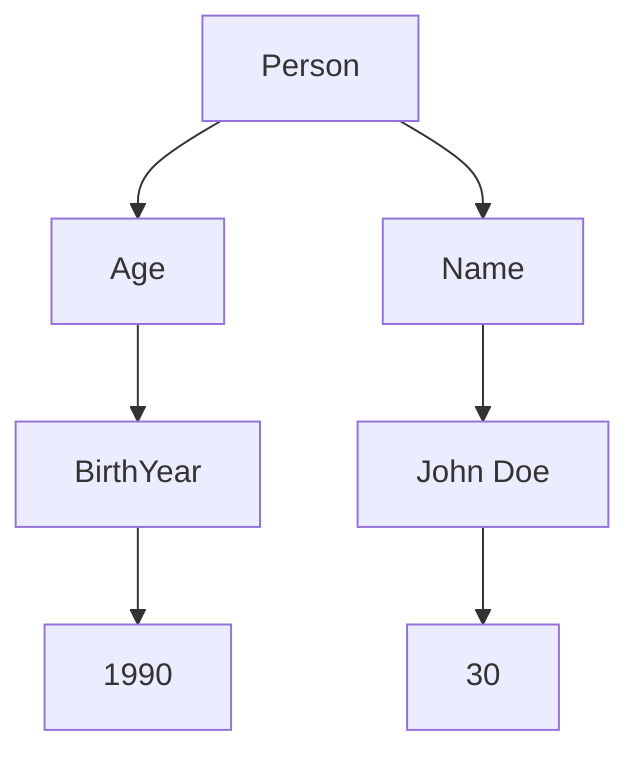

                 

### 第1章：数据可视化简介

#### 1.1 数据可视化的定义和重要性

**1.1.1 数据可视化的定义**

数据可视化，顾名思义，是指将数据通过图形、图表、地图或其他视觉形式表示出来的过程。它不仅限于二维或三维的图形表示，还包括交互式可视化、动态可视化等多种形式。数据可视化的目标是将大量复杂的数据转化为直观、易于理解的视觉信息，以便人们能够迅速捕捉数据中的趋势、异常和模式。

**1.1.2 数据可视化的重要性**

数据可视化在各个领域都有着广泛的应用和重要意义：

- **提升数据分析效率**：通过可视化，可以快速识别数据中的关键信息，减少数据分析的时间和复杂性。

- **增强数据的可理解性**：复杂数据通过图形化展示，使非专业人士也能轻松理解，从而促进数据驱动的决策。

- **支持业务洞察**：通过数据可视化，企业可以更好地发现业务中的潜在问题和机会，从而优化业务策略。

- **促进知识传播**：在科研、教育等领域，数据可视化有助于知识的传播和分享，使得研究成果更容易被公众接受。

#### 1.2 数据可视化的发展历史

数据可视化技术的发展历程可以追溯到20世纪中期。以下是数据可视化发展历史上的几个重要阶段：

- **早期阶段（1950-1970年代）**：在这个时期，计算机刚刚开始普及，数据可视化主要采用二维图表，如条形图、折线图等。

- **中期阶段（1970-1990年代）**：随着计算机性能的提升，数据可视化技术得到了显著发展。在这个时期，三维图表、动态可视化等新形式开始出现。

- **现代阶段（1990年代至今）**：随着互联网和大数据技术的兴起，数据可视化迎来了一个新的高潮。交互式可视化、动态可视化、虚拟现实等新技术层出不穷。

#### 1.3 数据可视化与信息科学的关系

数据可视化是信息科学的一个重要分支，它与信息科学有着紧密的联系：

- **数据科学中的数据可视化**：在数据科学中，数据可视化是数据分析和数据挖掘的重要工具。通过可视化，数据科学家可以更好地理解数据，发现数据中的模式，验证模型的准确性。

- **信息科学中的数据可视化**：在信息科学中，数据可视化主要用于信息检索、信息组织和信息传播。通过可视化技术，用户可以更有效地浏览和检索信息。

接下来，我们将继续探讨数据可视化核心概念，以及数据可视化与知识发现的关系。

---

#### 1.1 数据可视化的定义和重要性

**1.1.1 数据可视化的定义**

数据可视化，是指利用视觉元素（如颜色、形状、大小等）来表示数据，从而帮助人们理解和分析数据的过程。数据可视化不仅仅是对数据进行图形化展示，它还包括了数据预处理、数据分析、数据交互等多个方面。通过将数据转化为视觉形式，数据可视化能够使复杂的信息变得更加直观和易于理解。

**1.1.2 数据可视化的重要性**

数据可视化在现代社会中扮演着至关重要的角色，主要体现在以下几个方面：

- **提高数据分析效率**：数据可视化使得数据分析过程变得更加高效。通过图形化的方式，人们可以快速地识别数据中的关键信息和趋势，而无需逐行逐列地阅读大量数据。

- **增强数据解释力**：图形化的数据展示方式可以使得数据分析结果更加直观，从而提高数据解释力。尤其是在处理大量数据时，可视化技术能够显著降低理解数据的难度。

- **促进知识发现**：数据可视化技术可以帮助人们从数据中发现潜在的模式和关系，这对于知识发现和科学研究具有重要意义。

- **支持决策制定**：在商业、金融、医疗等多个领域，数据可视化技术为决策制定提供了有力支持。通过可视化分析，决策者可以更加清晰地了解数据的含义，从而做出更加明智的决策。

- **提升数据传播效果**：在教育和媒体领域，数据可视化技术能够使得信息的传播更加生动和有效。通过图表、图像等视觉元素，数据可视化能够更好地吸引读者的注意力，提升信息的传播效果。

综上所述，数据可视化不仅是数据分析的有力工具，也是知识发现和决策制定的重要支撑。在接下来的内容中，我们将进一步探讨数据可视化的核心概念和发展历史。

---

#### 1.2 数据可视化的发展历史

**1.2.1 起源与发展**

数据可视化的概念最早可以追溯到17世纪，当时数学家和科学家如约翰·泰勒（John Tyndall）和查尔斯·约瑟夫·矿特拉（Charles Joseph Minard）开始使用图表和图形来表示数据。泰勒通过制作冰冻气泡图来展示冰川融化情况，而矿特拉则绘制了一张著名的拿破仑军队行军图，用线条和颜色变化来展示军队的行军路线、天气状况和士兵数量的变化。

20世纪中叶，随着计算机技术的迅速发展，数据可视化迎来了新的发展机遇。1960年代，约翰·诺曼（John N. Warfield）提出了“信息视觉化”（Information Visualization）的概念，标志着数据可视化作为独立学科的诞生。在这一时期，艾伦·麦席森·图灵（Alan Mathison Turing）提出了图灵测试，对人工智能和信息处理产生了深远影响。

进入1970年代，随着计算机图形学和可视化技术的进步，二维图表和简单的三维图表开始广泛应用于数据分析中。著名的软件系统如IBM的Sanford和惠普的HP-GL/2为数据可视化提供了强大的工具。同一时期，欧洲的学术界也在数据可视化领域进行了积极的探索，如德国的马普学会（Max Planck Society）推出的数据可视化工具系列。

**1.2.2 中期阶段的发展**

1980年代和1990年代是数据可视化技术快速发展的时期。这一时期，个人计算机的普及和图形用户界面（GUI）的出现，使得数据可视化技术得以更广泛地应用于商业和科学研究领域。微软的Excel和PowerPoint等办公软件，使得非专业人士也能够轻松创建和共享数据可视化内容。

同时，学术界的探索也在不断深入。加州大学伯克利分校的比尔·乔伊（Bill Joy）和斯坦福大学的约翰·艾德勒曼（John Adler）等人，推动了交互式可视化技术的发展。1990年代，随着互联网的兴起，在线数据可视化工具如Google Charts和Flash（现Adobe Animate）的出现，极大地扩展了数据可视化应用的范围。

**1.2.3 现代阶段的发展**

进入21世纪，数据可视化技术进入了现代阶段。随着大数据和云计算技术的发展，数据量急剧增加，对数据可视化技术提出了更高的要求。现代数据可视化技术开始融合人工智能和机器学习，利用算法和模型来自动分析数据，生成更加智能和个性化的可视化内容。

这一时期，开源可视化库如D3.js和Plotly的出现，使得数据可视化开发变得更加灵活和高效。虚拟现实（VR）和增强现实（AR）技术的进步，也为数据可视化提供了新的途径，使得用户可以在沉浸式环境中进行数据探索。

此外，随着移动设备的普及，数据可视化技术也在不断适应新的平台和设备，提供更加便捷和高效的数据分析体验。

总的来说，数据可视化技术的发展经历了从简单到复杂、从独立到融合的过程。从早期的图表制作，到现代的交互式和智能可视化，数据可视化已经成为数据分析、知识发现和决策支持不可或缺的工具。

---

#### 1.3 数据可视化与信息科学的关系

**1.3.1 数据可视化在数据科学中的应用**

数据科学是利用统计学、机器学习和人工智能等技术，从数据中提取有价值信息的一门学科。数据可视化在数据科学中扮演着至关重要的角色，主要体现在以下几个方面：

- **数据探索与理解**：数据科学家经常需要对大量数据进行初步探索，以了解数据的基本特征和趋势。数据可视化技术可以帮助他们快速识别数据中的异常、模式和相关关系，从而为后续的数据分析工作提供指导。

- **数据解释与验证**：数据可视化使得数据科学家能够将复杂的分析结果以直观的方式展示给非专业人士，如业务决策者、学术界同行等。这不仅有助于解释数据分析的过程和结论，还可以验证模型的有效性和可靠性。

- **交互式数据分析**：交互式可视化工具允许用户通过鼠标点击、缩放和筛选等操作与数据交互，从而实现更为灵活和深入的数据分析。这种交互性能够显著提升数据分析的效率和效果。

**1.3.2 数据可视化在信息科学中的应用**

信息科学是研究信息存储、检索、传输、处理和应用的科学。数据可视化技术在信息科学领域也有广泛应用：

- **信息检索与组织**：在信息检索系统中，数据可视化技术可以帮助用户更直观地浏览和组织大量信息。例如，通过关键词云图和关系图，用户可以快速找到相关的文档或信息。

- **人机交互**：在用户界面设计领域，数据可视化技术可以提高用户与系统的交互体验。通过图形化表示，用户可以更容易理解系统提供的信息，并快速进行操作。

- **信息可视化**：在信息可视化领域，数据可视化技术被广泛应用于各种领域，如社会网络分析、知识图谱构建等。通过可视化，复杂的结构化或非结构化信息可以被转化为易于理解的形式。

**1.3.3 数据可视化在知识发现中的应用**

知识发现是数据挖掘的一个重要目标，旨在从大量数据中发现隐含的、未知的模式或规则。数据可视化在知识发现中具有以下作用：

- **模式识别与验证**：数据可视化可以帮助研究人员识别出数据中的潜在模式和趋势，并通过可视化验证这些模式的准确性和可靠性。

- **知识传播与共享**：知识发现的结果通常以数据可视化形式呈现，使得知识能够更加直观地传播和共享。这有助于促进跨学科和跨领域的知识交流与合作。

- **支持决策制定**：在决策支持系统中，数据可视化技术可以帮助决策者快速理解数据中的关键信息和潜在风险，从而做出更加明智的决策。

综上所述，数据可视化不仅在数据科学和信息科学中发挥着重要作用，而且在知识发现和决策支持中也具有重要应用价值。通过数据可视化，我们可以更好地理解和利用数据，推动科学研究和实际应用的发展。

---

#### 1.1 数据可视化的定义和重要性

**1.1.1 数据可视化的定义**

数据可视化，是将数据转换为图形、图像或其他视觉表现形式的过程。这种转换旨在通过视觉元素（如颜色、形状、大小等）来传达数据背后的信息和模式，从而帮助用户更直观地理解数据。数据可视化不仅限于二维或三维图表，还包括交互式可视化、动态可视化等多种形式。

数据可视化不仅仅是将数据展示出来，它还涉及数据预处理、数据分析和数据交互等多个方面。通过对数据进行适当的处理和加工，数据可视化可以帮助用户发现数据中的规律、趋势和异常，为决策提供支持。

**1.1.2 数据可视化的重要性**

数据可视化在现代信息社会中的重要性体现在以下几个方面：

- **提升数据分析效率**：通过数据可视化，用户可以迅速识别数据中的关键信息和趋势，减少对大量数据的逐行逐列分析，从而提高数据分析的效率。

- **增强数据可理解性**：复杂数据通过图形化的方式展示，使得非专业人士也能轻松理解，降低了数据理解门槛，促进了数据驱动的决策。

- **支持业务洞察**：数据可视化有助于企业更好地发现业务中的问题和机会，从而优化业务策略，提高运营效率。

- **促进知识传播**：在科研、教育等领域，数据可视化技术使得研究成果更容易被公众接受，促进了知识的传播和分享。

- **提升数据传播效果**：在媒体和传播领域，数据可视化使得信息更加生动和易于理解，提高了信息传播的效果。

- **支持科学探索**：在科研领域，数据可视化可以帮助研究人员更好地理解复杂的科学现象，发现新的研究线索。

总之，数据可视化是数据分析和决策支持的重要工具，它不仅提高了数据分析的效率，还增强了数据理解和传播的效果，为各个领域的发展提供了强有力的支持。

---

#### 1.2 数据可视化的发展历史

**1.2.1 起源与发展**

数据可视化技术的发展可以追溯到17世纪，当时的科学家和数学家开始尝试使用图表来展示数据。最著名的例子之一是法国工程师查尔斯·约瑟夫·明特尔（Charles Joseph Minard）在1858年绘制的“拿破仑大军行军图”，这幅图表通过线条和颜色的变化，详细展示了拿破仑军队在1812年入侵俄国的行军路线、士兵数量以及天气条件的变化，这是数据可视化历史上的一个重要里程碑。

20世纪中叶，随着计算机技术的兴起，数据可视化迎来了新的发展机遇。1950年代，计算机图形学开始逐渐成熟，约翰·诺曼（John N. Warfield）在1960年代提出了“信息视觉化”的概念，标志着数据可视化作为一门独立学科的诞生。早期的数据可视化主要是通过简单的二维图表来表示数据，如条形图、折线图和饼图等。

**1.2.2 中期阶段的发展**

1970年代和1980年代是数据可视化技术快速发展的时期。随着个人计算机的普及和图形用户界面（GUI）的兴起，数据可视化技术逐渐从专业领域走向大众市场。微软的Excel和PowerPoint等软件的广泛使用，使得非专业人士也能够轻松创建和共享数据可视化内容。

同一时期，学术界的探索也在不断深入。比尔·乔伊（Bill Joy）和约翰·艾德勒曼（John Adler）等人在交互式可视化技术方面做出了重要贡献，推动了数据可视化技术的进一步发展。1980年代，计算机图形学和图形处理器的进步，使得三维图表和动态可视化成为可能。

**1.2.3 现代阶段的发展**

进入21世纪，数据可视化技术进入了现代阶段。随着互联网和大数据技术的发展，数据量呈指数级增长，对数据可视化技术提出了更高的要求。现代数据可视化技术开始融合人工智能和机器学习，利用算法和模型来自动分析数据，生成更加智能和个性化的可视化内容。

这一时期，开源可视化库如D3.js和Plotly的出现，使得数据可视化开发变得更加灵活和高效。虚拟现实（VR）和增强现实（AR）技术的进步，也为数据可视化提供了新的途径，使得用户可以在沉浸式环境中进行数据探索。

此外，随着移动设备的普及，数据可视化技术也在不断适应新的平台和设备，提供更加便捷和高效的数据分析体验。现代数据可视化技术的进步，不仅提高了数据分析的效率，还使得数据可视化应用的范围更加广泛，从商业分析到科学研究，再到公共政策和教育等领域，都得到了广泛应用。

总的来说，数据可视化技术的发展历程是一个不断创新和扩展的过程。从早期的简单图表，到现代的复杂交互式和动态可视化技术，数据可视化已经成为了数据分析、知识发现和决策支持不可或缺的工具。

---

#### 1.3 数据可视化与信息科学的关系

**1.3.1 数据可视化在信息科学中的应用**

信息科学是研究信息的存储、检索、处理和传输的学科，而数据可视化作为其重要组成部分，在信息科学领域有着广泛的应用：

- **信息检索**：数据可视化通过图形化的方式，帮助用户更好地理解搜索结果，从而提高信息检索的效率和准确性。例如，关键词云图可以直观地展示搜索结果中的高频词，帮助用户快速定位相关信息。

- **信息组织**：数据可视化有助于对大量信息进行有效的组织和分类。通过可视化技术，可以将复杂的信息结构以图形的形式展现出来，使得用户能够更清晰地理解信息的层次和关联。

- **人机交互**：在信息科学中，数据可视化技术能够增强用户与系统之间的交互体验。通过图形化界面，用户可以更直观地操作系统，并实时获取反馈信息。

- **信息传播**：在媒体和公共信息发布领域，数据可视化使得信息传播更加生动和有效。通过图表、图像等视觉元素，信息能够以更加引人注目的方式传达给受众。

**1.3.2 数据可视化在知识发现中的应用**

知识发现是数据挖掘的一个重要目标，旨在从大量数据中发现隐含的、未知的模式或规则。数据可视化在知识发现中发挥着关键作用：

- **模式识别**：通过可视化技术，研究人员可以直观地识别数据中的潜在模式和趋势。这种视觉化的方式有助于发现数据中的异常点和关键特征。

- **解释与验证**：数据可视化使得研究人员能够将复杂的数据挖掘结果以直观的形式展示给非专业人士。这不仅有助于解释数据分析的过程和结果，还可以验证模型的准确性和有效性。

- **交互式探索**：交互式可视化工具允许用户通过缩放、筛选和过滤等操作与数据互动，从而进行更为深入的数据探索。这种交互性有助于发现更多的知识，并优化数据分析流程。

- **知识传播**：知识发现的结果通常以数据可视化形式呈现，使得知识能够更加直观地传播和共享。这种可视化方式有助于促进跨学科和跨领域的知识交流与合作。

总之，数据可视化不仅是信息科学中不可或缺的工具，也在知识发现中发挥着重要作用。通过数据可视化，我们可以更好地理解和利用数据，推动科学研究和实际应用的发展。

---

### 第2章：数据可视化核心概念

在数据可视化中，核心概念包括数据类型的可视化、可视化元素和图表，以及数据可视化设计原则。这些概念为我们理解和创建有效的数据可视化提供了基础。

#### 2.1 数据类型的可视化

数据类型是数据可视化的基础。不同类型的数据需要不同的可视化方法来表示。以下是几种常见的数据类型及其对应的可视化方法：

- **结构化数据**：结构化数据通常是表格形式，如数据库、电子表格等。这类数据适合使用条形图、折线图、饼图等图表进行可视化。
  
- **非结构化数据**：非结构化数据如文本、图像、音频等，通常难以直接可视化。但是，可以通过文本分析（如词云）和图像处理（如热力图）等方法进行可视化。

- **时间序列数据**：时间序列数据表示随时间变化的数据。这类数据通常使用折线图、K线图等来展示，以便观察趋势和周期性变化。

- **空间数据**：空间数据表示地理信息，如地图、卫星图像等。这类数据通常使用地图、热力图等可视化方法。

#### 2.2 可视化元素和图表

可视化元素和图表是数据可视化的核心组成部分。以下是几种常见的可视化元素和图表类型：

- **可视化元素**：
  - **数据点**：图表中的基本元素，通常表示数据集中的单个数值。
  - **线条**：用于连接数据点，展示趋势和变化。
  - **区域**：表示数据范围的图形，如条形图的背景区域。
  - **颜色**：用于区分不同的数据集或数据点。
  - **形状**：用于表示特定的数据类型或分类。

- **图表类型**：
  - **条形图**：用于比较不同类别的数据值。
  - **折线图**：用于展示数据随时间的变化趋势。
  - **饼图**：用于展示数据在各部分中的比例分布。
  - **散点图**：用于展示数据点之间的关系和分布。
  - **地图**：用于展示地理空间数据。
  - **热力图**：用于展示数据的密集度或强度。

#### 2.3 数据可视化设计原则

设计数据可视化时，应遵循以下原则，以确保信息传达的准确性和有效性：

- **简洁性**：避免过多的装饰，保持图表简洁明了，突出关键信息。
- **一致性**：图表的样式、颜色和布局应保持一致，以提高可读性。
- **清晰性**：图表中的文字和标签应清晰易读，避免使用复杂的术语。
- **交互性**：提供交互功能，如缩放、过滤、搜索等，以增强用户体验。
- **对比性**：使用颜色、大小等对比元素，以突出重要数据和趋势。

通过理解和应用这些核心概念，我们可以创建出更加有效和具有影响力的数据可视化作品。

---

#### 2.1 数据类型的可视化

**2.1.1 结构化数据可视化**

结构化数据是指那些以表格形式存储，有着固定结构和格式的数据，如数据库中的关系表、电子表格等。这种数据类型是数据可视化中最常见的，通常使用以下几种图表进行可视化：

- **条形图**：适用于比较不同类别的数据值。例如，不同产品在某月的销售量。
- **折线图**：适用于展示数据随时间的变化趋势。例如，某商品在过去一年的月销售数据。
- **饼图**：适用于展示各部分数据在整体中的比例分布。例如，公司各部门的预算分配。
- **散点图**：适用于展示两组数据之间的关系。例如，股票价格与交易量之间的关系。

**2.1.2 非结构化数据可视化**

非结构化数据是指那些没有固定格式，难以用传统表格方式存储和表示的数据，如文本、图像、音频等。针对这类数据，需要采用特定方法进行可视化：

- **词云**：通过文字的大小和颜色，展示文本数据中出现频率较高的词汇。例如，文章中关键词的权重分布。
- **热力图**：通过颜色深浅表示图像或矩阵中不同区域的值。例如，面部表情识别中的像素值分布。
- **图像分割**：将图像分割成不同区域，每个区域表示不同的数据值。例如，医学图像中的病灶区域标记。

**2.1.3 时间序列数据可视化**

时间序列数据是指随时间变化而记录下来的数据，如股票价格、气象数据等。这类数据通常使用以下图表进行可视化：

- **折线图**：适用于展示随时间变化的数据趋势，如股票价格走势图。
- **K线图**：适用于金融数据分析，展示一段时间内开盘价、收盘价、最高价和最低价等。
- **时间条形图**：适用于展示特定时间段内数据的变化，如每日气温变化图。

**2.1.4 空间数据可视化**

空间数据是指具有地理特征的数据，如地图数据、卫星图像等。这类数据通常使用以下图表进行可视化：

- **地图**：通过地理位置展示数据分布，如人口密度地图。
- **地理信息系统（GIS）**：结合地图和数据，进行空间分析和可视化，如交通流量分析。
- **热力地图**：通过颜色表示不同地理位置的数据值，如城市温度分布图。

通过以上方法，我们可以针对不同类型的数据，选择合适的可视化手段，使得数据信息更加直观和易于理解。

---

#### 2.2 可视化元素和图表

**2.2.1 可视化元素**

数据可视化中的基本元素包括：

- **数据点**：数据点的可视表示是数据可视化中最基础的元素。它通常以点的形式展示在图表上，可以表示单个数据值。在散点图中，每个点代表一对（或更多）数据值，通过点的位置和大小来传达数据的关系和特征。

- **线条**：线条用于连接数据点，显示数据的变化趋势。在折线图和曲线图中，线条可以直观地展示数据随时间或其他变量的变化。线条的斜率、方向和长度可以反映数据的增长、下降或波动。

- **区域**：区域图通过填充颜色或图案来表示数据范围或区间。例如，条形图中的背景区域可以表示每个类别的数据总和或平均值。区域图适合展示数据的总量、分布和趋势。

- **颜色**：颜色是数据可视化中的一个重要元素，用于区分不同的数据集、变量或类别。例如，在散点图中，不同颜色的点可以表示不同的数据类别。颜色也可以通过色域来传达数据的数值范围。

- **形状**：形状用于表示特定的数据类型或分类。例如，在饼图中，不同扇形区域表示不同的数据类别。形状的大小、样式和颜色可以结合使用，增强数据的可读性和直观性。

**2.2.2 常见图表类型**

在数据可视化中，常用的图表类型包括：

- **条形图**：条形图用于比较不同类别的数据值。每个类别用一条垂直或水平的条表示，条的高度或长度与数据值成比例。条形图适用于展示离散数据，如不同产品的销售量。

- **折线图**：折线图用于展示数据随时间的变化趋势。通过连接各个时间点的数据点，折线图可以直观地显示数据的变化趋势。折线图适用于时间序列数据，如股票价格、温度变化等。

- **饼图**：饼图用于展示各部分数据在整体中的比例分布。整个饼表示整体数据，各个扇形区域表示不同部分的数据，扇形的大小与各部分的比例成正比。饼图适用于展示分类数据的比例关系。

- **散点图**：散点图用于展示两组数据之间的关系。每个数据点由其在横轴和纵轴上的坐标表示，点的位置可以反映数据之间的相关性。散点图适用于探索变量之间的线性或非线性关系。

- **地图**：地图用于展示地理空间数据。通过颜色、符号和线条，地图可以直观地显示不同区域的数据值。地图适用于展示人口分布、交通流量、气候条件等地理数据。

- **热力图**：热力图通过颜色深浅表示数据值的大小或密集度。热力图适用于展示矩阵数据、图像数据和复杂数据的分布情况。例如，热力图可以用于展示面部表情的像素值分布或文本分析中的关键词频率。

- **箱线图**：箱线图用于展示一组数据的分布情况。箱线图包括五个关键值：最小值、第一四分位数、中位数、第三四分位数和最大值。箱线图适用于展示数据的中心趋势和离散度。

- **气泡图**：气泡图类似于散点图，但每个点的大小由第三个变量的值决定。气泡图适用于展示三个变量之间的关系，如市场规模、利润率和竞争程度。

通过使用这些可视化元素和图表类型，数据可视化不仅能够展示数据，还能够传达数据之间的复杂关系，帮助用户更好地理解和分析数据。

---

#### 2.3 数据可视化设计原则

数据可视化设计不仅要使信息直观易懂，还要确保其准确性和有效性。以下是几个关键的设计原则：

**2.3.1 设计原则**

- **一致性**：保持图表的样式、颜色和布局一致，确保用户在浏览多个图表时能够形成连贯的认知。

- **简洁性**：避免不必要的装饰和细节，保持图表简洁明了。这有助于用户更快地捕捉到关键信息。

- **清晰性**：图表中的文字、标签和标注应清晰易读，避免使用复杂的术语。使用简单的语言和直观的符号来传达信息。

- **对比性**：通过颜色、大小、形状等对比元素，突出重要数据和趋势。对比性有助于用户快速区分不同的数据类别和变化。

- **交互性**：提供交互功能，如缩放、筛选、过滤等，增强用户与数据的互动。交互性使得用户能够更深入地探索数据。

- **准确性和可靠性**：确保图表展示的数据准确无误，避免误导用户。数据的来源、处理和计算方法应在图表中明确标注。

- **上下文**：在图表中提供上下文信息，如数据的时间范围、地理位置等，帮助用户更好地理解数据的背景。

- **注释和说明**：为复杂的图表提供注释和说明，解释图表的构造和如何解读数据。

通过遵循这些设计原则，数据可视化不仅能够更好地传达信息，还能提升用户的使用体验和决策质量。

---

### 第3章：知识发现引擎基础

知识发现引擎是一种用于从大量数据中自动识别出潜在知识、模式、趋势和关联的智能系统。它广泛应用于商业分析、科研、金融、医疗等多个领域，对提升决策效率、推动技术创新具有重要意义。本章节将详细探讨知识发现引擎的概念、功能和开发过程。

#### 3.1 知识发现的概念

知识发现（Knowledge Discovery in Databases，KDD）是数据挖掘（Data Mining）的一部分，它是指从大量数据中通过特定的算法和过程，识别出潜在的有价值信息或知识的过程。知识发现通常包括以下步骤：

- **数据预处理**：清洗和准备数据，以便于进一步分析。
- **数据集成**：将来自不同来源的数据整合在一起。
- **数据选择**：选择用于分析的数据子集。
- **数据变换**：将数据转换为适合挖掘的格式。
- **数据挖掘**：使用算法从数据中挖掘出模式、规则和关联。
- **模式评估**：评估挖掘出的模式的有效性和价值。
- **知识表示**：将挖掘出的知识以可理解的形式展示。

#### 3.2 知识发现引擎的功能

知识发现引擎具有多种功能，这些功能使其能够从复杂的数据集中提取出有价值的信息。以下是知识发现引擎的主要功能：

- **数据预处理**：知识发现引擎首先需要对数据进行预处理，包括数据清洗、数据去重、数据归一化等操作，以确保数据的质量和一致性。

- **数据挖掘**：通过应用各种数据挖掘算法，如关联规则挖掘、聚类分析、分类、预测等，知识发现引擎能够从数据中发现潜在的模式和关联。

- **知识表示**：将挖掘出的知识以直观的形式展示，如可视化图表、报表、知识图谱等，以便用户理解和利用。

- **交互式查询**：用户可以通过交互式界面查询和探索数据，查看挖掘出的模式及其细节。

- **预测与决策支持**：知识发现引擎可以基于历史数据预测未来趋势，为决策提供支持。

- **异常检测**：通过检测数据中的异常点，知识发现引擎可以帮助用户发现潜在的欺诈、故障或其他问题。

- **知识库构建与维护**：知识发现引擎能够构建和维护一个知识库，存储和更新挖掘出的知识，以便后续的分析和查询。

#### 3.3 知识发现的过程和方法

知识发现是一个复杂的过程，涉及多个步骤和方法的综合应用。以下是知识发现的主要过程和方法：

- **数据收集**：从各种数据源（如数据库、日志文件、传感器等）收集数据。

- **数据预处理**：清洗和准备数据，以消除噪声和异常值，提高数据质量。

- **数据探索**：对数据集进行初步分析，了解数据的基本特征和分布。

- **模式识别**：使用算法挖掘数据中的潜在模式，如关联规则、聚类结果等。

- **模式评估**：评估挖掘出的模式的有效性和价值，确定哪些模式对用户最有用。

- **知识表示**：将挖掘出的知识以可视化、报表等形式呈现，便于用户理解。

- **知识应用**：将知识应用于实际业务或科研中，如优化决策、支持新产品开发等。

知识发现引擎是现代信息社会中的重要工具，它通过自动化和智能化的方式，帮助企业和研究人员从海量数据中提取有价值的信息，为数据驱动的决策提供支持。在接下来的章节中，我们将进一步探讨知识表示与建模、知识发现算法，以及数据可视化在知识发现中的应用。

---

#### 3.1 知识发现的概念

**3.1.1 知识发现的定义**

知识发现（Knowledge Discovery in Databases，简称KDD）是一个从大量数据中自动识别出潜在有用模式、关联、趋势和规则的过程。它涉及一系列步骤，包括数据预处理、数据探索、模式识别、模式评估、知识表示等。知识发现的本质是通过智能分析技术，将数据转化为有价值的知识，以支持决策制定、业务优化、科研创新等。

**3.1.2 知识发现的目标**

知识发现的主要目标是实现以下目标：

- **发现潜在的模式和关联**：通过数据挖掘算法，从数据中识别出隐藏的规律和关系。
- **优化决策支持**：利用挖掘出的知识，为决策者提供基于数据的分析和建议。
- **提高业务效率**：通过数据驱动的优化，提高业务流程的效率和效果。
- **促进科研创新**：为研究人员提供新的发现和见解，推动科学研究的进步。

**3.1.3 知识发现的过程**

知识发现的过程通常包括以下几个主要步骤：

1. **数据收集**：从各种数据源收集原始数据，这些数据可以来自数据库、日志文件、传感器、网页等。

2. **数据预处理**：清洗和准备数据，包括去除噪声、处理缺失值、数据归一化等，以提高数据质量。

3. **数据探索**：对数据进行初步分析，通过统计方法、图表等方式了解数据的基本特征和分布情况。

4. **模式识别**：应用各种数据挖掘算法，从数据中发现潜在的规律和模式。常见的算法包括关联规则挖掘、聚类分析、分类和预测等。

5. **模式评估**：评估挖掘出的模式的有效性和价值，确定哪些模式对用户最有用。评估标准可以包括模式的支持度、可信度、兴趣度等。

6. **知识表示**：将挖掘出的知识以直观的形式表示，如可视化图表、报表、知识图谱等，以便用户理解和利用。

7. **知识应用**：将知识应用于实际业务或科研中，如优化决策流程、支持新产品开发、改进业务策略等。

知识发现是一个迭代和不断优化的过程，通过不断地数据分析和模式评估，可以逐步提升知识发现的准确性和实用性。

---

#### 3.2 知识发现引擎的功能

**3.2.1 数据预处理**

数据预处理是知识发现过程中的关键步骤，其目标是清洗和准备数据，以提高数据质量并简化后续的分析过程。具体功能包括：

- **数据清洗**：去除重复数据、处理缺失值和异常值，确保数据的一致性和完整性。
- **数据归一化**：将不同数据范围和单位的数据转换为同一尺度，以便比较和计算。
- **特征提取**：从原始数据中提取有用的特征，减少数据的维度，提高分析的效率和效果。

**3.2.2 知识表示**

知识表示是将挖掘出的模式、规则和关联以可理解的形式展示给用户的过程。具体功能包括：

- **可视化展示**：使用图表、报表、知识图谱等可视化工具，将数据中的模式和关联直观地呈现给用户。
- **文本表示**：将挖掘结果以文本形式记录，便于用户查阅和分享。
- **知识库构建**：将挖掘出的知识存储在知识库中，为后续的查询和分析提供支持。

**3.2.3 知识挖掘**

知识挖掘是知识发现引擎的核心功能，它通过应用各种算法和模型，从数据中自动识别出潜在的规律和关联。具体功能包括：

- **关联规则挖掘**：发现数据项之间的关联性，如购物篮分析中的商品组合。
- **聚类分析**：将相似的数据对象分组，以便于分析和管理。
- **分类和预测**：根据历史数据预测未来趋势和事件，为决策提供支持。
- **异常检测**：识别数据中的异常点，帮助用户发现潜在的问题和风险。

**3.2.4 交互式查询**

交互式查询功能使得用户能够动态地查询和分析数据，增强用户体验。具体功能包括：

- **查询接口**：提供友好的查询界面，支持多种查询方式，如关键词搜索、条件筛选等。
- **可视化交互**：通过交互式可视化工具，用户可以缩放、筛选、过滤数据，深入了解数据的细节。
- **实时更新**：支持实时数据更新，确保用户获取到最新的分析结果。

**3.2.5 预测与决策支持**

知识发现引擎通过预测和决策支持功能，帮助用户从数据中发现趋势和模式，为业务决策提供支持。具体功能包括：

- **趋势预测**：基于历史数据预测未来的趋势和变化，为战略规划提供依据。
- **决策支持**：通过分析数据和模式，为用户提供基于数据的决策建议，如产品定价、库存管理等。
- **风险管理**：识别潜在的风险和机会，帮助用户制定风险管理策略。

通过以上功能，知识发现引擎能够帮助用户从海量数据中提取有价值的信息，为业务决策提供数据支持，从而提升企业的竞争力。

---

#### 3.3 知识发现的过程和方法

知识发现是一个复杂且迭代的过程，它包括多个步骤和方法，以下是一个典型的知识发现过程及其方法：

**3.3.1 数据收集**

数据收集是知识发现的第一步，涉及从各种来源获取原始数据。数据来源可以包括数据库、日志文件、传感器数据、Web抓取等。为了确保数据的质量，需要关注以下几个方面：

- **数据完整性**：确保收集的数据是完整的，没有缺失或重复。
- **数据多样性**：收集来自不同来源的数据，以获得更全面的视角。
- **数据来源可靠性**：选择可靠的数据来源，以确保数据的准确性和可信度。

**3.3.2 数据预处理**

数据预处理是确保数据质量的重要步骤，它包括以下任务：

- **数据清洗**：去除重复数据、纠正数据中的错误、处理缺失值等。
- **数据归一化**：将不同尺度或单位的数据转换为同一尺度，以便比较和分析。
- **特征提取**：从原始数据中提取有用的特征，减少数据的维度，提高分析的效率。

**3.3.3 数据探索**

数据探索是对数据进行初步分析，以了解数据的基本特征和分布。这一步通常包括以下方法：

- **描述性统计分析**：计算数据的均值、中位数、标准差等基本统计量，了解数据的基本分布情况。
- **可视化分析**：使用图表（如条形图、折线图、散点图等）展示数据的分布和趋势。
- **探索性数据分析**：使用探索性数据分析（EDA）方法，深入分析数据的细节和潜在的模式。

**3.3.4 模式识别**

模式识别是知识发现的核心步骤，通过应用各种数据挖掘算法，从数据中识别出潜在的规律和关联。以下是一些常见的数据挖掘算法：

- **关联规则挖掘**：发现数据项之间的关联性，如购物篮分析中的商品组合。
- **聚类分析**：将相似的数据对象分组，以便于分析和管理。
- **分类和预测**：根据历史数据预测未来趋势和事件，为决策提供支持。
- **异常检测**：识别数据中的异常点，帮助用户发现潜在的问题和风险。

**3.3.5 模式评估**

模式评估是对挖掘出的模式进行评估，以确定其有效性和价值。以下是一些常见的评估方法：

- **统计评估**：使用统计学方法评估模式的准确性、精度、召回率等指标。
- **业务评估**：从业务角度评估模式的应用价值，确定其对业务决策的支持程度。
- **用户评估**：收集用户对模式的反馈，评估用户对模式的接受度和满意度。

**3.3.6 知识表示**

知识表示是将挖掘出的模式以直观的形式展示给用户，以便用户理解和利用。以下是一些常见的知识表示方法：

- **可视化表示**：使用图表、报表、知识图谱等可视化工具，将数据中的模式和关联直观地呈现给用户。
- **文本表示**：将挖掘结果以文本形式记录，便于用户查阅和分享。
- **知识库构建**：将挖掘出的知识存储在知识库中，为后续的查询和分析提供支持。

通过以上步骤和方法，知识发现过程能够帮助用户从海量数据中提取有价值的信息，为决策制定提供数据支持。在接下来的章节中，我们将进一步探讨知识表示与建模、知识发现算法，以及数据可视化在知识发现中的应用。

---

### 第4章：知识表示与建模

知识表示与建模是知识发现引擎中的关键环节，其目标是构建一个结构化、可理解的知识体系，以便于数据分析和知识应用。本章将详细介绍知识表示、知识建模技术，以及知识库的构建与维护。

#### 4.1 知识表示方法

知识表示是将数据中的信息抽象为易于处理和理解的形式，它是知识建模的基础。以下是一些常见的知识表示方法：

- **符号表示**：符号表示是通过符号、符号系统或形式语言来表示知识。例如，逻辑符号、数学公式等。符号表示方法通常用于表示逻辑关系、数学模型等。

- **语义表示**：语义表示是通过语义网络、本体论等方法来表示知识。语义网络是一种基于节点和边的关系图，用于表示实体及其相互关系。本体论则是研究知识表示和语义理解的学科，通过定义概念、属性和关系来构建领域知识体系。

- **结构化表示**：结构化表示是将数据按照一定的结构进行组织，如XML、RDF等。XML（可扩展标记语言）和RDF（资源描述框架）都是用于表示结构化数据的标记语言，它们通过标签和属性来定义数据的内容和结构。

- **图形表示**：图形表示是通过图表、图形和可视化方法来表示知识。例如，知识图谱、决策树、网络图等。图形表示方法直观、易于理解，适合展示复杂的关系和层次结构。

#### 4.2 知识建模技术

知识建模是在知识表示的基础上，构建一个结构化的知识体系，以便于知识的存储、检索和应用。以下是一些常见的知识建模技术：

- **本体建模**：本体建模是基于本体论的方法，通过定义概念、属性、关系和实例来构建领域知识体系。本体建模的关键是定义本体框架，包括本体类、属性、关系和实例等。

- **知识图谱**：知识图谱是一种利用图结构来表示知识的模型，它通过节点表示实体，边表示实体之间的关系，从而构建一个语义网络。知识图谱广泛应用于搜索引擎、智能问答、推荐系统等领域。

- **数据模型**：数据模型是用于表示数据结构的一种方法，常见的有关系模型、层次模型、网状模型等。关系模型是数据库中最常用的模型，通过定义实体、属性和关系来组织数据。

- **语义网络**：语义网络是一种基于节点和边的图结构，用于表示实体及其相互关系。语义网络通过定义概念、属性和关系，构建一个语义丰富的知识体系。

#### 4.3 知识库的构建与维护

知识库是存储和管理知识的数据库，它是知识发现引擎的重要组成部分。知识库的构建与维护包括以下步骤：

- **需求分析**：确定知识库的应用领域和需求，明确需要存储的知识类型和属性。

- **知识采集**：从各种数据源采集知识，包括结构化数据、非结构化数据和外部数据等。

- **知识清洗**：对采集到的知识进行清洗和预处理，去除噪声和冗余，确保知识的一致性和准确性。

- **知识建模**：使用知识建模技术，将清洗后的知识转化为结构化的知识表示形式，构建知识库。

- **知识入库**：将建模后的知识存储到数据库中，确保知识库的结构化和可检索性。

- **知识更新**：定期更新知识库，添加新的知识和删除过时的知识，保持知识库的时效性和准确性。

- **知识维护**：对知识库进行日常维护，包括数据备份、性能优化、安全性管理等。

通过知识表示与建模，我们可以构建一个结构化、可理解的知识体系，为数据分析和知识应用提供基础。知识库的构建与维护确保了知识的存储、检索和应用的高效性，为知识发现引擎的运行提供了有力支持。在接下来的章节中，我们将进一步探讨知识发现算法、数据可视化在知识发现中的应用，以及知识发现引擎的开发环境搭建。

---

#### 4.1 知识表示方法

**4.1.1 知识表示基础**

知识表示是将知识以某种形式表达和存储的过程，它是知识建模和知识发现的基础。在计算机科学和信息科学中，常用的知识表示方法包括以下几种：

- **符号表示**：符号表示方法是通过符号、符号系统或形式语言来表示知识。这种方法常用于表示逻辑关系、数学模型和计算规则等。符号表示的一个典型例子是数学公式和逻辑表达式。

- **语义表示**：语义表示方法是基于语义网络和本体论来表示知识。语义网络通过节点和边来表示实体及其关系，而本体论则通过定义概念、属性和关系来构建领域知识体系。

- **结构化表示**：结构化表示方法是将知识按照一定的结构进行组织，如XML（可扩展标记语言）和RDF（资源描述框架）。这些语言通过标签和属性来定义数据的内容和结构，使数据更易于理解和处理。

- **图形表示**：图形表示方法是通过图表、图形和可视化技术来表示知识。这种方法直观、易于理解，适用于展示复杂的关系和层次结构，如知识图谱、决策树和网络图等。

**4.1.2 常见表示方法**

以下是几种常见的知识表示方法及其特点：

- **符号表示**：
  - **特点**：抽象、精确、易于形式化处理。
  - **应用场景**：逻辑推理、数学建模、编程语言等。

- **语义表示**：
  - **特点**：强调知识的语义和上下文，灵活、可扩展。
  - **应用场景**：自然语言处理、语义网、本体构建等。

- **结构化表示**：
  - **特点**：有序、层次结构，便于存储和检索。
  - **应用场景**：数据库、网页内容、文档管理等。

- **图形表示**：
  - **特点**：直观、视觉化，便于理解和分析。
  - **应用场景**：知识图谱、网络分析、可视化应用等。

通过这些知识表示方法，我们可以将复杂的数据和知识转化为易于处理和理解的形式，为知识发现、数据分析和决策制定提供支持。

---

#### 4.2 知识建模技术

**4.2.1 知识建模基础**

知识建模是知识管理的重要环节，它通过抽象、组织、定义和结构化知识，以便于存储、检索和应用。知识建模的核心在于构建一个结构化的知识体系，使知识能够以标准化的方式表示和传递。

**4.2.2 常见建模技术**

知识建模涉及多种技术，以下是一些常见的知识建模技术：

- **本体建模**：
  - **技术**：本体建模是基于本体论的方法，通过定义概念、属性、关系和实例来构建领域知识体系。本体（Ontology）是知识模型的框架，用于描述领域中的概念及其相互关系。
  - **应用**：在语义网、自然语言处理、智能问答和知识库构建等领域，本体建模有助于实现知识的共享和互操作性。

- **语义网络**：
  - **技术**：语义网络是通过节点和边来表示实体及其关系的图结构。节点表示实体，边表示实体之间的关系，如“是”、“属于”等。
  - **应用**：在信息检索、知识图谱构建和智能推荐系统中，语义网络有助于理解实体之间的语义关系，提高系统的智能化程度。

- **数据模型**：
  - **技术**：数据模型用于描述数据的结构、关系和约束。常见的有关系模型（如SQL数据库）、文档模型（如NoSQL数据库）和图模型等。
  - **应用**：在数据库设计和数据存储中，数据模型有助于组织和管理数据，支持高效的数据查询和分析。

- **框架表示**：
  - **技术**：框架表示方法是通过预定义的框架来组织知识，如业务流程模型（BPMN）、统一建模语言（UML）等。
  - **应用**：在业务流程设计、软件工程和系统分析中，框架表示方法有助于清晰地表达和传递知识。

**4.2.3 知识库构建**

知识库构建是将知识以结构化形式存储和管理的过程，它是知识建模的结果。知识库构建包括以下步骤：

- **需求分析**：明确知识库的应用场景和需求，确定需要存储的知识类型和属性。

- **数据采集**：从各种数据源收集知识，包括内部数据和外部数据。

- **知识清洗**：对采集到的数据进行清洗和预处理，去除噪声和冗余，确保数据的一致性和准确性。

- **知识建模**：使用知识建模技术，将清洗后的数据转化为结构化的知识表示形式。

- **知识存储**：将建模后的知识存储在数据库或知识库中，确保知识库的结构化和可检索性。

- **知识维护**：对知识库进行定期更新和优化，确保知识的时效性和准确性。

通过本体建模、语义网络、数据模型和框架表示等知识建模技术，我们可以构建一个结构化、可管理的知识库，为数据分析和知识应用提供坚实基础。

---

### 第5章：知识发现算法

知识发现算法是知识发现引擎的核心，用于从大量数据中自动识别出潜在的模式、关联、趋势和规则。这些算法广泛应用于商业分析、科研、金融和医疗等领域。本章将详细探讨几种常见的知识发现算法，包括关联规则挖掘、聚类分析和分类算法。

#### 5.1 关联规则挖掘

关联规则挖掘是一种用于发现数据项之间潜在关联的方法。它的目标是识别出数据中同时出现的项之间的关系，从而帮助决策者发现数据背后的模式和规律。

**5.1.1 关联规则基础**

- **概念**：关联规则挖掘基于支持度和可信度两个重要指标。支持度表示一条规则在数据中出现的频率，而可信度则表示规则的前件和后件之间的相关性。

- **公式**：
  - **支持度**：\[support(A \cap B) = \frac{|A \cap B|}{|D|}\]
  - **可信度**：\[confidence(A \rightarrow B) = \frac{|A \cup B|}{|A|}\]

- **常见算法**：Apriori算法、FP-Growth算法等。

**5.1.2 算法原理**

- **Apriori算法**：
  - **原理**：Apriori算法通过逐层递归地生成频繁项集，最终得到关联规则。它的主要步骤包括：
    1. 计算候选1-项集的支持度。
    2. 保留支持度大于最小支持度的频繁1-项集。
    3. 通过组合频繁1-项集生成候选2-项集，并计算支持度。
    4. 重复上述步骤，直到没有新的频繁项集生成。

- **FP-Growth算法**：
  - **原理**：FP-Growth算法通过构建FP-树来发现频繁项集，它避免了生成大量候选集的步骤，提高了算法的效率。FP-Growth算法的主要步骤包括：
    1. 构建FP-树，将数据项按照支持度排序。
    2. 从FP-树中递归地提取频繁项集。
    3. 使用频繁项集生成关联规则。

**5.1.3 应用案例**

- **市场篮子分析**：通过关联规则挖掘，商家可以识别出顾客购买不同商品之间的关联性，从而优化产品摆放和促销策略。

- **推荐系统**：在电子商务平台中，关联规则挖掘可用于生成个性化推荐，提高用户满意度和销售额。

#### 5.2 聚类分析

聚类分析是一种无监督学习方法，用于将数据集分成若干个组（聚类），使得同一个聚类中的数据对象相似度较高，而不同聚类中的对象相似度较低。

**5.2.1 聚类分析基础**

- **概念**：聚类分析旨在通过数据对象之间的相似性度量，将数据划分为不同的簇。

- **相似性度量**：常用的相似性度量方法包括欧氏距离、曼哈顿距离、余弦相似性等。

- **聚类算法**：常见的聚类算法有K-Means、DBSCAN、层次聚类等。

**5.2.2 算法原理**

- **K-Means算法**：
  - **原理**：K-Means算法是一种基于距离度量的聚类算法。它的主要步骤包括：
    1. 初始化K个聚类中心。
    2. 将每个数据对象分配给最近的聚类中心。
    3. 重新计算聚类中心。
    4. 重复步骤2和3，直到聚类中心不再发生显著变化。

- **DBSCAN算法**：
  - **原理**：DBSCAN（Density-Based Spatial Clustering of Applications with Noise）是一种基于密度的聚类算法。它的主要步骤包括：
    1. 选择两个邻域参数：eps（邻域半径）和minPts（最小邻域点数）。
    2. 扫描每个数据点，将其划分为核心点、边界点和噪声点。
    3. 根据核心点和边界点形成簇。

**5.2.3 应用案例**

- **客户细分**：通过聚类分析，企业可以将客户划分为不同的群体，以便于制定个性化的营销策略。

- **图像分割**：聚类分析可用于图像分割，将图像划分为不同的区域，以便于进一步处理和分析。

#### 5.3 分类算法

分类算法是一种有监督学习方法，用于将数据集划分为预定义的类别。它通过已标记的数据集训练分类模型，然后使用该模型对新数据进行分类。

**5.3.1 分类算法基础**

- **概念**：分类算法的目标是根据数据特征将其划分为不同的类别。

- **分类模型**：常见的分类模型包括决策树、随机森林、支持向量机等。

**5.3.2 算法原理**

- **决策树算法**：
  - **原理**：决策树是一种树形结构，每个内部节点表示一个特征，每个分支代表该特征的某个取值，叶子节点表示最终的类别。决策树算法通过递归地将数据划分为不同的类别。

- **随机森林算法**：
  - **原理**：随机森林是一种集成学习方法，通过构建多个决策树并对预测结果进行投票，从而提高分类的准确性和稳定性。

**5.3.3 应用案例**

- **医学诊断**：通过分类算法，医生可以使用历史病例数据来预测新病例的疾病类别。

- **信用评分**：金融机构可以使用分类算法评估客户的信用风险，从而决定是否批准贷款。

综上所述，知识发现算法包括关联规则挖掘、聚类分析和分类算法等，它们广泛应用于各个领域，为数据分析和知识发现提供了强大的工具。在接下来的章节中，我们将探讨数据可视化与知识发现的结合，以及数据可视化在知识发现中的应用。

---

### 第5章：知识发现算法

#### 5.1 关联规则挖掘

**5.1.1 关联规则基础**

关联规则挖掘是一种用于发现数据项之间潜在关联的方法。其核心思想是通过分析数据项之间的支持度和可信度，识别出数据中频繁出现的组合。

- **支持度（Support）**：支持度表示一条规则在数据集中出现的频率。计算公式为：

  \[support(A \cap B) = \frac{|A \cup B|}{|D|}\]

  其中，\(D\) 是数据集，\(A\) 和 \(B\) 是规则的前件和后件。支持度反映了规则在数据中出现的频繁程度。

- **可信度（Confidence）**：可信度表示规则的前件和后件之间的相关性。计算公式为：

  \[confidence(A \rightarrow B) = \frac{|A \cup B|}{|A|}\]

  可信度反映了规则的有效性，即前件出现时后件也出现的概率。

**5.1.2 算法原理**

- **Apriori算法**：Apriori算法是一种经典的关联规则挖掘算法。其基本思想是使用逐层递归的方法生成频繁项集，并从中提取关联规则。

  - **主要步骤**：
    1. 计算所有候选1-项集的支持度，并保留满足最小支持度要求的频繁1-项集。
    2. 使用频繁1-项集生成候选2-项集，并计算支持度。
    3. 重复上述步骤，直到没有新的频繁项集生成。

  - **优化**：Apriori算法的一个主要问题是计算量大，为此引入了FP-Growth算法，它通过构建FP-树来减少候选集的大小，从而提高算法效率。

- **FP-Growth算法**：FP-Growth算法通过构建FP-树来发现频繁项集，避免了生成大量候选集的步骤。

  - **主要步骤**：
    1. 构建FP-树，将数据项按照支持度排序。
    2. 从FP-树中递归地提取频繁项集。
    3. 使用频繁项集生成关联规则。

**5.1.3 应用案例**

关联规则挖掘在商业领域有广泛的应用，如市场篮子分析和推荐系统。

- **市场篮子分析**：通过分析顾客的购买记录，发现不同商品之间的关联性，帮助企业优化商品摆放和促销策略。
- **推荐系统**：在电子商务平台中，关联规则挖掘可以用于生成个性化推荐，提高用户满意度和销售额。

#### 5.2 聚类分析

聚类分析是一种无监督学习方法，用于将数据集划分为多个聚类，使得同一个聚类中的数据对象相似度较高，而不同聚类中的对象相似度较低。

**5.2.1 聚类分析基础**

- **概念**：聚类分析旨在通过数据对象之间的相似性度量，将数据划分为不同的簇。
- **相似性度量**：常用的相似性度量方法包括欧氏距离、曼哈顿距离、余弦相似性等。
- **聚类算法**：常见的聚类算法有K-Means、DBSCAN、层次聚类等。

**5.2.2 算法原理**

- **K-Means算法**：K-Means算法是一种基于距离度量的聚类算法。

  - **原理**：
    1. 初始化K个聚类中心。
    2. 将每个数据对象分配给最近的聚类中心。
    3. 重新计算聚类中心。
    4. 重复步骤2和3，直到聚类中心不再发生显著变化。

  - **优点**：简单、易于实现。
  - **缺点**：对初始聚类中心敏感，易陷入局部最优。

- **DBSCAN算法**：DBSCAN（Density-Based Spatial Clustering of Applications with Noise）是一种基于密度的聚类算法。

  - **原理**：
    1. 选择两个邻域参数：eps（邻域半径）和minPts（最小邻域点数）。
    2. 扫描每个数据点，将其划分为核心点、边界点和噪声点。
    3. 根据核心点和边界点形成簇。

  - **优点**：能够发现任意形状的聚类，对初始聚类中心不敏感。
  - **缺点**：对大数据集性能较差。

**5.2.3 应用案例**

- **客户细分**：通过聚类分析，企业可以将客户划分为不同的群体，以便于制定个性化的营销策略。
- **图像分割**：聚类分析可用于图像分割，将图像划分为不同的区域，以便于进一步处理和分析。

#### 5.3 分类算法

分类算法是一种有监督学习方法，用于将数据集划分为预定义的类别。它通过已标记的数据集训练分类模型，然后使用该模型对新数据进行分类。

**5.3.1 分类算法基础**

- **概念**：分类算法的目标是根据数据特征将其划分为不同的类别。
- **分类模型**：常见的分类模型包括决策树、随机森林、支持向量机等。

**5.3.2 算法原理**

- **决策树算法**：决策树是一种树形结构，每个内部节点表示一个特征，每个分支代表该特征的某个取值，叶子节点表示最终的类别。

  - **原理**：通过递归地将数据划分为不同的类别，直到达到终止条件。

- **随机森林算法**：随机森林是一种集成学习方法，通过构建多个决策树并对预测结果进行投票，从而提高分类的准确性和稳定性。

  - **原理**：随机选择特征和样本子集，构建多个决策树，并基于多数投票进行预测。

**5.3.3 应用案例**

- **医学诊断**：通过分类算法，医生可以使用历史病例数据来预测新病例的疾病类别。
- **信用评分**：金融机构可以使用分类算法评估客户的信用风险，从而决定是否批准贷款。

通过关联规则挖掘、聚类分析和分类算法等知识发现算法，我们可以在不同领域发现数据中的潜在知识，为数据分析和决策制定提供支持。

---

### 第6章：数据可视化与知识发现的结合

数据可视化与知识发现是相辅相成的两个领域。数据可视化技术能够直观地展示数据中的模式和关联，而知识发现算法则从数据中提取出潜在的有价值信息。本章将探讨数据可视化在知识发现中的应用，分析其优势与挑战。

#### 6.1 数据可视化在知识发现中的作用

数据可视化在知识发现中具有以下几个重要作用：

**6.1.1 提升知识理解**

数据可视化通过图形化的方式，将复杂数据简化为直观的图表和图形，使非专业人士能够更容易地理解数据中的模式和关联。这种可视化方式有助于用户快速识别数据中的关键信息和趋势，从而提高知识的理解深度。

**6.1.2 改善知识发现效果**

通过数据可视化，知识发现过程中的中间结果和最终结果可以以直观的方式展示出来。这有助于研究人员和决策者更好地评估知识发现算法的有效性，从而优化算法参数，提升知识发现的效果。

**6.1.3 支持知识传播**

知识发现的结果通常以数据可视化形式呈现，这使得知识能够更加直观地传播和共享。通过可视化图表和图形，知识发现的结果可以更容易被不同领域和背景的用户理解和接受。

#### 6.2 可视化方法在知识发现中的实现

在知识发现过程中，常用的数据可视化方法包括：

**6.2.1 知识图谱可视化**

知识图谱是一种通过节点和边来表示实体及其关系的图结构。在知识发现中，知识图谱可视化可以帮助用户直观地理解数据中的复杂关系。例如，通过知识图谱可以展示不同数据点之间的关联，识别出数据中的关键节点和路径。

**6.2.2 动态可视化**

动态可视化技术可以通过动画和交互式方式，展示数据变化和知识发现过程。例如，通过动态折线图可以实时更新数据趋势，通过交互式查询界面可以探索数据中的潜在关联。

**6.2.3 面向知识的交互式可视化**

面向知识的交互式可视化通过提供交互功能，如缩放、过滤、搜索等，使用户能够更深入地探索数据。这种交互式方式有助于发现数据中的潜在模式和关联，提高知识发现的效率。

#### 6.3 可视化技术在知识发现中的挑战

尽管数据可视化在知识发现中具有重要作用，但也面临一些挑战：

**6.3.1 复杂性**

大规模数据的可视化通常面临复杂性挑战。如何在一个有限的显示空间内，清晰地展示大量数据的信息和关系，是一个需要解决的问题。

**6.3.2 可扩展性**

随着数据量的增加，可视化工具的性能和可扩展性成为一个关键问题。如何设计一个可扩展的可视化系统，以适应不同规模的数据集，是数据可视化技术需要面对的挑战。

**6.3.3 可理解性**

可视化设计需要考虑可理解性，确保用户能够轻松理解可视化内容。复杂和过于花哨的可视化设计可能会降低用户对数据的理解，因此，设计简洁、直观的可视化界面是一个重要的挑战。

**6.3.4 数据交互**

数据交互是实现有效知识发现的关键。如何设计用户友好的交互界面，使得用户能够方便地与可视化数据互动，提取有价值的信息，是数据可视化技术需要考虑的问题。

通过解决这些挑战，数据可视化技术将为知识发现提供更强大的支持，帮助用户更好地理解和利用数据中的潜在知识。

---

#### 6.1 数据可视化在知识发现中的作用

**6.1.1 提升知识理解**

数据可视化在知识发现中起着至关重要的作用，首先，它显著提升了知识理解。通过将复杂数据转化为易于消费的视觉形式，用户能够快速捕捉数据中的关键信息和趋势，从而提高对数据的理解深度。例如，在市场分析中，一个简单的条形图或饼图可以直观地展示不同产品或服务的销售情况，帮助市场营销人员迅速识别出最受欢迎的产品或服务，进而调整策略。

**6.1.2 改善知识发现效果**

数据可视化不仅提高了知识的理解，还显著改善了知识发现的效果。通过可视化的中间结果和最终输出，研究人员和决策者可以更直观地评估知识发现算法的准确性和有效性。例如，在机器学习中，可视化技术可以帮助用户直观地理解模型的预测结果，识别潜在的过拟合或欠拟合问题，从而优化模型参数，提高模型的性能。

**6.1.3 支持知识传播**

在知识传播和共享方面，数据可视化同样发挥着重要作用。通过图表、图像和交互式可视化界面，复杂的知识可以以直观、易于理解的方式传达给非专业人士。例如，在学术报告中，通过可视化展示实验结果和发现，可以使得研究成果更加容易被同行和公众理解和接受。此外，在线知识库和报告系统也越来越依赖于数据可视化，以增强知识的可访问性和互动性。

总之，数据可视化在知识发现中的作用不仅在于提升知识理解和改善知识发现效果，还在于支持知识的传播和共享。通过将数据以视觉形式展示，我们能够更好地理解和利用数据中的潜在知识，推动科学研究和实际应用的发展。

---

#### 6.2 可视化方法在知识发现中的实现

数据可视化在知识发现中的应用多种多样，具体方法主要包括知识图谱可视化、动态可视化和交互式可视化等。

**6.2.1 知识图谱可视化**

知识图谱可视化是将实体和它们之间的关系以图形化的方式呈现。这种可视化方法特别适用于复杂的关系网络，如社交网络、知识图谱等。通过知识图谱，用户可以直观地看到实体之间的关联，识别出数据中的关键节点和路径。

- **实现方法**：知识图谱可视化通常使用节点（表示实体）和边（表示关系）来构建图形。常见的知识图谱可视化工具包括D3.js、Neo4j等。在实现过程中，可以使用Mermaid等工具创建Mermaid流程图，以直观展示实体关系和路径。

  ```mermaid
  graph TB
    A[Entity A] --> B[Entity B]
    B --> C[Entity C]
    C --> D[Entity D]
  ```

- **应用场景**：知识图谱可视化在知识库构建、推荐系统、复杂网络分析等领域有广泛应用。

**6.2.2 动态可视化**

动态可视化通过动画和交互，展示数据变化和知识发现过程。这种方法有助于用户实时跟踪数据动态，理解知识发现过程的每一步。

- **实现方法**：动态可视化可以使用JavaScript动画库，如D3.js、Three.js等，结合WebGL技术实现。通过动画，可以展示数据点的移动、变化、颜色更新等。

  ```javascript
  // 示例代码：使用D3.js创建动态折线图
  var data = [{x: 0, y: 10}, {x: 1, y: 15}, {x: 2, y: 8}];
  var line = d3.line()(data.map(function(d) { return [d.x, d.y]; }));
  
  // 动画：数据点移动
  d3.select("path").transition()
      .duration(500)
      .attr("d", line);
  ```

- **应用场景**：动态可视化在股票分析、时间序列数据展示、科学实验结果分析等领域有广泛应用。

**6.2.3 交互式可视化**

交互式可视化通过提供交互功能，如缩放、过滤、搜索等，使用户能够更深入地探索数据，发现潜在的关联和模式。

- **实现方法**：交互式可视化通常结合交互式库，如D3.js、React、Vue等，实现用户与数据之间的互动。通过交互式界面，用户可以实时调整数据的显示方式，探索数据的不同维度。

  ```javascript
  // 示例代码：使用D3.js创建交互式散点图
  var data = [{x: 10, y: 20}, {x: 20, y: 30}, {x: 30, y: 40}];
  
  // 交互：点击数据点展示详细信息
  svg.selectAll(".dot")
      .data(data)
      .enter().append("circle")
      .attr("class", "dot")
      .attr("cx", function(d) { return x(d.x); })
      .attr("cy", function(d) { return y(d.y); })
      .attr("r", 5)
      .on("click", function(event, d) {
        console.log("Clicked on point:", d);
        // 显示详细信息
      });
  ```

- **应用场景**：交互式可视化在商业智能分析、数据分析工具、教育应用等领域有广泛应用。

通过知识图谱可视化、动态可视化和交互式可视化，数据可视化技术在知识发现中发挥着重要作用，不仅提升了知识理解和发现效果，还促进了知识的传播和共享。

---

#### 6.3 可视化技术在知识发现中的挑战

尽管数据可视化在知识发现中具有重要作用，但在实际应用中，可视化技术也面临一些挑战。

**6.3.1 复杂性**

大规模数据的可视化往往面临复杂性挑战。如何在一个有限的显示空间内，清晰地展示大量数据的信息和关系，是一个需要解决的问题。特别是在处理高维数据时，传统的二维图表难以有效表达数据的全貌。

**6.3.2 可扩展性**

随着数据量的增加，可视化工具的性能和可扩展性成为一个关键问题。如何设计一个可扩展的可视化系统，以适应不同规模的数据集，是数据可视化技术需要面对的挑战。特别是在实时数据流和大规模数据集的场景下，如何保证系统的响应速度和交互性，是一个需要解决的技术难题。

**6.3.3 可理解性**

可视化设计的可理解性是另一个重要挑战。如何设计简洁、直观的可视化界面，确保用户能够轻松理解可视化内容，是数据可视化技术需要考虑的问题。复杂和过于花哨的可视化设计可能会降低用户对数据的理解，因此，设计清晰、简洁的可视化界面是一个重要的挑战。

**6.3.4 数据交互**

数据交互是实现有效知识发现的关键。如何设计用户友好的交互界面，使得用户能够方便地与可视化数据互动，提取有价值的信息，是数据可视化技术需要考虑的问题。交互功能的设计需要考虑用户的习惯和需求，提供灵活、直观的交互方式，如缩放、过滤、搜索等。

通过解决这些挑战，数据可视化技术将为知识发现提供更强大的支持，帮助用户更好地理解和利用数据中的潜在知识。

---

### 第7章：数据可视化技术实践

在知识发现过程中，数据可视化技术扮演着至关重要的角色。本章将探讨如何利用常见的数据可视化工具和算法，通过实际案例展示数据可视化在知识发现中的应用，并提供优化策略。

#### 7.1 可视化工具在知识发现中的应用案例

**7.1.1 工具选择**

在选择数据可视化工具时，需要考虑其功能、易用性、性能和社区支持等因素。以下是一些常用的数据可视化工具：

- **D3.js**：一个基于Web的库，用于创建动态、交互式的数据可视化。D3.js提供了丰富的图表类型和强大的数据绑定功能，适合复杂的数据可视化需求。
- **Tableau**：一款商业化的数据可视化工具，提供直观的拖拽式界面和丰富的图表类型，适用于各种规模的数据集。
- **Plotly**：一个开源的交互式数据可视化库，支持多种编程语言，包括Python、R和JavaScript。Plotly提供了丰富的图表类型和自定义选项，适用于科学计算和大数据可视化。
- **Power BI**：一款商业化的数据可视化工具，提供丰富的数据连接和可视化功能，适合企业级的数据分析和报表生成。

**7.1.2 应用案例**

- **社交网络分析**：利用D3.js，可以创建交互式的社交网络图，展示用户之间的联系和关系。通过节点和边的交互，用户可以深入了解社交网络的中心性和影响力。
- **时间序列分析**：使用Tableau，可以创建动态的时间序列图表，展示数据随时间的变化趋势。通过交互式时间筛选和缩放，用户可以快速分析历史数据，识别出周期性和异常点。
- **地理空间分析**：使用Plotly，可以创建交互式的地图图表，展示地理空间数据。通过点击和缩放功能，用户可以深入了解不同地区的数据分布和特征。
- **医疗数据分析**：使用Power BI，可以创建可视化报告，展示患者数据、诊断结果和治疗过程。通过交互式图表，医生和研究人员可以快速识别出疾病模式和趋势，为临床决策提供支持。

#### 7.2 可视化算法的设计与实现

**7.2.1 算法选择**

在知识发现过程中，常用的数据可视化算法包括：

- **层次化聚类（Hierarchical Clustering）**：通过逐步合并或分裂数据点，将数据划分为不同的簇。层次化聚类适合用于探索性数据分析，帮助用户识别数据中的潜在结构。
- **多维尺度分析（Multi-Dimensional Scaling，MDS）**：将高维数据映射到二维或三维空间中，使得相似的数据点在低维空间中更接近。MDS适合用于数据降维和可视化。
- **热力图（Heatmap）**：通过颜色深浅表示数据值的大小，热力图适合用于展示矩阵数据或大规模数据集的分布情况。

**7.2.2 实现方法**

以下是一个使用Python和matplotlib库创建热力图的可视化算法实现示例：

```python
import numpy as np
import matplotlib.pyplot as plt
import seaborn as sns

# 生成示例数据
data = np.random.rand(10, 10)

# 创建热力图
sns.heatmap(data, annot=True, cmap="YlGnBu")

# 显示图表
plt.show()
```

#### 7.3 可视化效果评估与优化

**7.3.1 评估标准**

可视化效果的评估标准包括：

- **信息传递效率**：图表是否有效地传达了所需信息。
- **用户满意度**：用户对图表的可读性和直观性的评价。
- **视觉效果**：图表的美观度和协调性。

**7.3.2 优化策略**

以下是一些可视化效果优化的策略：

- **色彩搭配**：选择适当的颜色搭配，确保图表的视觉一致性。
- **布局优化**：优化图表的布局，确保信息的组织结构清晰。
- **交互设计**：提供交互功能，如缩放、过滤、搜索等，增强用户体验。
- **注释和说明**：为图表添加必要的注释和说明，帮助用户理解图表内容和数据来源。

通过使用合适的工具和算法，设计有效的可视化效果，数据可视化技术将大大提升知识发现的效率和效果，帮助用户更好地理解和利用数据中的潜在知识。

---

### 第8章：知识可视化方法

知识可视化是知识发现与数据可视化技术相结合的领域，旨在通过视觉化手段展示知识结构和关系，帮助用户理解和利用知识。本章将详细探讨知识可视化方法，包括知识图谱可视化、面向知识的交互式可视化和动态知识可视化。

#### 8.1 知识图谱可视化

知识图谱是一种用于表示实体及其关系的图结构，通过节点和边来表示知识和信息。知识图谱可视化是将知识图谱中的节点和边以图形化的方式展示，使用户能够直观地理解知识的结构和关系。

**8.1.1 知识图谱基础**

知识图谱包括以下基本元素：

- **实体（Entity）**：知识图谱中的个体对象，如人、地点、物品等。
- **属性（Property）**：描述实体特征的属性，如姓名、年龄、出生地等。
- **关系（Relation）**：连接两个或多个实体的语义关系，如“工作于”、“出生在”、“属于”等。

**8.1.2 可视化方法**

知识图谱可视化方法包括：

- **节点链接视图（Node-link Diagram）**：通过节点和边来表示实体及其关系，适合展示实体数量较少且关系较简单的知识图谱。
- **力导向布局（Force-directed Layout）**：通过物理模拟方法，自动布局知识图谱中的节点和边，使得关系紧密的节点更接近，适合展示实体数量较多且关系复杂的知识图谱。

**8.1.3 实现示例**

以下是一个使用Mermaid创建知识图谱的示例：



#### 8.2 面向知识的交互式可视化

面向知识的交互式可视化是通过提供交互功能，如缩放、过滤、搜索等，使用户能够动态地探索知识图谱和知识结构。

**8.2.1 交互设计原则**

交互设计原则包括：

- **易用性**：界面设计应简洁直观，易于用户操作。
- **响应性**：系统应快速响应用户操作，提供流畅的用户体验。
- **上下文感知**：交互设计应考虑用户当前的操作上下文，提供相关的交互功能。

**8.2.2 实现方法**

面向知识的交互式可视化实现方法包括：

- **交互式图谱**：通过交互式图谱，用户可以缩放、拖动和选择节点和边，探索知识图谱的细节。
- **过滤和搜索**：提供过滤和搜索功能，用户可以根据特定的关键词或属性筛选和查询知识。

**8.2.3 实现示例**

以下是一个使用D3.js创建交互式知识图谱的示例代码：

```javascript
// 示例代码：使用D3.js创建交互式知识图谱
var data = {
  "nodes": [
    { "id": "A", "label": "Person" },
    { "id": "B", "label": "Age" },
    { "id": "C", "label": "Name" },
    { "id": "D", "label": "BirthYear" },
    { "id": "E", "label": "John Doe" },
    { "id": "F", "label": "1990" },
    { "id": "G", "label": "30" }
  ],
  "links": [
    { "source": "A", "target": "B" },
    { "source": "A", "target": "C" },
    { "source": "B", "target": "D" },
    { "source": "C", "target": "E" },
    { "source": "D", "target": "F" },
    { "source": "E", "target": "G" }
  ]
};

var width = 960,
    height = 500;

var color = d3.scale.category10();

var force = d3.layout.force()
    .gravity(0.05)
    .charge(-30)
    .distance(100)
    .size([width, height]);

var svg = d3.select("body").append("svg")
    .attr("width", width)
    .attr("height", height);

var node = svg.selectAll(".node")
    .data(data.nodes)
    .enter().append("circle")
    .attr("class", "node")
    .attr("r", 10)
    .style("fill", function(d) { return color(d.id); });

var link = svg.selectAll(".link")
    .data(data.links)
    .enter().append("line")
    .attr("class", "link");

force.start();

d3.select(self.kernel.document).on("mouseup", function() {
  force.stop();
});

node.call(force.drag);
```

#### 8.3 动态知识可视化

动态知识可视化是通过动画和交互，展示知识图谱或知识结构的变化和演进。

**8.3.1 动态可视化基础**

动态可视化基础包括：

- **动画**：通过动画展示知识图谱或知识结构的变化，如节点的移动、边的添加或删除等。
- **交互**：通过交互功能，如缩放、拖动、过滤等，用户可以动态地探索和调整知识图谱。

**8.3.2 实现技术**

动态知识可视化实现技术包括：

- **时间轴**：通过时间轴，展示知识图谱或知识结构在不同时间点的状态，用户可以动态地回溯和前进。
- **交互式动画**：通过交互式动画，用户可以与知识图谱进行互动，调整动画速度和方向。

**8.3.3 实现示例**

以下是一个使用D3.js创建动态知识图谱的示例代码：

```javascript
// 示例代码：使用D3.js创建动态知识图谱
var data = {
  "nodes": [
    { "id": "A", "label": "Person", "x": 50, "y": 50 },
    { "id": "B", "label": "Age", "x": 150, "y": 50 },
    { "id": "C", "label": "Name", "x": 250, "y": 50 },
    { "id": "D", "label": "BirthYear", "x": 350, "y": 50 },
    { "id": "E", "label": "John Doe", "x": 150, "y": 150 },
    { "id": "F", "label": "1990", "x": 350, "y": 150 },
    { "id": "G", "label": "30", "x": 250, "y": 150 }
  ],
  "links": [
    { "source": "A", "target": "B", "x": 100, "y": 100 },
    { "source": "A", "target": "C", "x": 200, "y": 100 },
    { "source": "B", "target": "D", "x": 150, "y": 200 },
    { "source": "C", "target": "E", "x": 150, "y": 200 },
    { "source": "D", "target": "F", "x": 250, "y": 200 },
    { "source": "E", "target": "G", "x": 200, "y": 200 }
  ]
};

var width = 500,
    height = 500;

var color = d3.scale.category10();

var svg = d3.select("body").append("svg")
    .attr("width", width)
    .attr("height", height);

var node = svg.selectAll(".node")
    .data(data.nodes)
    .enter().append("circle")
    .attr("class", "node")
    .attr("r", 10)
    .style("fill", function(d) { return color(d.id); });

var link = svg.selectAll(".link")
    .data(data.links)
    .enter().append("line")
    .attr("class", "link");

d3.timer(function() {
  node.each(function(d) {
    d.x += (Math.random() * 2 - 1);
    d.y += (Math.random() * 2 - 1);
  });

  link.each(function(d) {
    d.x += (Math.random() * 2 - 1);
    d.y += (Math.random() * 2 - 1);
  });

  node.attr("cx", function(d) { return d.x; })
      .attr("cy", function(d) { return d.y; });

  link.attr("x1", function(d) { return d.source.x; })
      .attr("y1", function(d) { return d.source.y; })
      .attr("x2", function(d) { return d.target.x; })
      .attr("y2", function(d) { return d.target.y; });
}, 1000);
```

通过知识图谱可视化、面向知识的交互式可视化和动态知识可视化，知识可视化技术为知识发现提供了强大的支持，帮助用户更好地理解和利用知识。

---

### 第9章：知识发现引擎的开发环境搭建

构建一个高效的知识发现引擎需要合适的技术栈和环境配置。本章将详细描述如何准备开发环境，介绍常用的开发工具和框架，以及开发流程和规范。

#### 9.1 开发环境的准备

为了构建一个高性能、可扩展的知识发现引擎，开发环境的选择至关重要。以下是一些关键步骤和注意事项：

**9.1.1 硬件准备**

- **计算能力**：选择具有足够计算能力的硬件，尤其是当处理大量数据时，高性能的CPU和GPU将有助于提高算法的运行速度。
- **存储容量**：确保有足够的存储空间来存储数据集和模型。对于大数据应用，需要考虑使用分布式存储解决方案，如HDFS或对象存储。
- **网络带宽**：为了支持实时数据处理和模型训练，需要具备足够的网络带宽，减少数据传输的延迟。

**9.1.2 软件准备**

- **操作系统**：Linux系统（如Ubuntu、CentOS）是构建知识发现引擎的常见选择，因其稳定性和开源特性。
- **数据库管理系统**：选择合适的数据库管理系统（DBMS），如MySQL、PostgreSQL、MongoDB等，以存储和管理数据。
- **集成开发环境（IDE）**：根据开发需求选择合适的IDE，如Eclipse、Visual Studio Code等，这些IDE提供了丰富的编程工具和插件，有助于提高开发效率。

#### 9.2 常用开发工具与框架

在知识发现引擎开发中，常用的工具和框架包括：

- **编程语言**：Python、Java和R是常用的编程语言，Python因其丰富的数据科学库和动态特性，在知识发现领域应用广泛。
- **数据处理库**：如Pandas、NumPy、SciPy等，用于数据清洗、转换和预处理。
- **机器学习库**：如Scikit-learn、TensorFlow、PyTorch等，用于构建和训练机器学习模型。
- **数据可视化库**：如Matplotlib、Seaborn、Plotly等，用于生成数据可视化图表。
- **知识库管理工具**：如Neo4j、OrientDB等，用于构建和管理知识库。
- **版本控制**：Git等版本控制系统，用于代码管理、协作开发和版本迭代。

#### 9.3 开发流程与规范

一个规范的开发流程是确保知识发现引擎成功构建的关键。以下是一个典型的开发流程：

**9.3.1 需求分析**

- **确定项目目标**：明确知识发现引擎的功能需求和性能目标。
- **收集数据需求**：识别所需的数据源、数据类型和数据质量要求。
- **业务需求**：与业务部门沟通，了解他们对知识发现引擎的期望和应用场景。

**9.3.2 设计阶段**

- **系统架构设计**：设计知识发现引擎的整体架构，包括数据流、模块划分和接口定义。
- **模块设计**：详细设计每个模块的功能和接口，确保模块之间的高内聚和低耦合。
- **数据库设计**：设计数据库结构，包括表结构、索引和关系。

**9.3.3 实施阶段**

- **编码实现**：根据设计文档进行编码，实现知识发现引擎的核心功能。
- **模块集成**：将各个模块集成到整体系统中，确保系统各部分能够协同工作。
- **性能优化**：对系统进行性能测试和优化，确保系统在高负载下仍能稳定运行。

**9.3.4 测试阶段**

- **单元测试**：对每个模块进行单元测试，确保模块功能的正确性。
- **集成测试**：对整个系统进行集成测试，验证系统各部分之间的交互和整体性能。
- **性能测试**：对系统进行性能测试，确保系统能够满足预期的性能要求。

**9.3.5 部署与维护**

- **部署**：将知识发现引擎部署到生产环境，确保系统能够正常运行。
- **监控**：对系统进行监控，确保系统的稳定性和可靠性。
- **维护**：定期更新和维护系统，修复已知问题和添加新功能。

通过上述步骤和规范，我们可以确保知识发现引擎的构建过程高效、有序，为数据分析和知识挖掘提供坚实的基础。

---

### 第10章：知识发现引擎的核心模块实现

知识发现引擎的核心模块是实现其功能的关键，包括数据预处理模块、知识表示与建模模块和知识发现算法模块。这些模块相互协作，共同实现从数据到知识的转换。本章将详细介绍这些核心模块的实现方法和技术细节。

#### 10.1 数据预处理模块

数据预处理是知识发现的第一步，其目的是清洗和准备数据，以便后续的分析和挖掘。数据预处理模块包括以下任务：

**10.1.1 数据清洗**

数据清洗包括去除重复数据、处理缺失值和异常值等。具体方法如下：

- **去除重复数据**：通过比较数据项的唯一性，删除重复的数据记录，确保数据的一致性和准确性。
- **处理缺失值**：根据缺失值的不同类型（如完全缺失或部分缺失），选择合适的处理方法，如插补、删除或标记为缺失。
- **处理异常值**：检测和修正数据中的异常值，如错误的输入或异常的测量结果。常用的方法包括统计学方法、可视化方法和基于规则的方法。

**10.1.2 数据转换**

数据转换是将数据转换为适合挖掘的格式和结构。主要任务包括：

- **数据归一化**：将不同尺度或单位的数据转换为同一尺度，以便比较和分析。常用的归一化方法包括最小-最大规范化、Z分数规范化等。
- **特征提取**：从原始数据中提取有用的特征，减少数据的维度，提高分析的效率。特征提取方法包括主成分分析（PCA）、离散化、特征选择等。
- **数据格式转换**：将数据转换为适合数据挖掘算法的格式，如将CSV文件转换为表格数据结构。

**10.1.3 数据集成**

数据集成是将来自不同数据源的数据整合在一起，形成一个统一的数据集。数据集成方法包括：

- **数据合并**：将多个数据源中的数据按照一定的规则进行合并，形成一个完整的数据集。
- **数据融合**：将多个数据源中的相似数据项合并，消除冗余和重复。
- **数据转换和映射**：将不同数据源的数据转换为相同的结构和格式，以便进行整合和分析。

**10.1.4 数据预处理模块实现**

数据预处理模块可以使用Python、Java等编程语言实现。以下是一个使用Python实现的示例代码：

```python
import pandas as pd

# 读取数据
data = pd.read_csv('data.csv')

# 去除重复数据
data.drop_duplicates(inplace=True)

# 处理缺失值
data.fillna(method='ffill', inplace=True)

# 数据归一化
from sklearn.preprocessing import MinMaxScaler
scaler = MinMaxScaler()
data_scaled = scaler.fit_transform(data)

# 特征提取
from sklearn.decomposition import PCA
pca = PCA(n_components=2)
data_pca = pca.fit_transform(data_scaled)

# 数据格式转换
data_pca = pd.DataFrame(data_pca, columns=['Feature1', 'Feature2'])
```

#### 10.2 知识表示与建模模块

知识表示与建模模块是将预处理后的数据转换为结构化的知识表示形式，以便于存储、检索和应用。该模块包括以下任务：

**10.2.1 知识表示方法**

知识表示方法包括：

- **符号表示**：使用符号和逻辑表达式表示知识，如数学公式和逻辑规则。
- **语义表示**：使用语义网络和本体论表示知识，如RDF和OWL。
- **图形表示**：使用图表和图形表示知识，如知识图谱和决策树。

**10.2.2 知识建模技术**

知识建模技术包括：

- **本体建模**：通过定义概念、属性和关系构建领域知识体系，如本体论。
- **知识图谱**：通过节点和边表示实体及其关系，如Neo4j。
- **数据模型**：使用数据库模型表示知识，如关系模型。

**10.2.3 知识库构建**

知识库构建是将建模后的知识存储在数据库或知识库中，以便于检索和应用。具体步骤如下：

- **需求分析**：确定知识库的应用领域和需求。
- **知识采集**：从各种数据源采集知识。
- **知识清洗**：对采集到的知识进行清洗和预处理。
- **知识建模**：将清洗后的知识转换为结构化的知识表示形式。
- **知识存储**：将建模后的知识存储在数据库或知识库中。

**10.2.4 知识库维护**

知识库维护包括：

- **知识更新**：定期更新知识库，添加新的知识和删除过时的知识。
- **知识扩展**：根据需求扩展知识库的结构和内容。
- **知识完整性维护**：确保知识库的一致性和准确性。

**10.2.5 知识表示与建模模块实现**

知识表示与建模模块可以使用RDF、OWL、Neo4j等工具实现。以下是一个使用Neo4j实现的知识表示与建模示例：

```python
from py2neo import Graph

# 创建图数据库连接
graph = Graph("bolt://localhost:7687", auth=("neo4j", "password"))

# 创建节点和关系
graph.run("CREATE (p:Person {name: 'John', age: 30})")
graph.run("CREATE (p)-[:LIVES_IN]->(city:City {name: 'New York'})")

# 查询知识
results = graph.run("MATCH (p:Person)-[:LIVES_IN]->(city:City) RETURN p, city")
for result in results:
    print(result)
```

#### 10.3 知识发现算法模块

知识发现算法模块是知识发现引擎的核心，用于从数据中自动识别出潜在的知识、模式和关联。该模块包括以下算法：

- **关联规则挖掘**：用于发现数据项之间的关联性，如Apriori算法。
- **聚类分析**：用于将数据划分为不同的簇，如K-Means算法。
- **分类算法**：用于将数据划分为预定义的类别，如决策树、随机森林等。

**10.3.1 算法选择**

根据应用场景和数据特点，选择合适的算法。以下是一些常用的算法：

- **Apriori算法**：适用于发现频繁项集和关联规则。
- **K-Means算法**：适用于聚类分析，将数据划分为K个簇。
- **决策树算法**：适用于分类和回归问题，通过树形结构进行决策。

**10.3.2 算法实现**

以下是一个使用Scikit-learn实现的Apriori算法示例：

```python
from sklearn.datasets import load_iris
from mlxtend.frequent_patterns import apriori
from mlxtend.preprocessing import TransactionEncoder

# 加载鸢尾花数据集
iris = load_iris()
X = iris.data
y = iris.target
transaction_encoder = TransactionEncoder()
X_trans = transaction_encoder.fit_transform(X)

# 使用Apriori算法挖掘频繁项集
frequent_itemsets = apriori(X_trans, min_support=0.2, use_colnames=True)

# 输出频繁项集
print(frequent_itemsets)
```

通过实现数据预处理模块、知识表示与建模模块和知识发现算法模块，我们可以构建一个完整、高效的知识发现引擎，为数据分析和决策制定提供有力支持。

---

### 第10章：知识发现引擎的核心模块实现

#### 10.1 数据预处理模块

数据预处理是知识发现过程中的重要环节，其目的是清洗和准备数据，使其适合进一步分析。以下是数据预处理模块的实现步骤：

**10.1.1 数据清洗**

数据清洗包括去除重复数据、处理缺失值和异常值。这些步骤可以显著提高数据质量，确保知识发现结果的准确性。

- **去除重复数据**：使用去重函数（如`DataFrame.drop_duplicates()`）删除重复的记录。
- **处理缺失值**：根据数据特性选择合适的处理方法，如插补（平均值、中位数）、删除或使用缺失值标记。
- **处理异常值**：使用统计方法（如Z分数、箱线图）检测异常值，并根据实际情况决定是否删除或修正。

**10.1.2 数据转换**

数据转换是将数据转换为适合挖掘的格式和结构，包括数据归一化、特征提取和数据格式转换。

- **数据归一化**：使用最小-最大规范化或Z分数规范化方法，将不同尺度的数据转换为同一尺度。
- **特征提取**：使用主成分分析（PCA）或其他特征选择技术提取关键特征，减少数据维度。
- **数据格式转换**：将数据转换为适合挖掘算法的格式，如将CSV文件转换为Pandas DataFrame。

**10.1.3 数据预处理模块实现**

以下是使用Python实现数据预处理模块的示例代码：

```python
import pandas as pd
from sklearn.preprocessing import StandardScaler
from sklearn.decomposition import PCA

# 读取数据
data = pd.read_csv('data.csv')

# 去除重复数据
data.drop_duplicates(inplace=True)

# 处理缺失值
data.fillna(method='mean', inplace=True)

# 数据归一化
scaler = StandardScaler()
data_normalized = scaler.fit_transform(data)

# 特征提取
pca = PCA(n_components=5)
data_pca = pca.fit_transform(data_normalized)

# 数据格式转换
data_pca = pd.DataFrame(data_pca, columns=['Feature1', 'Feature2', 'Feature3', 'Feature4', 'Feature5'])
```

#### 10.2 知识表示与建模模块

知识表示与建模模块是将预处理后的数据转换为结构化的知识表示形式，以便于存储、检索和应用。以下是知识表示与建模模块的实现步骤：

**10.2.1 知识表示方法**

知识表示方法包括符号表示、语义表示和图形表示。

- **符号表示**：使用符号和逻辑表达式表示知识，如数学公式和逻辑规则。
- **语义表示**：使用语义网络和本体论表示知识，如RDF和OWL。
- **图形表示**：使用知识图谱和决策树表示知识。

**10.2.2 知识建模技术**

知识建模技术包括本体建模、知识图谱和数据模型。

- **本体建模**：定义概念、属性和关系，构建领域知识体系。
- **知识图谱**：使用节点和边表示实体及其关系。
- **数据模型**：使用关系模型、文档模型或图模型表示数据。

**10.2.3 知识库构建**

知识库构建是将建模后的知识存储在数据库或知识库中，以便于检索和应用。

- **需求分析**：确定知识库的应用领域和需求。
- **知识采集**：从各种数据源采集知识。
- **知识清洗**：对采集到的知识进行清洗和预处理。
- **知识建模**：将清洗后的知识转换为结构化的知识表示形式。
- **知识存储**：将建模后的知识存储在数据库或知识库中。

**10.2.4 知识库维护**

知识库维护包括知识更新、知识扩展和知识完整性维护。

- **知识更新**：定期更新知识库，添加新的知识和删除过时的知识。
- **知识扩展**：根据需求扩展知识库的结构和内容。
- **知识完整性维护**：确保知识库的一致性和准确性。

**10.2.5 知识表示与建模模块实现**

以下是使用Neo4j实现知识表示与建模模块的示例代码：

```python
from py2neo import Graph

# 创建图数据库连接
graph = Graph("bolt://localhost:7687", auth=("neo4j", "password"))

# 创建节点和关系
graph.run("CREATE (p:Person {name: 'John', age: 30})")
graph.run("CREATE (p)-[:LIVES_IN]->(city:City {name: 'New York'})")

# 查询知识
results = graph.run("MATCH (p:Person)-[:LIVES_IN]->(city:City) RETURN p, city")
for result in results:
    print(result)
```

#### 10.3 知识发现算法模块

知识发现算法模块是知识发现引擎的核心，用于从数据中自动识别出潜在的知识、模式和关联。以下是知识发现算法模块的实现步骤：

**10.3.1 算法选择**

根据应用场景和数据特性选择合适的算法，如关联规则挖掘、聚类分析和分类算法。

- **关联规则挖掘**：使用Apriori或FP-Growth算法发现数据项之间的关联性。
- **聚类分析**：使用K-Means或DBSCAN算法将数据划分为不同的簇。
- **分类算法**：使用决策树、随机森林或支持向量机将数据划分为预定义的类别。

**10.3.2 算法实现**

以下是使用Scikit-learn实现Apriori算法的示例代码：

```python
from sklearn.datasets import load_iris
from mlxtend.frequent_patterns import apriori
from mlxtend.preprocessing import TransactionEncoder

# 加载鸢尾花数据集
iris = load_iris()
X = iris.data
y = iris.target
transaction_encoder = TransactionEncoder()
X_trans = transaction_encoder.fit_transform(X)

# 使用Apriori算法挖掘频繁项集
frequent_itemsets = apriori(X_trans, min_support=0.2, use_colnames=True)

# 输出频繁项集
print(frequent_itemsets)
```

通过实现数据预处理模块、知识表示与建模模块和知识发现算法模块，我们可以构建一个完整、高效的知识发现引擎，为数据分析和决策制定提供有力支持。

---

### 第11章：数据可视化模块的设计与实现

数据可视化模块是知识发现引擎的重要组成部分，其目标是提供直观、交互式和高效的数据展示，帮助用户理解和分析知识。本章将详细探讨数据可视化模块的设计与实现，包括模块功能、可视化界面设计以及可视化效果的优化。

#### 11.1 数据可视化模块的功能

数据可视化模块的核心功能包括：

**11.1.1 数据转换**

将原始数据转换为适合可视化展示的格式，如将表格数据转换为图表数据结构。

**11.1.2 可视化布局**

根据数据类型和用户需求，选择合适的可视化布局，如条形图、折线图、饼图、散点图、热力图等。

**11.1.3 可视化渲染**

使用图形库（如D3.js、Plotly、ECharts等）将数据可视化布局渲染成图表。

**11.1.4 交互设计**

提供交互功能，如缩放、拖动、过滤、搜索等，增强用户的互动体验。

**11.1.5 动态更新**

支持动态数据更新，如实时数据流或定期数据刷新。

**11.1.6 可视化存储**

将可视化图表存储为图像或交互式文档，以便于分享和保存。

#### 11.2 可视化界面设计

可视化界面设计是数据可视化模块的重要组成部分，其目标是提供直观、易用的用户界面。以下是界面设计的关键点：

**11.2.1 界面布局**

- **清晰的结构**：确保界面布局清晰，用户可以快速找到所需的功能和图表。
- **合理的导航**：提供合理的导航机制，如标签页、菜单栏等，帮助用户在不同的可视化图表之间切换。

**11.2.2 元素设计**

- **美观的样式**：使用统一的颜色、字体和图标风格，确保界面美观且专业。
- **易读的字体**：选择易读的字体，确保图表和文字的清晰度。
- **合理的颜色使用**：使用颜色来区分不同的数据和维度，避免使用过多或过于花哨的颜色。

**11.2.3 交互设计**

- **直观的操作**：设计直观的交互元素，如按钮、滑块等，确保用户可以轻松地进行操作。
- **响应性**：确保界面在不同设备和屏幕尺寸上的响应性，提供良好的用户体验。

#### 11.3 可视化效果优化

可视化效果的优化是提升用户满意度和数据传达效果的关键。以下是优化策略：

**11.3.1 色彩搭配**

- **对比度**：确保图表的颜色对比度高，使数据容易区分。
- **色彩一致性**：保持图表中颜色的一致性，避免颜色过多或混乱。

**11.3.2 布局优化**

- **紧凑布局**：避免图表布局过于松散，提高屏幕利用率。
- **层次结构**：确保图表的层次结构清晰，用户可以快速理解数据关系。

**11.3.3 交互设计**

- **流畅的交互**：确保交互操作流畅，减少用户等待时间。
- **适当的反馈**：为用户的交互操作提供即时反馈，如动画、提示框等。

**11.3.4 动态更新**

- **实时更新**：对于实时数据流，确保图表能够实时更新，反映最新的数据状态。
- **定时刷新**：对于定期数据更新，设置合适的刷新间隔，避免频繁刷新导致的性能问题。

**11.3.5 性能优化**

- **加载速度**：优化图表加载速度，减少用户的等待时间。
- **内存管理**：合理管理内存资源，避免图表过大导致的内存溢出。

通过以上设计原则和优化策略，我们可以构建一个功能强大、用户友好的数据可视化模块，为知识发现引擎提供高效的数据展示和分析工具。

---

### 第11章：数据可视化模块的设计与实现

#### 11.1 数据可视化模块的功能

数据可视化模块是实现知识发现结果的可视化展示的核心，其功能设计直接影响用户对数据的理解和分析。以下是数据可视化模块的主要功能：

**11.1.1 数据转换**

数据转换是数据可视化模块的第一步，它将原始数据格式（如CSV、JSON、数据库等）转换为适合可视化展示的格式。这一过程包括：

- **数据清洗**：去除重复数据、处理缺失值和异常值。
- **数据规范化**：将不同单位或尺度的数据转换为统一格式，如归一化或标准化。
- **数据聚合**：对数据进行分组、聚合和汇总，以简化数据的复杂性。

**11.1.2 可视化布局**

可视化布局是数据可视化模块的核心功能，它根据数据的类型和用户需求，选择合适的图表类型和布局方式。常见的布局功能包括：

- **图表类型选择**：提供多种图表类型，如条形图、折线图、饼图、散点图、热力图等。
- **交互式布局**：支持用户自定义布局，如调整图表大小、位置和排列。
- **动态布局**：支持动态数据更新和布局调整，如实时数据流和定时刷新。

**11.1.3 可视化渲染**

可视化渲染是将数据转换为可视化的图表和图形的过程。这包括：

- **图表渲染**：使用图形库（如D3.js、ECharts、Plotly等）将数据渲染成图表。
- **视觉效果**：为图表添加视觉效果，如颜色、阴影、图标等，增强图表的美观度。
- **交互效果**：添加交互效果，如动画、弹出框、滚动条等，提升用户体验。

**11.1.4 交互设计**

交互设计是数据可视化模块的重要组成部分，它通过提供用户交互功能，增强用户的体验和数据分析能力。以下是交互设计的关键点：

- **缩放与滚动**：支持图表的缩放和滚动，方便用户查看详细数据。
- **筛选与过滤**：提供筛选和过滤功能，用户可以快速定位感兴趣的数据。
- **搜索与查询**：支持关键词搜索和复杂查询，帮助用户快速找到所需信息。
- **数据链接**：支持图表之间的数据链接，用户可以跨图表进行比较和分析。

**11.1.5 动态更新**

动态更新功能使得数据可视化模块能够实时反映数据变化。以下是动态更新的关键点：

- **实时数据流**：支持实时数据流，图表能够实时刷新，显示最新的数据状态。
- **定时刷新**：定期刷新图表，更新数据，确保数据的时效性。
- **异步加载**：在数据量较大时，采用异步加载技术，提高图表的加载速度。

**11.1.6 可视化存储**

可视化存储功能允许用户将可视化图表保存为图像或交互式文档，以便于分享和保存。以下是可视化存储的关键点：

- **图像导出**：支持将图表导出为常见的图像格式，如PNG、JPEG等。
- **文档导出**：支持将图表导出为交互式文档格式，如PDF、Word等。
- **数据导出**：支持将图表中的数据导出为CSV、Excel等格式，方便进一步分析。

通过以上功能，数据可视化模块能够为用户提供一个直观、交互性强、动态更新的数据展示环境，有效支持知识发现的结果分析和决策制定。

---

### 第12章：知识发现引擎项目实战

在实际应用中，知识发现引擎不仅需要具备强大的技术能力，还需要通过实际项目来验证其效果和实用性。本章将通过一个知识发现引擎的项目实战，详细描述项目的背景、目标、开发流程以及实现细节，并提供项目实现的案例分析。

#### 12.1 项目概述

**项目名称**：智能医疗诊断系统

**项目背景**：随着医疗数据的快速增长和复杂性增加，传统的人工分析方法已经无法满足高效、准确的医疗诊断需求。为了提高诊断的准确性和效率，本项目旨在开发一个智能医疗诊断系统，利用知识发现技术从医疗数据中提取有价值的信息，辅助医生进行诊断。

**项目目标**：
1. 构建一个高效、准确的知识发现引擎，从医疗数据中提取出潜在的诊断信息。
2. 设计一个直观、易用的用户界面，方便医生查询和利用诊断结果。
3. 验证系统的实际应用效果，提高医疗诊断的准确性和效率。

#### 12.2 项目开发流程

**12.2.1 需求分析**

需求分析是项目开发的第一步，我们与医疗专家和医生进行了多次沟通，明确了系统的功能需求和技术要求。主要需求包括：

- **数据预处理**：清洗和转换医疗数据，使其适合进一步分析。
- **知识表示与建模**：构建领域知识库，将医疗数据转化为结构化的知识表示形式。
- **知识发现**：使用知识发现算法（如关联规则挖掘、聚类分析、分类算法等）提取诊断信息。
- **数据可视化**：设计直观的可视化界面，展示诊断结果和知识发现过程。

**12.2.2 设计阶段**

在需求分析的基础上，我们进行了系统架构设计、模块设计和数据库设计。

- **系统架构设计**：确定系统的整体架构，包括数据流、模块划分和接口定义。
- **模块设计**：详细设计各个模块的功能和接口，确保模块之间的高内聚和低耦合。
- **数据库设计**：设计数据库结构，包括表结构、索引和关系，确保数据存储和检索的高效性。

**12.2.3 实施阶段**

在实施阶段，我们按照设计文档进行了编码实现、模块集成和性能优化。

- **编码实现**：使用Python、

