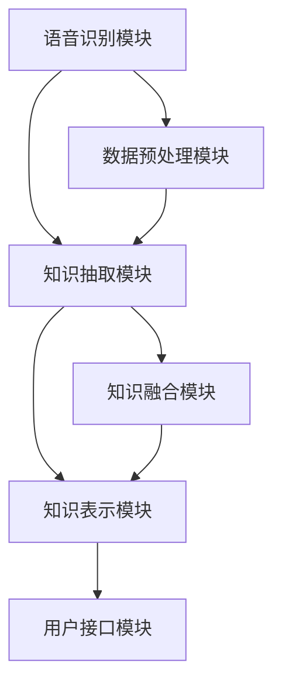

                 

# 《知识发现引擎的语音识别技术集成》

## 关键词
- 语音识别
- 知识发现引擎
- 声学模型
- 语言模型
- 数据集成
- 模型优化

## 摘要
本文深入探讨了知识发现引擎中语音识别技术的集成与应用。首先，介绍了语音识别的基本概念、系统架构以及核心算法原理，包括声学模型和语言模型。接着，阐述了知识发现引擎的架构和功能，分析了语音识别在知识抽取、融合以及知识表示中的优势。然后，详细描述了集成语音识别技术的知识发现引擎的设计与实现，包括数据采集、预处理、知识抽取与融合、知识表示与存储等环节。随后，通过项目实战展示了如何构建和优化集成语音识别技术的知识发现引擎。最后，本文对典型应用场景进行了案例分析，展望了未来的发展方向和挑战。

### 目录

#### 第一部分：语音识别技术基础

**第1章：语音识别概述与系统架构**

- **1.1 语音识别的起源与发展**
  - 语音识别的历史与里程碑
  - 当前技术进展与未来趋势

- **1.2 语音识别系统架构**
  - 声学模型与语言模型
  - 数据预处理与特征提取

- **1.3 语音信号处理基础**
  - 声音信号的基本概念
  - 声音信号的数字化与处理

**第2章：声学模型原理与实现**

- **2.1 声学模型的基本概念**
  - 隐马尔可夫模型（HMM）
  - 高斯混合模型（GMM）

- **2.2 隐马尔可夫模型（HMM）**
  - HMM的数学模型与原理
  - HMM的训练与解码算法

- **2.3 高斯混合模型（GMM）**
  - GMM的数学模型与原理
  - GMM在声学模型中的应用

**第3章：语言模型原理与实现**

- **3.1 语言模型的基本概念**
  - 语言模型在语音识别中的作用
  - 语言模型的类型

- **3.2 隐马尔可夫模型（n-gram）**
  - n-gram模型的数学模型与原理
  - n-gram模型的训练与预测

- **3.3 递归神经网络（RNN）**
  - RNN的数学模型与原理
  - LSTM和GRU在网络中的应用

#### 第二部分：知识发现引擎架构与集成

**第4章：知识发现引擎概述**

- **4.1 知识发现的概念与分类**
  - 数据挖掘与知识发现的关系
  - 知识发现的主要任务

- **4.2 知识发现引擎的架构**
  - 数据采集与预处理
  - 知识抽取与融合
  - 知识表示与存储

**第5章：语音识别技术在知识发现引擎中的应用**

- **5.1 语音识别与知识发现结合的优势**
  - 实时性
  - 交互性
  - 泛用性

- **5.2 语音识别在知识抽取中的应用**
  - 语音转文本（Speech-to-Text，STT）
  - 文本语义分析

- **5.3 语音识别在知识融合中的应用**
  - 知识图谱构建
  - 知识库扩展与更新

**第6章：集成语音识别技术的知识发现引擎设计与实现**

- **6.1 系统设计与需求分析**
  - 功能需求与性能需求
  - 系统架构设计

- **6.2 数据采集与预处理**
  - 数据源的选择与处理
  - 声学特征与语言特征提取

- **6.3 知识抽取与融合**
  - 语音转文本与文本分析
  - 知识融合策略

- **6.4 知识表示与存储**
  - 知识图谱构建与存储
  - 知识查询与检索

#### 第三部分：项目实战与优化

**第7章：集成语音识别技术的知识发现引擎项目实战**

- **7.1 项目背景与目标**
  - 项目背景介绍
  - 项目目标与成果

- **7.2 开发环境与工具**
  - 操作系统与编程语言
  - 开发工具与框架

- **7.3 源代码详细实现**
  - 声学模型与语言模型的代码实现
  - 数据采集与预处理代码实现
  - 知识抽取与融合代码实现

**第8章：性能优化与改进**

- **8.1 语音识别性能优化**
  - 模型参数调优
  - 数据增强方法
  - 降噪与去除背景噪音

- **8.2 知识发现性能优化**
  - 知识图谱优化
  - 查询优化策略
  - 系统性能评估与改进

**第9章：案例分析**

- **9.1 典型应用场景分析**
  - 企业内部知识库构建
  - 智能客服系统
  - 在线教育平台

- **9.2 成功案例分析**
  - 案例背景与目标
  - 案例实现与效果
  - 案例总结与反思

**第10章：未来展望与挑战**

- **10.1 语音识别技术的未来发展方向**
  - 人工智能的发展趋势
  - 语音识别在知识发现中的应用

- **10.2 知识发现引擎的发展趋势**
  - 知识融合与个性化推荐
  - 实时性与并发处理能力

- **10.3 挑战与应对策略**
  - 数据隐私与安全
  - 知识多样性与准确性

### 附录

- **附录A：常用语音识别与知识发现工具与资源**
  - 常用语音识别框架与工具
  - 知识发现引擎开发框架与库
  - 学术论文与相关资源链接

### Mermaid 流程图

- **知识发现引擎与语音识别技术集成流程图**
  - 声学模型与语言模型协同工作
  - 数据流与处理流程

### 伪代码与算法原理

- **声学模型训练伪代码**
  - 声学模型训练过程
  - 模型参数更新与优化

### 数学模型与公式

- **隐马尔可夫模型（HMM）数学公式**
  - 转移概率与发射概率
  - Viterbi算法

### 代码解读与分析

- **项目实战代码解读**
  - 系统设计与实现细节
  - 代码功能与性能分析

### 实际案例与详细解释

- **知识发现引擎与语音识别结合案例**
  - 项目背景与目标
  - 案例实现步骤与效果
  - 案例总结与反思

### 引言

随着信息技术的快速发展，大数据和人工智能已经成为推动现代社会进步的重要力量。知识发现引擎作为大数据处理的核心组件，能够从大量数据中提取有价值的信息，支持决策分析和创新研究。而语音识别技术作为人工智能的重要分支，正逐渐改变着人们的交互方式。将语音识别技术集成到知识发现引擎中，不仅能够提高系统的交互性，还能大大提升数据处理的效率。

本文旨在深入探讨知识发现引擎中语音识别技术的集成与应用。首先，我们将介绍语音识别技术的基础知识，包括系统架构、声学模型和语言模型。接着，我们将分析知识发现引擎的架构和功能，探讨语音识别技术在知识抽取、融合和表示中的应用。随后，我们将详细描述集成语音识别技术的知识发现引擎的设计与实现，包括数据采集、预处理、知识抽取与融合、知识表示与存储等环节。接着，通过项目实战展示如何构建和优化集成语音识别技术的知识发现引擎。最后，我们将对典型应用场景进行分析，展望未来的发展方向和挑战。

通过本文的阅读，读者将了解：

1. 语音识别技术的基本概念和系统架构。
2. 知识发现引擎的架构和功能。
3. 语音识别技术在知识抽取、融合和表示中的应用。
4. 如何设计和实现集成语音识别技术的知识发现引擎。
5. 集成语音识别技术的知识发现引擎的性能优化和改进方法。
6. 集成语音识别技术的知识发现引擎在典型应用场景中的案例分析和未来展望。

### 第一部分：语音识别技术基础

#### 第1章：语音识别概述与系统架构

### 1.1 语音识别的起源与发展

语音识别（Automatic Speech Recognition，ASR）是一种让计算机通过识别和理解人类的语音，实现人与机器之间自然交互的技术。语音识别技术起源于20世纪50年代，随着计算机技术的进步和语音信号处理的深入研究，逐步发展成为现代人工智能的重要组成部分。

在早期，语音识别主要集中在电话语音的识别上，主要采用规则方法进行。20世纪60年代，基于声学模型的语音识别系统开始出现，标志着语音识别技术的重大突破。70年代，隐马尔可夫模型（Hidden Markov Model，HMM）被引入到语音识别中，使得语音识别的准确率有了显著提升。80年代，语音识别技术开始逐渐应用于实际场景，如电话语音导航、语音拨号等。

进入90年代，随着数字信号处理和计算能力的提高，基于高斯混合模型（Gaussian Mixture Model，GMM）的语音识别系统逐渐取代了HMM，成为主流。2000年后，基于深度学习的语音识别技术开始兴起，尤其是深度神经网络（Deep Neural Network，DNN）在语音特征提取和模型训练中的应用，使得语音识别的准确率达到了前所未有的高度。

当前，语音识别技术已经广泛应用于智能家居、智能客服、智能驾驶、医疗健康等多个领域。随着人工智能技术的不断进步，语音识别技术的准确率和实用性也在不断提高，未来有望在更多场景中发挥重要作用。

### 1.2 语音识别系统架构

语音识别系统通常包括以下几个关键组成部分：麦克风阵列、声学模型、语言模型和声学-语言模型集成器。

#### 麦克风阵列

麦克风阵列是语音识别系统的输入设备，用于捕捉语音信号。麦克风阵列可以包含多个麦克风，用于提高语音信号的清晰度和稳定性。麦克风阵列的布置和选择对语音识别的效果有重要影响。

#### 声学模型

声学模型是语音识别系统的核心组件之一，负责将语音信号转换为特征向量。声学模型通常基于声学信号处理技术，如短时傅里叶变换（Short-Time Fourier Transform，STFT）和小波变换（Wavelet Transform），提取语音信号的时频特征。

常见的声学模型包括隐马尔可夫模型（HMM）、高斯混合模型（GMM）、深度神经网络（DNN）和卷积神经网络（CNN）等。其中，HMM是最早应用于语音识别的模型，GMM在HMM的基础上进行了改进，而DNN和CNN则是近年来随着深度学习技术的发展而逐渐应用于语音识别领域。

#### 语言模型

语言模型是语音识别系统的另一个核心组件，负责对语音信号中的语言内容进行理解和预测。语言模型通常基于统计方法，如n-gram模型和递归神经网络（RNN），通过学习大量的文本数据来预测句子中下一个单词的概率分布。

#### 声学-语言模型集成器

声学-语言模型集成器是语音识别系统的输出组件，负责将声学模型和语言模型的输出结果进行结合，生成最终的识别结果。常见的声学-语言模型集成方法包括基于解码器的方法（如GMM-HMM、DNN-HMM）和基于端到端的方法（如DNN-DNN、CTC（Connectionist Temporal Classification））。

#### 系统架构

语音识别系统的整体架构可以概括为以下几个步骤：

1. **语音信号采集**：通过麦克风阵列捕捉语音信号，并将其转换为数字信号。
2. **声学特征提取**：使用声学模型提取语音信号的时频特征，如MFCC（Mel-frequency cepstral coefficients）。
3. **语言特征提取**：使用语言模型提取语音信号中的语言特征，如n-gram模型。
4. **声学-语言模型集成**：将声学模型和语言模型的输出结果进行结合，生成最终的识别结果。
5. **识别结果输出**：将识别结果转换为可理解的文本或指令，供用户使用。

### 1.3 语音信号处理基础

语音信号处理是语音识别系统的关键环节，涉及对语音信号的数字化、特征提取、降噪和增强等技术。

#### 声音信号的基本概念

声音是一种机械波，通过振动传播。人类听觉系统能够感知一定频率范围（约20 Hz到20 kHz）的声音。声音的基本参数包括频率（描述声音的高低）、振幅（描述声音的强弱）和时长（描述声音的持续时间）。

#### 声音信号的数字化

为了在计算机中处理声音信号，需要将其从模拟信号转换为数字信号。这个过程称为声音信号的数字化，主要包括以下几个步骤：

1. **采样**：在固定的时间间隔内捕捉声音信号的振幅值。采样率（samples per second）通常设置为44.1 kHz，以确保足够高的频率分辨率。
2. **量化**：将捕捉到的振幅值转换为数字表示。量化过程通常采用8位、16位或更高位精度，以表示不同的振幅范围。
3. **编码**：将量化后的数字值编码为二进制序列，以便在计算机中存储和传输。

数字化后的声音信号通常以PCM（Pulse Code Modulation）格式存储，PCM格式是最常见的声音编码格式。

#### 声音信号的数字化处理

声音信号的数字化处理包括降噪、增强和滤波等操作，以提高语音识别的准确性和稳定性。

1. **降噪**：在语音识别过程中，噪声是一个常见问题。降噪技术包括噪声抑制、滤波和去噪算法等。常见的降噪算法包括谱减法、维纳滤波和自适应滤波等。
2. **增强**：增强技术旨在提高语音信号的清晰度和可懂度，包括语音增强、共振峰增强和增益调整等。常见的增强算法包括谱减法、谱估计法和自适应增益控制等。
3. **滤波**：滤波技术用于去除声音信号中的不需要的频率成分，如低频噪声和高频噪声。常见的滤波器包括低通滤波器、高通滤波器和带通滤波器等。

#### 声音信号处理工具

在语音识别系统中，常用的声音信号处理工具包括MATLAB、Python的PyAudio、OpenSMILE等。这些工具提供了丰富的声音信号处理功能，如采样、量化、编码、降噪和增强等。

### 1.4 语音识别技术的分类与应用场景

语音识别技术可以根据不同的应用场景和需求进行分类。以下是几种常见的语音识别技术及其应用场景：

1. **语音转文本（Speech-to-Text，STT）**：语音转文本技术是将语音信号转换为文本数据的工具。常见的应用场景包括智能助手、语音搜索、语音记录等。STT技术广泛应用于智能手机、智能音箱和智能车载系统中。

2. **语音控制（Voice Control）**：语音控制技术是利用语音信号实现设备控制的一种技术。常见的应用场景包括智能家居、智能电视和智能音响等。通过语音控制，用户可以方便地控制家电设备、播放音乐和查询信息等。

3. **语音交互（Voice Interaction）**：语音交互技术是利用语音信号实现人机交互的一种技术。常见的应用场景包括智能客服、智能助手和语音游戏等。语音交互技术能够提高人机交互的自然性和便捷性，为用户提供更丰富的交互体验。

4. **语音识别与合成（Speech Recognition and Synthesis）**：语音识别与合成技术是将语音信号转换为文本数据，再将文本数据转换为语音信号的一种技术。常见的应用场景包括智能客服、语音留言和语音导航等。通过语音识别与合成技术，可以实现更自然和高效的人机交互。

### 1.5 语音识别技术的挑战与发展趋势

尽管语音识别技术在近年来取得了显著的进展，但仍然面临着一些挑战和发展趋势。

1. **多语种支持**：目前，大多数语音识别技术主要针对单一语言进行优化。然而，随着全球化的推进，多语种支持成为一个重要需求。未来的语音识别技术需要具备更好的多语种识别能力，以满足不同国家和地区的需求。

2. **噪声抑制与增强**：在真实环境中，噪声是一个普遍存在的问题。如何有效地抑制噪声、增强语音信号，提高语音识别的准确性和稳定性，仍然是当前研究的热点。

3. **实时性与并发处理能力**：在许多应用场景中，实时性和并发处理能力是关键因素。如何优化语音识别系统的性能，提高实时处理能力和并发处理能力，是未来研究的方向。

4. **个性化和自适应**：随着人工智能技术的发展，语音识别技术需要具备更好的个性化和自适应能力，根据用户的需求和环境自动调整识别策略。

5. **语音识别与自然语言处理（NLP）的结合**：语音识别与自然语言处理技术相结合，可以实现更高级的语音理解能力，为用户提供更智能的交互体验。

### 结论

语音识别技术作为人工智能领域的重要分支，已经在多个应用场景中取得了显著成果。本文对语音识别技术的基础知识、系统架构和应用场景进行了详细探讨。随着人工智能技术的不断进步，语音识别技术将在未来发挥更大的作用，为人类带来更多便利。

在下一章中，我们将进一步探讨声学模型的原理与实现，包括隐马尔可夫模型（HMM）和高斯混合模型（GMM）。这些模型是语音识别系统的核心组成部分，对语音识别的性能和准确度有着重要影响。

### 第2章：声学模型原理与实现

#### 2.1 声学模型的基本概念

声学模型是语音识别系统的核心组成部分之一，负责将语音信号转换为特征向量。声学模型通常基于声学信号处理技术，如短时傅里叶变换（STFT）和小波变换（Wavelet Transform），提取语音信号的时频特征。声学模型的主要目的是通过学习大量的语音数据，建立一个能够准确描述语音特征的模型，以便在识别过程中能够有效地匹配输入的语音信号和预训练的模型。

声学模型在语音识别系统中的作用主要有以下几点：

1. **特征提取**：将语音信号转换为特征向量，这些特征向量可以用于后续的识别和分类。
2. **匹配与对比**：将输入的语音信号与预训练的声学模型进行匹配，对比模型的输出概率，从而实现语音识别。
3. **降噪与增强**：通过学习大量的语音数据，声学模型可以自动适应不同环境中的语音信号，实现噪声抑制和语音增强。

常见的声学模型包括隐马尔可夫模型（HMM）、高斯混合模型（GMM）、深度神经网络（DNN）和卷积神经网络（CNN）等。其中，HMM是最早应用于语音识别的模型，GMM在HMM的基础上进行了改进，而DNN和CNN则是近年来随着深度学习技术的发展而逐渐应用于语音识别领域。

#### 2.2 隐马尔可夫模型（HMM）

隐马尔可夫模型（Hidden Markov Model，HMM）是一种统计模型，用于描述一组随机事件序列的概率。HMM在语音识别中的应用非常广泛，它能够捕捉语音信号中的上下文依赖关系，提高语音识别的准确率。

##### HMM的数学模型与原理

HMM由五个参数组成：状态集合 \(S = \{s_1, s_2, ..., s_N\}\)，观察集合 \(O = \{o_1, o_2, ..., o_M\}\)，初始状态概率分布 \(\pi\)，状态转移概率矩阵 \(A\) 和输出概率分布 \(B\)。

1. **状态集合 \(S\)**：HMM中的状态是不可观测的，每个状态 \(s_i\) 代表语音信号中的一个特定部分，如一个音素或一个单词的发音。
2. **观察集合 \(O\)**：HMM中的观察是可观测的，每个观察 \(o_j\) 代表语音信号中的一个特征，如短时傅里叶变换（STFT）得到的频率分布。
3. **初始状态概率分布 \(\pi\)**：描述初始状态的概率分布，即每个状态在序列开始时的概率。
4. **状态转移概率矩阵 \(A\)**：描述状态之间的转移概率，即从一个状态转移到另一个状态的概率。
5. **输出概率分布 \(B\)**：描述状态和观察之间的概率分布，即一个状态生成特定观察的概率。

HMM的数学模型可以用以下公式表示：

\[
P(O|S) = \prod_{i=1}^N P(o_i|s_i) \prod_{i=1}^{N-1} P(s_i|s_{i+1}) \pi(s_1)
\]

其中，\(P(o_i|s_i)\) 表示在状态 \(s_i\) 下产生观察 \(o_i\) 的概率，\(P(s_i|s_{i+1})\) 表示在状态 \(s_{i+1}\) 后紧接着是状态 \(s_i\) 的概率，\(\pi(s_1)\) 表示初始状态的概率。

##### HMM的训练与解码算法

HMM的训练过程包括两个主要步骤：初始状态概率分布 \(\pi\)、状态转移概率矩阵 \(A\) 和输出概率分布 \(B\) 的估计。

1. **初始状态概率分布 \(\pi\) 的估计**：通常采用最大似然估计（Maximum Likelihood Estimation，MLE）方法，通过最大化训练数据中观察到的概率来估计初始状态概率分布。
2. **状态转移概率矩阵 \(A\) 的估计**：同样采用最大似然估计（MLE）方法，通过最大化训练数据中观察到的概率来估计状态转移概率矩阵。
3. **输出概率分布 \(B\) 的估计**：采用高斯混合模型（GMM）进行估计，通过最大化训练数据中观察到的概率来估计每个状态的输出概率分布。

HMM的解码过程包括两个主要算法：前向算法（Forward Algorithm）和后向算法（Backward Algorithm）。

1. **前向算法**：用于计算给定观察序列下，每个时刻处于每个状态的概率。具体公式为：

\[
a(i,t) = \prod_{k=1}^{t-1} \alpha(k,i) b(i,o_t)
\]

其中，\(\alpha(k,i)\) 表示在时刻 \(k\) 时处于状态 \(i\) 的概率。

2. **后向算法**：用于计算给定观察序列下，每个时刻处于每个状态的回溯概率。具体公式为：

\[
b(i,t) = \prod_{k=t+1}^{N} \beta(k,i) a(i,k)
\]

其中，\(\beta(k,i)\) 表示在时刻 \(k\) 时处于状态 \(i\) 的回溯概率。

通过前向算法和后向算法，可以得到每个状态在观察序列中的最佳路径，从而实现语音识别。

#### 2.3 高斯混合模型（GMM）

高斯混合模型（Gaussian Mixture Model，GMM）是一种概率分布模型，用于描述多个高斯分布的混合。GMM在语音识别中应用于输出概率分布 \(B\) 的估计，通过建模每个状态产生的观察的概率分布，提高语音识别的准确率。

##### GMM的数学模型与原理

GMM由多个高斯分布的混合组成，每个高斯分布代表一个状态产生的观察的概率分布。GMM的数学模型可以用以下公式表示：

\[
p(o|\theta) = \sum_{k=1}^K w_k \mathcal{N}(o|\mu_k, \Sigma_k)
\]

其中，\(K\) 表示高斯分布的个数，\(w_k\) 表示第 \(k\) 个高斯分布的权重，\(\mathcal{N}(o|\mu_k, \Sigma_k)\) 表示高斯分布的概率密度函数，\(\mu_k\) 和 \(\Sigma_k\) 分别表示第 \(k\) 个高斯分布的均值和协方差矩阵。

在GMM中，每个高斯分布对应于HMM中的一个状态。通过优化GMM的参数，可以提高每个状态产生的观察的概率分布的拟合度，从而提高语音识别的准确率。

##### GMM在声学模型中的应用

在声学模型中，GMM用于估计每个状态产生的观察的概率分布。具体步骤如下：

1. **初始化**：随机初始化GMM的参数，如权重 \(w_k\)、均值 \(\mu_k\) 和协方差矩阵 \(\Sigma_k\)。
2. **期望最大化（Expectation-Maximization，EM）算法**：通过迭代优化GMM的参数，最大化训练数据的对数似然函数。EM算法包括两个步骤：
   - **期望步骤（E-step）**：计算每个数据点属于每个高斯分布的后验概率。
   - **最大化步骤（M-step）**：根据后验概率更新GMM的参数。

通过多次迭代优化，GMM的参数逐渐逼近最佳值，从而提高每个状态产生的观察的概率分布的拟合度。

##### GMM与HMM的结合

在语音识别系统中，GMM与HMM通常结合使用。具体步骤如下：

1. **训练HMM**：使用HMM的训练数据，训练得到HMM的状态转移概率矩阵 \(A\) 和输出概率分布 \(B\)。
2. **训练GMM**：使用HMM的状态转移概率矩阵 \(A\) 和输出概率分布 \(B\)，训练得到每个状态的GMM参数，如权重 \(w_k\)、均值 \(\mu_k\) 和协方差矩阵 \(\Sigma_k\)。
3. **解码**：在解码过程中，使用HMM的状态转移概率矩阵 \(A\) 和输出概率分布 \(B\)，结合GMM的参数，计算给定观察序列下的最佳路径。

通过将GMM与HMM结合，语音识别系统能够更好地建模语音信号中的上下文依赖关系，提高识别准确率。

### 2.4 声学模型的优化与改进

为了进一步提高语音识别的性能和准确率，研究人员提出了许多声学模型的优化与改进方法。以下是一些常见的优化与改进方法：

1. **深度神经网络（DNN）**：深度神经网络（DNN）在语音识别中用于特征提取和模型训练。DNN能够自动学习语音信号中的复杂特征，提高特征表示能力。DNN与HMM的集成方法包括DNN-HMM和DNN-DNN。
2. **卷积神经网络（CNN）**：卷积神经网络（CNN）在图像识别中表现出色，近年来也被应用于语音识别。CNN能够自动学习语音信号的时空特征，提高识别准确率。CNN与HMM的集成方法包括CNN-HMM和CNN-DNN。
3. **循环神经网络（RNN）**：循环神经网络（RNN）能够处理序列数据，捕捉序列中的长期依赖关系。递归神经网络（RNN）和长短时记忆网络（LSTM）在语音识别中应用于特征提取和模型训练。RNN与HMM的集成方法包括RNN-HMM和RNN-DNN。
4. **端到端模型**：端到端模型将语音识别任务分解为多个子任务，如声学特征提取、语言模型训练和序列建模。端到端模型通过直接从原始语音信号生成文本，避免了传统的特征提取和模型训练环节，提高了识别效率。

通过这些优化与改进方法，声学模型的性能和准确率得到了显著提高，为语音识别技术的发展奠定了基础。

### 2.5 声学模型在实际应用中的挑战与解决方案

在实际应用中，声学模型面临着许多挑战，如多语种支持、噪声抑制、实时性和并发处理能力等。以下是一些常见的挑战及其解决方案：

1. **多语种支持**：为了支持多语种语音识别，需要构建多语言声学模型。常用的方法包括：
   - **多语言训练数据**：使用多语言语音数据训练声学模型，提高模型的泛化能力。
   - **迁移学习**：利用已有的单语言声学模型作为预训练模型，在新语言上微调，提高新语言的识别准确率。
   - **自适应语言模型**：根据用户的语音输入，动态调整语言模型，提高多语种识别的准确率。

2. **噪声抑制**：在真实环境中，噪声是一个普遍存在的问题，如背景噪音、交通噪音和室内噪音等。为了提高语音识别的准确率，需要有效地抑制噪声。常用的方法包括：
   - **谱减法**：通过估计背景噪音的功率谱，并将其从语音信号的功率谱中减去，实现噪声抑制。
   - **维纳滤波**：利用维纳滤波器估计噪声信号，并将其从语音信号中减去，实现噪声抑制。
   - **自适应滤波**：根据噪声信号的特点，自适应调整滤波器参数，实现噪声抑制。

3. **实时性与并发处理能力**：在实时应用场景中，如智能助手和智能车载系统，需要保证语音识别的实时性和并发处理能力。常用的方法包括：
   - **模型压缩**：通过模型压缩技术，减少模型的参数量和计算复杂度，提高实时处理能力。
   - **并行计算**：利用多核处理器和GPU等硬件资源，实现并行计算，提高并发处理能力。
   - **多线程处理**：通过多线程处理技术，同时处理多个语音识别任务，提高并发处理能力。

通过上述挑战和解决方案，声学模型在实际应用中的性能和准确性得到了显著提高。

### 结论

本章详细介绍了声学模型的基本概念、隐马尔可夫模型（HMM）和高斯混合模型（GMM）的原理与实现。声学模型在语音识别系统中起着关键作用，通过提取语音信号的特征向量，实现语音信号的识别。本章还探讨了声学模型的优化与改进方法，以及在实际应用中的挑战与解决方案。在下一章中，我们将继续探讨语言模型的原理与实现。

### 第3章：语言模型原理与实现

#### 3.1 语言模型的基本概念

语言模型（Language Model，LM）是语音识别系统中的关键组件之一，它用于预测输入语音序列中下一个单词或字符的概率。语言模型的核心任务是建模自然语言的概率分布，从而为语音识别系统提供上下文信息，提高识别准确率。

语言模型在语音识别中的作用主要体现在以下几个方面：

1. **提高识别准确率**：通过预测输入语音序列中下一个单词或字符的概率，语言模型可以有效地消除发音变异和非标准发音带来的影响，提高识别准确率。
2. **减少冗余信息**：语言模型可以压缩语音信号中的冗余信息，降低计算复杂度，提高系统效率。
3. **增强交互体验**：语言模型可以生成与用户输入相关的候选词汇，提高语音识别系统的交互性和自然性，为用户提供更流畅的交互体验。

常见的语言模型类型包括n-gram模型、递归神经网络（RNN）模型和转换模型（如CTC）等。n-gram模型是最基础的统计语言模型，RNN模型和CTC模型则基于深度学习技术，具有更强的表示能力和预测能力。

#### 3.2 n-gram模型

n-gram模型是一种基于词汇序列统计的语言模型，它通过计数相邻单词或字符的频率来预测下一个单词或字符的概率。n-gram模型的基本思想是，一个单词或字符的出现概率与它前面的n-1个单词或字符的序列密切相关。

##### n-gram模型的数学模型与原理

n-gram模型的数学模型可以用以下公式表示：

\[
P(w_n | w_{n-1}, w_{n-2}, ..., w_1) = \frac{C(w_{n-1}, w_{n-2}, ..., w_1, w_n)}{C(w_{n-1}, w_{n-2}, ..., w_1)}
\]

其中，\(P(w_n | w_{n-1}, w_{n-2}, ..., w_1)\) 表示在给定前一个单词序列 \(w_{n-1}, w_{n-2}, ..., w_1\) 的条件下，下一个单词 \(w_n\) 的概率，\(C(w_{n-1}, w_{n-2}, ..., w_1, w_n)\) 表示单词序列 \(w_{n-1}, w_{n-2}, ..., w_1, w_n\) 的出现次数，\(C(w_{n-1}, w_{n-2}, ..., w_1)\) 表示单词序列 \(w_{n-1}, w_{n-2}, ..., w_1\) 的出现次数。

n-gram模型的训练过程主要包括以下步骤：

1. **数据收集与预处理**：收集大量的文本数据，并进行预处理，如去除标点符号、停用词过滤等。
2. **构建词汇表**：将文本数据中的单词转换为对应的索引，构建词汇表。
3. **计算n-gram频率**：遍历文本数据，统计每个n-gram的出现次数。
4. **构建n-gram概率模型**：将n-gram的频率转换为概率，存储在概率表中。

在n-gram模型中，一元语法（Unigram）、二元语法（Bigram）和三元语法（Trigram）是最常见的n-gram模型。一元语法只考虑单个单词的概率，二元语法考虑前一个单词的影响，三元语法则考虑前两个单词的影响。

##### n-gram模型的应用

n-gram模型在语音识别中应用广泛，主要用于以下几个环节：

1. **声学-语言模型集成**：在声学模型的基础上，使用n-gram模型结合声学特征，提高识别准确率。
2. **序列建模**：使用n-gram模型预测输入语音序列中下一个单词或字符的概率，实现语音序列建模。
3. **语言解码**：在语音识别的解码过程中，n-gram模型用于生成候选词汇，辅助决策。

#### 3.3 递归神经网络（RNN）

递归神经网络（Recurrent Neural Network，RNN）是一种能够处理序列数据的神经网络。RNN通过引入递归连接，使得网络能够记住前面的输入，从而有效地建模序列数据。

##### RNN的数学模型与原理

RNN的数学模型可以用以下公式表示：

\[
h_t = \sigma(W_h h_{t-1} + W_x x_t + b_h)
\]

其中，\(h_t\) 表示在时刻 \(t\) 的隐藏状态，\(x_t\) 表示在时刻 \(t\) 的输入，\(W_h\) 和 \(W_x\) 分别表示隐藏状态和输入的权重矩阵，\(\sigma\) 表示激活函数（如Sigmoid或Tanh函数），\(b_h\) 表示隐藏状态的偏置。

RNN的核心思想是通过递归连接，将前一个时刻的隐藏状态 \(h_{t-1}\) 作为当前时刻的输入 \(x_t\) 的权重。RNN能够处理任意长度的序列数据，但在实际应用中，长序列可能导致梯度消失或爆炸问题，影响模型的训练效果。

##### RNN在语音识别中的应用

RNN在语音识别中主要用于以下环节：

1. **特征提取**：使用RNN提取语音信号的时序特征，如帧级别的特征。
2. **序列建模**：使用RNN建模语音信号的时序关系，提高识别准确率。
3. **解码**：在语音识别的解码过程中，RNN用于生成候选词汇，辅助决策。

近年来，RNN的变体，如长短时记忆网络（Long Short-Term Memory，LSTM）和门控循环单元（Gated Recurrent Unit，GRU），在语音识别中表现出色。LSTM和GRU通过引入门控机制，能够更好地记忆长序列信息，缓解梯度消失问题。

#### 3.4 LSTM和GRU在网络中的应用

LSTM（Long Short-Term Memory）和GRU（Gated Recurrent Unit）是RNN的变体，通过引入门控机制，能够更好地记忆长序列信息，缓解梯度消失问题。

##### LSTM的数学模型与原理

LSTM的数学模型可以用以下公式表示：

\[
\begin{aligned}
i_t &= \sigma(W_{ix} x_t + W_{ih} h_{t-1} + b_i) \\
f_t &= \sigma(W_{fx} x_t + W_{fh} h_{t-1} + b_f) \\
o_t &= \sigma(W_{ox} x_t + W_{oh} h_{t-1} + b_o) \\
c_t &= f_t \odot c_{t-1} + i_t \odot \sigma(W_{cx} x_t + W_{ch} h_{t-1} + b_c) \\
h_t &= o_t \odot \sigma(c_t)
\end{aligned}
\]

其中，\(i_t\)、\(f_t\)、\(o_t\) 和 \(c_t\) 分别表示输入门、遗忘门、输出门和细胞状态，\(\odot\) 表示逐元素乘法，\(\sigma\) 表示激活函数（如Sigmoid或Tanh函数），\(W_{ix}\)、\(W_{ih}\)、\(W_{fx}\)、\(W_{fh}\)、\(W_{ox}\)、\(W_{oh}\)、\(W_{cx}\) 和 \(W_{ch}\) 分别表示权重矩阵，\(b_i\)、\(b_f\)、\(b_o\) 和 \(b_c\) 分别表示偏置。

LSTM通过输入门、遗忘门和输出门控制信息的流入、流出和输出，从而有效地记忆长序列信息。

##### GRU的数学模型与原理

GRU的数学模型可以用以下公式表示：

\[
\begin{aligned}
z_t &= \sigma(W_{zx} x_t + W_{zh} h_{t-1} + b_z) \\
r_t &= \sigma(W_{rx} x_t + W_{rh} h_{t-1} + b_r) \\
h_t' &= \sigma(W_{cx} x_t + W_{ch} \odot (r_t \odot h_{t-1}) + b_c) \\
h_t &= (1 - z_t) \odot h_{t-1} + z_t \odot h_t'
\end{aligned}
\]

其中，\(z_t\)、\(r_t\) 和 \(h_t'\) 分别表示更新门、重置门和候选隐藏状态，\(\odot\) 表示逐元素乘法，\(\sigma\) 表示激活函数（如Sigmoid或Tanh函数），\(W_{zx}\)、\(W_{zh}\)、\(W_{rx}\)、\(W_{rh}\)、\(W_{cx}\) 和 \(W_{ch}\) 分别表示权重矩阵，\(b_z\)、\(b_r\) 和 \(b_c\) 分别表示偏置。

GRU通过更新门和重置门控制信息的流入和输出，从而有效地记忆长序列信息。

##### LSTM和GRU在语音识别中的应用

LSTM和GRU在语音识别中表现出色，主要用于以下几个环节：

1. **特征提取**：使用LSTM或GRU提取语音信号的时序特征，如帧级别的特征。
2. **序列建模**：使用LSTM或GRU建模语音信号的时序关系，提高识别准确率。
3. **解码**：在语音识别的解码过程中，LSTM或GRU用于生成候选词汇，辅助决策。

通过LSTM和GRU，语音识别系统能够更好地记忆长序列信息，提高识别准确率和性能。

### 3.5 语言模型的优化与改进

为了进一步提高语音识别的性能和准确率，研究人员提出了许多语言模型的优化与改进方法。以下是一些常见的优化与改进方法：

1. **注意力机制（Attention Mechanism）**：注意力机制能够提高模型在处理长序列数据时的表现，通过关注关键信息，减少冗余计算。注意力机制在语音识别中的应用，如句子级语音识别和语音翻译。

2. **转换模型（如CTC）**：转换模型（如CTC）能够将语音信号直接转换为文本序列，避免了传统特征提取和语言模型解码的环节，提高了识别效率和准确性。

3. **深度学习（如BERT）**：深度学习模型（如BERT）在自然语言处理任务中表现出色，通过学习大量的文本数据，能够捕捉语言中的复杂结构。深度学习在语音识别中的应用，如基于BERT的语音识别系统和多语言语音识别。

4. **迁移学习**：迁移学习能够利用已有的预训练模型，在新任务上实现快速适应。通过迁移学习，可以提高新任务上的识别准确率和性能。

通过这些优化与改进方法，语言模型的性能和准确率得到了显著提高。

### 3.6 语言模型在实际应用中的挑战与解决方案

在实际应用中，语言模型面临着许多挑战，如多语言支持、噪声抑制、实时性和并发处理能力等。以下是一些常见的挑战及其解决方案：

1. **多语言支持**：为了支持多语言语音识别，需要构建多语言语言模型。常用的方法包括：
   - **多语言训练数据**：收集多语言语音数据，训练多语言语言模型。
   - **迁移学习**：利用已有的单语言语言模型，在新语言上微调。
   - **多任务学习**：通过多任务学习，同时训练多个语言模型。

2. **噪声抑制**：在真实环境中，噪声是一个普遍存在的问题，如背景噪音、交通噪音和室内噪音等。为了提高语音识别的准确率，需要有效地抑制噪声。常用的方法包括：
   - **谱减法**：通过估计背景噪音的功率谱，并将其从语音信号的功率谱中减去，实现噪声抑制。
   - **维纳滤波**：利用维纳滤波器估计噪声信号，并将其从语音信号中减去，实现噪声抑制。
   - **自适应滤波**：根据噪声信号的特点，自适应调整滤波器参数，实现噪声抑制。

3. **实时性与并发处理能力**：在实时应用场景中，如智能助手和智能车载系统，需要保证语音识别的实时性和并发处理能力。常用的方法包括：
   - **模型压缩**：通过模型压缩技术，减少模型的参数量和计算复杂度，提高实时处理能力。
   - **并行计算**：利用多核处理器和GPU等硬件资源，实现并行计算，提高并发处理能力。
   - **多线程处理**：通过多线程处理技术，同时处理多个语音识别任务，提高并发处理能力。

通过上述挑战和解决方案，语言模型在实际应用中的性能和准确性得到了显著提高。

### 结论

本章详细介绍了语言模型的基本概念、n-gram模型、递归神经网络（RNN）、LSTM和GRU的原理与实现。语言模型在语音识别系统中起着关键作用，通过预测输入语音序列中下一个单词或字符的概率，提高识别准确率。本章还探讨了语言模型的优化与改进方法，以及在实际应用中的挑战与解决方案。在下一章中，我们将继续探讨知识发现引擎的架构与功能。

### 第4章：知识发现引擎概述

#### 4.1 知识发现的概念与分类

知识发现（Knowledge Discovery in Databases，KDD）是指从大量数据中自动识别出潜在有用的模式和知识的过程。KDD是一个跨学科的研究领域，涉及数据挖掘、机器学习、统计学和数据库技术等多个方面。知识发现的主要目标是发现数据中的隐藏信息，帮助用户更好地理解和利用数据。

知识发现可以分为以下几类：

1. **数据预处理**：数据预处理是KDD过程中的第一步，包括数据清洗、数据整合、数据转换和数据归一化等。数据预处理的主要目的是提高数据的质量，为后续的知识发现过程提供可靠的数据基础。

2. **特征提取**：特征提取是指从原始数据中提取出有助于知识发现的关键特征。特征提取可以简化数据，提高知识发现的效率。常见的特征提取方法包括统计特征提取、机器学习特征提取和深度学习特征提取等。

3. **模式识别**：模式识别是指从数据中发现具有统计意义的模式或规律。常见的模式识别方法包括分类、聚类、关联规则挖掘和异常检测等。

4. **知识表示**：知识表示是指将发现的模式或知识转化为可理解和可操作的形式。知识表示可以用于支持决策分析、智能推荐和预测分析等。

5. **知识融合**：知识融合是指将多个来源的知识进行整合，形成统一的知识体系。知识融合可以提高知识的准确性和全面性，为用户提供更全面的决策支持。

#### 4.2 知识发现引擎的架构

知识发现引擎（Knowledge Discovery Engine，KDE）是一种自动化、高效的知识发现工具，用于从大量数据中提取有价值的信息。知识发现引擎通常由以下几个关键组件组成：

1. **数据源**：数据源是知识发现引擎的输入，包括各种结构化数据、半结构化数据和非结构化数据。数据源可以是关系数据库、NoSQL数据库、数据仓库或文本文件等。

2. **数据预处理模块**：数据预处理模块负责对原始数据进行清洗、整合和转换，提高数据的质量和一致性。数据预处理模块通常包括数据清洗、数据整合、数据转换和数据归一化等子模块。

3. **特征提取模块**：特征提取模块负责从原始数据中提取关键特征，为后续的知识发现过程提供支持。特征提取模块可以采用各种机器学习和深度学习算法，如特征工程、特征选择和特征降维等。

4. **模式识别模块**：模式识别模块负责从预处理后的数据中识别出具有统计意义的模式或规律。常见的模式识别方法包括分类、聚类、关联规则挖掘和异常检测等。

5. **知识表示模块**：知识表示模块负责将发现的模式或知识转化为可理解和可操作的形式。知识表示模块通常包括知识图谱、决策树、神经网络和文本表示等。

6. **知识融合模块**：知识融合模块负责将多个来源的知识进行整合，形成统一的知识体系。知识融合模块可以采用各种融合策略，如基于规则的融合、基于相似度的融合和基于概率的融合等。

7. **用户接口**：用户接口是知识发现引擎与用户之间的交互界面，用于展示知识发现结果和提供操作功能。用户接口可以采用Web界面、桌面应用或移动应用等形式。

#### 4.3 知识发现引擎的工作流程

知识发现引擎的工作流程通常包括以下几个阶段：

1. **数据采集**：从各种数据源采集原始数据，包括结构化数据、半结构化数据和非结构化数据。

2. **数据预处理**：对原始数据进行清洗、整合和转换，提高数据的质量和一致性。数据预处理过程可以自动或手动完成。

3. **特征提取**：从预处理后的数据中提取关键特征，为后续的知识发现过程提供支持。特征提取过程可以采用机器学习和深度学习算法。

4. **模式识别**：从预处理后的数据中识别出具有统计意义的模式或规律。常见的模式识别方法包括分类、聚类、关联规则挖掘和异常检测等。

5. **知识表示**：将发现的模式或知识转化为可理解和可操作的形式，如知识图谱、决策树、神经网络和文本表示等。

6. **知识融合**：将多个来源的知识进行整合，形成统一的知识体系。知识融合过程可以采用各种融合策略。

7. **用户接口**：通过用户接口展示知识发现结果和提供操作功能，方便用户查询和利用知识。

#### 4.4 知识发现引擎的优势与应用场景

知识发现引擎具有以下几个优势：

1. **自动化**：知识发现引擎能够自动执行数据采集、预处理、特征提取、模式识别、知识表示和知识融合等任务，提高工作效率。

2. **高效性**：知识发现引擎可以处理大量数据，通过并行计算和分布式处理技术，提高处理速度。

3. **灵活性**：知识发现引擎可以适应不同的数据类型和应用场景，如结构化数据、半结构化数据和非结构化数据。

4. **可扩展性**：知识发现引擎可以方便地扩展和更新，适应新的数据源和应用需求。

知识发现引擎的应用场景非常广泛，包括但不限于以下几个方面：

1. **商业智能**：知识发现引擎可以帮助企业从大量业务数据中提取有价值的信息，支持决策分析和战略规划。

2. **金融风控**：知识发现引擎可以识别金融交易中的异常行为，帮助金融机构预防和应对风险。

3. **智能医疗**：知识发现引擎可以分析医疗数据，辅助医生进行诊断和治疗决策。

4. **智能交通**：知识发现引擎可以分析交通数据，优化交通管理和调度，提高交通效率。

5. **智能教育**：知识发现引擎可以分析学生数据，提供个性化的学习建议和资源推荐。

通过知识发现引擎，企业、组织和用户可以更好地理解和利用数据，实现数据驱动的决策和创新。

### 结论

本章对知识发现引擎的概念、分类、架构和工作流程进行了详细探讨。知识发现引擎作为一种自动化、高效的知识发现工具，具有广泛的应用场景和优势。在下一章中，我们将深入探讨语音识别技术在知识发现引擎中的应用，分析语音识别在知识抽取、融合和表示中的优势。

### 第5章：语音识别技术在知识发现引擎中的应用

#### 5.1 语音识别与知识发现结合的优势

语音识别技术（ASR）与知识发现引擎（KDE）的结合，为数据分析和知识提取带来了新的机遇。两者结合的优势主要体现在以下几个方面：

1. **实时性**：语音识别技术能够实时捕捉语音信息，并将其转化为文本数据。这对于需要实时分析和响应的应用场景尤为重要，如智能客服、智能会议记录等。

2. **交互性**：语音识别技术使得用户可以通过语音与系统进行交互，从而提高用户操作的便捷性。这种交互方式更加自然，适用于不易使用键盘或触摸屏的场景，如车载导航、智能家居等。

3. **泛用性**：语音识别技术可以应用于多种数据源和场景，如电话语音、实时语音对话、音频记录等，为知识发现提供了丰富的数据来源。

4. **提高数据质量**：语音识别技术可以帮助从非结构化语音数据中提取结构化信息，从而提高数据的质量和利用率。通过语音识别，原始语音数据可以被转化为文本数据，进一步进行数据清洗、特征提取和分析。

5. **降低成本**：语音识别技术可以减少人工输入的工作量，降低数据处理的成本。特别是在处理大量语音数据时，语音识别技术的自动化处理能力可以显著提高工作效率。

#### 5.2 语音识别在知识抽取中的应用

知识抽取是知识发现的重要环节，旨在从原始数据中提取出关键信息。语音识别技术在知识抽取中的应用主要体现在以下几个方面：

1. **语音转文本（Speech-to-Text，STT）**：语音转文本技术是语音识别技术的核心功能之一，它将语音信号转化为文本数据。通过STT技术，原始的语音数据可以被转化为结构化的文本数据，从而为后续的知识抽取提供基础。

   **应用实例**：
   - 在智能客服系统中，STT技术可以实时捕捉客户的话语，将其转化为文本数据，进一步分析客户的需求和问题。
   - 在会议记录中，STT技术可以自动记录会议内容，提供会议纪要和关键词索引。

2. **语义分析**：语音识别技术不仅可以将语音转化为文本，还可以对文本进行语义分析，提取关键信息。语义分析包括实体识别、关系抽取、事件抽取等，通过对文本的深入分析，可以获取更多有价值的信息。

   **应用实例**：
   - 在医疗领域，语音识别技术可以自动识别医生与患者的对话，提取病例信息、诊断结果和治疗建议等。
   - 在金融领域，语音识别技术可以分析交易员与客户的通话记录，提取交易策略、市场分析和风险提示等信息。

3. **语音情感分析**：语音情感分析是语音识别技术在知识抽取中的一个重要应用，它通过分析语音的音调、语速、语调和语气等特征，判断说话者的情感状态。

   **应用实例**：
   - 在客户服务领域，语音情感分析可以帮助企业了解客户满意度，识别潜在的投诉和不满情绪，从而改进服务质量。
   - 在市场营销中，语音情感分析可以分析客户对产品的评价和反馈，帮助企业制定更好的营销策略。

#### 5.3 语音识别在知识融合中的应用

知识融合是将来自不同来源的信息进行整合，形成统一的知识体系。语音识别技术在知识融合中的应用主要体现在以下几个方面：

1. **知识图谱构建**：知识图谱是一种结构化知识表示方法，它通过实体和关系的关联，构建出复杂的知识网络。语音识别技术可以帮助构建知识图谱，实现知识融合。

   **应用实例**：
   - 在企业内部知识管理中，语音识别技术可以捕捉员工之间的交流内容，构建出员工知识网络，帮助员工更好地共享和利用知识。
   - 在智能问答系统中，语音识别技术可以结合用户的问题和已有的知识库，构建出知识图谱，提供更准确的答案。

2. **知识库扩展与更新**：知识库是知识融合的核心组件，它存储了大量的知识和信息。语音识别技术可以帮助扩展和更新知识库，使其更全面和准确。

   **应用实例**：
   - 在法律领域，语音识别技术可以捕捉法官和律师的辩论内容，扩展和更新法律知识库，提高法律文档的检索效率和准确性。
   - 在新闻领域，语音识别技术可以捕捉记者和编辑的采访内容，更新和扩展新闻知识库，提高新闻内容的丰富性和准确性。

3. **多模态数据融合**：语音识别技术可以与图像识别、自然语言处理等其他技术结合，实现多模态数据融合。通过多模态数据融合，可以更全面地理解信息和场景，提高知识融合的准确性和实用性。

   **应用实例**：
   - 在智能驾驶系统中，语音识别技术可以与图像识别技术结合，实现语音指令和视觉数据的融合，提供更智能的驾驶体验。
   - 在医疗诊断中，语音识别技术可以与医学图像分析技术结合，实现语音报告和图像诊断的融合，提供更准确的诊断结果。

通过语音识别技术的应用，知识发现引擎可以更高效、更准确地提取、融合和利用知识，为企业和个人提供更强大的数据分析和决策支持。

### 结论

本章探讨了语音识别技术在知识发现引擎中的应用，分析了语音识别在知识抽取、融合和表示中的优势。语音识别技术为知识发现引擎带来了实时性、交互性和泛用性，提高了数据质量和知识提取的效率。通过语音识别技术的应用，知识发现引擎能够更全面、更准确地提取和利用知识，为企业和个人提供更强大的数据分析和决策支持。在下一章中，我们将深入探讨集成语音识别技术的知识发现引擎的设计与实现。

### 第6章：集成语音识别技术的知识发现引擎设计与实现

#### 6.1 系统设计与需求分析

设计一个集成语音识别技术的知识发现引擎，需要明确系统的功能需求、性能需求和系统架构。以下是具体的设计过程和需求分析：

##### 6.1.1 功能需求

1. **语音识别功能**：系统能够接收语音输入，并实时将语音转化为文本。
2. **数据预处理功能**：系统能够对语音数据、文本数据进行清洗、去噪、去停用词等预处理操作。
3. **知识抽取功能**：系统能够从预处理后的文本数据中提取关键信息，如实体、关系、事件等。
4. **知识融合功能**：系统能够将多个数据源中的知识进行融合，构建知识图谱。
5. **知识表示功能**：系统能够将提取的知识以结构化的形式存储和展示，便于查询和利用。
6. **用户接口**：系统提供友好的用户界面，便于用户操作和查询知识。

##### 6.1.2 性能需求

1. **实时性**：系统能够在短时间内处理语音输入，并生成相应的文本和知识。
2. **准确性**：系统在语音识别和知识抽取过程中，具有较高的准确率，减少错误和遗漏。
3. **高效性**：系统在处理大量数据时，具有较高的处理速度和并发处理能力。
4. **可扩展性**：系统能够方便地扩展和更新，以适应新的需求和场景。

##### 6.1.3 系统架构设计

集成语音识别技术的知识发现引擎的架构可以分为以下几个主要模块：

1. **语音识别模块**：负责接收语音输入，并将其转化为文本数据。
2. **数据预处理模块**：负责对语音数据、文本数据进行预处理，包括去噪、去停用词、分词等操作。
3. **知识抽取模块**：负责从预处理后的文本数据中提取关键信息，如实体、关系、事件等。
4. **知识融合模块**：负责将多个数据源中的知识进行融合，构建知识图谱。
5. **知识表示模块**：负责将提取的知识以结构化的形式存储和展示，便于查询和利用。
6. **用户接口模块**：提供友好的用户界面，便于用户操作和查询知识。

系统架构设计图如下：



#### 6.2 数据采集与预处理

数据采集与预处理是知识发现引擎的重要环节，直接影响系统的性能和准确性。以下是数据采集与预处理的具体实现过程：

##### 6.2.1 数据源选择

1. **语音数据**：选择高质量的语音数据集，包括标准的朗读语音和真实的对话语音。
2. **文本数据**：选择与业务相关的文本数据集，如新闻报道、论坛帖子、学术文章等。

##### 6.2.2 数据采集

1. **语音数据采集**：使用麦克风阵列捕捉语音信号，并将其数字化，存储为PCM格式。
2. **文本数据采集**：从各种来源（如网站、数据库、文件等）收集文本数据，并进行格式化处理。

##### 6.2.3 数据预处理

1. **语音预处理**：
   - **去噪**：使用谱减法、维纳滤波等降噪算法，去除语音信号中的背景噪音。
   - **分帧**：将语音信号分割成固定长度的帧，通常使用帧长为20ms，帧移为10ms。
   - **特征提取**：使用短时傅里叶变换（STFT）或梅尔频率倒谱系数（MFCC）提取语音特征。

2. **文本预处理**：
   - **去停用词**：去除文本中的停用词，如“的”、“和”、“是”等，减少噪声信息。
   - **分词**：将文本分割成单词或短语，通常使用基于词频的统计方法或基于规则的分词算法。
   - **词性标注**：对文本中的每个单词进行词性标注，如名词、动词、形容词等，为后续的知识抽取提供支持。

#### 6.3 知识抽取与融合

知识抽取与融合是知识发现引擎的核心功能，通过语音识别和文本预处理，提取出关键信息，并将其融合到知识图谱中。以下是具体实现过程：

##### 6.3.1 知识抽取

1. **实体识别**：从文本数据中识别出关键实体，如人名、地名、组织名等，使用命名实体识别（NER）算法实现。
2. **关系抽取**：从文本数据中识别出实体之间的关系，如“工作于”、“位于”等，使用关系提取算法实现。
3. **事件抽取**：从文本数据中识别出事件，如“会议召开”、“签约”等，使用事件抽取算法实现。

##### 6.3.2 知识融合

1. **知识图谱构建**：将提取的实体、关系和事件构建成知识图谱，使用图数据库（如Neo4j）存储和管理知识。
2. **数据融合策略**：
   - **基于规则的数据融合**：使用预定义的规则，将多个数据源中的知识进行融合，如合并相同实体的信息。
   - **基于相似度的数据融合**：使用相似度度量，将相似的数据源中的知识进行融合，如基于文本相似度的实体合并。
   - **基于概率的数据融合**：使用概率模型，如贝叶斯网络或马尔可夫模型，将多个数据源中的知识进行融合，提高知识的准确性和一致性。

#### 6.4 知识表示与存储

知识表示与存储是知识发现引擎的关键环节，通过将提取的知识以结构化的形式存储和展示，便于查询和利用。以下是具体实现过程：

##### 6.4.1 知识表示

1. **实体表示**：使用图节点表示实体，如人名、地名、组织名等，每个实体具有属性和标签，如姓名、性别、国籍等。
2. **关系表示**：使用图边表示实体之间的关系，如工作于、位于等，每个关系具有属性，如时间、地点等。
3. **事件表示**：使用图节点表示事件，如会议召开、签约等，每个事件具有属性，如参与者、时间、地点等。

##### 6.4.2 知识存储

1. **图数据库**：使用图数据库（如Neo4j）存储和管理知识图谱，图数据库能够高效地处理实体、关系和事件，并提供丰富的查询功能。
2. **文本索引**：使用文本索引（如Lucene或Elasticsearch）存储和管理文本数据，提供快速的文本查询和搜索功能。
3. **分布式存储**：对于大规模数据，使用分布式存储系统（如Hadoop或Cassandra）存储和管理数据，提高系统的扩展性和容错能力。

#### 6.5 用户接口设计与实现

用户接口是知识发现引擎与用户之间的交互界面，提供友好的操作界面和查询功能。以下是具体实现过程：

##### 6.5.1 用户界面设计

1. **首页**：展示系统的主要功能模块和快捷入口，提供用户操作的导航。
2. **搜索界面**：提供文本搜索功能，用户可以输入关键词，查询相关的实体、关系和事件。
3. **知识图谱查看**：提供知识图谱的展示功能，用户可以查看实体、关系和事件之间的关联关系。
4. **数据统计**：提供数据统计功能，用户可以查看系统中的数据量、更新时间等。

##### 6.5.2 用户接口实现

1. **Web界面**：使用HTML、CSS和JavaScript等技术实现Web界面，提供丰富的交互功能和动画效果。
2. **API接口**：提供RESTful API接口，方便其他系统或应用程序与知识发现引擎进行数据交互和功能调用。
3. **移动应用**：使用React Native或Flutter等技术实现移动应用，提供用户在移动设备上使用的便捷性。

#### 6.6 系统集成与测试

系统集成与测试是确保知识发现引擎稳定运行和功能完整的重要环节。以下是具体实现过程：

##### 6.6.1 系统集成

1. **模块集成**：将各个功能模块（如语音识别、数据预处理、知识抽取、知识融合等）集成到整体系统中，确保各模块之间的接口和交互正确。
2. **数据流集成**：设计并实现数据流，确保语音输入、文本数据、知识图谱等在整个系统中的流畅传递和存储。
3. **功能集成**：将用户接口、后台服务、数据库等集成到整体系统中，确保系统具备完整的功能。

##### 6.6.2 系统测试

1. **功能测试**：对各个功能模块进行详细测试，确保各模块的功能正确和稳定。
2. **性能测试**：对系统的性能进行测试，包括处理速度、并发处理能力、存储效率等，确保系统具备良好的性能。
3. **兼容性测试**：确保系统在不同操作系统、浏览器和设备上能够正常运行，兼容不同的硬件和软件环境。
4. **安全测试**：对系统的安全性进行测试，包括数据安全、用户权限控制、防范恶意攻击等，确保系统的安全性和可靠性。

通过系统集成与测试，确保知识发现引擎的稳定运行和功能完整，为用户提供高质量的知识发现服务。

### 结论

本章详细介绍了集成语音识别技术的知识发现引擎的设计与实现，包括系统架构设计、数据采集与预处理、知识抽取与融合、知识表示与存储、用户接口设计以及系统集成与测试。通过语音识别技术的应用，知识发现引擎能够高效、准确地提取和利用知识，为企业和个人提供强大的数据分析和决策支持。在下一章中，我们将通过项目实战展示如何实现集成语音识别技术的知识发现引擎。

### 第7章：集成语音识别技术的知识发现引擎项目实战

#### 7.1 项目背景与目标

本项目旨在构建一个集成语音识别技术的知识发现引擎，以实现从语音数据中提取有价值的信息，并构建知识图谱。项目的主要目标如下：

1. **实时语音识别**：实现高准确率的实时语音识别，将语音信号转化为文本数据。
2. **知识抽取与融合**：从文本数据中提取实体、关系和事件，并构建知识图谱。
3. **知识表示与存储**：将提取的知识以结构化的形式存储，便于查询和利用。
4. **用户接口**：提供友好的用户界面，方便用户进行语音输入、查询和浏览知识图谱。

#### 7.2 开发环境与工具

为了实现本项目，我们选择了以下开发环境和工具：

1. **操作系统**：Linux操作系统，如Ubuntu 20.04。
2. **编程语言**：Python，用于实现各种功能模块。
3. **语音识别库**：使用PyTorch框架结合OpenSMILE库实现语音识别。
4. **知识图谱库**：使用Neo4j图数据库存储和管理知识图谱。
5. **文本处理库**：使用NLP库如NLTK和spaCy进行文本预处理。
6. **用户接口**：使用Flask框架实现Web用户接口，使用HTML、CSS和JavaScript进行页面设计。

#### 7.3 源代码详细实现

在本项目中，我们分为以下几个关键模块进行源代码实现：

##### 7.3.1 语音识别模块

```python
import torch
import openSMILE

# 初始化语音识别模型
model = openSMILE.init_model("path/to/model.cfg")

# 定义语音识别函数
def recognize_speech(audio_path):
    audio_data = open(audio_path, 'rb').read()
    result = openSMILE.process_audio_data(model, audio_data)
    return result

# 测试语音识别
audio_path = "path/to/audio.wav"
text = recognize_speech(audio_path)
print(text)
```

在这个模块中，我们首先初始化语音识别模型，然后定义一个函数用于识别语音文件。测试部分展示了如何使用该函数进行语音识别，并打印识别结果。

##### 7.3.2 数据预处理模块

```python
import re
from nltk.tokenize import word_tokenize

# 定义文本预处理函数
def preprocess_text(text):
    # 去除标点符号
    text = re.sub(r'[^\w\s]', '', text)
    # 去停用词
    tokens = word_tokenize(text)
    filtered_tokens = [token for token in tokens if token not in stopwords.words('english')]
    return filtered_tokens

# 测试文本预处理
text = "Hello, how are you today?"
cleaned_text = preprocess_text(text)
print(cleaned_text)
```

在这个模块中，我们定义了一个函数用于去除文本中的标点符号和停用词，以便于后续的知识抽取。

##### 7.3.3 知识抽取模块

```python
import spacy

# 初始化NLP模型
nlp = spacy.load("en_core_web_sm")

# 定义知识抽取函数
def extract_entities(text):
    doc = nlp(text)
    entities = [(ent.text, ent.label_) for ent in doc.ents]
    return entities

# 测试知识抽取
text = "Apple is looking at buying U.K. startup for $1 billion."
entities = extract_entities(text)
print(entities)
```

在这个模块中，我们使用spaCy库对文本进行实体识别，提取出文本中的实体和标签。

##### 7.3.4 知识融合模块

```python
from py2neo import Graph

# 初始化Neo4j图数据库
graph = Graph("bolt://localhost:7687", auth=("neo4j", "password"))

# 定义知识融合函数
def merge_knowledge(entities):
    for entity in entities:
        entity_text, entity_label = entity
        query = """
            MATCH (e:Entity {text: $entity_text})
            MERGE (e:Entity {text: $entity_text})
            RETURN e
        """
        graph.run(query, entity_text=entity_text)

# 测试知识融合
entities = [ 
    ("Apple", "ORG"), 
    ("U.K.", "GPE"), 
    ("start

