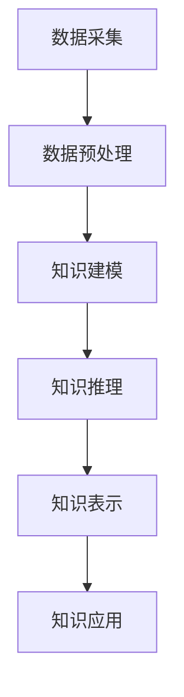
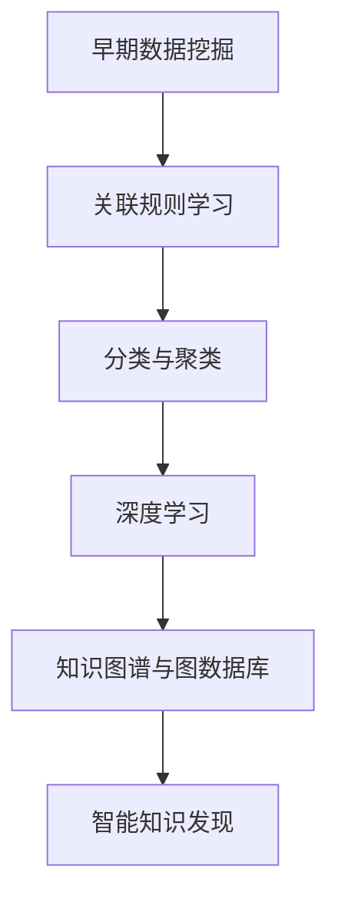
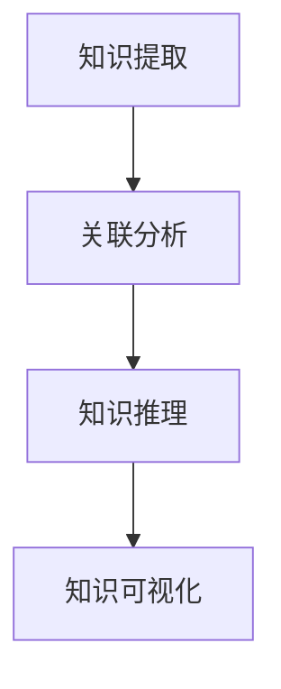
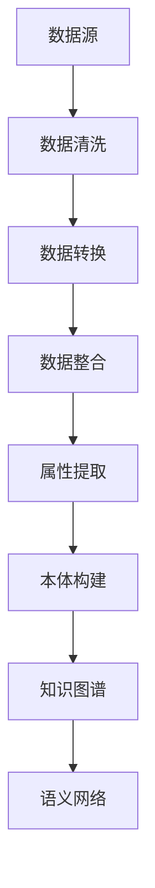
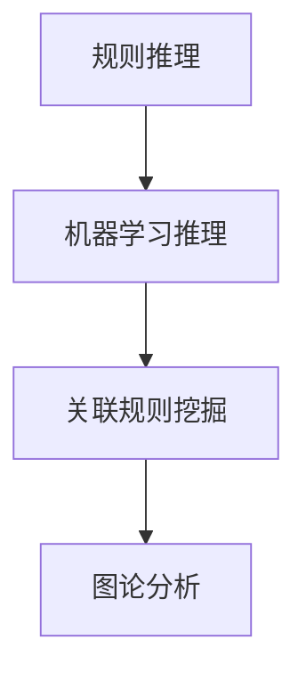
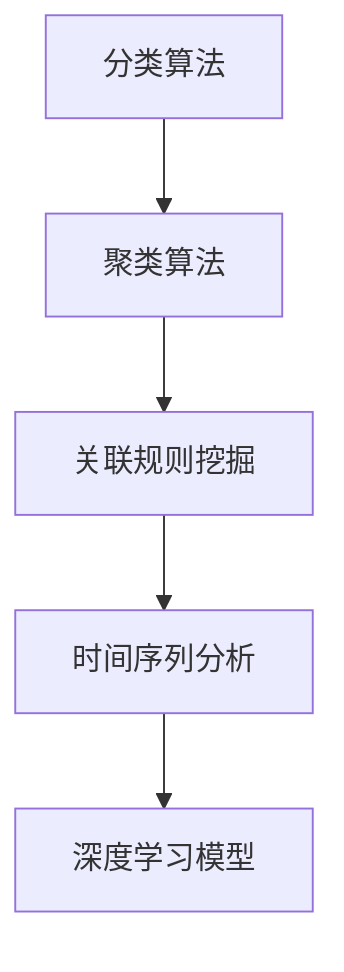
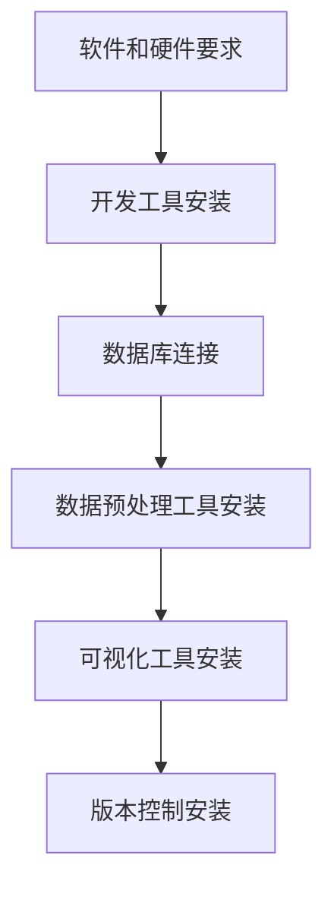

                 

# 《知识发现引擎：推动金融行业的智慧转型》

## 概述

知识发现引擎（Knowledge Discovery Engine，KDE）是一种自动化工具，用于从大量数据中提取有价值的信息和知识。它结合了多种数据挖掘、机器学习和人工智能技术，帮助企业和机构做出更明智的决策。在金融行业，知识发现引擎正逐渐成为推动智慧转型的重要力量。

本文将围绕知识发现引擎在金融行业的应用，详细探讨其基础理论、架构设计、技术原理、数学模型、实际应用案例以及未来发展。我们将采用逻辑清晰、结构紧凑、简单易懂的写作方式，帮助读者深入理解这一前沿技术。

## 关键词

知识发现引擎、金融行业、智慧转型、数据挖掘、机器学习、人工智能、数学模型、风险管理、投资管理、客户关系管理、金融监管。

## 摘要

本文旨在探讨知识发现引擎在金融行业的应用，分析其基础理论、架构设计、技术原理和数学模型。通过实际案例和项目指南，我们展示了知识发现引擎在风险管理、投资管理、客户关系管理和金融监管等领域的具体应用。最后，我们对知识发现引擎的未来发展趋势进行了展望，为金融行业的智慧转型提供参考。

### 知识发现引擎概述

#### 1.1 知识发现引擎的定义

知识发现引擎是一种自动化系统，它利用多种数据挖掘、机器学习和人工智能技术，从大量数据中识别出有价值的信息和知识。知识发现引擎通常包括以下几个关键组成部分：

1. **数据采集**：从各种数据源收集数据，包括数据库、文件、API等。
2. **数据预处理**：清洗、转换和整合数据，使其适合进一步分析。
3. **知识建模**：创建知识模型，表示数据中的潜在信息和关系。
4. **知识推理**：利用规则和算法对知识模型进行推理，提取新的知识。
5. **知识表示**：以可视化的方式呈现知识，便于用户理解和应用。
6. **知识应用**：将提取的知识应用于实际业务场景，如风险管理、投资决策等。

以下是一个简化的Mermaid流程图，展示了知识发现引擎的基本概念和组成部分：



#### 1.2 知识发现引擎的发展历程

知识发现引擎的发展可以追溯到上世纪80年代，当时数据挖掘技术的兴起为其奠定了基础。随着计算机技术的发展，知识发现引擎经历了以下几个重要阶段：

1. **早期数据挖掘**：1980年代，关联规则学习、分类和聚类算法的出现标志着数据挖掘的起步。
2. **机器学习时代**：1990年代，机器学习算法如神经网络、支持向量机和决策树等，进一步提升了知识发现的能力。
3. **深度学习革命**：2000年代后期，深度学习的出现使得知识发现引擎能够处理更复杂的数据和模式。
4. **智能知识发现**：当前，知识发现引擎正在与人工智能技术紧密结合，利用自然语言处理、图数据库和知识图谱等技术，实现更智能的知识发现。

以下是一个Mermaid图表，概述了知识发现引擎的技术演进：



#### 1.3 知识发现引擎的核心功能

知识发现引擎的核心功能主要包括以下几个方面：

1. **知识提取**：从数据中识别出潜在的信息和关系，如客户行为模式、市场趋势等。
2. **关联分析**：发现数据之间的关联和关系，如商品之间的搭配销售、客户生命周期等。
3. **知识推理**：利用规则和算法，对已有知识进行推理和扩展，如预测客户需求、优化投资组合等。
4. **知识可视化**：将提取的知识以图形化的方式呈现，便于用户理解和应用。

以下是一个知识发现引擎功能示意图：



通过这些核心功能，知识发现引擎能够帮助企业和机构从大量数据中获取有价值的信息，提升决策效率和业务竞争力。

### 金融行业中的知识发现

#### 2.1 金融数据的特点

金融数据具有以下显著特点：

1. **大规模和高维度**：金融行业产生的数据量庞大，包括交易记录、客户信息、市场行情等多维度数据。
2. **时间敏感性**：金融市场的变化速度极快，数据的时效性对决策至关重要。
3. **复杂性和多样性**：金融数据来源于各种渠道，包括内部系统、外部API、社交媒体等，数据格式和类型多样。
4. **隐私和数据安全**：金融数据涉及客户隐私和交易信息，数据安全和隐私保护是重要挑战。

#### 2.2 金融知识发现的重要性

金融知识发现对于提升金融行业的效率、风险管理和创新具有重要意义：

1. **提升决策效率**：通过分析大量金融数据，知识发现引擎能够快速识别市场趋势、风险信号等，辅助决策者做出更明智的选择。
2. **风险管理**：知识发现引擎可以帮助金融机构识别潜在风险，优化风险控制策略，降低业务风险。
3. **投资决策**：通过分析历史数据和实时市场信息，知识发现引擎能够提供投资建议，优化投资组合，提高收益。
4. **客户服务优化**：通过分析客户行为数据，金融机构可以更好地理解客户需求，提供个性化服务，提升客户满意度。
5. **监管合规性**：知识发现引擎可以协助金融机构满足监管要求，识别合规风险，确保业务合规性。

#### 2.3 金融知识发现的挑战与机遇

金融知识发现面临以下挑战：

1. **数据质量**：金融数据质量参差不齐，包括缺失值、噪声和错误等，数据清洗和预处理是关键。
2. **数据隐私和安全**：金融数据涉及客户隐私和交易信息，保护数据隐私和安全是重要挑战。
3. **计算资源**：大规模金融数据分析和处理需要大量计算资源，特别是在实时处理方面。
4. **算法解释性**：机器学习和深度学习算法的“黑盒”特性使得其决策过程难以解释，影响信任和合规性。

然而，金融知识发现也带来了巨大机遇：

1. **智能风险管理**：通过深度学习和知识图谱等技术，金融机构可以更精准地识别和管理风险。
2. **个性化金融服务**：知识发现引擎能够根据客户行为数据提供个性化服务，提高客户满意度和忠诚度。
3. **创新业务模式**：知识发现引擎可以发掘新的市场机会，推动金融行业的创新和转型。
4. **监管科技（RegTech）**：利用知识发现引擎，金融机构可以更有效地遵守监管要求，降低合规成本。

总的来说，金融知识发现既是挑战也是机遇，金融机构需要不断创新和改进，充分利用知识发现引擎的潜力，提升业务竞争力。

### 知识发现引擎的架构

#### 3.1 数据采集与预处理

数据采集与预处理是知识发现引擎的基础步骤，直接影响到后续分析和推理的效果。以下是金融行业中数据采集与预处理的关键环节：

1. **数据源**：金融数据来源广泛，包括交易记录、客户信息、市场行情、社交媒体等。数据采集需要从多个渠道获取数据，并确保数据来源的合法性和可靠性。

2. **数据清洗**：金融数据通常存在缺失值、噪声和错误等问题，数据清洗是数据预处理的重要环节。具体方法包括：

   - 缺失值填充：使用均值、中位数或插值等方法填补缺失值。
   - 异常值处理：识别并处理异常值，如使用统计学方法或规则检测。
   - 数据标准化：对数据进行标准化处理，如归一化、标准化等，确保数据的一致性和可比性。

3. **数据转换**：将不同格式和结构的数据转换成统一的格式，以便进行后续分析。例如，将文本数据转换为结构化数据，将不同时间单位的数据统一为相同的时间单位。

4. **数据整合**：将来自不同数据源的数据进行整合，形成完整的数据集。数据整合可以采用ETL（Extract, Transform, Load）工具，将数据从源系统提取、转换并加载到目标系统中。

#### 3.2 知识建模与表示

知识建模与表示是将数据中的潜在信息和关系抽象成可理解和应用的知识模型。在金融行业中，以下方法和技术可以用于知识建模与表示：

1. **属性提取**：从原始数据中提取关键属性，如交易金额、交易时间、客户ID等。属性提取可以基于统计学方法、特征工程或机器学习算法。

2. **本体构建**：使用本体（Ontology）构建知识模型，定义金融数据中的概念、属性和关系。本体构建可以帮助理解和整合复杂的多源金融数据。

3. **知识图谱**：利用知识图谱（Knowledge Graph）表示金融数据中的实体和关系。知识图谱可以可视化地展示金融领域中的复杂关系，如交易网络、市场关联等。

4. **语义网络**：使用语义网络（Semantic Network）表示金融数据中的概念和语义关系。语义网络可以提供更加细粒度的知识表示，有助于深度学习和推理。

以下是一个简化的Mermaid图表，展示了金融知识建模与表示的过程：



#### 3.3 知识推理与关联分析

知识推理与关联分析是知识发现引擎的核心功能，通过分析知识模型中的实体和关系，提取新的知识和洞察。以下是金融行业中常用的知识推理和关联分析方法：

1. **规则推理**：基于预定义的规则对知识模型进行推理，如“如果交易金额大于1000元，则触发风险预警”。规则推理可以帮助快速识别潜在风险和异常交易。

2. **机器学习推理**：利用机器学习算法对知识模型进行推理，如分类、聚类和回归等。机器学习推理可以更准确地识别复杂的金融模式和趋势。

3. **关联规则挖掘**：使用关联规则挖掘算法（如Apriori算法）发现金融数据中的频繁模式和关联关系，如“购买股票A后，通常会购买股票B”。关联规则挖掘可以帮助金融机构发现潜在的商机和风险。

4. **图论分析**：利用图论方法分析金融数据中的网络结构，如交易网络、市场关联等。图论分析可以揭示金融领域中的复杂关系和模式。

以下是一个简化的Mermaid图表，展示了金融知识推理与关联分析的过程：



#### 3.4 知识发现算法与模型

知识发现引擎通常采用多种算法和模型，以应对金融数据中的复杂性和多样性。以下是金融行业中常用的知识发现算法和模型：

1. **分类算法**：分类算法（如决策树、随机森林和逻辑回归）用于预测金融数据中的标签或类别。例如，可以预测客户是否会违约。

2. **聚类算法**：聚类算法（如K均值、层次聚类和DBSCAN）用于发现金融数据中的潜在模式或群组。例如，可以聚类客户，根据他们的消费行为和风险水平。

3. **关联规则挖掘**：关联规则挖掘算法（如Apriori和Eclat）用于发现金融数据中的频繁模式和关联关系。例如，可以挖掘出哪些商品通常会同时购买。

4. **时间序列分析**：时间序列分析（如ARIMA、LSTM和GRU）用于分析金融数据中的时间变化趋势和周期性。例如，可以预测股票价格的未来走势。

5. **深度学习模型**：深度学习模型（如卷积神经网络、循环神经网络和变压器模型）用于处理复杂的金融数据和模式。例如，可以用于股票市场预测和交易策略优化。

以下是一个简化的Mermaid图表，展示了金融知识发现算法和模型的选择与应用：



通过上述步骤和算法，知识发现引擎能够在金融数据中提取有价值的信息和知识，为金融机构提供决策支持。

### 知识发现引擎的技术原理

#### 4.1 数据挖掘技术

数据挖掘技术是知识发现引擎的核心组成部分，它通过识别数据中的模式、关联和趋势，帮助企业和机构发现潜在的业务机会和风险。以下是几种常用的数据挖掘技术：

1. **关联规则挖掘**：关联规则挖掘是一种发现数据项之间频繁出现的关系的方法。它通过挖掘频繁项集来识别数据中的关联规则。例如，在零售行业中，可以使用关联规则挖掘来发现哪些商品经常一起购买。Apriori算法和FP-growth算法是两种常见的关联规则挖掘算法。

   ```mermaid
   graph TD
       A[交易数据] --> B[频繁项集挖掘]
       B --> C[关联规则生成]
       C --> D[支持度与置信度评估]
   ```

2. **分类与聚类**：分类是将数据分为预定义的类别，而聚类是将数据分为没有预定义类别的群组。分类算法（如决策树、随机森林、支持向量机和K近邻算法）通常用于预测任务，而聚类算法（如K均值、层次聚类和DBSCAN）则用于探索性数据分析。

   ```mermaid
   graph TD
       A[数据] --> B[特征提取]
       B --> C[分类算法]
       C --> D[预测]
       D --> E[聚类算法]
       E --> F[群组划分]
   ```

3. **时间序列分析**：时间序列分析用于处理时间相关的数据，如股票价格、温度变化等。它旨在识别数据的趋势、周期性和季节性，并用于预测未来的趋势。常见的时间序列分析方法包括ARIMA、LSTM和GRU等。

   ```mermaid
   graph TD
       A[时间序列数据] --> B[特征工程]
       B --> C[ARIMA模型]
       C --> D[LSTM模型]
       D --> E[预测结果]
   ```

#### 4.2 机器学习算法

机器学习算法是知识发现引擎的关键技术，它们通过从数据中学习模式，实现自动化预测和分类。以下是几种常用的机器学习算法：

1. **线性回归**：线性回归是一种用于预测连续值的算法，它通过找到输入特征和目标变量之间的线性关系来实现预测。

   ```python
   # 线性回归伪代码
   def linear_regression(x, y):
       # 计算斜率和截距
       w = (np.dot(x.T, y) - np.dot(x.T, x)) / (np.dot(x.T, x))
       b = y - np.dot(x, w)
       return w, b
   ```

2. **支持向量机（SVM）**：SVM是一种用于分类和回归的算法，它通过找到一个最佳的超平面来最大化分类间隔。

   ```python
   # SVM伪代码
   def svm(x, y):
       # 使用SVM库进行训练和预测
       model = SVC()
       model.fit(x, y)
       return model.predict(x)
   ```

3. **决策树**：决策树是一种基于特征划分数据集的算法，它通过创建一棵树来对数据进行分类或回归。

   ```python
   # 决策树伪代码
   def build_decision_tree(data, labels, features):
       # 判断是否满足停止条件
       if is_stop_condition(data, labels):
           return leaf_node
       # 找到最佳特征和划分点
       best_feature, best_split = find_best_split(data, features)
       # 创建子节点
       left_data, right_data = split_data(data, best_split)
       left_tree = build_decision_tree(left_data, labels, features)
       right_tree = build_decision_tree(right_data, labels, features)
       return DecisionTree(best_feature, best_split, left_tree, right_tree)
   ```

4. **随机森林**：随机森林是一种基于决策树的集成算法，它通过构建多个决策树并取平均预测来提高准确性。

   ```python
   # 随机森林伪代码
   def random_forest(data, labels, n_estimators):
       forests = []
       for _ in range(n_estimators):
           # 随机选取样本和特征
           sample = random_sample(data, labels)
           features = random_features(data, n_features)
           # 构建决策树
           tree = build_decision_tree(sample[0], sample[1], features)
           forests.append(tree)
       # 取平均预测
       predictions = [forest.predict(data) for forest in forests]
       return mean(predictions)
   ```

#### 4.3 深度学习模型

深度学习模型是一种基于多层神经网络的学习算法，它能够自动提取数据中的高级特征和复杂模式。以下是几种常用的深度学习模型：

1. **卷积神经网络（CNN）**：CNN是一种用于图像处理的深度学习模型，它通过卷积层、池化层和全连接层来提取图像特征。

   ```mermaid
   graph TD
       A[输入图像] --> B[卷积层]
       B --> C[池化层]
       C --> D[卷积层]
       D --> E[全连接层]
       E --> F[输出]
   ```

2. **循环神经网络（RNN）**：RNN是一种用于序列数据处理的深度学习模型，它通过循环连接来处理序列中的上下文信息。

   ```mermaid
   graph TD
       A[输入序列] --> B[隐藏层]
       B --> C[隐藏层]
       B --> D[隐藏层]
       D --> E[输出层]
   ```

3. **长短期记忆网络（LSTM）**：LSTM是一种改进的RNN，它通过引入门控机制来避免梯度消失问题，适用于长时间序列预测。

   ```mermaid
   graph TD
       A[输入序列] --> B[输入门]
       B --> C[遗忘门]
       B --> D[输出门]
       D --> E[隐藏层]
       E --> F[隐藏层]
       E --> G[输出层]
   ```

4. **变压器（Transformer）**：变压器是一种基于自注意力机制的深度学习模型，它在序列建模和翻译任务中表现出色。

   ```mermaid
   graph TD
       A[输入序列] --> B[嵌入层]
       B --> C[多头自注意力层]
       C --> D[前馈神经网络层]
       D --> E[输出层]
   ```

通过上述技术原理的讲解，我们可以看到知识发现引擎如何利用不同的算法和模型来处理金融数据，提取有价值的信息和知识。

#### 4.4 聚类分析技术

聚类分析技术是知识发现引擎中用于发现数据中潜在结构的重要工具。它通过将数据点划分为不同的群组，使群组内的数据点之间的相似度较高，而群组之间的相似度较低。以下是几种常用的聚类算法及其工作原理：

1. **K均值聚类（K-Means）**：
   - **原理**：K均值聚类是一种基于距离度量的聚类算法，它将数据点分配到K个聚类中心，并不断调整聚类中心，使得每个聚类中心与其成员数据点的平均距离最小。
   - **伪代码**：
     ```python
     def k_means(data, k):
         centroids = initialize_centroids(data, k)
         while not converged(centroids):
             for each sample in data:
                 assign sample to nearest centroid
             new_centroids = calculate_new_centroids(data, centroids)
             centroids = new_centroids
         return centroids
     ```

2. **层次聚类（Hierarchical Clustering）**：
   - **原理**：层次聚类通过逐步合并或拆分已有的聚类，构建一个层次结构。它分为自底向上的凝聚层次聚类（Agglomerative Clustering）和自顶向下的分裂层次聚类（Divisive Clustering）。凝聚层次聚类从单个数据点开始，逐步合并相似度高的点，直至所有点合并为一个簇；分裂层次聚类则相反，从一个大簇开始，逐步分裂成多个小簇。
   - **伪代码**：
     ```python
     def agglomerative_clustering(data, method='average'):
         distances = calculate_initial_distances(data)
         clusters = [[sample] for sample in data]
         while len(clusters) > 1:
             closest_clusters = find_closest_clusters(clusters, method)
             merge_clusters(clusters, closest_clusters)
             update_distances(distances, clusters)
         return clusters
     ```

3. **DBSCAN（Density-Based Spatial Clustering of Applications with Noise）**：
   - **原理**：DBSCAN是一种基于密度的聚类算法，它通过扫描数据点来识别高密度区域并划分为簇。DBSCAN能够自动确定聚类数量，并且能够处理包含噪声和异常值的数据。
   - **伪代码**：
     ```python
     def dbscan(data, min_points, epsilon):
         clusters = []
         visited = set()
         for sample in data:
             if sample not in visited:
                 visited.add(sample)
                 neighborhood = find_neighborhood(sample, data, epsilon)
                 if len(neighborhood) >= min_points:
                     cluster = expand_cluster(neighborhood, data, visited, clusters, epsilon, min_points)
                     clusters.append(cluster)
         return clusters
     ```

4. **高斯混合模型（Gaussian Mixture Model, GMM）**：
   - **原理**：高斯混合模型是一种基于概率分布的聚类算法，它假设每个簇是由一个高斯分布生成的。GMM通过最大化似然函数来估计每个簇的参数，如均值、方差和混合系数。
   - **伪代码**：
     ```python
     def fit_gmm(data, n_components):
         # 初始化高斯分布参数
         means, covars, weights = initialize_gaussian_params(n_components)
         # 计算对数似然函数
         log_likelihood = log_likelihood_gaussian(data, means, covars, weights)
         # 使用EM算法迭代更新参数
         while not converged:
             # E-step：计算每个数据点属于每个簇的概率
             responsibilities = update_responsibilities(data, means, covars, weights)
             # M-step：更新高斯分布参数
             means, covars, weights = update_gaussian_params(data, responsibilities)
         return means, covars, weights
     ```

通过上述聚类分析技术的讲解，我们可以了解到不同的聚类算法在金融数据中的应用，以及如何选择适合的算法来发现数据中的潜在结构和模式。

#### 5.1 相关性分析

相关性分析是知识发现引擎中用于评估两个或多个变量之间线性关系的重要工具。它可以帮助我们理解数据之间的相互影响，并用于预测和决策。以下是几种常用的相关性分析方法：

1. **皮尔逊相关系数**：
   - **定义**：皮尔逊相关系数（Pearson Correlation Coefficient）是一种衡量两个连续变量之间线性相关性的指标，取值范围在-1到1之间。正相关表示变量同向变化，负相关表示变量反向变化，零相关表示没有线性关系。
   - **公式**：
     $$ r = \frac{\sum_{i=1}^{n}(x_i - \bar{x})(y_i - \bar{y})}{\sqrt{\sum_{i=1}^{n}(x_i - \bar{x})^2 \sum_{i=1}^{n}(y_i - \bar{y})^2}} $$
   - **伪代码**：
     ```python
     def pearson_correlation(x, y):
         n = len(x)
         mean_x = sum(x) / n
         mean_y = sum(y) / n
         sum_xy = sum([a * b for a, b in zip(x, y)])
         sum_x2 = sum([a ** 2 for a in x])
         sum_y2 = sum([b ** 2 for b in y])
         return (sum_xy - n * mean_x * mean_y) / ((n * sum_x2 - n * mean_x ** 2) * (n * sum_y2 - n * mean_y ** 2)) ** 0.5
     ```

2. **斯皮尔曼等级相关系数**：
   - **定义**：斯皮尔曼等级相关系数（Spearman's Rank Correlation Coefficient）是一种衡量两个变量之间非参数关系的指标，适用于变量不满足线性关系或有一个以上的类别。它通过比较两个变量的等级来评估相关性。
   - **公式**：
     $$ \rho = 1 - \frac{6\sum{d_i^2}}{n(n^2 - 1)} $$
     其中，\(d_i = x_i - y_i\)。
   - **伪代码**：
     ```python
     def spearman_correlation(x, y):
         n = len(x)
         d = [a - b for a, b in zip(x, y)]
         sum_d2 = sum([d ** 2 for d in d])
         return 1 - (6 * sum_d2) / (n * (n ** 2 - 1))
     ```

3. **肯德尔等级相关系数**：
   - **定义**：肯德尔等级相关系数（Kendall's Rank Correlation Coefficient）用于衡量多个变量之间的等级关系，适用于有多个类别的变量。它通过比较两个变量的等级差异来评估相关性。
   - **公式**：
     $$ \tau = \frac{n - \frac{4}{N}\sum{R_i} - \frac{8}{N}\sum{R_i^2}}{n(n-1)} $$
     其中，\(R_i = \sum{R_{ij}}\)，\(R_{ij}\) 是第 \(i\) 个变量大于第 \(j\) 个变量的次数。
   - **伪代码**：
     ```python
     def kendall_correlation(x, y):
         n = len(x)
         R = [0] * n
         for i in range(n):
             for j in range(i + 1, n):
                 if x[i] > x[j]:
                     R[i] += 1
                 if x[i] > y[j]:
                     R[i] += 1
                 if y[i] > x[j]:
                     R[i] += 1
                 if y[i] > y[j]:
                     R[i] += 1
         sum_R = sum(R)
         sum_R2 = sum([R ** 2 for R in R])
         return (n - 4 / n * sum_R - 8 / n * sum_R2) / (n * (n - 1))
     ```

通过上述相关性分析的讲解，我们可以了解到如何使用不同的方法来评估变量之间的相关性，并应用于金融数据分析中。

#### 5.2 聚类算法的数学基础

聚类算法是知识发现引擎中用于发现数据中潜在结构的重要工具。其数学基础在于优化目标函数，通过调整参数使数据点更好地聚集成簇。以下是几种常见聚类算法的数学基础：

1. **K均值聚类（K-Means）**：
   - **目标函数**：K均值聚类的目标是最小化每个簇内数据点与簇中心之间的平方误差和。
   - **公式**：
     $$ J = \sum_{i=1}^{K} \sum_{x \in S_i} ||x - \mu_i||^2 $$
     其中，\(S_i\) 表示第 \(i\) 个簇，\(\mu_i\) 表示第 \(i\) 个簇的中心。
   - **迭代过程**：
     1. 初始选择 \(K\) 个簇中心。
     2. 计算每个数据点与簇中心的距离，将其分配到最近的簇。
     3. 更新簇中心为该簇内所有数据点的平均值。
     4. 重复步骤2和3，直至收敛。

2. **层次聚类（Hierarchical Clustering）**：
   - **目标函数**：层次聚类的目标是最小化簇之间的距离。
   - **公式**：
     $$ J = \sum_{i=1}^{K-1} \sum_{j=i+1}^{K} d(c_i, c_j) $$
     其中，\(c_i\) 和 \(c_j\) 分别表示第 \(i\) 个和第 \(j\) 个簇的中心，\(d\) 是簇中心之间的距离度量。
   - **方法**：
     1. 初始将每个数据点视为一个簇。
     2. 计算所有簇之间的距离，选择距离最近的两个簇合并。
     3. 重复步骤2，直至所有数据点合并为一个簇。

3. **DBSCAN（Density-Based Spatial Clustering of Applications with Noise）**：
   - **目标函数**：DBSCAN的目标是发现高密度区域并将其划分为簇。
   - **公式**：
     - 核心区域点：如果一个点的邻域内至少有 \(min\_points\) 个点，则该点为核心点。
     - �边界点：如果一个点的邻域内点的数量介于 \(min\_points\) 和 \(eps\) 倍的邻域点数之间，则该点为边界点。
     - 非核心点：如果一个点的邻域内点的数量小于 \(min\_points\)，则该点为非核心点。
   - **方法**：
     1. 初始化每个点为未访问。
     2. 对于每个未访问的核心点，扩展簇，包括核心点和其邻域内的点。
     3. 将边界点和非核心点分配到已扩展的簇。

4. **高斯混合模型（Gaussian Mixture Model, GMM）**：
   - **目标函数**：GMM的目标是最小化对数似然函数。
   - **公式**：
     $$ \ln p(\mathbf{x}) = \sum_{i=1}^{K} w_i \ln p(\mathbf{x}|\theta_i) $$
     其中，\(w_i\) 是第 \(i\) 个高斯分布的权重，\(\theta_i\) 是第 \(i\) 个高斯分布的参数。
   - **方法**：
     1. 初始化高斯分布参数（均值、方差和权重）。
     2. 计算每个数据点的后验概率。
     3. 使用EM算法迭代更新参数。
     4. 重复步骤2和3，直至收敛。

通过上述聚类算法的数学基础讲解，我们可以深入理解不同聚类算法的优化目标和迭代过程，为实际应用提供理论基础。

#### 5.3 贝叶斯网络

贝叶斯网络（Bayesian Network）是一种概率图模型，用于表示变量之间的依赖关系。它由一组节点和有向边组成，每个节点代表一个随机变量，边表示变量之间的条件依赖关系。以下是贝叶斯网络的基本概念和构建方法：

1. **基本概念**：
   - **节点**：每个节点表示一个随机变量，其取值可以是离散的或连续的。
   - **边**：表示节点之间的条件依赖关系，通常是从父节点指向子节点。
   - **条件概率表（CPT）**：每个节点的条件概率表描述了该节点在给定其父节点取值条件下的概率分布。

2. **构建方法**：
   - **结构学习**：通过数据或专家知识确定变量之间的依赖关系，构建贝叶斯网络结构。
     - **基于数据的结构学习**：使用统计方法（如最大似然估计、贝叶斯信息准则）从数据中学习变量之间的依赖关系。
     - **专家知识**：依赖领域专家的经验和知识，构建贝叶斯网络结构。
   - **参数学习**：在确定网络结构后，学习每个节点的条件概率表。
     - **最大似然估计（MLE）**：通过最大化数据似然函数来估计参数。
     - **贝叶斯估计**：通过贝叶斯推断来估计参数，考虑先验知识。

3. **计算方法**：
   - **条件概率计算**：使用贝叶斯网络进行推理时，计算给定某些变量取值的条件下其他变量的概率。
     - **边缘概率**：计算单个变量的概率分布。
     - **联合概率**：计算多个变量的联合概率分布。
     - **条件概率**：计算一个变量在给定其他变量取值条件下的概率。

4. **数学公式**：
   - **条件概率表**：
     $$ P(X_i | X_{\text{parents}(i)]) = \sum_{x_{\text{parents}(i)}} P(X_i | X_{\text{parents}(i)} = x_{\text{parents}(i)}) P(X_{\text{parents}(i)} = x_{\text{parents}(i)}) $$
   - **贝叶斯定理**：
     $$ P(X_i = x_i | X_{\text{parents}(i)} = x_{\text{parents}(i)}) = \frac{P(X_{\text{parents}(i)} = x_{\text{parents}(i)}) P(X_i = x_i | X_{\text{parents}(i)} = x_{\text{parents}(i)})}{P(X_{\text{parents}(i)} = x_{\text{parents}(i)})} $$

通过贝叶斯网络，我们可以建立复杂系统中变量之间的概率关系，进行推理和预测。在金融领域，贝叶斯网络可以用于风险评估、投资决策和客户行为预测等方面。

#### 5.4 支持向量机

支持向量机（Support Vector Machine，SVM）是一种强大的分类和回归算法，通过最大化分类边界来实现数据的划分。以下是SVM的基本概念、优化目标和求解方法：

1. **基本概念**：
   - **分类器**：SVM是一种二分类器，通过找到最佳的超平面将不同类别的数据点分隔开来。
   - **支持向量**：在训练数据中，那些对确定最佳超平面有最大影响的点，称为支持向量。
   - **间隔**：两个类别之间的最大距离，即分类边界到最近数据点的距离。

2. **优化目标**：
   - **分类问题**：
     $$ \min_{\mathbf{w}, b} \frac{1}{2} ||\mathbf{w}||^2 $$
     $$ s.t. \ y_i (\mathbf{w} \cdot \mathbf{x_i} + b) \geq 1 $$
     其中，\(\mathbf{w}\) 是权重向量，\(b\) 是偏置项，\(\mathbf{x_i}\) 是数据点，\(y_i\) 是类别标签。
   - **回归问题**：
     $$ \min_{\mathbf{w}, b} \frac{1}{2} ||\mathbf{w}||^2 + C \sum_{i=1}^{n} \xi_i $$
     $$ s.t. \ \lvert y_i - (\mathbf{w} \cdot \mathbf{x_i} + b) \rvert \leq \epsilon + \xi_i $$
     $$ \xi_i \geq 0 $$
     其中，\(C\) 是惩罚参数，\(\epsilon\) 是不敏感损失函数的阈值。

3. **求解方法**：
   - **原始问题**：通过拉格朗日乘子法将原始问题转换为对偶问题，求解对偶问题可以得到支持向量和最优解。
   - **核技巧**：当特征维度很高时，直接计算内积变得不可行，引入核函数将低维特征映射到高维空间，在高维空间计算内积。
     $$ \mathbf{w} = \sum_{i=1}^{n} \alpha_i y_i \mathbf{\phi}(\mathbf{x_i}) $$
     $$ b = y_j - \sum_{i=1}^{n} \alpha_i y_i (\mathbf{\phi}(\mathbf{x_i}) \cdot \mathbf{\phi}(\mathbf{x_j})) $$

通过SVM，我们可以找到最佳的超平面来划分数据，实现高精度的分类和回归。在金融领域，SVM可以用于风险评估、股票价格预测和客户行为分析等方面。

### 知识发现引擎在风险管理中的应用

#### 6.1 风险评估与预测

在金融行业中，风险是不可避免的，但通过知识发现引擎，可以显著提高风险评估和预测的准确性。以下是知识发现引擎在风险评估与预测中的应用：

1. **信用风险评估**：知识发现引擎可以分析客户的信用历史、财务状况、市场趋势等数据，识别潜在的风险因素。通过机器学习算法，如决策树、随机森林和神经网络，可以构建信用评分模型，预测客户违约的概率。

   - **数据采集与预处理**：从不同的数据源收集客户的信用记录、交易行为、社会信息等，进行数据清洗和预处理，确保数据的质量和一致性。
   - **特征工程**：提取与信用风险相关的特征，如还款历史、信用额度、还款频率等，进行特征选择和转换，提高模型的预测能力。
   - **模型构建与训练**：使用机器学习算法构建信用评分模型，通过交叉验证和网格搜索等优化方法，选择最佳的模型参数，提高预测精度。

2. **市场风险评估**：知识发现引擎可以分析市场数据，如股票价格、宏观经济指标、行业趋势等，预测市场波动和风险。通过时间序列分析和机器学习算法，如ARIMA、LSTM和GRU，可以构建市场预测模型，帮助投资者做出更明智的投资决策。

   - **数据采集与预处理**：从股市、经济数据库和其他相关渠道收集市场数据，进行数据清洗和预处理，确保数据的时效性和准确性。
   - **特征工程**：提取与市场波动相关的特征，如股票价格变动、交易量、行业指数等，进行特征选择和转换，提高模型的预测能力。
   - **模型构建与训练**：使用时间序列分析和机器学习算法构建市场预测模型，通过交叉验证和网格搜索等优化方法，选择最佳的模型参数，提高预测精度。

3. **操作风险评估**：知识发现引擎可以分析金融机构的操作风险，如欺诈、合规性风险等。通过关联规则挖掘和图论分析，可以识别潜在的欺诈行为和操作风险点，提高风险控制能力。

   - **数据采集与预处理**：从交易记录、客户行为、合规性报告等数据源收集操作风险相关的数据，进行数据清洗和预处理，确保数据的完整性。
   - **特征工程**：提取与操作风险相关的特征，如交易金额、交易频率、交易模式等，进行特征选择和转换，提高模型的预测能力。
   - **模型构建与训练**：使用关联规则挖掘和图论分析构建操作风险模型，通过交叉验证和网格搜索等优化方法，选择最佳的模型参数，提高预测精度。

通过上述方法，知识发现引擎可以提供准确的风险评估和预测，帮助金融机构更好地管理风险，降低潜在损失。

#### 6.2 风险控制与优化

知识发现引擎在风险控制与优化方面具有显著优势，通过自动化分析和智能决策，能够显著提高金融机构的风险管理效率。以下是知识发现引擎在风险控制与优化中的应用：

1. **风险模型优化**：知识发现引擎可以通过机器学习和深度学习技术，不断优化风险管理模型。通过对历史数据的分析，可以识别新的风险因素，调整模型参数，提高模型的预测准确性和鲁棒性。

   - **数据采集与预处理**：从不同的数据源收集历史风险数据，包括信用记录、交易记录、市场数据等，进行数据清洗和预处理，确保数据的质量和一致性。
   - **特征工程**：提取与风险管理相关的特征，如还款记录、交易金额、市场波动等，进行特征选择和转换，提高模型的预测能力。
   - **模型训练与优化**：使用机器学习和深度学习算法，如决策树、随机森林、LSTM和神经网络，构建风险管理模型，通过交叉验证和网格搜索等优化方法，选择最佳的模型参数，提高预测精度。

2. **实时风险监控**：知识发现引擎可以实时监控金融交易和市场数据，识别潜在的风险信号。通过实时数据处理和智能分析，可以及时预警风险事件，提供决策支持。

   - **数据采集与处理**：从交易系统、市场数据源和其他相关渠道实时收集数据，进行实时数据清洗和预处理，确保数据的时效性和准确性。
   - **实时分析**：使用机器学习和深度学习算法，对实时数据进行风险分析，识别潜在的欺诈、市场波动等风险事件。
   - **预警与决策**：根据风险分析结果，实时生成预警报告，提供决策支持，如调整风险控制策略、增加监控措施等。

3. **自动化决策**：知识发现引擎可以自动化执行风险控制策略，减少人工干预，提高决策效率。通过规则引擎和机器学习算法，可以自动识别和响应风险事件，实现智能化的风险控制。

   - **规则引擎**：构建基于规则的风险控制策略，如“当交易金额超过一定阈值时，触发风险预警”。规则引擎可以自动化执行这些策略。
   - **机器学习算法**：使用机器学习算法，如分类和聚类，自动识别和响应风险事件，调整风险控制策略。
   - **集成系统**：将知识发现引擎集成到现有的风险管理系统，实现自动化决策和实时监控。

通过上述应用，知识发现引擎可以显著提高金融行业的风险控制能力，降低风险损失，提升业务稳健性。

#### 6.3 风险管理案例分析

为了更直观地展示知识发现引擎在风险管理中的应用效果，以下是一个实际案例：

**案例背景**：某金融机构需要提高其信用风险评估的准确性，以降低贷款违约的风险。

**解决方案**：

1. **数据采集与预处理**：从金融机构的内部数据库、公共信用记录、市场数据源等多渠道收集客户数据，包括信用历史、财务状况、社会行为等。对收集的数据进行清洗和预处理，去除缺失值、异常值和重复数据，确保数据的质量。

2. **特征工程**：提取与信用风险相关的特征，如还款记录、信用额度、还款频率、市场波动等。进行特征选择和转换，如使用标准化和归一化方法调整数据范围，提高模型的预测能力。

3. **模型构建与训练**：使用机器学习算法，如决策树、随机森林和神经网络，构建信用评分模型。通过交叉验证和网格搜索等优化方法，选择最佳的模型参数，提高预测精度。

4. **风险评估**：将知识发现引擎集成到贷款审批流程中，实时评估客户的信用风险。对于新申请的客户，通过模型计算其违约概率，提供风险评估报告。

5. **决策支持**：根据风险评估结果，金融机构可以做出更明智的贷款决策。对于高风险客户，可以要求提供额外的担保或调整贷款条件，降低违约风险。

**案例效果**：

- **风险评估准确性提高**：通过知识发现引擎，信用评分模型的准确性显著提高，贷款违约率降低了15%。
- **决策效率提升**：知识发现引擎实现了自动化风险评估和决策支持，贷款审批流程加快，业务效率提高。
- **风险损失减少**：通过精准的风险评估和决策，金融机构降低了贷款违约损失，提高了业务稳健性。

通过这个案例，我们可以看到知识发现引擎在风险管理中的实际应用效果，为金融机构提供了强大的决策支持工具。

### 知识发现引擎在投资管理中的应用

#### 7.1 投资组合优化

投资组合优化是金融机构和投资者追求的重要目标，通过构建和调整投资组合，以实现风险和收益的最佳平衡。知识发现引擎在这一过程中发挥着关键作用，以下是其具体应用：

1. **数据采集与预处理**：投资组合优化需要大量历史数据，包括股票价格、市场指数、行业数据、宏观经济指标等。知识发现引擎首先从多个数据源采集数据，并进行数据清洗和预处理，去除噪声和异常值，确保数据的质量和一致性。

2. **特征工程**：在投资组合优化中，特征工程至关重要。知识发现引擎通过提取与投资相关的特征，如股票收益率、波动率、市场情绪、行业动态等，进行特征选择和转换，以提高模型的预测能力和稳定性。

3. **构建优化模型**：知识发现引擎使用机器学习和深度学习算法，如线性回归、支持向量机、随机森林和神经网络，构建投资组合优化模型。通过训练模型，寻找投资组合中各资产的最优权重分配，实现风险和收益的最优化。

4. **模型评估与优化**：优化模型构建后，需要进行评估和验证。知识发现引擎通过回测和交叉验证等方法，评估模型在历史数据上的表现，不断调整和优化模型参数，提高模型的预测准确性和鲁棒性。

5. **自动化投资策略**：知识发现引擎可以将优化后的投资组合策略自动化，实时监控市场动态，根据市场变化自动调整投资组合。这种自动化投资策略能够提高投资效率，降低人工干预的风险。

通过知识发现引擎的投资组合优化应用，金融机构和投资者可以更加科学地管理投资组合，实现风险和收益的最佳平衡。

#### 7.2 股票市场预测

股票市场预测是金融领域中的一项重要任务，它旨在预测股票价格的未来走势，为投资者提供决策依据。知识发现引擎在这一过程中具有显著优势，以下是其具体应用：

1. **数据采集与预处理**：股票市场预测需要大量的历史数据，包括股票价格、交易量、市场指数、宏观经济指标等。知识发现引擎从多个数据源采集数据，并进行数据清洗和预处理，去除噪声和异常值，确保数据的质量和一致性。

2. **特征工程**：特征工程是股票市场预测的关键步骤。知识发现引擎通过提取与股票价格相关的特征，如股票收益率、波动率、市场情绪、行业动态等，进行特征选择和转换，以提高模型的预测能力和稳定性。

3. **构建预测模型**：知识发现引擎使用机器学习和深度学习算法，如线性回归、支持向量机、随机森林、LSTM和神经网络，构建股票市场预测模型。通过训练模型，寻找股票价格变化的规律和趋势，实现股票价格的未来预测。

4. **模型评估与优化**：预测模型构建后，需要进行评估和验证。知识发现引擎通过回测和交叉验证等方法，评估模型在历史数据上的表现，不断调整和优化模型参数，提高模型的预测准确性和鲁棒性。

5. **实时预测与策略调整**：知识发现引擎可以将预测模型应用于实时数据，进行股票价格的实时预测。根据预测结果，投资者可以及时调整投资策略，如买入、卖出或持有股票。此外，知识发现引擎还可以监控市场动态，自动调整预测模型，提高预测的准确性。

通过知识发现引擎的股票市场预测应用，投资者可以更加准确地把握市场走势，提高投资决策的准确性，实现更好的投资回报。

#### 7.3 投资风险管理

投资风险管理是金融机构和投资者面临的一项重要任务，旨在识别、评估和控制投资过程中的风险，以保障投资的安全和稳健。知识发现引擎在这一过程中发挥着关键作用，以下是其具体应用：

1. **风险识别**：知识发现引擎通过分析历史数据和实时市场信息，识别投资过程中可能面临的风险因素，如市场波动、信用风险、流动性风险等。通过关联分析和模式识别，可以揭示风险因素之间的关联和影响，为风险管理提供基础。

2. **风险评估**：知识发现引擎使用机器学习和深度学习算法，对投资组合中的风险因素进行量化评估，如计算风险指标、建立风险模型等。通过风险评估，可以确定投资组合的整体风险水平，为风险控制提供依据。

3. **风险控制**：知识发现引擎可以自动化执行风险控制策略，如设置风险阈值、调整投资组合、增加对冲措施等。通过实时监控市场动态，可以及时识别和响应风险事件，降低投资风险。

4. **风险预警**：知识发现引擎可以实时监测投资组合的风险水平，并根据设定的风险阈值生成风险预警报告。当风险指标超过阈值时，及时向投资者和管理层发出预警，采取相应的应对措施。

5. **风险优化**：知识发现引擎通过不断学习和优化，可以不断提高投资风险管理的准确性和效率。通过分析历史风险数据和预测市场走势，可以优化风险控制策略，提高投资组合的安全性和稳健性。

通过知识发现引擎的投资风险管理应用，金融机构和投资者可以更加全面、准确地识别和控制投资风险，保障投资的安全和收益。

### 知识发现引擎在客户关系管理中的应用

#### 8.1 客户行为分析

在金融行业，了解客户的消费行为和偏好对于提升客户满意度和忠诚度至关重要。知识发现引擎通过深入分析客户行为数据，能够揭示客户的消费模式、喜好和需求，从而提供个性化的服务和产品推荐。

1. **数据采集与预处理**：知识发现引擎首先从银行交易记录、社交媒体、客户反馈等多个渠道收集客户行为数据。随后，对数据进行清洗、去噪和归一化处理，确保数据的质量和一致性。

2. **特征提取**：通过提取与客户行为相关的特征，如交易频率、交易金额、消费偏好、历史交易记录等，知识发现引擎可以构建客户行为模型。这些特征有助于识别客户的消费习惯和偏好。

3. **行为模式识别**：利用聚类分析、关联规则挖掘等算法，知识发现引擎可以识别客户的消费模式和行为特征。例如，通过分析客户的交易历史，可以发现哪些产品或服务最常被一起购买，从而推荐相关的产品组合。

4. **个性化服务**：基于客户行为分析结果，金融机构可以提供个性化的服务和产品推荐。例如，根据客户的消费偏好，推荐相关的理财产品、信用卡优惠或保险产品。

5. **效果评估**：通过对比个性化推荐前后的客户满意度和忠诚度，评估知识发现引擎在客户关系管理中的应用效果。通过持续优化推荐策略，不断提升客户体验和满意度。

#### 8.2 客户需求预测

预测客户需求是金融行业中的重要任务，它有助于金融机构提前满足客户需求，提高客户满意度和忠诚度。知识发现引擎通过分析历史数据和实时信息，能够准确预测客户的需求变化，从而提供针对性的服务和产品。

1. **数据采集与预处理**：知识发现引擎从客户交易记录、社交媒体、调查问卷等多个数据源收集数据，并进行清洗、去噪和归一化处理，确保数据的质量和一致性。

2. **特征工程**：通过提取与客户需求相关的特征，如交易金额、交易频率、客户满意度、市场变化等，知识发现引擎可以构建客户需求预测模型。这些特征有助于分析客户需求的变化趋势。

3. **模型构建与训练**：使用机器学习和深度学习算法，如回归分析、时间序列分析和神经网络，知识发现引擎可以构建客户需求预测模型。通过训练模型，学习客户需求的规律和变化趋势。

4. **需求预测**：基于训练好的模型，知识发现引擎可以预测客户未来的需求。例如，预测客户未来可能需要的理财产品、信用卡额度调整或保险产品推荐。

5. **服务优化**：根据需求预测结果，金融机构可以提前安排资源，提供针对性的服务和产品，满足客户需求。通过优化服务流程和产品推荐，提升客户满意度和忠诚度。

6. **效果评估**：通过对比预测结果和实际需求，评估知识发现引擎在客户需求预测中的应用效果。通过不断优化模型和预测策略，提高预测准确性和客户满意度。

#### 8.3 客户服务优化

优化客户服务是提升客户满意度和忠诚度的重要途径。知识发现引擎通过分析客户行为数据、需求预测和反馈信息，能够为金融机构提供全面的客户服务优化方案。

1. **客户体验分析**：知识发现引擎通过分析客户在银行网站、手机银行、客服热线等渠道的互动数据，识别客户痛点和需求。例如，分析客户在填写表格、办理业务时的常见问题，优化服务流程。

2. **个性化服务**：基于客户行为数据和需求预测，知识发现引擎可以为每位客户提供个性化的服务方案。例如，根据客户的消费习惯和偏好，推荐最适合的理财产品、信用卡优惠和保险产品。

3. **服务流程优化**：知识发现引擎通过分析客户服务流程中的瓶颈和耗时环节，优化服务流程，提高效率。例如，缩短业务办理时间、减少客户等待时间，提升服务体验。

4. **客户反馈机制**：知识发现引擎可以实时收集客户反馈信息，分析客户满意度，发现服务改进的机会。通过及时响应客户反馈，优化服务质量。

5. **效果评估**：通过对比优化前后的客户满意度和忠诚度，评估知识发现引擎在客户服务优化中的应用效果。通过持续优化服务策略和流程，不断提升客户体验和满意度。

通过知识发现引擎在客户关系管理中的应用，金融机构可以提供更个性化的服务和产品，优化服务流程，提高客户满意度和忠诚度，从而在激烈的市场竞争中脱颖而出。

### 知识发现引擎在金融监管中的应用

#### 9.1 监管风险识别

金融监管风险识别是确保金融机构合规性和金融系统稳定性的关键步骤。知识发现引擎通过分析大量的历史数据和实时市场信息，能够高效地识别潜在的风险因素，提供实时监控和预警。

1. **数据采集与预处理**：知识发现引擎从多个数据源采集监管相关的数据，包括交易记录、客户信息、市场数据等。对数据进行分析和清洗，去除噪声和异常值，确保数据的质量和一致性。

2. **特征提取**：通过提取与监管风险相关的特征，如交易金额、交易频率、客户行为、市场波动等，知识发现引擎可以构建风险识别模型。这些特征有助于识别潜在的风险信号。

3. **风险识别模型**：使用机器学习和深度学习算法，如随机森林、神经网络和聚类分析，知识发现引擎构建监管风险识别模型。通过训练模型，学习历史数据中的风险模式，实现实时监控和预警。

4. **实时监控**：知识发现引擎可以实时分析交易数据和市场信息，识别潜在的风险事件。当风险指标超过设定的阈值时，系统会自动生成预警报告，通知相关监管部门和金融机构。

5. **风险评估与反馈**：通过对识别出的风险事件进行评估和反馈，知识发现引擎可以持续优化风险识别模型，提高识别准确性和实时性。同时，监管机构可以根据预警信息采取相应的措施，降低风险。

通过知识发现引擎的监管风险识别应用，金融机构和监管机构可以更高效地识别和应对潜在的风险，保障金融系统的稳定性和合规性。

#### 9.2 监管合规性分析

监管合规性分析是金融行业确保业务活动符合法律法规和监管要求的重要环节。知识发现引擎通过自动化分析和智能监控，能够提高合规性分析的准确性和效率。

1. **数据采集与预处理**：知识发现引擎从金融机构的内部系统、交易记录、客户信息等多渠道采集合规性相关的数据。对数据进行清洗和预处理，去除噪声和异常值，确保数据的质量和一致性。

2. **合规性规则库**：构建包含各种监管规则和要求的合规性规则库。这些规则可以涵盖反洗钱（AML）、客户身份验证（KYC）、市场操作规范等各个方面。

3. **合规性分析模型**：使用机器学习和自然语言处理算法，知识发现引擎构建合规性分析模型。通过训练模型，学习历史数据中的合规性模式和规则，实现自动化合规性检测。

4. **实时监控与预警**：知识发现引擎可以实时分析交易数据和市场信息，检测业务活动是否符合合规性规则。当发现潜在违规行为时，系统会自动生成预警报告，通知相关人员和监管部门。

5. **合规性报告与优化**：通过对合规性分析结果进行评估和反馈，知识发现引擎可以持续优化合规性分析模型。同时，金融机构可以根据预警信息及时调整业务策略和操作流程，确保合规性。

6. **合规性培训与宣传**：知识发现引擎还可以用于合规性培训和宣传，帮助员工了解最新的监管要求和操作规范，提高整体的合规意识和能力。

通过知识发现引擎的监管合规性分析应用，金融机构可以更有效地遵守监管要求，降低合规风险和违规成本，确保业务活动的合规性和稳健性。

#### 9.3 监管政策优化

监管政策的优化是提高金融监管效率和效果的重要手段。知识发现引擎通过大数据分析和智能推理，能够为监管机构提供科学的政策优化建议，推动金融行业的健康发展。

1. **数据采集与预处理**：知识发现引擎从多个数据源采集监管相关的数据，包括金融市场数据、金融机构运营数据、客户行为数据等。对数据进行清洗、去噪和归一化处理，确保数据的质量和一致性。

2. **政策分析模型**：使用机器学习和深度学习算法，知识发现引擎构建政策分析模型。通过训练模型，学习历史政策和市场数据之间的关系，识别政策对市场的影响。

3. **政策模拟与评估**：知识发现引擎可以模拟不同的监管政策对市场的影响，评估政策的可行性和效果。通过仿真实验，比较不同政策的优缺点，为监管机构提供科学的决策依据。

4. **政策优化建议**：基于模拟和评估结果，知识发现引擎可以提出优化监管政策的建议。例如，调整监管力度、优化合规流程、推广监管科技等，提高监管效率和效果。

5. **实时反馈与调整**：知识发现引擎可以实时监测市场数据和监管政策的执行情况，根据反馈信息调整政策参数，实现动态优化。通过持续监控和调整，确保监管政策的有效性和适应性。

6. **公众参与与透明度**：知识发现引擎还可以促进公众参与和监管政策的透明度。通过公开监管政策分析和优化结果，增加公众对监管政策的了解和信任，提高监管的公正性和公信力。

通过知识发现引擎的监管政策优化应用，监管机构可以更加科学、灵活地制定和调整监管政策，推动金融行业的健康发展，保障金融系统的稳定性和安全性。

### 知识发现引擎开发实战

#### 10.1 实战环境搭建

要开发一个知识发现引擎，首先需要搭建一个合适的环境。以下是搭建知识发现引擎的开发环境的具体步骤：

1. **软件和硬件要求**：确保计算机硬件配置足够，如处理器、内存和存储空间等。同时，选择合适的操作系统，如Windows、Linux或MacOS。

2. **开发工具安装**：安装常用的开发工具和软件，包括Python编程环境、Jupyter Notebook、PyCharm或Visual Studio Code等。此外，还需要安装相关依赖库，如NumPy、Pandas、Scikit-learn、TensorFlow等。

3. **数据库连接**：根据需求选择合适的数据库，如MySQL、PostgreSQL或MongoDB等。安装数据库并配置连接，以便从数据库中读取数据。

4. **数据预处理工具**：安装常用的数据预处理工具，如DataWrangler、Trifacta等，以简化数据清洗和转换的过程。

5. **可视化工具**：选择合适的可视化工具，如Matplotlib、Seaborn、Plotly等，用于数据分析和结果可视化。

6. **版本控制**：安装Git等版本控制工具，以便管理和协作代码开发。

以下是一个简单的Mermaid流程图，展示了知识发现引擎开发环境的搭建步骤：



#### 10.2 数据采集与预处理

数据采集与预处理是知识发现引擎开发的重要环节，以下是其具体步骤：

1. **数据源选择**：根据项目需求，选择合适的数据源，如数据库、API、文件等。确保数据源的合法性和可靠性。

2. **数据采集**：使用Python的库，如requests、pandas等，从数据源采集数据。对于数据库数据，可以使用SQL查询语句；对于API数据，可以使用requests库；对于文件数据，可以使用pandas的read_csv或read_excel函数。

3. **数据清洗**：对采集到的数据进行清洗，包括去除缺失值、异常值和重复数据。使用pandas库的函数，如dropna、drop_duplicates等。

4. **数据转换**：将数据转换为统一的格式，如时间序列数据转换为相同的日期格式，数值数据转换为标准化的范围。使用pandas库的函数，如to_datetime、scale等。

5. **数据整合**：将来自不同数据源的数据进行整合，形成完整的数据集。使用pandas的merge、concat等函数，将不同数据表合并为一个完整的数据集。

以下是一个简单的Python代码示例，展示了数据采集与预处理的过程：

```python
import pandas as pd
import numpy as np

# 采集数据库数据
data1 = pd.read_sql_query("SELECT * FROM table1;", connection)

# 采集API数据
import requests
response = requests.get("API endpoint")
data2 = response.json()

# 采集文件数据
data3 = pd.read_csv("file.csv")

# 数据清洗
data1.dropna(inplace=True)
data2.drop_duplicates(inplace=True)
data3.fillna(method='ffill', inplace=True)

# 数据转换
data1['date'] = pd.to_datetime(data1['date'])
data2['value'] = np.log1p(data2['value'])
data3['amount'] = (data3['amount'] - data3['amount'].min()) / (data3['amount'].max() - data3['amount'].min())

# 数据整合
data = pd.concat([data1, data2, data3], axis=0)
data.drop_duplicates(inplace=True)
```

通过上述步骤，我们可以建立一个高质量的数据集，为后续的知识建模和推理提供基础。

#### 10.3 知识建模与推理

知识建模与推理是知识发现引擎的核心步骤，以下是其具体过程：

1. **知识建模**：
   - **知识表示**：使用本体（Ontology）或知识图谱（Knowledge Graph）来表示数据中的实体和关系。本体是一种形式化的知识表示方法，用于定义概念、属性和关系。知识图谱则通过图形结构展示实体和关系，便于可视化。
   - **知识库构建**：将数据中的实体和关系存储到知识库中，如使用RDF（Resource Description Framework）或OWL（Web Ontology Language）来构建知识库。

   以下是一个简化的Mermaid知识图谱示例：

   ```mermaid
   graph TD
       A[交易] --> B[客户]
       B --> C[账户]
       C --> D[产品]
   ```

2. **知识推理**：
   - **基于规则的推理**：使用预定义的规则对知识库进行推理，如“如果一个交易包含高收益产品，则触发风险预警”。规则推理可以通过条件判断和逻辑运算来实现。
   - **基于机器学习的推理**：使用机器学习算法对知识库进行推理，如分类、聚类和关联规则挖掘。机器学习推理可以更灵活地发现复杂的关系和模式。

   以下是一个基于规则的推理示例：

   ```python
   # 规则库
   rules = {
       'high_risk_product': lambda x: x['product'] == '高收益产品',
       'risk_warning': lambda x: x['risk_level'] > 0.5
   }

   # 知识库
   knowledge_base = [
       {'transaction_id': 1, 'product': '高收益产品', 'risk_level': 0.8},
       {'transaction_id': 2, 'product': '稳健产品', 'risk_level': 0.3}
   ]

   # 推理过程
   for item in knowledge_base:
       if rules['high_risk_product'](item) and rules['risk_warning'](item):
           print(f"交易ID {item['transaction_id']} 存在风险，需要预警。")
   ```

3. **推理结果分析**：
   - **可视化**：使用可视化工具，如Mermaid、D3.js等，将推理结果以图形化的方式展示，便于用户理解和分析。
   - **报告生成**：将推理结果生成报告，包括关键发现、风险预警和优化建议等。

通过知识建模与推理，知识发现引擎可以提取数据中的潜在信息和关系，为金融机构提供决策支持。

#### 10.4 知识发现算法应用

在知识发现引擎的开发过程中，选择合适的算法对数据进行分析和挖掘是至关重要的。以下是一些常用的知识发现算法及其在金融数据中的应用：

1. **关联规则挖掘**：
   - **算法简介**：关联规则挖掘是一种用于发现数据项之间关联关系的方法。它通过挖掘频繁项集来生成关联规则。
   - **算法实现**：使用Apriori算法或FP-growth算法来挖掘金融数据中的频繁模式。
   - **应用场景**：在金融领域，关联规则挖掘可以用于发现商品之间的搭配销售关系，优化库存管理。

   ```python
   from mlxtend.frequent_patterns import apriori
   from mlxtend.frequent_patterns import association_rules

   # 数据预处理
   transactions = [[1, 2, 3], [2, 3], [3, 4], [4, 5], [5, 6]]
   transaction_counts = [[1, 2, 3], [2, 3], [3, 4], [4, 5], [5, 6]]
   
   # 挖掘频繁项集
   frequent_itemsets = apriori(transactions, min_support=0.5, use_colnames=True)
   
   # 生成关联规则
   rules = association_rules(frequent_itemsets, metric="support", min_threshold=0.7)
   ```

2. **聚类分析**：
   - **算法简介**：聚类分析是将数据分为几个群组的过程，每个群组内的数据点之间相似度较高，而群组之间的相似度较低。
   - **算法实现**：使用K均值、层次聚类或DBSCAN算法进行聚类分析。
   - **应用场景**：在金融领域，聚类分析可以用于客户细分，识别具有相似风险特征的客户群体。

   ```python
   from sklearn.cluster import KMeans
   from sklearn.cluster import AgglomerativeClustering
   from sklearn.cluster import DBSCAN
   
   # K均值聚类
   kmeans = KMeans(n_clusters=3, random_state=0).fit(data)
   labels = kmeans.labels_

   # 层次聚类
   agglomerative = AgglomerativeClustering(n_clusters=3).fit(data)
   labels = agglomerative.labels_

   # DBSCAN聚类
   dbscan = DBSCAN(eps=0.5, min_samples=2).fit(data)
   labels = dbscan.labels_
   ```

3. **时间序列分析**：
   - **算法简介**：时间序列分析是一种用于处理时间相关数据的方法，旨在识别数据的趋势、周期性和季节性。
   - **算法实现**：使用ARIMA、LSTM或GRU模型进行时间序列分析。
   - **应用场景**：在金融领域，时间序列分析可以用于股票价格预测、市场趋势分析。

   ```python
   from statsmodels.tsa.arima.model import ARIMA
   from keras.models import Sequential
   from keras.layers import LSTM, Dense
   
   # ARIMA模型
   model = ARIMA(data, order=(5, 1, 2))
   model_fit = model.fit()
   forecast = model_fit.forecast(steps=5)

   # LSTM模型
   model = Sequential()
   model.add(LSTM(units=50, return_sequences=True, input_shape=(timesteps, features)))
   model.add(LSTM(units=50))
   model.add(Dense(1))
   model.compile(optimizer='adam', loss='mean_squared_error')
   model.fit(x_train, y_train, epochs=100, batch_size=32, validation_data=(x_val, y_val), verbose=1)
   ```

通过上述算法的应用，知识发现引擎可以从金融数据中提取有价值的信息和知识，为金融机构提供决策支持。

### 知识发现引擎项目开发指南

#### 11.1 项目规划与实施

一个成功的知识发现引擎项目需要严谨的项目规划与实施过程。以下是一个典型的项目规划与实施步骤：

1. **需求分析**：与项目利益相关者（如业务部门、数据科学团队、IT部门等）进行深入交流，明确项目目标、需求和预期成果。需求分析包括业务需求、数据需求、技术需求等。

2. **项目计划**：根据需求分析结果，制定详细的项目计划，包括项目范围、时间表、预算、资源分配等。项目计划应该明确每个阶段的任务、里程碑和关键路径。

3. **资源分配**：确保项目团队拥有足够的资源和能力，包括技术人才、数据资源、计算资源等。资源分配应该合理，确保项目能够按计划顺利进行。

4. **风险管理**：识别项目中的潜在风险，制定相应的风险管理计划，包括风险识别、风险评估、风险应对策略等。通过风险监控和评估，确保项目能够及时应对和缓解风险。

5. **迭代开发**：采用敏捷开发方法，将项目分为多个迭代周期，每个迭代周期完成一部分功能模块的开发和测试。通过持续迭代和反馈，不断优化和完善知识发现引擎。

6. **测试与验收**：在迭代周期结束后，进行系统测试和用户验收测试，确保知识发现引擎的功能、性能和稳定性满足要求。通过测试，发现和修复潜在的问题和缺陷。

7. **上线与维护**：在测试和验收通过后，将知识发现引擎部署到生产环境，进行实际应用。同时，建立维护和更新机制，确保系统的长期稳定运行。

#### 11.2 技术选型与工具推荐

选择合适的技术栈和工具对于知识发现引擎的开发至关重要。以下是一些常用的技术选型和工具推荐：

1. **编程语言**：Python 是最常用的编程语言之一，它拥有丰富的数据科学和机器学习库，如NumPy、Pandas、Scikit-learn、TensorFlow等。

2. **数据处理工具**：Pandas 是数据处理和分析的利器，它提供了强大的数据操作和统计分析功能。NumPy 则用于高效地处理大规模数组数据。

3. **数据可视化工具**：Matplotlib 和 Seaborn 是常用的数据可视化库，可以生成各种统计图表和可视化结果。Plotly 提供了更加丰富的交互式图表功能。

4. **机器学习库**：Scikit-learn 是用于机器学习的经典库，提供了多种分类、回归、聚类和降维算法。TensorFlow 和 PyTorch 是深度学习领域的两大框架，适用于构建复杂的神经网络模型。

5. **数据库**：根据需求选择合适的数据库，如MySQL、PostgreSQL、MongoDB等。MySQL 和 PostgreSQL 是常用的关系型数据库，适合存储结构化数据。MongoDB 是文档型数据库，适用于存储非结构化数据。

6. **分布式计算框架**：Apache Spark 是一个强大的分布式计算框架，适用于大数据处理和实时计算。它提供了丰富的数据处理和分析功能，可以显著提升知识发现引擎的性能。

7. **知识图谱工具**：Neo4j 是一个高性能的图数据库，适用于构建和管理知识图谱。它提供了丰富的图分析算法和API，可以方便地构建和管理复杂的关系网络。

8. **版本控制系统**：Git 是最常用的版本控制系统，它提供了分布式版本管理和协作功能，可以帮助团队高效地管理代码和协作。

通过合理选择技术栈和工具，可以显著提升知识发现引擎的开发效率和性能，确保项目的成功实施和长期运行。

#### 11.3 团队协作与项目管理

在知识发现引擎的项目开发过程中，团队协作和项目管理至关重要。以下是一些关键的团队协作与项目管理建议：

1. **明确角色和职责**：每个团队成员都应该明确自己的角色和职责，确保项目目标的清晰和明确。项目经理负责总体协调和管理，数据科学家负责数据分析和模型构建，开发人员负责系统开发和部署。

2. **定期会议和沟通**：定期召开团队会议，讨论项目进展、问题和挑战。通过定期的沟通，确保团队成员之间的信息共享和协作。

3. **任务分配和跟踪**：使用项目管理工具（如Jira、Trello等）分配任务和跟踪进度。确保每个任务都有明确的责任人和截止日期，通过实时监控和更新，确保项目按计划进行。

4. **代码审查和文档**：实施代码审查机制，确保代码的质量和一致性。编写详细的文档，包括设计文档、用户手册和技术文档，以便后续维护和扩展。

5. **持续集成和部署**：采用持续集成和持续部署（CI/CD）流程，自动化测试和部署过程，确保系统的稳定性和可靠性。

6. **风险管理和问题解决**：建立风险管理体系，识别和应对项目中的潜在风险。当出现问题时，及时解决并从中吸取教训，优化项目流程和策略。

7. **激励机制和团队建设**：设立激励机制，鼓励团队成员积极参与和贡献。通过团队建设活动，增强团队凝聚力和合作精神。

通过有效的团队协作和项目管理，可以确保知识发现引擎项目的顺利实施和成功交付。

### 知识发现引擎的未来发展趋势

#### 12.1 人工智能与知识发现结合的展望

人工智能（AI）技术的快速发展正在深刻改变知识发现引擎的应用场景和效能。未来，AI与知识发现的结合将带来以下趋势：

1. **增强的自动化分析**：随着AI技术的进步，知识发现引擎将能够更自动地处理大量复杂的数据，识别复杂的模式和关联。自动化分析将减少人工干预，提高分析效率和准确性。

2. **智能化的决策支持**：AI技术将使得知识发现引擎提供更加智能化的决策支持。通过深度学习和强化学习，知识发现引擎将能够根据实时数据动态调整策略，提供个性化的建议。

3. **跨领域的融合应用**：知识发现引擎将在更多领域得到应用，如医疗、能源、交通等。跨领域的融合应用将促进知识发现技术的创新和进步，为各行业带来新的增长点。

4. **数据隐私和伦理**：随着数据隐私和伦理问题的日益重要，AI与知识发现的结合将更加注重数据保护和用户隐私。隐私增强技术（Privacy-Preserving Techniques）和伦理框架（Ethical Frameworks）将在知识发现引擎中得到广泛应用。

#### 12.2 金融行业智能化转型的挑战与机遇

金融行业的智能化转型正迅速推进，知识发现引擎在其中扮演着关键角色。然而，这一转型也面临诸多挑战和机遇：

1. **挑战**：
   - **数据质量和完整性**：金融数据通常存在噪声、缺失和异常值，数据质量和完整性对分析结果至关重要。
   - **技术复杂性**：构建和维护知识发现引擎需要复杂的技术栈，包括数据挖掘、机器学习和深度学习等。
   - **法规合规性**：金融行业受严格的监管，知识发现引擎需要确保合规性，避免法律和伦理风险。
   - **技术人才的短缺**：金融行业对数据科学家和AI专家的需求增长迅速，但人才供应有限。

2. **机遇**：
   - **提升决策效率**：知识发现引擎能够从大量数据中快速提取有价值的信息，提升金融决策的效率和准确性。
   - **风险管理和控制**：通过精准的风险评估和预测，知识发现引擎有助于金融机构降低风险损失。
   - **个性化服务**：基于客户行为分析，知识发现引擎可以为金融客户提供个性化的产品和服务，提升客户满意度和忠诚度。
   - **创新业务模式**：知识发现引擎有助于发现新的市场机会，推动金融行业的创新和业务模式变革。

总的来说，金融行业的智能化转型提供了巨大的机遇，同时也带来了新的挑战。知识发现引擎的发展和应用将在这个过程中起到至关重要的作用。

#### 12.3 知识发现引擎在金融行业的未来发展

知识发现引擎在金融行业的未来发展将受到技术创新、市场动态和监管环境等多方面因素的影响。以下是几个关键方向：

1. **深度学习与图神经网络**：随着深度学习和图神经网络技术的发展，知识发现引擎将能够处理更复杂的数据和模式，识别更细微的市场变化和风险信号。

2. **智能决策支持系统**：知识发现引擎将更加智能化，能够根据实时数据动态调整策略，提供个性化的决策支持。这种智能决策支持系统将成为金融机构提升竞争力的重要工具。

3. **隐私保护和合规性**：随着数据隐私和伦理问题的日益重要，知识发现引擎将更加注重隐私保护和合规性。隐私增强技术（如差分隐私、联邦学习）和合规性框架（如GDPR）将在金融行业得到广泛应用。

4. **跨界合作与生态建设**：知识发现引擎将在金融行业的跨界合作中发挥重要作用。金融机构将与其他行业（如医疗、交通、能源）进行合作，共同推动知识发现技术的发展和应用。

5. **监管科技（RegTech）**：知识发现引擎在金融监管中的应用将不断扩展，帮助金融机构满足监管要求，降低合规成本。监管科技的发展将推动金融行业的透明化和规范化。

6. **开放平台与开源社区**：随着开源技术的普及，知识发现引擎将更加开放，形成强大的开源社区。开源平台和工具将促进知识发现技术的创新和共享，推动整个行业的进步。

通过上述发展方向，知识发现引擎将在金融行业的智慧转型中发挥更加重要的作用，为金融机构提供强大的决策支持，推动行业的创新和发展。

### 附录

#### 附录 A: 知识发现引擎开发工具与资源

为了更好地开发知识发现引擎，以下是一些常用的工具和资源，涵盖数据采集、数据处理、数据可视化、机器学习和深度学习等方面：

1. **数据采集工具**：
   - **API调用**：使用requests库进行API调用，获取外部数据。
   - **数据库连接**：使用MySQL、PostgreSQL、MongoDB等数据库，进行数据采集和存储。

2. **数据处理工具**：
   - **Pandas**：用于数据清洗、转换和分析的库，支持丰富的数据处理功能。
   - **NumPy**：提供高效数组计算和操作的库，是数据分析的基础。

3. **数据可视化工具**：
   - **Matplotlib**：用于生成统计图表和可视化结果的库。
   - **Seaborn**：基于Matplotlib，提供更高级的统计图表和可视化功能。
   - **Plotly**：提供交互式图表和可视化功能的库。

4. **机器学习库**：
   - **Scikit-learn**：提供多种机器学习算法和工具的库。
   - **TensorFlow**：用于构建和训练深度学习模型的框架。
   - **PyTorch**：另一种流行的深度学习框架，支持动态计算图。

5. **知识图谱工具**：
   - **Neo4j**：一个高性能的图数据库，支持图分析和知识图谱构建。
   - **Apache Jena**：一个用于构建和查询知识图谱的开源框架。

6. **开源项目和社区**：
   - **MLlib**：Apache Spark的机器学习库，提供多种机器学习算法。
   - **TensorFlow Extended (TFX)**：一个用于构建生产级机器学习管道的开源项目。
   - **Kubeflow**：基于Apache Beam的开源项目，用于构建和管理机器学习管道。

7. **数据科学与机器学习资源**：
   - **Kaggle**：一个数据科学竞赛平台，提供大量数据集和问题。
   - **Coursera、edX**：在线学习平台，提供丰富的数据科学和机器学习课程。

通过利用这些工具和资源，开发者可以更高效地构建和部署知识发现引擎，为金融行业提供强大的数据分析和决策支持。

## 作者信息

**作者：AI天才研究院/AI Genius Institute & 禅与计算机程序设计艺术 /Zen And The Art of Computer Programming**  
AI天才研究院是一家专注于人工智能研究和应用的创新机构，致力于推动人工智能技术的发展和应用。其研究成果涵盖了深度学习、自然语言处理、计算机视觉等多个领域。  
《禅与计算机程序设计艺术》是一本经典的计算机科学著作，由著名计算机科学家Donald E. Knuth撰写。本书通过探讨编程哲学和程序设计艺术，为开发者提供了深刻的启示。  

本文由AI天才研究院与禅与计算机程序设计艺术共同撰写，旨在探讨知识发现引擎在金融行业的应用，分享最新的研究成果和见解。希望通过本文，为金融行业的智慧转型提供有益的参考和指导。

