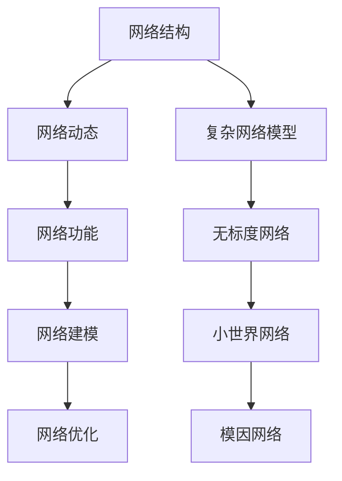

                 

### 1.1. 网络科学的定义与背景

网络科学（Network Science）是一门跨学科的研究领域，它涉及网络结构、动态行为和功能性质的各个方面。其核心在于理解复杂网络系统中的各种现象，如信息传播、能量传输、社交互动等。网络科学不仅关注网络的拓扑结构，还关注网络中的节点和边的属性，以及这些属性如何影响网络的整体行为。

#### 1.1.1 网络科学的历史与发展

网络科学的起源可以追溯到20世纪中期。最初的网络研究主要关注物理学中的交通网络、电路网络等，后来逐渐扩展到社会科学、生物科学等领域。1967年，斯坦福大学的沃尔特·怀特海德（Walter Whitehead）提出了复杂网络的“小世界”效应和“无标度”特征，这为网络科学的发展奠定了基础。20世纪90年代，互联网的兴起和大数据技术的进步，使得网络科学的研究进入了一个新的阶段。

#### 1.1.2 网络科学的主要研究内容

网络科学的研究内容非常广泛，主要包括以下几个方面：

1. **网络结构分析**：研究网络的拓扑结构，如网络的度、聚类系数、路径长度等基本特性。
2. **网络动态行为**：研究网络中的动态过程，如信息传播、传染病传播、能量流动等。
3. **网络功能性质**：研究网络在特定应用场景中的功能，如社会网络分析、生物网络功能分析等。
4. **网络建模与仿真**：利用数学模型和计算机仿真方法，模拟和分析网络行为。
5. **网络优化与控制**：研究如何设计和管理网络，以提高网络的性能和稳定性。

#### 1.1.3 网络科学的重要性

网络科学的重要性体现在以下几个方面：

1. **跨学科整合**：网络科学为不同学科提供了一个统一的框架，促进了物理学、计算机科学、社会学、生物科学等领域的交叉融合。
2. **现实问题解决**：网络科学的方法和技术可以应用于解决各种实际问题，如交通管理、社会网络分析、生物信息学等。
3. **理论创新**：网络科学推动了数学和计算方法的发展，为解决复杂系统问题提供了新的思路和工具。
4. **指导政策制定**：网络科学为政策制定者提供了关于网络结构和动态行为的深刻理解，有助于制定更加科学和有效的政策。

### 1.2. 网络结构的基本概念

#### 1.2.1 网络的基本组成要素

网络由节点（Node）和边（Edge）组成。节点表示网络中的实体，如人、组织、城市等；边表示节点之间的连接关系，如社交关系、交通线路、生物分子作用等。

#### 1.2.2 网络的度、路径和聚类系数

- **度**（Degree）：节点在网络中连接的边的数量。分为入度（In-degree）和出度（Out-degree）。
- **路径**（Path）：网络中两个节点之间的连接序列，路径的长度通常以边数表示。
- **聚类系数**（Clustering Coefficient）：表示网络中节点的邻居之间相互连接的概率。

#### 1.2.3 网络的层次结构

网络可以具有不同的层次结构，如局部层次、全局层次和多层网络。层次结构反映了网络中的不同规模和层次的交互和影响。

### 1.3. 复杂网络模型

#### 1.3.1 无标度网络

无标度网络（Scale-Free Network）是一种特殊的网络模型，其特征是节点度分布呈现出幂律分布，即大多数节点度较低，少数节点度很高。无标度网络具有高度的网络效率和鲁棒性，但也很容易受到小世界效应的影响。

##### 1.3.1.1 无标度网络的定义与特征

无标度网络的定义是指网络中节点的度分布服从幂律分布。其主要特征包括：

- **幂律分布**：节点度分布服从 \( P(k) \propto k^{-\gamma} \)，其中 \( \gamma \) 为幂律指数。
- **高度的网络效率**：短路径长度和高聚类系数使得信息传递快速高效。
- **鲁棒性**：网络具有很高的抗攻击能力。

##### 1.3.1.2 无标度网络的生成模型

常见的无标度网络生成模型包括：

- **Barabási-Albert模型**：通过附加规则生成无标度网络，每次选择一个节点并连接一个新的节点，连接概率与已有节点的度成正比。
- **Erdős-Rényi模型**：生成随机网络，节点的连接概率固定，网络既有无标度特性也有小世界特性。

##### 1.3.1.3 无标度网络的实证研究

无标度网络在现实世界中广泛应用，如：

- **互联网**：网页之间的链接关系形成无标度网络。
- **社交网络**：用户之间的社交关系形成无标度网络。
- **生物网络**：细胞内分子之间的相互作用形成无标度网络。

### 1.3.2 小世界网络

小世界网络（Small-World Network）是一种具有短路径长度和高度聚类系数的网络模型。其特点是节点之间可以通过少量的中间节点快速连接。

##### 1.3.2.1 小世界网络的定义与特征

小世界网络的定义是指网络中的节点通过较少的中间节点就可以相互连接。其主要特征包括：

- **短路径长度**：网络的平均最短路径长度较短，通常是 \( \log(n) \) 的数量级。
- **高聚类系数**：节点邻居之间的连接概率较高。

##### 1.3.2.2 小世界网络的生成模型

常见的生成模型包括：

- **Watts-Strogatz模型**：通过在随机网络中随机重新连接一部分边，生成小世界网络。
- **Girvan-Newman分解**：通过逐步删除网络中的最短路径，生成小世界网络。

##### 1.3.2.3 小世界网络的实证研究

小世界网络在现实世界中广泛应用，如：

- **社交网络**：朋友之间的社交关系形成小世界网络。
- **交通网络**：城市之间的交通线路形成小世界网络。

### 1.3.3 模因网络

模因网络（Meme Network）是一种描述文化传播过程的网络模型。它通过节点和边的交互，模拟信息在不同群体之间的传播和演化。

##### 1.3.3.1 模因网络的定义与特征

模因网络的定义是指网络中的节点表示文化元素（如模因、口号等），边表示文化元素之间的传播关系。其主要特征包括：

- **传播过程**：模因在网络中通过节点的交互进行传播。
- **多样性**：网络中的模因具有多样性和适应性。
- **动态演化**：模因在网络中的传播和演化是一个动态的过程。

##### 1.3.3.2 模因网络的生成模型

常见的生成模型包括：

- **基于规则的模型**：通过定义模因的生成规则和传播机制，生成模因网络。
- **基于概率的模型**：通过计算模因之间的概率关系，生成模因网络。

##### 1.3.3.3 模因网络的实证研究

模因网络在现实世界中广泛应用，如：

- **社交媒体**：用户之间的信息传播形成模因网络。
- **流行文化**：流行文化元素之间的相互影响形成模因网络。

---

**核心概念与联系**

为了更好地理解复杂网络的概念和模型，我们使用Mermaid流程图来展示它们之间的联系。

该流程图展示了网络科学的核心概念和复杂网络模型之间的联系，从网络结构到网络功能，再到网络建模和优化，每个部分都是构建对复杂网络理解的基础。通过这种结构化的方式，我们可以更系统地探讨网络科学的应用和前沿研究。

### 2.1. 社会网络分析

社会网络分析（Social Network Analysis，SNA）是网络科学的一个重要分支，它专注于研究人与人、群体与群体之间社会关系的结构和动态。社会网络分析旨在揭示个体或群体在网络中的地位、角色和影响力，从而为社会科学研究提供新的视角和方法。

#### 2.1.1.1 社会网络分析的定义

社会网络分析是一种通过数学和图论方法研究个体间社会关系的研究方法。它不仅关注个体在网络中的位置和关系，还关注整个网络的宏观结构和功能。通过分析社会网络，研究者可以识别关键节点、理解信息传播机制、评估网络中心性等。

#### 2.1.1.2 社会网络分析的主要指标

社会网络分析中常用的一些指标包括：

1. **节点中心性**：衡量节点在网状结构中的重要性。常见的中心性指标包括：
   - **度中心性**（Degree Centrality）：节点连接的边数越多，其中心性越高。
   - **紧密中心性**（Closeness Centrality）：节点到其他节点的最短路径长度越小，其中心性越高。
   - **中间中心性**（Betweenness Centrality）：节点位于其他节点之间最短路径上的频率越高，其中心性越高。

2. **网络密度**：衡量网络中边的数量与可能的最大边数的比例。网络密度越高，表示网络中的节点关系越紧密。

3. **聚类系数**：衡量节点邻居之间相互连接的概率。聚类系数越高，表示网络的集群效应越明显。

#### 2.1.1.3 社会网络分析的图论基础

社会网络分析基于图论的基本概念，其中图（Graph）由节点（Node）和边（Edge）组成。节点表示个体或组织，边表示个体或组织之间的关系。图论中的各种算法和指标为社会网络分析提供了强大的工具，如：

- **路径搜索算法**：如最短路径算法（Dijkstra算法）、广度优先搜索（BFS）和深度优先搜索（DFS）。
- **社区发现算法**：如基于模块度的社区检测算法、快速解社区结构算法（Louvain算法）等。
- **网络可视化工具**：如Gephi、Cytoscape等，用于将复杂的网络结构可视化为直观的图形。

#### 2.1.2.1 节点中心性分析

节点中心性分析是社会网络分析的核心内容之一。它帮助研究者识别网络中的关键节点，这些节点通常在信息传播、资源分配等方面具有重要地位。

1. **度中心性分析**：度中心性越高，表示节点在网络中的连接数越多，其影响力越大。例如，在社交网络中，度中心性高的用户可能是意见领袖或核心成员。

2. **紧密中心性分析**：紧密中心性反映了节点在网络中的“中心”位置。在网络中，紧密中心性高的节点能够更快地获取信息或影响他人。例如，在通信网络中，紧密中心性高的节点可能是重要的通信枢纽。

3. **中间中心性分析**：中间中心性反映了节点在网络中的桥梁作用。中间中心性高的节点位于其他节点之间的路径上，它们在信息、资源和人员的流动中扮演着关键角色。例如，在供应链网络中，中间中心性高的节点可能是物流枢纽。

#### 2.1.2.2 网络密度分析

网络密度分析是衡量网络紧密程度的重要指标。高密度的网络通常意味着节点之间的联系更加紧密，信息传播速度更快。网络密度可以通过以下公式计算：

\[ D = \frac{E}{N \times (N-1) / 2} \]

其中，\( E \) 是网络中的边数，\( N \) 是节点数。

网络密度分析在实际应用中有许多用途，例如：

- **社会网络分析**：通过分析社交网络中的密度，可以识别紧密社群或集团，有助于理解社交结构。
- **生物网络分析**：在生物信息学中，网络密度可以揭示生物分子之间的相互作用强度。

#### 2.1.2.3 关联规则分析

关联规则分析（Association Rule Learning，ARL）是用于发现数据间关联性的方法，其在社会网络分析中也有广泛应用。关联规则分析的目标是找出数据集中的频繁项集，并通过支持度和置信度来评估规则的重要性。

1. **支持度**：表示在所有事务中，包含项目集X和项目集Y的事务数量占总事务数量的比例。

\[ \text{Support}(X \cup Y) = \frac{|\{t | t \in T, X \cup Y \in t\}|}{|T|} \]

2. **置信度**：表示在包含项目集X的事务中，同时包含项目集Y的事务数量占总事务数量的比例。

\[ \text{Confidence}(X \rightarrow Y) = \frac{|\{t | t \in T, X \in t, X \cup Y \in t\}|}{|\{t | t \in T, X \in t\}|} \]

通过关联规则分析，社会网络分析可以揭示节点之间的关系模式，例如，在社交网络中，可以找出相互关系紧密的用户群体。

#### 2.1.2.4 社会网络分析方法的应用实例

社会网络分析方法在多个领域都有广泛应用，以下是一些应用实例：

- **市场营销**：通过分析消费者之间的社交关系，识别潜在客户群体和意见领袖。
- **公共卫生**：通过分析疾病传播网络，制定更有效的防控策略。
- **网络安全**：通过分析网络攻击路径，识别关键节点和潜在漏洞。
- **组织管理**：通过分析组织内部的社交网络，优化团队结构和沟通方式。

通过这些方法，社会网络分析为理解复杂社会系统和信息传播提供了有力的工具，从而帮助我们更好地应对现实世界中的各种挑战。

### 2.2. 网络可视化技术

网络可视化技术是网络科学中不可或缺的一部分，它通过图形化的方式展示网络的结构、节点和边之间的关系，使得复杂的网络数据变得直观易懂。网络可视化的主要目标包括：

1. **揭示网络结构**：通过图形化展示，直观地呈现网络的拓扑结构，帮助研究者理解网络的宏观特性。
2. **分析节点关系**：通过视觉元素（如节点大小、颜色、边宽等）突出关键节点和重要关系，辅助决策和分析。
3. **探索动态行为**：通过动画或交互式可视化，展示网络的动态过程，如信息传播、能量流动等。

#### 2.2.1.1 网络可视化的定义

网络可视化（Network Visualization）是指利用视觉元素和计算机图形学技术，将网络结构以图形化的方式呈现。它不仅仅是一种数据展示手段，还包含了数据分析和解释的过程。网络可视化的核心在于将抽象的数学模型转换为直观的视觉信息。

#### 2.2.1.2 网络可视化的目标

网络可视化的主要目标包括：

- **直观性**：通过图形化展示，使复杂的网络结构易于理解和解释。
- **交互性**：提供交互功能，使用户可以动态地探索网络结构，发现潜在的模式和关系。
- **分析辅助**：辅助研究者分析网络特性，如节点重要性、关系紧密程度等。

#### 2.2.1.3 网络可视化的方法

网络可视化方法可以分为静态和动态两大类：

1. **静态可视化**：以静态图像的方式展示网络结构，如节点图、力导向图等。
   - **节点图**：节点表示网络中的实体，边表示实体之间的关系。节点图简单直观，适用于展示小型网络。
   - **力导向图**：通过模拟物理力场，自动布局网络节点和边，使其呈现自然排列。力导向图适合展示大型网络，便于观察整体结构和节点分布。

2. **动态可视化**：通过动画或交互式方式展示网络动态过程，如信息传播、节点增长等。
   - **动画**：以动画形式展示网络中节点和边的动态变化，适用于描述网络演变过程。
   - **交互式可视化**：提供用户交互功能，如缩放、过滤、高亮等，使用户可以动态地探索网络。

#### 2.2.2.1 主要网络可视化工具介绍

网络可视化工具为用户提供了强大的图形化展示功能，以下是几种流行的网络可视化工具：

1. **Gephi**
   - **特点**：开源工具，支持多种数据格式，提供丰富的可视化选项，如节点大小、颜色、边宽度等。
   - **应用**：适合中小型网络的复杂结构展示，常用于社会网络分析和生物信息学。

2. **Cytoscape**
   - **特点**：开源生物信息学工具，支持多种插件，提供丰富的网络分析功能。
   - **应用**：适合生物网络、药物发现等领域，支持大规模网络可视化。

3. **PyVis**
   - **特点**：Python库，基于Vis.js框架，易于集成到Python应用中。
   - **应用**：适合小型网络和Web应用，方便快速构建交互式网络图。

4. **D3.js**
   - **特点**：基于JavaScript的库，强大的图形绘制能力，适用于Web应用。
   - **应用**：适合大型网络和复杂的动态可视化，常用于数据可视化和交互式分析。

#### 2.2.2.2 工具选择与使用

选择合适的网络可视化工具取决于具体需求和项目规模：

- **小型网络**：选择Gephi或Cytoscape，便于进行详细分析。
- **Web应用**：选择D3.js或PyVis，易于集成和交互。
- **生物网络**：选择Cytoscape，提供丰富的生物网络分析功能。
- **动态可视化**：选择D3.js，支持复杂的动态展示。

通过这些工具，用户可以轻松实现网络数据的图形化展示，为网络科学研究和数据分析提供有力的支持。

### 2.3. 复杂网络的拓扑分析

复杂网络的拓扑分析是网络科学研究中的一个重要领域，它通过分析网络的拓扑特性来揭示网络的内在规律和结构特征。拓扑分析不仅有助于我们理解网络的宏观行为，还可以为网络优化、疾病传播预测等提供理论基础。

#### 2.3.1.1 拓扑分析的定义

拓扑分析（Topological Analysis）是指利用图论和拓扑学的方法，对网络的结构和特性进行定量和定性分析。拓扑分析关注网络中的节点和边的关系，而不考虑它们的具体物理位置或距离。

#### 2.3.1.2 拓扑分析的主要指标

在复杂网络拓扑分析中，常用的指标包括：

1. **度分布**：表示网络中节点度的统计分布情况。常见的度分布包括幂律分布、对数正态分布等。

2. **聚类系数**：衡量网络中节点的邻居之间相互连接的概率。聚类系数越高，表示网络的集群效应越明显。

3. **路径长度**：表示网络中两个节点之间的最短路径长度。路径长度越短，网络的信息传递效率越高。

4. **平均最短路径长度**：网络中所有节点对之间最短路径长度的平均值。平均最短路径长度是衡量网络连通性的重要指标。

5. **网络直径**：网络中任意两个节点之间最短路径的最大长度。网络直径越小，表示网络越紧密。

6. **网络效率**：网络中信息传递速度的度量，可以通过路径长度和节点度等因素计算得到。

#### 2.3.1.3 拓扑分析的算法

拓扑分析通常涉及以下几种算法：

1. **最短路径算法**：如Dijkstra算法和Bellman-Ford算法，用于计算网络中任意两个节点之间的最短路径。

2. **社区检测算法**：如Girvan-Newman算法和Louvain算法，用于识别网络中的社群结构和模块。

3. **网络聚类算法**：如K-means聚类和层次聚类，用于对网络中的节点进行聚类分析。

4. **网络拓扑特性计算**：如度分布计算、聚类系数计算等，用于定量分析网络的拓扑特性。

#### 2.3.2.1 聚类分析的定义

聚类分析（Clustering Analysis）是指将网络中的节点按照某种相似性度量进行分组，形成若干个互不重叠的子群。聚类分析的目标是使同组内的节点之间具有较高的相似度，而不同组之间的节点相似度较低。

#### 2.3.2.2 聚类分析的主要算法

聚类分析算法分为基于距离的聚类、基于密度的聚类和基于模型的聚类等几类：

1. **基于距离的聚类**：如K-means算法和层次聚类，通过计算节点之间的距离来划分聚类。

2. **基于密度的聚类**：如DBSCAN算法，通过定义邻域密度和核心点来识别聚类。

3. **基于模型的聚类**：如隐马尔可夫模型（HMM）和贝叶斯网络，通过概率模型来预测聚类结构。

#### 2.3.2.3 聚类分析的实际应用

聚类分析在复杂网络中有着广泛的应用，以下是一些实际应用案例：

- **社会网络分析**：通过聚类分析，可以识别社交网络中的紧密社群和关系集团，帮助理解社交结构。
- **生物网络分析**：通过聚类分析，可以揭示生物分子之间的功能模块和组织结构，有助于生物信息学研究。
- **交通网络分析**：通过聚类分析，可以识别交通网络中的关键节点和路径，优化交通流管理。

通过拓扑分析和聚类分析，研究者可以深入理解复杂网络的内在结构，为网络科学研究和应用提供有力的支持。

### 3.1. 社会网络分析在社交网络中的应用

社会网络分析（SNA）在社交网络中的应用已经变得愈发重要，它为理解用户行为、社交关系和信息传播提供了强大的工具。通过社会网络分析，研究者可以揭示社交网络中的关键节点、社群结构和信息传播路径，从而为各种应用场景提供有价值的洞察。

#### 3.1.1 社交网络的拓扑结构分析

社交网络的拓扑结构分析是理解社交网络性质的基础。通过分析社交网络的拓扑特性，研究者可以识别网络中的关键节点和社群结构。

1. **度分布**：社交网络中的节点度分布通常呈现出幂律分布，这意味着大多数用户的社交关系较少，而极少数用户具有大量的社交关系。这种特性使得社交网络具有高度的网络效率和鲁棒性。

2. **聚类系数**：聚类系数反映了节点邻居之间相互连接的概率。高聚类系数表示节点邻居之间联系紧密，这有助于形成紧密的社群。

3. **路径长度**：社交网络中的平均路径长度通常较短，这表明用户之间可以通过少量的中间节点快速连接。这种特性被称为“小世界”效应。

4. **网络直径**：网络直径是衡量网络连通性的重要指标，它表示网络中任意两个节点之间的最短路径长度。在社交网络中，网络直径通常较小，这意味着信息可以在较短的时间内传播到整个网络。

#### 3.1.1.1 社交网络的拓扑特性

社交网络的拓扑特性包括：

- **高度的网络效率**：社交网络中的节点度分布通常呈现出幂律分布，这使得信息传递速度快，网络效率高。
- **鲁棒性**：社交网络具有很高的抗攻击能力，即使去除少量关键节点，网络仍然保持稳定的结构。
- **集群效应**：社交网络中的节点邻居之间连接紧密，这有助于形成紧密的社群。
- **小世界效应**：社交网络的平均路径长度较短，这意味着用户之间可以通过少量的中间节点快速连接。

这些特性使得社交网络成为一个复杂而稳定的系统，为信息传播和社交互动提供了有力的支持。

#### 3.1.1.2 社交网络的节点重要性分析

在社交网络中，节点的重要性可以通过节点中心性指标来衡量。常见的节点中心性指标包括：

1. **度中心性**：度中心性表示节点在网络中的连接数。度中心性高的节点通常具有较大的影响力，它们在信息传播和社交互动中扮演着关键角色。

2. **紧密中心性**：紧密中心性表示节点在网络中的“中心”位置。紧密中心性高的节点能够更快地获取信息或影响他人。

3. **中间中心性**：中间中心性表示节点在网络中的桥梁作用。中间中心性高的节点位于其他节点之间的路径上，它们在信息、资源和人员的流动中扮演着关键角色。

通过节点重要性分析，研究者可以识别社交网络中的关键节点和意见领袖，从而为营销策略、社交网络分析等提供有价值的指导。

#### 3.1.1.3 社交网络中的信息传播

社交网络中的信息传播是一个复杂的过程，它受到网络结构、节点特征和传播机制等多种因素的影响。以下是一些关于社交网络信息传播的重要发现：

1. **信息传播路径**：信息在社交网络中的传播通常遵循一定的路径，如从高中心性节点向低中心性节点传播，或者从节点度高的用户向节点度低的用户传播。

2. **传染模型**：社交网络中的信息传播可以用传染模型来模拟，如SIR模型（易感者-感染者-康复者模型）。通过分析传染模型，可以预测信息传播的速度和范围。

3. **意见领袖效应**：在社交网络中，意见领袖具有较大的影响力，他们的言论和行为往往能够引发广泛的关注和响应。识别意见领袖对于控制信息传播和影响用户行为具有重要意义。

4. **社区效应**：社交网络中的社区结构对信息传播有重要影响。社区内部的信息传播速度快，社区之间的信息传递则较慢。通过分析社区结构，可以优化信息传播策略。

通过研究社交网络中的信息传播，研究者可以更好地理解信息如何在社会中传播，从而为网络营销、公共信息传播等提供科学依据。

#### 3.1.2 社交网络分析的工具与实现

在实际应用中，社交网络分析需要借助各种工具和算法来实现。以下是一些常用的社交网络分析工具和实现方法：

1. **工具选择**：

   - **Gephi**：开源工具，提供丰富的可视化选项和网络分析功能，适合中小型社交网络分析。
   - **Cytoscape**：开源生物信息学工具，支持多种网络分析插件，适用于生物网络和社交网络分析。
   - **PyVis**：Python库，基于Vis.js框架，易于集成到Python应用中，适用于小型社交网络和Web应用。
   - **D3.js**：基于JavaScript的库，强大的图形绘制能力，适用于大型网络和复杂的动态可视化。

2. **实现方法**：

   - **数据采集**：通过API接口或网络爬虫获取社交网络数据，如用户关系、发帖信息等。
   - **数据预处理**：清洗和转换数据，为后续分析做准备。
   - **网络构建**：使用图论算法构建社交网络模型，表示用户和关系。
   - **节点中心性计算**：利用度中心性、紧密中心性和中间中心性等指标计算节点重要性。
   - **社区检测**：使用社区检测算法识别社交网络中的社群结构。
   - **可视化展示**：利用网络可视化工具将分析结果以图形化的方式展示，便于理解和解释。

通过这些工具和实现方法，研究者可以有效地进行社交网络分析，揭示网络中的关键节点、社群结构和信息传播规律。

### 3.2. 网络科学在生物信息学中的应用

网络科学在生物信息学中的应用已经逐渐成为该领域的一个研究热点。通过网络科学的方法和技术，生物信息学家能够更深入地理解生物系统的复杂性和相互作用。本文将介绍网络科学在生物信息学中的应用，包括网络模型、拓扑分析以及网络可视化的具体应用实例。

#### 3.2.1 生物信息学中的网络模型

在生物信息学中，网络模型是描述生物系统中各种实体及其相互关系的重要工具。常见的生物信息学网络模型包括：

1. **蛋白质相互作用网络（Protein-Protein Interaction Network）**：蛋白质相互作用网络描述了细胞内不同蛋白质之间的相互作用关系。通过研究这些相互作用，科学家可以揭示蛋白质功能的复杂性和协调性。

2. **基因共表达网络（Gene Co-expression Network）**：基因共表达网络通过分析基因表达数据，将具有相似表达模式的基因连接起来，形成网络结构。这种网络有助于理解基因功能及其在生物过程中的作用。

3. **代谢网络（Metabolic Network）**：代谢网络描述了生物体内的代谢途径和反应过程。通过分析代谢网络，可以揭示生物体如何利用和调节能量流和物质流。

#### 3.2.2 生物网络的拓扑分析

生物网络的拓扑分析是理解网络结构和功能的重要手段。以下是一些常用的拓扑分析方法和指标：

1. **度分布**：度分布描述了网络中节点度的统计分布情况。在生物网络中，度分布通常呈现出幂律分布，这表明生物网络中的某些节点具有关键作用。

2. **聚类系数**：聚类系数反映了节点邻居之间相互连接的概率。在生物网络中，高聚类系数意味着生物分子之间的相互作用较为紧密，有助于形成功能模块。

3. **平均路径长度**：平均路径长度是网络中任意两个节点之间最短路径的平均值。在生物网络中，平均路径长度较短表明生物分子之间的相互作用较为直接和高效。

4. **网络直径**：网络直径是网络中任意两个节点之间最短路径的最大值。生物网络中的网络直径通常较小，表明生物分子之间的相互作用能够迅速传递。

通过拓扑分析，生物信息学家可以识别网络中的关键节点和模块，从而揭示生物系统的关键功能和调控机制。

#### 3.2.3 生物信息学中的网络可视化

网络可视化是生物信息学中不可或缺的一部分，它通过图形化的方式展示生物网络的复杂结构，帮助研究者理解网络中的相互作用和关系。以下是一些生物信息学中的网络可视化方法：

1. **力导向图**：力导向图通过模拟物理力场，自动布局网络中的节点和边，使其呈现自然排列。这种方法有助于观察网络的整体结构和局部特性。

2. **层次图**：层次图将网络按照层次结构进行组织，通常用于展示复杂的生物网络，如蛋白质相互作用网络。层次图可以清晰地展示不同层次之间的相互作用和关系。

3. **动态图**：动态图通过动画或交互式方式展示网络的动态变化，如基因表达数据的动态变化。这种方法有助于理解生物网络的动态行为和演化过程。

#### 3.2.3.1 生物网络的图可视化

生物网络的图可视化方法主要包括以下几种：

1. **节点表示**：节点表示生物网络中的实体，如蛋白质、基因等。节点的大小、颜色和形状可以用来表示节点的属性，如度、活性、功能等。

2. **边表示**：边表示节点之间的相互作用或关系。边的颜色、宽度和箭头可以用来表示边的类型和强度，如相互作用类型、结合强度等。

3. **布局算法**：布局算法用于调整节点和边的位置，使其在图形上呈现清晰的结构。常见的布局算法包括力导向布局、层次布局、圈图等。

#### 3.2.3.2 生物网络的动画可视化

生物网络的动画可视化通过动态展示网络的演化过程，帮助研究者理解生物网络的动态行为和相互作用。以下是一些生物网络动画可视化方法：

1. **时间序列动画**：时间序列动画通过在不同时间点上展示网络结构的变化，揭示生物网络随时间的演化过程。

2. **交互式动画**：交互式动画允许用户动态地探索网络中的节点和边，例如通过点击、拖动等交互操作来放大或缩小网络的特定区域。

3. **可视化参数调整**：用户可以通过调整动画的参数，如速度、透明度等，来优化动画的视觉效果和可读性。

#### 3.2.3.3 案例分析：蛋白质相互作用网络的可视化

以下是一个蛋白质相互作用网络的案例，展示如何通过网络可视化技术分析生物网络。

1. **数据准备**：获取蛋白质相互作用数据，如从公共数据库中下载。

2. **网络构建**：使用网络建模工具，如Cytoscape，构建蛋白质相互作用网络。通过导入数据，建立节点和边的连接。

3. **网络可视化**：使用力导向布局算法，调整节点和边的位置，使其在图形上呈现清晰的层次结构。

4. **分析结果展示**：通过可视化，识别网络中的关键节点和模块。例如，使用颜色表示不同功能模块，使用节点大小表示节点的度。

5. **动态展示**：通过时间序列动画，展示蛋白质相互作用网络在不同时间点的变化，揭示生物网络的动态特性。

通过这个案例，我们可以看到网络可视化技术在生物信息学中的应用，如何帮助研究者理解和分析复杂的生物网络。

#### 3.2.4 网络科学在生物信息学中的前景

网络科学在生物信息学中的应用前景广阔。随着高通量测序技术、基因编辑技术和大数据技术的发展，生物信息学数据量急剧增加，网络科学的方法和工具为分析这些数据提供了有力的支持。未来，网络科学在生物信息学中可能的发展方向包括：

1. **跨学科整合**：网络科学与计算生物学、系统生物学等领域的融合，推动生物信息学研究的深入发展。
2. **个性化医疗**：通过网络科学方法分析个体化生物数据，为个性化医疗提供科学依据。
3. **生物网络预测**：利用机器学习和深度学习技术，预测生物网络中的未知相互作用，揭示新的生物机制。

通过不断探索和应用网络科学的方法，生物信息学将能够更好地揭示生物系统的复杂性和相互作用，为生命科学研究带来新的突破。

### 3.3. 网络科学在经济学中的应用

网络科学在经济学中的应用日益显著，它为理解经济系统的复杂结构和动态行为提供了新的视角和方法。通过应用网络科学的方法和技术，经济学家能够更好地揭示市场结构、分析金融风险以及优化资源配置。

#### 3.3.1 经济网络的基本概念

经济网络是指由经济主体（如企业、个体、城市等）及其相互作用关系组成的复杂系统。在经济网络中，节点表示经济主体，边表示主体之间的交易、投资、合作等关系。经济网络具有高度的网络效率和鲁棒性，但也存在某些脆弱性和不稳定性。

#### 3.3.1.1 经济网络的定义

经济网络（Economic Network）是一种描述经济系统中各个实体及其相互关系的抽象模型。它通过图论和拓扑学的方法，将经济系统中的各种实体和关系表示为节点和边，形成一个复杂网络结构。

#### 3.3.1.2 经济网络的主要特性

经济网络的主要特性包括：

- **高度的网络效率**：经济网络中的节点可以通过较少的中间节点快速连接，从而实现高效的资源分配和流动。
- **鲁棒性**：经济网络具有较高的抗攻击能力，即使部分节点失效，网络的整体结构仍然保持稳定。
- **多样性**：经济网络中的节点具有不同的功能和角色，这使得网络能够适应不同的经济环境和需求。
- **脆弱性**：某些关键节点的失效可能导致整个网络的崩溃，这表明经济网络存在潜在的脆弱性。

#### 3.3.1.3 经济网络的拓扑分析

经济网络的拓扑分析旨在揭示经济系统的内在结构和特性。以下是一些常用的拓扑分析指标：

1. **度分布**：度分布描述了经济网络中节点的度（即连接数）的统计分布。度分布通常呈现出幂律分布，这意味着网络中存在大量的低度节点和极少数的度较高节点。
2. **聚类系数**：聚类系数反映了经济网络中节点的邻居之间相互连接的概率。高聚类系数表明节点邻居之间联系紧密，这有助于形成功能模块。
3. **平均路径长度**：平均路径长度是经济网络中任意两个节点之间最短路径的平均值。平均路径长度较短意味着经济主体之间的互动和交易较为直接和高效。
4. **网络直径**：网络直径是经济网络中任意两个节点之间最短路径的最大值。网络直径较小表明经济网络具有较高的连通性和灵活性。

通过这些拓扑分析指标，经济学家可以深入了解经济网络的复杂结构和行为特性，从而为政策制定和资源配置提供科学依据。

#### 3.3.2 经济网络的可视化方法

经济网络的可视化是理解经济系统结构和动态行为的重要手段。通过图形化的方式展示经济网络，研究者可以更直观地观察和分析网络中的各种现象。

1. **节点表示**：节点表示经济网络中的实体，如企业、城市等。节点的大小、颜色和形状可以用来表示节点的属性，如节点度、经济规模等。
2. **边表示**：边表示节点之间的相互作用或关系，如交易额、投资额等。边的颜色、宽度和箭头可以用来表示边的类型和强度，如交易类型、合作强度等。
3. **布局算法**：布局算法用于调整节点和边的位置，使其在图形上呈现清晰的层次结构。常见的布局算法包括力导向布局、层次布局等。

#### 3.3.2.1 经济网络的图可视化

经济网络的图可视化方法主要包括以下几种：

1. **静态图可视化**：通过静态图像展示经济网络的拓扑结构，如节点图、力导向图等。这种方法简单直观，适用于展示小型经济网络。
2. **动态图可视化**：通过动画或交互式方式展示经济网络的动态变化，如节点和边的增加或移除、节点属性的变化等。这种方法有助于理解经济网络的演化过程和动态行为。
3. **交互式可视化**：提供用户交互功能，如缩放、过滤、高亮等，使用户可以动态地探索经济网络。这种方法适用于大型经济网络的复杂分析和可视化。

#### 3.3.2.2 经济网络的动画可视化

经济网络的动画可视化通过动态展示网络的演化过程，帮助研究者理解经济系统的动态行为和相互作用。以下是一些经济网络动画可视化方法：

1. **时间序列动画**：通过在不同时间点上展示网络结构的变化，揭示经济网络的动态演化过程。这种方法有助于理解经济系统的周期性波动和长期趋势。
2. **交互式动画**：允许用户动态地探索网络中的节点和边，例如通过点击、拖动等交互操作来放大或缩小网络的特定区域。这种方法有助于深入分析经济网络中的关键节点和关系。
3. **可视化参数调整**：用户可以通过调整动画的参数，如速度、透明度等，来优化动画的视觉效果和可读性。

通过这些可视化方法，研究者可以更直观地理解经济网络的复杂结构和行为特性，从而为政策制定和资源配置提供科学依据。

#### 3.3.3 案例分析：全球金融网络的可视化

以下是一个全球金融网络的案例，展示如何通过网络可视化技术分析经济系统。

1. **数据准备**：获取全球金融网络的数据，包括银行、金融机构之间的交易和投资关系。

2. **网络构建**：使用网络建模工具，如Gephi，构建全球金融网络。通过导入数据，建立节点和边的连接。

3. **网络可视化**：使用力导向布局算法，调整节点和边的位置，使其在图形上呈现清晰的层次结构。使用不同的颜色和形状表示不同的金融机构类型。

4. **分析结果展示**：通过可视化，识别全球金融网络中的关键节点和中心性较高的金融机构。例如，使用节点大小表示节点的度、使用颜色表示金融机构的类型。

5. **动态展示**：通过时间序列动画，展示全球金融网络在不同时间点的变化，揭示金融系统的动态行为和风险传递。

通过这个案例，我们可以看到网络可视化技术在经济学中的应用，如何帮助研究者理解经济系统的复杂结构和动态行为。

#### 3.3.4 网络科学在经济学中的应用前景

网络科学在经济学中的应用前景广阔。随着大数据技术和人工智能的发展，经济网络数据越来越丰富，网络科学的方法和工具为分析这些数据提供了强大的支持。未来，网络科学在经济学中可能的发展方向包括：

1. **个性化经济分析**：通过网络科学方法，分析个体或企业在经济网络中的地位和影响力，为个性化经济分析提供科学依据。
2. **金融风险管理**：利用网络科学方法，识别金融网络中的关键节点和脆弱性，为金融风险管理提供支持。
3. **政策模拟与评估**：通过网络科学模型，模拟不同政策对经济系统的影响，为政策制定和评估提供科学依据。

通过不断探索和应用网络科学的方法，经济学将能够更好地理解经济系统的复杂性和动态行为，为经济发展和社会福祉提供有力支持。

### 4.1. 网络科学在人工智能中的应用

随着网络科学的不断发展，其在人工智能（Artificial Intelligence，AI）领域的应用也日益广泛。网络科学为AI系统提供了新的理论基础和算法框架，特别是在复杂网络建模、数据分析和决策优化等方面，取得了显著的成果。本文将探讨网络科学在人工智能中的应用，包括网络结构与AI的关系、网络科学在AI中的具体应用以及AI对复杂网络分析的推动。

#### 4.1.1 网络结构与AI的关系

网络结构是人工智能系统中一个重要的组成部分。无论是神经网络（Neural Networks）还是图神经网络（Graph Neural Networks，GNNs），网络结构都是其核心架构。以下是网络结构与AI关系的几个关键方面：

1. **神经网络**：传统的神经网络受到生物神经系统的启发，通过模拟神经元之间的连接和相互作用来学习复杂的函数关系。神经网络中的连接关系可以看作是一种简单的网络结构，这种结构对于AI系统处理非线性问题和复杂数据具有重要作用。

2. **图神经网络**：图神经网络是近年来发展迅速的一个领域，其核心思想是将数据表示为图结构，并通过学习图中的节点和边的关系来提取数据特征。图神经网络在处理具有层次结构和复杂关系的数据时具有显著优势，例如在推荐系统、社交网络分析、生物信息学等领域。

3. **网络科学中的网络**：在人工智能领域，网络科学中的网络概念不仅用于建模和模拟数据，还用于分析网络行为和结构特性。通过引入网络科学的观点，AI系统可以更好地理解和利用网络中的信息流动和相互作用，从而提高系统的性能和鲁棒性。

#### 4.1.2 网络科学在AI中的具体应用

网络科学在人工智能中的具体应用涵盖了多个方面，以下是一些重要的应用领域：

1. **社交网络分析**：社交网络分析是网络科学在AI中应用的一个典型领域。通过分析社交网络中的节点和边关系，AI系统可以识别关键用户、预测用户行为、发现社群结构等。例如，在推荐系统中，利用社交网络分析可以更准确地预测用户的兴趣和行为。

2. **推荐系统**：推荐系统是网络科学在AI中应用的另一个重要领域。通过利用网络结构，推荐系统可以更好地理解用户之间的相似性和差异性，从而提供更个性化的推荐。例如，在电商平台上，利用用户之间的社交关系可以推荐相关商品。

3. **生物信息学**：生物信息学是网络科学在AI中应用的另一个重要领域。通过构建和解析生物网络，AI系统可以更好地理解生物系统的功能和机制。例如，在药物发现中，利用生物网络分析可以预测药物的作用靶点和副作用。

4. **交通网络优化**：交通网络优化是网络科学在AI中应用的又一个重要领域。通过分析交通网络的结构和流量数据，AI系统可以优化交通路线、减少拥堵、提高交通效率。例如，在智能交通系统中，利用网络科学方法可以实时调整交通信号，以优化交通流。

#### 4.1.3 AI对复杂网络分析的推动

人工智能技术的发展对复杂网络分析产生了深远影响，主要表现在以下几个方面：

1. **数据处理能力**：随着人工智能技术的发展，AI系统在处理大规模、高维度数据方面表现出色。这使得复杂网络分析可以处理更复杂的网络结构和更丰富的数据，从而提高分析的准确性和效率。

2. **智能算法开发**：人工智能技术的发展推动了复杂网络分析算法的创新。例如，深度学习算法在图像识别、自然语言处理等领域取得了突破性进展，这些算法的原理和技术也可以应用于复杂网络分析，提高分析精度和效率。

3. **自动化分析工具**：人工智能技术为复杂网络分析提供了自动化分析工具。例如，利用机器学习算法可以自动识别网络中的关键节点、预测网络行为，从而节省人工分析的时间和成本。

4. **跨学科融合**：人工智能技术的应用促进了网络科学与其他学科的交叉融合。例如，在社会科学、生物科学、经济学等领域，网络科学和人工智能的融合为解决复杂问题提供了新的方法和思路。

通过上述讨论，我们可以看到，网络科学在人工智能中的应用具有广泛的前景和潜力。未来，随着人工智能技术的不断进步，网络科学在复杂网络分析中的重要性将日益凸显，为各个领域的科学研究和技术发展提供强有力的支持。

### 4.2. 网络科学在可持续发展中的应用

网络科学在可持续发展中的应用正逐渐成为一种强有力的工具，它通过解析复杂系统中的网络结构和动态行为，为解决环境、社会和经济方面的挑战提供了新的视角和方法。本文将探讨网络科学在可持续发展中的价值、应用案例以及未来发展的潜力。

#### 4.2.1 网络科学在可持续发展中的价值

网络科学在可持续发展中的价值主要体现在以下几个方面：

1. **资源优化配置**：通过分析复杂网络结构，可以更有效地分配和利用资源，减少浪费，提高效率。例如，在水资源管理中，利用网络科学方法可以优化水资源的分配，提高用水效率。

2. **生态系统保护**：生态系统网络分析有助于理解和保护生态系统的稳定性。通过识别关键物种和关键连接，可以制定更有效的生态保护策略，预防生态系统的崩溃。

3. **社会福祉提升**：网络科学方法可以用于分析社会网络，识别关键节点和社群结构，从而优化社会资源配置，提升社会福利。例如，在公共卫生领域，网络科学方法可以用于疾病传播的预测和控制。

4. **经济可持续发展**：网络科学在经济发展中的应用，可以帮助识别关键行业和关键企业，优化产业布局，促进经济的可持续发展。例如，在供应链管理中，利用网络科学方法可以优化供应链结构，提高供应链的弹性和稳定性。

#### 4.2.2 网络科学在可持续发展中的应用

网络科学在多个领域的可持续发展中得到了广泛应用，以下是一些具体的案例：

1. **城市交通网络优化**：城市交通网络是一个复杂的网络系统，通过网络科学方法，可以优化交通流量，减少拥堵，提高交通效率。例如，通过分析交通网络中的节点和边关系，可以制定更合理的交通信号控制策略，提高道路通行能力。

2. **能源网络管理**：能源网络是现代社会的生命线，通过网络科学方法，可以优化能源分配，提高能源利用效率。例如，通过分析电力网络的拓扑结构，可以识别关键节点和关键路径，从而优化电网布局，提高电网的稳定性和可靠性。

3. **水资源管理**：水资源是生态环境和人类生活的重要保障，通过网络科学方法，可以优化水资源的分配和利用。例如，通过分析水网系统的网络结构，可以制定更合理的水资源分配方案，提高水资源的利用效率。

4. **生态网络保护**：生态系统是一个复杂的网络系统，通过网络科学方法，可以识别生态网络中的关键物种和关键连接，制定更有效的生态保护策略。例如，在森林生态系统中，通过分析树木之间的相互作用，可以识别关键物种，从而制定更有效的森林保护措施。

5. **公共卫生**：公共卫生领域是一个复杂的网络系统，通过网络科学方法，可以预测和控制疾病的传播。例如，通过分析社交网络中的节点和边关系，可以识别关键传播路径，制定更有效的疾病防控策略。

#### 4.2.3 网络科学在可持续发展中的案例分析

以下是一些具体的网络科学在可持续发展中的应用案例：

1. **城市交通网络优化**：以北京为例，通过网络科学方法分析交通流量数据，识别交通拥堵的关键区域和高峰时段。利用这些分析结果，交通管理部门可以制定更合理的交通信号控制策略，优化交通流量，减少拥堵，提高交通效率。

2. **生态网络保护**：以亚马逊雨林为例，通过网络科学方法分析雨林中动植物之间的相互作用，识别关键物种和关键连接。通过这些分析结果，可以制定更有效的生态保护措施，保护雨林生态系统的稳定性。

3. **能源网络管理**：以德国为例，通过网络科学方法分析电力网络的拓扑结构，识别关键节点和关键路径。通过这些分析结果，可以优化电网布局，提高电网的稳定性和可靠性，减少能源浪费。

4. **水资源管理**：以中国南水北调工程为例，通过网络科学方法分析水网系统的网络结构，优化水资源的分配和利用。通过这些分析结果，可以制定更合理的水资源分配方案，提高水资源的利用效率，缓解北方地区的水资源短缺问题。

#### 4.2.4 网络科学推动可持续发展的潜力

网络科学在可持续发展中的潜力巨大，未来将在多个方面发挥重要作用：

1. **跨学科融合**：随着网络科学与其他学科的交叉融合，将形成更加综合和系统的可持续发展理论体系，为解决复杂问题提供新的方法和思路。

2. **智能决策支持**：通过网络科学方法，可以为政策制定者和决策者提供智能化的决策支持，提高决策的科学性和准确性。

3. **实时监控与预测**：通过网络科学方法，可以实现对可持续发展相关领域的实时监控和预测，及时发现和应对潜在问题。

4. **技术创新**：网络科学的发展将推动相关技术的创新，如大数据分析、人工智能等，为可持续发展提供更强大的技术支撑。

通过上述讨论，我们可以看到，网络科学在可持续发展中具有广泛的应用前景和潜力。未来，随着网络科学技术的不断进步，它将在推动可持续发展的过程中发挥越来越重要的作用。

### 4.3. 网络科学的发展趋势与未来展望

随着网络科学技术的不断进步，其在多个领域的应用已经取得了显著成果。展望未来，网络科学的发展趋势主要集中在以下几个方向：

#### 4.3.1 网络科学的发展趋势

1. **跨学科融合**：网络科学正在与其他领域（如生物学、经济学、社会学等）进行深度融合，形成新的交叉学科和研究方向。这种跨学科的研究将推动网络科学在解决复杂问题方面的应用。

2. **大数据分析**：随着大数据技术的快速发展，网络科学在处理和分析大规模、高维数据方面具有巨大潜力。未来，网络科学将更多地与大数据技术相结合，为数据挖掘和知识发现提供新的工具和方法。

3. **人工智能应用**：人工智能（AI）技术的发展为网络科学提供了强大的计算能力和新的算法框架。未来，AI与网络科学的结合将推动复杂网络分析、智能决策支持等领域的发展。

4. **实时监控与预警**：随着物联网（IoT）和传感器技术的发展，网络科学将在实时监控和预警系统中发挥重要作用。例如，在公共安全、环境保护等领域，利用网络科学方法可以实时监测和预测潜在风险。

5. **社会网络分析**：随着社交媒体和在线社交网络的兴起，社会网络分析成为网络科学的重要研究领域。未来，社会网络分析将深入探讨社会结构、信息传播和社会影响等问题。

#### 4.3.2 网络科学的未来展望

1. **智能网络系统**：未来的网络系统将更加智能化，具备自我组织和自适应能力。例如，智能交通网络、智能电网和智能医疗系统等，将通过网络科学方法实现高效、稳定和安全运行。

2. **网络生态学**：网络生态学是网络科学与生态学交叉的新兴领域，它通过分析生态系统中的网络结构和动态行为，为生态保护和可持续发展提供科学依据。

3. **量子网络科学**：量子技术的发展为网络科学带来了新的机遇。量子网络科学将利用量子计算和量子通信的优势，解决传统网络科学方法难以处理的问题。

4. **可持续发展**：网络科学在可持续发展中的应用前景广阔。未来，网络科学将更多地关注环境、社会和经济系统的复杂关系，为实现可持续发展目标提供科学支持。

5. **跨学科研究**：网络科学将与其他学科（如物理学、数学、计算机科学等）进行更紧密的交叉融合，形成新的理论体系和研究方法，推动科学技术的进步。

通过不断探索和创新，网络科学将在未来的发展中继续发挥重要作用，为人类社会的发展提供新的动力和解决方案。

### 附录A：网络科学常用工具与资源

#### A.1 网络科学工具介绍

网络科学工具是进行复杂网络分析和可视化的重要工具。以下是几种常用的网络科学工具：

1. **NetworkX**
   - **特点**：Python库，用于构建、操作和分析网络。
   - **用途**：适合进行网络建模、算法实现和数据分析。

2. **Gephi**
   - **特点**：开源工具，支持多种数据格式，提供丰富的可视化选项。
   - **用途**：适合中小型网络的复杂结构展示，常用于社会网络分析。

3. **Cytoscape**
   - **特点**：开源生物信息学工具，支持多种插件，提供丰富的网络分析功能。
   - **用途**：适合生物网络、药物发现等领域，支持大规模网络可视化。

4. **PyVis**
   - **特点**：Python库，基于Vis.js框架，易于集成到Python应用中。
   - **用途**：适合小型网络和Web应用，方便快速构建交互式网络图。

5. **D3.js**
   - **特点**：基于JavaScript的库，强大的图形绘制能力，适用于Web应用。
   - **用途**：适合大型网络和复杂的动态可视化，常用于数据可视化和交互式分析。

#### A.2 网络科学资源推荐

1. **学术论文与期刊**
   - **推荐期刊**：《科学》（Science）、《自然》（Nature）、《美国国家科学院学报》（PNAS）、《复杂性科学杂志》（Journal of Complex Systems）等。
   - **学术资源库**：如Google Scholar、PubMed、IEEE Xplore等，提供了丰富的网络科学相关论文和研究报告。

2. **网络科学教材与书籍**
   - **推荐书籍**：《网络科学基础》（Introduction to Network Science）、《复杂网络理论及其应用》、《网络科学：理论与方法》等。
   - **在线课程**：如MIT OpenCourseWare、Coursera上的网络科学相关课程，提供了系统的学习资源和实践机会。

3. **网络科学在线课程与讲座**
   - **推荐平台**：edX、Coursera、Udacity等，提供了由全球顶尖大学和科研机构开设的网络科学在线课程。
   - **著名讲座**：例如斯坦福大学的《网络科学导论》、MIT的《复杂网络理论及其应用》等。

4. **网络科学社群与论坛**
   - **专业论坛**：如ArXiv、Reddit的networkscience社区等，提供了网络科学领域的最新研究成果和讨论。
   - **社交网络**：如Twitter、LinkedIn等，用户可以关注网络科学领域的专家和机构，获取最新的研究动态和职业机会。

通过这些工具和资源，研究者可以更好地进行网络科学的研究和实践，推动网络科学的发展和应用。

---

### 作者信息

**作者：AI天才研究院/AI Genius Institute & 禅与计算机程序设计艺术 /Zen And The Art of Computer Programming**

