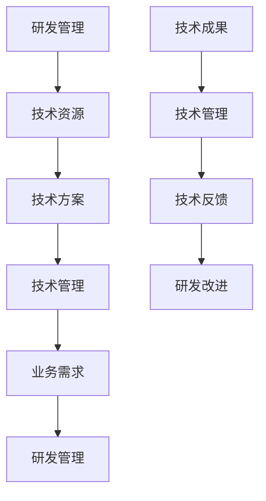

                 

# 研发和技术管理：全面管理公司研发和技术支持工作，负责技术层面的整体运营包括软件研发、项目实施、销售支持及技术管理。主导重大技术项目的决策，指导、审核项目总体技术方案，对各项目进行质量评估

## 文章关键词
研发管理、技术管理、项目管理、软件研发、项目实施、销售支持、技术方案、质量评估

## 摘要
本文深入探讨了研发和技术管理的核心概念、算法原理、项目实战以及开发环境搭建。通过详细的伪代码、数学模型和公式，我们全面解析了研发和技术管理的各个环节。文章结构紧凑，逻辑清晰，旨在为从事IT行业的管理者和开发者提供实用的技术指导和策略建议。

---

## 第一部分：概述

### 1.1 研发和技术管理概述

**研发管理** 是指组织在研发活动中的计划、组织、协调和控制过程，旨在确保研发活动的顺利进行，以及最终产品的质量和效率。研发管理涉及多个方面，包括但不限于资源管理、风险管理、进度控制和质量保证。

**技术管理** 是指对组织技术资产的管理，包括技术战略的制定、技术标准的制定、技术资源的配置和技术创新的推动。技术管理旨在确保技术资源的有效利用，支持组织的战略目标和业务需求。

在企业的运营中，研发和技术管理起着至关重要的作用。它们不仅影响着企业的创新能力，也决定了企业的市场竞争力和可持续发展能力。因此，全面而有效的研发和技术管理是企业成功的关键。

### 1.2 研发和技术管理的相互作用

研发和技术管理之间存在着紧密的相互作用。研发管理依赖于技术管理提供的技术资源和战略指导，而技术管理则依赖于研发管理提供的技术成果和经验反馈。

#### Mermaid 流程图

以下是一个描述研发和技术管理相互作用的 Mermaid 流程图：

- **研发管理**：负责研发活动的计划、组织、协调和控制，确保项目按时、按质完成。
- **技术资源**：提供研发活动所需的技术资源和工具，如硬件、软件和人员。
- **技术方案**：根据业务需求，制定和优化技术解决方案。
- **技术管理**：管理和配置技术资源，制定技术标准，推动技术创新。
- **业务需求**：定义组织的战略目标和市场要求。
- **技术成果**：研发活动产生的技术成果，如软件产品、技术文档和创新成果。
- **技术反馈**：通过技术管理对研发成果进行评估和反馈，以指导研发改进。
- **研发改进**：根据技术反馈，优化研发流程和策略，提高研发效率和质量。

### 1.3 研发和技术管理的挑战与机遇

在当今快速变化的技术环境中，研发和技术管理面临着诸多挑战和机遇。

#### 挑战

1. **技术快速迭代**：技术的快速发展使得研发和技术管理必须不断跟进最新的技术趋势，以保持竞争力。
2. **资源有限**：有限的资源和预算要求研发和技术管理在有限的条件下实现最大的效益。
3. **团队协作**：跨部门、跨区域的团队协作增加了管理的复杂性。
4. **质量保证**：确保研发成果的质量是研发和技术管理的核心任务之一。

#### 机遇

1. **数字化转型**：数字化转型为研发和技术管理带来了新的机会，如云计算、大数据和人工智能等。
2. **市场需求**：不断增长的市场需求为研发和技术管理提供了广阔的空间。
3. **技术开源**：开源技术的发展为研发和技术管理提供了丰富的技术资源和创新空间。

### 1.4 未来趋势

随着技术的不断进步，研发和技术管理将面临以下趋势：

1. **自动化与智能化**：自动化工具和人工智能将提高研发和技术管理的效率和质量。
2. **云计算与边缘计算**：云计算和边缘计算将改变研发和技术管理的基础设施和运营模式。
3. **开放性与协同**：开放源代码和协同研发将促进技术创新和知识共享。
4. **可持续发展**：可持续发展将成为研发和技术管理的重要考虑因素。

---

在第一部分中，我们概述了研发和技术管理的核心概念、相互作用以及面临的挑战与机遇。接下来，我们将深入探讨技术规划与战略、研发流程管理、项目管理、团队管理、项目风险评估与控制、项目质量保证、项目进度监控与控制、项目成本管理、项目资源管理以及案例研究等内容。

### 第二部分：技术规划与战略

#### 2.1 技术规划的基本原则

技术规划是确保企业研发活动与战略目标一致的关键步骤。以下是一些技术规划的基本原则：

1. **与业务战略对接**：技术规划应紧密围绕企业的业务战略展开，确保技术投资与业务需求相匹配。
2. **前瞻性**：技术规划应具有前瞻性，预测未来技术趋势，为企业的长期发展奠定基础。
3. **灵活性**：技术规划应具备一定的灵活性，以适应快速变化的市场和技术环境。
4. **资源优化**：技术规划应充分考虑资源的有效利用，最大化研发投资的回报。
5. **风险管理**：在技术规划过程中，应识别和评估潜在的技术风险，并制定相应的应对策略。

#### 2.2 技术战略的制定

技术战略是企业利用技术资源实现业务目标的重要手段。制定技术战略通常涉及以下步骤：

1. **需求分析**：分析企业的业务需求和市场趋势，确定技术需求。
2. **技术评估**：评估现有技术状况，识别技术差距和潜在的技术创新机会。
3. **目标设定**：根据需求分析和技术评估结果，设定明确的技术战略目标。
4. **资源配置**：制定技术资源分配计划，确保技术战略的实施。
5. **行动计划**：制定详细的技术战略实施计划，包括时间表、任务分配和资源调配。

#### 2.3 技术战略的目标和指标

技术战略的目标和指标是衡量技术战略实施效果的重要依据。以下是一些常见的技术战略目标和指标：

1. **技术创新**：推动技术创新，提高企业的技术竞争力。
2. **成本控制**：通过技术优化，降低研发和生产成本。
3. **时间效率**：提高研发和生产效率，缩短产品上市时间。
4. **市场响应**：快速响应市场变化，满足客户需求。
5. **知识积累**：积累技术知识，提高企业的技术储备。
6. **风险评估**：降低技术风险，确保研发项目的成功。

#### 2.4 技术规划的过程

技术规划的过程通常包括以下几个阶段：

1. **需求分析**：通过市场调研、客户反馈和内部评估，确定企业的技术需求。
2. **技术评估**：评估现有技术和潜在技术，确定技术发展方向。
3. **战略制定**：根据需求分析和技术评估结果，制定技术战略。
4. **资源规划**：根据技术战略，规划技术资源，包括人员、设备和资金。
5. **执行与监控**：执行技术规划，并定期监控技术战略的执行情况。
6. **评估与调整**：对技术规划进行定期评估，根据实际情况进行调整。

#### 2.5 技术规划的工具与方法

技术规划过程中，可以使用多种工具和方法来支持决策。以下是一些常用的工具和方法：

1. **SWOT分析**：通过分析企业的优势、劣势、机会和威胁，制定技术规划。
2. **PEST分析**：分析企业所处的外部环境，包括政治、经济、社会和技术因素。
3. **波特五力模型**：分析企业的市场竞争力，确定技术规划的方向。
4. **关键绩效指标（KPI）**：制定明确的技术绩效指标，衡量技术规划的效果。
5. **项目管理工具**：如JIRA、Trello等，用于规划和跟踪技术规划项目。

---

在第二部分中，我们详细介绍了技术规划的基本原则、技术战略的制定、目标和指标、技术规划的过程以及工具与方法。这些内容为企业的研发和技术管理提供了理论和实践指导。接下来，我们将探讨研发流程管理、项目管理、团队管理等内容。

### 第三部分：研发流程管理

#### 3.1 研发流程管理的原则

研发流程管理是确保研发项目顺利实施和成功的关键。以下是一些研发流程管理的基本原则：

1. **标准化**：制定统一的研发流程和规范，确保项目的规范性和一致性。
2. **灵活性**：研发流程应具有一定的灵活性，以适应不同项目需求和变化。
3. **透明性**：研发流程应保持透明，确保团队成员了解项目的进展和任务分配。
4. **协同性**：研发流程应促进团队协作，确保各个环节的顺畅衔接。
5. **效率**：研发流程应优化，减少不必要的步骤和冗余，提高研发效率。
6. **质量**：研发流程应确保研发成果的质量，符合企业的标准和客户需求。
7. **反馈**：研发流程应建立反馈机制，及时收集和分析项目过程中的问题和经验，用于流程改进。

#### 3.2 研发流程的设计与实施

研发流程的设计与实施是研发流程管理的关键环节。以下是一些关键步骤：

1. **需求分析**：明确项目的研发目标和技术需求，为研发流程设计提供基础。
2. **流程设计**：根据需求分析结果，设计研发流程，确定各个环节的任务和责任。
3. **流程评审**：组织专家和团队成员对研发流程进行评审，确保流程的合理性和可行性。
4. **流程实施**：按照设计好的研发流程，开始项目的实施，确保各个环节按计划进行。
5. **流程监控**：对研发流程进行监控，及时发现和解决问题，确保项目进展顺利。
6. **流程优化**：根据项目实施过程中的反馈，对研发流程进行持续优化，提高效率和效果。

#### 3.3 研发流程的优化

研发流程的优化是提高研发效率和成果质量的重要手段。以下是一些常用的优化方法：

1. **精益研发**：采用精益研发方法，减少浪费，提高资源利用率。
2. **敏捷开发**：采用敏捷开发方法，快速迭代，灵活应对变化。
3. **自动化**：引入自动化工具，减少手动操作，提高开发效率。
4. **持续集成**：采用持续集成方法，确保代码质量和项目进展。
5. **跨部门协作**：加强跨部门协作，提高项目的协同效率。
6. **知识管理**：建立知识管理体系，积累和共享研发经验。

#### 3.4 研发流程管理工具

研发流程管理工具是支持研发流程实施和优化的关键。以下是一些常用的研发流程管理工具：

1. **项目管理工具**：如JIRA、Trello等，用于项目规划、任务分配和进度跟踪。
2. **版本控制工具**：如Git，用于代码管理和协作开发。
3. **缺陷跟踪工具**：如Bugzilla、Jenkins等，用于缺陷跟踪和自动化测试。
4. **文档管理工具**：如Confluence、SharePoint等，用于文档编写和知识共享。
5. **协作工具**：如Slack、Microsoft Teams等，用于团队协作和沟通。

---

在第三部分中，我们详细介绍了研发流程管理的基本原则、设计与实施、优化方法和工具。这些内容为企业的研发活动提供了全面的管理框架和操作指南。接下来，我们将探讨项目管理、团队管理等内容。

### 第四部分：项目管理

#### 4.1 项目管理的定义与原则

项目管理是指通过计划、组织、协调和控制，实现项目目标的系统性和专业化活动。以下是一些项目管理的定义和原则：

1. **项目**：项目是指在一定时间和资源限制内，通过一系列相互关联的活动，达到特定目标的临时性工作。
2. **项目管理**：项目管理是指运用系统的方法和工具，对项目进行全面的规划、执行、监控和收尾，确保项目目标的实现。
3. **项目管理的原则**：
   - **目标导向**：项目管理的核心是明确项目目标，并确保所有活动都围绕目标进行。
   - **系统化**：项目管理是一个系统性的过程，需要整合资源、协调各方、控制进度和成本。
   - **持续改进**：项目管理应不断优化流程和方法，提高项目执行效率和效果。
   - **风险管理**：项目管理应识别和评估潜在风险，并制定应对策略，确保项目顺利进行。
   - **客户满意**：项目管理的最终目标是满足客户需求，确保项目交付的质量和及时性。

#### 4.2 项目计划制定

项目计划制定是项目管理的重要环节。以下是一些项目计划制定的关键步骤：

1. **项目范围定义**：明确项目的目标和范围，确定项目需要完成的工作内容和交付物。
2. **项目任务分解**：将项目范围分解为具体的任务和工作包，确定每个任务的负责人和交付时间。
3. **资源分配**：根据任务和工作包的需求，分配所需的资源，包括人力、物资和设备。
4. **时间规划**：制定项目时间表，确定每个任务的开始和结束时间，以及项目的整体进度。
5. **风险评估**：识别项目潜在的风险，评估风险的可能性和影响，制定应对措施。
6. **成本估算**：根据资源需求和时间规划，估算项目的总成本，并制定预算计划。
7. **项目计划文档**：将上述内容整理成项目计划文档，作为项目执行的指导和依据。

#### 4.3 项目执行与监控

项目执行与监控是确保项目按计划进行的关键环节。以下是一些项目执行与监控的关键步骤：

1. **任务分配**：根据项目计划，将任务分配给团队成员，确保每个任务都有明确的负责人。
2. **进度跟踪**：定期监控项目进度，确保任务按计划完成，及时发现和解决问题。
3. **质量保证**：确保项目交付物符合质量标准和客户需求，进行质量检查和审核。
4. **沟通协调**：加强项目团队内部的沟通和协作，确保信息流畅和任务衔接。
5. **变更控制**：对项目变更进行评估和管理，确保变更不会对项目目标造成负面影响。
6. **风险监控**：定期评估项目风险，确保风险应对措施得到执行，及时调整风险应对策略。
7. **绩效评估**：对项目执行情况进行评估，包括进度、成本、质量和风险控制等方面，为项目管理和改进提供依据。

#### 4.4 项目收尾

项目收尾是项目管理的最后一个阶段，确保项目的顺利结束和成果的交付。以下是一些项目收尾的关键步骤：

1. **项目交付**：将项目交付物交付给客户，确保满足客户需求和项目目标。
2. **验收测试**：进行项目验收测试，确保项目交付物符合质量标准和客户需求。
3. **项目总结**：对项目进行总结，包括经验教训、成功经验和改进建议，为未来的项目管理提供参考。
4. **资源释放**：释放项目资源，包括人力资源、物资和设备，确保资源的有效利用。
5. **文档归档**：将项目相关文档整理归档，包括项目计划、进度报告、质量记录和验收报告等。
6. **绩效评估**：对项目执行情况进行最终评估，包括进度、成本、质量和风险控制等方面，为项目管理和改进提供依据。

---

在第四部分中，我们详细介绍了项目管理的定义与原则、项目计划制定、项目执行与监控、项目收尾等内容。这些内容为企业的项目管理提供了全面的理论和实践指导。接下来，我们将探讨团队管理、项目风险评估与控制、项目质量保证等内容。

### 第五部分：团队管理

#### 5.1 团队管理的定义与原则

团队管理是指对团队进行有效组织和协调，以实现团队目标的过程。以下是一些团队管理的定义和原则：

1. **团队**：团队是指一组相互依赖的成员，共同为实现共同目标而工作。
2. **团队管理**：团队管理是指运用系统的方法和工具，对团队进行有效组织和协调，以实现团队目标的系统性和专业化活动。
3. **团队管理的原则**：
   - **目标导向**：团队管理的核心是明确团队目标，并确保所有活动都围绕目标进行。
   - **协同合作**：团队管理应促进成员之间的协同合作，提高团队的整体效能。
   - **透明沟通**：团队管理应建立透明的沟通机制，确保信息流畅和团队成员之间的理解。
   - **灵活适应**：团队管理应具备灵活性，以适应团队成员的变化和外部环境的变化。
   - **激励与成长**：团队管理应激励团队成员，并提供成长机会，以提高团队的整体素质。
   - **风险管理**：团队管理应识别和评估潜在的风险，并制定应对策略，确保团队目标的实现。

#### 5.2 团队协作与沟通

团队协作与沟通是团队管理的关键环节，以下是一些团队协作与沟通的策略：

1. **明确目标与职责**：确保团队成员明确团队目标和个人职责，以提高工作效率。
2. **建立有效的沟通机制**：通过会议、邮件、即时通讯等工具，建立有效的沟通渠道，确保信息的及时传递和反馈。
3. **促进知识共享**：鼓励团队成员分享知识和经验，促进团队整体技能的提升。
4. **冲突管理**：建立冲突管理机制，及时解决团队内部的冲突，确保团队的稳定和协作。
5. **团队建设活动**：组织团队建设活动，增强团队成员之间的互信和凝聚力。
6. **鼓励创新与反馈**：鼓励团队成员提出创新想法和改进建议，并对团队成员的反馈给予积极回应。

#### 5.3 团队建设与激励

团队建设与激励是提高团队绩效和成员满意度的关键。以下是一些团队建设与激励的方法：

1. **团队文化建设**：建立积极向上的团队文化，增强团队成员的归属感和责任感。
2. **明确激励机制**：制定明确的激励机制，包括物质奖励和精神激励，以激发团队成员的积极性。
3. **职业发展规划**：为团队成员提供职业发展机会和培训，帮助其实现个人成长和职业目标。
4. **绩效评估与反馈**：定期进行绩效评估，给予团队成员及时的反馈，促进团队成员的提升。
5. **团队竞赛与活动**：组织团队竞赛和活动，提高团队成员的竞争意识和团队合作精神。

#### 5.4 团队管理工具

团队管理工具是支持团队管理的重要工具，以下是一些常用的团队管理工具：

1. **项目管理工具**：如JIRA、Trello等，用于项目规划、任务分配和进度跟踪。
2. **协作工具**：如Slack、Microsoft Teams等，用于团队沟通和协作。
3. **文档管理工具**：如Confluence、SharePoint等，用于文档编写和知识共享。
4. **团队协作平台**：如Asana、Notion等，用于团队协作、任务分配和进度跟踪。
5. **协作平台**：如钉钉、企业微信等，用于团队沟通和协作。

---

在第五部分中，我们详细介绍了团队管理的定义与原则、团队协作与沟通、团队建设与激励以及团队管理工具。这些内容为企业的团队管理提供了全面的理论和实践指导。接下来，我们将探讨项目风险评估与控制、项目质量保证等内容。

### 第六部分：项目风险评估与控制

#### 6.1 项目风险评估的方法

项目风险评估是项目管理的重要环节，旨在识别和评估项目中的潜在风险，并制定相应的应对措施。以下是一些项目风险评估的方法：

1. **定性风险评估**：定性风险评估通过评估风险的概率和影响，确定风险的严重程度。常用的定性评估方法包括风险矩阵、专家访谈和风险登记册。
2. **定量风险评估**：定量风险评估通过计算风险的概率和影响，确定风险的数值。常用的定量评估方法包括蒙特卡罗模拟、灵敏度分析和决策树分析。
3. **风险识别**：通过问卷调查、头脑风暴、专家访谈等方法，识别项目中的潜在风险。风险识别的目的是确保所有潜在风险都得到评估和应对。
4. **风险分析**：通过分析风险的起因、影响和可能的后果，确定风险的重要性和优先级。风险分析可以帮助项目团队集中精力应对最严重的风险。
5. **风险应对策略**：根据风险评估结果，制定风险应对策略。常见的风险应对策略包括风险规避、风险转移、风险缓解和风险接受。

#### 6.2 项目风险控制

项目风险控制是确保项目风险在可控范围内的过程。以下是一些项目风险控制的方法：

1. **风险监控**：通过定期检查、进度报告和风险评估，监控项目风险的状态和变化。风险监控的目的是确保风险应对措施得到执行，并及时发现新的风险。
2. **风险管理计划**：制定风险管理计划，明确风险管理的过程、责任和资源。风险管理计划是项目计划的一部分，用于指导项目团队的风险管理工作。
3. **风险响应计划**：根据风险评估结果，制定风险响应计划。风险响应计划包括具体的应对措施、执行时间表和责任人。风险响应计划的目的是减轻或消除风险的影响。
4. **风险记录与报告**：记录项目中的风险、风险评估和风险应对措施，并定期向项目团队和利益相关者报告。风险记录与报告的目的是确保项目团队和利益相关者对项目风险的了解和关注。
5. **风险控制措施**：实施风险控制措施，如风险规避、风险转移、风险缓解和风险接受。风险控制措施的目的是确保项目风险在可控范围内，并最大限度地减少风险的影响。

#### 6.3 风险管理工具

风险管理工具是支持项目风险评估和控制的重要工具。以下是一些常用的风险管理工具：

1. **风险矩阵**：用于评估风险的概率和影响，确定风险的严重程度。
2. **风险评估表格**：用于记录和评估项目中的潜在风险，以及相应的应对措施。
3. **蒙特卡罗模拟**：用于计算风险的数值，评估项目的不确定性和风险概率。
4. **风险管理软件**：如Riskalyze、RiskMight等，用于项目风险评估和控制。
5. **协作工具**：如Slack、Microsoft Teams等，用于团队沟通和协作，提高风险管理效率。

---

在第六部分中，我们详细介绍了项目风险评估的方法、项目风险控制的方法和风险管理工具。这些内容为企业的项目风险评估与控制提供了全面的理论和实践指导。接下来，我们将探讨项目质量保证等内容。

### 第七部分：项目质量保证

#### 7.1 项目质量保证的原则

项目质量保证是指通过一系列的管理活动和措施，确保项目交付物符合预定的质量标准和客户需求。以下是一些项目质量保证的基本原则：

1. **客户导向**：项目质量保证应始终以客户需求为导向，确保项目交付物满足客户的期望和需求。
2. **全过程控制**：项目质量保证应覆盖项目的整个生命周期，从需求分析到项目交付，确保每个环节的质量。
3. **预防为主**：项目质量保证应注重预防措施，通过过程优化和质量控制，减少质量问题的发生。
4. **持续改进**：项目质量保证应持续改进，通过质量反馈和经验积累，不断提高项目质量和效率。
5. **全员参与**：项目质量保证需要全员参与，包括项目经理、开发人员、测试人员和客户等，共同确保项目质量。
6. **科学管理**：项目质量保证应采用科学的管理方法和工具，如质量管理模型、质量测量和统计过程控制等。

#### 7.2 项目质量管理的工具与技术

项目质量保证过程中，可以使用多种工具和技术来提高项目质量。以下是一些常用的工具和技术：

1. **质量管理模型**：如PDCA（计划-执行-检查-行动）循环、DMAIC（定义-测量-分析-改进-控制）方法等，用于指导质量管理和改进。
2. **质量测量**：使用质量测量工具，如质量功能展开（QFD）、质量成本分析等，评估项目质量水平和改进空间。
3. **统计过程控制（SPC）**：通过统计方法，监控和控制项目过程中的质量变化，确保项目稳定和高效。
4. **质量审计**：通过内部或外部审计，评估项目质量管理体系的有效性和符合性。
5. **质量评审**：定期进行质量评审，包括设计评审、代码评审和验收评审等，确保项目交付物的质量。

#### 7.3 项目质量管理的实践案例

以下是一个项目质量管理的实践案例：

**案例背景**：某软件公司开发一款企业资源计划（ERP）系统，项目周期为6个月，涉及多个模块和大量的客户需求。

**质量管理过程**：

1. **需求分析**：与客户进行深入的需求沟通，明确项目目标和质量要求。
2. **质量管理计划**：制定项目质量管理计划，包括质量目标、质量控制措施和质量测量指标。
3. **过程控制**：实施过程控制，包括代码审查、单元测试、集成测试和系统测试等，确保每个开发阶段的质量。
4. **质量评审**：定期进行质量评审，包括设计评审、代码评审和验收评审，确保项目交付物的质量。
5. **质量反馈与改进**：收集项目质量反馈，对质量问题进行分析和改进，确保项目质量的持续提升。

**质量保证措施**：

1. **标准化流程**：制定统一的开发流程和质量控制标准，确保项目的规范性和一致性。
2. **自动化测试**：采用自动化测试工具，提高测试效率和质量，减少人为错误。
3. **持续集成**：采用持续集成方法，确保代码质量，及时发现和解决集成问题。
4. **团队培训**：定期对团队成员进行质量意识和技能培训，提高团队整体质量水平。
5. **客户反馈**：及时收集客户反馈，了解客户需求和质量要求，不断优化和改进项目质量。

通过上述实践案例，我们可以看到项目质量保证在项目成功中的重要作用。有效的项目质量保证能够提高项目的成功率，增强客户满意度，提升企业的市场竞争力。

---

在第七部分中，我们详细介绍了项目质量保证的原则、工具与技术以及实践案例。这些内容为企业的项目质量管理提供了全面的理论和实践指导。接下来，我们将探讨项目进度监控与控制、项目成本管理等内容。

### 第八部分：项目进度监控与控制

#### 8.1 项目进度监控的方法

项目进度监控是确保项目按计划进行的关键环节。以下是一些项目进度监控的方法：

1. **进度报告**：定期编制项目进度报告，包括任务完成情况、时间表、资源使用和项目风险等，确保项目团队能够及时了解项目进展。
2. **进度审查**：定期进行进度审查，评估项目进度是否按计划进行，识别和解决进度偏差。
3. **进度对比**：将实际进度与计划进度进行对比，分析进度偏差的原因，并采取相应的纠正措施。
4. **项目管理工具**：使用项目管理工具，如JIRA、Trello等，跟踪任务进度，实时监控项目状态。
5. **关键路径分析**：分析项目任务中的关键路径，识别可能导致项目延误的关键任务，并采取预防措施。

#### 8.2 项目进度控制的方法

项目进度控制是确保项目按计划完成的关键环节。以下是一些项目进度控制的方法：

1. **变更控制**：对项目变更进行评估和管理，确保变更不会对项目进度和目标造成负面影响。
2. **进度调整**：根据项目实际情况，调整项目进度计划，确保项目能够按计划完成。
3. **优先级调整**：根据项目需求变化和资源限制，调整任务优先级，确保关键任务优先完成。
4. **资源调配**：根据项目进度和资源需求，合理调配人力资源、物资和设备，确保项目进度不受资源限制。
5. **进度跟踪**：定期跟踪项目进度，识别和解决进度问题，确保项目按计划进行。

#### 8.3 项目进度控制的实施

项目进度控制的实施是一个持续的过程，以下是一些关键步骤：

1. **制定进度计划**：根据项目目标和任务需求，制定详细的项目进度计划。
2. **分配任务**：将任务分配给团队成员，明确任务负责人和交付时间。
3. **监控进度**：定期监控项目进度，收集任务完成情况的数据，分析进度偏差。
4. **评估偏差**：分析进度偏差的原因，评估偏差的影响，制定相应的纠正措施。
5. **调整计划**：根据进度偏差和评估结果，调整项目进度计划，确保项目按计划完成。
6. **持续改进**：根据项目进度监控和评估结果，不断优化项目进度控制方法和流程，提高项目进度管理的效率。

#### 8.4 项目进度监控与控制的工具

项目进度监控与控制过程中，可以使用多种工具来支持项目管理。以下是一些常用的项目进度监控与控制工具：

1. **项目管理软件**：如JIRA、Trello、Asana等，用于任务分配、进度跟踪和项目状态监控。
2. **时间跟踪工具**：如Toggl、Harvest等，用于记录和跟踪团队成员的工作时间，评估项目进度。
3. **甘特图工具**：如Microsoft Project、GanttPro等，用于项目计划和进度可视化。
4. **看板工具**：如Kanbanize、KanbanFlow等，用于任务管理、进度跟踪和团队协作。
5. **报表分析工具**：如Tableau、Power BI等，用于项目进度数据分析，提供决策支持。

---

在第八部分中，我们详细介绍了项目进度监控与控制的方法、实施步骤和工具。这些内容为企业的项目进度监控与控制提供了全面的理论和实践指导。接下来，我们将探讨项目成本管理等内容。

### 第九部分：项目成本管理

#### 9.1 项目成本管理的定义与原则

项目成本管理是指在项目生命周期内，对项目成本进行规划、估算、预算和控制的过程。以下是一些项目成本管理的定义和原则：

1. **项目成本管理**：项目成本管理是指确保项目在预算范围内完成的过程，包括成本估算、预算编制、成本控制和成本分析。
2. **成本估算**：成本估算是预测项目成本的过程，通常基于历史数据、专家判断和预算指导。
3. **预算编制**：预算编制是将成本估算转化为具体预算的过程，包括固定成本和变动成本。
4. **成本控制**：成本控制是确保项目实际成本不超过预算的过程，通过监控成本支出、识别和纠正偏差来实现。
5. **成本分析**：成本分析是评估项目成本绩效，识别成本节约机会的过程。

#### 9.2 项目成本控制的方法

项目成本控制是确保项目成本在预算范围内的关键环节。以下是一些项目成本控制的方法：

1. **成本预算分配**：将项目成本预算分配到各个任务和工作包，确保每个任务的成本在预算范围内。
2. **成本支出监控**：定期监控项目成本支出，识别超支和浪费，及时采取措施纠正。
3. **成本绩效分析**：通过比较实际成本和预算成本，分析成本绩效，识别成本控制问题。
4. **变更控制**：对项目变更进行评估和管理，确保变更不会对项目成本造成负面影响。
5. **成本优化**：通过优化资源使用、减少浪费和采用更经济的解决方案，降低项目成本。

#### 9.3 项目成本控制的实施

项目成本控制的实施是一个持续的过程，以下是一些关键步骤：

1. **制定成本预算**：根据项目成本估算，制定详细的项目成本预算，包括固定成本和变动成本。
2. **分配预算**：将项目成本预算分配到各个任务和工作包，明确每个任务的成本限额。
3. **监控成本支出**：定期监控项目成本支出，确保实际成本不超过预算。
4. **分析成本绩效**：通过比较实际成本和预算成本，分析成本绩效，识别成本控制问题。
5. **纠正成本偏差**：对成本偏差进行分析和纠正，确保项目成本在预算范围内。
6. **持续改进**：根据项目成本控制结果，不断优化成本控制方法和流程，提高成本控制效率。

#### 9.4 项目成本管理的工具

项目成本管理过程中，可以使用多种工具来支持成本管理和控制。以下是一些常用的项目成本管理工具：

1. **项目管理软件**：如JIRA、Trello、Asana等，用于任务分配、进度跟踪和成本预算管理。
2. **成本估算工具**：如Estimate、Costimator等，用于成本估算和预算编制。
3. **成本控制工具**：如Project Cost Control、Cost accounting software等，用于成本监控和控制。
4. **财务报表工具**：如Excel、QuickBooks等，用于成本分析和报表编制。
5. **预算分析工具**：如Microsoft Project、GanttPro等，用于预算分配和成本绩效分析。

---

在第九部分中，我们详细介绍了项目成本管理的定义与原则、成本控制方法、实施步骤和工具。这些内容为企业的项目成本管理提供了全面的理论和实践指导。接下来，我们将探讨项目资源管理等内容。

### 第十部分：项目资源管理

#### 10.1 项目资源管理的定义与原则

项目资源管理是指确保项目所需资源在正确的时间、正确的地点和正确的成本下得到有效利用的过程。以下是一些项目资源管理的定义和原则：

1. **项目资源管理**：项目资源管理是指对项目团队、设备和材料等资源进行有效规划和配置，以实现项目目标的过程。
2. **资源**：资源包括人力、设备、材料和资金等，是项目成功的关键因素。
3. **资源管理原则**：
   - **需求匹配**：确保资源需求与资源供给相匹配，避免资源浪费和短缺。
   - **优先级**：根据项目目标和任务优先级，合理分配资源，确保关键任务得到优先支持。
   - **灵活调配**：根据项目进展和需求变化，灵活调配资源，确保资源最大化利用。
   - **成本效益**：在资源分配和使用过程中，考虑成本效益，确保资源投入产生最大效益。
   - **持续改进**：通过经验积累和反馈，不断优化资源管理方法和流程，提高资源利用效率。

#### 10.2 项目资源调配

项目资源调配是指根据项目需求和资源情况，合理分配和调整资源的过程。以下是一些项目资源调配的方法：

1. **资源需求预测**：根据项目计划和任务需求，预测项目各阶段的资源需求，制定资源调配计划。
2. **资源分配**：将预测的资源需求分配给项目团队和相关人员，确保任务顺利完成。
3. **资源调整**：根据项目进展和需求变化，调整资源分配，确保资源最大化利用。
4. **跨部门协作**：协调不同部门之间的资源需求，确保资源调配的顺利实施。
5. **应急储备**：预留一部分资源作为应急储备，应对项目中的不确定性。

#### 10.3 项目资源管理的工具

项目资源管理过程中，可以使用多种工具来支持资源调配和管理。以下是一些常用的项目资源管理工具：

1. **项目管理软件**：如JIRA、Trello、Asana等，用于任务分配、进度跟踪和资源调度。
2. **人力资源管理系统**：如Workday、ADP等，用于员工管理、薪酬和绩效评估。
3. **设备管理系统**：如Infor LN、SAP ERP等，用于设备维护、故障管理和库存管理。
4. **材料管理系统**：如ERP系统、MES系统等，用于材料采购、库存管理和物流管理。
5. **资源调度工具**：如Resource Guru、 Float等，用于资源分配和调度。

#### 10.4 项目资源调配的实践案例

以下是一个项目资源调配的实践案例：

**案例背景**：某公司负责开发一款新的移动应用程序，项目周期为3个月，涉及多个开发人员、设计师和测试人员。

**资源调配过程**：

1. **需求分析**：根据项目计划和任务需求，分析项目各阶段的资源需求，确定资源类型和数量。
2. **资源分配**：将项目资源需求分配给相应的团队成员，确保每个任务都有专人负责。
3. **进度跟踪**：使用项目管理工具监控项目进度，及时调整资源分配，确保关键任务优先完成。
4. **资源调整**：根据项目进展和需求变化，调整资源分配，确保资源最大化利用。
5. **跨部门协作**：协调不同部门之间的资源需求，确保资源调配的顺利实施。

**实践效果**：

1. **资源利用率提高**：通过合理的资源调配，提高了资源的利用率，避免了资源浪费。
2. **任务完成效率提高**：关键任务的优先完成，确保了项目进度的顺利推进。
3. **团队协作增强**：跨部门协作的加强，提高了项目团队的协作效率和凝聚力。

通过以上实践案例，我们可以看到项目资源管理在项目成功中的重要作用。有效的项目资源管理能够提高资源利用率，确保项目进度和质量，提升企业的整体竞争力。

---

在第十部分中，我们详细介绍了项目资源管理的定义与原则、资源调配方法、工具和实践案例。这些内容为企业的项目资源管理提供了全面的理论和实践指导。接下来，我们将探讨案例研究等内容。

### 第十一部分：案例研究

#### 11.1 案例研究一：某企业研发管理实践

**案例背景**：某企业是一家专注于软件开发和高科技产品研发的公司，为了提升研发效率和质量，公司决定引入专业的研发管理方法和技术。

**实施过程**：

1. **需求分析**：公司对现有研发流程进行深入分析，识别存在的问题和改进点。
2. **流程设计**：根据需求分析结果，设计新的研发流程，包括需求管理、设计开发、测试和交付等环节。
3. **流程实施**：将新研发流程实施到项目中，确保每个环节都有明确的规范和标准。
4. **流程监控**：对研发流程进行监控和评估，及时发现问题并进行改进。

**实施效果**：

1. **研发效率提高**：新的研发流程提高了项目进展速度，缩短了产品上市时间。
2. **质量提升**：通过严格的流程控制和质量检查，研发成果的质量显著提升。
3. **团队合作增强**：新的研发流程促进了团队成员之间的协作，增强了团队凝聚力。

#### 11.2 案例研究二：某技术公司项目管理和团队协作

**案例背景**：某技术公司是一家专注于云计算和大数据服务的公司，为了提高项目管理和团队协作效率，公司决定引入先进的项目管理工具和团队协作方法。

**实施过程**：

1. **工具选型**：根据公司需求，选择适合的项目管理工具和团队协作工具，如JIRA、Slack和Confluence。
2. **工具培训**：对团队成员进行工具培训，确保他们能够熟练使用工具进行项目管理和团队协作。
3. **项目管理**：使用项目管理工具规划项目任务、分配资源和监控进度，确保项目按计划进行。
4. **团队协作**：使用团队协作工具进行日常沟通、文档共享和任务协作，提高团队工作效率。

**实施效果**：

1. **项目进度可控**：通过项目管理工具，项目进度和资源分配得到有效控制，避免了项目延期和资源浪费。
2. **团队协作高效**：团队协作工具的使用，提高了团队成员之间的沟通效率和协作效果，减少了信息传递的延迟。
3. **工作效率提升**：项目管理和团队协作方法的改进，显著提高了公司整体工作效率。

#### 11.3 案例研究三：某企业技术规划和战略制定

**案例背景**：某企业是一家专注于物联网和智能设备研发的企业，为了实现技术领先和业务扩张，公司决定制定详细的技术规划和战略。

**实施过程**：

1. **市场调研**：对公司所处市场进行深入调研，了解行业趋势和竞争对手情况。
2. **技术评估**：评估公司现有技术和潜在技术，确定技术发展方向。
3. **战略制定**：根据市场调研和技术评估结果，制定长期和短期技术规划，明确技术目标和实施路径。
4. **资源分配**：根据技术规划，分配技术和资金资源，确保技术规划的实施。

**实施效果**：

1. **技术领先**：通过技术规划和战略制定，公司实现了在物联网和智能设备领域的技术领先，提高了市场竞争力。
2. **业务扩张**：技术规划和战略实施，推动了公司业务的扩张和市场份额的提升。
3. **创新能力提升**：技术规划和战略制定，促进了公司的技术创新和知识积累，提高了公司的核心竞争力。

---

通过以上案例研究，我们可以看到企业在研发管理、项目管理和技术规划等方面的成功实践。这些案例为其他企业提供了宝贵的经验和启示，有助于企业在快速变化的市场中保持竞争优势。

### 第十二部分：结论与展望

在本文中，我们深入探讨了研发和技术管理的核心概念、技术规划与战略、研发流程管理、项目管理、团队管理、项目风险评估与控制、项目质量保证、项目进度监控与控制、项目成本管理、项目资源管理以及案例研究等内容。以下是本文的主要结论和展望：

#### 主要结论

1. **研发和技术管理的重要性**：研发和技术管理是企业创新和竞争力的关键，直接影响企业的可持续发展。
2. **技术规划与战略的制定**：技术规划与战略的制定是确保研发活动与业务战略一致的重要手段。
3. **研发流程管理**：研发流程管理是确保研发项目顺利实施和成功的关键。
4. **项目管理**：项目管理是确保项目目标实现的重要环节，包括项目计划、执行、监控和收尾等。
5. **团队管理**：团队管理是提高团队协作效率和项目成功的关键，包括团队协作、沟通和激励机制等。
6. **项目风险评估与控制**：项目风险评估与控制是确保项目风险在可控范围内的关键环节。
7. **项目质量保证**：项目质量保证是确保项目交付物符合质量和客户需求的重要手段。
8. **项目进度监控与控制**：项目进度监控与控制是确保项目按计划完成的关键环节。
9. **项目成本管理**：项目成本管理是确保项目在预算范围内完成的重要手段。
10. **项目资源管理**：项目资源管理是确保项目所需资源在正确的时间、地点和成本下得到有效利用的关键环节。

#### 展望

1. **自动化与智能化**：随着技术的不断发展，自动化和智能化将在研发和技术管理中发挥更大的作用，提高效率和准确性。
2. **数字化转型**：数字化转型将继续推动企业的创新和发展，为研发和技术管理带来新的机遇和挑战。
3. **持续改进**：持续改进将是企业研发和技术管理的核心目标，通过不断优化流程和方法，提高项目的成功率。
4. **开放性与协同**：开放源代码和协同研发将成为企业技术创新的重要趋势，促进知识共享和合作。
5. **可持续发展**：可持续发展将成为企业研发和技术管理的重要考虑因素，推动企业社会责任的实现。

总之，本文为企业的研发和技术管理提供了全面的理论和实践指导，有助于企业在快速变化的市场环境中保持竞争优势。随着技术的不断进步，企业需要不断适应和创新，以应对未来的挑战和机遇。希望本文能够为从事IT行业的管理者和开发者提供有价值的参考和启示。

### 附录A：常用项目管理工具介绍

#### 附录A.1 JIRA

JIRA 是一款功能强大的项目管理工具，由澳大利亚公司 Atlassian 开发。它支持敏捷开发方法，包括Scrum和Kanban，能够帮助团队进行任务跟踪、进度监控和团队协作。

**功能特点**：

- **任务跟踪**：JIRA 可以创建和管理任务，包括任务描述、优先级、状态和进度。
- **敏捷看板**：JIRA 提供了可视化看板，支持敏捷开发方法，方便团队跟踪任务进度。
- **报告与分析**：JIRA 提供丰富的报告功能，帮助团队了解项目状态和趋势。
- **插件与集成**：JIRA 支持与其他工具的集成，如 Git、Confluence 和 Slack。

**适用场景**：JIRA 适用于软件开发、IT 项目管理、市场营销和客户服务等领域。

#### 附录A.2 Trello

Trello 是一款简洁易用的项目管理工具，基于看板（Kanban）方法，由美国的 Trello Inc. 开发。它通过卡片和看板，帮助团队可视化任务流程和进度。

**功能特点**：

- **看板视图**：Trello 的看板视图清晰直观，支持拖放操作，方便任务管理。
- **任务分配**：Trello 可以将任务分配给团队成员，并设置截止日期和备注。
- **标签和筛选**：Trello 提供标签和筛选功能，帮助团队快速查找和关注关键任务。
- **集成与插件**：Trello 支持与多种第三方工具集成，如 Google Drive、Slack 和 Mailchimp。

**适用场景**：Trello 适用于小型团队、个人项目、创意策划和事件管理等领域。

#### 附录A.3 Asana

Asana 是一款专业的项目管理工具，由 Facebook 前员工开发，旨在帮助团队高效协作和任务管理。它支持多种工作流程，包括项目、任务和协作管理。

**功能特点**：

- **任务管理**：Asana 可以创建和管理任务，包括任务描述、负责人、截止日期和优先级。
- **项目协作**：Asana 支持项目协作，团队成员可以共同完成任务，实时沟通和分享。
- **报表与统计**：Asana 提供丰富的报表功能，帮助团队了解项目状态和进度。
- **集成与扩展**：Asana 支持与多种第三方工具集成，如 Google Drive、Slack 和 Zoom。

**适用场景**：Asana 适用于企业级项目管理、软件开发、市场营销、教育科研等领域。

#### 附录A.4 其他常用工具

除了上述工具，还有一些其他常用的项目管理工具，如：

- **Microsoft Project**：一款功能强大的项目管理工具，适用于大型企业级项目管理。
- **Redmine**：一款开源的项目管理工具，支持多种项目管理方法和流程。
- **Notion**：一款灵活的知识管理和协作工具，适用于团队协作、任务管理和文档整理。
- **Zoho Projects**：一款云端项目管理工具，适用于中小型企业和远程团队。

这些工具各有特色，适用于不同的场景和需求，企业可以根据自身情况选择合适的工具。

### 附录B：常用技术规划工具和方法

#### 附录B.1 SWOT分析

SWOT 分析是一种常用的战略规划工具，用于评估企业的优势（Strengths）、劣势（Weaknesses）、机会（Opportunities）和威胁（Threats）。通过 SWOT 分析，企业可以了解自身的优劣势，识别外部环境的机会和威胁，从而制定合适的技术规划。

**步骤**：

1. **优势分析**：识别企业在技术、资金、人力资源等方面的优势。
2. **劣势分析**：识别企业在技术、资金、人力资源等方面的劣势。
3. **机会分析**：识别外部环境中的机会，如市场趋势、政策支持等。
4. **威胁分析**：识别外部环境中的威胁，如竞争对手、技术变革等。

**适用场景**：SWOT 分析适用于企业战略规划、技术规划、产品规划等领域。

#### 附录B.2 PEST分析

PEST 分析是一种用于分析企业外部环境的工具，包括政治（Political）、经济（Economic）、社会（Social）和技术（Technological）因素。通过 PEST 分析，企业可以了解外部环境的变化和趋势，为技术规划提供依据。

**步骤**：

1. **政治分析**：分析政策变化、政治稳定性等因素。
2. **经济分析**：分析经济增长、通货膨胀、利率等因素。
3. **社会分析**：分析人口结构、消费习惯、文化趋势等因素。
4. **技术分析**：分析技术进步、新技术应用等因素。

**适用场景**：PEST 分析适用于企业战略规划、市场分析、技术规划等领域。

#### 附录B.3 波特五力模型

波特五力模型是一种用于分析行业竞争格局的工具，包括供应商、客户、潜在竞争者、替代品和行业内的竞争者。通过波特五力模型，企业可以了解行业竞争状况，制定合适的技术规划策略。

**步骤**：

1. **供应商分析**：分析供应商的议价能力和供应稳定性。
2. **客户分析**：分析客户的议价能力和需求变化。
3. **潜在竞争者分析**：分析潜在竞争者的进入壁垒和市场策略。
4. **替代品分析**：分析替代品的市场影响和技术发展趋势。
5. **行业竞争者分析**：分析行业内的竞争格局和市场策略。

**适用场景**：波特五力模型适用于企业战略规划、市场竞争分析、技术规划等领域。

#### 附录B.4 其他常用方法

除了上述方法，还有一些其他常用的技术规划工具和方法，如：

- **蓝海战略**：通过创造新市场和需求，避开激烈竞争。
- **精益创业**：通过快速迭代和用户反馈，优化产品和服务。
- **精益生产**：通过减少浪费，提高生产效率和质量。
- **六西格玛**：通过统计分析，优化流程和质量。

这些方法可以根据具体需求和企业实际情况进行选择和运用，为企业技术规划提供有力支持。

