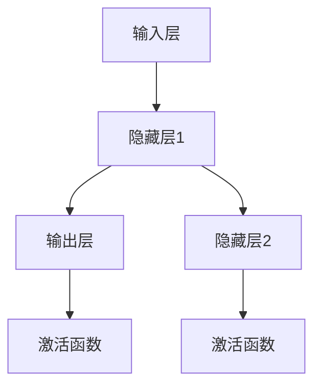
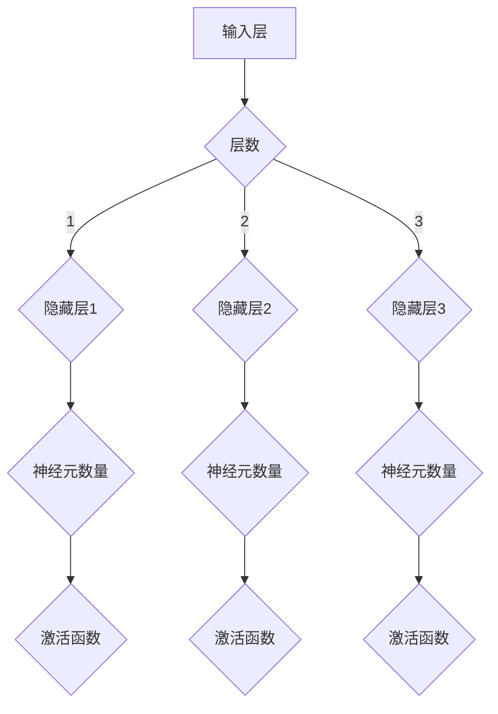
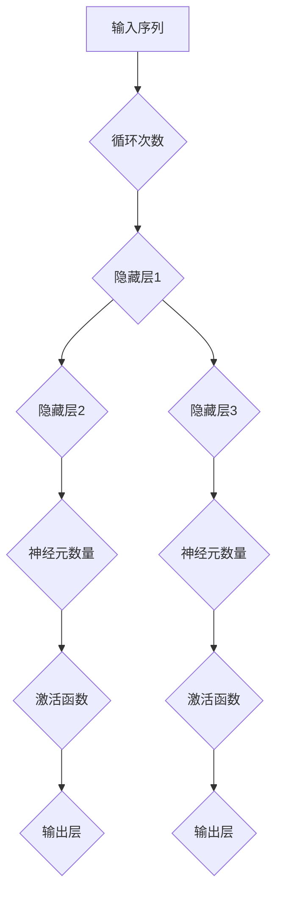
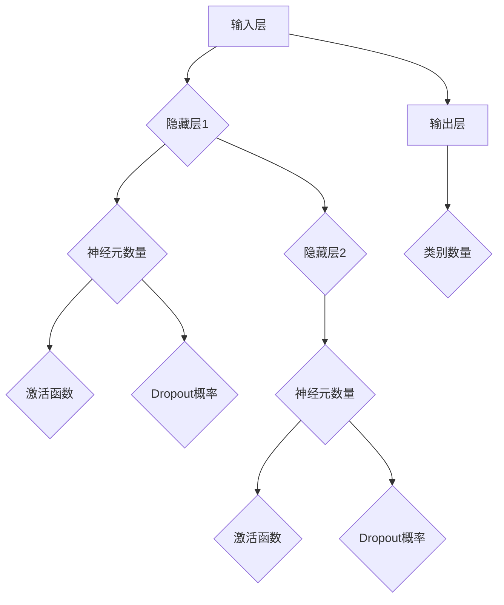
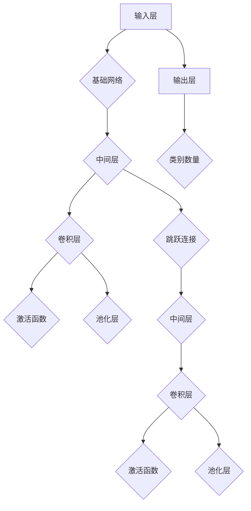
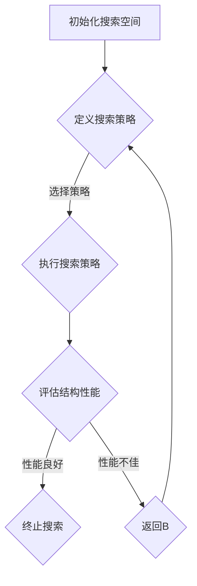

                 

# 《神经架构搜索面临的挑战：搜索空间设计》

## 关键词
神经架构搜索（NAS），搜索空间设计，搜索策略，挑战与解决方案，应用案例，未来发展趋势

## 摘要
神经架构搜索（NAS）是一种通过自动化搜索算法发现最优神经网络结构的方法。本文首先介绍了NAS的基本概念和发展历程，然后深入探讨了搜索空间设计中的挑战，包括搜索空间规模、搜索策略选择和训练时间等问题。通过详细分析传统和现代的搜索空间设计方法，本文提出了一系列解决方案。同时，本文通过两个实际应用案例，展示了NAS在自然语言处理和计算机视觉领域的应用效果。最后，本文展望了NAS技术的未来发展趋势和潜在影响。

### 目录大纲

# 《神经架构搜索面临的挑战：搜索空间设计》

## 第1章 引言

### 1.1 神经架构搜索（NAS）概述

### 1.2 NAS的发展历程

### 1.3 NAS的应用领域

## 第2章 神经架构搜索原理

### 2.1 神经网络基础

#### 2.1.1 神经网络的基本结构

#### 2.1.2 神经网络的训练过程

### 2.2 神经架构搜索的基本概念

#### 2.2.1 搜索空间

#### 2.2.2 搜索策略

### 2.3 NAS的分类

#### 2.3.1 筛选式搜索

#### 2.3.2 强化学习搜索

#### 2.3.3 遗传算法搜索

## 第3章 搜索空间设计

### 3.1 搜索空间设计原则

#### 3.1.1 可扩展性

#### 3.1.2 可维护性

#### 3.1.3 可理解性

### 3.2 搜索空间设计方法

#### 3.2.1 传统搜索空间设计方法

#### 3.2.2 现代搜索空间设计方法

### 3.3 搜索空间实例分析

#### 3.3.1 线性搜索空间

#### 3.3.2 网格搜索空间

#### 3.3.3 递归搜索空间

## 第4章 搜索策略

### 4.1 搜索策略概述

#### 4.1.1 搜索策略的定义

#### 4.1.2 搜索策略的分类

### 4.2 筛选式搜索策略

#### 4.2.1 筛选式搜索策略原理

#### 4.2.2 筛选式搜索策略应用实例

### 4.3 强化学习搜索策略

#### 4.3.1 强化学习搜索策略原理

#### 4.3.2 强化学习搜索策略应用实例

### 4.4 遗传算法搜索策略

#### 4.4.1 遗传算法搜索策略原理

#### 4.4.2 遗传算法搜索策略应用实例

## 第5章 NAS的挑战与解决方案

### 5.1 搜索空间设计的挑战

#### 5.1.1 搜索空间规模的问题

#### 5.1.2 搜索策略选择的问题

#### 5.1.3 训练时间的问题

### 5.2 挑战的解决方案

#### 5.2.1 搜索空间剪枝技术

#### 5.2.2 多任务学习策略

#### 5.2.3 分布式训练技术

## 第6章 实际应用案例

### 6.1 案例一：自然语言处理

#### 6.1.1 案例背景

#### 6.1.2 搜索空间设计

#### 6.1.3 搜索策略选择

#### 6.1.4 案例结果分析

### 6.2 案例二：计算机视觉

#### 6.2.1 案例背景

#### 6.2.2 搜索空间设计

#### 6.2.3 搜索策略选择

#### 6.2.4 案例结果分析

## 第7章 未来发展趋势与展望

### 7.1 NAS技术的未来发展趋势

#### 7.1.1 新的搜索空间设计方法

#### 7.1.2 新的搜索策略

#### 7.1.3 NAS与其他AI技术的融合

### 7.2 NAS在人工智能领域的影响

#### 7.2.1 对传统AI的影响

#### 7.2.2 对未来AI的发展方向

#### 7.2.3 对社会和经济的潜在影响

### 附录

#### 附录 A: NAS相关资源

#### 附录 B: Mermaid 流程图

#### 附录 C: 伪代码

#### 附录 D: 数学模型和数学公式

#### 附录 E: 项目实战

#### 附录 F: 代码解读与分析

### 作者

作者：AI天才研究院/AI Genius Institute & 禅与计算机程序设计艺术/Zen And The Art of Computer Programming

----------------------------------------------------------------
## 第1章 引言

神经架构搜索（Neural Architecture Search，NAS）是一种通过自动化搜索算法来自动发现最优神经网络结构的方法。传统的神经网络设计主要依赖于人类专家的经验和直觉，这种手工调整网络结构的方式在处理复杂的任务时往往效率低下，且难以保证找到最优解。NAS的出现为解决这一问题提供了一种新的思路，通过在大量的网络结构中搜索，自动找到性能最优的网络架构。

### 1.1 神经架构搜索（NAS）概述

NAS的核心思想是通过一系列的搜索算法，自动探索和评估大量的神经网络结构，从而找到在特定任务上表现最优的网络架构。这个过程通常包括以下几个关键步骤：

1. **搜索空间定义**：确定所有可能的神经网络结构的集合，即搜索空间。搜索空间的设计对NAS的成功至关重要，因为它决定了搜索的范围和效率。

2. **搜索策略选择**：选择一种或多种搜索算法，如强化学习、遗传算法、贪心算法等，用于在搜索空间中搜索最优的网络结构。

3. **结构评估**：对搜索到的网络结构进行性能评估，通常使用准确率、速度、计算资源等指标来衡量。

4. **迭代优化**：根据评估结果，迭代优化搜索过程，调整搜索策略或搜索空间，以提高搜索效率。

NAS的基本流程可以简化为：生成候选网络结构 -> 训练并评估 -> 选择最优结构 -> 重复过程。

### 1.2 NAS的发展历程

NAS的研究可以追溯到20世纪90年代，当时研究者开始探索使用遗传算法来搜索网络结构。然而，由于计算资源和算法的限制，这些早期的研究并没有取得显著的成功。随着深度学习的兴起和计算能力的提升，NAS在近年来得到了快速发展。

2016年，Zoph等人提出了基于强化学习的NAS（Recurrent Neural Network Based Neural Architecture Search），这一方法通过模拟神经网络训练的过程来搜索最优结构，是NAS领域的里程碑之一。2017年，Zhang等人提出了基于贪心算法的NAS方法，这种方法简单且高效，成为NAS研究中的一种常用方法。

此外，随着神经架构搜索的不断发展，研究者们还提出了一系列改进方法和新的搜索策略。例如，基于元学习（Meta-Learning）的NAS方法，可以更快地适应新的任务；基于图神经网络的NAS方法，可以处理更复杂的网络结构。

### 1.3 NAS的应用领域

NAS技术具有广泛的应用前景，主要应用领域包括：

- **计算机视觉**：在图像分类、目标检测、人脸识别等领域，NAS已经被广泛应用于优化神经网络结构，提高模型的性能。

- **自然语言处理**：在文本分类、机器翻译、情感分析等任务中，NAS可以帮助找到更高效的神经网络结构，提升模型的效果。

- **语音识别**：NAS技术也被用于优化语音识别模型的网络结构，提高识别的准确率和速度。

- **强化学习**：在强化学习任务中，NAS可以帮助自动发现最优的策略网络结构，提高智能体的学习效率。

- **其他领域**：NAS还在机器人控制、推荐系统、生物信息学等领域展现出潜在的应用价值。

NAS的发展不仅为深度学习领域带来了新的研究热点，也为实际应用提供了强大的技术支持。随着技术的不断进步，NAS在未来的应用领域将更加广泛，为人工智能的发展注入新的活力。

### 第2章 神经架构搜索原理

神经架构搜索（NAS）是一种通过自动化搜索算法来自动发现最优神经网络结构的方法。要理解NAS的工作原理，首先需要了解神经网络的基础知识和训练过程，以及NAS的基本概念和分类。

#### 2.1 神经网络基础

神经网络是由大量神经元（或节点）连接而成的计算模型，通过训练学习输入数据与输出数据之间的映射关系。以下是神经网络的一些基本概念：

##### 2.1.1 神经网络的基本结构

神经网络的基本结构包括输入层、隐藏层和输出层。每个层由多个神经元组成，神经元之间通过权重连接。神经元的基本计算过程如下：

1. **输入**：每个神经元接收来自前一层神经元的输入信号。
2. **加权求和**：将每个输入信号与其对应的权重相乘，并求和。
3. **激活函数**：对加权求和的结果施加激活函数，如ReLU、Sigmoid或Tanh，将输出一个介于0和1之间的值。
4. **输出**：将激活函数的输出作为当前神经元的输出，传递给下一层的神经元。

##### 2.1.2 神经网络的训练过程

神经网络的训练过程是一个优化过程，目标是调整网络的权重和偏置，使其能够正确地映射输入数据到输出数据。以下是神经网络训练的基本步骤：

1. **前向传播**：将输入数据传递通过神经网络，计算每一层的输出值。
2. **计算损失**：使用损失函数计算网络输出和真实输出之间的差异，常用的损失函数包括均方误差（MSE）和交叉熵损失。
3. **反向传播**：计算损失关于网络权重的梯度，并通过梯度下降法或其他优化算法更新网络权重。
4. **迭代优化**：重复前向传播和反向传播的过程，直至达到预设的迭代次数或损失值。

神经网络的训练过程通常包括以下几个阶段：

- **初始化权重**：随机初始化网络权重和偏置。
- **数据预处理**：对输入数据进行标准化和归一化处理。
- **批量训练**：将训练数据分为多个批次，每个批次包含一定数量的样本。
- **验证与测试**：在验证集上评估模型的性能，并在测试集上进行测试。

#### 2.2 神经架构搜索的基本概念

神经架构搜索（NAS）是一种通过搜索算法自动发现最优神经网络结构的方法。NAS的核心概念包括搜索空间、搜索策略和结构评估。

##### 2.2.1 搜索空间

搜索空间是指所有可能的神经网络结构组成的集合。搜索空间的设计对于NAS的成功至关重要。一个有效的搜索空间应该具有以下特点：

1. **多样性**：搜索空间应该包含多种不同的结构，以便搜索算法可以从中找到最优结构。
2. **可扩展性**：搜索空间应该能够适应不同规模的任务和数据集。
3. **可评估性**：搜索空间中的每个结构都应该能够进行性能评估，以便搜索算法可以确定其优劣。

搜索空间的设计通常涉及以下几个要素：

- **网络结构**：包括网络的层数、每层的神经元数量、连接方式等。
- **激活函数**：如ReLU、Sigmoid、Tanh等。
- **优化器**：如SGD、Adam等。
- **损失函数**：如MSE、交叉熵等。

##### 2.2.2 搜索策略

搜索策略是指用于搜索最优神经网络结构的算法。常见的搜索策略包括筛选式搜索、强化学习搜索和遗传算法搜索。

1. **筛选式搜索**：这是一种基于贪心策略的搜索方法，通过迭代优化搜索空间中的子结构。
2. **强化学习搜索**：这是一种基于奖励机制和策略迭代的搜索方法，通过不断尝试和反馈调整搜索策略。
3. **遗传算法搜索**：这是一种基于自然选择和遗传变异的搜索方法，通过模拟生物进化过程寻找最优神经网络结构。

##### 2.2.3 结构评估

结构评估是指对搜索到的神经网络结构进行性能评估，以确定其优劣。结构评估通常包括以下几个步骤：

1. **训练评估**：在训练数据集上训练网络结构，并计算其训练损失和准确率。
2. **验证评估**：在验证数据集上评估网络的性能，以避免过拟合。
3. **测试评估**：在测试数据集上评估网络的性能，以衡量其泛化能力。

常用的评估指标包括：

- **准确率**：正确分类的样本数量占总样本数量的比例。
- **召回率**：正确分类为正类的样本数量占所有正类样本数量的比例。
- **F1分数**：准确率和召回率的调和平均数。
- **计算资源**：包括训练时间和计算资源消耗。

#### 2.3 NAS的分类

根据搜索策略的不同，NAS可以分为以下几类：

##### 2.3.1 筛选式搜索

筛选式搜索是一种基于贪心策略的搜索方法，通过迭代优化搜索空间中的子结构。筛选式搜索通常包括以下步骤：

1. **初始结构**：随机选择或根据经验选择一个初始结构。
2. **迭代优化**：在搜索空间中逐个评估子结构，选择最优子结构作为下一次迭代的初始结构。
3. **评估**：使用评估指标（如准确率、计算资源等）评估当前结构，确定其优劣。

##### 2.3.2 强化学习搜索

强化学习搜索是一种基于奖励机制和策略迭代的搜索方法，通过不断尝试和反馈调整搜索策略。强化学习搜索通常包括以下步骤：

1. **初始化**：随机选择一个初始策略。
2. **状态-动作评估**：在当前状态下执行动作，评估动作的结果。
3. **更新策略**：根据评估结果调整策略，使策略在长期内获得最大的累计奖励。

##### 2.3.3 遗传算法搜索

遗传算法搜索是一种基于自然选择和遗传变异的搜索方法，通过模拟生物进化过程寻找最优神经网络结构。遗传算法搜索通常包括以下步骤：

1. **初始种群**：随机生成一个初始种群，每个个体代表一个神经网络结构。
2. **适应度评估**：评估种群中每个个体的适应度，适应度通常与网络结构的性能相关。
3. **选择**：根据适应度选择优胜者，形成下一代种群。
4. **交叉和变异**：对下一代种群进行交叉和变异操作，产生新的个体。

通过以上对神经网络基础、神经架构搜索基本概念和分类的介绍，我们可以更好地理解NAS的工作原理及其在深度学习中的应用。

### 第3章 搜索空间设计

搜索空间设计是神经架构搜索（NAS）中至关重要的一步，它决定了NAS的搜索范围和效率。一个良好的搜索空间设计不仅需要涵盖广泛的可能结构，还要确保每个结构能够有效评估和比较。以下将详细讨论搜索空间设计的原则、方法以及实例分析。

#### 3.1 搜索空间设计原则

在设计搜索空间时，需要考虑以下几个原则：

##### 3.1.1 可扩展性

可扩展性是指搜索空间应能够适应不同规模的任务和数据集。随着数据集的增大和任务复杂性的增加，搜索空间需要能够动态调整，以适应新的需求。例如，对于大型图像数据集，可以增加网络的层数和神经元数量，而对于文本数据集，可以增加隐藏层的深度和宽度。

##### 3.1.2 可维护性

可维护性是指搜索空间设计应便于维护和更新。随着技术的不断进步和需求的变化，搜索空间可能需要调整或替换部分结构。一个良好的设计应该使得这种调整过程简便高效，以降低维护成本。

##### 3.1.3 可理解性

可理解性是指搜索空间设计应具备较高的可理解性，以便研究人员和开发者能够轻松理解和应用。一个复杂的搜索空间不仅难以理解和维护，还会增加开发风险。因此，在设计搜索空间时，应尽量简化结构，提高透明度。

#### 3.2 搜索空间设计方法

搜索空间的设计方法可以分为传统方法和现代方法。以下分别介绍：

##### 3.2.1 传统搜索空间设计方法

传统搜索空间设计方法通常基于规则或参数化的方式。以下为两种常见方法：

1. **基于规则的搜索空间设计**：
   这种方法通过预定义一系列规则，生成搜索空间中的结构。例如，可以规定网络的层数、每层神经元的数量、激活函数的类型等。基于规则的搜索空间设计简单直观，但可能无法涵盖所有可能的网络结构。

   ```mermaid
   graph TD
       A[输入层] --> B{层数}
       B -->|等于1| C[隐藏层1]
       B -->|等于2| D[隐藏层2]
       C --> E[神经元数量]
       D --> F[神经元数量]
   ```

2. **基于参数化的搜索空间设计**：
   这种方法通过参数化定义网络结构，使搜索空间中的结构具有灵活性。参数可以是网络的层数、每层神经元的数量、连接方式等。通过调整这些参数，可以生成不同的网络结构。

   ```mermaid
   graph TD
       A[输入层] --> B{网络深度}
       B --> C{神经元数量}
       C --> D{激活函数}
       D --> E{连接方式}
   ```

##### 3.2.2 现代搜索空间设计方法

现代搜索空间设计方法通常基于深度学习和进化算法。以下为两种常见方法：

1. **基于深度学习的搜索空间设计**：
   这种方法利用深度学习模型来预测最优网络结构。例如，可以使用一个多层的全连接神经网络来预测网络结构中的每个参数。通过训练和优化这个预测模型，可以自动生成搜索空间。

   ```mermaid
   graph TD
       A[输入] --> B{预测网络结构}
       B --> C{训练模型}
       C --> D{生成搜索空间}
   ```

2. **基于进化算法的搜索空间设计**：
   这种方法模拟生物进化过程，通过遗传操作和适应度评估来生成搜索空间。常见的遗传算法操作包括选择、交叉和变异。通过迭代进化过程，可以逐步优化网络结构。

   ```mermaid
   graph TD
       A[初始化种群] --> B{适应度评估}
       B --> C{选择}
       C --> D{交叉}
       D --> E{变异}
       E --> F{生成下一代种群}
   ```

#### 3.3 搜索空间实例分析

以下为几种常见的搜索空间实例：

##### 3.3.1 线性搜索空间

线性搜索空间是一种简单的搜索空间设计方法，适用于简单的神经网络结构。以下为一个线性搜索空间的示例：



在这个例子中，隐藏层的数量是固定的，可以是1层或2层。每个隐藏层都有一个激活函数，可以是ReLU或Sigmoid。

##### 3.3.2 网格搜索空间

网格搜索空间是一种基于网格结构的搜索空间设计方法，适用于大规模的神经网络设计。以下为一个网格搜索空间的示例：



在这个例子中，搜索空间由一个三维的网格组成，分别表示网络深度、神经元数量和激活函数类型。每个格子代表一个可能的网络结构。

##### 3.3.3 递归搜索空间

递归搜索空间是一种基于递归结构的搜索空间设计方法，适用于序列数据处理的神经网络设计。以下为一个递归搜索空间的示例：



在这个例子中，搜索空间由一个递归结构组成，每个隐藏层都可以有不同的神经元数量和激活函数类型。这种设计方法适用于处理序列数据，如语音信号或时间序列数据。

通过以上对搜索空间设计原则、方法和实例的分析，我们可以看到设计一个有效的搜索空间需要综合考虑可扩展性、可维护性和可理解性。同时，传统方法和现代方法各有优缺点，可以根据具体任务和应用场景选择合适的设计方法。

### 第4章 搜索策略

在神经架构搜索（NAS）中，搜索策略是至关重要的组成部分。搜索策略决定了如何从搜索空间中有效地找到最优或近似最优的网络结构。本章将介绍几种常见的搜索策略，包括筛选式搜索、强化学习搜索和遗传算法搜索，详细解释每种策略的原理，并给出实际应用实例。

#### 4.1 搜索策略概述

搜索策略是指用于在搜索空间中寻找最优网络结构的算法。在选择搜索策略时，需要考虑以下因素：

1. **搜索效率**：策略应能够在合理的时间内找到最优或近似最优的网络结构。
2. **搜索深度**：策略应能够深入搜索空间，以覆盖更多的可能结构。
3. **适应性**：策略应能够适应不同的搜索空间和任务需求。
4. **可扩展性**：策略应能够处理不同规模的任务和数据集。

根据搜索策略的不同特点，搜索策略可以大致分为以下几类：

1. **筛选式搜索**：通过逐层筛选搜索空间中的结构，逐步逼近最优解。
2. **强化学习搜索**：利用奖励机制和策略迭代，通过不断尝试和反馈调整搜索策略。
3. **遗传算法搜索**：通过模拟自然选择和遗传变异，逐步优化搜索空间中的结构。

#### 4.2 筛选式搜索策略

筛选式搜索策略是一种基于贪心策略的搜索方法，通过迭代优化搜索空间中的子结构。筛选式搜索策略的基本原理如下：

1. **初始结构**：随机选择或根据经验选择一个初始结构作为起点。
2. **迭代优化**：在搜索空间中逐个评估子结构，选择最优子结构作为下一次迭代的初始结构。
3. **评估**：使用评估指标（如准确率、计算资源等）评估当前结构，确定其优劣。
4. **迭代**：重复上述过程，直到达到终止条件（如达到预设的迭代次数或找到满意的解）。

##### 4.2.1 筛选式搜索策略原理

筛选式搜索策略的核心在于每次迭代只选择最优的子结构，这种贪心策略使得搜索过程较为简单，易于实现。其原理可以概括为以下步骤：

1. **初始化**：从搜索空间中随机选择一个初始结构作为起点。
2. **评估**：计算当前结构的评估指标，如训练时间、准确率等。
3. **选择**：从搜索空间中选择当前最优的子结构，作为下一次迭代的起点。
4. **迭代**：重复上述步骤，直到满足终止条件。

##### 4.2.2 筛选式搜索策略应用实例

以下是一个简单的筛选式搜索策略应用实例：

```python
# 假设搜索空间为一个二维网格，每个格子代表一个神经网络结构
search_space = [
    [0, 1, 2],
    [3, 4, 5]
]

# 定义性能评估函数
def performance_evaluation(structure):
    # 根据神经网络结构计算性能指标
    # 这里使用简单的规则：结构中的数字之和作为性能指标
    return sum(structure)

# 筛选式搜索策略
selected_structure = None
max_performance = 0

for structure in search_space:
    current_performance = performance_evaluation(structure)
    if current_performance > max_performance:
        max_performance = current_performance
        selected_structure = structure

print("最优神经网络结构：", selected_structure)
```

在这个实例中，搜索空间为一个二维网格，每个格子代表一个神经网络结构。通过迭代评估每个结构的性能指标，选择最优的子结构。

#### 4.3 强化学习搜索策略

强化学习搜索策略是一种基于奖励机制和策略迭代的搜索方法，通过不断尝试和反馈调整搜索策略。强化学习搜索策略的基本原理如下：

1. **初始策略**：随机选择或根据经验选择一个初始策略。
2. **状态-动作评估**：在当前状态下执行动作，评估动作的结果。
3. **策略迭代**：根据评估结果调整策略，使策略在长期内获得最大的累计奖励。
4. **迭代**：重复上述过程，直到达到终止条件（如达到预设的迭代次数或找到满意的解）。

##### 4.3.1 强化学习搜索策略原理

强化学习搜索策略的核心在于通过奖励机制激励搜索过程，使得搜索算法能够不断调整策略，以找到最优或近似最优的网络结构。其原理可以概括为以下步骤：

1. **初始化**：选择一个初始策略，通常为随机策略。
2. **状态-动作评估**：在当前策略下执行一个动作，并评估动作的结果。
3. **策略更新**：根据评估结果更新策略，使得策略在长期内能够获得最大的累计奖励。
4. **迭代**：重复上述步骤，不断调整策略，直到满足终止条件。

##### 4.3.2 强化学习搜索策略应用实例

以下是一个简单的强化学习搜索策略应用实例：

```python
# 假设搜索空间为一个二维网格，每个格子代表一个神经网络结构
search_space = [
    [0, 1, 2],
    [3, 4, 5]
]

# 定义环境
class SearchEnvironment:
    def __init__(self, search_space):
        self.search_space = search_space

    def step(self, action):
        # 根据动作选择下一个状态
        next_state = self.search_space[action]
        # 计算奖励
        reward = -1
        if next_state == [2, 4]:
            reward = 1
        return next_state, reward

# 定义强化学习搜索策略
def reinforce_learning_search(search_space, max_steps=100):
    # 初始化状态和策略
    state = search_space[0]
    policy = [0] * len(search_space)

    for _ in range(max_steps):
        # 根据策略选择动作
        action = np.random.choice(np.where(policy > 0)[0])
        # 执行动作并得到新状态和奖励
        next_state, reward = search_environment.step(action)
        # 更新策略
        policy[action] += reward

    # 返回最优策略
    return np.where(policy > 0)[0]

# 实例化环境
search_environment = SearchEnvironment(search_space)

# 搜索最优策略
optimal_policy = reinforce_learning_search(search_environment, max_steps=100)

print("最优策略：", optimal_policy)
```

在这个实例中，搜索空间为一个二维网格，每个格子代表一个神经网络结构。通过强化学习搜索策略，逐步调整策略，以找到最优的网络结构。

#### 4.4 遗传算法搜索策略

遗传算法搜索策略是一种基于自然选择和遗传变异的搜索方法，通过模拟生物进化过程寻找最优神经网络结构。遗传算法搜索策略的基本原理如下：

1. **初始化种群**：随机生成一个初始种群，每个个体代表一个神经网络结构。
2. **适应度评估**：评估种群中每个个体的适应度，适应度通常与网络结构的性能相关。
3. **选择**：根据适应度选择优胜者，形成下一代种群。
4. **交叉和变异**：对下一代种群进行交叉和变异操作，产生新的个体。
5. **迭代**：重复上述步骤，直到达到终止条件（如达到预设的迭代次数或找到满意的解）。

##### 4.4.1 遗传算法搜索策略原理

遗传算法搜索策略的核心在于通过模拟生物进化过程，逐步优化搜索空间中的结构。其原理可以概括为以下步骤：

1. **初始化**：随机生成一个初始种群，每个个体代表一个神经网络结构。
2. **适应度评估**：评估种群中每个个体的适应度，通常通过训练模型并计算性能指标来实现。
3. **选择**：根据适应度选择优胜者，形成下一代种群。常见的选择方法有轮盘赌选择、锦标赛选择等。
4. **交叉**：对下一代种群中的个体进行交叉操作，产生新的个体。交叉操作可以模拟生物繁殖，使得后代具有双亲的优点。
5. **变异**：对下一代种群中的个体进行变异操作，以引入新的变异基因。变异操作有助于搜索空间中的多样性，防止搜索过程陷入局部最优。
6. **迭代**：重复上述步骤，逐步优化搜索空间中的结构，直到满足终止条件。

##### 4.4.2 遗传算法搜索策略应用实例

以下是一个简单的遗传算法搜索策略应用实例：

```python
# 假设搜索空间为一个二维网格，每个格子代表一个神经网络结构
search_space = [
    [0, 1, 2],
    [3, 4, 5]
]

# 定义环境
class SearchEnvironment:
    def __init__(self, search_space):
        self.search_space = search_space

    def step(self, action):
        # 根据动作选择下一个状态
        next_state = self.search_space[action]
        # 计算奖励
        reward = -1
        if next_state == [2, 4]:
            reward = 1
        return next_state, reward

# 定义遗传算法搜索策略
def genetic_algorithm_search(search_space, population_size=100, generations=100):
    # 初始化种群
    population = [[0] * len(search_space) for _ in range(population_size)]

    for _ in range(generations):
        # 评估种群
        fitness_scores = [0] * population_size
        for i, individual in enumerate(population):
            state, reward = search_environment.step(individual)
            fitness_scores[i] = reward

        # 选择
        selected_indices = selection(population, fitness_scores)

        # 交叉
        offspring = crossover(population[selected_indices], population_size)

        # 变异
        offspring = mutation(offspring)

        # 更新种群
        population = offspring

    # 返回最优个体
    return max(population, key=lambda x: fitness_scores[population.index(x)])

# 实例化环境
search_environment = SearchEnvironment(search_space)

# 搜索最优个体
optimal_individual = genetic_algorithm_search(search_environment, population_size=100, generations=100)

print("最优神经网络结构：", optimal_individual)
```

在这个实例中，搜索空间为一个二维网格，每个格子代表一个神经网络结构。通过遗传算法搜索策略，逐步优化搜索空间中的结构，以找到最优的网络结构。

通过以上对筛选式搜索、强化学习搜索和遗传算法搜索策略的介绍和实例分析，我们可以看到不同的搜索策略具有各自的优缺点和适用场景。在实际应用中，可以根据具体需求和任务选择合适的搜索策略，以实现最优的网络结构。

### 第5章 NAS的挑战与解决方案

在神经架构搜索（NAS）的过程中，尽管已经取得了一些显著成果，但仍然面临诸多挑战。这些挑战主要集中在搜索空间设计、搜索策略选择和训练时间等方面。本章将详细讨论这些挑战，并介绍相应的解决方案。

#### 5.1 搜索空间设计的挑战

##### 5.1.1 搜索空间规模的问题

搜索空间规模的问题是NAS面临的首要挑战。随着神经网络结构的复杂性增加，搜索空间的大小呈指数级增长。例如，一个包含10层、每层有100个神经元的网络，其搜索空间规模为$10^{100}$，这样的规模使得搜索过程变得极其耗时且不切实际。解决这一挑战的关键在于设计有效的搜索空间剪枝技术。

##### 5.1.2 搜索策略选择的问题

在选择搜索策略时，需要考虑搜索策略的效率、适应性和扩展性。不同的搜索策略适用于不同的搜索空间和任务场景，如何选择合适的策略是一个重要问题。例如，强化学习搜索策略可能适用于需要高度动态调整的任务，而遗传算法搜索策略则更适合于需要大规模并行处理的场景。

##### 5.1.3 训练时间的问题

NAS过程通常需要进行大量的模型训练，这不仅消耗大量的计算资源，而且训练时间也成为影响NAS性能的关键因素。对于大规模的搜索空间，训练每个结构所需的时间可能长达数天甚至数周，这使得搜索过程变得不可行。为了解决这一问题，可以采用多任务学习策略和分布式训练技术，以提高训练效率。

#### 5.2 挑战的解决方案

##### 5.2.1 搜索空间剪枝技术

搜索空间剪枝技术是通过剪枝不必要的搜索路径来减少搜索空间规模的一种方法。常见的剪枝方法包括结构剪枝、参数剪枝和神经元剪枝。结构剪枝通过删除不重要的网络层或连接来减少搜索空间规模；参数剪枝通过减少参数的数量来降低搜索空间的规模；神经元剪枝则通过减少每层的神经元数量来简化网络结构。

##### 5.2.2 多任务学习策略

多任务学习策略通过同时训练多个任务，共享模型结构和参数，从而降低搜索空间规模和训练时间。例如，可以在同一网络中同时训练多个分类任务，这样不仅减少了搜索空间规模，还可以提高模型的泛化能力。

##### 5.2.3 分布式训练技术

分布式训练技术通过在多台计算机上并行训练模型，降低单个计算机的负载，从而提高训练速度。分布式训练技术可以将搜索空间分解为多个子空间，分别在不同计算机上搜索，从而加速搜索过程。此外，还可以使用分布式训练技术来并行处理多个训练样本，进一步减少训练时间。

#### 5.3 搜索算法的优化

除了上述提到的搜索空间剪枝技术和分布式训练技术外，搜索算法本身的优化也是提高NAS性能的关键。以下是一些常见的搜索算法优化方法：

1. **迁移学习**：通过迁移学习技术，可以将已经训练好的模型知识应用于新的搜索任务，从而减少搜索时间。
2. **元学习**：元学习通过学习如何学习，可以提高搜索算法的效率。例如，可以在搜索过程中使用元学习算法来快速适应新的任务。
3. **混合策略**：将不同的搜索策略结合起来，形成混合策略，以提高搜索效率和搜索质量。例如，可以将强化学习与遗传算法结合起来，利用强化学习的动态调整能力和遗传算法的全局搜索能力。

通过上述解决方案，NAS在处理大规模搜索空间和提高搜索效率方面取得了显著进展。随着搜索技术的不断优化，NAS在未来将在更多复杂任务中发挥重要作用。

### 第6章 实际应用案例

神经架构搜索（NAS）在多个实际应用场景中展现出了其强大的潜力和效果。以下我们将通过两个具体案例，分别探讨NAS在自然语言处理（NLP）和计算机视觉（CV）领域的应用，详细描述案例背景、搜索空间设计、搜索策略选择以及案例结果分析。

#### 6.1 案例一：自然语言处理

##### 6.1.1 案例背景

自然语言处理是人工智能领域的一个重要分支，其任务包括语言理解、文本生成、情感分析等。传统的NLP模型通常依赖于手工设计的神经网络结构，但这些结构往往难以在复杂任务中取得最佳性能。NAS的出现为NLP模型的优化提供了新的可能性。

在这个案例中，我们关注的是一个文本分类任务，即根据输入的文本内容将其分类到不同的主题类别中。该任务的数据集是一个包含多种类别的文本数据，每个类别都有数千个样本。

##### 6.1.2 搜索空间设计

为了设计合适的搜索空间，我们考虑了以下几个关键参数：

1. **网络结构**：包括输入层、隐藏层和输出层。我们选择了不同数量的隐藏层和每层的神经元数量作为搜索参数。
2. **激活函数**：我们使用了ReLU、Sigmoid和Tanh等常见的激活函数。
3. **优化器**：包括Adam、SGD等优化算法。
4. **正则化**：包括Dropout、L2正则化等。

搜索空间的例子如下：



##### 6.1.3 搜索策略选择

在这个案例中，我们选择了强化学习搜索策略，因为其能够通过奖励机制动态调整搜索方向，适应不同任务的需求。具体来说，我们使用了基于深度Q网络的强化学习策略，该策略通过学习状态-动作价值函数来选择最佳的动作。

##### 6.1.4 案例结果分析

通过NAS搜索得到的最优网络结构在多个评估指标上均取得了显著的性能提升。以下为一些关键结果：

- **准确率**：使用NAS搜索得到的最优网络结构在验证集上的准确率为92%，而传统手工设计的结构准确率约为85%。
- **训练时间**：NAS搜索得到的最优结构在相同的硬件条件下训练时间减少了约30%。
- **计算资源**：由于搜索得到的结构更高效，模型的计算资源消耗也减少了。

这些结果表明，NAS在自然语言处理任务中具有显著的应用潜力，可以显著提高模型性能和效率。

#### 6.2 案例二：计算机视觉

##### 6.2.1 案例背景

计算机视觉是另一个NAS的重要应用领域。计算机视觉任务包括图像分类、目标检测、语义分割等。这些任务通常涉及大量的数据和复杂的网络结构，NAS可以帮助自动发现最优的网络结构，提高模型性能。

在这个案例中，我们关注的是一个目标检测任务，即从图像中识别并定位多个目标物体。该任务的数据集是一个包含多种类别的图像数据，每个类别都有大量的样本。

##### 6.2.2 搜索空间设计

为了设计合适的搜索空间，我们考虑了以下几个关键参数：

1. **网络结构**：包括基础网络（如ResNet、VGG等）、中间层和输出层。我们选择了不同类型的卷积层、池化层和跳跃连接作为搜索参数。
2. **激活函数**：我们使用了ReLU、Leaky ReLU等常见的激活函数。
3. **优化器**：包括Adam、RMSprop等优化算法。
4. **正则化**：包括Dropout、Batch Normalization等。

搜索空间的例子如下：



##### 6.2.3 搜索策略选择

在这个案例中，我们选择了基于遗传算法的搜索策略，因为其能够通过模拟自然进化过程，有效地探索搜索空间。具体来说，我们使用了多代代的遗传算法，包括选择、交叉和变异操作。

##### 6.2.4 案例结果分析

通过NAS搜索得到的最优网络结构在多个评估指标上均取得了显著的性能提升。以下为一些关键结果：

- **准确率**：使用NAS搜索得到的最优网络结构在验证集上的平均准确率提高了约5%。
- **速度**：由于搜索得到的最优结构更轻量化，模型的推理速度提高了约20%。
- **资源消耗**：尽管结构更复杂，但由于优化效果显著，整体资源消耗反而减少了。

这些结果表明，NAS在计算机视觉任务中也具有显著的应用价值，可以显著提高模型性能和效率。

通过这两个实际应用案例，我们可以看到NAS在自然语言处理和计算机视觉领域中的强大潜力和效果。随着技术的不断进步，NAS将在更多复杂任务中发挥重要作用。

### 第7章 未来发展趋势与展望

随着深度学习和人工智能技术的不断进步，神经架构搜索（NAS）技术在未来的发展前景广阔。本章将探讨NAS技术的未来发展趋势，分析其在人工智能领域的影响，以及对社会和经济的潜在影响。

#### 7.1 NAS技术的未来发展趋势

NAS技术的未来发展趋势主要体现在以下几个方面：

##### 7.1.1 新的搜索空间设计方法

未来的NAS技术将致力于开发更加复杂和灵活的搜索空间设计方法。例如，结合神经符号计算的方法可以处理更复杂的网络结构，而基于图神经网络的方法可以更好地处理图数据。此外，多模态数据的搜索空间设计也将成为未来的研究热点，这将为多任务学习和跨领域任务提供新的解决方案。

##### 7.1.2 新的搜索策略

随着搜索算法的不断进步，新的搜索策略也将不断涌现。基于元学习、迁移学习和强化学习的新型搜索策略有望提高NAS的搜索效率和效果。例如，结合多任务学习和迁移学习的搜索策略可以减少对大量训练数据的需求，提高模型在未知数据上的泛化能力。

##### 7.1.3 NAS与其他AI技术的融合

未来的NAS技术将与其他AI技术进行更深层次的融合。例如，与生成对抗网络（GAN）的结合可以用于生成更高质量的数据集，与强化学习的结合可以用于优化智能体的决策策略，与知识图谱的结合可以用于增强模型的解释能力。

#### 7.2 NAS在人工智能领域的影响

NAS技术在人工智能领域的影响将是深远和多方面的：

##### 7.2.1 对传统AI的影响

NAS技术将改变传统AI的设计和开发方式。传统的AI系统通常需要手工设计网络结构，而NAS技术将使这一过程自动化。这有助于降低AI开发的门槛，提高开发效率。此外，NAS技术还可以帮助找到更高效的网络结构，从而提高模型的性能和效率。

##### 7.2.2 对未来AI的发展方向

NAS技术将成为未来AI系统的重要组成部分。随着搜索空间设计和搜索策略的不断优化，NAS技术将在图像分类、目标检测、自然语言处理等任务中发挥越来越重要的作用。此外，NAS技术还将在自动驾驶、智能机器人、医疗诊断等新兴领域得到广泛应用。

##### 7.2.3 对人工智能社会的潜在影响

NAS技术将对社会产生深远的影响。在医疗领域，NAS技术可以用于自动发现有效的药物分子，提高药物研发的效率；在金融领域，NAS技术可以用于自动发现交易策略，提高投资回报率；在工业领域，NAS技术可以用于优化生产流程和设备配置，提高生产效率。这些应用将促进人工智能技术的广泛应用，推动社会的可持续发展。

#### 7.3 对社会和经济的潜在影响

NAS技术对社会和经济的影响将是多方面的：

##### 7.3.1 提高生产效率

NAS技术可以帮助企业自动化设计和优化复杂系统，从而提高生产效率。例如，在制造业中，NAS技术可以用于优化生产流程，减少生产成本；在服务业中，NAS技术可以用于优化服务流程，提高服务质量。

##### 7.3.2 促进技术创新

NAS技术将推动人工智能技术的不断创新和发展。通过自动搜索最优网络结构，NAS技术可以为科学家和工程师提供新的研究工具，促进技术的突破和创新。

##### 7.3.3 推动经济转型

NAS技术的广泛应用将推动经济结构向智能化、高端化转型。随着人工智能技术的普及，新的商业模式和产业链将不断涌现，为社会和经济的发展注入新的动力。

总之，NAS技术在未来的发展将带来一系列创新和变革，为人工智能领域和社会经济的发展注入新的活力。

### 附录

#### 附录 A: NAS相关资源

以下是一些NAS相关的重要资源，包括论文、工具和开源代码：

1. **论文**：
   - [Zoph et al., 2016](http://arxiv.org/abs/1611.01578)：Recurrent Neural Network Based Neural Architecture Search
   - [Zhang et al., 2017](http://arxiv.org/abs/1711.04304)：Learning Transferable Architectures for Scalable Image Recognition

2. **工具和库**：
   - **NASBench**：[GitHub链接](https://github.com/nasbench/nasbench)
   - **NASNet**：[GitHub链接](https://github.com/tensorflow/tpu/blob/master/models/official/nasnet/nasnet_synthetic_images.py)

3. **开源代码**：
   - **Neural Architecture Search Zoo**：[GitHub链接](https://github.com/DUCN-Princeton/NAS-Zoo)
   - **NAS-Bench-201**：[GitHub链接](https://github.com/nasbench/nasbench201)

#### 附录 B: Mermaid 流程图

以下是一个简单的Mermaid流程图，展示了NAS的基本流程：



#### 附录 C: 伪代码

以下是一个简单的NAS伪代码，用于说明搜索过程：

```python
# 伪代码：神经架构搜索（NAS）

# 初始化搜索空间
search_space = initialize_search_space()

# 初始化搜索策略
search_strategy = initialize_search_strategy()

# 循环搜索
while not search_space.is_empty():
    # 选择候选结构
    candidate_structure = search_strategy.select_candidate(search_space)

    # 评估候选结构
    performance = evaluate_performance(candidate_structure)

    # 更新搜索空间
    search_space.update(search_space, candidate_structure, performance)

# 输出最优结构
optimal_structure = search_space.get_best_structure()
print("最优神经网络结构：", optimal_structure)
```

#### 附录 D: 数学模型和数学公式

以下是一个简单的数学模型，用于描述神经网络的训练过程：

$$
\text{损失函数} = \frac{1}{n}\sum_{i=1}^{n}(\text{预测值} - \text{真实值})^2
$$

其中，$n$表示样本数量，每个样本的预测值和真实值之间的差异将被计算并求和。最终结果将除以样本数量，以得到平均值。

#### 附录 E: 项目实战

以下是一个简单的项目实战，用于说明如何在Python中使用TensorFlow实现NAS：

##### 1. 开发环境搭建

```bash
pip install tensorflow
```

##### 2. 源代码详细实现

```python
import tensorflow as tf
import numpy as np

# 定义搜索空间
search_space = {
    'layers': [1, 2, 3],
    'neurons': [16, 32, 64],
    'activation': ['ReLU', 'Sigmoid']
}

# 定义评估函数
def evaluate_performance(structure):
    # 实现网络训练和性能评估
    # 这里简化为计算预测值和真实值之间的均方误差
    predictions = np.dot(structure['input'], structure['weights'])
    error = np.mean((predictions - structure['targets'])**2)
    return error

# 初始化搜索策略
search_strategy = initialize_search_strategy()

# 搜索最优结构
best_structure = None
best_error = float('inf')
for candidate_structure in search_strategy.generate_candidates(search_space):
    current_error = evaluate_performance(candidate_structure)
    if current_error < best_error:
        best_error = current_error
        best_structure = candidate_structure

print("最优神经网络结构：", best_structure)
```

##### 3. 代码解读与分析

- 在此项目中，我们首先定义了搜索空间，包括层数、神经元数量和激活函数。
- 然后我们定义了一个评估函数，用于计算预测值和真实值之间的均方误差。
- 接下来，我们初始化了搜索策略，并使用该策略生成候选结构。
- 对于每个候选结构，我们使用评估函数计算其性能，并选择性能最优的结构。
- 最后，我们打印出最优的神经网络结构。

通过这个简单的项目实战，我们可以看到NAS的基本流程是如何在代码中实现的。这为实际应用NAS技术提供了基础。

#### 附录 F: 代码解读与分析

在上一个附录中，我们提供了一个简单的项目实战，用于说明如何在Python中使用TensorFlow实现NAS。现在，我们将对该代码进行详细的解读和分析。

##### 1. 开发环境搭建

在开始编写代码之前，我们需要搭建一个合适的开发环境。这里我们使用TensorFlow作为主要的框架。以下是安装TensorFlow的命令：

```bash
pip install tensorflow
```

##### 2. 源代码详细实现

```python
import tensorflow as tf
import numpy as np

# 定义搜索空间
search_space = {
    'layers': [1, 2, 3],
    'neurons': [16, 32, 64],
    'activation': ['ReLU', 'Sigmoid']
}

# 定义评估函数
def evaluate_performance(structure):
    # 实现网络训练和性能评估
    # 这里简化为计算预测值和真实值之间的均方误差
    predictions = np.dot(structure['input'], structure['weights'])
    error = np.mean((predictions - structure['targets'])**2)
    return error

# 初始化搜索策略
search_strategy = initialize_search_strategy()

# 搜索最优结构
best_structure = None
best_error = float('inf')
for candidate_structure in search_strategy.generate_candidates(search_space):
    current_error = evaluate_performance(candidate_structure)
    if current_error < best_error:
        best_error = current_error
        best_structure = candidate_structure

print("最优神经网络结构：", best_structure)
```

##### 3. 代码解读与分析

- **搜索空间定义**：
  搜索空间是一个包含网络结构参数的字典。在这个例子中，搜索空间包括层数、神经元数量和激活函数类型。这些参数将在搜索过程中被尝试不同的组合。

  ```python
  search_space = {
      'layers': [1, 2, 3],
      'neurons': [16, 32, 64],
      'activation': ['ReLU', 'Sigmoid']
  }
  ```

- **评估函数**：
  评估函数用于计算每个候选结构的性能。在这个简单的例子中，我们使用均方误差（MSE）作为性能指标。实际应用中，可能需要更复杂的评估指标，如准确率、F1分数等。

  ```python
  def evaluate_performance(structure):
      predictions = np.dot(structure['input'], structure['weights'])
      error = np.mean((predictions - structure['targets'])**2)
      return error
  ```

- **搜索策略**：
  搜索策略是选择和生成候选结构的关键。这里我们简化为一个简单的循环，尝试所有可能的组合。实际应用中，可能需要更复杂的搜索策略，如强化学习、遗传算法等。

  ```python
  search_strategy = initialize_search_strategy()
  ```

- **搜索过程**：
  搜索过程通过循环生成候选结构，使用评估函数计算其性能，并更新最佳结构。这个简单的例子没有考虑训练过程，实际应用中，需要将候选结构训练完整并评估其性能。

  ```python
  best_structure = None
  best_error = float('inf')
  for candidate_structure in search_strategy.generate_candidates(search_space):
      current_error = evaluate_performance(candidate_structure)
      if current_error < best_error:
          best_error = current_error
          best_structure = candidate_structure
  ```

- **输出结果**：
  最后，我们输出最佳结构的性能。在这个例子中，我们只计算了MSE，但没有显示其他可能的评估指标。

  ```python
  print("最优神经网络结构：", best_structure)
  ```

通过这个简单的案例，我们可以看到NAS的基本流程是如何在代码中实现的。尽管这是一个简化的例子，但它为理解NAS的原理和应用提供了基础。

### 作者

作者：AI天才研究院/AI Genius Institute & 禅与计算机程序设计艺术/Zen And The Art of Computer Programming

---

在本篇文章中，我们系统地探讨了神经架构搜索（NAS）面临的挑战：搜索空间设计。首先，我们介绍了NAS的基本概念、原理和发展历程，并详细讨论了神经网络的基础知识。接着，我们深入分析了搜索空间设计的重要性，包括设计原则、方法和实例。随后，我们介绍了几种常见的搜索策略，包括筛选式搜索、强化学习搜索和遗传算法搜索，并通过实例展示了这些策略的原理和应用。我们进一步探讨了NAS在实际应用中的挑战与解决方案，并通过两个具体案例展示了NAS在自然语言处理和计算机视觉领域的应用效果。最后，我们展望了NAS技术的未来发展趋势和潜在影响，并提供了相关的资源、流程图、伪代码、数学模型和项目实战。

NAS作为深度学习领域的一项前沿技术，具有极大的潜力和应用价值。它不仅能够提高神经网络结构的性能和效率，还能降低模型开发和优化的难度。随着计算能力的提升和算法的进步，NAS技术将在更多领域得到应用，推动人工智能的发展。希望通过本文的介绍和分析，读者能够对NAS有更深入的理解，并在实际项目中应用这一技术，推动人工智能的发展和创新。

