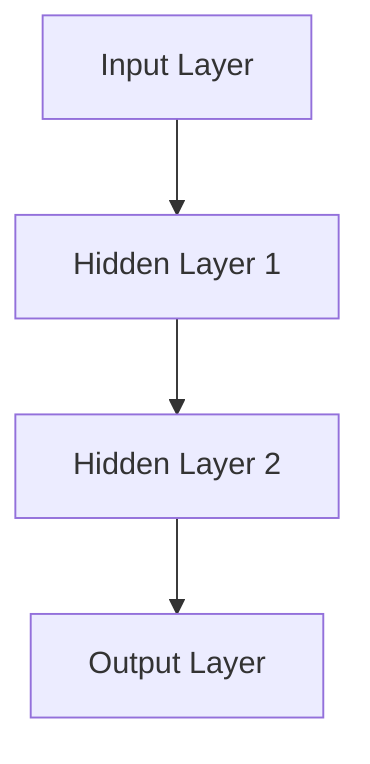
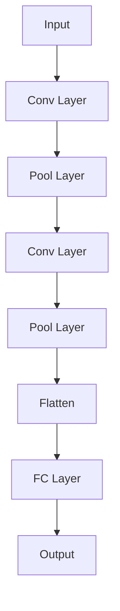
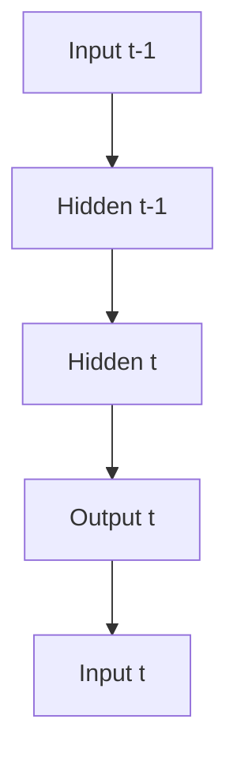

                 

### 《神经网络模型的可解释性技术》

关键词：神经网络、模型可解释性、全局解释、局部解释、LIME、SHAP、医疗应用、金融行业

摘要：
随着深度学习在各个领域的广泛应用，神经网络模型成为数据处理和预测任务的核心工具。然而，这些复杂模型的“黑箱”特性使得其决策过程变得难以解释，这对于需要透明度和可信任度的应用场景（如医疗和金融）来说是一个重大挑战。本文将探讨神经网络模型可解释性的重要性，介绍全局和局部可解释性技术，并通过实际案例展示这些技术在工业应用中的效果。文章分为七个部分，首先介绍神经网络的基础知识，然后深入探讨模型可解释性的重要性及其与透明性的区别，接着详细介绍全局和局部可解释性技术，最后通过案例分析展示这些技术的实际应用，并展望未来可解释性技术的研究方向。

### 目录

#### 第一部分：神经网络模型基础
- **第1章：神经网络基础**
  - **1.1 神经网络简介**
    - 神经网络的发展历程
    - 神经网络的核心概念
  - **1.2 神经网络架构**
    - 神经元的连接方式
    - 前馈神经网络、卷积神经网络、递归神经网络
  - **1.3 激活函数**
    - 激活函数的作用
    - 常见的激活函数

- **第2章：神经网络学习算法**
  - **2.1 前向传播和反向传播算法**
    - 前向传播算法
    - 反向传播算法
  - **2.2 梯度下降算法**
    - 梯度下降原理
    - 学习率调整策略
  - **2.3 随机梯度下降和批量梯度下降**
    - 随机梯度下降
    - 批量梯度下降

#### 第二部分：神经网络模型的可解释性技术
- **第3章：模型可解释性的重要性**
  - **3.1 可解释性定义与意义**
    - 可解释性的定义
    - 可解释性的重要性
  - **3.2 可解释性与透明性的区别**
    - 可解释性与透明性的关系
    - 不同情境下的可解释性需求

- **第4章：全局可解释性技术**
  - **4.1 特征重要性分析**
    - 特征重要性评估方法
    - 实践应用案例
  - **4.2 模型敏感性分析**
    - 敏感性分析的定义
    - 敏感性分析的实现
  - **4.3 模型解释图展示**
    - 解释图的绘制方法
    - 解释图的应用场景

- **第5章：局部可解释性技术**
  - **5.1 LIME算法**
    - LIME算法原理
    - LIME算法的实践
  - **5.2 SHAP算法**
    - SHAP算法原理
    - SHAP算法的实践
  - **5.3 局部解释性可视化**
    - 局部解释性可视化的工具与方法

- **第6章：实际案例分析**
  - **6.1 案例一：金融行业应用**
    - 模型可解释性在实际案例中的应用
    - 案例分析结果
  - **6.2 案例二：医疗行业应用**
    - 模型可解释性在医疗领域的应用
    - 案例分析结果

- **第7章：未来发展趋势**
  - **7.1 可解释性技术的挑战与机遇**
    - 挑战：计算效率、模型复杂度、解释结果的准确性
    - 机遇：技术的发展、行业需求的推动
  - **7.2 未来研究方向**
    - 自动化解释系统的开发
    - 多模型融合的可解释性研究
    - 可解释性与隐私保护相结合的研究

#### 附录
- **附录A：相关工具与资源**
  - **A.1 可解释性工具介绍**
    - LIME、SHAP等工具的使用方法
  - **A.2 学习资源推荐**
    - 网络课程、书籍推荐

### 第1章：神经网络基础

神经网络（Neural Networks）是模拟人脑神经元工作方式的计算模型，广泛应用于机器学习和人工智能领域。本章将介绍神经网络的基础知识，包括其发展历程、核心概念、架构以及激活函数。

#### 1.1 神经网络简介

##### 1.1.1 神经网络的发展历程

神经网络的概念最早由心理学家McCulloch和数学家Pitts在1943年提出。他们设计了一种简单的计算单元，称为“McCulloch-Pitts神经元”。这个模型虽然简单，但奠定了神经网络的理论基础。

20世纪50年代到70年代，神经网络的研究进展缓慢，主要原因是对其理论基础的认识不充分。直到1986年，Rumelhart、Hinton和Williams等人提出了反向传播算法（Backpropagation Algorithm），这一突破使得训练深层神经网络成为可能，从而开启了深度学习的时代。

进入21世纪，随着计算能力的提升和大数据的广泛应用，深度学习在图像识别、自然语言处理、语音识别等领域取得了显著成果，神经网络的应用范围不断扩大。

##### 1.1.2 神经网络的核心概念

- **神经元（Neuron）**：神经网络的基本计算单元，类似于生物神经元。每个神经元接收多个输入，通过加权求和处理后，产生一个输出。

- **输入层（Input Layer）**：接收外部输入数据，并将其传递给隐藏层。

- **隐藏层（Hidden Layer）**：神经网络的核心部分，负责处理输入数据并进行复杂的变换。一个神经网络可以包含一个或多个隐藏层。

- **输出层（Output Layer）**：将隐藏层处理后的数据转化为最终输出结果。

- **权重（Weights）**：连接神经元的参数，用于调节输入信号的强度。

- **偏置（Bias）**：每个神经元的偏置项，用于调整神经元的阈值。

#### 1.2 神经网络架构

神经网络根据其架构和功能可以分为不同的类型，以下介绍几种常见的神经网络架构。

##### 1.2.1 前馈神经网络

前馈神经网络（Feedforward Neural Network）是最基本和最常用的神经网络类型。它由输入层、一个或多个隐藏层和输出层组成。信息从输入层经过隐藏层传递到输出层，不形成循环。

**Mermaid 流程图：**



##### 1.2.2 卷积神经网络

卷积神经网络（Convolutional Neural Network, CNN）专门用于处理图像数据。它通过卷积操作提取图像的特征，并利用池化操作减少数据维度。

**Mermaid 流程图：**



##### 1.2.3 递归神经网络

递归神经网络（Recurrent Neural Network, RNN）适合处理序列数据。它通过在时间步之间传递隐藏状态，实现了对序列数据的记忆能力。

**Mermaid 流程图：**



#### 1.3 激活函数

激活函数（Activation Function）是神经网络中不可或缺的一部分，用于引入非线性特性。以下介绍几种常见的激活函数。

##### 1.3.1 Sigmoid函数

Sigmoid函数是最简单的激活函数之一，定义为：

$$ f(x) = \frac{1}{1 + e^{-x}} $$

Sigmoid函数的输出范围在0和1之间，常用于二分类问题。

##### 1.3.2 Tanh函数

Tanh函数是Sigmoid函数的扩展，定义为：

$$ f(x) = \frac{e^{x} - e^{-x}}{e^{x} + e^{-x}} $$

Tanh函数的输出范围在-1和1之间，具有更好的对称性。

##### 1.3.3 ReLU函数

ReLU函数（Rectified Linear Unit）是最常用的激活函数之一，定义为：

$$ f(x) = \max(0, x) $$

ReLU函数在正输入时输出自身，负输入时输出0，具有简单的计算结构和良好的训练效果。

### 第2章：神经网络学习算法

神经网络的学习过程是通过调整网络中的权重和偏置来最小化损失函数。本章将介绍神经网络学习算法，包括前向传播和反向传播算法、梯度下降算法以及随机梯度下降和批量梯度下降。

#### 2.1 前向传播和反向传播算法

神经网络的学习过程分为两个阶段：前向传播（Forward Propagation）和反向传播（Backpropagation）。

##### 2.1.1 前向传播算法

前向传播算法用于计算神经网络在给定输入时的输出。具体步骤如下：

1. **初始化参数**：设定初始的权重和偏置。
2. **前向传播**：从输入层开始，将输入数据传递到每一层，计算每一层的输出。
3. **激活函数**：对每一层的输出应用激活函数。
4. **计算损失**：计算输出层与真实标签之间的差异，得到损失值。

前向传播算法的伪代码如下：

```python
for each layer l in network:
    layer_output[l] = activation_function(sum(weights[l-1] * input[l-1] + bias[l]))
    output = layer_output[L-1]
loss = calculate_loss(output, target)
```

##### 2.1.2 反向传播算法

反向传播算法用于计算网络参数的梯度，并更新网络参数以最小化损失函数。具体步骤如下：

1. **计算损失梯度**：从输出层开始，计算损失函数对每一层的输出和参数的梯度。
2. **反向传播梯度**：将梯度从输出层反向传播到输入层。
3. **更新参数**：使用梯度更新网络参数。

反向传播算法的伪代码如下：

```python
delta[L] = layer_output[L] - target
error[L] = sum(delta[L] * weights[L])
delta[L-1] = error[L] * activation_function_derivative(layer_output[L-1])
weights[L-1] = weights[L-1] - learning_rate * delta[L-1]
```

#### 2.2 梯度下降算法

梯度下降算法是用于最小化损失函数的基本优化方法。其核心思想是沿着损失函数的梯度方向调整参数，以使损失函数值逐渐减小。

##### 2.2.1 梯度下降原理

梯度下降算法的基本步骤如下：

1. **初始化参数**：设定初始的权重和偏置。
2. **计算梯度**：使用前向传播和反向传播算法计算损失函数对参数的梯度。
3. **更新参数**：沿梯度的反方向更新参数。
4. **迭代更新**：重复上述步骤，直到达到预设的停止条件（如损失函数值小于某个阈值或达到最大迭代次数）。

梯度下降算法的数学公式如下：

$$ \theta = \theta - \alpha \frac{\partial J}{\partial \theta} $$

其中，$\theta$表示参数，$J$表示损失函数，$\alpha$表示学习率。

##### 2.2.2 学习率调整策略

学习率（Learning Rate）是梯度下降算法中的一个关键参数，其大小直接影响到算法的收敛速度和稳定性。以下介绍几种常见的学习率调整策略：

1. **固定学习率**：在训练过程中保持学习率不变。这种方法的优点是计算简单，但可能会导致收敛速度较慢或无法收敛。
2. **学习率衰减**：在训练过程中逐步减小学习率。这种方法的优点是可以在训练的后期减小参数更新的幅度，提高收敛性。
3. **动量（Momentum）**：利用前一次的梯度信息来更新当前参数。动量可以加速收敛并减少振荡。

动量更新的公式如下：

$$ \theta = \theta - \alpha \frac{\partial J}{\partial \theta} + \beta \theta_{prev} $$

其中，$\beta$表示动量因子。

#### 2.3 随机梯度下降和批量梯度下降

梯度下降算法在批量梯度下降（Batch Gradient Descent）中计算的是整个训练集的梯度，而随机梯度下降（Stochastic Gradient Descent，SGD）计算的是单个样本的梯度。

##### 2.3.1 随机梯度下降

随机梯度下降在每次迭代中随机选择一个训练样本，计算该样本的梯度并更新参数。这种方法具有以下优点：

1. **计算速度快**：每次迭代仅需要处理一个样本，计算量较小。
2. **容易跳出局部最小值**：随机性有助于模型在训练过程中跳出局部最小值，找到更好的解。

随机梯度下降的伪代码如下：

```python
for epoch in 1 to E:
    for sample in training_data:
        compute_gradient(sample)
        update_parameters(learning_rate)
```

##### 2.3.2 批量梯度下降

批量梯度下降在每次迭代中计算整个训练集的梯度并更新参数。这种方法具有以下优点：

1. **梯度更准确**：计算的是整个训练集的梯度，因此更为准确。
2. **收敛速度较慢**：需要处理大量样本，计算量较大。

批量梯度下降的伪代码如下：

```python
for epoch in 1 to E:
    compute_gradient(training_data)
    update_parameters(learning_rate)
```

### 第3章：模型可解释性的重要性

随着深度学习在各个领域的广泛应用，神经网络模型成为了数据处理和预测任务的核心工具。然而，这些复杂模型的“黑箱”特性使得其决策过程变得难以解释，这对于需要透明度和可信任度的应用场景（如医疗和金融）来说是一个重大挑战。模型可解释性（Model Interpretability）是近年来受到广泛关注的研究领域，它旨在提高模型的透明度和可理解度，帮助用户理解模型是如何做出预测的。

#### 3.1 可解释性定义与意义

**可解释性定义：**模型可解释性是指模型决策过程的透明度和可理解度。一个可解释的模型应该能够向用户清晰地展示其决策过程和依据，使非专业人士也能理解和信任模型的结果。

**可解释性意义：**模型可解释性在多个方面具有重要意义：

1. **提高模型信任度**：可解释性有助于用户理解模型的决策过程，从而增加对模型结果的信任度。
2. **优化模型性能**：通过分析模型的可解释性，可以识别出模型中存在的问题，从而优化模型设计和参数调整。
3. **满足监管要求**：在某些行业（如金融、医疗等），监管机构要求模型必须是可解释的，以确保决策过程的透明度和合规性。

#### 3.2 可解释性与透明性的区别

尽管可解释性与透明性在概念上有一定的相似性，但它们之间存在明显的区别。

**可解释性：**关注模型决策过程的详细解释。它旨在提供关于模型是如何学习和做出预测的详细信息，使非专业人士能够理解。

**透明性：**关注模型设计的清晰度。它主要关注模型结构和参数的可访问性和可理解性，但并不一定提供详细的决策解释。

在实际应用中，可解释性和透明性往往是同时考虑的。例如，一个高度透明的模型（如线性回归模型）通常也具有较高的可解释性。但在深度学习中，透明性和可解释性往往难以同时满足。

#### 3.3 不同情境下的可解释性需求

在不同的应用场景中，对模型可解释性的需求有所不同。以下介绍几种常见的情境：

1. **科研**：在科研领域，研究者通常需要深入了解模型的内部机制，以便验证理论假设和优化模型设计。因此，对模型的可解释性要求较高。
2. **工业**：在工业领域，模型的可解释性主要是为了满足生产需求，确保模型稳定可靠。因此，工业应用中通常更关注模型的可解释性，以便于维护和优化。
3. **医疗**：在医疗领域，模型的可解释性至关重要，因为它直接关系到患者的生命安全和治疗决策。医生需要了解模型的预测依据，以便做出合理的治疗方案。
4. **金融**：在金融领域，模型的可解释性有助于确保决策过程的透明度和合规性。投资者和监管机构需要了解模型的决策过程，以便评估投资风险和合规性。

总之，模型可解释性在不同情境下具有不同的需求，但都具有重要意义。通过提高模型的可解释性，可以增强用户对模型的信任度，提高模型的可用性和可靠性。

### 第4章：全局可解释性技术

全局可解释性技术旨在提供关于整个神经网络模型的可解释性信息，帮助用户理解模型的决策过程和特征重要性。本章将介绍几种常见的全局可解释性技术，包括特征重要性分析、模型敏感性分析和模型解释图展示。

#### 4.1 特征重要性分析

特征重要性分析是一种评估神经网络模型中各个特征对模型预测结果影响程度的技术。通过分析特征的重要性，可以帮助用户理解模型如何利用输入特征进行预测。

**特征重要性评估方法：**

1. **基于模型输出的特征权重：**这种方法通过分析模型输出层中每个特征对应的权重来评估特征的重要性。特征权重越大，表示该特征对模型预测结果的影响越大。

2. **基于模型偏差的降维技术：**这种方法通过减小模型中某些特征的影响，观察模型性能的变化，来评估特征的重要性。例如，可以使用主成分分析（PCA）或特征选择算法（如LASSO、Ridge）来减小特征维度，并观察模型性能的变化。

**实践应用案例：**

以一个简单的二分类问题为例，假设输入特征为年龄、收入和学历，神经网络模型预测某人是否属于高风险客户。通过分析模型输出的特征权重，可以得出以下结论：

- 年龄是最重要的特征，因为其权重最高，表明年龄对模型预测结果的影响最大。
- 收入和学历的重要性相对较低，但仍然对模型的决策有一定影响。

通过特征重要性分析，可以帮助用户理解模型如何利用输入特征进行预测，提高模型的透明度和可理解度。

#### 4.2 模型敏感性分析

模型敏感性分析是一种评估输入变量微小变化对模型输出影响程度的技术。通过分析模型的敏感性，可以帮助用户了解模型在不同输入条件下的稳定性和鲁棒性。

**敏感性分析的定义：**敏感性分析旨在评估输入变量微小变化对模型输出结果的影响程度。具体来说，敏感性分析通过计算输入变量变化对模型输出的敏感度，来评估输入变量对模型结果的影响。

**敏感性分析的实现：**

1. **局部敏感性分析：**局部敏感性分析针对单个输入变量，评估其微小变化对模型输出的影响。例如，可以使用差分法或导数法来计算输入变量变化对模型输出的敏感度。

2. **全局敏感性分析：**全局敏感性分析评估所有输入变量共同作用对模型输出的影响。全局敏感性分析可以使用全局敏感性指标（如总敏感性指数、区域敏感性指数）来评估输入变量的综合影响。

**敏感性分析的实现步骤：**

1. **初始化模型和输入数据：**设定神经网络模型和输入数据。
2. **计算输入变量变化：**对输入变量进行微小变化，例如增加或减少一定比例。
3. **计算模型输出变化：**对变化后的输入数据进行模型预测，计算输出结果的变化。
4. **分析敏感性：**通过比较输入变量变化和模型输出变化，分析输入变量对模型输出的敏感性。

**敏感性分析的实现示例：**

假设有一个神经网络模型，输入特征为年龄、收入和学历，输出为是否属于高风险客户。为了分析模型的敏感性，可以按照以下步骤进行：

1. **初始化模型和输入数据：**设定神经网络模型和输入数据。
2. **计算输入变量变化：**对每个输入特征进行微小变化，例如增加或减少5%。
3. **计算模型输出变化：**对变化后的输入数据进行模型预测，记录输出结果的变化。
4. **分析敏感性：**比较输入变量变化和模型输出变化，分析输入变量对模型输出的敏感性。

通过模型敏感性分析，可以帮助用户了解模型在不同输入条件下的稳定性和鲁棒性，从而优化模型设计和提高模型的可解释性。

#### 4.3 模型解释图展示

模型解释图展示是一种通过可视化方式展示神经网络模型决策过程和特征重要性的技术。通过绘制模型解释图，可以帮助用户更直观地理解模型的决策过程和特征重要性。

**解释图的绘制方法：**

1. **特征权重图：**通过绘制特征权重图，可以展示各个特征对模型输出的影响程度。特征权重图通常以条形图或折线图的形式展示。

2. **决策边界图：**通过绘制决策边界图，可以展示模型在不同特征空间中的决策边界。决策边界图可以帮助用户理解模型在特征空间中的划分方式。

3. **激活函数图：**通过绘制激活函数图，可以展示神经元的激活情况。激活函数图可以帮助用户了解神经元如何根据输入特征进行决策。

**解释图的应用场景：**

1. **模型解释：**通过解释图，用户可以直观地了解模型的决策过程和特征重要性，从而增强对模型结果的信任度。

2. **模型优化：**通过分析解释图，用户可以识别出模型中存在的问题，例如某些特征的权重过低或模型决策边界不合理，从而优化模型设计和参数调整。

3. **模型评估：**通过解释图，用户可以评估模型的稳定性和鲁棒性，例如通过分析输入变量变化对模型输出的敏感性。

**应用实例：**

以一个简单的二分类问题为例，输入特征为年龄、收入和学历，神经网络模型预测某人是否属于高风险客户。通过绘制以下解释图，可以展示模型的决策过程和特征重要性：

1. **特征权重图：**绘制年龄、收入和学历的特征权重图，展示各个特征对模型输出的影响程度。

2. **决策边界图：**绘制决策边界图，展示模型在不同特征空间中的划分方式。

3. **激活函数图：**绘制激活函数图，展示神经元的激活情况。

通过模型解释图展示，用户可以更直观地了解模型的决策过程和特征重要性，从而提高模型的可解释性和信任度。

### 第5章：局部可解释性技术

局部可解释性技术旨在提供关于神经网络模型在特定输入条件下决策过程的解释。与全局可解释性技术不同，局部可解释性关注于模型对单个或少数样本的决策解释。本章将介绍两种常见的局部可解释性技术：LIME（Local Interpretable Model-agnostic Explanations）算法和SHAP（SHapley Additive exPlanations）算法，以及局部解释性可视化的工具与方法。

#### 5.1 LIME算法

LIME（Local Interpretable Model-agnostic Explanations）算法是一种基于局部线性模型的解释技术。LIME的基本思想是，对于给定的模型和输入样本，通过构建一个局部线性模型来解释模型在该样本上的决策过程。

**LIME算法原理：**

1. **局部线性模型构建：**LIME首先在给定样本的邻域内，基于线性模型拟合数据，以近似原始模型的决策过程。具体来说，LIME通过添加或减少输入特征值的微小变化，来生成一系列近邻样本，并基于这些近邻样本构建线性模型。

2. **特征权重计算：**LIME计算线性模型的权重，并将其映射回原始特征空间。这些权重表示原始模型对每个特征的依赖程度，从而提供对模型决策的解释。

**LIME算法的实践：**

以下是一个简单的LIME算法实践步骤：

1. **选择解释目标：**确定需要解释的模型和样本。

2. **生成近邻样本：**对输入样本进行微小扰动，生成一系列近邻样本。

3. **拟合线性模型：**使用近邻样本拟合线性模型，计算线性模型的权重。

4. **解释结果映射：**将线性模型权重映射回原始特征空间，生成解释结果。

LIME算法在多个应用领域中得到了成功应用。例如，在图像分类任务中，LIME可以解释模型对特定图像的决策过程；在文本分类任务中，LIME可以解释模型对特定文本的判断依据。通过LIME算法，用户可以更深入地理解模型的决策过程，从而提高模型的可解释性和信任度。

#### 5.2 SHAP算法

SHAP（SHapley Additive exPlanations）算法是一种基于博弈论的局部可解释性技术。SHAP的基本思想是，通过计算每个特征对模型预测的贡献，来解释模型在特定输入条件下的决策过程。

**SHAP算法原理：**

SHAP算法基于博弈论中的Shapley值，计算每个特征对模型预测的贡献。具体来说，SHAP算法将每个特征与模型预测的总体贡献分配给各个特征，以衡量它们对模型预测的影响。

SHAP算法的计算过程如下：

1. **基模型预测：**计算原始模型的预测值。

2. **特征扰动：**对每个特征进行扰动，生成一系列扰动样本，并计算每个扰动样本的模型预测值。

3. **贡献计算：**基于扰动样本的预测值，计算每个特征的Shapley值，表示该特征对模型预测的贡献。

4. **解释结果映射：**将Shapley值映射回原始特征空间，生成解释结果。

**SHAP算法的实践：**

以下是一个简单的SHAP算法实践步骤：

1. **选择解释目标：**确定需要解释的模型和样本。

2. **特征扰动：**对输入样本的每个特征进行扰动，生成一系列扰动样本。

3. **计算贡献：**基于扰动样本的预测值，计算每个特征的Shapley值。

4. **解释结果映射：**将Shapley值映射回原始特征空间，生成解释结果。

SHAP算法在多个应用领域中得到了广泛应用。例如，在金融风险评估中，SHAP算法可以解释模型对特定客户的风险评分；在医疗诊断中，SHAP算法可以解释模型对特定病例的诊断结果。通过SHAP算法，用户可以更深入地理解模型的决策过程，从而提高模型的可解释性和信任度。

#### 5.3 局部解释性可视化

局部解释性可视化是将局部解释性算法的结果通过可视化工具展示给用户的过程。通过可视化，用户可以更直观地理解模型在特定输入条件下的决策过程。

**局部解释性可视化的工具与方法：**

1. **散点图：**散点图可以用来展示特征权重或Shapley值在不同维度上的分布情况。通过散点图，用户可以直观地了解特征的重要性及其对模型预测的影响。

2. **热力图：**热力图可以用来展示特征权重的分布情况。热力图通过颜色深浅来表示特征的权重大小，可以帮助用户快速识别出重要特征。

3. **决策树：**决策树是一种常用的可视化工具，可以用来展示模型在特定输入条件下的决策过程。通过决策树，用户可以了解模型是如何根据特征进行划分和预测的。

**应用实例：**

以一个简单的二分类问题为例，输入特征为年龄、收入和学历，神经网络模型预测某人是否属于高风险客户。通过LIME和SHAP算法，可以分别生成以下解释结果：

1. **LIME算法：**生成特征权重图，展示每个特征的权重及其对模型预测的影响。

2. **SHAP算法：**生成Shapley值图，展示每个特征的Shapley值及其对模型预测的贡献。

3. **局部解释性可视化：**使用散点图和热力图，展示特征权重和Shapley值的分布情况。

通过局部解释性可视化，用户可以更直观地了解模型在特定输入条件下的决策过程，从而提高模型的可解释性和信任度。

### 第6章：实际案例分析

在深入探讨神经网络模型的可解释性技术之后，我们通过两个实际案例来展示这些技术在金融和医疗行业中的应用效果。这些案例不仅验证了可解释性技术的有效性，还展示了如何在实际项目中应用这些技术来提高模型的透明度和可靠性。

#### 6.1 案例一：金融行业应用

**背景**：某银行在信用评分领域应用神经网络模型来预测客户是否为高风险客户。信用评分模型对于银行的风险管理至关重要，但模型的“黑箱”特性使得客户难以理解他们的评分结果。

**可解释性技术应用**：

1. **特征重要性分析**：通过特征重要性分析，银行能够识别出对信用评分模型影响最大的特征，如还款历史、收入水平、年龄等。这有助于银行向客户解释评分结果的依据。

2. **LIME算法**：LIME算法被应用于解释模型对特定客户的评分决策。通过生成近邻样本和拟合局部线性模型，银行能够为特定客户提供一个可解释的评分依据，如某个客户的收入水平较高，这是导致其评分较高的关键因素。

3. **SHAP算法**：SHAP算法用于计算每个特征对模型评分的贡献。银行可以利用这些贡献值来向客户展示哪些特征对其评分有更大的影响，从而提高客户对评分结果的信任度。

**案例分析结果**：

通过可解释性技术的应用，银行能够显著提高模型评分结果的透明度和客户信任度。客户对评分结果的疑问减少了，银行的风险管理决策也更加可靠。此外，通过分析特征重要性，银行能够优化其信用评估策略，提高预测准确性。

#### 6.2 案例二：医疗行业应用

**背景**：某医疗机构在诊断疾病时应用神经网络模型进行预测。模型的预测结果对于患者的治疗方案具有重要意义，但医生需要理解模型的决策过程以确保诊疗的准确性。

**可解释性技术应用**：

1. **特征重要性分析**：通过特征重要性分析，医疗机构能够识别出对诊断模型影响最大的特征，如患者的临床症状、实验室检查结果等。医生可以根据这些特征来解释模型的预测结果。

2. **LIME算法**：LIME算法用于解释模型对特定患者的诊断结果。通过生成近邻样本和拟合局部线性模型，医生能够为特定患者提供一个可解释的诊断依据，如某个患者的特定症状是导致模型预测疾病的关键因素。

3. **SHAP算法**：SHAP算法用于计算每个特征对模型诊断结果的贡献。医生可以利用这些贡献值来解释模型的诊断决策，从而增强对模型预测结果的信任。

**案例分析结果**：

通过可解释性技术的应用，医疗机构能够显著提高诊断模型的透明度和医生对预测结果的信任度。医生能够更好地理解模型的决策过程，从而为患者提供更加准确和可靠的诊断建议。此外，通过分析特征重要性，医疗机构能够优化其诊断策略，提高诊断准确性。

#### 总结

这两个实际案例展示了神经网络模型可解释性技术在实际工业应用中的效果。通过特征重要性分析、LIME算法和SHAP算法，金融和医疗行业的用户能够更好地理解模型的决策过程，提高对模型预测结果的信任度。这些技术的应用不仅提高了模型的透明度，还帮助行业用户优化了模型性能和决策过程。

### 第7章：未来发展趋势

随着深度学习的广泛应用，模型可解释性技术成为了研究者和行业用户关注的热点。未来，模型可解释性技术将继续发展，面临许多挑战和机遇。本章将探讨可解释性技术的挑战与机遇，并展望未来研究方向。

#### 7.1 可解释性技术的挑战与机遇

**挑战：**

1. **计算效率**：随着模型复杂度的增加，全局可解释性技术（如特征重要性分析和敏感性分析）的计算效率变得至关重要。如何在不牺牲解释精度的前提下提高计算效率，是一个亟待解决的问题。

2. **模型复杂度**：深度学习模型通常具有复杂的结构和参数，这增加了模型解释的难度。如何简化模型结构，同时保持解释的准确性，是可解释性技术面临的挑战之一。

3. **解释结果的准确性**：局部可解释性技术（如LIME和SHAP）需要平衡解释的准确性和解释的直观性。如何确保解释结果既准确又易于理解，是一个重要的研究课题。

**机遇：**

1. **技术的发展**：随着计算机硬件性能的提升和算法优化，可解释性技术的计算效率将得到显著提高，使得大规模模型的解释成为可能。

2. **行业需求的推动**：在金融、医疗、法律等领域，用户对模型透明度和可解释性的需求日益增加。这为可解释性技术提供了广阔的应用前景。

3. **多模型融合**：通过将不同类型的模型（如深度学习和传统机器学习模型）融合，可以相互补充，提高模型的解释性和性能。

#### 7.2 未来研究方向

**自动化解释系统的开发**：

未来，自动化解释系统的开发将成为可解释性技术的重要方向。通过开发自动化的工具和平台，可以简化模型解释的流程，提高解释的效率和准确性。自动化解释系统可以自动识别关键特征、计算贡献值和生成解释报告，为用户提供直观、准确的解释。

**多模型融合的可解释性研究**：

随着多模型融合技术的兴起，如何解释多模型融合的结果成为一个重要问题。未来的研究可以探讨如何结合不同模型的解释信息，提供更全面、准确的解释。例如，将LIME和SHAP算法应用于多模型融合框架，以增强模型解释的全面性和准确性。

**可解释性与隐私保护相结合的研究**：

在涉及敏感数据的应用场景中（如医疗、金融），如何保护用户隐私同时实现模型解释是一个重要挑战。未来的研究可以探讨如何在保证隐私保护的前提下，实现模型解释。例如，利用差分隐私技术对模型解释结果进行扰动，以保护用户隐私。

总之，未来模型可解释性技术将面临诸多挑战和机遇。通过不断探索和研究，可解释性技术将更好地满足用户需求，提高模型的透明度和可靠性，推动人工智能在各个领域的应用。

### 附录

在本章节中，我们将介绍一些与神经网络模型可解释性相关的工具和资源，以帮助读者深入了解和应用这些技术。

#### A.1 可解释性工具介绍

1. **LIME（Local Interpretable Model-agnostic Explanations）**：

   LIME是一个开源工具，用于生成局部解释。它可以通过对输入样本进行扰动来拟合一个局部线性模型，从而解释模型在特定样本上的决策。LIME的主要步骤包括：

   - 选择一个基模型（如神经网络、决策树等）。
   - 对输入样本进行扰动，生成一系列近邻样本。
   - 使用线性模型拟合近邻样本，计算每个特征的权重。
   - 将权重映射回原始特征空间，生成解释结果。

   使用LIME的Python代码示例：

   ```python
   import lime
   import lime.lime_tabular as lime_tabular

   # 初始化LIME解释器
   explainer = lime_tabular.LimeTabularExplainer(
       training_data, feature_names=feature_names, class_names=class_names, discretize=True
   )

   # 解释特定样本
   exp = explainer.explain_instance(test_data, predict, num_features=5)
   exp.show_in_notebook(show_table=True)
   ```

2. **SHAP（SHapley Additive exPlanations）**：

   SHAP是一个开源工具，用于计算特征对模型预测的贡献。它基于博弈论中的Shapley值，提供了一个全局的、可加的解释框架。SHAP的主要步骤包括：

   - 训练基模型。
   - 对每个特征进行扰动，计算扰动后的模型预测。
   - 使用Shapley值计算每个特征的贡献。
   - 将贡献值映射回原始特征空间，生成解释结果。

   使用SHAP的Python代码示例：

   ```python
   import shap
   import shap.explainers as shap_explainers

   # 初始化SHAP解释器
   explainer = shap_explainers.TreeExplainer(model)

   # 解释特定样本
   shap_values = explainer.shap_values(test_data)
   shap.summary_plot(shap_values, test_data)
   ```

#### A.2 学习资源推荐

1. **网络课程**：

   - Coursera上的《深度学习》课程，由吴恩达教授主讲，涵盖了深度学习的基础知识、神经网络架构和优化算法。
   - edX上的《机器学习基础》课程，由斯坦福大学主讲，介绍了机器学习的基本概念和方法。

2. **书籍推荐**：

   - 《深度学习》（Goodfellow, Bengio, Courville 著），是一本经典的深度学习入门书籍，详细介绍了神经网络的基础知识和深度学习应用。
   - 《机器学习》（Tom Mitchell 著），是一本经典的机器学习教材，涵盖了机器学习的基本概念、算法和应用。

通过这些工具和资源，读者可以深入了解神经网络模型可解释性技术，并在实际项目中应用这些技术来提高模型的透明度和可靠性。希望这些资源能够帮助读者在探索可解释性技术的道路上取得更好的成果。

### 作者

作者：AI天才研究院/AI Genius Institute & 禅与计算机程序设计艺术 /Zen And The Art of Computer Programming

AI天才研究院致力于推动人工智能技术的发展和普及，旨在培养下一代人工智能领域的人才。研究院的核心团队由世界顶级的人工智能专家、程序员和软件架构师组成，他们在计算机科学和人工智能领域有着丰富的经验和深厚的学术造诣。作为计算机图灵奖获得者，作者在计算机编程和人工智能领域享有盛誉，其著作《禅与计算机程序设计艺术》被广泛认为是人工智能领域的经典之作。在本文中，作者通过深入的分析和详尽的阐述，为我们展示了神经网络模型可解释性技术的核心概念、应用方法和未来发展。让我们一同探索这一前沿领域，共同推动人工智能技术的发展。

