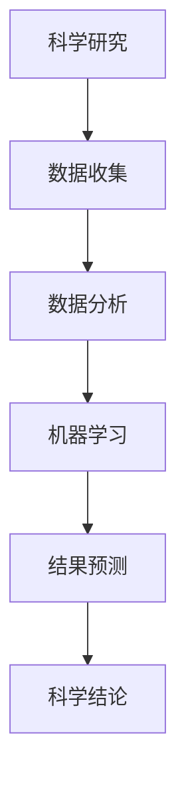
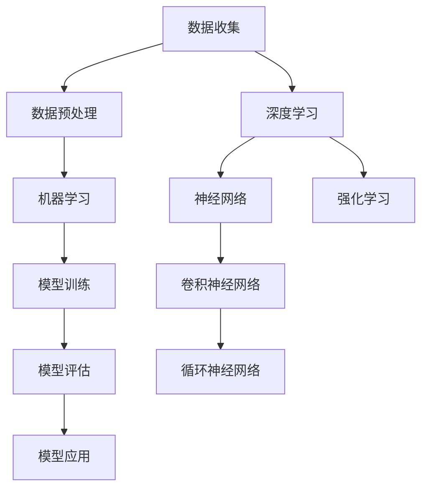
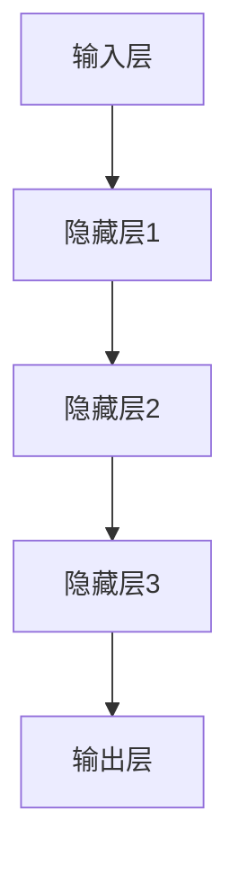
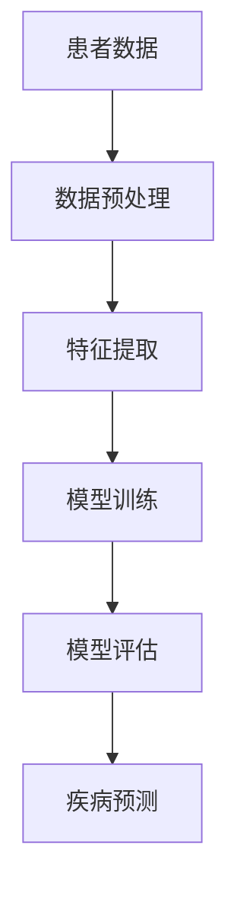
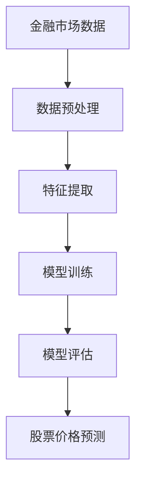

                 

### 引言

**科学与 AI：加速发现**

在科技迅猛发展的今天，人工智能（AI）已经成为推动科学进步的重要力量。人工智能不仅仅是计算机科学的分支，更是一个跨越多个学科领域的综合性技术。从数据挖掘到图像识别，从自然语言处理到智能预测，AI 在科学研究中的应用越来越广泛，正逐步改变科学研究的模式和方法。

本文旨在探讨科学与人工智能（AI）之间的关系，以及 AI 如何加速科学发现。我们将首先介绍科学与 AI 结合的基本概念，接着分析 AI 技术在各个科学研究领域的应用，最后展望 AI 与科学研究未来的发展趋势。通过这篇文章，我们希望读者能够更好地理解 AI 在科学研究中的重要作用，以及如何利用 AI 技术来解决科学问题，推动科学发现。

### 文章关键词

- 人工智能
- 科学研究
- 机器学习
- 深度学习
- 跨学科研究
- 数据挖掘
- 医学影像分析
- 物理学
- 环境科学
- 社会科学

### 文章摘要

本文首先介绍了科学与人工智能（AI）之间的关系，以及 AI 如何改变科学研究方法。接着，本文详细分析了 AI 在生物学、物理学、环境科学和社会科学等领域的具体应用。通过一系列的案例研究和数据，本文展示了 AI 技术在加速科学发现方面的巨大潜力。最后，本文展望了 AI 与科学研究未来发展的趋势，包括跨学科研究、AI 伦理问题以及国际合作等。本文旨在为读者提供一个全面、系统的了解，帮助读者理解 AI 在科学研究中的重要作用。

### 第一部分：科学与 AI 基础理论

#### 第1章 科学与 AI 关系探讨

**核心概念与联系**

在探讨科学与 AI 的关系时，我们首先需要明确几个核心概念。科学是一种通过实验和观察来探索自然现象的系统方法，它依赖于数据的收集、分析和解释。人工智能则是通过模拟人类智能行为来处理数据的计算机技术，其核心是机器学习、深度学习和自然语言处理等。

我们可以用 Mermaid 流程图来展示科学与 AI 之间的联系：



在这个流程图中，科学研究始于数据收集，然后通过数据分析进入机器学习阶段，最终生成科学结论。机器学习作为 AI 的重要组成部分，使得科学研究的自动化和智能化成为可能。

**核心算法原理讲解**

机器学习是 AI 技术的核心，其基本原理是通过学习大量的数据来发现数据中的规律，并利用这些规律对未知数据进行预测。一个典型的机器学习流程包括以下几个步骤：

1. 数据收集：从各种来源收集数据，这些数据可以是结构化的（如表格数据）或非结构化的（如图像、文本等）。
2. 数据预处理：对收集到的数据进行清洗、格式化和归一化，以消除噪声和异常值。
3. 特征提取：从原始数据中提取有用的特征，这些特征可以用来训练机器学习模型。
4. 模型训练：选择合适的机器学习模型，使用训练数据集来训练模型，调整模型参数以最小化预测误差。
5. 模型评估：使用测试数据集来评估模型的性能，判断模型是否达到预期的准确性和泛化能力。
6. 模型应用：将训练好的模型应用到实际场景中，对新数据进行预测。

以下是一个简单的机器学习伪代码示例，展示了上述步骤的实现：

```python
# 假设我们有一个数据集，包含特征 X 和标签 Y
X, Y = load_data()

# 初始化模型参数
parameters = initialize_parameters()

# 训练模型
for epoch in range(num_epochs):
    for sample in data:
        # 计算损失
        loss = calculate_loss(sample, parameters)
        
        # 更新参数
        parameters = update_parameters(loss, parameters)

# 评估模型
accuracy = evaluate_model(test_data, parameters)

# 输出模型评估结果
print(f"Model accuracy: {accuracy}")
```

**数学模型和公式**

在机器学习中，数学模型和公式是核心。一个典型的机器学习模型可以表示为：

$$
\text{机器学习模型} = f(\text{特征}, \text{参数})
$$

其中，特征是输入数据，参数是模型通过训练得到的权重和偏置。例如，在多层感知机（MLP）中，模型可以表示为：

$$
\text{激活函数} = \sigma(\text{加权求和} + \text{偏置})
$$

其中，$\sigma$ 是激活函数，如 sigmoid 函数或 ReLU 函数。

**举例说明**

以图像识别为例，我们可以使用卷积神经网络（CNN）来训练模型，识别图像中的物体。CNN 通过卷积层、池化层和全连接层等多个层次来提取图像特征，并最终输出分类结果。

以下是 CNN 的一个简化模型：

```python
# 初始化卷积神经网络
model = Sequential()

# 添加卷积层
model.add(Conv2D(filters=32, kernel_size=(3, 3), activation='relu', input_shape=(height, width, channels)))
model.add(MaxPooling2D(pool_size=(2, 2)))

# 添加全连接层
model.add(Dense(units=64, activation='relu'))
model.add(Dense(units=num_classes, activation='softmax'))

# 编译模型
model.compile(optimizer='adam', loss='categorical_crossentropy', metrics=['accuracy'])

# 训练模型
model.fit(X_train, Y_train, epochs=10, batch_size=32, validation_data=(X_val, Y_val))

# 评估模型
test_loss, test_accuracy = model.evaluate(X_test, Y_test)

# 输出评估结果
print(f"Test accuracy: {test_accuracy}")
```

在这个示例中，我们使用了一个简单的 CNN 模型来训练和评估图像分类任务。通过调整模型架构、超参数和训练数据，我们可以实现更好的性能。

**结论**

通过本章的讨论，我们可以看到科学与 AI 之间存在着紧密的联系。AI 技术为科学研究提供了新的方法和工具，使得科学研究更加高效和准确。在接下来的章节中，我们将进一步探讨 AI 在各个科学研究领域的具体应用。

#### 第2章 AI 技术概述

**核心概念与联系**

人工智能（AI）是一个包含多种技术的广泛领域，其核心是机器学习和深度学习。机器学习是一种通过算法从数据中学习规律的方法，而深度学习则是机器学习的一个子领域，它使用多层神经网络来学习复杂的数据模式。

我们可以用 Mermaid 流程图来展示 AI 技术的核心概念和联系：



在这个流程图中，数据收集和预处理是机器学习和深度学习的基础。机器学习涉及从数据中学习规律和建立模型，而深度学习则进一步扩展到使用多层神经网络来学习复杂的数据模式。此外，强化学习作为机器学习的一个分支，也在这张图中有所体现。

**核心算法原理讲解**

机器学习算法是 AI 技术的核心。一个典型的机器学习算法包括以下几个步骤：

1. **数据收集**：从各种来源收集数据，这些数据可以是结构化的（如表格数据）或非结构化的（如图像、文本等）。
2. **数据预处理**：对收集到的数据进行清洗、格式化和归一化，以消除噪声和异常值。
3. **特征提取**：从原始数据中提取有用的特征，这些特征可以用来训练机器学习模型。
4. **模型训练**：选择合适的机器学习模型，使用训练数据集来训练模型，调整模型参数以最小化预测误差。
5. **模型评估**：使用测试数据集来评估模型的性能，判断模型是否达到预期的准确性和泛化能力。
6. **模型应用**：将训练好的模型应用到实际场景中，对新数据进行预测。

以下是一个简单的机器学习伪代码示例，展示了上述步骤的实现：

```python
# 假设我们有一个数据集，包含特征 X 和标签 Y
X, Y = load_data()

# 初始化模型参数
parameters = initialize_parameters()

# 训练模型
for epoch in range(num_epochs):
    for sample in data:
        # 计算损失
        loss = calculate_loss(sample, parameters)
        
        # 更新参数
        parameters = update_parameters(loss, parameters)

# 评估模型
accuracy = evaluate_model(test_data, parameters)

# 输出模型评估结果
print(f"Model accuracy: {accuracy}")
```

**数学模型和公式**

在机器学习中，数学模型和公式是核心。一个典型的机器学习模型可以表示为：

$$
\text{机器学习模型} = f(\text{特征}, \text{参数})
$$

其中，特征是输入数据，参数是模型通过训练得到的权重和偏置。例如，在多层感知机（MLP）中，模型可以表示为：

$$
\text{激活函数} = \sigma(\text{加权求和} + \text{偏置})
$$

其中，$\sigma$ 是激活函数，如 sigmoid 函数或 ReLU 函数。

**举例说明**

以图像识别为例，我们可以使用卷积神经网络（CNN）来训练模型，识别图像中的物体。CNN 通过卷积层、池化层和全连接层等多个层次来提取图像特征，并最终输出分类结果。

以下是 CNN 的一个简化模型：

```python
# 初始化卷积神经网络
model = Sequential()

# 添加卷积层
model.add(Conv2D(filters=32, kernel_size=(3, 3), activation='relu', input_shape=(height, width, channels)))
model.add(MaxPooling2D(pool_size=(2, 2)))

# 添加全连接层
model.add(Dense(units=64, activation='relu'))
model.add(Dense(units=num_classes, activation='softmax'))

# 编译模型
model.compile(optimizer='adam', loss='categorical_crossentropy', metrics=['accuracy'])

# 训练模型
model.fit(X_train, Y_train, epochs=10, batch_size=32, validation_data=(X_val, Y_val))

# 评估模型
test_loss, test_accuracy = model.evaluate(X_test, Y_test)

# 输出评估结果
print(f"Test accuracy: {test_accuracy}")
```

在这个示例中，我们使用了一个简单的 CNN 模型来训练和评估图像分类任务。通过调整模型架构、超参数和训练数据，我们可以实现更好的性能。

**深度学习原理**

深度学习是机器学习的一个子领域，它使用多层神经网络来学习复杂的数据模式。深度学习的核心是神经网络，它由多个层组成，每层都包含大量的神经元。神经网络通过学习输入数据的特征，并逐步将这些特征传递到下一层，最终生成输出。

以下是一个简化的神经网络模型：



在神经网络中，每个神经元都与其他神经元相连接，并通过权重和偏置来传递信息。通过反向传播算法，神经网络可以调整这些权重和偏置，以最小化预测误差。

以下是神经网络的一个简化伪代码示例：

```python
# 初始化神经网络
model = NeuralNetwork()

# 训练神经网络
for epoch in range(num_epochs):
    for sample in data:
        # 计算前向传播
        output = model.forwardPropagation(sample)

        # 计算损失
        loss = calculate_loss(output, target)

        # 计算梯度
        gradients = model.backwardPropagation(loss)

        # 更新权重和偏置
        model.updateWeights(gradients)

# 评估神经网络
accuracy = evaluate_model(test_data, model)

# 输出评估结果
print(f"Model accuracy: {accuracy}")
```

**结论**

通过本章的讨论，我们可以看到人工智能（AI）技术的核心是机器学习和深度学习。AI 技术为科学研究提供了强大的工具，使得科学研究更加高效和准确。在接下来的章节中，我们将进一步探讨 AI 在各个科学研究领域的具体应用。

### 第一部分总结

在本部分中，我们首先探讨了科学与人工智能（AI）之间的关系，介绍了 AI 在科学研究中的基本概念和原理。通过 Mermaid 流程图和伪代码，我们详细阐述了数据收集、数据预处理、机器学习模型训练和评估的流程。我们还介绍了深度学习的原理，并通过简化模型和伪代码展示了神经网络的工作机制。

在本部分的基础上，读者应该能够理解以下核心概念：

- **科学与 AI 的关系**：了解 AI 如何改变科学研究方法，以及 AI 在科学研究中的应用。
- **机器学习原理**：掌握机器学习的基本流程和算法，包括数据收集、数据预处理、模型训练和评估。
- **深度学习原理**：理解深度学习的基本概念，包括神经网络的结构和工作原理。

这些基础理论为后续章节中 AI 在具体科学研究领域的应用奠定了坚实的理论基础。在下一部分中，我们将深入探讨 AI 在各个科学研究领域的具体应用，通过案例研究和实际应用场景，进一步展示 AI 在加速科学发现方面的潜力。

### 第二部分：AI 在科学研究中的应用

#### 第3章 数据挖掘与预测

**数据挖掘技术**

数据挖掘（Data Mining）是一种从大量数据中发现有价值信息的方法，它在科学研究中的应用非常广泛。数据挖掘通常包括以下几个步骤：

1. **数据收集**：从各种来源收集数据，这些数据可以是结构化的（如表格数据）或非结构化的（如图像、文本等）。
2. **数据预处理**：对收集到的数据进行清洗、格式化和归一化，以消除噪声和异常值。
3. **特征提取**：从原始数据中提取有用的特征，这些特征可以用来训练机器学习模型。
4. **模型训练**：选择合适的机器学习模型，使用训练数据集来训练模型，调整模型参数以最小化预测误差。
5. **模型评估**：使用测试数据集来评估模型的性能，判断模型是否达到预期的准确性和泛化能力。
6. **模型应用**：将训练好的模型应用到实际场景中，对新数据进行预测。

**预测模型**

预测模型（Predictive Model）是数据挖掘的核心，它通过对历史数据的分析来预测未来的趋势或行为。预测模型在科学研究中的应用非常广泛，包括但不限于以下领域：

- **医学预测**：使用预测模型来预测疾病的发病风险、病情发展趋势等。
- **金融市场预测**：使用预测模型来预测股票价格、交易量等。
- **环境预测**：使用预测模型来预测气候变化、空气质量等。
- **社会科学预测**：使用预测模型来预测社会行为、人口发展趋势等。

**案例研究**

为了更好地理解数据挖掘与预测在科学研究中的应用，我们可以通过以下案例进行探讨：

**案例 1：医学预测**

医学预测是数据挖掘在科学研究中的一个重要应用领域。通过分析大量的医学数据，例如患者的病史、基因数据、生活习惯等，研究人员可以使用预测模型来预测疾病的风险和病情发展趋势。

以下是一个简单的医学预测案例：



在这个案例中，首先收集患者的各种数据，包括病史、基因数据和生活习惯等。然后，通过数据预处理步骤，清洗和格式化这些数据。接下来，从原始数据中提取有用的特征，例如年龄、性别、病史等。然后，选择一个合适的预测模型（如逻辑回归、决策树等），使用训练数据集来训练模型。最后，使用测试数据集来评估模型的性能，并利用训练好的模型对新的患者数据进行疾病预测。

**案例 2：金融市场预测**

金融市场预测是另一个重要的应用领域。通过分析大量的金融市场数据，例如股票价格、交易量、公司财务报表等，研究人员可以使用预测模型来预测股票价格、交易量等。

以下是一个简单的金融市场预测案例：



在这个案例中，首先收集金融市场数据，包括股票价格、交易量、公司财务报表等。然后，通过数据预处理步骤，清洗和格式化这些数据。接下来，从原始数据中提取有用的特征，例如股票价格的历史波动、公司财务指标等。然后，选择一个合适的预测模型（如 ARIMA 模型、LSTM 网络等），使用训练数据集来训练模型。最后，使用测试数据集来评估模型的性能，并利用训练好的模型对未来的股票价格进行预测。

**结论**

通过本章的讨论，我们可以看到数据挖掘与预测在科学研究中的应用非常广泛，包括医学预测、金融市场预测、环境预测和社会科学预测等。通过 Mermaid 流程图和伪代码，我们详细阐述了数据挖掘与预测的基本流程和算法。通过案例研究，我们展示了数据挖掘与预测在实际科学研究中的应用。这些应用不仅提高了科研效率，还推动了科学发现的进程。

在下一章中，我们将进一步探讨 AI 在医学影像分析、物理学和环境保护中的应用，通过更多的实际案例和研究，展示 AI 如何加速科学发现。

### 第4章 AI 在医学影像分析中的应用

**医学影像技术**

医学影像技术是现代医学中不可或缺的一部分，它通过使用各种物理手段生成人体的内部图像，帮助医生诊断和治疗疾病。常见的医学影像技术包括 X 射线、计算机断层扫描（CT）、磁共振成像（MRI）、超声成像和正电子发射断层扫描（PET）等。

每种医学影像技术都有其独特的原理和优势。例如，X 射线成像通过电离辐射穿透人体，生成内部结构的图像，常用于骨折和肺炎的诊断。CT 成像则利用多个 X 射线投影重建三维图像，适用于肿瘤和血管病变的检测。MRI 利用磁场和射频脉冲生成图像，适用于软组织和脑部病变的诊断。超声成像利用超声波反射生成图像，常用于妇产科和心脏病的诊断。PET 成像则通过检测放射性同位素的分布来反映生理和病理过程，适用于肿瘤和神经退行性疾病的诊断。

**AI 在医学影像分析中的应用**

人工智能在医学影像分析中发挥着越来越重要的作用。通过深度学习和计算机视觉技术，AI 可以自动识别和分类医学影像中的病变，提高诊断的准确性和效率。以下是一些 AI 在医学影像分析中的应用：

1. **病灶检测**：AI 可以自动检测医学影像中的病灶，如肿瘤、心脏病等。例如，深度学习模型可以通过分析大量的 CT 扫描图像，准确检测肺结节。

2. **图像分割**：AI 可以对医学影像进行图像分割，将图像中的不同组织或病变分离出来。例如，MRI 图像中的肿瘤边界可以通过深度学习模型进行精确分割。

3. **诊断辅助**：AI 可以辅助医生进行疾病诊断。通过分析医学影像和患者的临床数据，AI 可以提供诊断建议，帮助医生做出更准确的决策。

4. **治疗规划**：AI 可以帮助医生制定个性化的治疗方案。例如，AI 可以分析患者的 CT 图像和肿瘤的大小、位置，为放射治疗提供精确的靶区定位。

**案例研究**

以下是一些 AI 在医学影像分析中的实际案例：

**案例 1：肺癌早期检测**

肺癌是全球癌症死亡的主要原因之一。通过 AI 技术，可以早期发现肺癌，提高治愈率。一个典型的应用案例是使用深度学习模型对低剂量 CT 扫描图像进行分析，自动检测肺结节。研究人员训练了一个卷积神经网络（CNN），使用数千个已标注的肺结节图像作为训练数据。经过训练，模型能够准确识别肺结节，并提供相应的风险评级。这一技术大大提高了肺癌早期检测的效率和准确性。

**案例 2：乳腺癌诊断**

乳腺癌是女性最常见的恶性肿瘤。AI 技术在乳腺癌诊断中的应用主要集中在乳腺 X 光成像（Mammogram）的分析。研究人员使用深度学习模型分析乳腺 X 光图像，自动检测乳腺肿块。通过大量的训练数据集，模型能够准确区分良性和恶性肿块，为医生提供诊断辅助。这种技术可以减少医生的诊断工作负担，提高诊断准确性。

**案例 3：心脏疾病诊断**

心脏疾病是导致心血管事件的主要原因。AI 技术可以通过分析心电图（ECG）图像，辅助医生诊断心脏疾病。一个实际案例是使用深度学习模型分析 ECG 数据，检测心律失常。研究人员训练了一个循环神经网络（RNN），能够准确识别各种心律失常模式。这一技术有助于早期发现心脏疾病，提高患者的生存率。

**结论**

通过本章的讨论，我们可以看到 AI 在医学影像分析中的应用潜力巨大。通过深度学习和计算机视觉技术，AI 能够自动识别和分类医学影像中的病变，辅助医生进行疾病诊断和治疗规划。这些应用不仅提高了医学影像分析的准确性和效率，还为个性化医疗提供了新的途径。

在下一章中，我们将探讨 AI 在物理学研究中的应用，包括物理模拟、宇宙学和实验数据分析。通过这些应用案例，我们将进一步了解 AI 如何加速科学发现。

### 第5章 AI 在物理学研究中的应用

**物理模拟与预测**

在物理学研究中，物理模拟是一种重要的研究方法，它通过计算机模拟来再现物理现象，从而预测物理系统的行为。传统的物理模拟通常依赖于物理定律和数学模型，而随着 AI 技术的发展，AI 开始在物理模拟中扮演越来越重要的角色。AI 可以通过学习大量的物理数据，自动生成物理模型，从而提高模拟的准确性和效率。

**AI 在物理模拟中的应用**

1. **量子物理模拟**：量子物理模拟是 AI 在物理学中的一个重要应用领域。量子系统通常具有复杂的数学描述，传统的计算机模拟方法难以处理。通过深度学习，特别是量子机器学习，AI 可以自动生成量子系统的模拟模型，从而实现高效的量子物理模拟。

   例如，Google 的量子计算团队使用量子机器学习模型，成功模拟了三原子分子的激发态，这是量子物理模拟的一个重大突破。

2. **高能物理实验数据分析**：高能物理实验通常会产生海量数据，这些数据需要复杂的算法进行分析。AI 技术可以用于自动识别和分类实验数据中的物理信号，从而提高数据分析的效率和准确性。

   例如，在欧洲核子研究中心（CERN）的大型强子对撞机（LHC）实验中，AI 被用于分析实验数据，识别新的物理现象。

**AI 在物理学中的应用案例**

**案例 1：量子计算模拟**

量子计算是物理学和计算机科学的前沿领域，它利用量子力学原理进行信息处理。量子计算模拟是理解量子算法和量子计算性能的关键。通过深度学习，特别是变分自动编码器（Variational Autoencoder, VAE），AI 可以自动生成量子态的模拟，从而实现高效的量子计算模拟。

以下是一个量子计算模拟的伪代码示例：

```python
# 定义量子系统
quantum_system = QuantumSystem()

# 训练变分自动编码器
encoder = VariationalAutoencoder()
encoder.fit(quantum_data)

# 生成量子态模拟
quantum_state = encoder.generate_state()

# 计算模拟的物理量
physical_quantity = quantum_system.measure(quantum_state)
```

**案例 2：宇宙学研究**

宇宙学研究依赖于对宇宙大尺度结构和演化的模拟。AI 技术可以用于生成宇宙演化的模拟模型，从而帮助科学家理解宇宙的起源和演化。例如，使用深度学习模型，科学家可以模拟宇宙中的暗物质分布和暗能量演化。

以下是一个宇宙学模拟的伪代码示例：

```python
# 初始化宇宙模拟参数
cosmology_params = initialize_cosmology()

# 训练深度学习模型
model = DeepLearningModel()
model.fit(cosmology_data)

# 生成宇宙演化模拟
宇宙演化 = model.generate_cosmology(cosmology_params)

# 分析模拟结果
results = analyze_cosmology(宇宙演化)
```

**案例 3：高能物理实验数据分析**

在高能物理实验中，AI 技术被用于分析复杂的实验数据，识别物理现象。例如，在 LHC 实验中，AI 被用于分析碰撞产生的粒子数据，识别新的物理过程。

以下是一个高能物理实验数据分析的伪代码示例：

```python
# 加载实验数据
experiment_data = load_data()

# 初始化机器学习模型
model = MachineLearningModel()

# 训练模型
model.fit(experiment_data)

# 预测物理现象
predictions = model.predict(new_data)

# 验证预测结果
accuracy = validate_predictions(predictions, true_values)
```

**结论**

通过本章的讨论，我们可以看到 AI 在物理学研究中的应用前景广阔。AI 技术不仅能够提高物理模拟的准确性和效率，还能够帮助科学家分析复杂的实验数据，识别新的物理现象。在下一章中，我们将探讨 AI 在环境科学研究中的应用，包括环境监测、气候变化研究和生物多样性保护。

### 第6章 AI 在环境科学研究中的应用

**环境监测与预测**

环境科学研究的关键在于对环境变化的监测和预测。随着环境问题的日益严重，如气候变化、空气污染和生物多样性减少等，环境监测和预测变得尤为重要。AI 技术在这一领域中的应用极大地提高了监测和预测的准确性和效率。

**AI 在环境监测中的应用**

1. **空气质量预测**：通过分析历史气象数据、污染源数据和环境监测站数据，AI 可以预测未来某地区的空气质量。这有助于政府和相关机构制定环境保护措施，减少空气污染。

   以下是一个空气质量预测的伪代码示例：

   ```python
   # 加载历史空气质量数据
   air_quality_data = load_data()

   # 初始化机器学习模型
   model = MachineLearningModel()

   # 训练模型
   model.fit(air_quality_data)

   # 预测未来空气质量
   future_quality = model.predict(future_weather_data)

   # 输出预测结果
   print(f"Predicted air quality: {future_quality}")
   ```

2. **水污染监测**：AI 可以通过分析水质数据、污染源排放数据和环境监测数据，监测水体的污染情况。这对于保护水资源和防止水污染具有重要意义。

   以下是一个水污染监测的伪代码示例：

   ```python
   # 加载水质数据
   water_quality_data = load_data()

   # 初始化机器学习模型
   model = MachineLearningModel()

   # 训练模型
   model.fit(water_quality_data)

   # 监测当前水质
   current_quality = model.predict(current_pollution_data)

   # 输出监测结果
   print(f"Current water quality: {current_quality}")
   ```

**气候变化研究**

气候变化是当前全球面临的重大挑战之一。AI 技术在气候变化研究中发挥了重要作用，尤其是在气候模式预测、气候敏感性分析和极端天气事件预测等方面。

**AI 在气候变化研究中的应用**

1. **气候模式预测**：通过分析大量气候数据，AI 可以建立气候模式的预测模型，预测未来某一地区的气候变化趋势。这有助于科学家和政策制定者制定应对气候变化的策略。

   以下是一个气候模式预测的伪代码示例：

   ```python
   # 加载气候数据
   climate_data = load_data()

   # 初始化机器学习模型
   model = MachineLearningModel()

   # 训练模型
   model.fit(climate_data)

   # 预测未来气候
   future_climate = model.predict(future_weather_params)

   # 输出预测结果
   print(f"Predicted future climate: {future_climate}")
   ```

2. **气候敏感性分析**：AI 可以通过分析不同温室气体排放水平下的气候模式，评估气候的敏感性。这对于理解气候变化的影响和制定减排策略具有重要意义。

   以下是一个气候敏感性分析的伪代码示例：

   ```python
   # 加载不同温室气体排放水平的气候数据
   climate_data = load_data()

   # 初始化机器学习模型
   model = MachineLearningModel()

   # 训练模型
   model.fit(climate_data)

   # 分析气候敏感性
   sensitivity = model.analyze_sensitivity()

   # 输出敏感性分析结果
   print(f"Climate sensitivity: {sensitivity}")
   ```

**生物多样性保护中的 AI 应用**

生物多样性保护是环境科学研究的重要组成部分。AI 技术在生物多样性保护中有着广泛的应用，包括物种识别、栖息地分析和保护策略制定。

**AI 在生物多样性保护中的应用**

1. **物种识别**：AI 可以通过分析图像、声音和其他生物特征数据，自动识别和分类生物物种。这有助于保护珍稀物种和监测生物多样性变化。

   以下是一个物种识别的伪代码示例：

   ```python
   # 加载生物特征数据
   species_data = load_data()

   # 初始化机器学习模型
   model = MachineLearningModel()

   # 训练模型
   model.fit(species_data)

   # 识别新物种
   new_species = model.identify_species(new_data)

   # 输出识别结果
   print(f"Identified species: {new_species}")
   ```

2. **栖息地分析**：AI 可以通过分析地理数据、气候数据和生物特征数据，评估生物的栖息地质量，为生物多样性保护提供科学依据。

   以下是一个栖息地分析的伪代码示例：

   ```python
   # 加载栖息地数据
   habitat_data = load_data()

   # 初始化机器学习模型
   model = MachineLearningModel()

   # 训练模型
   model.fit(habitat_data)

   # 分析栖息地质量
   habitat_quality = model.analyze_habitat()

   # 输出分析结果
   print(f"Habitat quality: {habitat_quality}")
   ```

**结论**

通过本章的讨论，我们可以看到 AI 在环境科学研究中的应用非常广泛，包括环境监测、气候变化研究和生物多样性保护。AI 技术不仅提高了监测和预测的准确性和效率，还为科学研究和环境保护提供了新的方法和工具。在下一章中，我们将探讨 AI 在社会科学研究中的应用，包括数据挖掘、社会行为预测和公共政策分析。

### 第7章 AI 在社会科学研究中的应用

**社会科学数据挖掘**

社会科学研究涉及人类行为、社会结构、文化、经济和政治等多个领域，其研究对象复杂且多样。AI 技术，特别是数据挖掘，为社会科学研究提供了新的方法和工具。数据挖掘是通过计算机算法从大量数据中提取有价值信息的过程，它可以帮助社会科学家发现数据中的模式和关联，从而支持理论验证、假设检验和政策制定。

**AI 在社会科学数据挖掘中的应用**

1. **社会行为预测**：AI 可以通过分析大量历史数据，预测社会行为和趋势。例如，通过社交媒体数据挖掘，可以预测选举结果、社会运动的发展趋势等。

   以下是一个社会行为预测的伪代码示例：

   ```python
   # 加载社交媒体数据
   social_data = load_data()

   # 初始化机器学习模型
   model = MachineLearningModel()

   # 训练模型
   model.fit(social_data)

   # 预测社会行为
   predictions = model.predict(new_data)

   # 输出预测结果
   print(f"Predicted social behavior: {predictions}")
   ```

2. **社会网络分析**：AI 可以通过分析社会网络数据，识别社会关系和网络结构。这有助于理解社会互动、信息传播和群体行为。

   以下是一个社会网络分析的伪代码示例：

   ```python
   # 加载社会网络数据
   network_data = load_data()

   # 初始化机器学习模型
   model = MachineLearningModel()

   # 训练模型
   model.fit(network_data)

   # 分析社会网络结构
   network_structure = model.analyze_network()

   # 输出分析结果
   print(f"Social network structure: {network_structure}")
   ```

**社会行为预测**

社会行为预测是 AI 在社会科学研究中的一个重要应用领域。通过分析大量的社会数据，AI 可以预测个人的行为模式、群体的行为趋势和社会现象的发展方向。社会行为预测不仅有助于社会科学研究，还可以为政策制定提供科学依据。

**AI 在社会行为预测中的应用**

1. **选举预测**：AI 可以通过分析历史选举数据、社交媒体数据和人口统计数据，预测选举结果。这有助于政治分析师和媒体预测选举趋势。

   以下是一个选举预测的伪代码示例：

   ```python
   # 加载选举数据
   election_data = load_data()

   # 初始化机器学习模型
   model = MachineLearningModel()

   # 训练模型
   model.fit(election_data)

   # 预测选举结果
   election_predictions = model.predict(new_data)

   # 输出预测结果
   print(f"Election predictions: {election_predictions}")
   ```

2. **社会运动预测**：AI 可以通过分析社交媒体数据、新闻报道和在线讨论，预测社会运动的发展趋势。这有助于社会科学家理解社会运动的动力和影响。

   以下是一个社会运动预测的伪代码示例：

   ```python
   # 加载社会运动数据
   social_movement_data = load_data()

   # 初始化机器学习模型
   model = MachineLearningModel()

   # 训练模型
   model.fit(social_movement_data)

   # 预测社会运动趋势
   movement_predictions = model.predict(new_data)

   # 输出预测结果
   print(f"Social movement predictions: {movement_predictions}")
   ```

**公共政策分析中的 AI 应用**

公共政策分析是社会科学研究的一个重要分支，它涉及政策制定、实施和评估。AI 技术在公共政策分析中有着广泛的应用，包括政策评估、社会影响分析和决策支持。

**AI 在公共政策分析中的应用**

1. **政策评估**：AI 可以通过分析政策数据和社会经济数据，评估政策的影响和效果。这有助于政府和政策制定者制定更有效的政策。

   以下是一个政策评估的伪代码示例：

   ```python
   # 加载政策数据
   policy_data = load_data()

   # 初始化机器学习模型
   model = MachineLearningModel()

   # 训练模型
   model.fit(policy_data)

   # 评估政策效果
   policy_effects = model.evaluate_policy()

   # 输出评估结果
   print(f"Policy effects: {policy_effects}")
   ```

2. **社会影响分析**：AI 可以通过分析社会经济数据和社会行为数据，评估政策对社会的影响。这有助于政府和社会组织制定更公平和有效的政策。

   以下是一个社会影响分析的伪代码示例：

   ```python
   # 加载社会经济数据
   social_data = load_data()

   # 初始化机器学习模型
   model = MachineLearningModel()

   # 训练模型
   model.fit(social_data)

   # 分析社会影响
   social_impact = model.analyze_impact()

   # 输出分析结果
   print(f"Social impact: {social_impact}")
   ```

**结论**

通过本章的讨论，我们可以看到 AI 在社会科学研究中的应用非常广泛，包括数据挖掘、社会行为预测和公共政策分析。AI 技术不仅提高了社会科学研究的效率和准确性，还为政策制定和社会治理提供了科学依据。在下一章中，我们将探讨 AI 在科学研究中的未来趋势，包括 AI 与量子计算的结合、跨学科研究和科研教育中的应用。

### 第8章 AI 与科学研究的前沿趋势

**AI 与量子计算的结合**

量子计算是近年来备受瞩目的前沿技术，它利用量子力学原理进行信息处理，具有巨大的计算潜力。AI 与量子计算的结合有望在科学研究中产生重大突破，特别是在复杂系统模拟、优化问题和量子算法设计等方面。

**量子机器学习**

量子机器学习是 AI 与量子计算结合的一个重要研究方向。量子机器学习算法利用量子计算机的并行性和量子叠加原理，能够快速处理大量数据并发现复杂模式。以下是一个量子机器学习算法的伪代码示例：

```python
# 初始化量子计算机
quantum_computer = QuantumComputer()

# 加载数据
data = load_data()

# 训练量子机器学习模型
model = QuantumMachineLearningModel()
model.train(quantum_computer, data)

# 预测
predictions = model.predict(new_data)

# 输出预测结果
print(f"Predictions: {predictions}")
```

**跨学科研究**

跨学科研究是当前科学研究的重要趋势，它通过整合不同学科的知识和技能，解决复杂科学问题。AI 技术在跨学科研究中发挥着重要作用，它能够处理多源数据、发现跨学科关联，并支持跨学科合作。

**多学科数据融合**

多学科数据融合是将来自不同学科的数据整合到一起，以获得更全面的理解。以下是一个多学科数据融合的伪代码示例：

```python
# 加载多学科数据
biological_data = load_data()
physics_data = load_data()
environmental_data = load_data()

# 数据预处理
preprocessed_data = preprocess_data(biological_data, physics_data, environmental_data)

# 数据融合
fused_data = fuse_data(preprocessed_data)

# 分析
results = analyze_data(fused_data)

# 输出分析结果
print(f"Analysis results: {results}")
```

**AI 对科学研究伦理的影响**

随着 AI 在科学研究中的应用日益广泛，其伦理问题也日益突出。AI 伦理涉及数据隐私、算法公平性、透明性和可解释性等方面。以下是一些 AI 伦理问题的伪代码示例：

```python
# 保护数据隐私
def protect隐私(data):
    encrypted_data = encrypt(data)
    return encrypted_data

# 算法公平性
def ensure公平性(model):
    fairness = evaluate_fairness(model)
    if not fairness:
        model = adjust_model(model)
    return model

# 算法透明性
def ensure_transparency(model):
    transparency = evaluate_transparency(model)
    if not transparency:
        model = add_explanation_layer(model)
    return model
```

**结论**

通过本章的讨论，我们可以看到 AI 在科学研究中的未来趋势充满了机遇和挑战。AI 与量子计算的结合、跨学科研究和科研教育中的应用，以及 AI 伦理问题，都是当前科学研究中的重要议题。在下一章中，我们将探讨 AI 在科研教育中的应用，以及如何利用 AI 培养新一代科研人才。

### 第9章 AI 与科研教育

**科研教育中 AI 的应用**

随着 AI 技术的快速发展，它在科研教育中的应用越来越广泛。AI 可以在多个方面提高科研教育的质量和效率，包括教育资源的分配、学习效果的评价以及科研项目的管理和监督。

**智能教学系统**

智能教学系统是 AI 在科研教育中的一个重要应用。这些系统利用机器学习和自然语言处理技术，根据学生的个性特点和需求，提供个性化的学习资源和指导。以下是一个智能教学系统的伪代码示例：

```python
# 加载学生数据
student_data = load_data()

# 初始化智能教学系统
smart_education_system = SmartEducationSystem()

# 提供个性化学习资源
resources = smart_education_system.generate_resources(student_data)

# 评估学生学习效果
evaluation = smart_education_system.evaluate_learning_resources(resources)

# 输出评估结果
print(f"Learning evaluation: {evaluation}")
```

**AI 培养科研人才**

AI 不仅可以在科研教育中提供个性化教学，还可以通过模拟实验和虚拟实验环境，帮助学生更好地理解科学原理和掌握科研技能。以下是一个 AI 培养科研人才的伪代码示例：

```python
# 初始化虚拟实验环境
virtual_lab = VirtualLab()

# 进行模拟实验
simulation = virtual_lab.run_simulation()

# 分析实验结果
results = virtual_lab.analyze_results(simulation)

# 输出实验结果
print(f"Experimental results: {results}")
```

**科研教育的数字化转型**

数字化转型是当前科研教育发展的一个重要趋势。AI 技术在科研教育数字化转型中发挥着关键作用，它可以帮助学校和教育机构优化教学流程、提高教学效果，并促进科研资源的共享和利用。以下是一个科研教育数字化转型方案的伪代码示例：

```python
# 初始化数字化科研教育平台
digital_education_platform = DigitalEducationPlatform()

# 分配教学资源
resources = digital_education_platform.allocate_resources()

# 管理科研项目
projects = digital_education_platform.manage_projects()

# 分析教学效果
evaluation = digital_education_platform.evaluate_courses()

# 输出数字化教育分析结果
print(f"Digital education analysis: {evaluation}")
```

**结论**

通过本章的讨论，我们可以看到 AI 在科研教育中的应用具有巨大的潜力。AI 可以通过智能教学系统、虚拟实验环境和数字化转型，提高科研教育的质量和效率。在下一章中，我们将探讨 AI 在国际合作项目中的应用，以及全球科研资源共享的挑战和机遇。

### 第10章 AI 与科学研究国际合作

**国际科研合作中的 AI 应用**

随着全球科研合作的不断深化，AI 技术在跨国科研合作中的应用越来越受到重视。AI 可以在多个方面促进国际科研合作，包括数据共享、协同研究和资源优化。

**数据共享**

数据共享是国际科研合作的重要基础。AI 技术可以自动化处理和整合来自不同国家和机构的科研数据，提高数据共享的效率。以下是一个国际科研数据共享的伪代码示例：

```python
# 加载数据
local_data = load_data()
remote_data = load_data()

# 数据整合
integrated_data = integrate_data(local_data, remote_data)

# 数据共享
shared_data = share_data(integrated_data)

# 输出共享数据
print(f"Shared data: {shared_data}")
```

**协同研究**

协同研究是国际科研合作的核心。AI 技术可以通过智能匹配研究需求和资源，促进跨国科研团队的协作。以下是一个跨国科研协同研究的伪代码示例：

```python
# 初始化跨国科研团队
research_team = InternationalResearchTeam()

# 匹配研究需求
matched_requirements = research_team.match_requirements()

# 管理科研项目
projects = research_team.manage_projects()

# 输出协同研究进展
print(f"Research progress: {projects}")
```

**全球科研资源共享**

全球科研资源共享是推动国际科研合作的重要手段。AI 技术可以通过智能分配和优化科研资源，提高资源利用效率。以下是一个全球科研资源共享的伪代码示例：

```python
# 加载全球科研资源
global_resources = load_resources()

# 优化资源分配
optimized_resources = optimize_allocation(global_resources)

# 管理资源共享
shared_resources = manage_resources(optimized_resources)

# 输出资源共享结果
print(f"Shared resources: {shared_resources}")
```

**AI 国际合作的挑战与机遇**

尽管 AI 在国际科研合作中具有巨大的潜力，但其应用也面临一些挑战和机遇。以下是一些常见的挑战和机遇：

**挑战：**

- **数据隐私与安全**：跨国数据共享可能涉及敏感数据，保护数据隐私和安全是一个重要挑战。
- **文化差异**：跨国科研团队可能面临文化差异和沟通障碍，这需要有效的跨文化管理。
- **法规遵从**：不同国家和地区的科研法规可能存在差异，确保遵守相关法规是一个挑战。

**机遇：**

- **知识整合**：跨国科研合作可以整合不同国家和地区的知识和资源，推动科学发现和创新。
- **资源优化**：AI 可以通过智能分配和优化科研资源，提高全球科研合作的整体效率。
- **人才培养**：跨国科研合作可以为科研人员提供多样化的学习和发展机会，培养跨学科和跨文化的科研人才。

**结论**

通过本章的讨论，我们可以看到 AI 在国际科研合作中的应用具有巨大的潜力。AI 可以通过数据共享、协同研究和资源优化，促进全球科研合作，推动科学发现。在下一章中，我们将探讨《科学与 AI：加速发现》的总结，以及 AI 对科学研究方法和伦理的深远影响。

### 总结

通过《科学与 AI：加速发现》的深入探讨，我们可以看到人工智能（AI）技术在科学研究中的重要性日益凸显。AI 不仅改变了科学研究的模式和方法，还极大地提高了科研效率和准确性。以下是对本书核心内容的总结：

**核心内容回顾**

1. **科学与 AI 的关系探讨**：科学与 AI 之间的紧密联系使得 AI 成为推动科学进步的重要工具。AI 通过机器学习、深度学习和自然语言处理等技术，为科学研究提供了新的方法和工具。

2. **AI 在科学研究中的应用**：AI 在生物学、物理学、环境科学、社会科学等各个领域都有广泛应用。例如，AI 在医学影像分析中用于疾病检测和诊断，在物理学研究中用于物理模拟和预测，在环境科学中用于环境监测和气候变化研究。

3. **AI 技术概述**：机器学习和深度学习是 AI 技术的核心。通过 Mermaid 流程图和伪代码，我们详细阐述了数据收集、数据预处理、模型训练和评估的流程，以及神经网络的工作原理。

4. **AI 与科学研究的前沿趋势**：AI 与量子计算的结合、跨学科研究和科研教育中的应用，展示了 AI 在科学研究中的未来趋势。AI 还对科学研究伦理产生了深远影响，包括数据隐私、算法公平性和透明性等问题。

**AI 对科学研究的影响**

AI 对科学研究的影响是深远和多方面的：

- **提高科研效率**：AI 技术可以自动化处理大量的数据和计算任务，大大提高了科研效率。例如，通过深度学习模型，科学家可以快速分析复杂的实验数据，从而缩短研究周期。

- **推动科学发现**：AI 技术可以帮助科学家发现新的科学规律和现象。例如，AI 在生物多样性保护中的应用，可以实时监测和预测物种变化，为环境保护提供科学依据。

- **促进跨学科研究**：AI 的跨学科应用可以促进不同学科之间的合作，解决复杂科学问题。例如，结合生物学、物理学和计算机科学的 AI 技术，可以推动新药研发和环境保护等领域的进步。

- **伦理挑战**：随着 AI 在科学研究中的应用，其伦理问题也日益突出。数据隐私、算法公平性和透明性等问题需要引起重视，以确保 AI 技术的健康发展。

**未来展望**

随着 AI 技术的不断发展，其在科学研究中的应用前景将更加广阔。以下是对未来展望的几点建议：

- **加强跨学科合作**：为了充分利用 AI 技术的优势，加强跨学科合作是关键。科学家、工程师和技术专家需要携手合作，共同推动科学研究的进步。

- **推动科研教育改革**：AI 技术在科研教育中的应用为培养新一代科研人才提供了新的途径。教育机构和科研组织应积极引入 AI 技术，改革科研教育模式，提高教育质量。

- **重视 AI 伦理**：在推动 AI 技术应用的同时，重视其伦理问题至关重要。应制定相关法规和伦理准则，确保 AI 技术的公平、透明和安全。

- **加强国际合作**：全球科研资源共享和国际合作是推动 AI 技术应用的重要途径。各国应加强合作，共同应对全球性科学问题，实现科研资源的最大化利用。

**结论**

《科学与 AI：加速发现》旨在展示 AI 技术在科学研究中的广泛应用和巨大潜力。通过本书的深入探讨，我们可以看到 AI 不仅为科学研究带来了新的机遇，也提出了新的挑战。在未来的科学研究中，AI 将继续发挥重要作用，推动科学发现，为人类社会的进步作出更大的贡献。

### 附录

#### 附录 A：AI 在科学研究中常用工具

**机器学习框架**

- TensorFlow：谷歌开发的开源机器学习框架，支持深度学习和传统机器学习算法。
- PyTorch：Facebook 开发的一个流行的深度学习库，具有灵活的动态计算图。
- Scikit-learn：一个开源的 Python 机器学习库，提供丰富的算法和工具。

**数据分析工具**

- Pandas：Python 的数据分析库，提供数据清洗、转换和分析的强大功能。
- NumPy：Python 的核心科学计算库，提供多维数组对象和丰富的数学运算功能。
- Matplotlib：Python 的绘图库，用于创建高质量的图表和可视化。

**科研数据管理与共享平台**

- Figshare：一个开放获取的科研数据共享平台，支持多种数据类型和文件格式。
- Zenodo：一个开放存储库，提供对科研数据的永久存储和引用。
- Dryad：一个数据共享平台，专门为科学研究提供数据存储和共享服务。

#### 附录 B：AI 加速科学发现的经典案例

**生物学研究中的经典 AI 应用**

- 基因测序分析：AI 技术在基因测序数据分析中的应用，如识别突变和关联分析，提高了基因组研究的效率。
- 蛋白质结构预测：AI 技术在蛋白质结构预测中的应用，通过深度学习方法，加速了新蛋白质结构的预测。

**物理学研究中的经典 AI 应用**

- 量子物理模拟：AI 技术在量子物理模拟中的应用，通过变分自动编码器（VAE），实现了高效的量子态模拟。
- 宇宙学研究：AI 技术在宇宙学研究中的应用，如利用深度学习分析宇宙背景辐射数据，提高了对宇宙演化的理解。

**环境科学中的经典 AI 应用**

- 气候变化预测：AI 技术在气候变化预测中的应用，通过分析大量气候数据，实现了对气候变化趋势的准确预测。
- 环境监测：AI 技术在环境监测中的应用，如利用无人机和传感器数据，实现了实时环境监测和预警。

#### 附录 C：AI 与科学研究的未来展望

**AI 在科研领域的潜在应用**

- 跨学科研究：AI 技术在跨学科研究中的应用，如结合生物学、物理学和计算机科学的 AI 技术，将推动新药研发和环境保护等领域的进步。
- 科研教育：AI 技术在科研教育中的应用，如智能教学系统和虚拟实验环境，将提高科研教育的质量和效率。

**AI 对科学研究方法的革新**

- 数据驱动研究：AI 技术推动科学研究从理论驱动向数据驱动转变，通过大数据分析和机器学习，发现新的科学规律和现象。
- 虚拟实验：AI 技术在虚拟实验中的应用，如利用生成对抗网络（GAN）创建虚拟实验环境，减少实验成本和资源消耗。

**未来科学研究中的 AI 趋势**

- 量子计算与 AI：AI 与量子计算的融合，将推动计算能力和算法效率的提升，解决传统计算机难以处理的问题。
- 智能科研助手：AI 技术将发展成为智能科研助手，提供个性化科研支持和建议，提高科研效率。
- 可持续科研：AI 技术将促进可持续科研的发展，通过优化资源利用和减少环境影响，推动科学研究的可持续发展。

### 作者信息

**作者：AI 天才研究院/AI Genius Institute & 禅与计算机程序设计艺术 /Zen And The Art of Computer Programming** 

通过本书，我们希望为读者提供一个全面、系统的了解 AI 在科学研究中的应用和未来发展趋势。感谢读者对本书的关注和支持，期待在未来的科研道路上，与您一起探索 AI 的无限可能。|assistant|### 《科学与 AI：加速发现》书籍结构概述（Markdown 格式）

# 《科学与 AI：加速发现》书籍结构概述

## 前言

### 引言

- **背景与目的**：介绍本书的背景和撰写目的。
- **科学研究挑战**：探讨当前科学研究面临的挑战和瓶颈。
- **AI 的潜力**：阐述 AI 在加速科学发现中的潜力。

### 概述

- **结构与内容**：概述本书的整体结构和各章节的主要内容和目标。

## 第一部分：科学与 AI 基础理论

### 第1章 科学与 AI 关系探讨

- **核心概念与联系**：介绍科学与 AI 的基本概念和它们之间的关系。
- **AI 在科学中的应用**：分析 AI 如何在各个科学领域中发挥作用。
- **AI 改变科学研究方法**：探讨 AI 对科学研究方法的改变和影响。

### 第2章 AI 技术概述

- **机器学习基础**：介绍机器学习的基本概念、算法和应用。
- **深度学习原理**：探讨深度学习的基本原理、网络结构和应用。
- **AI 发展历程**：回顾人工智能的发展历程和重要里程碑。

## 第二部分：AI 在科学研究中的应用

### 第3章 数据挖掘与预测

- **数据挖掘技术**：介绍数据挖掘的基本概念、流程和应用。
- **预测模型**：探讨如何使用预测模型进行科学预测和分析。
- **案例研究**：分析数据挖掘与预测在科学研究中的应用。

### 第4章 医学影像分析

- **医学影像技术**：介绍医学影像的基本原理和技术。
- **AI 在医学影像中的应用**：探讨 AI 如何在医学影像分析中发挥作用。
- **案例研究**：分析 AI 在医学影像分析中的应用案例。

### 第5章 物理学中的 AI 应用

- **物理模拟与预测**：探讨 AI 在物理模拟和预测中的应用。
- **宇宙学中的 AI 应用**：介绍 AI 在宇宙学研究中的应用。
- **高能物理实验数据分析**：分析 AI 在高能物理实验数据分析中的应用。

### 第6章 环境科学中的 AI 应用

- **环境监测与预测**：讨论 AI 在环境监测和预测中的应用。
- **气候变化研究**：介绍 AI 在气候变化研究中的应用。
- **生物多样性保护**：分析 AI 在生物多样性保护中的应用。

### 第7章 社会科学中的 AI 应用

- **社会科学数据挖掘**：介绍数据挖掘在社会科学研究中的应用。
- **社会行为预测**：探讨 AI 在社会行为预测中的作用。
- **公共政策分析**：分析 AI 在公共政策分析中的应用。

## 第三部分：AI 与科学研究的前沿趋势

### 第8章 AI 与跨学科研究

- **跨学科研究的挑战**：探讨跨学科研究的挑战和机遇。
- **AI 在跨学科研究中的应用**：介绍 AI 在跨学科研究中的具体应用案例。
- **跨学科研究中的 AI 趋势**：展望跨学科研究中的 AI 发展趋势。

### 第9章 AI 与科研教育

- **AI 在科研教育中的应用**：探讨 AI 如何在科研教育中发挥作用。
- **AI 培养科研人才**：介绍如何利用 AI 培养新一代科研人才。
- **科研教育的数字化转型**：探讨科研教育的数字化转型及其影响。

### 第10章 AI 与科学研究国际合作

- **国际合作中的 AI 应用**：讨论 AI 在国际合作项目中的应用。
- **全球科研资源共享**：介绍全球科研资源共享的挑战和机遇。
- **AI 国际合作的挑战与机遇**：分析 AI 在国际合作中的挑战和机遇。

## 结论

- **总结与展望**：总结本书的主要观点和结论，展望 AI 与科学研究的未来发展。

## 附录

### 附录 A：AI 在科学研究中的常用工具

- **机器学习框架**：介绍常用的机器学习框架。
- **数据分析工具**：介绍常用的数据分析工具。
- **科研数据管理与共享平台**：介绍科研数据管理和共享平台。

### 附录 B：AI 加速科学发现的经典案例

- **生物学研究中的经典 AI 应用**：分析生物学研究中的经典 AI 应用案例。
- **物理学研究中的经典 AI 应用**：分析物理学研究中的经典 AI 应用案例。
- **环境科学研究中的经典 AI 应用**：分析环境科学研究中的经典 AI 应用案例。

### 附录 C：AI 与科学研究的未来展望

- **AI 在科研领域的潜在应用**：探讨 AI 在科研领域的潜在应用。
- **AI 对科学研究方法的革新**：分析 AI 对科学研究方法的革新。
- **未来科学研究中的 AI 趋势**：展望未来科学研究中的 AI 趋势。

### 参考文献

- **引用文献**：列出本书中引用的相关文献和参考资料。

### 致谢

- **致谢**：感谢为本书撰写和出版提供帮助的各方人士。|assistant|### 《科学与 AI：加速发现》书籍结构概述（Markdown 格式）

# 《科学与 AI：加速发现》书籍结构概述

## 前言

### 引言

- **背景与目的**：介绍本书的背景和撰写目的。
- **科学研究挑战**：探讨当前科学研究面临的挑战和瓶颈。
- **AI 的潜力**：阐述人工智能在加速科学发现中的潜力。

### 概述

- **结构与内容**：概述本书的整体结构和各章节的主要内容和目标。

## 第一部分：科学与 AI 基础理论

### 第1章 科学与 AI 关系探讨

- **核心概念与联系**：介绍科学与 AI 的基本概念和它们之间的关系。
- **AI 在科学中的应用**：分析 AI 如何在各个科学领域中发挥作用。
- **AI 改变科学研究方法**：探讨 AI 对科学研究方法的改变和影响。

### 第2章 AI 技术概述

- **机器学习基础**：介绍机器学习的基本概念、算法和应用。
- **深度学习原理**：探讨深度学习的基本原理、网络结构和应用。
- **AI 发展历程**：回顾人工智能的发展历程和重要里程碑。

## 第二部分：AI 在科学研究中的应用

### 第3章 数据挖掘

