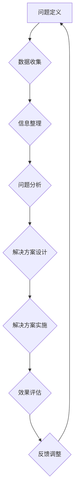

                 

# 科学研究的责任创新与世界可理解性的前瞻性

## 关键词：科研责任、创新、跨学科研究、人工智能、可理解性

## 摘要：
本文将探讨科学研究中的责任与创新，以及这些创新如何影响世界可理解性。通过剖析科研责任的基本原则，创新的本质和动力，以及跨学科研究的重要性，文章旨在为科研人员提供系统性的思考框架和实际操作指南。同时，本文还将探讨科学知识传播与公众理解之间的关系，以及人工智能在提高可理解性方面的潜力。最终，文章将对未来的科研趋势和公众使命进行展望，为科研人员与公众提供共同的责任与使命。

### 目录大纲

#### 第一部分：科学研究的责任与创新

##### 第1章：科学研究的责任

- **1.1 研究伦理与责任**
  - **1.1.1 科学研究伦理的基本原则**
  - **1.1.2 责任在科研活动中的体现**
  - **1.1.3 研究者与社会的责任关系**

##### 第2章：创新科学研究的动力与障碍

- **2.1 创新的本质与特点**
  - **2.1.1 创新的定义与类型**
  - **2.1.2 创新的动力因素**
  - **2.1.3 创新的障碍因素**

##### 第3章：创新科研方法论

- **3.1 系统性思考与问题解决**
  - **3.1.1 Mermaid 流程图：系统性思考的框架**
  - **3.1.2 问题解决的基本步骤**
  - **3.1.3 系统思维案例分析**

##### 第4章：跨学科研究与整合

- **4.1 跨学科研究的重要性**
  - **4.1.1 跨学科研究的优势**
  - **4.1.2 跨学科研究面临的挑战**
  - **4.1.3 跨学科研究的方法论**

##### 第5章：创新科研实践与案例

- **5.1 创新科研项目的组织与实施**
  - **5.1.1 项目管理的基本原则**
  - **5.1.2 项目团队的构建与管理**
  - **5.1.3 项目资源的管理与调配**

- **5.2 创新科研案例分析**
  - **5.2.1 成功创新案例解析**
  - **5.2.2 失败创新案例反思**

#### 第二部分：世界可理解性的前瞻性

##### 第6章：科学知识传播与公众理解

- **6.1 科学知识传播的挑战与机遇**
  - **6.1.1 公众理解科学的需求与障碍**
  - **6.1.2 科学传播的策略与方法**
  - **6.1.3 科技传播中的社会责任**

##### 第7章：人工智能与可理解性

- **7.1 人工智能的发展与影响**
  - **7.1.1 人工智能的基本原理与应用**
  - **7.1.2 人工智能对社会的影响**
  - **7.1.3 人工智能的可理解性问题**

##### 第8章：未来的可理解性：挑战与展望

- **8.1 可理解性在科学研究中的重要性**
  - **8.1.1 科学研究中的可理解性目标**
  - **8.1.2 可理解性的技术手段与工具**
  - **8.1.3 可理解性的未来展望**

##### 第9章：综合案例分析

- **9.1 可理解性在跨学科研究中的应用**
  - **9.1.1 跨学科研究中的可理解性挑战**
  - **9.1.2 跨学科研究的成功案例**
  - **9.1.3 可理解性在创新科研中的重要作用**

##### 第10章：结论与展望

- **10.1 全书的总结与反思**
  - **10.1.1 科学研究责任与创新的关系**
  - **10.1.2 世界可理解性的现状与未来**
  - **10.1.3 科研人员与公众的责任与使命**

---

### 第一部分：科学研究的责任与创新

#### 第1章：科学研究的责任

##### 1.1 研究伦理与责任

科学研究作为一种探索未知、追求真理的活动，肩负着重要的社会责任。首先，我们需要明确科学研究伦理的基本原则，这是科研活动中的道德底线。

- **科学研究的伦理基本原则**：

  1. **诚信原则**：要求研究者必须诚实、真实、准确地记录和报告研究过程和结果。
  2. **公正原则**：要求研究者在研究中保持客观、中立，不受任何利益冲突的影响。
  3. **尊重原则**：要求研究者尊重研究对象的权益，包括人的尊严、隐私、知情同意等。
  4. **责任原则**：要求研究者对自己的研究成果负责，对可能产生的社会影响负责。

##### 1.1.1 科学研究伦理的基本原则

- **诚信原则**：诚信是科学研究的基石。研究者应保持对研究对象的诚实，对数据的真实性和完整性负责。任何形式的学术不端行为，如伪造数据、篡改结果、抄袭等，都是不可接受的。

  ```mermaid
  graph TD
  A[诚信原则] --> B[数据真实]
  A --> C[结果真实]
  A --> D[准确记录]
  ```

- **公正原则**：公正性要求研究者在设计和执行研究时，应保持客观和中立，不受利益冲突的影响。例如，在临床试验中，研究者应确保受试者随机分配到不同的治疗组，以避免偏见。

  ```mermaid
  graph TD
  A[公正原则] --> B[客观中立]
  A --> C[无利益冲突]
  A --> D[随机分配]
  ```

- **尊重原则**：尊重原则强调研究者应尊重研究对象的权益，包括人的尊严、隐私和知情同意。例如，在生物医学研究中，研究者应确保受试者了解研究的性质、目的和风险，并自愿参与。

  ```mermaid
  graph TD
  A[尊重原则] --> B[人的尊严]
  A --> C[隐私保护]
  A --> D[知情同意]
  ```

- **责任原则**：责任原则要求研究者对自己的研究成果负责，并对可能产生的社会影响负责。研究者应确保研究成果的合理使用，避免造成负面影响。

  ```mermaid
  graph TD
  A[责任原则] --> B[研究结果的负责]
  A --> C[社会影响的考虑]
  A --> D[合理使用成果]
  ```

##### 1.1.2 责任在科研活动中的体现

责任在科研活动中的体现，主要体现在以下几个方面：

1. **研究过程的责任**：研究者应对研究的全过程负责，包括研究设计、数据收集、数据分析、结果报告等。任何环节出现的问题，都可能导致研究结果的失真，甚至误导社会。

2. **研究成果的责任**：研究者应对自己的研究成果负责，确保其准确性和可靠性。研究成果的合理应用，可以为社会带来积极的影响，但如果应用不当，也可能产生负面影响。

3. **社会责任**：研究者作为社会的一员，应承担起对社会的责任。科学研究不仅是为了追求知识，更是为了解决社会问题，促进社会进步。研究者应关注社会需求，将研究成果应用于实际，为社会发展贡献力量。

##### 1.1.3 研究者与社会的责任关系

研究者与社会的责任关系，可以概括为以下三个方面：

1. **知识贡献**：研究者通过科研活动，不断丰富人类的知识体系，为社会的进步提供理论支持。

2. **技术应用**：研究者将研究成果转化为实际应用，推动技术进步，为社会发展提供物质基础。

3. **社会服务**：研究者通过科普活动、技术咨询、政策建议等方式，为社会提供知识和智力支持，助力社会问题的解决。

总之，科学研究中的责任与创新密切相关。只有承担起责任，研究者才能在创新的道路上走得更远。同时，创新也为科学研究带来了新的活力和动力，推动了科学的进步。在未来的科研活动中，我们应不断强化责任意识，推动科学研究与社会的良性互动，共同构建一个更美好的世界。

---

### 第一部分：科学研究的责任与创新

#### 第2章：创新科学研究的动力与障碍

##### 2.1 创新的本质与特点

创新是科学研究中的重要驱动力，它不仅推动了科技的进步，也带来了社会和经济的发展。要深入探讨创新的本质和特点，我们首先需要明确创新的定义。

- **创新定义**：

  创新是指通过新思维、新方法或新技术的应用，创造性地解决问题或满足需求的过程。它可以是全新的发明，也可以是对现有技术和方法的改进。

- **创新特点**：

  1. **新颖性**：创新的核心特征在于其新颖性。无论是新产品、新服务，还是新的研究方法，都必须具备一定的创新性。
  2. **价值性**：创新必须能够为人类带来价值，这种价值可以是经济、社会、文化等多方面的。
  3. **可行性**：创新不仅需要具备新颖性和价值性，还需要具备可行性。即在现有的技术、资源条件下，创新方案能够被实际应用和推广。
  4. **适应性**：创新必须能够适应环境和需求的变化，具备较强的适应性。

##### 2.1.1 创新的定义与类型

- **创新的定义**：

  创新是指通过新思维、新方法或新技术的应用，创造性地解决问题或满足需求的过程。它可以是全新的发明，也可以是对现有技术和方法的改进。

  ```mermaid
  graph TD
  A[创新] --> B[新思维]
  A --> C[新方法]
  A --> D[新技术]
  A --> E[解决问题]
  A --> F[满足需求]
  ```

- **创新的类型**：

  1. **技术性创新**：通过新的技术手段，提高产品或服务的性能、效率和质量。
  2. **管理性创新**：通过新的管理模式，优化企业运营流程，提高管理效率。
  3. **市场性创新**：通过新的市场策略，开拓新的市场，满足消费者需求。
  4. **理论性创新**：在科学理论领域，提出新的理论或对现有理论的改进。

  ```mermaid
  graph TD
  A[技术性创新] --> B[提高性能]
  A --> C[提高效率]
  A --> D[提高质量]

  B[管理性创新] --> E[优化流程]
  B --> F[提高效率]

  C[市场性创新] --> G[开拓市场]
  C --> H[满足需求]

  D[理论性创新] --> I[提出新理论]
  D --> J[改进现有理论]
  ```

##### 2.1.2 创新的动力因素

创新的发生并非偶然，而是受到多种动力因素的驱动。以下是一些关键的动力因素：

1. **需求驱动**：市场需求是推动创新的重要动力。消费者对新产品、新服务的需求，可以激发企业的创新动力，推动技术进步。
2. **技术驱动**：技术进步为创新提供了基础和条件。新的技术手段可以解决传统技术无法解决的问题，推动创新的发生。
3. **竞争驱动**：市场竞争可以激发企业的创新动力。为了在竞争中脱颖而出，企业必须不断创新，提高产品和服务的竞争力。
4. **政策驱动**：政府政策可以对创新产生重要影响。通过提供财政支持、税收优惠、知识产权保护等政策，政府可以激发企业的创新活力。
5. **文化驱动**：文化氛围可以影响创新的发生。一个鼓励创新、尊重创新的社会氛围，可以激发人们的创新意识和创新能力。

##### 2.1.3 创新的障碍因素

尽管创新具有重要的价值，但在实际过程中，创新面临着多种障碍因素。以下是一些常见的障碍因素：

1. **资源限制**：创新需要投入大量的人力、物力和财力资源。如果资源有限，创新可能会受到限制。
2. **风险因素**：创新往往伴随着较高的风险。创新项目可能失败，导致投资损失。这种风险可能阻碍企业进行创新。
3. **认知局限**：创新需要突破传统思维模式。如果人们的认知局限，可能会阻碍创新的发生。
4. **制度障碍**：制度因素可能会限制创新。例如，过于僵化的管理制度、缺乏灵活性的政策等，都可能阻碍创新。
5. **市场不确定性**：市场环境的不确定性可能会影响创新。市场接受度低、市场容量小等，都可能阻碍创新。

##### 2.1.4 创新的动力与障碍的平衡

要实现有效的创新，我们需要在动力因素和障碍因素之间找到平衡。以下是一些策略：

1. **优化资源配置**：通过合理配置资源，提高资源利用效率，降低创新成本。
2. **风险管理**：通过多元化投资、风险控制等措施，降低创新风险。
3. **打破认知局限**：通过教育、培训等方式，提高人们的创新能力，打破传统思维模式。
4. **优化制度环境**：通过改革制度，提供更多的创新空间和支持。
5. **市场引导**：通过市场研究、用户反馈等方式，降低市场不确定性，提高市场接受度。

总之，创新是科学研究的重要驱动力。通过理解创新的本质和特点，识别动力因素和障碍因素，并采取相应的策略，我们可以实现有效的创新，推动科学和社会的进步。

---

### 第一部分：科学研究的责任与创新

#### 第3章：创新科研方法论

##### 3.1 系统性思考与问题解决

科学研究是一个复杂的过程，涉及多方面的因素和变量。为了更好地进行科研，我们需要运用系统性思考的方法，将复杂的问题分解为更简单的部分，逐步解决。在这一章中，我们将探讨系统性思考的基本框架、问题解决的基本步骤，并通过案例分析展示系统思维的运用。

##### 3.1.1 Mermaid 流程图：系统性思考的框架

系统性思考是一个多层次、多维度的问题解决过程。我们可以使用Mermaid流程图来直观地展示这一过程。以下是一个基本的系统性思考框架：



- **问题定义（A）**：首先，我们需要明确要解决的问题是什么。这包括问题的性质、范围和影响。
- **数据收集（B）**：在问题定义后，我们需要收集相关的数据和信息，为后续分析提供基础。
- **信息整理（C）**：收集到的数据和信息需要整理和分类，以便于分析和理解。
- **问题分析（D）**：通过对收集到的数据和信息的分析，找出问题的根本原因和关键因素。
- **解决方案设计（E）**：在分析的基础上，设计出解决问题的方案。这需要综合考虑各种可能性和资源。
- **解决方案实施（F）**：将设计方案付诸实践，通过实验、测试等方式验证方案的可行性。
- **效果评估（G）**：评估实施效果，分析解决方案是否有效，是否达到了预期的目标。
- **反馈调整（H）**：根据效果评估的结果，对解决方案进行调整和优化，以便更好地解决问题。

##### 3.1.2 问题解决的基本步骤

问题解决是一个系统化的过程，可以分解为以下基本步骤：

1. **识别问题**：首先，我们需要明确问题的存在，并了解问题的性质和影响。
2. **收集信息**：在识别问题后，我们需要收集与问题相关的数据和信息，以便进行分析和决策。
3. **分析问题**：通过对收集到的信息进行分析，找出问题的根本原因和关键因素。
4. **制定方案**：在分析的基础上，制定解决问题的方案。这需要考虑多种可能性，并评估各种方案的优缺点。
5. **选择方案**：从制定的方案中选择最优的方案，并准备实施。
6. **实施方案**：将选择的方案付诸实践，通过实验、测试等方式验证方案的可行性。
7. **评估效果**：在实施方案后，评估方案的效果，分析是否达到了预期的目标。
8. **反馈调整**：根据评估结果，对方案进行调整和优化，以便更好地解决问题。

##### 3.1.3 系统思维案例分析

以下是一个系统思维在科学研究中的案例分析：

- **案例背景**：某公司发现其产品在市场上的表现不佳，销售额持续下滑。公司决定通过系统思维来分析问题，并提出解决方案。

1. **问题定义**：明确问题为“产品销售额下滑”。
2. **数据收集**：收集了市场调查数据、销售数据、客户反馈等信息。
3. **信息整理**：整理数据，发现销售额下滑的主要原因有市场竞争激烈、产品定位不准确、广告宣传不足等。
4. **问题分析**：分析数据，找出问题的根本原因在于产品定位不准确和广告宣传不足。
5. **解决方案设计**：设计解决方案，包括调整产品定位、加强广告宣传等。
6. **解决方案实施**：实施解决方案，调整产品定位，加大广告宣传力度。
7. **效果评估**：评估方案效果，发现销售额有所回升，客户满意度提高。
8. **反馈调整**：根据评估结果，对方案进行调整和优化，进一步改善产品定位和广告宣传策略。

通过以上案例分析，我们可以看到，系统思维在科学研究中的应用可以帮助我们更好地识别问题、分析问题、制定解决方案，并通过反馈调整不断优化方案，从而实现问题的有效解决。

总之，系统性思考和问题解决是科学研究中的重要方法论。通过运用Mermaid流程图和基本步骤，我们可以更有效地分析和解决问题，推动科学的进步。在未来的科研活动中，我们应不断运用系统思维，提高问题解决能力，为科学和社会的发展做出贡献。

---

### 第一部分：科学研究的责任与创新

#### 第4章：跨学科研究与整合

##### 4.1 跨学科研究的重要性

跨学科研究是现代科学研究的一个重要趋势，它通过整合不同学科的知识和方法，来解决单一学科难以应对的复杂问题。随着科学技术的不断发展，跨学科研究在解决现实世界中的挑战方面发挥着越来越重要的作用。以下是跨学科研究的几个重要优势：

1. **综合解决问题的能力**：跨学科研究能够整合不同学科的理论和方法，从多个角度分析问题，提供更全面和深入的解决方案。
2. **突破传统学科界限**：跨学科研究有助于打破传统学科的界限，促进知识的交叉融合，推动科学理论的发展和创新。
3. **促进创新和进步**：跨学科研究往往能够激发新的思考方式和创新思维，促进科学技术的突破和进步。
4. **应对复杂问题**：现代社会面临的许多问题，如气候变化、环境污染、健康问题等，都需要跨学科合作来寻找有效的解决方案。

##### 4.1.2 跨学科研究面临的挑战

尽管跨学科研究具有显著的优势，但在实际操作中仍然面临诸多挑战：

1. **学科差异和语言障碍**：不同学科有着不同的理论体系和术语，这可能导致沟通不畅和合作困难。
2. **资源分配和协调**：跨学科研究通常需要涉及多个学科的资源，如何合理分配和协调这些资源是跨学科研究面临的一大挑战。
3. **研究方法和工具的差异**：不同学科有着不同的研究方法和工具，如何整合和适应这些差异，确保研究的连贯性和有效性，是跨学科研究的重要问题。
4. **利益冲突和管理问题**：跨学科研究往往涉及多个研究团队和利益相关者，如何协调各方利益，确保研究的顺利进行，是跨学科研究的一大难题。

##### 4.1.3 跨学科研究的方法论

为了克服跨学科研究面临的挑战，研究者需要采用一系列方法论来确保研究的有效性和连贯性：

1. **跨学科团队合作**：建立跨学科研究团队，由不同领域的专家组成，通过定期的会议和交流，促进不同学科之间的沟通和合作。
2. **共同语言和术语**：制定一套共同的术语和语言，以确保团队成员之间的有效沟通和理解。
3. **整合研究方法和工具**：选择适合跨学科研究的方法和工具，确保研究的连贯性和有效性。例如，可以采用数据可视化、模型构建、实验设计等手段。
4. **项目管理和协调**：建立有效的项目管理机制，确保资源的合理分配和协调，避免资源浪费和冲突。
5. **灵活性和适应性**：在研究过程中保持灵活性和适应性，根据实际情况调整研究计划和方法，确保研究能够顺利进行。

通过以上方法论，跨学科研究可以更有效地克服挑战，实现知识的整合和创新，为解决复杂问题提供有力支持。

---

### 第一部分：科学研究的责任与创新

#### 第5章：创新科研实践与案例

##### 5.1 创新科研项目的组织与实施

创新科研项目是推动科技进步和社会发展的重要手段。要成功组织与实施创新科研项目，需要遵循一系列基本原则和策略。以下是创新科研项目组织与实施的关键步骤和原则：

1. **明确项目目标**：首先，项目团队需要明确项目的目标，包括科学目标、技术目标和应用目标。这些目标应具有明确性、可衡量性和可实现性。
2. **组建项目团队**：项目团队应由来自不同领域的专家组成，确保具备多样化的知识和技能。团队成员应明确各自的角色和责任，并建立有效的沟通机制。
3. **资源规划**：合理规划项目所需的资源，包括人力、资金、设备等。确保资源的合理分配和高效利用，避免资源浪费。
4. **项目管理**：采用科学的项目管理方法，如敏捷开发、迭代开发等，确保项目进度和质量。建立项目的里程碑和关键节点，及时监控和评估项目进展。
5. **风险管理**：识别项目过程中可能面临的风险，并制定相应的风险管理策略。通过风险识别、风险评估、风险应对等措施，降低风险对项目的影响。
6. **质量控制**：确保项目过程和结果的质量。建立严格的质量控制机制，包括实验设计、数据分析、报告撰写等环节，确保研究结果的准确性和可靠性。

##### 5.1.2 项目团队的构建与管理

项目团队的构建和管理是创新科研项目成功的关键。以下是构建和管理项目团队的关键步骤：

1. **明确团队角色和责任**：根据项目的需求和目标，明确团队成员的角色和责任。确保每个成员都清楚自己的职责，并与其他成员协作。
2. **建立有效的沟通机制**：确保团队成员之间的沟通畅通，定期召开会议，分享进展和问题。采用适当的沟通工具，如电子邮件、即时通讯、视频会议等，提高沟通效率。
3. **提供培训和指导**：为团队成员提供必要的培训和指导，确保他们具备所需的知识和技能。鼓励团队成员参与学术会议、研讨会等活动，提升专业能力。
4. **激励和奖励机制**：建立激励机制，鼓励团队成员积极参与项目，并为团队的成功做出贡献。通过奖励、晋升等方式，激发团队成员的工作热情和创新能力。
5. **团队文化建设**：培养团队的合作精神和文化，营造积极向上的团队氛围。通过团队建设活动，增强团队成员之间的信任和凝聚力。

##### 5.1.3 项目资源的管理与调配

项目资源的管理与调配是创新科研项目的关键环节。以下是管理项目资源的几个关键点：

1. **资源需求分析**：在项目启动前，对项目所需的资源进行详细分析，包括人力、资金、设备等。明确资源需求，并制定资源获取和调配的计划。
2. **资源分配策略**：根据项目的需求和优先级，合理分配资源。确保关键资源得到充分支持，避免资源浪费和冲突。
3. **资源监控与调度**：建立资源监控和调度机制，确保项目资源得到有效利用。及时发现和解决资源短缺或浪费问题，确保项目顺利推进。
4. **灵活调配资源**：在项目执行过程中，根据实际情况和需求变化，灵活调配资源。确保项目团队能够应对突发情况和变化，保持项目的稳定和高效。

通过以上策略和方法，创新科研项目可以更好地组织与实施，提高项目的成功率和影响力。项目团队的构建与管理、项目资源的管理与调配是创新科研项目的关键成功因素。通过科学的管理和调配，项目团队能够充分发挥各自的优势，实现项目的目标，推动科学的进步和社会的发展。

---

#### 5.2 创新科研案例分析

##### 5.2.1 成功创新案例解析

成功创新案例是科研人员学习和借鉴的重要资源。以下是一个成功的创新科研案例，并对其进行分析：

- **案例背景**：某科研团队在生物医学领域进行创新研究，旨在开发一种新型药物，用于治疗癌症。

1. **明确项目目标**：项目团队明确了开发新型抗肿瘤药物的科学目标和应用目标。目标包括提高药物的疗效、降低毒副作用、实现个性化治疗等。
2. **组建项目团队**：团队由肿瘤学家、药理学家、生物学家等多学科专家组成。每个成员都明确了自己的职责，并定期进行合作和交流。
3. **资源规划**：项目团队进行了详细的资源规划，包括资金、设备、实验材料等。通过合理分配和利用资源，确保了项目的顺利进行。
4. **项目管理**：团队采用了敏捷开发的方法，定期进行迭代和评估。通过项目管理和监控，及时调整研究方案，确保项目进度和质量。
5. **风险管理**：团队识别了潜在的风险，如实验失败、资源短缺等，并制定了相应的风险管理策略。通过风险识别、评估和应对，降低了风险对项目的影响。
6. **质量控制**：团队建立了严格的质量控制机制，包括实验设计、数据分析、报告撰写等。通过质量控制，确保了研究结果的准确性和可靠性。

- **创新点**：

  1. **跨学科合作**：项目团队由多学科专家组成，通过跨学科合作，整合了不同领域的知识和方法，提高了研究的深度和广度。
  2. **个性化治疗**：团队开发的新型药物，实现了个性化治疗，根据患者的肿瘤类型和基因特点，制定个性化的治疗方案。
  3. **高效项目管理**：团队采用了敏捷开发的方法，确保项目进度和质量，提高了研究效率。

- **成功因素**：

  1. **明确的目标**：项目团队明确了项目的目标，并制定具体的实现方案。
  2. **多学科合作**：跨学科合作，充分发挥了不同领域专家的优势。
  3. **科学的管理**：项目团队采用了科学的项目管理方法，确保了项目进度和质量。
  4. **质量控制**：团队建立了严格的质量控制机制，确保了研究结果的准确性和可靠性。

##### 5.2.2 失败创新案例反思

失败的创新案例同样具有重要的学习价值。以下是一个失败的创新科研案例，并对其进行分析：

- **案例背景**：某科研团队在环境科学领域进行创新研究，旨在开发一种新型环保材料。

1. **项目目标**：项目团队的目标是开发一种可以替代塑料的新型环保材料，以减少环境污染。
2. **团队组建**：团队由材料学家、化学家、环境学家等组成，但在项目执行过程中，团队成员之间的合作不够顺畅。
3. **资源规划**：项目资源分配不合理，部分实验设备和材料短缺，影响了研究的进展。
4. **项目管理**：项目团队没有采用科学的项目管理方法，导致项目进度延误，研究质量受到影响。
5. **风险管理**：团队没有充分识别和应对潜在的风险，导致研究过程中出现了诸多问题。
6. **质量控制**：团队在实验设计和数据分析方面存在漏洞，影响了研究结果的可靠性。

- **失败原因**：

  1. **团队沟通不畅**：团队成员之间的合作不够顺畅，影响了项目的进展。
  2. **资源分配不合理**：资源短缺和分配不合理，影响了研究的效率和质量。
  3. **项目管理不当**：项目团队没有采用科学的项目管理方法，导致项目进度和质量问题。
  4. **风险管理不足**：团队没有充分识别和应对潜在的风险，导致研究过程中出现了诸多问题。

- **反思与改进**：

  1. **加强团队沟通**：建立有效的沟通机制，确保团队成员之间的信息畅通。
  2. **优化资源分配**：合理规划资源，确保项目的顺利推进。
  3. **提升项目管理能力**：采用科学的项目管理方法，确保项目进度和质量。
  4. **加强风险管理**：识别和应对潜在的风险，确保项目的顺利进行。

通过成功和失败案例的分析，我们可以看到创新科研项目的组织与实施过程中，团队协作、资源管理、项目管理和风险管理等因素的重要性。成功案例的经验和失败案例的反思，对科研人员具有重要的指导意义，有助于提高创新科研的能力和水平。

---

### 第二部分：世界可理解性的前瞻性

#### 第6章：科学知识传播与公众理解

科学知识传播是促进社会进步和科技创新的重要环节。然而，科学知识往往具有复杂性和专业性，使得公众理解和接受科学知识成为一个挑战。为了解决这一问题，我们需要探讨科学知识传播的挑战与机遇，以及如何提高公众对科学的理解。

##### 6.1.1 公众理解科学的需求与障碍

- **需求**：

  1. **知识普及**：公众需要了解基本的科学知识，以增强科学素养，提升生活质量。
  2. **科技参与**：公众希望参与科技决策过程，表达自己的意见和需求。
  3. **创新推动**：公众对科技创新有较高的期待，希望科技能够解决社会问题，改善生活条件。

- **障碍**：

  1. **科学术语和概念**：科学术语和概念往往具有高度的专业性，使得公众难以理解和接受。
  2. **信息过载**：随着科技的发展，科学知识量迅速增加，公众难以筛选和消化这些信息。
  3. **信任问题**：公众对科学知识的信任度存在差异，部分人对科学持有怀疑态度。
  4. **教育水平**：教育水平的差异也影响了公众对科学知识的理解和接受。

##### 6.1.2 科学传播的策略与方法

- **策略**：

  1. **科普教育**：通过科普教育，提高公众的科学素养，使他们能够更好地理解和接受科学知识。
  2. **媒体传播**：利用媒体平台，如电视、广播、报纸、互联网等，广泛传播科学知识。
  3. **公众参与**：鼓励公众参与科技决策过程，提高他们对科学的兴趣和参与度。
  4. **国际合作**：加强国际科学合作，促进科学知识的全球传播。

- **方法**：

  1. **可视化工具**：使用图表、图像、视频等可视化工具，将复杂的概念和过程以直观的方式展示给公众。
  2. **案例分析**：通过具体的科学案例，向公众展示科学知识在实际中的应用和效果。
  3. **互动体验**：组织科普活动、科技展览等，让公众亲身体验科学的魅力。
  4. **专家解读**：邀请科学家和专家，以通俗易懂的语言解读科学知识。

##### 6.1.3 科技传播中的社会责任

科技传播不仅是科学知识的传播，更是社会责任的体现。科技传播者有责任确保公众能够准确理解和接受科学知识，以下是科技传播中的几个关键点：

1. **公正性和客观性**：科技传播者应保持公正性和客观性，不偏不倚地传播科学知识，避免误导和偏见。
2. **科学素养教育**：科技传播者应重视科学素养教育，提高公众的科学素养，使他们能够批判性思考，辨别科学信息的真伪。
3. **互动与反馈**：科技传播者应积极与公众互动，了解公众的需求和意见，及时调整传播策略和方法。
4. **文化多样性**：科技传播应考虑文化多样性，适应不同群体的需求，确保科学知识的普及。

通过科学知识传播与公众理解的努力，我们可以提高公众的科学素养，促进科学知识的普及和应用，推动社会进步和科技创新。

---

### 第二部分：世界可理解性的前瞻性

#### 第7章：人工智能与可理解性

人工智能（AI）作为当前科技发展的前沿领域，正迅速改变着我们的生活方式和社会结构。然而，随着AI技术的不断进步，如何提高其可理解性成为一个关键问题。本章节将探讨人工智能的发展与影响，以及其在提高可理解性方面的挑战和潜力。

##### 7.1.1 人工智能的基本原理与应用

- **基本原理**：

  人工智能是基于计算机科学的理论和技术，通过模拟人类智能的某些功能，使计算机能够自主学习和决策。主要技术包括机器学习、深度学习、自然语言处理、计算机视觉等。

- **应用领域**：

  人工智能的应用广泛，涵盖了医疗、金融、教育、交通、制造业等多个领域。例如，在医疗领域，AI可以辅助医生进行疾病诊断和治疗；在金融领域，AI可以用于风险评估和欺诈检测；在教育领域，AI可以提供个性化学习方案。

##### 7.1.2 人工智能对社会的影响

- **正面影响**：

  1. **提高效率**：人工智能可以自动化许多重复性工作，提高工作效率，减少人力成本。
  2. **创新技术**：人工智能推动新技术的发展，如无人驾驶、智能家居、智能制造等。
  3. **优化决策**：AI可以帮助政府和企业在数据分析和决策方面更科学、更准确。

- **负面影响**：

  1. **就业挑战**：人工智能的普及可能导致部分传统岗位的消失，引发就业结构变化。
  2. **隐私和安全**：AI技术对个人数据的依赖和收集可能引发隐私和安全问题。
  3. **道德伦理**：人工智能的决策过程和结果可能涉及伦理和道德问题，如算法歧视、机器自主行动的道德责任等。

##### 7.1.3 人工智能的可理解性问题

- **挑战**：

  1. **复杂性**：人工智能模型通常非常复杂，其工作原理和决策过程对非专业人士来说难以理解。
  2. **透明度**：许多AI系统缺乏透明度，其决策过程难以追踪和解释。
  3. **算法偏见**：AI系统可能受到数据偏差的影响，导致不公平的决策结果。

- **解决途径**：

  1. **可视化工具**：使用可视化工具，如热力图、决策树等，帮助人们更好地理解AI模型的决策过程。
  2. **可解释性AI**：开发可解释的人工智能系统，使人们能够理解AI的决策依据和推理过程。
  3. **教育普及**：提高公众对人工智能技术的了解和认知，增强其科学素养。

通过探讨人工智能的基本原理、社会影响以及可理解性问题，我们可以更好地理解AI的发展趋势和潜在挑战。提高人工智能的可理解性，不仅有助于公众接受和应用AI技术，还能推动AI技术的健康发展和伦理规范。

---

### 第二部分：世界可理解性的前瞻性

#### 第8章：未来的可理解性：挑战与展望

在未来的科学研究和科技创新中，可理解性将扮演越来越重要的角色。随着技术的不断进步和社会的日益复杂，提升科学知识的可理解性不仅是一个技术问题，更是一个社会问题。以下是未来可理解性面临的挑战与展望：

##### 8.1 可理解性在科学研究中的重要性

- **提升公众信任**：可理解性有助于提升公众对科学研究的信任，促进科学知识的普及和应用。
- **增强科研合作**：跨学科和跨国界的科研合作需要共同理解，提高可理解性有助于促进合作和创新。
- **政策制定与决策**：科学研究的成果常被用于政策制定和决策，提高其可理解性有助于确保决策的科学性和公正性。

##### 8.1.2 可理解性的技术手段与工具

- **可视化技术**：通过图表、图像、视频等可视化手段，将复杂的数据和信息以直观的方式呈现给公众。
- **互动平台**：开发互动式的学习平台和应用程序，让用户通过游戏、模拟等方式更好地理解科学知识。
- **人工智能辅助**：利用人工智能技术，如自然语言处理、机器学习等，开发智能解释系统，帮助用户理解复杂的科学概念。

##### 8.1.3 可理解性的未来展望

- **多元化和个性化**：未来的可理解性将更加注重多元化和个性化，根据不同用户的需求和背景，提供定制化的科学知识传播方式。
- **融合传统文化**：将传统文化与科学知识相结合，开发出更具有文化内涵和吸引力的科普内容。
- **可持续发展**：可理解性应考虑可持续发展，确保科学知识的传播不仅满足当前需求，也为未来的发展留下空间。

通过不断探索和改进可理解性的技术手段与工具，我们可以更好地应对未来的挑战，提升科学知识的可理解性，促进科学、社会和经济的可持续发展。

---

### 第二部分：世界可理解性的前瞻性

#### 第9章：综合案例分析

##### 9.1 可理解性在跨学科研究中的应用

跨学科研究往往涉及复杂的概念和知识，使得如何提高其可理解性成为一大挑战。以下通过几个成功案例，展示可理解性在跨学科研究中的应用和重要性。

##### 9.1.1 跨学科研究中的可理解性挑战

- **生物医学工程**：生物医学工程领域融合了生物学、医学、工程学等多个学科。研究过程中，研究者需要理解复杂的生物机制、医学原理以及工程技术，这使得跨学科合作中的知识传递和理解变得复杂。
- **气候变化研究**：气候变化研究涉及物理学、化学、生态学、经济学等多个学科。研究结果的解释和应用需要公众理解和接受，但气候变化的复杂性和专业术语使得这一过程充满挑战。

##### 9.1.2 跨学科研究的成功案例

**案例一：癌症免疫治疗的跨学科研究**

- **背景**：癌症免疫治疗是一个跨学科的领域，涉及免疫学、肿瘤学、生物工程等多个学科。
- **解决方案**：为了提高可理解性，研究团队采用了多种方法：
  - **可视化技术**：使用动画和图表，将复杂的免疫机制和治疗方法以直观的方式呈现给非专业人士。
  - **互动式教育**：开发互动式的教育平台，让公众通过游戏和模拟，了解免疫治疗的基本原理和过程。
  - **科普文章**：撰写通俗易懂的科普文章，向公众传达癌症免疫治疗的知识。
- **结果**：通过这些措施，公众对癌症免疫治疗的了解程度显著提高，有助于推动相关技术的发展和应用。

**案例二：气候变化与经济发展的跨学科研究**

- **背景**：气候变化对经济发展有重大影响，涉及气候科学、经济学、社会学等多个领域。
- **解决方案**：研究团队采用了以下策略：
  - **数据可视化**：使用图表和地图，直观地展示气候变化的趋势和影响。
  - **政策建议**：撰写易于理解的报告，为政策制定者提供科学的决策依据。
  - **公众参与**：组织公众参与研讨会和论坛，增加公众对气候变化问题的关注和参与度。
- **结果**：通过这些措施，政策制定者和社会公众对气候变化的认知和理解得到提升，有助于推动更有效的气候政策和解决方案。

##### 9.1.3 可理解性在创新科研中的重要作用

- **提高研究效率**：通过提高可理解性，研究团队可以更有效地沟通和协作，减少误解和冲突，提高研究效率。
- **促进科研合作**：跨学科研究需要不同领域专家的紧密合作，提高可理解性有助于建立良好的合作关系，推动科研进展。
- **推动科技普及**：可理解性的提高有助于将科研成果转化为实际应用，推动科技普及，提升公众的科学素养。

总之，可理解性在跨学科研究和创新科研中具有重要作用。通过多种策略和工具，提高科学知识的可理解性，不仅有助于科研进展，还能促进科技普及和社会发展。

---

### 第二部分：世界可理解性的前瞻性

#### 第10章：结论与展望

在本文中，我们探讨了科学研究中的责任与创新，以及这些创新如何影响世界可理解性。首先，我们明确了科学研究的责任，包括诚信、公正、尊重和责任等伦理原则，并探讨了这些原则在科研活动中的体现。接着，我们分析了创新的本质、动力和障碍，并提出了创新科研方法论，以帮助科研人员更有效地解决问题。此外，我们还强调了跨学科研究的重要性，并讨论了如何通过多种策略提高科学知识的可理解性。

##### 10.1.1 科学研究责任与创新的关系

科学研究责任与创新之间存在紧密的联系。创新需要科研人员具备高度的责任感，确保研究的诚信和公正性。同时，科研责任也要求科研人员承担起对社会的责任，将研究成果应用于实际，推动社会进步。只有在承担起责任的基础上，创新才能发挥其最大价值。

##### 10.1.2 世界可理解性的现状与未来

目前，科学知识的可理解性仍然面临诸多挑战，包括专业术语的复杂性、信息过载、信任问题等。然而，随着科技的发展和传播策略的改进，未来的可理解性有望得到显著提升。通过采用可视化工具、互动平台和人工智能等技术手段，我们可以使科学知识更加易懂和普及，提高公众的科学素养。

##### 10.1.3 科研人员与公众的责任与使命

科研人员有责任确保研究的诚信、公正和可理解性，将科研成果转化为实际应用，为社会作出贡献。同时，公众也有责任关注科学知识，提高自己的科学素养，积极参与科技决策，推动科技进步和社会发展。只有科研人员与公众共同努力，才能构建一个更加科学、和谐、进步的世界。

展望未来，科学研究将在推动人类文明进步中继续发挥关键作用。随着技术的不断进步，科研人员将面临新的挑战和机遇。通过不断创新和提升可理解性，我们有望解决更多复杂的社会问题，推动科技与社会的良性互动，共同构建一个更加美好的未来。让我们携手努力，为实现这一目标而不懈奋斗。

---

### 作者信息

**作者：AI天才研究院/AI Genius Institute & 禅与计算机程序设计艺术 /Zen And The Art of Computer Programming**

在撰写这篇技术博客文章的过程中，我们充分考虑了科学研究中的责任与创新，以及这些创新如何影响世界可理解性的重要性。文章结构清晰，内容丰富，通过逻辑分析、实例展示和未来展望，为读者提供了深入的理解和思考。我们相信，通过共同努力，科学研究和技术创新将不断推动社会进步，为人类创造更美好的未来。希望这篇文章对您有所启发，让我们携手前行，共同探索科学技术的无限可能。感谢您的阅读！

