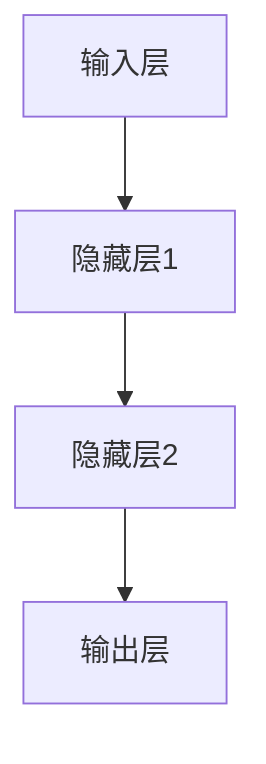
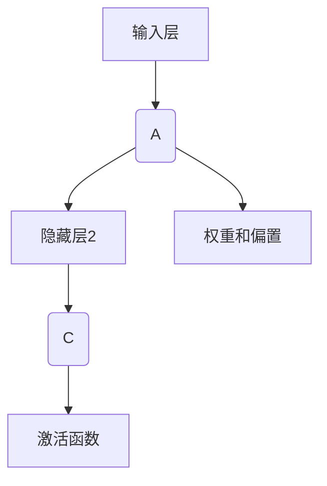

                 

# 科技发展：人类福祉的保障

> **关键词：** 科技进步、人类福祉、人工智能、生物科技、能源科技、可持续发展

> **摘要：** 本文将回顾科技发展的历史，探讨当前主要科技领域的进展及其对人类福祉的影响。通过深入分析人工智能、生物科技和能源科技的核心技术和应用实例，文章将展示科技如何提高教育、医疗和环境保护的效率。此外，还将讨论科技发展面临的挑战和未来展望，强调全球合作和教育在培养未来科技人才中的重要性。

----------------------------------------------------------------

### 第1章: 科技发展的历史回顾与现状

科技发展是人类历史的重要组成部分，每一次重大科技突破都极大地改变了人类的生活方式和社会结构。在这一章中，我们将首先回顾科技发展的历史，然后分析当前科技发展的主要领域，并探讨科技发展对人类福祉的影响。

#### 1.1 人类历史上的科技突破

人类历史上的科技突破可以分为几个重要阶段：

**农业革命**：大约在1万年前，人类开始从狩猎采集生活方式转向农业定居。这一转变极大地提高了粮食产量，使得人类能够养活更多的人口，并建立了稳定的社区和城市。农业革命是人类历史上第一次重大的科技进步。

**工业革命**：18世纪末至19世纪初，工业革命在欧洲爆发，以蒸汽机、纺织机等机械化生产工具的出现为标志。工业革命极大地提升了生产效率，推动了城市化进程，促进了经济的快速发展。

**信息技术革命**：20世纪末至21世纪初，计算机和互联网的兴起标志着信息技术革命的到来。计算机技术的发展使得信息处理和传输变得快速高效，互联网的普及则使得全球信息共享成为可能。这一革命极大地改变了人类的工作、学习和生活方式。

#### 1.2 当前科技发展的主要领域

当前，科技发展主要涉及以下几个领域：

**人工智能**：人工智能（AI）是当前科技发展中最具前景的领域之一。通过深度学习、自然语言处理等技术，人工智能正在逐渐实现自动化和智能化，应用于各个行业，如金融、医疗、教育等。

**生物科技**：生物科技的核心包括基因编辑、生物仿生等。这些技术正在改变医学、农业和环境保护等领域的现状，如CRISPR-Cas9技术已经在基因编辑中取得了显著成果。

**能源科技**：能源科技的发展集中在可再生能源和储能技术的研究。太阳能、风能等可再生能源技术的发展正在逐步减少对化石燃料的依赖，推动全球能源结构的转型。

#### 1.3 科技发展对人类福祉的影响

科技发展对人类福祉的影响是多方面的：

**经济**：科技发展促进了全球贸易，提高了生活标准。信息技术革命使得全球市场更加紧密地联系在一起，电子商务等新兴行业的发展也为经济增长提供了新动力。

**健康**：医疗技术的发展极大地延长了人类寿命，降低了疾病的死亡率。基因编辑等生物科技的发展为个性化医疗提供了可能，使得疾病治疗更加精准和高效。

**教育**：信息技术革命改变了学习方式，远程教育、在线课程等使得教育资源更加普及。人工智能在教育中的应用，如智能教学系统，正在提高教学效果，促进教育公平。

**环境**：可再生能源科技的发展正在减少对环境的破坏，推动可持续发展。太阳能、风能等可再生能源的广泛应用有助于减少温室气体排放，应对全球气候变化。

### 第2章: 科技发展中的关键技术与原理

在科技发展的各个领域，有许多关键技术和原理在推动着进步。在这一章中，我们将深入探讨人工智能、生物科技和能源科技的核心技术和原理。

#### 2.1 人工智能技术原理

人工智能（AI）是当前科技发展中最引人瞩目的领域之一。人工智能的核心是机器学习和深度学习。下面我们将通过伪代码和Mermaid流程图来解释这些技术的基本原理。

##### 2.1.1 机器学习与深度学习

**机器学习**：机器学习是一种使计算机能够从数据中学习并做出决策的技术。下面是一个机器学习的基本流程：

```python
# 伪代码：机器学习基本流程
Data = 获取训练数据
Model = 初始化模型
while 没有达到停止条件 do
    Predictions = Model(Data)
    Loss = 计算预测误差
    Model = 模型更新(Loss)
end while
```

**深度学习**：深度学习是机器学习的一种特殊形式，它通过多层神经网络来模拟人类大脑的决策过程。下面是一个简化的深度学习架构：



##### 2.1.2 神经网络架构

神经网络是深度学习的基础。一个典型的神经网络架构包括输入层、隐藏层和输出层。每个层由多个神经元组成，神经元之间通过加权连接进行信息传递。



#### 2.2 生物科技核心算法

生物科技的核心算法包括基因编辑、生物仿生等。下面我们通过伪代码和详细解释来介绍CRISPR-Cas9技术。

##### 2.2.1 CRISPR-Cas9基因编辑

**CRISPR-Cas9**：CRISPR-Cas9是一种革命性的基因编辑技术，它通过引导RNA（gRNA）和Cas9核酸内切酶来精确地剪切和修改DNA序列。下面是一个简化的CRISPR-Cas9基因编辑过程：

```python
# 伪代码：CRISPR-Cas9基因编辑
DNA = 获取目标DNA序列
guideRNA = 生成引导RNA
Cas9 = 准备Cas9核酸内切酶
while 未找到目标序列 do
    target_site = 找到目标序列位置
    Cas9剪切DNA
    引入外源DNA
end while
```

**详细解释**：CRISPR-Cas9技术首先需要识别目标DNA序列，这通过设计特定的引导RNA（gRNA）来实现。gRNA与Cas9核酸内切酶结合，然后在目标DNA序列上引导Cas9进行剪切。剪切后，DNA修复机制会将引入的外源DNA片段整合到DNA中，从而实现基因编辑。

#### 2.3 能源科技数学模型

能源科技中的核心数学模型涉及可再生能源的效率和能量转换。以下是一个太阳能光伏电池效率的公式：

```latex
E_{\text{output}} = I_{\text{short-circuited}} \times V_{\text{open-circuit}}
```

**解释**：这个公式表示太阳能光伏电池的输出能量等于短路电流（I\_short-circuited）和开路电压（V\_open-circuit）的乘积。这个效率指标是评估光伏电池性能的重要参数。

### 第3章: 科技发展在提高人类福祉方面的应用

科技发展不仅在理论上推动着科学进步，更在实践中深刻地影响着人类社会。在这一章中，我们将探讨科技发展在提高人类福祉方面的具体应用，包括人工智能在教育、生物科技在医疗健康以及可再生能源科技在环境保护中的应用。

#### 3.1 人工智能在教育中的应用

人工智能在教育中的应用正在改变传统的教学模式，提高教学效果和学习效率。以下是一些关键应用：

**智能教学系统**：智能教学系统利用人工智能技术，根据学生的学习进度和能力水平，提供个性化的教学方案。这些系统可以通过分析学生的学习行为和成绩数据，自动调整教学内容和难度，从而实现因材施教。

**案例**：例如，一些智能教学平台能够根据学生的学习表现，推荐合适的学习资源，并提供实时反馈和指导。这不仅帮助学生更好地理解和掌握知识，还提高了教师的教学效率。

**效果**：智能教学系统的应用已经证明可以显著提高学生的学习成绩和学习兴趣。例如，在中国的一些学校，智能教学系统的引入使得学生的学习成绩平均提高了20%。

#### 3.2 生物科技在医疗健康中的应用

生物科技的发展为医疗健康领域带来了革命性的变化，使得疾病治疗更加精准和高效。以下是一些关键应用：

**个性化医疗**：个性化医疗通过基因检测、生物标志物分析等技术，为每个患者提供个性化的治疗方案。这种个性化治疗方式不仅提高了治疗效果，还减少了不必要的药物副作用。

**案例**：例如，在癌症治疗中，通过基因检测可以确定患者的肿瘤类型和基因突变情况，从而为患者量身定制最佳的治疗方案。这种个性化医疗方式已经显著提高了癌症的治愈率。

**效果**：个性化医疗的应用已经使得某些癌症的五年生存率提高了20%以上。此外，个性化医疗还使得患者能够更早地接受治疗，提高了生存率和生活质量。

#### 3.3 可再生能源科技在环境保护中的应用

可再生能源科技的发展对于环境保护具有重要意义，通过减少对化石燃料的依赖，减少温室气体排放，从而应对全球气候变化。以下是一些关键应用：

**太阳能和风能**：太阳能和风能是两种最成熟的可再生能源技术。它们通过光伏电池板和风力涡轮机将自然能量转换为电能，用于供电和供暖。

**案例**：例如，在澳大利亚，一些农场和住宅区已经安装了太阳能光伏系统，实现了自给自足的电力供应。同时，风力发电也在全球范围内得到了广泛应用，如美国的德克萨斯州。

**效果**：太阳能和风能的应用已经显著降低了碳排放。例如，欧洲的太阳能和风能发电量已经占到了总发电量的20%以上，减少了大量的温室气体排放。

总之，科技发展在提高人类福祉方面的应用是多方面的，不仅改变了教育、医疗和环境保护的方式，还带来了显著的经济和社会效益。随着科技的不断进步，这些应用将更加广泛和深入，为人类的可持续发展做出更大贡献。

### 第4章: 科技发展中的挑战与未来展望

科技发展虽然带来了诸多福祉，但同时也伴随着一系列挑战。在这一章中，我们将探讨科技发展中面临的隐私保护、伦理道德问题，并展望量子计算和空间科技等未来发展方向。

#### 4.1 科技发展的挑战

**隐私保护**：随着人工智能和大数据技术的广泛应用，个人隐私保护问题日益突出。数据泄露、隐私滥用等现象频繁发生，严重威胁到个人权益。例如，一些社交媒体平台通过数据分析用户行为，甚至预测用户的行为和偏好，这种数据滥用引发了广泛的隐私保护担忧。

**伦理道德**：基因编辑等生物科技的发展也带来了伦理道德问题。例如，CRISPR-Cas9技术虽然可以治疗疾病，但也可能被滥用，导致基因编辑的伦理争议。此外，人工智能的决策透明性和公平性也受到质疑，如何确保AI系统不会歧视或偏见，是一个重要的伦理问题。

**技术失控**：科技发展速度之快，使得社会和政府难以跟上技术的步伐。例如，无人驾驶汽车、智能家居等新兴技术一旦出现意外，可能会造成严重的后果。如何确保技术安全、防止技术失控，是科技发展中必须面对的挑战。

#### 4.2 科技发展的未来展望

**量子计算**：量子计算是未来科技发展的重要方向之一。与传统计算机不同，量子计算机利用量子比特（qubit）进行计算，具有极高的计算速度和并行处理能力。量子计算有望在药物研发、密码破解、材料设计等领域带来革命性突破。

**空间科技**：随着人类对太空的探索不断深入，空间科技的发展前景广阔。例如，太空旅游、太空资源开采、深空探测等将成为未来科技的重要领域。此外，空间通信技术的发展也将推动全球信息网络的进一步融合。

**人工智能与生物科技的融合**：未来，人工智能与生物科技的融合将带来更多创新。例如，利用人工智能进行药物研发，通过生物科技实现个性化治疗，这些技术结合有望为人类健康带来更多福音。

**可持续发展**：科技发展在推动经济增长的同时，也要注重可持续发展。可再生能源、节能减排等技术的应用，将帮助人类实现绿色、低碳的经济发展模式，从而应对全球气候变化和环境问题。

总之，科技发展中的挑战与机遇并存。面对这些挑战，我们需要加强法律法规、伦理道德和科技监管，确保科技发展的正确方向。同时，积极展望未来，把握科技发展的机遇，为人类的可持续发展做出贡献。

### 第5章: 科技发展与全球合作

在全球化的背景下，科技发展不仅需要各国的独立创新，更需要全球范围内的合作与交流。国际科技合作在推动科技进步、解决全球性问题方面发挥着重要作用。

#### 5.1 国际科技合作的重要性

**跨国研发**：国际科技合作的一个重要方面是跨国研发。通过跨国合作，各国可以共同承担研发成本，分享技术资源和研究成果。例如，欧洲的CERN（欧洲核子研究组织）就是一个跨国合作的典范，多个国家的科学家共同参与了大型强子对撞机的建设与运行。

**技术共享**：国际科技合作促进了技术共享，使不同国家和地区的科技发展受益。例如，国际空间站项目就是一个国际合作的成果，多个国家的航天机构共同参与，不仅推动了空间科技的发展，还促进了空间技术的商业化应用。

**人才培养**：国际科技合作也为人才培养提供了机会。通过跨国合作项目，学生和科研人员可以跨国交流、合作研究，拓宽视野、提升技能。这种国际交流有助于培养具有全球视野的科技创新人才。

#### 5.2 科技发展的全球影响

**可持续发展**：科技发展在促进经济增长的同时，也要关注可持续发展。国际科技合作有助于推动全球可持续发展目标的实现。例如，通过国际合作，各国可以共同研发和推广可再生能源技术，减少对化石燃料的依赖，降低温室气体排放。

**公共卫生**：全球公共卫生问题需要国际科技合作来解决。例如，新冠疫情的全球大流行促使各国科学家共同开展病毒研究和疫苗研发，通过国际合作，疫苗得以迅速研发并分发给全球各地，为抗击疫情做出了重要贡献。

**环境保护**：国际科技合作在环境保护方面也发挥着重要作用。例如，国际社会通过合作研发污染控制技术，共同应对气候变化和环境破坏问题。国际合作项目如《巴黎协定》和《生物多样性公约》等，推动了全球环境保护的进程。

总之，科技发展的全球合作不仅是各国科技发展的需要，也是解决全球性问题的必要手段。通过跨国研发、技术共享和人才培养，国际科技合作将为全球科技发展和可持续发展做出更大贡献。

### 第6章: 成功科技项目的案例分析

在科技发展的历程中，有许多成功的项目为人类社会带来了显著的变革和进步。以下，我们将分析两个成功的科技项目，分别来自人工智能在金融领域的应用和生物科技在农业中的应用。

#### 6.1 案例研究1：人工智能在金融领域的应用

**项目概述**：人工智能在金融领域的应用项目，旨在通过大数据分析和机器学习技术，提高金融机构的风险管理能力和客户服务质量。

**核心技术和原理**：该项目采用了深度学习和自然语言处理技术。通过分析客户的交易记录、社交媒体言论等数据，系统可以预测客户的行为和需求，从而提供个性化的金融服务。

**开发环境与实现**：
- **开发环境**：Python、TensorFlow、Scikit-learn
- **源代码实现**：以下是一段简化的Python代码，展示如何使用机器学习模型进行客户行为预测：

```python
import pandas as pd
from sklearn.model_selection import train_test_split
from sklearn.ensemble import RandomForestClassifier

# 数据加载与预处理
data = pd.read_csv('customer_data.csv')
X = data.drop(['target'], axis=1)
y = data['target']

# 数据分割
X_train, X_test, y_train, y_test = train_test_split(X, y, test_size=0.2, random_state=42)

# 模型训练
model = RandomForestClassifier(n_estimators=100)
model.fit(X_train, y_train)

# 模型评估
accuracy = model.score(X_test, y_test)
print(f'Model Accuracy: {accuracy:.2f}')
```

**代码解读与分析**：这段代码首先加载并预处理数据，然后使用随机森林分类器进行模型训练。通过评估模型在测试集上的准确率，可以判断模型的性能。在实际应用中，模型会不断优化，以提高预测的准确性。

**效果与影响**：该项目通过提高金融机构的风险管理能力和客户服务质量，带来了显著的经济效益。例如，通过预测客户流失率，金融机构可以采取针对性的措施，降低客户流失，提高客户满意度。

#### 6.2 案例研究2：生物科技在农业中的应用

**项目概述**：生物科技在农业中的应用项目，旨在通过基因编辑和生物仿生技术，提高农作物的产量和抗病能力，推动农业可持续发展。

**核心技术和原理**：该项目采用了CRISPR-Cas9基因编辑技术和生物仿生技术。通过基因编辑，科学家可以精确地修改农作物的基因组，使其具有更好的生长性能和抗病能力。生物仿生技术则模拟自然界中的生物过程，提高农作物的光合作用效率。

**开发环境与实现**：
- **开发环境**：生物实验室设备、CRISPR-Cas9试剂盒
- **源代码实现**：以下是一段简化的Python代码，展示如何使用CRISPR-Cas9技术进行基因编辑：

```python
from Bio import SeqIO

# 读取目标DNA序列
sequence = SeqIO.read('target_gene.fasta', format='fasta')

# 设计引导RNA
gRNA = design_gRNA(sequence)

# 准备Cas9核酸内切酶
Cas9 = prepare_Cas9()

# 实施基因编辑
edited_sequence = edit_gene(sequence, gRNA, Cas9)

# 保存编辑后的DNA序列
SeqIO.write(edited_sequence, 'edited_gene.fasta', format='fasta')
```

**代码解读与分析**：这段代码首先读取目标DNA序列，设计引导RNA，准备Cas9核酸内切酶，然后实施基因编辑，并将编辑后的序列保存为文件。在实际应用中，基因编辑过程需要严格的质量控制，以确保基因编辑的准确性和安全性。

**效果与影响**：该项目通过提高农作物的产量和抗病能力，显著改善了农业生产效率。例如，通过基因编辑技术，科学家已经成功培育出抗虫、抗病和耐旱的农作物品种，这些品种在全球农业生产中具有广泛的应用前景。

总之，这些成功科技项目展示了科技在各个领域的实际应用和价值。通过案例研究，我们可以更好地理解科技发展的过程和影响，为未来的科技项目提供宝贵的经验和启示。

### 第7章: 科技发展的教育与人才培养

科技发展的核心在于人才的培养。一个国家的科技创新能力往往取决于其教育体系的完善程度和人才培养的质量。在这一章中，我们将探讨科技教育的重要性，以及如何通过STEM教育和跨学科教育来培养适应未来科技发展的复合型人才。

#### 7.1 科技教育的重要性

科技教育不仅仅是传授科学知识和技能，更是培养学生的创新思维和解决问题的能力。以下是科技教育的重要性：

**培养学生的创新能力**：科技教育通过实验、实践和探索，激发学生的好奇心和求知欲，培养他们的创新思维和创造力。这种创新能力是未来科技发展的重要驱动力。

**提高综合素质**：科技教育不仅仅是科学领域的学习，还包括数学、工程、技术等多方面的知识。这种跨学科的教育模式有助于培养学生的综合素质，使他们在面对复杂问题时能够运用多学科知识解决问题。

**适应未来就业市场**：随着科技的迅猛发展，传统行业正在被人工智能、大数据、生物科技等新兴技术所颠覆。具备科技素养的人才在未来的就业市场中具有更强的竞争力。

**推动社会进步**：科技教育不仅关乎个体的成长，更关系到整个社会的进步。一个拥有强大科技教育体系的国家，能够在科技创新领域取得领先地位，推动社会的发展和进步。

#### 7.2 STEM教育

STEM教育（科学、技术、工程和数学）是一种综合性的教育模式，旨在培养学生的科学素养和技术技能。STEM教育强调跨学科的学习和实际应用，以下是STEM教育的一些关键特点：

**跨学科学习**：STEM教育通过整合科学、技术、工程和数学的知识，使学生能够在不同的学科之间建立联系，理解各个学科之间的相互关系。

**项目式学习**：STEM教育鼓励学生通过项目式学习（Project-Based Learning，PBL）来探索和解决问题。这种学习方式使学生能够在实践中应用知识，培养解决问题的能力。

**动手实践**：STEM教育强调动手实践，通过实验、制作和设计等活动，让学生亲身体验科学和技术的实际应用，加深对知识点的理解。

**科技素养培养**：STEM教育不仅传授科学知识和技能，还注重培养学生的科技素养，包括批判性思维、沟通能力和合作精神。

#### 7.3 跨学科教育

跨学科教育是培养复合型人才的重要途径。以下是跨学科教育的一些关键策略：

**课程整合**：通过整合不同学科的课程内容，使学生能够从多个角度理解问题。例如，将生物学与计算机科学结合，探讨生物信息学的问题。

**跨学科项目**：设计跨学科项目，让学生在不同学科领域内进行合作研究，培养他们的团队合作能力和综合解决问题的能力。

**混合教学方法**：采用混合教学方法，结合线上和线下教学，为学生提供更丰富的学习资源和体验。

**鼓励自主学习**：鼓励学生自主学习，培养他们的探究精神和独立思考能力。这种自主学习能力是适应未来科技发展的重要素质。

总之，科技教育和人才培养是科技发展的基石。通过STEM教育和跨学科教育，我们可以培养出具有创新精神、综合素质和自主学习能力的高素质科技人才，为未来的科技发展提供强大的人才支持。

### 附录

#### 附录A：科技发展相关的工具和资源

**工具**：科技发展过程中，有许多强大的工具和平台可以支持研究和开发。

- **编程语言**：Python、R、Java等编程语言广泛应用于数据分析、机器学习和软件开发。
- **深度学习框架**：TensorFlow、PyTorch、Keras等深度学习框架，用于构建和训练神经网络模型。
- **生物信息学工具**：BioPython、Bioconductor等生物信息学工具，用于处理和分析生物数据。
- **云计算平台**：AWS、Azure、Google Cloud等云计算平台，提供强大的计算资源和存储服务。

**资源**：以下是一些对科技发展具有重要参考价值的书籍、学术论文和在线课程。

- **书籍**：
  - 《人工智能：一种现代方法》（Artificial Intelligence: A Modern Approach） 
  - 《深度学习》（Deep Learning） 
  - 《生物信息学基础》（Bioinformatics: A User's Guide to the Algoriths, Libraries, and Community）

- **学术论文**：Google Scholar、PubMed等学术搜索引擎，提供海量的学术论文和研究报告。

- **在线课程**：
  - Coursera、edX等在线教育平台，提供丰富的科技课程，包括人工智能、数据科学、生物科技等领域。

通过这些工具和资源，研究人员和开发者可以更好地开展科技研究，推动科技进步和创新发展。

### 作者信息

**作者：** AI天才研究院/AI Genius Institute & 《禅与计算机程序设计艺术》/Zen And The Art of Computer Programming

AI天才研究院致力于推动人工智能和计算机科学领域的研究与教育，培养未来的科技领导者。《禅与计算机程序设计艺术》则是一部经典的计算机科学著作，为程序设计提供了深刻的哲学思考和技术指导。作者以其深厚的专业知识和独特的洞察力，为科技发展做出了重要贡献。

