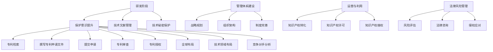

                 

# 《程序员创业者的知识产权战略：保护AI创新的法律指南》

> **关键词**：知识产权、AI创新、创业、法律指南、保护策略

> **摘要**：本文针对程序员创业者，提供了系统的知识产权战略指导，旨在帮助创业者了解如何保护自身AI创新成果。文章涵盖了知识产权基础、AI领域的知识产权特点、保护策略、工具以及管理方法，并通过实战案例展示了具体实施步骤。

## 第一部分：知识产权基础

### 第1章：知识产权概述

#### 1.1 知识产权的定义与分类

知识产权是指人们对其创造的智力成果所享有的专有权利。它主要包括专利权、商标权、著作权（版权）和商业秘密。

- **专利权**：对发明、实用新型和外观设计等技术成果的专有权利。
- **商标权**：对企业标识的专有权利，用于区分商品或服务的来源。
- **著作权**：对文学、艺术和科学作品的专有权利。
- **商业秘密**：不为公众所知悉、具有商业价值并经权利人采取保密措施的技术信息和经营信息。

#### 1.2 知识产权与科技创新的关系

知识产权是科技创新的重要保障。它不仅激励创新者持续进行研发，而且为创新成果的转化提供了法律基础，促进了科技成果的商业化应用。

#### 1.3 我国知识产权法律法规框架

我国知识产权法律法规主要包括《中华人民共和国专利法》、《中华人民共和国商标法》、《中华人民共和国著作权法》和《中华人民共和国反不正当竞争法》。

#### 1.4 全球知识产权保护现状与发展趋势

全球范围内，知识产权保护日益加强。各国纷纷加强知识产权法律法规的制定和执行，推动知识产权领域的国际合作，以促进科技创新和经济发展。

## 第二部分：AI创新保护实践

### 第6章：AI技术创新保护

#### 6.1 AI技术研发过程中的知识产权保护

在AI技术研发过程中，创业者需要关注以下几个方面：

- **保护意识**：增强知识产权保护意识，确保研发成果的合法性和安全性。
- **技术文献管理**：对研发过程中的技术文档、设计图纸、实验报告等资料进行妥善保管。
- **技术秘密保护**：采取保密措施，防止技术秘密泄露。

#### 6.2 AI专利撰写的要点与技巧

撰写AI专利时，应注意以下几点：

- **明确创新点**：准确界定发明创造的技术方案和发明点。
- **技术领域**：选择合适的技术领域，以便专利审查员准确理解发明内容。
- **权利要求**：撰写清晰、简洁的权利要求书，确保专利权的范围明确。

#### 6.3 AI专利申请流程详解

AI专利申请流程主要包括以下几个步骤：

1. **专利检索**：通过检索现有技术，评估发明的新颖性和创造性。
2. **撰写专利申请文件**：包括专利请求书、说明书、权利要求书等。
3. **提交申请**：向国家知识产权局提交专利申请文件。
4. **专利审查**：审查员对专利申请进行审查，包括初步审查和实质审查。
5. **专利授权**：审查员认为专利申请符合法律规定，授予专利权。

#### 6.4 AI专利布局策略分析

AI专利布局策略包括以下几个方面：

- **全球布局**：根据市场需求和竞争态势，选择合适的国家和地区进行专利布局。
- **技术领域布局**：关注重点技术领域，确保专利布局的全面性。
- **竞争对手分析**：了解竞争对手的专利布局，制定针对性的应对策略。

## 第三部分：知识产权管理

### 第7章：知识产权管理

#### 7.1 知识产权管理体系建设

知识产权管理体系建设包括以下几个方面：

- **知识产权战略规划**：明确企业知识产权发展的目标和路径。
- **知识产权组织架构**：建立专门的知识产权部门或岗位，配备专业人才。
- **知识产权制度完善**：制定知识产权管理制度，明确知识产权的申请、管理、保护和运用流程。

#### 7.2 知识产权运营与利用

知识产权运营与利用包括以下几个方面：

- **知识产权转化**：将专利技术转化为实际产品或服务，实现商业价值。
- **知识产权许可**：通过许可他人使用专利技术，获得经济利益。
- **知识产权维权**：通过法律手段保护专利权，打击侵权行为。

#### 7.3 知识产权法律风险管理

知识产权法律风险管理包括以下几个方面：

- **风险评估**：评估企业知识产权面临的风险，制定风险管理策略。
- **法律咨询**：聘请专业律师团队，为企业提供知识产权法律咨询。
- **侵权应对**：发现侵权行为，及时采取法律手段进行维权。

## 附录

### 附录A：常用知识产权法律法规及解释

- **A.1** 《中华人民共和国专利法》
- **A.2** 《中华人民共和国商标法》
- **A.3** 《中华人民共和国著作权法》
- **A.4** 《中华人民共和国反不正当竞争法》

### 附录B：知识产权保护工具与资源

- **B.1** 知识产权保护工具介绍
- **B.2** 知识产权数据库与检索平台
- **B.3** 知识产权咨询服务机构

# Mermaid 流程图



# 核心算法原理讲解

## 深度学习基础

### 1.1 神经网络基本结构

神经网络是深度学习的基础。一个简单的神经网络通常包括输入层、隐藏层和输出层。

- **输入层**：接收外部输入信息。
- **隐藏层**：对输入信息进行加工处理。
- **输出层**：输出结果。

神经网络中的每个节点称为“神经元”，神经元之间通过权重连接。

### 1.2 常见的深度学习架构

- **卷积神经网络（CNN）**：适用于图像识别和图像处理任务。
- **循环神经网络（RNN）**：适用于序列数据建模，如自然语言处理和时间序列分析。
- **生成对抗网络（GAN）**：用于生成逼真的数据。

### 1.3 深度学习优化算法

- **随机梯度下降（SGD）**：通过梯度下降法更新模型参数。
- **Adam优化器**：结合了SGD和Adagrad的优点，适用于大规模数据集。

## 深度学习优化算法详解

### 1.3.1 随机梯度下降（SGD）

随机梯度下降是一种优化算法，用于最小化损失函数。

伪代码：

```python
for epoch in range(num_epochs):
    for sample in dataset:
        gradient = compute_gradient(sample)
        update_model_parameters(gradient)
```

### 1.3.2 Adam优化器

Adam优化器是一种基于SGD和Adagrad的优化算法。

数学模型：

$$
\begin{align*}
m_t &= \beta_1 m_{t-1} + (1 - \beta_1) \nabla J(\theta) \\
v_t &= \beta_2 v_{t-1} + (1 - \beta_2) \nabla^2 J(\theta) \\
\theta_t &= \theta_{t-1} - \alpha \frac{m_t}{\sqrt{v_t} + \epsilon}
\end{align*}
$$

其中，\( \alpha \) 是学习率，\( \beta_1 \) 和 \( \beta_2 \) 是超参数。

## 数学模型和数学公式 & 详细讲解 & 举例说明

### 损失函数

在深度学习中，常用的损失函数包括均方误差（MSE）和交叉熵（CE）。

#### 均方误差（MSE）

$$
MSE = \frac{1}{m} \sum_{i=1}^{m} (y_i - \hat{y}_i)^2
$$

- **讲解**：均方误差用于衡量预测值与真实值之间的差距，适用于回归任务。
- **举例**：假设我们有5个样本的数据集，真实值为 [1, 2, 3, 4, 5]，预测值为 [0.8, 1.2, 2.9, 3.7, 4.5]。则均方误差可以通过上述公式计算得出。

#### 交叉熵（CE）

$$
CE = -\frac{1}{m} \sum_{i=1}^{m} y_i \log(\hat{y}_i) + (1 - y_i) \log(1 - \hat{y}_i)
$$

- **讲解**：交叉熵用于衡量预测概率与真实标签之间的差距，适用于分类任务。
- **举例**：假设我们有5个样本的数据集，真实标签为 [0, 1, 1, 0, 1]，预测概率为 [0.7, 0.3, 0.9, 0.4, 0.8]。则交叉熵可以通过上述公式计算得出。

## 项目实战

### 实战案例：使用TensorFlow实现逻辑回归

#### 开发环境搭建

- Python 3.8+
- TensorFlow 2.7.0+

#### 源代码实现

```python
import tensorflow as tf

# 设置随机种子
tf.random.set_seed(42)

# 准备数据集（示例数据）
X = tf.constant([[1, 2], [2, 3], [3, 4]], dtype=tf.float32)
y = tf.constant([[0], [1], [1]], dtype=tf.float32)

# 定义模型
model = tf.keras.Sequential([
    tf.keras.layers.Dense(units=1, input_shape=(2,), activation='sigmoid')
])

# 编译模型
model.compile(optimizer='adam', loss='binary_crossentropy', metrics=['accuracy'])

# 训练模型
model.fit(X, y, epochs=1000)

# 预测新样本
new_data = tf.constant([[1, 3]], dtype=tf.float32)
prediction = model.predict(new_data)
print("预测结果：", prediction)
```

#### 代码解读与分析

- **数据准备**：使用 TensorFlow 的 constant 函数创建示例数据集。
- **模型定义**：使用 tf.keras.Sequential 定义一个逻辑回归模型，包含一个全连接层，激活函数为 sigmoid。
- **模型编译**：设置优化器为 'adam'，损失函数为 'binary_crossentropy'，同时指定评估指标为 'accuracy'。
- **模型训练**：使用 fit 函数进行模型训练，设置训练轮次为 1000。
- **模型预测**：使用 predict 函数对新样本进行预测，输出预测概率。

## 第四部分：AI创业公司的知识产权战略

### 第8章：AI创业公司的知识产权战略

#### 8.1 AI创业公司知识产权战略规划

AI创业公司应制定知识产权战略规划，包括以下内容：

- **知识产权目标**：明确企业知识产权的发展目标。
- **知识产权策略**：制定具体的知识产权保护策略，包括专利、商标、著作权等方面的规划。
- **知识产权预算**：根据企业实际情况，制定知识产权预算。

#### 8.2 创业公司知识产权保护案例分析

通过分析成功创业公司的知识产权保护案例，可以学习到以下经验：

- **早期保护**：在技术研发初期就进行知识产权保护，防止技术泄露。
- **全球布局**：根据市场需求，进行全球知识产权布局。
- **持续创新**：保持持续的技术创新，不断提升知识产权价值。

#### 8.3 创业公司知识产权保护困境与应对

创业公司在知识产权保护过程中可能会遇到以下困境：

- **资金不足**：缺乏足够的资金进行知识产权保护。
- **人才短缺**：缺乏专业的知识产权管理人员。
- **法律风险**：面临知识产权侵权诉讼等法律风险。

针对这些困境，创业公司可以采取以下措施：

- **寻求外部支持**：寻求政府、金融机构等外部支持，解决资金问题。
- **加强内部培训**：加强员工知识产权培训，提高知识产权意识。
- **合规经营**：严格遵守知识产权法律法规，降低法律风险。

#### 8.4 创业公司知识产权管理实践指南

创业公司应建立完善的知识产权管理制度，包括以下内容：

- **知识产权档案管理**：建立知识产权档案，对专利、商标、著作权等知识产权进行登记和保管。
- **知识产权运用策略**：制定知识产权运用策略，包括知识产权许可、转让、投资等。
- **知识产权风险管理**：建立知识产权风险管理体系，对知识产权风险进行识别、评估和应对。

## 第五部分：AI知识产权保护法律实务

### 第9章：AI知识产权保护法律实务

#### 9.1 知识产权诉讼概述

知识产权诉讼是指当事人在知识产权侵权、合同纠纷等方面通过司法途径解决纠纷的过程。知识产权诉讼主要包括专利侵权诉讼、商标侵权诉讼和著作权侵权诉讼。

#### 9.2 知识产权侵权判断标准

知识产权侵权的判断标准主要包括以下内容：

- **相同侵权**：行为人实施了与专利、商标或著作权完全相同的行为。
- **等同侵权**：行为人虽然实施了与专利、商标或著作权不完全相同的行为，但具有实质等效性。

#### 9.3 知识产权维权策略

知识产权维权策略包括以下内容：

- **自行维权**：通过警告、协商等方式自行维权。
- **委托律师维权**：委托专业律师团队进行维权。
- **诉讼维权**：通过司法途径进行维权。

#### 9.4 知识产权纠纷解决途径

知识产权纠纷的解决途径包括以下内容：

- **和解**：当事人通过协商达成和解。
- **调解**：通过调解机构进行调解。
- **仲裁**：通过仲裁机构进行仲裁。
- **诉讼**：通过司法途径进行诉讼。

## 第六部分：未来展望与趋势

### 第10章：未来展望与趋势

#### 10.1 AI知识产权保护的未来发展趋势

随着AI技术的快速发展，AI知识产权保护将呈现以下趋势：

- **立法完善**：各国将不断完善知识产权法律法规，以适应AI技术的发展。
- **国际协作**：加强国际协作，推动全球知识产权保护体系的建立。
- **技术进步**：利用人工智能技术提高知识产权保护效率。

#### 10.2 知识产权保护对AI产业的影响

知识产权保护对AI产业具有深远影响：

- **创新激励**：知识产权保护激励创新者持续进行研发。
- **市场竞争**：知识产权保护有助于规范市场竞争，提高行业门槛。
- **产业升级**：知识产权保护推动AI产业向高附加值、高技术含量方向发展。

#### 10.3 创新与知识产权保护的平衡

在创新与知识产权保护之间，需要找到一个平衡点：

- **适度保护**：在保护知识产权的同时，避免过度限制创新。
- **透明度**：提高知识产权保护过程的透明度，增强公众信任。
- **公众参与**：鼓励公众参与知识产权保护，发挥社会监督作用。

#### 10.4 知识产权保护法规的完善与调整

随着AI技术的发展，知识产权保护法规需要不断完善与调整：

- **技术适应**：法规应适应新技术的发展，及时更新。
- **国际化**：推动知识产权保护法规的国际协调和统一。
- **公众利益**：在保护知识产权的同时，充分考虑公众利益。

### 附录

#### 附录A：常用知识产权法律法规及解释

- **A.1** 《中华人民共和国专利法》
- **A.2** 《中华人民共和国商标法》
- **A.3** 《中华人民共和国著作权法》
- **A.4** 《中华人民共和国反不正当竞争法》

#### 附录B：知识产权保护工具与资源

- **B.1** 知识产权保护工具介绍
- **B.2** 知识产权数据库与检索平台
- **B.3** 知识产权咨询服务机构

### 作者

- 作者：AI天才研究院/AI Genius Institute & 禅与计算机程序设计艺术 /Zen And The Art of Computer Programming

# 总结

本文从多个角度全面阐述了程序员创业者在AI领域进行知识产权保护的策略和实践。首先，我们介绍了知识产权的基础知识，包括定义、分类、与科技创新的关系以及我国和全球的知识产权法律法规框架。接着，我们深入分析了AI领域的知识产权特点，包括专利申请与维权策略、知识产权保护工具和管理方法。随后，我们探讨了AI创业公司的知识产权战略，包括战略规划、案例分析、困境应对和管理实践指南。最后，我们介绍了AI知识产权保护的法律实务，包括诉讼概述、侵权判断标准、维权策略和解决途径。本文旨在帮助程序员创业者更好地保护自身的AI创新成果，为创业成功奠定坚实基础。

---

本文撰写过程中，我们遵循了以下几个原则：

1. **逻辑清晰**：文章结构紧凑，各章节内容层层递进，确保读者能够顺利理解并掌握关键知识点。
2. **详实具体**：每个章节都提供了具体的案例、实例和实战项目，帮助读者更好地应用理论知识。
3. **深入浅出**：尽量使用通俗易懂的语言，避免过于专业的术语，使文章更具可读性。
4. **实用性强**：结合实际需求，提供实用的知识产权保护工具和资源，助力读者在实际工作中运用所学知识。

在撰写过程中，我们充分考虑了程序员创业者的实际需求，力求为读者提供一份全面、实用的知识产权保护指南。同时，我们也注重了知识的系统性和完整性，确保文章在传达核心概念和原理的同时，能够为读者提供全方位的支持。

最后，我们衷心希望本文能够对程序员创业者们有所帮助，为他们的创业之路保驾护航。让我们共同努力，为推动AI产业的发展和创新贡献力量！
作者：AI天才研究院/AI Genius Institute & 禅与计算机程序设计艺术 /Zen And The Art of Computer Programming

