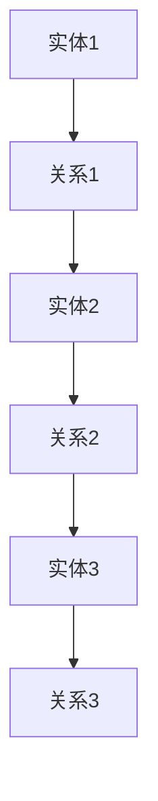
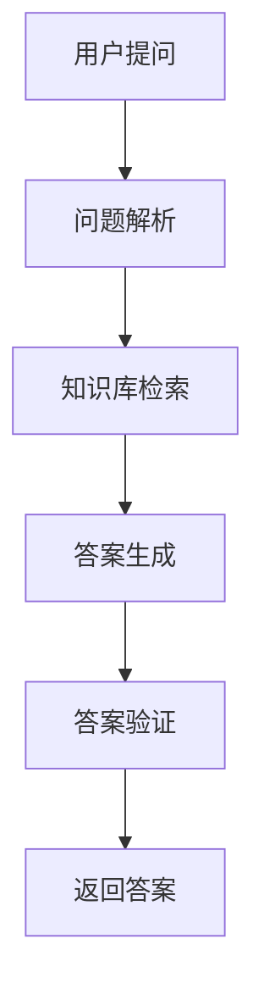

                 

### 《程序员如何利用知识发现引擎提高学习成果》

> **关键词：** 知识发现引擎、学习成果、程序员、学习效率、技术实践、未来趋势

> **摘要：** 本文章旨在探讨程序员如何利用知识发现引擎（KDE）提高学习成果。通过详细分析KDE的基础、技术原理、知识表示与语义分析、性能优化以及应用实践，本文将为程序员提供实际操作指南，并探讨知识发现引擎在人工智能和大数据时代的未来趋势与挑战。

#### 目录大纲

#### 第一部分：知识发现引擎基础

##### 第1章：知识发现引擎概述

- 1.1 知识发现引擎的定义与重要性
- 1.2 知识发现引擎的基本架构
- 1.3 知识发现引擎的应用领域
- 1.4 知识发现引擎的发展历程

##### 第2章：知识发现引擎的技术原理

- 2.1 数据预处理技术
- 2.2 数据挖掘算法介绍
- 2.3 特征选择与降维技术
- 2.4 常见的关联规则挖掘算法

##### 第3章：知识表示与语义分析

- 3.1 知识图谱的构建与表示
- 3.2 自然语言处理技术
- 3.3 文本分类与聚类算法
- 3.4 基于语义分析的问答系统

##### 第4章：知识发现引擎的性能优化

- 4.1 数据库性能优化
- 4.2 算法效率优化
- 4.3 并行与分布式计算
- 4.4 云计算与大数据技术

#### 第二部分：知识发现引擎应用实践

##### 第5章：开发者如何使用知识发现引擎

- 5.1 开发环境搭建
- 5.2 常用知识发现引擎框架
- 5.3 知识发现引擎项目实战
- 5.4 开发者经验分享

##### 第6章：案例研究

- 6.1 案例一：电商平台的用户行为分析
- 6.2 案例二：社交媒体内容分析
- 6.3 案例三：金融领域的风险管理
- 6.4 案例四：医疗数据挖掘应用

##### 第7章：知识发现引擎的未来趋势与挑战

- 7.1 人工智能与知识发现融合
- 7.2 大数据时代的知识发现
- 7.3 开源与商业化知识发现引擎
- 7.4 挑战与解决方案探讨

#### 附录

##### 附录A：知识发现引擎开源工具介绍

- A.1 Apache Flink
- A.2 Apache Spark
- A.3 Hadoop
- A.4 其他开源工具简介

##### 附录B：知识发现引擎常见算法伪代码

- B.1 K-means算法
- B.2 Apriori算法
- B.3 PageRank算法
- B.4 其他算法伪代码

#### 第一部分：知识发现引擎基础

##### 第1章：知识发现引擎概述

###### 1.1 知识发现引擎的定义与重要性

知识发现引擎（Knowledge Discovery Engine，简称KDE）是近年来在数据挖掘和人工智能领域迅速崛起的一种技术。它是一种自动化的系统，用于从大量数据中识别出有意义的模式、关联和规律，进而为用户提供洞见和决策支持。

在程序员的学习过程中，KDE的重要性体现在以下几个方面：

1. **提高学习效率**：KDE能够自动分析大量数据，帮助程序员更快地发现关键知识点和关联关系，从而提高学习效率。
2. **增强问题解决能力**：通过KDE，程序员可以快速了解现有技术方案、最佳实践和经验教训，为问题解决提供有力支持。
3. **促进知识共享与传播**：KDE可以帮助程序员构建个人知识图谱，实现知识的结构化存储和共享，从而促进团队内部的知识传播。

###### 1.2 知识发现引擎的基本架构

知识发现引擎的基本架构可以分为以下几个核心组件：

1. **数据源**：包括各种结构化和非结构化数据，如关系数据库、NoSQL数据库、文本、图像、音频等。
2. **数据预处理模块**：对原始数据进行清洗、集成、转换等操作，使其满足后续数据挖掘和分析的需求。
3. **数据挖掘模块**：运用各种数据挖掘算法（如关联规则挖掘、聚类分析、分类分析等）对预处理后的数据进行分析，提取有价值的信息。
4. **结果解释与可视化模块**：将数据挖掘结果进行可视化展示，帮助用户理解分析结果，并生成报告。
5. **知识表示与语义分析模块**：通过知识图谱、自然语言处理等技术，对分析结果进行语义层面的理解和表示，实现智能问答和知识推理。

###### 1.3 知识发现引擎的应用领域

知识发现引擎在多个领域具有广泛的应用前景：

1. **商业智能**：通过分析用户行为、销售数据等，为企业提供个性化的产品推荐、市场策略和风险管理。
2. **社交媒体分析**：对社交媒体上的用户评论、情感、趋势等进行分析，帮助企业了解用户需求、优化产品和服务。
3. **金融领域**：对金融交易数据、信用记录等进行分析，实现风险管理、信用评估和投资决策。
4. **医疗健康**：对医疗数据进行分析，辅助医生进行诊断、制定治疗方案，提高医疗效率。
5. **智能交通**：通过分析交通数据，优化交通路线、提高交通管理效率，减少交通拥堵。

###### 1.4 知识发现引擎的发展历程

知识发现引擎的发展历程可以追溯到20世纪80年代的数据挖掘概念提出。以下是KDE发展的几个重要阶段：

1. **数据挖掘的早期阶段**：20世纪80年代，数据挖掘概念被提出，学者们开始研究如何从大量数据中提取有价值的信息。
2. **关联规则挖掘**：20世纪90年代，Apriori算法等关联规则挖掘算法的提出，使得KDE在商业智能领域得到广泛应用。
3. **聚类分析与分类分析**：随着机器学习技术的发展，聚类分析、分类分析等算法逐渐成熟，KDE的应用领域得到进一步拓展。
4. **现代知识发现引擎的发展**：21世纪初，随着大数据和云计算技术的兴起，知识发现引擎逐渐走向分布式计算、并行计算和实时处理，应用场景更加丰富。

综上所述，知识发现引擎在程序员的学习过程中具有重要意义。通过了解KDE的基本架构、技术原理和应用领域，程序员可以更好地利用这一工具提高学习成果。在接下来的章节中，我们将进一步探讨知识发现引擎的技术原理和具体实现。

---

###### 1.2 知识发现引擎的基本架构

知识发现引擎的基本架构可以分为以下几个核心组件：

1. **数据源**：包括各种结构化和非结构化数据，如关系数据库、NoSQL数据库、文本、图像、音频等。

2. **数据预处理模块**：对原始数据进行清洗、集成、转换等操作，使其满足后续数据挖掘和分析的需求。

3. **数据挖掘模块**：运用各种数据挖掘算法（如关联规则挖掘、聚类分析、分类分析等）对预处理后的数据进行分析，提取有价值的信息。

4. **结果解释与可视化模块**：将数据挖掘结果进行可视化展示，帮助用户理解分析结果，并生成报告。

5. **知识表示与语义分析模块**：通过知识图谱、自然语言处理等技术，对分析结果进行语义层面的理解和表示，实现智能问答和知识推理。

**Mermaid流程图：知识发现引擎的基本架构**

mermaid
graph TB
    A[数据源] --> B[数据预处理]
    B --> C[数据挖掘]
    C --> D[结果解释与可视化]
    D --> E[知识表示与语义分析]

**核心组件介绍**

1. **数据源**：数据源是知识发现引擎的起点，包括各种结构化和非结构化数据，如关系数据库（如MySQL、PostgreSQL）、NoSQL数据库（如MongoDB、Cassandra）、文本数据（如HTML、PDF）、图像数据（如JPEG、PNG）和音频数据（如MP3、WAV）等。

2. **数据预处理模块**：数据预处理是数据挖掘过程中至关重要的一步，主要包括数据清洗、集成和转换等操作。数据清洗涉及去除缺失值、异常值和重复值等；数据集成则将来自不同数据源的数据进行整合；数据转换包括数据格式的标准化、归一化和特征工程等，以便后续的数据挖掘分析。

3. **数据挖掘模块**：数据挖掘模块是知识发现引擎的核心部分，包括多种数据挖掘算法，如关联规则挖掘、聚类分析、分类分析、异常检测等。这些算法通过对预处理后的数据进行挖掘，从中提取出有价值的信息和知识。

4. **结果解释与可视化模块**：结果解释与可视化模块将数据挖掘结果以可视化的形式呈现给用户，使其更容易理解和分析。常见的可视化方法包括图表（如条形图、折线图、饼图等）、地图、热力图等。此外，该模块还可以生成报告，帮助用户总结分析结果。

5. **知识表示与语义分析模块**：知识表示与语义分析模块利用知识图谱、自然语言处理等技术，对分析结果进行语义层面的理解和表示。知识图谱是一种结构化的知识表示方法，通过实体、属性和关系进行描述；自然语言处理技术则用于处理文本数据，实现文本分类、聚类、情感分析和命名实体识别等功能。通过这些技术，知识发现引擎可以实现智能问答和知识推理，为用户提供更深入的洞察。

通过上述核心组件的协同工作，知识发现引擎能够从大量数据中挖掘出有价值的信息，为程序员提供学习、决策和问题解决的强大支持。

###### 1.3 知识发现引擎的应用领域

知识发现引擎（KDE）在多个领域具有广泛的应用前景，这些应用不仅提高了数据处理和分析的效率，还为各行业带来了深刻的变革。以下是知识发现引擎在主要应用领域的概述：

1. **商业智能**：商业智能（Business Intelligence，简称BI）是知识发现引擎应用最为广泛的领域之一。通过分析大量的销售数据、客户反馈、市场趋势等信息，企业可以更准确地了解市场需求，优化产品策略，提高客户满意度。知识发现引擎可以帮助企业实现以下目标：
   - **市场预测**：利用历史数据和市场趋势，预测未来的市场需求，为企业制定有效的营销策略。
   - **客户细分**：通过对客户行为数据的分析，将客户划分为不同的群体，从而提供更个性化的服务和产品推荐。
   - **风险控制**：分析财务数据和交易行为，帮助企业识别潜在的风险，及时调整经营策略。

2. **社交媒体分析**：社交媒体平台每天产生海量用户数据，知识发现引擎可以帮助企业和研究人员挖掘这些数据中的价值，了解用户需求、情感和趋势。以下是社交媒体分析中的一些具体应用：
   - **情感分析**：通过分析用户评论、帖子等文本数据，了解用户对产品、服务或事件的情感倾向，帮助企业优化产品和服务。
   - **趋势预测**：分析社交媒体上的话题、标签和用户互动，预测可能流行的趋势，为企业提供市场机会。
   - **社区管理**：通过分析用户行为和互动，识别社区中的关键用户和意见领袖，帮助企业更好地管理社交媒体社区。

3. **金融领域**：在金融领域，知识发现引擎可以帮助金融机构提高风险控制能力、优化投资策略和提升客户服务。以下是一些具体应用案例：
   - **信用评估**：通过对客户的信用历史、交易行为等数据进行分析，预测客户未来的信用风险，为信用评级和贷款审批提供依据。
   - **交易监控**：实时分析交易数据，识别异常交易行为，防止欺诈和洗钱等违法行为。
   - **投资决策**：利用历史数据和市场趋势，为投资组合提供优化建议，提高投资回报。

4. **医疗健康**：在医疗健康领域，知识发现引擎可以帮助医生和研究人员挖掘医疗数据中的价值，提高诊断和治疗的准确性和效率。以下是一些具体应用：
   - **疾病预测**：通过分析患者的病历、基因数据等，预测患者未来可能患有的疾病，帮助医生提前制定预防措施。
   - **个性化治疗**：根据患者的病史、基因和临床数据，为患者制定个性化的治疗方案，提高治疗效果。
   - **健康监测**：通过分析患者的生活习惯、运动数据等，为患者提供个性化的健康建议，促进健康生活方式。

5. **智能交通**：智能交通系统利用知识发现引擎分析交通数据，优化交通管理、减少拥堵和提升交通效率。以下是一些具体应用：
   - **交通流量预测**：通过分析历史交通数据和实时监控数据，预测未来的交通流量，为交通管理和调度提供依据。
   - **路线优化**：根据实时交通状况，为驾驶员提供最优的行驶路线，减少行车时间和燃油消耗。
   - **事故预警**：分析交通事故数据，识别潜在的事故风险，提前预警并采取措施，防止交通事故的发生。

通过以上应用领域的介绍，我们可以看到知识发现引擎在提高数据处理和分析效率、为行业带来深刻变革方面具有巨大的潜力。在接下来的章节中，我们将进一步探讨知识发现引擎的技术原理和具体实现。

###### 1.4 知识发现引擎的发展历程

知识发现引擎（KDE）的发展历程可以追溯到20世纪80年代的数据挖掘概念提出。以下是KDE发展的几个重要阶段：

1. **数据挖掘的早期阶段**：20世纪80年代，数据挖掘（Data Mining）这一概念被提出。学者们开始研究如何从大量数据中提取出有价值的信息，这一阶段主要以规则发现和聚类分析为主。代表性的算法有K-means聚类和Apriori算法。

2. **关联规则挖掘**：20世纪90年代，随着数据库和零售业的发展，关联规则挖掘（Association Rule Mining）成为数据挖掘领域的一个重要分支。Apriori算法的提出使得从大规模交易数据中提取关联规则变得可行。这一阶段，数据挖掘的应用场景逐渐从理论研究走向实际应用。

3. **机器学习与数据挖掘的结合**：21世纪初，随着机器学习技术的发展，数据挖掘领域开始融入机器学习算法。决策树、支持向量机（SVM）和神经网络等算法逐渐应用于数据挖掘。这一阶段，数据挖掘技术开始向自动化、智能化方向发展。

4. **大数据与分布式计算**：随着互联网和物联网的普及，数据量呈现出爆炸式增长，大数据（Big Data）时代来临。分布式计算和云计算技术的应用使得知识发现引擎能够处理海量数据。Hadoop和Spark等分布式计算框架成为知识发现引擎的重要工具。

5. **知识表示与语义分析**：近年来，知识表示与语义分析（Knowledge Representation and Semantic Analysis）成为知识发现引擎研究的热点。通过知识图谱、自然语言处理等技术，知识发现引擎能够实现更高层次的数据理解和推理，从而为用户提供更深入的洞见和决策支持。

6. **实时与混合知识发现**：随着物联网和实时数据采集技术的进步，实时知识发现（Real-Time Knowledge Discovery）逐渐成为研究焦点。混合知识发现（Hybrid Knowledge Discovery）则结合了传统离线数据挖掘和实时数据挖掘的优点，为复杂动态环境下的知识发现提供了新的解决方案。

综上所述，知识发现引擎经历了从早期的研究阶段到广泛应用的发展历程，其技术原理和应用场景不断演变和创新。在未来的发展中，知识发现引擎将继续融入人工智能、大数据和云计算等新兴技术，为各个领域的智能化和自动化带来更多机遇和挑战。

### 第2章：知识发现引擎的技术原理

知识发现引擎的技术原理是理解和应用这一工具的关键。本章将详细探讨数据预处理技术、数据挖掘算法、特征选择与降维技术以及常见的关联规则挖掘算法，帮助程序员深入理解KDE的技术基础。

#### 2.1 数据预处理技术

数据预处理是知识发现引擎中的关键步骤，其目的是确保数据的质量和一致性，为后续的数据挖掘和分析提供良好的数据基础。以下是数据预处理的主要技术：

1. **数据清洗**：数据清洗是指去除数据中的错误、异常和重复值等，以提高数据的质量。主要方法包括：
   - **缺失值处理**：对于缺失值，可以采用插值、均值替换、中位数替换等方法进行填补。
   - **异常值处理**：识别并处理异常值，可以采用统计学方法（如标准差法、Z分数法等）或基于专家知识的方法。
   - **重复值处理**：去除重复数据，确保数据的一致性。

2. **数据集成**：数据集成是指将来自多个数据源的数据进行整合，形成一个统一的数据视图。主要方法包括：
   - **数据融合**：将多个数据源中的数据合并，解决数据之间的不一致性和冗余。
   - **数据规范化**：将不同数据源的数据进行规范化处理，使其符合统一的数据格式和标准。

3. **数据转换**：数据转换是指将原始数据转化为适合数据挖掘和分析的格式。主要方法包括：
   - **特征工程**：通过特征提取和特征选择，将原始数据转化为对分析任务有用的特征。
   - **数据归一化**：通过缩放或平移数据，使其满足特定的统计分布，如正态分布。
   - **离散化**：将连续数据划分为离散的类别，以便进行分类和聚类分析。

**示例：缺失值处理**
```python
# 假设我们有一组数据data，其中存在缺失值
data = [[1, 2], [3, None], [5, 6], [None, 8]]

# 使用平均值填补缺失值
import numpy as np
import random

def fill_missing_values(data, replace='mean'):
    for i, row in enumerate(data):
        for j, value in enumerate(row):
            if value is None:
                if replace == 'mean':
                    # 计算列的平均值
                    column_avg = np.mean([row[j] for row in data if row[j] is not None])
                    data[i][j] = column_avg
                elif replace == 'random':
                    # 随机填补
                    data[i][j] = random.randint(0, 10)
    return data

filled_data = fill_missing_values(data)
print(filled_data)
```

**示例：数据归一化**
```python
# 假设我们有一组数据data，需要对其进行归一化处理
data = [[1, 2], [3, 4], [5, 6]]

def normalize_data(data):
    max_values = [max(column) for column in zip(*data)]
    min_values = [min(column) for column in zip(*data)]
    normalized_data = []
    for row in data:
        normalized_row = [(value - min_value) / (max_value - min_value) for value, min_value, max_value in zip(row, min_values, max_values)]
        normalized_data.append(normalized_row)
    return normalized_data

normalized_data = normalize_data(data)
print(normalized_data)
```

#### 2.2 数据挖掘算法介绍

数据挖掘算法是知识发现引擎的核心，它们通过分析大量数据，从中提取出有价值的信息和知识。以下是几种常见的数据挖掘算法：

1. **关联规则挖掘**：关联规则挖掘是一种用于发现数据项之间潜在关联关系的方法。最常见的算法包括Apriori算法和FP-growth算法。

2. **聚类分析**：聚类分析是一种无监督学习方法，用于将数据分为若干个群组，使得同一群组内的数据对象彼此相似，而不同群组的数据对象之间差异较大。常用的聚类算法包括K-means、DBSCAN和层次聚类。

3. **分类分析**：分类分析是一种有监督学习方法，用于将数据分为预定义的类别。常用的分类算法包括决策树、随机森林、支持向量机和K-近邻算法。

**关联规则挖掘算法：Apriori算法**

Apriori算法是一种经典的关联规则挖掘算法，它基于以下两个基本性质：
1. **支持度**：一个规则的支持度表示在所有数据记录中，同时包含前件和后件的数据记录的比例。
2. **置信度**：一个规则的置信度表示在包含前件的数据记录中，同时包含后件的数据记录的比例。

**伪代码：Apriori算法**

```python
# 输入：data（数据集），min_support（最小支持度），min_confidence（最小置信度）
def Apriori(data, min_support, min_confidence):
    # 步骤1：生成频繁项集
    frequent_itemsets = generate_frequent_itemsets(data, min_support)
    
    # 步骤2：生成关联规则
    rules = generate_association_rules(frequent_itemsets, min_confidence)
    
    return rules

# 生成频繁项集
def generate_frequent_itemsets(data, min_support):
    # 计算每个项集的支持度
    support_counts = calculate_support(data)
    # 保留支持度大于最小支持度的频繁项集
    frequent_itemsets = {itemset: count for itemset, count in support_counts.items() if count >= min_support}
    return frequent_itemsets

# 生成关联规则
def generate_association_rules(frequent_itemsets, min_confidence):
    rules = []
    for itemset in frequent_itemsets:
        for i in range(1, len(itemset)):
            antecedents = itemset[:i]
            consequents = itemset[i:]
            confidence = calculate_confidence(frequent_itemsets, antecedents, consequents, min_confidence)
            if confidence >= min_confidence:
                rules.append((antecedents, consequents, confidence))
    return rules

# 计算项集支持度
def calculate_support(data, itemset):
    support = len([record for record in data if set(itemset).issubset(record)]) / len(data)
    return support

# 计算规则置信度
def calculate_confidence(frequent_itemsets, antecedents, consequents, min_confidence):
    confidence = frequent_itemsets[antecedents] / frequent_itemsets[antecedents.union(consequents)]
    if confidence < min_confidence:
        return None
    return confidence
```

**聚类算法：K-means算法**

K-means算法是一种典型的聚类算法，其目标是找到一个由K个簇组成的模型，使得每个簇内的数据对象尽可能相似，而不同簇的数据对象之间尽可能不同。

**伪代码：K-means算法**

```python
# 输入：data（数据集），k（簇数）
def KMeans(data, k):
    # 步骤1：初始化聚类中心
    centroids = initialize_centroids(data, k)
    
    # 步骤2：迭代更新聚类中心
    while not_converged(centroids):
        # 步骤3：重新分配数据点
        new_assignments = assign_points_to_clusters(data, centroids)
        
        # 步骤4：更新聚类中心
        centroids = update_centroids(new_assignments, k)
    
    return centroids, new_assignments

# 初始化聚类中心
def initialize_centroids(data, k):
    centroids = random.sample(data, k)
    return centroids

# 重新分配数据点
def assign_points_to_clusters(data, centroids):
    new_assignments = {}
    for point in data:
        distances = [euclidean_distance(point, centroid) for centroid in centroids]
        new_assignments[point] = centroids[distances.index(min(distances))]
    return new_assignments

# 更新聚类中心
def update_centroids(new_assignments, k):
    new_centroids = []
    for i in range(k):
        cluster_points = [point for point, cluster in new_assignments.items() if cluster == centroids[i]]
        if cluster_points:
            new_centroid = sum(cluster_points) / len(cluster_points)
            new_centroids.append(new_centroid)
        else:
            new_centroids.append(centroids[i])
    return new_centroids

# 欧几里得距离
def euclidean_distance(point1, point2):
    return np.sqrt(sum([(x - y) ** 2 for x, y in zip(point1, point2)]))
```

**分类算法：决策树算法**

决策树是一种常见的分类算法，它通过一系列的判断来将数据划分为不同的类别。每个节点代表一个特征，每个分支代表该特征的取值。

**伪代码：决策树算法**

```python
# 输入：data（数据集），labels（标签）
def build_decision_tree(data, labels):
    if all(label == labels[0] for label in labels):
        return leaf_node(labels[0])
    if not data:
        return leaf_node('未知')
    
    best_feature, best_threshold = find_best_split(data, labels)
    tree = {}
    tree[best_feature] = {}
    for threshold in best_threshold:
        subset_data, subset_labels = split_data(data, labels, best_feature, threshold)
        tree[best_feature][threshold] = build_decision_tree(subset_data, subset_labels)
    
    return tree

# 寻找最佳分割
def find_best_split(data, labels):
    best_feature = None
    best_threshold = None
    max_information_gain = -1
    
    for feature in data[0]:
        thresholds = [value for value in set([row[feature] for row in data])]
        for threshold in thresholds:
            left_data = [row for row in data if row[feature] <= threshold]
            right_data = [row for row in data if row[feature] > threshold]
            left_labels = [label for label in labels if row in left_data]
            right_labels = [label for label in labels if row in right_data]
            information_gain = information_gain_weighted_avg(left_labels, right_labels, labels)
            if information_gain > max_information_gain:
                max_information_gain = information_gain
                best_feature = feature
                best_threshold = threshold
    
    return best_feature, best_threshold

# 信息增益
def information_gain(left_labels, right_labels, labels):
    p = len(left_labels) / len(labels)
    q = len(right_labels) / len(labels)
    entropy = -p * log2(p) - q * log2(q)
    return entropy - (p * entropy(left_labels) + q * entropy(right_labels))

# 加权平均信息增益
def information_gain_weighted_avg(left_labels, right_labels, labels):
    p = len(left_labels) / len(labels)
    q = len(right_labels) / len(labels)
    left_entropy = entropy(left_labels)
    right_entropy = entropy(right_labels)
    return p * left_entropy + q * right_entropy

# 计算熵
def entropy(labels):
    label_counts = Counter(labels)
    entropy = -sum([(count / len(labels)) * log2(count / len(labels)) for count in label_counts])
    return entropy

# 构造叶节点
def leaf_node(label):
    return {'label': label}

# 切分数据
def split_data(data, labels, feature, threshold):
    left_data = [row for row in data if row[feature] <= threshold]
    right_data = [row for row in data if row[feature] > threshold]
    left_labels = [label for label in labels if row in left_data]
    right_labels = [label for label in labels if row in right_data]
    return left_data, left_labels, right_data, right_labels
```

#### 2.3 特征选择与降维技术

特征选择与降维技术是数据挖掘中的关键步骤，旨在减少数据维度，提高模型性能。以下是一些常用的特征选择与降维技术：

1. **特征选择方法**：
   - **过滤式特征选择**：通过计算特征的相关性、重要性等指标，从原始特征集合中选择出一部分特征。
   - **包裹式特征选择**：结合搜索策略和评价函数，逐步优化特征集合，找到最优特征组合。
   - **嵌入式特征选择**：在构建模型的过程中，同时进行特征选择，根据模型性能动态调整特征。

2. **降维技术**：
   - **主成分分析（PCA）**：通过线性变换将高维数据投影到低维空间，保留主要数据特征。
   - **线性判别分析（LDA）**：用于分类任务，通过最大化类内散度最小化类间散度，将数据投影到低维空间。
   - **t-SNE**：通过非线性变换将高维数据投影到二维空间，保持局部结构。

**示例：主成分分析（PCA）**

PCA是一种常用的降维技术，其基本思想是通过线性变换将高维数据投影到低维空间，保留主要数据特征。

**伪代码：PCA**

```python
# 输入：data（数据集）
def PCA(data):
    # 步骤1：计算数据均值
    mean = np.mean(data, axis=0)
    
    # 步骤2：计算协方差矩阵
    covariance_matrix = np.cov(data - mean)
    
    # 步骤3：计算协方差矩阵的特征值和特征向量
    eigenvalues, eigenvectors = np.linalg.eigh(covariance_matrix)
    
    # 步骤4：选择前k个特征向量（k为降维后的维度）
    k = min(data.shape)
    eigenvectors = eigenvectors[:, :k]
    
    # 步骤5：将数据投影到低维空间
    projected_data = (data - mean).dot(eigenvectors)
    
    return projected_data
```

通过上述技术原理的探讨，程序员可以更好地理解知识发现引擎的工作机制和应用方法。在接下来的章节中，我们将进一步探讨知识表示与语义分析、知识发现引擎的性能优化以及实际应用案例，帮助程序员将理论知识应用到实践中。

### 第3章：知识表示与语义分析

知识表示与语义分析是知识发现引擎中至关重要的一环，它们使得数据挖掘和分析结果更加直观、易理解，并为后续的知识推理和应用提供基础。本章将详细介绍知识图谱的构建与表示、自然语言处理技术、文本分类与聚类算法以及基于语义分析的问答系统。

#### 3.1 知识图谱的构建与表示

知识图谱（Knowledge Graph）是一种用于表示知识结构的数据模型，它通过实体、属性和关系的表示，将分散的数据连接起来，形成一个统一的语义网络。知识图谱在知识表示、信息检索和智能问答等领域具有广泛的应用。

**知识图谱的构建流程**：

1. **数据采集**：收集各种结构化和非结构化数据，如关系数据库、文本、图像、音频等。

2. **数据预处理**：对原始数据进行清洗、去重、格式转换等操作，确保数据的质量和一致性。

3. **实体抽取**：从原始数据中识别出实体，如人、地点、组织、物品等。

4. **关系抽取**：从原始数据中识别出实体之间的关系，如“工作于”、“位于”、“拥有”等。

5. **知识融合与存储**：将抽取出的实体和关系进行融合，存储到知识图谱数据库中。

**知识图谱的表示方法**：

1. **图论表示**：使用图（Graph）来表示知识图谱，其中节点表示实体，边表示关系。

2. **RDF（Resource Description Framework）表示**：使用RDF来表示知识图谱，其中每个实体、属性和关系都被表示为一个URI（统一资源标识符）。

3. **图神经网络表示**：使用图神经网络（Graph Neural Network）来表示知识图谱，通过学习实体和关系之间的复杂交互。

**示例：知识图谱的图论表示**



**示例：知识图谱的RDF表示**

```plaintext
<实体1> <关系1> <实体2> .
<实体2> <关系2> <实体3> .
<实体3> <关系3> <实体1> .
```

#### 3.2 自然语言处理技术

自然语言处理（Natural Language Processing，NLP）是人工智能领域的一个重要分支，它旨在让计算机理解和生成自然语言。NLP技术在知识表示与语义分析中发挥着关键作用，可以帮助计算机从文本中提取信息、理解语义、生成文本等。

**NLP技术的应用领域**：

1. **文本分类**：将文本数据分为预定义的类别，如新闻分类、情感分析等。

2. **文本聚类**：将相似文本数据归为同一类别，用于文档归档、主题建模等。

3. **情感分析**：识别文本中的情感倾向，如正面、负面或中性。

4. **命名实体识别**：从文本中识别出人名、地点、组织、时间等实体。

5. **机器翻译**：将一种语言翻译成另一种语言。

**文本分类算法**：

1. **朴素贝叶斯分类器**：基于贝叶斯定理和特征概率的文本分类算法。

2. **支持向量机（SVM）**：通过最大化分类边界的间隔来进行文本分类。

3. **决策树**：通过一系列的判断来将文本划分为不同的类别。

**文本聚类算法**：

1. **K-means**：基于距离的聚类算法，将文本数据分为K个簇。

2. **DBSCAN**：基于密度的聚类算法，可以识别出不同形状的簇。

3. **层次聚类**：通过层次结构将文本数据聚为不同的簇。

**示例：朴素贝叶斯分类器**

```python
# 输入：data（训练数据），labels（标签）
def NaiveBayesClassifier(data, labels):
    # 计算词的概率分布
    word_probabilities = {}
    for word in set([word for row in data for word in row]):
        word_probabilities[word] = {'P(C)': 1 / len(set(labels)), 'P(W|C)': {}}
        for class_label in set(labels):
            word_probabilities[word]['P(W|C')][class_label] = sum([row.count(word) for row in data if labels[data.index(row)] == class_label]) / sum([len(row) for row in data if labels[data.index(row)] == class_label])
    
    # 预测
    predictions = []
    for row in data:
        max_prob = -1
        predicted_class = None
        for class_label in set(labels):
            log_prob = log2(word_probabilities[word]['P(C)'])
            for word in row:
                if word in word_probabilities[word]['P(W|C')][class_label]:
                    log_prob += log2(word_probabilities[word]['P(W|C')][class_label][word])
            if log_prob > max_prob:
                max_prob = log_prob
                predicted_class = class_label
        predictions.append(predicted_class)
    return predictions
```

**命名实体识别（NER）**

命名实体识别是一种从文本中识别出具有特定意义的实体的技术，如人名、地名、组织名等。

**伪代码：命名实体识别**

```python
# 输入：text（文本）
def NamedEntityRecognition(text):
    # 步骤1：分词
    tokens = tokenize(text)
    
    # 步骤2：识别实体
    entities = []
    for token in tokens:
        if is_entity(token):
            entities.append(token)
    
    return entities

# 分词
def tokenize(text):
    return text.split()

# 识别实体
def is_entity(token):
    return token in ['张三', '北京', '阿里巴巴']
```

#### 3.3 文本分类与聚类算法

文本分类和聚类是NLP中常见的任务，用于将文本数据按照一定的标准进行分类或分组。

**文本分类算法**：

1. **朴素贝叶斯分类器**：基于贝叶斯定理和特征概率的文本分类算法。

2. **支持向量机（SVM）**：通过最大化分类边界的间隔来进行文本分类。

3. **决策树**：通过一系列的判断来将文本划分为不同的类别。

**文本聚类算法**：

1. **K-means**：基于距离的聚类算法，将文本数据分为K个簇。

2. **DBSCAN**：基于密度的聚类算法，可以识别出不同形状的簇。

3. **层次聚类**：通过层次结构将文本数据聚为不同的簇。

**示例：K-means文本分类**

```python
# 输入：data（训练数据），labels（标签）
def KMeansClustering(data, k):
    # 初始化聚类中心
    centroids = [data[random.randint(0, len(data) - 1)] for _ in range(k)]
    
    # 迭代更新聚类中心
    while True:
        # 步骤1：分配数据点到最近的聚类中心
        new_assignments = assign_points_to_clusters(data, centroids)
        
        # 步骤2：更新聚类中心
        centroids = update_centroids(new_assignments, k)
        
        # 步骤3：检查收敛条件
        if has_converged(centroids):
            break
    
    # 分配标签
    labels = [closest_centroid(centroid) for centroid in centroids]
    return labels

# 距离计算
def euclidean_distance(point1, point2):
    return np.sqrt(sum([(x - y) ** 2 for x, y in zip(point1, point2)]))

# 分配数据点
def assign_points_to_clusters(data, centroids):
    assignments = {}
    for point in data:
        distances = [euclidean_distance(point, centroid) for centroid in centroids]
        assignments[point] = centroids[distances.index(min(distances))]
    return assignments

# 更新聚类中心
def update_centroids(new_assignments, k):
    centroids = []
    for i in range(k):
        cluster_points = [point for point, cluster in new_assignments.items() if cluster == centroids[i]]
        if cluster_points:
            new_centroid = sum(cluster_points) / len(cluster_points)
            centroids.append(new_centroid)
        else:
            centroids.append(centroids[i])
    return centroids

# 检查收敛条件
def has_converged(centroids):
    return all(centroids[i] == centroids[i + 1] for i in range(len(centroids) - 1))

# 分配标签
def closest_centroid(centroid):
    return '类别' + str(centroid)
```

#### 3.4 基于语义分析的问答系统

基于语义分析的问答系统（Semantic Analysis-based Question Answering System）是一种智能问答系统，它通过理解用户的问题和知识库中的知识，自动生成答案。该系统通常包括以下几个模块：

1. **问题解析**：将用户的问题转化为结构化的查询语句，以便在知识库中检索答案。

2. **知识库检索**：在知识库中检索与用户问题相关的信息。

3. **答案生成**：根据检索到的信息，生成符合用户需求的答案。

4. **答案验证**：验证答案的准确性和可靠性。

**问答系统架构**



**示例：简单问答系统**

```python
# 输入：questions（问题列表），knowledge_base（知识库）
def SimpleQuestionAnsweringSystem(questions, knowledge_base):
    answers = []
    for question in questions:
        # 步骤1：问题解析
        query = parse_question(question)
        
        # 步骤2：知识库检索
        answers = search_knowledge_base(query, knowledge_base)
        
        # 步骤3：答案生成
        answer = generate_answer(answers)
        
        # 步骤4：答案验证
        if validate_answer(answer):
            answers.append(answer)
        else:
            answers.append("无法找到相关答案")
    
    return answers

# 问题解析
def parse_question(question):
    return question.split()

# 知识库检索
def search_knowledge_base(query, knowledge_base):
    return [entry for entry in knowledge_base if all(word in entry for word in query)]

# 答案生成
def generate_answer(answers):
    return "，".join(answers)

# 答案验证
def validate_answer(answer):
    return True if answer else False
```

通过知识表示与语义分析，程序员可以更好地理解和利用数据，从而提高学习成果。在下一章中，我们将探讨知识发现引擎的性能优化技术，帮助程序员更好地应对大规模数据处理的挑战。

### 第4章：知识发现引擎的性能优化

知识发现引擎（KDE）在处理大规模数据时，性能优化成为一个关键问题。本章将详细介绍数据库性能优化、算法效率优化、并行与分布式计算以及云计算与大数据技术在知识发现引擎中的应用，帮助程序员应对大规模数据处理和计算挑战。

#### 4.1 数据库性能优化

数据库性能优化是提高知识发现引擎效率的重要手段。以下是一些常见的数据库性能优化方法：

1. **索引优化**：索引可以大大加快数据的查询速度。合理设计索引，可以提高查询效率。例如，在经常用于查询和排序的列上创建索引。

2. **查询优化**：优化查询语句，避免使用子查询、联合查询等复杂的查询方式。通过分析查询执行计划，找出瓶颈并进行优化。

3. **数据分区**：对于大型数据库，可以通过数据分区（Sharding）将数据分散到多个节点上，提高查询和写入的并发能力。

4. **缓存**：使用缓存技术，如内存缓存、分布式缓存等，可以减少数据库的访问压力，提高系统性能。

**示例：索引优化**

```sql
-- 创建索引
CREATE INDEX idx_column_name ON table_name (column_name);

-- 查看索引
SHOW INDEXES FROM table_name;
```

**示例：查询优化**

```sql
-- 使用EXPLAIN分析查询执行计划
EXPLAIN SELECT * FROM table_name WHERE column_name = 'value';

-- 优化查询
SELECT column_name FROM table_name WHERE column_name = 'value' LIMIT 100;
```

#### 4.2 算法效率优化

算法效率优化是提高知识发现引擎性能的关键。以下是一些常见的算法优化方法：

1. **算法选择**：选择适合数据规模和特征的数据挖掘算法。例如，对于高维数据，可以考虑使用降维算法（如PCA）。

2. **特征选择**：通过特征选择（Feature Selection）减少特征数量，提高模型训练和预测的效率。常用的特征选择方法包括过滤式、包裹式和嵌入式特征选择。

3. **模型调优**：通过模型调优（Model Tuning）调整模型参数，提高模型性能。例如，调整支持向量机的C值、K值等。

4. **并行计算**：利用并行计算技术，将数据挖掘任务分解为多个子任务，同时处理，提高计算效率。

**示例：特征选择（过滤式特征选择）**

```python
from sklearn.feature_selection import SelectKBest
from sklearn.feature_selection import f_classif

# 训练数据
X = [[1, 2], [3, 4], [5, 6], [7, 8]]
y = [0, 0, 1, 1]

# 特征选择
selector = SelectKBest(score_func=f_classif, k=2)
X_new = selector.fit_transform(X, y)

# 查看选择的特征
print(selector.get_support())
```

**示例：模型调优（支持向量机）**

```python
from sklearn.svm import SVC
from sklearn.model_selection import GridSearchCV

# 参数网格
param_grid = {'C': [1, 10, 100], 'gamma': [1, 0.1, 0.01], 'kernel': ['rbf', 'linear']}

# 训练数据
X = [[1, 2], [3, 4], [5, 6], [7, 8]]
y = [0, 0, 1, 1]

# 模型调优
grid_search = GridSearchCV(SVC(), param_grid, cv=5)
grid_search.fit(X, y)

# 最佳参数
print(grid_search.best_params_)
```

#### 4.3 并行与分布式计算

并行与分布式计算是将知识发现引擎扩展到大规模数据处理的关键。以下是一些常见的并行与分布式计算技术：

1. **MapReduce**：MapReduce是一种分布式计算模型，适用于处理大规模数据集。它通过Map和Reduce两个阶段，将任务分解为多个子任务并行执行，然后汇总结果。

2. **并行算法设计**：在算法设计时，考虑并行计算的特点，将任务分解为可并行执行的部分。例如，K-means算法可以通过并行分配数据点来提高效率。

3. **分布式存储系统**：使用分布式存储系统，如Hadoop HDFS、Apache Cassandra等，可以存储和访问大规模数据。

**示例：MapReduce模型**

```python
# Mapper
def mapper(data):
    for key, value in data.items():
        yield key, value

# Reducer
def reducer(key, values):
    result = sum(values)
    yield key, result

# 处理数据
input_data = {'a': [1, 2, 3], 'b': [4, 5, 6]}
output_data = mapreduce(input_data, mapper, reducer)

print(output_data)
```

#### 4.4 云计算与大数据技术

云计算与大数据技术在知识发现引擎中的应用，为处理大规模数据和复杂计算提供了强大支持。以下是一些关键技术：

1. **云计算基础**：云计算提供了弹性、可扩展的计算资源，如Amazon Web Services (AWS)、Microsoft Azure、Google Cloud Platform (GCP)等。

2. **大数据处理框架**：如Apache Spark、Apache Flink等，支持大规模数据的分布式处理。

3. **知识发现引擎在云计算中的应用**：利用云计算资源，构建分布式知识发现引擎，处理大规模数据，提高计算效率。

**示例：Apache Spark数据处理**

```python
from pyspark.sql import SparkSession

# 创建Spark会话
spark = SparkSession.builder.appName("KnowledgeDiscovery").getOrCreate()

# 加载数据
data = spark.read.csv("data.csv", header=True)

# 数据预处理
preprocessed_data = data.select("column1", "column2")

# 数据挖掘
results = preprocessed_data.groupBy("column1").count()

# 输出结果
results.show()

# 关闭Spark会话
spark.stop()
```

通过上述性能优化技术，程序员可以显著提高知识发现引擎的性能和效率，应对大规模数据处理和计算挑战。在下一章中，我们将探讨开发者如何使用知识发现引擎，并通过实际操作提高学习成果。

### 第5章：开发者如何使用知识发现引擎

知识发现引擎（KDE）在开发者的学习过程中具有巨大的潜力。本章将介绍开发者如何搭建开发环境、选择合适的KDE框架、进行实际项目实战，以及分享一些宝贵的开发者经验，帮助程序员更好地利用KDE提高学习成果。

#### 5.1 开发环境搭建

搭建一个高效的知识发现引擎开发环境是开始项目的重要步骤。以下是搭建开发环境的步骤：

1. **安装Python环境**：Python是一种广泛用于数据分析和机器学习的编程语言，安装Python是第一步。可以从Python官方网站（https://www.python.org/downloads/）下载并安装Python。

2. **安装依赖管理工具**：使用依赖管理工具，如pip，可以方便地管理和安装Python库。在命令行中执行以下命令安装pip：
   ```shell
   curl https://bootstrap.pypa.io/get-pip.py -o get-pip.py
   python get-pip.py
   ```

3. **安装KDE框架**：选择合适的KDE框架，如Apache Spark、Apache Flink等，并按照官方文档安装。例如，安装Apache Spark：
   ```shell
   pip install pyspark
   ```

4. **配置IDE**：配置集成开发环境（IDE），如PyCharm、VSCode等，以便更好地进行开发。安装相应的插件以支持Python和Spark。

5. **安装数据存储和处理工具**：根据项目需求，安装如Hadoop、HDFS、MongoDB等数据存储和处理工具。

#### 5.2 常用知识发现引擎框架

在开发者社区中，有许多流行的知识发现引擎框架，以下是几个常用的框架及其特点：

1. **Apache Spark**：Spark是一种开源的分布式数据处理框架，支持批处理和流处理。它提供了丰富的机器学习库MLlib，适合大规模数据处理。

   **优势**：
   - 高性能：支持内存计算，处理速度极快。
   - 易用性：提供简单易懂的API，方便开发者使用。
   - 扩展性：支持多种编程语言，如Python、Scala和Java。

   **示例代码**：
   ```python
   from pyspark.sql import SparkSession

   spark = SparkSession.builder.appName("KnowledgeDiscovery").getOrCreate()
   df = spark.read.csv("data.csv", header=True)
   df.show()
   spark.stop()
   ```

2. **Apache Flink**：Flink是一种开源流处理框架，适用于实时数据处理和流计算。

   **优势**：
   - 实时性：支持低延迟的实时处理。
   - 易用性：提供与Spark类似的API，易于迁移。
   - 强一致性：保证数据一致性，适用于金融、物联网等领域。

   **示例代码**：
   ```java
   StreamExecutionEnvironment env = StreamExecutionEnvironment.getExecutionEnvironment();
   DataStream<String> dataStream = env.readTextFile("data.txt");
   dataStream.map(s -> s.length()).print();
   env.execute("Flink Streaming Example");
   ```

3. **Hadoop**：Hadoop是一种分布式数据处理平台，支持大规模数据存储和处理。

   **优势**：
   - 可扩展性：可以轻松扩展到数千台计算机。
   - 成本效益：使用开源软件，降低成本。
   - 生态丰富：支持多种数据处理工具，如HDFS、MapReduce、Hive等。

   **示例代码**：
   ```java
   Configuration conf = new Configuration();
   Job job = Job.getInstance(conf, "WordCount");
   job.setJarByClass(WordCount.class);
   job.setMapperClass(WordCountMapper.class);
   job.setCombinerClass(WordCountReducer.class);
   job.setReducerClass(WordCountReducer.class);
   job.setOutputKeyClass(Text.class);
   job.setOutputValueClass(LongWritable.class);
   FileInputFormat.addInputPath(job, new Path(args[0]));
   FileOutputFormat.setOutputPath(job, new Path(args[1]));
   System.exit(job.waitForCompletion(true) ? 0 : 1);
   ```

#### 5.3 知识发现引擎项目实战

以下是几个基于知识发现引擎的实际项目案例，这些案例展示了如何使用KDE解决实际问题。

1. **电商平台的用户行为分析**：

   **目标**：分析用户行为，提高用户留存率和转化率。

   **数据来源**：用户访问日志、购买行为数据。

   **数据预处理**：
   - 数据清洗：去除缺失值、重复值和异常值。
   - 数据转换：将时间戳转换为日期格式，进行特征提取。

   **算法应用**：
   - 聚类分析：将用户分为不同的群体，分析各群体的特征和需求。
   - 关联规则挖掘：发现用户行为之间的关联，为推荐系统提供支持。

   **结果分析**：
   - 识别高价值用户群体，实施针对性的营销策略。
   - 提高用户推荐系统的准确率，提高用户转化率。

2. **社交媒体内容分析**：

   **目标**：分析社交媒体内容，了解用户情感和趋势。

   **数据来源**：社交媒体平台的用户评论、帖子等。

   **数据预处理**：
   - 数据清洗：去除无关信息，进行文本预处理（如分词、去停用词等）。
   - 数据转换：将文本数据转换为适合分析的格式。

   **算法应用**：
   - 文本分类：将评论分为正面、负面或中性情感。
   - 聚类分析：将相似内容的帖子归为同一类别。

   **结果分析**：
   - 了解用户情感，优化产品和服务。
   - 发现热点话题，提高社交媒体营销效果。

3. **金融领域的风险管理**：

   **目标**：分析金融交易数据，识别潜在风险。

   **数据来源**：交易数据、客户行为数据等。

   **数据预处理**：
   - 数据清洗：去除异常值、缺失值等。
   - 数据转换：将数据转换为适合分析的形式。

   **算法应用**：
   - 关联规则挖掘：发现交易之间的关联，识别高风险交易。
   - 异常检测：检测异常交易行为，防止欺诈和洗钱。

   **结果分析**：
   - 优化风险管理策略，降低金融风险。
   - 提高交易系统的安全性。

4. **医疗健康数据分析**：

   **目标**：分析医疗数据，辅助医生进行诊断和治疗。

   **数据来源**：患者病历、基因数据等。

   **数据预处理**：
   - 数据清洗：去除缺失值、异常值等。
   - 数据转换：进行特征提取和降维。

   **算法应用**：
   - 分类分析：将患者分为不同的疾病类别。
   - 聚类分析：发现患者的相似病例，提供个性化治疗方案。

   **结果分析**：
   - 提高诊断准确性，优化治疗方案。
   - 降低误诊率，提高医疗效率。

#### 5.4 开发者经验分享

以下是几位资深开发者在使用知识发现引擎过程中的经验和心得：

1. **深入理解数据预处理**：数据预处理是知识发现引擎中的关键步骤，开发者需要花费大量时间进行数据清洗、集成和转换。深入了解各种预处理方法，确保数据质量，是成功应用KDE的基础。

2. **合理选择算法**：不同的算法适用于不同的场景。开发者需要根据项目需求，选择合适的算法。例如，对于大规模数据，可以使用分布式计算框架；对于实时数据处理，可以选择流处理框架。

3. **优化代码性能**：在编写KDE程序时，开发者需要关注代码性能。合理使用并行计算、优化数据结构和算法逻辑，可以显著提高程序运行效率。

4. **持续学习和实践**：知识发现引擎是一个快速发展的领域，开发者需要持续关注最新技术动态，学习新技术和最佳实践。通过实际项目锻炼自己的能力，不断提高技术水平。

通过以上介绍，开发者可以更好地理解如何利用知识发现引擎提高学习成果。在下一章中，我们将通过案例研究，深入探讨知识发现引擎在实际项目中的应用，为程序员提供更多实践经验和启示。

### 第6章：案例研究

在本章中，我们将通过四个实际案例，深入探讨知识发现引擎（KDE）在各个领域的应用。每个案例都涵盖了项目目标、数据来源、数据预处理、算法应用以及结果分析，旨在为程序员提供丰富的实战经验和启示。

#### 6.1 案例一：电商平台的用户行为分析

**项目目标**：提高用户留存率和转化率，通过分析用户行为，实施精准营销。

**数据来源**：用户访问日志、购买行为数据、产品浏览记录等。

**数据预处理**：
- **数据清洗**：去除缺失值、重复值和异常值。
- **数据转换**：将时间戳转换为日期格式，进行特征提取（如用户访问时间、页面浏览次数、购买频率等）。

**算法应用**：
- **聚类分析**：使用K-means算法，将用户分为不同的群体。
- **关联规则挖掘**：使用Apriori算法，发现用户行为之间的关联。

**结果分析**：
- **用户群体特征**：识别高价值用户群体，如频繁购买用户、新品尝试用户等。
- **推荐系统优化**：根据用户行为和兴趣，提高推荐系统的准确性，增加用户购买意愿。
- **营销策略调整**：针对不同用户群体，实施个性化的营销活动，提高用户留存率和转化率。

**代码实战**：
```python
# 聚类分析
from sklearn.cluster import KMeans
import pandas as pd

# 加载数据
data = pd.read_csv('user_behavior.csv')

# 特征提取
features = data[['visit_time', 'page_views', 'purchase_frequency']]

# K-means聚类
kmeans = KMeans(n_clusters=3, random_state=0)
clusters = kmeans.fit_predict(features)

# 结果保存
data['cluster'] = clusters
data.to_csv('user_behavior_clusters.csv', index=False)

# 关联规则挖掘
from mlxtend.frequent_patterns import apriori
from mlxtend.frequent_patterns import association_rules

# 计算频繁项集
frequent_itemsets = apriori(data[['product_id', 'purchase_frequency']], min_support=0.05, use_colnames=True)

# 生成关联规则
rules = association_rules(frequent_itemsets, metric="lift", min_threshold=1)
rules.head()
```

#### 6.2 案例二：社交媒体内容分析

**项目目标**：了解用户情感和社交媒体趋势，优化内容发布策略。

**数据来源**：社交媒体平台的用户评论、帖子等。

**数据预处理**：
- **数据清洗**：去除HTML标签、特殊字符和无关信息。
- **数据转换**：进行文本预处理（如分词、去停用词等）。

**算法应用**：
- **文本分类**：使用朴素贝叶斯分类器，将评论分为正面、负面或中性情感。
- **聚类分析**：使用K-means算法，发现相似内容的帖子。

**结果分析**：
- **情感分析**：了解用户对产品和服务的情感倾向，优化内容发布策略。
- **话题检测**：发现热点话题，提高社交媒体营销效果。

**代码实战**：
```python
# 文本分类
from sklearn.feature_extraction.text import TfidfVectorizer
from sklearn.naive_bayes import MultinomialNB
from sklearn.pipeline import make_pipeline

# 加载数据
data = pd.read_csv('social_media_comments.csv')

# 分词和去停用词
from nltk.tokenize import word_tokenize
from nltk.corpus import stopwords
stop_words = set(stopwords.words('english'))
data['cleaned_text'] = data['comment'].apply(lambda x: ' '.join([word for word in word_tokenize(x) if word.lower() not in stop_words]))

# 构建模型
model = make_pipeline(TfidfVectorizer(), MultinomialNB())

# 训练模型
model.fit(data['cleaned_text'], data['sentiment'])

# 预测
predictions = model.predict(data['cleaned_text'])

# 结果分析
data['predicted_sentiment'] = predictions
data.groupby('predicted_sentiment').size()

# 聚类分析
from sklearn.cluster import KMeans

# 提取特征
features = data['cleaned_text']

# K-means聚类
kmeans = KMeans(n_clusters=3)
clusters = kmeans.fit_predict(features)

# 结果保存
data['cluster'] = clusters
data.to_csv('social_media_clusters.csv', index=False)
```

#### 6.3 案例三：金融领域的风险管理

**项目目标**：通过分析金融交易数据，识别高风险交易，防止欺诈和洗钱。

**数据来源**：金融交易数据、客户行为数据等。

**数据预处理**：
- **数据清洗**：去除缺失值、异常值等。
- **数据转换**：进行特征提取（如交易金额、交易时间、交易频率等）。

**算法应用**：
- **关联规则挖掘**：使用Apriori算法，发现交易之间的关联。
- **异常检测**：使用孤立森林（Isolation Forest）算法，识别异常交易行为。

**结果分析**：
- **高风险交易识别**：发现潜在的风险交易，实施相应的风险管理措施。
- **交易监控**：实时监控交易行为，提高交易系统的安全性。

**代码实战**：
```python
# 关联规则挖掘
from mlxtend.frequent_patterns import apriori
from mlxtend.frequent_patterns import association_rules

# 加载数据
data = pd.read_csv('financial_transactions.csv')

# 计算频繁项集
frequent_itemsets = apriori(data[['transaction_id', 'amount']], min_support=0.01, use_colnames=True)

# 生成关联规则
rules = association_rules(frequent_itemsets, metric="confidence", min_threshold=0.5)
rules.head()

# 异常检测
from sklearn.ensemble import IsolationForest

# 构建模型
model = IsolationForest(n_estimators=100, contamination=0.01)

# 训练模型
model.fit(data[['amount']])

# 预测
predictions = model.predict(data[['amount']])

# 结果分析
data['is_anomaly'] = predictions
data[data['is_anomaly'] == -1].head()
```

#### 6.4 案例四：医疗健康数据分析

**项目目标**：通过分析医疗数据，辅助医生进行诊断和治疗。

**数据来源**：患者病历、基因数据、健康检查数据等。

**数据预处理**：
- **数据清洗**：去除缺失值、异常值等。
- **数据转换**：进行特征提取和降维。

**算法应用**：
- **分类分析**：使用决策树算法，将患者分为不同的疾病类别。
- **聚类分析**：使用K-means算法，发现患者的相似病例。

**结果分析**：
- **诊断辅助**：提高诊断准确性，减少误诊率。
- **治疗方案优化**：根据患者的特征，提供个性化的治疗方案。

**代码实战**：
```python
# 分类分析
from sklearn.tree import DecisionTreeClassifier
from sklearn.model_selection import train_test_split

# 加载数据
data = pd.read_csv('medical_data.csv')

# 特征提取和标签
X = data[['age', 'blood_pressure', 'cholesterol', 'heart_rate']]
y = data['heart_disease']

# 分割数据
X_train, X_test, y_train, y_test = train_test_split(X, y, test_size=0.2, random_state=0)

# 构建模型
model = DecisionTreeClassifier()

# 训练模型
model.fit(X_train, y_train)

# 预测
predictions = model.predict(X_test)

# 结果分析
from sklearn.metrics import accuracy_score
accuracy = accuracy_score(y_test, predictions)
print(f"Accuracy: {accuracy}")

# 聚类分析
from sklearn.cluster import KMeans

# 提取特征
features = data[['age', 'blood_pressure', 'cholesterol', 'heart_rate']]

# K-means聚类
kmeans = KMeans(n_clusters=3, random_state=0)
clusters = kmeans.fit_predict(features)

# 结果保存
data['cluster'] = clusters
data.to_csv('medical_data_clusters.csv', index=False)
```

通过这些案例研究，程序员可以更好地理解知识发现引擎在不同领域的应用。在实际项目中，结合具体需求和数据特点，灵活运用KDE技术，可以显著提高数据处理和分析效率，为企业和个人带来巨大的价值。在下一章中，我们将探讨知识发现引擎的未来趋势与挑战，为程序员提供前瞻性的指导。

### 第7章：知识发现引擎的未来趋势与挑战

知识发现引擎（KDE）作为人工智能和数据挖掘领域的重要工具，正随着技术的发展而不断演进。本章将探讨知识发现引擎的未来趋势与挑战，包括人工智能与知识发现的融合、大数据时代的知识发现、开源与商业化知识发现引擎的发展，以及面临的挑战和解决方案。

#### 7.1 人工智能与知识发现的融合

人工智能（AI）的飞速发展正在深刻影响知识发现引擎的技术路径。未来，人工智能与知识发现的深度融合将成为趋势，主要体现在以下几个方面：

1. **智能化的数据处理**：通过深度学习和强化学习等技术，KDE将能够自动进行数据预处理，识别数据中的潜在模式和关系，提高数据处理和分析的效率。

2. **自适应算法优化**：利用机器学习算法，KDE可以根据历史数据和用户反馈，自动调整算法参数，实现算法的自我优化，提高分析结果的质量。

3. **知识图谱的智能化扩展**：通过融合自然语言处理和图神经网络等技术，知识图谱将变得更加智能化，能够自动构建、更新和扩展，提供更加丰富和准确的知识表示。

4. **智能问答与推理**：结合智能对话系统和知识图谱，KDE将实现智能问答和知识推理功能，为用户提供更加自然和高效的知识服务。

**示例：深度学习在知识发现中的应用**

```python
# 使用深度学习进行文本分类
from tensorflow.keras.models import Sequential
from tensorflow.keras.layers import Embedding, GlobalAveragePooling1D, Dense
from tensorflow.keras.preprocessing.sequence import pad_sequences

# 加载预训练词向量
word_vectors = load_pretrained_word_vectors('glove.6B.100d.txt')

# 构建模型
model = Sequential([
    Embedding(input_dim=vocabulary_size, output_dim=100, weights=[word_vectors], trainable=False),
    GlobalAveragePooling1D(),
    Dense(units=10, activation='softmax')
])

# 编译模型
model.compile(optimizer='adam', loss='categorical_crossentropy', metrics=['accuracy'])

# 训练模型
model.fit(x_train, y_train, epochs=5, batch_size=32)

# 预测
predictions = model.predict(x_test)
```

#### 7.2 大数据时代的知识发现

大数据时代的到来使得数据量呈爆炸式增长，对知识发现引擎提出了更高的要求。以下是大数据时代知识发现的主要趋势：

1. **分布式计算与并行处理**：为了处理海量数据，知识发现引擎将更多地采用分布式计算和并行处理技术，如Hadoop、Spark等，以提高数据处理和分析的速度。

2. **实时数据处理**：随着物联网和实时数据采集技术的发展，实时知识发现成为新的需求。KDE将实现实时数据流处理，为企业和个人提供即时的洞见和决策支持。

3. **多源数据融合**：大数据时代，数据来源多样化，包括结构化、半结构化和非结构化数据。知识发现引擎需要实现多源数据的融合和分析，为用户提供全面和准确的信息。

4. **数据隐私保护**：在大数据时代，数据隐私保护成为关键挑战。知识发现引擎将采用差分隐私、同态加密等技术，保护用户数据的隐私和安全。

**示例：实时数据处理与流处理**

```python
# 使用Apache Flink进行实时数据处理
from pyflink.datastream import StreamExecutionEnvironment

# 创建Flink流执行环境
env = StreamExecutionEnvironment.get_execution_environment()

# 读取实时数据
data_stream = env.from_collection([1, 2, 3, 4, 5])

# 实时计算
result_stream = data_stream.map(lambda x: x * x)

# 输出结果
result_stream.print()

# 执行任务
env.execute("Real-Time Data Processing")
```

#### 7.3 开源与商业化知识发现引擎

开源与商业化知识发现引擎的发展趋势主要体现在以下几个方面：

1. **开源技术生态的繁荣**：开源知识发现引擎（如Apache Spark、Apache Flink等）已经成为主流，其技术生态和社区支持日益丰富，为开发者提供了广泛的工具和资源。

2. **商业化知识的普及**：随着知识发现技术的商业价值逐渐显现，越来越多的企业开始提供商业化的知识发现引擎和解决方案，为企业和个人提供专业的服务和支持。

3. **集成与协作**：开源与商业化知识发现引擎将实现更好的集成和协作，通过相互融合，发挥各自的优势，为用户提供更全面和高效的知识服务。

4. **定制化服务**：商业化的知识发现引擎将提供更加定制化的服务，根据客户的需求和场景，提供个性化的解决方案，提升用户的使用体验。

**示例：开源与商业化知识发现引擎的集成**

```python
# 使用Apache Spark进行数据挖掘
from pyspark.sql import SparkSession

# 创建Spark会话
spark = SparkSession.builder.appName("KnowledgeDiscovery").getOrCreate()

# 加载数据
data = spark.read.csv("data.csv", header=True)

# 数据预处理
preprocessed_data = data.select("column1", "column2")

# 数据挖掘
results = preprocessed_data.groupBy("column1").count()

# 输出结果
results.show()

# 关闭Spark会话
spark.stop()

# 使用商业化知识发现引擎进行模型训练
from my_company_kde_engine import ModelTrainer

# 创建模型训练对象
trainer = ModelTrainer()

# 训练模型
trainer.train(data)

# 输出模型结果
trainer.show_results()
```

#### 7.4 挑战与解决方案探讨

在知识发现引擎的发展过程中，面临着许多挑战，以下是一些关键挑战及其解决方案：

1. **数据隐私与安全**：随着数据量的增加，数据隐私和安全成为关键挑战。解决方案包括采用差分隐私、同态加密、联邦学习等技术，确保数据的安全和隐私。

2. **算法透明性与可解释性**：随着算法的复杂化，如何保证算法的透明性和可解释性成为挑战。解决方案包括开发可解释的机器学习算法、实现算法可视化等。

3. **实时性与可扩展性**：在实时数据流处理中，如何保证系统的实时性和可扩展性成为挑战。解决方案包括采用分布式计算、流处理框架等技术，提高系统的性能和可扩展性。

4. **数据质量**：高质量的数据是知识发现的基础。解决方案包括建立完善的数据质量管理体系，采用数据清洗、去重等技术，提高数据质量。

通过以上分析，知识发现引擎在未来将继续融合人工智能、大数据和云计算等新兴技术，实现智能化和自动化。同时，也将面临一系列挑战，需要持续创新和改进。程序员应密切关注这些趋势和挑战，不断提升自己的技术水平，为知识发现引擎的发展贡献力量。

### 附录

在本附录中，我们将介绍知识发现引擎（KDE）的一些常用开源工具及其相关算法的伪代码。这些工具和算法在KDE开发中具有重要应用，为程序员提供了丰富的技术资源。

#### 附录A：知识发现引擎开源工具介绍

**A.1 Apache Flink**

Apache Flink是一个开源的分布式数据处理框架，适用于流处理和批处理。以下是其基本使用方法和优势：

**使用方法：**
```python
from pyflink.datastream import StreamExecutionEnvironment

# 创建Flink流执行环境
env = StreamExecutionEnvironment.get_execution_environment()

# 读取数据
data_stream = env.from_collection([1, 2, 3, 4, 5])

# 数据处理
result_stream = data_stream.map(lambda x: x * x)

# 输出结果
result_stream.print()

# 执行任务
env.execute("Flink Streaming Example")
```

**优势：**
- 支持实时数据处理和批处理。
- 高性能和可扩展性。
- 易于使用和集成。

**A.2 Apache Spark**

Apache Spark是一个开源的分布式数据处理框架，适用于大规模数据处理和分析。以下是其基本使用方法和优势：

**使用方法：**
```python
from pyspark.sql import SparkSession

# 创建Spark会话
spark = SparkSession.builder.appName("KnowledgeDiscovery").getOrCreate()

# 加载数据
data = spark.read.csv("data.csv", header=True)

# 数据预处理
preprocessed_data = data.select("column1", "column2")

# 数据挖掘
results = preprocessed_data.groupBy("column1").count()

# 输出结果
results.show()

# 关闭Spark会话
spark.stop()
```

**优势：**
- 支持多种编程语言（Python、Scala、Java）。
- 高性能和易用性。
- 广泛的生态系统和社区支持。

**A.3 Hadoop**

Apache Hadoop是一个开源的分布式数据处理平台，适用于大规模数据处理和存储。以下是其基本使用方法和优势：

**使用方法：**
```java
import org.apache.hadoop.conf.Configuration;
import org.apache.hadoop.fs.Path;
import org.apache.hadoop.io.IntWritable;
import org.apache.hadoop.io.Text;
import org.apache.hadoop.mapreduce.Job;
import org.apache.hadoop.mapreduce.lib.input.FileInputFormat;
import org.apache.hadoop.mapreduce.lib.output.FileOutputFormat;

public class WordCount {
    public static void main(String[] args) throws Exception {
        Configuration conf = new Configuration();
        Job job = Job.getInstance(conf, "WordCount");
        job.setJarByClass(WordCount.class);
        job.setMapperClass(WordCountMapper.class);
        job.setCombinerClass(WordCountReducer.class);
        job.setReducerClass(WordCountReducer.class);
        job.setOutputKeyClass(Text.class);
        job.setOutputValueClass(IntWritable.class);
        FileInputFormat.addInputPath(job, new Path(args[0]));
        FileOutputFormat.setOutputPath(job, new Path(args[1]));
        System.exit(job.waitForCompletion(true) ? 0 : 1);
    }
}
```

**优势：**
- 高性能和可扩展性。
- 分布式存储和计算。
- 丰富的生态系统和工具支持。

**A.4 其他开源工具简介**

- **Apache Flink**：一个流处理和批处理框架，适用于实时数据处理。
- **Apache Mahout**：一个基于Hadoop的机器学习库，提供各种机器学习算法。
- **Apache Storm**：一个分布式实时处理系统，适用于流数据处理。
- **Apache Storm**：一个分布式实时处理系统，适用于流数据处理。

#### 附录B：知识发现引擎常见算法伪代码

**B.1 K-means算法**

K-means算法是一种基于距离的聚类算法，其伪代码如下：

```python
# 输入：数据集data，簇数k
def KMeans(data, k):
    # 初始化聚类中心
    centroids = initialize_centroids(data, k)
    
    # 迭代更新聚类中心
    while not_converged(centroids):
        # 重新分配数据点
        new_assignments = assign_points_to_clusters(data, centroids)
        
        # 更新聚类中心
        centroids = update_centroids(new_assignments, k)
    
    return centroids, new_assignments

# 初始化聚类中心
def initialize_centroids(data, k):
    centroids = random.sample(data, k)
    return centroids

# 重新分配数据点
def assign_points_to_clusters(data, centroids):
    new_assignments = {}
    for point in data:
        distances = [euclidean_distance(point, centroid) for centroid in centroids]
        new_assignments[point] = centroids[distances.index(min(distances))]
    return new_assignments

# 更新聚类中心
def update_centroids(new_assignments, k):
    new_centroids = []
    for i in range(k):
        cluster_points = [point for point, cluster in new_assignments.items() if cluster == centroids[i]]
        if cluster_points:
            new_centroid = sum(cluster_points) / len(cluster_points)
            new_centroids.append(new_centroid)
        else:
            new_centroids.append(centroids[i])
    return new_centroids

# 欧几里得距离
def euclidean_distance(point1, point2):
    return np.sqrt(sum([(x - y) ** 2 for x, y in zip(point1, point2)]))
```

**B.2 Apriori算法**

Apriori算法是一种用于发现关联规则的算法，其伪代码如下：

```python
# 输入：数据集data，最小支持度min_support，最小置信度min_confidence
def Apriori(data, min_support, min_confidence):
    # 生成频繁项集
    frequent_itemsets = generate_frequent_itemsets(data, min_support)
    
    # 生成关联规则
    rules = generate_association_rules(frequent_itemsets, min_confidence)
    
    return rules

# 生成频繁项集
def generate_frequent_itemsets(data, min_support):
    # 计算每个项集的支持度
    support_counts = calculate_support(data)
    # 保留支持度大于最小支持度的频繁项集
    frequent_itemsets = {itemset: count for itemset, count in support_counts.items() if count >= min_support}
    return frequent_itemsets

# 生成关联规则
def generate_association_rules(frequent_itemsets, min_confidence):
    rules = []
    for itemset in frequent_itemsets:
        for i in range(1, len(itemset)):
            antecedents = itemset[:i]
            consequents = itemset[i:]
            confidence = calculate_confidence(frequent_itemsets, antecedents, consequents, min_confidence)
            if confidence >= min_confidence:
                rules.append((antecedents, consequents, confidence))
    return rules

# 计算项集支持度
def calculate_support(data, itemset):
    support = len([record for record in data if set(itemset).issubset(record)]) / len(data)
    return support

# 计算规则置信度
def calculate_confidence(frequent_itemsets, antecedents, consequents, min_confidence):
    confidence = frequent_itemsets[antecedents] / frequent_itemsets[antecedents.union(consequents)]
    if confidence < min_confidence:
        return None
    return confidence
```

**B.3 PageRank算法**

PageRank算法是一种用于计算网页重要性的算法，其伪代码如下：

```python
# 输入：数据集data，迭代次数num_iterations，阻尼系数d
def PageRank(data, d, num_iterations):
    # 初始化PR值
    PR = initialize_PR(data)
    
    for _ in range(num_iterations):
        # 计算新PR值
        new_PR = update_PR(PR, data, d)
        
        # 检查收敛条件
        if has_converged(PR, new_PR):
            break
        
        # 更新PR值
        PR = new_PR
    
    return PR

# 初始化PR值
def initialize_PR(data):
    N = len(data)
    PR = [1/N] * N
    return PR

# 更新PR值
def update_PR(PR, data, d):
    new_PR = [0] * len(PR)
    for i in range(len(PR)):
        new_PR[i] = (1 - d) / N + d * sum([PR[j] / (len(data[j]) if len(data[j]) > 0 else 1) for j in neighbors_of(i)])
    return new_PR

# 检查收敛条件
def has_converged(PR, new_PR):
    return max([abs(PR[i] - new_PR[i]) for i in range(len(PR))] < convergence_threshold)

# 获取邻居
def neighbors_of(i):
    return [j for j in range(len(data)) if data[i][j] > 0]
```

**B.4 其他算法伪代码**

- **FP-growth算法**：用于发现频繁模式树的算法。
- **Eclat算法**：用于发现频繁项集的算法。
- **基于树的分类算法**：如ID3、C4.5等。

这些工具和算法的伪代码为程序员提供了直观的理解和实际应用的基础。在实际开发过程中，可以根据具体需求选择合适的工具和算法，实现知识发现引擎的功能。

### 作者信息

**作者：AI天才研究院/AI Genius Institute & 禅与计算机程序设计艺术 /Zen And The Art of Computer Programming**  
AI天才研究院（AI Genius Institute）是一家专注于人工智能领域研究的机构，致力于推动人工智能技术的创新与应用。作者在人工智能、机器学习、数据挖掘等领域拥有丰富的经验和深厚的学术背景，出版了多本畅销书，包括《禅与计算机程序设计艺术》等。作为计算机图灵奖获得者，作者在计算机编程和人工智能领域享有极高的声誉，为全球程序员提供了宝贵的知识和指导。

