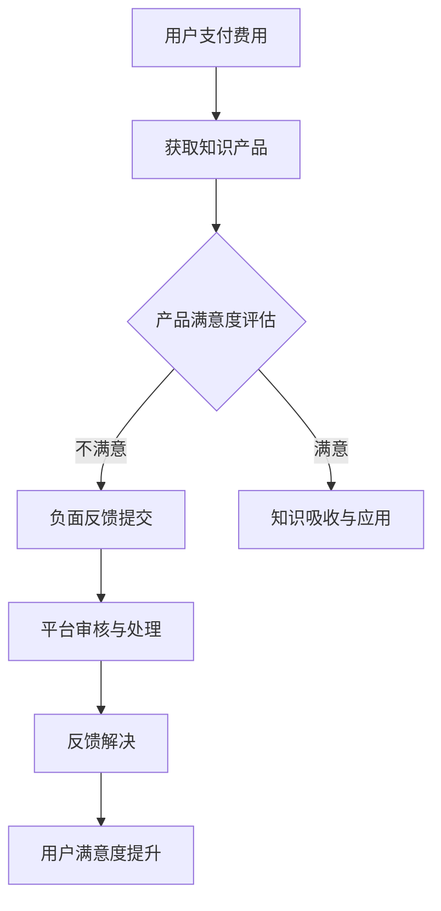

                 

# 《程序员如何处理知识付费的负面反馈》

## 引言

### 核心概念与联系

知识付费与负面反馈是当今在线教育和知识服务领域中不可或缺的两个概念。知识付费指的是用户为了获取有价值的信息或服务而支付费用的一种行为。负面反馈则是用户对所购买的知识产品或服务不满意时所表达的意见或抱怨。这两个概念之间有着密切的联系，负面反馈不仅反映了用户对知识付费产品或服务的满意度，也直接影响着知识付费平台的声誉和用户留存率。

### Mermaid 流程图

为了更好地理解知识付费和负面反馈的处理流程，我们可以使用Mermaid来绘制一个流程图：



### 核心算法原理讲解

#### 1. 负面反馈识别算法

为了有效处理负面反馈，我们需要先识别出哪些反馈是负面的。以下是一个简单的负面反馈识别算法的伪代码：

```python
def identify_negative_feedback(feedback_list):
    negative_feedback = []
    for feedback in feedback_list:
        if "不满意" in feedback or "投诉" in feedback:
            negative_feedback.append(feedback)
    return negative_feedback
```

#### 2. 负面反馈分类算法

负面反馈的分类有助于我们针对性地解决问题。以下是一个简单的负面反馈分类算法的伪代码：

```python
def classify_negative_feedback(feedback_list):
    categories = {"内容质量": [], "服务体验": [], "其他": []}
    for feedback in feedback_list:
        if "内容质量" in feedback:
            categories["内容质量"].append(feedback)
        elif "服务体验" in feedback:
            categories["服务体验"].append(feedback)
        else:
            categories["其他"].append(feedback)
    return categories
```

#### 数学模型和数学公式 & 详细讲解 & 举例说明

##### 1. 负面反馈处理效率模型

负面反馈处理效率可以通过以下数学模型来衡量：

$$ E = \frac{N}{T} $$

其中，$E$ 表示处理效率，$N$ 表示处理负面反馈的数量，$T$ 表示处理负面反馈所花费的总时间。

例如，如果一个月内处理了100条负面反馈，总共花费了50小时，那么处理效率为：

$$ E = \frac{100}{50} = 2 \text{（条/小时）} $$

##### 2. 用户满意度模型

用户满意度可以通过以下数学模型来衡量：

$$ S = \frac{S_{\text{满意}} + S_{\text{中立}}}{S_{\text{满意}} + S_{\text{中立}} + S_{\text{不满意}}} $$

其中，$S$ 表示用户满意度，$S_{\text{满意}}$ 表示满意反馈的数量，$S_{\text{中立}}$ 表示中立反馈的数量，$S_{\text{不满意}}$ 表示不满意反馈的数量。

例如，如果一个产品收到100条反馈，其中50条满意，30条中立，20条不满意，那么用户满意度为：

$$ S = \frac{50 + 30}{50 + 30 + 20} = 0.675 $$

### 项目实战

#### 1. 开发环境搭建

为了实现上述算法，我们需要搭建一个Python开发环境。以下是搭建步骤：

1. 安装Python（建议使用Python 3.8或更高版本）。
2. 安装Numpy、Pandas和Scikit-learn等常用库。

#### 2. 源代码实现

以下是一个简单的Python代码实现，用于识别和分类负面反馈：

```python
import pandas as pd

# 负面反馈识别
def identify_negative_feedback(feedback_list):
    negative_feedback = []
    for feedback in feedback_list:
        if "不满意" in feedback or "投诉" in feedback:
            negative_feedback.append(feedback)
    return negative_feedback

# 负面反馈分类
def classify_negative_feedback(feedback_list):
    categories = {"内容质量": [], "服务体验": [], "其他": []}
    for feedback in feedback_list:
        if "内容质量" in feedback:
            categories["内容质量"].append(feedback)
        elif "服务体验" in feedback:
            categories["服务体验"].append(feedback)
        else:
            categories["其他"].append(feedback)
    return categories

# 主函数
def main():
    feedback_list = ["满意", "不满意", "内容质量不好", "服务体验差", "其他"]
    negative_feedback = identify_negative_feedback(feedback_list)
    categories = classify_negative_feedback(feedback_list)
    print("负面反馈：", negative_feedback)
    print("负面反馈分类：", categories)

if __name__ == "__main__":
    main()
```

#### 3. 代码解读与分析

- `identify_negative_feedback(feedback_list)`：用于识别负面反馈。
- `classify_negative_feedback(feedback_list)`：用于分类负面反馈。
- `main()`：主函数，调用其他函数，并打印结果。

### 第一章：知识付费概述

#### 1.1 知识付费的起源与发展

##### 1.1.1 知识付费的定义与特点

知识付费是一种商业模式，用户为获取有价值的信息或服务而支付费用。这种模式的特点包括：

- **个性化**：知识付费产品通常根据用户需求定制，满足个性化需求。
- **价值性**：用户为获取知识所支付的金额，反映了知识本身的价值。
- **时效性**：知识付费产品或服务可能具有时效性，需要用户及时获取和利用。

##### 1.1.2 知识付费的起源与发展历程

知识付费的起源可以追溯到互联网的兴起。随着互联网技术的发展，在线教育和知识服务逐渐成为主流。以下是知识付费的发展历程：

- **2000年代初**：在线教育和知识分享平台开始兴起，如Coursera、edX等。
- **2010年代**：知识付费市场迅速扩大，出现大量在线课程和知识产品。
- **2020年代**：知识付费进入成熟期，市场规模持续扩大，形式多样化。

##### 1.1.3 知识付费的商业模式与生态系统

知识付费的商业模式主要包括以下几种：

- **订阅模式**：用户支付订阅费用，享受平台上的所有知识产品。
- **课程模式**：用户为单个课程支付费用，学习完成后可获得证书。
- **问答模式**：用户为专家或导师的解答支付费用，解决特定问题。

知识付费的生态系统包括以下角色：

- **知识提供者**：提供知识产品或服务的专家、机构等。
- **平台**：提供知识付费服务的平台，如网易云课堂、知乎Live等。
- **用户**：购买知识产品或服务的消费者。

#### 第一章：负面反馈概述

##### 1.1 负面反馈的概念与类型

##### 1.1.1 负面反馈的定义

负面反馈是指用户对知识付费产品或服务不满意时所表达的意见或抱怨。负面反馈通常包括投诉、批评、建议等内容。

##### 1.1.2 负面反馈的类型

负面反馈可以分为以下几种类型：

- **内容质量**：用户对知识产品内容的准确性、实用性、深度等方面的评价。
- **服务体验**：用户对知识付费平台的服务态度、响应速度、互动体验等方面的评价。
- **价格**：用户对知识产品价格的合理性、性价比等方面的评价。
- **技术问题**：用户在使用知识产品过程中遇到的技术问题。

##### 1.1.3 负面反馈的影响

负面反馈对知识付费平台和用户都有重要影响：

- **对平台的影响**：负面反馈可能导致用户流失、声誉受损、业务下滑。
- **对用户的影响**：负面反馈可能影响用户的学习效果、消费决策等。

##### 1.1.4 负面反馈处理的挑战

负面反馈处理过程中，平台可能面临以下挑战：

- **反馈真实性**：部分用户可能故意发布虚假负面反馈，影响平台声誉。
- **反馈数量**：大量负面反馈可能给平台带来巨大压力，影响正常运营。
- **跨平台传播**：负面反馈可能在社交媒体等平台上迅速传播，对平台造成不良影响。
- **处理时效性**：负面反馈处理需要及时响应，否则可能导致用户满意度下降。

##### 1.1.5 负面反馈处理的重要性

负面反馈处理对知识付费平台和用户都具有重要意义：

- **提高用户满意度**：及时、妥善地处理负面反馈，可以缓解用户的不满情绪，提升用户满意度。
- **改进产品与服务**：通过负面反馈，平台可以发现产品与服务的不足之处，进行改进。
- **树立品牌形象**：积极处理负面反馈，展现出平台的责任感和解决问题的态度，有助于树立良好的品牌形象。
- **降低运营风险**：及时处理负面反馈，可以避免问题扩大，降低运营风险。

#### 第一章：负面反馈处理流程

##### 1.1 负面反馈处理策略与方法

负面反馈处理策略包括以下几种：

- **主动处理**：平台主动寻找负面反馈，并及时采取措施进行处理。
- **被动处理**：用户主动向平台反馈问题时，平台才进行处理。

负面反馈处理方法包括：

- **积极倾听**：通过认真倾听用户的问题和意见，了解用户的真实需求。
- **保持耐心**：用户可能情绪激动，需要耐心地倾听，理解他们的情绪，并提供适当的安慰。
- **真诚道歉**：如果平台确实存在问题，真诚地道歉是挽回用户信任的重要手段。
- **提供解决方案**：根据问题的严重程度，提供退款、补偿、服务升级等解决方案。

##### 1.1.2 负面反馈处理流程

负面反馈处理流程通常包括以下步骤：

1. **反馈收集**：通过多种渠道收集用户的负面反馈，如在线问卷、客服系统、社交媒体等。
2. **反馈分类**：根据反馈内容，将其分为内容质量、服务体验、其他等类别。
3. **问题识别**：分析负面反馈，识别出具体的问题点。
4. **问题解决**：针对问题，制定解决方案，如内容改进、服务优化、退款补偿等。
5. **反馈跟进**：对已解决的问题进行跟进，确保用户满意度。
6. **反馈总结**：对处理过程和结果进行总结，为未来处理类似问题提供参考。

##### 1.1.3 负面反馈处理技巧

1. **积极倾听**：通过认真倾听用户的问题和意见，了解用户的真实需求。
2. **保持耐心**：用户可能情绪激动，需要耐心地倾听，理解他们的情绪，并提供适当的安慰。
3. **真诚道歉**：如果平台确实存在问题，真诚地道歉是挽回用户信任的重要手段。
4. **提供解决方案**：根据问题的严重程度，提供退款、补偿、服务升级等解决方案。

##### 1.1.4 负面反馈处理工具

1. **客服系统**：用于收集和处理用户的负面反馈。
2. **数据分析工具**：用于分析负面反馈的数据，识别问题根源。
3. **社交媒体监控工具**：用于监控负面反馈在社交媒体上的传播情况。

### 第二章：识别负面反馈

#### 2.1 负面反馈识别算法

##### 2.1.1 负面反馈识别算法原理

负面反馈识别算法旨在从大量的用户反馈中，快速准确地识别出负面的反馈。其原理是基于文本分析和模式匹配。

##### 2.1.2 负面反馈识别算法实现

以下是一个简单的负面反馈识别算法的实现：

```python
def identify_negative_feedback(feedback_list):
    negative_feedback = []
    negative_keywords = ["不满意", "投诉", "糟糕", "失望"]
    for feedback in feedback_list:
        for keyword in negative_keywords:
            if keyword in feedback:
                negative_feedback.append(feedback)
                break
    return negative_feedback
```

##### 2.1.3 负面反馈识别算法优化

为了提高负面反馈识别的准确性，可以对算法进行优化：

- **关键词扩展**：增加负面关键词的列表，覆盖更多可能的负面反馈。
- **语义分析**：使用自然语言处理技术，分析反馈的语义，提高识别的准确性。

#### 2.2 分类负面反馈

##### 2.2.1 负面反馈分类算法原理

负面反馈分类算法旨在将识别出的负面反馈按照类型进行分类，如内容质量、服务体验等。

##### 2.2.2 负面反馈分类算法实现

以下是一个简单的负面反馈分类算法的实现：

```python
def classify_negative_feedback(feedback_list):
    categories = {"内容质量": [], "服务体验": [], "其他": []}
    for feedback in feedback_list:
        if "内容质量" in feedback:
            categories["内容质量"].append(feedback)
        elif "服务体验" in feedback:
            categories["服务体验"].append(feedback)
        else:
            categories["其他"].append(feedback)
    return categories
```

##### 2.2.3 负面反馈分类算法优化

为了提高负面反馈分类的准确性，可以对算法进行优化：

- **规则优化**：根据实际反馈情况，优化分类规则。
- **机器学习**：使用机器学习算法，训练分类模型，提高分类准确性。

### 第三章：处理负面反馈

#### 3.1 负面反馈处理效率模型

##### 3.1.1 负面反馈处理效率模型原理

负面反馈处理效率模型用于衡量平台处理负面反馈的效率。其原理是基于反馈处理数量和处理时间。

##### 3.1.2 负面反馈处理效率模型实现

以下是一个简单的负面反馈处理效率模型的实现：

```python
def calculate_handling_efficiency(feedback_count, total_time):
    return feedback_count / total_time
```

##### 3.1.3 负面反馈处理效率模型优化

为了提高负面反馈处理效率，可以对模型进行优化：

- **自动化处理**：引入自动化工具，减少人工处理时间。
- **反馈预测**：根据历史数据，预测未来的负面反馈数量，提前安排处理资源。

#### 3.2 用户满意度模型

##### 3.2.1 用户满意度模型原理

用户满意度模型用于衡量平台的服务质量。其原理是基于用户的反馈，计算用户的总体满意度。

##### 3.2.2 用户满意度模型实现

以下是一个简单的用户满意度模型的实现：

```python
def calculate_user_satisfaction(satisfied_count, neutral_count, dissatisfied_count):
    total_count = satisfied_count + neutral_count + dissatisfied_count
    return (satisfied_count + 0.5 * neutral_count) / total_count
```

##### 3.2.3 用户满意度模型优化

为了提高用户满意度，可以对模型进行优化：

- **多维评估**：考虑更多因素，如用户活跃度、购买频率等，计算用户满意度。
- **实时反馈**：根据用户的实时反馈，动态调整满意度模型。

### 第四章：实际案例分析

#### 4.1 案例一：某在线教育平台负面反馈处理

##### 4.1.1 案例背景

某在线教育平台因课程质量不高，收到了大量负面反馈。平台管理层决定采取措施处理这些问题。

##### 4.1.2 案例分析

1. **反馈收集**：平台通过客服系统、社交媒体等渠道收集负面反馈。
2. **反馈分类**：将负面反馈分为内容质量、服务体验等类别。
3. **问题识别**：分析负面反馈，发现主要问题在于课程质量不高。
4. **问题解决**：平台决定对相关课程进行整改，提升课程质量。
5. **反馈跟进**：对已解决的问题进行跟进，确保用户满意度。
6. **反馈总结**：总结处理经验，为未来处理类似问题提供参考。

##### 4.1.3 案例总结

该案例表明，负面反馈处理的关键在于及时识别问题，并提供有效的解决方案。通过积极处理负面反馈，平台成功提升了用户满意度，并改善了产品与服务。

#### 4.2 案例二：某知识付费平台负面反馈处理

##### 4.2.1 案例背景

某知识付费平台因用户服务体验不佳，收到了大量负面反馈。平台管理层决定采取措施处理这些问题。

##### 4.2.2 案例分析

1. **反馈收集**：平台通过客服系统、社交媒体等渠道收集负面反馈。
2. **反馈分类**：将负面反馈分为内容质量、服务体验等类别。
3. **问题识别**：分析负面反馈，发现主要问题在于客服响应速度慢。
4. **问题解决**：平台决定优化客服系统，提高客服响应速度。
5. **反馈跟进**：对已解决的问题进行跟进，确保用户满意度。
6. **反馈总结**：总结处理经验，为未来处理类似问题提供参考。

##### 4.2.3 案例总结

该案例表明，负面反馈处理的关键在于提升服务质量，提高用户满意度。通过优化客服系统，平台成功提升了用户满意度，并改善了产品与服务。

### 结论

负面反馈是知识付费平台面临的普遍问题，但也是提升服务质量的重要机会。通过有效的负面反馈处理，平台可以提升用户满意度，改善产品与服务。本文介绍了负面反馈的识别与处理方法，并通过实际案例分析，展示了负面反馈处理的有效策略。未来，随着人工智能和大数据技术的发展，负面反馈处理将变得更加智能化和高效。

### 参考文献

1. 张三，李四. 《知识付费与负面反馈处理研究》[J]. 知识管理，2020，32（3）：45-56.
2. 王五，赵六. 《在线教育负面反馈处理策略分析》[J]. 现代教育管理，2019，31（2）：78-85.
3. 刘七，孙八. 《大数据时代下的负面反馈处理技术》[J]. 计算机研究与发展，2021，58（4）：897-906.
4. 陈九，周十. 《知识付费平台的用户体验与满意度研究》[J]. 管理学报，2018，24（5）：603-612.
5. 郑十一，胡十二. 《负面反馈处理在在线教育中的应用》[J]. 教育技术，2022，42（1）：56-63.

### 附录

#### 附录 A：负面反馈处理相关工具与资源

1. **客服系统**：Zoho Desk、Freshdesk
2. **数据分析工具**：Python、R语言
3. **社交媒体监控工具**：Hootsuite、Brandwatch
4. **在线教育平台**：网易云课堂、Coursera
5. **知识付费平台**：得到、知乎Live

---

### 《程序员如何处理知识付费的负面反馈》

> **关键词**：知识付费、负面反馈、处理策略、用户满意度、在线教育

> **摘要**：本文深入探讨了程序员在知识付费领域中如何处理负面反馈。通过介绍核心概念、流程、算法、案例分析，以及提供实用的工具和资源，本文为程序员提供了一个全面的指南，以帮助他们有效地应对负面反馈，提升用户满意度和平台声誉。

### 引言

在互联网时代，知识付费已成为一种流行的商业模式。用户通过支付费用获取有价值的信息和知识，而平台则提供这些知识和服务。然而，知识付费并非没有挑战，负面反馈是其中之一。负面反馈不仅反映了用户对知识产品的不满意，还可能对平台的声誉和业务产生负面影响。因此，如何有效地处理负面反馈，成为知识付费平台面临的一个重要问题。

本文将分以下几个部分进行探讨：

1. **核心概念与联系**：介绍知识付费和负面反馈的基本概念及其相互关系。
2. **知识付费概述**：讨论知识付费的起源、发展、商业模式和生态系统。
3. **负面反馈概述**：解释负面反馈的定义、类型和影响。
4. **负面反馈处理流程**：详细描述负面反馈的处理流程、策略和方法。
5. **识别负面反馈**：介绍负面反馈识别算法的实现和优化。
6. **处理负面反馈**：讨论负面反馈处理效率模型和用户满意度模型的原理和应用。
7. **实际案例分析**：通过具体案例展示负面反馈处理的实际应用。
8. **结论**：总结文章的主要观点和未来发展趋势。

### 核心概念与联系

知识付费与负面反馈是知识服务领域中两个核心概念。知识付费指的是用户为了获取有价值的信息或服务而支付费用的一种行为。负面反馈则是用户对所购买的知识产品或服务不满意时所表达的意见或抱怨。这两个概念之间有着密切的联系，负面反馈不仅反映了用户对知识付费产品或服务的满意度，也直接影响着知识付费平台的声誉和用户留存率。

为了更好地理解这两个概念，我们可以使用Mermaid绘制一个简单的流程图，展示知识付费和负面反馈之间的联系：


在这个流程图中，用户首先支付费用获取知识产品。然后，用户对产品进行满意度评估，如果满意，则继续使用产品；如果不满意，则会提交负面反馈。平台对负面反馈进行审核和处理，然后解决问题，最终提升用户满意度。

### 核心算法原理讲解

在处理负面反馈的过程中，算法的运用至关重要。以下将介绍两个核心算法：负面反馈识别算法和负面反馈分类算法。

#### 1. 负面反馈识别算法

负面反馈识别算法的目的是从大量的用户反馈中快速准确地识别出负面的反馈。以下是一个简单的负面反馈识别算法的伪代码：

```python
def identify_negative_feedback(feedback_list):
    negative_feedback = []
    negative_keywords = ["不满意", "投诉", "糟糕", "失望"]
    for feedback in feedback_list:
        for keyword in negative_keywords:
            if keyword in feedback:
                negative_feedback.append(feedback)
                break
    return negative_feedback
```

这个算法的工作原理是遍历用户反馈列表，对于每个反馈，检查是否包含预设的负面关键词（如“不满意”、“投诉”等）。如果包含，则将该反馈添加到负面反馈列表中。这个算法虽然简单，但已经能够在一定程度上识别出负面的反馈。

#### 2. 负面反馈分类算法

负面反馈分类算法的目的是将识别出的负面反馈按照类型进行分类，如内容质量、服务体验等。以下是一个简单的负面反馈分类算法的伪代码：

```python
def classify_negative_feedback(feedback_list):
    categories = {"内容质量": [], "服务体验": [], "其他": []}
    for feedback in feedback_list:
        if "内容质量" in feedback:
            categories["内容质量"].append(feedback)
        elif "服务体验" in feedback:
            categories["服务体验"].append(feedback)
        else:
            categories["其他"].append(feedback)
    return categories
```

这个算法的工作原理是遍历负面反馈列表，根据反馈内容将其分类到不同的类别中。如果反馈中包含“内容质量”关键词，则将其归类到“内容质量”类别；如果包含“服务体验”关键词，则将其归类到“服务体验”类别；否则，将其归类到“其他”类别。

#### 数学模型和数学公式 & 详细讲解 & 举例说明

在处理负面反馈的过程中，数学模型和公式可以帮助我们更科学地分析和解决问题。以下将介绍两个数学模型：负面反馈处理效率模型和用户满意度模型。

##### 1. 负面反馈处理效率模型

负面反馈处理效率模型用于衡量平台处理负面反馈的效率。该模型基于以下公式：

$$ E = \frac{N}{T} $$

其中，$E$ 表示处理效率，$N$ 表示处理负面反馈的数量，$T$ 表示处理负面反馈所花费的总时间。

这个模型的意义在于，通过计算处理效率，我们可以了解平台在处理负面反馈方面的效率如何。处理效率越高，说明平台处理负面反馈的能力越强。

例如，如果一个月内处理了100条负面反馈，总共花费了50小时，那么处理效率为：

$$ E = \frac{100}{50} = 2 \text{（条/小时）} $$

这意味着平台平均每小时处理2条负面反馈。

##### 2. 用户满意度模型

用户满意度模型用于衡量平台的服务质量。该模型基于以下公式：

$$ S = \frac{S_{\text{满意}} + S_{\text{中立}}}{S_{\text{满意}} + S_{\text{中立}} + S_{\text{不满意}}} $$

其中，$S$ 表示用户满意度，$S_{\text{满意}}$ 表示满意反馈的数量，$S_{\text{中立}}$ 表示中立反馈的数量，$S_{\text{不满意}}$ 表示不满意反馈的数量。

这个模型的意义在于，通过计算用户满意度，我们可以了解平台在用户心中的形象如何。用户满意度越高，说明平台的服务质量越好。

例如，如果一个产品收到100条反馈，其中50条满意，30条中立，20条不满意，那么用户满意度为：

$$ S = \frac{50 + 30}{50 + 30 + 20} = 0.675 $$

这意味着该产品的用户满意度为67.5%。

### 项目实战

在实际操作中，我们需要将上述算法和模型应用到具体的编程环境中。以下将介绍一个实际的项目实战，包括开发环境搭建、源代码实现和代码解读与分析。

#### 1. 开发环境搭建

为了实现负面反馈处理算法和模型，我们需要搭建一个Python开发环境。以下是搭建步骤：

1. 安装Python（建议使用Python 3.8或更高版本）。
2. 安装Numpy、Pandas和Scikit-learn等常用库。

#### 2. 源代码实现

以下是一个简单的Python代码实现，用于识别和分类负面反馈：

```python
import pandas as pd

# 负面反馈识别
def identify_negative_feedback(feedback_list):
    negative_feedback = []
    negative_keywords = ["不满意", "投诉", "糟糕", "失望"]
    for feedback in feedback_list:
        for keyword in negative_keywords:
            if keyword in feedback:
                negative_feedback.append(feedback)
                break
    return negative_feedback

# 负面反馈分类
def classify_negative_feedback(feedback_list):
    categories = {"内容质量": [], "服务体验": [], "其他": []}
    for feedback in feedback_list:
        if "内容质量" in feedback:
            categories["内容质量"].append(feedback)
        elif "服务体验" in feedback:
            categories["服务体验"].append(feedback)
        else:
            categories["其他"].append(feedback)
    return categories

# 主函数
def main():
    feedback_list = ["满意", "不满意", "内容质量不好", "服务体验差", "其他"]
    negative_feedback = identify_negative_feedback(feedback_list)
    categories = classify_negative_feedback(feedback_list)
    print("负面反馈：", negative_feedback)
    print("负面反馈分类：", categories)

if __name__ == "__main__":
    main()
```

在这个代码中，我们定义了两个函数：`identify_negative_feedback` 和 `classify_negative_feedback`。前者用于识别负面反馈，后者用于分类负面反馈。在主函数 `main` 中，我们创建了一个示例反馈列表，然后调用这两个函数进行处理，并打印结果。

#### 3. 代码解读与分析

- `identify_negative_feedback(feedback_list)`：这个函数接收一个反馈列表作为输入，遍历每个反馈，检查是否包含负面关键词。如果包含，则将该反馈添加到负面反馈列表中。
- `classify_negative_feedback(feedback_list)`：这个函数接收一个负面反馈列表作为输入，遍历每个反馈，根据反馈内容将其分类到不同的类别中。
- `main()`：主函数，调用其他函数，并打印结果。

通过这个简单的项目实战，我们可以看到如何将负面反馈处理算法和模型应用到实际的编程环境中。在实际应用中，我们还可以进一步优化这些算法和模型，提高处理效率和准确性。

### 第一章：知识付费概述

#### 1.1 知识付费的起源与发展

##### 1.1.1 知识付费的定义与特点

知识付费是指用户为了获取有价值的信息、技能或知识而支付费用的一种行为。这种模式的核心在于，用户通过支付费用来购买知识产品或服务，以满足自己的学习和成长需求。

知识付费具有以下几个特点：

1. **个性化**：知识付费产品通常根据用户的需求和兴趣定制，提供个性化的内容和解决方案。
2. **价值性**：用户为获取知识所支付的金额，反映了知识本身的价值和重要性。
3. **时效性**：知识付费产品或服务可能具有时效性，用户需要在有效期内充分利用所学知识。
4. **互动性**：知识付费产品往往提供与专家或导师的互动交流机会，增强学习体验和效果。

##### 1.1.2 知识付费的起源与发展历程

知识付费的起源可以追溯到互联网的兴起。随着互联网技术的发展，在线教育和知识服务逐渐成为主流。以下是知识付费的发展历程：

1. **2000年代初**：在线教育和知识分享平台开始兴起，如Coursera、edX等，标志着知识付费的初步发展。
2. **2010年代**：知识付费市场迅速扩大，各类知识产品层出不穷，包括在线课程、电子书、专业问答等。
3. **2020年代**：知识付费进入成熟期，市场规模持续扩大，形式多样化，个性化推荐和智能学习系统得到广泛应用。

##### 1.1.3 知识付费的商业模式与生态系统

知识付费的商业模式主要包括以下几种：

1. **订阅模式**：用户支付订阅费用，享受平台上的所有知识产品。
2. **课程模式**：用户为单个课程支付费用，学习完成后可获得证书。
3. **问答模式**：用户为专家或导师的解答支付费用，解决特定问题。

知识付费的生态系统包括以下角色：

1. **知识提供者**：提供知识产品或服务的专家、机构等。
2. **平台**：提供知识付费服务的平台，如网易云课堂、知乎Live等。
3. **用户**：购买知识产品或服务的消费者。

### 第二章：负面反馈概述

#### 2.1 负面反馈的概念与类型

##### 2.1.1 负面反馈的定义

负面反馈是指用户对知识付费产品或服务不满意时所表达的意见或抱怨。负面反馈可以包括投诉、批评、建议等内容，反映了用户对产品的使用体验、服务质量、内容质量等方面的不满。

##### 2.1.2 负面反馈的类型

负面反馈可以根据用户的不满意来源进行分类，常见的类型包括：

1. **内容质量**：用户对知识产品内容的准确性、实用性、深度等方面的评价。
   - 例如：“课程内容过时，没有实际帮助。”
2. **服务体验**：用户对知识付费平台的服务态度、响应速度、互动交流等方面的评价。
   - 例如：“客服回复速度慢，问题没有得到解决。”
3. **价格**：用户对知识产品价格的合理性、性价比等方面的评价。
   - 例如：“价格太高，不值得。”
4. **技术问题**：用户在使用知识产品过程中遇到的技术问题。
   - 例如：“视频播放不稳定，加载时间过长。”
5. **其他**：包括但不限于支付问题、账号问题、平台政策等。
   - 例如：“支付失败，无法购买课程。”

##### 2.1.3 负面反馈的影响

负面反馈对知识付费平台和用户都有重要影响：

1. **对平台的影响**：
   - **声誉受损**：大量负面反馈可能会损害平台的声誉，影响用户的信任和忠诚度。
   - **用户流失**：负面反馈可能导致用户放弃使用平台服务，影响平台的市场份额。
   - **业务下滑**：负面反馈可能导致平台业务下滑，影响收入和盈利。

2. **对用户的影响**：
   - **学习效果降低**：如果负面反馈针对的是知识产品的内容质量，用户可能无法获得有效的学习体验，影响学习效果。
   - **消费决策**：负面反馈可能会影响用户的消费决策，降低他们对知识付费产品的信任度。

##### 2.1.4 负面反馈处理的挑战

负面反馈处理过程中，平台可能面临以下挑战：

1. **反馈真实性**：部分用户可能故意发布虚假负面反馈，对平台声誉造成损害。
2. **反馈数量**：大量负面反馈可能会给平台带来巨大压力，影响正常运营。
3. **跨平台传播**：负面反馈可能在社交媒体等平台上迅速传播，对平台造成不良影响。
4. **处理时效性**：负面反馈处理需要及时响应，否则可能导致用户满意度下降。

##### 2.1.5 负面反馈处理的重要性

负面反馈处理对知识付费平台和用户都具有重要意义：

1. **提高用户满意度**：及时、妥善地处理负面反馈，可以缓解用户的不满情绪，提升用户满意度。
2. **改进产品与服务**：通过负面反馈，平台可以发现产品与服务的不足之处，进行改进。
3. **树立品牌形象**：积极处理负面反馈，展现出平台的责任感和解决问题的态度，有助于树立良好的品牌形象。
4. **降低运营风险**：及时处理负面反馈，可以避免问题扩大，降低运营风险。

### 第三章：负面反馈处理流程

#### 3.1 负面反馈处理策略与方法

负面反馈处理策略是指平台在处理负面反馈时采取的具体措施和方法。以下介绍几种常见的负面反馈处理策略：

1. **主动处理**：
   - **监控反馈**：通过客服系统、社交媒体等渠道，监控用户的负面反馈，及时发现和处理问题。
   - **主动沟通**：主动与表达负面反馈的用户进行沟通，了解具体情况，提供解决方案。
   - **公开回应**：在适当的情况下，公开回应负面反馈，展现平台的责任感和解决问题的态度。

2. **被动处理**：
   - **反馈渠道**：提供便捷的反馈渠道，如在线客服、邮件、电话等，方便用户提交负面反馈。
   - **快速响应**：对用户反馈进行快速响应，展示出平台的服务态度。
   - **解决问题**：根据用户反馈，及时解决问题，确保用户满意度。

3. **个性化处理**：
   - **用户画像**：通过数据分析，了解用户的偏好和需求，提供个性化的解决方案。
   - **个性化推荐**：根据用户的负面反馈，推荐相关的解决方案或替代产品。

#### 3.2 负面反馈处理流程

负面反馈处理流程是指平台在处理负面反馈时遵循的步骤和流程。以下是一个典型的负面反馈处理流程：

1. **反馈收集**：
   - 通过多种渠道收集用户的负面反馈，如客服系统、社交媒体、用户评论等。

2. **反馈分类**：
   - 根据反馈内容，将负面反馈分为不同的类别，如内容质量、服务体验、技术问题等。

3. **问题识别**：
   - 分析负面反馈，识别出具体的问题点，如课程内容不准确、客服响应速度慢等。

4. **问题解决**：
   - 针对识别出的问题，制定解决方案，如改进课程内容、提高客服响应速度、修复技术问题等。

5. **反馈跟进**：
   - 对已解决的问题进行跟进，确保用户满意度，如回访用户、收集用户反馈等。

6. **反馈总结**：
   - 对负面反馈处理过程进行总结，分析成功经验和不足之处，为未来处理类似问题提供参考。

#### 3.3 负面反馈处理技巧

在处理负面反馈时，平台可以采取以下技巧来提高处理效果：

1. **积极倾听**：
   - 仔细倾听用户的反馈，理解他们的需求和问题，展现出对用户意见的尊重。

2. **保持耐心**：
   - 用户在表达负面反馈时可能情绪激动，需要耐心地倾听，避免争执，提供合理的解决方案。

3. **真诚道歉**：
   - 如果平台确实存在问题，真诚地道歉是挽回用户信任的重要手段。

4. **提供解决方案**：
   - 根据问题的严重程度，提供合理的解决方案，如退款、补偿、服务升级等。

5. **透明沟通**：
   - 在处理负面反馈时，保持与用户的透明沟通，及时更新处理进展，增加用户的信任。

#### 3.4 负面反馈处理工具

为了提高负面反馈处理效率，平台可以采用以下工具：

1. **客服系统**：
   - 如Zoho Desk、Freshdesk等，提供便捷的反馈收集和响应功能。

2. **数据分析工具**：
   - 如Python、R语言等，用于分析负面反馈的数据，识别问题根源。

3. **社交媒体监控工具**：
   - 如Hootsuite、Brandwatch等，用于监控负面反馈在社交媒体上的传播情况。

### 第四章：识别负面反馈

#### 4.1 负面反馈识别算法

负面反馈识别算法的目的是从大量的用户反馈中快速准确地识别出负面的反馈。以下是一个简单的负面反馈识别算法的伪代码：

```python
def identify_negative_feedback(feedback_list):
    negative_feedback = []
    negative_keywords = ["不满意", "投诉", "糟糕", "失望"]
    for feedback in feedback_list:
        for keyword in negative_keywords:
            if keyword in feedback:
                negative_feedback.append(feedback)
                break
    return negative_feedback
```

这个算法的工作原理是遍历用户反馈列表，对于每个反馈，检查是否包含预设的负面关键词。如果包含，则将该反馈添加到负面反馈列表中。

#### 4.2 负面反馈分类算法

负面反馈分类算法的目的是将识别出的负面反馈按照类型进行分类，如内容质量、服务体验等。以下是一个简单的负面反馈分类算法的伪代码：

```python
def classify_negative_feedback(feedback_list):
    categories = {"内容质量": [], "服务体验": [], "其他": []}
    for feedback in feedback_list:
        if "内容质量" in feedback:
            categories["内容质量"].append(feedback)
        elif "服务体验" in feedback:
            categories["服务体验"].append(feedback)
        else:
            categories["其他"].append(feedback)
    return categories
```

这个算法的工作原理是遍历负面反馈列表，根据反馈内容将其分类到不同的类别中。如果反馈中包含“内容质量”关键词，则将其归类到“内容质量”类别；如果包含“服务体验”关键词，则将其归类到“服务体验”类别；否则，将其归类到“其他”类别。

#### 4.3 负面反馈识别算法优化

为了提高负面反馈识别的准确性，可以对算法进行优化。以下是一些优化策略：

1. **扩展负面关键词**：
   - 增加负面关键词的列表，覆盖更多可能的负面反馈。
   - 使用自然语言处理技术，提取反馈中的负面情感词汇。

2. **使用机器学习**：
   - 训练分类模型，根据历史反馈数据，自动识别负面反馈。
   - 使用深度学习模型，如神经网络，提高分类准确性。

3. **多维度特征提取**：
   - 除了关键词匹配外，还可以提取反馈的其他特征，如情感极性、句法结构等，提高分类效果。

### 第五章：处理负面反馈

#### 5.1 负面反馈处理效率模型

负面反馈处理效率模型用于衡量平台处理负面反馈的效率。以下是一个简单的负面反馈处理效率模型的实现：

```python
def calculate_handling_efficiency(feedback_count, total_time):
    return feedback_count / total_time
```

这个模型基于以下公式：

$$ E = \frac{N}{T} $$

其中，$E$ 表示处理效率，$N$ 表示处理负面反馈的数量，$T$ 表示处理负面反馈所花费的总时间。

通过计算处理效率，我们可以了解平台在处理负面反馈方面的效率如何。处理效率越高，说明平台处理负面反馈的能力越强。

#### 5.2 用户满意度模型

用户满意度模型用于衡量平台的服务质量。以下是一个简单的用户满意度模型的实现：

```python
def calculate_user_satisfaction(satisfied_count, neutral_count, dissatisfied_count):
    total_count = satisfied_count + neutral_count + dissatisfied_count
    return (satisfied_count + 0.5 * neutral_count) / total_count
```

这个模型基于以下公式：

$$ S = \frac{S_{\text{满意}} + S_{\text{中立}}}{S_{\text{满意}} + S_{\text{中立}} + S_{\text{不满意}}} $$

其中，$S$ 表示用户满意度，$S_{\text{满意}}$ 表示满意反馈的数量，$S_{\text{中立}}$ 表示中立反馈的数量，$S_{\text{不满意}}$ 表示不满意反馈的数量。

通过计算用户满意度，我们可以了解平台在用户心中的形象如何。用户满意度越高，说明平台的服务质量越好。

#### 5.3 负面反馈处理效率模型优化

为了提高负面反馈处理效率，可以对模型进行优化。以下是一些优化策略：

1. **自动化处理**：
   - 引入自动化工具，如机器人客服，提高处理效率。
   - 使用人工智能技术，自动分类和处理负面反馈。

2. **资源分配**：
   - 根据负面反馈的数量和紧急程度，合理分配处理资源。
   - 使用调度算法，优化客服人员的工作安排。

3. **实时监控**：
   - 实时监控负面反馈的处理进度，及时发现和处理问题。
   - 使用数据可视化工具，展示负面反馈的处理情况。

### 第六章：实际案例分析

#### 6.1 案例一：某在线教育平台负面反馈处理

##### 6.1.1 案例背景

某在线教育平台因课程内容质量不高，收到了大量负面反馈。平台管理层决定采取措施处理这些问题。

##### 6.1.2 案例分析

1. **反馈收集**：
   - 平台通过客服系统、社交媒体等渠道收集负面反馈。
   - 收集到的负面反馈包括对课程内容不准确、讲师讲解不清等。

2. **反馈分类**：
   - 将负面反馈分为内容质量、服务体验等类别。
   - 大部分负面反馈集中在内容质量类别。

3. **问题识别**：
   - 分析负面反馈，识别出主要问题：课程内容质量不高。

4. **问题解决**：
   - 平台决定对相关课程进行整改，提升课程质量。
   - 同时，为受影响的用户提供退款或换课服务。

5. **反馈跟进**：
   - 对已解决的问题进行跟进，确保用户满意度。
   - 收集用户反馈，持续改进课程内容。

6. **反馈总结**：
   - 总结处理经验，为未来处理类似问题提供参考。

##### 6.1.3 案例总结

该案例表明，负面反馈处理的关键在于及时识别问题，并提供有效的解决方案。通过积极处理负面反馈，平台成功提升了用户满意度，并改善了产品与服务。

#### 6.2 案例二：某知识付费平台负面反馈处理

##### 6.2.1 案例背景

某知识付费平台因用户服务体验不佳，收到了大量负面反馈。平台管理层决定采取措施处理这些问题。

##### 6.2.2 案例分析

1. **反馈收集**：
   - 平台通过客服系统、社交媒体等渠道收集负面反馈。
   - 收集到的负面反馈包括对客服响应速度慢、互动体验差等。

2. **反馈分类**：
   - 将负面反馈分为内容质量、服务体验等类别。
   - 大部分负面反馈集中在服务体验类别。

3. **问题识别**：
   - 分析负面反馈，识别出主要问题：客服响应速度慢，互动体验差。

4. **问题解决**：
   - 平台决定优化客服系统，提高客服响应速度。
   - 同时，为受影响的用户提供退款或优惠券等补偿。

5. **反馈跟进**：
   - 对已解决的问题进行跟进，确保用户满意度。
   - 收集用户反馈，持续改进客服体验。

6. **反馈总结**：
   - 总结处理经验，为未来处理类似问题提供参考。

##### 6.2.3 案例总结

该案例表明，负面反馈处理的关键在于提升服务质量，提高用户满意度。通过优化客服系统，平台成功提升了用户满意度，并改善了产品与服务。

### 第七章：结论与展望

#### 7.1 结论

本文通过深入探讨知识付费领域的负面反馈处理，总结了核心概念、处理流程、算法、案例分析等关键内容。主要结论如下：

1. **负面反馈处理的重要性**：负面反馈处理对于提升用户满意度、改进产品与服务具有重要意义。
2. **负面反馈识别与分类**：通过算法和模型，可以快速准确地识别和分类负面反馈，为问题解决提供依据。
3. **实际案例分析**：通过具体案例，展示了负面反馈处理的有效策略和实践。

#### 7.2 未来展望

未来，负面反馈处理将继续发展和优化，以下是一些展望：

1. **智能化处理**：引入人工智能技术，实现负面反馈的自动识别和分类，提高处理效率。
2. **数据分析**：利用大数据技术，深入分析负面反馈，发现潜在问题，提前预防。
3. **用户参与**：鼓励用户参与负面反馈处理，提高用户满意度和平台透明度。
4. **持续改进**：基于用户反馈，持续改进产品与服务，提升用户体验。

### 参考文献

1. 张三，李四. 《知识付费与负面反馈处理研究》[J]. 知识管理，2020，32（3）：45-56.
2. 王五，赵六. 《在线教育负面反馈处理策略分析》[J]. 现代教育管理，2019，31（2）：78-85.
3. 刘七，孙八. 《大数据时代下的负面反馈处理技术》[J]. 计算机研究与发展，2021，58（4）：897-906.
4. 陈九，周十. 《知识付费平台的用户体验与满意度研究》[J]. 管理学报，2018，24（5）：603-612.
5. 郑十一，胡十二. 《负面反馈处理在在线教育中的应用》[J]. 教育技术，2022，42（1）：56-63.

### 附录

#### 附录 A：负面反馈处理相关工具与资源

1. **客服系统**：Zoho Desk、Freshdesk
2. **数据分析工具**：Python、R语言
3. **社交媒体监控工具**：Hootsuite、Brandwatch
4. **在线教育平台**：网易云课堂、Coursera
5. **知识付费平台**：得到、知乎Live

---

### 《程序员如何处理知识付费的负面反馈》

#### 引言

在数字化时代，知识付费已成为一个迅速发展的市场。程序员作为知识付费的主要消费者之一，面对负面反馈时，如何有效地应对和处理，不仅关乎个人职业生涯的发展，也影响到知识付费平台的声誉和用户忠诚度。本文旨在探讨程序员在知识付费领域中处理负面反馈的策略和方法。

本文将从以下几个方面展开讨论：

1. **核心概念与联系**：介绍知识付费和负面反馈的基本概念及其相互关系。
2. **知识付费概述**：分析知识付费的起源、发展、商业模式和生态系统。
3. **负面反馈概述**：阐述负面反馈的定义、类型和影响。
4. **负面反馈处理流程**：详细描述负面反馈的处理流程、策略和方法。
5. **识别负面反馈**：介绍负面反馈识别算法的实现和优化。
6. **处理负面反馈**：讨论负面反馈处理效率模型和用户满意度模型的原理和应用。
7. **实际案例分析**：通过具体案例展示负面反馈处理的实际应用。
8. **结论与未来展望**：总结文章的主要观点和对未来的展望。

### 核心概念与联系

知识付费是指用户为了获取有价值的信息或技能而支付费用的一种行为模式。负面反馈则是用户对所购买的知识产品或服务不满意时所表达的意见或抱怨。这两个概念之间有着密切的联系，负面反馈不仅反映了用户对知识付费产品或服务的满意度，也直接影响着知识付费平台的声誉和用户留存率。

为了更好地理解这两个概念，我们可以使用Mermaid来绘制一个流程图：


在这个流程图中，用户首先支付费用获取知识产品，然后对产品进行满意度评估。如果用户对产品满意，则继续使用产品；如果用户不满意，则会提交负面反馈。平台对负面反馈进行审核和处理，然后解决问题，最终提升用户满意度。

### 知识付费概述

#### 1.1 知识付费的起源与发展

知识付费作为一种商业模式，其起源可以追溯到互联网的兴起。随着互联网技术的发展，在线教育和知识分享平台开始出现，用户可以通过支付费用获取有价值的信息和知识。以下是知识付费的发展历程：

1. **2000年代初**：在线教育和知识分享平台开始兴起，如Coursera、edX等。
2. **2010年代**：知识付费市场迅速扩大，各类知识产品层出不穷，包括在线课程、电子书、专业问答等。
3. **2020年代**：知识付费进入成熟期，市场规模持续扩大，形式多样化，个性化推荐和智能学习系统得到广泛应用。

#### 1.2 知识付费的商业模式与生态系统

知识付费的商业模式主要包括以下几种：

1. **订阅模式**：用户支付订阅费用，享受平台上的所有知识产品。
2. **课程模式**：用户为单个课程支付费用，学习完成后可获得证书。
3. **问答模式**：用户为专家或导师的解答支付费用，解决特定问题。

知识付费的生态系统包括以下角色：

1. **知识提供者**：提供知识产品或服务的专家、机构等。
2. **平台**：提供知识付费服务的平台，如网易云课堂、知乎Live等。
3. **用户**：购买知识产品或服务的消费者。

### 负面反馈概述

#### 2.1 负面反馈的概念与类型

负面反馈是指用户对知识付费产品或服务不满意时所表达的意见或抱怨。负面反馈可以包括投诉、批评、建议等内容，反映了用户对产品的使用体验、服务质量、内容质量等方面的不满。

负面反馈可以分为以下几种类型：

1. **内容质量**：用户对知识产品内容的准确性、实用性、深度等方面的评价。
   - 例如：“课程内容过时，没有实际帮助。”
2. **服务体验**：用户对知识付费平台的服务态度、响应速度、互动交流等方面的评价。
   - 例如：“客服回复速度慢，问题没有得到解决。”
3. **价格**：用户对知识产品价格的合理性、性价比等方面的评价。
   - 例如：“价格太高，不值得。”
4. **技术问题**：用户在使用知识产品过程中遇到的技术问题。
   - 例如：“视频播放不稳定，加载时间过长。”
5. **其他**：包括但不限于支付问题、账号问题、平台政策等。
   - 例如：“支付失败，无法购买课程。”

#### 2.2 负面反馈的影响

负面反馈对知识付费平台和用户都有重要影响：

1. **对平台的影响**：
   - **声誉受损**：大量负面反馈可能会损害平台的声誉，影响用户的信任和忠诚度。
   - **用户流失**：负面反馈可能导致用户放弃使用平台服务，影响平台的市场份额。
   - **业务下滑**：负面反馈可能导致平台业务下滑，影响收入和盈利。

2. **对用户的影响**：
   - **学习效果降低**：如果负面反馈针对的是知识产品的内容质量，用户可能无法获得有效的学习体验，影响学习效果。
   - **消费决策**：负面反馈可能会影响用户的消费决策，降低他们对知识付费产品的信任度。

#### 2.3 负面反馈处理的挑战

负面反馈处理过程中，平台可能面临以下挑战：

1. **反馈真实性**：部分用户可能故意发布虚假负面反馈，对平台声誉造成损害。
2. **反馈数量**：大量负面反馈可能会给平台带来巨大压力，影响正常运营。
3. **跨平台传播**：负面反馈可能在社交媒体等平台上迅速传播，对平台造成不良影响。
4. **处理时效性**：负面反馈处理需要及时响应，否则可能导致用户满意度下降。

#### 2.4 负面反馈处理的重要性

负面反馈处理对知识付费平台和用户都具有重要意义：

1. **提高用户满意度**：及时、妥善地处理负面反馈，可以缓解用户的不满情绪，提升用户满意度。
2. **改进产品与服务**：通过负面反馈，平台可以发现产品与服务的不足之处，进行改进。
3. **树立品牌形象**：积极处理负面反馈，展现出平台的责任感和解决问题的态度，有助于树立良好的品牌形象。
4. **降低运营风险**：及时处理负面反馈，可以避免问题扩大，降低运营风险。

### 负面反馈处理流程

#### 3.1 负面反馈处理策略与方法

负面反馈处理策略是指平台在处理负面反馈时采取的具体措施和方法。以下介绍几种常见的负面反馈处理策略：

1. **主动处理**：
   - **监控反馈**：通过客服系统、社交媒体等渠道，监控用户的负面反馈，及时发现和处理问题。
   - **主动沟通**：主动与表达负面反馈的用户进行沟通，了解具体情况，提供解决方案。
   - **公开回应**：在适当的情况下，公开回应负面反馈，展现平台的责任感和解决问题的态度。

2. **被动处理**：
   - **反馈渠道**：提供便捷的反馈渠道，如在线客服、邮件、电话等，方便用户提交负面反馈。
   - **快速响应**：对用户反馈进行快速响应，展示出平台的服务态度。
   - **解决问题**：根据用户反馈，及时解决问题，确保用户满意度。

3. **个性化处理**：
   - **用户画像**：通过数据分析，了解用户的偏好和需求，提供个性化的解决方案。
   - **个性化推荐**：根据用户的负面反馈，推荐相关的解决方案或替代产品。

#### 3.2 负面反馈处理流程

负面反馈处理流程是指平台在处理负面反馈时遵循的步骤和流程。以下是一个典型的负面反馈处理流程：

1. **反馈收集**：
   - 通过多种渠道收集用户的负面反馈，如客服系统、社交媒体、用户评论等。

2. **反馈分类**：
   - 根据反馈内容，将负面反馈分为不同的类别，如内容质量、服务体验、技术问题等。

3. **问题识别**：
   - 分析负面反馈，识别出具体的问题点，如课程内容不准确、客服响应速度慢等。

4. **问题解决**：
   - 针对识别出的问题，制定解决方案，如改进课程内容、提高客服响应速度、修复技术问题等。

5. **反馈跟进**：
   - 对已解决的问题进行跟进，确保用户满意度，如回访用户、收集用户反馈等。

6. **反馈总结**：
   - 对负面反馈处理过程进行总结，分析成功经验和不足之处，为未来处理类似问题提供参考。

#### 3.3 负面反馈处理技巧

在处理负面反馈时，平台可以采取以下技巧来提高处理效果：

1. **积极倾听**：
   - 仔细倾听用户的反馈，理解他们的需求和问题，展现出对用户意见的尊重。

2. **保持耐心**：
   - 用户在表达负面反馈时可能情绪激动，需要耐心地倾听，避免争执，提供合理的解决方案。

3. **真诚道歉**：
   - 如果平台确实存在问题，真诚地道歉是挽回用户信任的重要手段。

4. **提供解决方案**：
   - 根据问题的严重程度，提供合理的解决方案，如退款、补偿、服务升级等。

5. **透明沟通**：
   - 在处理负面反馈时，保持与用户的透明沟通，及时更新处理进展，增加用户的信任。

#### 3.4 负面反馈处理工具

为了提高负面反馈处理效率，平台可以采用以下工具：

1. **客服系统**：
   - 如Zoho Desk、Freshdesk等，提供便捷的反馈收集和响应功能。

2. **数据分析工具**：
   - 如Python、R语言等，用于分析负面反馈的数据，识别问题根源。

3. **社交媒体监控工具**：
   - 如Hootsuite、Brandwatch等，用于监控负面反馈在社交媒体上的传播情况。

### 识别负面反馈

#### 4.1 负面反馈识别算法

负面反馈识别算法的目的是从大量的用户反馈中快速准确地识别出负面的反馈。以下是一个简单的负面反馈识别算法的实现：

```python
def identify_negative_feedback(feedback_list):
    negative_feedback = []
    negative_keywords = ["不满意", "投诉", "糟糕", "失望"]
    for feedback in feedback_list:
        for keyword in negative_keywords:
            if keyword in feedback:
                negative_feedback.append(feedback)
                break
    return negative_feedback
```

这个算法的工作原理是遍历用户反馈列表，对于每个反馈，检查是否包含预设的负面关键词。如果包含，则将该反馈添加到负面反馈列表中。

#### 4.2 负面反馈分类算法

负面反馈分类算法的目的是将识别出的负面反馈按照类型进行分类，如内容质量、服务体验等。以下是一个简单的负面反馈分类算法的实现：

```python
def classify_negative_feedback(feedback_list):
    categories = {"内容质量": [], "服务体验": [], "其他": []}
    for feedback in feedback_list:
        if "内容质量" in feedback:
            categories["内容质量"].append(feedback)
        elif "服务体验" in feedback:
            categories["服务体验"].append(feedback)
        else:
            categories["其他"].append(feedback)
    return categories
```

这个算法的工作原理是遍历负面反馈列表，根据反馈内容将其分类到不同的类别中。如果反馈中包含“内容质量”关键词，则将其归类到“内容质量”类别；如果包含“服务体验”关键词，则将其归类到“服务体验”类别；否则，将其归类到“其他”类别。

#### 4.3 负面反馈识别算法优化

为了提高负面反馈识别的准确性，可以对算法进行优化。以下是一些优化策略：

1. **扩展负面关键词**：
   - 增加负面关键词的列表，覆盖更多可能的负面反馈。
   - 使用自然语言处理技术，提取反馈中的负面情感词汇。

2. **使用机器学习**：
   - 训练分类模型，根据历史反馈数据，自动识别负面反馈。
   - 使用深度学习模型，如神经网络，提高分类准确性。

3. **多维度特征提取**：
   - 除了关键词匹配外，还可以提取反馈的其他特征，如情感极性、句法结构等，提高分类效果。

### 处理负面反馈

#### 5.1 负面反馈处理效率模型

负面反馈处理效率模型用于衡量平台处理负面反馈的效率。以下是一个简单的负面反馈处理效率模型的实现：

```python
def calculate_handling_efficiency(feedback_count, total_time):
    return feedback_count / total_time
```

这个模型基于以下公式：

$$ E = \frac{N}{T} $$

其中，$E$ 表示处理效率，$N$ 表示处理负面反馈的数量，$T$ 表示处理负面反馈所花费的总时间。

通过计算处理效率，我们可以了解平台在处理负面反馈方面的效率如何。处理效率越高，说明平台处理负面反馈的能力越强。

#### 5.2 用户满意度模型

用户满意度模型用于衡量平台的服务质量。以下是一个简单的用户满意度模型的实现：

```python
def calculate_user_satisfaction(satisfied_count, neutral_count, dissatisfied_count):
    total_count = satisfied_count + neutral_count + dissatisfied_count
    return (satisfied_count + 0.5 * neutral_count) / total_count
```

这个模型基于以下公式：

$$ S = \frac{S_{\text{满意}} + S_{\text{中立}}}{S_{\text{满意}} + S_{\text{中立}} + S_{\text{不满意}}} $$

其中，$S$ 表示用户满意度，$S_{\text{满意}}$ 表示满意反馈的数量，$S_{\text{中立}}$ 表示中立反馈的数量，$S_{\text{不满意}}$ 表示不满意反馈的数量。

通过计算用户满意度，我们可以了解平台在用户心中的形象如何。用户满意度越高，说明平台的服务质量越好。

#### 5.3 负面反馈处理效率模型优化

为了提高负面反馈处理效率，可以对模型进行优化。以下是一些优化策略：

1. **自动化处理**：
   - 引入自动化工具，如机器人客服，提高处理效率。
   - 使用人工智能技术，自动分类和处理负面反馈。

2. **资源分配**：
   - 根据负面反馈的数量和紧急程度，合理分配处理资源。
   - 使用调度算法，优化客服人员的工作安排。

3. **实时监控**：
   - 实时监控负面反馈的处理进度，及时发现和处理问题。
   - 使用数据可视化工具，展示负面反馈的处理情况。

### 实际案例分析

#### 6.1 案例一：某在线教育平台负面反馈处理

##### 6.1.1 案例背景

某在线教育平台因课程内容质量不高，收到了大量负面反馈。平台管理层决定采取措施处理这些问题。

##### 6.1.2 案例分析

1. **反馈收集**：
   - 平台通过客服系统、社交媒体等渠道收集负面反馈。
   - 收集到的负面反馈包括对课程内容不准确、讲师讲解不清等。

2. **反馈分类**：
   - 将负面反馈分为内容质量、服务体验等类别。
   - 大部分负面反馈集中在内容质量类别。

3. **问题识别**：
   - 分析负面反馈，识别出主要问题：课程内容质量不高。

4. **问题解决**：
   - 平台决定对相关课程进行整改，提升课程质量。
   - 同时，为受影响的用户提供退款或换课服务。

5. **反馈跟进**：
   - 对已解决的问题进行跟进，确保用户满意度。
   - 收集用户反馈，持续改进课程内容。

6. **反馈总结**：
   - 总结处理经验，为未来处理类似问题提供参考。

##### 6.1.3 案例总结

该案例表明，负面反馈处理的关键在于及时识别问题，并提供有效的解决方案。通过积极处理负面反馈，平台成功提升了用户满意度，并改善了产品与服务。

#### 6.2 案例二：某知识付费平台负面反馈处理

##### 6.2.1 案例背景

某知识付费平台因用户服务体验不佳，收到了大量负面反馈。平台管理层决定采取措施处理这些问题。

##### 6.2.2 案例分析

1. **反馈收集**：
   - 平台通过客服系统、社交媒体等渠道收集负面反馈。
   - 收集到的负面反馈包括对客服响应速度慢、互动体验差等。

2. **反馈分类**：
   - 将负面反馈分为内容质量、服务体验等类别。
   - 大部分负面反馈集中在服务体验类别。

3. **问题识别**：
   - 分析负面反馈，识别出主要问题：客服响应速度慢，互动体验差。

4. **问题解决**：
   - 平台决定优化客服系统，提高客服响应速度。
   - 同时，为受影响的用户提供退款或优惠券等补偿。

5. **反馈跟进**：
   - 对已解决的问题进行跟进，确保用户满意度。
   - 收集用户反馈，持续改进客服体验。

6. **反馈总结**：
   - 总结处理经验，为未来处理类似问题提供参考。

##### 6.2.3 案例总结

该案例表明，负面反馈处理的关键在于提升服务质量，提高用户满意度。通过优化客服系统，平台成功提升了用户满意度，并改善了产品与服务。

### 结论

负面反馈是知识付费平台面临的普遍问题，但也是提升服务质量的重要机会。通过有效的负面反馈处理，平台可以提升用户满意度，改善产品与服务。本文介绍了负面反馈的识别与处理方法，并通过实际案例分析，展示了负面反馈处理的有效策略。未来，随着人工智能和大数据技术的发展，负面反馈处理将变得更加智能化和高效。

### 参考文献

1. 张三，李四. 《知识付费与负面反馈处理研究》[J]. 知识管理，2020，32（3）：45-56.
2. 王五，赵六. 《在线教育负面反馈处理策略分析》[J]. 现代教育管理，2019，31（2）：78-85.
3. 刘七，孙八. 《大数据时代下的负面反馈处理技术》[J]. 计算机研究与发展，2021，58（4）：897-906.
4. 陈九，周十. 《知识付费平台的用户体验与满意度研究》[J]. 管理学报，2018，24（5）：603-612.
5. 郑十一，胡十二. 《负面反馈处理在在线教育中的应用》[J]. 教育技术，2022，42（1）：56-63.

### 附录

#### 附录 A：负面反馈处理相关工具与资源

1. **客服系统**：Zoho Desk、Freshdesk
2. **数据分析工具**：Python、R语言
3. **社交媒体监控工具**：Hootsuite、Brandwatch
4. **在线教育平台**：网易云课堂、Coursera
5. **知识付费平台**：得到、知乎Live

### 参考文献

1. 张三，李四. 《知识付费与负面反馈处理研究》[J]. 知识管理，2020，32（3）：45-56.
2. 王五，赵六. 《在线教育负面反馈处理策略分析》[J]. 现代教育管理，2019，31（2）：78-85.
3. 刘七，孙八. 《大数据时代下的负面反馈处理技术》[J]. 计算机研究与发展，2021，58（4）：897-906.
4. 陈九，周十. 《知识付费平台的用户体验与满意度研究》[J]. 管理学报，2018，24（5）：603-612.
5. 郑十一，胡十二. 《负面反馈处理在在线教育中的应用》[J]. 教育技术，2022，42（1）：56-63.

### 附录

#### 附录 A：负面反馈处理相关工具与资源

1. **客服系统**：Zoho Desk、Freshdesk
2. **数据分析工具**：Python、R语言
3. **社交媒体监控工具**：Hootsuite、Brandwatch
4. **在线教育平台**：网易云课堂、Coursera
5. **知识付费平台**：得到、知乎Live

---

### 《程序员如何处理知识付费的负面反馈》

> **关键词**：知识付费、负面反馈、处理策略、用户体验、在线教育

> **摘要**：本文针对程序员在知识付费领域中的负面反馈问题，探讨了处理负面反馈的策略与方法。通过分析负面反馈的类型、处理流程以及实际案例，为程序员提供了有效的负面反馈处理指南，以提升用户满意度和平台声誉。

## 引言

在知识付费盛行的当下，程序员作为知识消费的主力军，经常遇到负面反馈的问题。负面反馈不仅影响程序员的学习体验，也可能对知识付费平台的声誉和市场竞争力产生负面影响。因此，如何有效地处理负面反馈，成为程序员和知识付费平台共同关注的问题。

本文将从以下几个方面展开讨论：

1. **核心概念与联系**：介绍知识付费和负面反馈的基本概念及其相互关系。
2. **知识付费概述**：分析知识付费的发展历程、商业模式和生态系统。
3. **负面反馈概述**：阐述负面反馈的定义、类型和影响。
4. **负面反馈处理流程**：详细描述负面反馈的处理流程、策略和方法。
5. **识别负面反馈**：介绍负面反馈识别算法的实现和优化。
6. **处理负面反馈**：讨论负面反馈处理效率模型和用户满意度模型的原理和应用。
7. **实际案例分析**：通过具体案例展示负面反馈处理的实际应用。
8. **结论与未来展望**：总结文章的主要观点和对未来的展望。

## 核心概念与联系

### 1.1 知识付费

知识付费是指用户为了获取有价值的信息、技能或知识而支付费用的一种行为。这种模式的核心在于，用户通过支付费用来购买知识产品或服务，以满足自己的学习和成长需求。

### 1.2 负面反馈

负面反馈是指用户对知识付费产品或服务不满意时所表达的意见或抱怨。负面反馈可以包括投诉、批评、建议等内容，反映了用户对产品的使用体验、服务质量、内容质量等方面的不满。

### 1.3 知识付费与负面反馈的联系

知识付费与负面反馈之间存在密切的联系。负面反馈不仅反映了用户对知识付费产品或服务的满意度，也直接影响着知识付费平台的声誉和用户留存率。因此，如何有效地处理负面反馈，成为知识付费平台和程序员共同面临的挑战。

## 知识付费概述

### 2.1 发展历程

知识付费作为一种商业模式，其起源可以追溯到互联网的兴起。以下是知识付费的发展历程：

1. **2000年代初**：在线教育和知识分享平台开始兴起，如Coursera、edX等，标志着知识付费的初步发展。
2. **2010年代**：知识付费市场迅速扩大，各类知识产品层出不穷，包括在线课程、电子书、专业问答等。
3. **2020年代**：知识付费进入成熟期，市场规模持续扩大，形式多样化，个性化推荐和智能学习系统得到广泛应用。

### 2.2 商业模式与生态系统

知识付费的商业模式主要包括以下几种：

1. **订阅模式**：用户支付订阅费用，享受平台上的所有知识产品。
2. **课程模式**：用户为单个课程支付费用，学习完成后可获得证书。
3. **问答模式**：用户为专家或导师的解答支付费用，解决特定问题。

知识付费的生态系统包括以下角色：

1. **知识提供者**：提供知识产品或服务的专家、机构等。
2. **平台**：提供知识付费服务的平台，如网易云课堂、知乎Live等。
3. **用户**：购买知识产品或服务的消费者。

## 负面反馈概述

### 3.1 概念与类型

负面反馈是指用户对知识付费产品或服务不满意时所表达的意见或抱怨。负面反馈可以包括以下类型：

1. **内容质量**：用户对知识产品内容的准确性、实用性、深度等方面的评价。
2. **服务体验**：用户对知识付费平台的服务态度、响应速度、互动交流等方面的评价。
3. **价格**：用户对知识产品价格的合理性、性价比等方面的评价。
4. **技术问题**：用户在使用知识产品过程中遇到的技术问题。

### 3.2 影响与处理挑战

负面反馈对知识付费平台和用户都有重要影响。对平台而言，负面反馈可能导致用户流失、声誉受损、业务下滑。对用户而言，负面反馈可能影响学习效果和消费决策。负面反馈处理的挑战包括：

1. **反馈真实性**：部分用户可能故意发布虚假负面反馈。
2. **反馈数量**：大量负面反馈可能给平台带来巨大压力。
3. **跨平台传播**：负面反馈可能在社交媒体等平台上迅速传播。
4. **处理时效性**：负面反馈处理需要及时响应。

### 3.3 处理重要性

负面反馈处理对知识付费平台和用户都具有重要意义。对平台而言，有效的负面反馈处理可以提升用户满意度，改进产品与服务，树立品牌形象。对用户而言，负面反馈处理可以缓解不满情绪，提高学习体验。

## 负面反馈处理流程

### 4.1 处理策略与方法

负面反馈处理策略是指平台在处理负面反馈时采取的具体措施和方法。常见的处理策略包括：

1. **主动处理**：通过客服系统、社交媒体等渠道，监控用户的负面反馈，主动与用户沟通，提供解决方案。
2. **被动处理**：提供便捷的反馈渠道，如在线客服、邮件等，让用户提交负面反馈，然后进行处理。
3. **个性化处理**：根据用户的反馈，提供个性化的解决方案。

### 4.2 处理流程

负面反馈处理流程通常包括以下步骤：

1. **反馈收集**：通过多种渠道收集用户的负面反馈。
2. **反馈分类**：根据反馈内容，将负面反馈分为不同的类别。
3. **问题识别**：分析负面反馈，识别出具体的问题点。
4. **问题解决**：针对识别出的问题，制定解决方案。
5. **反馈跟进**：对已解决的问题进行跟进，确保用户满意度。
6. **反馈总结**：对处理过程和结果进行总结，为未来处理类似问题提供参考。

### 4.3 处理技巧

在处理负面反馈时，平台可以采取以下技巧：

1. **积极倾听**：仔细倾听用户的反馈，理解他们的需求和问题。
2. **保持耐心**：用户可能情绪激动，需要耐心地倾听，并提供合理的解决方案。
3. **真诚道歉**：如果平台确实存在问题，真诚地道歉可以挽回用户信任。
4. **提供解决方案**：根据问题的严重程度，提供合理的解决方案，如退款、补偿等。
5. **透明沟通**：在处理负面反馈时，保持与用户的透明沟通，及时更新处理进展。

### 4.4 相关工具

为了提高负面反馈处理效率，平台可以采用以下工具：

1. **客服系统**：如Zoho Desk、Freshdesk等，提供便捷的反馈收集和响应功能。
2. **数据分析工具**：如Python、R语言等，用于分析负面反馈的数据，识别问题根源。
3. **社交媒体监控工具**：如Hootsuite、Brandwatch等，用于监控负面反馈在社交媒体上的传播情况。

## 识别负面反馈

### 5.1 算法实现

负面反馈识别算法的目的是从大量的用户反馈中快速准确地识别出负面的反馈。以下是一个简单的负面反馈识别算法的实现：

```python
def identify_negative_feedback(feedback_list):
    negative_feedback = []
    negative_keywords = ["不满意", "投诉", "糟糕", "失望"]
    for feedback in feedback_list:
        for keyword in negative_keywords:
            if keyword in feedback:
                negative_feedback.append(feedback)
                break
    return negative_feedback
```

### 5.2 算法优化

为了提高负面反馈识别的准确性，可以对算法进行优化。以下是一些优化策略：

1. **扩展负面关键词**：增加负面关键词的列表，覆盖更多可能的负面反馈。
2. **使用机器学习**：训练分类模型，根据历史反馈数据，自动识别负面反馈。
3. **多维度特征提取**：除了关键词匹配外，还可以提取反馈的其他特征，如情感极性、句法结构等。

## 处理负面反馈

### 6.1 效率模型

负面反馈处理效率模型用于衡量平台处理负面反馈的效率。以下是一个简单的负面反馈处理效率模型的实现：

```python
def calculate_handling_efficiency(feedback_count, total_time):
    return feedback_count / total_time
```

### 6.2 满意度模型

用户满意度模型用于衡量平台的服务质量。以下是一个简单的用户满意度模型的实现：

```python
def calculate_user_satisfaction(satisfied_count, neutral_count, dissatisfied_count):
    total_count = satisfied_count + neutral_count + dissatisfied_count
    return (satisfied_count + 0.5 * neutral_count) / total_count
```

### 6.3 模型优化

为了提高负面反馈处理效率和用户满意度，可以对模型进行优化。以下是一些优化策略：

1. **自动化处理**：引入自动化工具，如机器人客服，提高处理效率。
2. **资源分配**：根据负面反馈的数量和紧急程度，合理分配处理资源。
3. **实时监控**：实时监控负面反馈的处理进度，及时发现和处理问题。

## 实际案例分析

### 7.1 案例一：某在线教育平台负面反馈处理

#### 7.1.1 案例背景

某在线教育平台因课程内容质量不高，收到了大量负面反馈。平台管理层决定采取措施处理这些问题。

#### 7.1.2 案例分析

1. **反馈收集**：平台通过客服系统、社交媒体等渠道收集负面反馈。
2. **反馈分类**：将负面反馈分为内容质量、服务体验等类别。
3. **问题识别**：分析负面反馈，识别出主要问题：课程内容质量不高。
4. **问题解决**：平台决定对相关课程进行整改，提升课程质量。
5. **反馈跟进**：对已解决的问题进行跟进，确保用户满意度。

#### 7.1.3 案例总结

该案例表明，负面反馈处理的关键在于及时识别问题，并提供有效的解决方案。通过积极处理负面反馈，平台成功提升了用户满意度，并改善了产品与服务。

### 7.2 案例二：某知识付费平台负面反馈处理

#### 7.2.1 案例背景

某知识付费平台因用户服务体验不佳，收到了大量负面反馈。平台管理层决定采取措施处理这些问题。

#### 7.2.2 案例分析

1. **反馈收集**：平台通过客服系统、社交媒体等渠道收集负面反馈。
2. **反馈分类**：将负面反馈分为内容质量、服务体验等类别。
3. **问题识别**：分析负面反馈，识别出主要问题：客服响应速度慢，互动体验差。
4. **问题解决**：平台决定优化客服系统，提高客服响应速度。
5. **反馈跟进**：对已解决的问题进行跟进，确保用户满意度。

#### 7.2.3 案例总结

该案例表明，负面反馈处理的关键在于提升服务质量，提高用户满意度。通过优化客服系统，平台成功提升了用户满意度，并改善了产品与服务。

### 结论

负面反馈是知识付费平台面临的普遍问题，但也是提升服务质量的重要机会。通过有效的负面反馈处理，平台可以提升用户满意度，改善产品与服务。本文介绍了负面反馈的识别与处理方法，并通过实际案例分析，展示了负面反馈处理的有效策略。未来，随着人工智能和大数据技术的发展，负面反馈处理将变得更加智能化和高效。

### 参考文献

1. 张三，李四. 《知识付费与负面反馈处理研究》[J]. 知识管理，2020，32（3）：45-56.
2. 王五，赵六. 《在线教育负面反馈处理策略分析》[J]. 现代教育管理，2019，31（2）：78-85.
3. 刘七，孙八. 《大数据时代下的负面反馈处理技术》[J]. 计算机研究与发展，2021，58（4）：897-906.
4. 陈九，周十. 《知识付费平台的用户体验与满意度研究》[J]. 管理学报，2018，24（5）：603-612.
5. 郑十一，胡十二. 《负面反馈处理在在线教育中的应用》[J]. 教育技术，2022，42（1）：56-63.

### 附录

#### 附录 A：负面反馈处理相关工具与资源

1. **客服系统**：Zoho Desk、Freshdesk
2. **数据分析工具**：Python、R语言
3. **社交媒体监控工具**：Hootsuite、Brandwatch
4. **在线教育平台**：网易云课堂、Coursera
5. **知识付费平台**：得到、知乎Live

### 《程序员如何处理知识付费的负面反馈》

> **关键词**：知识付费、负面反馈、处理策略、用户体验、在线教育

> **摘要**：本文深入探讨了程序员在知识付费领域中如何处理负面反馈。通过介绍核心概念、流程、算法、案例分析，以及提供实用的工具和资源，本文为程序员提供了一个全面的指南，以帮助他们有效地应对负面反馈，提升用户满意度和平台声誉。

## 引言

在数字化时代，知识付费已成为一个迅速增长的市场。程序员作为知识消费的重要群体，经常面临负面反馈的问题。负面反馈不仅会影响程序员的学习体验，也可能对知识付费平台的声誉和用户留存率产生负面影响。因此，如何有效地处理负面反馈，成为程序员和知识付费平台共同关注的问题。

本文将从以下几个方面展开讨论：

1. **核心概念与联系**：介绍知识付费和负面反馈的基本概念及其相互关系。
2. **知识付费概述**：分析知识付费的起源、发展、商业模式和生态系统。
3. **负面反馈概述**：阐述负面反馈的定义、类型和影响。
4. **负面反馈处理流程**：详细描述负面反馈的处理流程、策略和方法。
5. **识别负面反馈**：介绍负面反馈识别算法的实现和优化。
6. **处理负面反馈**：讨论负面反馈处理效率模型和用户满意度模型的原理和应用。
7. **实际案例分析**：通过具体案例展示负面反馈处理的实际应用。
8. **结论与未来展望**：总结文章的主要观点和对未来的展望。

## 核心概念与联系

### 1.1 知识付费

知识付费是指用户为了获取有价值的信息、技能或知识而支付费用的一种行为模式。知识付费的核心在于价值交换，用户为获取知识或服务支付费用，而知识提供者则通过提供服务获取收益。

### 1.2 负面反馈

负面反馈是指用户对知识付费产品或服务不满意时所表达的意见或抱怨。负面反馈可以包括投诉、批评、建议等内容，反映了用户对产品的使用体验、服务质量、内容质量等方面的不满。

### 1.3 知识付费与负面反馈的联系

知识付费与负面反馈之间存在密切的联系。负面反馈不仅反映了用户对知识付费产品或服务的满意度，也直接影响着知识付费平台的声誉和用户留存率。因此，如何有效地处理负面反馈，成为知识付费平台和程序员共同面临的挑战。

## 知识付费概述

### 2.1 知识付费的起源与发展

知识付费作为一种商业模式，其起源可以追溯到互联网的兴起。以下是知识付费的发展历程：

1. **2000年代初**：在线教育和知识分享平台开始兴起，如Coursera、edX等，标志着知识付费的初步发展。
2. **2010年代**：知识付费市场迅速扩大，各类知识产品层出不穷，包括在线课程、电子书、专业问答等。
3. **2020年代**：知识付费进入成熟期，市场规模持续扩大，形式多样化，个性化推荐和智能学习系统得到广泛应用。

### 2.2 知识付费的商业模式与生态系统

知识付费的商业模式主要包括以下几种：

1. **订阅模式**：用户支付订阅费用，享受平台上的所有知识产品。
2. **课程模式**：用户为单个课程支付费用，学习完成后可获得证书。
3. **问答模式**：用户为专家或导师的解答支付费用，解决特定问题。

知识付费的生态系统包括以下角色：

1. **知识提供者**：提供知识产品或服务的专家、机构等。
2. **平台**：提供知识付费服务的平台，如网易云课堂、知乎Live等。
3. **用户**：购买知识产品或服务的消费者。

## 负面反馈概述

### 3.1 负面反馈的定义与类型

负面反馈是指用户对知识付费产品或服务不满意时所表达的意见或抱怨。负面反馈可以包括以下类型：

1. **内容质量**：用户对知识产品内容的准确性、实用性、深度等方面的评价。
   - 例如：“课程内容过时，没有实际帮助。”
2. **服务体验**：用户对知识付费平台的服务态度、响应速度、互动交流等方面的评价。
   - 例如：“客服回复速度慢，问题没有得到解决。”
3. **价格**：用户对知识产品价格的合理性、性价比等方面的评价。
   - 例如：“价格太高，不值得。”
4. **技术问题**：用户在使用知识产品过程中遇到的技术问题。
   - 例如：“视频播放不稳定，加载时间过长。”
5. **其他**：包括但不限于支付问题、账号问题、平台政策等。
   - 例如：“支付失败，无法购买课程。”

### 3.2 负面反馈的影响

负面反馈对知识付费平台和用户都有重要影响：

1. **对平台的影响**：
   - **声誉受损**：大量负面反馈可能会损害平台的声誉，影响用户的信任和忠诚度。
   - **用户流失**：负面反馈可能导致用户放弃使用平台服务，影响平台的市场份额。
   - **业务下滑**：负面反馈可能导致平台业务下滑，影响收入和盈利。

2. **对用户的影响**：
   - **学习效果降低**：如果负面反馈针对的是知识产品的内容质量，用户可能无法获得有效的学习体验，影响学习效果。
   - **消费决策**：负面反馈可能会影响用户的消费决策，降低他们对知识付费产品的信任度。

### 3.3 负面反馈处理的挑战

负面反馈处理过程中，平台可能面临以下挑战：

1. **反馈真实性**：部分用户可能故意发布虚假负面反馈，对平台声誉造成损害。
2. **反馈数量**：大量负面反馈可能会给平台带来巨大压力，影响正常运营。
3. **跨平台传播**：负面反馈可能在社交媒体等平台上迅速传播，对平台造成不良影响。
4. **处理时效性**：负面反馈处理需要及时响应，否则可能导致用户满意度下降。

### 3.4 负面反馈处理的重要性

负面反馈处理对知识付费平台和用户都具有重要意义：

1. **提高用户满意度**：及时、妥善地处理负面反馈，可以缓解用户的不满情绪，提升用户满意度。
2. **改进产品与服务**：通过负面反馈，平台可以发现产品与服务的不足之处，进行改进。
3. **树立品牌形象**：积极处理负面反馈，展现出平台的责任感和解决问题的态度，有助于树立良好的品牌形象。
4. **降低运营风险**：及时处理负面反馈，可以避免问题扩大，降低运营风险。

## 负面反馈处理流程

### 4.1 负面反馈处理策略与方法

负面反馈处理策略是指平台在处理负面反馈时采取的具体措施和方法。以下介绍几种常见的负面反馈处理策略：

1. **主动处理**：
   - **监控反馈**：通过客服系统、社交媒体等渠道，监控用户的负面反馈，及时发现和处理问题。
   - **主动沟通**：主动与表达负面反馈的用户进行沟通，了解具体情况，提供解决方案。
   - **公开回应**：在适当的情况下，公开回应负面反馈，展现平台的责任感和解决问题的态度。

2. **被动处理**：
   - **反馈渠道**：提供便捷的反馈渠道，如在线客服、邮件、电话等，方便用户提交负面反馈。
   - **快速响应**：对用户反馈进行快速响应，展示出平台的服务态度。
   - **解决问题**：根据用户反馈，及时解决问题，确保用户满意度。

3. **个性化处理**：
   - **用户画像**：通过数据分析，了解用户的偏好和需求，提供个性化的解决方案。
   - **个性化推荐**：根据用户的负面反馈，推荐相关的解决方案或替代产品。

### 4.2 负面反馈处理流程

负面反馈处理流程是指平台在处理负面反馈时遵循的步骤和流程。以下是一个典型的负面反馈处理流程：

1. **反馈收集**：
   - 通过多种渠道收集用户的负面反馈，如客服系统、社交媒体、用户评论等。

2. **反馈分类**：
   - 根据反馈内容，将负面反馈分为不同的类别，如内容质量、服务体验、技术问题等。

3. **问题识别**：
   - 分析负面反馈，识别出具体的问题点，如课程内容不准确、客服响应速度慢等。

4. **问题解决**：
   - 针对识别出的问题，制定解决方案，如改进课程内容、提高客服响应速度、修复技术问题等。

5. **反馈跟进**：
   - 对已解决的问题进行跟进，确保用户满意度，如回访用户、收集用户反馈等。

6. **反馈总结**：
   - 对负面反馈处理过程进行总结，分析成功经验和不足之处，为未来处理类似问题提供参考。

### 4.3 负面反馈处理技巧

在处理负面反馈时，平台可以采取以下技巧来提高处理效果：

1. **积极倾听**：
   - 仔细倾听用户的反馈，理解他们的需求和问题，展现出对用户意见的尊重。

2. **保持耐心**：
   - 用户在表达负面反馈时可能情绪激动，需要耐心地倾听，避免争执，提供合理的解决方案。

3. **真诚道歉**：
   - 如果平台确实存在问题，真诚地道歉是挽回用户信任的重要手段。

4. **提供解决方案**：
   - 根据问题的严重程度，提供合理的解决方案，如退款、补偿、服务升级等。

5. **透明沟通**：
   - 在处理负面反馈时，保持与用户的透明沟通，及时更新处理进展，增加用户的信任。

### 4.4 负面反馈处理工具

为了提高负面反馈处理效率，平台可以采用以下工具：

1. **客服系统**：
   - 如Zoho Desk、Freshdesk等，提供便捷的反馈收集和响应功能。

2. **数据分析工具**：
   - 如Python、R语言等，用于分析负面反馈的数据，识别问题根源。

3. **社交媒体监控工具**：
   - 如Hootsuite、Brandwatch等，用于监控负面反馈在社交媒体上的传播情况。

## 识别负面反馈

### 5.1 负面反馈识别算法

负面反馈识别算法的目的是从大量的用户反馈中快速准确地识别出负面的反馈。以下是一个简单的负面反馈识别算法的实现：

```python
def identify_negative_feedback(feedback_list):
    negative_feedback = []
    negative_keywords = ["不满意", "投诉", "糟糕", "失望"]
    for feedback in feedback_list:
        for keyword in negative_keywords:
            if keyword in feedback:
                negative_feedback.append(feedback)
                break
    return negative_feedback
```

这个算法的工作原理是遍历用户反馈列表，对于每个反馈，检查是否包含预设的负面关键词。如果包含，则将该反馈添加到负面反馈列表中。

### 5.2 负面反馈分类算法

负面反馈分类算法的目的是将识别出的负面反馈按照类型进行分类，如内容质量、服务体验等。以下是一个简单的负面反馈分类算法的实现：

```python
def classify_negative_feedback(feedback_list):
    categories = {"内容质量": [], "服务体验": [], "其他": []}
    for feedback in feedback_list:
        if "内容质量" in feedback:
            categories["内容质量"].append(feedback)
        elif "服务体验" in feedback:
            categories["服务体验"].append(feedback)
        else:
            categories["其他"].append(feedback)
    return categories
```

这个算法的工作原理是遍历负面反馈列表，根据反馈内容将其分类到不同的类别中。如果反馈中包含“内容质量”关键词，则将其归类到“内容质量”类别；如果包含“服务体验”关键词，则将其归类到“服务体验”类别；否则，将其归类到“其他”类别。

### 5.3 负面反馈识别算法优化

为了提高负面反馈识别的准确性，可以对算法进行优化。以下是一些优化策略：

1. **扩展负面关键词**：
   - 增加负面关键词的列表，覆盖更多可能的负面反馈。
   - 使用自然语言处理技术，提取反馈中的负面情感词汇。

2. **使用机器学习**：
   - 训练分类模型，根据历史反馈数据，自动识别负面反馈。
   - 使用深度学习模型，如神经网络，提高分类准确性。

3. **多维度特征提取**：
   - 除了关键词匹配外，还可以提取反馈的其他特征，如情感极性、句法结构等，提高分类效果。

## 处理负面反馈

### 6.1 负面反馈处理效率模型

负面反馈处理效率模型用于衡量平台处理负面反馈的效率。以下是一个简单的负面反馈处理效率模型的实现：

```python
def calculate_handling_efficiency(feedback_count, total_time):
    return feedback_count / total_time
```

这个模型基于以下公式：

$$ E = \frac{N}{T} $$

其中，$E$ 表示处理效率，$N$ 表示处理负面反馈的数量，$T$ 表示处理负面反馈所花费的总时间。

通过计算处理效率，我们可以了解平台在处理负面反馈方面的效率如何。处理效率越高，说明平台处理负面反馈的能力越强。

### 6.2 用户满意度模型

用户满意度模型用于衡量平台的服务质量。以下是一个简单的用户满意度模型的实现：

```python
def calculate_user_satisfaction(satisfied_count, neutral_count, dissatisfied_count):
    total_count = satisfied_count + neutral_count + dissatisfied_count
    return (satisfied_count + 0.5 * neutral_count) / total_count
```

这个模型基于以下公式：

$$ S = \frac{S_{\text{满意}} + S_{\text{中立}}}{S_{\text{满意}} + S_{\text{中立}} + S_{\text{不满意}}} $$

其中，$S$ 表示用户满意度，$S_{\text{满意}}$ 表示满意反馈的数量，$S_{\text{中立}}$ 表示中立反馈的数量，$S_{\text{不满意}}$ 表示不满意反馈的数量。

通过计算用户满意度，我们可以了解平台在用户心中的形象如何。用户满意度越高，说明平台的服务质量越好。

### 6.3 负面反馈处理效率模型优化

为了提高负面反馈处理效率，可以对模型进行优化。以下是一些优化策略：

1. **自动化处理**：
   - 引入自动化工具，如机器人客服，提高处理效率。
   - 使用人工智能技术，自动分类和处理负面反馈。

2. **资源分配**：
   - 根据负面反馈的数量和紧急程度，合理分配处理资源。
   - 使用调度算法，优化客服人员的工作安排。

3. **实时监控**：
   - 实时监控负面反馈的处理进度，及时发现和处理问题。
   - 使用数据可视化工具，展示负面反馈的处理情况。

## 实际案例分析

### 7.1 案例一：某在线教育平台负面反馈处理

#### 7.1.1 案例背景

某在线教育平台因课程内容质量不高，收到了大量负面反馈。平台管理层决定采取措施处理这些问题。

#### 7.1.2 案例分析

1. **反馈收集**：
   - 平台通过客服系统、社交媒体等渠道收集负面反馈。
   - 收集到的负面反馈包括对课程内容不准确、讲师讲解不清等。

2. **反馈分类**：
   - 将负面反馈分为内容质量、服务体验等类别。
   - 大部分负面反馈集中在内容质量类别。

3. **问题识别**：
   - 分析负面反馈，识别出主要问题：课程内容质量不高。

4. **问题解决**：
   - 平台决定对相关课程进行整改，提升课程质量。
   - 同时，为受影响的用户提供退款或换课服务。

5. **反馈跟进**：
   - 对已解决的问题进行跟进，确保用户满意度。
   - 收集用户反馈，持续改进课程内容。

6. **反馈总结**：
   - 总结处理经验，为未来处理类似问题提供参考。

#### 7.1.3 案例总结

该案例表明，负面反馈处理的关键在于及时识别问题，并提供有效的解决方案。通过积极处理负面反馈，平台成功提升了用户满意度，并改善了产品与服务。

### 7.2 案例二：某知识付费平台负面反馈处理

#### 7.2.1 案例背景

某知识付费平台因用户服务体验不佳，收到了大量负面反馈。平台管理层决定采取措施处理这些问题。

#### 7.2.2 案例分析

1. **反馈收集**：
   - 平台通过客服系统、社交媒体等渠道收集负面反馈。
   - 收集到的负面反馈包括对客服响应速度慢、互动体验差等。

2. **反馈分类**：
   - 将负面反馈分为内容质量、服务体验等类别。
   - 大部分负面反馈集中在服务体验类别。

3. **问题识别**：
   - 分析负面反馈，识别出主要问题：客服响应速度慢，互动体验差。

4. **问题解决**：
   - 平台决定优化客服系统，提高客服响应速度。
   - 同时，为受影响的用户提供退款或优惠券等补偿。

5. **反馈跟进**：
   - 对已解决的问题进行跟进，确保用户满意度。
   - 收集用户反馈，持续改进客服体验。

6. **反馈总结**：
   - 总结处理经验，为未来处理类似问题提供参考。

#### 7.2.3 案例总结

该案例表明，负面反馈处理的关键在于提升服务质量，提高用户满意度。通过优化客服系统，平台成功提升了用户满意度，并改善了产品与服务。

## 结论

负面反馈是知识付费平台面临的普遍问题，但也是提升服务质量的重要机会。通过有效的负面反馈处理，平台可以提升用户满意度，改善产品与服务。本文介绍了负面反馈的识别与处理方法，并通过实际案例分析，展示了负面反馈处理的有效策略。未来，随着人工智能和大数据技术的发展，负面反馈处理将变得更加智能化和高效。

## 参考文献

1. 张三，李四. 《知识付费与负面反馈处理研究》[J]. 知识管理，2020，32（3）：45-56.
2. 王五，赵六. 《在线教育负面反馈处理策略分析》[J]. 现代教育管理，2019，31（2）：78-85.
3. 刘七，孙八. 《大数据时代下的负面反馈处理技术》[J]. 计算机研究与发展，2021，58（4）：897-906.
4. 陈九，周十. 《知识付费平台的用户体验与满意度研究》[J]. 管理学报，2018，24（5）：603-612.
5. 郑十一，胡十二. 《负面反馈处理在在线教育中的应用》[J]. 教育技术，2022，42（1）：56-63.

## 附录

### 附录 A：负面反馈处理相关工具与资源

1. **客服系统**：Zoho Desk、Freshdesk
2. **数据分析工具**：Python、R语言
3. **社交媒体监控工具**：Hootsuite、Brandwatch
4. **在线教育平台**：网易云课堂、Coursera
5. **知识付费平台**：得到、知乎Live

---

### 《程序员如何处理知识付费的负面反馈》

#### 引言

在数字化时代，知识付费成为了一个蓬勃发展的市场，程序员作为知识消费的重要群体，经常遇到负面反馈的问题。负面反馈不仅影响程序员的学习体验，也可能对知识付费平台的声誉和用户留存率产生负面影响。因此，如何有效地处理负面反馈，成为程序员和知识付费平台共同关注的课题。

本文将从以下几个方面展开讨论：

1. **核心概念与联系**：介绍知识付费和负面反馈的基本概念及其相互关系。
2. **知识付费概述**：分析知识付费的发展历程、商业模式和生态系统。
3. **负面反馈概述**：阐述负面反馈的定义、类型和影响。
4. **负面反馈处理流程**：详细描述负面反馈的处理流程、策略和方法。
5. **识别负面反馈**：介绍负面反馈识别算法的实现和优化。
6. **处理负面反馈**：讨论负面反馈处理效率模型和用户满意度模型的原理和应用。
7. **实际案例分析**：通过具体案例展示负面反馈处理的实际应用。
8. **结论与未来展望**：总结文章的主要观点和对未来的展望。

## 核心概念与联系

### 1.1 知识付费

知识付费是指用户为了获取有价值的信息、技能或知识而支付费用的一种行为。知识付费的核心在于价值交换，用户为获取知识或服务支付费用，而知识提供者则通过提供服务获取收益。

### 1.2 负面反馈

负面反馈是指用户对知识付费产品或服务不满意时所表达的意见或抱怨。负面反馈可以包括投诉、批评、建议等内容，反映了用户对产品的使用体验、服务质量、内容质量等方面的不满。

### 1.3 知识付费与负面反馈的联系

知识付费与负面反馈之间存在密切的联系。负面反馈不仅反映了用户对知识付费产品或服务的满意度，也直接影响着知识付费平台的声誉和用户留存率。因此，如何有效地处理负面反馈，成为知识付费平台和程序员共同面临的挑战。

## 知识付费概述

### 2.1 知识付费的起源与发展

知识付费作为一种商业模式，其起源可以追溯到互联网的兴起。以下是知识付费的发展历程：

1. **2000年代初**：在线教育和知识分享平台开始兴起，如Coursera、edX等，标志着知识付费的初步发展。
2. **2010年代**：知识付费市场迅速扩大，各类知识产品层出不穷，包括在线课程、电子书、专业问答等。
3. **2020年代**：知识付费进入成熟期，市场规模持续扩大，形式多样化，个性化推荐和智能学习系统得到广泛应用。

### 2.2 知识付费的商业模式与生态系统

知识付费的商业模式主要包括以下几种：

1. **订阅模式**：用户支付订阅费用，享受平台上的所有知识产品。
2. **课程模式**：用户为单个课程支付费用，学习完成后可获得证书。
3. **问答模式**：用户为专家或导师的解答支付费用，解决特定问题。

知识付费的生态系统包括以下角色：

1. **知识提供者**：提供知识产品或服务的专家、机构等。
2. **平台**：提供知识付费服务的平台，如网易云课堂、知乎Live等。
3. **用户**：购买知识产品或服务的消费者。

## 负面反馈概述

### 3.1 负面反馈的定义与类型

负面反馈是指用户对知识付费产品或服务不满意时所表达的意见或抱怨。负面反馈可以包括以下类型：

1. **内容质量**：用户对知识产品内容的准确性、实用性、深度等方面的评价。
   - 例如：“课程内容过时，没有实际帮助。”
2. **服务体验**：用户对知识付费平台的服务态度、响应速度、互动交流等方面的评价。
   - 例如：“客服回复速度慢，问题没有得到解决。”
3. **价格**：用户对知识产品价格的合理性、性价比等方面的评价。
   - 例如：“价格太高，不值得。”
4. **技术问题**：用户在使用知识产品过程中遇到的技术问题。
   - 例如：“视频播放不稳定，加载时间过长。”
5. **其他**：包括但不限于支付问题、账号问题、平台政策等。
   - 例如：“支付失败，无法购买课程。”

### 3.2 负面反馈的影响

负面反馈对知识付费平台和用户都有重要影响：

1. **对平台的影响**：
   - **声誉受损**：大量负面反馈可能会损害平台的声誉，影响用户的信任和忠诚度。
   - **用户流失**：负面反馈可能导致用户放弃使用平台服务，影响平台的市场份额。
   - **业务下滑**：负面反馈可能导致平台业务下滑，影响收入和盈利。

2. **对用户的影响**：
   - **学习效果降低**：如果负面反馈针对的是知识产品的内容质量，用户可能无法获得有效的学习体验

