                 

### 《程序员知识付费：打造体验式课程》概述

随着互联网技术的不断进步和在线教育市场的蓬勃发展，知识付费已经成为一种重要的学习方式。特别是对于程序员这一群体，通过知识付费获取高质量的编程技能和职业发展指导，已经成为一种趋势。本文旨在探讨程序员知识付费的现状与趋势，以及如何打造体验式课程，从而为程序员提供更高效、更实用的学习体验。

**关键词**：程序员、知识付费、体验式课程、在线教育、学习体验

**摘要**：本文首先分析了知识付费的兴起背景、现状与趋势，探讨了知识付费对程序员职业发展的重要性。接着，本文详细介绍了体验式课程的设计原则、教学方法以及互动设计，旨在为程序员提供一种全新的学习模式。最后，本文从课程实施与推广、技术支持与工具等方面，提供了具体的实施策略与建议，帮助程序员更好地利用知识付费平台提升自身技能。

文章结构如下：

1. **第一部分：知识付费概述**
   - 第1章：知识付费的现状与趋势
   - 第2章：知识付费的平台与模式

2. **第二部分：体验式课程设计**
   - 第3章：体验式课程概述
   - 第4章：课程内容规划
   - 第5章：课程互动设计

3. **第三部分：课程实施与推广**
   - 第6章：课程实施策略
   - 第7章：课程案例解析

4. **第四部分：技术支持与工具**
   - 第8章：技术支持在知识付费中的作用
   - 第9章：知识付费工具选择与使用

通过以上结构，本文将逐步引导读者深入理解程序员知识付费的内涵，并掌握如何打造体验式课程，从而提升学习效果。

### 第一部分：知识付费概述

#### 第1章：知识付费的现状与趋势

知识付费是指用户为获取知识内容而付费的一种商业模式。这种模式在互联网时代逐渐兴起，并且随着用户对个性化、专业化知识需求的增加，呈现出快速发展的趋势。

##### 1.1 知识付费的概念与特征

知识付费具有以下几个特征：

1. **用户自愿付费**：用户根据自己的需求和兴趣自愿选择付费内容。
2. **内容专业化**：付费内容通常由专业人士或机构提供，具有较高的专业性和权威性。
3. **形式多样化**：付费内容可以以课程、电子书、讲座、视频等多种形式呈现。
4. **服务个性化**：知识付费平台通常提供个性化推荐和定制化服务，以满足用户的不同需求。

**Mermaid流程图**：
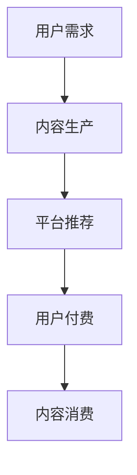

**核心算法原理讲解**：

伪代码：
```python
def knowledge_paid_model(user_demand, content_quality, platform_recommendation):
    if user_demand > threshold and content_quality > threshold and platform_recommendation > threshold:
        return "用户选择付费"
    else:
        return "用户不选择付费"
```

##### 1.2 知识付费的兴起与发展

知识付费的兴起主要受到以下几个因素的推动：

1. **互联网技术的发展**：互联网的普及为知识付费提供了便捷的渠道和平台。
2. **用户教育意识的提高**：随着社会的发展，人们越来越重视终身学习和自我提升。
3. **内容创作者的崛起**：越来越多的专业人士和爱好者投身于内容创作，提供了丰富的知识内容。
4. **商业模式创新**：知识付费平台通过订阅制、打赏制、课程制等商业模式不断创新，吸引了大量用户。

知识付费的发展可以分为以下几个阶段：

1. **初级阶段（2010年以前）**：知识付费的初步尝试，用户和平台都在摸索中前进。
2. **快速增长期（2010-2015年）**：随着互联网的普及，知识付费开始迅速发展，形成了一定规模的市场。
3. **成熟期（2015-2020年）**：知识付费市场逐渐成熟，平台和内容创作者数量大幅增加，用户规模不断扩大。
4. **持续创新与发展（2020年至今）**：知识付费市场在疫情期间得到了进一步发展，同时平台和内容创作者也在不断探索新的商业模式和内容形式。

**核心算法原理讲解**：

伪代码：
```python
def knowledge_paid_growth(year):
    if year < 2010:
        return "初期发展"
    elif 2010 <= year <= 2015:
        return "快速增长期"
    elif 2015 <= year <= 2020:
        return "成熟期"
    else:
        return "持续创新与发展"
```

##### 1.3 知识付费的市场规模与用户分析

知识付费市场的规模随着时间不断增长。根据相关报告，2019年全球知识付费市场规模已经超过2000亿美元，预计到2025年将达到5000亿美元。

**Mermaid流程图**：
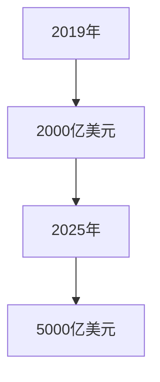

知识付费用户主要集中在以下几个群体：

1. **职场人士**：这部分用户希望通过知识付费提升自身职业能力和竞争力。
2. **学生**：大学生和研究生等学生群体通过知识付费学习专业知识，为未来的职业发展做准备。
3. **兴趣爱好者**：这部分用户对特定领域的知识有浓厚的兴趣，希望通过知识付费深入学习。
4. **创业者**：创业者通过知识付费获取创业指导、市场营销等专业知识，提升创业成功率。

**数学模型和数学公式**：
$$
\text{知识付费用户群体分布} = p_1 \times \text{职场人士} + p_2 \times \text{学生} + p_3 \times \text{兴趣爱好者} + p_4 \times \text{创业者}
$$
其中，$p_1, p_2, p_3, p_4$ 分别表示不同用户群体的比例。

**举例说明**：

假设职场人士、学生、兴趣爱好者和创业者的比例分别为 0.3、0.2、0.3 和 0.2，那么知识付费用户群体分布可以表示为：

$$
\text{知识付费用户群体分布} = 0.3 \times \text{职场人士} + 0.2 \times \text{学生} + 0.3 \times \text{兴趣爱好者} + 0.2 \times \text{创业者}
$$

通过以上分析，我们可以看到知识付费在当今社会的重要性以及其广阔的发展前景。对于程序员这一特殊群体，通过知识付费获取专业知识和技能，无疑是一种高效的学习方式。

### 第2章：知识付费的平台与模式

知识付费的兴起离不开众多知识付费平台的推动。这些平台不仅提供了丰富的知识内容，还通过多样化的商业模式和盈利模式，吸引了大量用户。本节将分析知识付费平台的分类、商业模式以及盈利模式，为程序员提供参考。

#### 2.1 知识付费平台分类

知识付费平台根据内容类型、运营模式和服务对象等不同，可以分为以下几类：

1. **综合类平台**：这类平台提供多种类型的知识内容，包括课程、电子书、讲座等。代表平台有“知乎”、“得到”等。

2. **垂直类平台**：这类平台专注于特定领域的知识内容，如编程、设计、营销等。代表平台有“极客时间”、“优设网”等。

3. **社区类平台**：这类平台以社区互动为核心，用户可以在平台上分享知识、讨论问题，如“简书”、“分答”等。

4. **课程类平台**：这类平台专注于提供在线课程，包括视频课程、直播课程等。代表平台有“网易云课堂”、“腾讯课堂”等。

**Mermaid流程图**：
```mermaid
graph TD
    A[综合类平台] --> B{垂直类平台}
    A --> C[社区类平台]
    A --> D[课程类平台]
    B --> E{"知乎"、"得到"}
    C --> F{"简书"、"分答"}
    D --> G{"网易云课堂"、"腾讯课堂"}
```

#### 2.2 知识付费的商业模式

知识付费平台通过多种商业模式为用户和内容创作者提供价值。以下是几种常见的商业模式：

1. **课程订阅模式**：用户通过支付一定费用，订阅平台上的课程内容，获得长期的学习权益。如“得到”的《李笑来专栏》。

2. **单次购买模式**：用户针对某个特定课程或内容支付一次性费用，获得该内容的学习权益。如“极客时间”的单门课程。

3. **打赏模式**：用户对平台上的优质内容进行打赏，以表达对创作者的支持和认可。如“简书”的打赏功能。

4. **会员模式**：用户支付会员费用，获得平台提供的会员权益，如免费学习部分课程、优先参与活动等。如“知乎”的会员服务。

**Mermaid流程图**：
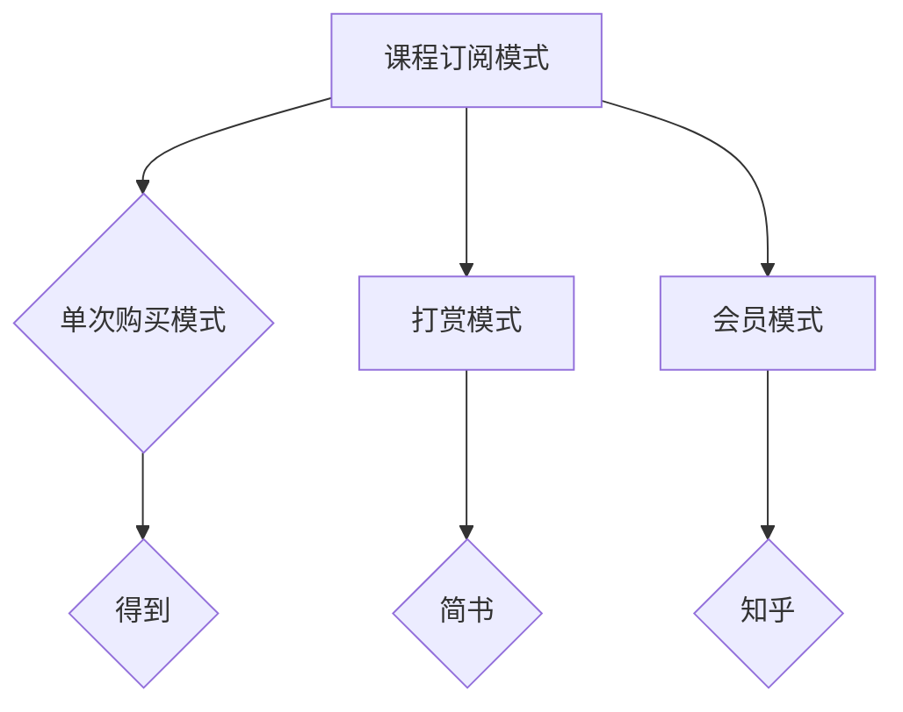

#### 2.3 知识付费的盈利模式

知识付费平台的盈利模式主要包括以下几种：

1. **内容销售**：平台通过销售课程、电子书等知识内容获得收入。

2. **广告收入**：平台通过投放广告获得收入，包括内容广告、弹窗广告等。

3. **会员订阅**：平台通过会员订阅服务获得持续收入。

4. **增值服务**：平台提供一些增值服务，如线下活动、一对一辅导等，以获得额外收入。

**Mermaid流程图**：
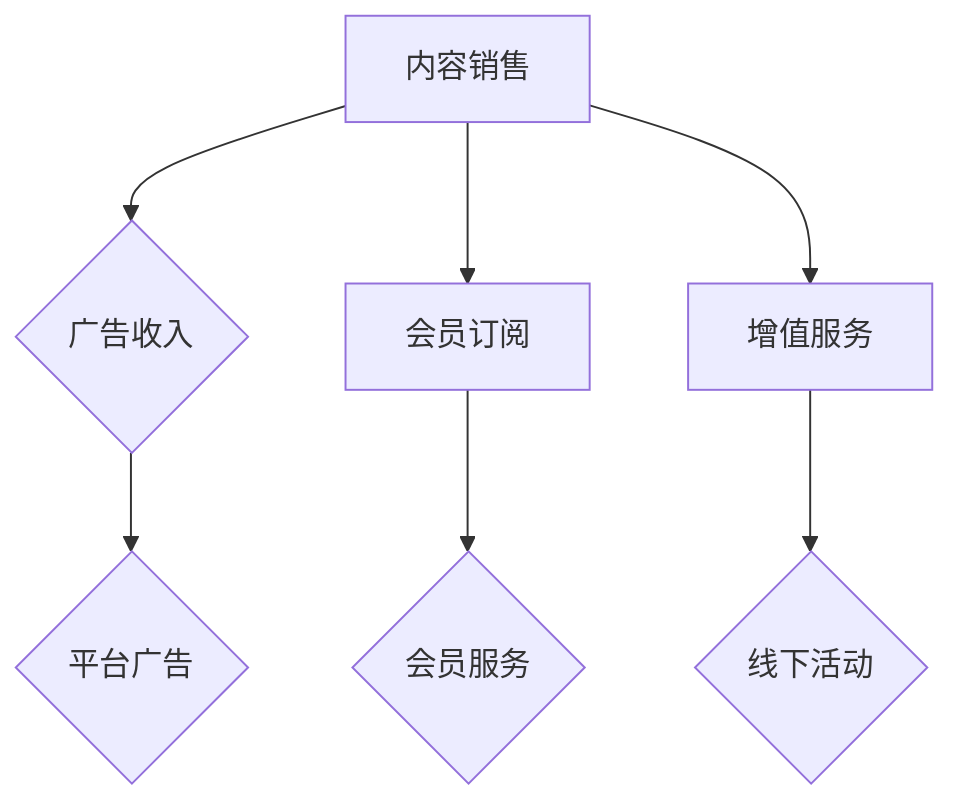

通过以上分析，我们可以看到知识付费平台在商业模式和盈利模式上具有多样性，为程序员提供了丰富的学习资源和多样化的学习方式。

### 第二部分：体验式课程设计

#### 第3章：体验式课程概述

体验式课程是一种以学生为中心、注重实践和体验的教育模式。它强调通过真实情境中的互动和反馈，帮助学生理解和掌握知识。在本章中，我们将探讨体验式教育的概念与特点，以及体验式课程的设计原则和教学方法。

##### 3.1 体验式教育的概念与特点

体验式教育起源于20世纪中期，最早应用于企业管理培训。后来，这种教育模式逐渐被教育界接受，并在中小学、高等教育以及职业培训中得到广泛应用。体验式教育的核心在于通过体验、实践和反思，促进学生的全面发展。

**概念**：

体验式教育是一种以学习者为中心的教育模式，强调在真实情境中通过体验、实践和反思来学习。它不同于传统的灌输式教育，更注重学生的主体性和参与度。

**特点**：

1. **以学生为中心**：体验式教育关注学生的需求和兴趣，尊重学生的个性，鼓励学生主动参与和探索。

2. **注重实践和体验**：体验式教育强调通过实际操作和体验来学习，让学生在真实情境中感受和理解知识。

3. **反思和总结**：体验式教育鼓励学生在实践后进行反思和总结，通过思考和讨论来深化对知识的理解。

4. **多元化的教学方式**：体验式教育采用多种教学方式，如小组讨论、角色扮演、案例分析、项目实践等，以丰富学生的学习体验。

**Mermaid流程图**：

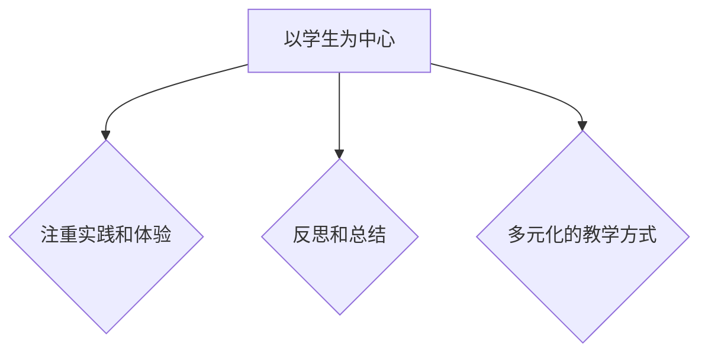

##### 3.2 体验式课程的设计原则

设计体验式课程需要遵循以下原则，以确保课程的实效性和学生的参与度：

1. **明确课程目标**：首先，要明确课程的目标和预期效果，确保课程设计能够实现这些目标。

2. **创设真实情境**：体验式课程强调在真实情境中学习，因此需要创设与实际工作或生活相关的情境，让学生能够在其中体验和解决问题。

3. **激发学生兴趣**：课程设计要能够激发学生的兴趣和好奇心，让他们主动参与到课程中。

4. **提供充分的实践机会**：体验式课程需要提供足够的实践机会，让学生能够在实际操作中掌握知识和技能。

5. **鼓励互动和合作**：通过小组讨论、角色扮演、项目实践等方式，鼓励学生之间的互动和合作，提高学习效果。

6. **重视反馈和反思**：在课程结束后，要提供反馈和反思的机会，帮助学生总结学习成果，加深对知识的理解。

**Mermaid流程图**：

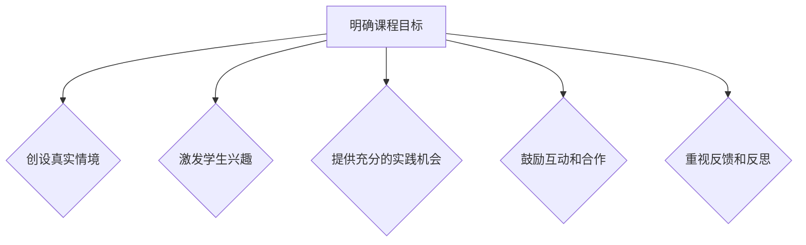

##### 3.3 体验式课程的教学方法

体验式课程的教学方法多种多样，以下介绍几种常用的教学方法：

1. **项目式学习**：通过完成实际项目，让学生在解决实际问题的过程中学习和应用知识。

2. **案例教学法**：通过分析实际案例，让学生了解和掌握知识，并培养解决问题的能力。

3. **角色扮演**：让学生扮演不同角色，模拟实际工作场景，体验和解决问题。

4. **小组讨论**：通过小组讨论，促进学生之间的交流和合作，共同解决问题。

5. **实验和实践**：通过实验和实践，让学生在动手操作中掌握知识和技能。

**Mermaid流程图**：

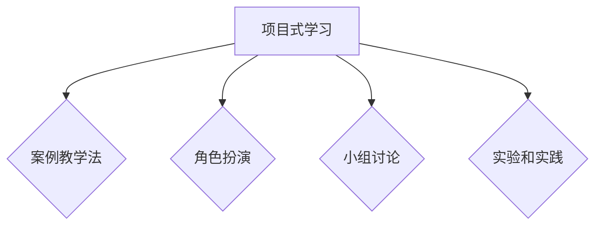

通过本章的介绍，我们可以看到体验式课程的设计原则和教学方法，为程序员提供了一种全新的学习模式。在接下来的章节中，我们将进一步探讨如何规划课程内容、设计互动活动以及实施和推广体验式课程。

### 第4章：课程内容规划

课程内容规划是体验式课程设计的关键环节，它决定了课程能否有效实现教学目标。本节将详细讨论如何确定课程目标、设计课程模块与结构，以及编写课程大纲与教案，以确保课程内容科学、系统、实用。

#### 4.1 确定课程目标

课程目标是课程设计的出发点和归宿，是课程内容规划的核心。确定课程目标需要遵循以下步骤：

1. **分析用户需求**：了解学生的背景、学习动机、职业目标和知识需求，确保课程目标符合学生的实际需求。

2. **明确课程范围**：根据用户需求和课程性质，明确课程所涉及的知识点和技能点，为课程目标的设定提供依据。

3. **设定学习目标**：结合课程范围和用户需求，设定具体、可量化的学习目标。例如，掌握某项编程语言的基本语法、能够解决特定类型的问题等。

4. **制定评估标准**：为每个学习目标制定评估标准，以便在课程结束后对学生的学习效果进行评估。

**Mermaid流程图**：

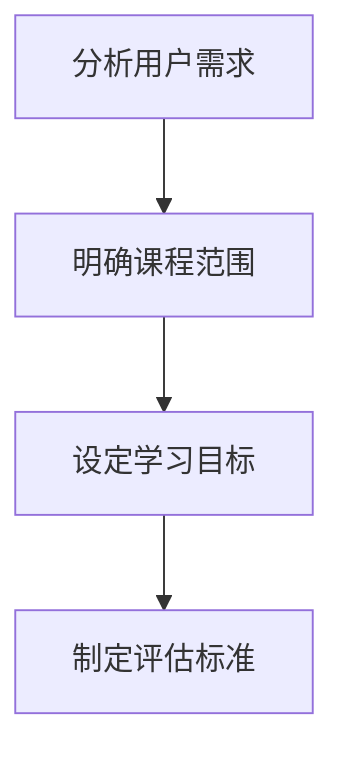

**举例说明**：

以《Python编程入门》课程为例，其学习目标可以设定为：

1. 掌握Python的基本语法和编程规范。
2. 能够使用Python编写简单的程序，解决实际问题。
3. 了解Python在数据科学和人工智能领域的应用。

#### 4.2 设计课程模块与结构

课程模块与结构是课程内容的具体划分和组织，它决定了课程的教学流程和学生的学习路径。设计课程模块与结构需要遵循以下原则：

1. **模块化设计**：将课程内容划分为若干个模块，每个模块包含一个或多个学习目标。

2. **循序渐进**：根据学生的认知规律和学习进度，合理规划模块的顺序和难度，确保学生能够逐步掌握知识。

3. **理论与实践结合**：每个模块不仅要包含理论知识，还要有相应的实践内容，帮助学生将知识应用于实际场景。

4. **灵活性**：课程模块和结构应具有一定的灵活性，以便根据实际情况进行调整和优化。

**Mermaid流程图**：

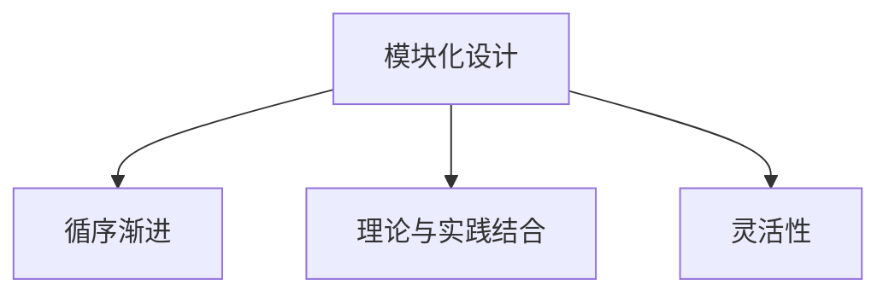

**举例说明**：

以《Python编程入门》课程为例，其模块结构可以设计为：

1. **基础语法**：介绍Python的基本语法和编程规范。
2. **数据类型**：讲解Python的基本数据类型及其操作。
3. **控制结构**：介绍条件语句和循环结构。
4. **函数与模块**：讲解函数的定义和使用，以及模块的导入与使用。
5. **文件操作**：介绍文件读取和写入的基本方法。
6. **实战项目**：通过实际项目，巩固所学知识，提高编程能力。

#### 4.3 编写课程大纲与教案

课程大纲和教案是课程内容的具体实施指南，它详细描述了课程的内容、教学方法和时间分配。编写课程大纲与教案需要遵循以下步骤：

1. **编写课程大纲**：课程大纲是课程内容的总体框架，包括课程名称、课程目标、课程模块、每个模块的内容和学习目标等。

2. **编写教案**：教案是每个模块的具体实施计划，包括教学目标、教学内容、教学方法、教学资源、教学步骤、作业布置等。

3. **教案模板**：

   - **教学目标**：明确本节课的教学目标和预期效果。
   - **教学内容**：列出本节课需要讲解的知识点和技能点。
   - **教学方法**：选择适合的教学方法，如讲授、讨论、实验等。
   - **教学资源**：列出需要使用的教材、PPT、实验工具等。
   - **教学步骤**：详细描述教学过程，包括引入、讲解、实践、总结等环节。
   - **作业布置**：布置相应的课后作业，巩固所学知识。

**Mermaid流程图**：

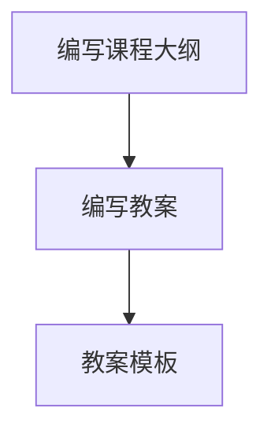

**举例说明**：

以《Python基础语法》模块为例，其课程大纲和教案可以设计如下：

**课程大纲**：

- 课程名称：《Python编程入门》
- 课程目标：掌握Python的基本语法和编程规范。
- 课程模块：基础语法、数据类型、控制结构、函数与模块、文件操作、实战项目。
- 每个模块的内容和学习目标：

  - **基础语法**：介绍Python的基本语法和编程规范。

**教案**：

- **教学目标**：了解Python的基本语法，能够编写简单的Python程序。
- **教学内容**：介绍变量、数据类型、输入输出等基本语法。
- **教学方法**：讲授+实验。
- **教学资源**：教材《Python编程从入门到实践》、PPT、Python解释器。
- **教学步骤**：

  1. 引入：介绍Python的背景和应用场景。
  2. 讲解：讲解Python的基本语法，包括变量、数据类型、输入输出等。
  3. 实验：引导学生编写简单的Python程序，如计算器、排序算法等。
  4. 总结：回顾本节课的学习内容，强调重点和难点。

通过以上步骤，我们可以科学、系统地规划课程内容，为程序员提供高质量的学习体验。

### 第5章：课程互动设计

课程互动设计是体验式课程的重要组成部分，它通过多种互动形式和工具，增强学生的参与度和学习效果。本节将探讨互动式教学的定义与作用，以及如何设计互动活动与工具，并介绍考核评价与反馈机制。

#### 5.1 互动式教学的定义与作用

互动式教学是一种以学生为中心的教学方法，强调在教师引导下，通过学生与教师、学生与学生之间的互动，促进学生对知识的理解和应用。其定义和作用如下：

**定义**：

互动式教学是一种以学生为中心的教学模式，通过教师与学生之间的互动、学生与学生之间的互动，实现知识传授、技能培养和情感交流。

**作用**：

1. **提高学习效果**：互动式教学能够激发学生的学习兴趣和主动性，提高学习效果。
2. **促进知识内化**：通过互动，学生能够在实际应用中理解和掌握知识，实现知识内化。
3. **培养沟通能力**：互动式教学鼓励学生发表观点、讨论问题，提高学生的沟通和表达能力。
4. **增强课堂氛围**：互动式教学营造轻松、活跃的课堂氛围，有助于学生的情感投入和课堂参与。

**Mermaid流程图**：

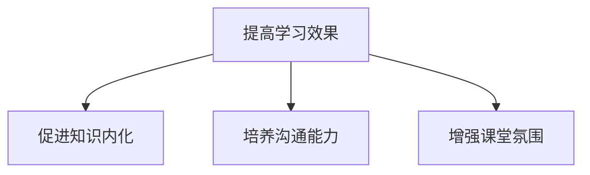

#### 5.2 设计互动活动与工具

设计互动活动与工具是互动式教学的关键。以下介绍几种常用的互动活动和工具：

1. **讨论与问答**：

   - **形式**：教师提出问题，学生进行讨论和回答。
   - **作用**：激发学生的思考和表达，培养问题解决能力。

2. **小组合作**：

   - **形式**：将学生分成小组，共同完成一个项目或任务。
   - **作用**：培养团队合作精神和沟通能力，提高问题解决能力。

3. **案例分析**：

   - **形式**：提供真实案例，学生进行分析和讨论。
   - **作用**：通过实际案例，帮助学生理解和应用知识。

4. **角色扮演**：

   - **形式**：学生扮演特定角色，模拟实际工作场景。
   - **作用**：提高学生的实际操作能力和职业素养。

5. **在线讨论**：

   - **形式**：利用在线平台进行讨论，如论坛、微信群等。
   - **作用**：拓宽讨论范围，增加学生的参与度。

6. **实验与实践**：

   - **形式**：通过实验和实践，验证和应用所学知识。
   - **作用**：提高学生的动手能力和实际操作能力。

**Mermaid流程图**：

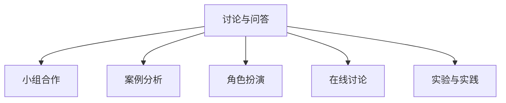

#### 5.3 考核评价与反馈机制

考核评价与反馈机制是互动式教学的重要环节，它能够及时了解学生的学习效果，为教学提供反馈。以下介绍考核评价与反馈机制的设计：

1. **考核内容**：

   - **知识考核**：对学生的知识掌握程度进行考核，如笔试、口试等。
   - **技能考核**：对学生的技能应用能力进行考核，如编程实践、项目展示等。
   - **态度考核**：对学生的课堂参与度和团队合作精神进行考核。

2. **评价方法**：

   - **量化评价**：采用分数或评级的方式，对学生的表现进行量化评价。
   - **质性评价**：通过评语或反馈，对学生的表现进行质性评价。
   - **自我评价**：鼓励学生进行自我评价，提高自我反思能力。

3. **反馈机制**：

   - **即时反馈**：在课程结束后，及时给予学生反馈，指出优点和不足。
   - **定期反馈**：定期进行课程总结和反馈，帮助学生发现和解决问题。
   - **互动反馈**：鼓励学生之间相互评价和反馈，促进共同进步。

**Mermaid流程图**：

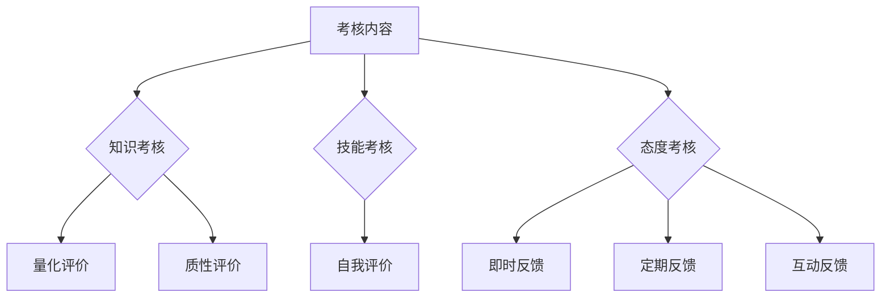

通过互动式教学的设计和实施，可以有效地提高学生的学习效果和参与度，为程序员提供更加丰富和实用的学习体验。

### 第6章：课程实施策略

课程实施是知识付费平台成功的关键环节，它决定了课程内容能否得到有效传播和用户能否获得满意的体验。本节将探讨课程实施的策略，包括制定课程实施计划、课程推广与营销以及课程运营与管理。

#### 6.1 制定课程实施计划

制定课程实施计划是确保课程按计划顺利进行的基础。以下步骤有助于制定有效的课程实施计划：

1. **确定课程目标**：明确课程的目标和预期效果，确保课程实施计划与课程目标一致。

2. **规划课程时间表**：根据课程内容和目标，制定详细的时间表，包括每个模块的学习时间、作业时间、考核时间等。

3. **分配资源**：合理分配人力资源、物资资源和财务资源，确保课程实施所需资源充足。

4. **制定课程流程**：详细描述课程实施的过程，包括教学环节、互动环节、考核环节等。

5. **制定应急预案**：为可能出现的突发情况制定应急预案，确保课程能够顺利实施。

**Mermaid流程图**：

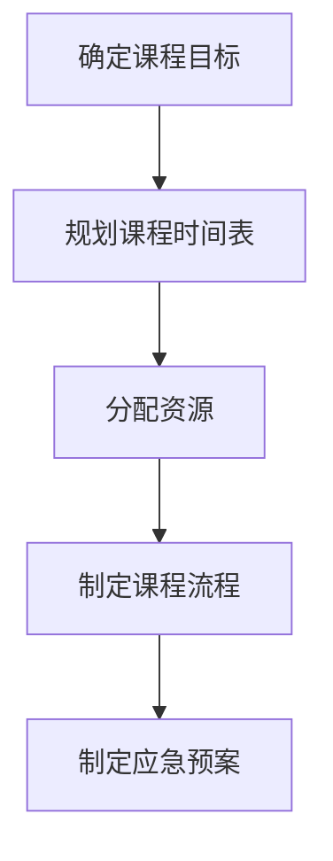

#### 6.2 课程推广与营销

课程推广与营销是吸引学员、提升课程知名度和影响力的重要手段。以下策略有助于有效推广和营销课程：

1. **内容营销**：通过高质量的课程内容吸引学员，内容营销的核心在于提供有价值、有吸引力的内容。

2. **社交媒体推广**：利用社交媒体平台，如微博、微信、抖音等，进行课程宣传和推广。

3. **合作伙伴**：与相关领域的公司、行业协会、教育机构等建立合作关系，共同推广课程。

4. **线下活动**：举办线下讲座、研讨会、沙龙等活动，增加课程曝光度和知名度。

5. **优惠活动**：通过优惠活动，如限时折扣、优惠券等，吸引学员报名。

**Mermaid流程图**：

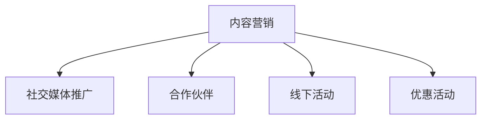

#### 6.3 课程运营与管理

课程运营与管理是确保课程长期稳定运行的重要环节。以下策略有助于提升课程运营效率：

1. **学员管理**：建立学员档案，记录学员的学习进度、考核成绩、反馈意见等，以便进行个性化服务和反馈。

2. **内容更新**：定期更新课程内容，确保课程与行业发展和学员需求保持一致。

3. **互动管理**：鼓励学员参与互动，通过在线讨论、答疑等方式，提升学员的参与度和学习效果。

4. **质量监控**：建立课程质量监控机制，定期对课程内容、教学方法、学员反馈等进行评估，确保课程质量。

5. **数据分析**：利用数据分析工具，对课程运营数据进行分析，发现问题和改进点。

**Mermaid流程图**：

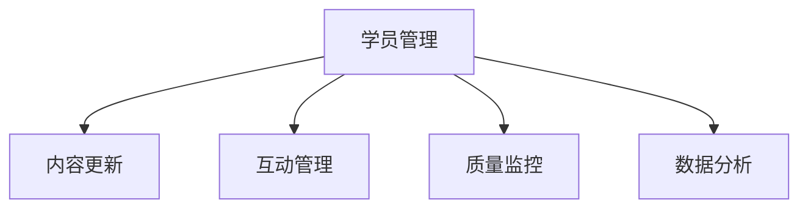

通过以上策略，可以确保课程实施计划的顺利执行，提升课程的市场竞争力，为学员提供优质的学习体验。

### 第7章：课程案例解析

在知识付费领域，成功和失败的案例都有其独特的价值。通过分析成功案例和失败案例，我们可以从中吸取经验教训，为课程的优化和推广提供有益的参考。本章将分享一些具有代表性的课程案例，探讨其成功和失败的原因，并总结经验教训。

#### 7.1 成功案例分享

**案例1：极客时间的《从0开始学Python》**

**成功原因**：

1. **课程内容实用性强**：课程内容紧密结合实际应用，教授学生如何使用Python解决实际问题。
2. **互动环节丰富**：通过在线讨论、答疑和实验，增强了学生的参与感和学习效果。
3. **持续更新**：课程内容定期更新，紧跟技术发展趋势，确保课程与行业需求保持一致。
4. **优秀的师资力量**：邀请行业专家和资深程序员授课，保证了课程的专业性和权威性。
5. **精准营销**：通过社交媒体和合作伙伴进行精准推广，吸引了大量目标学员。

**成功经验**：

- 内容实用性和互动性是关键。
- 定期更新和优秀师资是课程质量的保障。
- 精准营销有助于扩大课程影响力。

**案例2：网易云课堂的《Java从入门到精通》**

**成功原因**：

1. **课程结构合理**：课程内容循序渐进，从基础语法到高级应用，全面覆盖Java知识体系。
2. **实战项目丰富**：通过实际项目，让学生在解决实际问题的过程中掌握Java编程技能。
3. **教学视频质量高**：课程视频制作精良，讲解清晰，便于学生理解和学习。
4. **完善的考核机制**：通过作业、考试和项目评估等多种方式，全面考核学生的学习效果。
5. **良好的用户反馈**：及时收集用户反馈，不断优化课程内容和教学方式。

**成功经验**：

- 合理的课程结构和丰富的实战项目有助于提升学习效果。
- 高质量的教学视频和完善的考核机制是课程成功的保障。
- 用户反馈是优化课程的重要依据。

#### 7.2 失败案例分析与启示

**案例1：某在线教育平台的《前端工程师进阶课程》**

**失败原因**：

1. **课程内容过时**：课程内容没有及时更新，与当前前端技术发展趋势脱节。
2. **互动环节不足**：课程缺乏互动，学生缺乏参与感，学习效果不佳。
3. **师资力量不足**：授课教师技术水平有限，无法满足学员的学习需求。
4. **营销推广不力**：课程推广力度不足，目标学员难以获取课程信息。
5. **售后服务不到位**：学员在学习过程中遇到问题，无法及时得到解答和帮助。

**失败教训**：

- 定期更新课程内容和保持与行业发展趋势的一致性至关重要。
- 互动环节的设计和执行是提高学习效果的关键。
- 师资力量的配备和营销推广的力度直接影响课程的成功。
- 售后服务的质量直接影响学员的满意度和口碑。

**案例2：某知识付费平台的《人工智能入门课程》**

**失败原因**：

1. **课程内容浅显**：课程内容过于基础，难以满足有一定基础的学员需求。
2. **实战项目缺乏**：课程缺少实际项目训练，学员难以将所学知识应用于实际场景。
3. **课程难度过高**：课程难度超出学员预期，导致学员学习困难，流失率增加。
4. **课程推广不当**：课程定位不准确，推广策略不当，未能有效吸引目标学员。
5. **用户反馈未重视**：未能及时收集和处理学员的反馈，导致课程质量问题得不到改善。

**失败教训**：

- 课程内容的深度和难度需要与学员的背景和需求相匹配。
- 实战项目是学员掌握知识的重要途径，应予以重视。
- 课程定位和推广策略需要精准，以吸引目标学员。
- 用户反馈是课程优化的宝贵资源，应认真对待。

通过以上成功和失败案例的分析，我们可以得出以下启示：

- **内容更新和实战项目是课程质量的重要保障**。
- **互动环节和课程推广是提升学习效果和课程知名度的重要手段**。
- **用户反馈是优化课程和提升服务质量的关键依据**。
- **课程定位和目标学员需求分析是课程设计和推广的基础**。

### 7.3 持续优化与迭代

课程设计和实施不是一次性的过程，而是一个持续优化和迭代的过程。以下策略有助于课程持续优化：

1. **定期评估**：定期对课程内容、教学效果和学员反馈进行评估，找出存在的问题和改进点。
2. **用户调研**：通过问卷调查、访谈等方式，了解学员的需求和意见，为课程优化提供依据。
3. **课程迭代**：根据评估和调研结果，对课程进行持续迭代和优化，提升课程质量。
4. **技术创新**：利用人工智能、大数据等新技术，提高课程互动性和个性化服务水平。
5. **外部合作**：与行业专家、培训机构、企业等建立合作关系，共同开发和推广课程。

通过以上策略，知识付费平台可以不断提升课程质量和学员满意度，实现可持续发展。

### 第四部分：技术支持与工具

#### 第8章：技术支持在知识付费中的作用

在知识付费领域，技术支持扮演着至关重要的角色。它不仅确保了平台的服务质量和用户体验，还直接影响着内容创作者和学员的满意度和学习效果。本节将探讨技术支持的概念与重要性，技术支持的服务体系，以及常见问题与解决方案。

#### 8.1 技术支持的概念与重要性

**概念**：

技术支持是指通过对知识付费平台进行技术保障和问题解决，确保平台稳定运行、服务高效、用户体验良好的服务。技术支持通常包括系统维护、故障排查、性能优化、安全防护等方面。

**重要性**：

1. **确保平台稳定性**：技术支持能够及时发现和解决平台系统故障，确保平台稳定运行，避免因系统故障导致的服务中断。
2. **提升用户体验**：通过技术支持，平台能够提供更快速、更顺畅的服务，提升用户的学习体验和满意度。
3. **保障内容创作者权益**：技术支持有助于保护内容创作者的版权和收益，确保他们的创作成果得到有效传播和回报。
4. **提高内容质量**：技术支持能够通过数据分析和技术手段，优化课程内容和教学方法，提高课程质量。
5. **保障数据安全**：技术支持通过安全防护措施，确保用户数据的安全和隐私，增强用户对平台的信任。

**Mermaid流程图**：

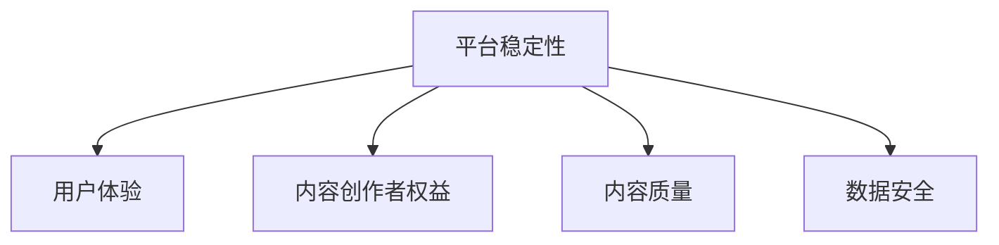

#### 8.2 技术支持的服务体系

技术支持的服务体系包括以下几个方面：

1. **系统维护**：定期对平台系统进行维护和更新，确保系统的稳定性和安全性。
2. **故障排查**：在平台出现故障时，迅速定位问题并解决问题，确保服务不中断。
3. **性能优化**：通过性能监控和优化，提升平台的响应速度和稳定性。
4. **安全防护**：建立完善的安全防护机制，包括防火墙、加密技术、安全审计等，保障平台和用户数据的安全。
5. **技术培训**：为内容创作者和用户提供技术培训，提高他们的技术水平和服务能力。
6. **用户支持**：通过在线客服、电话支持等多种方式，为用户提供及时的技术支持和咨询服务。

**Mermaid流程图**：

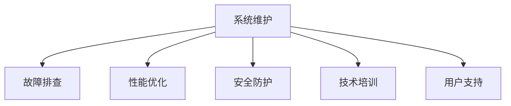

#### 8.3 常见问题与解决方案

在知识付费平台的运营过程中，常见的技术问题包括系统故障、数据丢失、安全漏洞等。以下是一些常见问题及其解决方案：

**问题1：系统故障**

**解决方案**：

- **定期维护和更新**：定期对系统进行维护和更新，确保系统的稳定性和安全性。
- **备份和恢复**：建立数据备份机制，确保在系统故障时能够快速恢复。
- **故障监测**：通过故障监测工具，实时监控系统运行状态，及时发现和解决问题。

**问题2：数据丢失**

**解决方案**：

- **数据备份**：定期备份重要数据，确保在数据丢失时能够恢复。
- **数据加密**：对重要数据加密，防止数据泄露。
- **数据恢复**：在数据丢失时，利用数据恢复工具进行数据恢复。

**问题3：安全漏洞**

**解决方案**：

- **安全审计**：定期进行安全审计，发现和修复安全漏洞。
- **防火墙和加密技术**：建立防火墙和加密技术，防止外部攻击和数据泄露。
- **用户权限管理**：合理设置用户权限，防止内部人员恶意操作。

通过以上技术支持的服务体系、常见问题及其解决方案，知识付费平台能够提供更加稳定、安全、高效的服务，为用户和内容创作者创造更好的使用体验。

### 第9章：知识付费工具选择与使用

在知识付费领域，选择合适的工具对于平台运营和课程实施至关重要。本节将介绍几种常见的知识付费工具，包括在线教育平台、课程管理系统和互动工具，并提供选择和使用这些工具的建议。

#### 9.1 常见知识付费工具介绍

**1. 在线教育平台**

在线教育平台是知识付费的核心工具，提供课程发布、学员管理、互动交流等功能。以下是一些常见的在线教育平台：

- **Moodle**：一款开源的在线教育平台，支持多种教学活动和互动功能，适用于中小型教育机构。
- **Canvas**：一款功能丰富的在线学习管理系统，提供课程管理、学生跟踪、作业提交等功能。
- **Blackboard**：一款广泛应用于高等教育领域的在线教育平台，提供强大的课程管理工具和互动功能。

**2. 课程管理系统**

课程管理系统用于管理课程内容、课程进度、学员学习记录等。以下是一些常见的课程管理系统：

- **Sakai**：一款开源的课程管理系统，支持课程发布、作业提交、讨论区等功能。
- **Schoology**：一款集课程管理、学生跟踪和互动交流于一体的在线学习平台。
- **Instructure**：一款集课程管理、学生评估和互动功能于一体的课程管理系统。

**3. 互动工具**

互动工具用于增强课程互动性和学员参与度，以下是一些常见的互动工具：

- **Zoom**：一款视频会议工具，支持实时直播、在线讨论和互动问答。
- **Slack**：一款团队协作工具，支持消息传递、文件共享和在线讨论。
- **Trello**：一款项目管理工具，支持任务分配、进度跟踪和协作讨论。

#### 9.2 选择合适的工具

选择合适的知识付费工具需要考虑以下因素：

1. **功能需求**：根据平台和课程的需求，选择具有相应功能的工具。
2. **用户界面**：用户界面应简洁直观，易于操作，提高用户体验。
3. **兼容性**：工具应与现有的IT基础设施兼容，确保顺利集成。
4. **安全性**：工具应具备良好的安全性能，确保数据安全和用户隐私。
5. **成本**：考虑工具的预算和性价比，选择适合的工具。

**9.3 工具的使用与优化**

**1. 使用指南**：

- **在线教育平台**：发布课程内容、设置课程进度、管理学员信息、组织互动活动等。
- **课程管理系统**：创建课程、上传资料、布置作业、跟踪学员学习进度等。
- **互动工具**：组织在线讨论、实时直播、互动问答等，增强课程互动性和学员参与度。

**2. 优化建议**：

- **定制化**：根据用户需求，对工具进行定制化配置，提升用户体验。
- **集成**：将工具与其他系统（如ERP、CRM等）集成，实现数据共享和流程优化。
- **培训与支持**：为用户提供培训和技术支持，确保工具能够有效使用。
- **反馈与改进**：定期收集用户反馈，优化工具功能和性能，提升服务质量和用户满意度。

通过合理选择和使用知识付费工具，平台可以提供更优质的服务，提升用户体验，增强课程的互动性和效果。

### 附录

#### 附录A：课程设计与实施资源

为了帮助程序员更好地设计和实施体验式课程，以下是推荐的一些书籍、在线课程和行业报告，以及相关的资源和资讯。

##### A.1 相关书籍与文献推荐

1. **《体验式教学设计》**：作者：陈伟光
   - 内容简介：详细介绍了体验式教学的设计原则和方法，适用于各类教育场景。

2. **《程序员的成长之路》**：作者：刘未鹏
   - 内容简介：从程序员的角度出发，探讨了编程技能的提升和学习方法。

3. **《在线教育理论与实践》**：作者：汪琼
   - 内容简介：分析了在线教育的理论基础和实践经验，对知识付费平台有重要参考价值。

##### A.2 在线课程与教程推荐

1. **“极客时间”**：提供了多种编程语言和技术的在线课程，适合不同层次的程序员学习。

2. **“网易云课堂”**：涵盖了Java、Python、前端开发等多种编程课程，适合从入门到进阶的学习。

3. **“慕课网”**：提供了丰富的编程教程和实战项目，有助于提升编程技能。

##### A.3 行业报告与资讯

1. **《中国在线教育行业发展报告》**：分析了在线教育市场的现状、趋势和主要玩家。

2. **《知识付费市场研究报告》**：详细介绍了知识付费市场的规模、用户行为和商业模式。

3. **“36氪”**：关注互联网和科技领域的资讯，包括在线教育、知识付费等领域的最新动态。

通过以上书籍、在线课程、行业报告和资讯，程序员可以获取丰富的学习资源和行业洞察，为课程设计与实施提供参考。

### 附录B：案例研究与数据分析

为了更好地理解知识付费行业的实际运行情况，本节将通过案例研究和数据分析，深入探讨知识付费行业的运作模式、用户行为以及课程效果。

#### B.1 知识付费行业的案例研究

**案例1：某知名在线教育平台的发展历程**

该在线教育平台成立于2015年，起初专注于职业培训课程。通过不断优化课程内容和用户体验，逐步扩展到K12教育和高等教育领域。以下是该平台的发展历程：

1. **初期发展（2015-2018年）**：平台主要提供职业培训课程，如编程、设计、营销等，通过口碑传播和社交媒体推广，吸引了一大批用户。

2. **快速增长期（2018-2020年）**：随着在线教育市场的兴起，平台进一步优化课程内容和教学方法，推出了一系列精品课程，用户数量迅速增长。

3. **成熟期（2020-2022年）**：平台开始探索多元化发展，包括课程订阅、内容制作、线上线下结合等模式，实现了盈利模式的多元化。

4. **持续创新与发展（2022年至今）**：平台不断引入新技术，如人工智能、大数据等，提升课程质量和用户体验，同时通过国际化战略，开拓海外市场。

**案例分析**：

- **成功因素**：成功的因素包括精准的市场定位、优质的课程内容、有效的推广策略以及不断创新的发展模式。
- **经验教训**：经验教训包括持续关注用户需求、保持课程内容更新、提升技术支持水平以及灵活应对市场变化。

#### B.2 体验式课程的实证分析

**实证分析1：某编程入门课程的用户反馈**

某知名在线教育平台开设了一门《Python编程入门》课程，通过数据分析，研究了学员的学习效果和反馈。以下是分析结果：

1. **学员背景**：学员主要来自职场人士、大学生和编程爱好者，其中70%的学员对Python有一定了解，30%的学员为零基础。

2. **学习效果**：通过课程结束后的测试，发现学员的编程能力有显著提升，特别是在基础语法和常见算法方面。

3. **用户反馈**：学员普遍对课程内容和教学方法表示满意，认为课程内容实用、互动性强，有助于提升编程技能。

4. **问题反馈**：部分学员提出课程难度较高，建议降低入门门槛，增加基础内容的讲解和练习。

**分析结论**：

- **课程效果**：课程整体效果良好，达到了预期的教学目标，学员的编程能力有显著提升。
- **改进建议**：为了进一步提升课程效果，建议在课程设计时增加基础内容的讲解和练习，降低入门门槛。

#### B.3 数据分析与实战技巧

**数据分析1：知识付费用户的行为特征**

通过对某知识付费平台用户数据的分析，发现以下行为特征：

1. **用户活跃度**：用户活跃度与课程内容质量和平台服务质量密切相关。高活跃度的用户通常对课程内容感兴趣，且具有较强的学习意愿。

2. **用户留存率**：用户留存率反映了课程的吸引力和服务质量。通过分析用户留存率，可以发现课程的设计和教学方法对用户留存有重要影响。

3. **用户转化率**：用户转化率是指用户从免费试学到付费购买的比例。通过优化课程内容和推广策略，可以提升用户转化率。

**实战技巧1：提高用户活跃度的策略**

1. **课程内容创新**：定期更新课程内容，引入新技术和新观点，保持课程的新鲜感和吸引力。

2. **互动环节设计**：通过在线讨论、实时直播、互动问答等方式，增强课程的互动性和参与度。

3. **个性化推荐**：利用大数据和人工智能技术，为用户推荐感兴趣的课程，提高用户的学习积极性。

通过以上案例研究和数据分析，我们可以看到知识付费行业在实际运行中的成功经验和问题，以及如何通过数据分析和实战技巧提升课程效果和用户满意度。这些经验和方法对程序员的知识付费实践具有重要的指导意义。

### 总结与展望

本文通过对程序员知识付费的现状、体验式课程设计、课程实施策略、技术支持与工具，以及案例研究与数据分析的全面探讨，为程序员提供了一套系统化的知识付费解决方案。知识付费不仅为程序员提供了高效的学习途径，也为在线教育平台和内容创作者带来了新的商业模式。

**核心要点回顾**：

1. **知识付费的趋势**：知识付费已经成为在线教育的重要组成部分，为用户提供了丰富的学习资源。
2. **体验式课程设计**：体验式课程通过真实情境和实践，提升了学习效果和学员的参与度。
3. **课程实施策略**：制定详细的课程实施计划、推广策略和运营管理措施，是确保课程成功的关键。
4. **技术支持与工具**：技术支持在知识付费平台中起着至关重要的作用，选择合适的工具和系统化服务是提升用户体验的关键。

**未来展望**：

随着互联网技术的不断发展，知识付费领域将继续迎来新的变革。未来的发展方向包括：

1. **个性化学习**：利用人工智能和大数据技术，为用户提供更加个性化的学习路径和内容推荐。
2. **多元化内容**：除了编程和技术课程，还将涵盖更多的领域，如人文、艺术、管理等，满足不同用户的需求。
3. **线上线下结合**：通过线上线下相结合的方式，提供更加灵活和便捷的学习体验。
4. **全球化扩展**：开拓海外市场，将知识付费的理念和模式推广到全球范围。

**结语**：

知识付费为程序员提供了全新的学习模式和职业发展路径。通过本文的探讨，我们希望为程序员提供有益的参考，帮助他们在知识付费的浪潮中不断进步，实现自我提升和职业发展。

### 作者信息

**作者：AI天才研究院/AI Genius Institute & 禅与计算机程序设计艺术 /Zen And The Art of Computer Programming**

本文作者AI天才研究院/AI Genius Institute致力于推动人工智能技术的发展和应用，探讨编程和人工智能领域的最新趋势。同时，作者也专注于研究禅与计算机程序设计艺术，以独特的视角解读计算机编程的本质和哲学。

