                 

### 文章标题

**端到端学习自动驾驶模型的优化策略与案例启示**

---

> **关键词：** 端到端学习，自动驾驶，模型优化，深度学习，案例研究，算法

> **摘要：** 本文深入探讨了端到端学习在自动驾驶领域的应用及其优化策略。通过解析核心概念、算法原理、模型优化技术和实际应用案例，为自动驾驶技术的发展提供了新的思路和启示。

---

## 第1章：自动驾驶技术概述

自动驾驶技术是当代科技创新的前沿领域，其目标是通过计算机系统实现车辆自动行驶，减少人为干预，提高行驶安全性、效率和环境适应性。本章将简要介绍自动驾驶技术的发展历史、分类及其在端到端学习中的重要性。

### 1.1 自主驾驶技术发展历史

自动驾驶技术的发展可以追溯到20世纪40年代，当时科学家们开始研究自动化导航和自动驾驶。以下是一些重要的里程碑：

- **1950年代：** 美国海军开发了自动驾驶的实验性船舶。
- **1970年代：** 早期自动驾驶车辆如福特的“欧米茄”和卡内基梅隆大学的“Navlab”项目取得显著进展。
- **1980年代：** 美国国防高级研究计划局（DARPA）举办了多次自动驾驶车辆挑战赛，推动了技术的快速发展。
- **1990年代：** 自动驾驶技术开始应用于商用车辆，如自动泊车系统。
- **2000年代至今：** 随着深度学习和人工智能的兴起，自动驾驶技术取得了重大突破，多家公司如谷歌、特斯拉、Uber等投入大量资源研发自动驾驶汽车。

### 1.2 自主驾驶技术的分类与层次

根据自动化程度的差异，自动驾驶技术通常分为以下几类：

- **L0（无自动化）：** 车辆不具备任何自动化功能。
- **L1（部分自动化）：** 车辆具备单一自动化功能，如自适应巡航控制。
- **L2（部分自动化）：** 车辆具备多项自动化功能，如自适应巡航控制和车道保持。
- **L3（有条件自动化）：** 车辆在特定条件下可以完全自动化行驶，但需要驾驶员在必要时接管控制。
- **L4（高度自动化）：** 车辆在特定环境下可以实现完全自动化行驶，无需驾驶员干预。
- **L5（完全自动化）：** 车辆在任何环境下都能实现完全自动化行驶。

### 1.3 端到端学习在自动驾驶中的应用

端到端学习在自动驾驶领域具有重要的应用价值，它通过直接将输入数据映射到输出结果，避免了传统机器学习中的特征工程和手工设计中间层，从而提高了模型训练的效率和准确性。以下是一些端到端学习在自动驾驶中的应用：

- **感知系统：** 使用卷积神经网络（CNN）对图像进行感知，检测车辆、行人、交通标志等。
- **决策系统：** 通过递归神经网络（RNN）处理连续的时间序列数据，进行驾驶决策。
- **路径规划：** 利用强化学习算法，自动驾驶车辆在复杂环境中进行路径规划和避障。

端到端学习为自动驾驶技术的发展带来了新的机遇，但同时也面临着一系列挑战，如数据质量、模型可解释性和安全性等。在下一章中，我们将进一步探讨端到端学习的核心概念与原理。

## 第2章：端到端学习核心概念与原理

端到端学习是一种深度学习范式，它通过设计复杂的神经网络模型，实现从输入数据直接映射到输出结果的过程。本章将介绍端到端学习的核心概念、机器学习与深度学习的基础，以及端到端学习的优势与挑战。

### 2.1 机器学习基础

机器学习是使计算机系统能够从数据中学习和改进自身性能的一门科学。其核心思想是通过算法从数据中提取规律，实现数据驱动的决策和预测。以下是机器学习的几个关键组成部分：

- **监督学习（Supervised Learning）：** 有标签的数据用于训练模型，模型的性能通过预测结果与真实标签的对比进行评估。
- **无监督学习（Unsupervised Learning）：** 没有标签的数据用于训练模型，目的是发现数据中的结构和规律。
- **半监督学习（Semi-supervised Learning）：** 结合有标签和无标签数据进行训练，以提高模型性能。
- **强化学习（Reinforcement Learning）：** 通过与环境互动，学习最优策略以实现目标。

### 2.2 深度学习原理

深度学习是机器学习的一个分支，通过多层神经网络模型对数据进行特征提取和学习。深度学习在图像识别、语音识别、自然语言处理等领域取得了显著成果。以下是深度学习的关键组成部分：

- **神经网络（Neural Networks）：** 模仿人脑神经元结构，通过权重和偏置调整进行学习和预测。
- **卷积神经网络（Convolutional Neural Networks，CNN）：** 特别适用于处理图像数据，通过卷积层提取特征。
- **递归神经网络（Recurrent Neural Networks，RNN）：** 适用于处理序列数据，通过递归结构保持长期依赖关系。
- **生成对抗网络（Generative Adversarial Networks，GAN）：** 通过两个对抗网络生成高质量的数据。

### 2.3 端到端学习的优势与挑战

端到端学习在自动驾驶等应用场景中具有显著的优势：

- **自动特征提取：** 端到端学习能够自动提取输入数据中的有效特征，避免了手工设计特征工程的复杂过程。
- **简化模型训练：** 直接将输入映射到输出，减少了模型参数的数量和训练难度。
- **提高模型性能：** 通过直接学习复杂映射关系，端到端学习在许多任务中实现了优异的性能。

然而，端到端学习也面临一些挑战：

- **数据需求：** 端到端学习通常需要大量高质量的数据进行训练，数据缺失或不平衡可能导致模型性能下降。
- **可解释性：** 端到端学习模型的内部机制复杂，难以解释其决策过程，这对应用场景中的安全性和可靠性提出了挑战。
- **过拟合：** 深层神经网络容易过拟合训练数据，导致在实际应用中表现不佳。

在下一章中，我们将探讨端到端学习的具体算法与架构，以及如何应用于自动驾驶领域。

### 第3章：端到端学习算法与架构

端到端学习在自动驾驶中的应用离不开具体算法与架构的支持。本章节将详细介绍几种关键的深度学习算法，包括卷积神经网络（CNN）和递归神经网络（RNN），并探讨如何构建端到端学习架构以实现自动驾驶任务。

#### 3.1 神经网络在自动驾驶中的应用

神经网络是端到端学习的基础，广泛应用于自动驾驶领域的感知、决策和规划任务。以下是一些关键应用场景：

- **感知系统：** 神经网络通过处理摄像头、激光雷达和超声波传感器等数据，识别道路标志、行人、车辆和障碍物。
- **决策系统：** 神经网络通过分析感知数据，进行驾驶决策，如速度控制、转向和刹车。
- **规划系统：** 神经网络通过生成可能的行驶轨迹，实现自动驾驶车辆的路径规划。

#### 3.2 卷积神经网络（CNN）原理

卷积神经网络（CNN）是处理图像数据的一种强大工具，其核心思想是通过卷积操作提取图像特征。以下是CNN的关键组成部分：

- **卷积层（Convolutional Layer）：** 通过卷积操作提取局部特征，减少数据维度。
- **池化层（Pooling Layer）：** 通过下采样操作降低数据复杂性。
- **激活函数（Activation Function）：** 引入非线性，使神经网络能够学习复杂函数。
- **全连接层（Fully Connected Layer）：** 将卷积层提取的特征映射到输出结果。

以下是一个简单的CNN架构的Mermaid流程图：

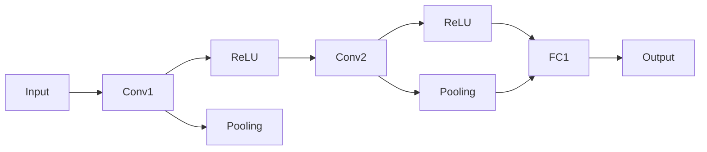

#### 3.3 递归神经网络（RNN）原理

递归神经网络（RNN）特别适用于处理时间序列数据，如驾驶行为和传感器数据。RNN通过递归结构保持长期依赖关系，以下是其关键组成部分：

- **隐藏状态（Hidden State）：** 记录当前时刻的信息。
- **循环连接（Recurrence Connection）：** 使神经网络能够利用之前时刻的信息进行当前时刻的预测。
- **门控机制（Gates）：** 通过控制信息的流动，防止长期依赖问题。

以下是一个简单的RNN架构的Mermaid流程图：

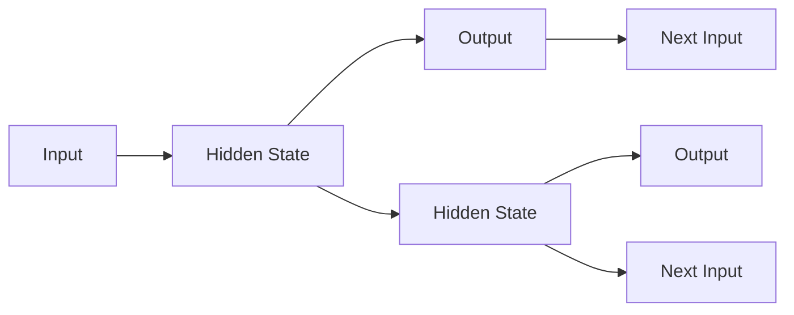

#### 3.4 端到端学习架构：感知器与决策器

端到端学习架构通过将感知器和决策器集成到一个统一模型中，实现了自动驾驶任务的端到端学习。以下是一个典型的端到端学习架构：

- **感知器：** 使用CNN对传感器数据（如摄像头、激光雷达）进行特征提取，生成环境感知信息。
- **决策器：** 使用RNN或强化学习算法处理感知器输出的特征，生成驾驶决策（如转向、速度控制）。

以下是一个简单的端到端学习架构的Mermaid流程图：

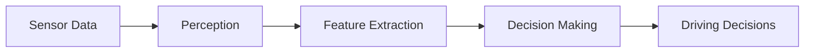

通过上述算法与架构，端到端学习能够有效地实现自动驾驶任务，但在实际应用中仍需不断优化和改进。下一章将探讨如何通过优化策略提高自动驾驶模型的性能。

### 第4章：自动驾驶模型优化策略

在自动驾驶领域，模型优化是提升性能和可靠性的关键。本章节将讨论自动驾驶模型优化的核心目标、常用的损失函数与优化算法，以及预训练与微调技术、模型压缩与量化方法。

#### 4.1 模型优化目标

自动驾驶模型的优化目标主要包括：

- **准确性（Accuracy）：** 提高模型在感知、决策和规划任务中的正确率。
- **鲁棒性（Robustness）：** 增强模型对噪声数据和异常情况的适应能力。
- **实时性（Real-time Performance）：** 确保模型能够在实时环境中快速响应。
- **可解释性（Interpretability）：** 提高模型的可解释性，便于理解和调试。

#### 4.2 损失函数与优化算法

损失函数是评估模型预测结果与真实标签之间差异的指标，优化算法则用于调整模型参数以最小化损失函数。以下是常用的损失函数与优化算法：

- **交叉熵损失函数（Cross-Entropy Loss）：** 用于分类问题，衡量模型输出概率分布与真实标签分布之间的差异。
- **均方误差损失函数（Mean Squared Error Loss）：** 用于回归问题，衡量预测值与真实值之间的平均平方误差。
- **反向传播算法（Backpropagation）：** 用于计算模型参数的梯度，是深度学习优化中的基本算法。
- **随机梯度下降（Stochastic Gradient Descent，SGD）：** 通过随机选择样本计算梯度，进行参数更新。
- **Adam优化器（Adam Optimizer）：** 结合了SGD和RMSprop的优点，具有自适应学习率调整能力。

以下是一个简单的反向传播算法的伪代码示例：

```plaintext
for each layer in network:
    compute the gradient of the layer's output with respect to its input
    propagate the gradient backwards through the network
    update the layer's parameters using the gradients
```

#### 4.3 预训练与微调技术

预训练与微调技术是提高自动驾驶模型性能的有效方法。预训练是指在大量未标注数据上训练模型，然后将其迁移到特定任务上。微调则是在预训练模型的基础上，使用少量标注数据进行进一步训练。

- **预训练（Pre-training）：** 使用大规模公开数据集（如ImageNet）进行预训练，提取通用特征。
- **微调（Fine-tuning）：** 在预训练模型的基础上，针对特定任务调整部分参数。

以下是一个简单的微调过程的伪代码示例：

```plaintext
load pre-trained model
for each layer in model:
    if layer is not part of the pre-trained model:
        initialize layer's parameters randomly
for each epoch:
    for each batch in training data:
        forward propagate the batch through the model
        compute the loss
        backward propagate the loss through the model
        update model parameters
```

#### 4.4 模型压缩与量化

模型压缩与量化技术用于减少模型的存储空间和计算资源需求，提高模型的部署效率。以下是一些常用的模型压缩与量化方法：

- **模型剪枝（Model Pruning）：** 删除模型中的冗余参数，减少模型大小。
- **量化（Quantization）：** 将模型中的浮点数参数转换为低比特宽度的整数。
- **知识蒸馏（Knowledge Distillation）：** 使用大模型（教师模型）的知识训练小模型（学生模型）。

以下是一个简单的模型剪枝的伪代码示例：

```plaintext
for each layer in model:
    if layer's weight magnitude is below a threshold:
        set layer's weight to zero
```

通过上述优化策略，自动驾驶模型能够在各种复杂环境中实现高效、准确和可靠的自动驾驶。然而，这些优化方法仍需在实际应用中进行不断调整和改进。

### 第5章：端到端学习在自动驾驶中的应用案例

端到端学习在自动驾驶领域已经取得了一系列显著的应用成果。本章节将介绍几个具有代表性的应用案例，涵盖自动驾驶车辆感知、决策、路径规划和车辆控制等方面，以展示端到端学习在自动驾驶实践中的效果。

#### 5.1 案例一：自动驾驶车辆感知系统

自动驾驶车辆感知系统是自动驾驶技术的核心，它负责收集和处理来自多种传感器的数据，包括摄像头、激光雷达、超声波传感器等。以下是一个基于端到端学习的自动驾驶车辆感知系统的实现案例：

- **数据来源：** 使用多传感器数据集，包括摄像头图像和激光雷达点云。
- **算法架构：** 采用卷积神经网络（CNN）和点云神经网络（PointNet）对图像和点云数据进行特征提取和分类。
- **优化策略：** 使用交叉熵损失函数和反向传播算法进行模型训练，并利用预训练与微调技术提高模型性能。

以下是一个简单的感知系统架构的Mermaid流程图：

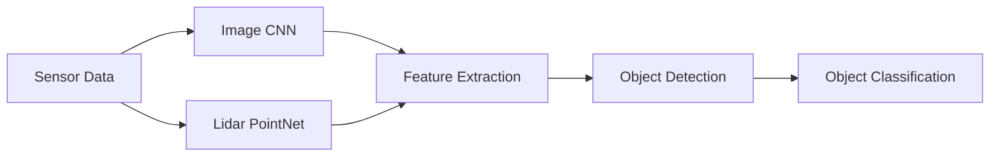

#### 5.2 案例二：自动驾驶决策系统

自动驾驶决策系统负责处理感知系统输出的数据，并生成驾驶决策。以下是一个基于端到端学习的自动驾驶决策系统实现案例：

- **数据来源：** 使用模拟驾驶数据集和真实道路数据集。
- **算法架构：** 采用递归神经网络（RNN）和强化学习（RL）算法，对连续的感知数据进行驾驶决策。
- **优化策略：** 使用奖励函数和策略梯度算法进行模型训练，并利用预训练与微调技术优化模型性能。

以下是一个简单的决策系统架构的Mermaid流程图：

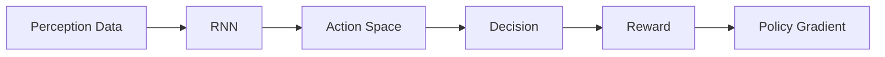

#### 5.3 案例三：自动驾驶路径规划

自动驾驶路径规划是确保自动驾驶车辆安全、高效行驶的关键技术。以下是一个基于端到端学习的自动驾驶路径规划实现案例：

- **数据来源：** 使用真实道路数据集和模拟环境数据集。
- **算法架构：** 采用生成对抗网络（GAN）和强化学习（RL）算法，生成最优行驶轨迹。
- **优化策略：** 使用路径平滑性和安全性评估函数，结合策略梯度算法进行模型训练。

以下是一个简单的路径规划系统架构的Mermaid流程图：

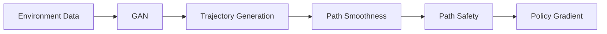

#### 5.4 案例四：自动驾驶车辆控制

自动驾驶车辆控制是使车辆按照规划路径行驶的关键环节。以下是一个基于端到端学习的自动驾驶车辆控制实现案例：

- **数据来源：** 使用真实车辆数据集和模拟环境数据集。
- **算法架构：** 采用深度神经网络（DNN）和模型预测控制（MPC）算法，生成车辆控制指令。
- **优化策略：** 使用控制性能评估函数和自适应控制算法进行模型训练，并利用模型压缩与量化技术提高模型部署效率。

以下是一个简单的车辆控制系统架构的Mermaid流程图：

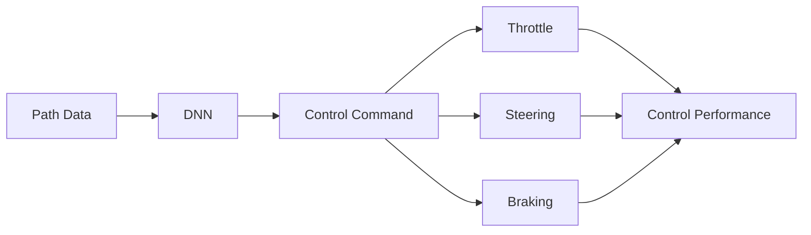

通过上述应用案例，端到端学习在自动驾驶领域展示了其强大的应用潜力。然而，在实际应用中，仍需不断优化和改进，以应对复杂多变的驾驶环境。

### 第6章：端到端学习自动驾驶模型的评估与验证

评估与验证是确保端到端学习自动驾驶模型性能和可靠性的关键步骤。本章将详细介绍评估指标、实验设计、数据集选择以及模型验证与测试方法。

#### 6.1 评估指标

评估指标是衡量自动驾驶模型性能的重要标准，常用的评估指标包括：

- **准确率（Accuracy）：** 预测结果与真实标签相匹配的比例。
- **精确率（Precision）：** 预测为正样本且实际为正样本的比例。
- **召回率（Recall）：** 预测为正样本且实际为正样本的比例。
- **F1分数（F1 Score）：** 精确率和召回率的调和平均值。
- **平均准确率（Average Accuracy）：** 对多个类别计算的平均准确率。
- **平均精度（Average Precision）：** 对多个类别计算的平均精度。
- **平均召回率（Average Recall）：** 对多个类别计算的平均召回率。

以下是一个简单的评估指标的Mermaid流程图：

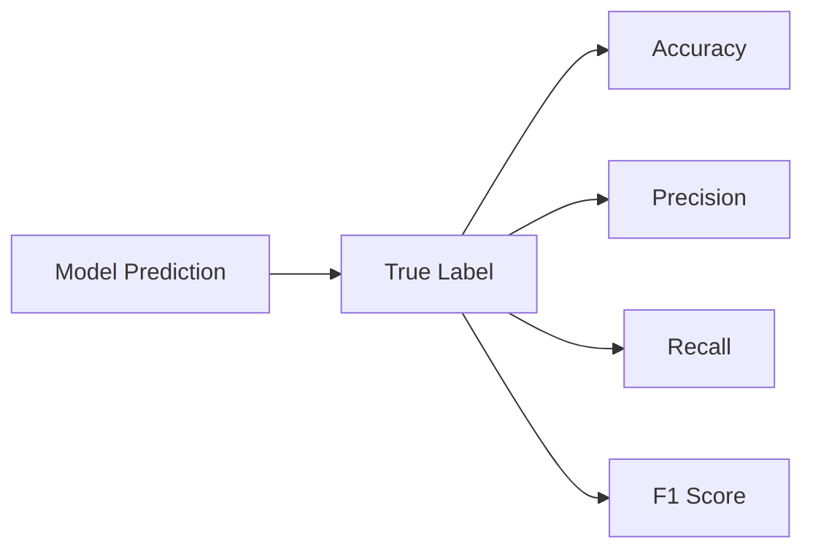

#### 6.2 实验设计

实验设计是评估模型性能的重要步骤，包括数据集划分、训练策略和评估策略等。

- **数据集划分：** 通常将数据集分为训练集、验证集和测试集，以避免模型过拟合。以下是一个简单的数据集划分的Mermaid流程图：

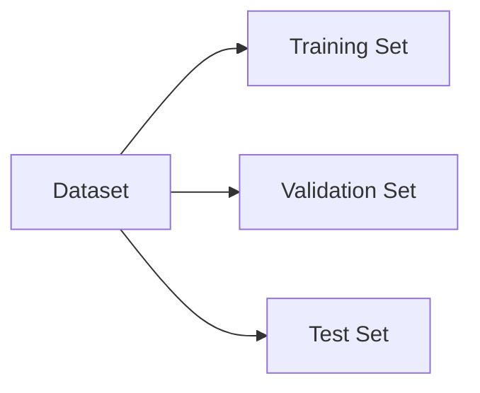

- **训练策略：** 包括参数调整、超参数优化和训练过程监控等。以下是一个简单的训练策略的Mermaid流程图：

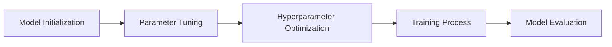

- **评估策略：** 包括模型性能评估、误差分析和可视化等。以下是一个简单的评估策略的Mermaid流程图：

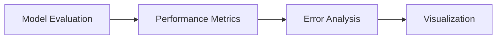

#### 6.3 数据集选择

选择合适的数据集对模型性能至关重要。以下是一些常用的数据集选择标准：

- **数据量：** 足够的数据量有助于提高模型泛化能力。
- **多样性：** 包含多种场景和条件的数据有助于模型适应不同情况。
- **标签质量：** 高质量的标签有助于提高模型准确性。
- **数据源：** 选择权威、可信的数据源，确保数据真实可靠。

以下是一个简单的数据集选择的Mermaid流程图：

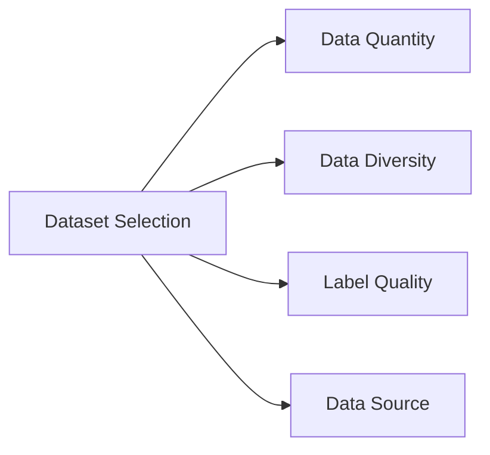

#### 6.4 模型验证与测试

模型验证与测试是评估模型性能的最后一步，包括以下步骤：

- **验证（Validation）：** 在验证集上评估模型性能，调整模型参数和超参数。
- **测试（Testing）：** 在测试集上评估模型性能，作为最终评估标准。

以下是一个简单的模型验证与测试的Mermaid流程图：

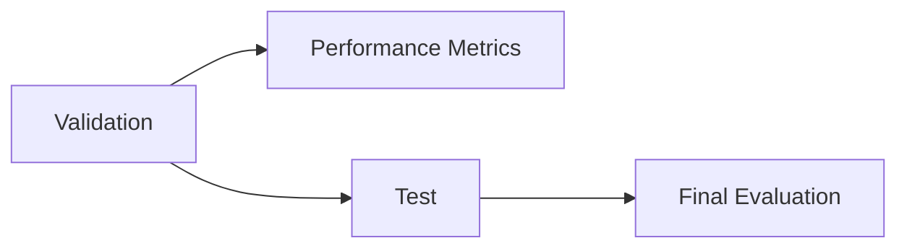

通过上述评估与验证方法，可以有效确保端到端学习自动驾驶模型的性能和可靠性。然而，评估与验证过程应持续进行，以应对环境变化和新技术发展。

### 第7章：未来趋势与挑战

端到端学习在自动驾驶领域取得了显著的进展，但其应用仍面临诸多挑战。本章将探讨未来端到端学习在自动驾驶中的发展趋势、潜在应用，以及面临的挑战和解决方案。

#### 7.1 自动驾驶技术的发展趋势

自动驾驶技术正朝着更加智能化、安全化和高效化的方向发展，主要趋势包括：

- **多传感器融合：** 随着传感器技术的进步，自动驾驶系统将集成更多类型的传感器，如高精度地图、多模态传感器等，以实现更全面的感知能力。
- **云计算与边缘计算结合：** 利用云计算和边缘计算的优势，实现实时数据处理和智能决策，提高自动驾驶系统的响应速度和可靠性。
- **增强学习与深度学习的结合：** 结合增强学习与深度学习，使自动驾驶系统能够通过不断与环境交互，自适应地调整驾驶策略。
- **人机交互优化：** 加强人机交互设计，使自动驾驶系统能够更好地理解驾驶员意图，提高用户体验。

#### 7.2 端到端学习在自动驾驶中的未来应用

端到端学习在自动驾驶中的未来应用将更加广泛，包括：

- **无人驾驶出租车：** 端到端学习将使无人驾驶出租车成为现实，实现高效、安全、舒适的出行体验。
- **智能交通系统：** 端到端学习将用于构建智能交通系统，优化交通流量，提高道路通行效率。
- **自动驾驶卡车与物流：** 端到端学习将应用于自动驾驶卡车和物流系统，提高运输效率，降低成本。
- **自动驾驶农业机械：** 端到端学习将用于自动驾驶农业机械，实现精准农业，提高农作物产量。

#### 7.3 端到端学习面临的挑战与解决方案

尽管端到端学习在自动驾驶领域具有巨大潜力，但其应用仍面临一系列挑战：

- **数据质量与多样性：** 端到端学习依赖于大量高质量、多样化的数据。未来的解决方案包括数据增强、数据共享和 crowdsourcing。
- **模型可解释性：** 端到端学习模型通常缺乏透明度，提高模型可解释性是未来的关键研究方向。可能的解决方案包括模型可视化、解释性模型和可解释性工具。
- **安全性与隐私保护：** 自动驾驶系统需要确保安全性和隐私保护。未来的解决方案包括安全加密算法、隐私保护技术和法律法规的完善。
- **硬件资源限制：** 端到端学习模型通常计算量大，硬件资源限制是一个挑战。可能的解决方案包括模型压缩与量化、专用硬件加速和云计算与边缘计算的结合。

通过不断探索和解决这些挑战，端到端学习在自动驾驶领域的应用将变得更加成熟和普及，为未来智能交通和自动驾驶技术的发展奠定基础。

### 附录

#### 附录A：开源工具与资源

**A.1 PyTorch在自动驾驶中的应用**

PyTorch是一个流行的深度学习框架，广泛应用于自动驾驶领域。以下是一些常用的PyTorch开源工具和资源：

- **TorchVision：** 用于图像和视频数据的处理和增强。
- **TorchAudio：** 用于音频数据处理。
- **TorchScript：** 用于将PyTorch模型转换为可执行代码。
- **Autonomous Driving：** 一个基于PyTorch的自动驾驶框架，提供丰富的感知、决策和规划功能。

**A.2 TensorFlow在自动驾驶中的应用**

TensorFlow是另一个流行的深度学习框架，在自动驾驶领域也有广泛应用。以下是一些常用的TensorFlow开源工具和资源：

- **TensorFlow Lite：** 用于移动和边缘设备上的模型部署。
- **TensorFlow Serving：** 用于模型服务。
- **TensorFlow Model Optimization Toolkit（TMO）：** 用于模型优化和量化。

**A.3 其他开源工具介绍**

除了PyTorch和TensorFlow，还有其他一些开源工具在自动驾驶领域具有应用潜力：

- **Keras：** 一个高层次的深度学习框架，易于使用。
- **MXNet：** Apache基金会的一个开源深度学习框架，支持多种编程语言。
- **Caffe：** 用于计算机视觉的深度学习框架，特别适合于CNN模型。

#### 附录B：代码实现示例

**B.1 自动驾驶感知系统代码示例**

以下是一个简单的自动驾驶感知系统代码示例，使用PyTorch框架：

```python
import torch
import torchvision
import torch.nn as nn
import torch.optim as optim

# 加载预训练的卷积神经网络模型
model = torchvision.models.resnet18(pretrained=True)

# 修改模型的最后一层以适应感知任务
num_ftrs = model.fc.in_features
model.fc = nn.Linear(num_ftrs, num_classes)

# 定义损失函数和优化器
criterion = nn.CrossEntropyLoss()
optimizer = optim.SGD(model.parameters(), lr=0.001, momentum=0.9)

# 加载训练数据集
train_loader = torch.utils.data.DataLoader(dataset, batch_size=64, shuffle=True)

# 开始训练
for epoch in range(num_epochs):
    running_loss = 0.0
    for i, data in enumerate(train_loader, 0):
        inputs, labels = data
        optimizer.zero_grad()
        outputs = model(inputs)
        loss = criterion(outputs, labels)
        loss.backward()
        optimizer.step()
        running_loss += loss.item()
    print(f'Epoch {epoch + 1}, Loss: {running_loss / len(train_loader)}')
```

**B.2 自动驾驶决策系统代码示例**

以下是一个简单的自动驾驶决策系统代码示例，使用深度神经网络和强化学习算法：

```python
import numpy as np
import torch
import torch.nn as nn
import torch.optim as optim

# 定义决策网络
class DecisionNetwork(nn.Module):
    def __init__(self, input_size, hidden_size, output_size):
        super(DecisionNetwork, self).__init__()
        self.fc1 = nn.Linear(input_size, hidden_size)
        self.fc2 = nn.Linear(hidden_size, output_size)
    
    def forward(self, x):
        x = torch.relu(self.fc1(x))
        x = self.fc2(x)
        return x

# 初始化网络和优化器
input_size = 128
hidden_size = 64
output_size = 3
model = DecisionNetwork(input_size, hidden_size, output_size)
optimizer = optim.Adam(model.parameters(), lr=0.001)

# 定义奖励函数
def reward_function(velocity, distance_to_obstacle):
    if velocity > 0.5 and distance_to_obstacle > 1.0:
        return 1.0
    elif velocity < 0.1 and distance_to_obstacle < 0.5:
        return -1.0
    else:
        return 0.0

# 开始训练
for episode in range(num_episodes):
    state = initialize_state()
    done = False
    total_reward = 0.0
    while not done:
        model.eval()
        with torch.no_grad():
            state_tensor = torch.tensor(state, dtype=torch.float32).unsqueeze(0)
            action_scores = model(state_tensor)
        action = np.argmax(action_scores.cpu().numpy())
        next_state, reward, done = step_environment(state, action)
        total_reward += reward
        state = next_state
        model.train()
        state_tensor = torch.tensor(state, dtype=torch.float32).unsqueeze(0)
        action_scores = model(state_tensor)
        loss = -torch.log_softmax(action_scores, dim=1)[torch.tensor(action)]
        optimizer.zero_grad()
        loss.backward()
        optimizer.step()
    print(f'Episode {episode + 1}, Total Reward: {total_reward}')
```

**B.3 自动驾驶路径规划代码示例**

以下是一个简单的自动驾驶路径规划代码示例，使用生成对抗网络（GAN）：

```python
import torch
import torch.nn as nn
import torch.optim as optim

# 定义生成器网络
class Generator(nn.Module):
    def __init__(self, latent_dim, gen_dim):
        super(Generator, self).__init__()
        self.model = nn.Sequential(
            nn.Linear(latent_dim, gen_dim),
            nn.LeakyReLU(0.2),
            nn.Linear(gen_dim, gen_dim),
            nn.LeakyReLU(0.2),
            nn.Linear(gen_dim, 1)
        )
    
    def forward(self, z):
        return self.model(z)

# 定义判别器网络
class Discriminator(nn.Module):
    def __init__(self, gen_dim):
        super(Discriminator, self).__init__()
        self.model = nn.Sequential(
            nn.Linear(1, gen_dim),
            nn.LeakyReLU(0.2),
            nn.Linear(gen_dim, gen_dim),
            nn.LeakyReLU(0.2),
            nn.Linear(gen_dim, 1)
        )
    
    def forward(self, x):
        return self.model(x)

# 初始化网络和优化器
latent_dim = 100
gen_dim = 128
generator = Generator(latent_dim, gen_dim)
discriminator = Discriminator(gen_dim)
optimizer_G = optim.Adam(generator.parameters(), lr=0.0001)
optimizer_D = optim.Adam(discriminator.parameters(), lr=0.0001)

# 定义损失函数
adversarial_loss = nn.BCELoss()

# 开始训练
for epoch in range(num_epochs):
    for i in range(num_batches):
        z = torch.randn(num_samples, latent_dim).to(device)
        real_data = torch.randn(num_samples, 1).to(device)
        fake_data = generator(z)
        
        # 训练判别器
        optimizer_D.zero_grad()
        real_scores = discriminator(real_data)
        fake_scores = discriminator(fake_data)
        D_loss = adversarial_loss(real_scores, torch.ones(num_samples, 1).to(device)) + adversarial_loss(fake_scores, torch.zeros(num_samples, 1).to(device))
        D_loss.backward()
        optimizer_D.step()
        
        # 训练生成器
        optimizer_G.zero_grad()
        fake_scores = discriminator(fake_data)
        G_loss = adversarial_loss(fake_scores, torch.ones(num_samples, 1).to(device))
        G_loss.backward()
        optimizer_G.step()
        
    print(f'Epoch {epoch + 1}, D_loss: {D_loss.item()}, G_loss: {G_loss.item()}')
```

通过上述代码示例，读者可以初步了解自动驾驶感知系统、决策系统和路径规划的实现方法。这些代码仅作为示例，实际应用中需要根据具体需求和场景进行调整和优化。

### 作者信息

**作者：** AI天才研究院/AI Genius Institute & 禅与计算机程序设计艺术 /Zen And The Art of Computer Programming

---

感谢您的耐心阅读，希望本文对您在端到端学习自动驾驶模型优化策略与案例启示方面有所启发。如果您有任何疑问或建议，欢迎在评论区留言，期待与您共同探讨技术进步的道路。祝您在人工智能领域取得丰硕成果！

