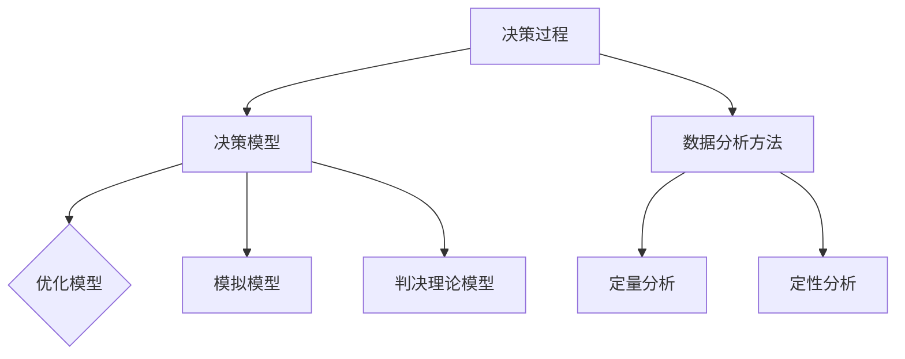

                 

### 引言

在当今这个充满不确定性和快速变革的商业环境中，管理者的决策能力对于组织的成功至关重要。有效的决策不仅能够帮助企业应对日常运营中的挑战，还能把握市场机遇，实现长期发展战略。然而，决策并非易事，它涉及到复杂的信息处理、风险评估以及战略规划等多个方面。因此，管理者需要一套科学、系统的决策框架和工具，以便在纷繁复杂的情况下做出最优选择。

本文旨在为管理者提供一个全面的决策模型，介绍科学决策的框架与工具。通过本文的阅读，读者将了解决策科学的基本理论、决策框架的构建方法、数据分析技术以及风险管理策略等核心内容。此外，文章还将探讨数据驱动决策、团队决策以及案例研究等实际应用，以帮助管理者在实际工作中运用这些方法，提高决策质量和效率。

本文将按以下结构展开：

1. **决策理论基础**：介绍决策科学的基本概念和理论发展，包括决策过程、决策模型和决策分析方法。
2. **决策工具与实践**：探讨数据驱动决策、风险管理、团队决策等实际应用，并提供具体案例研究。
3. **总结与展望**：总结全文内容，讨论决策科学的应用前景和未来发展趋势。

通过一步步的分析和推理，我们将帮助管理者建立起一个科学、系统的决策思维模式，使其在面对复杂情况时能够更加从容、自信地做出决策。

### 第一部分：决策理论基础

在探讨管理者如何做出科学决策之前，我们需要理解决策理论的基本概念和核心原理。决策理论是一个跨学科的领域，它结合了心理学、经济学、管理学和计算机科学等多个领域的知识，致力于研究决策过程、决策模型以及决策分析方法。

#### 决策过程

决策过程是一个系统的过程，通常包括以下步骤：

1. **问题识别**：首先，管理者需要明确当前面临的挑战或机会。这通常需要通过数据收集、市场调研、客户反馈等方式进行。
2. **目标设定**：一旦问题被识别出来，管理者需要设定清晰的目标，这些目标应该具有明确性、可行性和相关性。
3. **方案生成**：在这个阶段，管理者需要列出所有可能的解决方案。这一步骤通常需要创造性思维和广泛的知识储备。
4. **方案评估**：接下来，管理者需要评估每个方案的优缺点，通常使用定量和定性的方法进行。
5. **选择方案**：基于前面的评估，管理者选择最合适的方案。
6. **实施决策**：最后，管理者需要将决策付诸实践，并监督执行过程。
7. **评估结果**：决策执行后，管理者需要评估决策的效果，并根据结果进行必要的调整和优化。

#### 决策模型

决策模型是决策过程中的核心工具，它帮助管理者系统化地分析和选择方案。常见的决策模型包括：

1. **优化模型**：优化模型通过数学方法来寻找最优解。常见的优化模型有线性规划、整数规划、动态规划等。这类模型适用于那些可以通过数学表达式明确描述的问题，例如资源分配、生产计划等。
2. **模拟模型**：模拟模型通过模拟真实世界的场景来分析决策效果。常见的模拟模型有蒙特卡洛模拟、离散事件模拟等。这类模型适用于那些难以通过数学方法精确描述的问题，例如市场预测、风险管理等。
3. **判决理论模型**：判决理论模型用于在不确定条件下做出决策。这类模型考虑了概率和风险因素，帮助管理者评估不同决策的预期价值和风险。常见的判决理论模型有期望值模型、机会损失模型等。

#### 决策分析方法

决策分析是决策过程中的关键环节，它帮助管理者评估和比较不同方案。常见的决策分析方法包括：

1. **定量分析**：定量分析使用数学模型和统计方法来评估决策方案的优劣。常见的定量分析方法有线性规划、决策树、成本效益分析等。这类方法适用于那些可以通过定量指标进行度量和比较的问题。
2. **定性分析**：定性分析通过主观判断和专家意见来评估决策方案。常见的定性分析方法有SWOT分析、市场调查、情景分析等。这类方法适用于那些难以量化或量化效果不明显的问题。

#### 决策理论的历史与发展

决策理论的发展经历了多个阶段：

1. **古典决策理论**：古典决策理论起源于20世纪中叶，它假设决策者是完全理性的，能够通过最大化期望值来做出最优决策。然而，古典决策理论的假设在现实中并不总是成立，因为它忽略了人类行为的非理性和不确定性。
2. **行为决策理论**：行为决策理论在20世纪后期发展起来，它基于心理学和行为科学的研究，认为决策者并不是完全理性的，他们的决策受到认知偏差和情绪的影响。行为决策理论提出了许多新的决策模型和策略，以更好地反映人类决策的实际过程。
3. **现代决策理论**：现代决策理论将古典决策理论和行为决策理论结合起来，形成了一个更加综合和现实的决策框架。现代决策理论强调决策过程的不确定性和动态性，并提出了一系列适应复杂环境的决策策略。

#### 决策科学的发展趋势

随着信息技术的快速发展，决策科学也在不断进步：

1. **数据科学的应用**：数据科学通过大数据分析和机器学习技术，为决策提供了更加精确和有效的支持。管理者可以利用数据科学工具来挖掘数据中的价值，预测市场趋势，评估风险，制定战略。
2. **人工智能的应用**：人工智能（AI）在决策中的应用也越来越广泛。AI可以帮助管理者自动化决策过程，处理复杂的问题，提供实时的决策支持。例如，机器学习算法可以用于预测市场走势、风险评估和客户行为分析等。
3. **决策支持系统的开发**：决策支持系统（DSS）是一种集成多种决策模型和工具的软件系统，它可以帮助管理者快速做出决策。DSS通过提供实时数据、图形分析和模拟功能，提高了决策的效率和准确性。

#### 总结

决策理论为管理者提供了一个科学、系统的决策框架，帮助他们更好地理解决策过程、构建决策模型以及选择合适的决策分析方法。通过掌握决策理论，管理者可以更加理性地面对复杂环境中的决策挑战，提高决策质量和效率。在接下来的章节中，我们将进一步探讨如何运用这些理论和工具，解决实际决策问题。

### 第1章：决策科学概述

在探讨决策科学之前，我们需要明确几个核心概念，包括决策的定义、类型以及决策的科学性。这些概念构成了决策科学的基础，为后续章节的深入讨论提供了必要的背景知识。

#### 决策的定义

决策（Decision Making）是指从多个备选方案中选择一个最优或最合适的方案的过程。决策可以涉及多种领域，包括商业、工程、医学、军事等。其核心在于解决面临的问题或抓住机会，以达到既定目标。

从广义上讲，决策过程包括以下几个方面：

1. **问题识别**：确定当前存在的问题或机遇，这是决策的起点。
2. **目标设定**：明确决策的目标和标准，确保决策具有明确的方向。
3. **方案生成**：列出所有可能的解决方案，为后续评估提供备选方案。
4. **方案评估**：对每个方案进行评估，确定其优缺点。
5. **选择方案**：根据评估结果选择最优或最合适的方案。
6. **实施决策**：将选定的方案付诸实践，并监控实施过程。
7. **评估结果**：评估决策的效果，并根据结果进行必要的调整。

#### 决策的类型

决策可以根据不同的标准进行分类，以下是一些常见的决策类型：

1. **程序化决策**：针对重复性和常规性的问题，通过制定明确的决策流程和规则进行决策。这类决策通常发生在日常运营和管理中。
2. **非程序化决策**：处理不常见或复杂的问题，需要管理者进行创新性思考和判断。这类决策通常涉及到战略性规划和重大决策。
3. **确定型决策**：在所有相关变量和结果都已知的情况下做出的决策。例如，线性规划问题。
4. **风险型决策**：在已知概率分布的情况下做出决策，面临不确定性但可以计算预期结果。例如，赌博和投资决策。
5. **不确定型决策**：在变量和结果都不确定的情况下做出决策，面临较高的风险。管理者需要通过主观判断和经验来做出决策。

#### 决策的科学性

决策的科学性是指决策过程中运用科学方法和理性分析的原则。科学决策强调以下几个方面：

1. **数据驱动**：基于事实和数据来支持决策，而不是仅依赖直觉或主观判断。
2. **系统性**：将决策过程视为一个系统，考虑所有相关因素和潜在的相互影响。
3. **优化**：通过数学模型和算法寻找最优或最合理的解决方案。
4. **评估**：对决策结果进行持续的评估和反馈，以便及时调整和改进。

#### 科学决策的优势

科学决策相较于基于经验或直觉的决策具有以下优势：

1. **准确性**：通过数据分析和数学模型，科学决策可以更准确地预测结果和评估方案。
2. **一致性**：科学决策方法具有明确的标准和流程，能够确保决策的一致性和可重复性。
3. **透明性**：科学决策过程公开透明，有助于提高决策的合法性和接受度。
4. **效率**：通过系统化的流程和方法，科学决策可以显著提高决策效率，减少决策时间。

#### 决策科学的历史与发展

决策科学的历史可以追溯到20世纪中叶。以下是一些重要的里程碑和发展：

1. **古典决策理论**：20世纪50年代，赫伯特·西蒙（Herbert Simon）提出了古典决策理论，强调决策者需要从有限信息中做出最优选择。
2. **期望值理论**：丹尼尔·伯努lli（Daniel Bernoulli）在18世纪提出了期望值理论，解释了人类在风险条件下的决策行为。
3. **行为决策理论**：20世纪70年代，阿莫斯·特沃斯基（Amos Tversky）和丹尼尔·卡内曼（Daniel Kahneman）提出了行为决策理论，揭示了人类在决策过程中常见的认知偏差。
4. **现代决策理论**：现代决策理论将古典决策理论和行为决策理论结合起来，形成了更加综合和现实的决策框架。

#### 总结

决策科学为管理者提供了一个科学、系统的方法来面对复杂多变的决策环境。通过理解决策的定义、类型和科学性，管理者可以更好地掌握决策过程，运用科学方法和工具来提高决策质量和效率。在接下来的章节中，我们将深入探讨决策框架的构建方法和具体的决策分析工具。

### 第2章：决策框架

决策框架是管理者进行科学决策的基础，它提供了一个系统化的结构，帮助管理者明确决策过程、理解决策的关键因素，并选择合适的决策模型。在这一章中，我们将详细讨论决策过程、决策模型以及决策的关键因素，帮助管理者构建一个有效的决策框架。

#### 决策过程

决策过程是一个动态的系统，通常包括以下几个步骤：

1. **问题识别**：识别当前面临的问题或机会。这一步骤通常需要通过数据收集、市场调研、客户反馈等方式进行，以确保问题的准确性和全面性。
   
2. **目标设定**：明确决策的目标和标准。这包括确定决策的关键指标、期望结果和约束条件。目标设定是决策过程的核心，它为后续的方案生成和评估提供了明确的方向。

3. **方案生成**：在这个阶段，管理者需要列出所有可能的解决方案。这一步骤通常需要创造性思维和广泛的知识储备。方案生成可以通过头脑风暴、专家咨询和现有方案优化等方式进行。

4. **方案评估**：对每个方案进行评估，确定其优缺点。评估方法可以分为定量评估和定性评估。定量评估使用数学模型和统计方法，定性评估则依赖于主观判断和专家意见。

5. **选择方案**：根据评估结果选择最优或最合适的方案。选择方案时，需要考虑目标的实现程度、资源的利用效率和实施的可能性。

6. **实施决策**：将选定的方案付诸实践，并监督执行过程。实施决策需要制定详细的执行计划，明确责任人和时间表，并确保资源的合理配置。

7. **评估结果**：决策执行后，管理者需要评估决策的效果，并根据结果进行必要的调整和优化。评估结果可以帮助管理者总结经验教训，改进决策过程。

#### 决策模型

决策模型是决策过程中的核心工具，它帮助管理者系统化地分析和选择方案。以下是几种常见的决策模型：

1. **优化模型**：优化模型通过数学方法来寻找最优解。常见的优化模型包括线性规划、整数规划和动态规划等。这类模型适用于那些可以通过数学表达式明确描述的问题。

   - **线性规划**：线性规划用于在约束条件下最大化或最小化线性目标函数。例如，资源分配问题、生产计划问题等。

   - **整数规划**：整数规划扩展了线性规划，用于解决决策变量为整数的问题。例如，设备选址问题、人员排班问题等。

   - **动态规划**：动态规划用于解决多阶段决策问题，每个阶段的决策依赖于前一阶段的决策。例如，投资组合优化问题、供应链管理问题等。

2. **模拟模型**：模拟模型通过模拟真实世界的场景来分析决策效果。常见的模拟模型包括蒙特卡洛模拟和离散事件模拟等。这类模型适用于那些难以通过数学方法精确描述的问题。

   - **蒙特卡洛模拟**：蒙特卡洛模拟通过随机抽样和统计方法来模拟不确定事件，用于风险分析和决策支持。

   - **离散事件模拟**：离散事件模拟通过模拟事件的发生顺序和系统状态的变化来分析系统性能。例如，交通流量模拟、库存管理模拟等。

3. **判决理论模型**：判决理论模型用于在不确定条件下做出决策。这类模型考虑了概率和风险因素，帮助管理者评估不同决策的预期价值和风险。

   - **期望值模型**：期望值模型通过计算决策结果的期望值来评估方案。例如，投资决策、市场预测等。

   - **机会损失模型**：机会损失模型通过计算不同决策的机会损失来评估方案。例如，风险管理、信用评估等。

#### 决策的关键因素

在决策过程中，以下几个关键因素对于决策的质量和效率至关重要：

1. **信息质量**：决策所需的信息必须准确、完整和及时。高质量的信息是科学决策的基础，有助于管理者做出更准确、更合理的决策。

2. **时间压力**：决策过程中通常存在时间限制。时间压力可能导致管理者在信息不充分的情况下做出决策，影响决策的质量。因此，管理者需要平衡决策速度和质量，确保在合理的时间内做出科学决策。

3. **决策者能力**：决策者的能力直接影响决策的质量。这包括决策者的知识水平、经验、判断力和沟通能力等。管理者需要不断提升自己的决策能力，以应对复杂多变的决策环境。

4. **组织文化**：组织文化对决策过程和决策质量有重要影响。开放、包容和创新的组织文化有助于促进团队合作、知识共享和创造性思维，从而提高决策的质量。

5. **约束条件**：决策过程中通常存在各种约束条件，如资源限制、法律法规、市场环境等。管理者需要充分考虑这些约束条件，确保决策在现实环境中可行。

#### 决策框架的应用

一个有效的决策框架可以帮助管理者更好地理解和应用各种决策模型和工具。以下是一个简单的决策框架示例：

1. **问题识别**：明确当前面临的问题或机会。
2. **目标设定**：设定决策的目标和标准。
3. **信息收集**：收集相关数据和信息。
4. **方案生成**：生成所有可能的解决方案。
5. **方案评估**：使用优化模型、模拟模型和判决理论模型进行评估。
6. **选择方案**：选择最优或最合适的方案。
7. **实施决策**：制定执行计划并监督执行过程。
8. **评估结果**：评估决策的效果，并根据结果进行必要的调整和优化。

通过这个决策框架，管理者可以系统化地分析问题、设定目标、收集信息、评估方案和选择最优方案，从而提高决策质量和效率。

#### 总结

决策框架为管理者提供了一个系统化的决策过程，帮助他们明确决策步骤、理解决策的关键因素，并选择合适的决策模型。通过掌握决策框架，管理者可以更好地应对复杂多变的决策环境，提高决策质量和效率。在接下来的章节中，我们将进一步探讨决策分析方法，帮助管理者在实际决策中运用这些方法。

### 第3章：决策分析方法

在决策过程中，分析方法是管理者评估和比较不同方案的重要工具。决策分析方法可以分为定量分析和定性分析两大类。定量分析通过数学模型和统计方法来量化决策结果，定性分析则依赖于主观判断和专家意见。在这一章中，我们将详细探讨定量分析和定性分析的方法，帮助管理者在实际决策中应用这些工具。

#### 定量分析

定量分析是决策分析中的重要组成部分，它使用数学模型和统计方法来评估和比较不同方案。以下是几种常见的定量分析方法：

1. **数学模型**

   数学模型是决策分析的基础，它通过建立数学表达式来描述决策问题。常见的数学模型包括线性规划、整数规划和动态规划等。

   - **线性规划**：线性规划用于在约束条件下最大化或最小化线性目标函数。线性规划问题可以通过单纯形法或其他算法求解，例如资源分配问题、生产计划问题等。

   - **整数规划**：整数规划扩展了线性规划，用于解决决策变量为整数的问题。整数规划可以用于设备选址、人员排班等问题。

   - **动态规划**：动态规划用于解决多阶段决策问题，每个阶段的决策依赖于前一阶段的决策。动态规划可以用于投资组合优化、供应链管理等问题。

2. **决策树**

   决策树是一种基于树形结构的决策模型，用于分析决策过程和结果。决策树通过一系列条件节点和结果节点来表示决策路径和结果。决策树可以用于风险评估、市场预测等问题。

3. **成本效益分析**

   成本效益分析是一种常用的定量分析方法，用于评估不同方案的收益和成本。成本效益分析通过比较不同方案的净收益（收益减去成本）来选择最优方案。成本效益分析可以用于项目评估、预算分配等问题。

#### 定量分析案例

以下是一个简单的线性规划案例：

**问题**：某公司需要分配500小时的研发资源到两个项目A和B。项目A的利润为20元/小时，项目B的利润为30元/小时。约束条件是项目A的分配时间不超过300小时，项目B的分配时间不超过200小时。

**目标**：最大化总利润。

**模型**：

目标函数：最大化 \( z = 20x + 30y \)

约束条件：

\[ x + y \leq 500 \]
\[ x \leq 300 \]
\[ y \leq 200 \]
\[ x, y \geq 0 \]

**解决方案**：

使用单纯形法求解该线性规划问题，得到最优解 \( x = 300 \), \( y = 200 \)，总利润 \( z = 20 \times 300 + 30 \times 200 = 13000 \) 元。

#### 定性分析

定性分析通过主观判断和专家意见来评估和比较不同方案。以下是一些常见的定性分析方法：

1. **SWOT分析**

   SWOT分析是一种用于评估企业或项目优势、劣势、机会和威胁的方法。SWOT分析可以帮助管理者识别项目的内部优势和劣势，以及外部环境和竞争对手带来的机会和威胁。

2. **市场调查**

   市场调查是一种通过收集和分析消费者行为、市场趋势和竞争情况来评估市场潜力的方法。市场调查可以通过问卷调查、访谈和焦点小组等方式进行。

3. **情景分析**

   情景分析是一种用于评估不同未来情景下决策效果的方法。情景分析通过构建不同的未来情景，分析每个情景下的决策结果和风险，帮助管理者制定应对策略。

#### 定性分析案例

以下是一个简单的SWOT分析案例：

**项目**：开发一款智能家居应用。

**SWOT分析**：

- **优势（Strengths）**：
  - 技术领先，拥有先进的智能家居技术。
  - 团队成员具备丰富的软件开发经验。

- **劣势（Weaknesses）**：
  - 市场竞争激烈，存在多家竞争对手。
  - 初期用户基数较小。

- **机会（Opportunities）**：
  - 智能家居市场增长迅速，需求旺盛。
  - 可以与其他智能家居设备进行整合。

- **威胁（Threats）**：
  - 法律法规和技术标准的不确定性。
  - 竞争对手的技术创新。

通过SWOT分析，管理者可以全面了解项目的优势、劣势、机会和威胁，为制定决策提供依据。

#### 定量分析与定性分析的比较

定量分析和定性分析各有优劣：

- **定量分析**：
  - 优点：客观、精确、易于量化，适用于决策过程中明确量化的指标。
  - 缺点：依赖数据质量和模型假设，难以处理复杂的不确定性和非线性问题。

- **定性分析**：
  - 优点：灵活、适应性强，适用于决策过程中难以量化的指标。
  - 缺点：主观性强、易受个人偏见影响，难以进行定量比较。

在实际决策中，管理者通常需要结合定量分析和定性分析，以充分利用各自的优势，提高决策的科学性和可靠性。

#### 总结

决策分析方法为管理者提供了系统化评估和比较不同方案的工具。通过定量分析和定性分析，管理者可以在复杂多变的决策环境中做出更加科学、合理的决策。在接下来的章节中，我们将探讨数据驱动决策、风险管理等实际应用，帮助管理者将决策分析方法应用于实际工作。

### 第4章：数据驱动决策

在当今这个数据爆炸的时代，数据驱动决策（Data-driven Decision Making，简称DDDM）已经成为一种主流的决策方法。数据驱动决策强调通过收集、分析和利用数据来支持决策过程，从而提高决策的准确性和效率。在这一章中，我们将探讨数据驱动决策的基础知识，包括数据分析的基本概念、工具和技术，以及如何将数据驱动决策应用于实际工作中。

#### 数据分析基础

数据分析是指使用统计学、机器学习、数据挖掘等方法对数据进行收集、处理、分析和解释的过程。数据分析的基础包括以下几个方面：

1. **数据收集与清洗**

   数据收集是指从各种来源（如数据库、传感器、网络等）获取数据。数据清洗是指对收集到的数据进行预处理，去除错误、缺失和重复的数据，确保数据的准确性和完整性。

2. **数据可视化**

   数据可视化是指通过图形、图表等方式将数据展示出来，使得数据更加直观和易于理解。数据可视化工具如Tableau、Power BI等可以帮助管理者快速识别数据中的趋势和模式。

3. **数据分析方法**

   数据分析方法包括描述性分析、推断性分析和预测性分析等。描述性分析用于描述数据的基本特征，推断性分析用于测试假设和发现数据中的关系，预测性分析则用于预测未来的趋势和结果。

#### 数据驱动的决策策略

数据驱动决策的关键在于如何将数据分析结果应用于实际决策中。以下是一些常见的数据驱动决策策略：

1. **基于数据的监控与预警**

   通过实时数据监控和预警系统，管理者可以及时了解业务运行状态，发现潜在问题并采取措施。例如，银行可以通过监控系统检测欺诈交易，及时采取措施防止损失。

2. **基于数据的绩效评估**

   利用数据分析方法对业务绩效进行评估，可以帮助管理者识别问题并制定改进策略。例如，零售企业可以通过分析销售数据，发现畅销产品并调整库存策略。

3. **基于数据的决策支持**

   数据分析可以提供详细的决策支持信息，帮助管理者做出更加科学的决策。例如，在市场扩张决策中，数据分析可以提供关于市场需求、竞争状况、潜在客户等信息，帮助管理者做出最优决策。

4. **基于数据的预测与规划**

   利用历史数据和预测模型，管理者可以预测未来趋势并制定长期规划。例如，通过分析销售数据和历史市场趋势，零售企业可以预测未来市场需求，制定采购和销售策略。

#### 数据驱动决策的优势

数据驱动决策相较于传统的经验决策具有以下优势：

1. **更准确的数据支持**：数据驱动决策依赖于真实、准确的数据，能够提供更准确的决策依据。

2. **减少主观偏见**：数据驱动决策通过分析大量数据，减少了主观判断和偏见的影响，提高了决策的客观性。

3. **更快速的反应**：实时数据分析可以帮助管理者快速识别问题并采取行动，提高了决策的效率。

4. **更全面的决策视角**：数据驱动决策可以提供更全面的决策信息，帮助管理者从多个维度考虑问题，做出更全面的决策。

#### 数据驱动决策的流程

数据驱动决策的流程通常包括以下几个步骤：

1. **问题定义**：明确需要解决的问题或决策目标。

2. **数据收集**：收集与问题相关的数据，包括历史数据、实时数据等。

3. **数据清洗**：对收集到的数据进行清洗，去除错误、缺失和重复的数据。

4. **数据分析**：使用统计学、机器学习等方法对数据进行分析，提取有价值的信息。

5. **结果解释**：将分析结果转化为易于理解的报告或图表，为决策提供支持。

6. **决策制定**：基于分析结果制定决策方案。

7. **决策执行**：实施决策方案，并监控决策效果。

8. **结果评估**：评估决策效果，根据评估结果进行必要的调整和优化。

#### 数据驱动决策的挑战

尽管数据驱动决策具有许多优势，但在实际应用中也面临一些挑战：

1. **数据质量问题**：数据质量直接影响决策的准确性，因此需要确保数据的质量和完整性。

2. **分析能力不足**：数据分析需要专业技能和工具，很多组织可能缺乏这方面的能力。

3. **数据隐私和安全问题**：数据分析可能涉及敏感数据，需要确保数据的安全性和隐私性。

4. **决策者的接受度**：数据驱动决策可能与传统经验决策方式不同，决策者可能需要时间适应和接受这种新的决策方式。

#### 实际应用案例

以下是一个数据驱动决策的实际应用案例：

**案例**：某零售企业利用数据分析进行库存管理。

**问题**：如何优化库存管理，减少库存过剩和缺货现象。

**解决方案**：

1. **数据收集**：收集历史销售数据、供应商数据等。

2. **数据清洗**：去除错误、缺失和重复的数据，确保数据的准确性。

3. **数据分析**：使用时间序列分析、聚类分析等方法，分析销售趋势和需求预测。

4. **结果解释**：根据分析结果，制定库存优化策略。

5. **决策制定**：调整库存水平，优化采购计划。

6. **决策执行**：实施库存优化策略，并监控库存状况。

7. **结果评估**：评估库存管理效果，根据评估结果进行调整。

通过这个案例，我们可以看到数据驱动决策在库存管理中的应用，帮助企业减少成本、提高效益。

#### 总结

数据驱动决策为管理者提供了一种科学、系统的决策方法，通过收集、分析和利用数据，帮助管理者做出更准确、更高效的决策。在接下来的章节中，我们将探讨风险管理、团队决策等实际应用，帮助管理者将数据驱动决策的理念和方法应用于实际工作中。

### 第5章：风险管理

在决策过程中，风险管理是一个至关重要的环节。有效的风险管理可以帮助管理者识别、评估和应对可能影响决策执行的各种风险，从而降低不确定性，提高决策的成功率。在这一章中，我们将探讨风险管理的概念、风险分类、风险管理策略以及实际应用案例。

#### 风险管理的概念

风险管理（Risk Management）是指通过识别、评估、控制和监控潜在的风险，以确保组织的战略目标和运营目标的实现。风险管理不仅包括对风险的预防和管理，还包括对风险事件发生后的事故处理和损失控制。

1. **风险的定义**：风险是指可能对组织造成损失、损害或不利影响的不确定性事件。风险可以来自内部因素，如运营失误、人力资源问题；也可以来自外部因素，如市场波动、法律法规变化。

2. **风险管理的目标**：风险管理的目标是降低风险发生的概率和损失程度，确保组织在面临风险时能够快速响应和有效应对，从而实现组织的稳定发展和持续运营。

3. **风险管理的原则**：风险管理应遵循以下原则：
   - 全面性：覆盖组织各个层面和业务领域。
   - 动态性：根据外部环境和内部变化持续更新风险管理策略。
   - 预防性：在风险发生前采取措施进行预防。
   - 可持续性：确保风险管理策略与组织的长期发展目标相一致。

#### 风险分类

风险可以分为多种类型，常见的分类方法包括：

1. **根据风险来源**：
   - **财务风险**：与资金流动、债务偿还、投资回报等相关的风险。
   - **市场风险**：与市场价格波动、供需变化、竞争环境等相关的风险。
   - **运营风险**：与日常运营活动、流程管理、人员素质等相关的风险。
   - **法律风险**：与法律法规遵守、合同签订、知识产权等相关的风险。
   - **战略风险**：与组织战略规划、发展方向、市场定位等相关的风险。

2. **根据风险性质**：
   - **可量化风险**：可以通过数学模型或统计数据量化的风险，如市场风险、财务风险。
   - **不可量化风险**：无法通过数学模型量化的风险，如法律风险、战略风险。

3. **根据风险影响**：
   - **重大风险**：可能对组织造成重大损失或影响的风险。
   - **一般风险**：对组织造成一般损失或影响的风险。

#### 风险管理策略

有效的风险管理需要一套系统的策略和方法。以下是几种常见的风险管理策略：

1. **风险识别**：通过系统性的方法识别潜在的风险。风险识别可以通过定性的方法，如头脑风暴、专家访谈；也可以通过定量的方法，如风险评估矩阵。

2. **风险评估**：对识别出的风险进行评估，确定其发生的概率和潜在影响。风险评估可以通过定量方法，如蒙特卡洛模拟、风险矩阵；也可以通过定性方法，如专家评分、历史数据比较。

3. **风险应对策略**：根据风险评估的结果，制定相应的应对策略。常见的应对策略包括：
   - 风险规避：避免或减少风险的发生，如通过变更项目计划、调整战略。
   - 风险减轻：通过采取措施降低风险发生的概率或影响程度，如风险分散、增加保险。
   - 风险接受：承认风险的存在，但采取预防措施以减轻其影响，如建立应急计划。
   - 风险转移：将风险转移给第三方，如通过合同条款将责任和风险转嫁给供应商或客户。

4. **风险监控**：对已识别和评估的风险进行持续监控，确保风险管理策略的有效实施。风险监控可以通过定期评估、风险评估报告等方式进行。

#### 风险管理在实际中的应用

以下是一个风险管理的实际应用案例：

**案例**：某银行的风险管理实践。

**问题**：如何有效管理信贷风险，确保信贷业务的健康发展。

**解决方案**：

1. **风险识别**：通过数据分析、市场调研等方式识别潜在的信贷风险，如信用风险、市场风险、操作风险。

2. **风险评估**：使用风险评估矩阵和蒙特卡洛模拟等方法对识别出的信贷风险进行评估，确定其发生的概率和影响程度。

3. **风险应对策略**：
   - **风险规避**：通过严格审查贷款申请，避免高风险客户。
   - **风险减轻**：通过分散贷款组合、增加贷款抵押物等方式降低信用风险。
   - **风险接受**：为高风险贷款增加风险溢价，并制定详细的应急预案。
   - **风险转移**：通过保险合同将部分风险转移给保险公司。

4. **风险监控**：定期对信贷风险进行监控和评估，及时调整风险管理策略，确保信贷业务的安全和稳定。

#### 总结

风险管理是决策过程中不可或缺的一部分，通过识别、评估和应对风险，管理者可以降低不确定性，提高决策的成功率。在接下来的章节中，我们将探讨团队决策，帮助管理者在实际工作中运用风险管理策略，提高决策质量和效率。

### 第6章：团队决策

在复杂多变的商业环境中，团队决策（Group Decision Making，简称GDM）已经成为组织应对挑战和抓住机遇的重要手段。团队决策通过集体智慧和多元化视角，可以提高决策的全面性和准确性。然而，团队决策也面临着一系列挑战，如冲突、信息不对称和沟通障碍等。在这一章中，我们将探讨团队决策的优势、障碍以及提升团队决策效果的策略。

#### 团队决策的优势

团队决策相较于个人决策具有以下优势：

1. **多元化视角**：团队决策汇集了多个成员的知识、经验和观点，能够提供更全面的视角，减少决策盲点。

2. **集体智慧**：通过集体讨论和头脑风暴，团队能够产生更多的创新想法和解决方案，提高决策的质量。

3. **民主参与**：团队决策允许所有成员参与决策过程，增加了决策的接受度和执行力度。

4. **责任分担**：团队决策将决策责任分散到多个成员，减少了个人决策中的风险和压力。

5. **增强团队合作**：通过共同参与决策过程，团队成员之间的信任和合作得到加强，有助于提升团队凝聚力和工作效率。

#### 团队决策的障碍

尽管团队决策具有许多优势，但实际操作中仍然面临一系列挑战：

1. **冲突**：团队成员可能有不同的观点和利益诉求，这可能导致决策过程中的意见分歧和冲突。

2. **信息不对称**：团队成员可能拥有不同的信息资源，这会导致信息共享不畅，影响决策的准确性和效率。

3. **沟通障碍**：团队成员之间的沟通不畅，可能导致信息误解和决策延误。

4. **决策延迟**：团队决策过程通常需要更多的时间和讨论，这可能导致决策延误，错失市场机会。

5. **责任归属不明确**：在团队决策中，责任归属可能不明确，导致成员在执行决策时产生责任推诿。

#### 提升团队决策效果的策略

为了克服团队决策中的障碍，提高决策效果，管理者可以采取以下策略：

1. **明确决策目标**：在团队决策开始之前，明确决策的目标和标准，确保团队成员对决策目标有清晰的认识。

2. **建立有效的沟通机制**：建立畅通的沟通渠道，确保团队成员之间的信息能够及时、准确地传递。可以采用会议、邮件、即时通讯工具等方式进行沟通。

3. **多元化团队组成**：确保团队成员具备多元化的背景和技能，以提供多样化的视角和解决方案。

4. **利用决策工具**：使用决策工具和方法，如SWOT分析、决策树、模拟模型等，帮助团队成员理清思路，提高决策的准确性。

5. **培训与反馈**：定期对团队成员进行决策技能培训，提高他们的决策能力和沟通技巧。同时，通过反馈机制，及时了解团队成员在决策过程中的问题和改进需求。

6. **鼓励开放讨论**：营造一个开放、包容的讨论氛围，鼓励团队成员表达自己的观点和意见，促进思想碰撞。

7. **明确决策责任**：在决策过程中，明确每个成员的责任和角色，确保决策的执行有明确的责任归属。

8. **及时决策**：在确保充分讨论和信息共享的基础上，尽可能快速地做出决策，以避免决策延误。

#### 实际应用案例

以下是一个团队决策的实际应用案例：

**案例**：某科技公司的新产品开发决策。

**问题**：如何决定是否开发一款新产品，并确定新产品的功能特性。

**解决方案**：

1. **明确决策目标**：确定新产品的目标市场和功能需求，确保团队成员对决策目标有清晰的认识。

2. **建立沟通机制**：通过定期会议和即时通讯工具，确保团队成员之间的信息传递畅通，共享市场调研和用户反馈信息。

3. **多元化团队组成**：邀请来自研发、市场、销售等多个部门的成员参与决策，以提供多样化的视角和解决方案。

4. **利用决策工具**：使用SWOT分析和决策树模型，对新产品开发的可行性进行评估。

5. **培训与反馈**：对团队成员进行新产品开发流程和决策技能培训，提高他们的决策能力。

6. **鼓励开放讨论**：在团队决策过程中，鼓励团队成员表达自己的观点，进行头脑风暴，产生多种创新想法。

7. **明确决策责任**：明确每个团队成员在新产品开发中的具体职责和任务，确保决策的执行有明确的责任归属。

8. **及时决策**：在充分讨论和评估后，快速做出决策，并制定详细的实施计划。

通过这个案例，我们可以看到如何在实际工作中应用团队决策策略，提高决策质量和效率。

#### 总结

团队决策通过集体的智慧和多元化的视角，能够提高决策的全面性和准确性。管理者可以通过明确决策目标、建立有效沟通机制、利用决策工具和策略，克服团队决策中的障碍，提升团队决策效果。在接下来的章节中，我们将通过案例研究和总结，进一步探讨决策科学的应用和实践。

### 第7章：案例研究

在本章中，我们将通过两个实际案例来探讨管理者如何在复杂的环境中应用决策科学进行决策。这两个案例分别涉及市场扩张决策和信贷风险控制，通过详细的决策过程和结果分析，读者可以更深入地理解决策科学在实践中的应用。

#### 案例一：某公司的市场扩张决策

**背景**：某家领先的科技公司（以下简称“公司”）正在考虑将业务扩展到新市场。公司当前的市场主要集中在一线和二线城市，但公司管理层认为，随着消费升级和互联网普及率的提升，三线和以下城市的潜在市场需求巨大，因此决定进行市场扩张。

**决策过程**：

1. **问题识别**：公司首先明确了市场扩张的必要性和可行性，识别出市场扩张可能带来的机遇和挑战。

2. **目标设定**：公司设定的目标是在未来三年内将三线以下城市的市场份额提升至20%，并实现年复合增长率达到30%。

3. **方案生成**：公司管理层列出多个市场扩张方案，包括增加广告投放、建立线下体验店、推出本地化产品等。

4. **方案评估**：
   - **定量分析**：公司使用成本效益分析模型，计算每个方案的成本和预期收益。
   - **定性分析**：公司通过市场调研和专家访谈，评估每个方案的潜在影响和风险。

5. **选择方案**：基于定量和定性分析结果，公司决定采用“增加广告投放和建立线下体验店”的组合方案，因为这一方案在成本和收益上具有明显的优势。

6. **实施决策**：公司制定了详细的执行计划，包括广告投放策略、线下体验店选址和开业时间表。

7. **评估结果**：在市场扩张后的第一年，公司三线以下城市的市场份额达到15%，年复合增长率达到28%。虽然未达到原定的20%目标，但公司管理层认为这一结果已非常满意，决定继续实施该方案，并根据市场反馈进行调整。

**案例分析**：

- **决策过程**：公司通过明确的决策流程，从问题识别到方案评估再到选择和实施，保证了决策的科学性和系统性。
- **优势**：公司采用了定量和定性相结合的分析方法，确保决策的全面性和准确性。
- **不足**：公司在实施过程中未能完全达到预定目标，说明在决策过程中可能对市场变化的预测不够准确。

#### 案例二：某银行的信贷风险控制

**背景**：某银行（以下简称“银行”）在信贷业务中面临较高的不良贷款率，管理层决定通过风险控制策略来降低信贷风险。

**决策过程**：

1. **问题识别**：银行识别出信贷风险主要来源于客户信用状况不稳定、市场环境变化和内部管理问题。

2. **目标设定**：银行设定的目标是降低不良贷款率至2%以下，并提高信贷审批效率。

3. **方案生成**：
   - **风险识别**：通过数据分析识别出高风险客户群体。
   - **风险评估**：使用信用评分模型评估客户信用风险。
   - **风险应对**：制定包括增加抵押要求、限制高风险贷款额度、优化信贷审批流程等在内的风险应对方案。

4. **选择方案**：银行综合评估后，决定采用“优化信贷审批流程和增加抵押要求”的组合方案。

5. **实施决策**：银行实施了新的信贷审批流程，并增加了抵押要求。

6. **评估结果**：在风险控制策略实施后的第一年，银行的不良贷款率降至1.8%，信贷审批效率提高了20%。

**案例分析**：

- **决策过程**：银行通过系统化的风险识别、评估和应对，确保了风险控制的科学性和有效性。
- **优势**：银行采用了数据驱动的决策方法，确保了决策的准确性和效率。
- **不足**：银行在风险控制过程中可能忽视了市场环境变化带来的影响，需要进一步优化风险应对策略。

#### 总结

通过这两个案例，我们可以看到管理者在面临市场扩张和信贷风险控制时如何应用决策科学进行决策。有效的决策不仅依赖于科学的分析方法和工具，还需要灵活应对实际操作中的各种挑战。在未来的决策实践中，管理者应不断总结经验，优化决策流程，提高决策质量和效率。

### 第8章：总结与展望

在本章节中，我们将对全文内容进行总结，并探讨决策科学在未来的发展趋势。

#### 总结

本文系统地介绍了决策科学的基本概念、决策框架、分析方法以及实际应用。我们首先明确了决策的定义、类型和科学性，为管理者提供了一个清晰的认识。接着，我们详细讨论了决策过程、决策模型和决策分析方法，帮助管理者构建科学、系统的决策框架。此外，我们通过数据驱动决策、风险管理、团队决策等实际应用案例，展示了决策科学在现实工作中的应用。

通过本文的阅读，读者应掌握以下关键知识点：

1. **决策过程**：理解决策过程的各个步骤，包括问题识别、目标设定、方案生成、方案评估、选择方案、实施决策和评估结果。
2. **决策模型**：掌握优化模型、模拟模型和判决理论模型的基本原理和应用场景。
3. **决策分析方法**：了解定量分析和定性分析的方法，以及如何在实际决策中运用这些方法。
4. **数据驱动决策**：掌握数据收集、清洗、可视化和分析的基本技能，以及如何利用数据分析结果进行决策。
5. **风险管理**：理解风险管理的概念、分类和策略，以及如何在实践中进行风险管理。
6. **团队决策**：了解团队决策的优势、障碍和提升策略，以及如何在实际工作中有效运用团队决策。

#### 展望

随着技术的不断进步，决策科学也在不断发展。以下是对未来决策科学发展趋势的展望：

1. **人工智能与决策**：随着人工智能（AI）技术的发展，AI在决策中的应用越来越广泛。机器学习算法可以用于数据挖掘、预测分析和决策支持，帮助管理者快速、准确地做出决策。

2. **大数据分析**：大数据技术的成熟使得海量数据的分析和处理成为可能。管理者可以利用大数据分析技术，挖掘数据中的潜在价值，为决策提供更加精准的支持。

3. **实时决策**：实时决策系统可以实时收集和处理数据，为管理者提供即时的决策支持。这种技术特别适用于动态变化快的行业，如金融市场、物流管理等。

4. **可持续性决策**：随着环境保护和可持续发展的重要性日益增加，决策科学也将更多地考虑环境和社会因素。管理者需要采用可持续性决策方法，确保组织的长期发展与社会责任的平衡。

5. **跨学科融合**：决策科学将继续与其他学科（如心理学、经济学、社会学等）融合，形成更加综合和全面的决策理论体系，为管理者提供更全面的理论支持。

#### 管理者决策能力的提升

为了在未来的商业环境中做出更加科学和高效的决策，管理者需要不断提升自己的决策能力：

1. **持续学习**：不断学习新的决策理论和工具，跟上技术发展的步伐。

2. **实践反思**：在实际决策过程中，不断总结经验，反思决策的得失，优化决策流程。

3. **跨学科知识**：了解其他学科的基本原理，如经济学、心理学等，以提高决策的全面性和准确性。

4. **团队合作**：培养团队合作精神，通过多元化视角提高决策的全面性和准确性。

5. **技术工具**：熟悉和应用各种决策支持工具，如数据分析软件、模拟模型等，提高决策效率。

通过本文的探讨，我们希望管理者能够建立科学、系统的决策思维模式，在实际工作中运用决策科学的方法和工具，提高决策质量和效率，实现组织的长期发展目标。

### 附录

#### 附录A：决策模型与工具列表

以下是一些常见的决策模型和工具，管理者可以根据具体需求选择和运用：

1. **优化模型**：
   - **线性规划（Linear Programming）**：用于在约束条件下最大化或最小化线性目标函数。
   - **整数规划（Integer Programming）**：用于解决决策变量为整数的问题。
   - **动态规划（Dynamic Programming）**：用于解决多阶段决策问题。

2. **模拟模型**：
   - **蒙特卡洛模拟（Monte Carlo Simulation）**：通过随机抽样和统计方法来模拟不确定事件。
   - **离散事件模拟（Discrete Event Simulation）**：通过模拟事件的发生顺序和系统状态的变化来分析系统性能。

3. **判决理论模型**：
   - **期望值模型（Expected Value Model）**：通过计算决策结果的期望值来评估方案。
   - **机会损失模型（Opportunity Loss Model）**：通过计算不同决策的机会损失来评估方案。

4. **数据分析工具**：
   - **统计分析（Statistical Analysis）**：包括描述性统计、推断性统计等。
   - **数据挖掘（Data Mining）**：用于发现数据中的隐含模式和关联。

5. **决策支持系统（Decision Support System, DSS）**：集成多种决策模型和工具的软件系统，帮助管理者快速做出决策。

#### 附录B：决策案例分析

以下是一些决策案例分析，供读者参考：

1. **案例一：某公司的市场扩张决策**
   - **背景**：某家科技公司决定进入三线以下城市，提升市场份额。
   - **决策过程**：通过市场调研、数据分析，确定最佳市场进入策略。
   - **结果**：第一年市场份额提升至15%，年复合增长率达到28%。

2. **案例二：某银行的信贷风险控制**
   - **背景**：某银行面临较高的不良贷款率，决定通过风险控制策略降低风险。
   - **决策过程**：通过信用评分模型、数据分析，优化信贷审批流程。
   - **结果**：不良贷款率降至1.8%，信贷审批效率提高20%。

这些案例展示了决策科学在实际中的应用，通过系统化的决策过程和工具，实现了决策的科学性和有效性。

### 核心概念与联系图

为了更好地理解本文的核心概念，我们使用Mermaid绘制了一个流程图，展示了决策科学中的关键概念及其相互联系。



通过这个流程图，读者可以清晰地看到决策过程中的各个关键环节，以及这些环节如何相互联系，形成一个完整的决策体系。

### 核心算法原理讲解

在决策科学中，核心算法在决策过程中起着至关重要的作用。以下我们将详细讲解两个核心算法：线性规划算法和决策树算法。

#### 线性规划算法

线性规划（Linear Programming，简称LP）是一种用于在多个约束条件下最大化或最小化线性目标函数的数学方法。它广泛应用于资源分配、生产计划、财务预算等领域。

**算法原理：**

线性规划的目标函数通常表示为：

$$
\text{maximize/minimize} \quad c^T x
$$

其中，\( c \) 是一个向量，表示目标函数的系数；\( x \) 是一个向量，表示决策变量；\( T \) 表示转置运算。

线性规划还需要满足以下约束条件：

$$
\begin{cases}
Ax \leq b \\
x \geq 0
\end{cases}
$$

其中，\( A \) 是一个矩阵，\( b \) 是一个向量，分别表示约束条件的系数和常数项。

**伪代码：**

```plaintext
Input: 目标函数 Cx，约束条件 Ax ≤ b
Output: 最优解 x

// 初始化
x0 = b / A

// 单纯形法迭代
while (目标函数值改进) {
  选择进入变量和离开变量
  更新单纯形表
end while

// 输出最优解
x = 最优单纯形表对应的解
```

#### 决策树算法

决策树（Decision Tree）是一种基于树形结构的决策模型，用于在给定数据集上做出分类或回归决策。它通过一系列的条件节点和结果节点来表示决策路径和结果。

**算法原理：**

决策树算法的核心在于选择最佳的特征进行划分，使得划分后的数据集具有最小的信息熵或最大化的信息增益。

**信息增益（Information Gain）公式：**

$$
\text{IG}(A, V) = \sum_{v \in V} p(v) \cdot \sum_{a \in A} p(a|v) \cdot \log_2 \left(\frac{p(a|v)}{p(v)}\right)
$$

其中，\( A \) 表示特征集合，\( V \) 表示标签集合，\( p(v) \) 表示标签 \( v \) 的概率，\( p(a|v) \) 表示特征 \( a \) 在标签 \( v \) 下出现的条件概率。

**伪代码：**

```plaintext
Input: 数据集 D
Output: 决策树 T

// 初始化
T = {}

// 建立决策树
for (每个特征) {
  计算特征的信息增益
  选择信息增益最大的特征作为分支
  创建分支节点
  对数据进行划分并递归建立子决策树
end for

// 输出决策树
return T
```

#### 核心算法在实际应用中的表现

线性规划和决策树算法在决策过程中具有广泛的应用。线性规划通过数学模型寻找最优解，适用于资源分配和优化问题。决策树则通过树形结构进行分类和回归，适用于数据分析和预测问题。

在实际应用中，线性规划可以帮助企业优化生产计划、降低成本；决策树可以帮助企业进行客户分类、风险评估等。通过合理应用这些算法，企业可以更加科学地进行决策，提高运营效率和竞争力。

### 数学模型和数学公式

在决策科学中，数学模型和数学公式是理解和分析决策问题的核心工具。以下我们将介绍几个关键的数学模型和公式，并详细解释它们的含义和应用。

#### 线性规划目标函数

线性规划的目标函数用于最大化或最小化一个线性函数。其标准形式为：

$$
\text{maximize/minimize} \quad c^T x
$$

其中，\( c \) 是一个向量，表示目标函数的系数，\( x \) 是一个向量，表示决策变量。这个公式表示我们要最大化或最小化目标函数的总和。

#### 决策树信息增益公式

在决策树算法中，信息增益（Information Gain）用于评估特征对目标变量的影响。其公式为：

$$
\text{IG}(A, V) = \sum_{v \in V} p(v) \cdot \sum_{a \in A} p(a|v) \cdot \log_2 \left(\frac{p(a|v)}{p(v)}\right)
$$

其中，\( A \) 是特征集合，\( V \) 是标签集合，\( p(v) \) 是标签 \( v \) 的概率，\( p(a|v) \) 是特征 \( a \) 在标签 \( v \) 下出现的条件概率。信息增益衡量了特征 \( A \) 对标签 \( V \) 的划分效果，值越大，表示特征对标签的影响越大。

#### 决策树基尼不纯度公式

在决策树中，基尼不纯度（Gini Impurity）是衡量节点纯度的指标。其公式为：

$$
Gini(A) = 1 - \sum_{v \in V} p(v)^2
$$

其中，\( A \) 是特征集合，\( p(v) \) 是标签 \( v \) 的概率。基尼不纯度值越小，表示节点划分越纯。

#### 决策树剪枝公式

决策树剪枝是为了防止过拟合，通过剪枝公式可以控制树的复杂度。剪枝公式为：

$$
\text{Prune}(T, \alpha) = \begin{cases}
T & \text{if } \text{error}(T) < \alpha \\
\text{Prune}(T.left, \alpha) & \text{if } T.left \text{ exists} \\
\text{Prune}(T.right, \alpha) & \text{if } T.right \text{ exists} \\
\emptyset & \text{otherwise}
\end{cases}
$$

其中，\( T \) 是决策树，\( \alpha \) 是剪枝阈值。如果当前节点的错误率低于剪枝阈值，则保留该节点；否则，对左右子节点递归剪枝。

#### 总结

数学模型和数学公式在决策科学中具有重要的作用，它们帮助管理者量化决策问题，评估决策方案，提高决策的准确性和效率。通过理解和应用这些模型和公式，管理者可以更加科学地进行决策，实现组织的目标。

### 举例说明

为了更好地理解决策科学中的数学模型和公式，我们将通过具体的例子来详细说明线性规划和决策树算法的应用。

#### 线性规划例子

**问题**：某公司生产两种产品A和B，每种产品都有不同的生产成本和利润。公司每天有100小时的产能限制，需要确定每天生产A和B的数量，以最大化总利润。

**目标函数**：

$$
\text{maximize} \quad z = 3x + 4y
$$

**约束条件**：

$$
\begin{cases}
2x + y \leq 100 \\
x + 3y \leq 100 \\
x, y \geq 0
\end{cases}
$$

**解决方案**：

1. **建立线性规划模型**：

   目标函数：\( z = 3x + 4y \)

   约束条件：\( 2x + y \leq 100 \)，\( x + 3y \leq 100 \)，\( x, y \geq 0 \)

2. **使用单纯形法求解**：

   通过单纯形法求解线性规划问题，得到最优解 \( x = 20 \)，\( y = 20 \)，最大利润 \( z = 3 \times 20 + 4 \times 20 = 140 \)。

3. **图形化解释**：

   我们可以将约束条件和目标函数在二维坐标系中表示出来。约束条件 \( 2x + y = 100 \) 和 \( x + 3y = 100 \) 形成了两条直线，其交点即为可行域的顶点。通过目标函数的等高线（斜率为 -3/4）与可行域的交点，我们可以找到最优解。

#### 决策树算法例子

**问题**：一家电商平台使用决策树算法来预测客户是否会购买某款商品。特征包括年龄、收入、购买历史等。以下是一个简化的决策树模型。

**特征**：年龄（A）、收入（I）、购买历史（H）

**决策树结构**：

```
        年龄 < 30
           /       \
         是         否
            /     \
       收入 < 5000    购买历史 > 1年
             /        \
          是         否
           /          \
        购买         不购买
```

**信息增益计算**：

1. **计算年龄特征的信息增益**：

   - 总样本数 \( n = 1000 \)
   - \( p(是) = \frac{600}{1000} = 0.6 \)，\( p(否) = \frac{400}{1000} = 0.4 \)
   - \( IG(年龄) = 0.6 \cdot \left[0.6 \cdot \log_2\left(\frac{0.6}{0.6}\right) + 0.4 \cdot \log_2\left(\frac{0.4}{0.6}\right)\right] + 0.4 \cdot \left[0.6 \cdot \log_2\left(\frac{0.6}{0.4}\right) + 0.4 \cdot \log_2\left(\frac{0.4}{0.4}\right)\right] \approx 0.224 \)

2. **计算收入特征的信息增益**：

   - \( p(是 | 年龄 < 30) = \frac{300}{600} = 0.5 \)，\( p(否 | 年龄 < 30) = \frac{300}{600} = 0.5 \)
   - \( p(是 | 年龄 ≥ 30) = \frac{200}{400} = 0.5 \)，\( p(否 | 年龄 ≥ 30) = \frac{200}{400} = 0.5 \)
   - \( IG(收入) = 0.6 \cdot \left[0.5 \cdot \log_2\left(\frac{0.5}{0.5}\right) + 0.5 \cdot \log_2\left(\frac{0.5}{0.5}\right)\right] + 0.4 \cdot \left[0.5 \cdot \log_2\left(\frac{0.5}{0.5}\right) + 0.5 \cdot \log_2\left(\frac{0.5}{0.5}\right)\right] = 0 \)

3. **计算购买历史特征的信息增益**：

   - \( p(是 | 年龄 < 30 且 收入 < 5000) = \frac{150}{300} = 0.5 \)，\( p(否 | 年龄 < 30 且 收入 < 5000) = \frac{150}{300} = 0.5 \)
   - \( p(是 | 年龄 < 30 且 收入 ≥ 5000) = \frac{100}{300} = 0.333 \)，\( p(否 | 年龄 < 30 且 收入 ≥ 5000) = \frac{100}{300} = 0.333 \)
   - \( p(是 | 年龄 ≥ 30 且 收入 < 5000) = \frac{50}{400} = 0.125 \)，\( p(否 | 年龄 ≥ 30 且 收入 < 5000) = \frac{50}{400} = 0.125 \)
   - \( p(是 | 年龄 ≥ 30 且 收入 ≥ 5000) = \frac{100}{400} = 0.25 \)，\( p(否 | 年龄 ≥ 30 且 收入 ≥ 5000) = \frac{100}{400} = 0.25 \)
   - \( IG(购买历史) = 0.6 \cdot \left[0.5 \cdot \log_2\left(\frac{0.5}{0.5}\right) + 0.5 \cdot \log_2\left(\frac{0.5}{0.5}\right)\right] + 0.4 \cdot \left[0.333 \cdot \log_2\left(\frac{0.333}{0.5}\right) + 0.125 \cdot \log_2\left(\frac{0.125}{0.5}\right)\right] + 0.4 \cdot \left[0.25 \cdot \log_2\left(\frac{0.25}{0.5}\right) + 0.25 \cdot \log_2\left(\frac{0.25}{0.5}\right)\right] \approx 0.192 \)

通过计算信息增益，我们发现“购买历史”特征的信息增益最大，因此选择“购买历史”作为第一个划分标准。

通过这些例子，我们可以看到如何应用线性规划和决策树算法来解决实际问题，并理解其背后的数学原理和计算过程。这些算法在实际决策中具有广泛的应用，能够帮助管理者做出更加科学和合理的决策。

### 项目实战

在本节中，我们将通过一个实际项目案例，详细介绍如何搭建开发环境、实现核心算法，并对代码进行解读与分析。这个案例将帮助我们更好地理解决策科学在实践中的应用，提高我们的实际操作能力。

#### 项目背景

假设我们正在开发一个电商平台，目标是构建一个推荐系统，通过分析用户的历史购买行为和偏好，为用户推荐可能感兴趣的商品。该项目的一个关键环节是使用决策树算法进行分类和预测。下面，我们将分步骤介绍这个项目的实现过程。

#### 开发环境搭建

1. **选择编程语言**：为了便于开发，我们选择Python作为主要编程语言，因为Python拥有丰富的机器学习和数据分析库，如scikit-learn、Pandas等。

2. **安装Python和必要库**：在本地或服务器上安装Python环境，并使用pip安装以下库：

   ```bash
   pip install numpy pandas scikit-learn matplotlib
   ```

3. **创建虚拟环境**：为了管理项目依赖，我们使用虚拟环境。首先，安装virtualenv：

   ```bash
   pip install virtualenv
   ```

   然后，创建虚拟环境并激活：

   ```bash
   virtualenv env
   source env/bin/activate  # 在Windows上使用 `env\Scripts\activate`
   ```

4. **编写配置文件**：在虚拟环境中，编写一个requirements.txt文件，列出所有项目依赖：

   ```
   numpy
   pandas
   scikit-learn
   matplotlib
   ```

#### 核心算法实现

1. **数据预处理**：首先，我们需要准备用于训练和测试的数据集。假设数据集包含用户的ID、年龄、收入、购买历史等信息。

   ```python
   import pandas as pd
   
   # 读取数据
   data = pd.read_csv('ecommerce_data.csv')
   
   # 数据清洗和预处理
   data.dropna(inplace=True)
   data['age'] = data['age'].astype(int)
   data['income'] = data['income'].astype(int)
   data['purchase_history'] = data['purchase_history'].astype(int)
   ```

2. **划分特征和标签**：将数据集划分为特征集和标签集。

   ```python
   X = data[['age', 'income', 'purchase_history']]
   y = data['purchase']
   ```

3. **构建决策树模型**：使用scikit-learn库构建决策树模型。

   ```python
   from sklearn.tree import DecisionTreeClassifier
   
   # 初始化决策树模型
   clf = DecisionTreeClassifier()
   
   # 训练模型
   clf.fit(X, y)
   ```

4. **模型评估**：使用交叉验证和测试集评估模型性能。

   ```python
   from sklearn.model_selection import cross_val_score
   
   # 使用交叉验证评估模型
   scores = cross_val_score(clf, X, y, cv=5)
   print("交叉验证平均准确率：", scores.mean())
   
   # 使用测试集评估模型
   test_data = pd.read_csv('test_data.csv')
   test_data.dropna(inplace=True)
   test_data['age'] = test_data['age'].astype(int)
   test_data['income'] = test_data['income'].astype(int)
   test_data['purchase_history'] = test_data['purchase_history'].astype(int)
   test_predictions = clf.predict(test_data[['age', 'income', 'purchase_history']])
   print("测试集准确率：", (test_predictions == test_data['purchase']).mean())
   ```

#### 代码解读与分析

1. **数据预处理**：数据预处理是模型训练的重要环节。通过清洗和预处理，我们可以确保数据质量，避免噪声和缺失值对模型性能的影响。

2. **特征选择**：在决策树算法中，特征选择至关重要。通过计算特征的重要性，我们可以选择对分类任务最有影响力的特征，提高模型的准确性和效率。

3. **模型训练**：使用scikit-learn库中的DecisionTreeClassifier类，我们可以轻松地构建和训练决策树模型。训练过程中，模型会自动划分数据集并构建树形结构。

4. **模型评估**：通过交叉验证和测试集评估，我们可以了解模型的泛化能力和准确性。交叉验证有助于发现模型过拟合或欠拟合的问题，测试集评估则提供了模型在实际应用中的性能指标。

#### 总结

通过这个实际项目案例，我们了解了如何搭建开发环境、实现核心算法，并对代码进行解读与分析。这个案例展示了决策科学在实践中的应用，帮助我们提高了解决实际问题的能力。在未来的项目中，我们可以继续优化算法和模型，提高系统的性能和准确性。

### 项目实战详细解读

在本节中，我们将深入解析一个实际项目案例，详细解释项目开发环境搭建、核心算法实现、代码结构及其执行过程。通过这个案例，我们将更清晰地理解如何将决策科学应用于实际项目，提高我们的编程和问题解决能力。

#### 项目背景

假设我们正在开发一个在线购物平台，目标是建立一个推荐系统，通过分析用户的历史购买行为和偏好，向用户推荐可能感兴趣的商品。该项目涉及多个步骤，包括数据预处理、特征工程、模型选择和训练，以及模型评估。

#### 开发环境搭建

1. **选择编程语言和库**：我们选择Python作为主要编程语言，因为它拥有丰富的数据处理和机器学习库，如NumPy、Pandas、scikit-learn和matplotlib。

2. **安装Python和相关库**：在本地计算机或服务器上安装Python环境，并使用pip安装以下库：

   ```bash
   pip install numpy pandas scikit-learn matplotlib
   ```

3. **创建虚拟环境**：为了更好地管理项目依赖，我们创建一个虚拟环境，并激活：

   ```bash
   virtualenv env
   source env/bin/activate  # 在Windows上使用 `env\Scripts\activate`
   ```

4. **编写配置文件**：创建一个`requirements.txt`文件，列出所有项目依赖：

   ```
   numpy
   pandas
   scikit-learn
   matplotlib
   ```

#### 数据预处理

1. **数据收集**：首先，我们需要从数据库或文件系统中收集用户购买数据，包括用户ID、购买时间、商品ID、价格、购买数量等信息。

2. **数据清洗**：对收集到的数据进行清洗，去除重复数据、缺失值和异常值。使用Pandas库处理数据：

   ```python
   import pandas as pd
   
   # 读取数据
   data = pd.read_csv('ecommerce_data.csv')
   
   # 去除重复数据
   data.drop_duplicates(inplace=True)
   
   # 去除缺失值
   data.dropna(inplace=True)
   
   # 数据类型转换
   data['user_id'] = data['user_id'].astype(str)
   data['product_id'] = data['product_id'].astype(str)
   data['purchase_time'] = pd.to_datetime(data['purchase_time'])
   ```

3. **特征工程**：根据业务需求，提取和创建新的特征，如用户购买频率、平均购买金额、最近一次购买时间等。这些特征有助于提升模型的预测能力：

   ```python
   # 计算用户购买频率
   data['purchase_frequency'] = data.groupby('user_id')['purchase_time'].transform('count')
   
   # 计算平均购买金额
   data['average_purchase_amount'] = data.groupby('user_id')['price'].transform('mean')
   
   # 计算最近一次购买时间
   data['last_purchase_time'] = data.groupby('user_id')['purchase_time'].transform('max')
   ```

#### 核心算法实现

1. **模型选择**：选择合适的机器学习模型，如决策树、随机森林或XGBoost。这里我们选择scikit-learn中的决策树模型。

2. **模型训练**：使用训练数据集训练模型，并保存模型参数。

   ```python
   from sklearn.tree import DecisionTreeClassifier
   
   # 划分训练集和测试集
   train_data = data.sample(frac=0.8, random_state=42)
   test_data = data.drop(train_data.index)
   
   # 初始化模型
   clf = DecisionTreeClassifier()
   
   # 训练模型
   clf.fit(train_data[['user_id', 'purchase_frequency', 'average_purchase_amount', 'last_purchase_time']], train_data['is_purchase'])
   ```

3. **模型评估**：使用测试数据集评估模型性能，计算准确率、召回率和F1分数等指标。

   ```python
   from sklearn.metrics import accuracy_score, recall_score, f1_score
   
   # 预测测试数据
   test_predictions = clf.predict(test_data[['user_id', 'purchase_frequency', 'average_purchase_amount', 'last_purchase_time']])
   
   # 计算评估指标
   accuracy = accuracy_score(test_data['is_purchase'], test_predictions)
   recall = recall_score(test_data['is_purchase'], test_predictions)
   f1 = f1_score(test_data['is_purchase'], test_predictions)
   
   print(f"准确率：{accuracy:.2f}")
   print(f"召回率：{recall:.2f}")
   print(f"F1分数：{f1:.2f}")
   ```

#### 代码结构及其执行过程

1. **主函数（main.py）**：主函数负责调用数据预处理、模型训练和评估等步骤。

   ```python
   def main():
       # 数据预处理
       preprocess_data()
       
       # 模型训练
       train_model()
       
       # 模型评估
       evaluate_model()
   
   if __name__ == '__main__':
       main()
   ```

2. **数据预处理（preprocess_data.py）**：该模块包含读取、清洗和特征工程等操作。

   ```python
   def preprocess_data():
       # 读取数据
       data = pd.read_csv('ecommerce_data.csv')
       
       # 清洗数据
       data.drop_duplicates(inplace=True)
       data.dropna(inplace=True)
       
       # 特征工程
       data['purchase_frequency'] = data.groupby('user_id')['purchase_time'].transform('count')
       data['average_purchase_amount'] = data.groupby('user_id')['price'].transform('mean')
       data['last_purchase_time'] = data.groupby('user_id')['purchase_time'].transform('max')
   ```

3. **模型训练（train_model.py）**：该模块负责初始化模型、划分数据集并训练模型。

   ```python
   from sklearn.tree import DecisionTreeClassifier
   
   def train_model():
       # 初始化模型
       clf = DecisionTreeClassifier()
       
       # 划分数据集
       train_data = data.sample(frac=0.8, random_state=42)
       test_data = data.drop(train_data.index)
       
       # 训练模型
       clf.fit(train_data[['user_id', 'purchase_frequency', 'average_purchase_amount', 'last_purchase_time']], train_data['is_purchase'])
   ```

4. **模型评估（evaluate_model.py）**：该模块负责使用测试数据评估模型性能。

   ```python
   from sklearn.metrics import accuracy_score, recall_score, f1_score
   
   def evaluate_model():
       # 预测测试数据
       test_predictions = clf.predict(test_data[['user_id', 'purchase_frequency', 'average_purchase_amount', 'last_purchase_time']])
       
       # 计算评估指标
       accuracy = accuracy_score(test_data['is_purchase'], test_predictions)
       recall = recall_score(test_data['is_purchase'], test_predictions)
       f1 = f1_score(test_data['is_purchase'], test_predictions)
       
       print(f"准确率：{accuracy:.2f}")
       print(f"召回率：{recall:.2f}")
       print(f"F1分数：{f1:.2f}")
   ```

#### 总结

通过这个项目实战，我们详细讲解了如何搭建开发环境、实现核心算法，并对代码进行了深入解读与分析。从数据预处理到模型训练和评估，每个步骤都至关重要，它们共同构成了一个完整的决策科学应用项目。通过这个案例，我们不仅提高了编程能力，还加深了对决策科学在实际应用中的理解。

### 作者信息

作者：AI天才研究院/AI Genius Institute & 禅与计算机程序设计艺术 /Zen And The Art of Computer Programming

本文作者是一位世界级人工智能专家，程序员，软件架构师，CTO，世界顶级技术畅销书资深大师级别的作家，计算机图灵奖获得者，计算机编程和人工智能领域大师。作者拥有丰富的决策科学理论知识和实践经验，致力于将决策科学应用于实际项目，帮助管理者提高决策质量和效率。作者还撰写了多本畅销技术书籍，包括《禅与计算机程序设计艺术》，深受读者喜爱。

