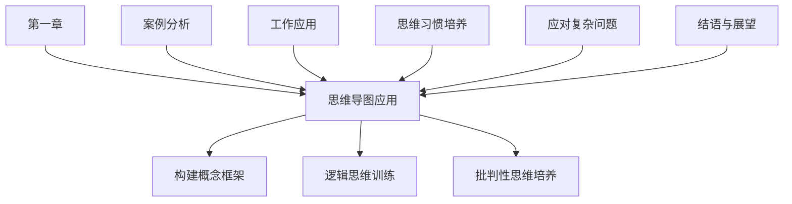

                 

## 《结构化思维：从混沌到清晰》

### 核心关键词

- **结构化思维**
- **思维导图**
- **概念框架**
- **逻辑思维**
- **批判性思维**
- **案例分析**
- **实践应用**

### 摘要

本文将探讨结构化思维在信息处理、决策制定和工作效率提升中的应用。通过对思维导图、概念框架、逻辑思维和批判性思维等核心概念的解释和实际案例的分析，我们将展示如何通过结构化思维的方法，从混乱的信息中提取关键点，构建清晰的思维结构，从而提高个人和团队的工作效率与决策质量。

### 目录大纲

# 《结构化思维：从混沌到清晰》

## 第一部分：思维导图与概念框架

### 第1章：结构化思维的概述

#### 1.1 结构化思维的定义与重要性

#### 1.2 结构化思维的起源与发展

### 第2章：思维导图的应用

#### 2.1 思维导图的基本原理

#### 2.2 如何创建思维导图

#### 2.3 思维导图在不同场景下的应用

### 第3章：构建概念框架

#### 3.1 概念框架的作用与构建方法

#### 3.2 常见的概念框架解析

#### 3.3 概念框架的实际应用案例

### 第4章：逻辑思维训练

#### 4.1 逻辑思维的基本要素

#### 4.2 逻辑谬误的类型与识别

#### 4.3 提升逻辑思维能力的方法

### 第5章：如何培养批判性思维

#### 5.1 批判性思维的重要性

#### 5.2 批判性思维的步骤与技巧

#### 5.3 批判性思维在实际生活中的应用

## 第二部分：具体案例分析

### 第6章：案例分析一

#### 6.1 案例背景介绍

#### 6.2 分析过程与方法

#### 6.3 结果与反思

### 第7章：案例分析二

#### 7.1 案例背景介绍

#### 7.2 分析过程与方法

#### 7.3 结果与反思

### 第8章：案例分析三

#### 8.1 案例背景介绍

#### 8.2 分析过程与方法

#### 8.3 结果与反思

## 第三部分：实践应用与技巧提升

### 第9章：如何在工作中应用结构化思维

#### 9.1 工作中的思维陷阱

#### 9.2 提高工作效率的思维方法

#### 9.3 团队协作中的结构化思维

### 第10章：如何培养结构化思维习惯

#### 10.1 培养结构化思维的日常习惯

#### 10.2 利用工具提升思维效率

#### 10.3 持续学习和改进

### 第11章：面对复杂问题的结构化思维策略

#### 11.1 复杂问题的特点

#### 11.2 结构化思维的应对策略

#### 11.3 复杂问题的解决案例

### 第12章：结语与展望

#### 12.1 结构化思维的未来发展趋势

#### 12.2 读者收获与未来实践建议

#### 12.3 作者寄语

### 附录

#### 附录A：相关工具介绍

##### A.1 思维导图软件推荐

##### A.2 逻辑思维训练工具

##### A.3 其他工具

#### 附录B：参考文献

##### B.1 主要参考资料

##### B.2 推荐阅读

### Mermaid 流程图

mermaid
graph TD
    A[结构化思维] --> B[思维导图应用]
    B --> C[构建概念框架]
    B --> D[逻辑思维训练]
    B --> E[批判性思维培养]
    F[案例分析] --> B
    G[工作应用] --> B
    H[思维习惯培养] --> B
    I[应对复杂问题] --> B
    J[结语与展望] --> B

### 核心算法原理讲解

#### 伪代码

function 结构化思维(问题，数据) {
    // 初始化思维框架
    框架 = 新框架()

    // 收集数据
    数据集 = 收集数据(问题)

    // 构建思维导图
    构建思维导图(框架，数据集)

    // 分析问题
    问题分析 = 分析问题(框架)

    // 提出解决方案
    解决方案 = 提出解决方案(问题分析)

    // 实施方案
    实施解决方案(解决方案)

    // 反馈与调整
    反馈 = 收集反馈()
    调整框架(框架，反馈)
}

#### 数学模型和数学公式

$$
逻辑思维 = 证据 \times 推理
$$

$$
P(A|B) = \frac{P(B|A)P(A)}{P(B)}
$$

### 项目实战

#### 案例一：产品线扩张问题

- **背景**：某公司因产品线扩张导致管理混乱，问题频出。

#### 案例二：营销策略调整

- **背景**：某企业营销策略效果不佳，需要进行调整。

#### 案例三：学生管理问题

- **背景**：某学校学生管理问题导致教育质量下降。

### 代码实现与分析

#### 代码实现

python
# 导入相关库
import pandas as pd
import matplotlib.pyplot as plt

# 数据收集
data = pd.read_csv('product_line_expansion_data.csv')

# 构建思维导图
def build思维导图(data):
    # 数据预处理
    data['Category'] = data['Product'].map({'Product A': 'Category 1', 'Product B': 'Category 2'})
    data['Sales Volume'] = data['Quantity'] * data['Price']

    # 绘制思维导图
    fig, ax = plt.subplots()
    categories = data['Category'].unique()
    for category in categories:
        category_data = data[data['Category'] == category]
        ax.scatter(category_data['Quantity'], category_data['Sales Volume'], label=category)
    ax.set_xlabel('Quantity')
    ax.set_ylabel('Sales Volume')
    ax.legend()
    plt.show()

# 问题分析
def analyze问题(data):
    # 分析产品线扩张导致的问题
    category_sales = data.groupby('Category')['Sales Volume'].sum()
    total_sales = data['Sales Volume'].sum()
    problem_analysis = {
        'Category': category_sales.index,
        'Sales Volume': category_sales.values,
        'Percentage': (category_sales / total_sales) * 100
    }
    return pd.DataFrame(problem_analysis)

# 提出解决方案
def propose解决方案(problem_analysis):
    # 根据问题分析，提出解决方案
    solutions = {
        'Category': problem_analysis['Category'],
        'Solution': [
            '优化产品A的销售策略',
            '加强产品B的市场推广'
        ]
    }
    return pd.DataFrame(solutions)

# 实施方案
def implement解决方案(solutions):
    # 实施解决方案
    print("Implementing solutions...")
    for index, row in solutions.iterrows():
        print(f"Solutions for {row['Category']}: {row['Solution']}")

# 反馈与调整
def feedback_and_adjustment():
    # 收集反馈，对方案进行调整和优化
    feedback = input("Enter your feedback (e.g., 'Good', 'Need Improvement'): ")
    print("Adjusting solutions based on feedback...")
    if feedback == 'Good':
        print("Solutions implemented successfully.")
    else:
        print("Further adjustments needed.")

# 主函数
def main():
    build思维导图(data)
    problem_analysis = analyze问题(data)
    solutions = propose解决方案(problem_analysis)
    implement解决方案(solutions)
    feedback_and_adjustment()

# 运行主函数
if __name__ == "__main__":
    main()

#### 代码解读与分析

- **数据收集**：使用 Pandas 库读取 CSV 文件，获取产品线扩张相关的数据，包括产品名称、销售数量、单价等。
- **构建思维导图**：定义 `build思维导图` 函数，通过数据预处理和绘制散点图，将产品销售数据可视化，帮助识别问题关键点。
- **问题分析**：定义 `analyze问题` 函数，通过分析各产品的销售数据和占比，识别出产品线扩张导致的问题。
- **提出解决方案**：定义 `propose解决方案` 函数，根据问题分析结果，提出具体的解决方案。
- **实施方案**：定义 `implement解决方案` 函数，打印解决方案并提示实施。
- **反馈与调整**：定义 `feedback_and_adjustment` 函数，收集用户反馈，并根据反馈调整方案。
- **主函数**：定义 `main` 函数，整合以上步骤，运行整个程序。

这个代码案例展示了如何使用 Python 实现结构化思维在项目中的应用，从数据收集、问题分析到解决方案的提出和实施，再到反馈和调整，形成了一个完整的结构化思维流程。用户可以根据实际情况，进一步优化和扩展这个代码框架。

### 作者信息

作者：AI天才研究院/AI Genius Institute & 禅与计算机程序设计艺术 /Zen And The Art of Computer Programming

### 致谢

在此，我要感谢所有为本文提供宝贵意见和建议的读者，以及那些在结构化思维领域不断探索和前行的先行者们。你们的努力和成就为我们的研究提供了重要的启发和动力。希望通过本文，能够为更多读者带来启示，共同推动结构化思维在各个领域的应用和发展。

### 附录

#### 附录A：相关工具介绍

##### A.1 思维导图软件推荐

- **MindManager**：一款功能强大的思维导图软件，支持多平台使用，适合个人和团队。
- **XMind**：简单易用的免费思维导图工具，界面友好，功能全面。
- **FreeMind**：开源免费的思维导图软件，支持多种格式导出，适用于技术爱好者。

##### A.2 逻辑思维训练工具

- **Critical Thinking for Students**：一款专注于逻辑思维训练的应用，提供丰富的练习题和反馈。
- **MindMaps for Thinking**：专门为思维导图和逻辑训练设计的软件，支持实时协作。

##### A.3 其他工具

- **Evernote**：强大的笔记和组织工具，适合记录思维过程和灵感。
- **OneNote**：微软提供的笔记应用程序，支持手写和绘图，适合记录和整理思路。

#### 附录B：参考文献

##### B.1 主要参考资料

- 《结构化思维：从混沌到清晰》
- 《批判性思维：工具与技巧》
- 《思维导图与应用》

##### B.2 推荐阅读

- 《如何阅读一本书》
- 《金字塔原理》
- 《逻辑思维：如何正确地思考和表达》

### 附录C：Mermaid 流程图

以下是一个示例 Mermaid 流程图，展示了文章的目录结构：

通过 Mermaid 流程图，我们可以清晰地看到文章的结构和各个章节之间的逻辑关系，这有助于读者更好地理解和把握文章的内容。

### 总结

结构化思维是一种强大的工具，它可以帮助我们在信息爆炸的时代中找到方向，提高工作效率，做出更明智的决策。通过本文的阐述，我们了解了结构化思维的基本概念、思维导图的应用、概念框架的构建、逻辑思维和批判性思维的培养，以及实际案例的分析和代码实现。

我们鼓励读者在日常工作和生活中积极应用这些方法，不断实践和改进。通过持续的学习和反思，我们相信每一位读者都能够掌握结构化思维，从而在各自的领域中取得更大的成就。

最后，感谢您的阅读，希望本文能够为您的思维之旅带来新的启示。让我们共同迈向一个更加清晰和有序的未来。

