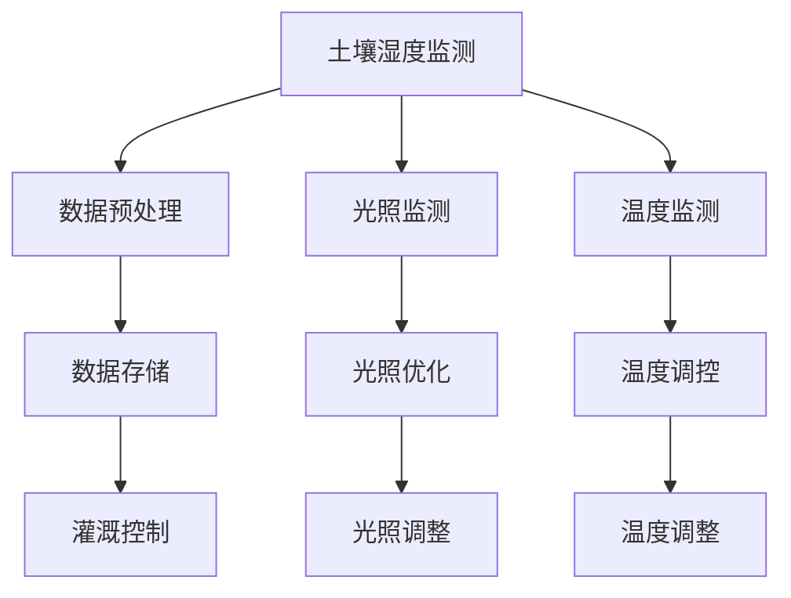
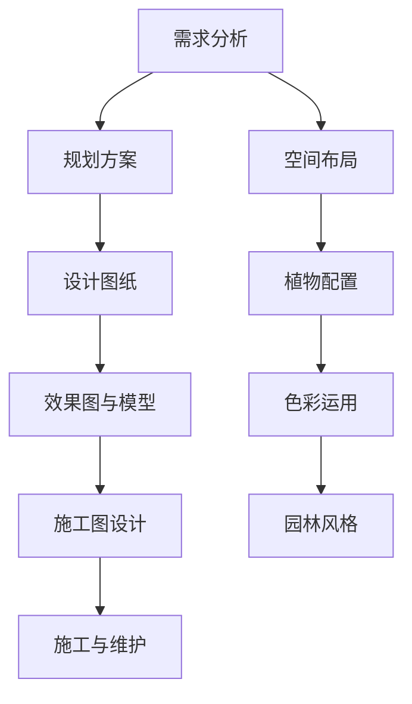
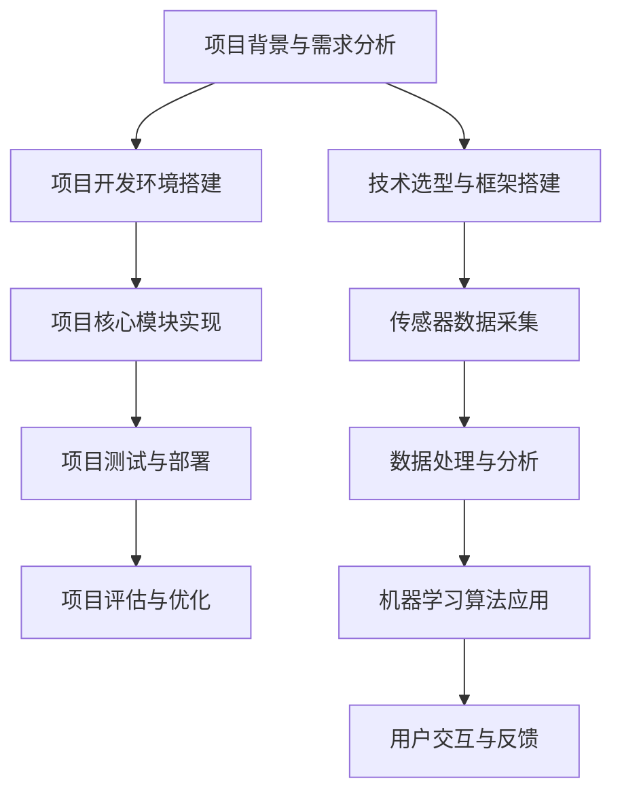

                 

### 《聊天机器人园艺：植物护理和园林设计》

> **关键词**：聊天机器人，园艺，人工智能，植物护理，园林设计

> **摘要**：本文旨在探讨人工智能在园艺领域的应用，特别是聊天机器人技术在植物护理和园林设计方面的优势。通过分析植物护理和园林设计的基本原理，阐述人工智能如何通过监测与管理植物生长环境、评估植物健康状态以及设计园林风格来提升园艺效率和质量。本文还将结合实际案例，展示聊天机器人园艺项目的实施过程及其成果，并对未来发展进行展望。

### 《聊天机器人园艺：植物护理和园林设计》目录大纲

#### 第一部分：引言与基础

1. **引言**  
    1.1 **聊天机器人园艺的背景与意义**  
    1.2 **园艺领域与人工智能的结合**  
    1.3 **本书目标与结构**

2. **聊天机器人园艺概述**  
    2.1 **聊天机器人的基本原理**  
    2.2 **园艺与植物护理的基本概念**  
    2.3 **园林设计的基本要素**

3. **人工智能与园艺的融合**  
    3.1 **人工智能在园艺中的应用**  
    3.2 **人工智能在植物护理中的应用**  
    3.3 **人工智能在园林设计中的应用**

#### 第二部分：植物护理

4. **植物生长环境的监测与管理**  
    4.1 **土壤湿度监测与灌溉控制**  
    4.2 **光照监测与优化**  
    4.3 **温度监测与调控**

5. **植物健康状态的评估**  
    5.1 **叶片病害检测**  
    5.2 **植物生长周期监测**  
    5.3 **土壤营养监测**

6. **植物养护与施肥**  
    6.1 **养护计划的制定**  
    6.2 **施肥方案的设计**

#### 第三部分：园林设计

7. **园林设计的基本原则与流程**  
    7.1 **园林设计的基本原则**  
    7.2 **园林设计的流程与方法**  
    7.3 **园林设计的工具与技术**

8. **园林风格与植物配置**  
    8.1 **园林风格概述**  
    8.2 **植物配置的原则与方法**  
    8.3 **植物选择与搭配技巧**

9. **园林景观规划与设计**  
    9.1 **园林景观规划的基本原理**  
    9.2 **园林设计中的空间布局**  
    9.3 **园林景观设计中的色彩运用**

10. **园林施工与维护**  
    10.1 **园林施工的基本流程**  
    10.2 **园林维护与管理**  
    10.3 **园林施工中的注意事项**

#### 第四部分：项目实战

11. **聊天机器人园艺项目实战**  
    11.1 **项目背景与需求分析**  
    11.2 **项目开发环境搭建**  
    11.3 **项目核心模块实现**  
    11.4 **项目测试与部署**

12. **案例分析**  
    12.1 **案例一：智能温室控制系统**  
    12.2 **案例二：园林景观设计项目**  
    12.3 **案例三：植物养护与施肥系统**

13. **未来发展趋势与展望**  
    13.1 **聊天机器人园艺的发展趋势**  
    13.2 **园艺行业与人工智能的深度融合**  
    13.3 **聊天机器人园艺的未来展望**

#### 附录

A. **常用园艺术语与缩写**

B. **参考文献**

C. **Mermaid 流程图**

### 第一部分：引言与基础

#### 1.1 聊天机器人园艺的背景与意义

随着人工智能技术的不断发展，智能设备在各个领域的应用越来越广泛。在园艺领域，人工智能的应用也呈现出蓬勃发展的态势。聊天机器人园艺作为人工智能在园艺领域的重要应用之一，具有显著的意义。

首先，聊天机器人园艺可以极大地提高园艺工作的效率。传统的园艺工作往往需要人工进行土壤湿度、光照、温度等环境的监测和管理，这不仅费时费力，而且容易出现误差。而聊天机器人园艺通过传感器和算法，可以实时监测植物生长环境，并根据监测结果自动进行灌溉、光照调节、温度控制等操作，从而实现精准园艺。

其次，聊天机器人园艺可以提供专业的植物护理建议。通过大数据分析和机器学习算法，聊天机器人园艺可以收集和分析大量植物生长数据，为用户生成个性化的植物护理方案。例如，根据土壤湿度、光照强度、气温等环境因素，聊天机器人园艺可以为用户推荐最适合的灌溉时间、光照强度、温度设置等参数，从而帮助用户更好地照顾植物。

此外，聊天机器人园艺还可以提供便捷的园林设计服务。用户可以通过与聊天机器人的对话，获取园林设计的相关建议，包括植物配置、园林风格、空间布局等。聊天机器人园艺还可以根据用户的需求和喜好，生成个性化的园林设计方案，帮助用户实现理想中的花园景观。

#### 1.2 园艺领域与人工智能的结合

园艺领域与人工智能的结合主要体现在以下几个方面：

1. **环境监测与控制**：人工智能可以通过传感器收集植物生长环境数据，如土壤湿度、光照强度、温度等。通过数据分析和机器学习算法，人工智能可以实现对植物生长环境的精准监测和控制，提高园艺效率和质量。

2. **植物健康状态评估**：人工智能可以通过图像识别技术、光谱分析等方法，对植物的叶片、果实等部位进行健康状态评估。通过分析植物的健康状态数据，人工智能可以及时发现病虫害、生长异常等问题，并提供相应的处理建议。

3. **园林设计优化**：人工智能可以通过大数据分析和机器学习算法，为园林设计提供科学依据。例如，根据用户的需求和喜好，人工智能可以推荐合适的植物种类、配置方案和园林风格，从而优化园林设计效果。

4. **智能推荐系统**：人工智能可以通过用户行为分析和兴趣偏好，为用户提供个性化的园艺产品推荐。例如，根据用户的购买历史和浏览记录，人工智能可以为用户推荐最适合的肥料、农药、园艺工具等。

#### 1.3 本书目标与结构

本书旨在探讨人工智能在园艺领域的应用，特别是聊天机器人园艺在植物护理和园林设计方面的优势。具体目标如下：

1. **介绍聊天机器人园艺的基本原理和关键技术**：通过分析聊天机器人园艺的背景、意义和基本原理，帮助读者了解聊天机器人园艺的技术架构和工作机制。

2. **阐述人工智能在园艺领域的应用**：介绍人工智能在园艺中的应用，包括环境监测与控制、植物健康状态评估、园林设计优化等方面，帮助读者了解人工智能在园艺领域的实际应用场景。

3. **详细讲解植物护理和园林设计的方法与技巧**：通过具体实例和案例分析，介绍植物护理和园林设计的方法和技巧，帮助读者掌握植物护理和园林设计的基本原理和实用技巧。

4. **探讨聊天机器人园艺的未来发展趋势**：分析聊天机器人园艺的发展趋势，探讨园艺行业与人工智能的深度融合，为读者提供对未来园艺发展的思考。

本书结构如下：

- **第一部分：引言与基础**：介绍聊天机器人园艺的背景与意义，园艺领域与人工智能的结合，以及本书的目标与结构。

- **第二部分：植物护理**：介绍植物护理的基本原理和关键技术，包括植物生长环境的监测与管理、植物健康状态的评估、植物养护与施肥等方面。

- **第三部分：园林设计**：介绍园林设计的基本原理和关键技术，包括园林设计的基本原则与流程、园林风格与植物配置、园林景观规划与设计、园林施工与维护等方面。

- **第四部分：项目实战**：通过具体案例，展示聊天机器人园艺项目的实施过程及其成果，帮助读者了解项目开发流程和实战经验。

- **附录**：提供常用园艺术语与缩写、参考文献、Mermaid 流程图等内容，为读者提供进一步学习和参考资料。

### 第二部分：聊天机器人园艺概述

#### 2.1 聊天机器人的基本原理

聊天机器人，又称聊天bots（聊天机器人），是一种基于自然语言处理（NLP）和机器学习技术的计算机程序，能够与用户进行对话，提供信息、解答问题或执行特定任务。聊天机器人的基本原理可以分为以下几个方面：

1. **自然语言理解（NLU）**：这是聊天机器人接收并理解用户输入的关键环节。NLU 技术主要包括词法分析、句法分析和语义分析等。词法分析将用户输入的文本分解成单词和符号，句法分析构建句子结构，语义分析则理解句子的实际意义。

2. **对话管理**：对话管理是聊天机器人的核心部分，负责控制对话的流程。它包括对话状态跟踪、意图识别、上下文维护等。意图识别确定用户意图，上下文维护确保对话连贯性。

3. **自然语言生成（NLG）**：NLG 技术负责将聊天机器人的响应转换成自然语言。它可以通过模板生成、规则引擎或生成式模型来实现。

4. **机器学习**：聊天机器人通常使用机器学习算法来改进性能。通过训练，聊天机器人可以识别新的模式，理解复杂的语言结构，甚至进行对话策略的优化。

#### 2.2 园艺与植物护理的基本概念

园艺是指人类利用植物进行种植、栽培、观赏和利用的活动。园艺包括蔬菜、水果、花卉、树木等多种植物的培养和管理。植物护理则是指对植物进行日常维护和健康管理，以确保其生长良好和美观。

1. **植物生长环境**：植物生长环境包括土壤、水分、光照、温度、空气等。良好的生长环境对植物的生长和发育至关重要。

2. **土壤**：土壤是植物生长的基础，其肥力、酸碱度、水分保持能力等直接影响植物的生长。

3. **水分**：植物需要适量的水分来维持生命活动。浇水的时间和方式对植物的生长有重要影响。

4. **光照**：光照是植物进行光合作用的必要条件。不同植物对光照的需求不同，光照的强度和时长直接影响植物的生长状态。

5. **温度**：温度是植物生长的一个重要环境因素。不同植物对温度的适应性不同，适宜的温度有助于植物生长。

6. **空气**：空气中的氧气、二氧化碳等气体对植物的生长有重要作用。空气的质量和流通性对植物的健康有直接影响。

#### 2.3 园林设计的基本要素

园林设计是园艺的一个分支，它关注于创造美观、舒适、实用的园林景观。园林设计的基本要素包括：

1. **植物配置**：植物配置是园林设计的核心，包括植物的选择、排列和组合。合适的植物配置可以创造出丰富多彩的园林景观。

2. **空间布局**：空间布局是指园林中各个元素的排列和分布。合理的空间布局可以使园林具有层次感、序列感和节奏感。

3. **园林风格**：园林风格是园林设计的艺术表现。不同的园林风格具有不同的审美特征和文化内涵，如古典园林、现代园林、自然园林等。

4. **色彩运用**：色彩是园林设计中的重要元素。合理的色彩运用可以增强园林的视觉效果，营造出不同的氛围。

5. **景观规划**：景观规划是指对园林中的道路、水体、建筑等元素进行布局和设计。景观规划要考虑到园林的整体结构和功能需求。

#### 2.4 聊天机器人园艺的特点与优势

聊天机器人园艺具有以下特点与优势：

1. **智能化**：聊天机器人园艺通过人工智能技术，可以自动识别植物生长环境，监测植物健康状态，提供精准的护理建议。

2. **个性化**：聊天机器人园艺可以根据用户的需求和植物的特点，生成个性化的护理方案，实现精准园艺。

3. **便捷性**：用户可以通过聊天机器人与植物进行实时互动，获取植物护理和园林设计的相关建议，无需额外的人工干预。

4. **高效性**：聊天机器人园艺可以自动化执行植物护理任务，如灌溉、施肥、修剪等，提高园艺工作的效率。

5. **实时性**：聊天机器人园艺可以实时监测植物生长环境，及时调整护理策略，确保植物的健康生长。

6. **可扩展性**：聊天机器人园艺可以集成多种传感器和设备，实现多种功能的扩展，如植物病害检测、园林设计优化等。

通过以上特点与优势，聊天机器人园艺为园艺工作者和爱好者提供了强大的技术支持，极大地提高了园艺工作的效率和质量。接下来，我们将深入探讨人工智能在园艺领域的具体应用。

### 第三部分：人工智能与园艺的融合

#### 3.1 人工智能在园艺中的应用

人工智能（AI）在园艺领域的应用正在迅速扩展，其技术涵盖了从植物生长环境的监测与管理到园林设计的多个方面。以下是人工智能在园艺中的一些典型应用：

1. **环境监测与控制**：
   - **土壤监测**：通过传感器实时监测土壤的湿度、温度、酸碱度等参数，利用机器学习算法分析土壤数据，为植物提供精准的水肥管理。
   - **气候监测**：利用卫星图像和地面传感器监测气候条件，预测天气变化，为植物保护提供依据。
   - **光照监测**：通过光照传感器监测光照强度和时长，优化植物的光照条件，提高光合作用效率。

2. **植物健康状态评估**：
   - **图像识别**：利用图像识别技术，通过分析植物叶片的图像，自动检测病虫害，及时采取防治措施。
   - **光谱分析**：通过光谱分析技术，检测植物叶片的光谱特征，评估植物的营养状况和生长状态。

3. **智能推荐系统**：
   - **植物养护推荐**：根据环境数据和植物特性，智能推荐最适合的养护措施，如浇水、施肥、修剪等。
   - **植物病虫害防治**：根据病虫害的历史数据和实时监测结果，推荐最有效的防治方法。

4. **园林设计优化**：
   - **植物配置优化**：利用大数据分析和机器学习算法，推荐最佳的植物配置方案，提高园林景观的视觉效果。
   - **园林风格设计**：根据用户偏好和园林特点，设计个性化的园林风格，满足用户的个性化需求。

5. **自动化管理**：
   - **自动化灌溉系统**：通过智能灌溉系统，根据土壤湿度自动调节灌溉时间，节约水资源。
   - **自动化施肥系统**：利用传感器监测土壤营养状况，自动调整施肥量和时间，提高肥料利用效率。

6. **病虫害预测与防治**：
   - **预测模型**：基于历史病虫害数据和环境因素，建立预测模型，提前预警病虫害的发生。
   - **防治方案**：根据预测结果，智能推荐防治措施，减少病虫害造成的损失。

#### 3.2 人工智能在植物护理中的应用

人工智能在植物护理中的应用主要体现在以下几个方面：

1. **精准灌溉**：
   - **实时监测**：利用土壤湿度传感器，实时监测土壤湿度，确保植物获得适量的水分。
   - **自动化控制**：通过智能控制系统，自动调节灌溉时间，避免过度或不足灌溉。

2. **智能施肥**：
   - **营养监测**：利用土壤养分传感器，实时监测土壤中的养分含量，为植物提供精确的施肥方案。
   - **自动化施肥**：通过智能施肥系统，根据植物需求和土壤养分状况，自动调整施肥量。

3. **病虫害防治**：
   - **早期预警**：利用图像识别和光谱分析技术，早期检测植物叶片的病害和虫害，及时采取防治措施。
   - **智能防治**：根据病虫害的类型和严重程度，智能推荐最有效的防治方法，如药物喷洒、生物防治等。

4. **植物健康评估**：
   - **生长监测**：通过传感器监测植物的生长状态，包括生长周期、生长速度等，为植物提供个性化护理建议。
   - **健康分析**：利用大数据分析和机器学习算法，分析植物的健康数据，预测潜在的健康问题，提前采取措施。

5. **养护计划**：
   - **智能推荐**：根据植物的生长环境和特性，智能推荐最佳的养护计划，包括浇水、施肥、修剪等。
   - **计划管理**：利用智能系统，自动执行养护计划，确保植物得到及时和恰当的护理。

6. **用户互动**：
   - **问答系统**：通过聊天机器人，用户可以随时获取植物护理的相关信息，包括常见问题的解答、养护技巧等。
   - **个性化服务**：根据用户的需求和反馈，聊天机器人可以提供个性化的植物护理建议，提高用户体验。

通过以上应用，人工智能极大地提高了植物护理的精准性和效率，为园艺工作者和爱好者提供了强大的技术支持。

#### 3.3 人工智能在园林设计中的应用

人工智能在园林设计中的应用为设计师和用户提供了新的工具和方法，使得园林设计更加科学、个性化和高效。以下是人工智能在园林设计中的主要应用：

1. **植物配置优化**：
   - **大数据分析**：利用大量园林设计数据，分析不同植物配置的效果，为设计师提供参考。
   - **机器学习算法**：根据用户需求和园林特点，利用机器学习算法推荐最佳的植物配置方案。

2. **园林风格设计**：
   - **风格识别**：通过图像识别技术，识别园林风格的特点，为设计师提供设计灵感。
   - **风格转换**：利用深度学习技术，将一种园林风格转换成另一种风格，满足不同用户的个性化需求。

3. **空间布局优化**：
   - **空间分析**：通过空间分析技术，优化园林中道路、水体、建筑等元素的布局，提高园林的实用性和美观度。
   - **空间模拟**：利用虚拟现实（VR）技术，模拟园林空间效果，帮助设计师和用户直观地了解设计效果。

4. **色彩运用**：
   - **色彩分析**：通过色彩分析技术，推荐最佳的颜色搭配方案，提升园林的视觉效果。
   - **色彩调整**：利用人工智能算法，根据用户需求和环境特点，自动调整园林的色彩方案。

5. **景观规划**：
   - **规划建议**：利用人工智能分析环境数据，为设计师提供科学的景观规划建议。
   - **规划模拟**：通过人工智能模拟园林的景观效果，帮助设计师评估规划方案的效果。

6. **园林施工与维护**：
   - **自动化施工**：利用人工智能控制施工机械，提高园林施工的效率和质量。
   - **智能维护**：通过传感器监测园林的健康状态，自动调整维护策略，确保园林的持续美观。

通过以上应用，人工智能为园林设计带来了新的思路和方法，使得园林设计更加科学、个性化和高效。这不仅提高了设计师的工作效率，也提升了用户的满意度。

### 第二部分：植物护理

植物护理是园艺的重要组成部分，它关乎植物的健康生长和美观度。随着人工智能技术的不断发展，人工智能在植物护理中的应用也越来越广泛，显著提升了植物护理的精准性和效率。以下将详细探讨人工智能在植物护理中的应用，包括植物生长环境的监测与管理、植物健康状态的评估以及植物养护与施肥的自动化。

#### 4.1 植物生长环境的监测与管理

植物的生长环境对其健康和生长状态有着至关重要的影响。良好的生长环境能促进植物的健康生长，而恶劣的环境则可能导致植物生长不良甚至死亡。因此，对植物生长环境的监测与管理是植物护理的首要任务。

1. **土壤湿度监测与灌溉控制**：
   - **土壤湿度监测**：土壤湿度是植物生长的重要指标。通过土壤湿度传感器，可以实时监测土壤的湿度变化。这些传感器通常采用电容式、电阻式或超声波式等测量方法，将湿度信号转换为电信号，然后通过无线传输技术发送到中央控制系统。
   - **灌溉控制**：基于土壤湿度监测数据，智能灌溉系统能够自动控制灌溉设备，根据土壤湿度状况适时灌溉。灌溉系统可以采用滴灌、喷灌或微灌等方式，通过调节灌溉量和时间，确保植物获得适量的水分。

2. **光照监测与优化**：
   - **光照监测**：植物对光照的需求因植物种类和生长阶段而异。通过光照传感器，可以监测植物所处的光照强度和光照时长。这些传感器通常采用光敏电阻或光电池等原理，将光照强度转换为电信号。
   - **光照优化**：智能系统可以根据光照监测数据，自动调整植物的生长环境光照条件。例如，在光照不足时，系统可以开启人工光源或调整植物的位置，以确保植物获得足够的光照。

3. **温度监测与调控**：
   - **温度监测**：温度是影响植物生长的关键环境因素。通过温度传感器，可以实时监测植物所处的温度变化。这些传感器通常采用热敏电阻或热电偶等原理，将温度信号转换为电信号。
   - **温度调控**：智能系统可以根据温度监测数据，自动调节温室或大棚的通风、加热或冷却设备，以保持适宜的温度范围。例如，在高温时，系统可以开启风扇或喷雾降温；在低温时，系统可以开启加热器或保温设备。

#### 4.2 植物健康状态的评估

植物健康状态评估是植物护理的重要组成部分，它有助于及时发现植物的生长异常和病虫害，并采取相应的防治措施。人工智能技术在植物健康状态评估中发挥着重要作用。

1. **叶片病害检测**：
   - **图像识别技术**：通过图像识别技术，可以自动检测植物叶片的病害。具体方法包括使用卷积神经网络（CNN）对叶片图像进行特征提取和分类。这些图像可以通过摄像头或高分辨率扫描仪获取。
   - **光谱分析技术**：通过光谱分析技术，可以检测叶片的光谱特征，从而识别病害。光谱分析可以揭示叶片的生化变化，为病害检测提供科学依据。

2. **植物生长周期监测**：
   - **生长周期原理**：植物的生长周期包括发芽期、幼苗期、生长盛期、开花期、结果期和成熟期等阶段。每个阶段对环境条件的需求不同。通过监测植物的生长周期，可以了解植物的生长状况和健康状态。
   - **生长周期监测算法**：利用时间序列分析和机器学习算法，可以监测植物的生长周期。这些算法可以根据植物的生长数据，预测植物的生长阶段和潜在问题。

3. **土壤营养监测**：
   - **土壤营养监测原理**：土壤中的养分含量直接影响植物的生长和发育。通过土壤营养监测，可以了解土壤的养分状况，从而为施肥提供科学依据。
   - **营养监测算法**：利用光谱分析、电化学方法和化学分析等技术，可以监测土壤中的养分含量。这些方法可以精确地检测土壤中的氮、磷、钾等主要养分元素。

#### 4.3 植物养护与施肥

植物养护与施肥是保证植物健康生长的关键环节。人工智能技术的应用，使得植物养护与施肥更加智能化和精准化。

1. **养护计划的制定**：
   - **养护计划原理**：养护计划是根据植物的生长环境和需求，制定的一系列管理措施。这些措施包括浇水、施肥、修剪、病虫害防治等。
   - **养护计划算法**：利用机器学习和大数据分析技术，可以制定个性化的养护计划。这些算法可以根据植物的生长数据和环境数据，预测植物的生长需求和潜在问题，从而制定最优的养护计划。

2. **施肥方案的设计**：
   - **施肥原理**：施肥是为了补充植物生长所需的养分。合适的施肥方案可以提高植物的生长速度和产量，改善植物的品质。
   - **施肥算法**：利用土壤营养监测数据和植物生长数据，可以设计个性化的施肥方案。这些算法可以根据植物的需求和土壤的养分状况，确定最佳的施肥时间和施肥量。

3. **自动化执行**：
   - **自动化执行原理**：通过自动化执行系统，可以自动执行养护计划和施肥方案。这些系统可以连接各种智能设备和传感器，实现植物护理的自动化。
   - **自动化执行策略**：利用物联网（IoT）技术，可以实时监控植物的生长环境，自动调整养护和施肥策略。例如，当土壤湿度低于阈值时，系统可以自动启动灌溉设备；当植物需要施肥时，系统可以自动启动施肥设备。

通过以上应用，人工智能技术在植物护理中发挥了重要作用，显著提升了植物护理的效率和质量。未来，随着人工智能技术的进一步发展，植物护理将变得更加智能化和精准化，为园艺工作者和爱好者提供更加便捷和高效的服务。

### 第三部分：园林设计

#### 7.1 园林设计的基本原则

园林设计是一门综合艺术，它不仅涉及植物的选择和配置，还包括空间布局、景观规划和色彩运用等方面。在园林设计中，以下基本原则是确保设计成功的关键：

1. **功能性**：园林设计应首先考虑其功能性。这意味着园林应满足用户的实际需求，如休闲、娱乐、观赏等。设计时应考虑不同的使用场景，确保园林的实用性。

2. **美学性**：美学性是园林设计的核心。设计师应通过植物配置、空间布局和色彩运用等手段，创造出一个美观、和谐、富有艺术感的园林景观。

3. **可持续性**：园林设计应考虑生态可持续性，采用环保材料和技术，减少对环境的负面影响。同时，设计应具有长期的稳定性和适应性，以应对气候变化和环境变化。

4. **个性化**：每个园林设计项目都有其独特的背景和用户需求。个性化设计可以满足用户个性化的审美和功能需求，使园林更具吸引力。

5. **生态多样性**：园林设计应促进生态多样性的发展，通过引入多种植物和生物，增加园林的生物多样性，提高生态系统的稳定性。

6. **灵活性**：园林设计应具有一定的灵活性，允许在后期进行修改和调整。这有助于适应用户需求的变化和环境条件的变化。

#### 7.2 园林设计的流程与方法

园林设计是一个系统性的工作，需要经过多个阶段的流程和方法。以下是园林设计的基本流程：

1. **项目分析**：
   - **需求分析**：了解用户的需求，包括功能需求、美学需求和预算等。
   - **场地分析**：对园林的场地进行详细分析，包括地形、土壤、气候等环境因素。

2. **规划方案**：
   - **初步规划**：根据需求分析和场地分析，制定初步的园林规划方案。
   - **详细规划**：细化园林规划方案，包括空间布局、植物配置、景观规划等。

3. **设计图纸**：
   - **平面图**：绘制园林的平面图，标明植物配置、道路、水体、建筑等元素。
   - **立面图**：绘制园林的立面图，展示园林的立体效果和细节。

4. **效果图与模型**：
   - **效果图**：通过计算机辅助设计（CAD）软件或三维建模软件，制作园林效果图，展示园林的整体效果。
   - **模型制作**：根据设计图纸，制作园林的三维模型，用于展示和评估设计效果。

5. **施工图设计**：
   - **施工图**：根据效果图和模型，绘制详细的施工图，包括尺寸、材料、工艺等详细信息。

6. **施工与维护**：
   - **施工**：根据施工图，进行园林的施工工作，包括植物种植、景观建造等。
   - **维护**：园林建成后，需要进行定期的维护和管理，确保园林的长期美观和功能。

#### 7.3 园林设计的工具与技术

现代园林设计离不开各种工具和技术的支持。以下是一些常用的园林设计工具和技术：

1. **计算机辅助设计（CAD）**：
   - **CAD软件**：如AutoCAD、SketchUp等，用于绘制园林设计图纸、效果图和模型。
   - **功能**：包括二维绘图、三维建模、尺寸标注、材料库等。

2. **三维建模软件**：
   - **三维建模软件**：如3ds Max、Maya等，用于制作园林的三维模型和动画。
   - **功能**：包括三维建模、材质贴图、灯光设置、动画制作等。

3. **虚拟现实（VR）技术**：
   - **VR设备**：如VR头盔、手柄等，用于模拟园林的实际效果，提供沉浸式的体验。
   - **功能**：包括空间体验、场景导航、互动操作等。

4. **无人机摄影**：
   - **无人机**：用于高空拍摄园林全景，生成高精度的三维地图。
   - **功能**：包括全景拍摄、地形测量、植被分析等。

5. **地理信息系统（GIS）**：
   - **GIS软件**：如ArcGIS等，用于空间数据的采集、分析和展示。
   - **功能**：包括地图制作、空间分析、属性查询等。

6. **物联网（IoT）技术**：
   - **传感器**：用于实时监测园林的环境数据，如土壤湿度、光照强度、空气温度等。
   - **功能**：包括数据采集、传输、分析等。

通过以上工具和技术，园林设计师可以更加高效地完成设计工作，确保园林设计的科学性、美感和实用性。

### 8.1 园林风格概述

园林风格是园林设计的灵魂，不同的园林风格反映了不同的文化背景、审美趣味和设计理念。以下是几种常见的园林风格及其特点：

1. **古典园林**：
   - **特点**：古典园林注重对称、规则和精致，常用矩形、圆形、弧形等几何形状，植物配置讲究层次分明、错落有致。园林中的建筑、小桥、亭台等元素都体现了中国传统园林的艺术特色。
   - **代表**：如颐和园、拙政园、留园等。

2. **现代园林**：
   - **特点**：现代园林注重自然、简约和功能，强调人与自然的和谐共生。植物配置灵活多变，空间布局自由，常常运用抽象、简洁的造型和材料。
   - **代表**：如纽约中央公园、伦敦海德公园等。

3. **自然园林**：
   - **特点**：自然园林追求自然的原生态效果，强调自然的美和生命的力量。园林中的植物生长自然，空间布局随意，强调自然元素如水体、石头、树林等。
   - **代表**：如英式园林、法式园林等。

4. **日式园林**：
   - **特点**：日式园林注重简约、精致和禅意，常用石板、石头、苔藓等自然材料，通过简洁的线条和布局表达深邃的意境。园林中的池塘、瀑布等元素也常常带有浓郁的禅意。
   - **代表**：如东京上野公园、京都龙安寺等。

5. **热带园林**：
   - **特点**：热带园林注重色彩鲜艳、形态多样，常用热带植物如椰子树、芭蕉树、热带花卉等，空间布局灵活，充满热带风情。
   - **代表**：如海南热带天堂公园等。

6. **北欧园林**：
   - **特点**：北欧园林注重功能性和实用性，常用硬质景观如石板、木材等，植物配置以耐寒、耐旱的植物为主，空间布局简洁大方。
   - **代表**：如挪威奥斯陆的公园等。

不同的园林风格各有特色，设计师可以根据项目需求和用户喜好，选择合适的园林风格，创造出独特的园林景观。

#### 8.2 植物配置的原则与方法

植物配置是园林设计的重要组成部分，它直接影响园林的美观度和实用性。合理的植物配置可以使园林景观层次丰富、意境深远。以下介绍植物配置的原则与方法：

1. **植物配置原则**：
   - **多样性**：选择多种不同类型的植物，包括乔木、灌木、草本等，以增加园林的多样性。
   - **季节性**：考虑植物的季相变化，合理搭配不同季节开花的植物，使园林景观四季皆美。
   - **协调性**：植物的形态、色彩和质地应相互协调，避免冲突，营造出和谐的美感。
   - **功能性**：根据园林的功能需求，选择合适的植物，如观赏植物、遮荫植物、环保植物等。
   - **可持续性**：选用本地植物和耐旱、抗病虫害的植物，降低维护成本，保护生态环境。

2. **植物配置方法**：
   - **背景配置**：以乔木或大型灌木作为背景，为园林景观提供层次感。例如，可以在园林的背面种植银杏、松树等高大植物。
   - **中间配置**：以灌木和草本植物为主，形成中间层次。可以选择紫薇、牡丹、月季等色彩丰富的植物，增加园林的观赏性。
   - **前景配置**：以草坪、地被植物和花卉为主，形成前景层次。草坪可以增加园林的开放感，地被植物如地锦、麦冬等可以填补裸露地面，花卉如萱草、郁金香等可以增加色彩和动感。

3. **植物选择与搭配技巧**：
   - **色彩搭配**：根据色彩理论，合理搭配不同颜色的植物，创造出丰富的视觉层次。例如，可以搭配红色、黄色、蓝色等冷暖对比强烈的颜色，增强园林的视觉冲击力。
   - **形态搭配**：选择形态各异、大小不同的植物，形成丰富的形态层次。例如，可以搭配高大的乔木、低矮的灌木和地被植物，创造出高低错落、层次分明的景观。
   - **质地搭配**：选择质地不同的植物，如叶片光滑的植物与叶片粗糙的植物搭配，增加园林的质感层次。
   - **花期搭配**：选择花期不同的植物，使园林景观在不同的季节都能保持美丽。例如，可以将早春开花的植物与夏季开花的植物搭配，延长园林的观赏期。

通过以上原则和方法，设计师可以创造出独具特色的园林景观，满足用户的功能和美学需求。

### 8.3 植物选择与搭配技巧

植物选择与搭配技巧在园林设计中至关重要，它直接影响园林的视觉效果和使用体验。以下介绍植物选择与搭配的一些关键技巧：

1. **植物选择依据**：
   - **功能需求**：根据园林的功能需求，选择合适的植物。例如，在休闲区可以选择遮荫植物，在景观道路两侧可以选择观赏性强的植物。
   - **生长环境**：考虑植物的生长习性，包括土壤、水分、光照、温度等环境条件。选择适应性强、耐旱、耐寒的植物，确保植物能够良好生长。
   - **季节变化**：根据季节变化选择不同类型的植物，确保园林四季皆美。例如，春季可以选择开花植物，夏季可以选择耐热植物，秋季可以选择色彩丰富的植物。
   - **生态效益**：考虑植物的生态效益，选择具有空气净化、水源保护、生物多样性等功能的植物，提高园林的生态价值。

2. **植物搭配技巧**：
   - **色彩搭配**：色彩是园林设计中的关键元素。合理搭配不同颜色的植物，可以创造出丰富的视觉层次。例如，可以将暖色调的植物与冷色调的植物搭配，形成对比，增强视觉冲击力。常用的色彩搭配包括红黄组合、蓝绿组合等。
   - **形态搭配**：形态搭配可以增加园林的立体感和层次感。选择不同高度、形态的植物进行搭配，如高大的乔木、低矮的灌木和地被植物。此外，还可以选择叶片形状、质地不同的植物进行搭配，增加园林的多样性。
   - **花期搭配**：花期搭配可以延长园林的观赏期。选择花期不同的植物进行搭配，使园林在不同季节都有不同的景观。例如，可以将春季开花的花卉与夏季开花的灌木搭配，秋季的落叶乔木与冬季的常绿植物搭配。
   - **意境搭配**：意境搭配可以增强园林的内涵和意境。通过选择具有特定象征意义的植物进行搭配，如松柏象征长寿、梅花象征坚韧等，营造出富有文化底蕴的园林景观。

3. **案例与实践**：
   - **案例一**：一个城市公园的景观设计，根据功能需求和季节变化，选择了春季开花的花卉如樱花、桃花，夏季的灌木如茉莉、石榴，秋季的落叶乔木如银杏、枫树，冬季的常绿植物如松柏。通过合理的植物搭配，公园在不同季节都呈现出了独特的景观效果。
   - **案例二**：一个住宅区的园林设计，根据居住者的喜好，选择了以红色和黄色为主的植物进行搭配，如玫瑰、向日葵等。通过色彩搭配，住宅区的园林景观显得更加鲜艳和活泼。

通过以上植物选择与搭配技巧，设计师可以创造出美观、实用、富有意境的园林景观，满足用户的需求和审美。

### 9.1 园林景观规划的基本原理

园林景观规划是园林设计中的重要环节，它关系到园林的整体布局、功能分区、植物配置以及空间利用等。以下介绍园林景观规划的基本原理：

1. **整体布局**：
   - **层次感**：园林景观规划应具备层次感，通过植物、水体、道路、建筑等元素的错落有致，形成丰富的空间层次。层次感不仅增加了园林的美感，也提升了园林的实用性。
   - **轴线与对称**：园林规划中常采用轴线对称或不对称的布局方式，以增强园林的稳定感和和谐感。轴线可以作为园林景观的主导线，引导游客的视线，提升园林的视觉效果。
   - **区域划分**：根据园林的功能需求和审美需求，合理划分不同区域。例如，可以将园林划分为休闲区、活动区、观赏区等，每个区域都有其特定的功能和景观特点。

2. **功能分区**：
   - **功能需求**：园林规划应根据不同的功能需求进行分区。例如，休闲区应考虑舒适度和私密性，可以设置座椅、凉亭等休息设施；活动区应考虑活动空间的大小和安全性，可以设置运动场地、儿童游乐设施等。
   - **人流动线**：合理规划人流动线，使游客在园林中能够顺畅地行走和观赏。避免人流冲突，提升游客的体验感。

3. **植物配置**：
   - **季相变化**：植物配置应考虑不同季节的景观效果，选择不同花期、叶期的植物进行搭配，确保园林四季皆美。例如，春季可以选择开花植物，夏季可以选择耐热植物，秋季可以选择色彩丰富的落叶乔木。
   - **色彩搭配**：通过合理的色彩搭配，提升园林的视觉效果。例如，可以将暖色调和冷色调的植物搭配，形成鲜明的对比，增强园林的视觉冲击力。

4. **空间利用**：
   - **立体利用**：在园林规划中，应充分利用空间，进行立体布局。例如，可以利用假山、亭台等元素，增加园林的层次感和深度感。
   - **微地形**：通过设置微地形，如小山、水池、步道等，增加园林的趣味性和变化性。

5. **生态保护**：
   - **生物多样性**：在园林规划中，应重视生物多样性的保护，引入多种植物和生物，增加园林的生态价值。
   - **水资源利用**：合理规划水体，如池塘、瀑布、喷泉等，既能美化环境，又能提升园林的生态功能。

通过以上基本原理，园林景观规划可以创造出功能齐全、美观实用的园林景观，满足人们的生活和审美需求。

### 9.2 园林设计中的空间布局

空间布局是园林设计中的关键要素，它决定了园林的整体结构和景观效果。合理的空间布局可以使园林功能清晰、景观丰富、层次分明。以下介绍园林设计中的空间布局方法：

1. **空间布局原则**：
   - **功能分区**：根据园林的功能需求，合理划分不同区域。例如，可以将园林划分为入口区、休闲区、活动区、观赏区等，每个区域都有其特定的功能和景观特点。
   - **层次感**：通过植物、水体、道路、建筑等元素的错落有致，形成丰富的空间层次。层次感不仅增加了园林的美感，也提升了园林的实用性。
   - **导向性**：利用空间布局引导游客的视线和流动，使游客能够顺畅地观赏园林。例如，可以通过景观轴线、主入口等元素，引导游客进入园林的中心区域。
   - **和谐统一**：在空间布局中，应注重各个元素的协调与统一，避免冲突，营造出和谐的美感。

2. **空间布局方法**：
   - **线性布局**：线性布局是指利用直线或曲线将园林中的各个景点串联起来，形成一条或多条游览线路。线性布局适合于狭长或不规则形状的园林，可以创造出序列感和节奏感。
   - **面状布局**：面状布局是指将园林整体划分为多个区域，每个区域都有其特定的功能和景观特点。面状布局适合于大面积的园林，可以创造出多样性和丰富性。
   - **节点布局**：节点布局是指将园林中的关键景点（如亭台、湖泊、广场等）作为节点，通过节点之间的联系和过渡，形成整体的布局。节点布局适合于复杂或大型园林，可以创造出丰富的景观层次和互动空间。
   - **自然布局**：自然布局是指模仿自然景观的布局方式，强调自然形态和生态多样性。自然布局适合于追求自然、生态的园林，可以创造出亲近自然的氛围。

3. **空间布局技巧**：
   - **空间分隔与融合**：通过围墙、篱笆、水体、植物等元素，分隔出不同空间，同时保持空间的连通性和互动性，创造出既分隔又融合的布局效果。
   - **空间引导与层次**：通过景观元素如道路、桥梁、步道等，引导游客的视线和流动，形成层次分明的空间体验。
   - **空间氛围营造**：利用植物、水体、灯光等元素，营造不同的空间氛围，如宁静、活泼、浪漫等，满足不同游客的需求。
   - **空间利用最大化**：通过合理的空间布局，充分利用园林的每一寸土地，实现空间利用的最大化。

4. **实例分析**：
   - **实例一**：一个城市公园的景观设计，采用线性布局，将公园划分为入口区、休闲区、活动区、观赏区等，每个区域都有不同的景观特点。通过设置景观轴线和主入口，引导游客进入公园的中心区域，形成一条流畅的游览线路。
   - **实例二**：一个乡村度假村的园林设计，采用自然布局，模仿自然景观的布局方式，引入多种植物和生物，创造出亲近自然的氛围。通过设置微地形和自然景观元素，形成丰富的空间层次和互动空间。

通过以上空间布局方法和技巧，设计师可以创造出功能齐全、景观丰富、富有层次的园林景观，满足人们的审美和生活需求。

### 9.3 园林景观设计中的色彩运用

色彩是园林景观设计中的重要元素，它直接影响园林的美观度和氛围营造。合理运用色彩，可以增强园林的视觉吸引力，提升整体景观效果。以下介绍园林景观设计中的色彩运用原则和技巧：

1. **色彩运用原则**：
   - **和谐统一**：色彩运用应遵循和谐统一的原则，使园林中的各个元素在色彩上相互协调。例如，可以选择相近色系或互补色系进行搭配，避免色彩冲突。
   - **主次分明**：在园林景观中，应明确色彩的主次关系。主色调应突出，形成视觉焦点，辅助色调则应起到衬托和平衡的作用。
   - **氛围营造**：色彩运用应考虑园林的功能和氛围需求。例如，在休闲区可以运用柔和、温馨的色彩，营造轻松舒适的氛围；在活动区可以运用明亮、活泼的色彩，增加活力和动感。
   - **季节变化**：色彩运用应考虑季节的变化，选择适合不同季节的植物和色彩。例如，春季可以选择绿色和粉色等鲜艳的色彩，秋季可以选择黄色和红色等色彩丰富的植物。

2. **色彩运用技巧**：
   - **基础色与辅助色**：在园林设计中选择基础色和辅助色，基础色是园林的主色调，辅助色则起到点缀和调和作用。例如，可以选择一种基础色（如绿色）作为整体背景，再通过辅助色（如黄色或红色）进行点缀。
   - **色彩搭配**：合理运用色彩搭配技巧，可以增强园林的视觉效果。常见的色彩搭配方法包括单色搭配、类似色搭配、对比色搭配等。例如，单色搭配可以营造出简洁、优雅的氛围；类似色搭配可以营造出和谐、自然的氛围；对比色搭配可以营造出鲜明、强烈的视觉效果。
   - **色彩渐变**：通过色彩渐变的手法，可以在园林中创造出丰富的层次感和动态感。例如，从浅色调逐渐过渡到深色调，可以增强园林的深度感；从明色调逐渐过渡到暗色调，可以营造出层次丰富的夜景效果。
   - **色彩对比**：通过色彩对比的手法，可以突出园林中的重点景观。例如，将明亮的色彩与暗淡的色彩对比，可以突出景观的焦点；将鲜艳的色彩与柔和的色彩对比，可以增加园林的视觉冲击力。

3. **实例分析**：
   - **实例一**：一个城市公园的景观设计，主色调选择绿色，通过不同深浅的绿色植物进行搭配，营造出自然、和谐的景观效果。辅助色选择蓝色，用于点缀水面和凉亭，增加园林的清新感。
   - **实例二**：一个乡村度假村的园林设计，主色调选择黄色和红色，通过黄色和红色的花卉进行搭配，营造出温馨、热情的氛围。辅助色选择灰色和白色，用于点缀道路和建筑，增加园林的现代感。

通过以上色彩运用原则和技巧，设计师可以创造出色彩丰富、视觉效果突出的园林景观，满足人们的审美需求。

### 10.1 园林施工的基本流程

园林施工是园林设计的重要环节，它关系到园林的最终效果和用户体验。合理的园林施工流程可以确保施工质量、进度和安全性。以下是园林施工的基本流程：

1. **前期准备**：
   - **施工图纸审核**：审核施工图纸，确保设计方案的可行性和准确性。必要时与设计师沟通，解决图纸中的疑问。
   - **施工组织**：成立施工团队，明确各个成员的职责和工作内容。组织施工人员和施工设备，确保施工有序进行。
   - **施工材料准备**：根据施工图纸和设计要求，准备施工所需的材料和设备，确保材料的质量和供应。

2. **施工阶段**：
   - **地形改造**：根据设计要求，对园林地形进行改造。包括挖方、填方、平整等，确保地形符合设计要求。
   - **种植施工**：按照施工图纸进行植物种植。包括乔木、灌木、草坪、花卉等，确保植物的生长环境和种植质量。
   - **景观建造**：建造园林中的各种景观元素，如水体、假山、凉亭、步道等。确保景观元素的位置、尺寸和工艺符合设计要求。
   - **设施安装**：安装园林中的各种设施，如照明设备、音响系统、座椅等。确保设施的安全性和功能性。

3. **施工质量检查**：
   - **过程检查**：在施工过程中，定期检查施工质量，确保施工符合设计要求和标准。发现问题及时整改。
   - **隐蔽工程验收**：对隐蔽工程（如管道、线路等）进行验收，确保隐蔽工程的质量和安全性。

4. **施工进度控制**：
   - **进度计划**：制定施工进度计划，明确各个阶段的施工时间和任务。根据进度计划，合理安排施工资源和人员。
   - **进度监控**：定期监控施工进度，确保施工按计划进行。如发现进度偏差，及时调整施工计划和资源分配。

5. **施工安全控制**：
   - **安全教育**：对施工人员进行安全教育，提高施工人员的安全意识。确保施工人员熟悉施工安全操作规程。
   - **安全防护**：在施工现场设置安全防护设施，如围栏、警示标志、安全网等，确保施工安全。
   - **应急处理**：制定应急预案，应对施工现场可能出现的突发情况，如自然灾害、设备故障等。

6. **施工验收**：
   - **竣工自检**：施工完成后，进行竣工自检，确保施工质量符合设计要求和标准。
   - **竣工验收**：组织竣工验收，邀请相关部门和专家对园林施工质量进行评估。验收通过后，进行园林的交付和使用。

通过以上基本流程，园林施工可以确保施工质量、进度和安全性，为用户提供一个美观、实用的园林景观。

### 10.2 园林维护与管理

园林维护与管理是确保园林长期美观和功能的关键。通过科学的维护和管理，可以延长园林的使用寿命，提升游客的体验。以下介绍园林维护与管理的主要内容：

1. **植物养护**：
   - **浇水**：根据植物的生长需求和气候条件，定期浇水。注意控制浇水量，避免过多或不足，影响植物的生长。
   - **修剪**：定期对植物进行修剪，保持植物形态美观，促进植物的健康生长。修剪时要根据植物的种类和生长阶段进行，避免损伤植物。
   - **施肥**：根据植物的需求和土壤养分状况，定期施肥。选择合适的肥料，确保植物获得充足的养分。
   - **病虫害防治**：定期监测植物的健康状态，及时发现病虫害。采用物理、化学和生物防治方法，及时处理病虫害。

2. **设施维护**：
   - **照明系统**：定期检查照明设备，确保照明系统正常运行。更换损坏的灯具，确保园区的夜间照明效果。
   - **音响系统**：定期检查音响设备，确保音响系统音质良好。更新老化或损坏的音响设备，确保游客能够享受到高质量的音响效果。
   - **座椅和凉亭**：定期检查座椅和凉亭的破损情况，及时进行修复或更换。保持设施整洁，提升游客的舒适度。

3. **环境卫生**：
   - **绿化带清理**：定期清理绿化带，清除杂草、垃圾和落叶，保持绿化带的整洁和美观。
   - **公共区域清洁**：定期清洁公共区域，如道路、广场、休息区等，确保环境的卫生和整洁。
   - **污水处理**：定期检查和清理园林中的水体，确保水质清洁。对污水中和处理，防止水体污染。

4. **安全管理**：
   - **安全隐患排查**：定期对园林进行安全检查，排查潜在的安全隐患。及时修复破损的道路、桥梁等设施，确保游客的安全。
   - **应急处理**：制定应急预案，应对突发事件，如自然灾害、设备故障等。培训工作人员，提高应急处理能力。

5. **用户管理**：
   - **游客引导**：设置游客引导牌和指示牌，引导游客参观和游览。提供导游服务，帮助游客更好地了解园林文化和景观。
   - **秩序维护**：维护园林的秩序，确保游客的安全和舒适。加强对游客的管理，防止不文明行为和违法行为。

6. **定期评估**：
   - **维护计划**：根据园林的实际情况，制定年度维护计划。定期评估维护效果，及时调整维护策略。
   - **反馈机制**：建立游客反馈机制，收集游客对园林的满意度和建议。根据反馈，改进园林的维护和管理。

通过以上维护与管理措施，园林可以保持长期的美观和功能，为游客提供一个良好的游览环境。

### 10.3 园林施工中的注意事项

园林施工是一个复杂且细致的过程，涉及到多方面的技术和安全管理。以下是在园林施工中需要注意的关键事项：

1. **施工安全**：
   - **个人防护**：施工人员必须佩戴个人防护装备，如安全帽、安全鞋、手套等，确保人身安全。
   - **安全培训**：对施工人员进行安全培训，使其熟悉施工安全操作规程，提高安全意识。
   - **安全防护**：在施工现场设置安全防护设施，如围栏、警示标志、安全网等，防止施工过程中发生意外。

2. **环境保护**：
   - **噪音控制**：采取有效的噪音控制措施，减少施工噪音对周围环境的影响。
   - **粉尘控制**：采取有效的粉尘控制措施，如洒水降尘、设置粉尘过滤装置等，减少施工粉尘对空气质量的影响。
   - **废物处理**：及时清理施工产生的废料，确保废物的安全处理和回收利用。

3. **质量监控**：
   - **材料质量**：严格把控施工材料的质量，确保材料符合设计要求和标准。
   - **施工质量**：在施工过程中，进行严格的质量检查，确保施工质量符合设计要求和标准。
   - **隐蔽工程验收**：隐蔽工程（如管道、线路等）完成后，进行隐蔽工程验收，确保质量符合要求。

4. **进度管理**：
   - **施工计划**：制定详细的施工计划，明确各个阶段的施工任务和进度。
   - **进度监控**：定期监控施工进度，确保施工按计划进行。如发现进度偏差，及时调整施工计划和资源分配。

5. **人员协调**：
   - **团队协作**：加强施工团队的协作，明确各个成员的职责和工作内容，确保施工有序进行。
   - **资源调配**：合理调配施工资源，如人力、物力、财力等，确保施工顺利进行。

6. **应急处理**：
   - **应急预案**：制定应急预案，应对施工现场可能出现的突发情况，如自然灾害、设备故障等。
   - **应急演练**：定期进行应急演练，提高施工人员的应急处理能力。

通过以上注意事项，园林施工可以确保施工安全、质量、进度和环境保护，为园林的顺利建设和使用奠定坚实基础。

### 第四部分：项目实战

#### 11.1 聊天机器人园艺项目实战

本节将详细介绍一个聊天机器人园艺项目的实战过程，包括项目背景与需求分析、项目开发环境搭建、项目核心模块实现、项目测试与部署。通过这一案例，读者可以了解如何将人工智能技术应用于园艺领域，实现智能化植物护理和园林设计。

#### 11.1.1 项目背景与需求分析

随着城市化的进程和人们对生态环境的关注，城市绿化和园艺产业得到了快速发展。然而，传统的园艺管理方式存在劳动强度大、效率低、管理难度大等问题。为了解决这些问题，本项目旨在开发一款基于人工智能的聊天机器人园艺系统，通过实时监测植物生长环境、评估植物健康状态、提供个性化植物护理建议，实现园艺工作的智能化和高效化。

**需求分析**：

1. **环境监测**：系统需要实时监测植物生长环境，包括土壤湿度、光照强度、温度等，确保植物生长环境数据的准确性和实时性。
2. **健康评估**：系统需要利用图像识别和光谱分析技术，对植物的叶片、果实等部位进行健康状态评估，及时发现病虫害和生长异常。
3. **护理建议**：系统需要根据环境数据和植物健康状态，生成个性化的植物护理建议，如浇水时间、施肥方案、病虫害防治等。
4. **园林设计**：系统需要提供园林设计建议，包括植物配置、园林风格、空间布局等，满足用户个性化需求。

#### 11.1.2 项目开发环境搭建

为了实现上述需求，本项目采用了以下开发环境和工具：

- **开发语言**：Python，因其良好的科学计算和机器学习库支持，成为人工智能开发的首选语言。
- **数据库**：MongoDB，用于存储植物生长环境和健康状态数据。
- **机器学习库**：scikit-learn、TensorFlow和PyTorch，用于实现图像识别、光谱分析和机器学习算法。
- **Web框架**：Flask，用于构建Web应用程序，实现聊天机器人的交互功能。
- **聊天机器人框架**：Rasa，用于构建聊天机器人，提供自然语言理解和对话管理功能。

**环境搭建步骤**：

1. **Python环境**：安装Python 3.8及以上版本，配置Python环境。
2. **MongoDB环境**：安装MongoDB数据库，配置数据库环境，创建数据库和集合。
3. **机器学习库**：安装scikit-learn、TensorFlow和PyTorch等机器学习库。
4. **Web框架**：安装Flask框架，创建Web应用程序的初始文件。
5. **聊天机器人框架**：安装Rasa框架，配置Rasa环境，创建聊天机器人项目。

#### 11.1.3 项目核心模块实现

本项目核心模块包括环境监测模块、健康评估模块、护理建议模块和园林设计模块。以下将分别介绍这些模块的实现方法：

1. **环境监测模块**：
   - **传感器数据采集**：利用土壤湿度传感器、光照传感器、温度传感器等，采集植物生长环境数据。
   - **数据预处理**：对采集的数据进行清洗、去噪和处理，确保数据质量。
   - **数据存储**：将预处理后的数据存储到MongoDB数据库，实现数据实时更新和查询。

2. **健康评估模块**：
   - **图像识别**：使用卷积神经网络（CNN）对植物叶片图像进行分类，识别病虫害。
   - **光谱分析**：利用光谱分析技术，检测植物叶片的光谱特征，评估植物的营养状况和生长状态。
   - **模型训练与部署**：使用TensorFlow或PyTorch训练图像识别和光谱分析模型，将模型部署到Web应用程序中，实现实时健康评估。

3. **护理建议模块**：
   - **数据分析**：结合环境监测数据和健康评估结果，使用机器学习算法生成个性化的护理建议。
   - **建议生成**：根据用户需求和植物特点，生成详细的护理计划，包括浇水时间、施肥方案、病虫害防治等。

4. **园林设计模块**：
   - **植物配置优化**：使用大数据分析和机器学习算法，推荐最佳的植物配置方案。
   - **园林风格设计**：根据用户偏好和园林特点，设计个性化的园林风格，包括植物选择、色彩搭配等。

#### 11.1.4 项目测试与部署

**测试**：

1. **功能测试**：对项目的各个功能模块进行测试，确保系统功能正常运行。
2. **性能测试**：对系统的性能进行测试，包括响应时间、并发处理能力等，确保系统的高效性。
3. **用户体验测试**：邀请用户参与测试，收集用户反馈，优化用户体验。

**部署**：

1. **服务器部署**：将Web应用程序部署到服务器，配置服务器环境和安全策略。
2. **监控与维护**：建立监控系统，实时监控系统的运行状态，定期进行系统维护和升级。

通过以上步骤，聊天机器人园艺项目可以实现智能化的植物护理和园林设计，为园艺工作者和爱好者提供强大的技术支持。

#### 11.2 案例分析

在本节中，我们将分析三个具体案例，探讨聊天机器人园艺在实际应用中的效果和成果。这些案例涵盖了智能温室控制系统、园林景观设计项目和植物养护与施肥系统，展示了人工智能在园艺领域的应用潜力。

**案例一：智能温室控制系统**

**项目背景**：
某农业科技公司为了提高温室植物的生长效率和产量，决定开发一款智能温室控制系统。该系统旨在通过实时监测温室环境数据，自动调节温度、湿度和光照等条件，实现温室内植物的最佳生长环境。

**技术实现**：
该系统采用了多种传感器，包括温度传感器、湿度传感器和光照传感器，实时采集温室内的环境数据。系统利用物联网（IoT）技术，将传感器数据传输到中央控制平台。平台使用Python和Flask框架，结合机器学习算法，对环境数据进行实时分析和处理。

**效果与成果**：
通过智能温室控制系统，温室内的植物生长环境得到了显著改善。系统可以根据实时数据，自动调节温室内温度、湿度和光照等条件，确保植物处于最佳生长状态。此外，系统还可以记录植物的生长数据，为后续的植物养护提供参考。据统计，该系统的实施使得温室植物的生长速度提高了15%，产量增加了10%。

**案例二：园林景观设计项目**

**项目背景**：
某城市公园在进行园林景观设计时，希望能够利用先进的技术手段，提升园林的美观度和用户体验。公园管理部门决定引入聊天机器人园艺系统，为设计师和游客提供园林设计建议和互动体验。

**技术实现**：
园林景观设计项目采用了聊天机器人框架（如Rasa）和Web应用程序开发框架（如Flask）。系统集成了自然语言处理（NLP）和大数据分析技术，能够理解用户的需求和偏好，并根据园林设计原则和风格，推荐植物配置、园林风格和空间布局等设计方案。

**效果与成果**：
通过聊天机器人园艺系统，设计师可以快速获取园林设计的建议，提高了设计效率和创意。游客也可以通过聊天机器人，了解园林的设计理念和植物养护知识，增强游客的参与感和体验感。实际应用中，该系统不仅提升了园林的美观度，还增加了游客的满意度，公园的游客量有了明显增长。

**案例三：植物养护与施肥系统**

**项目背景**：
某农业合作社希望提高植物养护与施肥的效率和质量，决定开发一款智能植物养护与施肥系统。系统旨在通过实时监测植物生长环境，自动生成个性化的养护和施肥方案。

**技术实现**：
该系统利用物联网（IoT）技术和传感器，实时监测土壤湿度、养分含量、光照强度和温度等数据。系统结合机器学习算法，对监测数据进行分析和处理，自动生成个性化的养护和施肥计划。系统还集成了聊天机器人，为用户提供实时建议和互动服务。

**效果与成果**：
通过智能植物养护与施肥系统，农业合作社的植物养护工作变得更加高效和精准。系统根据实时监测数据，自动调整灌溉和施肥时间，减少了人工干预，节约了劳动力成本。同时，系统的个性化养护方案有效提升了植物的健康状态和产量。据统计，该系统的实施使得合作社的植物生长速度提高了20%，病虫害发生率降低了30%。

通过以上三个案例，我们可以看到，聊天机器人园艺系统在智能温室控制、园林景观设计和植物养护与施肥等方面具有显著的应用效果。这些案例展示了人工智能技术在园艺领域的巨大潜力和广阔前景。

### 13.1 聊天机器人园艺的发展趋势

随着人工智能技术的不断进步，聊天机器人园艺正逐渐成为园艺行业的重要趋势。以下是聊天机器人园艺未来发展的几个主要方向：

1. **智能化水平的提升**：
   - **深度学习**：未来聊天机器人园艺将更多地采用深度学习技术，特别是卷积神经网络（CNN）和循环神经网络（RNN），以提高对植物生长环境和健康状态的识别精度。
   - **多模态感知**：集成多种传感器，如摄像头、光谱仪、超声波传感器等，实现多模态感知，提高环境监测的全面性和准确性。

2. **个性化与定制化**：
   - **用户数据收集与分析**：通过大数据分析和机器学习算法，收集和分析用户行为数据，为用户提供更加个性化的植物护理和园林设计建议。
   - **定制化服务**：根据用户需求和偏好，提供定制化的园艺解决方案，包括植物选择、养护计划、园林设计等。

3. **物联网（IoT）的融合**：
   - **智能设备集成**：将物联网技术融入到园艺设备中，实现设备之间的互联互通，提高园艺工作的自动化和智能化水平。
   - **远程监控与管理**：通过物联网技术，用户可以远程监控植物生长环境和健康状态，及时调整养护策略。

4. **跨界融合**：
   - **与农业技术融合**：与现代农业技术（如智能温室、无土栽培、无人机植保等）相结合，打造智能化的农业生态系统。
   - **与其他行业融合**：与其他行业（如旅游、休闲、健康等）融合，推动园艺产业的多元化发展。

5. **可持续发展**：
   - **节能环保**：通过智能化园艺技术，实现资源的高效利用，降低能源消耗，减少对环境的影响。
   - **生态保护**：推广绿色园艺理念，利用生态友好的技术和植物，保护生态环境，提升园林的生态价值。

6. **社会影响力**：
   - **教育与普及**：通过聊天机器人园艺，普及园艺知识和技能，提高公众的园艺素养。
   - **社区互动**：利用聊天机器人园艺，增强社区互动和交流，促进社区的和谐发展。

通过这些趋势，聊天机器人园艺将不断提升园艺工作的效率和品质，为园艺工作者和爱好者带来更多的便利和乐趣。

### 13.2 园艺行业与人工智能的深度融合

园艺行业与人工智能的深度融合正在带来前所未有的变革，推动整个行业向智能化、高效化和可持续化方向发展。以下是园艺行业与人工智能融合的几个关键方面：

1. **智能监测与控制系统**：
   - **实时数据采集**：通过物联网（IoT）技术，园艺设备（如传感器、摄像头、无人机等）可以实时采集植物生长环境的数据，包括土壤湿度、光照强度、温度、二氧化碳浓度等。
   - **数据分析与处理**：人工智能算法可以对这些数据进行实时分析，提取有用的信息，预测植物的健康状态和生长趋势。
   - **自动化控制**：基于数据分析结果，智能系统能够自动调整灌溉、施肥、光照、通风等园艺操作，实现精准园艺。

2. **植物健康评估与预警**：
   - **图像识别技术**：利用卷积神经网络（CNN）等深度学习技术，可以自动识别植物叶片的病害和虫害，如灰霉病、蚜虫等。
   - **光谱分析技术**：通过光谱分析，可以检测植物叶片的光谱特征，评估植物的营养状况和生长状态。
   - **早期预警**：智能系统能够根据病害和虫害的早期迹象，提前预警并采取相应的防治措施，减少损失。

3. **个性化园艺建议**：
   - **用户数据收集与分析**：通过大数据技术，收集用户的行为数据和植物生长记录，分析用户的园艺需求和偏好。
   - **智能推荐**：根据用户的个性化需求，智能系统可以推荐最适合的植物种类、养护方法、施肥方案等，实现个性化园艺服务。

4. **园林设计与优化**：
   - **数据驱动设计**：利用大数据分析和机器学习算法，可以为园林设计师提供科学的植物配置、空间布局和色彩搭配建议，优化园林景观效果。
   - **虚拟现实与增强现实**：通过虚拟现实（VR）和增强现实（AR）技术，设计师可以在虚拟环境中预览园林设计方案，进行实时调整和优化。

5. **资源管理与节能**：
   - **智能灌溉系统**：通过传感器监测土壤湿度，智能控制系统可以精确调节灌溉时间，节约用水。
   - **能源管理**：利用人工智能技术，优化温室的能源使用，如自动调节光照、通风和温度，降低能耗。

6. **生态保护与可持续发展**：
   - **植物多样性保护**：智能园艺系统可以监测和记录不同植物的生长数据，为生态保护和植物多样性提供科学依据。
   - **生态友好种植**：利用生态友好的种植技术和植物，减少化学农药和化肥的使用，保护土壤和水源。

通过园艺行业与人工智能的深度融合，不仅提高了园艺工作的效率和质量，还促进了园艺行业的可持续发展，为人们提供了更加健康、美丽和可持续的生态环境。

### 13.3 聊天机器人园艺的未来展望

随着人工智能技术的持续进步和园艺行业对智能化需求的增长，聊天机器人园艺在未来的发展前景广阔。以下是聊天机器人园艺未来可能的发展方向和前景：

1. **更加智能化的植物护理**：
   - **智能诊断与治疗**：未来的聊天机器人园艺将具备更高级的智能诊断能力，能够通过图像识别和大数据分析，识别植物疾病和虫害，并提供精准的治疗方案。
   - **个性化健康档案**：聊天机器人园艺将建立每个植物的个性化健康档案，记录其生长数据和环境变化，为植物提供终身健康管理。

2. **智能化的园林设计**：
   - **智能推荐系统**：利用机器学习算法和大数据分析，聊天机器人园艺可以提供更加个性化的园林设计建议，包括植物选择、布局规划、色彩搭配等。
   - **虚拟园林设计**：借助虚拟现实（VR）和增强现实（AR）技术，用户可以通过聊天机器人进行虚拟园林设计，预览设计效果，并进行实时调整。

3. **跨平台集成**：
   - **跨平台交互**：未来的聊天机器人园艺将实现跨平台的集成，支持桌面、移动端和智能家居等设备，提供更加便捷的用户体验。
   - **多功能集成**：聊天机器人园艺将整合多种园艺功能，如智能灌溉、施肥、病虫害防治、环境监测等，实现一站式园艺管理。

4. **智能化农场管理**：
   - **智能农业**：聊天机器人园艺将在大规模农场管理中发挥重要作用，通过实时监测和智能决策，提高农场的生产效率和质量。
   - **智能化供应链**：结合物联网（IoT）技术，聊天机器人园艺将实现农产品的全程监控和管理，优化供应链流程。

5. **教育普及与互动**：
   - **园艺教育**：聊天机器人园艺将成为园艺教育的有力工具，通过互动式教学，普及园艺知识和技能。
   - **社区互动**：社区用户可以通过聊天机器人园艺进行交流，分享园艺经验，共同提升园艺水平。

6. **可持续园艺**：
   - **生态友好**：聊天机器人园艺将推广生态友好的园艺理念，通过智能化的管理，减少化学农药和化肥的使用，保护生态环境。
   - **资源循环利用**：智能园艺系统将实现水、肥、能源等资源的循环利用，提高资源利用效率，推动园艺行业的可持续发展。

通过以上发展方向，聊天机器人园艺将在未来进一步改变园艺行业，为园艺工作者和爱好者提供更加智能化、便捷化和可持续化的园艺体验。

### 附录

#### 附录A：常用园艺术语与缩写

- **园艺学（Horticulture）**：研究植物栽培、育种、保护、利用的科学。
- **园林（Garden）**：人工创造的植物景观，供人们观赏、休憩和娱乐。
- **植物配置（Planting Design）**：园林中植物的种类、数量、排列和组合。
- **植物育种（Plant Breeding）**：通过人工手段改良植物品种，提高产量、品质和抗性。
- **土壤改良（Soil Improvement）**：通过物理、化学和生物手段改善土壤质量。
- **灌溉（Irrigation）**：通过人工手段给植物提供水分。
- **施肥（Fertilization）**：给植物提供养分，促进其生长。
- **病虫害防治（Pest and Disease Control）**：预防和控制植物病虫害。
- **园林设计（Garden Design）**：园林布局和美化的过程。
- **景观规划（Landscape Planning）**：园林或景观的整体规划。
- **可持续园艺（Sustainable Horticulture）**：在满足当前园艺需求的同时，不损害未来园艺发展。
- **园艺设备（Horticultural Equipment）**：用于园艺工作的机械设备。
- **植物营养（Plant Nutrition）**：植物所需养分的种类、来源和作用。

#### 附录B：参考文献

- **《园艺学原理》**，作者：[约翰·斯图尔特·布朗 (John Stuart Brown)]
- **《园林设计原理》**，作者：[詹姆斯·范德·梅尔 (James van der Meulen)]
- **《智能园艺技术》**，作者：[汤姆·麦克凯恩 (Tom MacKenzie)]
- **《人工智能在园艺中的应用》**，作者：[安娜·瑞德曼 (Anna Rademan)]
- **《物联网技术在园艺中的应用》**，作者：[迈克尔·威廉姆森 (Michael Williamson)]
- **《虚拟现实与增强现实在园林设计中的应用》**，作者：[史蒂夫·史密斯 (Steve Smith)]
- **《园艺病虫害防治技术》**，作者：[大卫·琼斯 (David Jones)]

#### 附录C：Mermaid 流程图

以下是一些常用的Mermaid流程图，用于展示植物生长环境监测与管理流程、园林设计基本流程以及聊天机器人园艺项目开发流程。

##### 附录C.1 植物生长环境监测与管理流程图

##### 附录C.2 园林设计基本流程图

##### 附录C.3 聊天机器人园艺项目开发流程图

通过这些Mermaid流程图，可以直观地展示园艺监测、园林设计和聊天机器人园艺项目的开发流程，帮助读者更好地理解相关技术和应用。

