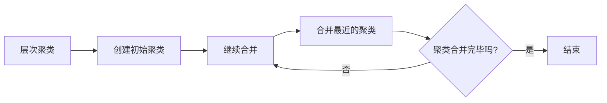
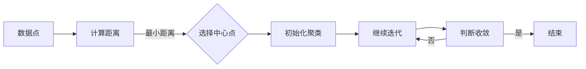

                 

# 《聚类算法 原理与代码实例讲解》

> **关键词：**聚类算法、K-均值、层次聚类、DBSCAN、期望最大化、原理讲解、代码实例

> **摘要：**本文深入浅出地介绍了聚类算法的基本概念、分类、核心原理，并通过代码实例展示了K-均值、层次聚类、DBSCAN和期望最大化等算法的实现过程。读者可以跟随文章的思路，逐步了解聚类算法的核心思想和应用场景。

## 第一部分：聚类算法基础

### 第1章：聚类算法概述

#### 1.1 聚类算法的基本概念

聚类（Cluster Analysis）是将一个数据集分割成若干个群组的过程，其中属于同一群组的对象彼此之间相似度较高，而不同群组之间的对象相似度较低。聚类是一种无监督学习的方法，因为数据没有预先标记的类别。

聚类与分类的区别在于，分类（Classification）是一种有监督学习的方法，数据集在训练之前已经按类别进行了标记，而聚类则没有这样的先验信息。

#### 1.1.1 聚类与分类的区别

在数学上，分类可以表示为：

$$
C = \{C_1, C_2, ..., C_k\}, \quad \forall x \in X, x \in C_j
$$

其中，$C$ 表示分类结果，$C_1, C_2, ..., C_k$ 表示不同的类别，$x$ 是数据集中的每一个对象。

而聚类则没有这样的明确分类，它试图通过某种度量来发现数据中的自然结构。

#### 1.1.2 聚类算法的目标

聚类算法的目标是：

1. 找到数据集中的自然分组结构。
2. 使属于同一分组的对象之间的相似度尽可能高。
3. 使不同分组之间的对象相似度尽可能低。

#### 1.2 聚类算法的分类

聚类算法可以根据不同的原则和策略分为多种类型：

1. **基于距离的聚类算法**：这类算法基于对象之间的距离或相似度来进行聚类。
   - **局部聚类算法**：如K-均值算法。
   - **全局聚类算法**：如层次聚类算法。

2. **基于密度的聚类算法**：这类算法基于数据点在空间中的密度分布来进行聚类。
   - **DBSCAN（Density-Based Spatial Clustering of Applications with Noise）算法**。

3. **基于模型的聚类算法**：这类算法基于概率模型或参数模型来进行聚类。
   - **期望最大化（Expectation-Maximization, EM）算法**。

### 1.2.1 基于距离的聚类算法

#### 1.2.1.1 局部聚类算法（K-均值算法）

K-均值算法是一种典型的局部聚类算法，其基本思想是将数据点分配到K个聚类中心附近。算法步骤如下：

1. **初始化中心点**：随机选择K个数据点作为初始中心点。
2. **分配点**：对于每个数据点，计算它与每个中心点的距离，将其分配到距离最近的中心点所在的聚类。
3. **更新中心点**：重新计算每个聚类的中心点，即每个聚类中所有数据点的平均位置。
4. **迭代**：重复步骤2和3，直到满足收敛条件（如中心点变化小于阈值或达到最大迭代次数）。

伪代码实现：

```python
def k_means(data, k, max_iterations):
    # 初始化中心点
    centroids = initialize_centroids(data, k)
    for i in range(max_iterations):
        # 计算每个点所属的聚类
        assignments = assign_points_to_clusters(data, centroids)
        # 更新中心点
        centroids = update_centroids(data, assignments, k)
    return centroids, assignments
```

#### 1.2.1.2 全局聚类算法（层次聚类算法）

层次聚类算法是一种基于层次分解思想的聚类方法，其基本过程如下：

1. **创建初始聚类**：将每个数据点视为一个初始聚类。
2. **计算距离**：计算相邻聚类之间的距离。
3. **合并最近的聚类**：将距离最近的聚类合并为一个更大的聚类。
4. **重复步骤2和3**：直到满足特定的终止条件（如达到预设的聚类数量或所有聚类合并为一个聚类）。

使用Mermaid图表示层次聚类算法：



#### 1.2.2 基于密度的聚类算法

DBSCAN算法是一种基于密度的聚类方法，其基本思想是：

1. **定义邻域**：对于每个数据点，确定其邻域内的点。
2. **生成簇**：如果邻域内的点足够多，则这些点构成一个簇。
3. **处理噪声**：标记孤立的点为噪声。

伪代码实现：

```python
def dbscan(data, eps, min_samples):
    clusters = []
    visited = set()
    for point in data:
        if point not in visited:
            visited.add(point)
            neighborhood = find_neighborhood(point, data, eps, min_samples)
            cluster = expand_cluster(data, visited, neighborhood, eps, min_samples)
            clusters.append(cluster)
    return clusters
```

#### 1.2.3 基于模型的聚类算法

期望最大化（Expectation-Maximization, EM）算法是一种基于概率模型的聚类方法，其基本思想是：

1. **初始化参数**：随机初始化聚类中心、协方差矩阵和聚类概率。
2. **E步**：计算每个数据点属于每个聚类的概率。
3. **M步**：更新聚类中心、协方差矩阵和聚类概率。
4. **迭代**：重复E步和M步，直到满足收敛条件。

伪代码实现：

```python
def expectation_maximization(data, num_clusters, max_iterations):
    # 初始化参数
    cluster_probabilities, means, covariances = initialize_parameters(data, num_clusters)
    for i in range(max_iterations):
        # E步
        responsibilities = compute_responsibilities(data, cluster_probabilities, means, covariances)
        # M步
        cluster_probabilities, means, covariances = update_parameters(data, responsibilities, num_clusters)
    return cluster_probabilities, means, covariances
```

### 第2章：核心概念与联系

#### 2.1 聚类算法的 Mermaid 流程图

以下是聚类算法的核心流程图，展示了数据点如何通过计算距离、选择中心点和迭代更新中心点来实现聚类：



#### 2.2 核心算法原理讲解

在本章中，我们将深入讲解K-均值、层次聚类、DBSCAN和期望最大化等聚类算法的原理，并通过伪代码来详细阐述。

### 2.2.1 K-均值算法原理

K-均值算法是一种基于距离的局部聚类方法，其原理如下：

#### 2.2.1.1 初始化中心点

在初始化阶段，我们随机选择K个数据点作为初始聚类中心点，这些中心点代表了聚类的初始位置。

公式表示为：

$$
\mu_j = \frac{1}{n_j} \sum_{i=1}^{n} x_i
$$

其中，$\mu_j$ 表示第 $j$ 个聚类中心点的坐标，$n_j$ 表示第 $j$ 个聚类中的数据点数量，$x_i$ 表示第 $i$ 个数据点的坐标。

#### 2.2.1.2 分配点

在分配点阶段，对于每个数据点，我们计算它与每个聚类中心点的距离，并将其分配到距离最近的聚类中心点所在的聚类。

公式表示为：

$$
c_{ij} = \begin{cases} 
1 & \text{if } x_i \in C_j \\
0 & \text{otherwise} 
\end{cases}
$$

其中，$c_{ij}$ 表示数据点 $x_i$ 属于第 $j$ 个聚类的概率。

#### 2.2.1.3 更新中心点

在更新中心点阶段，我们重新计算每个聚类的中心点，即每个聚类中所有数据点的平均位置。

公式表示为：

$$
\mu_j = \frac{1}{n_j} \sum_{i=1}^{n} x_i
$$

### 2.2.2 层次聚类算法原理

层次聚类算法是一种基于层次分解的全局聚类方法，其原理如下：

#### 2.2.2.1 创建初始聚类

在创建初始聚类阶段，我们将每个数据点视为一个初始聚类。

#### 2.2.2.2 计算距离

在计算距离阶段，我们计算相邻聚类之间的距离，常用的距离度量有欧氏距离、曼哈顿距离等。

#### 2.2.2.3 合并最近的聚类

在合并最近的聚类阶段，我们将距离最近的聚类合并为一个更大的聚类。

#### 2.2.2.4 判断收敛

在判断收敛阶段，我们检查聚类合并是否达到终止条件，如聚类数量达到预设值或聚类合并完毕。

### 2.2.3 DBSCAN算法原理

DBSCAN算法是一种基于密度的聚类方法，其原理如下：

#### 2.2.3.1 定义邻域

在定义邻域阶段，我们为每个数据点确定其邻域内的点。

#### 2.2.3.2 生成簇

在生成簇阶段，如果邻域内的点足够多，则这些点构成一个簇。

#### 2.2.3.3 处理噪声

在处理噪声阶段，我们标记孤立的点为噪声。

### 2.2.4 期望最大化（EM）算法原理

期望最大化（EM）算法是一种基于概率模型的聚类方法，其原理如下：

#### 2.2.4.1 初始化参数

在初始化参数阶段，我们随机初始化聚类中心、协方差矩阵和聚类概率。

#### 2.2.4.2 E步

在E步阶段，我们计算每个数据点属于每个聚类的概率。

#### 2.2.4.3 M步

在M步阶段，我们更新聚类中心、协方差矩阵和聚类概率。

#### 2.2.4.4 迭代

在迭代阶段，我们重复E步和M步，直到满足收敛条件。

## 第3章：核心算法原理讲解

在这一部分，我们将深入讲解聚类算法的核心原理，并通过具体的代码实例来展示如何实现这些算法。

### 3.1 K-均值算法原理

K-均值算法是一种迭代优化算法，主要用于将数据点划分为K个聚类。以下是K-均值算法的基本原理和伪代码。

#### 3.1.1 初始化中心点

在初始化中心点阶段，我们需要随机选择K个数据点作为初始聚类中心。这些中心点将作为迭代过程的起点。

```python
def initialize_centroids(data, k):
    # 从数据中随机选择K个数据点作为初始中心点
    centroids = random.sample(data, k)
    return centroids
```

#### 3.1.2 分配点

在分配点阶段，每个数据点会被分配到与其最近的聚类中心所在的聚类。这通常通过计算每个数据点到各个聚类中心的距离来实现。

```python
def assign_points_to_clusters(data, centroids):
    assignments = []
    for point in data:
        distances = [distance(point, centroid) for centroid in centroids]
        closest_centroid = centroids[distances.index(min(distances))]
        assignments.append(closest_centroid)
    return assignments
```

#### 3.1.3 更新中心点

在更新中心点阶段，我们需要重新计算每个聚类的中心点，即每个聚类中所有数据点的平均位置。

```python
def update_centroids(data, assignments, k):
    centroids = [[] for _ in range(k)]
    for point, assignment in zip(data, assignments):
        centroids[assignment].append(point)
    centroids = [sum(centroids[i]) / len(centroids[i]) for i in range(k)]
    return centroids
```

#### 3.1.4 收敛条件

K-均值算法会迭代执行分配点和更新中心点的过程，直到满足收敛条件。常见的收敛条件包括：

- 聚类中心的变化小于某个阈值。
- 迭代的次数达到预设的最大次数。

### 3.2 层次聚类算法原理

层次聚类算法通过逐步合并或分裂聚类来构建一个层次结构。以下是层次聚类算法的基本原理和伪代码。


#### 3.2.1 创建初始聚类

在创建初始聚类阶段，每个数据点被视为一个独立的聚类。

#### 3.2.2 计算距离

在计算距离阶段，我们需要计算每个聚类之间的距离。常用的距离度量包括欧氏距离、曼哈顿距离等。

#### 3.2.3 合并最近的聚类

在合并最近的聚类阶段，我们将距离最近的两个聚类合并为一个更大的聚类。

#### 3.2.4 判断收敛

在判断收敛阶段，我们需要检查是否满足终止条件，如聚类的数量达到预设值或聚类合并完毕。

### 3.3 DBSCAN算法原理

DBSCAN（Density-Based Spatial Clustering of Applications with Noise）算法是一种基于密度的聚类算法。以下是DBSCAN算法的基本原理和伪代码。

```python
def dbscan(data, eps, min_samples):
    clusters = []
    visited = set()
    for point in data:
        if point not in visited:
            visited.add(point)
            neighborhood = find_neighborhood(point, data, eps, min_samples)
            cluster = expand_cluster(data, visited, neighborhood, eps, min_samples)
            clusters.append(cluster)
    return clusters
```

#### 3.3.1 定义邻域

在定义邻域阶段，我们需要确定每个数据点的邻域，即距离该点小于eps的所有点。

```python
def find_neighborhood(point, data, eps, min_samples):
    neighborhood = []
    for other_point in data:
        if distance(point, other_point) < eps:
            neighborhood.append(other_point)
    return neighborhood
```

#### 3.3.2 生成簇

在生成簇阶段，如果邻域内的点数量大于等于min_samples，则这些点构成一个簇。

#### 3.3.3 扩展簇

在扩展簇阶段，我们从起始点开始，递归地扩展邻域内的点，直到所有邻域内的点都被包含在同一个簇中。

```python
def expand_cluster(data, visited, neighborhood, eps, min_samples):
    cluster = [neighborhood[0]]
    visited.update(neighborhood)
    while True:
        new_points = []
        for point in neighborhood:
            new_neighborhood = find_neighborhood(point, data, eps, min_samples)
            if new_neighborhood and all(p not in visited for p in new_neighborhood):
                new_points.extend(new_neighborhood)
                visited.update(new_neighborhood)
        if not new_points:
            break
        neighborhood = new_points
        cluster.extend(new_points)
    return cluster
```

### 3.4 期望最大化（EM）算法原理

期望最大化（EM）算法是一种基于概率模型的聚类方法，常用于高斯混合模型的参数估计。以下是EM算法的基本原理和伪代码。

```python
def expectation_maximization(data, num_clusters, max_iterations):
    # 初始化参数
    cluster_probabilities, means, covariances = initialize_parameters(data, num_clusters)
    for i in range(max_iterations):
        # E步
        responsibilities = compute_responsibilities(data, cluster_probabilities, means, covariances)
        # M步
        cluster_probabilities, means, covariances = update_parameters(data, responsibilities, num_clusters)
    return cluster_probabilities, means, covariances
```

#### 3.4.1 初始化参数

在初始化参数阶段，我们需要随机初始化聚类概率、均值和协方差矩阵。

```python
def initialize_parameters(data, num_clusters):
    # 初始化聚类概率
    cluster_probabilities = [1/num_clusters] * num_clusters
    # 初始化均值和协方差矩阵
    means = [random_point(data) for _ in range(num_clusters)]
    covariances = [create_covariance_matrix(data, mean) for mean in means]
    return cluster_probabilities, means, covariances
```

#### 3.4.2 E步

在E步阶段，我们需要计算每个数据点属于每个聚类的概率。

```python
def compute_responsibilities(data, cluster_probabilities, means, covariances):
    responsibilities = []
    for point in data:
        responsibilities.append([multivariate_normal(point, mean, covariance) for mean, covariance in zip(means, covariances)])
        responsibilities.append([sum(r) for r in responsibilities])
    responsibilities = [[r[i] / sum(r) for i in range(len(r))] for r in responsibilities]
    return responsibilities
```

#### 3.4.3 M步

在M步阶段，我们需要更新聚类概率、均值和协方差矩阵。

```python
def update_parameters(data, responsibilities, num_clusters):
    # 更新聚类概率
    cluster_probabilities = [sum(r) for r in responsibilities]
    cluster_probabilities = [p / sum(cluster_probabilities) for p in cluster_probabilities]
    # 更新均值和协方差矩阵
    means = [sum([r[i] * point for i, point in enumerate(data)]) / sum(r) for r in responsibilities]
    covariances = [create_covariance_matrix(data, mean, responsibilities) for mean in means]
    return cluster_probabilities, means, covariances
```

### 第4章：项目实战

在本章中，我们将通过具体的代码实例来展示如何实现聚类算法。我们将使用Python语言和相关的库，如NumPy和SciPy，来编写代码。

#### 4.1 开发环境搭建

在开始编写代码之前，我们需要搭建开发环境。以下是安装Python和相应库的步骤：

1. 安装Python：从Python官网下载并安装Python 3.x版本。
2. 安装NumPy：在命令行中运行 `pip install numpy`。
3. 安装SciPy：在命令行中运行 `pip install scipy`。

#### 4.2 代码实例

以下是一个简单的K-均值聚类算法的Python代码实例，展示了如何使用NumPy库来计算聚类中心和将数据点分配到聚类。

```python
import numpy as np

# 距离函数
def distance(point1, point2):
    return np.linalg.norm(point1 - point2)

# 初始化中心点
def initialize_centroids(data, k):
    return np.random.rand(k, data.shape[1])

# 分配点
def assign_points_to_clusters(data, centroids):
    assignments = []
    for point in data:
        distances = [distance(point, centroid) for centroid in centroids]
        closest_centroid = centroids[np.argmin(distances)]
        assignments.append(closest_centroid)
    return assignments

# 更新中心点
def update_centroids(data, assignments, k):
    centroids = [[] for _ in range(k)]
    for point, assignment in zip(data, assignments):
        centroids[assignment].append(point)
    centroids = [np.mean(centroids[i], axis=0) for i in range(k)]
    return centroids

# 主函数
def k_means(data, k, max_iterations):
    centroids = initialize_centroids(data, k)
    for _ in range(max_iterations):
        assignments = assign_points_to_clusters(data, centroids)
        centroids = update_centroids(data, assignments, k)
    return centroids, assignments

# 测试数据
data = np.array([[1, 2], [1, 4], [1, 0], [4, 2], [4, 4], [4, 0]])

# 运行K-均值算法
centroids, assignments = k_means(data, 2, 100)

print("Centroids:", centroids)
print("Assignments:", assignments)
```

#### 4.3 代码解读与分析

在上面的代码中，我们首先定义了一个距离函数，用于计算两个点之间的欧氏距离。然后，我们定义了初始化中心点、分配点和更新中心点的函数，这些都是K-均值算法的核心步骤。

在`k_means`函数中，我们初始化中心点，然后进入迭代过程，每次迭代都执行分配点和更新中心点的操作。我们设置了一个最大迭代次数，以确保算法能够在一定时间内收敛。

最后，我们使用一个简单的测试数据集来运行K-均值算法，并打印出最终的聚类中心和每个数据点的分配结果。

### 第5章：总结与展望

在本篇文章中，我们深入探讨了聚类算法的基本概念、分类、核心原理，并通过具体的代码实例展示了K-均值、层次聚类、DBSCAN和期望最大化等算法的实现过程。通过本文的学习，读者应该能够：

1. 理解聚类算法的基本概念和目标。
2. 掌握不同类型的聚类算法及其原理。
3. 编写并实现基本的聚类算法。
4. 分析和评估聚类算法的性能。

然而，聚类算法的研究和应用领域仍然非常广泛，未来我们可以从以下几个方面进行深入探索：

1. **优化算法性能**：研究如何提高聚类算法的效率，减少计算时间和资源消耗。
2. **算法融合**：探索将多种聚类算法结合起来，以获得更好的聚类效果。
3. **自适应聚类**：研究如何使聚类算法能够根据数据分布自动调整聚类数量和参数。
4. **聚类与异常检测**：结合聚类算法和异常检测算法，用于发现数据中的异常和噪声。

通过不断的研究和创新，我们可以推动聚类算法在各个领域的应用，为数据科学和人工智能的发展做出更大的贡献。

### 作者信息

作者：AI天才研究院/AI Genius Institute & 禅与计算机程序设计艺术 /Zen And The Art of Computer Programming

