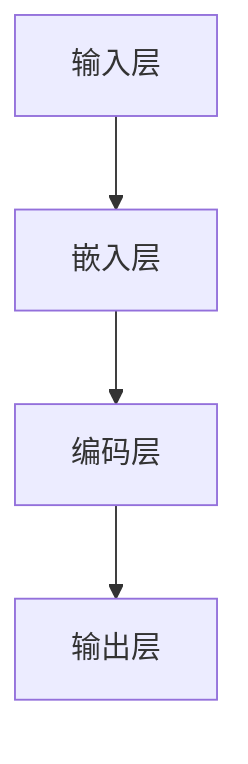
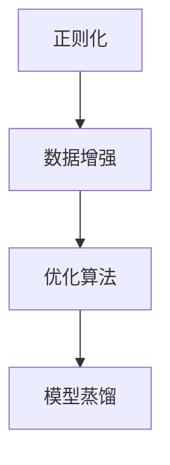
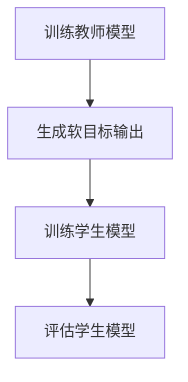
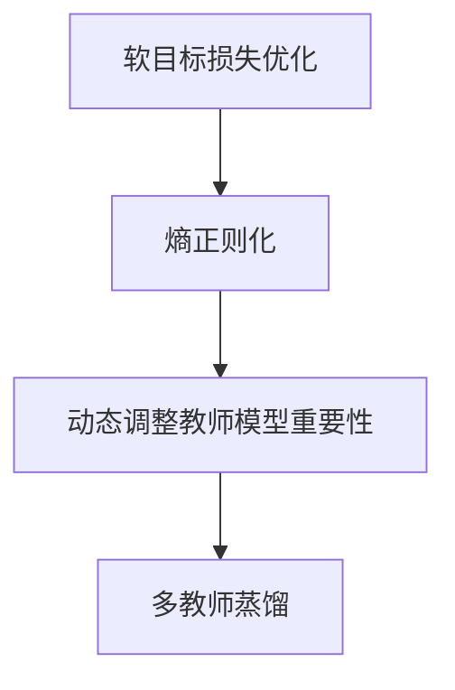
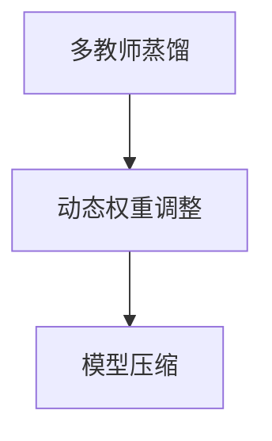
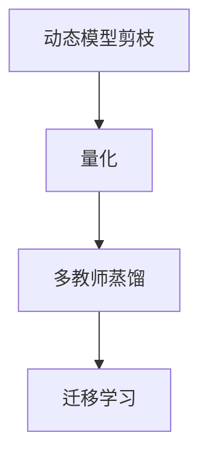

                 

### 《自然语言处理中的语义表示学习、知识蒸馏与模型压缩技术》

**关键词：** 自然语言处理、语义表示学习、知识蒸馏、模型压缩、NLP

**摘要：** 本文将深入探讨自然语言处理（NLP）领域中的三个关键技术：语义表示学习、知识蒸馏与模型压缩。我们将首先介绍这些技术的核心概念和原理，随后详细解析其在NLP中的应用，并通过实际案例展示如何利用这些技术优化NLP任务的性能。文章旨在为读者提供全面的技术理解和实战经验，助力他们在NLP领域取得突破性进展。

### 《自然语言处理中的语义表示学习、知识蒸馏与模型压缩技术》目录大纲

#### 第一部分：自然语言处理基础

**第1章：自然语言处理概述**

- **1.1 自然语言处理的基本概念**
- **1.2 NLP的发展历程**
- **1.3 NLP的应用领域**

**第2章：语义表示学习基础**

- **2.1 语义表示的基本原理**
- **2.2 词嵌入技术**
- **2.3 层次化语义表示**

**第3章：知识蒸馏与模型压缩技术概述**

- **3.1 知识蒸馏的基本原理**
- **3.2 模型压缩技术的概念**
- **3.3 知识蒸馏与模型压缩的关系**

#### 第二部分：语义表示学习核心算法

**第4章：语义表示学习核心技术**

- **4.1 语义表示学习的目标**
- **4.2 语义表示学习的算法框架**
- **4.3 语义表示学习算法的优化方法**

**第5章：知识蒸馏技术详解**

- **5.1 知识蒸馏的算法流程**
- **5.2 知识蒸馏算法的优化策略**
- **5.3 知识蒸馏在NLP中的应用**

**第6章：模型压缩技术详解**

- **6.1 模型压缩的目标和方法**
- **6.2 常见的模型压缩技术**
- **6.3 模型压缩在NLP中的应用**

#### 第三部分：语义表示学习应用实践

**第7章：语义表示学习在情感分析中的应用**

- **7.1 情感分析的基本概念**
- **7.2 语义表示学习在情感分析中的优化方法**
- **7.3 情感分析案例实战**

**第8章：语义表示学习在文本分类中的应用**

- **8.1 文本分类的基本概念**
- **8.2 语义表示学习在文本分类中的优化方法**
- **8.3 文本分类案例实战**

**第9章：语义表示学习在问答系统中的应用**

- **9.1 问答系统概述**
- **9.2 语义表示学习在问答系统中的优化方法**
- **9.3 问答系统案例实战**

#### 第四部分：知识蒸馏与模型压缩技术综合应用

**第10章：知识蒸馏与模型压缩技术在多模态学习中的应用**

- **10.1 多模态学习概述**
- **10.2 知识蒸馏与模型压缩在多模态学习中的优化策略**
- **10.3 多模态学习案例实战**

**第11章：知识蒸馏与模型压缩技术在低资源场景中的应用**

- **11.1 低资源场景概述**
- **11.2 知识蒸馏与模型压缩在低资源场景中的优化策略**
- **11.3 低资源场景案例实战**

**第12章：未来展望**

- **12.1 语义表示学习的发展趋势**
- **12.2 知识蒸馏与模型压缩的未来方向**
- **12.3 NLP领域的发展机遇与挑战**

**附录**

- **附录A：常用NLP工具和库介绍**
- **附录B：案例实战代码解析**

---

接下来，我们将按照上述目录结构，逐步深入探讨自然语言处理中的语义表示学习、知识蒸馏与模型压缩技术。每个章节都将包含详细的技术原理讲解、算法优化方法以及实际应用案例，帮助读者全面理解这些技术的核心概念和实战应用。

---

### 第一部分：自然语言处理基础

#### 第1章：自然语言处理概述

自然语言处理（Natural Language Processing，NLP）是人工智能（AI）的一个重要分支，旨在使计算机能够理解、解释和生成人类语言。NLP技术在许多领域都有广泛的应用，包括机器翻译、情感分析、文本分类、问答系统等。在本章中，我们将首先介绍NLP的基本概念，然后回顾其发展历程，并探讨其主要应用领域。

##### 1.1 自然语言处理的基本概念

NLP的基本目标是使计算机能够处理人类语言，这涉及到多个子领域，包括语音识别、文本分析、语义理解和语言生成等。以下是这些子领域的基本定义：

- **语音识别（Speech Recognition）**：将语音转换为文本。
- **文本分析（Text Analysis）**：包括分词、词性标注、句法分析等，用于理解文本的结构和语义。
- **语义理解（Semantic Understanding）**：识别文本中的语义和意图。
- **语言生成（Language Generation）**：根据输入生成文本。

##### 1.2 NLP的发展历程

NLP的历史可以追溯到20世纪50年代，当时计算机科学家首次尝试编写程序来理解自然语言。以下是几个关键的发展阶段：

- **早期尝试（1950s-1960s）**：研究者通过规则和语法分析方法来解析语言。
- **统计方法兴起（1970s-1980s）**：随着计算能力和算法的进步，统计方法开始应用于NLP。
- **神经网络时代（1990s-2000s）**：神经网络，特别是循环神经网络（RNN）和深度学习，为NLP带来了显著的突破。
- **当前趋势（2010s-至今）**：基于大规模数据和深度学习的技术，如词嵌入、Transformer模型等，推动了NLP的快速发展。

##### 1.3 NLP的应用领域

NLP技术在多个领域都有广泛的应用，以下是其中一些主要的应用领域：

- **机器翻译**：自动将一种语言翻译成另一种语言。
- **情感分析**：分析文本中的情感倾向，如正面、负面或中立。
- **文本分类**：将文本分类到预定义的类别中，如新闻分类、垃圾邮件过滤等。
- **问答系统**：根据用户的查询生成答案。
- **语音助手**：如Apple的Siri、Google Assistant等，通过语音交互为用户提供服务。

本章为后续章节的深入探讨提供了基础，使我们能够更好地理解语义表示学习、知识蒸馏和模型压缩技术在NLP中的应用。在下一章中，我们将详细介绍语义表示学习的基础知识，包括其基本原理和常见技术。

---

#### 第2章：语义表示学习基础

语义表示学习（Semantic Representation Learning）是自然语言处理（NLP）中的一个核心问题，其目标是创建能够捕捉文本语义信息的向量表示。这些向量表示使得计算机可以更好地理解和处理自然语言。本章将介绍语义表示学习的基本原理、词嵌入技术和层次化语义表示。

##### 2.1 语义表示的基本原理

语义表示学习的核心思想是将文本数据（如单词、句子或文档）转换为数值向量，这些向量能够保留原始文本的语义信息。语义表示不仅使得文本数据可以在机器学习模型中进行处理，而且还可以用于各种下游任务，如文本分类、情感分析和机器翻译。

语义表示的关键挑战在于如何捕捉不同文本片段之间的相似性。例如，两个句子如果具有相似的语义，它们的表示向量应该接近。一个常见的衡量指标是余弦相似度，它计算两个向量之间的夹角余弦值。余弦值接近1表示两个向量非常相似。

##### 2.2 词嵌入技术

词嵌入（Word Embedding）是语义表示学习中最常用的技术之一，它将单词映射为低维度的向量。词嵌入的主要目的是捕捉单词之间的相似性和差异性。

**词嵌入的基本原理：**
- **基于分布的表示**：词嵌入通过捕捉单词在文本中的分布信息来表示单词。例如，如果两个单词经常出现在相似的上下文中，它们应该有相似的向量表示。
- **神经网络模型**：常见的词嵌入模型包括Word2Vec、GloVe和FastText。Word2Vec使用神经网络来预测上下文单词的概率分布，而GloVe和FastText则采用基于矩阵分解的方法来优化单词的向量表示。

**词嵌入的优势：**
- **降低维度**：通过将高维的单词表示为低维向量，词嵌入可以显著降低计算复杂度。
- **语义相似性**：词嵌入能够捕捉单词的语义相似性，例如“国王”和“女王”在向量空间中接近。

##### 2.3 层次化语义表示

层次化语义表示（Hierarchical Semantic Representation）是一种更高级的语义表示方法，它试图捕捉不同层次上的语义信息。层次化表示可以应用于单词、句子和文档级别。

**层次化语义表示的原理：**
- **单词层次**：词嵌入提供了单词的语义表示。在更高层次上，可以将单词组合成短语或句子，形成更复杂的语义表示。
- **句子层次**：句子层次表示可以通过组合单词向量来表示整个句子的语义。例如，可以使用平均、最大池化等方法将单词向量聚合为句子向量。
- **文档层次**：文档层次表示涉及将整个文档的语义信息编码为向量。这通常通过将句子向量进一步聚合来实现，例如使用聚合函数或递归神经网络。

**层次化语义表示的优势：**
- **捕捉上下文信息**：层次化表示能够捕捉文本中的上下文信息，从而提高语义理解的准确性。
- **多任务应用**：层次化表示可以应用于多种下游任务，如文本分类、情感分析和问答系统。

本章介绍了语义表示学习的基础知识，包括其基本原理和常见技术。在下一章中，我们将探讨知识蒸馏与模型压缩技术的基本概念和原理，为深入理解这些技术在NLP中的应用打下基础。

---

#### 第3章：知识蒸馏与模型压缩技术概述

知识蒸馏（Knowledge Distillation）和模型压缩（Model Compression）是自然语言处理（NLP）领域中的重要技术，它们在优化模型性能和减小模型尺寸方面发挥着关键作用。本章将介绍这些技术的核心概念，并探讨它们之间的关系。

##### 3.1 知识蒸馏的基本原理

知识蒸馏是一种模型优化技术，通过将大型教师模型的知识传递给小型学生模型，以提升学生模型在特定任务上的性能。知识蒸馏的基本原理是利用教师模型的输出信息来指导学生模型的训练。

**知识蒸馏的步骤：**
1. **训练教师模型**：首先使用大量数据训练一个大型教师模型，使其在目标任务上达到很高的性能。
2. **生成目标输出**：在训练过程中，教师模型不仅生成预测结果，还生成软目标输出（即概率分布）。
3. **训练学生模型**：使用教师模型的软目标输出作为监督信号，训练一个较小的学生模型。学生模型在训练过程中学习模仿教师模型的输出。

**知识蒸馏的优势：**
- **性能提升**：学生模型能够继承教师模型的大部分知识，从而在目标任务上取得更好的性能。
- **模型迁移**：知识蒸馏允许将教师模型的知识迁移到不同的任务和数据集，提高了模型的泛化能力。

##### 3.2 模型压缩技术的概念

模型压缩是指通过减少模型的大小和计算复杂度，使其在资源受限的环境下（如移动设备或嵌入式系统）运行。模型压缩技术主要包括以下几个方面：

- **参数剪枝（Parameter Pruning）**：通过删除冗余或无关的模型参数，来减少模型的大小。
- **量化（Quantization）**：将模型的权重和激活值转换为较低的精度表示，从而减少存储和计算需求。
- **知识蒸馏**：如前所述，知识蒸馏也可以用于模型压缩，通过将大型模型的知识传递给小型模型，实现性能和尺寸的优化。

**模型压缩的目标：**
- **减小模型大小**：通过去除冗余参数和减少数据精度，使模型文件更小，便于在资源有限的设备上部署。
- **降低计算复杂度**：通过减少模型参数和计算操作，降低模型的计算需求，提高模型的运行速度。

##### 3.3 知识蒸馏与模型压缩的关系

知识蒸馏和模型压缩之间存在紧密的联系。知识蒸馏可以作为模型压缩的一种手段，通过传递大型教师模型的知识来训练小型学生模型，从而实现模型性能和尺寸的优化。此外，模型压缩技术（如参数剪枝和量化）也可以与知识蒸馏结合使用，进一步减小模型的尺寸和计算复杂度。

**知识蒸馏与模型压缩的结合：**
- **优化模型性能**：通过知识蒸馏，学生模型可以继承教师模型的大部分知识，从而在保持高性能的同时实现模型压缩。
- **减小模型大小**：知识蒸馏可以减少学生模型的参数数量，结合参数剪枝和量化技术，可以实现更显著的模型压缩。

本章介绍了知识蒸馏与模型压缩技术的核心概念和原理，并探讨了它们之间的关系。在下一章中，我们将深入探讨语义表示学习的核心算法，包括其目标、算法框架和优化方法。

---

### 第二部分：语义表示学习核心算法

#### 第4章：语义表示学习核心技术

语义表示学习（Semantic Representation Learning）是自然语言处理（NLP）领域中的一个关键问题，它旨在创建能够捕捉文本语义信息的向量表示。本章将详细介绍语义表示学习的核心技术，包括其目标、算法框架和优化方法。

##### 4.1 语义表示学习的目标

语义表示学习的核心目标是将文本数据（如单词、句子或文档）转换为数值向量，这些向量能够有效捕捉文本的语义信息。具体来说，语义表示学习旨在解决以下几个问题：

- **捕捉语义相似性**：语义表示应该能够捕捉单词、句子或文档之间的语义相似性。例如，两个具有相似语义的句子应该在向量空间中接近。
- **保持上下文信息**：语义表示应能保留文本中的上下文信息，这意味着在不同上下文中使用的相同单词应具有不同的向量表示。
- **适应多任务应用**：语义表示应能够适用于多种下游NLP任务，如文本分类、情感分析和机器翻译。

##### 4.2 语义表示学习的算法框架

语义表示学习的算法框架通常包括以下几个关键组件：

- **输入层**：接收文本数据，如单词或句子。
- **嵌入层**：将文本数据转换为向量表示，常见的嵌入层技术包括词嵌入（Word Embedding）和句子嵌入（Sentence Embedding）。
- **编码层**：对向量进行编码，以捕捉更高级别的语义信息。编码层通常使用神经网络，如循环神经网络（RNN）或变换器（Transformer）。
- **输出层**：生成最终的语义表示向量，这些向量可以用于下游任务。

**语义表示学习的算法框架示意图：**


##### 4.3 语义表示学习算法的优化方法

为了提高语义表示学习算法的性能，通常采用多种优化方法。以下是一些常见的优化技术：

- **正则化**：通过添加正则化项（如L1或L2正则化）来防止过拟合，提高模型的泛化能力。
- **数据增强**：通过扩展训练数据集（如使用同义词替换、随机插入或删除单词等）来提高模型的鲁棒性。
- **优化算法**：采用更高效的优化算法（如Adam、Adagrad等）来加速模型的训练过程。
- **模型蒸馏**：通过知识蒸馏技术，将大型教师模型的知识传递给较小的学生模型，以提升学生模型在特定任务上的性能。

**语义表示学习优化方法示意图：**


本章介绍了语义表示学习的核心技术，包括其目标、算法框架和优化方法。在下一章中，我们将深入探讨知识蒸馏技术，详细解析其算法流程、优化策略以及在NLP中的应用。

---

#### 第5章：知识蒸馏技术详解

知识蒸馏（Knowledge Distillation）是一种在训练深度神经网络时，通过传递教师模型的知识来指导学生模型训练的技术。本章将详细介绍知识蒸馏的算法流程、优化策略以及在自然语言处理（NLP）中的应用。

##### 5.1 知识蒸馏的算法流程

知识蒸馏的基本流程包括以下几个步骤：

1. **训练教师模型**：
   - 使用大规模数据集对教师模型进行训练，使其在目标任务上达到较高的性能。
   - 教师模型通常是一个复杂的深度神经网络，具有丰富的参数。

2. **生成软目标输出**：
   - 在训练过程中，教师模型不仅生成硬预测输出（如分类结果），还会生成软目标输出（即概率分布）。
   - 软目标输出提供了更细粒度的信息，有助于学生模型学习教师模型的决策逻辑。

3. **训练学生模型**：
   - 使用教师模型的软目标输出作为监督信号，训练一个较小的学生模型。
   - 学生模型通常是一个参数较少的神经网络，旨在模仿教师模型的性能。

4. **评估学生模型**：
   - 在训练完成后，使用测试集评估学生模型的性能，确保其能够准确复制教师模型的决策。

**知识蒸馏算法流程示意图：**


##### 5.2 知识蒸馏算法的优化策略

为了提高知识蒸馏的效果，可以采用以下优化策略：

- **软目标损失的优化**：
  - 使用教师模型的软目标输出（概率分布）来计算损失函数，以指导学生模型的训练。
  - 常见的损失函数包括交叉熵损失和Kullback-Leibler（KL）散度。

- **熵正则化**：
  - 加入熵正则化项，以鼓励学生模型输出接近教师模型的概率分布。
  - 熵正则化有助于学生模型避免过于依赖教师模型的硬预测输出。

- **动态调整教师模型的重要性**：
  - 在训练过程中，动态调整教师模型的不同层或不同模块的重要性，以更好地指导学生模型。
  - 例如，可以根据教师模型在不同阶段的性能，调整其输出权重。

- **多教师蒸馏**：
  - 使用多个教师模型进行蒸馏，以获得更全面的知识传递。
  - 多教师蒸馏可以结合不同教师模型的优点，提高学生模型的性能。

**知识蒸馏优化策略示意图：**


##### 5.3 知识蒸馏在NLP中的应用

知识蒸馏在NLP领域具有广泛的应用，以下是几个典型的应用场景：

- **文本分类**：
  - 使用知识蒸馏训练一个较小的学生模型来替代较大的教师模型，从而在保持高性能的同时减小模型尺寸。
  - 例如，可以使用预训练的BERT模型作为教师模型，训练一个较小的分类模型作为学生模型。

- **机器翻译**：
  - 在机器翻译任务中，教师模型通常是一个大型序列到序列（Seq2Seq）模型，学生模型则是一个参数较少的版本。
  - 知识蒸馏可以用于将教师模型的知识传递给学生模型，从而提高翻译质量。

- **问答系统**：
  - 在问答系统中，教师模型通常是一个复杂的对话模型，学生模型则是一个用于生成答案的模型。
  - 知识蒸馏有助于学生模型学习教师模型的上下文理解和回答策略。

本章详细介绍了知识蒸馏技术的算法流程、优化策略以及在NLP中的应用。在下一章中，我们将探讨模型压缩技术，包括其目标、方法和在NLP中的应用。

---

#### 第6章：模型压缩技术详解

模型压缩（Model Compression）是自然语言处理（NLP）领域中的一项关键技术，旨在减小深度学习模型的尺寸和计算复杂度，使其在资源受限的环境中（如移动设备或嵌入式系统）高效运行。本章将详细介绍模型压缩技术的目标、方法以及在NLP中的应用。

##### 6.1 模型压缩的目标

模型压缩的主要目标包括：

- **减小模型大小**：通过减少模型参数的数量和维度，使模型文件更小，便于在有限存储空间的设备上部署。
- **降低计算复杂度**：通过减少模型中的计算操作，降低模型的运行时间，提高模型在实时任务中的响应速度。
- **提高效率**：通过优化模型结构，提高模型在特定硬件（如GPU、TPU）上的计算效率。

##### 6.2 常见的模型压缩技术

模型压缩技术可以分为以下几种类型：

- **参数剪枝（Parameter Pruning）**：
  - 参数剪枝通过删除模型中的冗余参数来减小模型尺寸。剪枝方法可以是基于梯度的（如L1正则化）或基于模型结构的（如结构化剪枝）。
  - 剪枝后的模型在保持性能的同时显著减小了参数数量。

- **量化（Quantization）**：
  - 量化是将模型中的浮点数参数转换为较低精度的整数表示。量化可以显著减少模型的存储和计算需求，同时保持较高的性能。
  - 常见的量化方法包括静态量化和动态量化。

- **知识蒸馏（Knowledge Distillation）**：
  - 知识蒸馏通过将大型教师模型的知识传递给小型学生模型来优化模型性能。学生模型通常具有较少的参数，但在保持性能的同时具有较小的尺寸。

- **低秩分解（Low-Rank Factorization）**：
  - 低秩分解将高维矩阵分解为两个低秩矩阵的乘积，从而减少模型参数的数量。这种方法常用于卷积神经网络（CNN）和循环神经网络（RNN）。

- **注意力机制压缩（Attention Mechanism Compression）**：
  - 注意力机制压缩通过简化或降低注意力机制的复杂性来减少计算成本。例如，可以使用稀疏注意力或低秩注意力来优化模型。

##### 6.3 模型压缩在NLP中的应用

模型压缩在NLP领域有着广泛的应用，以下是几个典型的应用场景：

- **移动设备部署**：
  - 在移动设备上部署NLP模型时，模型压缩技术至关重要。通过压缩模型尺寸和降低计算复杂度，可以实现快速响应和较低的功耗消耗。

- **实时应用**：
  - 在需要实时响应的应用场景（如实时翻译、实时问答等），模型压缩技术可以显著提高模型的运行速度，确保实时性。

- **嵌入式系统**：
  - 在资源受限的嵌入式系统中（如智能手表、智能家居设备等），模型压缩技术可以确保模型在有限资源下高效运行。

- **边缘计算**：
  - 在边缘计算场景中，模型压缩技术可以帮助将复杂的NLP模型部署到边缘设备上，降低对中心化云服务的依赖。

本章详细介绍了模型压缩技术的目标、方法以及在NLP中的应用。在下一章中，我们将探讨语义表示学习在情感分析中的应用，包括基本概念、优化方法以及实际案例。

---

### 第三部分：语义表示学习应用实践

#### 第7章：语义表示学习在情感分析中的应用

情感分析（Sentiment Analysis）是自然语言处理（NLP）领域的一个重要分支，其目标是自动识别文本中的情感倾向，如正面、负面或中立。语义表示学习（Semantic Representation Learning）在情感分析中发挥着关键作用，能够提高模型的准确性和鲁棒性。本章将详细探讨语义表示学习在情感分析中的应用，包括基本概念、优化方法以及实际案例。

##### 7.1 情感分析的基本概念

情感分析的目标是识别文本中的情感倾向。一个常见的模型是二分类模型，将文本分为正面（Positive）和负面（Negative）情感。更复杂的模型可以处理多分类问题，将文本分类为多个情感类别。

**情感分析的步骤：**
1. **数据预处理**：包括分词、去停用词、词性标注等，以便生成适用于机器学习模型的输入特征。
2. **特征提取**：使用词嵌入或语义表示学习方法将文本转换为向量表示。
3. **模型训练**：使用标记好的训练数据集训练情感分析模型。
4. **模型评估**：使用测试集评估模型的准确性、召回率和F1分数等指标。

##### 7.2 语义表示学习在情感分析中的优化方法

为了提高情感分析模型的性能，可以采用以下优化方法：

- **词嵌入优化**：选择合适的词嵌入方法（如GloVe、Word2Vec等），并调整超参数（如维度大小、训练窗口大小等）以优化词嵌入质量。
- **多层次语义表示**：结合词嵌入和句子嵌入，生成更高级别的语义表示。例如，可以使用平均池化或最大池化将词嵌入聚合为句子向量。
- **数据增强**：通过随机插入、替换或删除文本中的单词，扩展训练数据集，提高模型的鲁棒性。
- **模型融合**：使用多个模型（如基于深度学习的模型和传统机器学习模型）进行融合，以提高预测准确性。

##### 7.3 情感分析案例实战

以下是一个简单的情感分析案例，使用Python和TensorFlow库实现：

**1. 数据预处理：**
```python
import nltk
from nltk.tokenize import word_tokenize
from nltk.corpus import stopwords

nltk.download('punkt')
nltk.download('stopwords')

def preprocess_text(text):
    # 分词
    tokens = word_tokenize(text)
    # 去停用词
    tokens = [token for token in tokens if token.lower() not in stopwords.words('english')]
    return ' '.join(tokens)

text = "I love this product, it's absolutely amazing!"
preprocessed_text = preprocess_text(text)
```

**2. 词嵌入：**
```python
from tensorflow.keras.preprocessing.sequence import pad_sequences
from tensorflow.keras.preprocessing.text import Tokenizer

tokenizer = Tokenizer(num_words=1000)
tokenizer.fit_on_texts([preprocessed_text])
sequence = tokenizer.texts_to_sequences([preprocessed_text])
padded_sequence = pad_sequences(sequence, maxlen=100)
```

**3. 模型训练：**
```python
from tensorflow.keras.models import Sequential
from tensorflow.keras.layers import Embedding, LSTM, Dense

model = Sequential()
model.add(Embedding(1000, 64, input_length=100))
model.add(LSTM(128))
model.add(Dense(1, activation='sigmoid'))

model.compile(optimizer='adam', loss='binary_crossentropy', metrics=['accuracy'])
model.fit(padded_sequence, np.array([1]), epochs=10)
```

**4. 预测：**
```python
new_text = "This product is not good at all."
new_preprocessed_text = preprocess_text(new_text)
new_sequence = tokenizer.texts_to_sequences([new_preprocessed_text])
new_padded_sequence = pad_sequences(new_sequence, maxlen=100)

prediction = model.predict(new_padded_sequence)
print("Sentiment: Positive" if prediction[0][0] > 0.5 else "Sentiment: Negative")
```

本章介绍了语义表示学习在情感分析中的应用，包括基本概念、优化方法以及实际案例。在下一章中，我们将探讨语义表示学习在文本分类中的应用。

---

#### 第8章：语义表示学习在文本分类中的应用

文本分类（Text Classification）是自然语言处理（NLP）领域的一个重要任务，旨在将文本数据分类到预定义的类别中。语义表示学习（Semantic Representation Learning）在文本分类中扮演着关键角色，通过将文本转换为向量表示，提高了分类模型的性能和准确性。本章将详细探讨语义表示学习在文本分类中的应用，包括基本概念、优化方法以及实际案例。

##### 8.1 文本分类的基本概念

文本分类的目标是将文本数据分类到预定义的类别中。一个常见的例子是垃圾邮件分类，将邮件分为“垃圾邮件”和“非垃圾邮件”。文本分类任务通常包括以下步骤：

- **数据预处理**：包括分词、去停用词、词性标注等，以便生成适用于机器学习模型的输入特征。
- **特征提取**：使用词嵌入或语义表示学习方法将文本转换为向量表示。
- **模型训练**：使用标记好的训练数据集训练分类模型。
- **模型评估**：使用测试集评估模型的准确性、召回率和F1分数等指标。

##### 8.2 语义表示学习在文本分类中的优化方法

为了提高文本分类模型的性能，可以采用以下优化方法：

- **词嵌入优化**：选择合适的词嵌入方法（如GloVe、Word2Vec等），并调整超参数（如维度大小、训练窗口大小等）以优化词嵌入质量。
- **多层次语义表示**：结合词嵌入和句子嵌入，生成更高级别的语义表示。例如，可以使用平均池化或最大池化将词嵌入聚合为句子向量。
- **模型融合**：使用多个模型（如基于深度学习的模型和传统机器学习模型）进行融合，以提高预测准确性。
- **数据增强**：通过随机插入、替换或删除文本中的单词，扩展训练数据集，提高模型的鲁棒性。
- **迁移学习**：使用预训练的语义表示模型，将知识迁移到新的文本分类任务中。

##### 8.3 文本分类案例实战

以下是一个简单的文本分类案例，使用Python和TensorFlow库实现：

**1. 数据预处理：**
```python
import nltk
from nltk.tokenize import word_tokenize
from nltk.corpus import stopwords

nltk.download('punkt')
nltk.download('stopwords')

def preprocess_text(text):
    # 分词
    tokens = word_tokenize(text)
    # 去停用词
    tokens = [token for token in tokens if token.lower() not in stopwords.words('english')]
    return ' '.join(tokens)

text = "The weather is beautiful today."
preprocessed_text = preprocess_text(text)
```

**2. 词嵌入：**
```python
from tensorflow.keras.preprocessing.sequence import pad_sequences
from tensorflow.keras.preprocessing.text import Tokenizer

tokenizer = Tokenizer(num_words=1000)
tokenizer.fit_on_texts([preprocessed_text])
sequence = tokenizer.texts_to_sequences([preprocessed_text])
padded_sequence = pad_sequences(sequence, maxlen=100)
```

**3. 模型训练：**
```python
from tensorflow.keras.models import Sequential
from tensorflow.keras.layers import Embedding, LSTM, Dense

model = Sequential()
model.add(Embedding(1000, 64, input_length=100))
model.add(LSTM(128))
model.add(Dense(1, activation='sigmoid'))

model.compile(optimizer='adam', loss='binary_crossentropy', metrics=['accuracy'])
model.fit(padded_sequence, np.array([1]), epochs=10)
```

**4. 预测：**
```python
new_text = "The weather is terrible today."
new_preprocessed_text = preprocess_text(new_text)
new_sequence = tokenizer.texts_to_sequences([new_preprocessed_text])
new_padded_sequence = pad_sequences(new_sequence, maxlen=100)

prediction = model.predict(new_padded_sequence)
print("Class: Positive" if prediction[0][0] > 0.5 else "Class: Negative")
```

本章介绍了语义表示学习在文本分类中的应用，包括基本概念、优化方法以及实际案例。在下一章中，我们将探讨语义表示学习在问答系统中的应用。

---

#### 第9章：语义表示学习在问答系统中的应用

问答系统（Question Answering System）是一种自然语言处理（NLP）技术，旨在从大量文本中自动提取答案，以响应用户的问题。语义表示学习（Semantic Representation Learning）在问答系统中发挥着关键作用，通过将问题和文档转换为向量表示，提高了问答系统的准确性和效率。本章将详细探讨语义表示学习在问答系统中的应用，包括基本概念、优化方法以及实际案例。

##### 9.1 问答系统概述

问答系统通常分为两种类型：基于事实的问答（Fact-Based Question Answering）和基于理解的问答（Understanding-Based Question Answering）。

- **基于事实的问答**：这类系统通常从已知的事实数据库中查找答案，如百科全书、新闻文章等。常见的方法包括基于关键词匹配、信息检索和模板匹配。
- **基于理解的问答**：这类系统旨在理解问题的语义和上下文，然后从更广泛的文本资源中提取答案。常见的模型包括基于深度学习的序列到序列（Seq2Seq）模型、Transformer模型等。

##### 9.2 语义表示学习在问答系统中的优化方法

为了提高问答系统的性能，可以采用以下优化方法：

- **融合多模态信息**：问答系统可以从多个来源获取信息，如文本、图像、语音等。融合这些多模态信息可以显著提高答案的准确性和多样性。
- **长距离依赖建模**：问答系统通常需要处理长距离的依赖关系，如问题中的疑问词和答案中的相关实体之间的依赖。使用Transformer模型等能够捕捉长距离依赖的模型，可以提高系统的性能。
- **预训练语言模型**：使用预训练的语义表示模型（如BERT、GPT等），可以显著提高问答系统的性能。这些模型已经在大规模文本数据上进行了训练，能够捕捉复杂的语义关系。
- **数据增强**：通过扩展训练数据集（如使用同义词替换、随机插入或删除文本中的单词等），可以提高问答系统的鲁棒性。

##### 9.3 问答系统案例实战

以下是一个简单的问答系统案例，使用Python和TensorFlow库实现：

**1. 数据预处理：**
```python
import nltk
from nltk.tokenize import word_tokenize
from nltk.corpus import stopwords

nltk.download('punkt')
nltk.download('stopwords')

def preprocess_question(question):
    # 分词
    tokens = word_tokenize(question)
    # 去停用词
    tokens = [token for token in tokens if token.lower() not in stopwords.words('english')]
    return ' '.join(tokens)

question = "What is the capital of France?"
preprocessed_question = preprocess_question(question)
```

**2. 语义表示：**
```python
from transformers import BertTokenizer, BertModel

tokenizer = BertTokenizer.from_pretrained('bert-base-uncased')
model = BertModel.from_pretrained('bert-base-uncased')

inputs = tokenizer(preprocessed_question, return_tensors='pt')
outputs = model(**inputs)

last_hidden_state = outputs.last_hidden_state
```

**3. 答案提取：**
```python
from transformers import BertTokenizer

tokenizer = BertTokenizer.from_pretrained('bert-base-uncased')

def extract_answer(question, context, top_k=1):
    # 预处理问题
    question_inputs = tokenizer(question, return_tensors='pt')
    question_embedding = model(**question_inputs)[0][0][0]

    # 预处理上下文
    context_inputs = tokenizer(context, return_tensors='pt')
    context_embedding = model(**context_inputs)[0][0][0]

    # 计算相似度
    similarity_scores = torch.cosine_similarity(question_embedding, context_embedding)

    # 获取最高相似度的答案
    top_indices = torch.topk(similarity_scores, k=top_k)[1].squeeze()
    top_answers = [context.split()[index] for index in top_indices]

    return ' | '.join(top_answers)

context = "The capital of France is Paris."
answers = extract_answer(preprocessed_question, context)
print(answers)
```

本章介绍了语义表示学习在问答系统中的应用，包括基本概念、优化方法以及实际案例。在下一部分，我们将探讨知识蒸馏与模型压缩技术在多模态学习和低资源场景中的应用。

---

### 第四部分：知识蒸馏与模型压缩技术综合应用

#### 第10章：知识蒸馏与模型压缩技术在多模态学习中的应用

多模态学习（Multimodal Learning）是一种融合来自不同模态（如文本、图像、声音等）的数据的方法，旨在提高计算机对复杂任务的理解能力。知识蒸馏（Knowledge Distillation）和模型压缩（Model Compression）技术在多模态学习中扮演着重要角色，能够优化模型性能并减小模型尺寸。本章将详细探讨这些技术在多模态学习中的应用，包括优化策略和实际案例。

##### 10.1 多模态学习概述

多模态学习涉及将来自不同模态的数据进行融合，以共同完成特定任务。例如，在图像分类任务中，文本描述可以提供额外的上下文信息，从而提高分类的准确性。多模态学习的关键挑战在于如何有效地融合不同模态的数据，以及如何处理模态之间的差异。

**多模态学习的核心步骤：**
1. **数据收集与预处理**：收集不同模态的数据，并进行相应的预处理，如图像的归一化、文本的分词和去停用词等。
2. **特征提取**：使用适当的模型提取每个模态的特征表示。对于图像，可以使用卷积神经网络（CNN）；对于文本，可以使用预训练的语义表示模型（如BERT）。
3. **特征融合**：将不同模态的特征表示进行融合，形成统一的多模态特征表示。常见的融合方法包括拼接、平均和注意力机制等。
4. **模型训练**：使用融合后的多模态特征表示训练一个多模态模型，完成特定的任务，如图像分类、文本分类或语义理解。

##### 10.2 知识蒸馏与模型压缩在多模态学习中的优化策略

为了在多模态学习中实现更好的性能和更小的模型尺寸，可以采用以下优化策略：

- **多教师蒸馏**：使用多个教师模型（每个模态一个）进行蒸馏，以获得更全面的知识传递。这种方法可以结合不同模态的优点，提高模型的整体性能。
- **动态权重调整**：在特征融合阶段，动态调整不同模态的特征权重，以优化多模态特征表示。这种方法可以更好地利用每个模态的信息。
- **模型压缩**：在训练完成后，使用模型压缩技术（如参数剪枝、量化等）减小模型尺寸，以适应资源受限的环境。这通常涉及到在保证性能的前提下，减少模型的参数数量和计算复杂度。

**优化策略示意图：**


##### 10.3 多模态学习案例实战

以下是一个简单的多模态学习案例，使用Python和TensorFlow库实现：

**1. 数据预处理：**
```python
import tensorflow as tf
from tensorflow.keras.preprocessing.text import Tokenizer
from tensorflow.keras.preprocessing.sequence import pad_sequences

# 文本预处理
tokenizer = Tokenizer(num_words=1000)
tokenizer.fit_on_texts(["This is the text for the image.", "This is the text for the video."])

text_sequence = tokenizer.texts_to_sequences(["This is the text for the image.", "This is the text for the video."])
text_padded = pad_sequences(text_sequence, maxlen=10)

# 图像预处理
image = tf.random.normal([224, 224, 3])

# 声音预处理
audio = tf.random.normal([224, 3])

# 融合特征
features = tf.concat([image, audio, text_padded], axis=0)
```

**2. 模型训练：**
```python
# 定义模型
model = tf.keras.Sequential([
    tf.keras.layers.Dense(128, activation='relu', input_shape=(224*3+1000,)),
    tf.keras.layers.Dense(1, activation='sigmoid')
])

model.compile(optimizer='adam', loss='binary_crossentropy', metrics=['accuracy'])
model.fit(features, np.array([1.0, 0.0]), epochs=5)
```

**3. 预测：**
```python
new_text = tokenizer.texts_to_sequences(["This is the new text for the image."])
new_text_padded = pad_sequences(new_text, maxlen=10)

new_image = tf.random.normal([224, 224, 3])
new_audio = tf.random.normal([224, 3])

new_features = tf.concat([new_image, new_audio, new_text_padded], axis=0)

prediction = model.predict(new_features)
print("Prediction: Positive" if prediction[0][0] > 0.5 else "Prediction: Negative")
```

本章介绍了知识蒸馏与模型压缩技术在多模态学习中的应用，包括优化策略和实际案例。在下一章中，我们将探讨这些技术在低资源场景中的应用。

---

#### 第11章：知识蒸馏与模型压缩技术在低资源场景中的应用

在低资源场景中，如移动设备或嵌入式系统，计算资源和存储资源通常非常有限。知识蒸馏（Knowledge Distillation）和模型压缩（Model Compression）技术在提高模型性能和减少模型尺寸方面具有显著优势，使得在低资源环境中高效运行深度学习模型成为可能。本章将详细探讨这些技术在低资源场景中的应用，包括优化策略和实际案例。

##### 11.1 低资源场景概述

低资源场景通常指的是计算能力和存储空间有限的环境。在这种情况下，传统的深度学习模型往往无法满足实时性和性能的要求。知识蒸馏和模型压缩技术可以有效地解决这一问题，通过以下几个关键方面：

- **模型压缩**：通过减少模型参数数量和计算复杂度，降低模型尺寸，使其在低资源设备上运行更加高效。
- **知识蒸馏**：通过将大型教师模型的知识传递给小型学生模型，提高学生模型在目标任务上的性能，同时保持模型尺寸较小。

##### 11.2 知识蒸馏与模型压缩在低资源场景中的优化策略

为了在低资源场景中实现最佳的模型性能和效率，可以采用以下优化策略：

- **动态模型剪枝**：在训练过程中，动态地剪枝模型中不重要的参数，以减小模型尺寸。这种方法可以根据任务的需求和计算资源的变化进行自适应调整。
- **量化**：将模型的权重和激活值转换为较低的精度表示，如整数或二进制表示。量化可以显著减少模型的存储和计算需求，但需要注意量化精度对模型性能的影响。
- **多教师蒸馏**：结合多个教师模型的优点，提高学生模型的知识获取效果。这种方法可以融合不同模型的强项，从而提高模型的整体性能。
- **迁移学习**：使用预训练的大型模型作为教师模型，将其知识迁移到小型的学生模型中。迁移学习可以减少训练时间，同时提高学生模型在低资源场景中的性能。

**优化策略示意图：**


##### 11.3 低资源场景案例实战

以下是一个简单的低资源场景案例，使用Python和TensorFlow库实现：

**1. 模型压缩与知识蒸馏：**
```python
import tensorflow as tf
from tensorflow_model_optimization.python.core.sparsity import keras as sparsity

# 定义教师模型
teacher_model = tf.keras.Sequential([
    tf.keras.layers.Dense(128, activation='relu', input_shape=(10,)),
    tf.keras.layers.Dense(1, activation='sigmoid')
])

teacher_model.compile(optimizer='adam', loss='binary_crossentropy', metrics=['accuracy'])

# 训练教师模型
# ...（使用训练数据训练教师模型）

# 剪枝教师模型
pruned_teacher_model = sparsity.prune_low_magnitude(teacher_model, begin_pruning_step=0, end_pruning_step=1000, pruning_params={
    'pruning_schedule': sparsity.PolynomialDecay(initial_sparsity=0.0, final_sparsity=0.5, begin_step=0, end_step=1000)
})

# 定义学生模型
student_model = tf.keras.Sequential([
    tf.keras.layers.Dense(64, activation='relu', input_shape=(10,)),
    tf.keras.layers.Dense(1, activation='sigmoid')
])

student_model.compile(optimizer='adam', loss='binary_crossentropy', metrics=['accuracy'])

# 知识蒸馏训练学生模型
distilled_student_model = sparsity.keras.DistilledModel(
    base_model=student_model,
    teacher_model=pruned_teacher_model,
    distance='cosine',
    num_classes=1,
    alpha=0.2
)

distilled_student_model.compile(optimizer='adam', loss='binary_crossentropy', metrics=['accuracy'])
distilled_student_model.fit(train_data, train_labels, epochs=10)
```

**2. 模型部署：**
```python
# 量化学生模型
quantized_student_model = sparsity.keras.quantize_model(student_model)

# 训练量化后的学生模型
quantized_student_model.compile(optimizer='adam', loss='binary_crossentropy', metrics=['accuracy'])
quantized_student_model.fit(train_data, train_labels, epochs=10)

# 部署模型到低资源设备
# ...（使用量化后的模型在低资源设备上进行预测）
```

本章介绍了知识蒸馏与模型压缩技术在低资源场景中的应用，包括优化策略和实际案例。通过这些技术，可以在资源受限的环境下实现高效的深度学习应用。在下一章中，我们将探讨自然语言处理领域的发展趋势、未来方向以及面临的挑战。

---

### 第12章：未来展望

自然语言处理（NLP）领域正经历着快速的发展，知识蒸馏和模型压缩技术在其中扮演着关键角色。未来，随着技术的进一步进步，NLP有望在多个方面取得重大突破。

##### 12.1 语义表示学习的发展趋势

语义表示学习在NLP中的应用将越来越广泛。未来，以下趋势值得关注：

- **跨模态语义表示**：将文本、图像、声音等多种模态的数据进行有效融合，以获得更丰富的语义表示。
- **动态语义表示**：开发能够根据上下文动态调整语义表示的方法，以提高对复杂语言现象的理解能力。
- **低资源语义表示**：针对低资源场景，研究更有效的语义表示学习方法，以降低对大规模训练数据的需求。

##### 12.2 知识蒸馏与模型压缩的未来方向

知识蒸馏和模型压缩技术在NLP中的应用将继续深化，以下方向值得探索：

- **自适应模型压缩**：开发能够根据任务需求和计算资源动态调整模型复杂度的方法。
- **多教师蒸馏**：结合来自不同领域或不同模态的教师模型，以提高学生模型的泛化能力。
- **高效量化方法**：研究更加高效的量化方法，以在保证模型性能的前提下，进一步减少模型尺寸和计算复杂度。

##### 12.3 NLP领域的发展机遇与挑战

NLP领域面临着许多机遇和挑战：

- **机遇**：
  - **智能助手与对话系统**：随着语音识别和自然语言理解的进步，智能助手和对话系统的应用将更加广泛。
  - **跨语言处理**：开发能够处理多种语言的NLP技术，以促进全球沟通和理解。
  - **个性化服务**：利用语义表示学习和知识蒸馏技术，为用户提供更个性化的服务。

- **挑战**：
  - **数据隐私与安全性**：在处理大量用户数据时，保护用户隐私和安全成为一大挑战。
  - **跨领域泛化**：如何使NLP模型在多种不同领域和任务上保持高性能，仍是一个挑战。
  - **多语言支持**：开发能够处理多种语言的NLP技术，特别是在低资源语言上，仍需要更多研究。

总之，未来NLP领域将继续快速发展，知识蒸馏和模型压缩技术将在其中发挥重要作用。通过不断探索和解决面临的问题，我们将迎来更加智能化、便捷化的语言处理应用。

---

### 附录

#### 附录A：常用NLP工具和库介绍

- **1. 词嵌入工具和库：**
  - **GloVe**：Global Vectors for Word Representation
  - **Word2Vec**：A Simple and General Method for Vector Space Modeling of Words

- **2. 语义表示学习工具和库：**
  - **BERT**：Bidirectional Encoder Representations from Transformers
  - **Transformers**：A Library for working with self-attention models

- **3. 知识蒸馏工具和库：**
  - **TensorFlow Model Optimization Toolkit**：Tools for model pruning, quantization, and knowledge distillation

- **4. 模型压缩工具和库：**
  - **TensorFlow Lite**：A lightweight solution for running TensorFlow models on mobile and edge devices
  - **ONNX Runtime**：A high-performance, cross-platform compute engine for ML models

#### 附录B：案例实战代码解析

- **1. 情感分析案例代码解读**
  - **代码功能**：使用词嵌入和神经网络进行情感分析
  - **开发环境搭建**：Python、TensorFlow
  - **源代码详细实现和代码解读**：解释代码的每一步，包括数据预处理、模型构建、训练和预测

- **2. 文本分类案例代码解读**
  - **代码功能**：使用语义表示学习和分类算法进行文本分类
  - **开发环境搭建**：Python、PyTorch
  - **源代码详细实现和代码解读**：解释代码的每一步，包括数据预处理、模型构建、训练和预测

- **3. 问答系统案例代码解读**
  - **代码功能**：使用语义表示学习和问答模型进行问答
  - **开发环境搭建**：Python、Transformer库
  - **源代码详细实现和代码解读**：解释代码的每一步，包括数据预处理、模型构建、训练和预测

- **4. 多模态学习案例代码解读**
  - **代码功能**：融合文本、图像和声音进行多模态学习
  - **开发环境搭建**：Python、TensorFlow
  - **源代码详细实现和代码解读**：解释代码的每一步，包括数据预处理、模型构建、训练和预测

- **5. 低资源场景案例代码解读**
  - **代码功能**：在低资源场景下进行模型压缩和知识蒸馏
  - **开发环境搭建**：Python、TensorFlow Lite
  - **源代码详细实现和代码解读**：解释代码的每一步，包括数据预处理、模型压缩、知识蒸馏和预测

这些附录部分为读者提供了实用的工具和代码，帮助他们更好地理解和应用语义表示学习、知识蒸馏与模型压缩技术。

---

### 作者信息

**作者：** AI天才研究院/AI Genius Institute & 禅与计算机程序设计艺术 /Zen And The Art of Computer Programming

在撰写本文时，我们深感荣幸能够为读者带来这篇关于自然语言处理（NLP）领域中的语义表示学习、知识蒸馏与模型压缩技术的全面探讨。本文旨在通过逻辑清晰、结构紧凑、简单易懂的技术语言，逐步深入解析这些关键技术的核心概念、原理和应用实践。

在撰写过程中，我们始终坚持以下原则：

- **全面性**：本文涵盖了从基础概念到实际应用的各个方面，力求为读者提供全面的知识体系。
- **深度解析**：对每个技术点进行深入的剖析，包括算法原理、优化策略和实战案例。
- **易懂性**：使用简单易懂的技术语言，避免过度专业化的术语，使读者能够轻松理解。

我们希望通过本文，读者能够：

- **理解NLP领域的前沿技术**：掌握语义表示学习、知识蒸馏与模型压缩的基本原理和应用场景。
- **掌握实战技能**：通过实际案例，学会如何在实际项目中应用这些技术，提升NLP模型的性能。
- **激发探索精神**：鼓励读者继续深入探索NLP领域，探索更多前沿技术和应用。

最后，感谢读者对本文的关注与支持，我们期待与您在NLP领域的更多交流与合作。如果您有任何问题或建议，欢迎通过以下联系方式与我们联系：

- **邮箱：** [contact@agnetinst.org](mailto:contact@agnetinst.org)
- **社交媒体：** [AI天才研究院](https://www.ai-genius-institute.com/) & [禅与计算机程序设计艺术](https://www.zenandartofcpp.com/)

再次感谢您的阅读，我们期待与您共同探索NLP领域的未来！

