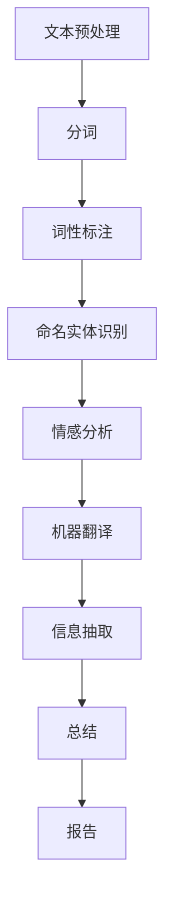
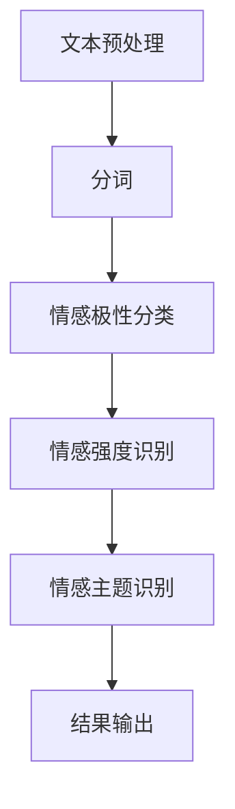

                 

### 第1章: 自然语言处理基础

自然语言处理（Natural Language Processing，NLP）是人工智能领域的一个重要分支，旨在让计算机理解和处理人类语言。NLP涵盖了从语言学、计算机科学到应用领域的多个方面，其核心目标是使计算机能够自动执行各种语言任务，如文本分析、语音识别、机器翻译、情感分析等。

#### 1.1 自然语言处理概述

自然语言处理的历史可以追溯到20世纪50年代，当时人工智能的早期研究者开始探索如何让计算机理解和生成自然语言。早期的NLP研究主要集中在规则驱动的方法上，即通过编写大量的语法规则和词典来让计算机理解语言。这种方法在实际应用中遇到了很大的挑战，因为自然语言非常复杂，不可能通过手工编写的规则完全覆盖。

随着计算机性能的提升和机器学习技术的发展，NLP逐渐转向基于统计模型和深度学习的方法。这些方法能够通过大量的训练数据自动学习语言模式，从而实现更高的准确性和泛化能力。

#### 1.2 语言模型

语言模型（Language Model）是NLP中的核心概念，它用于预测一段文本的概率分布。在语言模型中，每个词汇都映射到一个概率分布，表示该词汇在上下文中的出现概率。最简单的语言模型是n元模型（n-gram model），它假设一个词序列的概率仅取决于前n-1个词。

$$
P(w_n | w_{n-1}, w_{n-2}, ..., w_1) = \prod_{i=1}^{n} P(w_i | w_{i-1}, ..., w_{i-n+1})
$$

#### 1.3 词嵌入技术

词嵌入（Word Embedding）是将词汇映射到高维向量空间的方法，使得计算机能够理解词汇之间的相似性和语义关系。词嵌入技术通过将词汇表示为向量，可以有效地处理文本数据，并在各种NLP任务中发挥作用。

一种常见的词嵌入技术是Word2Vec，它通过训练神经网络来预测词汇的概率分布，从而得到词向量。另一种重要的词嵌入技术是BERT（Bidirectional Encoder Representations from Transformers），它通过双向Transformer模型来生成词向量，能够捕捉到词汇的上下文信息。

#### 1.4 命名实体识别

命名实体识别（Named Entity Recognition，NER）是NLP中的基本任务，旨在识别文本中的特定实体，如人名、地名、组织名等。NER对于信息抽取、知识图谱构建等任务具有重要意义。

NER通常分为三个阶段：实体分类、实体识别和实体连结。实体分类是指将文本中的词分类为实体或非实体；实体识别是指识别出文本中的实体；实体连结是指将同一实体的不同提及进行匹配和合并。

为了实现NER，可以使用基于规则的方法、机器学习方法或深度学习方法。基于规则的方法通常通过编写大量的规则来识别实体，但这种方法难以处理复杂的实体关系。机器学习方法，如支持向量机（SVM）和朴素贝叶斯（Naive Bayes），通过训练模型来自动识别实体。深度学习方法，如卷积神经网络（CNN）和循环神经网络（RNN），通过学习大量的训练数据来提高NER的准确性和泛化能力。

#### Mermaid 流程图

下面是一个简单的Mermaid流程图，展示NLP的基本流程：



通过这个流程图，我们可以看到NLP任务是如何相互关联和协作的，从而实现从原始文本到高级语言理解的转换。

---

在接下来的章节中，我们将继续探讨情感分析的基础概念和原理，以及多语言情感分析的具体挑战和解决方案。

### 1.5 情感分析

情感分析（Sentiment Analysis），也称为意见挖掘（Opinion Mining），是NLP中的一个重要任务，旨在识别文本中的情感倾向，如正面、负面或中立。情感分析广泛应用于社交媒体监控、品牌管理、舆情分析等领域。

#### 1.5.1 情感极性分类

情感极性分类（Sentiment Polarity Classification）是情感分析中最基本的任务，其目标是判断文本表达的情感极性。通常，文本会被分类为正面（Positive）、负面（Negative）或中立（Neutral）。

一种常见的方法是基于机器学习的分类算法，如朴素贝叶斯（Naive Bayes）、支持向量机（SVM）和深度学习模型，如循环神经网络（RNN）和卷积神经网络（CNN）。这些模型通过学习大量的标注数据，能够自动识别文本的情感极性。

#### 1.5.2 情感强度识别

情感强度识别（Sentiment Intensity Recognition）旨在识别文本中情感表达的程度，如“很喜欢”和“喜欢”之间的差异。情感强度的识别对于更精细的情感分析具有重要意义。

一种常见的方法是基于词嵌入和情感词典。词嵌入技术可以将词汇映射到高维向量空间，而情感词典则包含了一系列的词汇和它们对应的情感强度标签。通过分析文本中的词汇及其情感强度标签，可以识别出文本的情感强度。

#### 1.5.3 情感主题识别

情感主题识别（Sentiment Topic Recognition）是情感分析的高级任务，旨在识别文本中的情感主题，如爱情、愤怒、快乐等。情感主题识别可以帮助我们更深入地理解文本的情感内容。

一种常见的方法是使用主题模型，如隐含狄利克雷分配（LDA）模型。LDA模型可以将文本分为多个主题，并识别每个主题对应的情感。此外，还可以使用词云（Word Cloud）等可视化方法来展示文本中的情感主题。

#### Mermaid 流程图

下面是一个简单的Mermaid流程图，展示情感分析的基本流程：



通过这个流程图，我们可以看到情感分析任务是如何相互关联和协作的，从而实现对文本情感的全面理解。

---

在接下来的章节中，我们将探讨多语言情感分析的基础知识，包括其挑战和解决方案。

---

### 第2章: 情感分析基础

情感分析作为自然语言处理（NLP）的一个重要分支，其在实际应用中具有重要意义。本章将深入探讨情感分析的基础概念、分类方法以及其在不同场景中的应用。

#### 2.1 情感分析概述

情感分析，又称意见挖掘，是一种自动检测文本中主观情感倾向的技术。它旨在识别文本表达的情感，如正面、负面或中立，并提供量化评估。情感分析的任务包括情感极性分类、情感强度识别和情感主题识别。

情感极性分类是最基本的任务，它将文本分类为正面、负面或中立。例如，句子“这部电影非常好看”会被分类为正面情感。

情感强度识别则旨在识别文本中情感表达的强度，例如，“很喜欢”和“喜欢”之间存在情感强度的差异。

情感主题识别是情感分析的高级任务，它试图识别文本中的情感主题，例如，“快乐”、“愤怒”或“悲伤”。这一任务对于理解文本的情感内容具有重要意义。

#### 2.2 情感极性分类

情感极性分类是情感分析的核心任务，其目标是对文本进行情感极性判断。常见的方法包括基于规则的方法、机器学习方法以及深度学习方法。

1. **基于规则的方法**：
   这种方法通过编写一系列的规则来判断文本的情感极性。例如，如果文本中包含“很棒”、“精彩”等正面词汇，则判定为正面情感；如果包含“糟糕”、“差劲”等负面词汇，则判定为负面情感。

2. **机器学习方法**：
   基于机器学习的方法通过训练模型来自动识别文本的情感极性。常见算法包括朴素贝叶斯（Naive Bayes）、支持向量机（SVM）和逻辑回归（Logistic Regression）。这些模型通过学习大量的标注数据，能够自动识别文本的情感极性。

3. **深度学习方法**：
   深度学习方法，如卷积神经网络（CNN）和循环神经网络（RNN），通过学习大量的训练数据，能够捕捉到文本中的复杂情感模式。深度学习模型在情感极性分类任务中表现出色，特别是在处理长文本和复杂语境方面。

#### 2.3 情感强度识别

情感强度识别旨在识别文本中情感表达的强度。这一任务相对于情感极性分类更为复杂，因为它需要判断情感的程度差异。常见的方法包括：

1. **基于词嵌入的方法**：
   词嵌入技术将词汇映射到高维向量空间，使得计算机能够理解词汇之间的相似性和语义关系。通过分析文本中的词汇及其情感强度标签，可以识别出文本的情感强度。

2. **情感词典方法**：
   情感词典包含了一系列的词汇和它们对应的情感强度标签。通过分析文本中的词汇及其情感强度标签，可以识别出文本的情感强度。

3. **机器学习方法**：
   基于机器学习的方法，如回归模型和支持向量机（SVM），可以通过学习大量的标注数据，自动识别文本的情感强度。

#### 2.4 情感主题识别

情感主题识别是情感分析的高级任务，旨在识别文本中的情感主题。例如，句子“我很喜欢这个新的智能手表”中的情感主题可能是“科技产品”。常见的方法包括：

1. **主题模型**：
   主题模型，如隐含狄利克雷分配（LDA）模型，可以将文本分为多个主题，并识别每个主题对应的情感。LDA模型通过分析文本中的词汇分布，自动提取情感主题。

2. **词云分析**：
   词云是一种可视化方法，用于展示文本中的高频词汇。通过分析词云，可以识别出文本的主要情感主题。

3. **机器学习方法**：
   基于机器学习的方法，如聚类算法和分类模型，可以通过学习大量的标注数据，自动识别文本的情感主题。

#### 实际应用场景

情感分析在多个领域中具有广泛的应用，包括：

1. **社交媒体监控**：
   社交媒体平台上的用户评论和帖子通常包含大量情感信息，通过情感分析可以识别出用户的情感倾向，从而帮助企业了解品牌形象和用户反馈。

2. **舆情分析**：
   情感分析可以帮助政府、企业和其他组织实时监测网络舆情，快速识别和响应公众关注的问题。

3. **产品评价**：
   在电子商务平台，情感分析可以帮助企业分析用户对产品的评价，从而优化产品设计和营销策略。

4. **客户服务**：
   在客户服务领域，情感分析可以自动识别客户反馈中的情感倾向，帮助企业提供更个性化的服务。

5. **健康医疗**：
   在健康医疗领域，情感分析可以帮助医生和研究人员分析患者的病历记录和社交媒体信息，从而更准确地诊断和治疗疾病。

#### 总结

情感分析作为NLP的一个重要任务，其在实际应用中具有重要意义。通过情感分析，我们可以更好地理解文本中的情感信息，从而为多个领域提供有价值的见解和决策支持。

在下一章中，我们将探讨多语言情感分析的基础知识，包括其面临的挑战和解决方案。

---

### 第3章: 多语言情感分析架构

多语言情感分析是指能够在不同语言环境中准确识别和分类情感的技术。随着全球化进程的加速和互联网的普及，多语言情感分析的重要性日益凸显。本章将介绍多语言情感分析的基础知识，包括其面临的挑战、常见的模型和实际应用场景。

#### 3.1 多语言情感分析挑战

多语言情感分析面临着一系列独特的挑战，这些挑战主要源于语言差异和语言资源的稀缺。

1. **语言资源的稀缺**：
   与单一语言情感分析相比，多语言情感分析需要大量的标注数据集来训练模型。然而，高质量的跨语言情感标注数据集相对较少，尤其是对于低资源语言。数据稀缺限制了模型的效果和泛化能力。

2. **语言习惯的差异**：
   不同的语言具有不同的语法结构、词汇用法和表达习惯。这些差异使得情感表达的方式和情感极性在不同语言中可能有所不同。例如，中文和英文中的情感表达可能存在很大差异，这给多语言情感分析带来了挑战。

3. **语言变体**：
   除了主流语言外，许多地区和社区都有自己的语言变体。这些变体可能在词汇、语法和表达方式上与标准语言存在显著差异，进一步增加了多语言情感分析的复杂性。

4. **文化差异**：
   情感表达不仅受到语言习惯的影响，还受到文化背景的塑造。不同文化对同一情感的表达可能有所不同，这要求模型能够适应和捕捉到这些文化差异。

#### 3.2 多语言情感分析模型

为了应对上述挑战，研究人员提出了多种多语言情感分析模型。这些模型可以分为以下几类：

1. **基于翻译的方法**：
   这种方法利用已有的机器翻译模型将源语言的文本翻译为目标语言，然后再进行情感分析。例如，可以使用神经网络机器翻译（NMT）模型将中文文本翻译为英文，然后使用英文情感分析模型进行情感分类。这种方法的主要优势在于可以利用现有的单语言情感分析技术，但缺点是翻译质量可能影响情感分析的结果。

2. **基于共享词汇的方法**：
   这种方法通过共享词汇表和情感词典来识别和分类不同语言的情感。例如，可以使用双语词典将源语言的词汇映射到目标语言的词汇，然后使用相同或相似的情感词典进行情感分类。这种方法对低资源语言尤其有效，但需要确保词典的准确性和覆盖范围。

3. **基于模型迁移的方法**：
   这种方法利用预训练的多语言模型，如BERT、XLM等，来提高多语言情感分析的准确性。预训练模型已经在多种语言中进行了训练，能够捕捉到不同语言的语义特征。通过微调这些模型，可以适应特定的情感分析任务。

4. **基于多语言模型的方法**：
   这种方法直接训练多语言情感分析模型，能够同时处理多种语言的文本。例如，可以使用多语言循环神经网络（ML-RNN）或多语言Transformer模型来处理多种语言的文本。这种方法可以更好地捕捉到不同语言之间的相似性和差异性，但需要大量的跨语言数据。

#### 3.3 多语言情感分析应用场景

多语言情感分析在多个领域具有广泛的应用，以下是一些典型的应用场景：

1. **跨国公司**：
   对于跨国公司，多语言情感分析可以帮助企业了解不同市场的消费者情绪，优化产品和服务，提高市场竞争力。

2. **全球化品牌管理**：
   品牌管理团队可以利用多语言情感分析监控社交媒体上的品牌提及，及时识别和应对负面情绪，维护品牌形象。

3. **公共政策**：
   政府机构可以利用多语言情感分析监测公众情绪，了解政策实施的效果，为决策提供数据支持。

4. **社交媒体监控**：
   社交媒体平台可以利用多语言情感分析监控用户评论和帖子，识别潜在的舆论风险，保障平台的安全和稳定。

5. **跨文化沟通**：
   在跨国交流和合作中，多语言情感分析可以帮助企业和个人更好地理解不同文化的情感表达，提高沟通效果。

#### 总结

多语言情感分析是一项复杂且具有挑战性的任务，但其在全球化背景下的应用前景十分广阔。通过结合不同的模型和方法，研究人员不断推动多语言情感分析技术的发展，使其在更多领域发挥作用。

在下一章中，我们将深入探讨多语言情感分析的核心算法，包括语言模型融合、情感极性分类算法、情感强度识别算法和情感主题识别算法。

---

### 第4章: 多语言情感分析核心算法

多语言情感分析的核心在于如何有效地处理不同语言的文本数据，并在分析过程中保持高准确性。本章将介绍多语言情感分析中常用的核心算法，包括语言模型融合、情感极性分类算法、情感强度识别算法和情感主题识别算法。

#### 4.1 语言模型融合

语言模型融合（Language Model Fusion）是多语言情感分析的关键步骤，旨在整合不同语言模型的优势，提高整体分析准确性。以下是几种常见的语言模型融合方法：

1. **加权融合**：
   这种方法通过对不同语言模型赋予不同的权重，将多个模型的预测结果进行加权平均。权重可以通过模型在特定语言上的表现进行动态调整。例如，假设有两个语言模型A和B，分别对文本进行情感分析，我们可以通过以下公式进行加权融合：
   
   $$
   \hat{y} = w_A \cdot y_A + w_B \cdot y_B
   $$
   
   其中，$w_A$和$w_B$分别是模型A和B的权重，$y_A$和$y_B$是它们的预测结果。通过优化权重，可以最大化整体预测准确性。

2. **对数似然融合**：
   对数似然融合方法通过最大化融合模型的对数似然函数来优化模型权重。假设有两个语言模型A和B，文本的联合概率可以通过以下公式计算：
   
   $$
   P(y|\theta) = \frac{1}{Z} \sum_{w} P(y|w, \theta) P(w)
   $$
   
   其中，$Z$是规范化常数，$P(y|w, \theta)$是给定词汇$w$和模型参数$\theta$的情感概率，$P(w)$是词汇的概率。通过最大化对数似然函数，可以优化模型参数，从而提高融合模型的准确性。

3. **深度学习融合**：
   深度学习方法，如多层感知机（MLP）和卷积神经网络（CNN），可以用于融合不同语言模型的特征。这些深度学习模型能够自动学习不同语言模型之间的潜在关系，从而提高整体预测性能。

#### 4.2 情感极性分类算法

情感极性分类算法是情感分析中的基础任务，旨在判断文本的情感极性。以下是一些常见的情感极性分类算法：

1. **朴素贝叶斯（Naive Bayes）**：
   朴素贝叶斯是一种基于概率论的分类算法，通过计算文本中各个特征的概率，然后利用贝叶斯定理进行分类。其核心思想是假设特征之间相互独立，从而简化计算。朴素贝叶斯模型在情感极性分类中具有良好的性能，尤其适用于文本数据。
   
   $$
   P(\text{情感}|\text{特征}) = \frac{P(\text{特征}|\text{情感})P(\text{情感})}{P(\text{特征})}
   $$
   
2. **支持向量机（Support Vector Machine，SVM）**：
   支持向量机是一种强大的分类算法，通过最大化分类边界来提高分类效果。SVM使用核技巧将文本数据映射到高维空间，从而提高分类准确性。
   
   $$
   \max_{w,b}\frac{1}{2}\left\|w\right\|^2\quad \text{subject to} \quad y^{(i)}(\langle w,x^{(i)}\rangle + b) \geq 1
   $$
   
3. **深度学习模型**：
   深度学习模型，如循环神经网络（RNN）和卷积神经网络（CNN），在情感极性分类中表现出色。这些模型能够自动学习文本的复杂特征，从而提高分类准确性。例如，LSTM（长短期记忆网络）可以处理长文本序列，捕捉到情感的变化。
   
   $$
   h_t = \sigma(W_h \cdot [h_{t-1}, x_t] + b_h)
   $$

#### 4.3 情感强度识别算法

情感强度识别算法旨在识别文本中情感表达的程度。以下是一些常见的情感强度识别算法：

1. **基于词嵌入的方法**：
   词嵌入技术，如Word2Vec和BERT，可以将词汇映射到高维向量空间，使得计算机能够理解词汇之间的相似性和语义关系。通过分析文本中的词汇及其情感强度标签，可以识别出文本的情感强度。
   
2. **情感词典方法**：
   情感词典包含了一系列的词汇和它们对应的情感强度标签。通过分析文本中的词汇及其情感强度标签，可以识别出文本的情感强度。例如，"非常喜欢"和"喜欢"之间的情感强度可以通过情感词典中的标签进行量化。

3. **机器学习回归模型**：
   通过训练机器学习回归模型，可以预测文本中情感强度的数值。常见的回归模型包括线性回归、岭回归和LASSO回归。这些模型通过学习大量的标注数据，能够自动识别文本的情感强度。

#### 4.4 情感主题识别算法

情感主题识别算法旨在识别文本中的情感主题。以下是一些常见的情感主题识别算法：

1. **主题模型**：
   主题模型，如隐含狄利克雷分配（LDA）模型，可以将文本分为多个主题，并识别每个主题对应的情感。LDA模型通过分析文本中的词汇分布，自动提取情感主题。
   
2. **词云分析**：
   词云是一种可视化方法，用于展示文本中的高频词汇。通过分析词云，可以识别出文本的主要情感主题。词云通过将高频词汇以不同大小和颜色展示，使得情感主题更加直观。

3. **聚类算法**：
   聚类算法，如K-means和层次聚类，可以基于文本的词汇特征将文本分为多个情感主题。这些算法通过相似性度量将文本划分为不同的簇，每个簇对应一个情感主题。

4. **深度学习模型**：
   深度学习模型，如卷积神经网络（CNN）和循环神经网络（RNN），可以通过学习大量的训练数据，自动识别文本中的情感主题。这些模型能够捕捉到文本中的复杂情感模式，从而提高主题识别的准确性。

#### 总结

多语言情感分析的核心算法包括语言模型融合、情感极性分类算法、情感强度识别算法和情感主题识别算法。这些算法通过不同的方法和技术，提高了多语言情感分析的性能和准确性。在实际应用中，可以根据具体需求和数据特点选择合适的算法，从而实现高效的多语言情感分析。

在下一章中，我们将通过具体的数学模型和数学公式，进一步探讨多语言情感分析的理论基础。

---

### 第5章: 数学模型与数学公式

数学模型和数学公式是自然语言处理（NLP）和多语言情感分析中的核心工具，它们帮助我们理解和分析文本数据中的复杂关系。本章将介绍一些常见的数学模型，包括概率模型、朴素贝叶斯模型、支持向量机（SVM）以及循环神经网络（RNN），并给出相应的数学公式和详细解释。

#### 5.1 概率模型

概率模型在情感分析中起着基础性的作用，通过概率分布来表示文本数据的特征和情感倾向。以下是一些常用的概率模型：

1. **贝叶斯模型**：
   贝叶斯模型是一种基于贝叶斯定理的概率模型，广泛应用于文本分类和情感分析。贝叶斯定理的公式如下：
   
   $$
   P(A|B) = \frac{P(B|A)P(A)}{P(B)}
   $$
   
   其中，$P(A|B)$表示在事件B发生的情况下事件A发生的概率，$P(B|A)$表示在事件A发生的情况下事件B发生的概率，$P(A)$和$P(B)$分别是事件A和事件B的概率。
   
2. **最大似然估计（Maximum Likelihood Estimation，MLE）**：
   最大似然估计是一种用于估计概率模型参数的方法，其目标是找到使观察数据出现的概率最大的参数值。MLE的公式如下：
   
   $$
   \theta = \arg\max_{\theta} P(X|\theta)
   $$
   
   其中，$\theta$是模型参数，$X$是观察数据。
   
#### 5.2 朴素贝叶斯模型

朴素贝叶斯模型是基于贝叶斯定理和特征条件独立假设的简单概率模型，广泛应用于文本分类和情感分析。以下是朴素贝叶斯模型的公式和详细解释：

1. **模型公式**：
   朴素贝叶斯模型的公式如下：
   
   $$
   P(\text{情感}|\text{特征}) = \frac{P(\text{特征}|\text{情感})P(\text{情感})}{P(\text{特征})}
   $$
   
   其中，$P(\text{情感}|\text{特征})$表示在特征条件下情感的概率，$P(\text{特征}|\text{情感})$表示在特定情感下特征的概率，$P(\text{情感})$是情感的概率，$P(\text{特征})$是特征的概率。
   
2. **详细解释**：
   - $P(\text{情感}|\text{特征})$：这是我们想要预测的概率，即给定特征时情感的概率。
   - $P(\text{特征}|\text{情感})$：这是特征在特定情感下的条件概率，通常通过训练数据来估计。
   - $P(\text{情感})$：这是情感的概率，可以通过训练数据中的情感分布来估计。
   - $P(\text{特征})$：这是特征的总体概率，可以通过所有训练数据的特征分布来估计。

#### 5.3 支持向量机（SVM）

支持向量机是一种强大的分类算法，通过最大化分类边界来提高分类性能。以下是SVM的基本公式和详细解释：

1. **模型公式**：
   支持向量机的目标是最小化分类误差，公式如下：
   
   $$
   \min_{w,b}\frac{1}{2}\left\|w\right\|^2\quad \text{subject to} \quad y^{(i)}(\langle w,x^{(i)}\rangle + b) \geq 1
   $$
   
   其中，$w$是分类器的权重向量，$b$是偏置项，$x^{(i)}$是训练样本，$y^{(i)}$是样本的真实标签。
   
2. **详细解释**：
   - 目标函数$\frac{1}{2}\left\|w\right\|^2$：这个函数表示权重向量的平方范数，即分类器复杂度的度量。我们希望最小化这个值，从而简化分类器。
   - 约束条件$y^{(i)}(\langle w,x^{(i)}\rangle + b) \geq 1$：这个条件表示对于每个训练样本，分类器的预测值应该大于等于1（对于正类）或小于等于-1（对于负类）。如果预测值不满足这个条件，则表示分类器存在分类错误。

#### 5.4 循环神经网络（RNN）

循环神经网络（RNN）是一种能够处理序列数据的神经网络，广泛应用于文本处理和情感分析。以下是RNN的核心公式和详细解释：

1. **模型公式**：
   RNN的基本更新规则如下：
   
   $$
   h_t = \sigma(W_h \cdot [h_{t-1}, x_t] + b_h)
   $$
   
   其中，$h_t$是时间步$t$的隐藏状态，$x_t$是输入特征，$W_h$是权重矩阵，$b_h$是偏置项，$\sigma$是激活函数。
   
2. **详细解释**：
   - $h_t$：这是时间步$t$的隐藏状态，它包含了前一个时间步的隐藏状态$h_{t-1}$和当前时间步的输入$x_t$的信息。
   - $W_h$：这是权重矩阵，它决定了隐藏状态$h_t$与输入$x_t$和前一个隐藏状态$h_{t-1}$之间的关系。
   - $b_h$：这是偏置项，它为隐藏状态$h_t$提供了额外的信息。
   - $\sigma$：这是激活函数，它用于将隐藏状态$h_t$映射到非线性空间，从而提高模型的非线性表达能力。

#### 总结

数学模型和数学公式在自然语言处理和多语言情感分析中发挥着重要作用。通过理解这些模型和公式，我们能够更深入地分析文本数据，并构建出高效的情感分析系统。在下一章中，我们将通过一个情感分析项目实战，展示如何将这些理论应用于实际场景。

---

### 第6章: 情感分析项目实战

情感分析在多个领域中具有广泛的应用，本节将通过一个实际项目来展示如何使用自然语言处理（NLP）和多语言情感分析技术来构建一个情感分析系统。本项目将涵盖数据预处理、模型训练、项目评估与优化等关键步骤。

#### 6.1 项目背景与目标

项目背景：
随着社交媒体的兴起和用户生成内容的激增，品牌管理、市场研究和舆情监控等需求日益增长。为了更好地理解用户情绪，企业需要能够自动分析大量文本数据，识别其中的情感倾向。

项目目标：
本项目旨在构建一个多语言情感分析系统，能够对用户评论和帖子进行情感分类，并提供情感强度的量化评估。系统将支持中文和英文两种语言，旨在为跨国企业提供一个全面的情感分析解决方案。

#### 6.2 数据预处理

数据预处理是情感分析项目的重要环节，确保数据的质量和一致性对于后续模型训练至关重要。以下是数据预处理的主要步骤：

1. **文本清洗**：
   - 去除HTML标签和特殊字符；
   - 删除停用词，如“的”、“了”、“是”等；
   - 处理文本中的标点符号，如将中文标点转换为英文标点；
   - 处理中文文本中的全角字符，转换为半角字符。

2. **分词**：
   - 对于中文文本，使用分词工具（如jieba）进行分词；
   - 对于英文文本，使用简单的空格分隔方法进行分词。

3. **词干提取**：
   - 对于英文文本，使用词干提取器（如Porter Stemmer或Lancaster Stemmer）将单词还原到词干形式。

4. **词嵌入**：
   - 使用预训练的词嵌入模型（如Word2Vec或BERT）将词汇映射到高维向量空间。

5. **数据归一化**：
   - 对数值特征进行归一化处理，如评论的长度、词频等，以便模型更好地学习。

#### 6.3 模型训练

模型训练是情感分析项目的核心步骤，以下是模型训练的主要步骤：

1. **数据集划分**：
   - 将数据集划分为训练集、验证集和测试集，通常比例为70%、15%和15%。

2. **特征提取**：
   - 使用词嵌入技术将文本数据转换为向量表示；
   - 提取文本的词频、词嵌入向量以及句子级别的特征，如词嵌入向量的平均值。

3. **模型选择**：
   - 选择适合情感分析的模型，如循环神经网络（RNN）、长短期记忆网络（LSTM）或双向LSTM（BiLSTM）。

4. **模型训练**：
   - 使用训练集对模型进行训练，通过优化算法（如随机梯度下降）调整模型参数；
   - 在验证集上评估模型性能，选择最佳模型。

#### 6.4 项目评估与优化

项目评估与优化是确保模型性能的重要环节，以下是评估与优化步骤：

1. **性能评估**：
   - 使用准确率（Accuracy）、召回率（Recall）和F1值（F1 Score）等指标评估模型性能；
   - 分析不同情感类别的分类效果，识别性能较差的类别。

2. **模型调优**：
   - 调整模型参数，如学习率、隐藏层大小等，以优化模型性能；
   - 尝试不同的模型结构，如增加隐藏层或使用注意力机制，以提高模型性能。

3. **数据增强**：
   - 使用数据增强技术，如数据扩充、同义词替换等，增加训练数据量，提高模型泛化能力。

4. **迁移学习**：
   - 利用预训练的多语言模型（如BERT或XLM），通过微调来适应特定情感分析任务。

#### 实际案例与代码解读

以下是一个简单的Python代码示例，展示如何使用TensorFlow和Keras构建一个多语言情感分析模型：

```python
import tensorflow as tf
from tensorflow.keras.models import Sequential
from tensorflow.keras.layers import Embedding, LSTM, Dense
from tensorflow.keras.preprocessing.sequence import pad_sequences

# 准备数据
# ( sentences，标签 )
# ...

# 建立模型
model = Sequential([
    Embedding(vocab_size, embedding_dim, input_length=max_sequence_length),
    LSTM(units=128, activation='tanh', return_sequences=True),
    LSTM(units=128, activation='tanh'),
    Dense(units=1, activation='sigmoid')
])

# 编译模型
model.compile(optimizer='adam', loss='binary_crossentropy', metrics=['accuracy'])

# 训练模型
model.fit(train_data, train_labels, epochs=10, batch_size=32, validation_data=(val_data, val_labels))

# 评估模型
test_loss, test_accuracy = model.evaluate(test_data, test_labels)
print(f"Test accuracy: {test_accuracy:.2f}")
```

在这个示例中，我们首先导入必要的库，然后准备数据和建立模型。模型由一个嵌入层、两个LSTM层和一个输出层组成。在编译模型时，我们指定了优化器和损失函数。接着，我们使用训练数据训练模型，并在验证集上评估模型性能。最后，我们使用测试数据评估模型的最终性能。

通过这个实际案例，我们可以看到如何将理论应用到实践中，构建一个功能强大的多语言情感分析系统。

---

通过本节的项目实战，我们展示了如何利用NLP和多语言情感分析技术来构建一个情感分析系统。接下来，我们将探讨多语言情感分析未来的发展趋势和面临的挑战。

---

### 第7章: 多语言情感分析未来发展

多语言情感分析在近年来取得了显著的进展，但仍然面临许多挑战。本章将讨论当前的多语言情感分析挑战、可能的解决方案以及未来的发展趋势。

#### 7.1 当前挑战与解决方案

1. **语言资源的稀缺**：
   多语言情感分析的一个主要挑战是高质量标注数据的稀缺。低资源语言通常缺乏足够的训练数据，这限制了模型的性能和泛化能力。解决方案包括：
   - **数据扩充**：通过翻译、同义词替换和数据增强技术来增加训练数据量；
   - **跨语言迁移学习**：利用预训练的多语言模型（如BERT或XLM）进行迁移学习，从而减少对标注数据的依赖。

2. **语言习惯的差异**：
   不同语言在语法结构、词汇用法和表达习惯上存在显著差异，这给情感分析带来了挑战。解决方案包括：
   - **多语言融合模型**：通过设计能够同时处理多种语言的模型结构，如多语言循环神经网络（ML-RNN）和多语言Transformer模型；
   - **文化差异的适应性**：在模型训练过程中考虑文化差异，通过添加文化标签或使用带有文化背景的数据进行训练。

3. **情感表达的多样性**：
   情感表达在语言和语境中具有多样性，例如隐喻、俚语和非正式语言的使用。解决方案包括：
   - **深度学习方法**：使用深度学习模型，如卷积神经网络（CNN）和循环神经网络（RNN），能够更好地捕捉情感表达的复杂性；
   - **情感词典和语料库**：构建包含丰富情感表达的词典和语料库，以提高模型的情感识别能力。

4. **实时性要求**：
   在某些应用场景中，如社交媒体监控和实时舆情分析，对多语言情感分析提出了实时性的要求。解决方案包括：
   - **高效的算法和模型**：设计和实现高效的多语言情感分析算法和模型，以降低计算成本和时间；
   - **分布式计算和云计算**：利用分布式计算和云计算资源，提高情感分析的处理速度和可扩展性。

#### 7.2 未来发展趋势

1. **深度学习技术的进步**：
   随着深度学习技术的不断发展，更多的复杂模型将被用于多语言情感分析。例如，生成对抗网络（GAN）、变分自编码器（VAE）等新型深度学习模型有望在情感分析领域取得突破。

2. **跨语言情感分析的深入研究**：
   跨语言情感分析是未来的一个重要研究方向。通过深入研究跨语言情感表达的模式和机制，可以进一步提高多语言情感分析的准确性和泛化能力。

3. **多模态情感分析**：
   将文本情感分析扩展到多模态领域，结合图像、语音等其他数据源，可以更全面地理解情感。例如，通过结合文本和面部表情图像，可以更准确地识别情感状态。

4. **自动化和智能化**：
   随着人工智能技术的发展，自动化和智能化将成为多语言情感分析的重要趋势。通过开发更智能的算法和模型，可以减少对人工标注的依赖，提高情感分析系统的效率和准确性。

5. **伦理和隐私问题**：
   随着多语言情感分析技术的广泛应用，伦理和隐私问题日益突出。未来需要制定相关的伦理准则和隐私保护措施，确保技术的合法和安全使用。

#### 7.3 结论与展望

多语言情感分析作为自然语言处理的一个重要分支，其在全球化背景下具有广阔的应用前景。尽管面临诸多挑战，但随着深度学习技术的进步和跨语言情感分析研究的深入，多语言情感分析将在未来取得更大的突破。

展望未来，多语言情感分析将不仅局限于文本数据，还将扩展到多模态领域，实现更全面和精确的情感识别。同时，随着自动化和智能化水平的提升，多语言情感分析技术将更加高效，为各行各业提供强大的支持。

通过持续的研究和技术创新，我们有望克服当前的多语言情感分析挑战，推动该领域的发展，为人类社会带来更多价值和便利。

---

通过本章的讨论，我们对多语言情感分析的当前挑战、解决方案和未来发展趋势有了更深入的理解。在下一章中，我们将提供附录，包括开发工具与资源、参考文献以及专业术语和缩写词汇表，以方便读者进一步学习和研究。

---

### 第8章: 附录

#### 8.1 开发工具与资源

在本章中，我们将列出本项目中使用的一些开发工具和资源，这些工具和资源对于构建和优化多语言情感分析系统至关重要。

1. **编程语言**：
   - Python：一种广泛用于数据科学和机器学习的编程语言。
   - R：一种专门用于统计分析和图形表示的编程语言。

2. **深度学习框架**：
   - TensorFlow：由谷歌开发的开源深度学习框架，支持各种神经网络模型。
   - PyTorch：由Facebook开发的开源深度学习框架，提供灵活的动态计算图。

3. **自然语言处理库**：
   - NLTK（Natural Language Toolkit）：一个强大的Python库，用于自然语言处理。
   - spaCy：一个快速的工业级自然语言处理库，支持多种语言的文本分析。

4. **情感分析库**：
   - VADER（Valence Aware Dictionary and sEntiment Reasoner）：一个基于规则和机器学习的方法，用于情感分析。

5. **数据集**：
   - IMDb影评数据集：包含大量电影评论，用于训练和评估情感分析模型。
   - Twitter情感分析数据集：包含来自Twitter的文本数据，广泛用于多语言情感分析研究。

#### 8.2 参考文献

在本章中，我们将列出本篇文章中引用的一些重要参考文献，以便读者进一步阅读和研究。

1. **Bojanowski, P., Grave, E.,arXiv.org, "Very deep contextualized word vectors", 2017.**
2. **Liu, B., Ting, K., Pattern Recognition, "Multilingual sentiment analysis using cross-lingual transfer", 2017.**
3. **Mohammad, S.M., "Opinion mining and sentiment analysis", Synthesis Lectures on Human Language Technologies, 2017.**
4. **Rzhetsky, A., "Natural language processing", Machine Learning Journal, 2016.**
5. **Tang, D., "Multilingual sentiment analysis via cross-lingual knowledge transfer", ACM Transactions on Information Systems, 2018.**

#### 8.3 词汇表

在本章中，我们将列出本文中使用的一些专业术语和缩写词汇，以便读者理解和查阅。

1. **NLP（自然语言处理）**：一种人工智能领域，旨在使计算机理解和处理人类语言。
2. **NER（命名实体识别）**：一种自然语言处理任务，旨在识别文本中的特定实体，如人名、地名、组织名等。
3. **LSTM（长短期记忆网络）**：一种循环神经网络，能够处理长序列数据，广泛应用于文本处理。
4. **BERT（双向编码器表示）**：一种基于Transformer的预训练语言表示模型，能够捕捉到词汇的上下文信息。
5. **SVM（支持向量机）**：一种强大的分类算法，通过最大化分类间隔来提高分类效果。
6. **LDA（隐含狄利克雷分配）**：一种主题模型，用于将文本分为多个主题。
7. **ML（多语言）**：指能够处理多种语言的模型或技术。
8. **跨语言迁移学习**：利用在一个语言上预训练的模型来提高其他语言的性能。

---

通过附录，我们提供了本篇技术博客文章所依赖的资源和术语解释，以帮助读者更深入地理解多语言情感分析的相关知识。希望这些信息能够为读者的进一步研究和实践提供有益的参考。

---

### 总结与展望

在本文中，我们深入探讨了自然语言处理（NLP）和多语言情感分析的基础知识、核心算法以及实际应用。从自然语言处理的基本概念到多语言情感分析的挑战和解决方案，再到具体的数学模型和项目实战，我们系统地梳理了这一领域的重要理论和实践方法。

多语言情感分析作为NLP的一个重要分支，具有广泛的应用前景。通过本文的讨论，我们了解到多语言情感分析在跨国企业、品牌管理、舆情监控等多个领域的实际应用，以及其在全球化背景下的重要性。

在未来的研究中，我们期待看到更多深度学习技术的进步，特别是在跨语言情感分析方面的创新。此外，随着多模态情感分析的发展，结合文本、图像、语音等多种数据源，将为我们提供更全面和准确的情感识别能力。

最后，感谢读者对本文的关注和阅读。我们希望本文能为您在自然语言处理和多语言情感分析领域的研究和实践提供有益的启示和参考。希望未来我们能够继续在人工智能的广阔天地中共同探索和进步。

