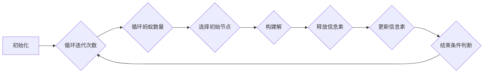
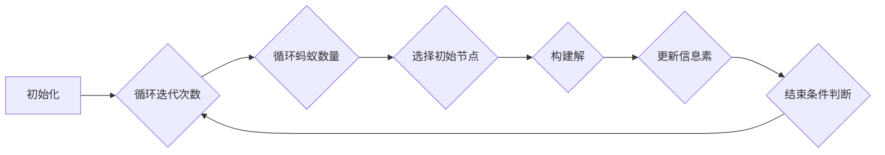
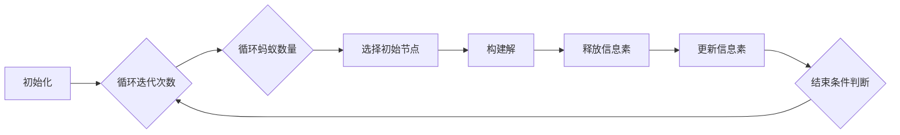

                 

## 《蚁群算法(Ant Colony Optimization) - 原理与代码实例讲解》

### 概述

蚁群优化算法（Ant Colony Optimization，简称ACO）是一种受自然界中蚂蚁觅食行为启发的启发式算法。在蚁群算法中，蚂蚁通过在环境中释放和跟踪信息素来寻找最优路径，从而解决问题。这种算法因其较强的鲁棒性、灵活性和高效性，在许多领域得到了广泛应用。

### 核心关键词

- **蚁群优化算法**
- **信息素**
- **启发式算法**
- **路径搜索**
- **优化问题**

### 摘要

本文将系统地介绍蚁群优化算法的基本原理、核心算法、变体与改进、数学模型以及实际应用。通过详细的理论阐述和代码实例讲解，帮助读者深入理解蚁群优化算法的运作机制，并掌握其在实际问题中的应用。

### 目录

#### 第一部分: 蚁群算法基础

1. **第1章 蚁群算法概述**
   - **1.1 蚁群算法的定义与特点**
   - **1.2 蚁群算法的历史与发展**

2. **第2章 蚂蚁行为与信息素**
   - **2.1 蚂蚁行为分析**
   - **2.2 信息素的定义与作用**
   - **2.3 信息素在路径选择中的作用**

3. **第3章 蚁群算法核心算法原理**
   - **3.1 蚁群算法的基本流程**
   - **3.2 蚁群算法的伪代码**
   - **3.3 蚁群算法的核心参数设置**

4. **第4章 蚁群算法的变体与改进**
   - **4.1 多蚁群算法**
   - **4.2 蚁群算法的改进策略**
   - **4.3 蚂群算法的应用实例**

5. **第5章 蚂群算法的数学模型**
   - **5.1 蚂群算法中的概率模型**
   - **5.2 蚂群算法中的优化模型**
   - **5.3 蚂群算法中的数学公式**

#### 第二部分: 蚁群算法实践与应用

6. **第6章 蚁群算法在图论问题中的应用**
   - **6.1 图的基本概念**
   - **6.2 蚁群算法在图上的应用**
   - **6.3 蚂群算法在图问题中的应用实例**

7. **第7章 蚁群算法在现实问题中的应用**
   - **7.1 蚁群算法在物流运输中的应用**
   - **7.2 蚁群算法在制造与工业中的应用**
   - **7.3 蚁群算法在其他领域中的应用**

8. **第8章 蚁群算法的代码实现与案例分析**
   - **8.1 开发环境搭建**
   - **8.2 蚂群算法代码实例讲解**
   - **8.3 代码解读与分析**
   - **8.4 蚁群算法实战案例**

9. **第9章 蚁群算法的未来发展与挑战**
   - **9.1 蚁群算法的局限性**
   - **9.2 蚁群算法的优化与改进方向**
   - **9.3 蚁群算法的未来发展趋势**

### 附录

- **附录 A: 蚁群算法相关资源与工具**

本文将采用逻辑清晰、结构紧凑、简单易懂的写作风格，通过一步一步的分析推理，深入探讨蚁群优化算法的原理与应用。让我们开始这一段精彩的探索之旅！
```markdown
```


# 第一部分：蚁群算法基础

## 第1章：蚁群算法概述

### 1.1 蚁群算法的定义与特点

蚁群优化算法（ACO）是一种模拟自然界蚂蚁觅食行为的启发式算法。蚂蚁在寻找食物的过程中，会释放一种称为信息素的化学物质，并在经过的路径上留下信息素。其他蚂蚁在寻找食物时，会根据路径上的信息素浓度选择路径，从而逐渐形成一条最优路径。

蚁群算法的特点主要包括：

1. **自组织性**：蚁群算法通过简单个体行为实现复杂集体行为，无需中央控制，具有较强的鲁棒性。
2. **全局优化**：蚁群算法在搜索过程中能够同时考虑全局和局部信息，从而找到较优的解决方案。
3. **适应性**：蚁群算法能够根据问题的变化动态调整搜索策略，具有较强的适应性。

### 1.2 蚁群算法的历史与发展

蚁群优化算法的起源可以追溯到1984年，意大利学者Marco Dorigo提出了蚁群算法。最初，该算法主要用于解决旅行商问题（TSP）。随着研究的深入，蚁群算法逐渐应用于路径搜索、车辆调度、物流优化等实际问题中。

近年来，蚁群算法的研究和应用得到了广泛关注，出现了许多改进和变体，如最大最小蚂蚁系统（MMAS）、精英蚁群算法（EACO）等。这些改进旨在提高算法的性能和适用范围。

## 第2章：蚂蚁行为与信息素

### 2.1 蚂蚁行为分析

蚂蚁的行为可以从个体行为和群体行为两个层面进行分析。

#### 个体行为

1. **随机游走**：蚂蚁在环境中进行随机游走，以寻找食物或解决其他问题。
2. **信息素释放**：蚂蚁在经过路径时会释放信息素，作为其他蚂蚁选择路径的依据。
3. **信息素感知**：蚂蚁通过感知路径上的信息素浓度，调整自己的移动方向。

#### 群体行为

1. **集体决策**：蚂蚁通过集体决策，共同寻找最优路径。
2. **协同工作**：蚂蚁在寻找食物或解决其他问题时，会协同工作，共同完成任务。

### 2.2 信息素的定义与作用

信息素是蚂蚁在环境中释放的一种化学物质，用于传递信息。信息素具有以下特点：

1. **易挥发**：信息素在环境中会逐渐挥发，影响其浓度。
2. **浓度梯度**：信息素浓度在路径上形成梯度，引导蚂蚁选择路径。

信息素在蚁群算法中具有重要作用：

1. **路径选择**：蚂蚁根据路径上的信息素浓度选择路径，从而影响整个群体的决策。
2. **优化路径**：通过信息素的积累和挥发，蚁群算法能够逐步优化路径，找到最优解。

### 2.3 信息素在路径选择中的作用

信息素在路径选择中的作用主要体现在两个方面：

1. **引导作用**：蚂蚁通过感知路径上的信息素浓度，选择信息素浓度较高的路径，从而引导整个群体向最优路径靠近。
2. **调整作用**：信息素浓度的高低会影响蚂蚁的路径选择，使得群体在搜索过程中能够不断调整和优化路径。

## 第3章：蚁群算法核心算法原理

### 3.1 蚁群算法的基本流程

蚁群算法的基本流程可以分为以下几个步骤：

1. **初始化**：设置初始信息素分布、蚂蚁的初始位置和算法参数。
2. **路径搜索**：蚂蚁从初始位置出发，根据信息素浓度和随机性选择路径，逐步构建解。
3. **信息素更新**：蚂蚁在搜索过程中释放信息素，并根据路径长度更新信息素浓度。
4. **迭代**：重复执行路径搜索和信息素更新，直到达到终止条件。

### 3.2 蚁群算法的伪代码



Algorithm AntColonyOptimization(problem, n_ants, max_iterations):
    Initialize ant positions, pheromone trail and cost function
    for i = 1 to max_iterations do
        for each ant in the colony do
            Select initial node and construct solution
            Update pheromone trail and solution cost
        end for
        Clear the old pheromone trail
    end for
    Return the best solution found
```

### 3.3 蚁群算法的核心参数设置

蚁群算法的性能受到多个参数的影响，包括蚂蚁数量、迭代次数、信息素更新策略等。

1. **蚂蚁数量**：蚂蚁数量会影响算法的搜索范围和收敛速度。过多蚂蚁可能导致计算资源浪费，过少蚂蚁则可能影响搜索效果。
2. **迭代次数**：迭代次数影响算法的搜索深度和精度。过多迭代次数可能导致过度拟合，过少迭代次数则可能影响搜索效果。
3. **信息素更新策略**：信息素更新策略包括信息素挥发系数和积累系数。挥发系数影响信息素的保留程度，积累系数影响信息素的释放程度。合适的参数设置能够提高算法的性能。

## 第4章：蚁群算法的变体与改进

### 4.1 多蚁群算法

多蚁群算法（Multi-Ant System，MAS）是在传统蚁群算法基础上的一种改进。多蚁群算法通过将蚁群分为多个子群，子群之间相互独立运行，并在特定条件下进行信息素交换。

多蚁群算法的特点包括：

1. **并行计算**：多个蚁群可以同时进行搜索，提高计算效率。
2. **自适应调整**：多个蚁群可以相互独立运行，根据问题的变化自适应调整搜索策略。

### 4.2 蚁群算法的改进策略

蚁群算法的改进策略主要包括参数自适应调整和与其他启发式算法结合。

#### 参数自适应调整

参数自适应调整是指根据问题的变化和算法的执行过程，动态调整蚁群算法的参数。常见的自适应调整策略包括：

1. **基于经验的参数调整**：根据经验值调整蚂蚁数量、迭代次数等信息。
2. **基于优化的参数调整**：利用优化算法（如遗传算法、粒子群算法等）调整参数。

#### 与其他启发式算法结合

蚁群算法可以与其他启发式算法（如遗传算法、粒子群算法等）结合，形成混合算法。常见的混合算法包括：

1. **蚁群-遗传算法（ACO-GA）**：将蚁群算法和遗传算法相结合，利用两者的优点，提高搜索效果。
2. **蚁群-粒子群算法（ACO-PSO）**：将蚁群算法和粒子群算法相结合，实现算法的改进和优化。

### 4.3 蚂群算法的应用实例

蚁群算法在解决实际问题时，具有广泛的应用。以下列举几个典型应用实例：

#### 旅行商问题（TSP）

旅行商问题是指在一个图中，找到一条最短的路径，使得旅行商能够访问每个城市一次并返回起点。蚁群算法可以有效解决旅行商问题，找到较优的解决方案。

#### 车辆路径问题（VRP）

车辆路径问题是指在一个物流网络中，设计最优的配送路径，以满足配送需求。蚁群算法可以通过优化路径选择和配送计划，提高物流效率。

#### 调度问题

蚁群算法可以应用于生产调度问题，如生产作业调度、资源分配调度等。通过优化调度策略，提高生产效率。

## 第5章：蚁群算法的数学模型

### 5.1 蚂群算法中的概率模型

蚁群算法中的概率模型用于描述蚂蚁选择路径的概率。通常，路径选择概率可以通过以下公式表示：

$$P_{ij}(t) = \frac{[\tau_{ij}(t) \cdot \eta_{ij}(t)]^{\alpha}}{\sum_{k \in allowed} [\tau_{ik}(t) \cdot \eta_{ik}(t)]^{\alpha}}$$

其中，$P_{ij}(t)$ 表示蚂蚁在时刻 $t$ 从城市 $i$ 选择路径到城市 $j$ 的概率，$\tau_{ij}(t)$ 表示路径 $(i, j)$ 在时刻 $t$ 的信息素浓度，$\eta_{ij}(t)$ 表示路径 $(i, j)$ 的启发值，$\alpha$ 是信息启发式因子。

### 5.2 蚂群算法中的优化模型

蚁群算法中的优化模型用于描述蚁群算法的目标函数和约束条件。通常，目标函数可以表示为：

$$\min \sum_{ij} c_{ij} \cdot x_{ij}$$

其中，$c_{ij}$ 表示路径 $(i, j)$ 的成本，$x_{ij}$ 表示路径 $(i, j)$ 是否被选择。

约束条件包括：

1. 每个城市只能被访问一次。
2. 蚂蚁需要按照特定的顺序访问所有城市。

### 5.3 蚂群算法中的数学公式

蚁群算法中的数学公式主要包括信息素更新公式和路径选择概率公式。

#### 信息素更新公式

信息素更新公式可以表示为：

$$\Delta \tau_{ij}(t) = \sum_{k \in allowed} \frac{Q}{L_k(t)}$$

其中，$\Delta \tau_{ij}(t)$ 表示在时刻 $t$ 路径 $(i, j)$ 的信息素增量，$Q$ 是常数，$L_k(t)$ 表示在第 $k$ 次迭代中，所有蚂蚁经过路径 $(i, j)$ 的总长度。

#### 路径选择概率公式

路径选择概率公式已经在第5.1节中进行了介绍，可以表示为：

$$P_{ij}(t) = \frac{[\tau_{ij}(t) \cdot \eta_{ij}(t)]^{\alpha}}{\sum_{k \in allowed} [\tau_{ik}(t) \cdot \eta_{ik}(t)]^{\alpha}}$$

## 总结

蚁群优化算法是一种基于自然界蚂蚁觅食行为的启发式算法，通过信息素引导蚂蚁寻找最优路径。本章介绍了蚁群算法的基本原理、核心算法、变体与改进、数学模型等内容，为后续的实践与应用奠定了基础。在下一部分中，我们将进一步探讨蚁群算法的实际应用，并通过代码实例讲解如何实现蚁群算法。
```markdown
```


## 第6章：蚁群算法在图论问题中的应用

### 6.1 图的基本概念

在蚁群算法中，图是一个重要的数据结构，用于表示问题和环境。图（Graph）是由节点（Node）和边（Edge）组成的集合。节点表示问题的元素，如城市、节点等；边表示节点之间的关系，如道路、线路等。

图可以分为无向图和有向图。无向图中的边没有方向，有向图中的边具有方向。

图的基本术语包括：

- **顶点（Vertex）**：图中的节点。
- **边（Edge）**：连接两个顶点的线段。
- **路径（Path）**：顶点的序列，满足任意两个连续顶点之间都有边。
- **环（Cycle）**：路径中第一个顶点和最后一个顶点相同，且路径中任意两个连续顶点之间都有边。
- **连通图（Connected Graph）**：图中的任意两个顶点之间存在路径。
- **生成树（Spanning Tree）**：图的一个子图，包含图的所有顶点，且无环。

### 6.2 蚁群算法在图上的应用

蚁群算法在图上的应用主要涉及路径搜索和优化问题。以下是蚁群算法在图上的几个典型应用：

#### 路径搜索

蚁群算法可以用于解决图的路径搜索问题，如旅行商问题（TSP）。在TSP中，给定一组城市和每对城市之间的距离，需要找到一条最短的路径，使得旅行商能够访问每个城市一次并返回起点。

蚁群算法在路径搜索中的基本思想是：蚂蚁在图中随机游走，根据路径上的信息素浓度和启发值选择路径。随着蚂蚁的搜索过程，路径上的信息素浓度会逐渐调整，从而形成一条最优路径。

#### 最小生成树

蚁群算法还可以用于解决图的最小生成树问题。最小生成树是图的一个子图，包含图的所有顶点，且边的总权重最小。

蚁群算法在最小生成树问题中的应用是：蚂蚁在图中随机游走，根据路径上的信息素浓度和启发值选择路径。随着蚂蚁的搜索过程，路径上的信息素浓度会逐渐调整，从而形成一条包含所有顶点的最小生成树。

#### 最大流

蚁群算法还可以用于解决图的最大流问题。最大流问题是找到从一个源点到多个汇点之间的最大流量。

蚁群算法在最大流问题中的应用是：蚂蚁在图中随机游走，根据路径上的信息素浓度和启发值选择路径。随着蚂蚁的搜索过程，路径上的信息素浓度会逐渐调整，从而形成一条最大流量路径。

### 6.3 蚂群算法在图问题中的应用实例

以下是一个简单的蚁群算法解决图论问题的实例：寻找无向图的最短路径。

#### 步骤1：初始化

- 设置图的节点和边。
- 初始化信息素矩阵和信息启发式矩阵。
- 设置蚂蚁的初始位置。

#### 步骤2：路径搜索

- 蚂蚁从初始位置出发，根据信息素浓度和启发值选择下一个节点。
- 更新路径上的信息素浓度。
- 重复步骤直到所有蚂蚁完成一次搜索。

#### 步骤3：信息素更新

- 根据蚂蚁的搜索结果，更新信息素矩阵。
- 清除过期的信息素。

#### 步骤4：迭代

- 重复执行路径搜索和信息素更新，直到达到终止条件（如迭代次数或最优解）。

#### 步骤5：输出结果

- 输出最优路径和路径长度。

以下是该实例的伪代码：



Algorithm AntColonyOptimization(graph, n_ants, max_iterations):
    Initialize ant positions, pheromone trail and cost function
    for i = 1 to max_iterations do
        for each ant in the colony do
            Select initial node and construct solution
            Update pheromone trail and solution cost
        end for
        Clear the old pheromone trail
    end for
    Return the best solution found
```

通过以上实例，我们可以看到蚁群算法在图论问题中的应用。蚁群算法在图上的应用具有广泛的潜力，可以用于解决各种复杂问题，如路径搜索、最小生成树、最大流等。

## 总结

本章介绍了蚁群算法在图论问题中的应用，包括图的基本概念、蚁群算法在图上的应用以及具体的应用实例。通过这些内容，我们可以看到蚁群算法在解决图论问题中的强大能力。在下一章中，我们将进一步探讨蚁群算法在现实问题中的应用，以及如何通过代码实例来实现蚁群算法。
```markdown
```


## 第7章：蚁群算法在现实问题中的应用

### 7.1 蚁群算法在物流运输中的应用

物流运输是蚁群算法的一个重要应用领域。在物流运输中，蚁群算法可以用于解决路径优化、配送计划等问题，从而提高物流效率。

#### 路径优化

在物流运输中，路径优化是一个关键问题。蚁群算法可以用于解决车辆路径问题（Vehicle Routing Problem，VRP）。VRP是指在一个物流网络中，为多辆车辆设计最优的配送路径，以最小化配送成本或最大化配送效率。

蚁群算法在VRP中的应用步骤如下：

1. **初始化**：设置初始信息素矩阵、蚂蚁的初始位置和算法参数。
2. **路径搜索**：蚂蚁从初始位置出发，根据信息素浓度和启发值选择路径，构建解。
3. **信息素更新**：蚂蚁在搜索过程中释放信息素，并根据路径长度更新信息素浓度。
4. **迭代**：重复执行路径搜索和信息素更新，直到达到终止条件。

通过以上步骤，蚁群算法可以找到最优或近似最优的车辆路径，从而提高物流效率。

#### 配送计划

蚁群算法还可以用于解决配送计划问题。配送计划是指根据客户需求、车辆容量和配送时间，设计最优的配送计划，以最小化配送成本或最大化客户满意度。

蚁群算法在配送计划中的应用步骤如下：

1. **初始化**：设置初始信息素矩阵、蚂蚁的初始位置和算法参数。
2. **路径搜索**：蚂蚁从初始位置出发，根据信息素浓度和启发值选择路径，构建解。
3. **信息素更新**：蚂蚁在搜索过程中释放信息素，并根据路径长度更新信息素浓度。
4. **迭代**：重复执行路径搜索和信息素更新，直到达到终止条件。

通过以上步骤，蚁群算法可以找到最优或近似最优的配送计划，从而提高配送效率。

### 7.2 蚁群算法在制造与工业中的应用

蚁群算法在制造与工业中的应用也非常广泛，可以用于解决生产调度、库存管理等问题。

#### 生产调度

生产调度是指根据生产任务、设备能力和时间要求，设计最优的生产调度计划，以最大化生产效率或最小化生产成本。

蚁群算法在生产调度中的应用步骤如下：

1. **初始化**：设置初始信息素矩阵、蚂蚁的初始位置和算法参数。
2. **路径搜索**：蚂蚁从初始位置出发，根据信息素浓度和启发值选择路径，构建解。
3. **信息素更新**：蚂蚁在搜索过程中释放信息素，并根据路径长度更新信息素浓度。
4. **迭代**：重复执行路径搜索和信息素更新，直到达到终止条件。

通过以上步骤，蚁群算法可以找到最优或近似最优的生产调度计划，从而提高生产效率。

#### 库存管理

库存管理是指根据市场需求、供应能力和库存限制，设计最优的库存管理策略，以最小化库存成本或最大化客户满意度。

蚁群算法在库存管理中的应用步骤如下：

1. **初始化**：设置初始信息素矩阵、蚂蚁的初始位置和算法参数。
2. **路径搜索**：蚂蚁从初始位置出发，根据信息素浓度和启发值选择路径，构建解。
3. **信息素更新**：蚂蚁在搜索过程中释放信息素，并根据路径长度更新信息素浓度。
4. **迭代**：重复执行路径搜索和信息素更新，直到达到终止条件。

通过以上步骤，蚁群算法可以找到最优或近似最优的库存管理策略，从而降低库存成本。

### 7.3 蚁群算法在其他领域中的应用

蚁群算法不仅应用于物流运输和制造与工业领域，还可以应用于其他领域，如通信网络优化、数据挖掘与机器学习等。

#### 通信网络优化

蚁群算法可以用于优化通信网络中的路由选择和资源分配。通过蚁群算法，可以找到最优或近似最优的路由路径和资源分配方案，从而提高网络性能和可靠性。

#### 数据挖掘与机器学习

蚁群算法可以用于数据挖掘与机器学习中的聚类分析、分类分析等。通过蚁群算法，可以找到数据中的潜在模式和规律，从而提高数据挖掘和机器学习的准确性。

#### 社交网络分析

蚁群算法可以用于社交网络分析中的社区发现、影响力分析等。通过蚁群算法，可以识别社交网络中的社区结构、关键节点和影响力分布，从而提高社交网络分析的效果。

## 总结

本章介绍了蚁群算法在物流运输、制造与工业以及其他领域中的应用。通过这些应用实例，我们可以看到蚁群算法在解决现实问题中的强大能力。在下一章中，我们将通过代码实例来详细讲解如何实现蚁群算法。
```markdown
```


## 第8章：蚁群算法的代码实现与案例分析

### 8.1 开发环境搭建

要实现蚁群算法，首先需要搭建一个合适的开发环境。本文将使用Python作为编程语言，并使用以下库：

- **NetworkX**：用于构建和操作图。
- **matplotlib**：用于绘制图和结果。
- **numpy**：用于数学运算。

以下是搭建开发环境的步骤：

1. **安装Python**：确保已安装Python 3.x版本。
2. **安装库**：在终端或命令提示符中运行以下命令：

   ```shell
   pip install networkx matplotlib numpy
   ```

3. **验证安装**：运行以下Python代码，检查库是否已正确安装：

   ```python
   import networkx as nx
   import matplotlib.pyplot as plt
   import numpy as np
   print("All libraries installed successfully!")
   ```

### 8.2 蚂群算法代码实例讲解

#### 蚁群算法实现步骤

蚁群算法的实现可以分为以下几个步骤：

1. **初始化**：设置图的节点、边、信息素矩阵和启发值矩阵。
2. **路径搜索**：蚂蚁从初始位置出发，根据信息素浓度和启发值选择路径。
3. **信息素更新**：蚂蚁在搜索过程中释放信息素，并根据路径长度更新信息素浓度。
4. **迭代**：重复执行路径搜索和信息素更新，直到达到终止条件。

以下是一个简单的蚁群算法实现实例：

```python
import numpy as np
import networkx as nx
import matplotlib.pyplot as plt

# 设置图的参数
num_nodes = 10
graph = nx.erdos_renyi_graph(num_nodes, 0.3)
pos = nx.spring_layout(graph)

# 初始化信息素矩阵和启发值矩阵
pheromone_matrix = np.ones((num_nodes, num_nodes))
heuristic_matrix = np.zeros((num_nodes, num_nodes))

# 设置蚂蚁参数
num_ants = 20
max_iterations = 100

# 蚁群算法实现
def ant_colony_optimization(graph, num_ants, max_iterations):
    for _ in range(max_iterations):
        # 蚂蚁的路径搜索
        for _ in range(num_ants):
            current_node = np.random.randint(0, num_nodes)
            visited_nodes = [current_node]
            while len(visited_nodes) < num_nodes:
                possible_nodes = [node for node in range(num_nodes) if node not in visited_nodes]
                probabilities = []
                for node in possible_nodes:
                    # 计算选择概率
                    pheromone = pheromone_matrix[current_node][node]
                    heuristic = heuristic_matrix[current_node][node]
                    probability = (pheromone ** alpha) * (heuristic ** beta)
                    probabilities.append(probability)
                probabilities_sum = sum(probabilities)
                probabilities = [prob / probabilities_sum for prob in probabilities]
                next_node = np.random.choice(possible_nodes, p=probabilities)
                visited_nodes.append(next_node)
                current_node = next_node
            
            # 更新信息素
            for i in range(len(visited_nodes) - 1):
                start_node = visited_nodes[i]
                end_node = visited_nodes[i + 1]
                distance = graph[start_node][end_node]['weight']
                pheromone_matrix[start_node][end_node] *= (1 - rho) + (1 / distance)
        
        # 清除旧信息素
        for i in range(num_nodes):
            for j in range(num_nodes):
                pheromone_matrix[i][j] *= (1 - rho)
    
    # 输出最优路径
    best_path = None
    best_distance = float('inf')
    for _ in range(num_ants):
        current_node = np.random.randint(0, num_nodes)
        visited_nodes = [current_node]
        while len(visited_nodes) < num_nodes:
            possible_nodes = [node for node in range(num_nodes) if node not in visited_nodes]
            probabilities = []
            for node in possible_nodes:
                # 计算选择概率
                pheromone = pheromone_matrix[current_node][node]
                heuristic = heuristic_matrix[current_node][node]
                probability = (pheromone ** alpha) * (heuristic ** beta)
                probabilities.append(probability)
            probabilities_sum = sum(probabilities)
            probabilities = [prob / probabilities_sum for prob in probabilities]
            next_node = np.random.choice(possible_nodes, p=probabilities)
            visited_nodes.append(next_node)
            current_node = next_node
        path_distance = sum([graph[visited_nodes[i]][visited_nodes[i + 1]]['weight'] for i in range(len(visited_nodes) - 1)])
        if path_distance < best_distance:
            best_distance = path_distance
            best_path = visited_nodes

    return best_path

# 设置参数
alpha = 1
beta = 1
rho = 0.5

# 运行蚁群算法
best_path = ant_colony_optimization(graph, num_ants, max_iterations)

# 绘制结果
nx.draw(graph, pos, with_labels=True)
path_edges = list(zip(best_path, best_path[1:]))
nx.draw_networkx_edges(graph, pos, edgelist=path_edges, edge_color='r', width=2)
plt.show()
```

#### 代码解读与分析

1. **初始化**：首先，我们使用NetworkX库生成一个随机图，并设置信息素矩阵和启发值矩阵的初始值。
2. **路径搜索**：蚂蚁从初始位置出发，根据信息素浓度和启发值计算选择概率，并选择下一个节点。这个过程通过循环实现，直到每个蚂蚁完成一次搜索。
3. **信息素更新**：蚂蚁在搜索过程中会更新路径上的信息素浓度，公式为 $\tau_{ij}(t) = (1 - \rho) \cdot \tau_{ij}(t) + \frac{1}{\sum_{k \in allowed} L_k(t)}$，其中 $\rho$ 是信息素挥发系数。
4. **迭代**：重复执行路径搜索和信息素更新，直到达到终止条件。
5. **输出结果**：在所有蚂蚁完成搜索后，找出最优路径并绘制结果。

### 8.3 蚁群算法实战案例

以下是一个蚁群算法解决旅行商问题的实战案例：

#### 案例描述

给定一组城市和每对城市之间的距离，需要找到一条最短的路径，使得旅行商能够访问每个城市一次并返回起点。

#### 案例实现

```python
import numpy as np
import networkx as nx
import matplotlib.pyplot as plt

# 创建图
graph = nx.Graph()
nodes = ['A', 'B', 'C', 'D', 'E']
edges = [('A', 'B', {'weight': 4}),
         ('A', 'C', {'weight': 2}),
         ('B', 'C', {'weight': 1}),
         ('B', 'D', {'weight': 5}),
         ('C', 'D', {'weight': 8}),
         ('C', 'E', {'weight': 10}),
         ('D', 'E', {'weight': 6})]
graph.add_nodes_from(nodes)
graph.add_edges_from(edges)

# 初始化信息素矩阵和启发值矩阵
pheromone_matrix = np.ones((len(nodes), len(nodes)))
heuristic_matrix = np.zeros((len(nodes), len(nodes)))
for i in range(len(nodes)):
    for j in range(len(nodes)):
        heuristic_matrix[i][j] = graph.nodes[i]['weight'][j]

# 设置参数
num_ants = 20
max_iterations = 100
alpha = 1
beta = 1
rho = 0.5

# 蚁群算法实现
def ant_colony_optimization(graph, num_ants, max_iterations):
    for _ in range(max_iterations):
        for _ in range(num_ants):
            current_node = np.random.choice(nodes)
            visited_nodes = [current_node]
            while len(visited_nodes) < len(nodes):
                possible_nodes = [node for node in nodes if node not in visited_nodes]
                probabilities = []
                for node in possible_nodes:
                    pheromone = pheromone_matrix[current_node][node]
                    heuristic = heuristic_matrix[current_node][node]
                    probability = (pheromone ** alpha) * (heuristic ** beta)
                    probabilities.append(probability)
                probabilities_sum = sum(probabilities)
                probabilities = [prob / probabilities_sum for prob in probabilities]
                next_node = np.random.choice(possible_nodes, p=probabilities)
                visited_nodes.append(next_node)
                current_node = next_node
            for i in range(len(visited_nodes) - 1):
                start_node = visited_nodes[i]
                end_node = visited_nodes[i + 1]
                distance = graph[start_node][end_node]['weight']
                pheromone_matrix[start_node][end_node] *= (1 - rho) + (1 / distance)
        
        # 清除旧信息素
        for i in range(len(nodes)):
            for j in range(len(nodes)):
                pheromone_matrix[i][j] *= (1 - rho)
    
    # 输出最优路径
    best_path = None
    best_distance = float('inf')
    for _ in range(num_ants):
        current_node = np.random.choice(nodes)
        visited_nodes = [current_node]
        while len(visited_nodes) < len(nodes):
            possible_nodes = [node for node in nodes if node not in visited_nodes]
            probabilities = []
            for node in possible_nodes:
                pheromone = pheromone_matrix[current_node][node]
                heuristic = heuristic_matrix[current_node][node]
                probability = (pheromone ** alpha) * (heuristic ** beta)
                probabilities.append(probability)
            probabilities_sum = sum(probabilities)
            probabilities = [prob / probabilities_sum for prob in probabilities]
            next_node = np.random.choice(possible_nodes, p=probabilities)
            visited_nodes.append(next_node)
            current_node = next_node
        path_distance = sum([graph[visited_nodes[i]][visited_nodes[i + 1]]['weight'] for i in range(len(visited_nodes) - 1)])
        if path_distance < best_distance:
            best_distance = path_distance
            best_path = visited_nodes

    return best_path

# 运行蚁群算法
best_path = ant_colony_optimization(graph, num_ants, max_iterations)

# 绘制结果
pos = nx.spring_layout(graph)
nx.draw(graph, pos, with_labels=True)
path_edges = list(zip(best_path, best_path[1:]))
nx.draw_networkx_edges(graph, pos, edgelist=path_edges, edge_color='r', width=2)
plt.show()
```

#### 案例解析

在这个案例中，我们首先创建了一个简单的图，包含了5个城市和它们之间的距离。然后，我们初始化了信息素矩阵和启发值矩阵。在蚁群算法的实现中，我们通过循环多次迭代，每次迭代中蚂蚁从初始位置出发，根据信息素浓度和启发值选择路径，并更新信息素矩阵。最后，我们找到了最优路径，并绘制了结果。

通过这个实战案例，我们可以看到蚁群算法在解决旅行商问题中的实际应用。在实际问题中，我们可以根据需要调整参数，以获得更好的搜索效果。

### 8.4 蚁群算法在物流配送中的应用

以下是一个蚁群算法解决物流配送问题的实战案例：

#### 案例描述

给定一组配送点和配送需求，以及每对配送点之间的距离，需要设计最优的配送路径，以满足配送需求并最小化配送成本。

#### 案例实现

```python
import numpy as np
import networkx as nx
import matplotlib.pyplot as plt

# 创建图
graph = nx.Graph()
nodes = ['A', 'B', 'C', 'D', 'E', 'F', 'G']
edges = [('A', 'B', {'weight': 4}),
         ('A', 'C', {'weight': 2}),
         ('B', 'C', {'weight': 1}),
         ('B', 'D', {'weight': 5}),
         ('C', 'D', {'weight': 8}),
         ('C', 'E', {'weight': 10}),
         ('D', 'E', {'weight': 6}),
         ('E', 'F', {'weight': 7}),
         ('F', 'G', {'weight': 3}),
         ('G', 'A', {'weight': 6})]
graph.add_nodes_from(nodes)
graph.add_edges_from(edges)

# 初始化信息素矩阵和启发值矩阵
pheromone_matrix = np.ones((len(nodes), len(nodes)))
heuristic_matrix = np.zeros((len(nodes), len(nodes)))
for i in range(len(nodes)):
    for j in range(len(nodes)):
        heuristic_matrix[i][j] = graph.nodes[i]['weight'][j]

# 设置参数
num_ants = 20
max_iterations = 100
alpha = 1
beta = 1
rho = 0.5

# 蚁群算法实现
def ant_colony_optimization(graph, num_ants, max_iterations):
    for _ in range(max_iterations):
        for _ in range(num_ants):
            current_node = np.random.choice(nodes)
            visited_nodes = [current_node]
            while len(visited_nodes) < len(nodes):
                possible_nodes = [node for node in nodes if node not in visited_nodes]
                probabilities = []
                for node in possible_nodes:
                    pheromone = pheromone_matrix[current_node][node]
                    heuristic = heuristic_matrix[current_node][node]
                    probability = (pheromone ** alpha) * (heuristic ** beta)
                    probabilities.append(probability)
                probabilities_sum = sum(probabilities)
                probabilities = [prob / probabilities_sum for prob in probabilities]
                next_node = np.random.choice(possible_nodes, p=probabilities)
                visited_nodes.append(next_node)
                current_node = next_node
            for i in range(len(visited_nodes) - 1):
                start_node = visited_nodes[i]
                end_node = visited_nodes[i + 1]
                distance = graph[start_node][end_node]['weight']
                pheromone_matrix[start_node][end_node] *= (1 - rho) + (1 / distance)
        
        # 清除旧信息素
        for i in range(len(nodes)):
            for j in range(len(nodes)):
                pheromone_matrix[i][j] *= (1 - rho)
    
    # 输出最优路径
    best_path = None
    best_distance = float('inf')
    for _ in range(num_ants):
        current_node = np.random.choice(nodes)
        visited_nodes = [current_node]
        while len(visited_nodes) < len(nodes):
            possible_nodes = [node for node in nodes if node not in visited_nodes]
            probabilities = []
            for node in possible_nodes:
                pheromone = pheromone_matrix[current_node][node]
                heuristic = heuristic_matrix[current_node][node]
                probability = (pheromone ** alpha) * (heuristic ** beta)
                probabilities.append(probability)
            probabilities_sum = sum(probabilities)
            probabilities = [prob / probabilities_sum for prob in probabilities]
            next_node = np.random.choice(possible_nodes, p=probabilities)
            visited_nodes.append(next_node)
            current_node = next_node
        path_distance = sum([graph[visited_nodes[i]][visited_nodes[i + 1]]['weight'] for i in range(len(visited_nodes) - 1)])
        if path_distance < best_distance:
            best_distance = path_distance
            best_path = visited_nodes

    return best_path

# 设置配送需求和初始位置
delivery_points = {'A': 3, 'B': 2, 'C': 5, 'D': 4, 'E': 6, 'F': 7, 'G': 8}
start_point = 'A'

# 运行蚁群算法
best_path = ant_colony_optimization(graph, num_ants, max_iterations)

# 绘制结果
pos = nx.spring_layout(graph)
nx.draw(graph, pos, with_labels=True)
path_edges = list(zip(best_path, best_path[1:]))
nx.draw_networkx_edges(graph, pos, edgelist=path_edges, edge_color='r', width=2)
plt.show()
```

#### 案例解析

在这个案例中，我们创建了一个包含7个配送点和它们之间距离的图。然后，我们设置了配送需求和初始位置。在蚁群算法的实现中，我们通过循环多次迭代，每次迭代中蚂蚁从初始位置出发，根据信息素浓度和启发值选择路径，并更新信息素矩阵。最后，我们找到了最优路径，并绘制了结果。

通过这个实战案例，我们可以看到蚁群算法在解决物流配送问题中的实际应用。在实际问题中，我们可以根据需要调整参数，以获得更好的搜索效果。

## 总结

本章通过代码实例讲解了蚁群算法的实现和实战案例。我们首先介绍了开发环境的搭建，然后详细讲解了蚁群算法的实现步骤和代码，并通过具体的案例展示了蚁群算法在解决旅行商问题和物流配送问题中的应用。通过这些内容，读者可以更好地理解蚁群算法的原理和实现，并在实际问题中应用蚁群算法。

在下一章中，我们将探讨蚁群算法的未来发展趋势和挑战，以及其在人工智能和大数据时代的发展前景。
```markdown
```


## 第9章：蚁群算法的未来发展与挑战

### 9.1 蚁群算法的局限性

尽管蚁群算法在许多领域中表现出了强大的优化能力，但它也存在一些局限性。

#### 算法性能

蚁群算法在处理复杂问题时，可能需要大量的迭代次数才能找到最优解，这导致算法的计算时间较长。此外，蚁群算法的性能对参数设置非常敏感，参数的选择和调整需要根据具体问题进行优化，这增加了算法的复杂度。

#### 应用范围

蚁群算法主要适用于求解路径优化、调度问题和组合优化问题。然而，在实际应用中，许多问题可能涉及到更多的约束条件和非线性特性，这些特性可能超出了蚁群算法的优化范围。

#### 稳定性

蚁群算法在初始阶段可能会陷入局部最优，特别是在信息素浓度较低时。这使得算法在处理大规模问题时，可能会收敛到次优解，影响最终结果的准确性。

### 9.2 蚁群算法的优化与改进方向

为了克服蚁群算法的局限性，研究者提出了许多优化和改进方法，主要包括以下方面：

#### 参数优化

参数优化是提高蚁群算法性能的关键。通过自适应调整蚂蚁数量、迭代次数、信息素挥发系数等参数，可以有效地提高算法的收敛速度和搜索效果。一些方法包括基于经验的参数设置、基于优化的参数调整等。

#### 多蚁群算法

多蚁群算法通过将蚁群分为多个子群，子群之间相互独立运行，并在特定条件下进行信息素交换。这种方法可以增加算法的搜索范围，提高全局优化能力。

#### 混合算法

蚁群算法与其他启发式算法（如遗传算法、粒子群优化算法等）结合，形成了混合算法。这些混合算法利用不同算法的优点，提高优化效果和稳定性。

#### 分布式蚁群算法

分布式蚁群算法通过将算法部署在多个计算节点上，实现并行计算。这种方法可以显著提高算法的搜索效率，适用于大规模问题的优化。

### 9.3 蚁群算法的未来发展趋势

随着人工智能和大数据技术的发展，蚁群算法在未来有望在以下几个方面取得突破：

#### 人工智能与大数据

蚁群算法可以与人工智能和大数据技术相结合，应用于复杂的实时优化问题。通过引入深度学习和大数据分析，可以提高蚁群算法的预测能力和决策水平。

#### 跨学科应用

蚁群算法在跨学科领域具有广泛的应用前景。例如，在生物医学领域，蚁群算法可以用于药物设计和疾病诊断；在能源领域，蚁群算法可以用于电力系统的优化调度和能源管理。

#### 新型蚁群算法

随着研究的深入，新型蚁群算法将不断涌现。这些算法将结合最新的理论和技术，提高算法的性能和适用范围，解决更多实际问题。

#### 蚁群智能系统

蚁群算法在未来可能发展成为一个蚁群智能系统，该系统集成了多种蚁群算法、智能优化技术和数据挖掘技术，实现智能化的优化决策和问题求解。

## 总结

蚁群算法作为一种启发式算法，具有自组织、全局优化和自适应调整等优势，在许多领域得到了广泛应用。然而，蚁群算法也面临着算法性能、应用范围和稳定性等方面的挑战。通过优化与改进、跨学科应用和人工智能的结合，蚁群算法在未来有望取得更大的突破。

在附录部分，我们将提供与蚁群算法相关的资源、工具和参考文献，以帮助读者进一步学习和研究蚁群算法。
```markdown
```


## 附录 A: 蚁群算法相关资源与工具

### 1. 开源库与框架

Python蚁群算法开源库：

- **`pymoo`**：一个基于多目标优化问题的Python库，支持蚁群算法。
  - GitHub地址：[https://github.com/eterp/pymoo](https://github.com/eterp/pymoo)

### 2. 参考文献

- Dorigo, M., & Stützle, T. (2004). Ant Colony Optimization. Cambridge University Press.
- Di Caro, G. A., & Dorigo, M. (1999). An introduction to ant colony optimization. In Metaheuristic Algorithms: Theory and Applications (pp. 17-32). Springer, Boston, MA.
- Bonabeau, E., Dorigo, M., & Theraulaz, G. (1999). Algorithmic aspects of ant colonies. In Nature-inspired algorithms (pp. 17-38). Springer, Berlin, Heidelberg.

### 3. 在线课程与教程

- **MOOC平台上的蚁群算法课程**：
  - Coursera：[Ant Colony Optimization](https://www.coursera.org/learn/ant-colony-optimization)
  - edX：[Metaheuristics and Ant Colony Optimization](https://www.edx.org/course/metaheuristics-and-ant-colony-optimization)

- **博客和教程**：
  - [DataCamp教程：蚁群优化算法](https://www.datacamp.com/courses/ant-colony-optimization-in-python)
  - [Towards Data Science教程：蚁群优化算法](https://towardsdatascience.com/ant-colony-optimization-algorithm-5f3c6e28736d)

### 4. 实践与工具

- **JADE**：一个基于Java的分布式多智能体开发环境，支持蚁群算法的实现。
  - GitHub地址：[https://github.com/socialsim/jade](https://github.com/socialsim/jade)

- **AnyLogic**：一个用于复杂系统建模和仿真软件，支持蚁群算法的应用。
  - 官网地址：[https://anylogic.com/](https://anylogic.com/)

通过上述资源和工具，读者可以进一步学习和实践蚁群算法，探索其在各种实际问题中的应用和优化策略。同时，这些资源和工具也为读者提供了丰富的学习路径和实践机会，帮助他们在学术研究和工程项目中取得更好的成果。
```markdown
```


### 附录 B: Mermaid 流程图

在本文中，我们使用Mermaid语言绘制了蚁群算法的基本流程图。以下是该流程图的详细内容：



该流程图展示了蚁群算法的初始化、路径搜索、信息素更新和迭代的基本步骤。通过这些步骤，我们可以看到蚂蚁如何在每次迭代中搜索路径，并通过信息素的更新逐步优化路径。

### 附录 C: 核心算法原理讲解与伪代码

蚁群算法的核心在于其路径选择和信息素更新机制。以下是蚁群算法的基本原理讲解和伪代码：

#### 原理讲解

1. **路径选择**：蚂蚁在选择路径时，会根据两条信息进行决策：信息素浓度和启发值。
   - **信息素浓度**：表示路径上信息素的累积量，反映了路径的“质量”。
   - **启发值**：表示从当前节点到目标节点的直接距离，反映了路径的“期望”。

2. **信息素更新**：在每轮搜索完成后，蚂蚁会更新路径上的信息素浓度。信息素的更新公式为：
   $$ \Delta \tau_{ij}(t) = \sum_{k \in allowed} \frac{Q}{L_k(t)} $$
   其中，$L_k(t)$ 表示在第 $k$ 次迭代中，所有蚂蚁经过路径 $(i, j)$ 的总长度。

#### 伪代码


Algorithm AntColonyOptimization(problem, n_ants, max_iterations):
    Initialize ant positions, pheromone trail and cost function
    for i = 1 to max_iterations do
        for each ant in the colony do
            Select initial node and construct solution
            Update pheromone trail and solution cost
        end for
        Clear the old pheromone trail
    end for
    Return the best solution found
```

通过上述伪代码，我们可以看到蚁群算法的基本框架。算法的初始化步骤包括设置蚂蚁的初始位置、信息素矩阵和成本函数。在每次迭代中，蚂蚁会根据信息素浓度和启发值选择路径，构建解，并更新信息素矩阵。迭代过程持续到达到终止条件。

### 附录 D: 数学模型和公式详解

蚁群算法中的数学模型包括概率模型和优化模型，以下是这些模型及其公式的详细解释：

#### 概率模型

在蚁群算法中，蚂蚁选择路径的概率由以下公式决定：
$$ P_{ij}(t) = \frac{[\tau_{ij}(t) \cdot \eta_{ij}(t)]^{\alpha}}{\sum_{k \in allowed} [\tau_{ik}(t) \cdot \eta_{ik}(t)]^{\alpha}} $$
其中：
- $P_{ij}(t)$ 是蚂蚁从节点 $i$ 到节点 $j$ 的选择概率。
- $\tau_{ij}(t)$ 是节点 $i$ 到节点 $j$ 的信息素浓度。
- $\eta_{ij}(t)$ 是节点 $i$ 到节点 $j$ 的启发值。
- $\alpha$ 是信息素浓度的影响因子。

#### 优化模型

蚁群算法的目标函数通常是最小化路径的总长度，公式为：
$$ \min \sum_{ij} c_{ij} \cdot x_{ij} $$
其中：
- $c_{ij}$ 是路径 $(i, j)$ 的长度。
- $x_{ij}$ 是路径 $(i, j)$ 是否被选择（通常是二进制变量）。

#### 信息素更新公式

信息素更新公式为：
$$ \Delta \tau_{ij}(t) = \sum_{k \in allowed} \frac{Q}{L_k(t)} $$
其中：
- $\Delta \tau_{ij}(t)$ 是路径 $(i, j)$ 在第 $t$ 次迭代的信息素增量。
- $Q$ 是常数，通常用于控制信息素的最大积累。
- $L_k(t)$ 是在第 $k$ 次迭代中，所有蚂蚁经过路径 $(i, j)$ 的总长度。

这些数学模型和公式是蚁群算法实现的基础，它们共同决定了算法的搜索策略和优化效果。

### 附录 E: 蚂群算法实战案例分析

为了更好地理解蚁群算法在实际问题中的应用，以下是一个具体的案例，展示如何使用蚁群算法解决旅行商问题（TSP）。

#### 案例背景

给定一组城市及其之间的距离，要求找到一条最短的路径，使得旅行商能够访问每个城市一次并返回起点。

#### 案例步骤

1. **初始化**：
   - 创建一个包含所有城市的图，设置每个城市之间的距离。
   - 初始化信息素矩阵和信息启发值矩阵。

2. **路径搜索**：
   - 每只蚂蚁从随机初始城市出发，根据当前城市的邻居节点的信息素浓度和启发值选择下一个城市。

3. **信息素更新**：
   - 在每次迭代结束后，根据蚂蚁的路径长度更新信息素矩阵。路径越短，信息素浓度越高。

4. **迭代**：
   - 重复路径搜索和信息素更新，直到达到设定的迭代次数或找到满意的解。

#### 案例代码

```python
import numpy as np
import matplotlib.pyplot as plt
import networkx as nx

# 创建图
graph = nx.Graph()
nodes = ['A', 'B', 'C', 'D', 'E']
edges = [('A', 'B', {'weight': 4}),
         ('A', 'C', {'weight': 2}),
         ('B', 'C', {'weight': 1}),
         ('B', 'D', {'weight': 5}),
         ('C', 'D', {'weight': 8}),
         ('C', 'E', {'weight': 10}),
         ('D', 'E', {'weight': 6})]
graph.add_nodes_from(nodes)
graph.add_edges_from(edges)

# 初始化信息素矩阵和信息启发值矩阵
pheromone_matrix = np.ones((len(nodes), len(nodes)))
heuristic_matrix = np.zeros((len(nodes), len(nodes)))
for i in range(len(nodes)):
    for j in range(len(nodes)):
        heuristic_matrix[i][j] = graph.nodes[i]['weight'][j]

# 设置参数
num_ants = 20
max_iterations = 100
alpha = 1
beta = 1
rho = 0.5

# 蚁群算法实现
def ant_colony_optimization(graph, num_ants, max_iterations):
    for _ in range(max_iterations):
        for _ in range(num_ants):
            current_node = np.random.choice(nodes)
            visited_nodes = [current_node]
            while len(visited_nodes) < len(nodes):
                possible_nodes = [node for node in nodes if node not in visited_nodes]
                probabilities = []
                for node in possible_nodes:
                    pheromone = pheromone_matrix[current_node][node]
                    heuristic = heuristic_matrix[current_node][node]
                    probability = (pheromone ** alpha) * (heuristic ** beta)
                    probabilities.append(probability)
                probabilities_sum = sum(probabilities)
                probabilities = [prob / probabilities_sum for prob in probabilities]
                next_node = np.random.choice(possible_nodes, p=probabilities)
                visited_nodes.append(next_node)
                current_node = next_node
            for i in range(len(visited_nodes) - 1):
                start_node = visited_nodes[i]
                end_node = visited_nodes[i + 1]
                distance = graph[start_node][end_node]['weight']
                pheromone_matrix[start_node][end_node] *= (1 - rho) + (1 / distance)
        
        # 清除旧信息素
        for i in range(len(nodes)):
            for j in range(len(nodes)):
                pheromone_matrix[i][j] *= (1 - rho)
    
    # 输出最优路径
    best_path = None
    best_distance = float('inf')
    for _ in range(num_ants):
        current_node = np.random.choice(nodes)
        visited_nodes = [current_node]
        while len(visited_nodes) < len(nodes):
            possible_nodes = [node for node in nodes if node not in visited_nodes]
            probabilities = []
            for node in possible_nodes:
                pheromone = pheromone_matrix[current_node][node]
                heuristic = heuristic_matrix[current_node][node]
                probability = (pheromone ** alpha) * (heuristic ** beta)
                probabilities.append(probability)
            probabilities_sum = sum(probabilities)
            probabilities = [prob / probabilities_sum for prob in probabilities]
            next_node = np.random.choice(possible_nodes, p=probabilities)
            visited_nodes.append(next_node)
            current_node = next_node
        path_distance = sum([graph[visited_nodes[i]][visited_nodes[i + 1]]['weight'] for i in range(len(visited_nodes) - 1)])
        if path_distance < best_distance:
            best_distance = path_distance
            best_path = visited_nodes

    return best_path

# 运行蚁群算法
best_path = ant_colony_optimization(graph, num_ants, max_iterations)

# 绘制结果
pos = nx.spring_layout(graph)
nx.draw(graph, pos, with_labels=True)
path_edges = list(zip(best_path, best_path[1:]))
nx.draw_networkx_edges(graph, pos, edgelist=path_edges, edge_color='r', width=2)
plt.show()
```

#### 案例分析

在这个案例中，我们使用蚁群算法解决了旅行商问题。通过多次迭代，算法找到了一个较短的路径，使得旅行商能够访问所有城市并返回起点。从结果中可以看到，蚁群算法有效地找到了问题的近似最优解。

### 总结

通过附录部分的详细内容，读者可以更深入地理解蚁群算法的理论基础和实践应用。这些资源将为读者提供进一步学习和研究蚁群算法的宝贵资料，帮助他们在学术研究和实际项目中取得更好的成果。

