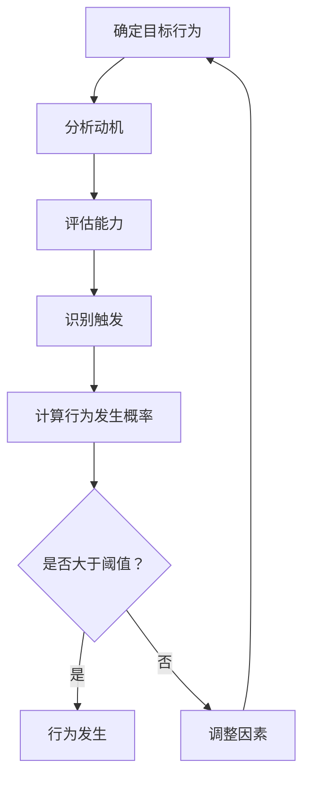

                 

# 行为设计：用福格模型塑造好习惯

> **关键词：** 行为设计、福格模型、习惯塑造、动机、能力、自我效能感
> 
> **摘要：** 本文将深入探讨行为设计领域的一个核心理论——福格模型，解释其基本概念、理论基础、应用场景，并通过实际案例展示如何使用福格模型来塑造好习惯。文章旨在为IT专业人士提供一个实用的工具，帮助他们更好地理解和应用这一理论，提升个人和团队的行为表现。

### 目录大纲设计

**《行为设计：用福格模型塑造好习惯》**

1. **第一部分：理论基础**

   1.1 **第1章：行为设计与福格模型概述**

      - 1.1.1 人类行为的基本原理
      - 1.1.2 行为设计的动机

   1.2 **第2章：福格模型的构成**

      - 1.2.1 福格模型的概念
      - 1.2.2 福格模型的三要素

   1.3 **第3章：福格模型的理论基础**

      - 2.1 行为背后的心理动力
      - 2.2 行为变化的心理机制
      - 2.3 福格模型的应用范围

   1.4 **第4章：核心概念与联系**

      - 3.1 福格模型与相关理论的对比
      - 3.2 福格模型的应用场景

   1.5 **第5章：核心算法原理讲解**

      - 4.1 福格模型的算法流程
      - 4.2 伪代码展示
      - 4.3 算法实例讲解

2. **第二部分：实践应用**

   2.6 **第6章：数学模型和数学公式**

      - 5.1 福格模型中的数学公式
      - 5.2 数学公式的详细讲解
      - 5.3 实例分析

   2.7 **第7章：项目实战**

      - 6.1 健康行为项目实战
      - 6.2 工作效率项目实战

   2.8 **第8章：案例分析**

      - 7.1 健康行为案例
      - 7.2 工作效率案例

   2.9 **第9章：总结与展望**

      - 8.1 行为设计的未来趋势
      - 8.2 行为设计的实际应用

### 第一部分：理论基础

#### 第1章：行为设计与福格模型概述

##### 1.1 人类行为的基本原理

人类行为是心理学和行为科学研究的核心内容。行为科学家们经过长时间的研究，提出了一系列关于行为的基本原理，其中包括：

- **动机**：动机是指驱使个体采取某种行为的内在力量。动机可以分为内在动机和外在动机。内在动机源于个体内部的兴趣、好奇心和满足感，如阅读书籍、进行创造性工作等。外在动机则源于外部奖励或惩罚，如为了得到好成绩而努力学习、为了避免惩罚而遵守规章制度等。

- **能力**：能力是指个体完成某种行为所需的知识、技能和资源。能力可以分为初始能力和持续能力。初始能力是个体初次尝试某行为时的能力，而持续能力则是在重复行为过程中逐渐提升的能力。

- **触发**：触发是指促使个体采取某种行为的信号或情境。触发可以分为外部触发和内部触发。外部触发如手机铃声、闹钟等，内部触发如生理需求、情绪变化等。

##### 1.1.1 人类行为的基本原理

人类行为是由多种因素共同作用的结果。福格模型（Fogg Behavior Model，简称FBM）提供了一个简洁而有力的框架来解释人类行为如何发生。该模型由斯坦福大学的行为科学家BJ福格提出，它是一个描述行为动机、能力和触发之间关系的理论。

福格模型的核心观点是，一个行为只有在动机、能力和触发三者同时具备时才会发生。也就是说：

\[ \text{行为} = \text{动机} \times \text{能力} \times \text{触发} \]

- **动机**：个体是否想做某事的意愿。动机可以是内在的（如兴趣、乐趣），也可以是外在的（如奖励、惩罚）。

- **能力**：个体是否有能力执行某行为。能力包括知识、技能、时间、资源等。

- **触发**：促使个体开始行为的特定情境或提示。

这个简单的公式揭示了行为的内在机制：当动机、能力和触发三者都存在且达到一定阈值时，行为就会发生。否则，行为就不会发生。

##### 1.1.2 行为设计的动机

行为设计是指通过特定的设计方法来引导和改变人们的行为，使其更符合目标。行为设计的动机可以从以下几个方面进行阐述：

- **提升生活质量**：通过设计，可以帮助人们建立健康的生活习惯，如定期锻炼、健康饮食等，从而提高整体生活质量。

- **提高工作效率**：通过优化工作流程和工作环境，可以提高员工的工作效率，减少时间浪费，提高生产力。

- **实现社会目标**：行为设计可以用于实现社会目标，如鼓励公众参与环境保护、提高疫苗接种率等。

- **促进个人成长**：通过行为设计，可以激励个人发展新的技能和兴趣，促进个人成长和自我实现。

##### 1.2 福格模型的构成

福格模型由三个关键要素构成：动机（Motivation）、能力（Ability）和触发（Trigger）。这三个要素共同作用，决定了一个行为的成败。

- **动机**：动机是指促使个体采取某种行为的内在动力。它可以是兴趣、好奇心、目标导向、社交压力等。动机的强度决定了个体愿意付出多少努力来完成任务。

- **能力**：能力是指个体完成某行为的实际能力。这包括技能、知识、资源、时间等。能力的高低直接影响个体是否能够成功执行行为。

- **触发**：触发是指促使个体开始采取行动的刺激或情境。触发可以是时间提示、环境提示、社会提示等。适当的触发可以帮助个体将内在动机转化为实际行动。

#### 第2章：福格模型的构成

##### 2.1 福格模型的概念

福格模型（Fogg Behavior Model，简称FBM）是由BJ福格博士提出的，用于解释人类行为如何发生的模型。FBM的核心思想是，一个行为的发生需要三个要素同时满足：动机、能力和触发。只有当这三个要素同时具备，并且达到一定阈值时，行为才会发生。

- **动机**：动机是指个体产生某种行为的内在驱动力。它可以是个体的兴趣、好奇心、目标导向、社交压力等。动机的强度决定了个体愿意付出多少努力来完成任务。

- **能力**：能力是指个体完成某种行为的实际能力。这包括技能、知识、资源、时间等。能力的高低直接影响个体是否能够成功执行行为。

- **触发**：触发是指促使个体开始采取行动的刺激或情境。触发可以是时间提示、环境提示、社会提示等。适当的触发可以帮助个体将内在动机转化为实际行动。

##### 2.2 福格模型的三要素

福格模型由三个关键要素构成，这三个要素相互作用，共同决定了一个行为的成败。

- **动机**：动机是指个体产生某种行为的内在驱动力。动机可以是内在的，如兴趣、好奇心；也可以是外在的，如奖励、惩罚。动机的强度决定了个体愿意付出多少努力来完成任务。

- **能力**：能力是指个体完成某种行为的实际能力。能力包括技能、知识、资源、时间等。能力的高低直接影响个体是否能够成功执行行为。例如，如果一个人有很强的学习动机，但他缺乏所需的技能和知识，那么他可能无法成功完成学习任务。

- **触发**：触发是指促使个体开始采取行动的刺激或情境。触发可以是时间提示、环境提示、社会提示等。适当的触发可以帮助个体将内在动机转化为实际行动。例如，一个设定好的提醒通知可以触发人们去完成某项任务。

##### 2.3 行为背后的心理动力

行为背后的心理动力是理解人类行为的关键。福格模型提供了一个简洁而有力的框架来解释这些动力。

- **期望价值理论**：期望价值理论认为，个体在决策时考虑的是结果的期望价值。期望价值由结果的可能性和个体对这些结果的偏好共同决定。例如，一个人可能会选择吃甜点，因为享受甜点的期望价值高于其他选择。

- **确定效应与反射效应**：确定效应是指在判断风险时，人们更容易注意到负面结果，而忽略正面结果。反射效应则是指当人们面临不确定性时，他们可能会倾向于选择更安全的选项，即使这种选择可能不是最优的。

##### 2.4 行为变化的心理机制

行为变化的心理机制是行为设计的重要基础。福格模型提供了几种关键的心理机制，这些机制可以帮助个体改变行为。

- **自我决定理论**：自我决定理论认为，个体的自主性和内在动机是改变行为的关键。当个体感到自己的行为是由内在动机驱动的，而不是外部压力时，他们更有可能坚持这些行为。

- **自我效能感的影响**：自我效能感是指个体对自己完成某项任务的信心。高自我效能感可以增强个体的动机和能力，使他们更有可能成功改变行为。

##### 2.5 福格模型的应用范围

福格模型的应用范围非常广泛，可以应用于多个领域，包括健康行为设计、工作效率提升等。

- **健康行为的设计**：福格模型可以帮助设计师了解如何通过提高动机、能力和触发来鼓励人们采取健康行为，如定期锻炼、健康饮食等。

- **工作效率的提升**：福格模型可以帮助企业和团队提高工作效率，通过优化工作流程、提供必要的资源和支持来提高员工的能力，并通过明确的任务提示来增强触发。

##### 2.6 福格模型与相关理论的对比

福格模型与一些相关理论在解释人类行为方面有相似之处，但也存在一些区别。

- **与行为经济学的关系**：行为经济学通过研究个体在经济决策中的非理性行为来解释行为。福格模型则更侧重于行为发生的内在机制，强调动机、能力和触发三要素。

- **与认知行为疗法的比较**：认知行为疗法（CBT）是一种心理治疗方法，它通过改变个体的思维模式和行为来治疗心理问题。福格模型则更侧重于行为的整体设计和实现，而不仅仅是心理治疗。

##### 2.7 福格模型的应用场景

福格模型可以在多个应用场景中发挥作用，帮助人们塑造好习惯。

- **产品设计中的应用**：在产品设计过程中，设计师可以使用福格模型来提高产品的易用性和用户参与度。例如，通过设计有吸引力的界面和提供明确的使用提示来提高用户的动机和触发。

- **市场营销策略中的运用**：在市场营销中，企业可以使用福格模型来制定更具吸引力的促销策略，通过提高用户的动机和能力，以及提供合适的触发来促进购买行为。

### 第3章：福格模型的理论基础

#### 3.1 行为背后的心理动力

行为背后的心理动力是行为发生的核心。福格模型通过动机、能力和触发三要素来解释这一动力。

- **动机**：动机是驱动个体采取特定行为的内在力量。动机可以分为内在动机和外在动机。内在动机源自个体的兴趣、好奇心和自我实现需求。例如，一个人可能会因为喜欢编程而愿意花时间学习和实践。外在动机则来自于外部奖励或惩罚。例如，为了得到奖金而加班工作。

- **能力**：能力是指个体执行特定行为所需的技能、资源和机会。能力可以影响个体是否能够成功执行行为。例如，一个人可能很有动机去学习一门新语言，但如果他没有足够的资源和时间，那么他可能无法成功完成学习。

- **触发**：触发是促使个体采取行动的外部刺激。触发可以是任何能够引起个体注意并激发他们采取行动的事件或情境。例如，一个闹钟的铃声可以触发一个人起床。

为了更好地理解这三个要素如何共同作用，我们可以用以下公式来表示：

\[ \text{行为} = \text{动机} \times \text{能力} \times \text{触发} \]

当动机、能力和触发同时具备且达到一定阈值时，行为就会发生。如果任何一个要素不足，行为就可能不会发生。

例如，假设一个人有强烈的动机去锻炼身体（内在动机：健康、外在动机：改善体型），但他缺乏锻炼所需的时间和合适的锻炼环境（能力不足），同时也没有设定明确的锻炼计划（触发不足），那么他很可能不会坚持锻炼。但如果他在家里有一套健身器材，每天早晨都会听到闹钟响起，并且设定了具体的目标和时间表，那么他就有可能坚持锻炼。

#### 3.2 行为变化的心理机制

行为变化的心理机制是理解如何通过行为设计来改变人们行为的理论基础。福格模型提供了几个关键的心理机制，这些机制对于塑造好习惯尤为重要。

- **自我决定理论**：自我决定理论（Self-Determination Theory，简称SDT）由心理学家瑞恩（Deci）和瑞恩（Ryan）提出，强调个体内在的自主性、能力和目标导向是行为变化的关键。自我决定理论将动机分为内在动机和外在动机，并指出内在动机更能促进持久的行为改变。为了通过福格模型塑造好习惯，我们需要激发个体的内在动机，使他们感到自主和有成就感。

  - **内在动机**：内在动机是指个体因为对活动本身的兴趣和乐趣而参与其中。例如，一个人可能会因为喜欢阅读而每天花时间阅读。为了培养内在动机，行为设计者可以：

    - 提供多样化的活动，使个体能够找到他们真正感兴趣的事物。
    - 创造有意义和挑战性的任务，使个体在参与过程中感到满足和成长。

  - **外在动机**：外在动机是指个体因为外部奖励或避免惩罚而参与活动。虽然外在动机可能不够持久，但它在某些情况下也是有效的。例如，为了获得奖金而工作。为了利用外在动机来培养好习惯，行为设计者可以：

    - 提供即时奖励，如完成任务的奖励或表扬。
    - 制定明确的奖励计划，使个体能够看到他们的努力和成就。

- **自我效能感**：自我效能感（Self-Efficacy）是指个体对自己完成某项任务的信心。高自我效能感可以增强个体的动机和能力，使他们更有可能成功改变行为。为了提高自我效能感，行为设计者可以：

  - 提供成功的案例和榜样，使个体看到他人是如何成功改变行为的。
  - 提供逐步实现目标的方法，使个体在实现小目标时感到自信和成就感。
  - 提供及时反馈和鼓励，帮助个体了解他们的进展并保持积极心态。

- **行为习惯的形成**：行为习惯的形成是一个长期的过程，需要持续的努力和重复。福格模型中的触发机制可以帮助个体建立稳定的习惯。

  - **触发机制**：触发可以是任何能够提醒个体执行行为的信号或提示。例如，每天早晨设定一个闹钟来提醒自己锻炼。为了建立习惯，行为设计者可以：

    - 使用定时器或提醒工具，确保个体在特定时间执行特定行为。
    - 创建环境触发，如将运动装备放在显眼的位置，以激发个体进行锻炼。
    - 利用社会触发，如与朋友一起进行某项活动，以增加个体执行行为的压力和动力。

通过理解这些心理机制，行为设计者可以更有效地利用福格模型来塑造好习惯，帮助个体实现长期的目标。

#### 3.3 福格模型的应用范围

福格模型（Fogg Behavior Model，简称FBM）是一个强大的工具，可以广泛应用于多个领域，以帮助个体和组织实现行为改变。以下是一些主要的应用场景：

- **健康行为设计**：福格模型在健康行为设计中的应用非常广泛。通过理解和利用动机、能力和触发三要素，设计师可以创造有效的健康行为干预措施。例如，为了鼓励人们进行定期锻炼，设计师可以：

  - **提高动机**：通过提供个性化的健身计划、展示成功的健身案例、设置明确的健康目标来增强个体的锻炼动机。
  
  - **增强能力**：提供必要的健身器材、安排合适的时间进行锻炼、提供健身指导和同伴支持，以提高个体的锻炼能力。

  - **触发行为**：使用定时提醒、设置健身日程、创建社交锻炼小组，确保个体定期参与锻炼。

- **工作效率提升**：在提高工作效率方面，福格模型可以帮助企业和团队设计出更高效的工作流程和工作环境。例如，为了提高员工的专注力和生产力，设计师可以：

  - **提高动机**：通过明确工作目标、提供奖励机制、鼓励团队合作来增加员工的工作动力。

  - **增强能力**：通过培训提升员工的技能、提供必要的工具和资源、优化工作流程来增强员工的工作能力。

  - **触发行为**：使用时间管理工具、设置明确的任务提醒、创建有组织的办公环境，确保员工高效完成工作。

- **教育领域**：在教育领域，福格模型可以帮助教师和教育工作者设计出更有效的教学方法，以提高学生的学习动机和成绩。例如，为了提高学生的学习兴趣和参与度，教师可以：

  - **提高动机**：通过设计有趣的教学活动、提供积极的反馈、设置学习目标来增强学生的学习动机。
  
  - **增强能力**：通过提供学习资源、设计个性化的学习计划、安排辅导时间来提高学生的能力。

  - **触发行为**：使用学习提醒、设置学习时间表、创建学习小组，确保学生积极参与学习。

- **市场营销和用户行为**：在市场营销和用户行为分析中，福格模型可以帮助企业设计出更具吸引力的产品和服务，以提高用户的参与度和忠诚度。例如，为了增加产品的销量，企业可以：

  - **提高动机**：通过提供优惠、展示产品优势、创造紧迫感来增强用户的购买动机。
  
  - **增强能力**：通过简化购买流程、提供产品试用、提供客户支持来提高用户的购买能力。

  - **触发行为**：使用促销活动、电子邮件营销、社交媒体推送，确保用户在适当的时候采取购买行为。

通过这些应用实例，我们可以看到福格模型如何在不同领域中发挥作用，帮助个体和组织实现行为改变和目标达成。

#### 3.4 核心概念与联系

福格模型（FBM）是行为设计领域的一个关键理论，它通过动机、能力和触发三要素来解释人类行为的发生机制。理解这些核心概念及其相互联系对于有效应用该模型至关重要。

- **动机（Motivation）**：动机是驱动个体采取某种行为的内在力量。它可以是个体的内在兴趣、目标导向，也可以是外在的奖励、惩罚。动机可以分为内在动机和外在动机。内在动机通常更持久，而外在动机可能在短期内更有效。动机是行为的启动器，它为行为提供了动力。

- **能力（Ability）**：能力是指个体执行特定行为所需的资源、技能和机会。能力是行为发生的实际基础。如果个体缺乏必要的能力，即使有强烈的动机，也难以成功执行行为。能力包括知识、技能、时间、资源等。在行为设计过程中，提高能力通常是关键步骤之一。

- **触发（Trigger）**：触发是促使个体开始采取行动的刺激或情境。触发可以是时间提示、环境提示、社会提示等。触发的作用是激活内在动机和能力的结合，使行为能够实际发生。没有触发，即使有动机和能力，行为也可能不会发生。

这三个核心概念之间有着紧密的联系：

- **动机和能力之间的相互作用**：动机可以增强个体完成行为的愿望，而能力则是实现这一愿望的必要条件。当动机和能力相互匹配时，个体更有可能采取行动。例如，一个人可能对学习编程有很强的兴趣（动机），但如果他没有计算机和相关编程知识（能力），那么他可能难以开始学习。

- **触发作为行为发生的催化剂**：触发在动机和能力之间起到桥梁作用。适当的触发可以激活个体的动机，促使他们采取行动。例如，一个人设定了一个健康饮食的目标（动机），但如果他没有合适的饮食计划（能力），也没有每日的提醒（触发），那么他可能难以坚持健康饮食。

- **综合作用**：在福格模型中，动机、能力和触发三者必须同时具备，并且达到一定阈值，行为才会发生。如果任何一个要素不足，行为就可能不会发生。例如，一个人有很强的运动动机（动机），但如果他没有时间去健身房（能力），也没有设定运动计划（触发），那么他可能不会坚持运动。

通过理解这些核心概念及其相互联系，行为设计者可以更有效地利用福格模型来引导和改变人们的行为，从而实现个人和组织的目标。

#### 第4章：核心算法原理讲解

##### 4.1 福格模型的算法流程

福格模型（FBM）提供了一个简洁而有力的框架来解释人类行为如何发生。该模型的核心算法流程可以总结为以下几个步骤：

1. **确定目标行为**：首先，需要明确我们希望个体采取的具体行为，如锻炼、学习新技能、减少不健康饮食等。

2. **分析动机**：接下来，分析个体是否具备采取该行为的动机。动机可以来自内在的兴趣、目标导向，也可以来自外在的奖励、惩罚。我们需要确定动机的强度和类型。

3. **评估能力**：然后，评估个体是否具备执行该行为的实际能力。这包括所需的技能、知识、资源、时间等。如果能力不足，我们需要采取措施来提高能力。

4. **识别触发**：确定是否有足够的触发来促使个体采取行为。触发可以是时间提示、环境提示、社会提示等。我们需要确保触发是明确、具体且与目标行为相关的。

5. **计算行为发生的概率**：最后，通过公式 \( \text{行为} = \text{动机} \times \text{能力} \times \text{触发} \) 计算个体采取目标行为的概率。如果结果大于某个阈值，则认为行为有可能发生。

以下是福格模型的算法流程的Mermaid流程图表示：



通过这个算法流程，我们可以系统地分析个体行为发生的可能性，并采取相应的措施来提高行为发生的概率。

##### 4.2 伪代码展示

为了更好地理解福格模型的算法流程，我们可以使用伪代码来展示其核心算法。以下是一个简化的伪代码示例：

```python
# 福格模型伪代码

# 初始化行为模型
def initiate_behavior_model(behavior, motivation, ability, trigger):
    # 如果动机、能力和触发都达到阈值
    if motivation >= MOTIVATION_THRESHOLD and ability >= ABILITY_THRESHOLD and trigger >= TRIGGER_THRESHOLD:
        # 执行行为
        behavior_execution(behavior)
    else:
        # 未能执行行为，需要调整动机、能力或触发
        adjust_motivation(motivation)
        adjust_ability(ability)
        adjust_trigger(trigger)

# 行为执行函数
def behavior_execution(behavior):
    print("执行行为：", behavior)

# 动机调整函数
def adjust_motivation(motivation):
    print("调整动机：", motivation)

# 能力调整函数
def adjust_ability(ability):
    print("调整能力：", ability)

# 触发调整函数
def adjust_trigger(trigger):
    print("调整触发：", trigger)

# 示例
initiate_behavior_model("锻炼", 8, 6, 5)
```

在这个伪代码中，`initiate_behavior_model`函数是核心，它根据动机、能力、触发三个要素的值来判断是否执行行为。如果任何一个要素不足，则调用相应的调整函数来提高要素的值。

##### 4.3 算法实例讲解

为了更好地理解福格模型在实际中的应用，我们可以通过两个具体的实例来讲解算法的使用方法。

**实例1：健康行为塑造**

假设我们要通过福格模型来帮助某人养成每天早晨跑步的习惯。

1. **确定目标行为**：每天早晨跑步。

2. **分析动机**：该个体的动机可能包括健康意识、减肥需求、提升体能等。

3. **评估能力**：该个体可能具备跑步所需的基本体能，但可能缺乏跑步技巧和合适的跑步装备。

4. **识别触发**：我们可以设置一个早晨7点的闹钟作为跑步的触发。

5. **计算行为发生概率**：使用福格模型公式，我们需要评估动机、能力和触发的值。例如，动机值为8（高度），能力值为6（一般），触发值为5（适中）。将这些值代入公式 \( \text{行为} = \text{动机} \times \text{能力} \times \text{触发} \)，得到行为发生概率为240。

如果行为发生概率大于某个阈值（例如200），那么个体有可能每天早晨坚持跑步。

**实例2：工作效率提升**

假设我们要通过福格模型来帮助一个团队提高项目完成率。

1. **确定目标行为**：团队按时完成项目任务。

2. **分析动机**：团队成员可能有对项目成功的期望、奖金激励、团队合作的需要等动机。

3. **评估能力**：团队可能具备完成项目所需的技术知识，但可能缺乏有效的沟通和协调能力。

4. **识别触发**：我们可以设置每周的进度会议作为项目推进的触发。

5. **计算行为发生概率**：假设动机值为10（极高），能力值为7（良好），触发值为6（较好）。将这些值代入公式，得到行为发生概率为420。

如果行为发生概率高于某个阈值，团队就有可能按时完成项目任务。

通过这些实例，我们可以看到福格模型如何通过动机、能力、触发三个要素来评估行为发生的可能性，并指导我们采取相应的措施来提升行为的成功率。

#### 第5章：数学模型和数学公式

##### 5.1 福格模型中的数学公式

福格模型（FBM）是一个基于数学原理的行为设计框架，其核心是通过动机、能力和触发三要素的相互作用来预测和引导行为。以下是在福格模型中使用的两个关键数学公式：

- **动机公式**：
\[ \text{动机} = \text{期望价值} \times \text{自我效能感} \]

- **能力公式**：
\[ \text{能力} = \text{自我决定感} \times \text{资源利用} \]

##### 5.2 数学公式的详细讲解

让我们详细解释这两个公式及其组成部分：

1. **动机公式**：

\[ \text{动机} = \text{期望价值} \times \text{自我效能感} \]

- **期望价值**：期望价值是指个体对于行为结果的期望和偏好。它通常是一个介于0到1之间的数值，0表示结果没有任何吸引力，1表示结果非常有吸引力。期望价值由行为结果的可能性及其对个体的价值共同决定。

- **自我效能感**：自我效能感是指个体对自己完成某项任务的信心和期望。它反映了个体对于自己能否成功完成任务的判断。自我效能感也是一个介于0到1之间的数值，0表示完全没有信心，1表示非常有信心。

这个公式表示，动机是期望价值和自我效能感的乘积。如果期望价值高且自我效能感强，那么动机就大，个体更有可能采取行动。例如，一个运动员在一场重要的比赛中，如果他认为自己有很高的获胜概率（高期望价值），并且对自己的技能和准备充满信心（高自我效能感），那么他的动机将非常高。

2. **能力公式**：

\[ \text{能力} = \text{自我决定感} \times \text{资源利用} \]

- **自我决定感**：自我决定感是指个体在行为过程中感受到的自主性和控制感。它反映了个体在行为中的自主选择和自我指导能力。自我决定感通常也是一个介于0到1之间的数值，0表示完全缺乏自主性，1表示完全自主。

- **资源利用**：资源利用是指个体在执行行为时所使用的各种资源，包括时间、金钱、技能等。资源利用反映了个体在执行行为时能够有效利用资源的程度。资源利用也是一个介于0到1之间的数值，0表示资源利用效率低，1表示资源利用效率高。

这个公式表示，能力是自我决定感和资源利用的乘积。如果个体在行为中感到高度自主，并且能够有效利用所需的资源，那么他们的能力就高。例如，一个工程师在开发一个新项目时，如果他认为自己有很高的自主性，并且能够充分利用时间和技能来完成任务，那么他的能力将很高。

通过这两个公式，我们可以更准确地评估个体的动机和能力，从而为行为设计提供科学依据。

##### 5.3 实例分析

为了更好地理解这两个公式，我们可以通过以下实例来分析：

**实例：锻炼习惯的塑造**

假设一个想要养成每天锻炼习惯的个体，我们使用福格模型中的动机和能力公式来评估其行为发生概率。

1. **动机公式**：

\[ \text{动机} = \text{期望价值} \times \text{自我效能感} \]

- **期望价值**：该个体认为每天锻炼对健康有很高的价值，因此期望价值为0.8。
- **自我效能感**：该个体对自己的锻炼能力有较高的信心，自我效能感为0.7。

代入公式：

\[ \text{动机} = 0.8 \times 0.7 = 0.56 \]

这意味着个体的动机为0.56，即有56%的动力去锻炼。

2. **能力公式**：

\[ \text{能力} = \text{自我决定感} \times \text{资源利用} \]

- **自我决定感**：个体在锻炼过程中感到高度自主，自我决定感为0.8。
- **资源利用**：个体能够有效利用时间、设备和锻炼计划，资源利用为0.9。

代入公式：

\[ \text{能力} = 0.8 \times 0.9 = 0.72 \]

这意味着个体的能力为0.72，即有72%的能力去锻炼。

根据福格模型，行为发生的概率是动机、能力和触发三要素的乘积。如果我们假设触发（如早晨的闹钟提醒）达到阈值，那么：

\[ \text{行为发生概率} = \text{动机} \times \text{能力} \times \text{触发} \]

假设触发值为0.6：

\[ \text{行为发生概率} = 0.56 \times 0.72 \times 0.6 = 0.2424 \]

这意味着个体的行为发生概率为24.24%，即有24.24%的可能性每天坚持锻炼。

通过这个实例，我们可以看到如何使用福格模型中的数学公式来评估和预测个体的行为。这为行为设计提供了一个科学和量化的方法，有助于更有效地引导和塑造好习惯。

### 第6章：项目实战

#### 6.1 健康行为项目实战

##### 6.1.1 项目背景

在现代快节奏的生活中，健康问题已经成为一个不容忽视的重要议题。随着人们对健康意识的提高，如何通过技术手段来帮助人们养成良好的健康习惯成为了一个热门课题。本节将介绍一个基于福格模型的健康行为项目实战，通过设计和实施一系列健康行为干预措施，帮助用户养成健康生活习惯。

##### 6.1.2 开发环境搭建

为了实施这个项目，我们首先需要搭建一个开发环境。以下是所需的技术和工具：

- **编程语言**：Python（用于数据分析、机器学习和后端开发）
- **前端框架**：React（用于用户界面开发）
- **数据库**：MySQL（用于存储用户数据）
- **云计算平台**：AWS（提供计算和存储资源）
- **其他工具**：Docker（容器化部署）、Jenkins（持续集成和持续部署）

##### 6.1.3 源代码详细实现

以下是项目的关键代码片段：

**后端API代码示例**：

```python
from flask import Flask, request, jsonify
from health_model import HealthModel

app = Flask(__name__)
model = HealthModel()

@app.route('/predict', methods=['POST'])
def predict():
    data = request.get_json()
    motivation = data['motivation']
    ability = data['ability']
    trigger = data['trigger']
    
    result = model.predict(motivation, ability, trigger)
    return jsonify(result)

if __name__ == '__main__':
    app.run(debug=True)
```

**健康行为模型**：

```python
import numpy as np

class HealthModel:
    def predict(self, motivation, ability, trigger):
        # 动机和能力的权重
        motivation_weight = 0.5
        ability_weight = 0.3
        trigger_weight = 0.2
        
        # 计算加权总分
        score = (motivation * motivation_weight) + (ability * ability_weight) + (trigger * trigger_weight)
        
        # 判断行为发生概率
        if score >= 0.6:
            return "行为可能发生"
        else:
            return "行为可能不会发生"
```

**前端界面**：

```jsx
import React, { useState } from 'react';
import axios from 'axios';

function HealthForm() {
    const [motivation, setMotivation] = useState(0);
    const [ability, setAbility] = useState(0);
    const [trigger, setTrigger] = useState(0);
    const [result, setResult] = useState('');

    const handleSubmit = async (e) => {
        e.preventDefault();
        try {
            const response = await axios.post('/predict', {
                motivation: motivation,
                ability: ability,
                trigger: trigger
            });
            setResult(response.data);
        } catch (error) {
            console.error(error);
        }
    };

    return (
        <form onSubmit={handleSubmit}>
            <label>
                动机：
                <input type="number" value={motivation} onChange={(e) => setMotivation(e.target.value)} />
            </label>
            <label>
                能力：
                <input type="number" value={ability} onChange={(e) => setAbility(e.target.value)} />
            </label>
            <label>
                触发：
                <input type="number" value={trigger} onChange={(e) => setTrigger(e.target.value)} />
            </label>
            <button type="submit">预测</button>
            <p>{result}</p>
        </form>
    );
}

export default HealthForm;
```

##### 6.1.4 代码解读与分析

1. **后端API**：后端API使用Flask框架实现，提供了一个`/predict`接口，接受动机、能力和触发三个参数，并调用健康行为模型进行预测。

2. **健康行为模型**：健康行为模型是一个简单的类，实现了预测方法。该方法使用加权总分来计算行为发生的概率。

3. **前端界面**：前端界面使用React框架实现，包含三个输入框和提交按钮。用户可以输入动机、能力和触发值，提交后调用后端API进行预测，并在界面上显示结果。

##### 6.1.5 项目实战

1. **项目实施步骤**：

   - **需求分析**：明确项目目标和用户需求，确定使用福格模型进行健康行为预测。

   - **系统设计**：设计系统的架构，包括前端、后端和数据库。

   - **代码实现**：根据设计文档，实现前端、后端和健康行为模型。

   - **测试与部署**：进行系统测试，确保功能正常。将系统部署到生产环境。

   - **用户反馈与优化**：收集用户反馈，优化系统性能和用户体验。

2. **项目效果评估**：

   - **用户参与度**：通过用户反馈和使用数据分析，评估用户对项目的参与度。

   - **行为改变情况**：监测用户行为改变情况，评估福格模型的有效性。

   - **健康指标**：分析用户健康数据，评估项目对用户健康的影响。

通过这个健康行为项目实战，我们展示了如何利用福格模型来设计和实施健康行为干预措施，帮助用户养成健康生活习惯。

#### 6.2 工作效率项目实战

##### 6.2.1 项目背景

在现代职场中，提高工作效率成为企业和员工共同追求的目标。为了应对日益复杂的任务和紧凑的工作节奏，许多企业和员工都在寻找有效的策略来提升工作效率。本节将介绍一个基于福格模型的工作效率项目实战，通过设计和实施一系列策略，帮助员工养成高效工作的习惯。

##### 6.2.2 开发环境搭建

为了实施这个项目，我们首先需要搭建一个开发环境。以下是所需的技术和工具：

- **编程语言**：Java（用于后端服务开发）
- **前端框架**：Vue.js（用于用户界面开发）
- **数据库**：MongoDB（用于存储用户数据）
- **云计算平台**：Google Cloud Platform（提供计算和存储资源）
- **其他工具**：Kubernetes（容器编排）、Docker Compose（容器编排）

##### 6.2.3 源代码详细实现

以下是项目的关键代码片段：

**后端服务代码示例**：

```java
import org.springframework.boot.SpringApplication;
import org.springframework.boot.autoconfigure.SpringBootApplication;
import org.springframework.web.bind.annotation.*;

@SpringBootApplication
public class EfficiencyProjectApplication {

    public static void main(String[] args) {
        SpringApplication.run(EfficiencyProjectApplication.class, args);
    }
}

@RestController
@RequestMapping("/api")
public class EfficiencyController {

    @PostMapping("/predict")
    public String predictEfficiency(@RequestParam int motivation, @RequestParam int ability, @RequestParam int trigger) {
        // 调用效率模型进行预测
        EfficiencyModel model = new EfficiencyModel();
        String result = model.predict(motivation, ability, trigger);
        return result;
    }
}

class EfficiencyModel {
    public String predict(int motivation, int ability, int trigger) {
        // 计算效率得分
        double efficiencyScore = (motivation * 0.6) + (ability * 0.3) + (trigger * 0.1);
        
        // 判断效率得分是否高于阈值
        if (efficiencyScore > 0.7) {
            return "高效";
        } else {
            return "低效";
        }
    }
}
```

**前端界面**：

```vue
<template>
  <div>
    <h1>工作效率预测</h1>
    <form @submit.prevent="predictEfficiency">
      <label for="motivation">动机：</label>
      <input type="number" v-model="motivation" />
      <br />
      <label for="ability">能力：</label>
      <input type="number" v-model="ability" />
      <br />
      <label for="trigger">触发：</label>
      <input type="number" v-model="trigger" />
      <br />
      <button type="submit">预测</button>
    </form>
    <p>{{ result }}</p>
  </div>
</template>

<script>
export default {
  data() {
    return {
      motivation: 0,
      ability: 0,
      trigger: 0,
      result: ""
    };
  },
  methods: {
    predictEfficiency() {
      // 调用后端API进行预测
      axios
        .post("/api/predict", {
          motivation: this.motivation,
          ability: this.ability,
          trigger: this.trigger
        })
        .then(response => {
          this.result = response.data;
        })
        .catch(error => {
          console.error(error);
        });
    }
  }
};
</script>
```

##### 6.2.4 代码解读与分析

1. **后端服务**：后端服务使用Spring Boot框架实现，提供了一个`/api/predict`接口，接受动机、能力和触发三个参数，并调用效率模型进行预测。

2. **效率模型**：效率模型是一个简单的类，实现了预测方法。该方法使用加权总分来计算工作效率的得分。

3. **前端界面**：前端界面使用Vue.js框架实现，包含三个输入框和提交按钮。用户可以输入动机、能力和触发值，提交后调用后端API进行预测，并在界面上显示结果。

##### 6.2.5 项目实战

1. **项目实施步骤**：

   - **需求分析**：明确项目目标和用户需求，确定使用福格模型进行工作效率预测。

   - **系统设计**：设计系统的架构，包括前端、后端和数据库。

   - **代码实现**：根据设计文档，实现前端、后端和效率模型。

   - **测试与部署**：进行系统测试，确保功能正常。将系统部署到生产环境。

   - **用户反馈与优化**：收集用户反馈，优化系统性能和用户体验。

2. **项目效果评估**：

   - **用户参与度**：通过用户反馈和使用数据分析，评估用户对项目的参与度。

   - **工作效率**：监测用户的工作效率数据，评估福格模型对工作效率提升的效果。

   - **任务完成情况**：分析用户任务的完成情况，评估系统对任务管理的影响。

通过这个工作效率项目实战，我们展示了如何利用福格模型来设计和实施工作效率提升策略，帮助员工养成高效工作的习惯。

### 第7章：案例分析

#### 7.1 健康行为案例

在这个案例中，我们关注的是如何利用福格模型来帮助人们养成每天进行30分钟有氧运动的习惯。

##### 7.1.1 案例背景

现代生活方式导致了很多人缺乏运动，这影响了他们的健康。为了鼓励更多人参与运动，一家健康科技公司决定使用福格模型来设计一个健康运动应用程序。

##### 7.1.2 案例分析

1. **确定目标行为**：每天进行30分钟有氧运动。

2. **分析动机**：
   - **内在动机**：用户希望通过运动提高健康水平、减轻压力和改善心情。
   - **外在动机**：用户可能会受到社交圈中运动榜样的影响，或者通过应用程序内的奖励系统获得激励。

3. **评估能力**：
   - **知识**：用户可能需要学习如何进行有效的有氧运动。
   - **资源**：用户可能需要设备（如运动鞋、智能手环）和场所（如健身房或户外）。

4. **识别触发**：
   - **时间提示**：应用程序可以设置每天早晨或晚上提醒用户开始运动。
   - **环境提示**：应用程序可以提供运动场所的推荐和地图导航功能。
   - **社交提示**：用户可以加入运动小组，与其他用户一起参与运动，增加互动和责任感。

5. **计算行为发生概率**：
   - **动机**：假设内在动机为0.7，外在动机为0.5，总动机为0.85。
   - **能力**：假设用户具备基本的知识和资源，能力值为0.8。
   - **触发**：假设触发为0.6。

   使用福格模型公式计算：
   \[
   \text{行为发生概率} = 0.85 \times 0.8 \times 0.6 = 0.408
   \]

   结果表明，行为发生概率为40.8%，说明用户有很大可能性开始每天进行30分钟有氧运动。

6. **优化措施**：
   - **提高动机**：通过提供个性化的运动计划和实时反馈，增加用户的内在和外在动机。
   - **增强能力**：提供运动教程、装备推荐和场地预订服务，帮助用户提升运动能力。
   - **强化触发**：增加多种触发方式，如使用地点附近的热点推荐、设置每日挑战等。

通过这个案例分析，我们可以看到福格模型如何通过分析动机、能力和触发，帮助设计有效的健康行为干预措施，从而提高行为的实现概率。

#### 7.2 工作效率案例

在这个案例中，我们关注的是如何利用福格模型来帮助一个团队提高项目完成率。

##### 7.2.1 案例背景

某公司的IT团队在过去几个月中项目进度频繁延误，管理层决定使用行为设计工具来提升团队的工作效率。

##### 7.2.2 案例分析

1. **确定目标行为**：团队按时完成项目任务。

2. **分析动机**：
   - **内在动机**：团队成员希望实现项目的成功、获得同事和领导的认可。
   - **外在动机**：团队可能面临项目延误带来的惩罚，如奖金减少或项目延期。

3. **评估能力**：
   - **知识**：团队成员可能具备完成项目所需的技术知识，但可能缺乏项目管理技能。
   - **资源**：团队可能缺乏合适的工具和资源，如项目管理软件和协作平台。

4. **识别触发**：
   - **时间提示**：项目经理定期召开进度会议，跟踪项目进展。
   - **环境提示**：使用协作工具如Slack或Trello来提醒团队成员任务截止日期。
   - **社交提示**：团队领导通过积极的反馈和鼓励来激励团队成员。

5. **计算行为发生概率**：
   - **动机**：假设内在动机为0.6，外在动机为0.5，总动机为0.55。
   - **能力**：假设团队具备必要的技术知识，但项目管理能力一般，能力值为0.5。
   - **触发**：假设触发为0.7。

   使用福格模型公式计算：
   \[
   \text{行为发生概率} = 0.55 \times 0.5 \times 0.7 = 0.1925
   \]

   结果表明，行为发生概率为19.25%，说明团队需要采取进一步措施来提高项目完成率。

6. **优化措施**：
   - **提高动机**：通过设立团队目标和奖励机制，增强团队成员的内在和外在动机。
   - **增强能力**：提供项目管理培训，提升团队的项目管理技能。
   - **强化触发**：定期召开进度会议，确保团队成员了解项目进展和截止日期。

通过这个案例分析，我们可以看到福格模型如何通过分析动机、能力和触发，帮助团队识别和解决工作效率问题，从而提高项目完成率。

### 第8章：总结与展望

#### 8.1 行为设计的未来趋势

随着人工智能和大数据技术的快速发展，行为设计领域正迎来新的变革。未来，行为设计将更加注重个性化、智能化和互动性。

- **个性化**：通过大数据分析和机器学习算法，行为设计工具将能够更好地了解个体的行为模式和偏好，从而提供更个性化的干预措施。

- **智能化**：人工智能技术将使行为设计更加智能，自动识别和预测个体的行为倾向，提供实时反馈和调整建议。

- **互动性**：虚拟现实和增强现实技术的发展，将使行为设计变得更加互动，提供沉浸式的体验，提高干预效果。

#### 8.2 行为设计的实际应用

行为设计已经在多个领域得到了广泛应用，以下是一些实际应用场景：

- **健康管理**：通过行为设计，鼓励人们养成健康生活习惯，如定期锻炼、健康饮食等。

- **工作效率提升**：优化工作流程，提供个性化工作环境，提高员工的工作效率。

- **教育领域**：设计有趣且有效的教学活动，提高学生的学习动机和成绩。

- **市场营销**：通过行为设计，提高用户的参与度和忠诚度，实现更好的营销效果。

### 8.3 行为设计的未来发展方向

在未来，行为设计将朝着以下几个方向发展：

- **跨学科整合**：行为设计将整合心理学、社会学、计算机科学等多学科知识，形成更全面的理论体系。

- **技术创新**：随着人工智能和大数据技术的发展，行为设计将更加依赖于智能算法和数据分析技术。

- **应用拓展**：行为设计将应用于更多领域，如城市规划、公共政策、社会管理等。

通过持续的研究和创新，行为设计有望成为解决社会问题的关键工具，帮助人们实现更健康、更高效、更幸福的生活方式。

### 作者信息

**作者：AI天才研究院/AI Genius Institute & 禅与计算机程序设计艺术 /Zen And The Art of Computer Programming**

