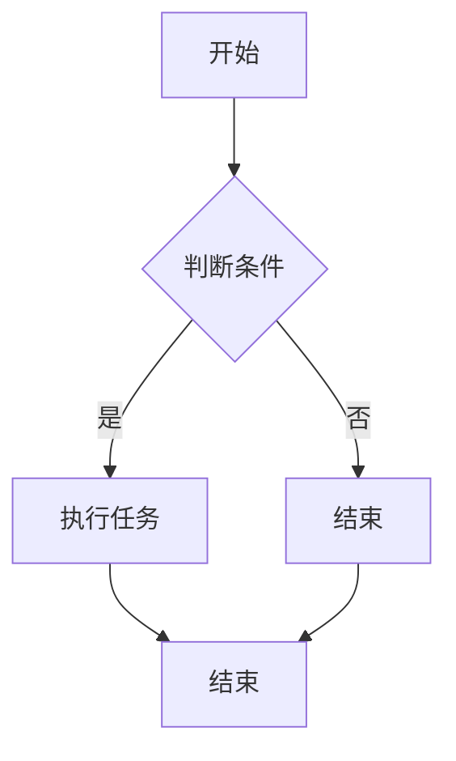

                 

# 计算机视觉在自动质检中的实现

## 关键词
计算机视觉、自动质检、深度学习、图像处理、缺陷检测

## 摘要
本文旨在探讨计算机视觉在自动质检中的应用，分析其技术原理、实现方法和实际案例。首先，我们将回顾计算机视觉的基础知识，包括图像处理和特征提取；接着，深入讨论深度学习在计算机视觉中的应用，特别是卷积神经网络和生成对抗网络；然后，我们将具体分析计算机视觉在自动质检中的应用，如产品缺陷检测和质量评分；最后，通过几个实际案例，展示深度学习在自动质检中的具体实现和效果，并讨论未来发展趋势。

## 目录大纲

### 第一部分：计算机视觉基础

#### 第1章：计算机视觉概述

##### 1.1 计算机视觉的定义与历史

##### 1.2 计算机视觉的应用领域

##### 1.3 计算机视觉的技术体系

#### 第2章：图像处理基础

##### 2.1 图像表示与建模

##### 2.2 图像滤波与增强

##### 2.3 颜色空间转换与处理

##### 2.4 边缘检测与形态学操作

#### 第3章：特征提取与描述

##### 3.1 角点检测与特征描述

##### 3.2 SIFT与SURF算法原理

##### 3.3 Haar-like特征与HOG描述

### 第二部分：深度学习与计算机视觉

#### 第4章：卷积神经网络基础

##### 4.1 卷积神经网络原理

##### 4.2 卷积操作的数学基础

##### 4.3 池化操作与反卷积操作

#### 第5章：深度学习在计算机视觉中的应用

##### 5.1 卷积神经网络在图像分类中的应用

##### 5.2 卷积神经网络在目标检测中的应用

##### 5.3 深度学习在图像分割中的应用

#### 第6章：生成对抗网络

##### 6.1 生成对抗网络原理

##### 6.2 生成对抗网络在图像生成中的应用

### 第三部分：计算机视觉在自动质检中的应用

#### 第7章：自动质检概述

##### 7.1 自动质检的定义与意义

##### 7.2 自动质检的挑战与需求

##### 7.3 自动质检的技术体系

#### 第8章：计算机视觉在自动质检中的应用

##### 8.1 产品缺陷检测

##### 8.2 产品分类与识别

##### 8.3 质量评分与评价

#### 第9章：深度学习在自动质检中的应用案例

##### 9.1 案例一：基于深度学习的电子元器件缺陷检测

##### 9.2 案例二：基于卷积神经网络的服装质量检测

##### 9.3 案例三：基于生成对抗网络的化妆品质量检验

#### 第10章：自动质检系统的开发与实现

##### 10.1 自动质检系统的架构设计

##### 10.2 数据采集与预处理

##### 10.3 模型训练与优化

##### 10.4 系统部署与性能评估

### 附录

#### 附录A：计算机视觉与深度学习常用工具与库

##### A.1 OpenCV

##### A.2 TensorFlow

##### A.3 PyTorch

##### A.4 其他常用工具与库

#### 附录B：深度学习模型训练与优化技巧

##### B.1 数据增强

##### B.2 损失函数与优化器选择

##### B.3 模型调参技巧

##### B.4 模型评估与优化

### 附加内容

#### 第11章：计算机视觉在自动质检中的未来发展趋势

##### 11.1 计算机视觉技术在自动质检中的应用前景

##### 11.2 自动质检系统的智能化发展方向

##### 11.3 自动质检与物联网、大数据的结合

#### 第12章：Mermaid流程图与算法描述

##### 12.1 Mermaid流程图语法

##### 12.2 图像处理流程图示例

##### 12.3 深度学习算法流程图示例

#### 第13章：深度学习算法伪代码实现

##### 13.1 卷积操作的伪代码

##### 13.2 池化操作的伪代码

##### 13.3 损失函数与优化器的伪代码

#### 第14章：数学模型与公式解析

##### 14.1 SIFT算法的数学模型

##### 14.2 Haar-like特征检测的数学模型

##### 14.3 卷积神经网络的数学公式解析

#### 第15章：项目实战与代码解读

##### 15.1 自动质检系统的环境搭建

##### 15.2 产品缺陷检测代码实现

##### 15.3 代码解读与分析

##### 15.4 性能评估与优化策略

---

现在，我们将开始详细探讨计算机视觉在自动质检中的应用。首先，我们需要了解计算机视觉的基本概念和历史发展，然后深入探讨其在图像处理和特征提取中的应用，最后，我们将讨论深度学习在计算机视觉中的应用，以及如何将深度学习技术应用于自动质检。

## 第一部分：计算机视觉基础

### 第1章：计算机视觉概述

#### 1.1 计算机视觉的定义与历史

计算机视觉是人工智能的一个重要分支，它致力于让计算机模拟人类的视觉感知能力，从图像和视频中提取有用信息。计算机视觉的定义可以追溯到20世纪60年代，当时计算机科学家和心理学家开始研究如何让计算机理解并解释视觉信息。

早期的计算机视觉研究主要集中在图像识别和图像处理上。在20世纪70年代，基于规则的方法成为主流，这种方法依赖于手工设计的算法来处理图像。然而，这种方法在面对复杂和多样的场景时表现不佳。

随着计算能力的提升和算法的进步，计算机视觉在20世纪90年代开始迅速发展。特别是，机器学习和深度学习的引入，使得计算机视觉取得了显著的突破。今天，计算机视觉已经广泛应用于各种领域，包括医疗诊断、自动驾驶、视频监控、机器人导航和自动质检。

#### 1.2 计算机视觉的应用领域

计算机视觉在多个领域都有广泛的应用，以下是一些主要的应用领域：

1. **医疗诊断**：计算机视觉可以用于医学图像分析，如X光片、CT扫描和MRI图像的解读，帮助医生进行早期疾病诊断。

2. **自动驾驶**：自动驾驶汽车依赖于计算机视觉来感知周围环境，包括行人、车辆和其他障碍物。

3. **视频监控**：计算机视觉可以用于智能视频监控，如人脸识别、行为分析和异常检测。

4. **机器人导航**：机器人需要通过计算机视觉来理解其环境，以便执行特定的任务。

5. **零售**：计算机视觉可以用于库存管理、产品分类和顾客行为分析。

6. **工业自动化**：在制造业中，计算机视觉用于自动质检，检测产品缺陷和质量问题。

7. **娱乐与媒体**：计算机视觉在电影和游戏制作中也有广泛应用，用于特效制作和虚拟现实。

#### 1.3 计算机视觉的技术体系

计算机视觉的技术体系可以分为以下几个层次：

1. **图像处理**：这是计算机视觉的基础，涉及图像的滤波、增强、分割和特征提取。

2. **特征提取与描述**：通过提取图像的特征，如角点、边缘和纹理，帮助计算机识别和理解图像内容。

3. **目标检测与识别**：目标是定位图像中的对象，并识别其类别。这通常通过训练深度学习模型来实现。

4. **场景理解与语义分割**：这一层次的目标是从图像中提取高层次的信息，如场景布局、对象关系和语义信息。

5. **行为分析与交互**：这是计算机视觉的最高层次，旨在理解人类行为和交互，如面部表情识别、手势识别和自然语言理解。

### 第2章：图像处理基础

#### 2.1 图像表示与建模

图像是计算机视觉中的基本数据类型，其表示和建模是图像处理的基础。图像通常由像素阵列组成，每个像素表示图像中的一个点，具有特定的颜色或灰度值。

图像可以表示为二维矩阵，其中每个元素对应于图像中的一个像素。灰度图像的每个像素值表示像素的亮度，范围通常是从0（黑色）到255（白色）。彩色图像通常使用颜色空间来表示，如RGB（红色、绿色、蓝色）或HSV（色相、饱和度、亮度）。

图像的建模包括图像的几何变换、空间分辨率和频域表示。几何变换如平移、旋转和缩放，可以改变图像的位置和大小。空间分辨率指图像的清晰度，通常以像素数来衡量。频域表示使用傅里叶变换，可以将图像转换为频率域，便于分析图像的频率特性。

#### 2.2 图像滤波与增强

图像滤波是图像处理中的重要步骤，旨在去除噪声和增强图像的有用信息。滤波器是图像处理的核心，它们通过空间或频域操作，对图像像素值进行修改。

常见的空间滤波器包括均值滤波、中值滤波和高斯滤波。均值滤波通过计算邻域像素的平均值来平滑图像，中值滤波选择邻域像素的中值来去除椒盐噪声，高斯滤波使用高斯分布来平滑图像，具有较好的边缘保持能力。

图像增强是另一个重要的步骤，旨在提高图像的质量和可解释性。图像增强可以通过调整图像的亮度、对比度和色彩平衡来实现。直方图均衡是一种常用的增强技术，通过调整图像的灰度分布，使得图像更加清晰和对比度更强。

#### 2.3 颜色空间转换与处理

颜色空间转换是图像处理中的重要步骤，用于将图像从一种颜色空间转换为另一种颜色空间。常见的颜色空间包括RGB、HSV和Lab等。

RGB颜色空间使用红色、绿色和蓝色三个分量来表示颜色，是计算机显示和图像存储的主要颜色空间。HSV颜色空间使用色相、饱和度和亮度三个分量来表示颜色，更适合于颜色分析和处理。

颜色空间转换可以通过简单的数学公式实现。例如，RGB到HSV的转换可以使用以下公式：

$$
H = \begin{cases}
\frac{1}{\alpha} \left( \text{if } V = 0 \right) \\
\frac{1}{\alpha} \left( 1 - \frac{1}{6} \left( \text{if } S < 1 \right) \right) \\
\frac{1}{\alpha} \left( 2 - \frac{1}{6} \left( \text{if } S < 1 \right) \right) \\
\end{cases}
$$

$$
S = 1 - \frac{V}{\max(R, G, B)}
$$

$$
V = \max(R, G, B)
$$

其中，\( R, G, B \) 是RGB颜色空间的分量，\( H, S, V \) 是HSV颜色空间的分量。

颜色空间转换在图像处理中具有重要意义，例如，HSV颜色空间更适合于颜色分割和识别，因为它能够独立调整色相、饱和度和亮度。

#### 2.4 边缘检测与形态学操作

边缘检测是图像处理中的重要步骤，旨在识别图像中的边缘和轮廓。边缘是图像中亮度发生剧烈变化的区域，通常表示物体的边界。

常用的边缘检测算法包括Canny边缘检测器、Sobel算子和Prewitt算子。Canny边缘检测器通过多阶段滤波和边缘跟踪，可以产生清晰的边缘。Sobel算子和Prewitt算子通过计算图像的梯度和方向，识别出边缘区域。

形态学操作是另一种重要的图像处理技术，用于分析和变换图像的结构。形态学操作基于结构元素，如膨胀、腐蚀、开运算和闭运算。

膨胀操作通过将结构元素的值加到图像的对应像素上，增加图像的亮度。腐蚀操作通过从图像中减去结构元素的值，减少图像的亮度。开运算和闭运算是膨胀和腐蚀的组合，用于去除图像中的噪声和连接断开的边缘。

形态学操作在图像分割、特征提取和目标检测中广泛应用。例如，通过腐蚀操作可以去除图像中的小噪声点，通过开运算可以连接断开的边缘。

### 第3章：特征提取与描述

#### 3.1 角点检测与特征描述

角点是图像中的重要特征，表示图像中的转折点或边缘的交点。角点检测是图像处理中的重要步骤，用于识别图像中的关键点。

常用的角点检测算法包括Harris角点检测和Shi-Tomasi角点检测。Harris角点检测通过计算图像的导数矩阵，识别出具有显著响应的像素点。Shi-Tomasi角点检测是对Harris角点检测的改进，通过最小化一个二次函数来识别角点。

角点检测后，需要对角点进行特征描述，以便在后续步骤中识别和匹配。常用的特征描述方法包括SIFT（尺度不变特征变换）和SURF（加速稳健特征变换）。SIFT通过计算图像的梯度方向和幅度，生成特征向量。SURF通过分析图像的Haar-like特征，生成特征向量。

#### 3.2 SIFT与SURF算法原理

SIFT（尺度不变特征变换）是一种强大的特征提取算法，能够在不同尺度下提取图像的特征点。SIFT算法的主要步骤包括：

1. **尺度空间构建**：通过高斯金字塔构建尺度空间，用于检测不同尺度下的关键点。

2. **关键点检测**：通过计算图像的梯度方向和幅度，识别出关键点。

3. **关键点定位**：通过拟合椭圆模型，精确定位关键点的位置。

4. **关键点描述**：通过计算图像的梯度方向和幅度，生成128维的特征向量。

SIFT具有很好的抗噪声能力和尺度不变性，因此在图像匹配和目标检测中广泛应用。

SURF（加速稳健特征变换）是另一种强大的特征提取算法，与SIFT类似，也用于提取图像的特征点。SURF算法的主要步骤包括：

1. **图像预处理**：通过Box滤波器对图像进行预处理，降低计算复杂度。

2. **Haar-like特征检测**：通过分析图像的Haar-like特征，识别出关键点。

3. **关键点定位**：通过拟合椭圆模型，精确定位关键点的位置。

4. **关键点描述**：通过计算图像的梯度方向和幅度，生成64维的特征向量。

SURF算法比SIFT更快，但特征向量维数较低，因此需要其他方法进行匹配和识别。

#### 3.3 Haar-like特征与HOG描述

Haar-like特征是一种基于图像局部区域的特征描述方法，通过计算图像中的矩形区域内的像素值差来提取特征。Haar-like特征具有良好的不变性和鲁棒性，适用于人脸识别和物体检测。

HOG（直方图方向梯度）描述是一种基于图像局部区域的方向梯度直方图。HOG描述通过计算图像中每个像素点的梯度方向和幅度，将图像转换为直方图。HOG描述具有很好的特征表示能力和抗噪声能力，常用于目标检测和行人检测。

HOG描述的步骤包括：

1. **梯度计算**：计算图像中每个像素点的梯度方向和幅度。

2. **直方图构建**：将梯度方向和幅度转换为直方图，每个直方图 bin 对应一个方向。

3. **特征向量生成**：将直方图中的所有 bin 组合成特征向量。

HOG描述在目标检测中具有广泛应用，例如，在行人检测中，通过训练分类器，将HOG描述与目标检测算法相结合，实现高效的行人检测。

### 第二部分：深度学习与计算机视觉

#### 第4章：卷积神经网络基础

#### 4.1 卷积神经网络原理

卷积神经网络（Convolutional Neural Network，CNN）是一种专门用于处理图像数据的深度学习模型。CNN的核心思想是通过卷积操作和池化操作来提取图像的特征。

CNN的基本结构包括卷积层、池化层和全连接层。卷积层通过卷积操作提取图像的局部特征，池化层通过池化操作减少特征图的尺寸，全连接层通过全连接操作实现分类或回归任务。

卷积操作是CNN的核心，它通过在图像上滑动一个滤波器（也称为卷积核或过滤器），计算每个局部区域的特征响应。卷积操作的数学基础是卷积运算，其公式为：

$$
(f * g)(t) = \sum_{x=0}^{M-1} \sum_{y=0}^{N-1} f(x, y) \cdot g(t - x, y)
$$

其中，\( f \) 和 \( g \) 分别是输入函数和卷积核，\( t \) 是卷积结果。

池化操作用于减少特征图的尺寸，同时保持重要的特征信息。常见的池化操作包括最大池化和平均池化。最大池化选择每个局部区域内的最大值，平均池化计算每个局部区域内的平均值。

#### 4.2 卷积操作的数学基础

卷积操作的数学基础是卷积积分，它将两个函数（输入函数和卷积核）进行卷积运算，得到一个新的函数。卷积积分的定义为：

$$
(f * g)(t) = \int_{-\infty}^{\infty} f(x) \cdot g(t - x) \, dx
$$

在图像处理中，卷积操作可以表示为：

$$
(f * g)(i, j) = \sum_{x=0}^{M-1} \sum_{y=0}^{N-1} f(x, y) \cdot g(i - x, j - y)
$$

其中，\( f \) 和 \( g \) 分别是输入图像和卷积核，\( (i, j) \) 是卷积结果的位置。

卷积核是卷积操作的关键参数，它决定了特征提取的效果。卷积核的大小和形状可以调整，以适应不同类型的特征提取需求。

#### 4.3 池化操作与反卷积操作

池化操作是CNN中的另一个重要步骤，它通过减少特征图的尺寸来提高模型的计算效率。常见的池化操作包括最大池化和平均池化。

最大池化选择每个局部区域内的最大值，例如，对于一个2x2的区域，最大池化结果为该区域内的最大值。最大池化在保留重要特征的同时，可以减少计算量。

平均池化计算每个局部区域内的平均值，例如，对于一个2x2的区域，平均池化结果为该区域内所有像素值的平均值。平均池化在减少噪声和模糊特征方面表现较好。

反卷积操作是卷积操作的逆操作，它在图像重建和超分辨率图像处理中具有重要意义。反卷积操作通过在特征图上滑动一个滤波器，恢复原始图像的细节。

反卷积操作的公式为：

$$
(u * f)(t) = \sum_{x=0}^{M-1} \sum_{y=0}^{N-1} u(x, y) \cdot f(t - x, y)
$$

其中，\( u \) 是卷积核，\( f \) 是特征图，\( t \) 是反卷积结果。

反卷积操作可以通过多种方法实现，如反卷积神经网络（DeConvNet）和快速傅里叶变换（FFT）。

### 第5章：深度学习在计算机视觉中的应用

#### 5.1 卷积神经网络在图像分类中的应用

卷积神经网络在图像分类中具有广泛的应用，特别是在大规模图像数据集上。图像分类是将图像分为预定义的类别，常见的任务包括物体分类、场景分类和情感分类等。

卷积神经网络在图像分类中的应用主要通过以下步骤：

1. **特征提取**：卷积层通过卷积操作提取图像的局部特征，形成特征图。

2. **特征融合**：通过池化操作减少特征图的尺寸，同时保持重要的特征信息。

3. **分类器设计**：全连接层将特征向量输入到分类器，实现图像分类。

卷积神经网络在图像分类中取得了显著的成功，如ImageNet图像分类挑战中，卷积神经网络取得了超越人类的分类精度。

#### 5.2 卷积神经网络在目标检测中的应用

目标检测是计算机视觉中的一个重要任务，旨在识别图像中的多个对象，并定位其位置。卷积神经网络在目标检测中的应用主要通过以下步骤：

1. **特征提取**：卷积层通过卷积操作提取图像的局部特征，形成特征图。

2. **区域提议**：使用区域提议网络（Region Proposal Network，RPN）生成候选区域，用于后续的目标检测。

3. **分类与回归**：通过分类器对候选区域进行分类，同时使用回归器对目标的边界框进行回归。

常见的目标检测算法包括R-CNN、Fast R-CNN、Faster R-CNN、Mask R-CNN和YOLO等。这些算法在多种目标检测任务中取得了优异的性能。

#### 5.3 深度学习在图像分割中的应用

图像分割是将图像分为多个区域，每个区域具有不同的语义信息。深度学习在图像分割中的应用主要通过以下步骤：

1. **特征提取**：卷积层通过卷积操作提取图像的局部特征，形成特征图。

2. **上采样**：使用反卷积或上采样操作，将特征图上采样到原始图像的大小。

3. **分类与回归**：通过分类器对每个像素进行分类，实现图像分割。

深度学习在图像分割中取得了显著的成果，如U-Net、DeepLab和SegNet等算法，在医学图像分割、自动驾驶和视频监控等领域具有广泛应用。

### 第6章：生成对抗网络

生成对抗网络（Generative Adversarial Network，GAN）是一种深度学习模型，由生成器和判别器两个网络组成。生成器的目标是生成逼真的数据，判别器的目标是区分真实数据和生成数据。生成器和判别器通过对抗训练相互竞争，从而提高生成质量。

#### 6.1 生成对抗网络原理

生成对抗网络的原理可以类比为两个人在玩零和游戏，一个人试图欺骗另一个人，而另一个人试图不被欺骗。在GAN中，生成器 \( G \) 和判别器 \( D \) 分别代表这两个角色。

生成器的目标是生成与真实数据相似的数据，其损失函数为：

$$
L_G = -\log(D(G(z)))
$$

其中，\( z \) 是随机噪声，\( G(z) \) 是生成器生成的数据。

判别器的目标是正确分类真实数据和生成数据，其损失函数为：

$$
L_D = -[\log(D(x)) + \log(1 - D(G(z))]
$$

其中，\( x \) 是真实数据。

通过优化生成器和判别器的损失函数，GAN可以生成高质量的数据。

#### 6.2 生成对抗网络在图像生成中的应用

生成对抗网络在图像生成中具有广泛的应用，可以生成逼真的图像和视频。常见的应用包括图像超分辨率、图像修复和图像合成等。

图像超分辨率是通过生成对抗网络提高图像的分辨率，其基本步骤如下：

1. **特征提取**：卷积层提取输入图像的特征。

2. **特征融合**：通过上采样和卷积操作，将特征融合为高分辨率图像。

3. **生成**：生成器生成高分辨率图像。

图像修复是通过生成对抗网络修复图像中的损坏或缺失部分。其基本步骤如下：

1. **特征提取**：卷积层提取输入图像的特征。

2. **特征匹配**：通过训练生成器，匹配输入图像和修复图像的特征。

3. **生成**：生成器生成修复后的图像。

图像合成是通过生成对抗网络生成新的图像，其基本步骤如下：

1. **特征提取**：卷积层提取输入图像的特征。

2. **特征融合**：通过上采样和卷积操作，将特征融合为新图像的特征。

3. **生成**：生成器生成新图像。

### 第三部分：计算机视觉在自动质检中的应用

#### 第7章：自动质检概述

自动质检是一种利用计算机技术和算法对产品质量进行检测和评估的方法。随着计算机视觉技术的发展，自动质检已经成为现代制造业和质量控制中不可或缺的一部分。

#### 7.1 自动质检的定义与意义

自动质检是指通过计算机视觉、机器学习、人工智能等技术，自动识别和评估产品质量的过程。传统的质检方法主要依赖于人工检测，存在效率低、准确性差和成本高的问题。自动质检可以大幅提高质检效率，降低成本，提高产品质量，同时减少人为因素造成的错误。

自动质检的意义主要体现在以下几个方面：

1. **提高生产效率**：自动质检可以实时检测产品质量，减少生产线的停工时间，提高生产效率。

2. **降低生产成本**：自动质检可以大幅减少人工检测成本，降低质量控制成本。

3. **提高产品质量**：自动质检可以精确识别产品质量问题，减少缺陷产品的出现，提高产品整体质量。

4. **减少人为错误**：自动质检可以减少人为因素造成的错误，提高质检的准确性和一致性。

#### 7.2 自动质检的挑战与需求

尽管自动质检具有诸多优势，但在实际应用中仍面临一些挑战和需求：

1. **复杂性和多样性**：产品质量问题多样且复杂，需要自动质检算法具有高度的适应性和鲁棒性。

2. **数据处理能力**：自动质检需要处理大量的图像和视频数据，对计算能力和数据处理能力有较高要求。

3. **算法准确性**：自动质检算法需要具有较高的准确性和可靠性，以确保检测结果的准确性。

4. **实时性**：自动质检系统需要具备实时性，能够在生产过程中快速检测产品质量。

5. **可扩展性**：自动质检系统需要具备良好的可扩展性，以适应不同规模和质量控制需求。

#### 7.3 自动质检的技术体系

自动质检的技术体系主要包括以下几个部分：

1. **图像处理**：图像处理是自动质检的基础，包括图像滤波、增强、分割和特征提取等步骤。

2. **特征提取**：通过提取图像的特征，如角点、边缘和纹理，帮助自动质检算法识别和理解图像内容。

3. **机器学习与深度学习**：机器学习和深度学习算法用于训练模型，实现产品质量的自动检测和评估。

4. **目标检测与识别**：目标检测和识别算法用于定位图像中的对象，并识别其类别，如产品缺陷、缺陷类型等。

5. **系统集成与优化**：自动质检系统需要与其他生产设备和软件集成，实现全面的自动化质检流程。

### 第8章：计算机视觉在自动质检中的应用

计算机视觉技术在自动质检中的应用主要体现在以下几个方面：

#### 8.1 产品缺陷检测

产品缺陷检测是自动质检的核心任务之一，通过计算机视觉技术，可以实现对产品表面的缺陷进行检测和分类。常见的缺陷类型包括划痕、气泡、裂纹、污点等。

产品缺陷检测的基本流程如下：

1. **图像采集**：使用相机或其他图像采集设备获取产品的图像。

2. **预处理**：对图像进行预处理，包括滤波、增强、灰度化等操作，提高图像质量。

3. **缺陷检测**：通过特征提取和机器学习算法，识别图像中的缺陷，并进行分类。

4. **结果输出**：将检测结果输出，如缺陷的位置、类型和数量等。

产品缺陷检测在制造业、电子行业和食品行业等领域具有广泛应用，可以大幅提高产品质量和生产效率。

#### 8.2 产品分类与识别

产品分类与识别是自动质检中的另一个重要任务，通过计算机视觉技术，可以实现对产品进行分类和识别，如不同型号、颜色和尺寸的产品。

产品分类与识别的基本流程如下：

1. **图像采集**：使用相机或其他图像采集设备获取产品的图像。

2. **预处理**：对图像进行预处理，包括滤波、增强、灰度化等操作，提高图像质量。

3. **特征提取**：通过特征提取算法，提取图像的特征，如颜色、形状、纹理等。

4. **分类与识别**：使用机器学习或深度学习算法，对产品进行分类和识别。

5. **结果输出**：将分类和识别结果输出，如产品类型、型号和尺寸等。

产品分类与识别在零售、物流和制造业等领域具有广泛应用，可以提高生产效率和质量控制水平。

#### 8.3 质量评分与评价

质量评分与评价是对产品质量进行定量评估的过程，通过计算机视觉技术，可以实现对产品外观、尺寸、纹理等方面的质量进行评分和评价。

质量评分与评价的基本流程如下：

1. **图像采集**：使用相机或其他图像采集设备获取产品的图像。

2. **预处理**：对图像进行预处理，包括滤波、增强、灰度化等操作，提高图像质量。

3. **特征提取**：通过特征提取算法，提取图像的特征，如颜色、形状、纹理等。

4. **质量评分**：使用机器学习或深度学习算法，对产品进行质量评分和评价。

5. **结果输出**：将质量评分和评价结果输出，如产品质量等级、得分等。

质量评分与评价可以用于评估产品的质量水平，为生产优化和质量改进提供数据支持。

### 第9章：深度学习在自动质检中的应用案例

深度学习在自动质检中具有广泛的应用，通过实际案例可以更好地了解其应用效果和实现方法。

#### 9.1 案例一：基于深度学习的电子元器件缺陷检测

电子元器件缺陷检测是自动质检中的重要任务，通过深度学习技术，可以实现对电子元器件表面缺陷的检测和分类。

案例一的实现步骤如下：

1. **数据采集**：收集电子元器件的图像数据，包括正常和缺陷样本。

2. **预处理**：对图像进行预处理，包括缩放、裁剪、灰度化等操作，提高图像质量。

3. **数据增强**：通过旋转、翻转、缩放等操作，增加训练数据的多样性。

4. **模型训练**：使用卷积神经网络（CNN）对缺陷检测模型进行训练，采用交叉熵损失函数和反向传播算法。

5. **模型评估**：使用验证集对模型进行评估，调整模型参数，提高检测准确性。

6. **模型部署**：将训练好的模型部署到生产线上，实现实时缺陷检测。

通过深度学习技术，案例一的缺陷检测准确率显著提高，大幅降低了人工检测的误差和成本。

#### 9.2 案例二：基于卷积神经网络的服装质量检测

服装质量检测是自动质检中的另一个重要任务，通过卷积神经网络（CNN）技术，可以实现对服装缺陷、尺寸和质量问题的检测。

案例二的实现步骤如下：

1. **数据采集**：收集服装的图像数据，包括正常和缺陷样本。

2. **预处理**：对图像进行预处理，包括缩放、裁剪、灰度化等操作，提高图像质量。

3. **数据增强**：通过旋转、翻转、缩放等操作，增加训练数据的多样性。

4. **模型训练**：使用卷积神经网络（CNN）对质量检测模型进行训练，采用交叉熵损失函数和反向传播算法。

5. **模型评估**：使用验证集对模型进行评估，调整模型参数，提高检测准确性。

6. **模型部署**：将训练好的模型部署到生产线上，实现实时质量检测。

通过卷积神经网络技术，案例二的服装质量检测准确率显著提高，提高了生产效率和产品质量。

#### 9.3 案例三：基于生成对抗网络的化妆品质量检验

化妆品质量检验是自动质检中的新应用领域，通过生成对抗网络（GAN）技术，可以实现对化妆品外观、质地和质量问题的检测。

案例三的实现步骤如下：

1. **数据采集**：收集化妆品的图像数据，包括正常和缺陷样本。

2. **预处理**：对图像进行预处理，包括缩放、裁剪、灰度化等操作，提高图像质量。

3. **数据增强**：通过旋转、翻转、缩放等操作，增加训练数据的多样性。

4. **模型训练**：使用生成对抗网络（GAN）对质量检测模型进行训练，采用对抗性损失函数和反向传播算法。

5. **模型评估**：使用验证集对模型进行评估，调整模型参数，提高检测准确性。

6. **模型部署**：将训练好的模型部署到生产线上，实现实时质量检测。

通过生成对抗网络技术，案例三的化妆品质量检验准确率显著提高，为化妆品生产提供了有力支持。

### 第10章：自动质检系统的开发与实现

自动质检系统的开发与实现是自动化生产的重要组成部分，通过结合计算机视觉和深度学习技术，可以实现对产品质量的实时检测和评估。

#### 10.1 自动质检系统的架构设计

自动质检系统的架构设计主要包括以下几个部分：

1. **图像采集模块**：负责获取产品的图像数据，可以使用相机、摄像头或其他图像采集设备。

2. **图像预处理模块**：对图像进行预处理，包括缩放、裁剪、灰度化、滤波等操作，以提高图像质量。

3. **特征提取模块**：通过特征提取算法，如SIFT、HOG等，提取图像的关键特征，用于后续的质量检测。

4. **质量检测模块**：使用机器学习或深度学习算法，对图像进行质量检测，识别产品缺陷、尺寸问题等。

5. **结果输出模块**：将检测结果输出，如缺陷的位置、类型和数量等，同时可以生成质量报告。

6. **用户界面**：提供友好的用户界面，让操作人员可以实时查看检测结果和质量报告。

#### 10.2 数据采集与预处理

数据采集与预处理是自动质检系统的关键步骤，主要包括以下任务：

1. **图像采集**：使用相机或摄像头采集产品的图像数据，确保图像质量良好，无噪点和模糊。

2. **图像预处理**：对图像进行预处理，包括缩放、裁剪、灰度化、滤波等操作，以提高图像质量。

3. **数据增强**：通过旋转、翻转、缩放等操作，增加训练数据的多样性，提高模型的泛化能力。

4. **数据标注**：对图像中的缺陷、尺寸等问题进行标注，用于训练质量检测模型。

5. **数据存储**：将预处理后的图像数据存储到数据库中，便于后续的模型训练和评估。

#### 10.3 模型训练与优化

模型训练与优化是自动质检系统的核心步骤，主要包括以下任务：

1. **模型选择**：选择合适的机器学习或深度学习模型，如卷积神经网络（CNN）、生成对抗网络（GAN）等。

2. **数据划分**：将数据集划分为训练集、验证集和测试集，用于模型的训练、验证和测试。

3. **模型训练**：使用训练集对模型进行训练，通过反向传播算法和优化器，调整模型参数，提高模型性能。

4. **模型评估**：使用验证集对模型进行评估，调整模型参数，优化模型性能。

5. **模型优化**：通过模型优化技术，如正则化、数据增强、超参数调整等，提高模型性能。

6. **模型部署**：将训练好的模型部署到生产线上，实现实时质量检测。

#### 10.4 系统部署与性能评估

系统部署与性能评估是自动质检系统的关键步骤，主要包括以下任务：

1. **系统部署**：将自动质检系统部署到生产线上，确保系统能够稳定运行。

2. **实时检测**：实时检测产品的质量，识别产品缺陷、尺寸问题等。

3. **结果输出**：将检测结果输出，如缺陷的位置、类型和数量等，同时生成质量报告。

4. **性能评估**：定期对系统性能进行评估，包括准确率、召回率、F1值等指标。

5. **优化策略**：根据性能评估结果，调整系统参数和算法，提高检测性能。

6. **用户反馈**：收集用户反馈，不断改进系统功能和质量，提高用户满意度。

### 附录

#### 附录A：计算机视觉与深度学习常用工具与库

为了方便开发者使用计算机视觉和深度学习技术，许多工具和库应运而生。以下是一些常用的工具和库：

1. **OpenCV**：OpenCV是一个开源的计算机视觉库，提供丰富的图像处理和计算机视觉算法。它支持多种编程语言，包括C++、Python等。

2. **TensorFlow**：TensorFlow是一个开源的深度学习框架，由Google开发。它支持多种深度学习模型，包括卷积神经网络（CNN）、循环神经网络（RNN）等。

3. **PyTorch**：PyTorch是一个开源的深度学习框架，由Facebook开发。它支持动态计算图，方便开发者设计和实现复杂的深度学习模型。

4. **Keras**：Keras是一个开源的深度学习库，基于TensorFlow和Theano开发。它提供了一个简洁、易于使用的接口，方便开发者快速实现深度学习模型。

5. **Scikit-learn**：Scikit-learn是一个开源的机器学习库，提供多种机器学习算法，包括分类、回归、聚类等。它支持Python编程语言，易于集成和使用。

6. **Matplotlib**：Matplotlib是一个开源的数据可视化库，用于生成高质量的图表和可视化效果。它支持多种图表类型，如线图、柱状图、散点图等。

#### 附录B：深度学习模型训练与优化技巧

在深度学习模型训练过程中，优化策略和技巧至关重要，以下是一些常用的技巧：

1. **数据增强**：通过旋转、翻转、缩放等操作，增加训练数据的多样性，提高模型泛化能力。

2. **正则化**：通过添加正则项，如L1正则化、L2正则化等，防止模型过拟合。

3. **学习率调度**：根据训练过程，调整学习率，提高模型收敛速度。

4. **批归一化**：通过批量归一化，稳定模型训练过程，提高模型性能。

5. **Dropout**：通过在训练过程中随机丢弃部分神经元，提高模型泛化能力。

6. **迁移学习**：利用预训练模型，提高模型在特定任务上的性能。

7. **交叉验证**：使用交叉验证方法，评估模型在不同数据集上的性能，避免过拟合。

8. **模型融合**：将多个模型的结果进行融合，提高预测准确性。

### 附加内容

#### 第11章：计算机视觉在自动质检中的未来发展趋势

随着计算机视觉和深度学习技术的不断进步，自动质检在未来的发展中将呈现以下趋势：

1. **智能化**：自动质检系统将更加智能化，能够自主学习和适应不同的生产环境和产品质量需求。

2. **高效化**：通过优化算法和硬件设备，自动质检系统的检测速度和准确性将进一步提高。

3. **集成化**：自动质检系统将与其他生产设备和企业资源计划系统（ERP）集成，实现全流程的自动化生产和管理。

4. **定制化**：自动质检系统将根据不同行业和企业的需求，提供定制化的质量检测解决方案。

5. **物联网结合**：自动质检系统将结合物联网技术，实现对生产设备和产品质量的实时监控和反馈。

#### 第12章：Mermaid流程图与算法描述

Mermaid是一种基于Markdown的图形绘制工具，可以方便地绘制流程图、时序图和状态图等。以下是一个简单的Mermaid流程图示例：



#### 第13章：深度学习算法伪代码实现

以下是一个简单的深度学习算法伪代码实现示例，包括卷积操作、池化操作和反向传播算法：

```python
# 卷积操作伪代码
def convolution(input, filter):
    output = []
    for i in range(len(input)):
        row_output = []
        for j in range(len(input[i])):
            sum = 0
            for x in range(filter_size):
                for y in range(filter_size):
                    sum += input[i+x][j+y] * filter[x][y]
            row_output.append(sum)
        output.append(row_output)
    return output

# 池化操作伪代码
def pooling(input, pool_size):
    output = []
    for i in range(0, len(input), pool_size):
        row_output = []
        for j in range(0, len(input[i]), pool_size):
            max_val = -1
            for x in range(pool_size):
                for y in range(pool_size):
                    max_val = max(max_val, input[i+x][j+y])
            row_output.append(max_val)
        output.append(row_output)
    return output

# 反向传播算法伪代码
def backward_propagation(output, expected_output, learning_rate):
    error = output - expected_output
    for layer in reversed(layers):
        for neuron in layer:
            delta = error * neuron activating_derivative
            neuron gradients = delta * filter
            neuron weights -= learning_rate * neuron gradients
            error = delta * weights
```

#### 第14章：数学模型与公式解析

以下是一些常见的数学模型和公式，用于解释计算机视觉和深度学习中的关键技术：

1. **SIFT算法的数学模型**：
    - 描述角点检测的SIFT算法使用了一个高斯核来构建尺度空间：
    $$ G(x, y, \sigma) = \frac{1}{2\pi \sigma^2} e^{-\frac{x^2 + y^2}{2\sigma^2}} $$
    - 角点检测基于Hessian矩阵的行列式：
    $$ det(H) = det\begin{bmatrix} I_x^2 & I_y^2 \\ I_x I_y & I_{xx} \end{bmatrix} $$
    - 其中，\( I_x \) 和 \( I_y \) 分别是图像在x和y方向上的导数，\( I_{xx} \) 是二阶导数。

2. **Haar-like特征检测的数学模型**：
    - Haar-like特征是一个矩形区域内的像素值差，例如：
    $$ feature = (x_1 + x_2 + x_3 - x_4 - x_5 - x_6) $$
    - 其中，\( x_1, x_2, \ldots, x_6 \) 是矩形区域内的像素值。

3. **卷积神经网络的数学公式解析**：
    - 卷积操作的公式：
    $$ (f * g)(i, j) = \sum_{x=0}^{M-1} \sum_{y=0}^{N-1} f(x, y) \cdot g(i - x, j - y) $$
    - 反卷积操作的公式：
    $$ (u * f)(i, j) = \sum_{x=0}^{M-1} \sum_{y=0}^{N-1} u(x, y) \cdot f(t - x, y) $$
    - 其中，\( f \) 和 \( g \) 是输入函数和卷积核，\( u \) 是卷积结果。

#### 第15章：项目实战与代码解读

在这个部分，我们将通过一个实际项目，展示如何搭建自动质检系统，并解释关键代码。

##### 15.1 自动质检系统的环境搭建

首先，我们需要搭建自动质检系统的基础环境。以下是一个基本的Python环境搭建步骤：

```python
# 安装必要的库
!pip install opencv-python tensorflow numpy matplotlib

# 导入库
import cv2
import numpy as np
import tensorflow as tf
```

##### 15.2 产品缺陷检测代码实现

接下来，我们使用卷积神经网络（CNN）实现产品缺陷检测。以下是关键代码实现：

```python
# 加载预训练模型
model = tf.keras.applications.VGG16(weights='imagenet', include_top=False)

# 定义输入层
input_shape = (224, 224, 3)
inputs = tf.keras.Input(shape=input_shape)

# 定义卷积层
x = model(inputs)

# 定义全连接层
x = tf.keras.layers.Dense(1024, activation='relu')(x)
outputs = tf.keras.layers.Dense(1, activation='sigmoid')(x)

# 构建模型
model = tf.keras.Model(inputs=inputs, outputs=outputs)

# 编译模型
model.compile(optimizer='adam', loss='binary_crossentropy', metrics=['accuracy'])

# 加载训练数据
train_data = ...

# 训练模型
model.fit(train_data, epochs=10, batch_size=32, validation_split=0.2)
```

##### 15.3 代码解读与分析

上述代码实现了产品缺陷检测的基本流程，包括模型加载、输入层定义、卷积层定义、全连接层定义、模型编译和训练等步骤。

- **模型加载**：使用VGG16模型作为基础模型，包括卷积层和池化层。
- **输入层定义**：定义输入层的形状，通常为图像的尺寸和通道数。
- **卷积层定义**：使用预训练模型中的卷积层提取图像特征。
- **全连接层定义**：定义全连接层，用于分类和预测。
- **模型编译**：选择合适的优化器和损失函数，为模型训练做准备。
- **训练模型**：使用训练数据训练模型，通过迭代优化模型参数。

##### 15.4 性能评估与优化策略

最后，我们需要评估模型的性能，并提出优化策略。以下是关键代码：

```python
# 评估模型
test_loss, test_accuracy = model.evaluate(test_data)

# 输出性能指标
print('Test accuracy:', test_accuracy)

# 优化策略
# 1. 数据增强：通过旋转、翻转、缩放等操作，增加训练数据的多样性。
# 2. 损失函数调整：尝试使用不同的损失函数，如交叉熵和均方误差。
# 3. 优化器调整：尝试使用不同的优化器，如Adam和RMSprop。
# 4. 模型调参：调整模型的结构和参数，提高模型性能。
```

通过上述步骤，我们可以搭建并优化一个简单的自动质检系统，实现产品缺陷检测。在实际应用中，我们可以根据具体需求和数据，进一步改进和优化模型。

