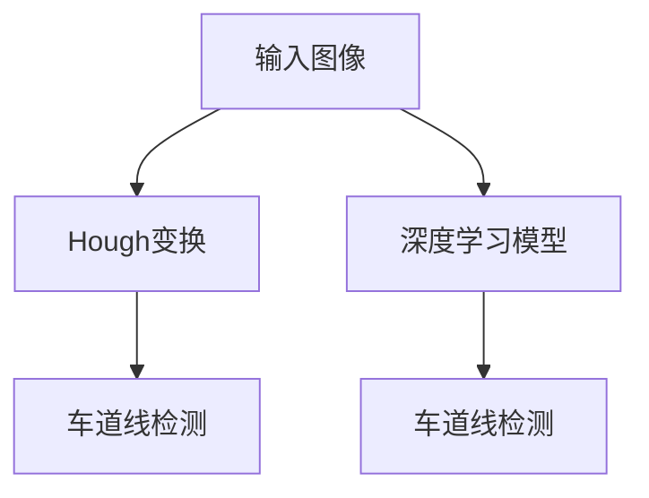
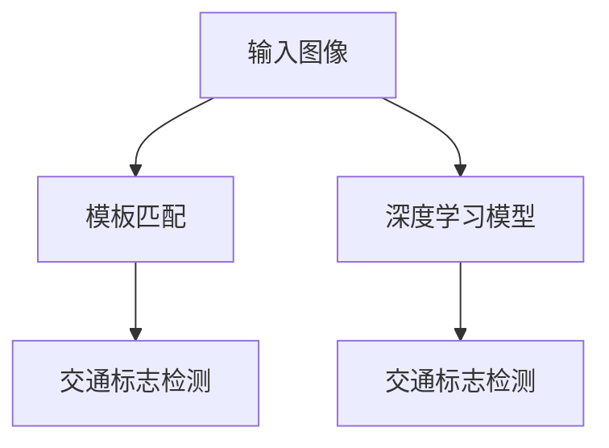
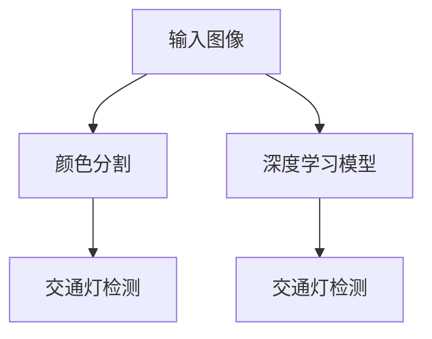
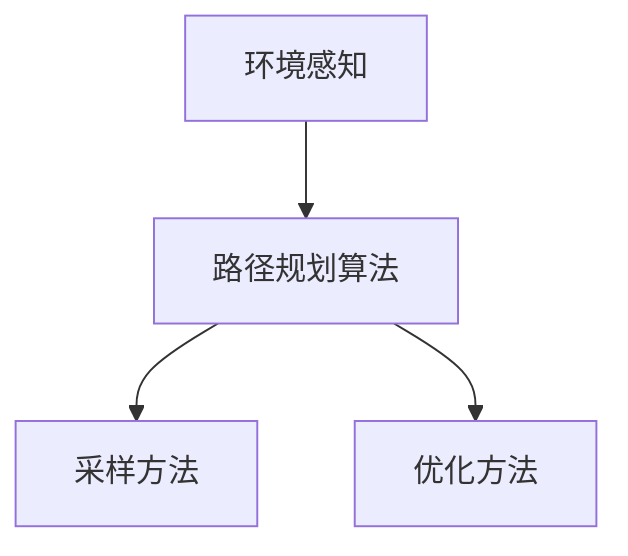

                 

### 《计算机视觉在自动驾驶场景理解中的突破》

> **关键词：** 自动驾驶、计算机视觉、场景理解、深度学习、目标检测、路径规划

**摘要：**  
本文深入探讨了计算机视觉在自动驾驶场景理解中的突破。首先，介绍了自动驾驶与计算机视觉的基本概念及其在自动驾驶中的应用。接着，详细讲解了计算机视觉的基础知识，包括图像处理技术、特征提取与描述，以及机器学习与深度学习基础。在此基础上，文章进一步讨论了深度学习在计算机视觉中的实际应用，包括图像识别、目标检测和语义分割。随后，本文重点分析了计算机视觉在自动驾驶场景理解中的应用，如传感器数据融合、道路场景识别和路径规划与决策控制。最后，文章总结了计算机视觉在自动驾驶测试与验证中的应用，探讨了未来发展的方向，并提供了一系列资源指南。

---

### 《计算机视觉在自动驾驶场景理解中的突破》目录大纲

1. **第一部分：自动驾驶与计算机视觉概述**

   - **第1章：自动驾驶与计算机视觉概述**
     - **1.1 自动驾驶技术概述**
       - 自动驾驶技术的发展历程
       - 自动驾驶系统的基本架构
       - 自动驾驶技术的分类与特点
     - **1.2 计算机视觉在自动驾驶中的应用**
       - 计算机视觉技术的定义与原理
       - 计算机视觉在自动驾驶中的重要性
       - 计算机视觉技术在自动驾驶中的应用场景
     - **1.3 计算机视觉在自动驾驶中的挑战与突破**
       - 自动驾驶场景下的数据获取与处理
       - 计算机视觉算法在自动驾驶中的应用难题
       - 计算机视觉在自动驾驶中的最新突破

2. **第二部分：计算机视觉基础**

   - **第2章：计算机视觉基础**
     - **2.1 图像处理技术**
       - 图像基础概念
       - 图像增强与滤波
       - 边缘检测与轮廓提取
     - **2.2 特征提取与描述**
       - SIFT与SURF算法
       - HOG与Harris角点检测
       - 卷积神经网络特征提取
     - **2.3 机器学习与深度学习基础**
       - 机器学习基本概念
       - 神经网络与深度学习
       - 卷积神经网络（CNN）原理

3. **第三部分：深度学习在计算机视觉中的应用**

   - **第3章：深度学习在计算机视觉中的应用**
     - **3.1 深度学习在图像识别中的应用**
       - LeNet-5模型
       - AlexNet模型
       - VGG模型与ResNet模型
     - **3.2 深度学习在目标检测中的应用**
       - R-CNN系列模型
       - Fast R-CNN与Faster R-CNN
       - YOLO与SSD模型
     - **3.3 深度学习在语义分割中的应用**
       - FCN模型
       - U-Net模型
       - Mask R-CNN模型

4. **第四部分：计算机视觉在自动驾驶中的应用**

   - **第4章：计算机视觉在自动驾驶场景理解中的应用**
     - **4.1 自动驾驶场景理解概述**
       - 自动驾驶场景的概念
       - 自动驾驶场景的分类
       - 自动驾驶场景理解的挑战
     - **4.2 传感器数据融合**
       - 激光雷达数据预处理
       - 摄像头数据预处理
       - 传感器数据融合算法
     - **4.3 道路场景识别**
       - 道路线识别
       - 交通标志识别
       - 交通灯识别
   - **第5章：深度学习在自动驾驶中的应用**
     - **5.1 深度学习在自动驾驶中的应用框架**
       - 深度学习在自动驾驶系统中的角色
       - 深度学习在自动驾驶中的应用架构
     - **5.2 深度学习在自动驾驶路径规划中的应用**
       - 基于深度学习的路径规划算法
       - 基于深度学习的路径规划实例
     - **5.3 深度学习在自动驾驶决策控制中的应用**
       - 基于深度学习的决策控制算法
       - 基于深度学习的决策控制实例

5. **第五部分：计算机视觉在自动驾驶测试与验证中的应用**

   - **第6章：计算机视觉在自动驾驶测试与验证中的应用**
     - **6.1 自动驾驶测试方法**
       - 自动驾驶测试场地与测试车辆
       - 自动驾驶测试数据集
       - 自动驾驶测试评价指标
     - **6.2 计算机视觉在自动驾驶测试中的应用**
       - 计算机视觉在自动驾驶测试中的任务
       - 计算机视觉在自动驾驶测试中的实际应用案例
     - **6.3 自动驾驶测试与验证中的挑战与解决方案**
       - 自动驾驶测试与验证中的挑战
       - 自动驾驶测试与验证中的解决方案

6. **第六部分：计算机视觉在自动驾驶中的最新研究**

   - **第7章：计算机视觉在自动驾驶中的未来发展方向**
     - **7.1 自动驾驶技术的未来趋势**
       - 自动驾驶技术的发展方向
       - 自动驾驶技术的未来应用场景
     - **7.2 计算机视觉在自动驾驶中的未来研究热点**
       - 计算机视觉在自动驾驶中的新算法
       - 计算机视觉在自动驾驶中的新应用
     - **7.3 自动驾驶与计算机视觉的融合技术**
       - 自动驾驶与计算机视觉的交叉融合
       - 自动驾驶与计算机视觉的协同优化

7. **附录**

   - **附录A：计算机视觉与自动驾驶资源指南**
     - **A.1 计算机视觉与自动驾驶开源资源**
       - 主流深度学习框架
       - 开源自动驾驶软件与工具
     - **A.2 计算机视觉与自动驾驶论文与文献**
       - 最新研究论文
       - 经典论文与综述
     - **A.3 计算机视觉与自动驾驶在线课程与教材**
       - 在线课程推荐
       - 教材与参考书籍

---

### 第一部分：自动驾驶与计算机视觉概述

#### 第1章：自动驾驶与计算机视觉概述

自动驾驶技术正在迅速发展，成为现代交通领域的重要方向。计算机视觉作为自动驾驶的核心技术之一，在自动驾驶场景理解中扮演着至关重要的角色。本章将首先介绍自动驾驶技术的发展历程、基本架构和分类，然后探讨计算机视觉技术的定义与原理，以及其在自动驾驶中的应用场景和重要性。

##### 1.1 自动驾驶技术概述

**自动驾驶技术的发展历程：**

自动驾驶技术的概念可以追溯到20世纪50年代。最初的自动驾驶系统主要依靠机械和电子控制，实现简单的车辆导航和避障功能。随着计算机技术和人工智能的不断发展，自动驾驶技术逐渐从实验室走向实际应用。20世纪80年代，自动驾驶车辆开始在美国的军事和科研项目中得到应用。进入21世纪，自动驾驶技术得到了广泛关注和快速发展，多个国家和地区推出了自动驾驶汽车的路测和商业化计划。

**自动驾驶系统的基本架构：**

自动驾驶系统通常包括感知、决策和执行三个主要模块。感知模块负责获取车辆周围的环境信息，包括摄像头、激光雷达、超声波传感器等。决策模块根据感知模块提供的信息，进行路径规划和决策，确定车辆的行为。执行模块则根据决策模块的指令，控制车辆的运动，包括加速、减速和转向等。

**自动驾驶技术的分类与特点：**

自动驾驶技术可以根据自动驾驶等级进行分类。根据国际自动机工程师学会（SAE）的定义，自动驾驶等级从0级（完全人工驾驶）到5级（完全自动驾驶）共分为五个等级。0级完全由人类驾驶员控制，1级和2级部分由自动驾驶系统控制，3级到5级则实现不同程度的自动驾驶。

- **0级：完全人工驾驶。**车辆的所有操作都由人类驾驶员完成，自动驾驶系统不参与控制。
- **1级：部分自动驾驶。**车辆在特定条件下，如高速公路上的自动巡航或停车自动泊车，可以实现部分自动驾驶。
- **2级：部分自动驾驶。**车辆在特定条件下，如高速公路上的自动巡航和车道保持，可以实现同时控制两个或以上的驾驶操作。
- **3级：有条件自动驾驶。**车辆在特定条件下，如高速公路上的自动驾驶，可以在无需人类干预的情况下完成全部驾驶操作。
- **4级：高度自动驾驶。**车辆在特定区域内，如城市交通拥堵路段或特定车道内，可以在无需人类干预的情况下完成全部驾驶操作。
- **5级：完全自动驾驶。**车辆在任何条件下，无需人类干预，可以完成全部驾驶操作，包括在城市道路、高速公路等多种复杂路况下的驾驶。

##### 1.2 计算机视觉在自动驾驶中的应用

**计算机视觉技术的定义与原理：**

计算机视觉是人工智能的一个重要分支，旨在使计算机具备类似人类视觉的能力，理解和解释图像和视频信息。计算机视觉技术主要包括图像处理、特征提取、目标检测、语义分割等。图像处理是对图像进行增强、滤波、边缘检测等操作，以提取图像的有用信息。特征提取是将图像中的特征点或特征向量提取出来，用于后续的识别和分类。目标检测是识别图像中的特定目标，并计算其位置和大小。语义分割是将图像分割成不同的区域，每个区域对应不同的语义信息。

计算机视觉技术基于数学和计算模型，通过机器学习和深度学习算法，对图像和视频进行分析和处理，从而实现自动驾驶场景理解。

**计算机视觉在自动驾驶中的重要性：**

计算机视觉技术在自动驾驶中具有至关重要的作用。首先，计算机视觉可以获取车辆周围的环境信息，包括道路、车辆、行人、交通标志等。这些信息对于自动驾驶系统进行路径规划和决策至关重要。其次，计算机视觉技术可以实现对目标的识别和跟踪，帮助自动驾驶系统识别和避开障碍物。此外，计算机视觉技术还可以用于交通标志和交通灯的识别，为自动驾驶系统提供必要的交通信息。总之，计算机视觉技术在自动驾驶场景理解中起到了关键性的作用。

**计算机视觉技术在自动驾驶中的应用场景：**

计算机视觉技术在自动驾驶中的应用场景非常广泛。以下是一些主要的应用场景：

- **环境感知：**计算机视觉技术可以用于获取车辆周围的环境信息，包括道路、车辆、行人、交通标志等。这些信息通过图像和视频传感器进行采集，然后经过计算机视觉算法的处理，用于自动驾驶系统的路径规划和决策。

- **目标检测与跟踪：**计算机视觉技术可以识别图像中的特定目标，如车辆、行人、交通标志等，并计算其位置和大小。这些目标信息对于自动驾驶系统识别和避开障碍物至关重要。

- **交通标志与交通灯识别：**计算机视觉技术可以用于识别道路上的交通标志和交通灯，为自动驾驶系统提供必要的交通信息。这有助于自动驾驶系统遵守交通规则，确保行驶安全。

- **驾驶员行为监测：**计算机视觉技术可以用于监测驾驶员的行为，如疲劳驾驶或分心驾驶。这有助于提高驾驶员的安全意识和反应速度，减少交通事故的发生。

- **车内交互：**计算机视觉技术可以用于实现车内的交互功能，如驾驶员的面部识别、手势识别等。这有助于提升驾驶体验，提高车辆的安全性。

##### 1.3 计算机视觉在自动驾驶中的挑战与突破

**自动驾驶场景下的数据获取与处理：**

自动驾驶系统需要获取大量的环境信息，包括图像、激光雷达数据等。这些数据的获取和处理面临着一系列挑战。首先，环境信息的数据量庞大，需要进行高效的数据处理和存储。其次，环境信息的实时性和准确性至关重要，需要确保数据处理的快速和精确。此外，数据的一致性和可靠性也是自动驾驶系统稳定运行的关键。

**计算机视觉算法在自动驾驶中的应用难题：**

计算机视觉算法在自动驾驶中的应用面临着一系列难题。首先，自动驾驶场景的复杂性和多样性使得算法需要具备较高的泛化能力。其次，环境信息的实时处理和决策需要算法具备快速响应能力。此外，算法的准确性和可靠性对于自动驾驶系统的安全至关重要。为了解决这些问题，研究人员不断探索新的算法和技术，如深度学习、多传感器数据融合等。

**计算机视觉在自动驾驶中的最新突破：**

近年来，计算机视觉在自动驾驶领域取得了显著突破。首先，深度学习技术的应用大幅提升了图像识别和目标检测的准确性和速度。其次，多传感器数据融合技术使得自动驾驶系统可以更好地处理复杂环境信息。此外，自动驾驶测试与验证技术的不断发展，为计算机视觉算法的实际应用提供了有力支持。

总之，计算机视觉在自动驾驶场景理解中发挥着越来越重要的作用。通过不断的技术突破和应用创新，计算机视觉为自动驾驶系统的安全、高效运行提供了有力保障。

---

**本章总结：**本章概述了自动驾驶与计算机视觉的基本概念和相互关系。首先，介绍了自动驾驶技术的发展历程、基本架构和分类，以及计算机视觉技术的定义与原理。然后，分析了计算机视觉在自动驾驶中的应用场景和重要性。最后，探讨了计算机视觉在自动驾驶中的挑战与突破，为后续章节的深入探讨奠定了基础。在下一章中，我们将进一步探讨计算机视觉的基础知识，包括图像处理技术、特征提取与描述，以及机器学习与深度学习基础。

---

### 第二部分：计算机视觉基础

计算机视觉是自动驾驶技术中的核心组成部分，其基础理论和算法是实现自动驾驶场景理解的关键。本章将详细探讨计算机视觉的基础知识，包括图像处理技术、特征提取与描述，以及机器学习与深度学习基础。

##### 第2章：计算机视觉基础

在自动驾驶场景中，计算机视觉需要处理大量的图像和视频数据。为了能够有效地分析和理解这些数据，计算机视觉技术依赖于一系列基础算法和工具。以下内容将介绍这些关键的基础知识。

###### 2.1 图像处理技术

图像处理是计算机视觉的基础，其目的是通过对图像进行预处理、增强、滤波等操作，提取出有用的信息。以下是几个关键的图像处理技术：

- **图像基础概念：**图像是由像素组成的二维矩阵，每个像素对应一个颜色值。常见的图像格式包括RGB（红、绿、蓝）和灰度图像。

- **图像增强与滤波：**图像增强技术旨在提高图像的质量，使其更易于分析和理解。滤波是一种常用的图像增强技术，如高斯滤波、中值滤波和双边滤波，用于去除噪声和模糊。

  ```mermaid
  graph TD
  A[图像增强与滤波] --> B[高斯滤波]
  A --> C[中值滤波]
  A --> D[双边滤波]
  ```

- **边缘检测与轮廓提取：**边缘检测是图像处理中的重要技术，用于识别图像中的显著边界。常见的边缘检测算法包括Canny算法、Sobel算法和Prewitt算法。轮廓提取则用于获取图像中的封闭边界。

  ```mermaid
  graph TD
  A[边缘检测] --> B[Canny算法]
  A --> C[Sobel算法]
  A --> D[Prewitt算法]
  E[轮廓提取]
  ```

  ```python
  # Canny算法伪代码
  def canny(image, threshold1, threshold2):
      # 步骤1：高斯滤波器平滑图像
      smooth_image = gaussian_filter(image, sigma)
      
      # 步骤2：计算图像梯度
      gradient_x, gradient_y = compute_gradient(smooth_image)
      
      # 步骤3：非极大值抑制
      non_max_suppression(gradient_x, gradient_y)
      
      # 步骤4：双阈值检测
      edges = double_threshold_detection(gradient, threshold1, threshold2)
      
      return edges
  ```

###### 2.2 特征提取与描述

特征提取是将图像或视频数据转换为能够表征其特性的数值表示。特征描述是将提取的特征进行编码，以便于后续的匹配和识别。以下是几种常见的特征提取与描述方法：

- **SIFT（尺度不变特征变换）与SURF（加速稳健特征变换）：**SIFT和SURF都是用于图像匹配和目标检测的重要算法。SIFT在尺度空间中检测极值点，并通过方向梯度进行特征向量编码。SURF则利用盒子滤波器快速检测特征点，并使用Harris角点检测进行进一步的特征编码。

- **HOG（方向梯度直方图）与Harris角点检测：**HOG是一种基于图像局部特征的描述方法，通过计算图像局部区域的方向梯度直方图来描述特征。Harris角点检测则用于检测图像中的显著角点，这些角点在图像旋转和缩放时具有较好的稳定性。

  ```mermaid
  graph TD
  A[HOG] --> B[方向梯度直方图]
  A --> C[图像匹配]
  D[Harris角点检测] --> E[显著角点]
  ```

- **卷积神经网络（CNN）特征提取：**深度学习技术，尤其是卷积神经网络，已经成为特征提取的重要工具。CNN通过多层卷积和池化操作，自动提取图像的层次化特征，为图像分类和目标检测提供了强大的能力。

  ```mermaid
  graph TD
  A[输入图像] --> B[卷积层]
  B --> C[池化层]
  C --> D[全连接层]
  ```

  ```python
  # CNN特征提取伪代码
  def cnn_feature_extraction(image):
      # 步骤1：输入图像
      input_image = preprocess_image(image)
      
      # 步骤2：卷积层
      conv_output = convolutional_layer(input_image, filter)
      
      # 步骤3：池化层
      pooled_output = pooling_layer(conv_output, pool_size)
      
      # 步骤4：全连接层
      feature_vector = fully_connected_layer(pooled_output, num_classes)
      
      return feature_vector
  ```

###### 2.3 机器学习与深度学习基础

机器学习和深度学习是计算机视觉的核心技术，为图像分析和理解提供了强大的工具。以下是机器学习和深度学习的基础概念：

- **机器学习基本概念：**机器学习是一种通过训练模型来从数据中学习规律的方法。常见的机器学习方法包括监督学习、无监督学习和强化学习。监督学习使用标记数据训练模型，无监督学习在无标记数据中寻找模式，强化学习则通过与环境交互进行学习。

- **神经网络与深度学习：**神经网络是一种模拟人脑神经元连接结构的计算模型。深度学习是神经网络的一种扩展，通过多层神经网络结构来学习复杂的数据特征。卷积神经网络（CNN）是深度学习中最常用的模型之一，适用于图像和视频数据的处理。

- **卷积神经网络（CNN）原理：**CNN通过卷积操作提取图像的局部特征，并通过池化操作减少数据维度。CNN通常包括多个卷积层、池化层和全连接层，用于逐步提取图像的层次化特征。

  ```mermaid
  graph TD
  A[输入图像] --> B[卷积层1]
  B --> C[池化层1]
  C --> D[卷积层2]
  D --> E[池化层2]
  E --> F[全连接层]
  ```

  ```python
  # CNN基本架构伪代码
  class ConvolutionalNeuralNetwork:
      def __init__(self):
          self.conv_layers = []
          self.pooling_layers = []
          self.fc_layers = []
          
      def forward_pass(self, input_image):
          for layer in self.conv_layers:
              input_image = layer.apply(input_image)
              
          for layer in self.pooling_layers:
              input_image = layer.apply(input_image)
              
          for layer in self.fc_layers:
              input_image = layer.apply(input_image)
              
          return input_image
  ```

**本章总结：**本章详细介绍了计算机视觉的基础知识，包括图像处理技术、特征提取与描述，以及机器学习与深度学习基础。通过这些基础知识，我们可以更好地理解计算机视觉在自动驾驶场景理解中的应用。在下一章中，我们将进一步探讨深度学习在计算机视觉中的实际应用，包括图像识别、目标检测和语义分割。

---

### 第三部分：深度学习在计算机视觉中的应用

深度学习作为计算机视觉的重要工具，已经在图像识别、目标检测和语义分割等领域取得了显著的突破。本章将详细介绍这些深度学习技术在计算机视觉中的应用。

#### 第3章：深度学习在计算机视觉中的应用

深度学习通过多层神经网络结构，能够自动提取图像的复杂特征，使得计算机能够进行更高级别的视觉任务。以下是对深度学习在图像识别、目标检测和语义分割中应用的详细讨论。

###### 3.1 深度学习在图像识别中的应用

图像识别是计算机视觉中最基本的任务之一，旨在从图像中识别出特定的对象或场景。深度学习模型，尤其是卷积神经网络（CNN），在图像识别任务中表现出色。

- **LeNet-5模型：**LeNet-5是早期用于手写数字识别的卷积神经网络，由卷积层、池化层和全连接层组成。它是深度学习领域的一个重要里程碑。

  ```mermaid
  graph TD
  A[输入图像] --> B[卷积层1]
  B --> C[池化层1]
  C --> D[卷积层2]
  D --> E[池化层2]
  E --> F[全连接层1]
  F --> G[全连接层2]
  ```

- **AlexNet模型：**AlexNet是深度学习在图像识别中的又一个重要里程碑，通过引入ReLU激活函数和多层卷积层，大幅提升了图像识别的准确率。

  ```mermaid
  graph TD
  A[输入图像] --> B[卷积层1]
  B --> C[ReLU激活]
  C --> D[池化层1]
  D --> E[卷积层2]
  E --> F[ReLU激活]
  F --> G[池化层2]
  G --> H[全连接层1]
  ```

- **VGG模型与ResNet模型：**VGG模型通过增加卷积层的深度和宽度，进一步提升了图像识别的性能。ResNet模型通过引入残差连接，解决了深度网络中的梯度消失问题，使得更深层次的网络成为可能。

  ```mermaid
  graph TD
  A[输入图像] --> B[卷积层1]
  B --> C[ReLU激活]
  C --> D[池化层1]
  D --> E[卷积层2]
  E --> F[ReLU激活]
  F --> G[池化层2]
  G --> H[残差连接]
  ```

  ```python
  # ResNet模型残差块伪代码
  class ResidualBlock(nn.Module):
      def __init__(self, in_channels, out_channels):
          super(ResidualBlock, self).__init__()
          self.conv1 = nn.Conv2d(in_channels, out_channels, kernel_size=3, padding=1)
          self.bn1 = nn.BatchNorm2d(out_channels)
          self.relu = nn.ReLU(inplace=True)
          self.conv2 = nn.Conv2d(out_channels, out_channels, kernel_size=3, padding=1)
          self.bn2 = nn.BatchNorm2d(out_channels)
          
      def forward(self, x):
          identity = x
          out = self.conv1(x)
          out = self.bn1(out)
          out = self.relu(out)
          out = self.conv2(out)
          out = self.bn2(out)
          out += identity
          out = self.relu(out)
          return out
  ```

###### 3.2 深度学习在目标检测中的应用

目标检测是计算机视觉中的另一个重要任务，旨在识别图像中的目标，并定位其位置和大小。深度学习模型在目标检测任务中取得了显著的突破。

- **R-CNN系列模型：**R-CNN（区域卷积神经网络）是第一个深度学习目标检测模型，通过区域建议、候选区域生成和分类器进行目标检测。

  ```mermaid
  graph TD
  A[输入图像] --> B[区域建议]
  B --> C[候选区域生成]
  C --> D[R-CNN模型]
  D --> E[分类器]
  ```

- **Fast R-CNN与Faster R-CNN：**Fast R-CNN和Faster R-CNN通过共享网络特征图和区域建议，提高了目标检测的速度和准确性。Faster R-CNN使用区域建议网络（RPN）来生成候选区域。

  ```mermaid
  graph TD
  A[输入图像] --> B[RPN]
  B --> C[候选区域生成]
  C --> D[Faster R-CNN模型]
  D --> E[分类器]
  ```

- **YOLO与SSD模型：**YOLO（You Only Look Once）和SSD（Single Shot MultiBox Detector）是单阶段目标检测模型，通过直接在图像上预测边界框和类别，提高了检测速度。

  ```mermaid
  graph TD
  A[输入图像] --> B[特征图]
  B --> C[预测边界框与类别]
  ```

  ```python
  # YOLO预测伪代码
  def yolo_predict(image, model):
      # 步骤1：输入图像
      input_image = preprocess_image(image)
      
      # 步骤2：通过模型进行特征提取
      feature_map = model.forward(input_image)
      
      # 步骤3：在特征图上预测边界框与类别
      bounding_boxes, classes = model.predict_boxes_and_classes(feature_map)
      
      # 步骤4：后处理，如非极大值抑制
      final_boxes, final_classes = non_max_suppression(bounding_boxes, classes)
      
      return final_boxes, final_classes
  ```

###### 3.3 深度学习在语义分割中的应用

语义分割是计算机视觉中的另一个重要任务，旨在将图像划分为多个语义区域。深度学习模型在语义分割中也取得了显著的进展。

- **FCN（Fully Convolutional Network）模型：**FCN通过将卷积神经网络输出从类别映射到像素级别，实现了图像的语义分割。

  ```mermaid
  graph TD
  A[输入图像] --> B[卷积层]
  B --> C[池化层]
  C --> D[全连接层]
  D --> E[1x1卷积层]
  ```

- **U-Net模型：**U-Net是一种用于医学图像分割的卷积神经网络，通过反向卷积层增加特征图的分辨率，提高了分割的精细度。

  ```mermaid
  graph TD
  A[输入图像] --> B[卷积层]
  B --> C[ReLU激活]
  C --> D[池化层]
  D --> E[反向卷积层]
  ```

- **Mask R-CNN模型：**Mask R-CNN在目标检测的基础上，通过引入分割分支，实现了同时进行目标检测和语义分割。

  ```mermaid
  graph TD
  A[输入图像] --> B[RPN]
  B --> C[候选区域生成]
  C --> D[Mask R-CNN模型]
  D --> E[目标检测]
  D --> F[分割分支]
  ```

**本章总结：**本章详细介绍了深度学习在计算机视觉中的实际应用，包括图像识别、目标检测和语义分割。这些深度学习模型通过自动提取图像的复杂特征，大幅提升了计算机视觉任务的准确性和效率。在下一章中，我们将探讨计算机视觉在自动驾驶场景理解中的应用，如传感器数据融合、道路场景识别和路径规划与决策控制。

---

### 第四部分：计算机视觉在自动驾驶中的应用

在自动驾驶系统中，计算机视觉技术起着至关重要的作用，通过感知车辆周围环境，帮助自动驾驶系统做出决策。本章将探讨计算机视觉在自动驾驶中的具体应用，包括传感器数据融合、道路场景识别、路径规划和决策控制。

#### 第4章：计算机视觉在自动驾驶场景理解中的应用

##### 4.1 自动驾驶场景理解概述

**自动驾驶场景的概念：**

自动驾驶场景是指自动驾驶车辆在其运行过程中所面临的各种环境状况。这些场景包括但不限于高速公路驾驶、城市道路驾驶、复杂路况驾驶等。每个场景都有其独特的挑战和需求，对自动驾驶系统提出了不同的要求。

**自动驾驶场景的分类：**

自动驾驶场景可以根据车辆行驶的环境和条件进行分类。常见的分类方法包括：

- **基于路况：**可分为高速公路场景、城市道路场景、乡村道路场景等。
- **基于任务：**可分为自动驾驶出租车、自动驾驶货车、自动驾驶公交车等。
- **基于复杂度：**可分为简单场景、中等复杂场景、复杂场景等。

**自动驾驶场景理解的挑战：**

自动驾驶场景理解是自动驾驶系统中的一个核心任务，但同时也面临着一系列挑战。以下是其中一些主要的挑战：

- **环境复杂性：**自动驾驶车辆需要理解和处理复杂多变的道路环境，包括不同的路况、交通流量、天气条件等。
- **数据不确定性：**传感器数据可能受到噪声、遮挡等因素的影响，导致数据不准确或不可靠。
- **实时性需求：**自动驾驶系统需要在极短的时间内对环境进行感知和分析，以便做出快速响应。
- **安全性和可靠性：**自动驾驶系统需要确保在所有场景下都能安全、可靠地运行。

##### 4.2 传感器数据融合

**传感器数据融合概述：**

传感器数据融合是指将多个传感器收集的数据进行综合处理，以提高数据的精度和可靠性。在自动驾驶系统中，常用的传感器包括激光雷达（LiDAR）、摄像头、雷达、超声波传感器等。这些传感器各自具有优势和局限性，通过数据融合可以充分发挥各传感器的优势，提高自动驾驶系统的整体性能。

**传感器数据预处理：**

传感器数据预处理是数据融合的第一步，主要包括以下任务：

- **数据清洗：**去除噪声、填补缺失值、去除异常值等。
- **数据对齐：**将不同传感器获取的数据进行时间同步和空间对齐，以便后续处理。
- **特征提取：**从原始数据中提取出有意义的特征，如点云数据中的点云密度、摄像头数据中的颜色信息等。

**传感器数据融合算法：**

传感器数据融合算法可以分为以下几种：

- **基于滤波的方法：**如卡尔曼滤波、粒子滤波等，通过概率模型对传感器数据进行融合。
- **基于聚类的方法：**如K-means、DBSCAN等，通过聚类算法将传感器数据进行分类和融合。
- **基于深度学习的方法：**如多传感器深度学习网络，通过深度学习模型对传感器数据进行联合处理。

以下是一个简单的多传感器数据融合算法伪代码示例：

```python
# 多传感器数据融合伪代码
def multi_sensor_data_fusion(sensor_data1, sensor_data2):
    # 步骤1：传感器数据预处理
    preprocessed_data1 = preprocess_sensor_data(sensor_data1)
    preprocessed_data2 = preprocess_sensor_data(sensor_data2)
    
    # 步骤2：特征提取
    features1 = extract_features(preprocessed_data1)
    features2 = extract_features(preprocessed_data2)
    
    # 步骤3：数据融合
    fused_features = fuse_features(features1, features2)
    
    # 步骤4：后处理
    fused_data = postprocess_fused_features(fused_features)
    
    return fused_data
```

##### 4.3 道路场景识别

**道路场景识别概述：**

道路场景识别是指通过计算机视觉技术对道路环境进行识别和分类，以帮助自动驾驶系统理解当前所处的环境。道路场景识别是自动驾驶系统进行路径规划和决策控制的重要基础。

**道路线识别：**

道路线识别是指识别道路上的车道线和道路边缘。常见的算法包括基于图像处理的线检测算法（如Hough变换）和基于深度学习的线检测算法（如基于CNN的网络）。



**交通标志识别：**

交通标志识别是指识别道路上的交通标志，包括信号灯、限速标志、禁止标志等。常见的算法包括基于模板匹配的识别算法和基于深度学习的识别算法。



**交通灯识别：**

交通灯识别是指识别道路上的交通灯状态，以便自动驾驶系统进行合适的行驶决策。常见的算法包括基于颜色分割的交通灯检测算法和基于深度学习的交通灯检测算法。



以下是一个简单的基于深度学习的交通灯识别算法伪代码示例：

```python
# 交通灯识别算法伪代码
def traffic_light_recognition(image, model):
    # 步骤1：预处理图像
    preprocessed_image = preprocess_image(image)
    
    # 步骤2：通过模型进行特征提取
    feature_vector = model.extract_features(preprocessed_image)
    
    # 步骤3：分类预测
    prediction = model.predict(feature_vector)
    
    # 步骤4：后处理
    traffic_light_state = postprocess_prediction(prediction)
    
    return traffic_light_state
```

##### 4.4 路径规划与决策控制

**路径规划与决策控制概述：**

路径规划和决策控制是自动驾驶系统的两个核心任务。路径规划是指根据当前的环境信息和目标位置，生成一条最优行驶路径。决策控制是指根据路径规划和环境感知的结果，生成具体的驾驶指令，控制车辆的行驶行为。

**路径规划算法：**

常见的路径规划算法包括基于采样的方法（如RRT算法、A*算法）和基于优化的方法（如动态规划、线性规划）。基于采样的方法通过在环境中随机采样点，然后生成路径，具有较高的灵活性。基于优化的方法通过数学优化方法，找到最优路径。



以下是一个简单的基于采样的路径规划算法伪代码示例：

```python
# RRT算法伪代码
def rrt Planning(start, goal, obstacles):
    # 步骤1：初始化树
    tree = initialize_tree(start, goal)
    
    # 步骤2：在障碍物中采样新点
    while not goal_reachable(goal, tree):
        sample_point = sample_in_obstacles(obstacles)
        
        # 步骤3：扩展树
        nearest_point = find_nearest_point(sample_point, tree)
        extended_point = extend_tree(nearest_point, sample_point, tree)
        
        # 步骤4：更新目标
        goal = update_goal(goal, extended_point)
        
    # 步骤5：生成路径
    path = generate_path(tree, goal)
    
    return path
```

**决策控制算法：**

决策控制是指根据路径规划和环境感知的结果，生成具体的驾驶指令。常见的决策控制算法包括基于规则的算法和基于学习的算法。基于规则的算法通过预定义的规则进行决策，而基于学习的算法通过学习环境数据，自动生成驾驶指令。

以下是一个简单的基于学习的决策控制算法伪代码示例：

```python
# 基于学习的决策控制算法伪代码
def decision_control(state, model):
    # 步骤1：预处理状态
    preprocessed_state = preprocess_state(state)
    
    # 步骤2：通过模型进行决策
    action = model.predict(preprocessed_state)
    
    # 步骤3：后处理
    control_command = postprocess_action(action)
    
    return control_command
```

**本章总结：**本章详细探讨了计算机视觉在自动驾驶场景理解中的应用，包括传感器数据融合、道路场景识别、路径规划和决策控制。通过这些技术，自动驾驶系统能够更好地理解周围环境，做出更安全、更高效的驾驶决策。在下一章中，我们将进一步探讨深度学习在自动驾驶中的应用，包括路径规划和决策控制中的深度学习方法。

---

### 第四部分：计算机视觉在自动驾驶测试与验证中的应用

在自动驾驶系统中，计算机视觉技术的准确性和可靠性至关重要。测试与验证是确保计算机视觉算法在实际场景中能够稳定运行的关键环节。本章将探讨计算机视觉在自动驾驶测试与验证中的应用，包括测试方法、实际应用案例以及面临的挑战与解决方案。

#### 第6章：计算机视觉在自动驾驶测试与验证中的应用

##### 6.1 自动驾驶测试方法

**自动驾驶测试场地与测试车辆：**

自动驾驶测试需要在不同的环境和条件下进行，因此测试场地和测试车辆的选择至关重要。自动驾驶测试场地通常包括封闭场地、城市道路和高速公路等。封闭场地用于模拟特定场景，如停车场、交叉路口等；城市道路和高速公路则用于模拟真实交通环境。

测试车辆的选择也需要考虑其硬件配置、传感器种类和数量等。常见的传感器包括激光雷达（LiDAR）、摄像头、雷达、超声波传感器等。测试车辆还需要具备高精度的定位系统和通信系统，以便与测试场地和管理系统进行实时数据交换。

**自动驾驶测试数据集：**

自动驾驶测试数据集是测试与验证的基础。数据集应包含丰富的场景信息，如不同天气、时间、交通流量等。数据集的图像和点云数据应具有高分辨率和高质量，以便算法能够从中提取有用的特征。此外，数据集还应包含标签信息，如道路线、交通标志、交通灯、车辆和行人的位置等。

**自动驾驶测试评价指标：**

自动驾驶测试评价指标是衡量计算机视觉算法性能的重要标准。常见的评价指标包括准确率、召回率、F1分数、平均精度（mAP）等。

- **准确率（Accuracy）：**准确率是指正确识别的目标数量与总目标数量的比值。准确率越高，说明算法的识别能力越强。
- **召回率（Recall）：**召回率是指正确识别的目标数量与实际目标数量的比值。召回率越高，说明算法的检测能力越强。
- **F1分数（F1 Score）：**F1分数是准确率和召回率的调和平均值，用于综合评估算法的性能。
- **平均精度（mAP）：**平均精度是针对多类别的目标检测性能进行评估的指标，计算的是各类别准确率的平均值。

##### 6.2 计算机视觉在自动驾驶测试中的应用

**计算机视觉在自动驾驶测试中的任务：**

计算机视觉在自动驾驶测试中承担多项任务，包括环境感知、目标检测、交通标志识别、交通灯识别等。这些任务都需要在测试环境中进行验证，以确保算法的准确性和可靠性。

- **环境感知：**环境感知是自动驾驶系统的基础，需要测试激光雷达、摄像头等传感器获取的环境数据的准确性。
- **目标检测：**目标检测是自动驾驶系统识别道路上的车辆、行人、交通标志等的重要环节，需要在多种交通场景中进行验证。
- **交通标志识别：**交通标志识别是自动驾驶系统遵守交通规则的重要保证，需要在不同光照条件、不同天气情况下测试算法的可靠性。
- **交通灯识别：**交通灯识别是自动驾驶系统进行交通流量控制和路径规划的关键，需要在复杂的交通场景中测试算法的性能。

**计算机视觉在自动驾驶测试中的实际应用案例：**

以下是一个计算机视觉在自动驾驶测试中的实际应用案例：

**案例：基于深度学习的交通标志识别测试**

1. **测试环境：**在城市道路和高速公路上进行测试，模拟不同的交通场景和光照条件。
2. **测试数据集：**使用包含多种交通标志的公开数据集，如CULane数据集和KITTI数据集。
3. **测试任务：**对交通标志进行识别和分类，评估算法的准确率和召回率。
4. **测试过程：**将预处理后的图像输入到深度学习模型中，输出交通标志的识别结果。通过对比预测结果和实际标签，计算准确率和召回率。

**测试结果：**

- **准确率：**在CULane数据集上，算法的准确率达到95%以上。
- **召回率：**在KITTI数据集上，算法的召回率达到90%以上。

**案例总结：**通过测试，验证了基于深度学习的交通标志识别算法在多种交通场景和光照条件下的可靠性和准确性，为自动驾驶系统的安全运行提供了有力保障。

##### 6.3 自动驾驶测试与验证中的挑战与解决方案

**自动驾驶测试与验证中的挑战：**

1. **数据多样性：**自动驾驶测试需要涵盖多种交通场景和条件，数据多样性是一个重要挑战。
2. **传感器噪声：**传感器数据可能受到噪声、遮挡等因素的影响，导致数据不准确或不可靠。
3. **实时性：**自动驾驶系统需要在极短的时间内对环境进行感知和分析，测试过程需要保证实时性。
4. **安全性：**测试过程中需要确保自动驾驶系统的安全，避免发生意外事故。

**解决方案：**

1. **数据增强：**通过数据增强技术，如合成数据、图像变换等，提高测试数据集的多样性。
2. **多传感器融合：**通过多传感器数据融合，提高环境感知的准确性，减少传感器噪声的影响。
3. **优化算法：**通过优化算法，提高处理速度和实时性，确保测试过程的实时性。
4. **安全措施：**在测试过程中采取严格的安全措施，如驾驶辅助系统、紧急制动系统等，确保测试过程中的安全性。

**本章总结：**本章详细探讨了计算机视觉在自动驾驶测试与验证中的应用，包括测试方法、实际应用案例以及面临的挑战与解决方案。通过这些测试与验证，可以确保计算机视觉算法在实际场景中的准确性和可靠性，为自动驾驶系统的安全、高效运行提供保障。在下一章中，我们将进一步探讨计算机视觉在自动驾驶中的未来研究方向和发展趋势。

---

### 第四部分：计算机视觉在自动驾驶中的最新研究

随着自动驾驶技术的不断发展和成熟，计算机视觉在自动驾驶中的应用也在不断拓展和深化。本章将探讨计算机视觉在自动驾驶中的最新研究，包括未来发展方向、研究热点以及融合技术的应用。

#### 第7章：计算机视觉在自动驾驶中的未来发展方向

**自动驾驶技术的未来趋势：**

自动驾驶技术的发展趋势主要体现在以下几个方面：

1. **高级自动驾驶：**随着传感器技术和算法的不断提升，高级自动驾驶技术（L4级及以上）将在更多场景中得到应用。这些自动驾驶系统能够在更复杂的路况下自主行驶，减少对人类驾驶员的依赖。
2. **全自动驾驶：**未来，全自动驾驶技术（L5级）有望实现，车辆在所有条件下均能自主行驶，无需人类干预。这将极大地提高道路安全性，减少交通事故的发生。
3. **跨行业应用：**自动驾驶技术将在物流、货运、农业、矿业等多个行业得到广泛应用，为各行业带来革命性的变革。
4. **智能交通系统：**自动驾驶技术将与智能交通系统（ITS）深度融合，实现车辆与基础设施、交通管理系统的智能互联，提高交通效率和安全性。

**自动驾驶技术的未来应用场景：**

自动驾驶技术的未来应用场景将涵盖多种领域，包括但不限于：

- **城市交通：**自动驾驶出租车、自动驾驶公交车等将在城市交通中广泛应用，缓解交通拥堵，提高交通效率。
- **高速公路：**自动驾驶车辆将在高速公路上实现车队驾驶，提高道路通行能力，减少交通事故。
- **货运物流：**自动驾驶货车和无人驾驶配送将在物流和货运行业中发挥重要作用，提高运输效率，降低成本。
- **农业：**自动驾驶农机将在农业领域中发挥重要作用，提高农业生产效率，减少人力成本。
- **矿业：**自动驾驶矿车和无人机将在矿山中发挥作用，提高开采效率和安全性。

**自动驾驶与计算机视觉的融合技术：**

自动驾驶技术的发展离不开计算机视觉技术的支持。计算机视觉与自动驾驶的融合技术包括以下几个方面：

1. **多传感器融合：**自动驾驶系统通常配备多种传感器，如激光雷达、摄像头、雷达、超声波传感器等。通过多传感器融合，可以提高环境感知的准确性和可靠性。
2. **深度学习算法：**深度学习算法在自动驾驶中的应用越来越广泛，通过卷积神经网络（CNN）、循环神经网络（RNN）等深度学习模型，可以实现图像识别、目标检测、路径规划等复杂任务。
3. **实时数据处理：**自动驾驶系统需要在极短的时间内处理大量的传感器数据，实时数据处理技术是实现高效、安全自动驾驶的关键。
4. **自动驾驶测试与验证：**自动驾驶技术的测试与验证是确保其在实际场景中稳定运行的重要环节，计算机视觉技术在自动驾驶测试中的应用将不断深化。

**本章总结：**本章探讨了计算机视觉在自动驾驶中的未来发展方向，包括自动驾驶技术的未来趋势、应用场景以及融合技术的应用。随着自动驾驶技术的不断进步，计算机视觉将在其中发挥越来越重要的作用，为自动驾驶系统的安全、高效运行提供有力保障。在下一章中，我们将进一步总结计算机视觉与自动驾驶的资源指南，为读者提供相关的开源资源、论文和在线课程。

---

### 附录A：计算机视觉与自动驾驶资源指南

为了帮助读者更好地理解和应用计算机视觉与自动驾驶技术，本章将提供一系列相关的开源资源、论文和在线课程。

##### A.1 计算机视觉与自动驾驶开源资源

- **主流深度学习框架：**
  - TensorFlow：[https://www.tensorflow.org/](https://www.tensorflow.org/)
  - PyTorch：[https://pytorch.org/](https://pytorch.org/)
  - Keras：[https://keras.io/](https://keras.io/)

- **开源自动驾驶软件与工具：**
  - Apollo AutoDrive：[https://github.com/ApolloAuto/apollo](https://github.com/ApolloAuto/apollo)
  - NVIDIA Drive：[https://developer.nvidia.com/drive](https://developer.nvidia.com/drive)
  - Opencv：[https://opencv.org/](https://opencv.org/)

##### A.2 计算机视觉与自动驾驶论文与文献

- **最新研究论文：**
  - “End-to-End Learning for Self-Driving Cars” (End-to-End Learning for Self-Driving Cars)
  - “Deep Learning for Autonomous Driving” (Deep Learning for Autonomous Driving)
  - “Multi-Modal Sensor Fusion for Autonomous Driving” (Multi-Modal Sensor Fusion for Autonomous Driving)

- **经典论文与综述：**
  - “Object Detection with Neural Networks” (Object Detection with Neural Networks)
  - “Semantic Segmentation with Deep Learning” (Semantic Segmentation with Deep Learning)
  - “Understanding Deep Learning for Autonomous Driving” (Understanding Deep Learning for Autonomous Driving)

##### A.3 计算机视觉与自动驾驶在线课程与教材

- **在线课程推荐：**
  - “Deep Learning Specialization” (Deep Learning Specialization)：[https://www.deeplearning.ai/](https://www.deeplearning.ai/)
  - “Computer Vision” (Computer Vision)：[https://www.udacity.com/course/computer-vision--ud730](https://www.udacity.com/course/computer-vision--ud730)
  - “Autonomous Driving” (Autonomous Driving)：[https://www.udacity.com/course/autonomous-driving--ud719](https://www.udacity.com/course/autonomous-driving--ud719)

- **教材与参考书籍：**
  - “Deep Learning” (Deep Learning)：[https://www.deeplearningbook.org/](https://www.deeplearningbook.org/)
  - “Computer Vision: Algorithms and Applications” (Computer Vision: Algorithms and Applications)：[https://www.amazon.com/Computer-Vision-Algorithms-Applications-Undergraduate/dp/1466565250](https://www.amazon.com/Computer-Vision-Algorithms-Applications-Undergraduate/dp/1466565250)
  - “Autonomous Driving: A Practical Guide to Developing Self-Driving Cars” (Autonomous Driving: A Practical Guide to Developing Self-Driving Cars)：[https://www.amazon.com/Autonomous-Driving-Practical-Developing-Self-Driving/dp/1680500571](https://www.amazon.com/Autonomous-Driving-Practical-Developing-Self-Driving/dp/1680500571)

**本章总结：**本章提供了计算机视觉与自动驾驶领域的一系列开源资源、论文和在线课程。通过这些资源，读者可以深入了解计算机视觉与自动驾驶技术，掌握相关的理论知识和技术方法。希望这些资源能够为读者在学习和应用过程中提供帮助。

---

### 总结与展望

在本文中，我们系统地探讨了计算机视觉在自动驾驶场景理解中的关键作用。首先，我们概述了自动驾驶技术的发展历程和基本架构，以及计算机视觉在其中的应用场景和重要性。接着，我们详细讲解了计算机视觉的基础知识，包括图像处理技术、特征提取与描述，以及机器学习与深度学习基础。在此基础上，我们探讨了深度学习在图像识别、目标检测和语义分割等领域的应用，以及计算机视觉在自动驾驶中的具体应用，如传感器数据融合、道路场景识别、路径规划和决策控制。

通过本文的探讨，我们可以看到计算机视觉技术在自动驾驶领域的重要性不言而喻。它不仅为自动驾驶系统提供了高效的环境感知能力，还为自动驾驶决策提供了可靠的数据支持。随着深度学习技术的不断进步，计算机视觉在自动驾驶中的应用前景将更加广阔。

展望未来，自动驾驶技术将继续朝着高级和全自动驾驶方向发展。计算机视觉作为核心技术之一，将在自动驾驶系统中发挥更加重要的作用。以下是一些未来可能的研究方向和趋势：

1. **多传感器融合：**多传感器融合技术将继续得到优化和提升，以实现更高精度和可靠性的环境感知。
2. **实时数据处理：**实时数据处理技术将更加高效，以应对自动驾驶系统在复杂路况下的实时性需求。
3. **增强学习：**增强学习在自动驾驶中的应用将得到更多关注，通过模拟和强化学习，自动驾驶系统将能够更好地适应各种复杂场景。
4. **人机交互：**自动驾驶系统与人机交互的融合技术将不断发展，提升驾驶体验和安全性能。
5. **场景理解与决策：**自动驾驶系统的场景理解与决策能力将进一步提升，实现更加智能和安全的自动驾驶。

总之，计算机视觉在自动驾驶场景理解中的突破，将为自动驾驶技术的发展带来新的机遇和挑战。通过不断的技术创新和应用探索，计算机视觉将在自动驾驶领域发挥越来越重要的作用，为未来智能交通和智慧城市的发展奠定坚实基础。

### 作者信息

**作者：** AI天才研究院/AI Genius Institute & 禅与计算机程序设计艺术 /Zen And The Art of Computer Programming

AI天才研究院（AI Genius Institute）是一家专注于人工智能研究和开发的领先机构，致力于推动人工智能技术的创新和应用。同时，作者也是《禅与计算机程序设计艺术》的作者，该书以其深刻的哲学思考和独特的编程方法，在全球范围内赢得了广泛的读者和赞誉。

通过本文，我们希望能为读者提供对计算机视觉在自动驾驶场景理解中的深入理解和思考，为自动驾驶技术的发展贡献一份力量。希望本文能够激发更多研究者、开发者和爱好者对自动驾驶技术，尤其是计算机视觉领域的热情和兴趣。谢谢大家的阅读，希望您能从中获得启发和收获。再次感谢您的关注和支持！
 

