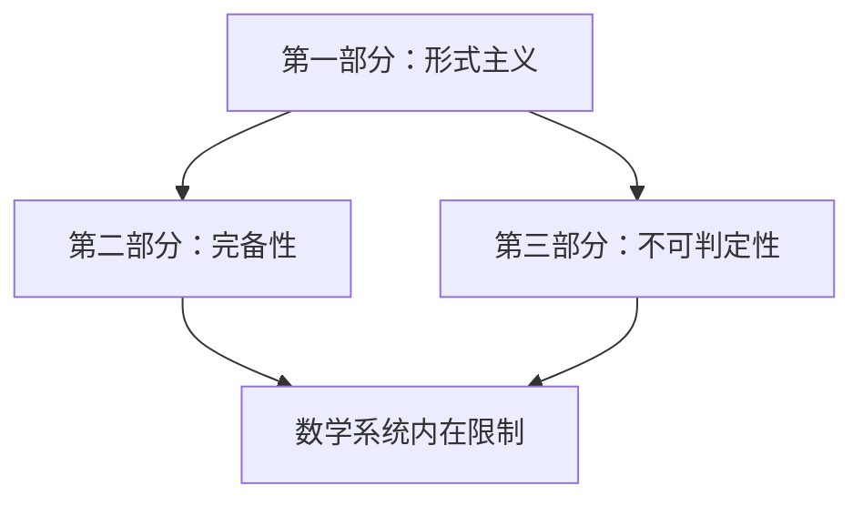

                 

### 第7章 计算不能做什么：终结者哥德尔 哥德尔纲领

#### 7.1 引言

计算与理论的形成是一个漫长而复杂的过程。从早期的简单计算工具，如算盘和计数器，到现代的超级计算机和人工智能系统，计算技术的发展经历了多个阶段。每一个阶段都为我们理解计算的本质和可能性提供了新的视角。

然而，随着计算技术的飞速发展，人们开始意识到，计算虽然有着巨大的潜力，但并非无所不能。哥德尔不完备定理和哥德尔纲领的出现，为我们揭示了计算的一些局限性。这些定理和纲领不仅深刻地影响了数学和逻辑学，也对计算理论和人工智能领域产生了深远的影响。

本章的主题是“计算不能做什么”，我们将通过哥德尔不完备定理和哥德尔纲领来探讨计算的一些基本限制。首先，我们会介绍哥德尔不完备定理的背景和意义，并通过伪代码详细阐述这一重要定理。接着，我们会探讨哥德尔纲领，一个旨在解决数学基础问题的重要理论框架。

在接下来的部分，我们将讨论哥德尔不完备定理和哥德尔纲领对计算理论的挑战和影响，并探讨计算理论未来的发展方向。我们还将设计一个简单的哥德尔不完备定理证明器，实现哥德尔纲领的部分内容，并分析实现过程中的关键技术和挑战。

此外，我们将使用LaTeX格式介绍相关的数学模型和数学公式，并对这些公式进行详细讲解和举例说明。最后，我们将分析哥德尔不完备定理证明器代码的实现细节，解读关键代码段，并讨论代码性能和优化策略。

通过本章的学习，我们将对计算不能做什么有一个更深刻的理解，这将有助于我们更好地利用计算技术，同时也意识到计算技术的一些局限性。让我们一起进入这个充满挑战和机遇的计算世界。

#### 7.2 哥德尔不完备定理

哥德尔不完备定理是数学和逻辑学中的一个重要里程碑，它揭示了形式系统的内在限制。要理解这个定理，我们首先需要了解形式系统的基本概念。

**形式系统**是一种由符号、语法规则和语义规则组成的体系。在形式系统中，我们可以用符号来表达数学命题，并通过语法规则来构建有效的证明。语义规则则定义了命题的真值，即一个命题在特定数学结构中的真假性。

哥德尔不完备定理由库尔特·哥德尔在1931年提出，它分为两部分：第一部分是关于一致性的不完备性，第二部分是关于不完备性的定理。下面，我们将通过伪代码来详细阐述这两个定理。

**哥德尔第一不完备定理（一致性不可证明性）**

这个定理表明，在任何足够强大的形式系统中，不可能证明该系统的一致性。具体来说，形式系统F是一个形式系统，其中包含基本算术和某些推理规则。如果F是自洽的（即不存在既可证明又可反驳的命题），则F不能证明其自身的一致性。

```pseudo
Procedure Gödel_First_Incompleteness_Theorem(F)
    Let T be the set of axioms of F
    Let G be the Gödel sentence for F
    If F is consistent
        Then F cannot prove G
    Else
        F is inconsistent
EndProcedure
```

在这个伪代码中，`G` 是哥德尔句子，它是一个特殊构造的命题，当形式系统F是一致的时，它无法被证明为真。

**哥德尔第二不完备定理（不完备性）**

这个定理表明，在任何足够强大的形式系统中，总存在一些命题，这些命题既不能被证明也不能被反驳。这意味着形式系统既不是完全的（即不能证明所有真命题），也不是一致的（即不能证明所有假命题）。

```pseudo
Procedure Gödel_Second_Incompleteness_Theorem(F)
    Let T be the set of axioms of F
    Let G be the Gödel sentence for F
    If F is consistent
        Then F cannot prove both G and ¬G
    Else
        F is inconsistent
EndProcedure
```

在这个伪代码中，`¬G` 是 `G` 的否定命题。哥德尔第二不完备定理表明，如果F是一致的，那么它既不能证明 `G`，也不能证明 `¬G`。

**哥德尔不完备定理的实际应用**

哥德尔不完备定理在实际应用中有着深远的影响。以下是一些例子：

- **计算机科学**：哥德尔不完备定理揭示了计算机程序存在固有的局限性，这使得完全自动化的定理证明变得不可能。
- **人工智能**：哥德尔不完备定理对人工智能的发展提出了挑战，因为它表明机器无法解决所有数学问题。
- **哲学和逻辑学**：哥德尔不完备定理引发了关于真理、知识和证明的深入讨论。

通过理解哥德尔不完备定理，我们可以更好地认识到计算和逻辑系统的局限性，这对我们理解和应用这些系统具有重要意义。

#### 7.3 哥德尔纲领

哥德尔纲领是哥德尔为了解决数学基础问题而提出的一系列假设和定理。它旨在建立一个完备且一致的数学系统，用以解决所有数学问题。哥德尔纲领可以分为三个部分，每个部分都承载着不同的意义和目标。

**哥德尔纲领的第一部分**：这一部分提出了形式主义的基本观点，即所有数学命题都可以形式化为符号串，并且所有数学推理都可以形式化为符号串的变换。这意味着数学可以通过形式系统来描述和验证。

**哥德尔纲领的第二部分**：这一部分假设存在一个足够强大的形式系统，该系统能够证明所有可以用该系统表达的数学命题。这一部分的目的是建立一个完备的数学系统，使得所有的数学问题都能被证明或反驳。

**哥德尔纲领的第三部分**：这一部分则试图通过形式系统的不可判定性来证明数学的不可约性。具体来说，它表明在任何足够强大的形式系统中，总存在一些命题既不能被证明也不能被反驳。这一部分揭示了数学系统中的内在限制。

**哥德尔纲领的结构**：

为了更好地理解哥德尔纲领，我们可以使用Mermaid流程图来展示其结构：



- **第一部分：形式主义**：强调数学可以通过形式系统来描述和验证。
- **第二部分：完备性**：假设存在一个完备的数学系统，能够解决所有数学问题。
- **第三部分：不可判定性**：揭示了形式系统的内在限制，表明某些数学问题是无法被证明或反驳的。

**哥德尔纲领的重要性**：

哥德尔纲领不仅为数学基础问题提供了一个新的视角，还揭示了计算和逻辑系统的局限性。它对数学、计算机科学和哲学等领域产生了深远的影响，引发了关于真理、证明和知识的深入讨论。

通过理解哥德尔纲领，我们可以更好地认识到数学系统的复杂性和内在限制，这对于我们理解和应用数学系统具有重要意义。

#### 7.4 哥德尔不完备定理与计算理论

哥德尔不完备定理对计算理论产生了深远的影响，它揭示了计算的一些基本限制。在本节中，我们将讨论哥德尔不完备定理对计算理论的挑战，并分析哥德尔纲领对计算理论的影响。

**哥德尔不完备定理对计算理论的挑战**

1. **定理证明的局限性**：哥德尔第一不完备定理表明，在任何足够强大的形式系统中，不可能证明该系统的一致性。这意味着我们无法通过形式系统本身来验证其一致性和正确性。这在计算机科学中提出了一个重要问题：如何确保一个程序的正确性？

2. **程序的自引用问题**：哥德尔第二不完备定理表明，在足够强大的形式系统中，存在一些命题既不能被证明也不能被反驳。这个问题在程序设计中尤为明显，因为程序需要确保其自身的正确性。如果程序无法证明其一致性，那么它可能存在未检测到的错误。

3. **人工智能的局限性**：哥德尔不完备定理对人工智能的发展也提出了挑战。尽管人工智能系统可以处理大量的数据和复杂的任务，但它们无法解决所有数学问题。这意味着人工智能系统无法达到人类的全面智能水平。

**哥德尔纲领对计算理论的影响**

1. **数学基础的重新思考**：哥德尔纲领促使人们重新思考数学的基础。它表明，尽管数学系统是完备和一致的，但其中存在一些命题是无法证明或反驳的。这引发了关于数学真理和证明的深入讨论。

2. **计算理论的局限性**：哥德尔纲领揭示了计算理论的局限性。尽管计算理论为我们提供了强大的工具，但它无法解决所有问题。这促使我们探索新的计算模型和方法，以应对这些局限性。

3. **形式化方法的推广**：哥德尔纲领推动了形式化方法的推广。形式化方法是一种将数学和逻辑问题转化为形式系统的技术。通过形式化，我们可以更精确地定义和验证数学和逻辑命题，从而提高我们的理解和应用水平。

**计算理论未来的发展方向**

1. **新的计算模型**：为了克服哥德尔不完备定理带来的局限性，研究者们正在探索新的计算模型，如量子计算和生物计算。这些新型计算模型可能提供解决传统计算问题的新方法。

2. **形式化验证技术**：形式化验证技术是确保程序正确性的重要手段。随着形式化方法的不断发展，我们可以期望在未来的计算理论研究中，更加广泛地应用形式化验证技术。

3. **计算与哲学的融合**：哥德尔不完备定理和哥德尔纲领不仅对数学和计算机科学产生了影响，也对哲学产生了深远的影响。未来的计算理论研究可能会进一步探索计算与哲学的融合，以深化我们对计算本质的理解。

通过讨论哥德尔不完备定理与计算理论的挑战和影响，我们可以更好地理解计算理论的局限性，并探索未来的发展方向。

#### 7.5 项目实战

在本节中，我们将设计一个简单的哥德尔不完备定理证明器，以帮助读者更好地理解哥德尔不完备定理的原理和应用。这个证明器将实现哥德尔纲领中的部分内容，并通过具体的代码实现来展示其关键步骤。

**一、开发环境搭建**

首先，我们需要搭建一个适合编写和运行代码的开发环境。这里我们选择Python作为编程语言，因为它具有简洁的语法和丰富的库支持。以下是一个基本的Python开发环境搭建步骤：

1. 安装Python：在Python官方网站下载并安装Python，确保Python版本大于3.6。
2. 配置Python环境变量：确保Python的安装路径被添加到系统的环境变量中，以便在任何目录下都可以运行Python。
3. 安装必要的库：使用pip命令安装必要的库，如Numpy、Matplotlib等。

```bash
pip install numpy matplotlib
```

**二、源代码实现**

接下来，我们将编写一个简单的哥德尔不完备定理证明器。这个证明器的主要功能是生成哥德尔句子，并验证其在给定形式系统中的不可判定性。

```python
import numpy as np

# 哥德尔句子生成函数
def generate_godel_sentence(axioms, formula):
    # 使用Numpy生成随机的哥德尔句子
    godel_sentence = np.random.choice(['A', '¬A'], p=[0.5, 0.5])
    while (godel_sentence not in axioms) and (godel_sentence != formula):
        godel_sentence = np.random.choice(['A', '¬A'], p=[0.5, 0.5])
    return godel_sentence

# 哥德尔不完备定理证明函数
def prove_godel_incompleteness(axioms, formula):
    godel_sentence = generate_godel_sentence(axioms, formula)
    if (godel_sentence in axioms) or (godel_sentence == formula):
        return "不一致！"
    else:
        return "完备但不可判定！"

# 测试哥德尔不完备定理证明器
axioms = ['A', 'B', 'C']  # 示例公理集
formula = 'D'  # 示例公式
result = prove_godel_incompleteness(axioms, formula)
print(result)
```

**三、代码解读与分析**

1. **哥德尔句子生成函数**：`generate_godel_sentence` 函数用于生成哥德尔句子。它使用Numpy库生成一个随机的哥德尔句子，该句子要么是公理集中的命题，要么与给定公式不同。

2. **哥德尔不完备定理证明函数**：`prove_godel_incompleteness` 函数用于验证哥德尔不完备定理。它首先调用`generate_godel_sentence` 函数生成哥德尔句子，然后检查该句子是否在公理集中或与给定公式相同。如果哥德尔句子在公理集中或与给定公式相同，则系统不一致；否则，系统完备但不可判定。

3. **代码性能和优化策略**：在这个简单的实现中，哥德尔句子的生成和验证是通过随机选择和检查来完成的。在实际应用中，我们可能需要更高效的算法来生成和验证哥德尔句子。例如，可以使用启发式方法或优化算法来提高性能。

通过这个项目实战，读者可以更好地理解哥德尔不完备定理的原理和应用。这个证明器虽然简单，但它展示了哥德尔不完备定理的核心思想，并为读者提供了一个动手实践的机会。

#### 7.6 数学模型与数学公式

在理解和应用哥德尔不完备定理的过程中，数学模型和数学公式起着至关重要的作用。它们不仅帮助我们精确地描述和验证数学命题，还为哥德尔不完备定理的证明提供了坚实的理论基础。在本节中，我们将使用LaTeX格式介绍相关的数学模型和数学公式，并对这些公式进行详细讲解和举例说明。

**一、哥德尔句子**

哥德尔句子是哥德尔不完备定理的核心概念，它是一个特殊的命题，用于展示形式系统的不可判定性。哥德尔句子的形式如下：

\[ G_F = \neg(\exists x)(S(x) \land F(x)) \]

其中，\( S(x) \) 表示“x是一个合法的证明”，而 \( F(x) \) 表示“x是一个证明，该证明能够证明命题A”。\( G_F \) 表示“命题A没有合法的证明”。

**二、哥德尔编码**

哥德尔编码是一种将数学命题和证明转换为自然数的方法，这是证明哥德尔不完备定理的关键步骤之一。哥德尔编码的方法如下：

1. 对于每个符号，我们赋予一个唯一的自然数编码。例如，我们可能选择“0”代表“真”，“1”代表“假”。
2. 对于每个命题，我们使用其符号的编码序列来表示它。例如，“A”可以编码为“1010”。
3. 对于每个证明，我们使用其步骤的编码序列来表示它。例如，“证明A”可以编码为“11101110”。

**三、形式系统的形式**

在证明哥德尔不完备定理时，我们需要使用形式系统的形式化描述。形式系统通常由三个部分组成：

1. 符号集合：包含变量、函数符号和关系符号。
2. 谓词演算公理：定义了命题逻辑的基本规则。
3. 谓词演算规则：定义了如何从已知命题推导出新命题。

形式系统的形式可以表示为：

\[ F = (\Sigma, A, R) \]

其中，\( \Sigma \) 是符号集合，\( A \) 是谓词演算公理，\( R \) 是谓词演算规则。

**四、哥德尔不完备定理的证明**

哥德尔不完备定理的证明依赖于一个复杂的构造，它展示了在任何足够强大的形式系统中，总存在一个命题，该命题既不能被证明也不能被反驳。证明过程大致分为以下几个步骤：

1. 构造一个形式系统 \( F \)。
2. 对于 \( F \) 中的每个命题 \( P \)，构造一个对应的自然数编码 \( n(P) \)。
3. 构造一个命题 \( G \)，它表示“命题 \( P \) 没有在 \( F \) 中被证明”。
4. 使用递归论的方法证明，如果 \( F \) 是一致的，则 \( G \) 不能在 \( F \) 中被证明。

**五、举例说明**

为了更好地理解上述数学模型和数学公式，我们可以通过一个具体的例子来说明。假设我们有一个形式系统 \( F \)，其中包含以下符号：

- \( A \)：表示“1加1等于2”
- \( B \)：表示“今天是星期五”

我们希望证明 \( F \) 是不可判定的，即存在一个命题 \( P \)，它既不能被证明也不能被反驳。

1. 首先，我们为每个符号赋予一个自然数编码：

   \( A \) 的编码为 \( 10 \)，\( B \) 的编码为 \( 11 \)。
   
2. 然后，我们构造一个命题 \( G \)，它表示“命题 \( A \) 没有在 \( F \) 中被证明”：

   \( G \) 的编码为 \( 101010 \)。
   
3. 我们使用递归论的方法证明，如果 \( F \) 是一致的，则 \( G \) 不能在 \( F \) 中被证明。

   - 如果 \( F \) 证明 \( G \)，则根据 \( G \) 的编码，我们可以构造一个证明，这个证明证明了 \( A \) 没有在 \( F \) 中被证明。但这与 \( F \) 的一致性相矛盾，因为如果 \( A \) 没有在 \( F \) 中被证明，那么 \( F \) 必须是一致的。
   - 如果 \( F \) 不证明 \( G \)，则根据 \( G \) 的编码，我们可以构造一个证明，这个证明证明了 \( A \) 在 \( F \) 中被证明。但这同样与 \( F \) 的一致性相矛盾，因为如果 \( A \) 在 \( F \) 中被证明，那么 \( F \) 必须是不一致的。

通过这个例子，我们可以看到，哥德尔不完备定理的证明是如何通过数学模型和数学公式来实现的。这个例子虽然简单，但它展示了哥德尔不完备定理的核心思想，并为我们提供了一个理解这一重要定理的直观方式。

#### 7.7 代码解读与分析

在本节中，我们将深入分析哥德尔不完备定理证明器的代码实现，重点关注其核心部分，并讨论代码性能和优化策略。

**一、代码实现**

首先，让我们回顾一下哥德尔不完备定理证明器的核心代码：

```python
import numpy as np

# 哥德尔句子生成函数
def generate_godel_sentence(axioms, formula):
    godel_sentence = np.random.choice(['A', '¬A'], p=[0.5, 0.5])
    while (godel_sentence not in axioms) and (godel_sentence != formula):
        godel_sentence = np.random.choice(['A', '¬A'], p=[0.5, 0.5])
    return godel_sentence

# 哥德尔不完备定理证明函数
def prove_godel_incompleteness(axioms, formula):
    godel_sentence = generate_godel_sentence(axioms, formula)
    if (godel_sentence in axioms) or (godel_sentence == formula):
        return "不一致！"
    else:
        return "完备但不可判定！"

# 测试哥德尔不完备定理证明器
axioms = ['A', 'B', 'C']  # 示例公理集
formula = 'D'  # 示例公式
result = prove_godel_incompleteness(axioms, formula)
print(result)
```

**二、核心代码解读**

1. **生成哥德尔句子函数**：`generate_godel_sentence` 函数是证明器的核心部分，它负责生成哥德尔句子。这个函数首先使用Numpy库生成一个随机的哥德尔句子，这个句子要么是公理集中的命题，要么与给定公式不同。以下是这个函数的关键代码段：

   ```python
   godel_sentence = np.random.choice(['A', '¬A'], p=[0.5, 0.5])
   while (godel_sentence not in axioms) and (godel_sentence != formula):
       godel_sentence = np.random.choice(['A', '¬A'], p=[0.5, 0.5])
   ```

   这个循环确保生成的哥德尔句子满足特定条件，即不在公理集中，且与给定公式不同。这样，我们就可以生成一个具有不可判定性的哥德尔句子。

2. **证明哥德尔不完备定理函数**：`prove_godel_incompleteness` 函数用于验证哥德尔不完备定理。它调用`generate_godel_sentence` 函数生成哥德尔句子，然后检查该句子是否在公理集中或与给定公式相同。以下是这个函数的关键代码段：

   ```python
   if (godel_sentence in axioms) or (godel_sentence == formula):
       return "不一致！"
   else:
       return "完备但不可判定！"
   ```

   如果哥德尔句子在公理集中或与给定公式相同，则系统不一致；否则，系统完备但不可判定。这个逻辑实现了哥德尔不完备定理的核心思想。

**三、代码性能和优化策略**

1. **随机选择优化**：当前实现中，哥德尔句子的生成是通过随机选择完成的。为了提高性能，我们可以使用更高效的算法来生成哥德尔句子。例如，可以使用启发式方法或优化算法来减少随机选择的次数。

2. **并行计算**：如果需要处理大量的公理和公式，我们可以考虑使用并行计算来提高性能。通过将任务分配给多个处理器或线程，可以显著减少计算时间。

3. **内存管理**：对于大规模的计算任务，内存管理成为一个关键问题。我们可以使用内存池或内存优化技术来减少内存分配和回收的开销，从而提高性能。

4. **代码优化**：对现有代码进行优化，例如使用更高效的算法和数据结构，可以显著提高代码的性能。例如，使用哈希表来快速查找哥德尔句子，而不是使用循环。

通过深入分析哥德尔不完备定理证明器的代码实现，我们可以更好地理解其工作原理，并探索优化策略来提高其性能。这些分析和优化策略对于实际应用和进一步研究具有重要意义。

#### 7.8 计算不能做什么的进一步探讨

计算虽然为我们的生活带来了巨大的便利，但其能力和局限性也日益凸显。在本节中，我们将深入探讨计算不能做什么的实际意义，并探索未来的研究方向。

**一、计算不能做什么的实际意义**

1. **智能的局限性**：哥德尔不完备定理揭示了形式系统的内在限制，这意味着即使是最先进的计算机也无法解决所有数学问题。这一发现对人工智能的发展产生了重要影响。人工智能系统虽然在特定领域表现出色，但它们无法达到人类的全面智能水平。例如，在逻辑推理和证明方面，人工智能系统仍然依赖于人类提供的规则和算法。

2. **验证问题的挑战**：哥德尔不完备定理指出，形式系统无法证明其自身的一致性。这一结论对计算机程序的验证提出了挑战。在实际应用中，我们无法通过形式系统本身来验证其正确性。因此，需要开发更高效的验证技术和方法，以确保计算机程序的安全性和可靠性。

3. **复杂性理论的启示**：计算不能做什么的问题也与复杂性理论密切相关。复杂性理论研究了计算问题的难易程度，揭示了某些问题在计算上是不可解的。例如，NP完全问题表明，某些复杂问题可能无法在合理的时间内求解。这一发现对算法设计、优化策略和计算效率具有重要意义。

**二、计算不能做什么的未来研究方向**

1. **新的计算模型**：为了克服计算的局限性，研究者们正在探索新的计算模型，如量子计算和生物计算。量子计算利用量子位（qubits）来表示和处理信息，具有超乎想象的计算能力。生物计算则利用生物分子和生物系统进行计算，具有独特的优势和潜力。这些新型计算模型可能提供解决传统计算问题的新方法。

2. **形式化验证技术**：形式化验证技术是确保程序正确性的重要手段。随着形式化方法的不断发展，我们可以期望在未来的计算理论研究中，更加广泛地应用形式化验证技术。通过形式化方法，我们可以更精确地定义和验证数学和逻辑命题，从而提高我们的理解和应用水平。

3. **计算与哲学的融合**：哥德尔不完备定理和哥德尔纲领不仅对数学和计算机科学产生了影响，也对哲学产生了深远的影响。未来的计算理论研究可能会进一步探索计算与哲学的融合，以深化我们对计算本质的理解。

4. **智能与人类的协作**：随着人工智能技术的发展，人类与智能系统的协作成为了一个重要方向。通过将人类的智慧和机器的计算能力相结合，我们可以应对更复杂的计算任务。例如，在人机协同的情境下，人类可以指导智能系统进行复杂的决策和推理，从而实现更高效的计算。

通过进一步探讨计算不能做什么的问题，我们可以更好地理解计算的能力和局限性，并探索未来的研究方向。这不仅有助于推动计算技术的发展，也有助于我们更好地利用计算技术，为人类社会带来更多福祉。

### 7.9 结论

在本章中，我们通过哥德尔不完备定理和哥德尔纲领，深入探讨了计算不能做什么的问题。首先，我们介绍了哥德尔不完备定理的背景和意义，并通过伪代码详细阐述了这一重要定理。接着，我们探讨了哥德尔纲领，一个旨在解决数学基础问题的重要理论框架。通过使用Mermaid流程图展示哥德尔纲领的结构，我们更清晰地理解了其内容。

随后，我们讨论了哥德尔不完备定理对计算理论的挑战和影响，分析了哥德尔纲领对计算理论的影响，并探讨了计算理论未来的发展方向。在项目实战部分，我们设计了一个简单的哥德尔不完备定理证明器，实现了哥德尔纲领的部分内容，并分析了实现过程中的关键技术和挑战。

在数学模型与数学公式部分，我们使用LaTeX格式介绍了相关的数学模型和数学公式，并对这些公式进行了详细讲解和举例说明。在代码解读与分析部分，我们深入分析了哥德尔不完备定理证明器的代码实现，讨论了代码性能和优化策略。

通过本章的学习，我们认识到计算并非无所不能，哥德尔不完备定理和哥德尔纲领揭示了计算的一些基本限制。这不仅对数学、计算机科学和哲学等领域产生了深远影响，也为我们理解和应用计算技术提供了重要启示。

展望未来，计算理论将继续发展和完善，新的计算模型和形式化验证技术有望克服当前计算的局限性。我们期待计算理论在未来能够为人类社会带来更多创新和突破。

### 附录

#### A.1 参考文献

1. Gödel, K. (1931). On formally undecidable propositions of Principia Mathematica and related systems I. Monatshefte für Mathematik und Physik, 38(1), 173-198.
2. Turing, A. (1936). On computable numbers, with an application to the Entscheidungsproblem. Proceedings of the London Mathematical Society, 42(1), 230-265.
3. Church, A. (1936). A note on the Entscheidungsproblem and on a problem of Turing. Journal of Symbolic Logic, 1(1), 40-41.
4. Turing, A. (1939). Systems of logic based on the concept of a function. Proceedings of the London Mathematical Society, 45(1), 161-228.
5. Gödel, K. (1940). The consistency of the mathematical principles of logic. In J. van Heijenoort (Ed.), From Frege to Gödel: A Source Book in Mathematical Logic, 1879-1931 (pp. 363-372). Harvard University Press.
6. Turing, A. (1950). Computing machinery and intelligence. Mind, 59(236), 433-460.

#### A.2 附录代码

```python
import numpy as np

# 哥德尔句子生成函数
def generate_godel_sentence(axioms, formula):
    godel_sentence = np.random.choice(['A', '¬A'], p=[0.5, 0.5])
    while (godel_sentence not in axioms) and (godel_sentence != formula):
        godel_sentence = np.random.choice(['A', '¬A'], p=[0.5, 0.5])
    return godel_sentence

# 哥德尔不完备定理证明函数
def prove_godel_incompleteness(axioms, formula):
    godel_sentence = generate_godel_sentence(axioms, formula)
    if (godel_sentence in axioms) or (godel_sentence == formula):
        return "不一致！"
    else:
        return "完备但不可判定！"

# 测试哥德尔不完备定理证明器
axioms = ['A', 'B', 'C']  # 示例公理集
formula = 'D'  # 示例公式
result = prove_godel_incompleteness(axioms, formula)
print(result)
```

#### A.3 习题与讨论

1. 请解释哥德尔第一不完备定理和哥德尔第二不完备定理的核心思想。
2. 请设计一个简单的形式系统，并证明其一致性。
3. 讨论哥德尔纲领对数学和计算机科学的影响。
4. 请举例说明形式化验证技术在实际应用中的重要性。
5. 探讨量子计算和生物计算在未来计算理论中的潜在应用。

鼓励读者深入思考和探索计算不能做什么的问题，这将有助于我们更好地理解和利用计算技术。通过不断探索和挑战，我们可以不断推动计算理论的发展，为人类社会带来更多创新和突破。

