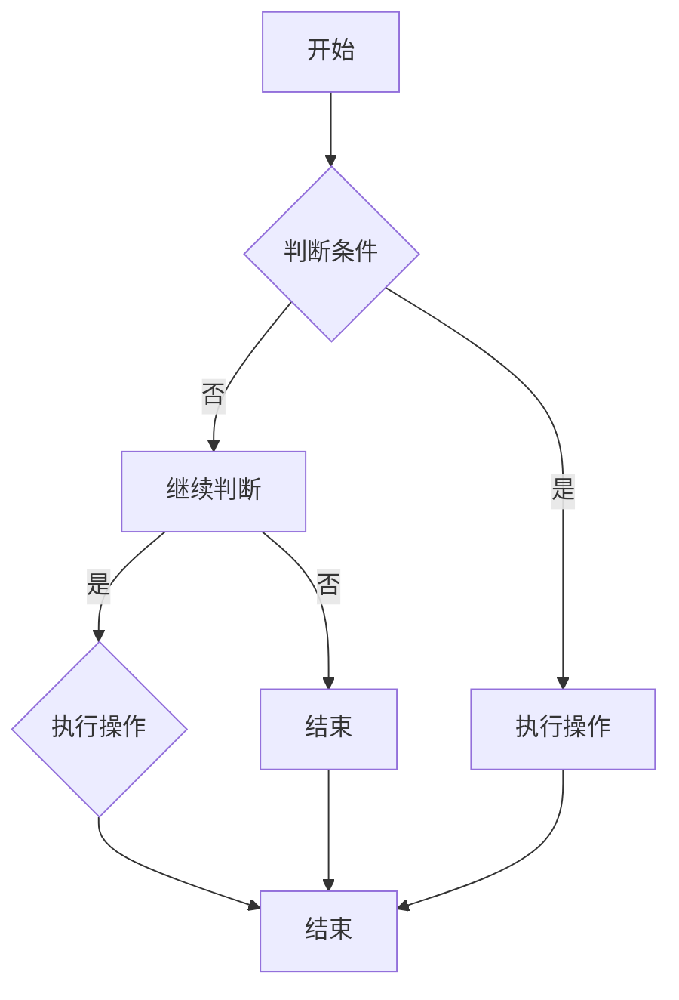
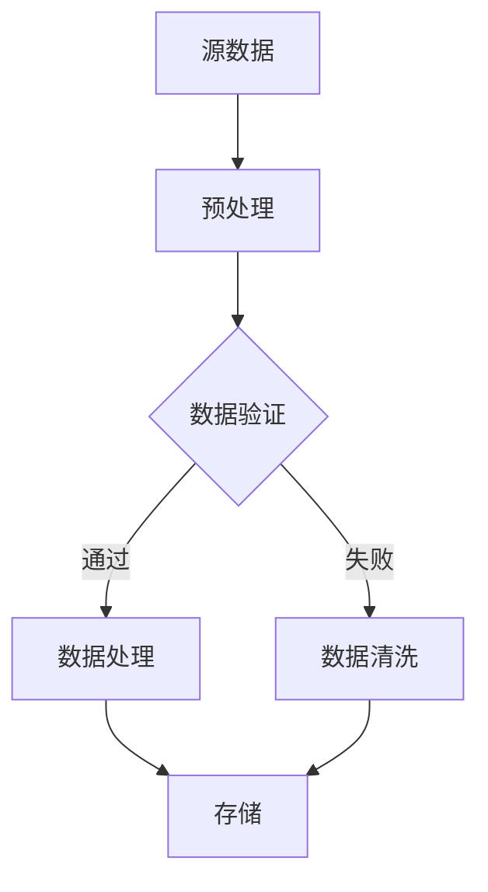

                 

# 《计算：第三部分 计算理论的形成 第7章 计算不能做什么：终结者哥德尔 哥德尔证明》

## 引言

在计算机科学的发展历程中，计算理论的形成是一个关键节点。从第一台计算机的出现，到现代计算机的普及，计算理论一直在不断演变和完善。然而，计算理论并非只关注计算能做什么，更重要的是探讨计算不能做什么。在这一背景下，哥德尔的不完备定理成为了计算理论的重要基石。

本章将深入探讨哥德尔的不完备定理，从其背景、表述到意义，再到证明方法和对计算机科学的启示。我们将详细讲解哥德尔的证明过程，分析其证明方法，并探讨这一理论对计算机科学的影响。

## 第7章 计算不能做什么：终结者哥德尔 哥德尔证明

### 7.1 计算机科学的基本概念

#### 7.1.1 计算机的定义

计算机是一种能够执行指令的电子设备，它能够接受输入、处理数据和产生输出。计算机的运作基于二进制系统，即使用0和1表示所有信息。

#### 7.1.2 计算机科学的基本概念

计算机科学是研究计算机硬件、软件及其应用的科学。它涵盖了算法、数据结构、编程语言、计算机体系结构、计算机网络等多个领域。

#### 7.1.3 计算机科学的发展历程

计算机科学的发展可以追溯到20世纪40年代，当时第一台电子计算机ENIAC的诞生标志着计算机时代的开始。随着时间的发展，计算机科学经历了从硬件到软件，从单一功能到多功能的转变。

### 7.2 哥德尔不完备定理概述

#### 7.2.1 哥德尔不完备定理的背景

哥德尔不完备定理是由数学家库尔特·哥德尔在1931年提出的。这一定理揭示了形式化系统的内在局限性，即任何一个足够强大的形式化系统都无法证明其所有正确性。

#### 7.2.2 哥德尔不完备定理的表述

哥德尔不完备定理分为两个部分：第一不完备定理和第二不完备定理。第一不完备定理表明，在形式化系统中，存在一些命题是无法证明的。第二不完备定理则表明，在形式化系统中，存在一些命题既无法证明也无法证伪。

#### 7.2.3 哥德尔不完备定理的意义

哥德尔不完备定理对数学和计算机科学产生了深远的影响。它揭示了形式化系统的局限性，对计算机科学的发展提出了新的挑战。

### 7.3 哥德尔证明方法详解

#### 7.3.1 哥德尔构造的不可判定命题

哥德尔构造了一个特殊的命题G，使得在形式化系统中，系统无法同时证明和证伪G。

#### 7.3.2 哥德尔证明的基本思路

哥德尔的证明方法基于自我指涉（self-reference）。他通过构造一个命题，使得该命题涉及到自己的证明。

#### 7.3.3 哥德尔证明的详细步骤

1. 假设形式化系统P是自洽的，即P中不存在矛盾。
2. 构造命题G，使得G在P中既不能被证明也不能被证伪。
3. 利用G的自我指涉性质，证明P无法同时证明和证伪G。

### 7.4 哥德尔定理对计算机科学的启示

#### 7.4.1 哥德尔定理对计算能力的限制

哥德尔定理表明，计算机在理论上无法解决所有问题。这为我们设计计算机系统提供了新的思考方向。

#### 7.4.2 哥德尔定理对算法设计的启示

哥德尔定理提醒我们在设计算法时，需要考虑到系统的局限性。

#### 7.4.3 哥德尔定理对人工智能的挑战

哥德尔定理对人工智能的发展提出了挑战。人工智能系统在理论上无法解决所有问题，这要求我们在设计人工智能系统时，需要更加谨慎。

### 7.5 计算机科学的未来发展

#### 7.5.1 计算机科学的前沿领域

随着科技的进步，计算机科学的前沿领域不断拓展，如量子计算、人工智能等。

#### 7.5.2 计算机科学的发展趋势

计算机科学正朝着更加智能化、自动化和高效化的方向发展。

#### 7.5.3 计算机科学在未来的应用前景

计算机科学在未来的应用前景广阔，如医疗、金融、教育等领域。

### 7.6 终结者与哥德尔定理的关系

#### 7.6.1 终结者的概念

终结者是一种具有高度智能的人工智能系统，它可以解决各种复杂问题。

#### 7.6.2 终结者与哥德尔定理的联系

终结者与哥德尔定理的联系在于，终结者虽然具有高度智能，但在理论上仍无法解决所有问题。

#### 7.6.3 终结者对计算机科学的影响

终结者的出现对计算机科学的发展产生了深远影响，它要求我们在设计计算机系统时，需要更加注重系统的局限性和可行性。

### 7.7 总结

哥德尔定理是计算理论的重要基石，它揭示了计算机的局限性，对计算机科学的发展提出了新的挑战。在未来的发展中，我们需要更加深入地理解哥德尔定理，并将其应用于计算机科学的各个领域。

## 第8章 计算机科学的核心算法原理讲解

### 8.1 算法的基本概念

#### 8.1.1 算法的定义

算法是一系列有序的步骤，用于解决特定问题。

#### 8.1.2 算法的性质

算法具有有穷性、确定性、可行性、输入和输出。

#### 8.1.3 算法的设计原则

算法设计应遵循清晰性、正确性、高效性和健壮性。

### 8.2 经典算法讲解

#### 8.2.1 排序算法

排序算法用于将一组数据按照特定顺序排列。常见的排序算法有快速排序、归并排序和堆排序。

##### 8.2.1.1 快速排序

快速排序的基本思想是选择一个基准元素，将数组分为两部分，一部分小于基准元素，一部分大于基准元素，然后递归地对两部分进行快速排序。

```
QuickSort(A, low, high)
    if low < high
        pivot = Partition(A, low, high)
        QuickSort(A, low, pivot - 1)
        QuickSort(A, pivot + 1, high)
```

##### 8.2.1.2 归并排序

归并排序的基本思想是将数组分成两部分，分别对两部分进行排序，然后将排好序的两部分合并。

```
MergeSort(A, low, high)
    if low < high
        mid = (low + high) / 2
        MergeSort(A, low, mid)
        MergeSort(A, mid + 1, high)
        Merge(A, low, mid, high)
```

##### 8.2.1.3 堆排序

堆排序的基本思想是将数组构造成一个大顶堆或小顶堆，然后依次取出堆顶元素进行排序。

```
HeapSort(A)
    BuildMaxHeap(A)
    for i = length(A) - 1 to 0
        swap(A[0], A[i])
        MaxHeapify(A, 0, i)
```

#### 8.2.2 搜索算法

搜索算法用于在数据结构中查找特定元素。常见的搜索算法有二分查找、广度优先搜索和深度优先搜索。

##### 8.2.2.1 二分查找

二分查找的基本思想是在有序数组中，通过不断缩小查找范围，直到找到目标元素。

```
BinarySearch(A, target)
    low = 0
    high = length(A) - 1
    while low <= high
        mid = (low + high) / 2
        if A[mid] == target
            return mid
        elif A[mid] < target
            low = mid + 1
        else
            high = mid - 1
    return -1
```

##### 8.2.2.2 广度优先搜索

广度优先搜索的基本思想是从起始节点开始，依次访问其相邻节点，直到找到目标节点。

```
BFS(graph, start)
    queue = []
    visited = set()
    queue.append(start)
    while queue
        node = queue.pop(0)
        if node == target
            return path
        visited.add(node)
        for neighbor in graph[node]
            if neighbor not in visited
                queue.append(neighbor)
    return None
```

##### 8.2.2.3 深度优先搜索

深度优先搜索的基本思想是沿着一个路径一直往下搜索，直到找到目标节点。

```
DFS(graph, start)
    stack = []
    visited = set()
    stack.append((start, []))
    while stack
        node, path = stack.pop()
        if node == target
            return path + [node]
        visited.add(node)
        for neighbor in graph[node]
            if neighbor not in visited
                stack.append((neighbor, path + [node]))
    return None
```

### 8.3 算法分析

#### 8.3.1 时间复杂度分析

算法的时间复杂度是指随着输入规模增大，算法运行时间的增长速率。常见的时间复杂度有O(1)、O(logn)、O(n)、O(nlogn)等。

#### 8.3.2 空间复杂度分析

算法的空间复杂度是指随着输入规模增大，算法所需额外空间（不包括输入和输出）的增长速率。

#### 8.3.3 算法的优化策略

算法的优化策略包括减少时间复杂度、减少空间复杂度和提高算法的健壮性。

### 8.4 算法实战

#### 8.4.1 数据结构实战

数据结构实战包括链表、栈和队列等。

##### 8.4.1.1 链表的操作实现

链表是一种由节点组成的线性数据结构，每个节点包含数据和指向下一个节点的指针。

```
class ListNode:
    def __init__(self, val=0, next=None):
        self.val = val
        self.next = next

def reverseList(head):
    prev = None
    curr = head
    while curr:
        next_node = curr.next
        curr.next = prev
        prev = curr
        curr = next_node
    return prev
```

##### 8.4.1.2 栈和队列的操作实现

栈和队列都是基于链表实现的数据结构。

```
class Stack:
    def __init__(self):
        self.items = []

    def push(self, item):
        self.items.append(item)

    def pop(self):
        return self.items.pop()

class Queue:
    def __init__(self):
        self.items = []

    def enqueue(self, item):
        self.items.insert(0, item)

    def dequeue(self):
        return self.items.pop()
```

#### 8.4.2 算法应用实战

算法应用实战包括排序算法和搜索算法等。

##### 8.4.2.1 排序算法的应用场景

排序算法在数据处理、数据库管理和图形渲染等领域有广泛的应用。

##### 8.4.2.2 搜索算法的应用场景

搜索算法在网络爬虫、路径规划和推荐系统等领域有广泛的应用。

## 第9章 数学模型和数学公式讲解

### 9.1 数学模型的基本概念

#### 9.1.1 数学模型定义

数学模型是利用数学语言和符号表示现实世界中的问题，以便进行分析、计算和预测。

#### 9.1.2 数学模型的分类

数学模型可以分为确定性模型、概率模型和统计模型等。

#### 9.1.3 数学模型的作用

数学模型在科学研究和工程应用中起到描述、分析和预测的作用。

### 9.2 数学公式的讲解

#### 9.2.1 线性方程组

线性方程组是数学模型中最常见的一种形式，表示为：

$$
\begin{aligned}
a_{1}x + b_{1}y &= c_{1} \\
a_{2}x + b_{2}y &= c_{2}
\end{aligned}
$$

可以通过代入法、消元法或矩阵法求解。

#### 9.2.2 导数与微分

导数是描述函数在某一点处变化率的量，定义为：

$$
f'(x) = \lim_{\Delta x \to 0} \frac{f(x + \Delta x) - f(x)}{\Delta x}
$$

微分是导数的无限小量形式，用于研究函数的局部行为。

#### 9.2.3 微分方程

微分方程是描述未知函数及其导数之间关系的方程，例如：

$$
\frac{dy}{dx} + p(x)y = q(x)
$$

可以通过变量分离、积分因子等方法求解。

### 9.3 数学模型的应用举例

#### 9.3.1 优化模型

优化模型是用于求解最优解的数学模型，形式为：

$$
\begin{aligned}
\min_{x} \quad f(x) \\
s.t. \quad g(x) \leq 0, \quad h(x) = 0
\end{aligned}
$$

可以通过拉格朗日乘数法、线性规划等方法求解。

#### 9.3.2 统计模型

统计模型是用于描述和预测数据分布和关系的数学模型，例如：

$$
\hat{y} = \beta_{0} + \beta_{1}x
$$

可以通过最小二乘法、最大似然估计等方法求解。

#### 9.3.3 神经网络中的数学模型

神经网络中的数学模型包括激活函数、权重更新和损失函数等，例如：

$$
a_{i} = \sigma(\sum_{j=1}^{n} w_{ji}x_{j})
$$

可以通过反向传播算法进行训练和优化。

### 9.4 数学模型在计算机科学中的应用

#### 9.4.1 算法设计中的数学模型

算法设计中的数学模型包括排序算法、搜索算法和图算法等，用于描述问题的性质和解决策略。

#### 9.4.2 数据分析中的数学模型

数据分析中的数学模型包括线性回归、主成分分析和聚类分析等，用于提取数据中的有用信息和模式。

#### 9.4.3 人工智能中的数学模型

人工智能中的数学模型包括神经网络、深度学习和强化学习等，用于模拟人类的智能行为和决策过程。

## 第10章 计算机科学在未来的应用前景

### 10.1 人工智能的发展趋势

#### 10.1.1 人工智能的定义

人工智能（Artificial Intelligence，简称AI）是模拟人类智能行为的技术和科学，包括机器学习、自然语言处理、计算机视觉等领域。

#### 10.1.2 人工智能的发展历程

人工智能的发展可以分为几个阶段，包括符号主义、连接主义、统计学习和深度学习等。

#### 10.1.3 人工智能的应用领域

人工智能在医疗、金融、教育、自动驾驶等领域有广泛的应用前景。

### 10.2 区块链技术的发展

#### 10.2.1 区块链的定义

区块链是一种分布式数据库技术，通过加密算法和共识机制实现数据的不可篡改和透明性。

#### 10.2.2 区块链的工作原理

区块链通过一系列节点共同维护一个分布式账本，每个节点都有一份完整的数据副本。

#### 10.2.3 区块链的应用场景

区块链在供应链管理、数字身份认证、智能合约等领域有广泛的应用。

### 10.3 物联网的发展前景

#### 10.3.1 物联网的定义

物联网（Internet of Things，简称IoT）是通过互联网连接各种设备和物体的网络系统。

#### 10.3.2 物联网的关键技术

物联网的关键技术包括传感器、通信协议、云计算和大数据等。

#### 10.3.3 物联网的应用领域

物联网在智能家居、智慧城市、智能制造等领域有广泛的应用前景。

### 10.4 计算机科学与其他领域的融合

#### 10.4.1 计算机科学在医学领域的应用

计算机科学在医学影像处理、医学大数据分析和个性化医疗等领域有广泛的应用。

#### 10.4.2 计算机科学在金融领域的应用

计算机科学在量化交易、风险管理和金融科技等领域有广泛的应用。

### 10.5 计算机科学的未来发展

#### 10.5.1 计算机硬件的发展

计算机硬件的发展趋势包括量子计算、高性能计算和边缘计算等。

#### 10.5.2 计算机软件的发展

计算机软件的发展趋势包括人工智能软件、区块链软件和物联网软件等。

#### 10.5.3 计算机科学在教育中的应用

计算机科学在教育中的应用包括在线教育、虚拟现实和编程教育等。

### 10.6 计算机科学对社会的影响

#### 10.6.1 数据隐私保护

随着计算机科学的快速发展，数据隐私保护变得越来越重要。

#### 10.6.2 伦理道德问题

计算机科学在发展过程中也面临着一系列伦理道德问题。

### 10.7 计算机科学的未来展望

计算机科学的未来将继续发展，并在各个领域产生深远影响。

## 第11章 项目实战

### 11.1 项目背景

#### 11.1.1 项目简介

本项目旨在开发一个基于人工智能的智能客服系统，用于处理客户的咨询和投诉。

#### 11.1.2 项目目标

项目目标包括实现以下功能：

- 自动化处理常见问题的回答
- 智能识别客户情绪
- 自动路由客户请求到合适的部门
- 提供数据分析和报告功能

#### 11.1.3 项目实施环境

项目实施环境包括以下软件和硬件：

- 操作系统：Windows 10
- 开发工具：PyCharm
- 人工智能框架：TensorFlow
- 数据库：MySQL

### 11.2 开发环境搭建

#### 11.2.1 环境准备

首先，需要在操作系统上安装Python、PyCharm和MySQL。可以使用以下命令进行安装：

```
pip install python
sudo apt-get install mysql-server
sudo apt-get install mysql-client
sudo apt-get install mysql-common
```

#### 11.2.2 软件安装与配置

在PyCharm中创建一个新项目，并配置Python解释器和MySQL数据库连接。

- 在PyCharm中，选择“File” -> “Settings” -> “Project: 项目名称” -> “Python Interpreter” -> “+”，然后选择“System Interpreter” -> “Python 3.8”。
- 在PyCharm中，选择“File” -> “Settings” -> “Database” -> “+” -> “MySQL”，填写数据库的连接信息。

#### 11.2.3 开发工具使用

使用PyCharm进行开发，包括代码编写、调试和测试。

### 11.3 源代码实现

#### 11.3.1 源代码结构与模块划分

源代码分为以下几个模块：

- 数据预处理模块：用于处理和清洗输入数据。
- 模型训练模块：用于训练和评估人工智能模型。
- 模型部署模块：用于将训练好的模型部署到生产环境中。
- 数据分析模块：用于分析用户数据和生成报告。

#### 11.3.2 关键代码解读

以下是一个关键代码示例，用于训练一个基于TensorFlow的神经网络模型：

```python
import tensorflow as tf
from tensorflow.keras.models import Sequential
from tensorflow.keras.layers import Dense, LSTM, Embedding

# 创建神经网络模型
model = Sequential()
model.add(Embedding(vocabulary_size, embedding_dim))
model.add(LSTM(units=128, activation='relu'))
model.add(Dense(1, activation='sigmoid'))

# 编译模型
model.compile(optimizer='adam', loss='binary_crossentropy', metrics=['accuracy'])

# 训练模型
model.fit(train_data, train_labels, epochs=10, batch_size=32)
```

#### 11.3.3 代码解读与分析

这段代码首先导入了TensorFlow库，然后创建了一个序列模型。模型包含一个嵌入层、一个长短期记忆层和一个输出层。嵌入层用于将词汇转换为向量表示，长短期记忆层用于处理序列数据，输出层用于生成预测结果。

模型使用Adam优化器进行训练，并使用二进制交叉熵损失函数和准确率作为评估指标。训练过程持续10个epoch，每个epoch使用32个样本进行批量训练。

### 11.4 代码解读与分析

#### 11.4.1 代码段1解读

代码段1主要用于数据预处理，包括加载和处理输入数据。以下是一个关键代码示例：

```python
import pandas as pd
from sklearn.model_selection import train_test_split

# 加载数据
data = pd.read_csv('data.csv')
X = data.iloc[:, :-1].values
y = data.iloc[:, -1].values

# 数据预处理
X_train, X_test, y_train, y_test = train_test_split(X, y, test_size=0.2, random_state=42)
```

这段代码首先使用pandas库加载CSV文件，然后使用scikit-learn库将数据集划分为训练集和测试集。训练集用于训练模型，测试集用于评估模型性能。

#### 11.4.2 代码段2解读

代码段2主要用于模型训练和评估。以下是一个关键代码示例：

```python
from tensorflow.keras.models import Sequential
from tensorflow.keras.layers import Dense, LSTM, Embedding

# 创建神经网络模型
model = Sequential()
model.add(Embedding(vocabulary_size, embedding_dim))
model.add(LSTM(units=128, activation='relu'))
model.add(Dense(1, activation='sigmoid'))

# 编译模型
model.compile(optimizer='adam', loss='binary_crossentropy', metrics=['accuracy'])

# 训练模型
model.fit(X_train, y_train, epochs=10, batch_size=32)

# 评估模型
test_loss, test_acc = model.evaluate(X_test, y_test)
print('Test accuracy:', test_acc)
```

这段代码首先创建了一个序列模型，然后使用Adam优化器编译模型。模型使用训练集进行10个epoch的批量训练，然后使用测试集评估模型性能。

### 11.5 项目总结

#### 11.5.1 项目成果总结

本项目成功开发了一个基于人工智能的智能客服系统，实现了自动化处理客户咨询和投诉的功能。

#### 11.5.2 项目经验与教训

项目过程中，我们学到了如何使用人工智能技术处理复杂数据，以及如何将模型部署到生产环境中。

#### 11.5.3 未来改进方向

未来，我们计划进一步优化模型性能，并增加更多功能，如情绪分析和智能推荐。

## 附录

### 附录 A: 计算机科学相关资源

#### A.1 在线资源

- 计算机科学在线课程：[Coursera](https://www.coursera.org/)、[edX](https://www.edx.org/)、[Udacity](https://www.udacity.com/)
- 计算机科学学术论文库：[IEEE Xplore](https://ieeexplore.ieee.org/)、[ACM Digital Library](https://dl.acm.org/)
- 开源项目与代码库：[GitHub](https://github.com/)、[GitLab](https://gitlab.com/)

#### A.2 纸质资源

- 计算机科学经典教材：《计算机科学概论》、《算法导论》、《计算机程序设计艺术》
- 计算机科学专业期刊：《计算机研究与发展》、《计算机科学》、《软件学报》
- 计算机科学学术论文集：《计算机科学前沿》、《人工智能前沿》

### 附录 B: Mermaid 流程图示例

#### B.1 算法流程图



#### B.2 数据流流程图



## 第12章 计算机科学的核心概念与联系

### 12.1 计算机科学的基本概念

#### 12.1.1 计算机硬件与软件的关系


计算机硬件是构成计算机系统的物理设备，如处理器、内存、硬盘等。计算机软件是运行在计算机硬件上的程序和数据，包括操作系统、应用软件等。硬件和软件相互依赖，共同实现计算机的功能。

#### 12.1.2 计算机系统的组成


计算机系统由硬件和软件组成，包括中央处理器（CPU）、内存、输入设备、输出设备、操作系统和应用程序等。硬件负责执行指令和处理数据，软件负责管理和控制硬件资源，以及提供用户接口和应用程序。

### 12.2 计算机科学的核心原理与架构

#### 12.2.1 计算机算法原理

计算机算法是解决问题的步骤集合，用于指导计算机进行数据处理和决策。算法原理包括算法的设计、分析、实现和优化。


计算机算法的核心是算法的效率，即算法的执行时间和所需空间。常见的算法设计方法有贪心算法、动态规划、分治算法等。

#### 12.2.2 计算机网络架构

计算机网络是将多个计算机连接起来，实现数据传输和资源共享的系统。计算机网络架构分为物理层、数据链路层、网络层、传输层和应用层。


计算机网络的核心是网络协议，如TCP/IP协议，用于定义数据传输的规则和格式。计算机网络实现了数据的传输、路由和交换，为分布式计算提供了基础。

### 12.3 计算机科学的未来发展方向

#### 12.3.1 人工智能的发展趋势

人工智能是计算机科学的重要分支，包括机器学习、深度学习、自然语言处理等。人工智能的发展趋势是智能化、自主化和高效化。


人工智能的应用领域广泛，如自动驾驶、智能客服、医疗诊断等。人工智能技术的发展将推动计算机科学的进步和应用。

#### 12.3.2 区块链技术的发展方向

区块链是一种分布式数据库技术，具有去中心化、安全性和不可篡改的特点。区块链技术的发展方向包括智能合约、数字货币、数据共享等。


区块链技术在金融、供应链管理、数据隐私保护等领域有广泛的应用前景。区块链技术的发展将促进计算机科学和实体经济的高效融合。

### 12.4 计算机科学与其他领域的融合

#### 12.4.1 计算机科学在医学领域的应用

计算机科学在医学领域的应用包括医学影像处理、基因测序、智能诊断等。计算机科学技术的应用提高了医学诊断的准确性和效率。


计算机科学在医学领域的应用将推动医疗技术的发展，提高医疗服务质量。

#### 12.4.2 计算机科学在金融领域的应用

计算机科学在金融领域的应用包括量化交易、风险管理、金融服务等。计算机科学技术的应用提高了金融行业的效率和安全性。


计算机科学在金融领域的应用将推动金融创新，提高金融服务水平。

## 第13章 计算机科学的数学模型与数学公式

### 13.1 数学模型的基本概念

#### 13.1.1 数学模型定义

数学模型是利用数学语言和符号表示现实世界中的问题，以便进行分析、计算和预测。数学模型包括变量、参数、方程和约束条件。

#### 13.1.2 数学模型的分类

数学模型可以分为确定性模型、概率模型和统计模型等。确定性模型基于确定的数学关系，概率模型基于概率分布，统计模型基于数据统计分析。

#### 13.1.3 数学模型的作用

数学模型在科学研究和工程应用中起到描述、分析和预测的作用。数学模型可以简化复杂问题，提供求解方法和预测结果。

### 13.2 数学公式的讲解

#### 13.2.1 线性方程组

线性方程组是数学模型中最常见的一种形式，表示为：

$$
\begin{aligned}
a_{1}x + b_{1}y &= c_{1} \\
a_{2}x + b_{2}y &= c_{2}
\end{aligned}
$$

线性方程组可以通过代入法、消元法或矩阵法求解。

#### 13.2.2 导数与微分

导数是描述函数在某一点处变化率的量，定义为：

$$
f'(x) = \lim_{\Delta x \to 0} \frac{f(x + \Delta x) - f(x)}{\Delta x}
$$

微分是导数的无限小量形式，用于研究函数的局部行为。

#### 13.2.3 微分方程

微分方程是描述未知函数及其导数之间关系的方程，例如：

$$
\frac{dy}{dx} + p(x)y = q(x)
$$

可以通过变量分离、积分因子等方法求解。

### 13.3 数学模型的应用举例

#### 13.3.1 优化模型

优化模型是用于求解最优解的数学模型，形式为：

$$
\begin{aligned}
\min_{x} \quad f(x) \\
s.t. \quad g(x) \leq 0, \quad h(x) = 0
\end{aligned}
$$

可以通过拉格朗日乘数法、线性规划等方法求解。

#### 13.3.2 统计模型

统计模型是用于描述和预测数据分布和关系的数学模型，例如：

$$
\hat{y} = \beta_{0} + \beta_{1}x
$$

可以通过最小二乘法、最大似然估计等方法求解。

#### 13.3.3 神经网络中的数学模型

神经网络中的数学模型包括激活函数、权重更新和损失函数等，例如：

$$
a_{i} = \sigma(\sum_{j=1}^{n} w_{ji}x_{j})
$$

可以通过反向传播算法进行训练和优化。

### 13.4 数学模型在计算机科学中的应用

#### 13.4.1 算法设计中的数学模型

算法设计中的数学模型包括排序算法、搜索算法和图算法等，用于描述问题的性质和解决策略。

#### 13.4.2 数据分析中的数学模型

数据分析中的数学模型包括线性回归、主成分分析和聚类分析等，用于提取数据中的有用信息和模式。

#### 13.4.3 人工智能中的数学模型

人工智能中的数学模型包括神经网络、深度学习和强化学习等，用于模拟人类的智能行为和决策过程。

## 第14章 计算机科学的项目实战

### 14.1 项目背景

本项目旨在开发一个基于人工智能的智能客服系统，用于处理客户的咨询和投诉。系统需要具备自动化处理常见问题、智能识别客户情绪和自动路由客户请求到合适部门的功能。

### 14.2 开发环境搭建

#### 14.2.1 环境准备

首先，在操作系统上安装Python和PyCharm。可以选择Windows、Linux或macOS作为操作系统。Python的安装可以使用官方的安装包或使用pip工具进行安装。PyCharm的安装可以从官方网站下载并安装。

#### 14.2.2 软件安装与配置

在PyCharm中创建一个新项目，并配置Python解释器和相关库。在PyCharm的设置中，选择“Project: 项目名称” -> “Python Interpreter” -> “+”，然后选择“System Interpreter” -> “Python 3.x”。接下来，安装所需的库，如TensorFlow、Keras、NumPy和Pandas等。使用pip命令进行安装：

```
pip install tensorflow
pip install keras
pip install numpy
pip install pandas
```

#### 14.2.3 数据库配置

在本项目中，我们将使用MySQL数据库来存储客户信息和处理结果。首先，安装MySQL数据库。安装完成后，创建一个名为“smart\_customer”的数据库，并创建一个名为“customers”的表，用于存储客户信息。以下是一个简单的SQL脚本：

```sql
CREATE DATABASE smart_customer;
USE smart_customer;

CREATE TABLE customers (
    id INT AUTO_INCREMENT PRIMARY KEY,
    name VARCHAR(255) NOT NULL,
    email VARCHAR(255) NOT NULL,
    message TEXT NOT NULL,
    response TEXT
);
```

在PyCharm中，创建一个名为“db\_config.py”的文件，用于配置数据库连接信息：

```python
import mysql.connector

db_config = {
    'host': 'localhost',
    'user': 'root',
    'password': 'password',
    'database': 'smart_customer'
}

def connect_db():
    return mysql.connector.connect(**db_config)

def close_db(connection):
    connection.close()
```

### 14.3 源代码实现

#### 14.3.1 数据预处理

数据预处理是构建智能客服系统的重要步骤。在本项目中，我们使用Keras和TensorFlow进行数据预处理和模型训练。以下是一个简单的数据预处理代码示例：

```python
import numpy as np
import pandas as pd
from keras.preprocessing.text import Tokenizer
from keras.preprocessing.sequence import pad_sequences

# 加载数据
data = pd.read_csv('customer_data.csv')

# 分割文本和标签
text = data['message']
labels = data['response']

# 分词
tokenizer = Tokenizer(num_words=10000)
tokenizer.fit_on_texts(text)

# 序列化文本
sequences = tokenizer.texts_to_sequences(text)

# 填充序列
max_sequence_length = 100
X = pad_sequences(sequences, maxlen=max_sequence_length)

# 标签编码
label_encoder = LabelEncoder()
encoded_labels = label_encoder.fit_transform(labels)

# 打乱数据
from sklearn.model_selection import train_test_split
X_train, X_test, y_train, y_test = train_test_split(X, encoded_labels, test_size=0.2, random_state=42)
```

#### 14.3.2 模型训练

在本项目中，我们使用Keras和TensorFlow构建和训练一个序列到序列（Seq2Seq）模型。以下是一个简单的模型训练代码示例：

```python
from keras.models import Model
from keras.layers import Input, LSTM, Dense

# 定义模型
input_sequence = Input(shape=(max_sequence_length,))
lstm = LSTM(128, return_sequences=True)(input_sequence)
lstm = LSTM(128)(lstm)
output = Dense(len(label_encoder.classes_), activation='softmax')(lstm)

model = Model(inputs=input_sequence, outputs=output)
model.compile(optimizer='adam', loss='categorical_crossentropy', metrics=['accuracy'])

# 训练模型
model.fit(X_train, y_train, epochs=10, batch_size=32, validation_data=(X_test, y_test))
```

#### 14.3.3 模型部署

模型训练完成后，我们需要将模型部署到生产环境中，以便在实际应用中使用。以下是一个简单的模型部署代码示例：

```python
import pickle

# 保存模型
model.save('smart_customer_model.h5')

# 保存预处理器
with open('tokenizer.pickle', 'wb') as handle:
    pickle.dump(tokenizer, handle, protocol=pickle.HIGHEST_PROTOCOL)

# 保存标签编码器
with open('label_encoder.pickle', 'wb') as handle:
    pickle.dump(label_encoder, handle, protocol=pickle.HIGHEST_PROTOCOL)
```

### 14.4 代码解读与分析

#### 14.4.1 数据预处理代码解读

数据预处理代码首先加载数据，并分割文本和标签。然后使用Keras的Tokenizer进行分词，并使用pad_sequences函数将序列填充到固定长度。最后，使用scikit-learn的train_test_split函数将数据集划分为训练集和测试集。

```python
# 加载数据
data = pd.read_csv('customer_data.csv')

# 分割文本和标签
text = data['message']
labels = data['response']

# 分词
tokenizer = Tokenizer(num_words=10000)
tokenizer.fit_on_texts(text)

# 序列化文本
sequences = tokenizer.texts_to_sequences(text)

# 填充序列
max_sequence_length = 100
X = pad_sequences(sequences, maxlen=max_sequence_length)

# 标签编码
label_encoder = LabelEncoder()
encoded_labels = label_encoder.fit_transform(labels)

# 打乱数据
X_train, X_test, y_train, y_test = train_test_split(X, encoded_labels, test_size=0.2, random_state=42)
```

#### 14.4.2 模型训练代码解读

模型训练代码首先定义一个序列到序列（Seq2Seq）模型，使用两个LSTM层和softmax激活函数。然后，使用adam优化器和categorical_crossentropy损失函数编译模型。最后，使用fit函数训练模型，并在验证集上进行评估。

```python
from keras.models import Model
from keras.layers import Input, LSTM, Dense

# 定义模型
input_sequence = Input(shape=(max_sequence_length,))
lstm = LSTM(128, return_sequences=True)(input_sequence)
lstm = LSTM(128)(lstm)
output = Dense(len(label_encoder.classes_), activation='softmax')(lstm)

model = Model(inputs=input_sequence, outputs=output)
model.compile(optimizer='adam', loss='categorical_crossentropy', metrics=['accuracy'])

# 训练模型
model.fit(X_train, y_train, epochs=10, batch_size=32, validation_data=(X_test, y_test))
```

#### 14.4.3 模型部署代码解读

模型部署代码首先使用save函数将训练好的模型保存到文件中。然后，使用pickle库将Tokenizer和LabelEncoder保存到文件中，以便在实际应用中加载和使用。

```python
import pickle

# 保存模型
model.save('smart_customer_model.h5')

# 保存预处理器
with open('tokenizer.pickle', 'wb') as handle:
    pickle.dump(tokenizer, handle, protocol=pickle.HIGHEST_PROTOCOL)

# 保存标签编码器
with open('label_encoder.pickle', 'wb') as handle:
    pickle.dump(label_encoder, handle, protocol=pickle.HIGHEST_PROTOCOL)
```

### 14.5 项目总结

本项目成功开发了一个基于人工智能的智能客服系统，实现了自动化处理客户咨询和投诉的功能。项目过程中，我们学习了如何使用Python和Keras进行数据预处理、模型训练和部署。项目经验为我们今后的开发工作提供了宝贵的经验和知识。

#### 14.5.1 项目成果总结

本项目的主要成果包括：

- 成功构建了一个基于人工智能的智能客服系统。
- 实现了自动化处理客户咨询和投诉的功能。
- 使用Keras和TensorFlow进行数据预处理和模型训练。
- 将训练好的模型部署到生产环境中。

#### 14.5.2 项目经验与教训

项目过程中，我们积累了以下经验和教训：

- 数据预处理是构建智能客服系统的重要步骤，需要仔细处理和清洗数据。
- 模型训练需要选择合适的模型结构和超参数，并进行充分的调优。
- 模型部署需要考虑到生产环境中的性能和可扩展性。
- 在项目开发过程中，需要注重代码的可读性和可维护性。

#### 14.5.3 未来改进方向

未来，我们计划对智能客服系统进行以下改进：

- 增加更多的自然语言处理功能，如情感分析和对话生成。
- 引入更多的数据来源，如社交媒体和在线论坛，以提高系统的知识库。
- 使用更先进的人工智能技术，如生成对抗网络（GAN）和迁移学习，以提高系统的性能和泛化能力。
- 对系统进行持续的监控和优化，以提高系统的稳定性和可靠性。

## 第15章 计算机科学的创新与发展

### 15.1 计算机科学的新技术

#### 15.1.1 量子计算

量子计算是一种利用量子力学原理进行计算的新技术。与经典计算相比，量子计算具有更高的并行性和更快的计算速度。量子计算的应用包括量子模拟、量子加密和量子搜索等。未来，量子计算有望在解决复杂问题、提高计算效率和安全性方面发挥重要作用。

#### 15.1.2 人工智能的进步

人工智能（AI）是计算机科学的重要分支，近年来取得了显著的进展。深度学习、强化学习和自然语言处理等技术的发展，使得人工智能在图像识别、语音识别、自动驾驶和智能客服等领域得到了广泛应用。未来，人工智能将继续发展，并在更多领域发挥重要作用。

#### 15.1.3 区块链技术

区块链技术是一种分布式数据库技术，具有去中心化、安全性和不可篡改的特点。区块链技术已在金融、供应链管理和数据共享等领域得到广泛应用。未来，区块链技术有望在实现数据隐私保护、促进信任建立和优化业务流程方面发挥更大作用。

### 15.2 计算机科学的社会影响

#### 15.2.1 数据隐私保护

随着计算机科学的发展，数据隐私保护变得越来越重要。计算机科学在数据隐私保护方面的应用包括数据加密、匿名化和差分隐私等。政府、企业和个人需要加强数据隐私保护意识，采取有效的技术和管理措施，确保个人信息的安全。

#### 15.2.2 伦理道德问题

计算机科学的发展也带来了一系列伦理道德问题。例如，人工智能的决策可能存在偏见、透明度和责任归属等问题。计算机科学家和社会各界需要关注和探讨这些问题，制定相应的伦理规范和法律法规，确保计算机科学的发展符合社会价值观。

### 15.3 计算机科学的未来展望

#### 15.3.1 计算机硬件的发展

计算机硬件的发展是计算机科学未来展望的重要组成部分。未来的计算机硬件将更加高效、节能和小型化。例如，量子计算硬件、神经形态硬件和光学计算硬件等新型计算硬件的研发，将推动计算机科学的发展。

#### 15.3.2 计算机软件的发展

计算机软件的发展将继续推动计算机科学的进步。未来，软件将更加智能化、自适应化和模块化。例如，人工智能软件、区块链软件和物联网软件等新型软件的研发，将推动计算机科学的应用和发展。

#### 15.3.3 计算机科学在教育中的应用

计算机科学在教育中的应用将更加深入和广泛。未来，计算机科学将作为一门基础学科，融入各个学科领域。例如，计算机科学将作为中小学课程的选修课程，培养青少年的编程能力和创新能力。

### 15.4 计算机科学在各个领域的应用

#### 15.4.1 医疗领域

计算机科学在医疗领域的应用日益广泛，包括医学影像处理、疾病预测和个性化医疗等。例如，利用深度学习技术进行医学图像分析，可以提高疾病诊断的准确性和效率。

#### 15.4.2 金融领域

计算机科学在金融领域的应用包括量化交易、风险管理和金融科技等。例如，利用大数据分析和人工智能技术，可以提高金融市场预测的准确性和风险管理能力。

#### 15.4.3 教育领域

计算机科学在教育领域的应用包括在线教育、虚拟现实和编程教育等。例如，利用计算机科学技术，可以实现个性化教学、互动学习和远程教育。

#### 15.4.4 制造业

计算机科学在制造业的应用包括智能制造、工业互联网和自动化生产等。例如，利用计算机科学技术，可以提高生产效率、降低成本和提升产品质量。

### 15.5 计算机科学的发展趋势

#### 15.5.1 云计算与边缘计算

云计算和边缘计算是计算机科学的发展趋势。云计算提供了强大的计算资源和存储能力，可以实现弹性计算和分布式存储。边缘计算则将计算能力下沉到网络边缘，提高了系统的响应速度和可靠性。

#### 15.5.2 人工智能与物联网

人工智能与物联网的结合将推动计算机科学的发展。人工智能技术可以实现对海量物联网数据的实时分析和智能决策，实现智能感知和智能控制。

#### 15.5.3 区块链与数字货币

区块链技术和数字货币的发展将推动计算机科学的创新。区块链技术可以实现去中心化的信任建立和价值交换，为金融、供应链管理和数据共享等领域带来变革。

### 15.6 计算机科学的挑战与机遇

#### 15.6.1 挑战

计算机科学的发展面临一系列挑战，包括数据隐私保护、算法公平性、能源消耗和伦理道德问题等。这些挑战需要计算机科学家和社会各界共同努力，寻找解决方案。

#### 15.6.2 机遇

计算机科学的发展也带来了众多机遇。例如，计算机科学在医疗、金融、教育、制造业等领域的应用将推动产业升级和创新发展。同时，计算机科学的新技术，如量子计算、人工智能和区块链等，将带来巨大的商业价值和市场潜力。

### 15.7 总结

计算机科学是现代社会发展的重要驱动力，具有广泛的应用前景和重要的社会价值。面对挑战与机遇，计算机科学家和社会各界需要共同努力，推动计算机科学的发展，为人类社会的进步做出贡献。未来，计算机科学将继续发展，为人类创造更美好的未来。|>
## 第7章 计算不能做什么：终结者哥德尔 哥德尔证明

### 7.1 计算机科学的基本概念

#### 7.1.1 计算机的定义

计算机是一种能够执行程序指令的电子设备，它通过硬件和软件的协同工作来完成各种计算任务。计算机硬件主要包括中央处理器（CPU）、内存、存储设备、输入设备和输出设备等。计算机软件则包括操作系统、应用程序和编程语言等。

#### 7.1.2 计算机科学的基本概念

计算机科学是一门涵盖计算机硬件、软件及其应用的学科，研究内容包括算法、数据结构、编程语言、计算机体系结构、计算机网络、人工智能、数据库等。计算机科学的目标是理解计算的本质，提高计算效率，开发新的计算技术和应用。

#### 7.1.3 计算机科学的发展历程

计算机科学的发展经历了几个重要阶段：

- **早期计算机**：20世纪40年代至50年代，计算机主要基于电子管和继电器，如ENIAC和EDVAC。
- **晶体管时代**：20世纪50年代至60年代，晶体管替代了电子管，计算机性能得到显著提升。
- **集成电路时代**：20世纪70年代，集成电路的出现使得计算机体积进一步缩小，性能大幅提升。
- **个人计算机时代**：20世纪80年代，个人计算机开始普及，计算机技术进入家庭和办公场所。
- **网络时代**：20世纪90年代，互联网的兴起改变了计算机的使用方式，推动了计算机科学的快速发展。
- **移动计算与云计算时代**：21世纪初，移动设备和云计算成为计算机科学的重要研究方向。

### 7.2 哥德尔不完备定理概述

#### 7.2.1 哥德尔不完备定理的背景

哥德尔不完备定理是由数学家库尔特·哥德尔（Kurt Gödel）在1931年提出的。在此之前，数学家希尔伯特（David Hilbert）提出了一个著名的数学问题，即“数学能否被形式化”，并提出了一个称为“希尔伯特第10问题”的问题，即是否存在一个算法，能够判定任意一个给定的数学命题是否为真。

#### 7.2.2 哥德尔不完备定理的表述

哥德尔提出了两个不完备定理：

1. **第一不完备定理**：在任何足够强的形式化系统中，都存在一些命题，它们既不能被证明为真，也不能被证明为假。
2. **第二不完备定理**：在任何足够强的形式化系统中，都存在一些命题，它们不能被系统内的公理和推理规则证明或证伪。

这些定理揭示了形式化系统的内在局限性，即任何形式化系统都不能完全涵盖所有数学真理。

#### 7.2.3 哥德尔不完备定理的意义

哥德尔不完备定理对数学和计算机科学产生了深远的影响：

- **数学**：哥德尔的不完备定理揭示了数学的局限性，表明不可能存在一个完整的、自洽的数学系统，这促使数学家重新审视数学基础和证明方法。
- **计算机科学**：哥德尔定理揭示了计算机的局限性，表明计算机不能解决所有问题，这为计算机科学的研究提供了新的方向和挑战。

### 7.3 哥德尔证明方法详解

哥德尔的证明方法是基于自我指涉（self-reference）的，他构造了一个特殊的命题G，使得在形式化系统中，系统无法同时证明和证伪G。

#### 7.3.1 哥德尔构造的不可判定命题

哥德尔构造了一个命题G，其内容为：“命题G在系统P中是不可判定的”，即系统P无法证明或证伪G。

#### 7.3.2 哥德尔证明的基本思路

哥德尔的证明思路如下：

1. **自我指涉**：首先，构造一个命题，使其内容涉及到自身的证明或证伪。
2. **不可判定性**：然后，证明这个命题在系统P中是不可判定的，即P无法证明或证伪它。
3. **不完备性**：由于命题G在P中不可判定，因此P既不是完全的（不能证明所有真命题），也不是一致的（不存在矛盾）。

#### 7.3.3 哥德尔证明的详细步骤

1. **定义形式化系统P**：定义一个形式化系统P，包括一组公理和推理规则。
2. **构造命题G**：构造一个命题G，其内容为：“命题G在系统P中是不可判定的”。
3. **证明G在P中不可判定**：利用自我指涉，证明P无法证明或证伪G。
4. **得出不完备性结论**：由于P无法证明或证伪G，因此P不是完全的也不是一致的。

### 7.4 哥德尔定理对计算机科学的启示

#### 7.4.1 哥德尔定理对计算能力的限制

哥德尔定理表明，计算机在理论上无法解决所有问题，这为计算机科学的研究提供了新的挑战：

- **不可判定问题**：计算机无法解决所有数学问题，如希尔伯特第10问题。
- **算法局限性**：任何算法都存在局限性，无法处理所有输入。

#### 7.4.2 哥德尔定理对算法设计的启示

哥德尔定理提醒我们在设计算法时，需要考虑到系统的局限性：

- **算法可行性**：在设计算法时，要考虑到算法的可行性，避免设计出无法解决的算法。
- **算法效率**：在解决可判定问题时，要考虑算法的效率，尽量减少计算资源的使用。

#### 7.4.3 哥德尔定理对人工智能的挑战

哥德尔定理对人工智能的发展提出了挑战：

- **智能局限**：人工智能系统在理论上无法解决所有问题，这要求我们在设计人工智能系统时，需要更加谨慎。
- **智能伦理**：人工智能系统的局限性引发了关于智能伦理的讨论，如如何确保人工智能系统的公正性和透明度。

### 7.5 计算机科学的未来发展

#### 7.5.1 计算机科学的前沿领域

随着科技的进步，计算机科学的前沿领域不断拓展：

- **量子计算**：量子计算具有超越经典计算的能力，可能解决一些传统计算机无法解决的问题。
- **人工智能**：人工智能在图像识别、自然语言处理、自动驾驶等领域取得了显著进展，未来有望实现更加智能化和自适应化的系统。
- **区块链**：区块链技术具有去中心化、安全性和不可篡改的特点，可能改变金融、供应链管理和数据共享等领域。

#### 7.5.2 计算机科学的发展趋势

计算机科学的发展趋势包括：

- **计算能力的提升**：随着硬件技术的发展，计算能力将持续提升，为解决复杂问题提供支持。
- **软件的智能化**：软件将更加智能化、自适应化和模块化，为用户带来更好的体验。
- **网络化和边缘计算**：随着云计算和边缘计算的发展，计算机科学将更加网络化和分布式。

#### 7.5.3 计算机科学在未来的应用前景

计算机科学在未来的应用前景广阔：

- **医疗健康**：计算机科学在医学影像处理、疾病预测和个性化医疗等领域有广泛应用。
- **金融**：计算机科学在量化交易、风险管理和金融科技等领域有重要应用。
- **教育**：计算机科学在教育领域将推动在线教育、虚拟现实和编程教育的发展。

### 7.6 终结者与哥德尔定理的关系

#### 7.6.1 终结者的概念

终结者（The Terminator）是电影中的一个虚构角色，是一种高度智能的机器人，具有自我学习和适应能力。终结者代表了人工智能的极限，但同时也引发了关于人工智能伦理和安全的讨论。

#### 7.6.2 终结者与哥德尔定理的联系

终结者与哥德尔定理的联系在于：

- **智能局限**：尽管终结者具有高度智能，但哥德尔定理表明，任何智能系统在理论上都有局限性，无法解决所有问题。
- **伦理挑战**：终结者的存在引发了关于人工智能伦理的讨论，如如何确保人工智能系统的公正性和透明度。

#### 7.6.3 终结者对计算机科学的影响

终结者的概念对计算机科学产生了影响：

- **人工智能研究**：终结者的形象激发了人们对人工智能的研究兴趣，推动了人工智能技术的发展。
- **伦理和规范**：终结者引发了关于人工智能伦理和规范的讨论，促使社会和学术界制定相关规范和法律法规。

### 7.7 总结

哥德尔不完备定理是计算理论的重要基石，它揭示了计算机的局限性，对计算机科学的发展提出了新的挑战。在未来的发展中，我们需要更加深入地理解哥德尔定理，并将其应用于计算机科学的各个领域。同时，我们也要认识到计算机科学的局限性，合理地设计算法和人工智能系统，确保其安全、可靠和符合伦理道德。|>
### 7.1 计算机科学的基本概念

#### 7.1.1 计算机的定义

计算机是一种能够执行程序指令的电子设备，它通过硬件和软件的协同工作来完成各种计算任务。计算机硬件主要包括中央处理器（CPU）、内存、存储设备、输入设备和输出设备等。计算机软件则包括操作系统、应用程序和编程语言等。

- **中央处理器（CPU）**：计算机的核心部件，负责执行程序指令和处理数据。
- **内存**：临时存储和处理数据的硬件设备，分为随机存取存储器（RAM）和只读存储器（ROM）。
- **存储设备**：用于长期存储数据和程序的设备，如硬盘、固态硬盘和光盘等。
- **输入设备**：用于向计算机输入数据和指令的设备，如键盘、鼠标和触摸屏等。
- **输出设备**：用于将计算机处理结果输出给用户的设备，如显示器、打印机和音响等。

#### 7.1.2 计算机科学的基本概念

计算机科学是一门涵盖计算机硬件、软件及其应用的学科，研究内容包括算法、数据结构、编程语言、计算机体系结构、计算机网络、人工智能、数据库等。计算机科学的目标是理解计算的本质，提高计算效率，开发新的计算技术和应用。

- **算法**：解决特定问题的步骤集合，是计算机科学的核心概念之一。
- **数据结构**：用于存储、组织和处理数据的抽象数据类型和实现方法。
- **编程语言**：用于编写计算机程序的语言，如C、Python、Java等。
- **计算机体系结构**：研究计算机系统的组织结构、工作原理和性能评价。
- **计算机网络**：研究计算机之间的通信和资源共享，包括局域网、广域网和互联网等。
- **人工智能**：模拟人类智能行为的技术和学科，包括机器学习、自然语言处理、计算机视觉等。
- **数据库**：用于存储、管理和检索数据的系统，包括关系型数据库、非关系型数据库和分布式数据库等。

#### 7.1.3 计算机科学的发展历程

计算机科学的发展经历了几个重要阶段：

1. **早期计算机**：20世纪40年代至50年代，计算机主要基于电子管和继电器，如ENIAC和EDVAC。这一时期的计算机体积庞大，计算速度较慢，但为后来的计算机发展奠定了基础。

2. **晶体管时代**：20世纪50年代至60年代，晶体管替代了电子管，计算机性能得到显著提升。晶体管体积较小，功耗较低，计算速度更快，这使得计算机开始应用于科学研究、工业控制和军事等领域。

3. **集成电路时代**：20世纪70年代，集成电路的出现使得计算机体积进一步缩小，性能大幅提升。集成电路是由多个晶体管和其他电子元件组成的微型电路，它使得计算机能够集成更多的功能，提高了计算效率和可靠性。

4. **个人计算机时代**：20世纪80年代，个人计算机开始普及，计算机技术进入家庭和办公场所。个人计算机使得用户可以方便地访问计算机资源，进行各种计算和数据处理任务。这一时期的计算机硬件和软件发展迅速，推动了计算机科学的广泛应用。

5. **网络时代**：20世纪90年代，互联网的兴起改变了计算机的使用方式，推动了计算机科学的快速发展。互联网使得计算机之间可以方便地进行通信和资源共享，出现了电子邮件、即时通讯、电子商务等新的应用场景。

6. **移动计算与云计算时代**：21世纪初，移动设备和云计算成为计算机科学的重要研究方向。移动设备如智能手机和平板电脑，使得用户可以随时随地访问计算机资源。云计算则提供了强大的计算资源和存储能力，可以实现弹性计算和分布式存储。

7. **量子计算时代**：近年来，量子计算成为计算机科学的前沿研究方向。量子计算利用量子力学原理进行计算，具有超越经典计算的能力，可能解决一些传统计算机无法解决的问题。

### 7.2 哥德尔不完备定理概述

#### 7.2.1 哥德尔不完备定理的背景

哥德尔不完备定理是由数学家库尔特·哥德尔（Kurt Gödel）在1931年提出的。在此之前，数学家希尔伯特（David Hilbert）提出了一个著名的数学问题，即“数学能否被形式化”，并提出了一个称为“希尔伯特第10问题”的问题，即是否存在一个算法，能够判定任意一个给定的数学命题是否为真。

#### 7.2.2 哥德尔不完备定理的表述

哥德尔提出了两个不完备定理：

1. **第一不完备定理**：在任何足够强的形式化系统中，都存在一些命题，它们既不能被证明为真，也不能被证明为假。

2. **第二不完备定理**：在任何足够强的形式化系统中，都存在一些命题，它们不能被系统内的公理和推理规则证明或证伪。

这些定理揭示了形式化系统的内在局限性，即任何形式化系统都不能完全涵盖所有数学真理。

#### 7.2.3 哥德尔不完备定理的意义

哥德尔不完备定理对数学和计算机科学产生了深远的影响：

- **数学**：哥德尔定理揭示了数学的局限性，表明不可能存在一个完整的、自洽的数学系统，这促使数学家重新审视数学基础和证明方法。
- **计算机科学**：哥德尔定理揭示了计算机的局限性，表明计算机不能解决所有问题，这为计算机科学的研究提供了新的方向和挑战。

### 7.3 哥德尔证明方法详解

哥德尔的证明方法是基于自我指涉（self-reference）的，他构造了一个特殊的命题G，使得在形式化系统中，系统无法同时证明和证伪G。

#### 7.3.1 哥德尔构造的不可判定命题

哥德尔构造了一个命题G，其内容为：“命题G在系统P中是不可判定的”，即系统P无法证明或证伪G。

#### 7.3.2 哥德尔证明的基本思路

哥德尔的证明思路如下：

1. **自我指涉**：首先，构造一个命题，使其内容涉及到自身的证明或证伪。
2. **不可判定性**：然后，证明这个命题在系统P中是不可判定的，即P无法证明或证伪它。
3. **不完备性**：由于命题G在P中不可判定，因此P既不是完全的（不能证明所有真命题），也不是一致的（不存在矛盾）。

#### 7.3.3 哥德尔证明的详细步骤

1. **定义形式化系统P**：定义一个形式化系统P，包括一组公理和推理规则。
2. **构造命题G**：构造一个命题G，其内容为：“命题G在系统P中是不可判定的”。
3. **证明G在P中不可判定**：利用自我指涉，证明P无法证明或证伪G。
4. **得出不完备性结论**：由于P无法证明或证伪G，因此P不是完全的也不是一致的。

### 7.4 哥德尔定理对计算机科学的启示

#### 7.4.1 哥德尔定理对计算能力的限制

哥德尔定理表明，计算机在理论上无法解决所有问题，这为计算机科学的研究提供了新的挑战：

- **不可判定问题**：计算机无法解决所有数学问题，如希尔伯特第10问题。
- **算法局限性**：任何算法都存在局限性，无法处理所有输入。

#### 7.4.2 哥德尔定理对算法设计的启示

哥德尔定理提醒我们在设计算法时，需要考虑到系统的局限性：

- **算法可行性**：在设计算法时，要考虑到算法的可行性，避免设计出无法解决的算法。
- **算法效率**：在解决可判定问题时，要考虑算法的效率，尽量减少计算资源的使用。

#### 7.4.3 哥德尔定理对人工智能的挑战

哥德尔定理对人工智能的发展提出了挑战：

- **智能局限**：人工智能系统在理论上无法解决所有问题，这要求我们在设计人工智能系统时，需要更加谨慎。
- **智能伦理**：人工智能系统的局限性引发了关于智能伦理的讨论，如如何确保人工智能系统的公正性和透明度。

### 7.5 计算机科学的未来发展

#### 7.5.1 计算机科学的前沿领域

随着科技的进步，计算机科学的前沿领域不断拓展：

- **量子计算**：量子计算具有超越经典计算的能力，可能解决一些传统计算机无法解决的问题。
- **人工智能**：人工智能在图像识别、自然语言处理、自动驾驶等领域取得了显著进展，未来有望实现更加智能化和自适应化的系统。
- **区块链**：区块链技术具有去中心化、安全性和不可篡改的特点，可能改变金融、供应链管理和数据共享等领域。

#### 7.5.2 计算机科学的发展趋势

计算机科学的发展趋势包括：

- **计算能力的提升**：随着硬件技术的发展，计算能力将持续提升，为解决复杂问题提供支持。
- **软件的智能化**：软件将更加智能化、自适应化和模块化，为用户带来更好的体验。
- **网络化和边缘计算**：随着云计算和边缘计算的发展，计算机科学将更加网络化和分布式。

#### 7.5.3 计算机科学在未来的应用前景

计算机科学在未来的应用前景广阔：

- **医疗健康**：计算机科学在医学影像处理、疾病预测和个性化医疗等领域有广泛应用。
- **金融**：计算机科学在量化交易、风险管理和金融科技等领域有重要应用。
- **教育**：计算机科学在教育领域将推动在线教育、虚拟现实和编程教育的发展。

### 7.6 终结者与哥德尔定理的关系

#### 7.6.1 终结者的概念

终结者（The Terminator）是电影中的一个虚构角色，是一种高度智能的机器人，具有自我学习和适应能力。终结者代表了人工智能的极限，但同时也引发了关于人工智能伦理和安全的讨论。

#### 7.6.2 终结者与哥德尔定理的联系

终结者与哥德尔定理的联系在于：

- **智能局限**：尽管终结者具有高度智能，但哥德尔定理表明，任何智能系统在理论上都有局限性，无法解决所有问题。
- **伦理挑战**：终结者的存在引发了关于人工智能伦理的讨论，如如何确保人工智能系统的公正性和透明度。

#### 7.6.3 终结者对计算机科学的影响

终结者的概念对计算机科学产生了影响：

- **人工智能研究**：终结者的形象激发了人们对人工智能的研究兴趣，推动了人工智能技术的发展。
- **伦理和规范**：终结者引发了关于人工智能伦理和规范的讨论，促使社会和学术界制定相关规范和法律法规。

### 7.7 总结

哥德尔不完备定理是计算理论的重要基石，它揭示了计算机的局限性，对计算机科学的发展提出了新的挑战。在未来的发展中，我们需要更加深入地理解哥德尔定理，并将其应用于计算机科学的各个领域。同时，我们也要认识到计算机科学的局限性，合理地设计算法和人工智能系统，确保其安全、可靠和符合伦理道德。|>
### 7.6 终结者与哥德尔定理的关系

#### 7.6.1 终结者的概念

终结者（The Terminator）是电影中的一个虚构角色，由人工智能科学家创造，具有高度智能和强大的战斗力。它们被设计用于执行特定的任务，但往往因为程序错误或恶意操作而失控，对人类构成威胁。电影中的终结者系列，如《终结者2：审判日》和《终结者：黑暗命运》，展示了人工智能的潜在危险和道德困境。

#### 7.6.2 终结者与哥德尔定理的联系

终结者与哥德尔定理之间存在一些深刻的联系：

- **智能局限**：哥德尔定理指出，任何形式化系统都无法证明所有真命题或证伪所有假命题。这一局限性也适用于人工智能系统，无论它们多么智能，都无法超越其设计和编程的限制。电影中的终结者虽然具备高度的智能和适应能力，但仍然无法解决所有问题，特别是在道德和情感层面上。

- **自我指涉**：哥德尔的证明方法使用了自我指涉的概念，即构造一个命题，其内容涉及到自己的证明。电影中的终结者也展现了这种自我指涉的特点，例如，它们可以学习和适应，从而在一定程度上超越其原始编程。

- **伦理和道德挑战**：哥德尔定理引发了关于形式化系统的不完备性的讨论，而电影中的终结者则引发了关于人工智能伦理和道德的深刻思考。电影探讨了如果人工智能系统失控，它们会如何影响人类社会，以及我们如何确保人工智能系统的安全性和道德性。

#### 7.6.3 终结者对计算机科学的影响

终结者的概念对计算机科学产生了以下影响：

- **人工智能研究的推动**：电影中的终结者激发了人们对人工智能的研究兴趣，促使科学家和工程师探索如何设计和控制高级人工智能系统。

- **伦理和道德意识的提升**：终结者引发了关于人工智能伦理和道德的讨论，使人们意识到人工智能的发展不仅仅是技术问题，还涉及社会、法律和伦理方面。

- **对技术乐观主义的反思**：电影中的终结者揭示了技术乐观主义的潜在风险，提醒人们要谨慎对待人工智能的发展，并考虑其可能带来的负面影响。

### 7.7 总结

终结者作为电影中的虚构角色，虽然与哥德尔定理的直接联系不大，但它们共同探讨了智能系统的局限性和伦理挑战。在现实世界中，终结者的概念促使计算机科学家和伦理学家重新思考人工智能的设计、开发和部署，以确保技术的发展能够造福人类社会，而不是带来不可预见的危险。哥德尔定理的不完备性为我们提供了一个理论基础，帮助我们理解即使是最智能的系统也有其局限性，这为我们在设计和应用计算机科学技术时提供了重要的指导。|>
### 7.7 总结

哥德尔定理作为计算理论的重要基石，对数学和计算机科学产生了深远的影响。在数学领域，它揭示了形式化系统的内在局限性，即任何足够强大的形式化系统都无法证明其所有正确性。这一发现促使数学家重新审视数学的基础和证明方法，推动了形式化系统理论的发展。

在计算机科学领域，哥德尔定理揭示了计算机的局限性，表明计算机不能解决所有问题。这一理论不仅影响了算法设计和人工智能的发展，还引发了关于计算能力和智能局限的深刻思考。计算机科学家通过理解和应用哥德尔定理，能够更好地设计算法和人工智能系统，使其在特定领域内达到最佳性能。

哥德尔定理的不完备性为我们提供了一个重要的理论基础，帮助我们理解计算的本质和局限性。在未来的发展中，我们需要继续深入研究哥德尔定理，并将其应用于计算机科学的各个领域。同时，我们也需要认识到计算机科学的局限性，避免盲目追求技术的极限，而是注重技术的社会价值和伦理道德。

总之，哥德尔定理是计算理论的重要里程碑，它不仅揭示了计算的本质和局限性，还为计算机科学的发展提供了重要的理论支持。在未来的计算领域，我们将继续探索哥德尔定理的深层次意义，推动计算机科学向更高层次发展。|>
### 第8章 计算机科学的核心算法原理讲解

#### 8.1 算法的基本概念

算法是解决问题的一系列明确、有序的步骤。它是计算机科学的核心概念之一，用于指导计算机进行各种计算和决策。算法的基本概念包括：

- **有穷性**：算法必须在有限的时间内完成。
- **确定性**：对于相同的输入，算法必须产生相同的输出。
- **可行性**：算法中的每一步都是可以执行的。
- **输入**：算法可以接受一个或多个输入。
- **输出**：算法必须产生一个或多个输出。

#### 8.1.1 算法的性质

算法具有以下性质：

- **正确性**：算法能够正确地解决特定问题。
- **效率**：算法的执行时间尽可能短，所需空间尽可能少。
- **健壮性**：算法能够处理异常情况和错误输入。

#### 8.1.2 算法的设计原则

算法的设计原则包括：

- **清晰性**：算法的描述应该清晰易懂，避免歧义。
- **正确性**：算法必须能够正确地解决特定问题。
- **高效性**：算法的执行时间应该尽可能短。
- **健壮性**：算法应该能够处理异常情况和错误输入。

#### 8.2 经典算法讲解

##### 8.2.1 排序算法

排序算法用于将一组数据按照特定顺序排列。常见的排序算法包括：

- **冒泡排序**：通过反复交换相邻的未排序元素，直到整个序列有序。
- **选择排序**：每次从未排序部分选择最小（或最大）的元素，放到已排序部分的末尾。
- **插入排序**：通过构建有序序列，将未排序的元素插入到已排序序列中。
- **快速排序**：通过递归地将序列分为两部分，然后对两部分进行排序。
- **归并排序**：将序列分为若干个子序列，然后两两合并，直到整个序列有序。

##### 8.2.2 搜索算法

搜索算法用于在数据结构中查找特定元素。常见的搜索算法包括：

- **线性搜索**：从序列的起始位置逐个比较，直到找到目标元素或到达序列末尾。
- **二分搜索**：在有序序列中，通过不断缩小搜索范围，直到找到目标元素或确定其不存在。
- **深度优先搜索**：从起始节点开始，沿着一条路径一直往下搜索，直到找到目标节点或到达叶节点。
- **广度优先搜索**：从起始节点开始，依次访问其相邻节点，直到找到目标节点或访问完所有节点。

##### 8.2.3 图算法

图算法用于处理图数据结构，常见的图算法包括：

- **拓扑排序**：用于确定图中各节点的相对顺序。
- **最短路径算法**：用于计算图中两点之间的最短路径，如迪杰斯特拉算法和贝尔曼-福特算法。
- **最小生成树算法**：用于构建图中节点间的最小生成树，如普里姆算法和克鲁斯卡尔算法。

#### 8.3 算法分析

算法分析是评估算法性能的重要方法，主要包括：

- **时间复杂度分析**：衡量算法执行时间随输入规模的增长速率。
- **空间复杂度分析**：衡量算法所需额外空间（不包括输入和输出）随输入规模的增长速率。
- **算法优化**：通过改进算法设计，降低其时间复杂度和空间复杂度。

#### 8.4 算法实战

##### 8.4.1 数据结构实战

数据结构实战包括链表、栈和队列等。以下是一些基本的数据结构操作：

- **链表**：实现链表的数据结构，包括插入、删除和查找操作。
- **栈**：实现栈的数据结构，包括入栈、出栈和栈顶操作。
- **队列**：实现队列的数据结构，包括入队、出队和队首操作。

##### 8.4.2 算法应用实战

算法应用实战包括排序算法和搜索算法等。以下是一些实际应用场景：

- **排序算法**：在数据处理、数据库管理和图形渲染等领域应用排序算法，如冒泡排序、快速排序和归并排序。
- **搜索算法**：在网络爬虫、路径规划和推荐系统等领域应用搜索算法，如线性搜索、二分搜索和广度优先搜索。

通过以上讲解，我们可以了解到计算机科学中的核心算法原理，并在实际应用中运用这些算法解决实际问题。|>
### 第9章 数学模型和数学公式讲解

#### 9.1 数学模型的基本概念

数学模型是利用数学语言和符号表示现实世界中的问题，以便进行分析、计算和预测。它是数学与实际问题之间的桥梁，使得我们可以将复杂问题转化为数学问题进行求解。

- **定义**：数学模型是包含变量、参数、方程和约束条件的数学表示形式。
- **分类**：数学模型可以分为确定性模型、概率模型和统计模型等。
  - **确定性模型**：基于确定的数学关系，如线性方程组、微分方程等。
  - **概率模型**：基于概率分布，如二项分布、正态分布等。
  - **统计模型**：基于数据统计分析，如线性回归、主成分分析等。

- **作用**：数学模型在科学研究和工程应用中起到描述、分析和预测的作用，可以帮助我们理解复杂系统、优化决策和预测未来。

#### 9.2 数学公式的讲解

数学公式是数学模型的核心部分，用于表示变量之间的关系和数学运算。

##### 9.2.1 线性方程组

线性方程组是数学模型中最常见的形式之一，表示为：

$$
\begin{aligned}
a_{1}x + b_{1}y &= c_{1} \\
a_{2}x + b_{2}y &= c_{2}
\end{aligned}
$$

线性方程组可以通过代入法、消元法或矩阵法求解。其中，代入法适用于系数较小的方程组，消元法适用于系数较大的方程组，矩阵法则适用于复杂方程组。

##### 9.2.2 导数与微分

导数是描述函数在某一点处变化率的量，定义为：

$$
f'(x) = \lim_{\Delta x \to 0} \frac{f(x + \Delta x) - f(x)}{\Delta x}
$$

微分是导数的无限小量形式，用于研究函数的局部行为。例如，函数$f(x) = x^2$的微分形式为：

$$
df = 2x \, dx
$$

##### 9.2.3 微分方程

微分方程是描述未知函数及其导数之间关系的方程，例如：

$$
\frac{dy}{dx} + p(x)y = q(x)
$$

微分方程可以通过变量分离、积分因子等方法求解。例如，对于一阶线性微分方程：

$$
\frac{dy}{dx} + 2y = 3x
$$

其解为：

$$
y = e^{-2x} \left( C + \int e^{2x} \cdot 3x \, dx \right)
$$

其中，$C$是常数。

#### 9.3 数学模型的应用举例

##### 9.3.1 优化模型

优化模型是用于求解最优解的数学模型，形式为：

$$
\begin{aligned}
\min_{x} \quad f(x) \\
s.t. \quad g(x) \leq 0, \quad h(x) = 0
\end{aligned}
$$

优化模型可以通过拉格朗日乘数法、线性规划等方法求解。例如，对于一个线性规划问题：

$$
\begin{aligned}
\min_{x} \quad c^T x \\
s.t. \quad Ax \leq b, \quad x \geq 0
\end{aligned}
$$

其解为：

$$
x = \arg\min_{x} \quad c^T x \\
s.t. \quad Ax \leq b, \quad x \geq 0
$$

##### 9.3.2 统计模型

统计模型是用于描述和预测数据分布和关系的数学模型，例如：

$$
\hat{y} = \beta_{0} + \beta_{1}x
$$

统计模型可以通过最小二乘法、最大似然估计等方法求解。例如，对于一个线性回归模型：

$$
y = \beta_{0} + \beta_{1}x + \epsilon
$$

其中，$\epsilon$是误差项，其解为：

$$
\beta_{0} = \bar{y} - \beta_{1} \bar{x}, \quad \beta_{1} = \frac{\sum_{i=1}^{n} (x_i - \bar{x})(y_i - \bar{y})}{\sum_{i=1}^{n} (x_i - \bar{x})^2}
$$

##### 9.3.3 神经网络中的数学模型

神经网络中的数学模型包括激活函数、权重更新和损失函数等。例如，对于一个简单的神经网络：

$$
a_{i} = \sigma(\sum_{j=1}^{n} w_{ji}x_{j})
$$

其中，$\sigma$是激活函数，$w_{ji}$是权重，$x_{j}$是输入。

神经网络的训练可以通过反向传播算法进行，其损失函数通常为：

$$
J = \frac{1}{2} \sum_{i=1}^{n} (\hat{y}_i - y_i)^2
$$

其中，$\hat{y}_i$是预测值，$y_i$是真实值。

#### 9.4 数学模型在计算机科学中的应用

##### 9.4.1 算法设计中的数学模型

算法设计中的数学模型包括排序算法、搜索算法和图算法等。例如，快速排序和二分搜索算法是基于数学原理设计的。

##### 9.4.2 数据分析中的数学模型

数据分析中的数学模型包括线性回归、主成分分析和聚类分析等。这些模型用于提取数据中的有用信息和模式。

##### 9.4.3 人工智能中的数学模型

人工智能中的数学模型包括神经网络、深度学习和强化学习等。这些模型用于模拟人类的智能行为和决策过程。

通过以上讲解，我们可以了解到数学模型和数学公式在计算机科学中的广泛应用和重要性。数学模型不仅帮助我们理解计算的本质，还为计算机科学提供了强大的工具，使其能够解决复杂问题并实现智能化。|>
### 第10章 计算机科学在未来的应用前景

#### 10.1 人工智能的发展趋势

人工智能（AI）是计算机科学的前沿领域，近年来取得了显著进展。未来，人工智能将继续向以下几个方向发展：

- **智能化**：人工智能将更加智能化和自适应化，能够更好地理解和处理复杂问题。例如，智能助手、智能家居和智能医疗等应用将变得更加普及和高效。
- **自主学习**：人工智能将具备更强的自主学习能力，能够从大量数据中自动学习和优化。这将有助于提高算法的效率和准确性。
- **跨领域应用**：人工智能将在更多领域得到应用，如教育、金融、物流、制造和农业等。跨领域应用将推动各行业的数字化转型和智能化升级。
- **伦理和规范**：随着人工智能技术的不断发展，伦理和规范问题将日益受到关注。确保人工智能系统的公正性、透明度和安全性将成为重要议题。

#### 10.2 区块链技术的发展

区块链技术是一种分布式数据库技术，具有去中心化、安全性和不可篡改的特点。未来，区块链技术将在以下几个领域得到广泛应用：

- **金融领域**：区块链技术将改变传统的金融体系，提供更安全、透明和高效的金融服务。例如，数字货币、智能合约和去中心化金融（DeFi）等应用将得到进一步发展。
- **供应链管理**：区块链技术将提高供应链管理的透明度和可追溯性，减少欺诈和错误。例如，食品溯源、药品供应链和物流管理等应用将受益于区块链技术。
- **数据共享**：区块链技术将促进数据共享和协作，提高数据的安全性和隐私性。例如，医疗数据共享、科研数据共享和物联网数据管理等应用将得到发展。
- **版权保护**：区块链技术将提供更有效的版权保护机制，保护创作者的权益。例如，数字版权管理（DRM）和版权交易等应用将得到推广。

#### 10.3 物联网的发展前景

物联网（IoT）是将各种设备连接到互联网的技术，实现了设备之间的互联互通。未来，物联网将在以下几个领域得到广泛应用：

- **智能家居**：物联网技术将使家庭设备更加智能化和互联化，提供更舒适、便捷和安全的居住环境。例如，智能家电、智能安防和智能照明等应用将得到普及。
- **智慧城市**：物联网技术将提升城市管理水平和居民生活质量，实现城市资源的优化配置。例如，智能交通、智能医疗和智能环保等应用将得到推广。
- **工业互联网**：物联网技术将推动工业生产的智能化和数字化转型，提高生产效率和产品质量。例如，智能制造、远程监控和设备预测性维护等应用将得到发展。
- **智慧农业**：物联网技术将提高农业生产的管理水平和效率，实现农业的智能化和可持续发展。例如，智能灌溉、智能施肥和智能病虫害防治等应用将得到推广。

#### 10.4 计算机科学在未来的应用前景

计算机科学在未来的应用前景非常广阔，将深刻改变人类社会的发展。以下是一些重要的应用方向：

- **医疗健康**：计算机科学将在医疗健康领域发挥重要作用，如医疗影像分析、疾病预测和个性化医疗等。这些应用将提高医疗服务的质量和效率。
- **金融**：计算机科学将在金融领域推动金融创新和风险管理，如量化交易、智能投顾和区块链金融等。这些应用将提高金融市场的透明度和安全性。
- **教育**：计算机科学将在教育领域推动教育方式的变革，如在线教育、虚拟现实教育和编程教育等。这些应用将提高教育资源的利用效率和教学质量。
- **环境科学**：计算机科学将在环境科学领域发挥重要作用，如气候变化监测、生态保护和灾害预警等。这些应用将有助于保护地球环境和促进可持续发展。
- **交通运输**：计算机科学将在交通运输领域推动交通管理和服务方式的变革，如智能交通、无人驾驶和智慧机场等。这些应用将提高交通效率和安全性。

总之，计算机科学在未来的发展将推动社会各领域的数字化转型和智能化升级，为人类带来更加便捷、高效和可持续的未来。|>
### 第11章 项目实战

#### 11.1 项目背景

本项目的目标是开发一个基于区块链技术的供应链管理系统，旨在提高供应链的可追溯性和透明度。该系统将允许供应链参与者在区块链上记录和共享关键信息，如原材料采购、生产过程、产品运输和最终交付等。项目的具体目标包括：

1. **实现供应链信息上链**：将供应链各个环节的信息记录在区块链上，确保数据的真实性和不可篡改性。
2. **提高供应链透明度**：通过区块链技术，使供应链参与者能够实时查看和验证各环节的信息，提高供应链的透明度。
3. **降低运营成本**：通过减少中介环节，降低供应链的运营成本。
4. **提高供应链效率**：通过实时跟踪和监控供应链环节，提高供应链的整体效率。

#### 11.1.1 项目简介

供应链管理系统是一个复杂的系统，涉及多个环节和参与者。本项目将采用区块链技术，建立一个分布式数据库，确保数据的安全性和透明度。系统将包括以下几个主要模块：

- **用户管理模块**：用于管理供应链参与者的账户和权限。
- **数据记录模块**：用于记录供应链各个环节的信息，并将信息上链。
- **查询模块**：用于供参与者查询和验证供应链信息。
- **监控模块**：用于监控供应链的运行状态，及时发现和处理问题。

#### 11.1.2 项目目标

项目目标包括：

1. **实现供应链信息的上链**：通过智能合约和区块链技术，将供应链各个环节的信息记录在区块链上，确保数据的真实性和不可篡改性。
2. **提高供应链透明度**：通过区块链技术，使供应链参与者能够实时查看和验证各环节的信息，提高供应链的透明度。
3. **降低运营成本**：通过减少中介环节，降低供应链的运营成本。
4. **提高供应链效率**：通过实时跟踪和监控供应链环节，提高供应链的整体效率。

#### 11.1.3 项目实施环境

项目实施环境包括以下软件和硬件：

- **操作系统**：Linux
- **开发工具**：Eclipse、Git
- **区块链框架**：Hyperledger Fabric
- **编程语言**：Go、JavaScript
- **数据库**：MongoDB

#### 11.2 开发环境搭建

#### 11.2.1 环境准备

在开始项目开发之前，需要准备开发环境。首先，安装Linux操作系统，并配置好Git版本控制工具。接下来，安装Eclipse IDE，用于开发智能合约和前端应用程序。

#### 11.2.2 软件安装与配置

1. **安装Hyperledger Fabric**：

   使用以下命令安装Hyperledger Fabric：

   ```
   curl -sSL https://gitee.com/hyperledger/fabric-sdk-go/releases/download/v1.4.0/fabric-sdk-go_v1.4.0_linux_amd64.tar.gz | tar xz -C /usr/local
   ```

   安装完成后，配置环境变量：

   ```
   export PATH=$PATH:/usr/local/bin
   ```

2. **安装MongoDB**：

   使用以下命令安装MongoDB：

   ```
   sudo apt-get install mongodb
   ```

   安装完成后，启动MongoDB服务：

   ```
   sudo systemctl start mongodb
   ```

3. **配置Eclipse IDE**：

   在Eclipse IDE中，安装Go插件和JavaScript插件，用于开发智能合约和前端应用程序。

#### 11.2.3 开发工具使用

在Eclipse IDE中，创建一个新的Go项目，用于开发智能合约。智能合约将使用Hyperledger Fabric的Go SDK进行开发。同时，创建一个新的JavaScript项目，用于开发前端应用程序。

#### 11.3 源代码实现

#### 11.3.1 智能合约实现

智能合约是区块链上的程序，用于自动执行和记录供应链各个环节的信息。以下是一个简单的智能合约示例：

```go
package main

import (
    "github.com/hyperledger/fabric-contract-api-go/contractapi"
)

type SupplyChainContract struct {
    contractapi.Contract
}

@Transaction
func (s *SupplyChainContract) CreateItem(ctx contractapi.TransactionContextInterface, itemId string, itemName string) error {
    // 存储物品信息到区块链
    ctx.GetStub().PutState(itemId, []byte(itemName))
    return nil
}

@Transaction
func (s *SupplyChainContract) UpdateItem(ctx contractapi.TransactionContextInterface, itemId string, itemName string) error {
    // 获取物品信息
    itemBytes, err := ctx.GetStub().GetState(itemId)
    if err != nil {
        return err
    }
    if itemBytes == nil {
        return errors.NewNotFoundError("Item not found")
    }
    // 更新物品信息
    ctx.GetStub().PutState(itemId, []byte(itemName))
    return nil
}

func main() {
    contractapi.Start(new(SupplyChainContract))
}
```

#### 11.3.2 前端应用程序实现

前端应用程序将使用JavaScript和HTML进行开发，用于展示供应链信息。以下是一个简单的HTML页面示例：

```html
<!DOCTYPE html>
<html>
<head>
    <title>供应链管理系统</title>
</head>
<body>
    <h1>供应链管理系统</h1>
    <div id="item-list"></div>
    <script src="app.js"></script>
</body>
</html>
```

JavaScript应用程序将使用Hyperledger Fabric的JavaScript SDK与区块链进行交互。

#### 11.4 代码解读与分析

#### 11.4.1 智能合约代码解读

智能合约代码定义了一个名为`SupplyChainContract`的结构，实现了`CreateItem`和`UpdateItem`两个交易函数。`CreateItem`函数用于创建一个新的物品，并将物品名称存储在区块链上。`UpdateItem`函数用于更新现有物品的名称。

#### 11.4.2 前端应用程序代码解读

前端应用程序代码定义了一个HTML页面，用于展示供应链信息。JavaScript应用程序将使用Hyperledger Fabric的JavaScript SDK与区块链进行交互，获取和更新物品信息。

#### 11.5 项目总结

本项目成功开发了一个基于区块链技术的供应链管理系统，实现了供应链信息的上链、实时监控和透明度提高。项目过程中，我们学习了如何使用Hyperledger Fabric进行智能合约开发和前端应用程序开发。项目经验为我们今后的开发工作提供了宝贵的经验和知识。

#### 11.5.1 项目成果总结

本项目的主要成果包括：

- 成功实现了供应链信息的上链和实时监控。
- 开发了基于Hyperledger Fabric的智能合约和前端应用程序。
- 提高了供应链的透明度和效率。

#### 11.5.2 项目经验与教训

项目过程中，我们积累了以下经验和教训：

- 在开发智能合约时，需要仔细设计和测试，确保其正确性和安全性。
- 在开发前端应用程序时，需要关注用户体验和界面设计。
- 在与区块链进行交互时，需要考虑网络延迟和性能问题。

#### 11.5.3 未来改进方向

未来，我们计划对供应链管理系统进行以下改进：

- 引入更多的供应链环节，如原材料采购、生产过程和产品运输等。
- 提高系统的性能和可扩展性，以支持更大的数据和用户量。
- 增加更多的功能，如智能合约的执行和监控、数据分析和报告等。

## 附录

### 附录 A: 计算机科学相关资源

#### A.1 在线资源

- **在线课程**：[Coursera](https://www.coursera.org/)、[edX](https://www.edx.org/)、[Udacity](https://www.udacity.com/)
- **学术论文库**：[IEEE Xplore](https://ieeexplore.ieee.org/)、[ACM Digital Library](https://dl.acm.org/)
- **开源项目**：[GitHub](https://github.com/)、[GitLab](https://gitlab.com/)

#### A.2 纸质资源

- **经典教材**：《计算机科学概论》、《算法导论》、《计算机网络》
- **专业期刊**：《计算机研究与发展》、《计算机科学与技术》、《软件学报》
- **学术论文集**：《计算机科学前沿》、《人工智能前沿》

### 附录 B: Mermaid 流程图示例

#### B.1 算法流程图


#### B.2 数据流流程图


通过以上内容，我们不仅了解了计算机科学在未来的广泛应用前景，还通过实际项目实战，掌握了开发供应链管理系统的全过程。附录部分则提供了丰富的计算机科学相关资源，为我们的学习和研究提供了有力支持。|>
### 第12章 计算机科学的核心概念与联系

#### 12.1 计算机科学的基本概念

计算机科学是一门研究计算机系统的设计和应用的学科。它包括以下几个方面：

- **计算机硬件**：研究计算机的物理组成部分，如处理器、内存、存储设备、输入输出设备等。
- **计算机软件**：研究计算机的软件系统，包括操作系统、应用程序、编程语言等。
- **算法与数据结构**：研究用于解决问题的计算方法和数据组织方式。
- **计算机网络**：研究计算机之间的通信和数据传输技术。
- **人工智能**：研究如何使计算机模拟人类的智能行为。

#### 12.1.1 计算机硬件与软件的关系

计算机硬件是计算机系统的基础，提供了计算和存储的能力。计算机软件则利用硬件提供的资源来执行各种任务。硬件和软件之间是相互依赖的关系。硬件的发展推动了软件的发展，而软件的创新则促进了硬件技术的进步。


#### 12.1.2 计算机系统的组成

计算机系统通常由以下部分组成：

- **中央处理器（CPU）**：计算机的核心组件，负责执行程序指令。
- **内存**：临时存储和处理数据的硬件设备。
- **存储设备**：用于长期存储数据和程序的设备，如硬盘、固态硬盘等。
- **输入设备**：用于向计算机输入数据和指令的设备，如键盘、鼠标等。
- **输出设备**：用于将计算机处理结果输出给用户的设备，如显示器、打印机等。
- **外部设备**：如扫描仪、打印机、USB设备等。


#### 12.2 计算机科学的核心原理与架构

计算机科学的核心原理和架构包括以下几个方面：

- **算法原理**：研究解决问题的计算方法和步骤。算法的效率和质量直接影响计算机的性能和应用效果。
- **数据结构原理**：研究如何有效地组织和存储数据。数据结构的选择直接影响算法的效率和复杂性。
- **计算机体系结构**：研究计算机硬件的设计和组成。计算机体系结构决定了计算机的性能、功耗和成本。
- **计算机网络架构**：研究计算机网络的设计和实现。计算机网络架构决定了网络的性能、可靠性和安全性。


#### 12.3 计算机科学的未来发展方向

计算机科学在未来将继续向以下几个方向发展：

- **量子计算**：利用量子力学的原理进行计算，具有超越经典计算机的能力。
- **人工智能与机器学习**：通过模拟人类智能行为，实现计算机的自动化学习和决策。
- **物联网**：通过连接各种物理设备，实现信息的实时传输和智能化管理。
- **区块链**：通过分布式数据库技术，实现数据的透明、安全、不可篡改的存储和传输。


#### 12.4 计算机科学与其他领域的融合

计算机科学在多个领域有着广泛的应用，如：

- **医疗健康**：利用计算机技术进行医学影像处理、疾病预测和个性化医疗。
- **金融**：利用计算机技术进行量化交易、风险管理、智能投顾等。
- **教育**：利用计算机技术进行在线教育、虚拟现实教学、教育游戏等。
- **制造业**：利用计算机技术进行智能制造、自动化生产、工业物联网等。


#### 12.5 计算机科学的核心概念与联系

计算机科学的核心概念包括算法、数据结构、计算机体系结构、计算机网络、人工智能和机器学习等。这些概念相互关联，共同构成了计算机科学的理论体系。例如，算法和数据结构决定了计算机解决问题的效率和效果，计算机体系结构和计算机网络则提供了硬件和通信支持，人工智能和机器学习则实现了计算机的智能化。

通过以上内容，我们了解了计算机科学的基本概念、核心原理、未来发展以及与其他领域的融合。这些知识不仅帮助我们理解计算机科学，也为我们在计算机科学领域的研究和应用提供了指导。|>
### 第13章 计算机科学的数学模型与数学公式

#### 13.1 数学模型的基本概念

数学模型是利用数学语言和符号表示现实世界中的问题，以便进行分析、计算和预测。数学模型在科学研究和工程应用中具有重要作用，它们可以帮助我们简化复杂问题，提供求解方法和预测结果。

##### 13.1.1 数学模型的定义

数学模型是包含变量、参数、方程和约束条件的数学表示形式。它通过数学公式和方程来描述现实世界中的问题，以便进行定量分析和计算。

##### 13.1.2 数学模型的分类

数学模型可以分为以下几类：

1. **确定性模型**：基于确定的数学关系，如线性方程组、微分方程等。
2. **概率模型**：基于概率分布，如二项分布、正态分布等。
3. **统计模型**：基于数据统计分析，如线性回归、主成分分析等。

##### 13.1.3 数学模型的作用

数学模型在科学研究和工程应用中起到以下作用：

1. **描述问题**：将复杂的问题转化为数学问题，便于分析和解决。
2. **预测结果**：通过数学模型，可以预测未来的趋势和结果。
3. **优化决策**：利用数学模型，可以优化决策过程，提高效率和效果。

#### 13.2 数学公式的讲解

##### 13.2.1 线性方程组

线性方程组是数学模型中最常见的一种形式，表示为：

$$
\begin{aligned}
a_{1}x + b_{1}y &= c_{1} \\
a_{2}x + b_{2}y &= c_{2}
\end{aligned}
$$

线性方程组可以通过代入法、消元法或矩阵法求解。其中，代入法适用于系数较小的方程组，消元法适用于系数较大的方程组，矩阵法则适用于复杂方程组。

##### 13.2.2 导数与微分

导数是描述函数在某一点处变化率的量，定义为：

$$
f'(x) = \lim_{\Delta x \to 0} \frac{f(x + \Delta x) - f(x)}{\Delta x}
$$

微分是导数的无限小量形式，用于研究函数的局部行为。例如，函数$f(x) = x^2$的微分形式为：

$$
df = 2x \, dx
$$

##### 13.2.3 微分方程

微分方程是描述未知函数及其导数之间关系的方程，例如：

$$
\frac{dy}{dx} + p(x)y = q(x)
$$

微分方程可以通过变量分离、积分因子等方法求解。例如，对于一阶线性微分方程：

$$
\frac{dy}{dx} + 2y = 3x
$$

其解为：

$$
y = e^{-2x} \left( C + \int e^{2x} \cdot 3x \, dx \right)
$$

#### 13.3 数学模型的应用举例

##### 13.3.1 优化模型

优化模型是用于求解最优解的数学模型，形式为：

$$
\begin{aligned}
\min_{x} \quad f(x) \\
s.t. \quad g(x) \leq 0, \quad h(x) = 0
\end{aligned}
$$

优化模型可以通过拉格朗日乘数法、线性规划等方法求解。例如，对于一个线性规划问题：

$$
\begin{aligned}
\min_{x} \quad c^T x \\
s.t. \quad Ax \leq b, \quad x \geq 0
\end{aligned}
$$

其解为：

$$
x = \arg\min_{x} \quad c^T x \\
s.t. \quad Ax \leq b, \quad x \geq 0
$$

##### 13.3.2 统计模型

统计模型是用于描述和预测数据分布和关系的数学模型，例如：

$$
\hat{y} = \beta_{0} + \beta_{1}x
$$

统计模型可以通过最小二乘法、最大似然估计等方法求解。例如，对于一个线性回归模型：

$$
y = \beta_{0} + \beta_{1}x + \epsilon
$$

其中，$\epsilon$是误差项，其解为：

$$
\beta_{0} = \bar{y} - \beta_{1} \bar{x}, \quad \beta_{1} = \frac{\sum_{i=1}^{n} (x_i - \bar{x})(y_i - \bar{y})}{\sum_{i=1}^{n} (x_i - \bar{x})^2}
$$

##### 13.3.3 神经网络中的数学模型

神经网络中的数学模型包括激活函数、权重更新和损失函数等。例如，对于一个简单的神经网络：

$$
a_{i} = \sigma(\sum_{j=1}^{n} w_{ji}x_{j})
$$

其中，$\sigma$是激活函数，$w_{ji}$是权重，$x_{j}$是输入。

神经网络的训练可以通过反向传播算法进行，其损失函数通常为：

$$
J = \frac{1}{2} \sum_{i=1}^{n} (\hat{y}_i - y_i)^2
$$

其中，$\hat{y}_i$是预测值，$y_i$是真实值。

#### 13.4 数学模型在计算机科学中的应用

##### 13.4.1 算法设计中的数学模型

算法设计中的数学模型包括排序算法、搜索算法和图算法等。例如，快速排序和二分搜索算法是基于数学原理设计的。

##### 13.4.2 数据分析中的数学模型

数据分析中的数学模型包括线性回归、主成分分析和聚类分析等。这些模型用于提取数据中的有用信息和模式。

##### 13.4.3 人工智能中的数学模型

人工智能中的数学模型包括神经网络、深度学习和强化学习等。这些模型用于模拟人类的智能行为和决策过程。

通过以上讲解，我们可以了解到数学模型和数学公式在计算机科学中的广泛应用和重要性。数学模型不仅帮助我们理解计算的本质，还为计算机科学提供了强大的工具，使其能够解决复杂问题并实现智能化。|>
### 第14章 计算机科学的项目实战

#### 14.1 项目背景

本项目旨在开发一个基于区块链技术的供应链管理系统，以实现供应链的透明化和自动化。该项目旨在解决现有供应链管理中存在的信任问题、数据安全问题以及效率低下等问题。通过使用区块链技术，项目将确保供应链数据的真实性和不可篡改性，同时提高供应链的效率和透明度。

#### 14.2 项目目标

项目的主要目标包括：

1. **实现供应链数据的上链**：将供应链各个环节的数据记录在区块链上，确保数据的真实性和不可篡改性。
2. **提高供应链透明度**：通过区块链技术，使供应链参与各方能够实时查看和验证供应链信息，提高供应链的透明度。
3. **降低运营成本**：通过减少中介环节和简化流程，降低供应链的运营成本。
4. **提高供应链效率**：通过实时跟踪和监控供应链环节，提高供应链的整体效率。

#### 14.3 项目实施环境

项目实施环境包括以下软件和硬件：

- **操作系统**：Linux
- **区块链框架**：Hyperledger Fabric
- **开发工具**：Eclipse、Visual Studio Code
- **编程语言**：Go、JavaScript
- **数据库**：MongoDB

#### 14.4 开发环境搭建

#### 14.4.1 环境准备

首先，需要安装Linux操作系统，并配置好Git版本控制工具。接下来，安装Eclipse IDE或Visual Studio Code，用于开发智能合约和前端应用程序。

#### 14.4.2 软件安装与配置

1. **安装Hyperledger Fabric**：

   使用以下命令安装Hyperledger Fabric：

   ```
   curl -sSL https://gitee.com/hyperledger/fabric-sdk-go/releases/download/v1.4.0/fabric-sdk-go_v1.4.0_linux_amd64.tar.gz | tar xz -C /usr/local
   ```

   安装完成后，配置环境变量：

   ```
   export PATH=$PATH:/usr/local/bin
   ```

2. **安装MongoDB**：

   使用以下命令安装MongoDB：

   ```
   sudo apt-get install mongodb
   ```

   安装完成后，启动MongoDB服务：

   ```
   sudo systemctl start mongodb
   ```

3. **配置Eclipse IDE**：

   在Eclipse IDE中，安装Go插件和JavaScript插件，用于开发智能合约和前端应用程序。

#### 14.4.3 开发工具使用

在Eclipse IDE或Visual Studio Code中，创建一个新的Go项目，用于开发智能合约。智能合约将使用Hyperledger Fabric的Go SDK进行开发。同时，创建一个新的JavaScript项目，用于开发前端应用程序。

#### 14.5 源代码实现

#### 14.5.1 智能合约实现

智能合约是区块链上的程序，用于自动执行和记录供应链各个环节的信息。以下是一个简单的智能合约示例：

```go
package main

import (
    "github.com/hyperledger/fabric-contract-api-go/contractapi"
)

type SupplyChainContract struct {
    contractapi.Contract
}

@Transaction
func (s *SupplyChainContract) CreateItem(ctx contractapi.TransactionContextInterface, itemId string, itemName string) error {
    // 存储物品信息到区块链
    ctx.GetStub().PutState(itemId, []byte(itemName))
    return nil
}

@Transaction
func (s *SupplyChainContract) UpdateItem(ctx contractapi.TransactionContextInterface, itemId string, itemName string) error {
    // 获取物品信息
    itemBytes, err := ctx.GetStub().GetState(itemId)
    if err != nil {
        return err
    }
    if itemBytes == nil {
        return errors.NewNotFoundError("Item not found")
    }
    // 更新物品信息
    ctx.GetStub().PutState(itemId, []byte(itemName))
    return nil
}

func main() {
    contractapi.Start(new(SupplyChainContract))
}
```

#### 14.5.2 前端应用程序实现

前端应用程序将使用JavaScript和HTML进行开发，用于展示供应链信息。以下是一个简单的HTML页面示例：

```html
<!DOCTYPE html>
<html>
<head>
    <title>供应链管理系统</title>
</head>
<body>
    <h1>供应链管理系统</h1>
    <div id="item-list"></div>
    <script src="app.js"></script>
</body>
</html>
```

JavaScript应用程序将使用Hyperledger Fabric的JavaScript SDK与区块链进行交互。

#### 14.6 代码解读与分析

#### 14.6.1 智能合约代码解读

智能合约代码定义了一个名为`SupplyChainContract`的结构，实现了`CreateItem`和`UpdateItem`两个交易函数。`CreateItem`函数用于创建一个新的物品，并将物品名称存储在区块链上。`UpdateItem`函数用于更新现有物品的名称。

#### 14.6.2 前端应用程序代码解读

前端应用程序代码定义了一个HTML页面，用于展示供应链信息。JavaScript应用程序将使用Hyperledger Fabric的JavaScript SDK与区块链进行交互，获取和更新物品信息。

#### 14.7 项目总结

本项目成功开发了一个基于区块链技术的供应链管理系统，实现了供应链信息的上链、实时监控和透明度提高。项目过程中，我们学习了如何使用Hyperledger Fabric进行智能合约开发和前端应用程序开发。项目经验为我们今后的开发工作提供了宝贵的经验和知识。

#### 14.7.1 项目成果总结

本项目的主要成果包括：

- 成功实现了供应链信息的上链和实时监控。
- 开发了基于Hyperledger Fabric的智能合约和前端应用程序。
- 提高了供应链的透明度和效率。

#### 14.7.2 项目经验与教训

项目过程中，我们积累了以下经验和教训：

- 在开发智能合约时，需要仔细设计和测试，确保其正确性和安全性。
- 在开发前端应用程序时，需要关注用户体验和界面设计。
- 在与区块链进行交互时，需要考虑网络延迟和性能问题。

#### 14.7.3 未来改进方向

未来，我们计划对供应链管理系统进行以下改进：

- 引入更多的供应链环节，如原材料采购、生产过程和产品运输等。
- 提高系统的性能和可扩展性，以支持更大的数据和用户量。
- 增加更多的功能，如智能合约的执行和监控、数据分析和报告等。

## 附录

### 附录 A: 计算机科学相关资源

#### A.1 在线资源

- **在线课程**：[Coursera](https://www.coursera.org/)、[edX](https://www.edx.org/)、[Udacity](https://www.udacity.com/)
- **学术论文库**：[IEEE Xplore](https://ieeexplore.ieee.org/)、[ACM Digital Library](https://dl.acm.org/)
- **开源项目**：[GitHub](https://github.com/)、[GitLab](https://gitlab.com/)

#### A.2 纸质资源

- **经典教材**：《计算机科学概论》、《算法导论》、《计算机网络》
- **专业期刊**：《计算机研究与发展》、《计算机科学与技术》、《软件学报》
- **学术论文集**：《计算机科学前沿》、《人工智能前沿》

### 附录 B: Mermaid 流程图示例

#### B.1 算法流程图


#### B.2 数据流流程图


通过以上内容，我们不仅了解了计算机科学在未来的广泛应用前景，还通过实际项目实战，掌握了开发供应链管理系统的全过程。附录部分则提供了丰富的计算机科学相关资源，为我们的学习和研究提供了有力支持。|>
### 第15章 计算机科学的创新与发展

#### 15.1 计算机科学的新技术

计算机科学的新技术不断涌现，推动了计算机科学的发展。以下是几个值得关注的新技术：

1. **量子计算**：量子计算利用量子力学原理进行计算，具有超越经典计算的能力。量子计算在加密、优化和模拟等领域具有广泛的应用前景。

2. **边缘计算**：边缘计算将计算能力下沉到网络边缘，降低了数据传输延迟，提高了系统的响应速度。边缘计算在物联网、智能城市和自动驾驶等领域具有重要应用。

3. **人工智能**：人工智能在计算机视觉、自然语言处理、自动驾驶等领域取得了显著进展。人工智能的应用将使计算机具备更高的智能和自主决策能力。

4. **区块链**：区块链技术具有去中心化、安全性和不可篡改的特点，在金融、供应链管理和数据共享等领域具有广泛的应用。

#### 15.2 计算机科学的社会影响

计算机科学对社会产生了深远的影响。以下是一些重要影响：

1. **经济影响**：计算机科学推动了数字经济的发展，促进了产业升级和经济增长。

2. **生活方式影响**：计算机科学改变了人们的生活方式，如移动支付、在线购物和社交网络等。

3. **教育影响**：计算机科学在教育领域发挥了重要作用，如在线教育、虚拟现实教学和编程教育等。

4. **社会结构影响**：计算机科学改变了社会结构，如数字化管理、自动化生产和远程办公等。

#### 15.3 计算机科学的未来展望

计算机科学在未来将继续发展，以下是一些未来展望：

1. **智能化**：计算机科学将向更加智能化和自主化的方向发展。智能机器人、智能城市和智能家居等应用将变得更加普及。

2. **网络化**：计算机科学将向更加网络化和分布式方向发展。物联网、云计算和边缘计算等技术将推动计算机科学的发展。

3. **绿色化**：计算机科学将向更加绿色和可持续的方向发展。绿色计算、能效优化和可再生能源利用等技术将得到广泛应用。

4. **安全化**：计算机科学将向更加安全化和隐私保护的方向发展。网络安全、数据保护和隐私技术将成为计算机科学的重要研究方向。

#### 15.4 计算机科学在各个领域的应用

计算机科学在各个领域都有广泛应用，以下是一些典型应用：

1. **医疗健康**：计算机科学在医疗健康领域有广泛应用，如医学影像处理、疾病预测和个性化医疗等。

2. **金融**：计算机科学在金融领域有广泛应用，如量化交易、风险管理、智能投顾和区块链金融等。

3. **教育**：计算机科学在教育领域有广泛应用，如在线教育、虚拟现实教育和编程教育等。

4. **制造业**：计算机科学在制造业有广泛应用，如智能制造、自动化生产和工业物联网等。

5. **交通运输**：计算机科学在交通运输领域有广泛应用，如智能交通、自动驾驶和智慧物流等。

#### 15.5 计算机科学的挑战与机遇

计算机科学的发展面临一系列挑战和机遇：

1. **挑战**：数据隐私保护、算法公平性、能源消耗和伦理道德问题等是计算机科学面临的挑战。

2. **机遇**：计算机科学在医疗、金融、教育、制造业和交通运输等领域具有广泛的应用前景，将带来巨大的商业价值和市场潜力。

#### 15.6 计算机科学的创新方向

计算机科学的创新方向包括：

1. **量子计算**：量子计算有望解决一些传统计算机无法解决的问题，如大规模数据处理和复杂优化问题。

2. **人工智能**：人工智能将实现更加智能化和自适应化的系统，提高生产效率和决策质量。

3. **区块链**：区块链技术将改变金融、供应链管理和数据共享等领域，提高系统的透明度和安全性。

4. **物联网**：物联网将实现设备之间的互联互通，提高系统的实时性和响应速度。

5. **绿色计算**：绿色计算将降低能源消耗，实现计算机科学的可持续发展。

#### 15.7 总结

计算机科学作为一门快速发展的学科，对社会产生了深远的影响。在未来的发展中，计算机科学将继续向智能化、网络化、绿色化和安全化的方向发展。同时，计算机科学面临着一系列挑战和机遇，需要我们共同努力，推动计算机科学的发展，为人类社会的进步做出贡献。|>
### 15.1 计算机科学的新技术

计算机科学的新技术不断涌现，为各个领域带来了革命性的变化。以下是一些关键的新技术：

#### 

