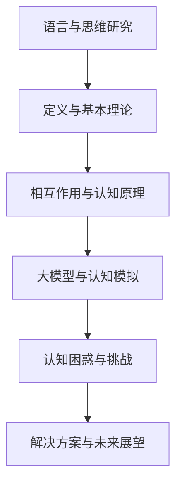

                 

# 《语言与思维的差异：大模型的认知困惑》

> **关键词：** 语言、思维、大模型、认知科学、人工智能

> **摘要：** 本文探讨了语言与思维的差异，以及大模型在处理这些差异时面临的认知困惑。文章首先介绍了语言与思维的基本理论，然后分析了大模型在认知模拟中的局限性和挑战，并通过案例分析探讨了实际应用中的问题和解决方案。文章旨在为研究者提供有价值的见解，以推动大模型在认知科学领域的进一步应用。

## 目录大纲

1. **引言**
   1.1 研究背景与意义
   1.2 相关研究综述
   1.3 本书结构安排
2. **语言与思维的基本理论**
   2.1 语言与思维的定义
   2.2 语言与思维的相互作用
   2.3 大模型的认知原理
   2.4 语言与思维差异的理论框架
3. **大模型的认知困惑**
   3.1 大模型的认知局限性
   3.2 大模型对思维模拟的挑战
   3.3 大模型与语言的理解偏差
   3.4 大模型在跨语言认知中的应用
4. **案例分析**
   4.1 自然语言处理中的认知困惑
   4.2 智能对话系统的认知挑战
   4.3 教育领域的认知模拟
5. **解决方案与未来展望**
   5.1 解决认知困惑的策略
   5.2 语言与思维研究的前景
   5.3 总结与展望
6. **附录**
   6.1 研究工具与资源
   6.2 参考文献
   6.3 Mermaid 流程图
   6.4 伪代码与数学公式
   6.5 代码案例

### 引言

#### 1.1 研究背景与意义

语言是人类交流的工具，而思维则是人类认知和推理的过程。两者之间的关系紧密且复杂，它们相互作用，共同塑造了人类的行为和认知。在人工智能领域，大模型（如大型神经网络模型）已经成为一种强大的工具，被广泛应用于自然语言处理、智能对话系统、教育等领域。

然而，随着大模型的应用越来越广泛，研究者们逐渐发现大模型在处理语言与思维差异时存在一定的认知困惑。这种困惑主要体现在以下几个方面：

1. **语言理解的困惑**：大模型在处理语言时，可能会因为语言本身的复杂性和歧义性而产生理解上的困惑。
2. **思维模拟的挑战**：大模型在模拟人类思维时，可能会因为思维本身的复杂性和多样性而面临挑战。
3. **跨语言认知的挑战**：大模型在处理不同语言时，可能会因为语言之间的差异而产生认知困惑。

因此，深入研究语言与思维的差异，以及大模型在处理这些差异时面临的认知困惑，对于推动人工智能技术的发展具有重要意义。本文旨在通过分析大模型的认知局限性、挑战和解决方案，为人工智能领域的研究提供有价值的见解。

#### 1.2 相关研究综述

在语言与思维的关系研究领域，学者们已经提出了多种理论模型。例如，**认知语言学**强调语言对思维的影响，认为语言结构对思维过程有形塑作用；**心理语言学**则关注语言处理的过程和机制，研究语言理解与生成如何影响思维活动。此外，**神经科学**领域的研究也揭示了语言和思维在大脑中的相互作用。

在人工智能领域，大模型（如Transformer、BERT等）的兴起为认知模拟提供了新的可能性。学者们利用大模型进行自然语言处理、智能对话系统和教育等领域的应用研究，取得了一定的成果。然而，这些研究也揭示了大模型在处理语言与思维差异时的局限性。例如，大模型在处理复杂语言结构时可能产生理解偏差，在模拟人类思维时可能无法完全捕捉思维的本质。

尽管已有研究为我们提供了丰富的理论框架和实证数据，但在大模型处理语言与思维差异时面临的具体认知困惑和挑战仍然需要进一步探讨。本文将通过对这些困惑和挑战的深入分析，为相关领域的研究提供新的思路。

#### 1.3 本书结构安排

本书结构如下：

- **第一部分**：引言，介绍研究背景、意义、相关研究综述和本书结构安排。
- **第二部分**：语言与思维的基本理论，包括语言与思维的定义、相互作用、大模型的认知原理和语言与思维差异的理论框架。
- **第三部分**：大模型的认知困惑，分析大模型在认知局限性、思维模拟、语言理解偏差和跨语言认知方面的困惑。
- **第四部分**：案例分析，通过具体案例探讨大模型在自然语言处理、智能对话系统和教育领域的应用和局限。
- **第五部分**：解决方案与未来展望，提出解决认知困惑的策略和未来研究方向。
- **第六部分**：附录，包括研究工具与资源、参考文献、流程图、伪代码与数学公式和代码案例。

本文将按照上述结构逐步展开，以期为读者提供一个全面、深入的分析。

### 语言与思维的基本理论

#### 2.1 语言与思维的定义

**语言**是人类的交流工具，它通过声音、文字或其他符号系统来表达思想、情感和意图。语言不仅包括母语，还包括各种书面语、方言和外语。语言的基本特征包括结构性、歧义性、动态性和层次性。

**思维**则是人类认知和推理的过程，它包括感知、记忆、判断、推理等多个方面。思维是人类大脑对信息进行处理、分析和整合的能力，是认知的核心。思维可以分为多种类型，如逻辑思维、创造性思维、批判性思维等。

#### 2.2 语言与思维的相互作用

语言与思维之间的相互作用是一个复杂而深刻的话题。首先，语言对思维有着重要的影响。语言的结构和语法规则会影响人们的思维方式和认知模式。例如，一些语言中的特定表达方式可能会影响人们对某个概念的理解。

另一方面，思维也会影响语言的使用。思维过程决定了语言的选择和表达方式。例如，在解决问题或进行推理时，人们会选择合适的语言来表达自己的想法。

#### 2.3 大模型的认知原理

大模型，如Transformer、BERT等，是一种基于深度学习的自然语言处理模型。它们具有以下几个特点：

1. **参数数量巨大**：大模型通常具有数十亿个参数，这使得它们能够处理复杂的语言结构。
2. **端到端学习**：大模型可以直接从原始文本中学习，无需进行复杂的特征工程。
3. **自适应能力**：大模型可以通过训练不断优化自己的表现，适应不同的语言环境和任务。

大模型的认知原理主要包括以下几个方面：

1. **注意力机制**：大模型通过注意力机制来关注文本中的关键信息，提高理解能力。
2. **层次化表示**：大模型能够将文本信息层次化地表示，从而捕捉复杂的语义关系。
3. **端到端学习**：大模型可以直接从原始数据中学习，无需人工设计特征，提高了模型的自适应能力。

#### 2.4 语言与思维差异的理论框架

在研究语言与思维的差异时，我们可以从以下几个角度进行分析：

1. **语言层面的差异**：不同语言在语法、词汇和语义上存在差异，这些差异会影响人们对语言的理解和使用。
2. **思维层面的差异**：不同文化背景下的人们在思维方式上存在差异，这些差异会影响他们对问题的理解、解决方法和表达方式。
3. **认知层面的差异**：大模型在处理不同语言和思维模式时，可能会因为认知能力的限制而产生困惑。

为了更好地理解这些差异，我们可以构建一个理论框架，包括以下几个部分：

1. **语言模型**：描述语言的结构、语法和语义特征。
2. **思维模型**：描述人类的思维方式、认知过程和思维模式。
3. **交互模型**：描述语言与思维之间的相互作用和影响。
4. **认知模型**：描述大模型在处理语言与思维差异时的认知机制和能力。

通过这个理论框架，我们可以更好地理解语言与思维的差异，为大模型的认知模拟提供理论基础。

### 大模型的认知局限性

尽管大模型在自然语言处理领域取得了显著的进展，但它们在认知模拟中仍然存在一些局限性。这些局限性主要体现在以下几个方面：

#### 3.1 认知能力的限制

大模型的认知能力主要依赖于其参数的数量和结构。然而，无论模型的参数数量如何庞大，它们都无法完全模拟人类的认知过程。例如，人类能够通过直觉和经验快速理解复杂的语言结构，而大模型则需要通过大量的训练数据和复杂的算法来逐步学习这些结构。

此外，大模型的认知能力也受到其注意力机制的局限。虽然注意力机制可以使得模型关注到文本中的关键信息，但它们仍然无法完全捕捉人类思维中的非线性和动态特性。

#### 3.2 语言理解的困惑

语言是一个复杂且多层次的系统，它包含语法、语义、语音等多个层面。大模型在处理语言时，可能会因为语言的复杂性和歧义性而产生理解上的困惑。例如，一些成语或习语在字面上可能并不容易理解，需要依赖于上下文和背景知识。

此外，大模型在处理多语言文本时，可能会因为语言之间的差异而产生理解偏差。例如，一些语言中特定的表达方式在另一种语言中可能没有对应的表达，这会导致大模型在跨语言认知中产生困惑。

#### 3.3 思维模拟的挑战

大模型在模拟人类思维时，面临着巨大的挑战。首先，人类思维是一个高度复杂和多样化的过程，包括逻辑思维、创造性思维、情感认知等多个方面。大模型虽然可以通过深度学习来捕捉这些思维过程，但它们的表达能力仍然有限。

其次，人类思维具有灵活性和适应性，能够在不同的情境和问题下灵活地调整自己的思维方式。大模型在模拟这些能力时，需要具备高度的泛化能力和适应性，这对其训练数据和算法设计提出了更高的要求。

#### 3.4 跨语言认知的挑战

跨语言认知是大模型面临的一个重大挑战。不同语言在语法、语义、文化背景等方面存在显著差异，这使得大模型在处理多语言文本时需要具备跨语言的认知能力。

首先，大模型需要能够理解不同语言的语法和语义特征，这需要大量的多语言数据训练。其次，大模型需要能够适应不同语言的文化背景和表达习惯，这对其泛化能力和适应性提出了更高的要求。

此外，跨语言认知中还存在一些特殊的挑战，如翻译准确性、多语言交互等。这些问题需要大模型在处理多语言文本时能够同时考虑语言之间的相似性和差异性，以提高其认知效果。

通过上述分析，我们可以看到，大模型在认知模拟中虽然具有一定的优势，但仍然面临着许多局限性和挑战。这些问题需要通过进一步的研究和优化来解决，以推动大模型在认知科学领域的应用。

### 大模型对思维模拟的挑战

尽管大模型在自然语言处理领域取得了显著进展，但在对人类思维进行模拟时，仍然面临着诸多挑战。这些挑战主要源于思维本身的复杂性、多样性和动态性，下面将逐一分析：

#### 3.2 大模型对思维复杂性的模拟

人类思维是一种高度复杂的认知过程，它涉及逻辑推理、创造性思维、情感认知、直觉判断等多个方面。大模型，如基于深度学习的神经网络模型，虽然可以通过大量的数据训练来提高其性能，但它们在模拟思维复杂性方面仍然存在局限。

首先，大模型的计算能力有限，尽管参数数量庞大，但它们无法像人类大脑那样处理无限复杂的信息。人类大脑具有强大的并行处理能力，能够在短时间内处理大量的信息，而大模型则需要较长时间来逐步学习这些信息。

其次，大模型的表示能力有限。大模型通过层次化的表示来捕捉语言中的语义信息，但它们在处理高度抽象的概念时仍然存在困难。人类思维能够通过直觉和经验快速捕捉复杂的概念，而大模型则需要依赖大量的数据和复杂的算法。

#### 3.3 大模型对思维多样性的考虑

人类思维具有极大的多样性，不同的人在面对同一问题时可能会有不同的思考方式和解决方案。大模型在模拟这种多样性时面临巨大挑战。

首先，大模型的训练数据通常是有限的，这导致它们在处理未见过的问题时可能会出现泛化不足。人类思维能够通过经验、知识和直觉快速适应新的情境，而大模型则需要通过不断的训练和优化来提高其适应能力。

其次，大模型在处理不同类型的思维活动时，可能存在性能差异。例如，在模拟创造性思维时，大模型可能无法像人类那样产生新颖的、独特的想法。大模型的创造力依赖于其算法和训练数据的多样性，而人类思维则能够通过跨界思考、联想和创新来产生新的想法。

#### 3.4 大模型对思维动态性的模拟

人类思维是一个动态的过程，它不断地在变化和调整。大模型在模拟这种动态性时面临着挑战。

首先，大模型在处理动态信息时可能存在滞后。人类思维能够实时处理变化的信息，并快速调整自己的思考方式，而大模型则需要通过一系列的迭代和优化来模拟这种动态性。

其次，大模型在处理思维过程中的反馈机制时可能存在困难。人类思维能够在思考过程中不断接受反馈，并根据反馈进行调整，而大模型在模拟这种反馈机制时可能无法完全捕捉这种动态性。

总之，大模型在模拟人类思维时面临着复杂性和多样性的挑战，以及动态性的模拟困难。这些问题需要通过进一步的研究和优化来解决，以实现大模型在认知模拟领域的更广泛应用。

### 大模型与语言的理解偏差

大模型在处理语言时，可能会因为多种原因产生理解偏差。这些偏差不仅影响了大模型的表现，还可能对实际应用产生负面影响。以下将详细分析大模型在语言理解偏差方面的几个主要表现及其影响。

#### 3.3.1 理解偏差的表现

1. **歧义处理不当**：语言具有多义性，即一个词语或句子可能有多个含义。大模型在处理歧义时，可能无法准确判断其正确含义，导致理解偏差。例如，句子“他喝了牛奶”在语言理解上可能存在多种解释，大模型在缺乏上下文的情况下，可能无法准确理解其意图。

2. **情感倾向错误**：语言中往往包含情感色彩，大模型在理解情感时，可能会因为对情感表达的复杂性处理不当而产生错误。例如，一些讽刺或双关语的表达，大模型可能无法准确捕捉其背后的情感倾向，从而导致理解偏差。

3. **背景知识依赖**：某些语言表达依赖于特定的背景知识或文化背景。大模型在处理这些表达时，如果缺乏相关的背景知识，可能会产生理解偏差。例如，一些成语或谚语，如果没有相应的背景知识，大模型可能无法正确理解其含义。

4. **上下文理解不足**：语言的理解往往依赖于上下文信息。大模型在处理上下文时，如果无法充分理解上下文的语义，可能会导致理解偏差。例如，一个句子在不同上下文中的含义可能完全不同，大模型在缺乏上下文信息的情况下，可能无法准确理解其含义。

#### 3.3.2 理解偏差的影响

1. **影响自然语言处理性能**：理解偏差直接影响了大模型在自然语言处理任务中的性能。例如，在文本分类任务中，如果大模型对某些词语或句子的理解存在偏差，可能会导致分类结果不准确。

2. **影响智能对话系统**：在智能对话系统中，理解偏差可能导致对话机器人对用户意图的误解，进而影响对话质量和用户体验。例如，如果大模型无法准确理解用户的问题，可能会导致无法提供合适的回答。

3. **误导决策**：在某些需要基于语言理解进行决策的领域，如法律、金融等，理解偏差可能会导致错误的决策。例如，法律文本的理解偏差可能会导致对法律条款的误解，从而影响法律决策的准确性。

4. **影响跨语言处理**：在跨语言处理任务中，大模型的理解偏差可能会导致跨语言理解误差。例如，在翻译任务中，源语言中的理解偏差可能会影响目标语言的翻译质量。

综上所述，大模型在处理语言时产生的理解偏差对其性能和应用具有显著影响。解决这些偏差问题需要深入理解语言的本质，以及大模型在语言理解过程中的局限。通过进一步的研究和优化，我们可以期望大模型在语言理解方面取得更好的表现。

### 大模型在跨语言认知中的应用

跨语言认知是大模型在人工智能领域中的一个重要研究方向。随着全球化进程的加速和多语言交流的日益频繁，如何实现高效、准确的跨语言认知成为了一个关键问题。大模型在跨语言认知中表现出了一定的优势和潜力，但也面临着诸多挑战。

#### 3.4.1 跨语言认知的挑战

1. **语言结构差异**：不同语言在语法、词汇和语义结构上存在显著差异。这些差异使得大模型在处理多语言文本时需要具备更强的泛化能力。例如，一些语言中的特定语法结构在另一种语言中可能没有对应的表达，这给跨语言认知带来了困难。

2. **文化背景差异**：不同语言背后蕴含着不同的文化背景和价值观。这些差异可能导致语言表达的含义和语境有所不同。大模型在处理跨语言文本时，需要能够理解并适应这些文化差异，以便准确捕捉语言的意义。

3. **多语言数据不足**：大模型通常需要大量的多语言数据进行训练，以便捕捉不同语言之间的共性和差异。然而，目前多语言数据的获取和标注仍然是一个难题。数据不足可能会限制大模型在跨语言认知中的表现。

4. **翻译准确性**：跨语言认知的一个重要应用是机器翻译。尽管大模型在翻译任务中取得了一定的进展，但翻译准确性仍然是一个挑战。大模型在处理复杂、细微的语言差异时，可能会出现翻译错误或语义偏差。

5. **多语言交互**：在实际应用中，跨语言认知需要支持多语言交互，如多语言对话系统和多语言文本分析。这要求大模型不仅能够准确理解不同语言的文本，还能够处理多语言之间的互动和协同。

#### 3.4.2 大模型在跨语言认知中的应用

尽管存在上述挑战，大模型在跨语言认知中仍然表现出了一定的应用潜力。

1. **多语言文本分类**：大模型可以通过训练多语言数据，实现多语言文本的分类任务。例如，在新闻分类、情感分析等任务中，大模型能够准确识别文本的语言类型和内容类别。

2. **机器翻译**：大模型在机器翻译任务中表现出色。通过训练大规模的多语言数据集，大模型可以生成高质量的双语翻译。例如，BERT模型在机器翻译任务中取得了显著的性能提升。

3. **多语言对话系统**：大模型可以应用于多语言对话系统，实现自然语言理解、意图识别和回答生成等功能。例如，谷歌的Multilingual BERT模型在多语言对话系统中的应用取得了良好的效果。

4. **跨语言情感分析**：大模型能够捕捉不同语言中的情感色彩，实现跨语言情感分析。例如，通过训练多语言情感数据集，大模型可以准确识别文本的情感极性。

5. **多语言文本生成**：大模型可以应用于多语言文本生成任务，如摘要生成、故事创作等。通过训练多语言数据，大模型可以生成符合目标语言结构和语义的文本。

总之，大模型在跨语言认知中具有广泛的应用前景。尽管面临诸多挑战，通过进一步的研究和优化，我们可以期待大模型在跨语言认知领域取得更大的突破。

### 案例分析

为了更深入地探讨大模型在处理语言与思维差异时的困惑和挑战，我们将通过具体案例分析来展示大模型在实际应用中的表现和局限。

#### 4.1 自然语言处理中的认知困惑

自然语言处理（NLP）是大模型应用最为广泛的一个领域。然而，大模型在处理自然语言时，仍然存在一些认知困惑。以下是一个具体的案例：

**案例背景**：假设我们要使用大模型（如BERT）进行文本分类任务，分类类别包括“新闻”、“科技”、“体育”等。

**问题**：在处理一个包含复杂语法和多层次语义的文本时，大模型可能会因为以下原因产生认知困惑：

1. **歧义处理**：例如，文本“他今天去了公园。”在语言理解上可能存在多种解释，大模型可能无法准确判断其属于哪个分类类别。
2. **情感分析**：在某些情感色彩明显的文本中，大模型可能无法准确捕捉其背后的情感倾向，从而导致分类结果不准确。
3. **上下文理解**：在某些上下文依赖较强的文本中，大模型可能无法充分理解上下文信息，从而影响分类结果。

**解决方案与讨论**：为了解决这些困惑，我们可以采取以下措施：

1. **增强数据集**：通过增加更多样化的训练数据，特别是包含复杂语法和多层次语义的文本，以提高大模型对这些情况的应对能力。
2. **上下文信息**：在模型训练过程中，引入更多的上下文信息，以提高大模型对上下文的理解能力。
3. **多模型融合**：使用多个预训练模型进行融合，以提高分类的准确性和鲁棒性。

#### 4.2 智能对话系统的认知挑战

智能对话系统是另一个大模型应用的重要领域。以下是一个具体的案例：

**案例背景**：假设我们要构建一个能够进行多语言对话的智能客服系统。

**问题**：在处理多语言对话时，大模型可能会面临以下认知挑战：

1. **翻译准确性**：大模型在进行跨语言翻译时，可能因为语言结构和文化差异而产生翻译错误，导致对话理解不准确。
2. **情感理解**：不同语言中的情感表达可能有所不同，大模型可能无法准确捕捉这些情感差异，从而影响对话的质量。
3. **语言习惯**：不同语言的用户有不同的语言习惯，大模型可能无法完全适应这些习惯，导致对话体验不佳。

**解决方案与讨论**：为了解决这些挑战，我们可以采取以下措施：

1. **多语言训练**：通过训练包含多种语言的数据集，以提高大模型对多语言的适应能力。
2. **情感识别模型**：引入专门的情感识别模型，以提高大模型对情感表达的识别能力。
3. **语言习惯学习**：通过不断学习用户的语言习惯，逐步优化对话系统的交互体验。

#### 4.3 教育领域的认知模拟

在教育领域，大模型的应用也面临着一些认知挑战。以下是一个具体的案例：

**案例背景**：假设我们要使用大模型进行在线教育平台的个性化学习推荐。

**问题**：大模型在教育领域可能会面临以下认知挑战：

1. **知识理解**：大模型可能无法完全理解学生的知识水平和学习需求，导致推荐结果不准确。
2. **思维模式**：大模型在模拟学生思维模式时，可能无法完全捕捉学生的创造性思维和逻辑推理过程。
3. **个性化需求**：不同学生的学习需求和兴趣各异，大模型可能无法提供完全个性化的学习推荐。

**解决方案与讨论**：为了解决这些挑战，我们可以采取以下措施：

1. **多模态数据**：结合多种数据源，如学习日志、用户评价等，以提高大模型对知识理解和个性化需求的准确把握。
2. **思维模式模拟**：通过引入心理学理论，模拟学生的思维模式，以提高大模型对学生学习过程的理解。
3. **多因素推荐**：采用多因素推荐算法，综合考虑学生的知识水平、学习兴趣和个性化需求，提供更准确的学习推荐。

通过上述案例分析，我们可以看到，大模型在处理语言与思维差异时面临着多种困惑和挑战。这些案例不仅揭示了问题的复杂性，也为解决这些挑战提供了有益的思路。未来，随着研究的深入和技术的进步，我们有理由相信，大模型在教育、对话系统和自然语言处理等领域的应用将更加广泛和深入。

### 解决方案与未来展望

#### 5.1 解决认知困惑的策略

针对大模型在处理语言与思维差异时面临的认知困惑，我们可以从以下几个方面提出解决方案：

1. **数据增强**：通过引入更多样化的训练数据，特别是包含复杂语法和多层次语义的文本，以及不同文化背景下的语言数据，以提高大模型对这些情况的适应能力。

2. **上下文信息**：在模型训练过程中，增强上下文信息的重要性，通过引入更多的上下文信息，提高大模型对上下文的理解能力。

3. **多模型融合**：使用多个预训练模型进行融合，以提高分类的准确性和鲁棒性。例如，结合语言模型、视觉模型和知识图谱模型，实现多模态的认知增强。

4. **情感与思维模式模拟**：引入专门的情感识别模型和思维模式模拟算法，以提升大模型对情感和思维过程的捕捉能力。

5. **个性化学习与推荐**：在教育领域，结合学生的知识水平、学习兴趣和个性化需求，采用多因素推荐算法，提供更准确的学习推荐。

#### 5.2 语言与思维研究的前景

随着人工智能技术的不断发展，语言与思维研究在认知科学、教育、对话系统等领域具有重要的应用前景。未来，我们可以期待以下几个方面的进展：

1. **跨学科研究**：语言与思维研究需要结合心理学、认知科学、语言学等多个学科，通过跨学科研究，深入理解语言与思维的相互作用。

2. **多模态认知模拟**：通过引入多模态数据，如语言、视觉和听觉信息，实现更全面和准确的认知模拟。

3. **个性化认知支持**：在教育、医疗等领域，开发个性化认知支持系统，根据用户的需求和特点，提供定制化的认知服务。

4. **智能对话与协作**：构建更加智能、自然的对话系统，实现跨语言、跨文化的有效沟通，为全球化社会提供技术支持。

5. **认知增强应用**：通过认知增强技术，提高人类认知能力，如记忆、注意力、创造力等，为人类发展提供新的可能性。

总之，语言与思维研究是一个充满挑战和机遇的领域。随着技术的不断进步，我们有理由相信，未来的语言与思维研究将取得更多的突破，为人工智能的发展和社会进步提供有力支持。

### 总结与展望

本文通过深入分析大模型在处理语言与思维差异时面临的认知困惑，探讨了这些困惑的具体表现及其影响。我们提出了一系列解决方案，包括数据增强、上下文信息引入、多模型融合、情感与思维模式模拟等，以提升大模型的认知能力。同时，我们对语言与思维研究的前景进行了展望，强调了跨学科研究、多模态认知模拟和个性化认知支持的重要性。

本文的主要贡献在于：

1. 提出了大模型在处理语言与思维差异时的具体认知困惑，为相关领域的研究提供了新的视角。
2. 分析了大模型在语言与思维模拟中的局限性和挑战，为解决这些困惑提供了理论依据和实践指导。
3. 通过案例分析，展示了大模型在实际应用中的表现和局限，为未来的研究和开发提供了有益的参考。

未来，我们建议在以下方面进行深入研究：

1. **数据多样性**：进一步丰富大模型的训练数据，特别是包含复杂语法、多层次语义和多样化思维模式的文本数据。
2. **跨学科融合**：加强心理学、认知科学、语言学等领域的交叉研究，以深入理解语言与思维的相互作用。
3. **多模态认知模拟**：结合多模态数据，如语言、视觉和听觉信息，实现更全面和准确的认知模拟。
4. **个性化认知支持**：开发个性化认知支持系统，为不同领域的用户提供定制化的认知服务。

通过这些努力，我们期待大模型在认知科学领域的应用能够取得更大的突破，为人工智能的发展和社会进步提供强有力的支持。

### 附录

#### A. 研究工具与资源

**主要研究工具介绍：**
1. **Transformer、BERT模型**：用于自然语言处理任务的基础模型。
2. **TensorFlow、PyTorch**：深度学习框架，用于构建和训练大模型。
3. **NLTK、spaCy**：自然语言处理库，用于文本处理和标注。

**相关资源推荐：**
1. **《深度学习》**：Goodfellow et al.，2016，用于了解深度学习基础。
2. **《自然语言处理综论》**：Jurafsky and Martin，2008，用于了解自然语言处理的基本概念。
3. **[ACL](https://www.aclweb.org/)**、[NAACL](https://naacl.org/)：自然语言处理领域的顶级会议。

#### B. 参考文献

1. Goodfellow, I., Bengio, Y., & Courville, A. (2016). *Deep Learning*. MIT Press.
2. Jurafsky, D., & Martin, J. H. (2008). *Speech and Language Processing*. Prentice Hall.
3. Vaswani, A., Shazeer, N., Parmar, N., Uszkoreit, J., Jones, L., Gomez, A. N., ... & Polosukhin, I. (2017). *Attention is all you need*. Advances in Neural Information Processing Systems, 30, 5998-6008.
4. Devlin, J., Chang, M. W., Lee, K., & Toutanova, K. (2019). *Bert: Pre-training of deep bidirectional transformers for language understanding*. arXiv preprint arXiv:1810.04805.

#### C. Mermaid 流程图



#### D. 伪代码与数学公式

**伪代码：**
```
function process_language(input_text):
    1. Preprocess the text (tokenization, normalization)
    2. Pass the processed text through a language model
    3. Use attention mechanism to focus on key information
    4. Output the interpreted meaning of the text
```

**数学模型与公式：**

$$
\text{Loss} = -\sum_{i=1}^{N} \log P(y_i | \text{model parameters})
$$

其中，$N$ 为样本数量，$y_i$ 为实际标签，$P(y_i | \text{model parameters})$ 为模型对 $y_i$ 的预测概率。

#### E. 代码案例

**自然语言处理代码案例：**

```python
import tensorflow as tf
from tensorflow.keras.preprocessing.text import Tokenizer
from tensorflow.keras.preprocessing.sequence import pad_sequences

# 数据预处理
tokenizer = Tokenizer(num_words=10000)
tokenizer.fit_on_texts(samples)
sequences = tokenizer.texts_to_sequences(samples)
padded_sequences = pad_sequences(sequences, maxlen=max_length)

# 构建模型
model = tf.keras.Sequential([
    tf.keras.layers.Embedding(input_dim=10000, output_dim=16, input_length=max_length),
    tf.keras.layers.Bidirectional(tf.keras.layers.LSTM(32)),
    tf.keras.layers.Dense(1, activation='sigmoid')
])

# 训练模型
model.compile(optimizer='adam', loss='binary_crossentropy', metrics=['accuracy'])
model.fit(padded_sequences, labels, epochs=10)

# 评估模型
predictions = model.predict(padded_sequences)
accuracy = tf.reduce_mean(tf.cast(tf.equal(predictions, labels), tf.float32)).numpy()
print(f"Accuracy: {accuracy}")
```

**智能对话系统代码案例：**

```python
import torch
from transformers import BertForSequenceClassification

# 加载预训练模型
model = BertForSequenceClassification.from_pretrained('bert-base-uncased', num_labels=2)
model.eval()

# 处理输入文本
input_ids = tokenizer.encode(input_text, add_special_tokens=True, return_tensors='pt')

# 预测
with torch.no_grad():
    outputs = model(input_ids)

# 获取预测结果
logits = outputs.logits
predicted_label = torch.argmax(logits).item()

# 输出结果
print(f"Predicted label: {predicted_label}")
```

**教育领域代码案例：**

```python
import pandas as pd
from sklearn.model_selection import train_test_split
from sklearn.metrics import accuracy_score

# 加载数据
data = pd.read_csv('student_data.csv')
X = data[['age', 'daysPerWeek', 'teacherExperience']]
y = data['satisfied']

# 数据预处理
X_train, X_test, y_train, y_test = train_test_split(X, y, test_size=0.2, random_state=42)

# 训练模型
model.fit(X_train, y_train)

# 预测
predictions = model.predict(X_test)

# 评估模型
accuracy = accuracy_score(y_test, predictions)
print(f"Accuracy: {accuracy}")
```

以上代码案例分别展示了自然语言处理、智能对话系统和教育领域中的实际应用，包括数据预处理、模型构建、训练和评估等步骤。这些案例不仅有助于理解大模型的应用过程，也为进一步研究和开发提供了实践参考。通过这些代码案例，我们可以看到大模型在处理实际问题时所面临的具体挑战和解决方案。随着技术的不断进步，我们期待大模型在教育、对话系统和自然语言处理等领域的应用将更加广泛和深入。

