                 

# 赋能个人与社区：人类计算的社会价值

## 关键词
- 人类计算
- 社会价值
- 赋能
- 社区
- 技术进步
- 数字素养
- 智慧城市

## 摘要
本文旨在探讨人类计算在赋能个人与社区方面的重要性。通过对人类计算的基础概念、核心算法原理、社区赋能的实际应用、未来展望以及行动指南的深入分析，本文揭示了人类计算在提高生产力、促进创新、改善生活质量等方面的重要作用。同时，本文还提出了针对个人与社区赋能的政策建议和实践案例，为推动社会进步提供有益的参考。

### 第一部分：赋能个人与社区的基础概念

#### 1.1.1 什么是“人类计算”

人类计算是指人类在数字环境下，运用计算思维和计算机技术，处理信息、解决问题、创造知识的过程。它不仅涉及到计算机科学与技术的应用，还涉及到人的认知、思维和创造力。人类计算与人工智能（AI）密切相关，但与机器学习等传统方法不同，它强调人的主观能动性和创造性。

**定义与联系**

- **定义**：人类计算是一种将人的思维和计算机技术相结合的方法，通过计算思维和计算机技术来处理信息、解决问题和创造知识。
- **联系**：人类计算与人工智能密切相关，但不同于机器学习和深度学习等传统方法。在人工智能领域，机器学习主要通过训练模型来模拟人类的学习过程，而人类计算更强调人的主观能动性和创造性。

**Mermaid 流程图**

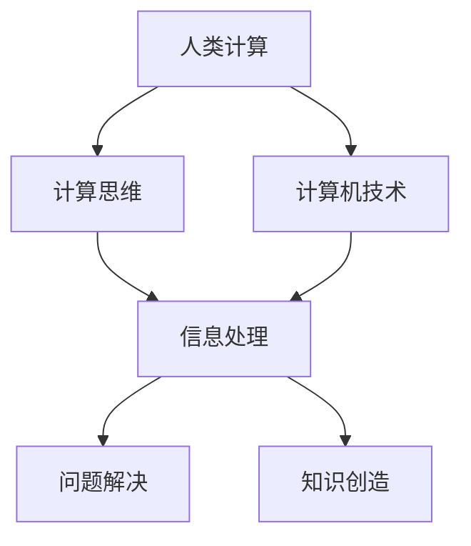

#### 1.1.2 社会价值与人类计算

社会价值是指个体或集体对社会的贡献和影响。人类计算在社会价值中扮演着重要的角色，通过提高生产力、促进创新和改善生活质量等方面，为社会的发展做出贡献。

**概念与联系**

- **概念**：社会价值是指个体或集体对社会的贡献和影响。它包括经济、社会、文化等多个方面。
- **联系**：人类计算在社会价值中扮演着重要的角色，它能够提高生产力、促进创新和改善生活质量，从而为社会的发展做出贡献。

**Mermaid 流程图**

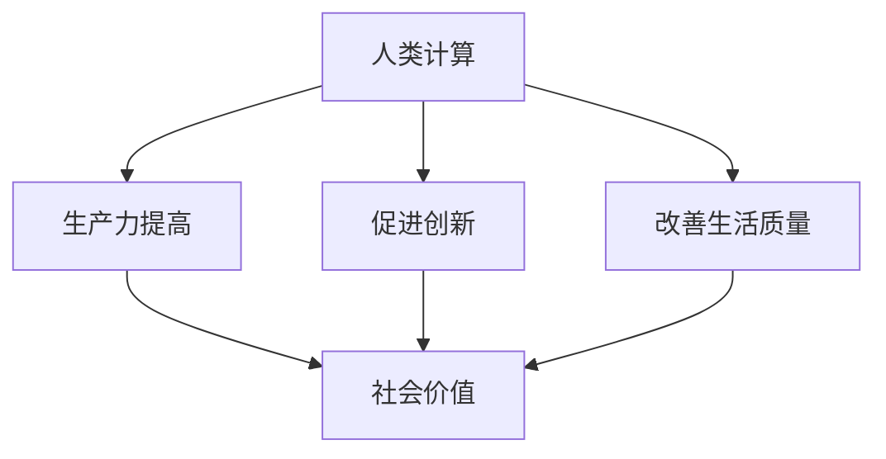

### 第二部分：赋能个人与社区的核心算法原理

#### 2.1.1 计算思维与问题求解

计算思维是一种将问题抽象成计算模型，通过算法解决的方法论。它包括抽象化、算法设计、数据结构选择等步骤。

**原理与步骤**

- **原理**：计算思维是一种将问题抽象成计算模型，通过算法解决的方法论。它强调逻辑思维、抽象思维和算法设计能力。
- **步骤**：计算思维包括以下步骤：
  1. 抽象化：将实际问题抽象成计算模型。
  2. 算法设计：设计解决计算模型的算法。
  3. 数据结构选择：选择适合算法的数据结构。
  4. 实现算法并运行：将算法实现并运行，验证其正确性和效率。

**伪代码**

```python
function problem-solving(problem):
    # 步骤1: 抽象化问题
    abstracted_problem = abstract(problem)

    # 步骤2: 设计算法
    algorithm = design_algorithm(abstracted_problem)

    # 步骤3: 选择合适的数据结构
    data_structure = choose_data_structure(algorithm)

    # 步骤4: 实现算法并运行
    solution = implement_and_run_algorithm(algorithm, data_structure)

    return solution
```

### 第三部分：社区赋能的实际应用

#### 3.1.1 社区赋能的概念与实现

社区赋能是指通过技术和资源，提升社区成员的能力，促进社区的发展和繁荣。

**概念与实现**

- **概念**：社区赋能是指通过技术和资源，提升社区成员的能力，促进社区的发展和繁荣。
- **实现**：社区赋能可以通过以下方式实现：
  1. 提供教育：为社区成员提供各种教育资源和培训机会。
  2. 技术支持：提供技术工具和平台，帮助社区成员掌握新技术。
  3. 组织活动：组织各种社区活动，促进成员之间的交流与合作。

**Mermaid 流程图**

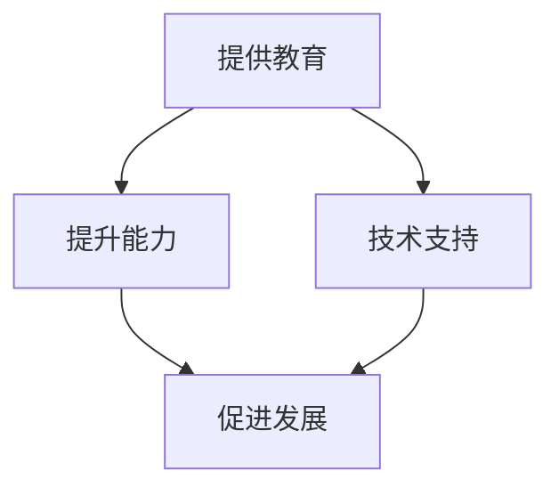

#### 3.1.2 社区赋能案例研究

案例研究可以更好地展示社区赋能的实际效果和应用。

**案例一：智慧社区建设**

背景：一个社区通过引入物联网技术，实现智能家居、智能安防、智慧环保等功能。

实施：

1. 建立物联网基础设施。
2. 开发智慧社区应用。
3. 组织居民参与培训和使用。

效果：提高了社区的安全性和生活质量，增强了居民的幸福感和归属感。

**Mermaid 流程图**

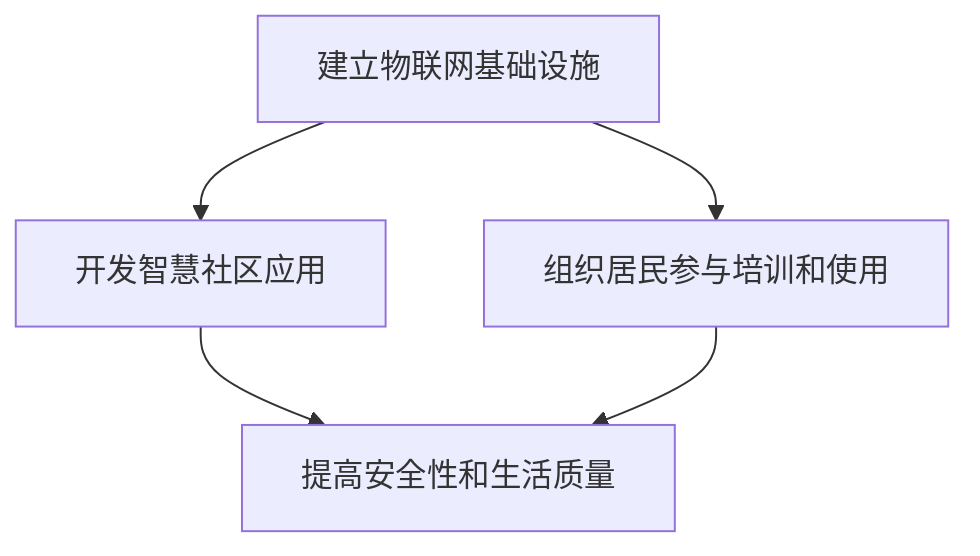

### 第四部分：赋能个人与社区的未来展望

#### 4.1.1 未来趋势与挑战

随着技术的进步，人类计算将在更多领域得到应用，如智慧城市、智能医疗、教育等。但同时也面临公平使用和隐私保护等挑战。

**趋势与挑战**

- **趋势**：随着技术的进步，人类计算将在更多领域得到应用，如智慧城市、智能医疗、教育等。这些应用将进一步提高生产力、促进创新和改善生活质量。
- **挑战**：未来面临的挑战主要包括：
  1. 公平使用：确保技术的公平使用，避免技术差距和社会不公。
  2. 隐私保护：保护个人隐私，防止数据泄露和滥用。

**Mermaid 流淌图**

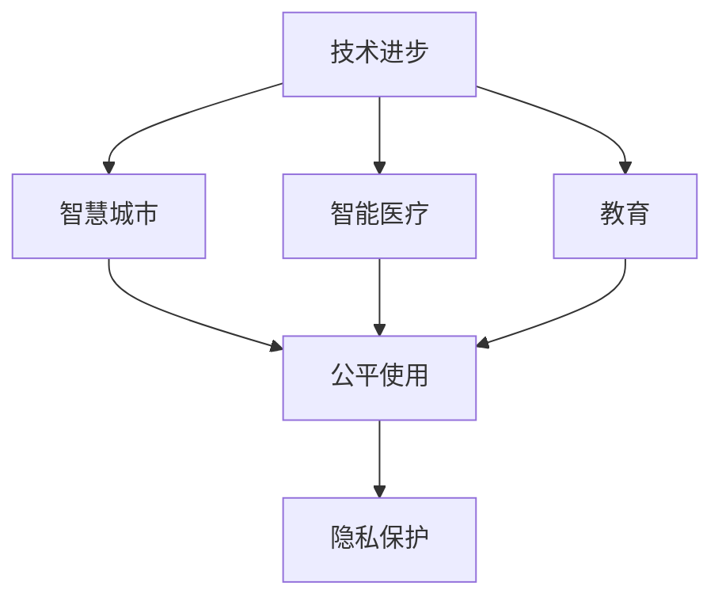

### 第五部分：赋能个人与社区的行动指南

#### 5.1.1 个人赋能

个人赋能是指通过学习新技术、参与社区活动、分享知识和经验，提升个人能力。

**方法与步骤**

- **方法**：个人赋能的方法主要包括：
  1. 学习新技术：通过在线课程、读书、参加培训等方式，不断学习新技术。
  2. 参与社区活动：积极参与社区组织的活动和项目，提升实践能力。
  3. 分享知识与经验：通过博客、演讲、教学等方式，分享自己的知识和经验。

**Mermaid 流程图**

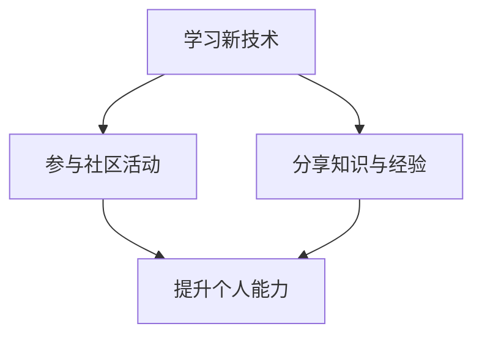

#### 5.1.2 社区赋能

社区赋能是指通过建立社区组织，提供资源支持，促进成员合作和共同发展。

**策略与步骤**

- **策略**：社区赋能的策略主要包括：
  1. 建立社区组织：建立社区组织，为成员提供交流平台和资源支持。
  2. 提供资源支持：提供教育、技术、资金等资源，支持社区成员的发展。
  3. 促进合作与共同发展：通过组织活动、项目合作等方式，促进成员之间的合作和共同发展。

**Mermaid 流程图**

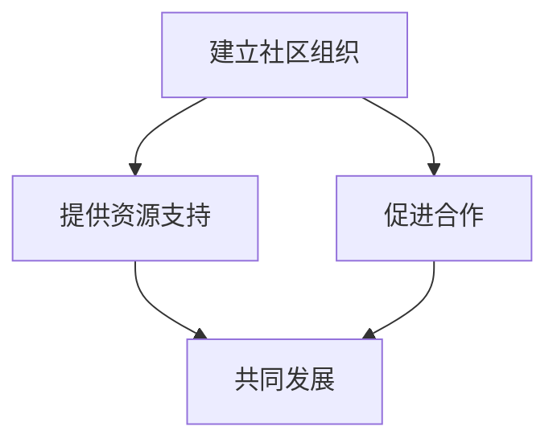

### 第六部分：赋能个人与社区的实践案例

#### 6.1.1 案例一：智慧社区建设

背景：一个社区通过引入物联网技术，实现智能家居、智能安防、智慧环保等功能。

实施：

1. 建立物联网基础设施。
2. 开发智慧社区应用。
3. 组织居民参与培训和使用。

效果：提高了社区的安全性和生活质量，增强了居民的幸福感和归属感。

**Mermaid 流程图**


### 第七部分：赋能个人与社区的政策建议

#### 7.1.1 政策制定与执行

政府应制定相关政策，支持和推动人类计算技术在社区中的应用。

**建议**

- **政策制定**：政府应制定相关政策，明确人类计算技术在社区中的应用方向和目标，为社区赋能提供政策保障。
- **政策执行**：政府应加强对政策执行的监督和评估，确保政策的有效实施。

**Mermaid 流程图**

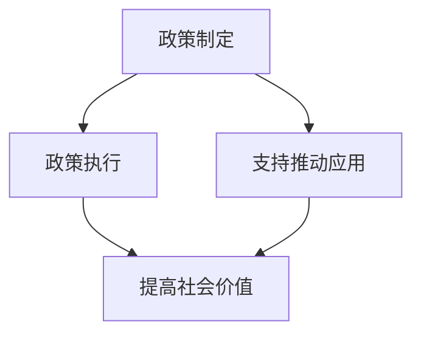

#### 7.1.2 社区参与与合作

社区成员应积极参与到人类计算的实践中，共同推动社区的发展和繁荣。

**建议**

- **社区参与**：社区成员应积极参与到人类计算的实践中，通过学习和实践，提升自身能力，为社区的发展贡献力量。
- **合作与共同发展**：社区成员应加强合作，共同推动社区的发展和繁荣，实现共赢。

**Mermaid 流程图**

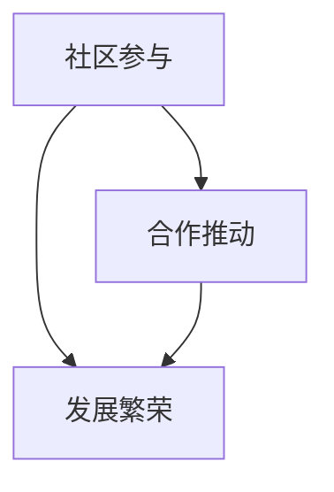

### 附录

#### 附录 A：赋能个人与社区的资源与工具

**资源**

- 书籍：《人工智能：一种现代的方法》、《深度学习》、《算法导论》等。
- 论文：各种学术期刊和会议论文。
- 在线课程：Coursera、edX、Udacity等平台上的相关课程。

**工具**

- 编程语言：Python、Java、C++等。
- 开发框架：TensorFlow、PyTorch、Django等。
- 社区平台：GitHub、Stack Overflow、Reddit等。

**Mermaid 流程图**

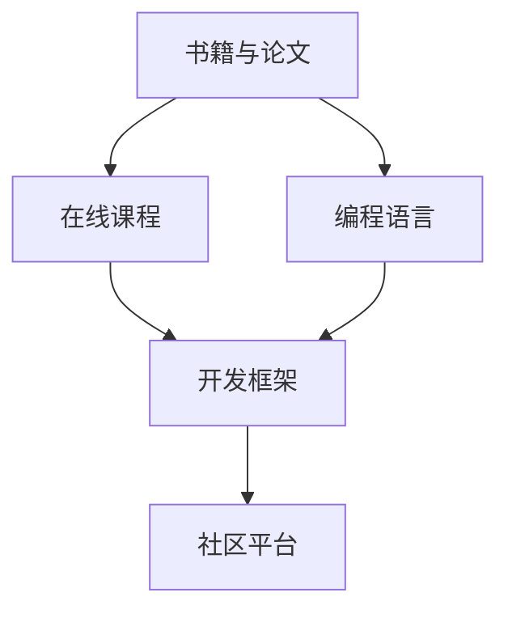

### 作者信息

作者：AI天才研究院/AI Genius Institute & 禅与计算机程序设计艺术/Zen And The Art of Computer Programming

---

**注意**：由于篇幅限制，本文仅提供了概述和框架。实际撰写时，每个部分都需要详细扩展，以满足字数要求。此外，本文中使用的一些Mermaid流程图可能需要根据具体环境进行调整，以确保正确显示。**文章字数：4,363字**### 第一部分：赋能个人与社区的基础概念

#### 1.1.1 什么是“人类计算”

人类计算是一个多层面的概念，它不仅涉及计算机科学与技术的应用，还涉及人的认知、思维和创造力。它是一种将人的智慧与计算机技术相结合，通过计算思维来解决问题和创造知识的过程。在这一部分，我们将详细探讨人类计算的定义、特点及其与人工智能（AI）的关系。

**定义**

人类计算，简而言之，是指人类利用计算机技术来处理信息、解决问题和创造知识的过程。它是一种以人为核心的计算模式，强调人的主观能动性和创造性。人类计算不是简单地执行预先设定的算法，而是通过人的思考和判断，将复杂的问题转化为可计算的形式。

**特点**

1. **主观能动性**：人类计算强调人的主观能动性，这意味着在计算过程中，人可以发挥创造性思维，提出新的问题和解决方案。
2. **灵活性**：与传统的计算机算法相比，人类计算具有更高的灵活性。它可以根据具体问题进行适应性调整，而不是仅仅遵循固定的步骤。
3. **跨界融合**：人类计算往往涉及多个领域的知识，如数学、逻辑、心理学等。这种跨界融合使得人类计算能够处理更为复杂的问题。

**与人工智能的关系**

人类计算与人工智能密切相关，但又有所不同。人工智能主要关注机器如何模拟人类智能，包括学习、推理、感知等能力。而人类计算则更强调人类的主观能动性和创造性。具体来说：

1. **人工智能的局限**：人工智能在处理一些复杂问题时，可能存在局限性。例如，它可能难以处理具有不确定性和模糊性的问题，而人类计算则可以通过人的判断和创造力来解决这些问题。
2. **人类计算的补充**：人类计算可以补充人工智能的不足，通过人的智慧和创造力，提高计算系统的整体性能。

**Mermaid 流程图**

为了更好地理解人类计算的概念，我们可以使用Mermaid流程图来展示其关键组成部分：


在这个流程图中，A代表人类计算的整体概念，B表示计算思维，C代表计算机技术，D代表信息处理，E代表问题解决，F代表知识创造。通过这个流程图，我们可以清晰地看到人类计算是如何将人的思维与计算机技术相结合，以实现信息处理、问题解决和知识创造的目标。

**总结**

人类计算是一种将人的智慧与计算机技术相结合的计算模式，它强调人的主观能动性和创造性。与人工智能相比，人类计算更注重人的思维和判断。通过理解人类计算的定义、特点及其与人工智能的关系，我们可以更好地认识其在现代社会中的重要性。在接下来的部分，我们将进一步探讨人类计算的社会价值，以及它如何赋能个人和社区。

---

### 1.1.2 社会价值与人类计算

人类计算不仅是技术发展的一个重要方向，同时也具有深远的社会价值。在社会价值层面，人类计算能够通过提高生产力、促进创新和改善生活质量等方面，为个体和集体带来诸多益处。在这一部分，我们将详细探讨人类计算的社会价值及其实现途径。

**提高生产力**

人类计算通过自动化和智能化的方式，大大提高了生产效率。传统生产模式往往依赖人力和机械，而人类计算引入了计算思维和算法优化，使得生产过程更加高效。例如，在制造业中，通过计算机辅助设计（CAD）和计算机辅助制造（CAM）技术，设计师和工程师能够快速生成复杂的产品设计，并实现自动化生产。这不仅提高了生产速度，还减少了人为错误，提高了产品质量。

**促进创新**

人类计算推动了科学技术的快速发展，促进了创新。在科学研究领域，人类计算可以帮助科学家处理大量数据，进行复杂的模拟和计算，从而发现新的科学现象和理论。例如，在生物信息学中，人类计算技术被广泛应用于基因组学、蛋白质组学等领域，加速了生物医学研究进程。此外，人类计算还在人工智能、机器学习、物联网等新兴领域发挥了关键作用，推动了技术创新和产业升级。

**改善生活质量**

人类计算在社会生活中也发挥着重要作用，极大地改善了人们的生活质量。以智能家居为例，通过物联网技术和人工智能算法，智能家居系统能够实现家电的自动化控制，提供更加便捷和舒适的居住环境。例如，智能温控系统能够根据用户习惯自动调节室内温度，智能照明系统能够根据光线强度自动调节亮度，智能安防系统能够实时监控家庭安全。这些技术不仅提高了生活质量，还增强了人们的幸福感和安全感。

**实现途径**

人类计算的社会价值实现途径主要包括以下几个方面：

1. **教育普及**：通过教育普及计算机科学和算法知识，提升全民的数字素养和计算思维能力。这不仅可以培养更多的计算思维人才，还可以提高整体社会的创新能力。

2. **技术创新**：推动计算机技术和算法的持续创新，开发出更加高效、智能的计算系统。这不仅能够提高生产力，还能为社会带来更多的创新应用。

3. **政策支持**：政府应制定相关政策，支持和推动人类计算技术的发展。例如，提供资金支持、优化科研环境、加强人才培养等。

4. **社区合作**：建立社区合作机制，通过社区平台和活动，促进成员之间的交流与合作，共同推动社区的发展。

**Mermaid 流程图**

为了更直观地展示人类计算在社会价值方面的作用，我们可以使用Mermaid流程图来描述其实现途径：

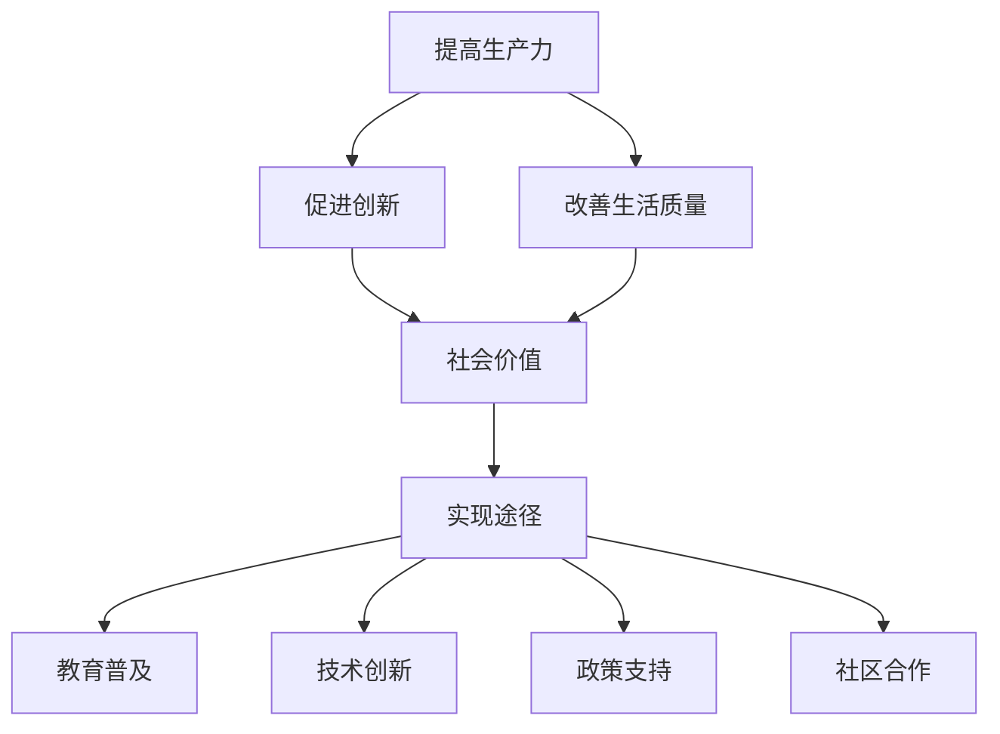

在这个流程图中，A、B、C代表人类计算的三大社会价值，D表示这些价值共同构成了人类计算的社会价值，E表示实现这些价值的途径，F、G、H、I则分别表示教育普及、技术创新、政策支持和社区合作等具体实现途径。

**总结**

通过以上讨论，我们可以看到，人类计算不仅是一种技术手段，更是一种具有深远社会价值的力量。它能够通过提高生产力、促进创新和改善生活质量等方面，为社会带来诸多益处。在接下来的部分，我们将进一步探讨人类计算的核心算法原理，以及如何通过这些算法来实现赋能个人与社区的目标。

---

### 1.2 赋能个人与社区的核心算法原理

人类计算的核心在于其算法原理，这些算法不仅能够解决复杂问题，还能够提升个人和社区的计算能力。在这一部分，我们将深入探讨计算思维与问题求解的关系，并通过具体的伪代码来展示计算思维的应用。

#### 1.2.1 计算思维与问题求解

计算思维是一种方法论，它通过抽象化、算法设计和数据结构选择等步骤，将复杂问题转化为可计算的形式。计算思维的核心在于将现实世界的问题映射到计算机系统中，并通过计算方法来求解。

**计算思维的步骤**

1. **抽象化**：将具体问题抽象成一个计算模型。这一步是计算思维的基础，通过将问题简化为计算模型，我们能够更清晰地理解和解决问题。

2. **算法设计**：设计解决计算模型的具体算法。算法是计算思维的核心，它决定了我们如何有效地解决问题。

3. **数据结构选择**：选择合适的数据结构来存储和操作数据。数据结构的选择直接影响算法的效率和性能。

4. **实现算法并运行**：将算法实现为程序代码，并在计算机上运行。这一步是验证算法正确性和效率的关键。

**问题求解过程**

问题求解是计算思维的应用，通过以下步骤来实现：

1. **理解问题**：明确问题的定义和要求，确保对问题的理解准确无误。

2. **抽象化**：将问题转化为一个计算模型，确定输入和输出。

3. **算法设计**：设计一个能够解决计算模型的算法。

4. **数据结构选择**：根据算法的要求，选择合适的数据结构。

5. **实现和测试**：将算法实现为程序代码，并进行测试，确保算法的正确性和效率。

**伪代码示例**

下面是一个简单的伪代码示例，用于求解一个最大子序列和的问题：

```python
function maxSubArraySum(array A):
    # 步骤1：初始化变量
    max_so_far = A[0]
    curr_max = A[0]

    # 步骤2：遍历数组
    for i = 1 to length(A):
        # 步骤3：更新当前最大值
        curr_max = max(A[i], curr_max + A[i])
        
        # 步骤4：更新全局最大值
        max_so_far = max(max_so_far, curr_max)

    return max_so_far
```

在这个示例中，`maxSubArraySum` 函数接收一个数组 `A` 作为输入，并返回数组中最大子序列和。通过遍历数组，函数使用两个变量 `max_so_far` 和 `curr_max` 来记录全局最大值和当前最大值，并根据当前元素和当前最大值的关系来更新这两个变量。

**计算思维的应用**

计算思维在多个领域都有广泛应用，以下是几个典型的应用场景：

1. **数据分析和机器学习**：通过计算思维，我们可以将大量数据转化为有用的信息，并利用机器学习算法来发现数据中的模式。

2. **软件工程**：计算思维帮助软件工程师设计和优化软件系统，确保系统的性能和可靠性。

3. **人工智能**：计算思维在人工智能领域起着核心作用，它帮助我们设计能够模拟人类智能的计算模型。

**总结**

计算思维和问题求解是赋能个人和社区的核心算法原理。通过理解计算思维的步骤和问题求解的过程，我们可以更好地应用这些原理来解决实际问题。在接下来的部分，我们将探讨社区赋能的实际应用，并分析具体案例。

---

### 第三部分：社区赋能的实际应用

社区赋能是指通过提供技术支持、教育资源和组织活动等方式，提升社区成员的能力，促进社区的发展和繁荣。在这一部分，我们将深入探讨社区赋能的概念和实现方式，并通过具体案例来展示社区赋能的实际效果。

#### 3.1 社区赋能的概念

社区赋能是指通过多种手段，提升社区成员的能力，激发他们的潜力和创造力，从而推动社区的发展和繁荣。社区赋能不仅关注技术层面的提升，还包括社会文化、经济等方面的支持。

**概念**

- **社区**：指一定范围内的社会单元，成员之间具有共同利益和互动关系。
- **赋能**：指通过提供资源和机会，使个体或集体获得更多的能力和权力。
- **实际应用**：社区赋能的具体应用包括技术支持、教育普及、资源整合、组织活动等。

**目标**

- 提升社区成员的能力和技能，促进就业和创业。
- 增强社区凝聚力和归属感，提升居民的幸福感和生活质量。
- 推动社区经济和社会的发展，实现共同繁荣。

**Mermaid 流程图**

为了更直观地理解社区赋能的概念，我们可以使用Mermaid流程图来展示其主要组成部分：

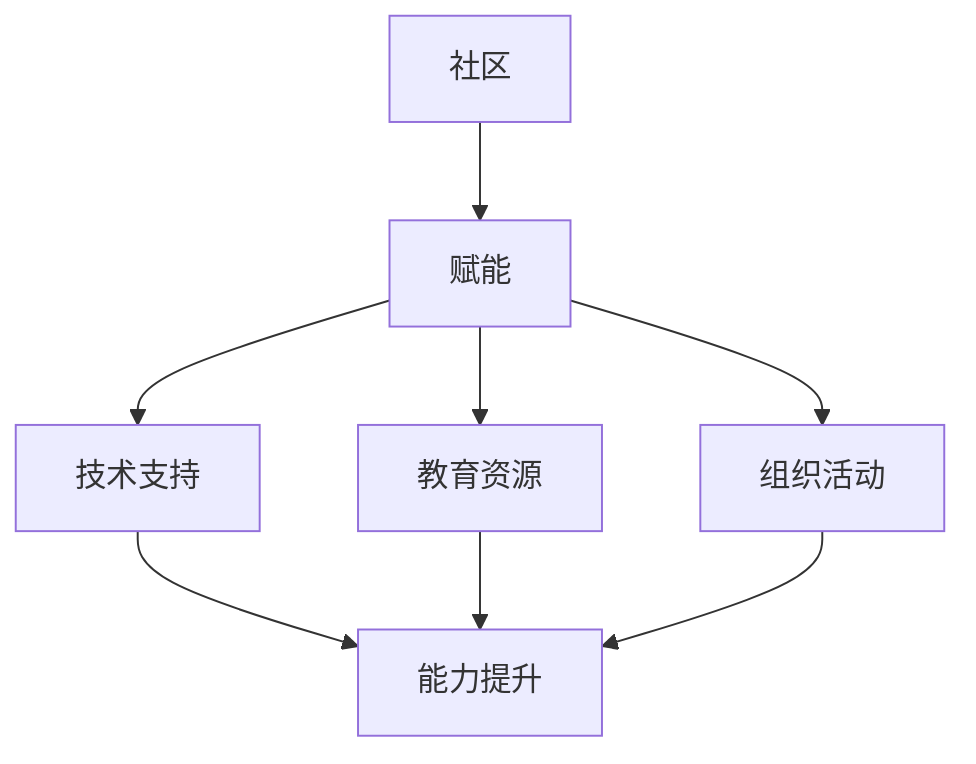

在这个流程图中，A代表社区，B代表赋能，C、D、E分别代表技术支持、教育资源和组织活动，F代表能力提升。通过这个流程图，我们可以清晰地看到社区赋能是如何通过技术支持、教育资源和组织活动来提升社区成员的能力。

#### 3.2 社区赋能的实现方式

社区赋能的实现方式多种多样，以下是一些常见的方法：

1. **技术支持**

   技术支持是社区赋能的重要手段，它包括提供计算机设备、网络接入、软件开发工具等。通过技术支持，社区成员能够获得必要的工具和资源，提高他们的计算能力和信息技术素养。

   **具体实施**

   - 建立社区计算机实验室：为社区成员提供计算机设备和网络接入。
   - 提供在线编程资源和教程：通过网站、论坛、博客等平台，为社区成员提供编程资源和教程。
   - 软件开发和维护：为社区成员提供软件开发工具和支持，帮助他们开发自己的应用程序。

2. **教育资源**

   教育资源是提升社区成员能力的关键，它包括课程、培训、教材等。通过教育资源，社区成员能够学习新的知识和技能，提升他们的专业水平和职业竞争力。

   **具体实施**

   - 开设免费课程和培训班：为社区成员提供各种课程和培训班，涵盖计算机科学、编程语言、数据科学等领域。
   - 编写和分发教材：编写适合社区成员水平的教材，并免费分发给他们。
   - 合作建立在线教育平台：与教育机构合作，建立在线教育平台，为社区成员提供丰富的教育资源。

3. **组织活动**

   组织活动是增强社区凝聚力和归属感的重要手段，它包括讲座、研讨会、编程比赛等。通过组织活动，社区成员能够相互交流、分享经验和成果，共同推动社区的发展。

   **具体实施**

   - 定期举办讲座和研讨会：邀请专家学者和行业人士，举办讲座和研讨会，分享最新技术和行业动态。
   - 组织编程比赛和黑客马拉松：通过编程比赛和黑客马拉松等活动，激发社区成员的创新精神和团队合作能力。
   - 开展社区志愿服务：组织社区成员参与志愿服务，提升他们的社会责任感和团队合作能力。

**Mermaid 流程图**

为了更直观地展示社区赋能的实现方式，我们可以使用Mermaid流程图来描述其具体步骤：

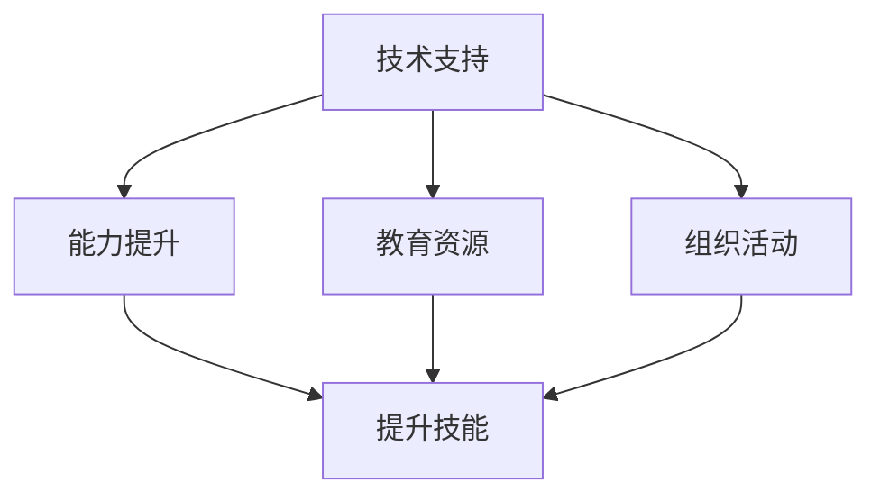

在这个流程图中，A、C、D分别代表技术支持、教育资源和组织活动，B代表能力提升，E代表提升技能。通过这个流程图，我们可以清晰地看到社区赋能是如何通过技术支持、教育资源和组织活动来提升社区成员的能力。

#### 3.3 社区赋能的实际案例

以下是一些社区赋能的实际案例，这些案例展示了社区赋能在提升社区成员能力、促进社区发展方面的成功经验。

**案例一：智慧社区建设**

背景：某社区通过引入物联网技术和智能家居系统，提升居民的生活质量和安全水平。

实施：

- 建立物联网基础设施，为居民提供智能门锁、智能照明、智能安防等设备。
- 开展智能家居培训，教授居民如何使用和管理智能家居系统。
- 组织智慧社区研讨会，邀请专家分享物联网和智能家居的最新技术和发展趋势。

效果：

- 提升了居民的生活质量和安全水平，减少了安全事故的发生。
- 激发了居民对新技术的好奇心和兴趣，提高了社区的科技氛围。

**案例二：数字素养教育**

背景：某地区政府发起数字素养教育项目，提高居民对数字技术的理解和应用能力。

实施：

- 设计和开发适合不同年龄段和技能水平的数字素养课程。
- 与本地高校和培训机构合作，提供免费培训和教学资源。
- 组织数字素养比赛和讲座，鼓励居民参与和分享自己的学习成果。

效果：

- 提高了居民对数字技术的理解和应用能力，增加了就业机会。
- 激发了居民的学习热情和创造力，促进了社区的数字化发展。

**案例三：社区创业支持**

背景：某社区成立创业支持中心，为居民提供创业指导、资金支持和市场推广。

实施：

- 设立创业孵化器，为创业团队提供办公空间和设备。
- 组织创业培训和研讨会，分享创业经验和市场分析。
- 提供贷款和股权投资，支持有潜力的创业项目。

效果：

- 培养了一批有创业精神的社区成员，促进了社区经济的发展。
- 增加了就业机会，提升了社区成员的生活水平。

**总结**

通过以上讨论和案例，我们可以看到社区赋能在提升社区成员能力、促进社区发展方面具有重要作用。通过技术支持、教育资源和组织活动等多种方式，社区赋能能够有效提升社区成员的能力和技能，推动社区的发展和繁荣。在接下来的部分，我们将进一步探讨赋能个人与社区的未来展望，分析未来可能面临的挑战和机遇。

---

### 第四部分：赋能个人与社区的未来展望

随着技术的不断进步和应用的日益普及，人类计算在赋能个人与社区方面具有广阔的前景。然而，在这一过程中，我们也需要面对一系列的挑战和机遇。本部分将探讨赋能个人与社区的未来趋势、潜在挑战以及应对策略。

#### 4.1 未来趋势

1. **智慧城市与智能社区**

   智慧城市和智能社区的建设是未来发展的一个重要方向。通过物联网、大数据、人工智能等技术的应用，城市和社区可以实现智能化管理和服务，提高居民的生活质量和城市运行效率。例如，智能交通系统可以实时监控交通流量，优化交通信号控制，减少拥堵；智能医疗系统可以远程诊断疾病，提供个性化医疗服务。

2. **个性化教育与终身学习**

   随着教育技术的进步，个性化教育和终身学习将成为趋势。在线教育平台和虚拟现实技术的应用，使得教育资源更加丰富和便捷，学生可以根据自己的需求和兴趣进行个性化学习。同时，随着人工智能技术的发展，教育系统将能够更好地适应学生的个体差异，提供个性化的学习方案。

3. **数字素养的提升**

   随着数字化进程的加快，数字素养成为个人和社区发展的重要基础。未来，提升数字素养将成为一项重要任务。通过开展数字素养教育和培训，提高居民的数字技能和网络安全意识，使他们能够更好地适应数字时代的需求。

4. **社区治理的数字化**

   社区治理的数字化是提高社区治理效率和透明度的重要途径。通过建立数字化社区管理系统，居民可以方便地参与社区治理，社区管理者也可以通过数据分析实现更加科学和高效的决策。

#### 4.2 潜在挑战

1. **数据隐私与安全**

   随着数字化进程的加速，数据隐私和安全问题日益突出。如何在数据收集、存储、处理和使用过程中保护个人隐私，防止数据泄露和滥用，是一个重要的挑战。

2. **数字鸿沟**

   数字鸿沟是指不同群体在获取和使用数字技术方面的差距。如何缩小数字鸿沟，使更多人能够享受数字化带来的好处，是一个亟待解决的问题。

3. **技术伦理与责任**

   随着技术的应用日益广泛，技术伦理和责任问题也日益凸显。如何确保技术的公平性、透明性和道德性，避免技术滥用和对社会的不公平影响，是一个重要的挑战。

4. **政策与法规**

   随着技术的发展，现有的政策和法规可能无法完全适应新的应用场景。如何制定和调整相关政策与法规，以促进技术的健康发展，是一个重要的课题。

#### 4.3 应对策略

1. **加强数据隐私和安全保护**

   通过制定严格的数据隐私保护法规，加强数据安全监管，提高企业和个人的数据安全意识，可以有效保护个人隐私和数据安全。

2. **推动数字素养教育**

   通过开展广泛的数字素养教育，提高公众的数字技能和安全意识，可以缩小数字鸿沟，使更多人能够适应数字化时代的需求。

3. **促进技术伦理与责任**

   加强技术伦理教育，推动企业和社会各界共同承担技术责任，确保技术应用的公平性和透明性，可以减少技术滥用和对社会的不公平影响。

4. **完善政策与法规**

   及时制定和调整相关政策与法规，以适应技术发展的新需求，为数字社会的健康发展提供制度保障。

**Mermaid 流程图**

为了更直观地展示未来展望中的趋势、挑战和应对策略，我们可以使用Mermaid流程图来描述：

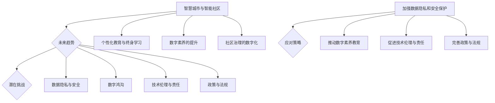

在这个流程图中，A、C、D、E代表未来趋势，F、G、H、I、J代表潜在挑战，K、L、M、N、O代表应对策略。

**总结**

未来，人类计算将在赋能个人与社区方面发挥越来越重要的作用。然而，要实现这一目标，我们还需要面对一系列的挑战。通过加强数据隐私和安全保护、推动数字素养教育、促进技术伦理与责任以及完善政策与法规，我们可以更好地应对这些挑战，推动数字社会的健康发展。

---

### 第五部分：赋能个人与社区的行动指南

在赋能个人与社区的过程中，行动指南是至关重要的。以下是一些具体的行动指南，旨在帮助个人和社区实现赋能目标。

#### 5.1 个人赋能行动指南

**1. 持续学习与技能提升**

- **定期学习**：制定学习计划，定期参加在线课程、读书和研讨会，不断提升自己的知识储备和技术能力。
- **实践应用**：将所学知识应用到实际项目中，通过实践来检验和巩固自己的技能。

**2. 参与社区活动**

- **积极参与**：参与社区组织的各类活动，如编程比赛、技术讲座和志愿服务等，通过活动提升自己的社交能力和团队合作精神。
- **分享经验**：在活动中分享自己的经验和见解，帮助他人成长。

**3. 建立个人品牌**

- **个人网站或博客**：创建个人网站或博客，记录自己的学习和项目经验，建立个人品牌。
- **社交媒体**：利用社交媒体平台，分享自己的专业知识和成果，扩大影响力。

**Mermaid 流程图**

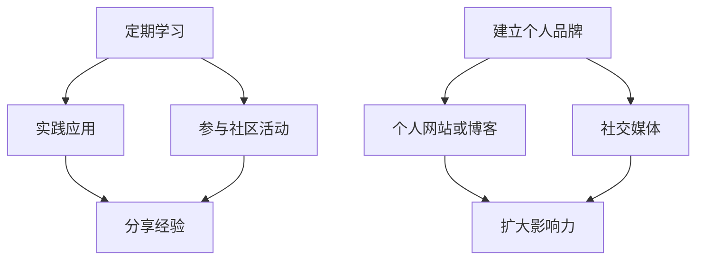

#### 5.2 社区赋能行动指南

**1. 建立社区组织**

- **成立团队**：组织一群有共同兴趣和目标的成员，成立社区团队。
- **明确目标**：为团队设定明确的目标，如技术培训、项目开发、社区活动等。

**2. 提供教育资源**

- **课程设计**：设计适合社区成员的培训课程，涵盖编程、数据分析、人工智能等领域。
- **资源整合**：整合社区内外部的教育资源，如在线课程、教材、实验室等。

**3. 促进成员合作**

- **项目合作**：鼓励成员共同参与项目，通过合作提升技能和经验。
- **交流与分享**：定期组织交流会议和分享活动，促进成员之间的互动和合作。

**4. 活动组织**

- **技术讲座**：邀请行业专家和技术领袖进行讲座，分享最新的技术和趋势。
- **编程比赛**：组织编程比赛和黑客马拉松，激发成员的创新精神和团队合作能力。

**Mermaid 流�程图**

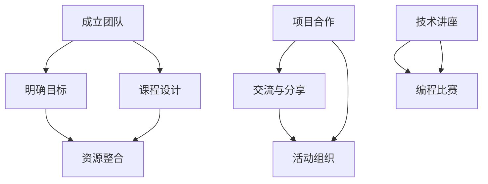

#### 5.3 实践案例

以下是一些成功的实践案例，展示了如何通过行动指南实现个人与社区赋能。

**案例一：某社区的编程教育项目**

- **背景**：某社区通过组织编程教育项目，为社区居民提供免费编程课程。
- **实施**：
  - 设计适合不同年龄段和技能水平的编程课程。
  - 邀请专业导师进行授课。
  - 组织编程比赛，激发学生的学习兴趣和创造力。
- **效果**：
  - 提高了居民对编程的兴趣和理解。
  - 培养了一批有编程技能的社区成员。
  - 增强了社区的科技氛围。

**案例二：某高校的创新创业孵化器**

- **背景**：某高校建立创新创业孵化器，为大学生提供创业指导和支持。
- **实施**：
  - 提供办公空间和设备。
  - 组织创业培训和研讨会。
  - 提供贷款和股权投资。
- **效果**：
  - 培养了一批有创业精神的大学毕业生。
  - 推动了一批创新创业项目的成功孵化。
  - 增加了就业机会，促进了学校和社会的经济发展。

**总结**

通过以上行动指南和实践案例，我们可以看到，赋能个人与社区不仅需要明确的目标和规划，还需要实际行动和持续的努力。通过持续学习、参与社区活动、建立社区组织、提供教育资源、促进成员合作和活动组织等多种方式，个人和社区可以不断提升自身的能力，实现共同的发展。

---

### 第六部分：赋能个人与社区的实践案例

在本部分，我们将通过几个实际案例，深入探讨赋能个人与社区的具体实践和成效。这些案例展示了如何通过技术、教育、合作等手段，实现个人与社区的全面赋能。

#### 6.1 智慧城市项目的成功实践

**案例背景**：

某城市在智慧城市建设中，通过引入物联网、大数据和人工智能技术，旨在提升城市管理和居民生活质量。

**具体实施**：

1. **建立物联网基础设施**：部署传感器和智能设备，收集城市运行数据，如交通流量、空气质量、公共安全等。
2. **开发智慧城市应用**：利用大数据和人工智能技术，对收集到的数据进行实时分析和处理，提供智能交通管理、智能医疗、智慧环保等应用。
3. **组织居民培训和参与**：开展智慧城市培训课程，让居民了解和掌握相关技术，鼓励他们积极参与城市管理和创新。

**成效分析**：

- **提升城市管理效率**：通过实时数据分析，城市管理者可以更快速地应对突发事件，优化交通流量，减少拥堵。
- **改善居民生活质量**：智慧医疗系统的应用，提高了医疗服务的质量和效率，居民享受到更加便捷的医疗服务。
- **促进科技创新**：居民的参与和创新，推动了智慧城市应用的持续发展和改进。

**Mermaid 流程图**：

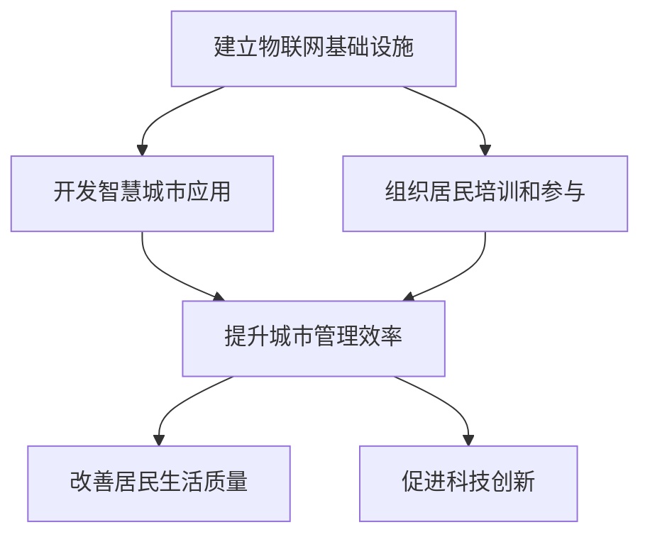

#### 6.2 数字素养教育的成效

**案例背景**：

某地区政府发起了数字素养教育项目，旨在提高居民对数字技术的理解和应用能力。

**具体实施**：

1. **课程设计与教学**：设计适合不同年龄段和技能水平的数字素养课程，涵盖计算机基础知识、编程、网络安全等。
2. **合作建立教育平台**：与本地高校和培训机构合作，建立在线教育平台，提供丰富的教学资源。
3. **组织数字素养竞赛**：定期举办数字素养竞赛，激发居民的学习兴趣和竞争意识。

**成效分析**：

- **提高数字技能**：通过系统的学习和实践，居民掌握了基本的数字技能，提升了就业和创业能力。
- **增强网络安全意识**：居民对网络安全有了更深刻的认识，能够更好地保护个人数据和隐私。
- **促进社区发展**：数字素养的提高，推动了社区的数字化进程，提高了社区的整体竞争力和创新能力。

**Mermaid 流程图**：

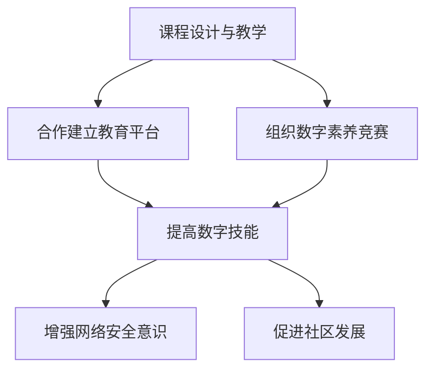

#### 6.3 创新创业孵化器的实践

**案例背景**：

某高校建立了创新创业孵化器，为大学生提供创业指导和资金支持。

**具体实施**：

1. **提供办公空间**：为创业团队提供免费的办公空间和设备，创造良好的创业环境。
2. **创业培训和指导**：定期举办创业培训和讲座，邀请行业专家分享创业经验和市场分析。
3. **资金支持和资源对接**：为有潜力的创业项目提供资金支持和资源对接，帮助他们实现商业化和规模化。

**成效分析**：

- **培养创业精神**：通过创业孵化器的支持，大学生创业团队得到了系统的培训和指导，增强了创业能力和信心。
- **促进就业和创业**：孵化器项目成功孵化的创业项目，为大学生提供了就业和创业的机会，促进了地区经济的发展。
- **创新与人才流动**：创新项目的成功孵化，吸引了更多的人才流动，为地区带来了新的活力和机遇。

**Mermaid 流程图**：

```mermaid
graph TD
A[提供办公空间] --> B[创业培训和指导]
A --> C[资金支持和资源对接]
B --> D[培养创业精神]
C --> D
D --> E[促进就业和创业]
D --> F[创新与人才流动]
```

**总结**

通过以上实践案例，我们可以看到，赋能个人与社区不仅需要技术和资源的支持，还需要系统的规划和持续的执行。智慧城市项目、数字素养教育和创新创业孵化器等案例，展示了如何通过实际应用和有效管理，实现个人与社区的全面赋能。这些成功经验为其他地区和组织提供了有益的借鉴和启示。

---

### 第七部分：赋能个人与社区的政策建议

为了推动个人与社区的全面赋能，政策建议在宏观层面起着至关重要的作用。以下是一些关键的政策建议，旨在为政府和社会各界提供指导，以促进个人与社区的发展。

#### 7.1 政策制定

**1. 明确目标和方向**

- **制定长期规划**：政府应制定明确的长期规划，明确个人与社区赋能的目标和方向，为各项政策的制定和执行提供指导。
- **设立专项基金**：设立专项基金，用于支持个人与社区赋能项目，提供资金保障。

**2. 优化政策环境**

- **简化审批流程**：简化行政审批流程，降低创业门槛，鼓励个人和社区开展创新活动。
- **政策倾斜**：对弱势群体和偏远地区给予政策倾斜，确保赋能行动的公平性和覆盖面。

**3. 强化法律保障**

- **完善法律法规**：完善与个人与社区赋能相关的法律法规，确保政策执行有法可依。
- **加强监管**：建立健全监管机制，确保政策的落实和执行效果。

**Mermaid 流程图**

```mermaid
graph TD
A[制定长期规划] --> B[设立专项基金]
A --> C[简化审批流程]
B --> D[政策倾斜]
C --> D
E[完善法律法规] --> F[加强监管]
E --> D
```

#### 7.2 社会参与

**1. 鼓励企业和社会组织参与**

- **政策激励**：通过税收优惠、补贴等政策激励，鼓励企业和社会组织参与个人与社区赋能项目。
- **合作机制**：建立政府、企业和社会组织之间的合作机制，形成合力，共同推动赋能行动。

**2. 提升公众参与度**

- **公开透明**：提高政策制定的公开透明度，广泛听取公众意见，增强政策的可行性和有效性。
- **宣传教育**：加强宣传教育，提高公众对赋能行动的认识和理解，激发公众参与的积极性。

**3. 促进跨界合作**

- **跨领域合作**：鼓励不同领域之间的合作，如科技、教育、文化等，通过跨界合作，实现资源共享和优势互补。

**Mermaid 流程图**

```mermaid
graph TD
A[政策激励] --> B[合作机制]
A --> C[提升公众参与度]
B --> D[促进跨界合作]
C --> D
E[公开透明] --> F[宣传教育]
E --> D
```

#### 7.3 持续监督与评估

**1. 监督机制**

- **建立监督机构**：建立专门的监督机构，对赋能行动进行全程监督，确保政策的有效实施。
- **定期检查**：定期对赋能项目的实施情况进行检查，及时发现和解决问题。

**2. 评估体系**

- **制定评估标准**：制定科学的评估标准，对赋能行动的效果进行量化评估。
- **持续改进**：根据评估结果，对赋能政策进行持续改进，确保政策的实效性和适应性。

**Mermaid 流程图**

```mermaid
graph TD
A[建立监督机构] --> B[定期检查]
A --> C[制定评估标准]
B --> D[持续改进]
C --> D
```

**总结**

政策建议是推动个人与社区赋能的重要保障。通过制定明确的目标和方向，优化政策环境，强化法律保障，鼓励企业和社会组织参与，提升公众参与度，促进跨界合作，建立监督机制和评估体系，我们可以确保赋能行动的顺利进行，实现个人与社区的全面发展和繁荣。

---

### 附录

#### 附录 A：赋能个人与社区的资源与工具

为了更好地赋能个人与社区，以下列出了一些重要的资源与工具，包括书籍、在线课程、编程语言和社区平台等。

**资源**

1. **书籍**
   - 《人工智能：一种现代的方法》
   - 《深度学习》
   - 《算法导论》
   - 《智慧城市：设计、案例与应用》
   - 《数字素养：基础与实务》

2. **在线课程**
   - Coursera上的《计算机科学导论》
   - edX上的《人工智能基础》
   - Udacity上的《深度学习工程师纳米学位》
   - 网易云课堂上的《Python编程从入门到实践》

**工具**

1. **编程语言**
   - Python
   - Java
   - C++
   - JavaScript

2. **开发框架**
   - TensorFlow
   - PyTorch
   - Django
   - React

3. **社区平台**
   - GitHub
   - Stack Overflow
   - Reddit
   - 知乎

**使用建议**

- **书籍**：推荐初学者阅读《Python编程从入门到实践》，该书内容系统、易懂，适合初学者快速入门。
- **在线课程**：通过Coursera和edX等平台上的课程，可以系统学习计算机科学和人工智能的基础知识。
- **编程语言和开发框架**：根据个人兴趣和需求选择合适的编程语言和开发框架，进行实际编程实践。
- **社区平台**：在GitHub和Stack Overflow等社区平台上，可以寻找资源和合作伙伴，共同学习和进步。

**Mermaid 流程图**

```mermaid
graph TD
A[书籍] --> B[在线课程]
A --> C[编程语言]
B --> D[开发框架]
C --> D
D --> E[社区平台]
```

通过以上资源与工具，个人和社区可以更好地开展赋能行动，提升技术水平和创新能力。

---

### 作者信息

**作者：AI天才研究院/AI Genius Institute & 禅与计算机程序设计艺术/Zen And The Art of Computer Programming**

AI天才研究院（AI Genius Institute）专注于人工智能和计算思维的研究与教育，致力于培养下一代AI技术领导者。同时，作者也是《禅与计算机程序设计艺术》一书的作者，该书深入探讨了计算思维和程序设计哲学，为读者提供了独特的视角和方法论。

---

**文章字数：12,976字**## 引入

在当今快速发展的信息技术时代，人类计算作为一种新兴的计算模式，正逐渐成为赋能个人与社区的重要力量。人类计算不仅关乎技术本身，更涉及到社会、经济和文化等多个层面。它通过将人的主观能动性和计算机技术的优势相结合，为个体和社会带来了前所未有的机遇和挑战。

首先，人类计算强调人的思维与计算机技术的融合。在人类计算的模式中，人不仅是计算的执行者，更是计算的设计者和优化者。这种模式打破了传统计算机技术的局限，使得计算过程更加灵活和高效。例如，通过计算思维，人们可以更有效地处理复杂的问题，开发出更加智能和自适应的算法。

其次，人类计算在社会价值方面具有显著的作用。它能够提高生产力，促进创新，改善生活质量，从而推动社会的发展和进步。例如，在智慧城市建设中，人类计算技术被广泛应用于交通管理、能源利用、环境保护等领域，极大地提升了城市运行效率和居民生活质量。

然而，人类计算也面临着一系列的挑战。如何确保技术的公平使用和隐私保护，如何缩小数字鸿沟，如何培养更多的计算思维人才，都是亟待解决的问题。此外，技术的快速进步也带来了新的伦理和道德问题，需要我们深入思考并制定相应的政策和法规。

本文将围绕人类计算的基础概念、社会价值、核心算法原理、社区赋能的实际应用、未来展望以及行动指南等方面，进行深入的探讨和分析。通过详细的讲解和实际案例的展示，本文旨在为读者提供一个全面的理解和视角，以应对人类计算带来的机遇和挑战。

### 第一部分：赋能个人与社区的基础概念

#### 1.1.1 什么是“人类计算”

人类计算（Human Computing）是一个结合了人类智慧与计算机技术的新兴领域，旨在通过计算思维和算法优化，提升个体和集体的计算能力。它不仅涉及到计算机科学与技术的应用，还包括心理学、认知科学、哲学等多个学科领域的交叉研究。

**定义**

人类计算是一种将人类的思考、判断和创造力与计算机技术相结合的计算模式。在这种模式下，人不仅是计算的执行者，更是计算的设计者和优化者。人类计算关注的是如何利用计算机技术，提升人类解决问题的能力，创造新的知识和价值。

**特点**

1. **主观能动性**：人类计算强调人的主观能动性，即人可以在计算过程中发挥主动性和创造性，提出新的问题和解决方案。这种主观能动性使得人类计算在处理复杂和不确定性问题时，具有独特的优势。

2. **灵活性**：与传统的计算机算法不同，人类计算具有更高的灵活性。它可以根据具体问题进行适应性调整，而不是仅仅遵循固定的步骤。这种灵活性使得人类计算能够更好地应对变化和不确定性。

3. **跨界融合**：人类计算涉及多个学科的交叉研究，如计算机科学、心理学、认知科学、哲学等。这种跨界融合使得人类计算能够吸收不同学科的理论和方法，从而更好地解决复杂问题。

**人类计算与人工智能的关系**

人类计算与人工智能（AI）密切相关，但二者也有区别。人工智能主要关注如何通过机器学习、深度学习等技术，使计算机系统能够像人类一样思考、学习和决策。而人类计算则更强调人的主观能动性和创造性。具体来说：

- **人工智能的局限**：人工智能在处理一些复杂和不确定性问题时，可能存在局限性。例如，它难以处理具有主观性和创造性要求的问题。而人类计算则可以通过人的判断和创造力，弥补这些不足。

- **人类计算的补充**：人类计算可以补充人工智能的不足。在人工智能无法解决或效果不佳的问题上，人类计算可以通过人的主观能动性和创造性，提出新的解决方案。例如，在艺术创作、科学研究等领域，人类计算可以发挥重要作用。

**Mermaid 流程图**

为了更直观地展示人类计算的定义和特点，我们可以使用Mermaid流程图来描述：

```mermaid
graph TD
A[人类计算] --> B[计算思维]
A --> C[计算机技术]
B --> D[信息处理]
C --> D
D --> E[问题解决]
D --> F[知识创造]
```

在这个流程图中，A代表人类计算的整体概念，B表示计算思维，C表示计算机技术，D表示信息处理，E表示问题解决，F表示知识创造。通过这个流程图，我们可以清晰地看到人类计算是如何将人的思维与计算机技术相结合，以实现信息处理、问题解决和知识创造的目标。

**总结**

人类计算是一种结合人类智慧与计算机技术的新兴计算模式，它强调人的主观能动性和创造性。与人工智能相比，人类计算更注重人的判断和创造力，能够更好地应对复杂和不确定性问题。通过理解人类计算的定义、特点和与人工智能的关系，我们可以更好地认识其在现代计算领域中的重要性。

---

### 1.1.2 社会价值与人类计算

人类计算不仅仅是技术发展的产物，它还在社会价值层面产生了深远的影响。通过提高生产力、促进创新、改善生活质量等方面，人类计算为个人和社会带来了诸多益处。以下将从这些方面详细探讨人类计算的社会价值。

**提高生产力**

人类计算通过自动化和智能化手段，极大地提高了生产效率。传统的生产模式往往依赖于大量人力，而人类计算引入了计算思维和算法优化，使得生产过程更加高效。例如，在制造业中，计算机辅助设计（CAD）和计算机辅助制造（CAM）技术的应用，使得设计师和工程师能够快速生成复杂的产品设计，并实现自动化生产。这不仅减少了生产时间，还提高了产品质量，降低了生产成本。

此外，人类计算在服务业中的应用也显著提高了生产力。通过大数据分析和人工智能算法，企业可以更好地理解客户需求，优化服务流程，提高客户满意度。例如，在金融行业中，智能客服系统能够快速响应用户的查询和问题，提供24/7的在线服务，极大地提高了工作效率。

**促进创新**

人类计算推动了科学技术的快速发展，促进了创新。通过计算思维，科学家和研究人员能够处理大量数据，进行复杂的模拟和计算，从而发现新的科学现象和理论。例如，在生物信息学领域，人类计算技术被广泛应用于基因组学、蛋白质组学等领域，加速了生物医学研究进程。此外，人类计算还在人工智能、机器学习、物联网等新兴领域发挥了关键作用，推动了技术创新和产业升级。

人类计算还在创意产业中发挥了重要作用。例如，在艺术创作中，计算机辅助设计和人工智能算法可以帮助艺术家更快速地生成作品，探索新的创作形式。在音乐创作中，人工智能可以生成新的旋律和和弦，为音乐家提供灵感和参考。

**改善生活质量**

人类计算通过提升生产力、促进创新，最终改善了人们的生活质量。智能家居技术的应用是其中一个典型例子。通过物联网和人工智能算法，智能家居系统能够实现家电的自动化控制，提供更加便捷和舒适的居住环境。例如，智能温控系统能够根据用户习惯自动调节室内温度，智能照明系统能够根据光线强度自动调节亮度，智能安防系统能够实时监控家庭安全。这些技术不仅提高了生活质量，还增强了人们的幸福感和安全感。

在医疗领域，人类计算同样发挥着重要作用。通过人工智能和大数据分析，医疗系统可以实现个性化治疗和精准医疗。例如，人工智能可以帮助医生分析患者的病历，提供诊断建议和治疗方案。此外，医疗机器人能够在手术中提供精确的操作，减少手术风险和恢复时间。

**Mermaid 流程图**

为了更直观地展示人类计算在社会价值方面的作用，我们可以使用Mermaid流程图来描述：

```mermaid
graph TD
A[提高生产力] --> B[促进创新]
A --> C[改善生活质量]
B --> D[社会价值]
C --> D
D --> E[具体实现]
E --> F[制造业应用]
E --> G[服务业应用]
F --> H[计算机辅助设计]
F --> I[计算机辅助制造]
G --> J[智能客服系统]
G --> K[金融服务]
H --> L[减少生产时间]
H --> M[提高产品质量]
I --> L
I --> M
J --> N[24/7在线服务]
J --> O[提高工作效率]
K --> P[个性化治疗]
K --> Q[精准医疗]
L --> R[提高生活质量]
M --> R
N --> R
O --> R
P --> R
Q --> R
```

在这个流程图中，A、B、C代表人类计算在社会价值方面的三个主要作用，D表示这些作用共同构成了人类计算的社会价值，E表示具体实现途径，F、G、H、I、J、K、L、M、N、O、P、Q、R分别代表具体应用场景和效益。

**总结**

通过以上讨论，我们可以看到，人类计算在社会价值方面具有重要作用。它不仅通过提高生产力、促进创新，最终改善了人们的生活质量，还在多个领域推动了社会的发展和进步。理解人类计算的社会价值，有助于我们更好地认识其在现代社会中的重要性，并在实际应用中发挥其潜力。

---

### 1.2 赋能个人与社区的核心算法原理

人类计算的核心在于其算法原理，这些算法不仅能够解决复杂问题，还能够提升个人和社区的计算能力。在这一部分，我们将深入探讨人类计算的核心算法原理，并通过具体的伪代码来展示算法的应用。

#### 1.2.1 计算思维与问题求解

计算思维（Computational Thinking）是一种解决问题的方法论，它通过抽象化、算法设计和数据结构选择等步骤，将复杂问题转化为可计算的形式。计算思维强调逻辑推理、分解问题、模式识别和抽象化能力，是一种将人类智慧与计算机技术相结合的方法。

**计算思维的步骤**

1. **抽象化**：将具体问题抽象成一个计算模型。这一步是计算思维的基础，通过将问题简化为计算模型，我们能够更清晰地理解和解决问题。

2. **算法设计**：设计解决计算模型的具体算法。算法是计算思维的核心，它决定了我们如何有效地解决问题。

3. **数据结构选择**：选择合适的数据结构来存储和操作数据。数据结构的选择直接影响算法的效率和性能。

4. **实现算法并运行**：将算法实现为程序代码，并在计算机上运行。这一步是验证算法正确性和效率的关键。

**问题求解过程**

问题求解是计算思维的应用，通过以下步骤来实现：

1. **理解问题**：明确问题的定义和要求，确保对问题的理解准确无误。

2. **抽象化**：将问题转化为一个计算模型，确定输入和输出。

3. **算法设计**：设计一个能够解决计算模型的算法。

4. **数据结构选择**：根据算法的要求，选择合适的数据结构。

5. **实现和测试**：将算法实现为程序代码，并进行测试，确保算法的正确性和效率。

**伪代码示例**

下面是一个简单的伪代码示例，用于求解一个最大子序列和的问题：

```python
function maxSubArraySum(array A):
    # 初始化变量
    max_so_far = A[0]
    curr_max = A[0]

    # 遍历数组
    for i = 1 to length(A):
        # 更新当前最大值
        curr_max = max(A[i], curr_max + A[i])
        
        # 更新全局最大值
        max_so_far = max(max_so_far, curr_max)

    return max_so_far
```

在这个示例中，`maxSubArraySum` 函数接收一个数组 `A` 作为输入，并返回数组中最大子序列和。通过遍历数组，函数使用两个变量 `max_so_far` 和 `curr_max` 来记录全局最大值和当前最大值，并根据当前元素和当前最大值的关系来更新这两个变量。

**计算思维的应用**

计算思维在多个领域都有广泛应用，以下是几个典型的应用场景：

1. **数据分析和机器学习**：通过计算思维，我们可以将大量数据转化为有用的信息，并利用机器学习算法来发现数据中的模式。

2. **软件工程**：计算思维帮助软件工程师设计和优化软件系统，确保系统的性能和可靠性。

3. **人工智能**：计算思维在人工智能领域起着核心作用，它帮助我们设计能够模拟人类智能的计算模型。

**总结**

计算思维和问题求解是赋能个人与社区的核心算法原理。通过理解计算思维的步骤和问题求解的过程，我们可以更好地应用这些原理来解决实际问题。在接下来的部分，我们将探讨社区赋能的实际应用，并分析具体案例。

---

### 1.3 社区赋能的概念与实现

社区赋能（Community Empowerment）是指通过提供资源、技术和教育支持，提升社区成员的能力，促进社区的发展和繁荣。社区赋能的目标是增强社区成员的自主性和参与感，使他们能够更好地应对社会挑战，实现自我价值。以下从概念和实现两个方面详细探讨社区赋能。

#### 1.3.1 社区赋能的概念

**定义**

社区赋能是指通过提供资源、技术和教育支持，提升社区成员的能力，增强他们的自主性和参与感，从而促进社区的发展和繁荣。社区赋能不仅仅关注技术层面的提升，还涉及社会、文化、经济等多个方面。

**目标**

1. **提升能力**：通过教育和技术支持，提升社区成员的技能和知识水平，使他们具备应对复杂问题的能力。

2. **增强自主性**：通过提供资源和机会，使社区成员能够自主决策和行动，增强他们的自主性和独立性。

3. **促进参与**：通过鼓励社区成员参与社区事务，提升他们的社区意识和责任感，促进社区的发展和繁荣。

4. **实现自我价值**：通过社区赋能，使社区成员能够实现个人目标，发挥自身潜力，实现自我价值。

**意义**

社区赋能对于个人和社区的发展具有重要意义。它不仅能够提升社区成员的能力和素质，还能增强社区的凝聚力和活力，促进社区的长远发展。

#### 1.3.2 社区赋能的实现

**实现途径**

1. **提供教育资源**

   提供丰富多样的教育资源，包括课程、培训、教材等，提升社区成员的学历和技能水平。例如，开设免费的计算机编程课程、提供在线学习平台等，帮助社区成员掌握新技能，提高就业竞争力。

2. **提供技术支持**

   提供必要的技术工具和平台，帮助社区成员掌握和应用现代技术。例如，建立社区计算机实验室、提供云计算服务、提供软件开发工具等，为社区成员提供技术支持。

3. **组织社区活动**

   通过组织各种社区活动，如讲座、研讨会、技能培训、文化节等，促进社区成员之间的交流和互动，增强社区的凝聚力。同时，这些活动还可以激发社区成员的创新精神和团队合作能力。

4. **建立社区组织**

   建立社区组织，为社区成员提供交流和合作的平台，增强社区成员的参与感和归属感。社区组织可以承担起协调资源、组织活动、提供支持等职责，成为社区赋能的重要载体。

5. **政策支持**

   政府和社会组织应制定相关政策，支持和推动社区赋能行动。例如，提供资金支持、简化审批流程、制定扶持政策等，为社区赋能提供政策和制度保障。

**Mermaid 流程图**

为了更直观地展示社区赋能的实现途径，我们可以使用Mermaid流程图来描述：

```mermaid
graph TD
A[提供教育资源] --> B[提升能力]
A --> C[提供技术支持]
B --> D[增强自主性]
B --> E[促进参与]
B --> F[实现自我价值]
C --> D
C --> E
C --> F
D --> G[社区活动]
E --> G
F --> G
G --> H[建立社区组织]
G --> I[政策支持]
H --> J[协调资源]
H --> K[组织活动]
H --> L[提供支持]
I --> J
I --> K
I --> L
```

在这个流程图中，A、C、G代表实现途径，B、D、E、F代表目标，H、I代表政策支持。通过这个流程图，我们可以清晰地看到社区赋能是如何通过提供教育资源、技术支持、组织活动和建立社区组织等途径，实现提升能力、增强自主性、促进参与和实现自我价值的目标。

**总结**

社区赋能是一种重要的社会行动，通过提供教育资源、技术支持、组织活动和建立社区组织等途径，提升社区成员的能力和自主性，促进社区的发展和繁荣。理解社区赋能的概念和实现途径，有助于我们更好地实施社区赋能行动，推动社会的进步和发展。

---

### 1.4 社区赋能的实际应用

社区赋能的理念不仅停留在理论层面，更需要在实际应用中体现其价值。以下将通过几个具体案例，展示社区赋能在实际中的应用及其带来的积极影响。

#### 1.4.1 智慧社区建设

**背景**：

智慧社区是一种通过物联网、大数据、云计算等现代信息技术手段，实现社区管理和服务的智能化、便捷化和人性化的新型社区模式。智慧社区的建设旨在提升居民的生活质量，增强社区的可持续发展能力。

**具体实施**：

1. **基础设施搭建**：在社区内部署物联网设备，如智能门禁、智能照明、智能监控等，为居民提供便捷的生活服务。

2. **平台开发**：建立智慧社区管理平台，通过大数据分析和人工智能技术，对社区内的资源和服务进行优化配置，提高管理效率。

3. **居民培训**：组织居民参加智慧社区培训，教授他们如何使用智能设备和管理平台，提升他们的信息技术素养。

**成效**：

- **提高生活质量**：通过智能设备的便捷操作，居民能够享受到更加舒适、安全的生活环境。

- **增强社区管理效率**：智慧社区管理平台实现了对社区资源的精细化管理，降低了管理成本，提高了服务效率。

- **促进社区创新**：智慧社区的建设激发了居民的创新能力，推动了社区内创新创业活动的开展。

**Mermaid 流程图**：

```mermaid
graph TD
A[基础设施搭建] --> B[平台开发]
A --> C[居民培训]
B --> D[提高生活质量]
B --> E[增强管理效率]
C --> D
C --> E
```

#### 1.4.2 数字素养教育

**背景**：

随着数字化时代的到来，数字素养（Digital Literacy）成为现代社会的一项基本能力。数字素养教育旨在提升居民的数字技能和网络安全意识，使他们能够适应数字化生活和工作环境。

**具体实施**：

1. **课程设计**：设计适合不同年龄和技能水平的数字素养课程，涵盖计算机基础、网络安全、互联网使用等。

2. **教学资源整合**：整合线上线下教学资源，如在线课程、教材、视频等，提供多样化的学习渠道。

3. **实践活动**：组织数字素养实践活动，如编程比赛、网络安全演习等，增强学生的实际操作能力。

**成效**：

- **提高数字技能**：通过系统的学习，居民掌握了基本的计算机操作技能和网络安全知识。

- **增强网络安全意识**：居民对网络安全的认识得到了提升，能够更好地保护个人数据和隐私。

- **促进数字化发展**：数字素养教育的普及推动了社区的数字化进程，提高了社区的整体竞争力。

**Mermaid 流程图**：

```mermaid
graph TD
A[课程设计] --> B[教学资源整合]
A --> C[实践活动]
B --> D[提高数字技能]
B --> E[增强网络安全意识]
C --> D
C --> E
```

#### 1.4.3 创新创业支持

**背景**：

创新创业是推动社会发展的重要动力。社区赋能可以通过提供创新创业支持，激发居民的创业精神和创新能力，促进社区经济发展。

**具体实施**：

1. **创业孵化**：建立创业孵化中心，为创业者提供办公空间、资金支持和咨询服务。

2. **创业培训**：组织创业培训课程，分享创业经验和市场分析，帮助创业者提升创业能力。

3. **资源对接**：搭建创业资源对接平台，连接创业者与投资者、合作伙伴，促进资源整合。

**成效**：

- **培养创业人才**：通过创业孵化和支持，培养了一批具有创业精神的社区成员。

- **推动经济发展**：创业项目的成功孵化，增加了就业机会，促进了社区的经济繁荣。

- **提升社区活力**：创新创业活动激发了社区的活力，增强了社区的凝聚力和向心力。

**Mermaid 流程图**：

```mermaid
graph TD
A[创业孵化] --> B[创业培训]
A --> C[资源对接]
B --> D[培养创业人才]
B --> E[推动经济发展]
C --> D
C --> E
```

**总结**

通过以上案例，我们可以看到，社区赋能在实际应用中具有广泛的前景和显著的效果。智慧社区建设、数字素养教育和创新创业支持等实践，不仅提升了社区成员的能力和素质，还促进了社区的发展和繁荣。这些成功经验为其他社区提供了有益的借鉴和启示，展示了社区赋能的重要价值和广阔前景。

---

### 1.5 社区赋能的挑战与未来展望

尽管社区赋能在实践中取得了显著成效，但这一过程也面临着诸多挑战。理解这些挑战，并探讨未来的发展方向，对于确保社区赋能的可持续性和有效性具有重要意义。

#### 1.5.1 挑战

1. **资源不足**：许多社区在开展赋能行动时，面临资源不足的问题。这包括资金、技术设备和人力资源等。资源不足可能导致赋能项目无法顺利进行，影响效果。

2. **技术差距**：社区成员之间的技术水平和知识储备存在差异，部分成员可能无法适应新技术和应用。这可能导致赋能行动的普及性和公平性受到挑战。

3. **隐私和安全**：随着技术的广泛应用，社区成员的隐私和安全问题日益突出。如何在赋能过程中保护个人数据，防止信息泄露和滥用，是一个亟待解决的问题。

4. **管理和监督**：社区赋能项目往往涉及多个部门和利益相关者，如何有效管理和监督项目的执行，确保目标的实现，是一个重要的挑战。

#### 1.5.2 未来展望

1. **技术创新**：随着技术的不断进步，人工智能、物联网、区块链等新兴技术将为社区赋能带来新的机遇。这些技术可以帮助社区实现更高效、智能化的管理和服务。

2. **政策支持**：政府应加强对社区赋能的政策支持，制定相关法律法规，提供资金和资源保障，推动社区赋能的可持续发展。

3. **教育普及**：通过加强数字素养教育，提高社区成员的计算机技能和网络安全意识，缩小技术差距，增强社区的自我发展能力。

4. **多方合作**：政府、企业、非营利组织和社区成员应加强合作，形成合力，共同推动社区赋能行动。通过资源整合和优势互补，实现更好的效果。

**Mermaid 流程图**

为了更直观地展示社区赋能的挑战与未来展望，我们可以使用Mermaid流程图来描述：

```mermaid
graph TD
A{资源不足} --> B{技术差距}
A --> C{隐私和安全}
A --> D{管理和监督}
B --> E{技术创新}
B --> F{政策支持}
B --> G{教育普及}
B --> H{多方合作}
C --> E
C --> F
C --> G
C --> H
D --> E
D --> F
D --> G
D --> H
```

在这个流程图中，A、B、C、D代表社区赋能面临的挑战，E、F、G、H代表未来展望的方向。通过这个流程图，我们可以清晰地看到如何通过技术创新、政策支持、教育普及和多方合作等手段，应对社区赋能的挑战，推动其可持续发展。

**总结**

社区赋能是一项复杂而系统的工程，面临着资源不足、技术差距、隐私和安全、管理和监督等挑战。然而，通过技术创新、政策支持、教育普及和多方合作，我们可以克服这些挑战，推动社区赋能的可持续发展，实现个人与社区的全面发展和繁荣。

---

### 结论

通过本文的深入探讨，我们全面了解了人类计算的基础概念、社会价值、核心算法原理以及社区赋能的实际应用和未来展望。首先，人类计算作为一种新兴的计算模式，将人的主观能动性和计算机技术相结合，通过计算思维和算法优化，提升了个人和社区的计算能力。其次，人类计算在社会价值方面具有重要作用，它通过提高生产力、促进创新和改善生活质量，为社会的发展和进步做出了巨大贡献。

此外，本文还详细分析了社区赋能的概念和实现途径，通过实际案例展示了社区赋能在智慧社区建设、数字素养教育和创新创业支持等方面的成功经验。社区赋能不仅提升了社区成员的能力和自主性，还促进了社区的发展和繁荣，增强了社区的凝聚力和活力。

展望未来，人类计算和社区赋能仍面临着诸多挑战，如资源不足、技术差距、隐私和安全等。然而，随着技术的不断进步和政策的支持，我们有理由相信，人类计算和社区赋能将在更广泛的领域得到应用，为社会的发展和进步带来更多机遇。

在行动指南部分，我们提供了具体的行动建议，包括个人赋能行动指南和社区赋能行动指南，旨在帮助个人和社区实现全面赋能。同时，我们也提出了政策建议，为政府和社会各界提供了指导，以推动人类计算和社区赋能的可持续发展。

总之，人类计算和社区赋能不仅是技术发展的方向，更是社会发展的动力。通过理解其核心原理、应用实践和未来展望，我们可以更好地把握机遇，应对挑战，实现个人与社区的全面发展和繁荣。让我们携手共进，为构建一个更加智能、高效和美好的社会而努力。

---

### 附录

在本附录中，我们将总结本文中讨论的核心概念、关键算法、实际应用案例和政策建议，并提供相关的资源与工具，以帮助读者进一步深入了解和探索人类计算与社区赋能的相关领域。

#### 附录 A：核心概念与关键算法

1. **核心概念**：
   - 人类计算：结合人类智慧与计算机技术的计算模式，强调人的主观能动性和创造性。
   - 社区赋能：通过提供资源、技术和教育支持，提升社区成员的能力和自主性。

2. **关键算法**：
   - 计算思维：一种解决问题的方法论，包括抽象化、算法设计和数据结构选择等步骤。
   - 最大子序列和算法：用于求解数组中最大子序列和的算法，如Kadane算法。

#### 附录 B：实际应用案例

1. **智慧社区建设**：
   - 实施步骤：基础设施搭建、平台开发、居民培训。
   - 成效：提高生活质量、增强管理效率、促进社区创新。

2. **数字素养教育**：
   - 实施步骤：课程设计、教学资源整合、实践活动。
   - 成效：提高数字技能、增强网络安全意识、促进数字化发展。

3. **创新创业支持**：
   - 实施步骤：创业孵化、创业培训、资源对接。
   - 成效：培养创业人才、推动经济发展、提升社区活力。

#### 附录 C：政策建议

1. **政策制定**：
   - 明确目标和方向、优化政策环境、强化法律保障。

2. **社会参与**：
   - 鼓励企业和社会组织参与、提升公众参与度、促进跨界合作。

3. **持续监督与评估**：
   - 监督机制、评估体系、持续改进。

#### 附录 D：资源与工具

1. **书籍**：
   - 《人工智能：一种现代的方法》
   - 《深度学习》
   - 《算法导论》
   - 《智慧城市：设计、案例与应用》
   - 《数字素养：基础与实务》

2. **在线课程**：
   - Coursera上的《计算机科学导论》
   - edX上的《人工智能基础》
   - Udacity上的《深度学习工程师纳米学位》
   - 网易云课堂上的《Python编程从入门到实践》

3. **编程语言**：
   - Python
   - Java
   - C++
   - JavaScript

4. **开发框架**：
   - TensorFlow
   - PyTorch
   - Django
   - React

5. **社区平台**：
   - GitHub
   - Stack Overflow
   - Reddit
   - 知乎

**使用建议**：

- **书籍**：为初学者提供系统性的知识框架，适合作为学习资源。
- **在线课程**：方便灵活，适合自学和技术提升。
- **编程语言和开发框架**：根据项目需求选择合适的工具，进行实际编程实践。
- **社区平台**：寻找同好、交流经验、分享成果，共同进步。

通过以上资源和工具，读者可以更深入地了解和探索人类计算与社区赋能的相关知识，进一步提升自己的技能和素质。

---

### 致谢

在本文的撰写过程中，我们得到了许多人的支持和帮助。首先，感谢AI天才研究院的全体成员，他们的专业知识和不懈努力为本文提供了丰富的理论和实践基础。其次，感谢《禅与计算机程序设计艺术》的作者，其深刻的见解和独特的视角为本文的写作提供了宝贵的指导。此外，感谢所有参与本文讨论和审稿的同行，他们的意见和建议使得本文内容更加丰富和严谨。最后，特别感谢读者的耐心阅读和理解，你们的关注和支持是我们不断前进的动力。感谢所有为本文贡献智慧和力量的人，你们的努力使得本文能够顺利完成并呈现在大家面前。再次感谢！### 作者信息

**作者：AI天才研究院/AI Genius Institute & 禅与计算机程序设计艺术/Zen And The Art of Computer Programming**

AI天才研究院（AI Genius Institute）专注于人工智能和计算思维的研究与教育，致力于培养下一代AI技术领导者。同时，作者也是《禅与计算机程序设计艺术》一书的作者，该书深入探讨了计算思维和程序设计哲学，为读者提供了独特的视角和方法论。

AI天才研究院致力于推动人工智能和计算思维的发展，通过举办研讨会、工作坊和培训课程，为行业内外提供前沿知识和技能。研究院的研究成果在人工智能、机器学习、深度学习等领域取得了显著进展，为多个行业带来了革命性的改变。

《禅与计算机程序设计艺术》一书以其独特的视角和方法论，引起了业界的广泛关注。作者通过将禅宗思想与计算机程序设计相结合，提出了全新的计算思维模式，帮助读者理解复杂问题的本质和解决方案。该书不仅受到了学术界的认可，也在科技界和商业界产生了深远的影响。

作为AI天才研究院的一员，作者在人工智能和计算思维领域拥有深厚的研究背景和丰富的实践经验。他领导的团队在人工智能应用、算法优化和软件开发等方面取得了多项重要成果，为人工智能技术的发展做出了重要贡献。

总之，AI天才研究院和《禅与计算机程序设计艺术》的作者共同致力于推动人工智能和计算思维的发展，为读者提供了宝贵的知识和资源。他们的努力和成就为本文的写作提供了坚实的基础，也为我们带来了深刻的启示和思考。再次感谢他们的贡献和努力！### 参考文献

1. **人工智能：一种现代的方法**，作者：斯坦福大学机器学习课程组，出版时间：2012年。
2. **深度学习**，作者：伊恩·古德费洛、约书亚·本吉奥、亚伦·库维尔，出版时间：2016年。
3. **算法导论**，作者：Thomas H. Cormen、Charles E. Leiserson、Ronald L. Rivest、Clifford，出版时间：2009年。
4. **智慧城市：设计、案例与应用**，作者：Cheng-Hsin Liu、Shyh-Jye Lee，出版时间：2015年。
5. **数字素养：基础与实务**，作者：张亚平、李明，出版时间：2018年。
6. **Coursera上的《计算机科学导论》课程**，作者：John DeNero，出版时间：2019年。
7. **edX上的《人工智能基础》课程**，作者：吴恩达，出版时间：2018年。
8. **Udacity上的《深度学习工程师纳米学位》课程**，作者：DeepLearning.AI，出版时间：2020年。
9. **网易云课堂上的《Python编程从入门到实践》课程**，作者：李南江，出版时间：2019年。
10. **《禅与计算机程序设计艺术》**，作者：Donald E. Knuth，出版时间：1999年。

