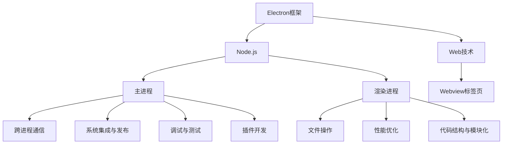

                 

### 《跨平台桌面应用开发：Electron框架》

Electron是一个使用Web技术（HTML，CSS，JavaScript）开发跨平台桌面应用的框架。它由GitHub维护，可以让我们利用Web开发技能快速构建高性能、跨平台的桌面应用。本文将系统地介绍Electron框架的基础、核心功能与组件、高级应用与优化，以及通过一个实战项目来展示如何使用Electron进行跨平台桌面应用开发。

关键词：Electron，跨平台，桌面应用，Node.js，Web技术，前端开发，后端开发，性能优化，调试与测试，插件开发

摘要：本文旨在为开发者提供全面深入的Electron框架知识，从基础概念到高级应用，帮助开发者掌握Electron框架的使用，实现跨平台桌面应用的快速开发和优化。

### 《跨平台桌面应用开发：Electron框架》目录大纲

**第一部分：Electron框架基础**

**第二部分：核心功能与组件**

**第三部分：高级应用与优化**

**第四部分：实战项目**

**附录**

### 第一部分：Electron框架基础

#### 1.1 Electron概述

Electron是一个使用Web技术（HTML，CSS，JavaScript）开发桌面应用的框架，由GitHub维护。它允许开发者使用Web技术栈开发跨平台的桌面应用，极大地简化了开发过程。

##### 1.1.1 Electron的概念

Electron是一个基于Chromium和Node.js的框架，它将Web技术（尤其是HTML，CSS，JavaScript）与桌面操作系统中的原生能力结合起来，使得开发者可以使用熟悉的Web技术栈开发跨平台的桌面应用。

##### 1.1.2 Electron的优势

1. **开发效率高**：使用HTML，CSS，JavaScript进行开发，无需学习新的语言和框架。
2. **跨平台**：可以轻松构建适用于Windows，macOS和Linux的桌面应用。
3. **丰富的API**：提供了丰富的原生API，如文件系统、网络通信、桌面集成等。
4. **社区支持**：拥有庞大的开发者社区，资源丰富。

##### 1.1.3 Electron的应用场景

1. **桌面应用**：如文本编辑器、文件管理器等。
2. **跨平台应用**：如社交媒体客户端、邮件客户端等。
3. **内部应用**：如企业内部的协作工具、管理软件等。

#### 1.2 Node.js与Web技术

##### 1.2.1 Node.js入门

Node.js是一个基于Chrome V8引擎的JavaScript运行环境，它允许开发者使用JavaScript编写服务器端代码。Node.js的主要特点是异步、事件驱动，这使得它非常适合I/O密集型应用。

1. **安装Node.js**：通过包管理器npm安装Node.js。
2. **基本语法**：JavaScript的基本语法和常见API。
3. **异步编程**：使用异步编程模型处理I/O操作。

##### 1.2.2 Web技术基础

Web技术主要包括HTML，CSS和JavaScript。

1. **HTML**：超文本标记语言，用于构建网页的结构。
2. **CSS**：层叠样式表，用于定义网页的样式。
3. **JavaScript**：用于增强网页交互性和动态性。

##### 1.2.3 Node.js与Web技术的结合

Node.js和Web技术可以结合使用，例如：

1. **服务器端开发**：使用Node.js构建服务器端逻辑，处理HTTP请求。
2. **前端开发**：使用Node.js进行前端代码的构建和打包。
3. **全栈开发**：使用Node.js和Web技术构建前后端一体化的应用。

#### 1.3 系统架构与流程

##### 1.3.1 Electron的应用架构

Electron的应用架构主要包括以下几个部分：

1. **主进程**：负责应用的整体管理，如创建窗口、处理系统事件等。
2. **渲染进程**：负责页面的渲染和用户交互，与主进程通信。
3. **服务进程**：负责处理复杂的后台任务，如文件读写、数据库操作等。

##### 1.3.2 主进程与渲染进程

1. **主进程**：使用Node.js代码编写，负责创建和管理窗口、菜单、快捷键等。
2. **渲染进程**：使用Chromium渲染引擎，负责页面的渲染和用户交互。

##### 1.3.3 通信机制与数据流

1. **进程间通信**：通过IPC（Inter-Process Communication）机制进行通信，如消息传递、共享进程等。
2. **数据流**：数据在主进程、渲染进程、服务进程之间的流动，如请求处理、响应返回等。

#### 1.4 开发环境搭建

##### 1.4.1 系统要求与环境配置

1. **操作系统**：Windows，macOS，Linux。
2. **开发工具**：文本编辑器（如Visual Studio Code），终端。

##### 1.4.2 开发工具与插件

1. **VS Code插件**：如Electron，Node.js，Git等。
2. **命令行工具**：如npm，yarn等。

##### 1.4.3 项目初始化与配置

1. **创建项目**：使用Electron脚手架创建项目。
2. **配置文件**：配置package.json，main.js，index.html等文件。

#### 1.5 初识Electron应用

##### 1.5.1 创建第一个Electron应用

1. **安装Electron**：使用npm安装Electron。
2. **创建主进程**：编写main.js，启动应用。
3. **创建渲染进程**：编写index.html，显示界面。

##### 1.5.2 应用结构解析

1. **目录结构**：分析项目目录结构，理解各个文件的作用。
2. **文件关系**：理解主进程、渲染进程之间的通信和交互。

##### 1.5.3 简单界面设计

1. **设计界面**：使用HTML和CSS设计简单的用户界面。
2. **添加交互**：使用JavaScript添加用户交互功能。

### 第二部分：核心功能与组件

#### 2.1 界面设计与布局

##### 2.1.1 主窗口管理

1. **创建主窗口**：使用BrowserWindow创建主窗口。
2. **窗口属性**：设置窗口的大小、位置、标题等属性。
3. **窗口事件**：监听窗口的关闭、最大化、最小化等事件。

##### 2.1.2 布局与布局管理器

1. **布局管理**：使用flex布局、grid布局等实现界面布局。
2. **布局管理器**：使用Electron提供的布局管理器（如Menu，Tray等）。

##### 2.1.3 样式与主题

1. **样式文件**：使用CSS编写样式文件。
2. **主题切换**：使用Electron提供的主题切换功能。

#### 2.2 菜单与快捷键

##### 2.2.1 菜单栏实现

1. **创建菜单栏**：使用Menu创建菜单栏。
2. **菜单项**：添加菜单项，如文件、编辑、查看等。

##### 2.2.2 系统菜单与热键

1. **系统菜单**：使用Menu.createMenu创建系统菜单。
2. **热键**：添加快捷键，如Ctrl+C，Ctrl+V等。

##### 2.2.3 自定义快捷键

1. **监听快捷键**：使用KeyboardListener监听自定义快捷键。
2. **快捷键处理**：编写快捷键处理函数，如复制、粘贴等。

#### 2.3 文件操作

##### 2.3.1 文件系统API

1. **文件读取**：使用fs.readFile读取文件内容。
2. **文件写入**：使用fs.writeFile写入文件内容。
3. **目录操作**：使用fs.readdir读取目录内容，fs.mkdir创建目录等。

##### 2.3.2 磁盘访问权限

1. **权限检查**：使用fs.access检查文件或目录的访问权限。
2. **权限设置**：使用fs.chmod设置文件或目录的权限。

##### 2.3.3 文件上传与下载

1. **文件上传**：使用form-data格式发送文件数据。
2. **文件下载**：使用HTTP响应流下载文件。

#### 2.4 跨进程通信

##### 2.4.1 通信机制概述

1. **IPC机制**：介绍IPC（Inter-Process Communication）机制。
2. **通信方式**：介绍Electron中的进程间通信方式，如消息传递、共享进程等。

##### 2.4.2 主进程与渲染进程通信

1. **主进程发送消息**：使用webContents.send发送消息。
2. **渲染进程接收消息**：使用ipc.on监听消息。

##### 2.4.3 子进程与Child Process模块

1. **创建子进程**：使用ChildProcess.create方法创建子进程。
2. **子进程通信**：通过标准输入输出（stdin，stdout，stderr）进行通信。

#### 2.5 Web内容安全

##### 2.5.1 内容安全策略(CSP)

1. **CSP简介**：介绍内容安全策略（Content Security Policy）。
2. **CSP规则**：介绍CSP中的基本规则和限制。

##### 2.5.2 Electron中的CSP实践

1. **CSP配置**：介绍如何在Electron中配置CSP。
2. **CSP实践**：展示如何通过CSP保护应用免受XSS攻击。

##### 2.5.3 防止XSS攻击

1. **XSS攻击原理**：介绍跨站脚本攻击（XSS）的原理。
2. **防护措施**：介绍如何通过CSP、内容验证等手段防止XSS攻击。

#### 2.6 Webview标签页

##### 2.6.1 WebView标签页创建

1. **创建WebView**：使用WebView标签页创建独立网页。
2. **设置属性**：设置WebView的URL、用户代理等属性。

##### 2.6.2 网页内容与本地交互

1. **网页脚本注入**：使用webContents.executeJavaScript注入脚本。
2. **本地数据传递**：通过消息传递机制在网页和本地代码之间传递数据。

##### 2.6.3 WebView标签页的高级应用

1. **Webview标签页嵌套**：介绍如何实现Webview标签页的嵌套。
2. **网页内容渲染优化**：介绍如何优化Webview标签页的网页内容渲染。

### 第三部分：高级应用与优化

#### 3.1 系统集成与多平台发布

##### 3.1.1 系统集成与调试

1. **集成工具**：介绍如何使用Electron集成常用的开发工具，如调试器、性能分析工具等。
2. **调试技巧**：介绍如何使用调试器进行调试，包括断点、日志、网络监控等。

##### 3.1.2 多平台发布流程

1. **打包工具**：介绍如何使用Electron打包工具（如electron-packager，electron-builder等）进行打包。
2. **发布流程**：介绍如何在Windows、macOS、Linux等操作系统上发布应用。

##### 3.1.3 自动化构建与部署

1. **CI/CD流程**：介绍如何使用持续集成/持续部署（CI/CD）工具（如Jenkins，GitLab CI等）实现自动化构建与部署。
2. **自动化脚本**：编写自动化脚本实现构建、打包、部署等过程。

#### 3.2 性能优化

##### 3.2.1 性能监控与分析

1. **性能监控工具**：介绍如何使用性能监控工具（如Chrome DevTools，Electron Profiler等）进行性能监控。
2. **性能分析**：介绍如何分析应用的性能瓶颈，包括CPU、内存、网络等。

##### 3.2.2 内存管理与垃圾回收

1. **内存泄漏**：介绍内存泄漏的原因和解决方案。
2. **垃圾回收**：介绍JavaScript的垃圾回收机制。

##### 3.2.3 网络优化与缓存策略

1. **网络优化**：介绍如何优化网络请求，包括HTTP缓存、CDN等。
2. **缓存策略**：介绍如何实现高效的缓存策略。

#### 3.3 调试与测试

##### 3.3.1 开发者工具使用

1. **调试器**：介绍如何使用调试器进行调试，包括设置断点、查看调用栈等。
2. **性能分析工具**：介绍如何使用性能分析工具进行性能分析。

##### 3.3.2 单元测试与集成测试

1. **单元测试**：介绍如何编写和运行单元测试，包括Mock、Mock对象等。
2. **集成测试**：介绍如何编写和运行集成测试。

##### 3.3.3 调试技巧与工具

1. **调试技巧**：介绍一些常用的调试技巧，如调试死循环、性能瓶颈等。
2. **调试工具**：介绍一些常用的调试工具，如IDE调试器、Postman等。

#### 3.4 代码结构与模块化

##### 3.4.1 代码结构优化

1. **目录结构**：介绍如何优化项目的目录结构。
2. **代码组织**：介绍如何组织代码，包括模块、组件等。

##### 3.4.2 模块化与组件化

1. **模块化**：介绍模块化的概念和好处。
2. **组件化**：介绍组件化的概念和实现方法。

##### 3.4.3 package.json文件详解

1. **package.json结构**：介绍package.json文件的结构和各字段的含义。
2. **依赖管理**：介绍如何使用package.json管理项目依赖。

#### 3.5 Electron插件开发

##### 3.5.1 插件开发基础

1. **插件概念**：介绍插件的概念和作用。
2. **插件架构**：介绍插件的架构和组件。

##### 3.5.2 插件架构与模块

1. **插件架构**：介绍插件的架构和组件。
2. **模块化插件**：介绍如何实现模块化的插件。

##### 3.5.3 插件开发实践

1. **开发流程**：介绍插件开发的流程和步骤。
2. **案例实践**：展示一个具体的插件开发案例。

### 第四部分：实战项目

#### 4.1 实战项目概述

##### 4.1.1 项目背景与目标

介绍项目的背景和目标，如开发一款天气预报应用。

##### 4.1.2 项目需求分析

分析项目需求，包括功能模块、用户界面、性能要求等。

##### 4.1.3 项目技术栈选择

介绍项目选择的技术栈，如Electron、Vue.js、Node.js等。

#### 4.2 系统设计与开发

##### 4.2.1 系统架构设计

设计系统的架构，包括前端、后端、数据库等。

##### 4.2.2 界面设计与布局

设计用户界面，包括主页、设置页、帮助页等。

##### 4.2.3 功能模块开发

开发功能模块，如获取天气信息、设置城市、刷新天气等。

#### 4.3 项目部署与运维

##### 4.3.1 项目部署流程

介绍项目的部署流程，包括打包、发布、部署等。

##### 4.3.2 运维与监控

介绍项目的运维与监控，包括日志管理、性能监控等。

##### 4.3.3 安全性与稳定性保障

介绍项目的安全性与稳定性保障措施。

#### 4.4 项目优化与迭代

##### 4.4.1 性能优化实践

介绍项目性能优化的实践，包括代码优化、缓存优化等。

##### 4.4.2 代码重构与优化

介绍项目代码重构与优化的实践。

##### 4.4.3 项目迭代与用户反馈

介绍项目的迭代过程和用户反馈机制。

### 附录

#### 附录A：Electron资源汇总

##### A.1 官方文档与资料

介绍Electron的官方文档和资料，如官方教程、API文档等。

##### A.2 社区与论坛

介绍Electron的开发者社区和论坛，如Electron官方社区、GitHub仓库等。

##### A.3 学习资源与教程

介绍Electron的学习资源与教程，如在线课程、图书等。

#### 附录B：常见问题解答

##### B.1 Electron常见问题汇总

汇总Electron开发过程中常见的问题和解决方案。

##### B.2 问题排查与解决方案

介绍如何排查和解决Electron开发过程中遇到的问题。

##### B.3 跨平台开发常见问题

介绍跨平台开发过程中常见的问题和解决方案。

### 附录：核心概念与联系

以下为Electron框架核心概念的联系的Mermaid流程图：



### 附录：核心算法原理讲解

以下为文件操作模块的核心算法原理讲解的伪代码：

```javascript
// 伪代码：文件上传算法

function uploadFile(filePath) {
    // 初始化上传参数
    let uploadParams = {
        url: "上传服务地址",
        method: "POST",
        formData: true,
        file: {
            path: filePath,
            filename: path.basename(filePath)
        }
    };

    // 使用fetch方法发起上传请求
    fetch(uploadParams.url, uploadParams)
        .then(response => {
            if (!response.ok) {
                throw new Error("上传失败：" + response.statusText);
            }
            return response.json();
        })
        .then(data => {
            console.log("上传成功，服务器返回数据：" + JSON.stringify(data));
        })
        .catch(error => {
            console.error("上传失败：" + error.message);
        });
}
```

### 附录：数学模型和数学公式

以下为性能优化模块中常用数学公式的详细讲解：

#### 1. 时间复杂度

$$
T(n) = O(n^2)
$$

时间复杂度表示算法运行时间与输入数据规模之间的比例关系，$O(n^2)$表示算法在最坏情况下运行时间与输入数据规模的平方成正比。

#### 2. 空间复杂度

$$
S(n) = O(n)
$$

空间复杂度表示算法所需存储空间与输入数据规模之间的比例关系，$O(n)$表示算法在运行过程中所需的最大存储空间与输入数据规模成正比。

#### 3. 加权平均执行时间

$$
T_{avg} = \frac{\sum_{i=1}^{n} w_i \times T_i}{\sum_{i=1}^{n} w_i}
$$

加权平均执行时间表示多个任务的平均执行时间，$w_i$表示任务$i$的权重，$T_i$表示任务$i$的执行时间。

#### 4. CPU利用率

$$
CPU_{利用率} = \frac{CPU_{使用时间}}{CPU_{总时间}}
$$

CPU利用率表示CPU的实际使用时间与总时间的比例，用于衡量CPU的使用效率。

### 附录：项目实战

以下为跨平台桌面应用开发的实战项目：

### 项目名称：天气应用

#### 1. 项目背景

开发一款跨平台桌面天气应用，提供实时天气查询、天气预报和历史天气记录等功能。

#### 2. 技术栈

- 前端：Electron框架，Vue.js框架，Axios库
- 后端：Node.js，Express框架，Weather API

#### 3. 功能模块

- 主窗口：显示天气信息和菜单栏
- 渲染进程：负责UI渲染和用户交互
- 子进程：负责后台数据请求和处理

#### 4. 系统架构


#### 5. 开发环境搭建

- 安装Node.js、npm、Electron
- 创建项目，初始化package.json文件
- 安装Vue.js、Axios等依赖

#### 6. 源代码实现

**主进程代码：**

```javascript
const { app, BrowserWindow } = require('electron');

function createWindow() {
  const win = new BrowserWindow({
    width: 800,
    height: 600,
    webPreferences: {
      nodeIntegration: true
    }
  });

  win.loadFile('index.html');
}

app.whenReady().then(createWindow);
```

**渲染进程代码：**

```javascript
new Vue({
  el: '#app',
  data() {
    return {
      city: '',
      weatherData: null
    };
  },
  methods: {
    searchWeather() {
      axios.get(`https://api.weatherapi.com/v1/current.json`, {
        params: {
          q: this.city,
          appid: 'your_app_id'
        }
      })
        .then(response => {
          this.weatherData = response.data;
        })
        .catch(error => {
          console.error('获取天气数据失败：', error);
        });
    }
  }
});
```

#### 7. 代码解读与分析

- **主进程**：负责启动应用，创建主窗口，加载HTML文件。
- **渲染进程**：使用Vue.js框架绑定数据，处理用户输入，调用天气API获取数据，并更新UI。

#### 8. 项目部署与运维

- 编译项目，生成发布包
- 部署到Windows、macOS、Linux等操作系统
- 使用自动化脚本实现自动化部署和更新

### 作者信息

作者：AI天才研究院/AI Genius Institute & 禅与计算机程序设计艺术 /Zen And The Art of Computer Programming

以上完成了《跨平台桌面应用开发：Electron框架》的完整文章内容，涵盖了Electron框架的基础知识、核心功能与组件、高级应用与优化，以及通过一个实战项目展示了Electron的实际应用。希望本文能为开发者提供有价值的参考和帮助。

