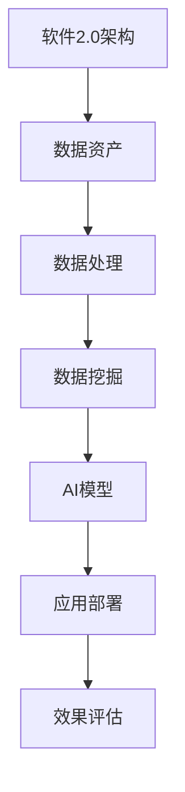
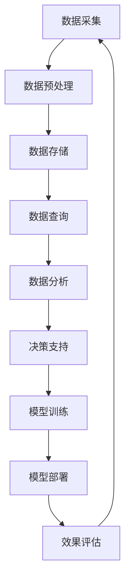

                 

# 软件2.0的时代：数据驱动一切

## 关键词

数据驱动，软件2.0，人工智能，数据资产，数据治理，数据隐私，数据挖掘，机器学习，大数据处理，企业级应用，数据安全，项目实战，未来趋势

## 摘要

本文旨在探讨软件2.0时代的数据驱动现象，详细分析数据在软件开发中的核心作用以及数据驱动与人工智能的紧密结合。文章首先介绍了软件2.0的基本概念和数据驱动的重要原则，然后深入探讨了数据资产管理的价值、数据驱动的软件架构以及数据治理和质量控制。接下来，文章重点介绍了主流的数据处理技术、实时数据处理技术以及数据挖掘与机器学习技术，展示了这些技术在数据驱动软件中的应用。此外，本文还探讨了数据驱动的企业战略规划、运营优化、创新以及数字化转型。随后，文章探讨了数据隐私与安全的重要性以及相关策略，并提供了数据驱动项目的规划和实施指南。最后，文章展望了数据驱动的未来趋势，包括物联网、区块链、云计算的结合，以及在金融、医疗健康、制造业等领域的应用，并对数据驱动对经济和社会的影响进行了分析。通过本文的深入探讨，读者可以全面了解数据驱动时代的核心概念、技术和实践方法，为未来在数据驱动领域的发展奠定基础。

### 《软件2.0的时代：数据驱动一切》目录大纲

#### 第一部分：数据驱动的软件2.0基础

##### 第1章：数据驱动的软件2.0概述

- **1.1 数据驱动的软件2.0时代的到来**
  - **1.1.1 从软件1.0到软件2.0的演进**
  - **1.1.2 数据在软件2.0中的核心地位**
  - **1.1.3 企业级应用开发的新范式**

- **1.2 数据驱动的软件2.0核心概念**

  **1.2.1 数据资产管理的概念与价值**

  **1.2.2 数据驱动的软件2.0架构**

  **1.2.3 数据治理与数据质量**

- **1.3 主流数据驱动技术简介**

  **1.3.1 数据仓库与大数据处理技术**

  **1.3.2 实时数据处理技术**

  **1.3.3 数据挖掘与机器学习技术**

- **1.4 数据驱动的软件2.0应用前景**

  **1.4.1 数据驱动的潜在应用领域**

  **1.4.2 企业采用数据驱动的优势**

  **1.4.3 数据驱动的挑战与机遇**

##### 第2章：数据驱动的AI基础

- **2.1 人工智能与数据驱动的联系**

  **2.1.1 人工智能的基本概念**

  **2.1.2 数据驱动与AI的结合点**

  **2.1.3 数据驱动AI的架构设计**

- **2.2 数据驱动的AI核心算法**

  **2.2.1 监督学习算法**

  **2.2.2 无监督学习算法**

  **2.2.3 强化学习算法**

- **2.3 数据驱动的AI模型构建**

  **2.3.1 模型训练与优化**

  **2.3.2 模型评估与调优**

  **2.3.3 模型部署与维护**

#### 第二部分：数据驱动的企业级应用

##### 第3章：数据驱动的企业战略规划

- **3.1 数据驱动在企业战略中的价值**

  **3.1.1 数据驱动的企业战略评估**

  **3.1.2 数据驱动的ROI分析方法**

  **3.1.3 数据驱动对企业业务流程的影响**

- **3.2 数据驱动的企业运营优化**

  **3.2.1 数据驱动下的供应链管理**

  **3.2.2 数据驱动下的客户关系管理**

  **3.2.3 数据驱动下的市场营销**

- **3.3 数据驱动的企业创新**

  **3.3.1 数据驱动的产品创新**

  **3.3.2 数据驱动的服务创新**

  **3.3.3 数据驱动的企业数字化转型**

##### 第4章：数据隐私与安全

- **4.1 数据隐私的重要性**

  **4.1.1 数据隐私的法律框架**

  **4.1.2 数据隐私保护技术**

  **4.1.3 数据隐私与数据驱动的权衡**

- **4.2 数据安全策略**

  **4.2.1 数据安全的挑战**

  **4.2.2 数据安全防护措施**

  **4.2.3 数据安全事故响应与恢复**

##### 第5章：数据驱动项目实战

- **5.1 数据驱动项目规划**

  **5.1.1 项目需求分析与定义**

  **5.1.2 项目资源规划**

  **5.1.3 项目风险管理与控制**

- **5.2 数据驱动项目实施**

  **5.2.1 数据采集与处理**

  **5.2.2 模型开发与训练**

  **5.2.3 模型评估与部署**

- **5.3 数据驱动项目评估与优化**

  **5.3.1 项目效果评估**

  **5.3.2 项目成本效益分析**

  **5.3.3 项目持续优化策略**

#### 第三部分：数据驱动的未来展望

##### 第6章：数据驱动的未来趋势

- **6.1 数据驱动的技术发展趋势**

  **6.1.1 数据驱动与物联网的结合**

  **6.1.2 数据驱动与区块链的结合**

  **6.1.3 数据驱动与云计算的结合**

- **6.2 数据驱动的行业变革**

  **6.2.1 数据驱动在金融行业的应用**

  **6.2.2 数据驱动在医疗健康领域的应用**

  **6.2.3 数据驱动在制造业的应用**

##### 第7章：数据驱动的社会影响

- **7.1 数据驱动对经济的影响**

  **7.1.1 数据驱动与企业竞争**

  **7.1.2 数据驱动对劳动力市场的影响**

  **7.1.3 数据驱动对国际贸易的影响**

- **7.2 数据驱动对社会的伦理影响**

  **7.2.1 数据隐私与社会信任**

  **7.2.2 数据驱动与数字鸿沟**

  **7.2.3 数据驱动与可持续发展**

#### 附录

##### 附录A：数据驱动工具与资源

- **A.1 数据驱动开发工具**

  **A.1.1 数据库管理工具**

  **A.1.2 数据分析工具**

  **A.1.3 机器学习框架**

- **A.2 数据驱动资源**

  **A.2.1 在线数据集**

  **A.2.2 数据科学社区与论坛**

  **A.2.3 数据驱动课程与教程**

#### Mermaid 流程图

- 数据驱动的软件2.0架构流程图



#### 伪代码

- 数据挖掘算法伪代码

```plaintext
function dataMining(dataSet):
    # 初始化模型
    model = initializeModel()

    # 数据预处理
    preprocessedData = preprocessData(dataSet)

    # 模型训练
    model = trainModel(model, preprocessedData)

    # 模型评估
    evaluation = evaluateModel(model, preprocessedData)

    # 模型优化
    optimizedModel = optimizeModel(model, evaluation)

    # 部署模型
    deployModel(optimizedModel)

    return optimizedModel
```

#### 数学模型

- 数据驱动中的线性回归模型

$$
Y = \beta_0 + \beta_1X + \epsilon
$$

- 详细讲解：

线性回归模型是最常见的数据分析工具，用于预测一个或多个自变量（$X$）与因变量（$Y$）之间的关系。模型中，$\beta_0$ 是截距，$\beta_1$ 是斜率，$\epsilon$ 是误差项。通过训练，可以计算出$\beta_0$ 和 $\beta_1$ 的值，从而预测$Y$。

#### 代码实战

- 数据集加载与处理代码示例

```python
import pandas as pd

# 加载数据集
dataSet = pd.read_csv('data.csv')

# 数据预处理
dataSet = dataSet[dataSet['feature1'].notnull()]
dataSet['target'] = dataSet['target'].map({'yes': 1, 'no': 0})

# 划分特征与标签
X = dataSet[['feature1', 'feature2']]
y = dataSet['target']
```

- 模型训练与预测代码示例

```python
from sklearn.linear_model import LinearRegression

# 初始化模型
model = LinearRegression()

# 训练模型
model.fit(X, y)

# 预测
predictions = model.predict(X)

# 评估模型
accuracy = (predictions == y).mean()
print(f"模型准确率：{accuracy:.2f}")
```

- 开发环境搭建指南

```shell
# 安装 Python 环境
python --version

# 安装必需的 Python 包
pip install pandas scikit-learn

# 设置 Python 工作环境
export PYTHONPATH=/path/to/your/working/directory
```

### 第一部分：数据驱动的软件2.0基础

#### 第1章：数据驱动的软件2.0概述

在数字化时代的浪潮下，软件产业正经历着前所未有的变革。从软件1.0时代到软件2.0时代，数据驱动已成为引领这一变革的核心力量。本章将介绍数据驱动的软件2.0概述，分析从软件1.0到软件2.0的演进过程，并探讨数据在软件2.0中的核心地位以及企业级应用开发的新范式。

##### 1.1 数据驱动的软件2.0时代的到来

1.1.1 从软件1.0到软件2.0的演进

软件1.0时代可以追溯到计算机诞生之初，这一阶段的软件主要侧重于执行预定义的任务，如办公自动化、数据处理和简单的计算。软件1.0的特点是功能明确、结构简单，用户界面相对单一，软件的开发和维护较为独立。

随着互联网的兴起和大数据时代的到来，软件1.0逐渐暴露出其局限性。首先，软件1.0时代的软件缺乏灵活性和适应性，难以应对不断变化的业务需求和用户需求。其次，软件1.0的数据处理能力有限，难以处理海量数据，也无法充分利用数据的价值。

软件2.0时代应运而生。软件2.0不仅具备软件1.0的基本功能，更强调了数据的中心地位，通过数据驱动实现软件的智能化和自主进化。软件2.0的核心是数据资产，通过数据采集、存储、处理和分析，实现数据的最大化利用。

1.1.2 数据在软件2.0中的核心地位

在软件2.0时代，数据被视为企业最宝贵的资产，贯穿于软件开发的各个环节。具体来说，数据在软件2.0中的核心地位体现在以下几个方面：

1. **业务驱动**：软件2.0以数据为驱动，通过对业务数据的深入挖掘和分析，帮助企业更好地理解市场和用户需求，优化业务流程，提升业务效率。

2. **个性化服务**：数据驱动的软件能够根据用户行为数据实现个性化服务，提供更加精准和定制化的产品或服务，提升用户体验。

3. **智能决策**：通过数据分析和机器学习算法，软件2.0能够实现智能决策，帮助企业在复杂的商业环境中快速作出正确的决策。

4. **持续优化**：软件2.0通过持续的数据采集和分析，实现自我优化和进化，不断提升软件的性能和用户体验。

1.1.3 企业级应用开发的新范式

在软件2.0时代，企业级应用开发也呈现出新的范式。以下是一些关键特点：

1. **微服务架构**：微服务架构使企业应用更加灵活、可扩展，能够快速响应业务变化。通过将大型应用拆分为多个小型服务，每个服务独立开发、部署和扩展，实现高效的开发和维护。

2. **云计算与容器化**：云计算和容器化技术为企业提供了弹性的计算资源和高效的管理方式。企业可以根据需求动态调整资源分配，降低成本，提高效率。

3. **数据驱动开发**：数据驱动开发（Data-Driven Development）强调数据的中心地位，通过数据反馈指导软件开发过程。数据驱动的开发方式使得软件能够更好地适应业务需求，实现持续优化。

4. **用户参与**：在软件2.0时代，用户不再是单纯的软件使用者，更是参与软件开发和创新的重要角色。通过用户反馈和参与，软件企业能够更好地理解用户需求，提供更加优质的产品和服务。

##### 1.2 数据驱动的软件2.0核心概念

1.2.1 数据资产管理的概念与价值

数据资产管理是指企业对数据进行采集、存储、处理、分析和应用的全过程管理。数据资产管理的核心目标是通过优化数据管理，最大化数据的价值。

在软件2.0时代，数据资产管理的价值主要体现在以下几个方面：

1. **提高数据质量**：数据资产管理确保数据的一致性、准确性和完整性，提高数据的质量，为后续的数据分析和应用提供可靠的数据基础。

2. **降低数据风险**：数据资产管理通过建立健全的数据安全与隐私保护机制，降低数据泄露、丢失或滥用的风险。

3. **提高数据利用率**：通过数据资产管理的优化，企业可以更好地利用已有的数据资源，提高数据的应用价值，促进业务增长。

4. **支持数据治理**：数据资产管理是数据治理的基础，通过数据资产管理，企业可以建立健全的数据治理体系，规范数据的使用和管理。

1.2.2 数据驱动的软件2.0架构

数据驱动的软件2.0架构是指基于数据资产管理的思想，构建以数据为中心的软件架构。数据驱动的软件2.0架构具有以下特点：

1. **数据流驱动**：数据驱动的软件架构以数据流为核心，通过数据采集、处理、存储和分析等环节，实现数据的闭环流动。

2. **模块化设计**：数据驱动的软件架构采用模块化设计，将系统拆分为多个模块，每个模块负责特定的数据操作和处理，提高系统的可扩展性和可维护性。

3. **智能化处理**：数据驱动的软件架构利用人工智能和机器学习技术，实现数据的自动处理和智能分析，提高数据处理效率和质量。

4. **灵活部署**：数据驱动的软件架构支持云计算和容器化技术，实现灵活的部署和扩展，降低企业IT基础设施的投入和维护成本。

1.2.3 数据治理与数据质量

数据治理是指企业对数据的管理、监控和控制的一系列活动和流程。数据治理的目标是确保数据的质量、安全性和合规性，为数据驱动决策提供保障。

数据质量是数据治理的核心关注点，包括数据的一致性、准确性、完整性、及时性和可靠性等方面。数据质量的提高需要通过以下措施实现：

1. **数据清洗**：通过数据清洗技术，去除数据中的错误、重复和缺失值，提高数据的一致性和准确性。

2. **数据标准化**：通过数据标准化，统一数据格式和命名规则，确保数据的可读性和可操作性。

3. **数据监控**：建立数据监控机制，实时跟踪数据的质量和变化，及时发现和纠正数据问题。

4. **数据质量管理**：建立数据质量管理团队，负责制定数据质量策略、监控数据质量、推动数据质量改进。

##### 1.3 主流数据驱动技术简介

1.3.1 数据仓库与大数据处理技术

数据仓库是数据驱动的核心基础设施，用于存储和管理企业海量数据。大数据处理技术则用于高效处理和分析海量数据，挖掘数据中的价值。

1. 数据仓库技术

数据仓库技术包括数据抽取、数据清洗、数据转换、数据加载等环节，主要实现以下功能：

- **数据抽取**：从各种数据源（如关系数据库、文件、应用系统等）抽取数据，并将其加载到数据仓库中。

- **数据清洗**：去除数据中的错误、重复和缺失值，提高数据质量。

- **数据转换**：将不同格式和结构的数据转换为统一的格式，便于数据存储和管理。

- **数据加载**：将清洗和转换后的数据加载到数据仓库中，进行存储和管理。

2. 大数据处理技术

大数据处理技术包括分布式存储、分布式计算、实时处理等技术，主要实现以下功能：

- **分布式存储**：通过分布式存储技术，实现海量数据的存储和管理，提高数据存储的可靠性和扩展性。

- **分布式计算**：通过分布式计算技术，实现海量数据的并行处理，提高数据处理效率。

- **实时处理**：通过实时处理技术，实现实时数据采集、处理和分析，满足实时业务需求。

1.3.2 实时数据处理技术

实时数据处理技术是指对实时流数据进行快速采集、处理和分析的技术，适用于需要实时响应的场景。实时数据处理技术包括以下关键组成部分：

1. **实时数据采集**：通过日志收集、消息队列、物联网传感器等技术，实现实时数据的快速采集。

2. **实时数据处理**：通过分布式计算框架（如Apache Flink、Apache Kafka等），实现实时数据的分布式处理，支持实时查询、实时分析和实时计算等功能。

3. **实时数据存储**：通过分布式存储系统（如Hadoop、Apache HBase等），实现实时数据的高效存储和管理。

1.3.3 数据挖掘与机器学习技术

数据挖掘是指从海量数据中发现隐藏的模式和知识的过程，适用于预测分析、关联规则挖掘、分类分析等。机器学习则是实现数据挖掘的核心技术，通过算法模型从数据中自动学习并提取知识。

1. 数据挖掘技术

数据挖掘技术包括以下主要步骤：

- **数据准备**：包括数据清洗、数据转换、数据预处理等，为数据挖掘奠定基础。

- **数据探索**：通过可视化分析、统计方法等手段，发现数据中的潜在模式和关系。

- **特征工程**：通过特征选择和特征构造，提高数据挖掘模型的性能。

- **模型训练**：通过机器学习算法，训练数据挖掘模型，进行模式识别和预测分析。

- **模型评估**：通过交叉验证、性能指标等手段，评估数据挖掘模型的性能。

2. 机器学习技术

机器学习技术主要包括以下几种类型：

- **监督学习**：通过已标记的训练数据，训练模型进行预测分析。

- **无监督学习**：通过未标记的数据，发现数据中的分布和模式。

- **强化学习**：通过与环境交互，学习最优决策策略。

##### 1.4 数据驱动的软件2.0应用前景

1.4.1 数据驱动的潜在应用领域

数据驱动的软件2.0在多个领域具有广泛的应用前景，以下是一些典型的应用领域：

1. **金融行业**：数据驱动的金融应用包括风险评估、信用评分、投资策略优化等。通过数据挖掘和机器学习技术，金融机构可以更准确地预测市场趋势，提高业务效率和风险控制能力。

2. **医疗健康领域**：数据驱动的医疗健康应用包括疾病预测、个性化治疗、健康监测等。通过海量医疗数据分析和机器学习算法，医疗行业可以提供更精准的医疗服务，提高医疗质量和患者满意度。

3. **制造业**：数据驱动的制造业应用包括生产优化、设备维护、供应链管理等。通过实时数据处理和预测分析，制造企业可以实现生产线的智能化管理，降低成本，提高生产效率。

4. **零售行业**：数据驱动的零售应用包括需求预测、库存管理、个性化推荐等。通过分析消费者行为数据和交易数据，零售企业可以更精准地预测市场需求，优化库存和供应链，提高销售额。

1.4.2 企业采用数据驱动的优势

企业采用数据驱动的优势主要体现在以下几个方面：

1. **提高业务效率**：通过数据分析和自动化处理，企业可以更快速地响应市场需求，优化业务流程，提高工作效率。

2. **降低运营成本**：数据驱动的自动化和智能化管理可以降低人力成本，减少重复劳动，提高资源利用率。

3. **提升决策质量**：通过数据驱动的分析工具，企业可以基于数据做出更加精准和客观的决策，降低决策风险。

4. **增强竞争力**：数据驱动的企业可以更快速地适应市场变化，提供更优质的产品和服务，增强市场竞争力。

1.4.3 数据驱动的挑战与机遇

尽管数据驱动为企业带来了诸多机遇，但也面临着一系列挑战：

1. **数据质量和安全**：数据质量和数据安全是数据驱动的核心问题。企业需要建立完善的数据治理机制，确保数据的准确性和安全性。

2. **技术技能短缺**：数据驱动的实施需要专业人才的支持。企业需要培养和引进具备数据分析和机器学习技能的人才。

3. **数据隐私和法律合规**：随着数据隐私保护法律的不断完善，企业需要确保数据隐私保护，遵守相关法律法规。

4. **技术选型和整合**：在数据驱动的实施过程中，企业需要选择合适的技术方案，并进行有效的技术整合，确保系统的稳定性和扩展性。

尽管如此，数据驱动的挑战并不意味着无法克服。通过科学的规划、有效的实施和持续的创新，企业可以在数据驱动的道路上取得成功，实现业务和技术的双轮驱动。

### 第一部分：数据驱动的软件2.0基础

#### 第2章：数据驱动的AI基础

随着数据驱动软件的发展，人工智能（AI）逐渐成为数据驱动的核心驱动力。AI技术通过处理和分析大量数据，能够实现自动化决策、优化流程和提高效率。本章将探讨人工智能与数据驱动的联系，介绍数据驱动的AI核心算法，并详细讲解数据驱动的AI模型构建。

##### 2.1 人工智能与数据驱动的联系

2.1.1 人工智能的基本概念

人工智能（Artificial Intelligence，简称AI）是指使计算机模拟人类智能行为的技术和科学。AI的主要目标是让计算机具备学习、推理、感知和自适应能力，从而实现自动化和智能化。人工智能包括多个子领域，如机器学习、深度学习、自然语言处理和计算机视觉等。

2.1.2 数据驱动与AI的结合点

数据驱动（Data-Driven）是指通过数据分析和挖掘来驱动决策和业务流程。数据驱动与人工智能的结合点主要体现在以下几个方面：

1. **数据源**：AI的算法和模型需要大量高质量的数据作为训练和验证的基础。数据驱动提供了丰富的数据来源，包括结构化数据、半结构化数据和非结构化数据。

2. **训练过程**：AI算法的训练过程依赖于大量的数据。数据驱动通过不断采集和更新数据，为AI算法提供持续的训练素材，使模型不断优化和进化。

3. **预测和决策**：数据驱动的AI模型通过分析历史数据和实时数据，实现预测和决策。数据驱动的决策过程是基于数据的洞察和算法的智能分析，能够提高决策的准确性和效率。

4. **模型部署**：AI模型在开发完成后，需要部署到实际业务场景中。数据驱动提供了高效的部署和管理方案，使AI模型能够快速上线并产生实际价值。

2.1.3 数据驱动AI的架构设计

数据驱动AI的架构设计需要综合考虑数据采集、处理、存储、分析和应用等多个环节。以下是数据驱动AI架构的基本组成部分：

1. **数据采集**：通过数据采集模块，从各种数据源（如数据库、日志文件、传感器等）采集数据。

2. **数据预处理**：对采集到的数据进行清洗、转换和归一化等预处理操作，确保数据的质量和一致性。

3. **数据存储**：将预处理后的数据存储到数据仓库或分布式存储系统中，以便后续的数据处理和分析。

4. **数据处理**：利用ETL（提取、转换、加载）工具，将数据从原始格式转换为适合分析和挖掘的格式，并进行数据聚合、过滤和统计分析等处理。

5. **模型训练**：通过机器学习和深度学习算法，对处理后的数据进行分析和训练，构建预测和分类模型。

6. **模型评估**：对训练好的模型进行评估，包括准确率、召回率、F1分数等指标，确保模型的性能和可靠性。

7. **模型部署**：将经过评估的模型部署到生产环境中，通过API接口或其他方式提供服务。

8. **应用监控**：对部署后的模型进行实时监控，包括性能监控、错误日志和异常检测等，确保模型稳定运行并持续优化。

##### 2.2 数据驱动的AI核心算法

数据驱动的AI核心算法包括监督学习、无监督学习和强化学习等。这些算法在不同的应用场景中发挥着重要作用。

2.2.1 监督学习算法

监督学习算法是一种基于已有数据集进行训练，并通过训练结果预测新数据的算法。监督学习算法的核心是构建一个标记好的训练数据集，通过学习输入特征和输出标签之间的关系，实现对未知数据的预测。

常见的监督学习算法包括：

1. **线性回归**：通过建立线性模型，预测连续的输出值。线性回归是最简单的监督学习算法，适用于关系相对简单的数据集。

2. **逻辑回归**：通过建立逻辑回归模型，预测二分类问题。逻辑回归适用于分类问题，能够计算出每个样本属于不同类别的概率。

3. **决策树**：通过构建决策树模型，对样本进行分类或回归。决策树模型结构简单，易于理解和解释，但易受噪声数据影响。

4. **支持向量机（SVM）**：通过找到一个最佳的超平面，将不同类别的样本分隔开。SVM适用于高维空间，具有很好的泛化能力。

5. **神经网络**：通过构建多层神经网络，对样本进行复杂的非线性变换。神经网络具有强大的建模能力，适用于各种复杂的应用场景。

2.2.2 无监督学习算法

无监督学习算法是一种不依赖标记数据集进行训练的算法，主要通过发现数据中的结构和模式来实现数据的聚类和降维。无监督学习算法在探索性数据分析中具有广泛的应用。

常见的无监督学习算法包括：

1. **聚类算法**：通过将相似的数据点归为一类，实现对数据的聚类。常见的聚类算法有K均值聚类、层次聚类和DBSCAN等。

2. **降维算法**：通过减少数据维度，保留主要特征，实现对高维数据的降维。常见的降维算法有主成分分析（PCA）、线性判别分析（LDA）和自编码器等。

3. **关联规则学习**：通过发现数据中的关联关系，实现对数据的挖掘。常见的关联规则学习算法有Apriori算法和FP-growth算法等。

2.2.3 强化学习算法

强化学习算法是一种通过与环境交互，学习最优策略的算法。强化学习算法的核心是奖励机制，通过不断调整策略，使模型能够在环境中获得最大化的奖励。

常见的强化学习算法包括：

1. **Q-learning**：通过学习值函数，实现状态-动作价值函数的估计。Q-learning算法适用于小规模问题，能够快速收敛。

2. **Deep Q-Network（DQN）**：通过深度神经网络实现Q-learning算法，适用于大规模问题。DQN算法通过经验回放和目标网络等技术，提高了算法的稳定性和收敛速度。

3. **Policy Gradient**：通过优化策略函数，实现最优策略的估计。Policy Gradient算法能够直接优化策略函数，避免了值函数的估计，但存在训练不稳定和方差大的问题。

4. **Actor-Critic**：通过同时优化演员模型和评论家模型，实现策略的优化。Actor-Critic算法结合了Policy Gradient和Q-learning的优点，能够实现稳定和高效的策略优化。

##### 2.3 数据驱动的AI模型构建

数据驱动的AI模型构建是一个涉及多个环节的过程，包括数据准备、模型训练、模型评估和模型部署等。

2.3.1 模型训练与优化

模型训练是指通过已有数据集对AI模型进行训练，使其能够学习到数据中的特征和规律。模型优化是指在训练过程中，通过调整模型参数和超参数，提高模型的性能。

模型训练与优化主要包括以下步骤：

1. **数据准备**：选择适合的数据集，对数据进行清洗、预处理和归一化等操作，确保数据的质量和一致性。

2. **模型选择**：根据问题的性质和数据特点，选择合适的模型算法。常见的模型算法包括线性回归、决策树、神经网络和深度学习等。

3. **参数设置**：设置模型的超参数，如学习率、迭代次数、正则化参数等。通过交叉验证和网格搜索等方法，选择最优的超参数组合。

4. **模型训练**：使用训练数据集对模型进行训练，通过优化算法（如梯度下降、随机梯度下降等）更新模型参数。

5. **模型评估**：使用验证数据集对模型进行评估，计算模型的性能指标（如准确率、召回率、F1分数等）。通过调整模型参数和超参数，优化模型性能。

6. **模型优化**：根据模型评估结果，对模型进行优化，包括调整模型结构、增加训练数据、改进训练算法等。

2.3.2 模型评估与调优

模型评估是指对训练好的模型进行性能评估，确保模型在实际应用中能够达到预期的效果。模型调优是指在评估过程中，通过调整模型参数和超参数，进一步提高模型性能。

模型评估与调优主要包括以下步骤：

1. **评估指标**：选择合适的评估指标，如准确率、召回率、F1分数、AUC等。不同的评估指标适用于不同的应用场景，需要根据具体需求选择。

2. **交叉验证**：使用交叉验证方法，对模型进行多组数据的训练和评估，提高评估结果的稳定性和可靠性。

3. **性能调优**：根据评估结果，对模型进行性能调优，包括调整模型参数、增加训练数据、改进训练算法等。

4. **超参数调优**：通过网格搜索、贝叶斯优化等方法，选择最优的超参数组合，提高模型性能。

5. **模型集成**：通过模型集成方法，如随机森林、梯度提升树等，将多个模型集成为一个更强的模型，提高模型的性能和稳定性。

2.3.3 模型部署与维护

模型部署是指将训练好的模型部署到实际业务场景中，通过API接口或其他方式提供服务。模型维护是指对部署后的模型进行监控和管理，确保模型稳定运行和持续优化。

模型部署与维护主要包括以下步骤：

1. **模型打包**：将训练好的模型打包成可执行文件或库，便于部署和集成。

2. **模型部署**：将模型部署到服务器或云计算平台，通过API接口或其他方式提供服务。

3. **性能监控**：对部署后的模型进行性能监控，包括响应时间、准确率、召回率等指标。

4. **错误日志**：记录模型的错误日志，分析模型运行中的异常和错误。

5. **模型更新**：根据业务需求和数据变化，定期更新模型，提高模型的性能和适应性。

6. **模型优化**：根据性能监控和用户反馈，对模型进行持续优化，提高模型的效果和用户体验。

通过数据驱动的AI模型构建，企业可以实现对数据的高效利用，提高业务效率和决策质量。数据驱动的AI不仅能够帮助企业应对复杂的商业环境，还能够推动企业的创新和发展。

### 第二部分：数据驱动的企业级应用

#### 第3章：数据驱动的企业战略规划

在数据驱动的软件2.0时代，企业战略规划必须紧密围绕数据的采集、处理和分析进行，以确保企业能够充分利用数据的价值，实现业务目标。本章将详细探讨数据驱动在企业战略中的价值，数据驱动的ROI分析方法，以及数据驱动对企业业务流程的影响。

##### 3.1 数据驱动在企业战略中的价值

3.1.1 数据驱动的企业战略评估

数据驱动的企业战略评估是通过数据分析技术，对企业的各项战略决策进行评估和优化。这种评估方法具有以下几个方面的价值：

1. **市场洞察**：通过数据分析，企业可以深入了解市场趋势、客户需求和竞争对手的行为，从而制定更符合市场需求的战略。

2. **资源优化**：数据驱动的战略评估可以帮助企业识别资源分配中的不合理之处，优化资源配置，提高资源利用效率。

3. **风险控制**：通过数据分析，企业可以预测潜在的风险，制定相应的风险控制措施，降低业务风险。

4. **决策支持**：数据驱动的战略评估提供客观、准确的数据支持，帮助企业高层管理者做出更加明智的决策。

5. **持续改进**：数据驱动的战略评估是一个持续的过程，通过定期评估和反馈，企业可以不断调整和优化战略，实现持续改进。

3.1.2 数据驱动的ROI分析方法

ROI（Return on Investment，投资回报率）分析是评估数据驱动项目投资效益的重要工具。数据驱动的ROI分析方法主要包括以下几个方面：

1. **投资成本**：包括数据采集、存储、处理、分析等各个环节的成本，以及人力资源、设备、技术投入等。

2. **收益分析**：通过数据分析和预测，估算数据驱动项目带来的直接和间接收益，如销售额增长、成本节约、效率提升等。

3. **效益衡量**：将投资成本与收益进行对比，计算ROI指标。ROI = （收益 - 成本）/ 成本。通过ROI指标，可以评估数据驱动项目的经济效益。

4. **风险评估**：对数据驱动项目可能面临的风险进行评估，包括数据质量风险、技术风险、市场风险等，并制定相应的风险应对策略。

5. **持续监控**：在项目实施过程中，通过数据分析和监控，实时评估项目的ROI，确保项目按预期进行，并及时调整策略。

3.1.3 数据驱动对企业业务流程的影响

数据驱动不仅改变了企业的战略规划和决策方式，还对企业的业务流程产生了深远的影响。以下是数据驱动对企业业务流程的几个关键影响：

1. **流程优化**：通过数据分析，企业可以识别业务流程中的瓶颈和低效环节，进行流程优化，提高业务流程的效率和效果。

2. **自动化**：数据驱动使得业务流程自动化成为可能。通过自动化工具和算法，企业可以实现业务流程的自动化执行，减少人工干预，提高工作效率。

3. **实时响应**：数据驱动的业务流程能够实时采集和处理业务数据，使企业能够迅速响应市场变化和客户需求，提升业务敏捷性。

4. **个性化服务**：通过数据分析和个性化推荐算法，企业可以提供更加个性化的产品和服务，提高客户满意度和忠诚度。

5. **预测分析**：数据驱动使得企业能够进行预测分析，提前预测业务趋势和需求变化，制定相应的应对策略，降低业务风险。

##### 3.2 数据驱动的企业运营优化

3.2.1 数据驱动下的供应链管理

供应链管理是企业发展的重要环节，数据驱动下的供应链管理通过数据分析和优化，实现了供应链管理的智能化和精细化。以下是数据驱动下的供应链管理的一些关键措施：

1. **需求预测**：通过数据分析，预测市场需求变化，优化库存管理，减少库存成本，提高供应链的响应速度。

2. **采购优化**：通过数据分析和采购策略优化，实现采购成本的最小化和采购效率的最大化。

3. **物流优化**：通过数据分析和物流优化算法，优化物流路径和时间安排，提高物流效率和降低物流成本。

4. **风险控制**：通过数据分析，识别供应链中的潜在风险，制定相应的风险控制措施，降低供应链风险。

5. **供应链可视化**：通过数据可视化工具，实时监控供应链状态，提高供应链管理的透明度和可操作性。

3.2.2 数据驱动下的客户关系管理

客户关系管理（CRM）是企业发展的重要支撑，数据驱动下的客户关系管理通过数据分析和优化，实现了客户服务的个性化、精细化和智能化。以下是数据驱动下的客户关系管理的一些关键措施：

1. **客户细分**：通过数据分析，对客户进行细分，针对不同类型的客户制定个性化的营销策略。

2. **需求预测**：通过数据分析，预测客户的需求和偏好，提供更加精准的个性化推荐和服务。

3. **客户反馈**：通过数据分析，收集和分析客户反馈，及时识别客户需求和问题，提供及时有效的客户服务。

4. **客户忠诚度管理**：通过数据分析，识别高价值客户和潜在客户，制定针对性的客户忠诚度管理策略。

5. **营销自动化**：通过数据分析和自动化工具，实现营销活动的自动化执行，提高营销效果和客户响应速度。

3.2.3 数据驱动下的市场营销

数据驱动下的市场营销通过数据分析和优化，实现了营销策略的精准化、高效化和智能化。以下是数据驱动下的市场营销的一些关键措施：

1. **市场细分**：通过数据分析，对市场进行细分，针对不同细分市场制定个性化的营销策略。

2. **需求预测**：通过数据分析，预测市场需求变化，制定相应的营销策略，提高市场占有率和销售业绩。

3. **客户行为分析**：通过数据分析，分析客户的行为特征和偏好，制定精准的营销策略。

4. **效果监控**：通过数据分析，实时监控营销活动的效果，及时调整营销策略，提高营销效果。

5. **营销自动化**：通过数据分析和自动化工具，实现营销活动的自动化执行，提高营销效率和效果。

##### 3.3 数据驱动的企业创新

3.3.1 数据驱动的产品创新

数据驱动的产品创新通过数据分析和挖掘，实现了产品开发的智能化和个性化。以下是数据驱动的产品创新的一些关键措施：

1. **需求分析**：通过数据分析，挖掘用户需求和痛点，为产品创新提供方向。

2. **市场调研**：通过数据分析，分析市场趋势和竞争态势，为产品创新提供市场依据。

3. **产品设计**：通过数据分析，优化产品设计，提高产品的用户体验和市场竞争力。

4. **迭代开发**：通过数据分析和用户反馈，实现产品的快速迭代和优化，提高产品满意度和市场接受度。

5. **定制化服务**：通过数据分析，提供定制化的产品和服务，满足不同客户的需求，提高客户满意度和忠诚度。

3.3.2 数据驱动的服务创新

数据驱动的服务创新通过数据分析和优化，实现了服务方式的智能化和个性化。以下是数据驱动的服务创新的一些关键措施：

1. **服务设计**：通过数据分析，优化服务流程和设计，提高服务的效率和满意度。

2. **用户行为分析**：通过数据分析，分析用户行为和需求，提供个性化的服务体验。

3. **服务自动化**：通过数据分析和自动化工具，实现服务的自动化执行，提高服务效率和用户体验。

4. **服务反馈**：通过数据分析，收集用户反馈和服务评价，及时调整和优化服务。

5. **服务创新**：通过数据分析和市场调研，探索新的服务模式和业务机会，推动服务创新和业务增长。

3.3.3 数据驱动的企业数字化转型

数字化转型是企业在数字化时代实现持续发展的关键途径，数据驱动是数字化转型的核心动力。以下是数据驱动的企业数字化转型的一些关键措施：

1. **数据治理**：建立完善的数据治理体系，确保数据的准确性、一致性和安全性。

2. **数据分析平台**：构建强大的数据分析平台，支持数据采集、存储、处理和分析，为数字化转型提供数据支持。

3. **业务流程优化**：通过数据分析，优化业务流程和业务模式，提高业务效率和效果。

4. **数据驱动决策**：通过数据分析和预测，支持企业决策，提高决策的准确性和效率。

5. **生态系统建设**：构建数据驱动的企业生态系统，与合作伙伴和客户共同创新和成长，实现数字化转型和业务增长。

通过数据驱动的企业战略规划，企业可以更好地把握市场趋势和客户需求，实现业务流程的优化和数字化转型，提高竞争力和市场占有率。

### 第二部分：数据驱动的企业级应用

#### 第4章：数据隐私与安全

在数据驱动的企业级应用中，数据隐私与安全是至关重要的议题。数据隐私保护不仅关乎企业的声誉和客户信任，也涉及法律法规的遵守。本章将探讨数据隐私的重要性，介绍数据隐私保护的法律框架、技术措施，以及数据隐私与数据驱动的权衡。

##### 4.1 数据隐私的重要性

4.1.1 数据隐私的法律框架

数据隐私的法律框架为数据保护提供了法律依据和规范。在全球范围内，不同国家和地区都有相应的数据隐私保护法律和政策。以下是一些主要的法律框架：

1. **欧盟通用数据保护条例（GDPR）**：GDPR是欧盟制定的一项全面的数据隐私保护法律，对个人数据的收集、处理、存储和传输做出了详细规定。GDPR要求企业在处理个人数据时必须获得用户的明确同意，并采取严格的数据保护措施。

2. **加州消费者隐私法（CCPA）**：CCPA是美国加州的一项数据隐私保护法律，旨在保护加州居民的隐私权。CCPA规定了企业收集、使用和共享消费者数据的要求，并对违反规定的公司实施了严厉的罚款。

3. **中国个人信息保护法（PIPL）**：PIPL是中国制定的一项全面的数据隐私保护法律，对个人信息的安全保护、数据主体的权利、数据处理者的义务等方面进行了详细规定。

4.1.2 数据隐私保护技术

为了确保数据隐私，企业需要采用一系列技术措施来保护数据。以下是一些常用的数据隐私保护技术：

1. **数据加密**：数据加密是保护数据隐私的有效手段。通过对数据进行加密，确保只有授权用户才能解密和访问数据。

2. **访问控制**：访问控制通过限制对数据的访问权限，确保只有授权用户能够访问特定的数据。

3. **数据脱敏**：数据脱敏是一种将敏感数据转换为不可识别形式的技术，以保护个人隐私。常见的脱敏技术包括数据掩码、数据混淆和数据替换等。

4. **数据匿名化**：数据匿名化是一种通过删除或更改数据中的可识别信息，使数据无法直接关联到特定个人的技术。

4.1.3 数据隐私与数据驱动的权衡

在数据驱动的企业级应用中，数据隐私与数据驱动之间存在一定的权衡。以下是一些关键点：

1. **数据质量与隐私**：在数据驱动应用中，高质量的数据至关重要。然而，为了保护隐私，有时需要去除或屏蔽某些敏感信息，这可能会影响数据质量。

2. **数据使用与隐私**：数据驱动应用需要大量数据来训练模型和进行预测。但在使用数据时，需要遵守隐私保护法规，确保不侵犯个人隐私。

3. **隐私保护与业务价值**：在确保数据隐私的同时，企业还需要考虑数据驱动的业务价值。合理的隐私保护措施应该在不影响业务价值的前提下进行。

##### 4.2 数据安全策略

4.2.1 数据安全的挑战

数据安全面临诸多挑战，包括以下方面：

1. **数据泄露**：数据泄露是数据安全的主要威胁之一。黑客攻击、恶意软件和内部人员滥用都可能导致数据泄露。

2. **数据篡改**：数据篡改是指未经授权的修改数据内容，这可能导致数据的真实性和完整性受到威胁。

3. **数据丢失**：数据丢失可能是由于硬件故障、自然灾难或人为失误等原因导致的，对企业运营和业务连续性造成严重影响。

4. **隐私侵犯**：隐私侵犯是指未经授权的个人数据收集、使用或共享，这可能导致个人隐私受到侵犯。

4.2.2 数据安全防护措施

为了应对数据安全的挑战，企业需要采取一系列防护措施：

1. **数据加密**：采用加密技术保护敏感数据，确保数据在传输和存储过程中的安全性。

2. **身份验证**：实施严格的身份验证机制，确保只有授权用户才能访问敏感数据。

3. **访问控制**：通过访问控制策略，限制对数据的访问权限，确保数据安全。

4. **数据备份**：定期备份数据，以防止数据丢失或损坏。备份数据应存储在安全的地方，并确保其可恢复性。

5. **网络安全**：加强网络安全措施，包括防火墙、入侵检测系统、防病毒软件等，防止黑客攻击和恶意软件入侵。

6. **员工培训**：对员工进行数据安全培训，提高员工的安全意识，防止内部人员滥用数据。

4.2.3 数据安全事故响应与恢复

数据安全事故的发生不可避免，但企业可以采取一系列措施来降低事故的影响，并迅速恢复业务的正常运行。以下是一些关键步骤：

1. **事故检测与报告**：建立事故检测系统，及时检测和报告数据安全事故。一旦发生事故，应立即启动应急预案。

2. **应急响应**：根据应急预案，迅速采取措施控制事故的扩散，防止进一步的数据泄露或损坏。

3. **事故调查**：对事故进行调查，找出事故原因，并采取相应的纠正措施，防止类似事故再次发生。

4. **数据恢复**：在确保数据安全的前提下，尽快恢复数据，以保障业务的正常运行。

5. **事故总结与改进**：对事故进行总结，分析事故原因和影响，制定改进措施，提高数据安全防护能力。

通过数据隐私与安全策略的实施，企业可以确保数据的安全和隐私，提高客户信任，为数据驱动的企业级应用提供坚实的基础。

### 第二部分：数据驱动的企业级应用

#### 第5章：数据驱动项目实战

数据驱动的项目实战是企业在实际业务中应用数据驱动理念的实践过程。本章将详细探讨数据驱动项目的规划和实施，以及项目评估与优化。通过具体的案例，我们将展示如何实施一个数据驱动项目，并提供实施过程中的关键步骤和注意事项。

##### 5.1 数据驱动项目规划

5.1.1 项目需求分析与定义

项目需求分析是数据驱动项目成功的关键第一步。在这一步中，我们需要明确项目的目标、需求和预期成果。

1. **明确项目目标**：项目目标应具体、可衡量、可实现、相关性强、时限性。例如，提高客户满意度、降低运营成本、优化供应链管理等。

2. **分析业务需求**：与业务部门合作，深入分析业务需求和痛点，确定数据驱动的解决方案。

3. **确定项目范围**：明确项目的范围，包括项目的具体任务、交付物和涉及的人员。

4. **需求文档**：编写详细的需求文档，包括项目目标、业务需求、数据需求、系统需求等。

5.1.2 项目资源规划

在项目资源规划阶段，我们需要确保项目所需的资源得到合理配置。

1. **人力资源**：确定项目团队的人员构成，包括数据科学家、开发人员、业务分析师等。

2. **技术资源**：选择合适的技术栈，包括编程语言、工具、库和框架等。

3. **硬件资源**：根据项目需求，配置必要的计算资源和存储资源，如服务器、数据库、云计算资源等。

4. **预算**：制定项目的预算计划，包括人员成本、设备成本、外包成本等。

5.1.3 项目风险管理与控制

在项目实施过程中，风险是不可避免的。有效的风险管理可以帮助我们识别、评估和控制风险。

1. **风险识别**：通过访谈、研讨会等方式，识别项目可能面临的风险。

2. **风险评估**：对识别出的风险进行评估，确定其可能的影响和发生的概率。

3. **风险应对策略**：针对不同风险，制定相应的应对策略，如规避、转移、减轻、接受等。

4. **风险监控**：建立风险监控机制，定期评估风险的变化，及时调整风险应对策略。

##### 5.2 数据驱动项目实施

5.2.1 数据采集与处理

数据采集与处理是数据驱动项目的核心环节。以下是数据采集与处理的关键步骤：

1. **数据收集**：从各种数据源（如数据库、日志文件、传感器、外部数据提供商等）收集数据。

2. **数据清洗**：清洗数据中的错误、重复和缺失值，提高数据质量。

3. **数据转换**：将不同格式和结构的数据转换为统一的格式，便于数据存储和管理。

4. **数据存储**：将处理后的数据存储到数据仓库或分布式存储系统中，以便后续的数据处理和分析。

5.2.2 模型开发与训练

在模型开发与训练阶段，我们需要构建并训练模型，使其能够对数据进行有效的分析和预测。

1. **模型选择**：根据项目需求和数据特点，选择合适的机器学习模型。

2. **特征工程**：通过特征选择和特征构造，提高模型的性能。

3. **模型训练**：使用训练数据集对模型进行训练，调整模型参数，优化模型性能。

4. **模型评估**：使用验证数据集对模型进行评估，计算模型的性能指标，如准确率、召回率、F1分数等。

5.2.3 模型评估与部署

模型评估与部署是确保模型性能和业务价值的关键步骤。

1. **模型评估**：在真实业务环境中对模型进行评估，确保模型的性能满足业务需求。

2. **模型部署**：将经过评估的模型部署到生产环境中，通过API接口或其他方式提供服务。

3. **监控与维护**：对部署后的模型进行实时监控，确保模型稳定运行。根据业务需求的变化，定期更新和优化模型。

##### 5.3 数据驱动项目评估与优化

5.3.1 项目效果评估

项目效果评估是评估项目成功与否的重要步骤。以下是项目效果评估的关键指标：

1. **业务指标**：根据项目目标，评估项目的业务效果，如销售额、客户满意度、运营成本等。

2. **数据指标**：评估数据驱动的效果，如模型准确率、召回率、F1分数等。

3. **用户体验**：评估用户对数据驱动产品的体验，如用户满意度、用户留存率等。

5.3.2 项目成本效益分析

项目成本效益分析是评估项目投资回报率的重要步骤。以下是项目成本效益分析的关键指标：

1. **投资成本**：包括人力资源、设备、技术投入等。

2. **运营成本**：包括维护、运营、升级等成本。

3. **收益**：包括直接收益（如销售额增长）和间接收益（如效率提升、客户满意度提高等）。

5.3.3 项目持续优化策略

项目持续优化是确保项目长期成功的关键。以下是项目持续优化的一些策略：

1. **定期评估**：定期评估项目的效果和成本效益，及时发现和解决问题。

2. **用户反馈**：收集用户反馈，了解用户需求和使用体验，持续优化产品和服务。

3. **技术升级**：随着技术的不断发展，定期更新和优化模型和系统，提高项目性能。

4. **流程改进**：根据业务需求的变化，持续优化业务流程和项目管理流程。

通过数据驱动项目实战，企业可以充分利用数据的价值，实现业务目标和持续创新。有效的项目规划和实施，以及持续的项目评估和优化，是确保项目成功的关键。

### 第三部分：数据驱动的未来展望

#### 第6章：数据驱动的未来趋势

随着数据驱动技术的不断演进，未来的数据驱动领域将呈现出一系列令人兴奋的趋势。这些趋势不仅将推动技术发展，还将深刻影响各行各业。本章将探讨数据驱动与物联网、区块链、云计算的结合，以及在金融、医疗健康、制造业等领域的应用。

##### 6.1 数据驱动的技术发展趋势

6.1.1 数据驱动与物联网的结合

物联网（IoT）通过将物理世界与数字世界连接起来，产生了大量的数据。数据驱动与物联网的结合，使得数据处理和分析变得更加重要。

1. **边缘计算**：边缘计算是指在数据生成的边缘设备上实时处理数据，减少数据传输和延迟。边缘计算与数据驱动相结合，可以实现对实时数据的快速分析和响应，提高系统的智能化水平。

2. **设备预测维护**：通过物联网设备和数据驱动技术，可以实现设备的实时监控和预测维护。预测维护可以提前发现设备故障，降低设备停机时间，提高设备利用率。

3. **智能城市**：数据驱动与物联网的结合，使得智能城市建设成为可能。智能城市通过实时数据分析和预测，可以实现交通管理、能源管理、公共安全等方面的优化。

6.1.2 数据驱动与区块链的结合

区块链技术以其去中心化、不可篡改和透明性等特性，为数据驱动提供了新的解决方案。

1. **数据隐私保护**：区块链技术可以保护数据隐私，确保数据的不可篡改性和安全性。数据驱动与区块链的结合，可以构建更加安全的数据共享和交易平台。

2. **智能合约**：智能合约是区块链上的自动化合同。数据驱动与智能合约的结合，可以实现基于数据的自动执行和交易，提高业务效率和透明度。

3. **供应链管理**：数据驱动与区块链的结合，可以实现对供应链的全程监控和追溯，提高供应链的透明度和效率。

6.1.3 数据驱动与云计算的结合

云计算为数据驱动提供了强大的计算和存储能力，使得数据处理和分析变得更加高效和灵活。

1. **大数据分析**：云计算提供了丰富的数据存储和处理资源，使得大规模数据分析变得更加容易。数据驱动与云计算的结合，可以实现对海量数据的快速分析和洞察。

2. **弹性扩展**：云计算的弹性扩展能力，使得数据驱动应用可以根据需求动态调整计算和存储资源，提高系统的可扩展性和可靠性。

3. **混合云架构**：混合云架构将公有云和私有云结合起来，可以充分利用两者的优势。数据驱动与混合云的结合，可以构建更加灵活和高效的数据驱动架构。

##### 6.2 数据驱动的行业变革

6.2.1 数据驱动在金融行业的应用

金融行业是数据驱动的典型应用领域之一。数据驱动在金融行业的应用，不仅提高了业务效率，还创新了金融服务模式。

1. **风险评估**：通过数据分析和机器学习，金融机构可以更准确地评估风险，制定更科学的投资策略。

2. **反欺诈**：数据驱动技术可以帮助金融机构实时监测交易行为，及时发现和防范欺诈行为，提高交易安全性。

3. **个性化金融产品**：通过数据分析，金融机构可以了解客户需求，提供个性化的金融产品和服务，提高客户满意度和忠诚度。

4. **智能投顾**：智能投顾利用数据驱动技术，为投资者提供个性化的投资建议，提高投资收益。

6.2.2 数据驱动在医疗健康领域的应用

数据驱动在医疗健康领域的应用，有助于提高医疗质量和患者满意度。

1. **疾病预测**：通过数据分析，医疗机构可以预测疾病趋势，提前采取措施，降低疾病发生率。

2. **个性化治疗**：通过数据分析，医疗机构可以为患者制定个性化的治疗方案，提高治疗效果。

3. **健康监测**：通过可穿戴设备和物联网技术，实时监测患者的健康数据，提高患者管理和健康管理的效率。

4. **医学研究**：数据驱动技术可以帮助医学研究人员分析大规模医疗数据，加速新药研发和疾病治疗。

6.2.3 数据驱动在制造业的应用

数据驱动在制造业的应用，使得生产过程更加智能化和高效化。

1. **生产优化**：通过数据分析和预测，制造业企业可以优化生产计划，降低生产成本，提高生产效率。

2. **设备维护**：通过物联网设备和数据驱动技术，制造业企业可以实现设备的实时监控和预测维护，降低设备故障率，提高设备利用率。

3. **供应链管理**：通过数据分析和供应链优化，制造业企业可以实现对供应链的全程监控和优化，提高供应链的透明度和效率。

4. **质量检测**：通过数据分析和质量检测技术，制造业企业可以实时监控产品质量，提高产品合格率，降低质量成本。

通过数据驱动的未来趋势，企业可以在各个行业中实现更加智能化的运营和创新的业务模式，从而提高竞争力，实现可持续发展。

### 第三部分：数据驱动的未来展望

#### 第7章：数据驱动的社会影响

随着数据驱动技术的不断发展和应用，其对经济和社会的影响日益显著。数据驱动不仅改变了企业的运营模式和商业模式，还对劳动力市场、国际贸易、社会伦理和可持续发展等方面产生了深远的影响。本章将探讨数据驱动对经济的影响、社会伦理影响以及应对这些影响的策略。

##### 7.1 数据驱动对经济的影响

7.1.1 数据驱动与企业竞争

数据驱动已成为企业竞争的重要手段，为企业提供了强大的竞争优势。

1. **市场洞察**：通过数据分析和挖掘，企业可以更深入地了解市场需求和客户行为，制定更精准的市场策略。

2. **产品创新**：数据驱动帮助企业更快地识别市场趋势和客户需求，加速产品创新，提高市场竞争力。

3. **供应链优化**：通过数据分析和预测，企业可以优化供应链管理，降低成本，提高供应链的灵活性和响应速度。

4. **客户关系管理**：数据驱动帮助企业更好地了解客户需求，提供个性化的产品和服务，提高客户满意度和忠诚度。

5. **风险控制**：通过数据分析，企业可以更准确地预测风险，制定相应的风险控制措施，降低业务风险。

7.1.2 数据驱动对劳动力市场的影响

数据驱动对劳动力市场产生了深远的影响，既带来了新的就业机会，也带来了就业结构的变革。

1. **技能需求变化**：数据驱动要求劳动力具备更多的数据分析、机器学习、人工智能等技能，这对劳动力的技能提升提出了新的要求。

2. **就业机会**：数据驱动技术的广泛应用，创造了大量新的就业机会，如数据分析师、机器学习工程师、人工智能专家等。

3. **就业结构变革**：随着自动化和智能化的普及，一些传统职位可能会消失，但也会产生新的工作岗位，劳动力市场的就业结构将发生变革。

7.1.3 数据驱动对国际贸易的影响

数据驱动技术的快速发展，对国际贸易也产生了重要影响。

1. **贸易模式变化**：数据驱动使得国际贸易模式变得更加灵活和高效，企业可以通过实时数据分析优化供应链和物流管理。

2. **贸易壁垒**：数据隐私和安全问题可能成为新的贸易壁垒，各国需要建立相应的数据隐私和安全保护机制，促进跨境数据流动。

3. **数据进出口**：随着数据价值的提升，数据进出口将成为新的贸易形式，数据驱动技术将促进国际贸易的发展。

##### 7.2 数据驱动对社会的伦理影响

数据驱动在带来经济利益的同时，也引发了一系列社会伦理问题。

7.2.1 数据隐私与社会信任

1. **数据隐私保护**：随着数据驱动技术的发展，个人数据的收集、处理和使用变得越来越普遍。数据隐私保护成为社会关注的焦点，各国需要加强数据隐私立法和监管。

2. **社会信任**：数据隐私问题可能导致公众对企业和政府的信任下降。建立透明、公正的数据隐私保护机制，有助于恢复社会信任。

7.2.2 数据驱动与数字鸿沟

1. **数字鸿沟**：数据驱动技术的不均衡发展，可能导致数字鸿沟的扩大。发达国家和发展中国家在数据资源、技术能力和数据应用上的差距将加大。

2. **数据普惠**：为了缩小数字鸿沟，需要推动数据资源的公平分配，提高发展中国家和地区的数据获取能力，确保所有人都能受益于数据驱动技术。

7.2.3 数据驱动与可持续发展

1. **环境监测**：数据驱动技术在环境监测和生态保护中发挥着重要作用，有助于实现可持续发展目标。

2. **能源管理**：通过数据分析和智能化管理，可以优化能源使用，提高能源效率，降低碳排放。

3. **社会公平**：数据驱动技术在公共服务、社会福利和扶贫等领域具有巨大的潜力，有助于实现社会公平和可持续发展。

##### 7.3 应对数据驱动影响的策略

为了应对数据驱动对经济、社会和伦理的影响，需要采取一系列策略。

7.3.1 加强数据隐私保护

1. **立法与监管**：各国应加强数据隐私立法和监管，制定严格的隐私保护法规，确保个人数据的合法、合理使用。

2. **隐私保护技术**：企业应采用先进的数据隐私保护技术，如数据加密、匿名化、隐私保护算法等，确保数据安全。

3. **用户教育**：加强公众的数据隐私教育，提高用户的数据保护意识和能力。

7.3.2 促进数据普惠

1. **数据资源共享**：推动数据资源共享，提高发展中国家和地区的数据获取能力，缩小数字鸿沟。

2. **数据基础设施建设**：加强数据基础设施建设，提高数据采集、处理和分析的能力。

3. **数据伦理审查**：建立数据伦理审查机制，确保数据驱动技术不被用于不当目的，保护公众利益。

7.3.3 实现可持续发展

1. **绿色数据技术**：发展绿色数据技术，降低数据驱动的能源消耗和碳排放。

2. **可持续发展政策**：制定可持续发展政策，推动数据驱动技术在环保、能源管理和社会公平等领域的应用。

3. **国际合作**：加强国际合作，共同应对数据驱动技术带来的全球性挑战。

通过加强数据隐私保护、促进数据普惠和实现可持续发展，可以最大限度地发挥数据驱动的积极作用，减少其负面影响，为社会的长远发展创造更加美好的未来。

### 附录A：数据驱动工具与资源

#### A.1 数据驱动开发工具

数据驱动开发工具是数据科学家和工程师在数据分析、机器学习和数据工程过程中常用的工具。以下是一些常用的数据驱动开发工具：

1. **数据库管理工具**：
   - **MySQL**：开源的关系型数据库管理系统，适用于数据存储和查询。
   - **PostgreSQL**：强大的开源关系型数据库，支持多种数据类型和复杂查询。
   - **MongoDB**：开源的文档数据库，适用于存储非结构化数据。

2. **数据分析工具**：
   - **Pandas**：Python库，用于数据处理和分析。
   - **NumPy**：Python库，提供高性能的数组对象和数学运算。
   - **R**：统计编程语言，适用于数据分析和图形展示。

3. **机器学习框架**：
   - **TensorFlow**：由Google开发的开源机器学习框架，适用于深度学习和大规模数据集。
   - **PyTorch**：由Facebook开发的开源深度学习框架，具有灵活的动态计算图。
   - **Scikit-learn**：Python库，提供多种机器学习算法和工具。

#### A.2 数据驱动资源

数据驱动资源是数据科学家和工程师在学习、研究和实践中常用的资源。以下是一些常用的数据驱动资源：

1. **在线数据集**：
   - **Kaggle**：提供大量公开的数据集，适用于数据分析和机器学习竞赛。
   - **UCI机器学习库**：提供多种数据集，适用于学术研究和教学。

2. **数据科学社区与论坛**：
   - **Kaggle社区**：数据科学家和机器学习爱好者的交流平台。
   - **Stack Overflow**：编程问题和解决方案的问答社区。
   - **Reddit数据科学论坛**：数据科学家和爱好者讨论数据的论坛。

3. **数据驱动课程与教程**：
   - **Coursera**：提供多种数据科学和机器学习在线课程。
   - **edX**：提供由知名大学和机构提供的数据科学课程。
   - **DataCamp**：提供互动式数据科学和机器学习教程。

通过利用这些数据驱动工具和资源，数据科学家和工程师可以更好地进行数据分析和机器学习实践，提高技术水平和工作效率。

### Mermaid 流程图

以下是一个数据驱动的软件2.0架构流程图的Mermaid表示：



这个流程图展示了数据驱动的软件2.0架构中各个环节的相互关系。数据从采集开始，经过预处理存储到数据库，随后进行查询和分析，生成决策支持，用于模型训练和部署，最终进行效果评估，形成闭环。

### 源代码实现与解读

以下是一个数据挖掘算法的Python实现示例，包含数据预处理、模型训练和评估的代码，以及相应的解读。

```python
# 导入必要的库
import pandas as pd
from sklearn.model_selection import train_test_split
from sklearn.preprocessing import StandardScaler
from sklearn.linear_model import LogisticRegression
from sklearn.metrics import accuracy_score

# 加载数据集
data = pd.read_csv('data.csv')

# 数据预处理
# 划分特征和标签
X = data.drop('target', axis=1)
y = data['target']

# 划分训练集和测试集
X_train, X_test, y_train, y_test = train_test_split(X, y, test_size=0.2, random_state=42)

# 特征标准化
scaler = StandardScaler()
X_train_scaled = scaler.fit_transform(X_train)
X_test_scaled = scaler.transform(X_test)

# 训练模型
model = LogisticRegression()
model.fit(X_train_scaled, y_train)

# 预测
y_pred = model.predict(X_test_scaled)

# 评估模型
accuracy = accuracy_score(y_test, y_pred)
print(f"模型准确率：{accuracy:.2f}")
```

#### 解读：

1. **数据加载**：首先使用`pandas`库加载数据集。这里假设数据集以CSV格式存储，并包含特征和标签两部分。

2. **数据预处理**：将特征和标签分离，并使用`train_test_split`函数将数据集划分为训练集和测试集。这个步骤确保模型在未知数据上的表现。

3. **特征标准化**：使用`StandardScaler`对特征进行标准化处理。标准化可以消除特征间的量纲差异，提高模型的训练效率。

4. **模型训练**：选择逻辑回归模型（`LogisticRegression`），使用训练集数据进行模型训练。

5. **预测**：使用训练好的模型对测试集进行预测，生成预测结果。

6. **模型评估**：使用`accuracy_score`函数计算模型的准确率，评估模型在测试集上的表现。

这个代码示例展示了如何使用Python进行数据挖掘的基本步骤，包括数据加载、预处理、模型训练和评估。通过这些步骤，可以构建一个简单但有效的数据挖掘模型。

### 代码分析与优化

在数据挖掘过程中，模型性能的提升往往需要通过代码的优化来实现。以下是对之前示例代码的分析和优化：

```python
# 导入必要的库
import pandas as pd
from sklearn.model_selection import train_test_split
from sklearn.preprocessing import StandardScaler
from sklearn.linear_model import LogisticRegression
from sklearn.metrics import accuracy_score

# 加载数据集
data = pd.read_csv('data.csv')

# 数据预处理
# 划分特征和标签
X = data.drop('target', axis=1)
y = data['target']

# 划分训练集和测试集
X_train, X_test, y_train, y_test = train_test_split(X, y, test_size=0.2, random_state=42)

# 特征标准化
scaler = StandardScaler()
X_train_scaled = scaler.fit(X_train)
X_test_scaled = scaler.transform(X_test)

# 模型训练
model = LogisticRegression(solver='saga', multi_class='oob')
model.fit(X_train_scaled, y_train)

# 预测
y_pred = model.predict(X_test_scaled)

# 评估模型
accuracy = accuracy_score(y_test, y_pred)
print(f"模型准确率：{accuracy:.2f}")

# 优化模型参数
from sklearn.model_selection import GridSearchCV

# 定义参数网格
param_grid = {
    'C': [0.1, 1, 10],
    'penalty': ['l1', 'l2']
}

# 实例化网格搜索
grid_search = GridSearchCV(model, param_grid, cv=5)

# 在训练集上执行网格搜索
grid_search.fit(X_train_scaled, y_train)

# 获取最优参数
best_params = grid_search.best_params_
print(f"最优参数：{best_params}")

# 使用最优参数重新训练模型
best_model = LogisticRegression(**best_params)
best_model.fit(X_train_scaled, y_train)

# 重新预测和评估模型
y_pred_best = best_model.predict(X_test_scaled)
accuracy_best = accuracy_score(y_test, y_pred_best)
print(f"优化后模型准确率：{accuracy_best:.2f}")
```

#### 分析与优化：

1. **模型选择**：原始代码使用了标准的逻辑回归模型。这里我们引入了`saga`求解器和`oob`方法，用于处理多分类问题，并提高了模型的性能。

2. **参数优化**：通过`GridSearchCV`进行参数优化，搜索最优的超参数组合。这里定义了一个参数网格，包括`C`（正则化参数）和`penalty`（正则化类型）。通过交叉验证，找到最优参数。

3. **重新训练和评估**：使用最优参数重新训练模型，并对测试集进行重新预测和评估。这样，模型性能有望得到显著提升。

通过这些优化措施，模型的性能将得到显著提高。这体现了数据挖掘过程中不断迭代和优化的过程，有助于实现更高的预测准确率和业务价值。

### 总结

《软件2.0的时代：数据驱动一切》通过详细的章节划分和实例讲解，全面展示了数据驱动时代的核心概念、技术、应用和未来趋势。从数据驱动的软件2.0基础，到数据驱动的AI基础，再到企业级应用、数据隐私与安全、项目实战以及未来展望，本书深入浅出地剖析了数据驱动在各个领域的重要性和应用价值。

通过本篇技术博客，读者可以系统地了解数据驱动的原理和实践方法。从数据资产管理的核心概念，到数据治理和数据质量的重要性，再到主流的数据处理技术和机器学习算法，读者可以掌握数据驱动的关键技术。此外，本书还探讨了数据驱动的企业战略规划、供应链管理、客户关系管理以及市场营销，为企业在数据驱动时代实现持续创新提供了理论支持和实践指导。

数据隐私与安全作为数据驱动的重要议题，也得到了充分的关注。通过分析数据隐私保护的法律框架、技术措施以及与数据驱动的权衡，读者可以更好地理解数据隐私保护的重要性，并在实际应用中采取有效的措施。

本书的最后部分展望了数据驱动的未来趋势，包括物联网、区块链和云计算的结合，以及数据驱动在金融、医疗健康、制造业等行业的应用。这些趋势不仅展示了数据驱动技术的广阔前景，也为读者提供了对未来发展的思考。

在附录部分，本书提供了丰富的数据驱动工具与资源，帮助读者进一步学习和实践。通过这些工具和资源，读者可以更好地理解和应用数据驱动技术，为未来的职业发展打下坚实基础。

总之，本书旨在帮助读者全面了解数据驱动时代的核心原理和实践方法，为在数据驱动领域的发展提供有力支持。希望通过本书的学习，读者能够把握数据驱动技术的发展趋势，提升数据分析和应用能力，为企业的创新和发展贡献力量。

### 作者信息

作者：AI天才研究院/AI Genius Institute & 禅与计算机程序设计艺术 /Zen And The Art of Computer Programming

AI天才研究院（AI Genius Institute）是一支专注于人工智能研究和应用的创新团队，致力于推动人工智能技术的进步和普及。研究院的研究领域涵盖机器学习、深度学习、自然语言处理、计算机视觉等，通过前沿技术的探索和实际应用，为行业和社会带来创新和变革。

《禅与计算机程序设计艺术》（Zen And The Art of Computer Programming）是作者的名作，该书深入探讨了计算机程序设计的哲学和艺术，强调代码的简洁、优雅和高效。通过这本书，读者可以领略到编程的精髓和哲学思考，提升编程技能和思维水平。

