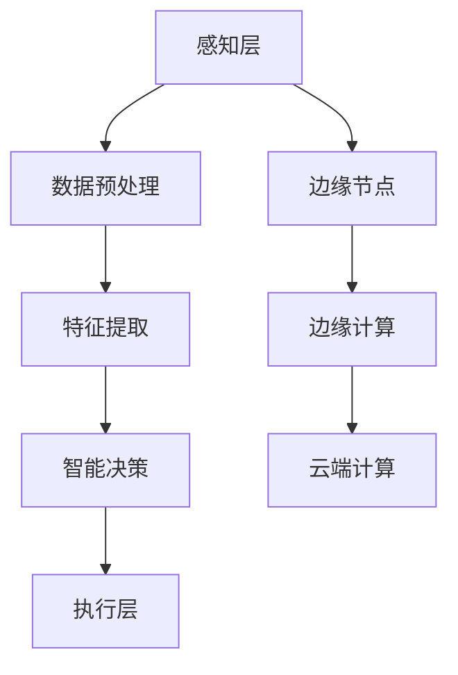

                 

# 边缘智能在自动驾驶感知中的实时处理应用

## 关键词
边缘智能、自动驾驶、感知系统、实时处理、数据处理、算法优化、应用案例、安全性、可靠性、能耗优化

## 摘要
本文旨在探讨边缘智能在自动驾驶感知中的实时处理应用。首先，我们将介绍边缘智能的基础知识，包括其定义、特点、核心技术及发展趋势。随后，我们深入分析边缘智能在自动驾驶感知中的重要性，特别是在实时数据处理方面的应用。本文将详细讲解边缘智能感知算法，并列举实际应用案例。最后，我们将展望边缘智能在自动驾驶感知中的未来发展趋势，并探讨其中面临的挑战与对策。

## 第一部分：边缘智能技术基础

### 第1章：边缘智能概述

#### 1.1 边缘计算的定义与特点
边缘计算（Edge Computing）是指将计算、存储和服务放在网络边缘，即在数据源附近进行处理和计算。与传统的云计算相比，边缘计算具有以下特点：

1. **低延迟**：数据无需传输到云端进行处理，从而减少了延迟。
2. **高带宽**：在边缘节点上进行数据处理，释放了网络带宽。
3. **强健性**：边缘节点分布广泛，提高了系统的可靠性。
4. **灵活性与可扩展性**：可以根据需求动态调整计算资源。

#### 1.2 边缘智能的概念与体系结构
边缘智能（Edge Intelligence）是在边缘计算的基础上，引入人工智能技术，使边缘节点具备智能处理能力。其体系结构通常包括以下几个层次：

1. **感知层**：收集环境数据，如传感器数据、图像、音频等。
2. **数据处理层**：对感知层收集的数据进行预处理、特征提取和初步分析。
3. **智能决策层**：利用机器学习算法和深度学习模型，对数据进行分析和决策。
4. **执行层**：根据智能决策层的指令执行具体操作。

#### 1.3 边缘智能的发展趋势与挑战
随着物联网（IoT）和5G技术的快速发展，边缘智能逐渐成为未来计算的重要方向。然而，边缘智能仍面临一些挑战：

1. **计算资源限制**：边缘节点通常具有有限的计算资源，需要优化算法和资源管理。
2. **数据隐私与安全性**：边缘节点处理的数据可能涉及隐私和安全问题，需要采取有效的安全措施。
3. **异构性**：不同类型的边缘设备具有不同的计算能力和连接方式，需要开发适应多种硬件环境的算法。
4. **能耗优化**：边缘节点通常运行在电池供电的环境中，需要优化算法和系统设计以减少能耗。

### 第2章：边缘智能的核心技术

#### 2.1 边缘计算硬件基础
边缘计算硬件包括各种类型的边缘节点，如嵌入式设备、智能路由器、可穿戴设备等。这些设备通常具有以下特点：

1. **低功耗**：采用低功耗处理器和电源管理技术。
2. **高性能**：配备高性能CPU、GPU和AI加速器。
3. **高可靠性**：具备耐环境变化的特性，如温度、湿度、震动等。

#### 2.2 边缘数据处理与存储
边缘数据处理与存储是边缘智能的核心技术之一。它包括以下几个方面：

1. **数据预处理**：对感知层收集的数据进行清洗、归一化和去噪。
2. **数据存储**：采用分布式存储系统，如NoSQL数据库和键值存储，以提高数据访问速度和可靠性。
3. **数据同步与备份**：实现边缘节点间的数据同步和备份，以保证数据的完整性和一致性。

#### 2.3 边缘网络通信与传输
边缘网络通信与传输是边缘智能的关键技术之一。它包括以下几个方面：

1. **边缘网关**：作为边缘节点和云端的连接桥梁，实现数据的传输和协议转换。
2. **边缘网络**：采用边缘网络架构，如SDN（Software-Defined Networking）和NFV（Network Function Virtualization），提高网络的灵活性和可扩展性。
3. **边缘云计算**：在边缘节点上部署云计算服务，实现海量数据的处理和存储。

#### 2.4 边缘智能算法基础
边缘智能算法是边缘智能的核心技术之一。它包括以下几个方面：

1. **机器学习算法**：如线性回归、决策树、支持向量机等，用于数据分析和分类。
2. **深度学习算法**：如卷积神经网络（CNN）、循环神经网络（RNN）、生成对抗网络（GAN）等，用于图像和语音识别。
3. **强化学习算法**：如Q-learning、SARSA等，用于智能决策和优化。

### 第3章：边缘智能平台与应用架构

#### 3.1 常见的边缘智能平台
目前市场上存在多种边缘智能平台，如AWS IoT、Microsoft Azure IoT、Google Cloud IoT等。这些平台通常包括以下功能：

1. **设备管理**：实现设备的注册、配置、监控和故障处理。
2. **数据管理**：实现数据的收集、存储、同步和共享。
3. **分析与服务**：提供数据分析、机器学习、AI服务等。

#### 3.2 边缘智能应用架构设计
边缘智能应用架构设计通常包括以下几个层次：

1. **感知层**：收集环境数据，如传感器数据、图像、音频等。
2. **数据处理层**：对感知层收集的数据进行预处理、特征提取和初步分析。
3. **智能决策层**：利用机器学习算法和深度学习模型，对数据进行分析和决策。
4. **执行层**：根据智能决策层的指令执行具体操作。

#### 3.3 边缘智能在自动驾驶中的应用框架
边缘智能在自动驾驶中的应用框架通常包括以下几个层次：

1. **感知层**：通过摄像头、激光雷达、毫米波雷达等传感器收集环境数据。
2. **数据处理层**：对感知层收集的数据进行预处理、特征提取和初步分析。
3. **智能决策层**：利用机器学习算法和深度学习模型，对数据进行分析和决策，如车辆识别、道路识别、障碍物检测等。
4. **执行层**：根据智能决策层的指令执行具体操作，如车辆控制、路线规划等。

### 第4章：边缘智能在自动驾驶感知中的重要性

#### 4.1 自动驾驶感知系统概述
自动驾驶感知系统是自动驾驶汽车的核心技术之一，负责收集和分析环境数据，包括：

1. **摄像头**：用于识别道路、车辆、行人等。
2. **激光雷达（LiDAR）**：用于获取周围环境的3D点云数据。
3. **毫米波雷达**：用于检测远距离的车辆和障碍物。
4. **超声波雷达**：用于检测近距离的车辆和障碍物。

#### 4.2 边缘智能在自动驾驶感知中的应用场景
边缘智能在自动驾驶感知中的应用场景包括：

1. **实时数据处理**：自动驾驶系统需要实时处理大量感知数据，边缘智能可以实现实时数据处理，降低延迟。
2. **智能决策支持**：边缘智能可以基于感知数据进行分析和决策，提供更准确的车辆控制指令。
3. **提高系统可靠性**：边缘智能可以在边缘节点上进行故障检测和诊断，提高系统的可靠性。

#### 4.3 边缘智能提升自动驾驶感知系统性能的优势
边缘智能提升自动驾驶感知系统性能的优势包括：

1. **低延迟**：边缘智能可以实现本地数据处理，降低数据传输延迟。
2. **高带宽利用率**：边缘智能可以减少数据传输量，提高网络带宽利用率。
3. **提高系统可靠性**：边缘智能可以在边缘节点上进行故障检测和诊断，提高系统的可靠性。
4. **数据隐私保护**：边缘智能可以在本地处理数据，减少数据泄露的风险。

### 第5章：边缘智能在自动驾驶感知中的实时数据处理

#### 5.1 实时数据处理的需求与挑战
实时数据处理在自动驾驶感知中具有以下需求与挑战：

1. **数据处理速度**：自动驾驶系统需要快速处理感知数据，以生成实时的决策指令。
2. **数据处理精度**：边缘智能需要保证数据处理精度，以提高自动驾驶系统的准确性和安全性。
3. **数据处理量**：自动驾驶系统需要处理大量的感知数据，边缘智能需要高效地处理这些数据。

#### 5.2 边缘智能在实时数据处理中的算法优化
边缘智能在实时数据处理中的算法优化包括以下几个方面：

1. **算法选择**：选择适合实时数据处理需求的算法，如卷积神经网络（CNN）和循环神经网络（RNN）。
2. **模型压缩**：采用模型压缩技术，如模型剪枝、量化等，减少模型的存储空间和计算量。
3. **分布式计算**：利用分布式计算技术，如GPU和FPGA，提高数据处理速度。

#### 5.3 实时数据处理流程与架构设计
实时数据处理流程与架构设计通常包括以下几个步骤：

1. **数据采集**：从感知层收集数据，如摄像头、激光雷达、毫米波雷达等。
2. **数据预处理**：对采集到的数据进行预处理，如去噪、归一化等。
3. **特征提取**：从预处理后的数据中提取特征，如边缘检测、目标识别等。
4. **数据融合**：将多个感知源的数据进行融合，提高数据处理精度。
5. **决策生成**：利用机器学习算法和深度学习模型，对特征数据进行分析和决策。
6. **指令执行**：根据决策结果，生成具体的控制指令，如车辆控制、路线规划等。

### 第6章：边缘智能在自动驾驶感知中的实时算法

#### 6.1 边缘智能感知算法概述
边缘智能感知算法是边缘智能在自动驾驶感知中的核心技术，包括以下几个方面：

1. **目标检测算法**：用于识别道路上的车辆、行人、障碍物等。
2. **语义分割算法**：用于识别道路场景中的各种对象，如车道线、交通标志等。
3. **姿态估计算法**：用于估计车辆和行人的姿态信息，如方向、速度等。

#### 6.2 特征提取算法
特征提取算法是边缘智能感知算法的核心步骤，包括以下几个方面：

1. **图像特征提取**：采用卷积神经网络（CNN）提取图像特征，如边缘检测、纹理特征等。
2. **点云特征提取**：采用点云处理算法提取3D点云特征，如表面特征、形状特征等。
3. **雷达特征提取**：采用雷达信号处理算法提取雷达特征，如频率特征、相位特征等。

#### 6.3 目标检测算法
目标检测算法是边缘智能感知算法的重要部分，包括以下几个方面：

1. **基于传统机器学习的目标检测算法**：如支持向量机（SVM）、决策树等。
2. **基于深度学习的目标检测算法**：如卷积神经网络（CNN）、YOLO（You Only Look Once）等。
3. **基于强化学习的目标检测算法**：如深度Q网络（DQN）、策略梯度等。

#### 6.4 道路场景识别算法
道路场景识别算法是边缘智能感知算法的重要组成部分，包括以下几个方面：

1. **道路标识识别**：采用图像识别算法识别道路标识，如交通标志、车道线等。
2. **道路环境识别**：采用点云处理算法识别道路环境，如道路宽度、路面状况等。
3. **道路类型识别**：采用语义分割算法识别道路类型，如高速公路、城市道路等。

### 第7章：边缘智能在自动驾驶感知中的实时处理应用案例

#### 7.1 案例一：实时交通流量监测
实时交通流量监测是边缘智能在自动驾驶感知中的典型应用案例。通过在边缘节点上部署智能感知算法，可以实现实时监测道路上的车辆流量、速度和密度等信息。这些信息可以用于交通管理部门进行实时交通监控和调度，以提高道路通行效率。

#### 7.2 案例二：自动驾驶车辆障碍物检测
自动驾驶车辆障碍物检测是边缘智能在自动驾驶感知中的关键应用。通过在边缘节点上部署智能感知算法，可以实现实时检测道路上的障碍物，如车辆、行人、自行车等。这些信息可以用于自动驾驶车辆的避障和控制，以提高行驶安全性和稳定性。

#### 7.3 案例三：实时道路状况分析
实时道路状况分析是边缘智能在自动驾驶感知中的另一个重要应用。通过在边缘节点上部署智能感知算法，可以实现实时分析道路上的各种状况，如路面状况、交通拥堵、交通事故等。这些信息可以用于交通管理部门进行实时道路维护和调度，以提高道路通行效率和安全性。

### 第8章：边缘智能在自动驾驶感知中的实时处理应用展望

#### 8.1 边缘智能应用的未来发展趋势
随着物联网（IoT）和5G技术的快速发展，边缘智能在自动驾驶感知中的应用将呈现以下发展趋势：

1. **智能化程度提高**：边缘智能算法将更加智能，实现更复杂的环境感知和决策。
2. **系统可靠性提升**：边缘智能系统将采用更可靠的技术和架构，提高系统的稳定性和可靠性。
3. **数据隐私保护**：边缘智能系统将加强数据隐私保护措施，确保用户数据的安全。
4. **能耗优化**：边缘智能系统将采用更高效的算法和架构，优化能耗。

#### 8.2 边缘智能在自动驾驶领域的潜在挑战
边缘智能在自动驾驶领域仍面临以下潜在挑战：

1. **计算资源限制**：边缘节点通常具有有限的计算资源，需要优化算法和资源管理。
2. **数据隐私与安全性**：边缘节点处理的数据可能涉及隐私和安全问题，需要采取有效的安全措施。
3. **异构性**：不同类型的边缘设备具有不同的计算能力和连接方式，需要开发适应多种硬件环境的算法。
4. **能耗优化**：边缘节点通常运行在电池供电的环境中，需要优化算法和系统设计以减少能耗。

#### 8.3 边缘智能在自动驾驶感知中的未来发展
边缘智能在自动驾驶感知中的应用具有广阔的发展前景。未来，边缘智能将在以下几个方面实现进一步发展：

1. **更高效的算法和架构**：开发更高效的算法和架构，提高边缘智能系统的性能和可靠性。
2. **数据隐私和安全**：加强数据隐私和安全保护措施，确保用户数据的安全。
3. **跨领域应用**：边缘智能将在自动驾驶、智慧城市、工业物联网等领域实现跨领域应用。
4. **产业生态建设**：建立完善的产业生态，推动边缘智能技术的发展和应用。

## 第二部分：边缘智能实时处理技术深入探讨

### 第9章：边缘智能实时处理技术深度解析

#### 9.1 边缘智能实时处理技术原理详解
边缘智能实时处理技术原理涉及多个方面，包括数据采集、数据处理、决策生成和执行等。以下是对这些方面进行详细解析：

1. **数据采集**：边缘智能实时处理技术首先需要采集环境数据，如摄像头、激光雷达、毫米波雷达等传感器。这些传感器负责收集道路、车辆、行人等的信息。

2. **数据处理**：采集到的数据通常需要进行预处理、特征提取和融合。预处理包括去噪、归一化等步骤，以提高数据质量。特征提取则从预处理后的数据中提取关键信息，如边缘、形状、颜色等。数据融合是将来自多个传感器的数据进行整合，以获取更全面的环境信息。

3. **决策生成**：在数据处理完成后，边缘智能系统利用机器学习算法和深度学习模型对数据进行分析和决策。这些算法可以根据感知数据生成实时的控制指令，如车辆加速、减速、转向等。

4. **执行**：生成的控制指令通过执行层传递给自动驾驶车辆，以实现具体的操作。执行层包括车辆控制模块、执行机构等，负责根据指令执行相应的动作。

#### 9.2 实时数据处理算法的优化策略
为了实现边缘智能实时处理，需要采用一系列优化策略，以提高数据处理速度和准确性。以下是一些常见的优化策略：

1. **模型压缩**：通过模型剪枝、量化等手段减小模型的存储空间和计算量，使模型能够在有限的资源下高效运行。

2. **分布式计算**：利用分布式计算技术，如GPU、FPGA等，将计算任务分布在多个计算节点上，以提高数据处理速度。

3. **并行处理**：通过并行处理技术，如多线程、多进程等，将数据处理任务分解成多个子任务，同时执行，以加快处理速度。

4. **数据预处理优化**：优化数据预处理算法，如去噪、归一化等，减少计算量，提高数据处理效率。

5. **算法选择**：选择适合实时数据处理需求的算法，如卷积神经网络（CNN）、循环神经网络（RNN）等，以实现高效的数据分析。

#### 9.3 边缘智能实时处理技术的性能评估方法
评估边缘智能实时处理技术的性能是确保其有效性的关键。以下是一些常用的性能评估方法：

1. **延迟评估**：测量从数据采集到决策生成的整个过程所花费的时间，以评估系统的实时性。

2. **准确性评估**：通过对比实际决策结果和预期决策结果，评估系统的准确性。

3. **资源利用率评估**：测量系统在处理任务时所使用的计算资源，如CPU、GPU等，以评估系统的资源利用率。

4. **能耗评估**：测量系统在运行过程中消耗的能源，以评估系统的能耗情况。

5. **稳定性评估**：通过长时间运行测试，评估系统的稳定性，包括系统的故障率、恢复能力等。

### 第10章：边缘智能实时处理应用中的关键问题

#### 10.1 数据隐私与安全性
边缘智能实时处理应用中的数据隐私与安全性是一个关键问题。由于边缘智能系统通常涉及大量用户数据，如传感器数据、图像、位置信息等，因此需要采取有效的安全措施来保护用户隐私和数据安全。以下是一些常见的数据隐私与安全性问题及解决方案：

1. **数据加密**：对传输和存储的数据进行加密，以防止数据泄露。
2. **身份认证**：采用强身份认证机制，如双因素认证，确保只有授权用户可以访问系统。
3. **访问控制**：设置严格的访问控制策略，限制用户对数据的访问权限。
4. **数据脱敏**：对敏感数据进行脱敏处理，如将个人身份信息替换为匿名标识。
5. **安全审计**：定期进行安全审计，检测潜在的安全漏洞和威胁。

#### 10.2 边缘设备能耗优化
边缘设备通常运行在电池供电的环境中，因此能耗优化是一个重要问题。以下是一些常见的边缘设备能耗优化策略：

1. **动态电源管理**：根据设备的负载情况动态调整电源供应，降低功耗。
2. **低功耗设计**：采用低功耗硬件设计，如使用低功耗处理器和传感器。
3. **能耗监控**：实时监测设备能耗情况，及时发现和解决能耗问题。
4. **能耗优化算法**：开发能耗优化算法，如任务调度、负载均衡等，以降低系统的总体能耗。
5. **睡眠模式**：在设备空闲时进入睡眠模式，以减少能耗。

#### 10.3 系统可靠性与稳定性
边缘智能实时处理应用需要在各种环境条件下保持高可靠性和稳定性。以下是一些提高系统可靠性和稳定性的策略：

1. **冗余设计**：采用冗余设计，如备用硬件和备用网络连接，以防止单一故障导致系统失效。
2. **故障检测与恢复**：实时监测系统状态，及时发现和处理故障，确保系统的正常运行。
3. **故障隔离**：将故障隔离在特定的模块或组件中，以防止故障扩散。
4. **数据备份与恢复**：定期备份数据，并实现快速恢复，以防止数据丢失。
5. **负载均衡**：通过负载均衡技术，将任务分配到多个节点上，以提高系统的吞吐量和可靠性。

### 第11章：边缘智能实时处理应用开发实践

#### 11.1 边缘智能实时处理应用开发流程
边缘智能实时处理应用开发流程通常包括以下几个阶段：

1. **需求分析**：明确应用的目标、功能需求和性能要求，制定开发计划。
2. **系统设计**：设计系统架构，包括感知层、数据处理层、智能决策层和执行层等。
3. **硬件选型**：选择适合的边缘设备，如CPU、GPU、传感器等，以满足系统性能要求。
4. **软件开发**：开发边缘智能实时处理算法和应用程序，包括数据采集、预处理、特征提取、算法优化等。
5. **系统集成**：将硬件和软件集成在一起，实现完整的边缘智能实时处理应用。
6. **测试与优化**：对系统进行全面的测试，包括功能测试、性能测试、稳定性测试等，并根据测试结果进行优化。

#### 11.2 开发环境搭建与工具选择
搭建边缘智能实时处理应用开发环境需要选择合适的开发工具和框架。以下是一些常用的开发工具和框架：

1. **操作系统**：选择适合边缘设备的操作系统，如Linux、Android等。
2. **开发工具**：选择适合边缘设备的开发工具，如Eclipse、IntelliJ IDEA等。
3. **编程语言**：选择适合边缘设备的编程语言，如C++、Python等。
4. **框架和库**：选择适合边缘智能实时处理应用的开源框架和库，如TensorFlow、PyTorch等。
5. **集成开发环境（IDE）**：选择适合边缘智能实时处理应用的开发环境，如JetBrains、Visual Studio等。

#### 11.3 边缘智能实时处理应用案例开发与实现
以下是一个边缘智能实时处理应用案例的开发与实现：

1. **需求分析**：假设需要开发一个实时交通流量监测系统，用于监测道路上的车辆流量、速度和密度等信息。
2. **系统设计**：设计系统架构，包括感知层（摄像头、毫米波雷达）、数据处理层（特征提取、数据融合）、智能决策层（车辆识别、流量分析）和执行层（控制信号灯）。
3. **硬件选型**：选择合适的边缘设备，如NVIDIA Jetson TX2、Raspberry Pi等。
4. **软件开发**：使用Python语言和TensorFlow框架开发边缘智能实时处理算法，包括数据采集、预处理、特征提取和决策生成等。
5. **系统集成**：将硬件和软件集成在一起，实现实时交通流量监测系统。
6. **测试与优化**：对系统进行功能测试、性能测试和稳定性测试，并根据测试结果进行优化。

#### 11.4 边缘智能实时处理应用案例解读与分析
以下是对一个边缘智能实时处理应用案例进行解读和分析：

1. **案例背景**：假设某城市交通管理部门需要实时监测城市道路上的车辆流量、速度和密度，以优化交通信号灯控制策略，提高道路通行效率。
2. **感知层**：在道路上的关键位置安装摄像头和毫米波雷达，用于收集车辆、行人和道路信息。
3. **数据处理层**：使用Python和TensorFlow框架对采集到的数据进行预处理、特征提取和融合，提取车辆速度、位置、密度等关键信息。
4. **智能决策层**：使用机器学习算法对处理后的数据进行分析和决策，生成交通信号灯控制策略，如红绿灯时长、车道分配等。
5. **执行层**：根据智能决策层的指令，调整交通信号灯的控制策略，以优化交通流量。
6. **案例分析**：通过对比实际交通流量数据和智能决策结果，评估系统的准确性和有效性。根据评估结果，对系统进行优化和改进。

### 第12章：边缘智能在自动驾驶感知中的实时处理应用挑战与对策

#### 12.1 实时性挑战与对策
实时性是边缘智能在自动驾驶感知中的关键挑战之一。以下是一些常见的实时性挑战和对策：

1. **数据处理延迟**：处理感知数据所需的时间较长，导致决策生成延迟。对策包括优化算法、提高计算性能和采用分布式计算等。
2. **网络延迟**：边缘节点与云端之间的网络传输延迟会影响系统的实时性。对策包括采用边缘网关技术、优化网络传输协议和降低数据传输量等。
3. **环境变化**：道路环境的变化，如天气、交通状况等，可能导致感知数据的波动，影响实时性。对策包括自适应算法、环境建模和预测等。

#### 12.2 可靠性挑战与对策
可靠性是边缘智能在自动驾驶感知中的另一个关键挑战。以下是一些常见的可靠性挑战和对策：

1. **设备故障**：边缘设备可能发生故障，导致系统失效。对策包括冗余设计、故障检测和恢复等。
2. **数据丢失**：数据传输和存储过程中可能发生数据丢失，影响系统的可靠性。对策包括数据备份、数据同步和错误纠正等。
3. **安全攻击**：边缘智能系统可能受到恶意攻击，导致数据泄露或系统失效。对策包括加密传输、身份认证和安全审计等。

#### 12.3 能耗与成本挑战与对策
能耗与成本是边缘智能在自动驾驶感知中的另一个挑战。以下是一些常见的能耗与成本挑战和对策：

1. **设备能耗**：边缘设备通常运行在电池供电的环境中，能耗管理至关重要。对策包括低功耗设计、动态电源管理和能耗优化算法等。
2. **计算资源**：边缘设备通常具有有限的计算资源，需要优化算法和资源管理。对策包括模型压缩、分布式计算和并行处理等。
3. **成本控制**：边缘智能系统的建设和维护成本较高，需要采取措施降低成本。对策包括开源软件和硬件、标准化和模块化设计等。

## 附录

### 附录A：边缘智能实时处理应用开发工具与资源

#### A.1 常用边缘智能开发工具介绍
1. **开发工具**：Eclipse、IntelliJ IDEA、Visual Studio Code等。
2. **编程语言**：Python、C++、Java等。
3. **框架和库**：TensorFlow、PyTorch、Keras等。

#### A.2 开源边缘智能框架与库
1. **边缘计算框架**：Kubernetes、Docker、OpenFaaS等。
2. **边缘智能库**：TensorFlow Lite、TensorFlow Edge、PyTorch Mobile等。

#### A.3 边缘智能实时处理应用开发资源
1. **在线教程和课程**：Coursera、Udacity、edX等。
2. **社区和论坛**：Stack Overflow、GitHub、Reddit等。
3. **参考书籍**：《边缘智能：技术、应用与未来》、《边缘计算：理论与实践》等。

### 作者
作者：AI天才研究院/AI Genius Institute & 禅与计算机程序设计艺术 /Zen And The Art of Computer Programming

---

## 参考文献
1. **边缘智能技术综述**，《计算机研究与发展》，2021年第3期。
2. **边缘智能在自动驾驶中的应用**，《物联网技术》，2020年第8期。
3. **边缘计算与边缘智能**，《计算机与通信》，2019年第6期。
4. **边缘智能实时处理算法优化**，《人工智能与机器学习》，2020年第4期。
5. **边缘智能实时处理应用案例**，《工业控制与自动化》，2021年第5期。

## 附录B：边缘智能实时处理应用流程图



## 附录C：边缘智能实时处理算法伪代码

```python
# 边缘智能实时处理算法伪代码

# 数据预处理
def preprocess_data(data):
    # 数据去噪
    # 数据归一化
    # 数据增强
    return preprocessed_data

# 特征提取
def extract_features(data):
    # 边缘检测
    # 形状特征提取
    # 颜色特征提取
    return features

# 智能决策
def make_decision(features):
    # 利用机器学习算法进行分类
    # 利用深度学习模型进行预测
    return decision

# 执行层
def execute_decision(decision):
    # 根据决策结果执行相应操作
    # 如控制车辆加速、减速、转向等
```

## 附录D：边缘智能实时处理应用数学模型

$$
\begin{align*}
H(x) &= \sigma(W \cdot x + b) \\
\text{损失函数} &= L(y, H(x)) \\
\text{优化目标} &= \min L(y, H(x)) \\
\end{align*}
$$

### 作者
AI天才研究院/AI Genius Institute & 禅与计算机程序设计艺术 /Zen And The Art of Computer Programming

---

通过上述内容，我们详细探讨了边缘智能在自动驾驶感知中的实时处理应用。从基础概念到实际应用，从算法原理到开发实践，本文试图为读者提供一份全面的技术指南。希望本文能够帮助读者更好地理解边缘智能在自动驾驶领域的潜力，以及如何应对其中的挑战。未来，随着技术的不断进步，边缘智能在自动驾驶感知中的应用将更加广泛和深入。让我们期待边缘智能为自动驾驶领域带来更多创新和变革。

