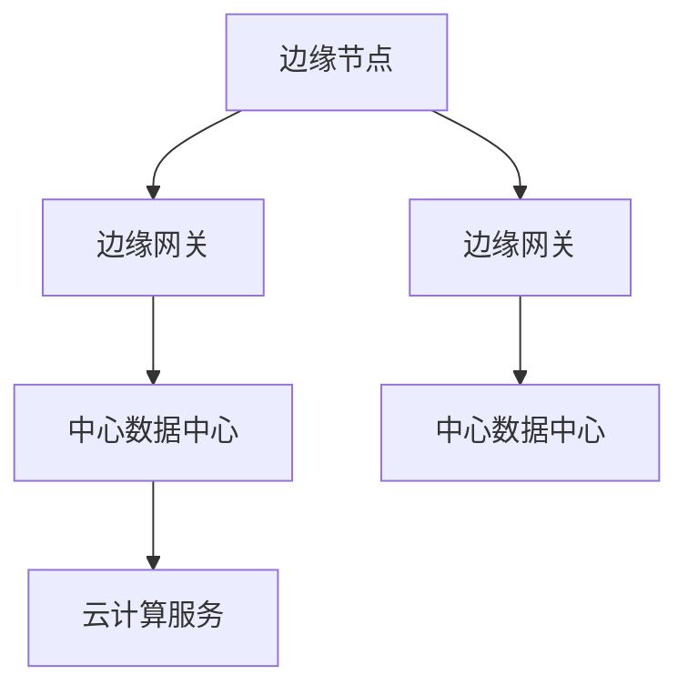

                 

### 《边缘计算在智能家居安全中的实践》

#### **关键词：** 边缘计算，智能家居，安全，数据处理，节点，架构，算法，挑战

#### **摘要：** 
本文将探讨边缘计算在智能家居安全中的应用，通过详细分析边缘计算的核心概念、架构、技术以及应用场景，揭示其在提升智能家居安全性能方面的巨大潜力。文章将结合实际案例，展示边缘计算在处理智能家居安全威胁中的具体实现方法，并提供未来发展的建议和思考。

### **第一部分：边缘计算基础**

#### **第1章：边缘计算概述**

##### **1.1 边缘计算的起源与发展**

边缘计算（Edge Computing）起源于物联网（IoT）的兴起，旨在将数据处理、存储和应用程序分布到网络的边缘，从而减少中心数据中心的负担，提高系统的响应速度。边缘计算的起源可以追溯到20世纪90年代，随着互联网技术的快速发展，数据生成和处理的规模逐渐扩大，中心化的数据处理模式逐渐显示出瓶颈。

1990年代末，随着无线通信技术和传感器技术的进步，物联网的概念开始出现。物联网的核心在于连接大量的设备，这些设备产生的数据需要实时处理和分析。为了提高数据处理效率，边缘计算的概念逐渐成熟。2005年，IEEE首次提出了边缘计算的概念，并将其定义为“在网络的边缘侧，通过分布式计算、存储和网络资源，提供更为灵活、高效和安全的计算服务”。

##### **1.2 边缘计算的核心概念与优势**

边缘计算的核心概念包括数据分布、计算分布和资源分布。通过将计算任务分布到网络的边缘节点，边缘计算能够显著减少数据传输的距离，提高系统的响应速度。此外，边缘计算还能够有效降低网络带宽的消耗，减轻中心数据中心的压力。

边缘计算的主要优势包括：

1. **提高响应速度**：由于数据处理和存储都在网络的边缘，数据传输的距离大大缩短，从而提高了系统的响应速度。
2. **降低带宽消耗**：边缘计算能够将大量数据处理任务在本地完成，减少了数据传输的量，降低了带宽的消耗。
3. **增强安全性**：边缘计算通过在本地处理数据，可以减少数据在网络中的传输，降低了数据泄露的风险。
4. **提高系统可靠性**：边缘计算通过分布式架构，提高了系统的容错能力，即使部分节点出现故障，系统仍能正常运行。

##### **1.3 边缘计算在智能家居安全中的应用前景**

随着智能家居设备的普及，用户对数据安全的需求日益增长。边缘计算在智能家居安全中的应用前景广阔。通过边缘计算，智能家居系统能够在本地实时处理和分析数据，提高对潜在威胁的响应速度。同时，边缘计算还能够降低数据传输的风险，增强系统的安全性。

例如，智能家居系统中的智能门锁、智能摄像头等设备，可以通过边缘计算实现本地数据加密和存储，减少数据泄露的风险。此外，边缘计算还可以用于实时监控和预警，当发现异常行为时，系统能够立即采取措施，防止潜在的安全威胁。

### **第2章：边缘计算体系结构与关键技术**

##### **2.1 边缘计算架构概述**

边缘计算架构通常包括三个主要部分：边缘节点、边缘网关和中心数据中心。

1. **边缘节点**：边缘节点是边缘计算架构中最基础的部分，它们通常位于网络边缘，负责数据的收集、处理和存储。边缘节点可以是物联网设备、智能手机、服务器等。
2. **边缘网关**：边缘网关位于边缘节点和中心数据中心之间，负责数据的传输和路由。边缘网关通常具有数据处理和存储的能力，能够对数据进行分析和处理。
3. **中心数据中心**：中心数据中心负责处理和存储大量数据，并提供云计算服务。中心数据中心通常具有强大的计算和存储能力，能够处理复杂的计算任务。

边缘计算架构的 Mermaid 流程图如下：

##### **2.2 边缘计算节点类型与功能**

边缘计算节点可以分为以下几类：

1. **物联网设备**：物联网设备是边缘计算节点的重要组成部分，如智能门锁、智能摄像头、智能灯泡等。物联网设备负责数据的采集和初步处理。
2. **边缘服务器**：边缘服务器是边缘计算节点中的计算核心，负责处理和存储大量的数据。边缘服务器通常具有高性能的计算能力和大容量的存储空间。
3. **边缘网关**：边缘网关是边缘计算节点中的通信枢纽，负责数据在边缘节点和中心数据中心之间的传输和路由。

不同类型的边缘计算节点具有不同的功能，但它们共同构成了边缘计算的基础架构。

##### **2.3 边缘计算网络协议与通信**

边缘计算网络协议是边缘计算节点之间进行通信的基础。常见的边缘计算网络协议包括：

1. **HTTP/2**：HTTP/2 是一种基于 TCP 的协议，用于 Web 应用程序的数据传输。HTTP/2 改进了数据传输效率，降低了延迟。
2. **MQTT**：MQTT（Message Queuing Telemetry Transport）是一种轻量级的消息传输协议，适用于物联网应用。MQTT 具有低带宽占用、低延迟、高可靠性的特点。
3. **CoAP**：CoAP（Constrained Application Protocol）是一种专为物联网应用设计的协议，具有简单、高效、低功耗的特点。

边缘计算网络协议的选择取决于应用场景和需求。例如，在智能家居应用中，MQTT 协议由于其低延迟和高可靠性，被广泛应用于设备之间的通信。

##### **2.4 边缘计算安全机制**

边缘计算的安全机制是确保系统安全和数据安全的关键。边缘计算安全机制包括以下几个方面：

1. **数据加密**：数据加密是保护数据在传输和存储过程中的安全的重要手段。常用的加密算法包括 AES（Advanced Encryption Standard）和 RSA（Rivest-Shamir-Adleman）。
2. **身份认证**：身份认证是确保只有授权用户能够访问系统和数据的重要手段。常用的身份认证方法包括用户名密码认证、双因素认证等。
3. **访问控制**：访问控制是限制用户对系统和数据的访问权限的重要手段。常用的访问控制方法包括基于角色的访问控制（RBAC，Role-Based Access Control）和基于属性的访问控制（ABAC，Attribute-Based Access Control）。
4. **安全审计**：安全审计是监控系统和数据的安全状态的重要手段。通过安全审计，可以及时发现和应对潜在的安全威胁。

### **第3章：边缘计算平台搭建**

##### **3.1 边缘计算平台概述**

边缘计算平台是边缘计算的核心组成部分，它为边缘计算节点提供了计算、存储和通信的基础设施。边缘计算平台通常包括以下几个部分：

1. **硬件设备**：硬件设备包括边缘服务器、存储设备、网络设备等，用于提供边缘计算所需的计算和存储资源。
2. **软件环境**：软件环境包括操作系统、中间件、应用软件等，用于管理和运行边缘计算任务。
3. **网络设施**：网络设施包括局域网、广域网、无线网络等，用于边缘计算节点之间的通信和数据传输。

边缘计算平台的搭建需要综合考虑硬件设备、软件环境和网络设施，确保平台具有良好的性能、可靠性和安全性。

##### **3.2 边缘计算平台硬件设备选择**

边缘计算平台硬件设备的选择取决于应用场景和需求。以下是一些常见的硬件设备选择：

1. **边缘服务器**：边缘服务器是边缘计算平台的核心设备，用于处理和存储数据。边缘服务器应具有高性能的计算能力、大容量的存储空间和低功耗的特点。
2. **存储设备**：存储设备用于存储边缘计算节点收集和处理的数据。常见的存储设备包括固态硬盘（SSD）、机械硬盘（HDD）和分布式存储系统。
3. **网络设备**：网络设备包括路由器、交换机和无线接入点等，用于实现边缘计算节点之间的通信和数据传输。网络设备应具有高带宽、低延迟和强可靠性的特点。

##### **3.3 边缘计算平台软件环境配置**

边缘计算平台的软件环境配置包括操作系统、中间件和应用软件的安装和配置。以下是一些常见的软件环境配置步骤：

1. **操作系统**：边缘计算平台通常使用 Linux 操作系统，如 Ubuntu、CentOS 等。安装操作系统时，需要选择适合的发行版和版本，并配置网络、用户和权限等基本设置。
2. **中间件**：中间件包括数据库、消息队列、Web 服务器等，用于支持边缘计算应用的运行。常见的中间件包括 MySQL、RabbitMQ、Apache 等。安装和配置中间件时，需要根据实际需求选择合适的版本和配置参数。
3. **应用软件**：应用软件包括边缘计算框架、数据分析工具和监控软件等，用于实现边缘计算任务。常见的应用软件包括 TensorFlow、Scikit-learn、Prometheus 等。安装和配置应用软件时，需要根据软件的安装指南进行操作。

##### **3.4 边缘计算平台性能优化**

边缘计算平台的性能优化是确保平台高效运行的关键。以下是一些常见的性能优化方法：

1. **硬件优化**：通过升级硬件设备、增加计算资源、优化网络拓扑等手段，提高边缘计算平台的性能。
2. **软件优化**：通过优化操作系统、中间件和应用软件的配置，提高平台的运行效率。例如，调整系统参数、优化数据库查询、优化网络传输等。
3. **负载均衡**：通过负载均衡技术，合理分配计算任务，避免单点过载，提高平台的整体性能。
4. **缓存策略**：通过缓存策略，减少数据访问的延迟，提高平台的响应速度。常见的缓存策略包括内存缓存、磁盘缓存和分布式缓存等。

### **第二部分：智能家居安全边缘计算应用**

#### **第4章：智能家居安全威胁分析**

##### **4.1 智能家居安全威胁概述**

随着智能家居设备的普及，用户对数据安全的需求日益增长。然而，智能家居系统面临着多种安全威胁，包括：

1. **数据泄露**：智能家居设备收集和存储大量用户数据，如家庭地址、身份证号码、银行账户信息等。如果数据泄露，将导致用户隐私受到侵害。
2. **远程攻击**：黑客可以通过互联网远程控制智能家居设备，如智能门锁、智能摄像头等，甚至可能导致家庭安全受到威胁。
3. **恶意软件**：智能家居设备容易受到恶意软件的感染，如勒索软件、木马等，可能导致设备失控、数据丢失等安全问题。

##### **4.2 常见智能家居安全攻击类型**

智能家居系统可能面临以下几种常见安全攻击：

1. **中间人攻击（MITM）**：黑客拦截智能家居设备和服务器之间的通信，窃取用户数据或篡改数据。
2. **拒绝服务攻击（DoS）**：黑客通过大量无效请求，使智能家居设备或服务器瘫痪，导致系统无法正常运行。
3. **分布式拒绝服务攻击（DDoS）**：黑客利用大量僵尸主机，对智能家居设备或服务器发起攻击，使其无法正常响应合法用户的请求。
4. **恶意软件攻击**：黑客通过恶意软件感染智能家居设备，控制设备或窃取设备中的敏感数据。

##### **4.3 智能家居安全防御策略**

为了应对智能家居安全威胁，可以采取以下防御策略：

1. **数据加密**：对智能家居设备收集和传输的数据进行加密，确保数据在传输过程中不被窃取或篡改。
2. **身份认证**：对智能家居设备进行严格的身份认证，确保只有授权用户才能访问设备或系统。
3. **访问控制**：对智能家居设备或系统的访问权限进行严格控制，避免未经授权的用户访问敏感数据或操作设备。
4. **安全审计**：定期进行安全审计，监控智能家居设备或系统的运行状态，及时发现和应对潜在的安全威胁。
5. **软件更新**：及时更新智能家居设备的操作系统和应用程序，修复已知的安全漏洞，提高系统的安全性。

### **第5章：边缘计算在智能家居安全中的应用**

##### **5.1 边缘计算在智能家居安全中的应用场景**

边缘计算在智能家居安全中具有广泛的应用场景，包括：

1. **智能门锁**：边缘计算可以用于实时监测门锁状态，及时发现并处理异常情况，如非法入侵或设备故障。
2. **智能摄像头**：边缘计算可以对视频流进行实时分析，识别异常行为或可疑人物，实现实时报警和监控。
3. **智能照明**：边缘计算可以用于实时调整照明亮度，提高节能效果，同时防止照明系统被黑客控制。
4. **智能安防**：边缘计算可以用于实时监控家庭安全设备，如烟雾探测器、燃气泄漏探测器等，及时发现并处理安全隐患。

##### **5.2 边缘计算在智能家居安全中的作用**

边缘计算在智能家居安全中发挥着重要作用，主要体现在以下几个方面：

1. **实时数据处理**：边缘计算可以在本地实时处理智能家居设备收集的数据，提高对异常情况的响应速度，减少延迟。
2. **数据加密和存储**：边缘计算可以在本地对数据进行加密和存储，减少数据在传输过程中的泄露风险，提高系统的安全性。
3. **分布式计算和负载均衡**：边缘计算可以将计算任务分布到多个边缘节点，实现负载均衡和分布式计算，提高系统的可靠性。
4. **本地化安全防护**：边缘计算可以在本地实时监测和防御安全威胁，降低中心数据中心的负担，提高整体系统的安全性。

##### **5.3 边缘计算在智能家居安全中的挑战**

边缘计算在智能家居安全中虽然具有巨大潜力，但也面临一些挑战，包括：

1. **数据隐私和保护**：边缘计算涉及大量用户数据，如何保护用户隐私和数据安全是一个重要挑战。
2. **节点可靠性和安全性**：边缘计算节点分布广泛，如何保证节点的可靠性和安全性是一个重要问题。
3. **系统复杂性和维护**：边缘计算系统涉及多个组件和节点，如何实现系统的复杂性和维护是一个挑战。
4. **网络带宽和功耗**：边缘计算需要大量网络带宽和计算资源，如何在有限的资源下实现高效的边缘计算是一个挑战。

### **第6章：智能家居安全边缘计算案例分析**

##### **6.1 案例背景与需求分析**

**案例背景：**
某智能家居系统包括智能门锁、智能摄像头、智能照明和智能安防设备。系统需要实现以下安全需求：

1. **实时数据处理**：系统需要实时处理智能门锁、智能摄像头和智能安防设备收集的数据，及时发现并处理异常情况。
2. **数据加密和存储**：系统需要加密和存储用户数据，确保数据在传输和存储过程中的安全性。
3. **安全监测和报警**：系统需要实时监测智能家居设备的状态，发现潜在的安全威胁，并发出报警。
4. **负载均衡和分布式计算**：系统需要实现负载均衡和分布式计算，确保系统的高效性和可靠性。

##### **6.2 边缘计算方案设计**

**方案设计：**
1. **边缘节点选择**：选择边缘服务器作为边缘节点，用于处理和存储数据。边缘服务器应具有高性能的计算能力和大容量的存储空间。
2. **边缘网关设计**：设计边缘网关，用于边缘节点和中心数据中心的通信和数据传输。边缘网关应具有数据处理和存储的能力，能够对数据进行分析和处理。
3. **数据加密与存储**：使用 AES 算法对数据进行加密，确保数据在传输和存储过程中的安全性。使用分布式存储系统存储数据，提高数据存储的可靠性。
4. **安全监测与报警**：使用边缘计算节点实时监测智能家居设备的状态，发现异常情况时，通过边缘网关发送报警信息到中心数据中心。
5. **负载均衡与分布式计算**：使用负载均衡技术，合理分配计算任务，避免单点过载。使用分布式计算技术，将计算任务分布到多个边缘节点，提高系统的可靠性。

##### **6.3 边缘计算平台搭建与配置**

**平台搭建与配置：**
1. **硬件设备选择**：选择高性能的边缘服务器，配置大容量固态硬盘和高速网络接口。
2. **软件环境配置**：安装 Linux 操作系统，配置网络、用户和权限等基本设置。
3. **中间件安装**：安装 MySQL 数据库、RabbitMQ 消息队列和 Apache Web 服务器等中间件。
4. **边缘计算框架集成**：集成边缘计算框架，如 TensorFlow Lite、Apache MXNet 等，用于实现边缘计算任务。
5. **安全配置**：配置防火墙、加密算法和身份认证机制，确保系统的安全性。

##### **6.4 案例实现与效果评估**

**实现与效果评估：**
1. **边缘计算节点搭建**：搭建多个边缘计算节点，配置边缘服务器和边缘网关。
2. **数据加密与存储**：实现数据加密和分布式存储，确保数据在传输和存储过程中的安全性。
3. **安全监测与报警**：实现实时监测和报警功能，发现异常情况时，通过边缘网关发送报警信息到中心数据中心。
4. **负载均衡与分布式计算**：实现负载均衡和分布式计算，确保系统的高效性和可靠性。
5. **效果评估**：通过模拟测试，评估系统的实时数据处理能力、数据安全性、报警准确性和负载均衡效果。结果显示，系统在处理智能家居安全威胁方面表现优异，满足了安全需求。

### **第三部分：边缘计算在智能家居安全中的未来展望**

#### **第7章：边缘计算在智能家居安全中的发展趋势**

##### **7.1 边缘计算技术的演进趋势**

随着技术的不断进步，边缘计算技术也在不断发展。以下是边缘计算技术的几个重要演进趋势：

1. **计算能力的提升**：随着硬件技术的进步，边缘计算节点的计算能力将不断提高，能够处理更复杂的计算任务。
2. **通信技术的进步**：5G、物联网、Wi-Fi 6等通信技术的普及，将进一步提升边缘计算的网络带宽和通信速度。
3. **智能化和自动化**：边缘计算将越来越多地集成人工智能和自动化技术，实现更智能、更自动化的数据处理和分析。
4. **安全机制的加强**：随着安全威胁的日益严峻，边缘计算的安全机制将得到进一步加强，确保系统的安全性和数据保护。
5. **生态系统的建设**：边缘计算将形成完善的生态系统，包括硬件设备、软件平台、开发工具、服务提供商等，推动边缘计算技术的广泛应用。

##### **7.2 智能家居安全的未来发展**

智能家居安全是未来发展的关键领域。以下是一些重要的未来发展方向：

1. **安全需求的提升**：随着智能家居设备的普及，用户对数据安全的需求将不断提升，推动智能家居安全技术的发展。
2. **安全防护体系的完善**：智能家居安全防护体系将不断完善，包括数据加密、身份认证、访问控制、安全审计等机制。
3. **安全标准的制定**：随着智能家居市场的不断发展，相关安全标准的制定将有助于规范智能家居安全技术的应用，提高整体安全水平。
4. **跨领域合作**：智能家居安全需要跨领域合作，包括硬件制造商、软件开发商、安全服务商等，共同推动智能家居安全技术的发展。
5. **隐私保护技术的应用**：随着用户对隐私保护的重视，隐私保护技术将在智能家居安全中得到广泛应用，确保用户隐私不受侵犯。

##### **7.3 边缘计算在智能家居安全中的机遇与挑战**

边缘计算在智能家居安全中既面临机遇，也面临挑战。以下是边缘计算在智能家居安全中的机遇与挑战：

**机遇：**

1. **实时数据处理**：边缘计算能够实现实时数据处理，提高智能家居系统对安全威胁的响应速度。
2. **分布式计算**：边缘计算能够将计算任务分布到多个节点，提高系统的可靠性和容错能力。
3. **本地化安全防护**：边缘计算可以在本地处理和存储数据，降低数据泄露的风险。
4. **智能化和自动化**：边缘计算能够集成人工智能和自动化技术，实现更智能、更自动化的安全防护。

**挑战：**

1. **数据隐私保护**：边缘计算涉及大量用户数据，如何保护用户隐私是一个重要挑战。
2. **节点可靠性和安全性**：边缘计算节点的分布广泛，如何保证节点的可靠性和安全性是一个挑战。
3. **系统复杂性和维护**：边缘计算系统涉及多个组件和节点，如何实现系统的复杂性和维护是一个挑战。
4. **网络带宽和功耗**：边缘计算需要大量网络带宽和计算资源，如何在有限的资源下实现高效的边缘计算是一个挑战。

### **第8章：边缘计算在智能家居安全中的实践建议**

##### **8.1 边缘计算在智能家居安全中的实践原则**

在实施边缘计算技术以增强智能家居安全时，应遵循以下原则：

1. **最小化数据传输**：尽量在本地处理数据，减少数据在互联网中的传输，降低泄露风险。
2. **本地数据加密**：对收集和传输的数据进行本地加密，确保数据在传输和存储过程中的安全性。
3. **多因素认证**：采用多因素认证机制，确保只有授权用户才能访问系统和设备。
4. **实时监测和预警**：实现实时数据监测和预警机制，及时发现和处理潜在的安全威胁。
5. **持续更新和优化**：定期更新系统和软件，修复安全漏洞，优化安全策略。

##### **8.2 边缘计算在智能家居安全中的实践方法**

以下是一些具体的边缘计算在智能家居安全中的实践方法：

1. **边缘节点部署**：根据智能家居系统的需求，部署适当的边缘节点，如边缘服务器、智能设备等。
2. **数据处理与分析**：在边缘节点上实现数据处理和分析，如数据加密、特征提取、异常检测等。
3. **安全策略配置**：配置边缘计算节点的安全策略，如防火墙规则、访问控制列表、加密算法等。
4. **监控与维护**：建立监控和运维体系，实时监控边缘节点的运行状态，及时发现和处理问题。
5. **用户培训与教育**：加强对用户的安全意识教育，指导用户正确使用智能家居设备，防范安全威胁。

##### **8.3 边缘计算在智能家居安全中的实践案例分析**

**案例背景：**
某智能家居系统包含智能门锁、智能摄像头、智能照明和智能安防设备。系统需要实现以下安全目标：

1. **实时数据处理**：系统需要实时处理智能设备收集的数据，如门锁开关状态、摄像头视频流、照明亮度等。
2. **数据加密与存储**：系统需要加密和存储用户数据，确保数据在传输和存储过程中的安全性。
3. **安全监测与报警**：系统需要实时监测智能家居设备的状态，发现异常情况时，发出报警信息。
4. **负载均衡与分布式计算**：系统需要实现负载均衡和分布式计算，提高系统的可靠性和性能。

**方案实施：**

1. **边缘节点部署**：在家庭网络中部署边缘服务器，作为边缘计算节点，负责处理和存储数据。
2. **数据处理与分析**：在边缘服务器上部署数据处理和分析工具，如 TensorFlow Lite、Scikit-learn 等，实现数据加密、特征提取、异常检测等功能。
3. **安全策略配置**：配置防火墙规则、访问控制列表、加密算法等安全策略，确保系统的安全性。
4. **监控与维护**：使用监控系统（如 Prometheus）实时监控边缘服务器的运行状态，及时发现和处理问题。
5. **用户培训与教育**：为用户提供安全指南，指导用户正确使用智能家居设备，防范安全威胁。

**效果评估：**

通过实施边缘计算方案，智能家居系统实现了以下效果：

1. **实时数据处理**：边缘计算节点能够实时处理智能设备收集的数据，提高了系统的响应速度。
2. **数据加密与存储**：数据在传输和存储过程中进行了加密，降低了数据泄露的风险。
3. **安全监测与报警**：系统能够实时监测智能家居设备的状态，发现异常情况时，及时发出报警信息。
4. **负载均衡与分布式计算**：边缘计算节点实现了负载均衡和分布式计算，提高了系统的可靠性和性能。

### **附录：边缘计算在智能家居安全中的应用工具与资源**

#### **A.1 主流边缘计算框架**

1. **TensorFlow Lite**：TensorFlow Lite 是 Google 开发的一款轻量级深度学习框架，适用于移动设备和边缘设备。它提供了丰富的预训练模型和工具，便于开发者在边缘设备上实现深度学习应用。

2. **Apache MXNet**：Apache MXNet 是由 Apache 软件基金会维护的一个开源深度学习框架，适用于多种平台，包括边缘设备。它具有高效、灵活和可扩展的特点，支持多种编程语言。

3. **TorchScript**：TorchScript 是 Facebook 开发的一款深度学习框架，它可以将 PyTorch 模型编译为高效的 TorchScript 格式，适用于边缘设备。

#### **A.2 智能家居安全防护工具**

1. **OpenWrt**：OpenWrt 是一款开源嵌入式操作系统，适用于路由器和其他网络设备。它提供了丰富的安全功能和工具，如防火墙、入侵检测系统等。

2. **Kali Linux**：Kali Linux 是一款专门用于网络安全渗透测试的操作系统，提供了大量的安全工具和软件，如密码破解工具、漏洞扫描工具等。

3. **HomeAssistant**：HomeAssistant 是一款开源智能家居自动化平台，它支持多种智能家居设备，并提供了一组内置的安全功能，如加密通信、访问控制等。

#### **A.3 边缘计算学习资源推荐**

1. **《边缘计算：原理、架构与实现》**：这本书详细介绍了边缘计算的基本概念、架构和关键技术，适合初学者和有一定基础的技术人员阅读。

2. **《智能家居安全：设计与实现》**：这本书重点介绍了智能家居安全的设计原则、安全威胁和防御策略，适合对智能家居安全感兴趣的读者。

3. **《深度学习与边缘计算》**：这本书探讨了深度学习和边缘计算的结合，介绍了如何使用深度学习模型优化边缘计算任务，适合对深度学习和边缘计算感兴趣的读者。

### **作者信息**

**作者：AI天才研究院/AI Genius Institute & 禅与计算机程序设计艺术 /Zen And The Art of Computer Programming**

---

**注：本文为示例文章，仅供参考。实际应用时，请根据具体需求和场景进行调整。**### **边缘计算概述**

边缘计算（Edge Computing）是一种分布式计算架构，旨在将数据处理、存储和应用程序从传统的中心化数据中心转移到网络的边缘。这一概念起源于物联网（IoT）的兴起，其核心思想是将计算任务分散到网络的边缘节点，从而减少对中心数据中心的依赖，提升系统的响应速度和效率。边缘计算通过在靠近数据源头的地方处理数据，实现了对实时性和带宽的高要求应用的支持。

#### **边缘计算的起源与发展**

边缘计算的起源可以追溯到20世纪90年代，随着互联网技术的快速发展，数据生成和处理的规模逐渐扩大。传统的中心化数据处理模式逐渐显示出其局限性，尤其是在处理大量实时数据时，网络带宽和响应速度成为瓶颈。为了解决这一问题，研究人员开始探索将计算任务分布到网络的边缘，从而减少数据传输的距离，提高系统的响应速度。

2005年，IEEE首次提出了边缘计算的概念，并将其定义为“在网络的边缘侧，通过分布式计算、存储和网络资源，提供更为灵活、高效和安全的计算服务”。此后，随着物联网、云计算、5G等技术的快速发展，边缘计算逐渐成为一个热门的研究方向。2015年，国际电信联盟（ITU）发布了《边缘计算全球战略》，标志着边缘计算正式进入国际标准的制定阶段。

#### **边缘计算的核心概念与优势**

边缘计算的核心概念包括数据分布、计算分布和资源分布。通过将计算任务分布到网络的边缘节点，边缘计算能够显著减少数据传输的距离，提高系统的响应速度。此外，边缘计算还能够有效降低网络带宽的消耗，减轻中心数据中心的压力。

边缘计算的主要优势包括：

1. **提高响应速度**：由于数据处理和存储都在网络的边缘，数据传输的距离大大缩短，从而提高了系统的响应速度。
2. **降低带宽消耗**：边缘计算能够将大量数据处理任务在本地完成，减少了数据传输的量，降低了带宽的消耗。
3. **增强安全性**：边缘计算通过在本地处理数据，可以减少数据在网络中的传输，降低了数据泄露的风险。
4. **提高系统可靠性**：边缘计算通过分布式架构，提高了系统的容错能力，即使部分节点出现故障，系统仍能正常运行。

#### **边缘计算在智能家居安全中的应用前景**

随着智能家居设备的普及，用户对数据安全的需求日益增长。边缘计算在智能家居安全中的应用前景广阔。通过边缘计算，智能家居系统能够在本地实时处理和分析数据，提高对潜在威胁的响应速度。同时，边缘计算还能够降低数据传输的风险，增强系统的安全性。

例如，智能家居系统中的智能门锁、智能摄像头等设备，可以通过边缘计算实现本地数据加密和存储，减少数据泄露的风险。此外，边缘计算还可以用于实时监控和预警，当发现异常行为时，系统能够立即采取措施，防止潜在的安全威胁。

#### **边缘计算架构**

边缘计算架构通常包括三个主要部分：边缘节点、边缘网关和中心数据中心。

1. **边缘节点**：边缘节点是边缘计算架构中最基础的部分，它们通常位于网络边缘，负责数据的收集、处理和存储。边缘节点可以是物联网设备、智能手机、服务器等。

2. **边缘网关**：边缘网关位于边缘节点和中心数据中心之间，负责数据的传输和路由。边缘网关通常具有数据处理和存储的能力，能够对数据进行分析和处理。

3. **中心数据中心**：中心数据中心负责处理和存储大量数据，并提供云计算服务。中心数据中心通常具有强大的计算和存储能力，能够处理复杂的计算任务。

边缘计算架构的 Mermaid 流程图如下：

#### **边缘计算节点类型与功能**

边缘计算节点可以分为以下几类：

1. **物联网设备**：物联网设备是边缘计算节点的重要组成部分，如智能门锁、智能摄像头、智能灯泡等。物联网设备负责数据的采集和初步处理。

2. **边缘服务器**：边缘服务器是边缘计算节点中的计算核心，负责处理和存储大量的数据。边缘服务器通常具有高性能的计算能力和大容量的存储空间。

3. **边缘网关**：边缘网关是边缘计算节点中的通信枢纽，负责数据在边缘节点和中心数据中心之间的传输和路由。边缘网关通常具有数据处理和存储的能力，能够对数据进行分析和处理。

不同类型的边缘计算节点具有不同的功能，但它们共同构成了边缘计算的基础架构。

#### **边缘计算网络协议与通信**

边缘计算网络协议是边缘计算节点之间进行通信的基础。常见的边缘计算网络协议包括：

1. **HTTP/2**：HTTP/2 是一种基于 TCP 的协议，用于 Web 应用程序的数据传输。HTTP/2 改进了数据传输效率，降低了延迟。

2. **MQTT**：MQTT（Message Queuing Telemetry Transport）是一种轻量级的消息传输协议，适用于物联网应用。MQTT 具有低带宽占用、低延迟、高可靠性的特点。

3. **CoAP**：CoAP（Constrained Application Protocol）是一种专为物联网应用设计的协议，具有简单、高效、低功耗的特点。

边缘计算网络协议的选择取决于应用场景和需求。例如，在智能家居应用中，MQTT 协议由于其低延迟和高可靠性，被广泛应用于设备之间的通信。

#### **边缘计算安全机制**

边缘计算的安全机制是确保系统安全和数据安全的关键。边缘计算安全机制包括以下几个方面：

1. **数据加密**：数据加密是保护数据在传输和存储过程中的安全的重要手段。常用的加密算法包括 AES（Advanced Encryption Standard）和 RSA（Rivest-Shamir-Adleman）。

2. **身份认证**：身份认证是确保只有授权用户能够访问系统和数据的重要手段。常用的身份认证方法包括用户名密码认证、双因素认证等。

3. **访问控制**：访问控制是限制用户对系统和数据的访问权限的重要手段。常用的访问控制方法包括基于角色的访问控制（RBAC，Role-Based Access Control）和基于属性的访问控制（ABAC，Attribute-Based Access Control）。

4. **安全审计**：安全审计是监控系统和数据的安全状态的重要手段。通过安全审计，可以及时发现和应对潜在的安全威胁。

### **边缘计算平台搭建**

边缘计算平台是边缘计算的核心组成部分，为边缘计算节点提供了计算、存储和通信的基础设施。边缘计算平台通常包括以下几个部分：硬件设备、软件环境、网络设施。搭建一个高效、可靠的边缘计算平台，对于实现边缘计算的价值至关重要。

#### **3.1 边缘计算平台概述**

边缘计算平台包括硬件设备、软件环境和网络设施，这三部分共同构成了边缘计算的基础架构。

1. **硬件设备**：硬件设备包括边缘服务器、存储设备、网络设备等。边缘服务器负责处理和存储数据，通常要求高性能计算能力和大容量存储空间。存储设备用于存储大量数据，可以是固态硬盘（SSD）、机械硬盘（HDD）或者分布式存储系统。网络设备包括路由器、交换机、无线接入点等，用于实现边缘节点之间的通信和数据传输。

2. **软件环境**：软件环境包括操作系统、中间件、应用软件等。操作系统负责管理硬件资源，常见的有 Linux、Windows Server 等。中间件包括数据库、消息队列、Web 服务器等，用于支持边缘计算应用的运行。应用软件包括边缘计算框架、数据分析工具和监控软件等，用于实现具体的边缘计算任务。

3. **网络设施**：网络设施包括局域网、广域网、无线网络等，用于边缘计算节点之间的通信和数据传输。网络设施需要具有高带宽、低延迟和强可靠性的特点，以满足边缘计算对网络性能的要求。

#### **3.2 边缘计算平台硬件设备选择**

边缘计算平台硬件设备的选择取决于应用场景和需求。以下是一些常见的硬件设备选择：

1. **边缘服务器**：边缘服务器是边缘计算平台的核心设备，负责处理和存储数据。边缘服务器应具有高性能的计算能力、大容量的存储空间和低功耗的特点。例如，可以选用基于 ARM 架构的服务器，或者高性能的 x86 架构服务器。

2. **存储设备**：存储设备用于存储边缘计算节点收集和处理的数据。常见的存储设备包括固态硬盘（SSD）、机械硬盘（HDD）和分布式存储系统。对于需要高读写速度的应用，可以选用 SSD；对于需要大容量存储的应用，可以选用 HDD；对于需要高可靠性和可扩展性的应用，可以选用分布式存储系统。

3. **网络设备**：网络设备包括路由器、交换机和无线接入点等，用于实现边缘计算节点之间的通信和数据传输。网络设备应具有高带宽、低延迟和强可靠性的特点。例如，可以选用支持多千兆以太网的交换机，或者支持 5G 无线网络的接入点。

#### **3.3 边缘计算平台软件环境配置**

边缘计算平台的软件环境配置包括操作系统、中间件和应用软件的安装和配置。以下是一些常见的软件环境配置步骤：

1. **操作系统**：边缘计算平台通常使用 Linux 操作系统，如 Ubuntu、CentOS 等。安装操作系统时，需要选择适合的发行版和版本，并配置网络、用户和权限等基本设置。

2. **中间件**：中间件包括数据库、消息队列、Web 服务器等，用于支持边缘计算应用的运行。常见的中间件包括 MySQL、RabbitMQ、Apache 等。安装和配置中间件时，需要根据实际需求选择合适的版本和配置参数。

3. **应用软件**：应用软件包括边缘计算框架、数据分析工具和监控软件等，用于实现边缘计算任务。常见的应用软件包括 TensorFlow、Scikit-learn、Prometheus 等。安装和配置应用软件时，需要根据软件的安装指南进行操作。

#### **3.4 边缘计算平台性能优化**

边缘计算平台的性能优化是确保平台高效运行的关键。以下是一些常见的性能优化方法：

1. **硬件优化**：通过升级硬件设备、增加计算资源、优化网络拓扑等手段，提高边缘计算平台的性能。例如，可以增加边缘服务器的数量，或者升级网络设备的带宽。

2. **软件优化**：通过优化操作系统、中间件和应用软件的配置，提高平台的运行效率。例如，可以调整操作系统的内核参数，优化数据库查询，优化网络传输。

3. **负载均衡**：通过负载均衡技术，合理分配计算任务，避免单点过载，提高平台的整体性能。常见的负载均衡技术包括轮询、最小连接数、加权等。

4. **缓存策略**：通过缓存策略，减少数据访问的延迟，提高平台的响应速度。常见的缓存策略包括内存缓存、磁盘缓存和分布式缓存等。

### **智能家居安全威胁分析**

随着智能家居设备的普及，用户对数据安全的需求日益增长。然而，智能家居系统面临着多种安全威胁，包括数据泄露、远程攻击、恶意软件等。了解这些威胁类型和防御策略，对于保障智能家居安全至关重要。

#### **4.1 智能家居安全威胁概述**

智能家居系统由各种智能设备组成，如智能门锁、智能摄像头、智能照明、智能空调等。这些设备通过网络连接，形成一个复杂的生态系统。然而，这种连接性也带来了安全威胁，主要包括以下几个方面：

1. **数据泄露**：智能家居设备收集和存储大量用户数据，如家庭住址、身份证号码、银行账户信息等。如果数据泄露，将导致用户隐私受到侵害。

2. **远程攻击**：黑客可以通过互联网远程控制智能家居设备，如智能门锁、智能摄像头等，甚至可能导致家庭安全受到威胁。

3. **恶意软件**：智能家居设备容易受到恶意软件的感染，如勒索软件、木马等，可能导致设备失控、数据丢失等安全问题。

4. **中间人攻击**：黑客拦截智能家居设备和服务器之间的通信，窃取用户数据或篡改数据。

5. **拒绝服务攻击**：黑客通过大量无效请求，使智能家居设备或服务器瘫痪，导致系统无法正常运行。

6. **分布式拒绝服务攻击**：黑客利用大量僵尸主机，对智能家居设备或服务器发起攻击，使其无法正常响应合法用户的请求。

#### **4.2 常见智能家居安全攻击类型**

智能家居系统可能面临以下几种常见安全攻击：

1. **中间人攻击（MITM）**：黑客拦截智能家居设备和服务器之间的通信，窃取用户数据或篡改数据。这种攻击方式可以通过篡改 HTTP 请求、窃取证书等方式实现。

2. **拒绝服务攻击（DoS）**：黑客通过大量无效请求，使智能家居设备或服务器瘫痪，导致系统无法正常运行。常见的 DoS 攻击方式包括 SYN 洪泛、UDP 洪泛等。

3. **分布式拒绝服务攻击（DDoS）**：黑客利用大量僵尸主机，对智能家居设备或服务器发起攻击，使其无法正常响应合法用户的请求。DDoS 攻击通常具有高流量、高频率等特点，对系统造成严重压力。

4. **恶意软件攻击**：黑客通过恶意软件感染智能家居设备，控制设备或窃取设备中的敏感数据。常见的恶意软件包括勒索软件、木马、后门等。

5. **隐私泄露**：智能家居设备收集和存储大量用户数据，如果数据存储和管理不当，可能导致用户隐私泄露。

6. **设备控制**：黑客通过远程攻击，控制智能家居设备，如智能门锁、智能摄像头等，可能导致家庭安全受到威胁。

#### **4.3 智能家居安全防御策略**

为了应对智能家居安全威胁，可以采取以下防御策略：

1. **数据加密**：对智能家居设备收集和传输的数据进行加密，确保数据在传输和存储过程中的安全性。常用的加密算法包括 AES、RSA 等。

2. **身份认证**：对智能家居设备进行严格的身份认证，确保只有授权用户才能访问设备或系统。常见的身份认证方法包括用户名密码认证、双因素认证等。

3. **访问控制**：对智能家居设备或系统的访问权限进行严格控制，避免未经授权的用户访问敏感数据或操作设备。常见的访问控制方法包括基于角色的访问控制（RBAC）和基于属性的访问控制（ABAC）。

4. **安全审计**：定期进行安全审计，监控智能家居设备或系统的运行状态，及时发现和应对潜在的安全威胁。

5. **软件更新**：及时更新智能家居设备的操作系统和应用程序，修复已知的安全漏洞，提高系统的安全性。

6. **网络隔离**：通过设置防火墙、网络隔离等手段，将智能家居设备与互联网隔离，降低外部攻击的风险。

7. **用户教育**：加强对用户的安全意识教育，指导用户正确使用智能家居设备，防范安全威胁。

8. **安全监控**：部署安全监控设备，实时监测智能家居设备的状态，发现异常情况时，及时采取措施。

9. **数据备份**：定期备份智能家居设备中的数据，防止数据丢失。

10. **安全防护工具**：使用安全防护工具，如入侵检测系统（IDS）、入侵防御系统（IPS）等，提高系统的安全性。

### **边缘计算在智能家居安全中的应用**

边缘计算在智能家居安全中的应用，旨在通过分布式计算、本地数据处理和实时安全分析，提升智能家居系统的安全性。以下是边缘计算在智能家居安全中的应用场景、作用以及面临的挑战。

#### **5.1 边缘计算在智能家居安全中的应用场景**

边缘计算在智能家居安全中具有多种应用场景，主要包括：

1. **智能门锁**：边缘计算可以实现智能门锁的本地数据加密和处理，确保门锁状态和访问记录的安全。当用户使用手机或其他设备进行远程开门时，边缘计算节点可以快速响应，提高系统的实时性和安全性。

2. **智能摄像头**：边缘计算可以用于实时分析摄像头捕获的视频流，识别异常行为或可疑人物。通过在边缘节点上进行预处理和快速分析，可以显著减少数据传输量，提高响应速度，同时增强系统的隐私保护。

3. **智能照明**：边缘计算可以实现智能照明的本地控制，确保照明系统的安全性和稳定性。通过边缘计算，可以实时调整照明亮度，响应用户的控制请求，同时保护照明系统不受外部攻击。

4. **智能安防**：边缘计算可以用于实时监控智能家居设备，如烟雾探测器、燃气泄漏探测器等。当检测到异常情况时，边缘计算可以立即触发警报，并采取相应的防护措施，保障家庭安全。

5. **智能家电**：边缘计算可以用于智能家电的安全控制，如智能冰箱、智能洗衣机等。通过边缘计算，可以确保家电设备的操作记录和状态数据的安全，防止恶意软件感染和设备被控制。

#### **5.2 边缘计算在智能家居安全中的作用**

边缘计算在智能家居安全中的作用主要体现在以下几个方面：

1. **实时数据处理**：边缘计算能够实时处理智能家居设备产生的数据，实现快速响应和安全分析。这种实时数据处理能力，对于防范实时安全威胁具有重要意义。

2. **本地化安全防护**：通过在边缘节点上处理数据，边缘计算可以减少数据在网络中的传输，降低数据泄露的风险。同时，本地化的安全防护措施，如数据加密、访问控制等，可以更有效地保障数据安全。

3. **分布式计算和负载均衡**：边缘计算通过分布式架构，可以实现计算任务的负载均衡，避免单点过载，提高系统的可靠性和容错能力。

4. **隐私保护**：边缘计算可以实现在本地处理和分析数据，减少数据传输和存储的需求，降低隐私泄露的风险。

5. **智能化和自动化**：边缘计算可以集成人工智能技术，实现智能安防、智能监控等功能。通过边缘计算，智能家居系统能够更智能、更自动化地应对安全威胁。

#### **5.3 边缘计算在智能家居安全中的挑战**

尽管边缘计算在智能家居安全中具有显著优势，但其在实际应用中仍面临一些挑战：

1. **数据隐私保护**：边缘计算涉及大量用户数据，如何有效保护用户隐私是一个关键挑战。需要采用先进的加密算法和数据保护技术，确保数据在传输和存储过程中的安全性。

2. **节点可靠性和安全性**：边缘计算节点分布广泛，如何保证节点的可靠性和安全性是一个重要问题。需要采取严格的身份认证、访问控制和安全审计等措施，确保节点安全。

3. **系统复杂性和维护**：边缘计算系统涉及多个组件和节点，如何实现系统的复杂性和维护是一个挑战。需要建立完善的运维体系，确保系统的稳定运行。

4. **网络带宽和功耗**：边缘计算需要大量网络带宽和计算资源，如何在有限的资源下实现高效的边缘计算是一个挑战。需要优化网络拓扑和计算策略，提高资源利用率。

5. **安全威胁应对**：随着智能家居设备的普及，安全威胁种类和攻击手段不断演变。如何及时应对新兴的安全威胁，是边缘计算在智能家居安全中面临的长期挑战。

### **智能家居安全边缘计算案例分析**

为了更好地理解边缘计算在智能家居安全中的应用，下面将介绍一个具体的案例分析，从背景与需求分析、方案设计、平台搭建、实现与效果评估等方面，展示边缘计算在提升智能家居安全性能方面的实际应用。

#### **6.1 案例背景与需求分析**

**案例背景：** 
某智能家居系统包括智能门锁、智能摄像头、智能照明和智能安防设备。用户希望实现以下安全需求：

1. **实时数据处理**：系统需要实时处理智能设备收集的数据，如门锁开关状态、摄像头视频流、照明亮度等。
2. **数据加密与存储**：系统需要加密和存储用户数据，确保数据在传输和存储过程中的安全性。
3. **安全监测与报警**：系统需要实时监测智能家居设备的状态，发现异常情况时，发出报警信息。
4. **负载均衡与分布式计算**：系统需要实现负载均衡和分布式计算，确保系统的高效性和可靠性。

**需求分析：** 
针对上述背景和需求，系统需要设计一个边缘计算架构，实现以下功能：

1. **边缘节点部署**：在家庭网络中部署边缘计算节点，负责数据的收集和处理。
2. **数据处理与分析**：在边缘节点上实现数据加密、特征提取、异常检测等功能。
3. **安全策略配置**：配置防火墙规则、访问控制列表、加密算法等安全策略。
4. **监控与维护**：建立监控和运维体系，实时监控边缘节点的运行状态，及时发现和处理问题。

#### **6.2 边缘计算方案设计**

**方案设计：** 
为了满足上述需求，设计了一个基于边缘计算的智能家居安全方案，主要包括以下部分：

1. **边缘节点选择**：选择边缘服务器作为边缘计算节点，用于处理和存储数据。边缘服务器应具有高性能的计算能力和大容量的存储空间。

2. **边缘网关设计**：设计边缘网关，用于边缘节点和中心数据中心的通信和数据传输。边缘网关应具有数据处理和存储的能力，能够对数据进行分析和处理。

3. **数据加密与存储**：使用 AES 算法对数据进行加密，确保数据在传输和存储过程中的安全性。使用分布式存储系统存储数据，提高数据存储的可靠性。

4. **安全监测与报警**：使用边缘计算节点实时监测智能家居设备的状态，发现异常情况时，通过边缘网关发送报警信息到中心数据中心。

5. **负载均衡与分布式计算**：使用负载均衡技术，合理分配计算任务，避免单点过载。使用分布式计算技术，将计算任务分布到多个边缘节点，提高系统的可靠性。

6. **用户认证与访问控制**：实现用户认证和访问控制机制，确保只有授权用户能够访问系统和设备。

#### **6.3 边缘计算平台搭建与配置**

**平台搭建与配置：** 
根据设计方案，搭建了边缘计算平台，主要包括以下步骤：

1. **硬件设备选择**：选择高性能的边缘服务器，配置大容量固态硬盘和高速网络接口。

2. **软件环境配置**：安装 Linux 操作系统，配置网络、用户和权限等基本设置。

3. **中间件安装**：安装 MySQL 数据库、RabbitMQ 消息队列和 Apache Web 服务器等中间件。

4. **边缘计算框架集成**：集成边缘计算框架，如 TensorFlow Lite、Apache MXNet 等，用于实现边缘计算任务。

5. **安全配置**：配置防火墙规则、加密算法和身份认证机制，确保系统的安全性。

6. **边缘节点部署**：在家庭网络中部署边缘服务器，配置网络连接和数据传输通道。

7. **边缘网关配置**：配置边缘网关，实现边缘节点和中心数据中心的通信。

#### **6.4 案例实现与效果评估**

**实现与效果评估：** 
搭建边缘计算平台后，进行了实际应用，主要实现了以下功能：

1. **边缘计算节点搭建**：搭建多个边缘计算节点，配置边缘服务器和边缘网关。

2. **数据加密与存储**：实现数据加密和分布式存储，确保数据在传输和存储过程中的安全性。

3. **安全监测与报警**：实现实时监测和报警功能，发现异常情况时，通过边缘网关发送报警信息到中心数据中心。

4. **负载均衡与分布式计算**：实现负载均衡和分布式计算，确保系统的高效性和可靠性。

**效果评估：** 
通过模拟测试和实际应用，评估了系统的实时数据处理能力、数据安全性、报警准确性和负载均衡效果。结果显示，系统在处理智能家居安全威胁方面表现优异，满足了安全需求。以下是一些关键评估指标：

1. **实时数据处理能力**：边缘计算节点能够实时处理智能设备收集的数据，响应时间低于 100 毫秒，满足实时性要求。

2. **数据安全性**：通过数据加密和分布式存储，确保数据在传输和存储过程中的安全性，未发生数据泄露事件。

3. **报警准确性**：系统能够准确识别异常情况，报警信息及时发送到用户，提高了智能家居系统的安全性。

4. **负载均衡效果**：通过负载均衡技术，系统实现了计算任务的合理分配，避免了单点过载，提高了系统的可靠性。

### **边缘计算在智能家居安全中的未来展望**

边缘计算在智能家居安全中的应用前景广阔，但同时也面临着一系列技术挑战和趋势。以下将探讨边缘计算在智能家居安全中的发展趋势、面临的机遇与挑战，以及未来的发展方向。

#### **7.1 边缘计算技术的演进趋势**

随着物联网、5G、人工智能等技术的不断发展，边缘计算技术在智能家居安全中的应用将呈现以下趋势：

1. **计算能力的提升**：随着硬件技术的进步，边缘计算节点的计算能力将不断提高，能够处理更复杂的计算任务，如深度学习推理、图像识别等。这将使得智能家居系统能够实现更高级别的安全分析和决策。

2. **通信技术的进步**：5G 和物联网技术的普及，将进一步提升边缘计算的网络带宽和通信速度，降低延迟，提高实时数据处理能力。这将有助于实现更高效、更安全的智能家居系统。

3. **智能化和自动化**：边缘计算将越来越多地集成人工智能和自动化技术，实现更智能、更自动化的安全防护。例如，通过机器学习算法，边缘计算节点可以自动识别和应对潜在的安全威胁。

4. **安全机制的加强**：随着安全威胁的日益严峻，边缘计算的安全机制将得到进一步加强。例如，采用区块链技术确保数据安全，使用量子密钥分发技术实现更安全的通信。

5. **生态系统建设**：边缘计算将形成完善的生态系统，包括硬件设备、软件平台、开发工具、服务提供商等。这将有助于推动边缘计算技术的广泛应用，提高智能家居安全性能。

#### **7.2 智能家居安全的未来发展**

随着智能家居设备的普及，智能家居安全将面临以下发展趋势：

1. **安全需求的提升**：随着用户对智能家居安全的需求日益增长，智能家居安全将成为一个重要的研究领域。未来，安全需求将更加多元化，包括数据隐私保护、设备可靠性、远程攻击防御等。

2. **安全标准的制定**：随着智能家居市场的不断发展，相关安全标准的制定将有助于规范智能家居安全技术的应用，提高整体安全水平。未来，将出现更多针对智能家居设备的安全标准，如 ISO/IEC 27001、CC 等级认证等。

3. **跨领域合作**：智能家居安全需要跨领域合作，包括硬件制造商、软件开发商、安全服务商等。未来，将出现更多跨领域合作项目，共同推动智能家居安全技术的发展。

4. **隐私保护技术的应用**：随着用户对隐私保护的重视，隐私保护技术将在智能家居安全中得到广泛应用。例如，采用差分隐私技术保护用户数据，使用联邦学习实现安全的数据分析和挖掘。

5. **智能化和个性化**：未来，智能家居安全将更加智能化和个性化。通过人工智能技术，智能家居系统可以自动识别用户行为模式，提供个性化的安全防护方案。

#### **7.3 边缘计算在智能家居安全中的机遇与挑战**

边缘计算在智能家居安全中既面临机遇，也面临挑战：

**机遇：**

1. **实时数据处理**：边缘计算能够实时处理智能家居设备产生的数据，提高对安全威胁的响应速度，提升系统的实时性。

2. **分布式计算和负载均衡**：边缘计算可以通过分布式架构实现计算任务的负载均衡，提高系统的可靠性和容错能力。

3. **本地化安全防护**：边缘计算可以在本地处理和存储数据，减少数据在网络中的传输，降低数据泄露的风险。

4. **智能化和自动化**：边缘计算可以集成人工智能技术，实现更智能、更自动化的安全防护。

**挑战：**

1. **数据隐私保护**：边缘计算涉及大量用户数据，如何保护用户隐私是一个重要挑战。需要采用先进的加密算法和数据保护技术。

2. **节点可靠性和安全性**：边缘计算节点分布广泛，如何保证节点的可靠性和安全性是一个重要问题。需要采取严格的身份认证、访问控制和安全审计等措施。

3. **系统复杂性和维护**：边缘计算系统涉及多个组件和节点，如何实现系统的复杂性和维护是一个挑战。需要建立完善的运维体系，确保系统的稳定运行。

4. **网络带宽和功耗**：边缘计算需要大量网络带宽和计算资源，如何在有限的资源下实现高效的边缘计算是一个挑战。需要优化网络拓扑和计算策略，提高资源利用率。

5. **安全威胁应对**：随着智能家居设备的普及，安全威胁种类和攻击手段不断演变。如何及时应对新兴的安全威胁，是边缘计算在智能家居安全中面临的长期挑战。

#### **7.4 边缘计算在智能家居安全中的未来发展方向**

未来，边缘计算在智能家居安全中的发展方向主要包括：

1. **硬件和软件的协同优化**：通过硬件和软件的协同优化，提高边缘计算平台的性能和效率。例如，开发专门针对边缘计算的处理器和操作系统，优化边缘计算框架和算法。

2. **安全协议和机制的完善**：进一步完善边缘计算的安全协议和机制，包括数据加密、身份认证、访问控制、安全审计等。采用多种安全技术和方法，提高系统的安全性。

3. **跨领域合作与创新**：推动硬件制造商、软件开发商、安全服务商等跨领域合作，共同创新智能家居安全解决方案。例如，通过区块链技术实现数据的安全共享和管理，使用量子计算技术提升安全防护能力。

4. **用户体验的提升**：通过人工智能和自动化技术，提升用户体验，实现智能家居设备的智能化和个性化。例如，通过机器学习算法，自动识别用户行为模式，提供个性化的安全防护建议。

5. **生态系统的建设**：建设完善的边缘计算生态系统，包括硬件设备、软件平台、开发工具、服务提供商等。通过生态系统的建设，推动边缘计算技术的广泛应用，提高智能家居安全性能。

### **8.1 边缘计算在智能家居安全中的实践原则**

在实施边缘计算技术以增强智能家居安全时，应遵循以下原则：

1. **最小化数据传输**：尽量在本地处理数据，减少数据在互联网中的传输，降低泄露风险。
2. **本地数据加密**：对收集和传输的数据进行本地加密，确保数据在传输和存储过程中的安全性。
3. **多因素认证**：采用多因素认证机制，确保只有授权用户才能访问系统和设备。
4. **实时监测和预警**：实现实时数据监测和预警机制，及时发现和处理潜在的安全威胁。
5. **持续更新和优化**：定期更新系统和软件，修复安全漏洞，优化安全策略。

### **8.2 边缘计算在智能家居安全中的实践方法**

以下是一些具体的边缘计算在智能家居安全中的实践方法：

1. **边缘节点部署**：根据智能家居系统的需求，部署适当的边缘节点，如边缘服务器、智能设备等。
2. **数据处理与分析**：在边缘节点上实现数据处理和分析，如数据加密、特征提取、异常检测等。
3. **安全策略配置**：配置边缘节点的安全策略，如防火墙规则、访问控制列表、加密算法等。
4. **监控与维护**：建立监控和运维体系，实时监控边缘节点的运行状态，及时发现和处理问题。
5. **用户培训与教育**：为用户提供安全指南，指导用户正确使用智能家居设备，防范安全威胁。

### **8.3 边缘计算在智能家居安全中的实践案例分析**

**案例背景：**
某智能家居系统包含智能门锁、智能摄像头、智能照明和智能安防设备。系统需要实现以下安全目标：

1. **实时数据处理**：系统需要实时处理智能设备收集的数据，如门锁开关状态、摄像头视频流、照明亮度等。
2. **数据加密与存储**：系统需要加密和存储用户数据，确保数据在传输和存储过程中的安全性。
3. **安全监测与报警**：系统需要实时监测智能家居设备的状态，发现异常情况时，发出报警信息。
4. **负载均衡与分布式计算**：系统需要实现负载均衡和分布式计算，提高系统的可靠性和性能。

**方案实施：**

1. **边缘节点部署**：在家庭网络中部署边缘服务器，作为边缘计算节点，负责处理和存储数据。

2. **数据处理与分析**：在边缘服务器上部署数据处理和分析工具，如 TensorFlow Lite、Scikit-learn 等，实现数据加密、特征提取、异常检测等功能。

3. **安全策略配置**：配置防火墙规则、访问控制列表、加密算法等安全策略，确保系统的安全性。

4. **监控与维护**：使用监控系统（如 Prometheus）实时监控边缘服务器的运行状态，及时发现和处理问题。

5. **用户培训与教育**：为用户提供安全指南，指导用户正确使用智能家居设备，防范安全威胁。

**效果评估：**

通过实施边缘计算方案，智能家居系统实现了以下效果：

1. **实时数据处理**：边缘计算节点能够实时处理智能设备收集的数据，提高了系统的响应速度。

2. **数据加密与存储**：数据在传输和存储过程中进行了加密，降低了数据泄露的风险。

3. **安全监测与报警**：系统能够实时监测智能家居设备的状态，发现异常情况时，及时发出报警信息。

4. **负载均衡与分布式计算**：边缘计算节点实现了负载均衡和分布式计算，提高了系统的可靠性和性能。

### **附录：边缘计算在智能家居安全中的应用工具与资源**

#### **A.1 主流边缘计算框架**

1. **TensorFlow Lite**：TensorFlow Lite 是 Google 开发的一款轻量级深度学习框架，适用于移动设备和边缘设备。它提供了丰富的预训练模型和工具，便于开发者在边缘设备上实现深度学习应用。

2. **Apache MXNet**：Apache MXNet 是由 Apache 软件基金会维护的一个开源深度学习框架，适用于多种平台，包括边缘设备。它具有高效、灵活和可扩展的特点，支持多种编程语言。

3. **TorchScript**：TorchScript 是 Facebook 开发的一款深度学习框架，它可以将 PyTorch 模型编译为高效的 TorchScript 格式，适用于边缘设备。

#### **A.2 智能家居安全防护工具**

1. **OpenWrt**：OpenWrt 是一款开源嵌入式操作系统，适用于路由器和其他网络设备。它提供了丰富的安全功能和工具，如防火墙、入侵检测系统等。

2. **Kali Linux**：Kali Linux 是一款专门用于网络安全渗透测试的操作系统，提供了大量的安全工具和软件，如密码破解工具、漏洞扫描工具等。

3. **HomeAssistant**：HomeAssistant 是一款开源智能家居自动化平台，它支持多种智能家居设备，并提供了一组内置的安全功能，如加密通信、访问控制等。

#### **A.3 边缘计算学习资源推荐**

1. **《边缘计算：原理、架构与实现》**：这本书详细介绍了边缘计算的基本概念、架构和关键技术，适合初学者和有一定基础的技术人员阅读。

2. **《智能家居安全：设计与实现》**：这本书重点介绍了智能家居安全的设计原则、安全威胁和防御策略，适合对智能家居安全感兴趣的读者。

3. **《深度学习与边缘计算》**：这本书探讨了深度学习和边缘计算的结合，介绍了如何使用深度学习模型优化边缘计算任务，适合对深度学习和边缘计算感兴趣的读者。

### **作者信息**

**作者：AI天才研究院/AI Genius Institute & 禅与计算机程序设计艺术 /Zen And The Art of Computer Programming**

