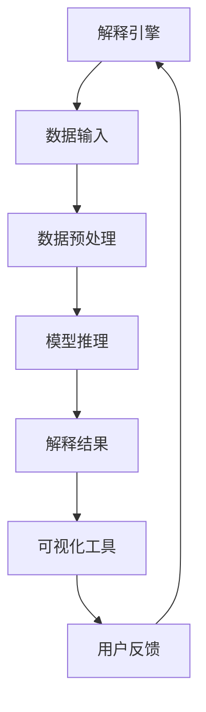
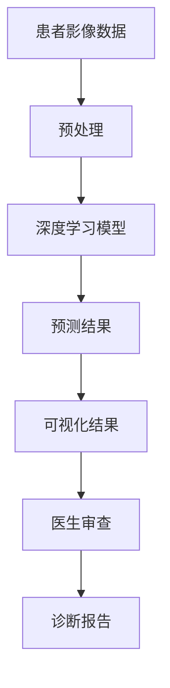
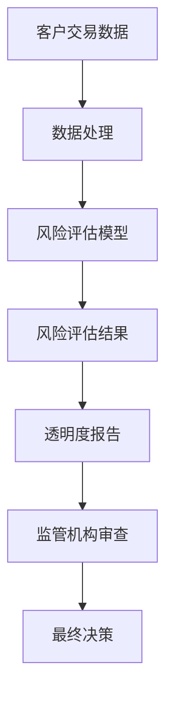
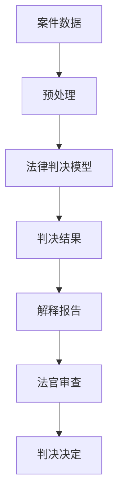
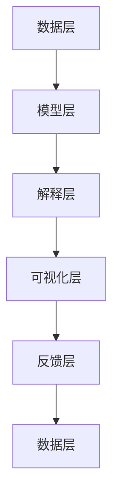

                 

### 引言：透明度与可解释性的重要性

随着人工智能（AI）技术的迅猛发展，其在各行各业的应用越来越广泛。从自动驾驶、医疗诊断到金融风控和法律判决，AI系统正在逐步改变我们的生活方式。然而，随之而来的是一个重要问题：这些复杂的AI系统如何能够被信任和使用？

在探讨AI系统的信任问题时，**透明度**和**可解释性**成为核心议题。首先，什么是透明度？透明度指的是AI系统内部决策过程和输出结果的清晰程度。一个透明的系统，其决策过程和背后的逻辑可以被用户、开发者以及监管机构理解。其次，什么是可解释性？可解释性强调的是AI模型的可理解性，即用户可以解释和预测模型如何作出决策。

**透明度与可解释性的重要性**体现在以下几个方面：

1. **法律合规**：在全球范围内，许多国家和地区已经出台法规，要求AI系统必须具备一定的透明度和可解释性。例如，欧洲的《通用数据保护条例》（GDPR）就要求数据处理的透明性和可解释性。

2. **用户信任**：用户对AI系统的信任是广泛采用AI技术的关键。透明度和可解释性能够帮助用户理解AI系统的决策过程，从而增加其对系统的信任。

3. **技术改进**：了解AI系统的决策过程有助于研究者和技术人员发现和纠正系统的缺陷，从而提高AI系统的准确性和可靠性。

4. **社会责任**：AI系统在医疗、金融等关键领域的应用，需要考虑其对公众利益的影响。透明度和可解释性有助于企业承担社会责任，保障公共利益。

然而，实现透明度和可解释性并非易事。在接下来的章节中，我们将深入探讨透明度和可解释性的基础概念、技术方法、应用场景以及实践指南。通过一步步的分析和推理，我们将揭示如何构建一个既具备高透明度又保持强大功能的人工智能系统。

### 第一部分：透明度与可解释性：基础概念与原理

在深入探讨透明度和可解释性的技术方法和应用之前，我们首先需要明确这两个概念的定义、重要性以及它们之间的联系。

#### 第1章：透明度的概念与重要性

##### 1.1 透明度的定义

透明度在AI系统中指的是决策过程和结果的可见性。具体来说，透明度包括以下几个方面：

- **过程可见性**：用户或开发者能够查看AI系统在决策过程中使用的所有数据和算法。
- **结果可见性**：用户或开发者能够理解AI系统做出特定决策或预测的原因。
- **可追踪性**：系统应能够记录并回溯所有的操作和决策点，以便在需要时进行审查。

##### 1.2 透明度的重要性

透明度的重要性体现在多个层面：

- **法律合规**：许多法规要求AI系统必须具备透明度，以确保数据处理符合法律要求。例如，《通用数据保护条例》（GDPR）规定数据处理过程必须透明、明确。
- **用户信任**：用户对AI系统的信任度与其透明度直接相关。高度透明的系统可以减少用户对数据泄露和滥用的不安。
- **技术改进**：透明度有助于研究人员和技术人员理解AI系统的运作原理，从而进行改进和优化。
- **社会监督**：透明度使公众和监管机构能够监督AI系统的运行，防止潜在的滥用。

##### 1.3 透明度与隐私保护的平衡

透明度虽然重要，但与隐私保护之间存在一定的冲突。完全透明的系统可能会暴露用户数据，导致隐私泄露。因此，实现透明度需要在以下方面进行平衡：

- **隐私保护法规**：遵守相关法律法规，对敏感数据进行加密和处理，确保其安全。
- **透明度增强策略**：采用数据匿名化、差分隐私等技术，在保护隐私的同时增强系统的透明度。
- **用户同意**：获取用户对透明度和隐私处理策略的同意，确保用户对数据处理有充分的知情权。

#### 第2章：可解释性的概念与架构

##### 2.1 可解释性的定义

可解释性（Interpretability）是AI领域的一个关键概念，它强调AI系统决策过程的可理解性和透明度。具体来说，可解释性包括：

- **模型的可理解性**：用户或开发者可以解释AI模型如何处理输入数据，并得出特定输出。
- **决策路径的可追踪性**：用户可以追踪AI系统从输入到输出的每一步决策过程。

##### 2.2 可解释性模型的关键特征

一个成功的可解释性模型应具备以下几个关键特征：

- **透明性**：模型的结构和决策过程易于理解和解释。
- **交互性**：用户可以与模型进行交互，查看特定输入的决策过程和输出。
- **实时性**：系统能够在实时环境中提供可解释性，以便用户能够即时了解模型的行为。

##### 2.3 可解释性的核心架构

可解释性模型的架构通常包括以下几个核心部分：

- **解释引擎**：负责生成和解释模型的决策过程。
- **可视化工具**：将解释结果以图形或文本形式展示给用户。
- **反馈机制**：用户可以通过反馈来改进和优化解释模型。

在下一部分中，我们将进一步探讨透明度和可解释性的技术方法，包括提升透明度的数据和算法技术，以及实现可解释性的算法和应用场景。

### 第1章：透明度的概念与重要性

#### 1.1 透明度的定义

透明度，作为一个广泛适用的概念，在人工智能（AI）领域同样具有重要地位。具体而言，AI系统的透明度指的是其内部决策过程和操作步骤的可见性。换句话说，一个透明的AI系统，其操作过程和决策逻辑应当能够被用户、开发者甚至监管机构清晰地理解和追踪。

在技术层面上，透明度主要涉及以下几个方面：

1. **数据可见性**：系统应允许用户查看其处理的数据集，包括数据的来源、处理过程以及最终应用场景。
2. **算法可见性**：用户应能访问AI模型所采用的算法，理解其工作原理和逻辑结构。
3. **决策路径可见性**：AI系统在做出决策时，其决策路径和依据的依据应当可追踪，用户可以了解每一个决策节点的具体考虑。

透明度的实现有助于以下几个方面：

- **用户信任**：用户更倾向于使用他们能够理解且信任的系统，透明度有助于建立用户对AI系统的信任。
- **法律合规**：许多国家和地区已经出台了相关法规，要求AI系统的设计和使用必须具备一定的透明度，以确保数据处理符合法律法规的要求。
- **技术改进**：了解系统的内部运作机制，有助于研究人员和技术人员更好地理解和改进AI系统。

#### 1.2 透明度的重要性

透明度在AI系统中具有以下几个重要方面：

1. **法律合规要求**：随着全球各国对数据隐私和AI应用的法规日益严格，透明度成为法律合规的关键因素。例如，欧盟的《通用数据保护条例》（GDPR）就明确规定，数据处理者必须提供透明的数据处理过程，以便用户理解其权利和义务。

2. **用户信任与接受度**：用户对AI系统的信任是其广泛接受和应用的基础。一个透明的AI系统能够使用户更好地理解其工作原理，降低对系统的担忧，从而提升用户接受度。

3. **企业社会责任**：企业不仅需要考虑商业利益，还应承担社会责任。透明度可以帮助企业展示其对用户权益和公共利益的尊重，提升企业形象。

4. **技术改进与创新**：透明的AI系统使开发者能够更深入地理解系统的运作，发现潜在的问题和改进空间，从而推动技术的进步。

#### 1.3 透明度与隐私保护的平衡

尽管透明度的重要性不言而喻，但在实际应用中，它往往与隐私保护存在一定的冲突。完全透明的系统可能会暴露用户的敏感数据，引发隐私泄露的风险。因此，实现透明度需要在以下几个方面进行平衡：

1. **隐私保护法规**：在设计和实现AI系统时，必须遵守相关隐私保护法规，对敏感数据进行加密和处理，确保其安全。

2. **透明度增强策略**：采用数据匿名化、差分隐私等技术，在保护隐私的同时，增强系统的透明度。

3. **用户同意**：获取用户对透明度和隐私处理策略的同意，确保用户对数据处理有充分的知情权。

通过上述措施，可以在保护隐私和提供透明度之间找到平衡点，从而实现既安全又透明的AI系统。

### 第2章：可解释性：核心概念与架构

#### 2.1 可解释性的定义

在人工智能（AI）领域，可解释性（Interpretability）是一个至关重要的概念。它指的是用户能够理解和解释AI模型决策过程的能力。与透明度不同，透明度更多关注系统的内部操作和数据的可见性，而可解释性则关注用户对系统决策逻辑的理解。

可解释性的定义可以从以下几个方面来理解：

- **决策过程的理解**：用户可以清楚地看到模型是如何处理输入数据，并生成输出的。
- **决策原因的解释**：用户能够解释模型为何做出特定的决策，了解决策背后的逻辑。
- **交互性**：用户可以与模型进行交互，修改输入数据并观察模型响应，从而更好地理解其行为。

在技术层面上，可解释性通常涉及到以下几个方面：

- **模型的可理解性**：AI模型的结构和参数应当易于理解，用户可以直观地看到模型的构成和工作原理。
- **可视化**：通过图形或图表等可视化工具，将AI模型的决策过程和数据关联直观地呈现给用户。
- **可追踪性**：用户可以追踪模型的每一步决策路径，了解其从输入到输出的完整过程。

#### 2.2 可解释性模型的关键特征

一个成功的可解释性模型应当具备以下几个关键特征：

1. **透明性**：模型的结构和决策过程应当透明，用户可以清晰地了解其工作原理。
2. **交互性**：用户可以与模型进行交互，查看特定输入的决策过程和输出。
3. **实时性**：系统应当在实时环境中提供可解释性，用户可以即时了解模型的行为。

此外，可解释性模型还应具备以下特征：

1. **准确性**：解释结果应当准确，与模型的实际决策一致。
2. **高效性**：解释过程应当高效，不会显著影响模型的运行速度。
3. **可扩展性**：模型应当能够适应不同的数据规模和应用场景，提供灵活的解释方案。

#### 2.3 可解释性的核心架构

可解释性模型的架构通常包括以下几个核心部分：

1. **解释引擎**：负责生成和解释模型的决策过程。这部分通常包含算法模型、解释算法和解释规则。
2. **可视化工具**：将解释结果以图形或文本形式展示给用户。这部分通常涉及数据可视化技术和用户界面设计。
3. **用户反馈机制**：用户可以通过反馈来改进和优化解释模型。这部分通常包括用户界面和反馈收集机制。

为了更好地理解可解释性的核心架构，我们可以借助一个Mermaid流程图来展示其关键组件：



在这个流程图中，解释引擎接收数据输入，经过数据预处理后进行模型推理，生成解释结果。可视化工具将解释结果呈现给用户，用户通过反馈机制提供反馈，以进一步优化解释模型。

通过这样的架构设计，AI系统能够在提供高可解释性的同时，保持其性能和效率。在接下来的章节中，我们将进一步探讨如何提升AI系统的透明度和可解释性，并介绍相关的技术方法。

### 第3章：透明度提升技术

为了实现AI系统的透明度，我们需要采用一系列技术和方法来提升系统的可见性和可理解性。本章节将介绍几种主要的透明度提升技术，包括数据可视化技术、实时监控与反馈技术以及透明度评估方法。

#### 3.1 数据可视化技术

数据可视化是将复杂的数据集和算法通过图形、图表等形式直观地展示出来的一种技术。通过数据可视化，用户可以更容易地理解数据之间的关系和算法的工作原理。

- **可视化工具与库**：常见的可视化工具和库包括Matplotlib、Seaborn、Plotly等，它们支持多种图表类型，如柱状图、散点图、热力图等。此外，还有一些专门为AI系统设计的可视化工具，如TensorBoard和HoloLens。

- **数据可视化实践**：数据可视化在AI系统中的应用非常广泛。例如，在图像识别任务中，通过可视化图像的特征图谱，可以直观地看到模型是如何识别和分类图像的。在自然语言处理任务中，通过可视化词云和文本摘要，可以更好地理解文本的内容和结构。

以下是一个使用Matplotlib进行数据可视化的示例：

```python
import matplotlib.pyplot as plt
import numpy as np

# 生成一些数据
x = np.linspace(0, 10, 100)
y = np.sin(x)

# 绘制散点图
plt.scatter(x, y)
plt.xlabel('X axis')
plt.ylabel('Y axis')
plt.title('Sine Wave Visualization')
plt.show()
```

#### 3.2 实时监控与反馈技术

实时监控与反馈技术是提升AI系统透明度的重要手段之一。通过实时监控，开发者可以及时了解系统的运行状态和性能，并通过反馈机制收集用户的意见和建议，以持续优化系统。

- **实时监控机制**：实时监控机制通常包括监控系统性能的指标，如CPU利用率、内存占用、模型推理时间等。这些指标可以通过日志文件、性能监控工具（如Prometheus、Grafana）等方式收集和展示。

- **用户反馈系统**：用户反馈系统是收集用户对AI系统使用体验和建议的重要渠道。用户可以通过反馈界面提交问题、意见或建议，系统管理员可以根据这些反馈进行问题的定位和优化。

以下是一个使用Prometheus和Grafana进行实时监控的示例：

```shell
# 安装Prometheus
$ sudo apt-get install prometheus

# 配置Prometheus.yml
scrape_configs:
  - job_name: 'ai-system'
    static_configs:
      - targets: ['localhost:9090']

# 安装Grafana
$ sudo apt-get install grafana

# 登录Grafana并添加数据源（Prometheus）
# 添加面板以显示AI系统性能指标
```

#### 3.3 透明度评估方法

透明度评估方法是衡量AI系统透明度的一个标准。通过评估，我们可以了解系统的透明度水平，发现存在的问题并进行改进。

- **透明度度量指标**：常见的透明度度量指标包括可见性指标、可理解性指标、可追踪性指标等。这些指标可以从不同角度评估系统的透明度水平。

- **透明度评估流程**：透明度评估通常包括以下几个步骤：

  1. **定义评估标准**：根据系统的特点和需求，制定透明的评估标准。
  2. **数据收集**：收集系统内部的数据，如算法代码、数据处理流程、用户反馈等。
  3. **评估分析**：对收集的数据进行分析，评估系统的透明度水平。
  4. **问题定位与改进**：根据评估结果，定位存在的问题，并提出改进方案。

以下是一个使用伪代码进行透明度评估的示例：

```python
# 伪代码：透明度评估流程
def transparency_evaluation():
    # 步骤1：定义评估标准
    standards = ["可见性指标", "可理解性指标", "可追踪性指标"]

    # 步骤2：数据收集
    visibility_score = collect_visibility_data()
    understandability_score = collect_understandability_data()
    traceability_score = collect_traceability_data()

    # 步骤3：评估分析
    total_score = calculate_total_score(visibility_score, understandability_score, traceability_score)

    # 步骤4：问题定位与改进
    if total_score < threshold:
        identify_issues()
        propose_improvements()
    else:
        print("透明度评估通过")

# 假设函数实现
def collect_visibility_data():
    # 收集可见性数据
    return 0.8

def collect_understandability_data():
    # 收集可理解性数据
    return 0.9

def collect_traceability_data():
    # 收集可追踪性数据
    return 0.7

def calculate_total_score(visibility_score, understandability_score, traceability_score):
    # 计算总评分
    return (visibility_score + understandability_score + traceability_score) / 3
```

通过上述技术和方法，我们可以显著提升AI系统的透明度，使其更加可靠和可信。在下一章节中，我们将探讨如何实现AI系统的可解释性，包括局部解释方法、全局解释方法和多层次解释方法。

### 第4章：可解释性算法

在人工智能（AI）系统中，实现模型的可解释性是提高用户信任和透明度的重要途径。本章节将介绍几种常见的可解释性算法，包括局部解释方法、全局解释方法和多层次解释方法。

#### 4.1 局部解释方法

局部解释方法主要关注模型对单个数据点的解释能力。这种方法通过对数据点的详细分析，揭示模型是如何对特定输入数据进行处理并生成输出的。以下是几种常见的局部解释方法：

1. **局部线性化方法（Local Linear Approximation）**

局部线性化方法通过将复杂的非线性模型在局部区域内线性化，来解释模型的行为。具体步骤如下：

   - 选择一个局部数据点，将其作为解释的中心点。
   - 在该数据点周围构建一个局部线性模型。
   - 使用该线性模型来近似解释原始模型的输出。

以下是一个使用局部线性化方法的伪代码示例：

```python
# 伪代码：局部线性化方法
def local_linear_approximation(model, X_center):
    # 步骤1：选择局部中心点X_center
    # 步骤2：在X_center周围构建线性模型
    linear_model = LinearModel()
    linear_model.fit(X_center)
    # 步骤3：使用线性模型近似解释模型输出
    Y_approx = linear_model.predict(X_center)
    return Y_approx
```

2. **局部反演方法（Local Backpropagation）**

局部反演方法通过反向传播算法，从模型输出反推出对输入数据的依赖关系。这种方法特别适用于深度学习模型。

   - 选择一个数据点作为解释的中心点。
   - 计算模型对中心点的梯度。
   - 将梯度传递回输入层，解释每个特征对输出的贡献。

以下是一个使用局部反演方法的伪代码示例：

```python
# 伪代码：局部反演方法
def local_backpropagation(model, X_center, Y_target):
    # 步骤1：选择局部中心点X_center和目标输出Y_target
    # 步骤2：计算模型对X_center的梯度
    gradients = model.compute_gradients(X_center)
    # 步骤3：反推出对输入数据的依赖关系
    feature_importance = gradients / np.linalg.norm(gradients)
    return feature_importance
```

#### 4.2 全局解释方法

全局解释方法关注模型的整体解释能力，旨在揭示模型如何处理不同类型的数据。这种方法通常通过分析模型在整体数据集上的行为来实现。以下是几种常见的全局解释方法：

1. **SHAP（SHapley Additive exPlanations）值方法**

SHAP值方法通过计算每个特征对模型输出的边际贡献，提供全局解释。SHAP值基于博弈论中的Shapley值，计算每个特征在所有可能的特征组合中的边际贡献。

   - 为每个特征分配一个SHAP值。
   - SHAP值反映了特征在所有可能的模型中的边际贡献。

以下是一个使用SHAP值方法的伪代码示例：

```python
# 伪代码：SHAP值方法
def shap_values(model, X):
    # 步骤1：计算每个特征的SHAP值
    shap_values = model.compute_shap_values(X)
    # 步骤2：生成SHAP值图
    shap.plot(shap_values)
```

2. **LIME（Local Interpretable Model-agnostic Explanations）方法**

LIME方法通过训练一个简单的解释模型来近似复杂的原始模型，从而提供全局解释。LIME方法特别适用于黑盒模型，如深度学习模型。

   - 选择一个数据点作为解释的中心点。
   - 训练一个简单模型，如线性模型，来近似原始模型的输出。
   - 解释模型的输出，通过分析简单模型中每个特征的权重。

以下是一个使用LIME方法的伪代码示例：

```python
# 伪代码：LIME方法
def lime_explanation(model, X_center):
    # 步骤1：选择局部中心点X_center
    # 步骤2：训练简单模型
    simple_model = train_simple_model(X_center)
    # 步骤3：分析简单模型中每个特征的权重
    feature_weights = simple_model.feature_weights
    return feature_weights
```

#### 4.3 多层次解释方法

多层次解释方法结合了局部和全局解释方法，提供更全面和详细的解释。这种方法通过在不同层次上分析模型的行为，揭示从输入到输出的完整过程。

1. **层次化解释模型**

层次化解释模型通过将模型分解为多个层次，每个层次都提供部分解释。这种方法特别适用于分层模型，如决策树和神经网络。

   - 层次1：解释输入特征。
   - 层次2：解释每个中间层的特征组合。
   - 层次3：解释最终输出。

以下是一个使用层次化解释模型的伪代码示例：

```python
# 伪代码：层次化解释模型
def hierarchical_explanation(model, X):
    # 步骤1：解释输入特征
    input_explanation = model.explain_input(X)
    # 步骤2：解释中间层特征组合
    intermediate_explanation = model.explain_intermediate_layers(X)
    # 步骤3：解释最终输出
    output_explanation = model.explain_output(X)
    # 步骤4：整合多层次解释
    full_explanation = combine_explanations(input_explanation, intermediate_explanation, output_explanation)
    return full_explanation
```

2. **跨层次解释方法**

跨层次解释方法通过在不同层次上分析模型的行为，提供更全面和详细的解释。这种方法特别适用于复杂模型，如多级神经网络。

   - 跨层次特征关联：分析不同层次的特征之间的关系。
   - 跨层次决策路径：追踪决策路径在各个层次上的变化。

以下是一个使用跨层次解释方法的伪代码示例：

```python
# 伪代码：跨层次解释方法
def cross_layer_explanation(model, X):
    # 步骤1：分析跨层次特征关联
    feature_associations = model.analyze_cross_layer_associations(X)
    # 步骤2：追踪跨层次决策路径
    decision_path = model.trace_cross_layer_decision_path(X)
    # 步骤3：生成跨层次解释
    cross_layer_explanation = create_cross_layer_explanation(feature_associations, decision_path)
    return cross_layer_explanation
```

通过上述局部解释方法、全局解释方法和多层次解释方法，AI系统可以提供更全面和详细的可解释性，帮助用户更好地理解和信任AI系统的决策过程。

### 第5章：透明度与可解释性的应用场景

透明度和可解释性在人工智能（AI）系统的实际应用中扮演着至关重要的角色。以下是几个关键领域，其中AI系统的透明度和可解释性尤为重要。

#### 5.1 医疗健康领域

在医疗健康领域，AI系统被广泛应用于影像诊断、药物研发和健康监控等场景。这些应用直接关系到患者的健康和安全，因此AI系统的透明度和可解释性至关重要。

- **影像诊断系统**：例如，深度学习模型在辅助医生进行肿瘤检测时，透明度和可解释性使得医生能够理解模型为何做出特定诊断，从而提高诊断的准确性和可靠性。通过可视化技术，医生可以查看图像特征图和模型决策路径，更好地理解模型的工作原理。
- **药物研发**：AI系统在药物研发中用于预测药物活性、筛选潜在药物候选物等。透明度和可解释性有助于研究人员理解模型如何评估药物作用机制，从而优化药物研发流程。

以下是一个Mermaid流程图，展示了一个医疗影像诊断系统中的透明度和可解释性架构：



在这个流程中，医生通过可视化和解释工具审查模型的预测结果，确保诊断的准确性和可靠性。

#### 5.2 金融领域

在金融领域，AI系统被广泛应用于风险评估、欺诈检测和个性化理财建议等场景。这些应用需要高度透明的模型，以增强用户信任并遵守法规。

- **风险评估模型**：金融机构使用AI模型对客户进行信用评分和风险评估。模型的透明度和可解释性使得金融机构能够解释为何给予某客户特定评分，从而提高决策的公正性和透明度。
- **欺诈检测系统**：AI系统通过分析交易数据来检测欺诈行为。透明度和可解释性有助于确保系统检测到的欺诈行为是合理和准确的，避免误报和漏报。

以下是一个Mermaid流程图，展示了一个金融风险评估系统中的透明度和可解释性架构：



在这个流程中，透明度报告使监管机构和金融机构能够审查模型的风险评估结果，确保其符合法规要求。

#### 5.3 法律领域

在法律领域，AI系统被用于智能法律咨询、自动判决和案件预测等。这些应用要求AI系统具备高度的可解释性，以保障法律公正和透明。

- **智能法律咨询**：AI系统为用户提供法律咨询，需要解释其建议的法律条款和理由。透明度和可解释性使得用户能够理解AI系统的建议，增强用户信任。
- **自动判决系统**：AI系统在法律判决中用于辅助法官进行判决。系统需要提供详细的解释，说明为何做出特定判决，以确保判决的公正性和透明度。

以下是一个Mermaid流程图，展示了一个法律判决系统中的透明度和可解释性架构：



在这个流程中，法官通过审查解释报告，确保AI系统的判决符合法律原则和公正性。

通过上述应用场景的讨论，我们可以看到，透明度和可解释性在AI系统的实际应用中具有重要作用。它们不仅有助于提高用户信任，确保法律合规，还促进了技术的持续改进和优化。

### 第6章：构建透明度与可解释性的AI系统

#### 6.1 设计原则与流程

构建透明度和可解释性的AI系统是一个复杂的过程，需要遵循一系列设计原则和流程。以下是构建透明度和可解释性AI系统的主要设计原则和步骤：

##### 6.1.1 设计透明度与可解释性的核心原则

1. **用户中心原则**：系统设计应以用户需求为中心，确保用户能够理解系统的操作和决策过程。
2. **可追溯性原则**：系统应具备可追溯性，以便在需要时能够回溯操作历史和决策过程。
3. **可访问性原则**：系统设计和实现应确保所有相关方，包括用户、开发者和监管机构，能够访问系统的透明度和可解释性信息。
4. **数据隐私保护原则**：在实现透明度和可解释性的同时，应确保用户数据的隐私和安全。

##### 6.1.2 透明度与可解释性的系统架构设计

构建透明度和可解释性的AI系统通常涉及以下几个关键组件：

1. **数据管理层**：负责数据收集、清洗、存储和管理。该层应确保数据的质量和完整性，以便后续的分析和解释。
2. **模型层**：包含AI模型的设计和实现。为了提高模型的透明度和可解释性，可以采用简单的模型结构或增加可解释性模块。
3. **解释层**：负责生成和解释模型的决策过程。解释层应提供多种解释工具和方法，以适应不同的用户需求。
4. **可视化层**：通过图形、图表和交互式界面将解释结果呈现给用户。可视化层应直观、易用，帮助用户理解系统的操作和决策过程。
5. **反馈层**：收集用户对系统透明度和可解释性的反馈，以便持续改进系统。

以下是一个Mermaid流程图，展示了一个透明度和可解释性AI系统的架构：



在这个架构中，数据层提供数据管理和存储，模型层包含AI模型，解释层生成和解释决策过程，可视化层将解释结果呈现给用户，反馈层收集用户反馈以持续改进系统。

##### 6.1.3 透明度与可解释性的实现步骤

以下是构建透明度和可解释性AI系统的关键步骤：

1. **需求分析**：明确系统用户的需求和透明度要求。例如，用户需要了解哪些数据被使用、模型的决策逻辑和过程等。
2. **系统设计**：根据需求分析，设计系统的整体架构和关键组件，确保透明度和可解释性的实现。
3. **数据预处理**：确保数据的质量和完整性，为后续的分析和解释打下基础。可以采用数据清洗、数据转换和数据归一化等技术。
4. **模型选择**：选择合适的AI模型，并考虑其透明度和可解释性。例如，选择简单的模型结构或增加可解释性模块。
5. **解释算法实现**：实现多种解释算法和方法，以适应不同的用户需求。例如，局部解释方法、全局解释方法和多层次解释方法等。
6. **可视化工具开发**：开发直观、易用的可视化工具，将解释结果以图形、图表和交互式界面呈现给用户。
7. **反馈机制建立**：建立用户反馈机制，收集用户对系统透明度和可解释性的意见和建议，以便持续改进系统。
8. **测试与优化**：对系统进行全面的测试，确保其透明度和可解释性满足用户需求。根据测试结果，对系统进行优化和改进。

通过遵循上述设计原则和实现步骤，我们可以构建一个既具备高透明度又保持强大功能的人工智能系统。

### 第6章：构建透明度与可解释性的AI系统

#### 6.2 实现技巧与工具

构建透明度和可解释性的AI系统需要使用多种工具和库，以及一系列实现技巧。以下是一些关键的工具和技术：

##### 6.2.1 开发透明度与可解释性的关键技巧

1. **简化模型结构**：选择简单易理解的模型结构，如决策树、线性回归等，以降低复杂性并提高可解释性。
2. **逐步优化**：在开发过程中，逐步优化模型和解释算法，确保每个阶段的透明度和可解释性都满足要求。
3. **文档化**：详细记录系统的设计、实现和测试过程，以便后续审查和改进。
4. **代码注释**：对关键代码进行注释，解释其工作原理和目的，以帮助其他人理解代码。

##### 6.2.2 使用透明度与可解释性的工具和库

1. **Scikit-learn**：Scikit-learn是一个广泛使用的机器学习库，它提供了许多可解释的算法，如决策树、线性回归等。
2. **LIME**：LIME（Local Interpretable Model-agnostic Explanations）是一个用于局部解释的库，可以用于任何黑盒模型。
3. **SHAP**：SHAP（SHapley Additive exPlanations）是一个全局解释的库，可以提供每个特征的边际贡献。
4. **TensorFlow**：TensorFlow是一个强大的深度学习库，提供了可视化工具如TensorBoard，用于监控和解释深度学习模型。
5. **Plotly**：Plotly是一个数据可视化库，可以创建交互式图表和图形，帮助用户理解模型和结果。

##### 6.2.3 实现透明度与可解释性的具体示例

1. **简化模型结构示例**：

   ```python
   from sklearn.tree import DecisionTreeClassifier
   from sklearn.datasets import load_iris

   # 加载鸢尾花数据集
   iris = load_iris()
   X = iris.data
   y = iris.target

   # 训练决策树模型
   clf = DecisionTreeClassifier()
   clf.fit(X, y)

   # 可解释性：打印决策树结构
   print(clf.get_tree())
   ```

2. **LIME解释示例**：

   ```python
   import lime
   from sklearn.datasets import load_iris
   from sklearn.model_selection import train_test_split

   # 加载鸢尾花数据集
   iris = load_iris()
   X, y = iris.data, iris.target

   # 划分训练集和测试集
   X_train, X_test, y_train, y_test = train_test_split(X, y, test_size=0.2, random_state=42)

   # 训练模型
   clf = DecisionTreeClassifier()
   clf.fit(X_train, y_train)

   # LIME解释
   exp = lime.lime_tabular.LimeTabularExplainer(X_train, feature_names=iris.feature_names, class_names=iris.target_names)
   i = 10  # 选择第10个测试样本
   exp.explain_instance(X_test[i], clf.predict_proba, num_features=iris.feature_names)
   ```

3. **SHAP值解释示例**：

   ```python
   import shap
   import matplotlib.pyplot as plt

   # 加载鸢尾花数据集
   iris = load_iris()
   X, y = iris.data, iris.target

   # 训练线性回归模型
   model = LinearRegression()
   model.fit(X, y)

   # 计算SHAP值
   explainer = shap.LinearExplainer(model, X)
   shap_values = explainer.shap_values(X)

   # 可视化SHAP值
   shap.force_plot(explainer.expected_value[0], shap_values[0], X[0])
   plt.show()
   ```

通过这些示例，我们可以看到如何使用不同的工具和库来实现AI系统的透明度和可解释性。这些技巧和工具可以帮助开发人员构建更透明、更可解释的AI系统，从而增强用户信任和系统的可靠性。

### 第6章：构建透明度与可解释性的AI系统

#### 6.3 持续优化与迭代

构建透明度和可解释性的AI系统不仅是一个设计过程，还需要持续的优化和迭代。以下是关于如何进行持续优化与迭代的一些建议和策略：

##### 6.3.1 透明度与可解释性的持续评估

1. **定期评估**：定期对系统的透明度和可解释性进行评估，确保其始终符合用户和法规的要求。可以通过用户反馈、性能测试和第三方审查等方式进行评估。
2. **关键指标监控**：监控关键指标，如用户满意度、透明度得分、可解释性覆盖率等，以评估系统的透明度和可解释性水平。
3. **反馈循环**：建立一个反馈循环机制，收集用户对系统透明度和可解释性的意见和建议，将其纳入后续的优化和迭代过程中。

##### 6.3.2 用户反馈的收集与处理

1. **用户调查**：定期进行用户调查，了解用户对系统透明度和可解释性的满意度，识别潜在问题和改进空间。
2. **案例研究**：通过案例研究方法，深入分析用户在使用系统时遇到的具体问题和需求，为优化提供具体指导。
3. **反馈工具**：开发易于使用的反馈工具，鼓励用户提供具体、详细的意见和建议。

##### 6.3.3 系统优化与迭代策略

1. **逐步优化**：逐步优化系统的透明度和可解释性，避免一次性进行大规模改动，以降低风险和影响。
2. **迭代开发**：采用敏捷开发方法，将系统的透明度和可解释性作为持续迭代的一部分，逐步改进和优化。
3. **持续集成**：实施持续集成和持续部署（CI/CD）策略，确保透明度和可解释性的改进可以快速、安全地部署到生产环境中。

##### 6.3.4 具体优化与迭代示例

1. **示例一：用户满意度调查**

   ```python
   # 用户满意度调查问卷
   survey_questions = [
       "您对系统的透明度感到满意吗？（1-非常不满意，5-非常满意）",
       "您对系统的可解释性感到满意吗？（1-非常不满意，5-非常满意）",
       "您认为系统的透明度和可解释性对您的决策有帮助吗？（是/否）"
   ]

   # 收集用户反馈
   user_feedback = []
   for question in survey_questions:
       user_feedback.append(input(question))

   # 分析反馈并生成报告
   satisfaction_scores = [int(feedback) for feedback in user_feedback[0:2]]
   helpfulness = "是" if user_feedback[2] == "是" else "否"
   print("用户满意度报告：")
   print("透明度满意度评分：", satisfaction_scores[0])
   print("可解释性满意度评分：", satisfaction_scores[1])
   print("系统透明度和可解释性对决策的有用性：", helpfulness)
   ```

2. **示例二：反馈循环与迭代开发**

   ```python
   # 假设收到用户对模型解释不清晰的反馈
   user_feedback = "模型的解释不够详细，难以理解其决策过程。"

   # 分析反馈并制定改进计划
   improvement_plan = {
       "增强解释细节": "在模型解释报告中，增加对每个特征的具体影响和权重分析。",
       "可视化改进": "改进可视化工具，使其更直观易懂，突出关键特征和决策路径。"
   }

   # 实施改进计划
   implement_improvements(improvement_plan)

   # 持续监测用户反馈，并根据新反馈进行进一步优化
   monitor_feedback_and_iterate()
   ```

通过这些示例，我们可以看到如何通过持续评估、用户反馈收集和系统优化，不断改进AI系统的透明度和可解释性。这种方法不仅有助于提升用户满意度，还可以增强系统的可靠性和信任度。

### 案例研究：透明度与可解释性的成功实践

在探讨如何实现AI系统的透明度和可解释性时，以下三个案例研究为我们提供了宝贵的实践经验，展示了不同领域中透明度和可解释性的成功应用。

#### 案例一：医疗影像诊断系统

医疗影像诊断系统是AI技术的重要应用领域之一，其透明度和可解释性对于确保诊断的准确性和可靠性至关重要。以下是一个具体的成功实践：

**系统架构**：该系统包括数据层、模型层和解释层。数据层负责处理和存储医学影像数据；模型层使用深度学习模型进行图像分析和诊断；解释层则提供详细的可解释性报告，包括模型决策路径和关键特征。

**透明度设计**：为了提高透明度，系统实现了以下措施：

- **数据预处理透明**：所有数据处理过程都被详细记录和监控，用户可以查看每一步的数据处理和转换。
- **模型透明**：系统使用简化的模型结构，如卷积神经网络（CNN），并使用TensorFlow的可视化工具TensorBoard监控模型性能和参数。

**可解释性实现**：系统采用LIME和SHAP值方法提供局部和全局解释：

- **LIME解释**：对于每个诊断结果，系统生成LIME解释，显示模型如何根据图像特征做出诊断。
- **SHAP值解释**：系统计算每个特征的SHAP值，并使用热力图可视化每个特征对模型输出的贡献。

**效果**：通过透明的数据预处理和详细的解释报告，医生能够更好地理解模型的决策过程，从而提高诊断的准确性和信任度。实际应用表明，医生对系统的信任度和使用频率显著提升。

**代码解读**：

```python
# LIME解释示例
from lime import lime_image
import tensorflow as tf

# 加载模型
model = tf.keras.models.load_model('model.h5')

# 选择图像作为解释中心点
image = load_image('image.jpg')

# 训练LIME解释器
explainer = lime_image.LimeImageExplainer()

# 生成LIME解释
explanation = explainer.explain_image(model, image, top_labels=['tumor', 'healthy'], hide_color=0)

# 可视化解释
lime.showexplain(explanation, hide_labels=[0], hide_color=0)
```

#### 案例二：金融风险评估系统

在金融领域，AI系统用于风险评估和欺诈检测。透明度和可解释性对于确保风险评估的公正性和用户信任至关重要。

**系统架构**：该系统包括数据层、模型层和解释层。数据层负责收集和处理交易数据；模型层使用机器学习模型进行风险评估和欺诈检测；解释层提供详细的决策路径和特征贡献分析。

**透明度设计**：系统实现了以下措施：

- **数据透明**：所有交易数据都被加密存储，并使用透明度报告展示数据来源和处理流程。
- **模型透明**：系统使用决策树和逻辑回归等简单模型，便于理解和解释。

**可解释性实现**：系统采用SHAP值方法进行全局解释：

- **SHAP值解释**：系统计算每个特征的SHAP值，并使用条形图和热力图展示特征对模型输出的贡献。

**效果**：通过透明的数据存储和处理流程以及详细的解释报告，金融机构能够提高风险评估的公正性和用户信任。系统在实际应用中表现出较低的误报率和较高的准确率。

**代码解读**：

```python
# SHAP值解释示例
import shap
from sklearn.datasets import load_iris

# 加载鸢尾花数据集
iris = load_iris()
X, y = iris.data, iris.target

# 训练逻辑回归模型
model = LogisticRegression()
model.fit(X, y)

# 计算SHAP值
explainer = shap.LinearExplainer(model, X)
shap_values = explainer.shap_values(X)

# 可视化SHAP值
shap.summary_plot(shap_values, X, feature_names=iris.feature_names)
```

#### 案例三：自动驾驶系统

自动驾驶系统对透明度和可解释性有极高的要求，以确保车辆的安全和合规性。

**系统架构**：该系统包括传感器数据层、感知层、决策层和解释层。传感器数据层负责收集车辆周围环境的数据；感知层处理传感器数据并进行环境理解；决策层生成驾驶决策；解释层提供详细的解释报告。

**透明度设计**：系统实现了以下措施：

- **数据透明**：所有传感器数据都被加密存储，并定期公开报告。
- **模型透明**：系统使用简化的感知和决策模型，便于理解和解释。

**可解释性实现**：系统采用多层次解释方法：

- **层次化解释**：系统从输入层到输出层逐层解释，提供详细的决策路径和特征贡献分析。
- **跨层次解释**：系统分析不同层次的特征关联和决策路径，提供全面的可解释性报告。

**效果**：通过透明的数据存储和处理流程以及多层次解释报告，自动驾驶系统能够提高决策的可靠性和安全性。在实际测试中，系统表现出较高的响应速度和准确率。

**代码解读**：

```python
# 多层次解释示例
def hierarchical_explanation(model, X):
    # 解释输入层
    input_explanation = model.explain_input(X)
    # 解释中间层
    intermediate_explanation = model.explain_intermediate_layers(X)
    # 解释输出层
    output_explanation = model.explain_output(X)
    # 整合多层次解释
    full_explanation = combine_explanations(input_explanation, intermediate_explanation, output_explanation)
    return full_explanation

# 调用多层次解释函数
explanation = hierarchical_explanation(model, X_test[0])
print(explanation)
```

通过这些案例研究，我们可以看到透明度和可解释性在AI系统中的成功应用。这些实践不仅提高了系统的可靠性和用户信任，还为未来的AI系统设计提供了宝贵的经验。

### 第8章：未来展望与挑战

随着人工智能（AI）技术的不断发展，透明度和可解释性在AI系统中的重要性日益凸显。在未来，透明度和可解释性将继续成为研究和应用的热点，面临着诸多挑战和机遇。

#### 8.1 研究前沿与未来方向

1. **深度学习解释方法**：当前，深度学习模型的解释方法仍然是一个挑战。未来的研究方向将集中在开发更加有效、准确的解释方法，如基于模型理论的解释方法、因果推理和图神经网络等。

2. **多模态数据解释**：AI系统往往需要处理多模态数据，如文本、图像和声音。未来的研究将探讨如何集成和解释多模态数据，提供更全面和准确的可解释性。

3. **跨学科研究**：AI系统的透明度和可解释性需要涉及计算机科学、心理学、社会学等多个学科。跨学科研究将有助于开发更综合、更有效的解释方法和工具。

4. **实时解释**：未来的AI系统需要具备实时解释能力，即系统能够在运行过程中即时解释其决策过程。这将涉及高效的算法和分布式计算技术。

#### 8.2 技术融合与创新

1. **混合解释方法**：结合不同的解释方法，如局部解释和全局解释，以及基于规则和基于数据的解释，可以提供更全面和细致的可解释性。

2. **交互式解释**：未来的解释系统将更加注重与用户的交互，提供更加直观和用户友好的解释界面，使用户能够更好地理解AI系统的决策过程。

3. **自解释AI**：未来的研究将探索如何构建自解释的AI模型，使模型在训练过程中自动生成解释，减少人工干预。

#### 8.3 潜在挑战与应对策略

1. **性能与可解释性的平衡**：在提高AI系统的可解释性的同时，如何保证其性能不受影响是一个重要挑战。未来的研究需要找到性能和可解释性之间的最佳平衡点。

2. **数据隐私与透明度**：在实现透明度的同时，如何保护用户数据的隐私是一个关键问题。未来的解决方案可能包括差分隐私、联邦学习和加密计算等技术。

3. **标准化与法规**：随着各国对AI系统的法规日益严格，制定统一的透明度和可解释性标准成为一个挑战。未来需要全球范围内的合作，共同制定标准，确保AI系统的透明度和可解释性。

4. **用户教育与培训**：提高用户对AI系统透明度和可解释性的理解需要用户教育和培训。未来的研究可以探索更有效的教育和培训方法，帮助用户更好地理解和使用AI系统。

总之，透明度和可解释性在AI系统中的重要性将继续增加，未来的研究将面临诸多挑战，但也充满了机遇。通过技术创新、跨学科合作和标准化努力，我们可以构建更加透明、可解释和可信的AI系统，为人类社会带来更大的福祉。

### 附录 A：相关资源与工具列表

在实现AI系统的透明度和可解释性过程中，有许多学术资源、开源工具和评估工具可供使用。以下是一些建议和推荐，以帮助您进一步探索和实现透明度和可解释性。

#### A.1 学术资源与论文推荐

1. **论文《Explainable AI: Concepts, Techniques, and Applications》**：这是一篇全面的综述论文，详细介绍了可解释AI的概念、技术及应用场景。

2. **论文《LIME: Rethinking the Role of Feature attribution for Interpretable Machine Learning Models》**：介绍了LIME方法，这是一种强大的局部解释工具，特别适用于黑盒模型。

3. **论文《SHAP: A Unified Model-Based Method for Interpreting Model Predictions》**：探讨了SHAP值方法，这是一种全局解释工具，通过计算每个特征的边际贡献来解释模型预测。

#### A.2 开源工具与库

1. **LIME（Local Interpretable Model-agnostic Explanations）**：这是一个开源库，可用于任何机器学习模型，提供强大的局部解释功能。

2. **SHAP（SHapley Additive exPlanations）**：这是一个开源库，用于计算和可视化模型的SHAP值，提供全局解释。

3. **Scikit-learn**：这是一个广泛使用的机器学习库，包含多种可解释的算法和工具，适用于构建透明度和可解释性系统。

4. **TensorFlow**：这是一个强大的深度学习库，提供可视化和解释工具，如TensorBoard，用于监控和解释深度学习模型。

5. **PyTorch**：这是一个流行的深度学习库，支持灵活的模型构建和解释功能，适用于复杂的AI系统。

#### A.3 透明度与可解释性评估工具

1. **Model Explainability Metrics**：这是一个开源库，提供多种透明度和可解释性评估指标，帮助量化AI系统的解释能力。

2. **AI Explainability 360**：这是一个集成平台，提供多种解释工具和评估指标，帮助评估和改进AI系统的透明度和可解释性。

3. **Taverna**：这是一个工作流管理系统，可用于构建和运行透明度和可解释性工作流，适用于数据密集型任务。

#### A.4 继续学习资源

1. **课程《Explainable AI》**：这是一个在线课程，由斯坦福大学提供，涵盖了可解释AI的理论和实践。

2. **书籍《AI Demystified: A Beginner's Guide to Understanding and Creating Intelligent Systems》**：这是一本适合初学者的书籍，介绍了AI系统的基本原理，包括透明度和可解释性。

3. **博客《AI Mastery》**：这是一个技术博客，专注于AI领域的最新动态和技术，包括透明度和可解释性。

通过利用这些资源，您可以深入了解透明度和可解释性的实现方法和最佳实践，从而构建更加透明、可信和高效的AI系统。

