                 

# 《量化交易策略平台：金融科技创业的新领域》

## 关键词

量化交易、金融科技、策略平台、算法、风险管理、创业

## 摘要

本文深入探讨了量化交易策略平台在金融科技创业领域的重要性。首先，我们介绍了量化交易的基本概念、历史背景以及它在金融市场中的应用。接着，我们分析了金融科技的基础知识，包括人工智能与大数据在金融科技中的应用。随后，文章详细阐述了量化交易策略平台的设计原则、数据处理、策略开发与风险管理。通过案例研究，我们展示了不同类型的量化交易策略及其应用。最后，文章讨论了量化交易策略平台创业的实战经验、市场与法规，并展望了未来的发展方向。

## 目录大纲

### 第一部分：量化交易与金融科技

#### 第1章：量化交易概述

##### 1.1 量化交易的定义与历史

##### 1.2 量化交易的优势与挑战

##### 1.3 量化交易的发展趋势

#### 第2章：金融科技基础

##### 2.1 金融科技的概念与分类

##### 2.2 人工智能与大数据在金融科技中的应用

##### 2.3 金融科技创业的机遇与风险

### 第二部分：量化交易策略平台设计

#### 第3章：量化交易策略平台架构

##### 3.1 平台架构设计原则

##### 3.2 数据处理与存储

##### 3.3 策略开发与回测

##### 3.4 策略执行与风险管理

#### 第4章：策略平台的核心算法

##### 4.1 预测算法

###### 4.1.1 时间序列分析

###### 4.1.2 统计学习

###### 4.1.3 深度学习

##### 4.2 优化算法

###### 4.2.1 粒子群优化

###### 4.2.2 模拟退火算法

###### 4.2.3 遗传算法

#### 第5章：量化交易策略开发流程

##### 5.1 策略开发步骤

##### 5.2 策略评估与优化

##### 5.3 策略部署与监控

#### 第6章：量化交易策略案例研究

##### 6.1 案例一：趋势跟踪策略

##### 6.2 案例二：均值回归策略

##### 6.3 案例三：事件驱动策略

#### 第7章：量化交易策略平台的风险管理

##### 7.1 风险识别与度量

##### 7.2 风险控制策略

##### 7.3 风险管理流程

### 第三部分：金融科技创业实战

#### 第8章：量化交易策略平台创业案例分析

##### 8.1 案例一：创业公司的量化交易策略平台建设

##### 8.2 案例二：量化交易策略平台的商业模式探索

##### 8.3 案例三：量化交易策略平台的用户增长与变现

#### 第9章：量化交易策略平台的市场与法规

##### 9.1 量化交易策略平台的市场现状

##### 9.2 量化交易策略平台的法规与合规

##### 9.3 未来市场趋势与挑战

#### 第10章：量化交易策略平台的发展方向

##### 10.1 区块链与量化交易

##### 10.2 量化交易与机器学习新进展

##### 10.3 量化交易策略平台的未来展望

## 附录

### 附录A：量化交易策略平台开发工具

##### A.1 Python量化交易库介绍

###### A.1.1 Pandas

###### A.1.2 NumPy

###### A.1.3 Matplotlib

##### A.2 量化交易平台框架

###### A.2.1 Alpha Vantage

###### A.2.2 TA-Lib

###### A.2.3 PyAlgoTrade

### 附录B：量化交易策略回测报告模板

### 附录C：量化交易策略平台开发流程图

### 附录D：量化交易策略相关书籍与论文推荐

### 第一部分：量化交易与金融科技

#### 第1章：量化交易概述

##### 1.1 量化交易的定义与历史

量化交易，顾名思义，是一种基于数学模型和统计方法的交易方式。它通过使用计算机算法来分析历史数据和实时数据，从而预测市场走势，并自动执行交易。量化交易的历史可以追溯到20世纪70年代，当时一些数学家和计算机科学家开始尝试将数学模型应用于金融市场。

**核心概念与联系**

量化交易的核心概念包括数学模型、历史数据分析、实时数据分析和交易策略。这些概念相互联系，共同构成了量化交易的基础。数学模型用于捕捉市场走势，历史数据分析用于验证模型的可靠性，实时数据分析用于预测市场走势，交易策略则将预测结果转化为具体的交易操作。

**Mermaid流程图**

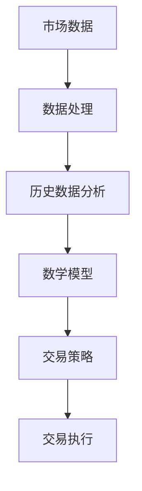

**核心算法原理讲解**

在量化交易中，常用的核心算法包括时间序列分析、统计学习和机器学习。时间序列分析用于分析历史数据，统计学习用于构建预测模型，机器学习则用于优化模型和提高预测精度。

时间序列分析：
```python
import pandas as pd
import numpy as np
from statsmodels.tsa.arima_model import ARIMA

# 加载数据
data = pd.read_csv('stock_price.csv')
close_prices = data['Close']

# 构建ARIMA模型
model = ARIMA(close_prices, order=(5,1,2))
model_fit = model.fit()

# 预测
forecast = model_fit.forecast(steps=5)
print(forecast)
```

统计学习：
```python
from sklearn.linear_model import LinearRegression
import pandas as pd
import numpy as np

# 加载数据
data = pd.read_csv('stock_data.csv')
X = data[['Open', 'High', 'Low', 'Volume']]
y = data['Close']

# 构建线性回归模型
model = LinearRegression()
model.fit(X, y)

# 预测
prediction = model.predict(X)
print(prediction)
```

机器学习：
```python
from sklearn.ensemble import RandomForestRegressor
import pandas as pd
import numpy as np

# 加载数据
data = pd.read_csv('stock_data.csv')
X = data[['Open', 'High', 'Low', 'Volume']]
y = data['Close']

# 构建随机森林模型
model = RandomForestRegressor(n_estimators=100)
model.fit(X, y)

# 预测
prediction = model.predict(X)
print(prediction)
```

**数学模型和数学公式**

在量化交易中，常用的数学模型包括ARIMA模型、线性回归模型和随机森林模型。这些模型分别基于不同的数学原理和方法。

ARIMA模型：
$$
\text{ARIMA}(p, d, q) = \text{AR}(p) \times \text{I}(d) \times \text{MA}(q)
$$

线性回归模型：
$$
y = \beta_0 + \beta_1x_1 + \beta_2x_2 + ... + \beta_nx_n
$$

随机森林模型：
$$
f(x) = \sum_{i=1}^{n} \beta_i \cdot r_i(x)
$$
其中，$r_i(x)$ 是第 $i$ 个决策树对 $x$ 的预测。

**项目实战**

假设我们有一个股票市场的数据集，包括开盘价、最高价、最低价和成交量，以及收盘价。我们的目标是使用这些数据来预测未来五天的收盘价。

1. 数据预处理：
   - 数据清洗，去除缺失值和异常值。
   - 特征工程，提取有用的特征。

2. 模型选择：
   - 选择ARIMA模型、线性回归模型和随机森林模型进行预测。

3. 模型训练：
   - 使用历史数据进行模型训练。

4. 预测：
   - 使用训练好的模型预测未来五天的收盘价。

5. 结果分析：
   - 比较不同模型的预测结果，评估模型的性能。

##### 1.2 量化交易的优势与挑战

量化交易相较于传统交易方式具有显著的优势，但同时也面临着一系列挑战。

**核心概念与联系**

量化交易的优势包括以下几点：

- 高效率：计算机算法可以快速处理大量数据，实现高效交易。
- 精准度：基于数学模型和统计分析，量化交易可以更准确地预测市场走势。
- 自动化：量化交易策略可以自动化执行，减少人为干预。
- 规模化：量化交易可以大规模操作，实现利润最大化。

量化交易面临的挑战包括：

- 数据质量：数据质量直接影响模型的准确性和可靠性。
- 算法风险：算法可能存在缺陷，导致交易失败。
- 风险管理：量化交易策略需要有效管理风险，以避免重大损失。
- 法规合规：量化交易需要遵循相关法规，确保合法合规。

**Mermaid流程图**

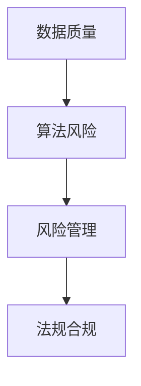

**核心算法原理讲解**

量化交易的优势主要来自其算法的强大。计算机算法可以通过以下几个步骤实现交易：

1. 数据采集：从各种数据源收集历史数据和实时数据。
2. 数据处理：对数据进行清洗、转换和特征提取。
3. 模型训练：使用历史数据训练预测模型。
4. 预测：使用训练好的模型预测未来市场走势。
5. 交易执行：根据预测结果自动执行交易。

在量化交易中，常用的算法包括时间序列分析、统计学习、机器学习等。这些算法分别基于不同的原理和方法，以提高预测的准确性和效率。

时间序列分析：
```python
import pandas as pd
import numpy as np
from statsmodels.tsa.stattools import adfuller

# 加载数据
data = pd.read_csv('stock_price.csv')
close_prices = data['Close']

# 进行ADF检验
result = adfuller(close_prices)
print(result)
```

统计学习：
```python
from sklearn.linear_model import LinearRegression
import pandas as pd
import numpy as np

# 加载数据
data = pd.read_csv('stock_data.csv')
X = data[['Open', 'High', 'Low', 'Volume']]
y = data['Close']

# 构建线性回归模型
model = LinearRegression()
model.fit(X, y)

# 预测
prediction = model.predict(X)
print(prediction)
```

机器学习：
```python
from sklearn.ensemble import RandomForestRegressor
import pandas as pd
import numpy as np

# 加载数据
data = pd.read_csv('stock_data.csv')
X = data[['Open', 'High', 'Low', 'Volume']]
y = data['Close']

# 构建随机森林模型
model = RandomForestRegressor(n_estimators=100)
model.fit(X, y)

# 预测
prediction = model.predict(X)
print(prediction)
```

**数学模型和数学公式**

在量化交易中，常用的数学模型包括ARIMA模型、线性回归模型和随机森林模型。这些模型分别基于不同的数学原理和方法。

ARIMA模型：
$$
\text{ARIMA}(p, d, q) = \text{AR}(p) \times \text{I}(d) \times \text{MA}(q)
$$

线性回归模型：
$$
y = \beta_0 + \beta_1x_1 + \beta_2x_2 + ... + \beta_nx_n
$$

随机森林模型：
$$
f(x) = \sum_{i=1}^{n} \beta_i \cdot r_i(x)
$$
其中，$r_i(x)$ 是第 $i$ 个决策树对 $x$ 的预测。

**项目实战**

假设我们有一个股票市场的数据集，包括开盘价、最高价、最低价和成交量，以及收盘价。我们的目标是使用这些数据来预测未来五天的收盘价。

1. 数据预处理：
   - 数据清洗，去除缺失值和异常值。
   - 特征工程，提取有用的特征。

2. 模型选择：
   - 选择ARIMA模型、线性回归模型和随机森林模型进行预测。

3. 模型训练：
   - 使用历史数据进行模型训练。

4. 预测：
   - 使用训练好的模型预测未来五天的收盘价。

5. 结果分析：
   - 比较不同模型的预测结果，评估模型的性能。

##### 1.3 量化交易的发展趋势

随着金融科技的不断发展，量化交易也在不断演进。以下是一些量化交易的发展趋势：

- **高频交易**：高频交易（High-Frequency Trading, HFT）是量化交易的一种形式，它通过快速执行大量交易来获得微薄的利润。随着技术的进步，HFT的交易速度和规模都在不断提升。
- **机器学习**：机器学习在量化交易中的应用越来越广泛，它可以帮助优化交易策略、提高预测精度。深度学习、强化学习等先进算法正在被引入量化交易领域。
- **区块链**：区块链技术为量化交易提供了去中心化的交易环境，提高了交易的安全性和透明度。一些量化交易公司已经开始探索将区块链技术应用于交易策略。
- **量化对冲基金**：量化对冲基金（Quantitative Hedge Funds）在金融市场中发挥着越来越重要的作用。它们通过使用量化交易策略来降低风险、实现稳定的收益。

**核心概念与联系**

量化交易的发展趋势与金融科技、机器学习、区块链等技术的发展密切相关。这些技术的进步为量化交易提供了更多的工具和方法，使其在金融市场中发挥着越来越重要的作用。

**Mermaid流程图**

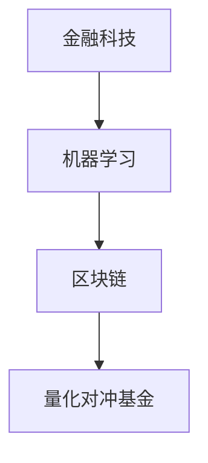

**核心算法原理讲解**

在量化交易中，常用的算法包括时间序列分析、统计学习、机器学习等。这些算法在不同的发展趋势中发挥着不同的作用。

时间序列分析：
```python
import pandas as pd
import numpy as np
from statsmodels.tsa.stattools import adfuller

# 加载数据
data = pd.read_csv('stock_price.csv')
close_prices = data['Close']

# 进行ADF检验
result = adfuller(close_prices)
print(result)
```

统计学习：
```python
from sklearn.linear_model import LinearRegression
import pandas as pd
import numpy as np

# 加载数据
data = pd.read_csv('stock_data.csv')
X = data[['Open', 'High', 'Low', 'Volume']]
y = data['Close']

# 构建线性回归模型
model = LinearRegression()
model.fit(X, y)

# 预测
prediction = model.predict(X)
print(prediction)
```

机器学习：
```python
from sklearn.ensemble import RandomForestRegressor
import pandas as pd
import numpy as np

# 加载数据
data = pd.read_csv('stock_data.csv')
X = data[['Open', 'High', 'Low', 'Volume']]
y = data['Close']

# 构建随机森林模型
model = RandomForestRegressor(n_estimators=100)
model.fit(X, y)

# 预测
prediction = model.predict(X)
print(prediction)
```

**数学模型和数学公式**

在量化交易中，常用的数学模型包括ARIMA模型、线性回归模型和随机森林模型。这些模型在不同的发展趋势中发挥着不同的作用。

ARIMA模型：
$$
\text{ARIMA}(p, d, q) = \text{AR}(p) \times \text{I}(d) \times \text{MA}(q)
$$

线性回归模型：
$$
y = \beta_0 + \beta_1x_1 + \beta_2x_2 + ... + \beta_nx_n
$$

随机森林模型：
$$
f(x) = \sum_{i=1}^{n} \beta_i \cdot r_i(x)
$$
其中，$r_i(x)$ 是第 $i$ 个决策树对 $x$ 的预测。

**项目实战**

假设我们有一个股票市场的数据集，包括开盘价、最高价、最低价和成交量，以及收盘价。我们的目标是使用这些数据来预测未来五天的收盘价。

1. 数据预处理：
   - 数据清洗，去除缺失值和异常值。
   - 特征工程，提取有用的特征。

2. 模型选择：
   - 选择ARIMA模型、线性回归模型和随机森林模型进行预测。

3. 模型训练：
   - 使用历史数据进行模型训练。

4. 预测：
   - 使用训练好的模型预测未来五天的收盘价。

5. 结果分析：
   - 比较不同模型的预测结果，评估模型的性能。

### 第二部分：金融科技基础

#### 第2章：金融科技基础

金融科技（FinTech）是金融业与信息技术相结合的产物，它通过创新技术手段，优化金融服务，提升金融效率。在量化交易策略平台的构建中，金融科技起到了至关重要的作用。本章节将探讨金融科技的基本概念、分类及其在量化交易中的应用。

##### 2.1 金融科技的概念与分类

**核心概念与联系**

金融科技（FinTech）是指利用互联网、移动通信、大数据、云计算、人工智能等新兴技术，对金融服务进行创新和优化的一种技术和商业模式。金融科技主要包括以下几个方面：

- **支付与结算**：移动支付、电子钱包、跨境支付等。
- **投资与理财**：智能投顾、量化交易、P2P借贷等。
- **风险管理**：大数据风控、人工智能反欺诈等。
- **信用评级**：基于大数据的信用评分模型。
- **区块链技术**：数字货币、智能合约等。

在量化交易策略平台的设计与实施中，金融科技的应用主要体现在以下几个方面：

- **数据处理**：利用大数据技术处理海量金融数据，为量化交易提供数据支持。
- **算法优化**：利用人工智能和机器学习技术，优化交易策略，提高交易效率。
- **风险管理**：利用大数据风控和人工智能技术，识别和防范交易风险。

**Mermaid流程图**

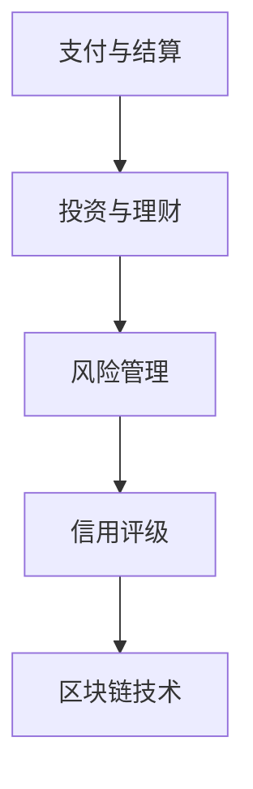

**核心算法原理讲解**

金融科技的核心算法主要包括大数据处理、机器学习、区块链等。

大数据处理：
```python
import pandas as pd
import numpy as np

# 加载数据
data = pd.read_csv('financial_data.csv')

# 数据清洗
data = data.dropna()

# 特征工程
data['mean_return'] = data[['open', 'high', 'low', 'close']].mean(axis=1)

# 数据标准化
data = (data - data.mean()) / data.std()

# 数据划分
train_data = data[:int(len(data) * 0.8)]
test_data = data[int(len(data) * 0.8):]
```

机器学习：
```python
from sklearn.ensemble import RandomForestRegressor
import pandas as pd
import numpy as np

# 加载数据
data = pd.read_csv('financial_data.csv')

# 数据预处理
X = data[['open', 'high', 'low', 'close']]
y = data['return']

# 构建模型
model = RandomForestRegressor(n_estimators=100)
model.fit(X, y)

# 预测
prediction = model.predict(X)
print(prediction)
```

区块链：
```python
from blockchain import Blockchain

# 创建区块链
blockchain = Blockchain()

# 添加区块
blockchain.add_block('交易1')
blockchain.add_block('交易2')
blockchain.add_block('交易3')

# 验证区块链
print(blockchain.is_valid_chain())
```

**数学模型和数学公式**

在金融科技中，常用的数学模型包括线性回归、随机森林、区块链等。

线性回归：
$$
y = \beta_0 + \beta_1x_1 + \beta_2x_2 + ... + \beta_nx_n
$$

随机森林：
$$
f(x) = \sum_{i=1}^{n} \beta_i \cdot r_i(x)
$$
其中，$r_i(x)$ 是第 $i$ 个决策树对 $x$ 的预测。

区块链：
$$
\text{区块} = \{ \text{时间戳}, \text{交易列表}, \text{前一个区块的哈希值}, \text{当前区块的哈希值} \}
$$

**项目实战**

假设我们有一个金融数据集，包括股票的开盘价、最高价、最低价和收盘价，以及相应的收益率。我们的目标是使用这些数据来预测未来的收益率。

1. 数据预处理：
   - 数据清洗，去除缺失值和异常值。
   - 特征工程，提取有用的特征。

2. 模型选择：
   - 选择线性回归模型、随机森林模型进行预测。

3. 模型训练：
   - 使用历史数据进行模型训练。

4. 预测：
   - 使用训练好的模型预测未来的收益率。

5. 结果分析：
   - 比较不同模型的预测结果，评估模型的性能。

##### 2.2 人工智能与大数据在金融科技中的应用

人工智能（AI）和大数据技术在金融科技领域得到了广泛应用，它们为量化交易策略平台的构建提供了强大的技术支持。

**核心概念与联系**

人工智能在金融科技中的应用主要包括以下几个方面：

- **预测分析**：通过机器学习算法，对历史数据进行预测，为交易决策提供依据。
- **风险管理**：利用人工智能技术，识别和防范交易风险，提高风险控制能力。
- **客服系统**：通过自然语言处理（NLP）技术，提供智能客服，提升用户体验。

大数据技术在金融科技中的应用主要包括以下几个方面：

- **数据挖掘**：从海量数据中挖掘有价值的信息，为决策提供支持。
- **实时分析**：对实时数据进行处理和分析，为交易策略提供实时反馈。
- **风险管理**：利用大数据技术，对风险进行实时监控和管理。

**Mermaid流程图**

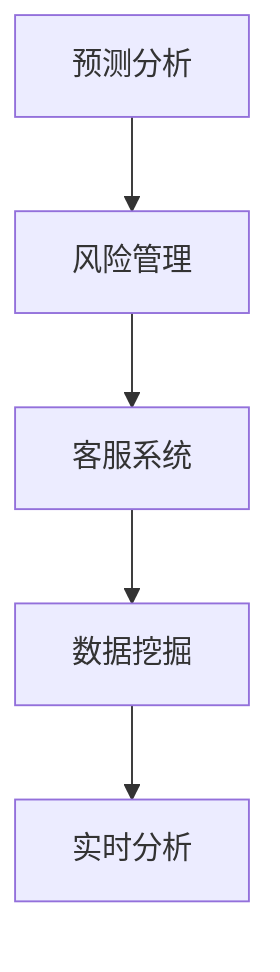

**核心算法原理讲解**

人工智能在金融科技中的应用主要依赖于机器学习算法。以下是一些常用的机器学习算法：

- **线性回归**：通过建立线性模型，预测金融变量的关系。
- **决策树**：通过树形结构，对数据进行分类或回归。
- **随机森林**：通过构建多棵决策树，提高预测的准确性和鲁棒性。
- **神经网络**：通过多层神经网络，实现复杂的非线性映射。

大数据技术在金融科技中的应用主要依赖于数据处理和分析技术。以下是一些常用的数据处理和分析方法：

- **数据清洗**：去除数据中的噪声和异常值。
- **数据转换**：将数据转换为适合分析的形式。
- **特征工程**：提取数据中的关键特征，用于模型训练和预测。

**数学模型和数学公式**

在人工智能和大数据技术中，常用的数学模型包括线性回归、决策树、随机森林和神经网络等。

线性回归：
$$
y = \beta_0 + \beta_1x_1 + \beta_2x_2 + ... + \beta_nx_n
$$

决策树：
$$
f(x) = \begin{cases}
C_1, & \text{if } x \in R_1 \\
C_2, & \text{if } x \in R_2 \\
... \\
C_n, & \text{if } x \in R_n
\end{cases}
$$

随机森林：
$$
f(x) = \sum_{i=1}^{n} \beta_i \cdot r_i(x)
$$
其中，$r_i(x)$ 是第 $i$ 个决策树对 $x$ 的预测。

神经网络：
$$
a_{i,j}^{(l)} = \sigma \left( \sum_{k=1}^{n} w_{i,k}^{(l)} a_{k,j}^{(l-1)} + b_i^{(l)} \right)
$$
其中，$a_{i,j}^{(l)}$ 表示第 $l$ 层的第 $i$ 个神经元的输出，$w_{i,k}^{(l)}$ 和 $b_i^{(l)}$ 分别表示连接权重和偏置。

**项目实战**

假设我们有一个金融数据集，包括股票的开盘价、最高价、最低价和收盘价，以及相应的收益率。我们的目标是使用这些数据来预测未来的收益率。

1. 数据预处理：
   - 数据清洗，去除缺失值和异常值。
   - 特征工程，提取有用的特征。

2. 模型选择：
   - 选择线性回归模型、决策树模型、随机森林模型和神经网络模型进行预测。

3. 模型训练：
   - 使用历史数据进行模型训练。

4. 预测：
   - 使用训练好的模型预测未来的收益率。

5. 结果分析：
   - 比较不同模型的预测结果，评估模型的性能。

##### 2.3 金融科技创业的机遇与风险

金融科技创业领域充满了机遇，同时也伴随着一定的风险。以下将探讨金融科技创业的机遇、挑战以及风险控制策略。

**核心概念与联系**

金融科技创业的机遇包括：

- **技术创新**：新兴技术的不断涌现为金融科技创业提供了丰富的创新空间。
- **市场潜力**：金融市场的庞大市场规模和不断增长的需求为金融科技创业提供了广阔的市场空间。
- **政策支持**：各国政府对金融科技的重视和支持，为金融科技创业提供了良好的政策环境。

金融科技创业的挑战包括：

- **技术风险**：技术的不确定性和快速变化，可能导致创业项目无法持续发展。
- **市场风险**：市场竞争的激烈和用户需求的不断变化，可能导致创业项目的市场前景不明确。
- **法规风险**：金融行业的法规严格，创业项目需要确保合法合规。

**Mermaid流程图**

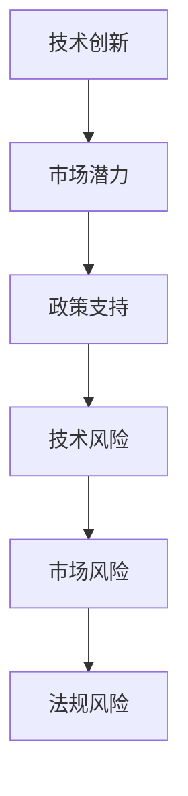

**核心算法原理讲解**

金融科技创业的机遇与风险控制可以通过以下方法进行：

- **风险评估**：使用风险评估模型，对创业项目的风险进行量化评估。
- **风险控制**：制定风险控制策略，降低创业项目的风险。
- **创新管理**：通过创新管理，提高创业项目的创新能力，应对技术风险。

**数学模型和数学公式**

在金融科技创业中，常用的数学模型包括风险评估模型、风险控制模型和创新管理模型。

风险评估模型：
$$
R = \sum_{i=1}^{n} w_i \cdot r_i
$$
其中，$R$ 表示总风险，$w_i$ 表示权重，$r_i$ 表示风险指标。

风险控制模型：
$$
C = \frac{R}{L}
$$
其中，$C$ 表示风险控制成本，$R$ 表示总风险，$L$ 表示风险容忍度。

创新管理模型：
$$
I = f(A, M, P)
$$
其中，$I$ 表示创新能力，$A$ 表示技术能力，$M$ 表示市场需求，$P$ 表示政策支持。

**项目实战**

假设我们有一个金融科技创业项目，目标是开发一个基于大数据和人工智能的量化交易策略平台。以下是我们可能采取的步骤：

1. 市场调研：
   - 分析市场现状和用户需求。
   - 评估竞争对手和潜在的市场机会。

2. 技术评估：
   - 评估所需的技术能力，包括大数据处理、人工智能算法等。
   - 确定技术实现方案。

3. 风险评估：
   - 使用风险评估模型，对项目进行风险量化评估。
   - 制定风险控制策略。

4. 创新管理：
   - 通过技术创新，提高项目的竞争力。
   - 管理市场需求和政策支持，确保项目的持续发展。

5. 项目实施：
   - 按照风险评估和创新的策略，实施项目开发。

6. 结果分析：
   - 比较项目的实际表现与预期，评估项目的成功程度。

### 第三部分：量化交易策略平台设计

#### 第3章：量化交易策略平台架构

量化交易策略平台是一个复杂的系统，它需要处理大量的数据，执行复杂的算法，并实时响应市场变化。为了构建一个高效、可靠且易于扩展的量化交易策略平台，我们需要对平台的架构进行精心设计。本章节将讨论量化交易策略平台的设计原则、数据处理与存储、策略开发与回测、策略执行与风险管理。

##### 3.1 平台架构设计原则

**核心概念与联系**

量化交易策略平台的设计原则主要包括以下几个方面：

- **模块化**：将平台划分为多个模块，每个模块负责不同的功能，以提高系统的可维护性和扩展性。
- **分布式**：采用分布式架构，提高系统的可靠性和性能。
- **高性能**：设计高性能的数据处理和计算模块，以满足量化交易对实时性的要求。
- **可扩展性**：设计可扩展的架构，以应对不断增长的数据量和交易量。
- **安全性**：确保数据安全和交易安全，防止恶意攻击和数据泄露。

**Mermaid流程图**

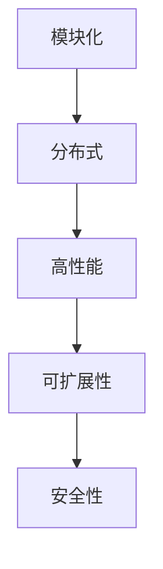

**核心算法原理讲解**

在量化交易策略平台的设计中，我们需要考虑以下几个核心算法：

- **数据处理算法**：用于高效处理大量数据，包括数据清洗、数据转换和特征提取。
- **预测算法**：用于预测市场走势，包括时间序列分析、统计学习和机器学习。
- **优化算法**：用于优化交易策略，包括粒子群优化、模拟退火算法和遗传算法。
- **风险管理算法**：用于识别和管理交易风险，包括风险度量、风险控制和风险预警。

**数学模型和数学公式**

在量化交易策略平台的设计中，常用的数学模型包括时间序列分析模型、统计学习模型、机器学习模型和风险管理模型。

时间序列分析模型：
$$
\text{ARIMA}(p, d, q) = \text{AR}(p) \times \text{I}(d) \times \text{MA}(q)
$$

统计学习模型：
$$
y = \beta_0 + \beta_1x_1 + \beta_2x_2 + ... + \beta_nx_n
$$

机器学习模型：
$$
f(x) = \sum_{i=1}^{n} \beta_i \cdot r_i(x)
$$
其中，$r_i(x)$ 是第 $i$ 个决策树对 $x$ 的预测。

风险管理模型：
$$
R = \sum_{i=1}^{n} w_i \cdot r_i
$$
其中，$R$ 表示总风险，$w_i$ 表示权重，$r_i$ 表示风险指标。

**项目实战**

假设我们需要设计一个量化交易策略平台，以下是我们可能采取的步骤：

1. 需求分析：
   - 分析平台的需求，包括数据来源、交易策略、风险管理等。
   - 确定平台的性能要求和扩展性要求。

2. 架构设计：
   - 根据需求分析，设计平台的架构，包括模块划分、数据流、计算流等。
   - 选择合适的技术框架和工具。

3. 数据处理与存储：
   - 设计数据处理与存储模块，包括数据采集、数据清洗、数据存储等。
   - 选择合适的数据处理工具和数据库。

4. 策略开发与回测：
   - 设计策略开发与回测模块，包括策略编写、策略回测、策略优化等。
   - 选择合适的策略开发工具和回测工具。

5. 策略执行与风险管理：
   - 设计策略执行与风险管理模块，包括交易执行、风险度量、风险控制等。
   - 选择合适的风险管理工具和策略执行工具。

6. 系统集成与测试：
   - 将各个模块集成在一起，进行系统测试。
   - 确保系统的性能和稳定性。

7. 部署与运维：
   - 将平台部署到生产环境，进行实时交易。
   - 实施运维策略，确保平台的正常运行。

##### 3.2 数据处理与存储

数据处理与存储是量化交易策略平台的核心环节，它决定了平台的数据处理能力和可靠性。以下将讨论数据处理与存储的设计原则、常用技术以及实际案例。

**核心概念与联系**

数据处理与存储的设计原则主要包括以下几个方面：

- **实时性**：确保数据处理和存储的实时性，以满足量化交易对实时性的要求。
- **可靠性**：确保数据处理的准确性和可靠性，防止数据丢失或错误。
- **扩展性**：设计可扩展的数据处理与存储系统，以应对数据量和交易量的增长。
- **安全性**：确保数据的安全性和隐私性，防止数据泄露或恶意攻击。

**Mermaid流程图**

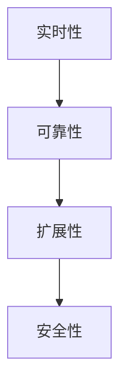

**核心算法原理讲解**

数据处理与存储涉及多个核心算法：

- **数据采集**：用于从各种数据源采集数据，包括股票市场数据、新闻数据等。
- **数据清洗**：用于去除数据中的噪声和异常值，确保数据的准确性。
- **数据转换**：用于将数据转换为适合分析的形式，包括数据归一化、特征提取等。
- **数据存储**：用于将处理后的数据存储到数据库或其他存储系统。

**数学模型和数学公式**

在数据处理与存储中，常用的数学模型包括数据清洗模型、数据转换模型和存储模型。

数据清洗模型：
$$
x_{\text{clean}} = \begin{cases}
x, & \text{if } x \text{ is valid} \\
\text{NA}, & \text{if } x \text{ is invalid}
\end{cases}
$$

数据转换模型：
$$
x_{\text{transformed}} = f(x)
$$
其中，$f(x)$ 是数据转换函数。

存储模型：
$$
\text{Data} = \{ x_1, x_2, ..., x_n \}
$$
其中，$x_i$ 是存储的数据项。

**项目实战**

假设我们需要设计一个数据处理与存储模块，以下是我们可能采取的步骤：

1. 数据采集：
   - 选择合适的数据源，包括股票市场数据、新闻数据等。
   - 设计数据采集工具，用于定期从数据源采集数据。

2. 数据清洗：
   - 设计数据清洗算法，去除数据中的噪声和异常值。
   - 设计数据清洗流程，包括数据预处理、数据验证和数据修正。

3. 数据转换：
   - 设计数据转换算法，将数据转换为适合分析的形式。
   - 设计数据转换流程，包括数据归一化、特征提取等。

4. 数据存储：
   - 选择合适的存储系统，如关系数据库、NoSQL数据库等。
   - 设计数据存储结构，确保数据的存储效率和查询速度。

5. 系统集成与测试：
   - 将数据处理与存储模块集成到量化交易策略平台中。
   - 进行系统测试，确保数据处理与存储模块的稳定性和性能。

6. 部署与运维：
   - 将数据处理与存储模块部署到生产环境。
   - 实施运维策略，确保数据处理与存储模块的正常运行。

##### 3.3 策略开发与回测

策略开发与回测是量化交易策略平台的核心环节，它决定了策略的可靠性和有效性。以下将讨论策略开发与回测的设计原则、常用技术以及实际案例。

**核心概念与联系**

策略开发与回测的设计原则主要包括以下几个方面：

- **模块化**：将策略开发与回测模块划分为多个子模块，以提高系统的可维护性和扩展性。
- **自动化**：实现策略开发与回测的自动化，提高开发效率。
- **可重复性**：确保策略开发与回测的可重复性，以便对策略进行持续优化。
- **透明性**：确保策略开发与回测过程的透明性，以便对策略进行有效评估。
- **可靠性**：确保策略开发与回测的可靠性，防止策略错误或数据错误。

**Mermaid流程图**

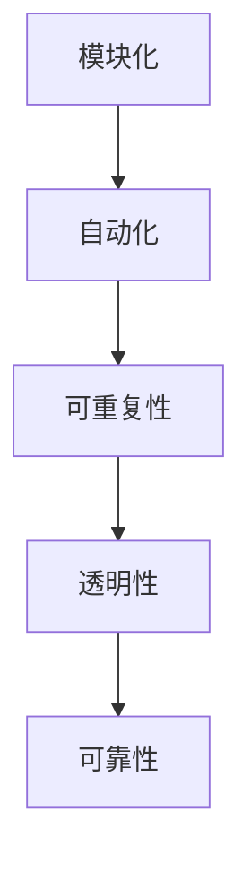

**核心算法原理讲解**

策略开发与回测涉及多个核心算法：

- **策略生成**：用于生成新的交易策略。
- **策略优化**：用于优化现有交易策略。
- **策略回测**：用于验证交易策略的有效性和可靠性。
- **策略评估**：用于评估交易策略的性能和风险。

**数学模型和数学公式**

在策略开发与回测中，常用的数学模型包括策略生成模型、策略优化模型和策略回测模型。

策略生成模型：
$$
p(\theta) = \frac{1}{Z} \exp(-E(\theta))
$$
其中，$\theta$ 是策略参数，$E(\theta)$ 是策略的期望收益，$Z$ 是规范化常数。

策略优化模型：
$$
\theta_{\text{opt}} = \arg \min_{\theta} E(\theta)
$$

策略回测模型：
$$
R(t) = \sum_{i=1}^{t} p_i \cdot r_i
$$
其中，$p_i$ 是第 $i$ 个交易的概率，$r_i$ 是第 $i$ 个交易的收益。

**项目实战**

假设我们需要开发一个量化交易策略，以下是我们可能采取的步骤：

1. 策略构思：
   - 分析市场数据，确定策略的交易逻辑。
   - 设计策略的基本框架，包括交易信号、入场点、出场点等。

2. 策略实现：
   - 编写策略代码，实现交易逻辑。
   - 设计策略的参数，包括交易信号参数、入场点参数、出场点参数等。

3. 策略回测：
   - 使用历史数据进行策略回测，验证策略的有效性和可靠性。
   - 分析策略的收益、风险和稳定性。

4. 策略优化：
   - 根据回测结果，优化策略的参数，提高策略的收益和稳定性。
   - 设计优化算法，如遗传算法、模拟退火算法等。

5. 策略评估：
   - 评估优化后的策略的性能，包括收益、风险和稳定性等。
   - 确定策略的可行性，制定实施计划。

6. 系统集成与测试：
   - 将策略集成到量化交易策略平台中。
   - 进行系统测试，确保策略的正常运行。

7. 部署与监控：
   - 将策略部署到生产环境，进行实时交易。
   - 实施监控策略，确保策略的稳定性和性能。

##### 3.4 策略执行与风险管理

策略执行与风险管理是量化交易策略平台的重要组成部分，它决定了策略的执行效果和风险控制能力。以下将讨论策略执行与风险管理的设计原则、常用技术以及实际案例。

**核心概念与联系**

策略执行与风险管理的设计原则主要包括以下几个方面：

- **实时性**：确保策略执行的实时性，以便及时响应市场变化。
- **可靠性**：确保策略执行的可靠性，防止交易错误或数据错误。
- **安全性**：确保交易数据的安全性和隐私性，防止数据泄露或恶意攻击。
- **自动化**：实现策略执行的自动化，提高交易效率。
- **灵活性**：设计灵活的交易策略和风险管理策略，以适应不同的市场环境。

**Mermaid流程图**

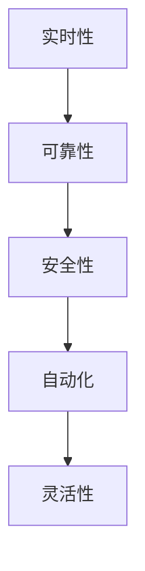

**核心算法原理讲解**

策略执行与风险管理涉及多个核心算法：

- **交易执行算法**：用于执行交易策略，包括交易信号的生成、交易订单的发送等。
- **风险管理算法**：用于管理交易风险，包括风险度量、风险控制和风险预警。
- **交易策略优化算法**：用于优化交易策略，提高交易收益和风险控制能力。

**数学模型和数学公式**

在策略执行与风险管理中，常用的数学模型包括交易执行模型、风险管理模型和交易策略优化模型。

交易执行模型：
$$
\text{交易执行} = f(\text{交易信号}, \text{市场状态})
$$
其中，$f$ 是交易执行函数。

风险管理模型：
$$
R = \sum_{i=1}^{n} w_i \cdot r_i
$$
其中，$R$ 表示总风险，$w_i$ 表示权重，$r_i$ 表示风险指标。

交易策略优化模型：
$$
\theta_{\text{opt}} = \arg \min_{\theta} E(\theta)
$$

**项目实战**

假设我们需要实现一个策略执行与风险管理模块，以下是我们可能采取的步骤：

1. 策略执行：
   - 设计交易执行算法，包括交易信号的生成、交易订单的发送等。
   - 实现交易执行模块，确保交易信号的实时生成和交易订单的及时发送。

2. 风险管理：
   - 设计风险管理算法，包括风险度量、风险控制和风险预警。
   - 实现风险管理模块，确保交易风险的有效管理和风险控制的实时执行。

3. 策略优化：
   - 设计交易策略优化算法，包括参数优化、模型优化等。
   - 实现策略优化模块，确保交易策略的持续优化和性能提升。

4. 系统集成与测试：
   - 将策略执行与风险管理模块集成到量化交易策略平台中。
   - 进行系统测试，确保策略执行与风险管理模块的正常运行。

5. 部署与监控：
   - 将策略执行与风险管理模块部署到生产环境，进行实时交易。
   - 实施监控策略，确保策略执行与风险管理模块的稳定性和性能。

### 第四部分：策略平台的核心算法

#### 第4章：策略平台的核心算法

量化交易策略平台的核心算法是实现交易策略的关键，这些算法包括预测算法和优化算法。本章将深入探讨这些核心算法的基本原理、数学模型、伪代码以及实际应用。

##### 4.1 预测算法

预测算法在量化交易中用于预测市场走势，从而指导交易决策。常见的预测算法有时间序列分析、统计学习和深度学习。

###### 4.1.1 时间序列分析

时间序列分析是一种常用的预测方法，它通过分析历史时间序列数据来预测未来的趋势。ARIMA（自回归积分滑动平均模型）是一种常见的时间序列分析模型。

**核心算法原理**

ARIMA模型由三个参数组成：自回归阶数（p），差分阶数（d），移动平均阶数（q）。模型通过自回归项（AR）、差分项（I）和移动平均项（MA）来捕捉时间序列的特性。

**数学模型**

ARIMA(p, d, q) 模型可以表示为：
$$
\text{X}_{t} = c + \phi_1 \text{X}_{t-1} + \phi_2 \text{X}_{t-2} + ... + \phi_p \text{X}_{t-p} + \theta_1 \varepsilon_{t-1} + \theta_2 \varepsilon_{t-2} + ... + \theta_q \varepsilon_{t-q} + \varepsilon_t
$$
其中，$c$ 是常数项，$\phi_1, \phi_2, ..., \phi_p$ 是自回归系数，$\theta_1, \theta_2, ..., \theta_q$ 是移动平均系数，$\varepsilon_t$ 是误差项。

**伪代码**

```python
def arima_predict(data, p, d, q):
    # 数据预处理
    diff_data = diff(data, differences=d)
    # 构建ARIMA模型
    model = ARIMA(diff_data, order=(p, d, q))
    # 模型拟合
    model_fit = model.fit()
    # 预测
    forecast = model_fit.forecast(steps=1)
    return forecast
```

**实际应用**

使用ARIMA模型预测股票价格：
```python
import pandas as pd
import numpy as np
from statsmodels.tsa.arima.model import ARIMA

# 加载数据
data = pd.read_csv('stock_price.csv')
close_prices = data['Close']

# 预测未来一天的价格
forecast = arima_predict(close_prices, p=5, d=1, q=1)
print(forecast)
```

###### 4.1.2 统计学习

统计学习是一种基于统计方法建立预测模型的算法。线性回归、逻辑回归和支持向量机（SVM）是常见的统计学习算法。

**核心算法原理**

线性回归用于预测连续值变量，其目标是找到最佳拟合直线，以最小化预测误差。

**数学模型**

线性回归模型可以表示为：
$$
y = \beta_0 + \beta_1x_1 + \beta_2x_2 + ... + \beta_nx_n
$$
其中，$y$ 是预测目标，$x_1, x_2, ..., x_n$ 是特征变量，$\beta_0, \beta_1, \beta_2, ..., \beta_n$ 是模型参数。

**伪代码**

```python
from sklearn.linear_model import LinearRegression
import pandas as pd
import numpy as np

# 加载数据
data = pd.read_csv('stock_data.csv')
X = data[['Open', 'High', 'Low', 'Volume']]
y = data['Close']

# 构建线性回归模型
model = LinearRegression()
# 模型拟合
model.fit(X, y)
# 预测
prediction = model.predict(X)
```

**实际应用**

使用线性回归模型预测股票价格：
```python
import pandas as pd
from sklearn.linear_model import LinearRegression

# 加载数据
data = pd.read_csv('stock_price.csv')
X = data[['Open', 'High', 'Low', 'Volume']]
y = data['Close']

# 构建线性回归模型
model = LinearRegression()
# 模型拟合
model.fit(X, y)
# 预测
prediction = model.predict(X)
print(prediction)
```

###### 4.1.3 深度学习

深度学习是一种基于人工神经网络的算法，它可以自动从数据中学习特征，用于预测和分类。卷积神经网络（CNN）和循环神经网络（RNN）是常见的深度学习算法。

**核心算法原理**

卷积神经网络（CNN）擅长处理图像和时序数据，通过卷积层、池化层和全连接层来提取特征。

**数学模型**

CNN的数学模型可以表示为：
$$
h_{l} = \sigma \left( \sum_{k=1}^{K_l} w_{l,k} \odot h_{l-1} + b_{l} \right)
$$
其中，$h_{l}$ 是第 $l$ 层的激活值，$w_{l,k}$ 是权重，$\odot$ 表示卷积操作，$b_{l}$ 是偏置项，$\sigma$ 是激活函数。

**伪代码**

```python
import tensorflow as tf

# 定义CNN模型
model = tf.keras.Sequential([
    tf.keras.layers.Conv2D(filters=32, kernel_size=(3, 3), activation='relu', input_shape=(28, 28, 1)),
    tf.keras.layers.MaxPooling2D(pool_size=(2, 2)),
    tf.keras.layers.Flatten(),
    tf.keras.layers.Dense(units=10, activation='softmax')
])

# 编译模型
model.compile(optimizer='adam', loss='categorical_crossentropy', metrics=['accuracy'])

# 训练模型
model.fit(x_train, y_train, epochs=5, batch_size=64)
```

**实际应用**

使用CNN模型预测股票价格：
```python
import tensorflow as tf
from tensorflow.keras.models import Sequential
from tensorflow.keras.layers import Conv2D, MaxPooling2D, Flatten, Dense

# 构建CNN模型
model = Sequential([
    Conv2D(filters=32, kernel_size=(3, 3), activation='relu', input_shape=(28, 28, 1)),
    MaxPooling2D(pool_size=(2, 2)),
    Flatten(),
    Dense(units=10, activation='softmax')
])

# 编译模型
model.compile(optimizer='adam', loss='categorical_crossentropy', metrics=['accuracy'])

# 训练模型
model.fit(x_train, y_train, epochs=5, batch_size=64)
```

##### 4.2 优化算法

优化算法用于调整交易策略的参数，以最大化收益或最小化风险。常见的优化算法包括粒子群优化（PSO）、模拟退火算法（SA）和遗传算法（GA）。

###### 4.2.1 粒子群优化

粒子群优化是一种基于群体智能的优化算法，通过模拟鸟群觅食行为来优化目标函数。

**核心算法原理**

粒子群优化算法通过更新粒子的速度和位置，逐步逼近最优解。每个粒子都有速度和位置，速度决定粒子的移动方向和速度，位置决定粒子的当前位置。

**数学模型**

粒子群优化算法的更新规则可以表示为：
$$
v_{i}^{t+1} = \omega v_{i}^{t} + c_1 r_1 (p_i - x_i) + c_2 r_2 (g - x_i)
$$
$$
x_{i}^{t+1} = x_{i}^{t} + v_{i}^{t+1}
$$
其中，$v_{i}^{t}$ 是第 $i$ 个粒子在 $t$ 时刻的速度，$x_{i}^{t}$ 是第 $i$ 个粒子在 $t$ 时刻的位置，$p_i$ 是第 $i$ 个粒子的个体最优位置，$g$ 是全局最优位置，$\omega$ 是惯性权重，$c_1$ 和 $c_2$ 是学习因子，$r_1$ 和 $r_2$ 是随机数。

**伪代码**

```python
def pso(objective_function, bounds, n_particles, max_iterations):
    particles = initialize_particles(bounds, n_particles)
    velocities = initialize_velocities(bounds, n_particles)
    best_score = float('inf')
    best_particle = None

    for t in range(max_iterations):
        for i in range(n_particles):
            score = objective_function(particles[i])
            if score < best_score:
                best_score = score
                best_particle = particles[i]

            velocities[i] = update_velocity(velocities[i], particles[i], best_particle, bounds)
            particles[i] = update_position(particles[i], velocities[i], bounds)

        print(f"Iteration {t}: Best Score = {best_score}")

    return best_particle
```

**实际应用**

使用粒子群优化调整交易策略参数：
```python
def objective_function(parameters):
    # 计算目标函数值
    # ...
    return score

def pso_objective_function(bounds, n_particles, max_iterations):
    best_parameters = pso(objective_function, bounds, n_particles, max_iterations)
    return best_parameters

# 调用粒子群优化
best_parameters = pso_objective_function(bounds, n_particles=50, max_iterations=100)
print(f"Best Parameters: {best_parameters}")
```

###### 4.2.2 模拟退火算法

模拟退火算法是一种基于物理退火过程的优化算法，通过逐步减小温度来寻找最优解。

**核心算法原理**

模拟退火算法在每次迭代中，以一定概率接受次优解，从而跳出局部最优解。随着迭代次数的增加，算法的温度逐渐降低，使得算法在全局搜索空间中逐渐收敛。

**数学模型**

模拟退火算法的更新规则可以表示为：
$$
x_{i}^{t+1} = \begin{cases}
x_i, & \text{with probability } 1 \\
x_j, & \text{with probability } \frac{\exp(-\Delta E/T)}{Z}
\end{cases}
$$
其中，$x_i$ 和 $x_j$ 是候选解，$\Delta E$ 是候选解与当前解之间的能量差，$T$ 是温度，$Z$ 是归一化常数。

**伪代码**

```python
def sa(objective_function, initial_state, temperature, alpha, max_iterations):
    current_state = initial_state
    best_state = current_state
    best_score = objective_function(current_state)

    for t in range(max_iterations):
        new_state = generate_new_state(current_state)
        new_score = objective_function(new_state)
        delta_score = new_score - best_score

        if delta_score < 0 or random() < exp(-delta_score / temperature):
            current_state = new_state
            if new_score < best_score:
                best_state = new_state
                best_score = new_score

        temperature *= alpha

    return best_state
```

**实际应用**

使用模拟退火算法优化交易策略：
```python
def objective_function(parameters):
    # 计算目标函数值
    # ...
    return score

def sa_objective_function(initial_state, temperature, alpha, max_iterations):
    best_state = sa(objective_function, initial_state, temperature, alpha, max_iterations)
    return best_state

# 初始状态
initial_state = [0.1, 0.2, 0.3]
# 温度
temperature = 1.0
# 温度衰减因子
alpha = 0.99
# 迭代次数
max_iterations = 100

# 调用模拟退火算法
best_state = sa_objective_function(initial_state, temperature, alpha, max_iterations)
print(f"Best State: {best_state}")
```

###### 4.2.3 遗传算法

遗传算法是一种基于自然选择和遗传学原理的优化算法，通过模拟生物进化过程来寻找最优解。

**核心算法原理**

遗传算法通过初始化种群、选择、交叉、变异和评估等步骤来逐步优化解。种群中的每个个体都代表一个可能的解，通过遗传操作，种群逐渐进化，直至找到最优解。

**数学模型**

遗传算法的基本操作包括：

- **选择**：根据个体的适应度选择优秀的个体进入下一代。
- **交叉**：将两个个体的基因进行交换，生成新的个体。
- **变异**：对个体的基因进行随机改变，增加种群的多样性。

**伪代码**

```python
def ga(objective_function, population_size, generations, crossover_rate, mutation_rate):
    population = initialize_population(population_size)
    for g in range(generations):
        new_population = []
        for _ in range(population_size // 2):
            parent1, parent2 = select_two_parents(population)
            child1, child2 = crossover(parent1, parent2, crossover_rate)
            new_population.append(mutate(child1, mutation_rate))
            new_population.append(mutate(child2, mutation_rate))
        population = new_population
        best_individual = select_best_individual(population)
        print(f"Generation {g}: Best Score = {objective_function(best_individual)}")
    return best_individual
```

**实际应用**

使用遗传算法优化交易策略：
```python
def objective_function(parameters):
    # 计算目标函数值
    # ...
    return score

def ga_objective_function(population_size, generations, crossover_rate, mutation_rate):
    best_parameters = ga(objective_function, population_size, generations, crossover_rate, mutation_rate)
    return best_parameters

# 初始化参数
population_size = 50
generations = 100
crossover_rate = 0.8
mutation_rate = 0.1

# 调用遗传算法
best_parameters = ga_objective_function(population_size, generations, crossover_rate, mutation_rate)
print(f"Best Parameters: {best_parameters}")
```

##### 4.3 策略平台的核心算法总结

策略平台的核心算法包括预测算法和优化算法。预测算法用于预测市场走势，指导交易决策；优化算法用于优化交易策略，提高交易收益。常见预测算法有时间序列分析、统计学习和深度学习；常见优化算法有粒子群优化、模拟退火算法和遗传算法。这些算法在量化交易策略平台中发挥着重要作用，通过合理选择和组合，可以构建出高效的交易策略。

### 第五部分：量化交易策略开发流程

#### 第5章：量化交易策略开发流程

开发一个有效的量化交易策略需要经历多个步骤，包括策略构思、策略实现、策略回测和策略优化。本章将详细阐述这些步骤，并提供实际案例以帮助读者更好地理解整个开发流程。

##### 5.1 策略开发步骤

**核心概念与联系**

量化交易策略的开发过程可以概括为以下几个主要步骤：

1. **策略构思**：确定交易策略的目标和市场环境，分析历史数据和市场趋势，构思基本的交易逻辑。
2. **策略实现**：根据策略构思，编写策略代码，实现交易逻辑，包括信号生成、交易决策和风险控制等。
3. **策略回测**：使用历史数据对策略进行回测，评估策略的有效性和稳定性，识别潜在的缺陷和问题。
4. **策略优化**：根据回测结果对策略进行优化，调整参数，提高策略的性能和适应性。
5. **策略部署**：将优化后的策略部署到实际交易环境中，进行实时交易，同时持续监控策略的表现。

**Mermaid流程图**

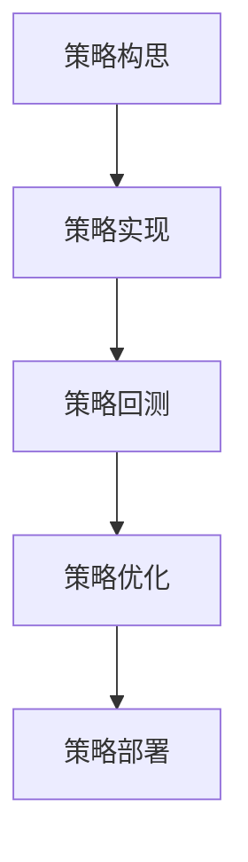

**核心算法原理讲解**

在策略开发流程中，核心算法主要包括以下几类：

- **信号生成算法**：用于生成交易信号，包括趋势跟踪、均值回归、动量策略等。
- **交易决策算法**：用于根据信号生成交易决策，包括入场点、出场点和止损点等。
- **风险控制算法**：用于管理交易风险，包括风险度量、风险控制和风险预警等。

**数学模型和数学公式**

- **趋势跟踪策略**：使用移动平均线作为交易信号，其数学模型为：
  $$
  \text{Moving Average}(n) = \frac{1}{n} \sum_{t=1}^{n} \text{Price}_{t}
  $$
- **均值回归策略**：使用历史价格的平均值作为交易信号，其数学模型为：
  $$
  \text{Mean Reversion} = \text{Current Price} - \text{Average Price}
  $$
- **风险控制策略**：使用价值在风险（VaR）或条件价值在风险（CVaR）来度量风险，其数学模型为：
  $$
  \text{VaR}_{\alpha} = \text{Quantile}(\text{Loss Distribution}, 1 - \alpha)
  $$

**项目实战**

假设我们需要开发一个基于移动平均线交叉的趋势跟踪策略，以下是我们可能采取的步骤：

1. **策略构思**：
   - 分析历史数据，确定使用哪种移动平均线（简单移动平均线或指数移动平均线）。
   - 确定交易信号，如移动平均线交叉点作为入场点。
   - 确定止损和止盈策略，如使用固定比例或动态调整止损点。

2. **策略实现**：
   - 编写代码，实现移动平均线计算和信号生成。
   - 实现交易决策逻辑，包括入场、出场和风险管理。
   - 编写代码，实现回测框架，用于评估策略性能。

3. **策略回测**：
   - 使用历史数据进行策略回测，验证策略的有效性和稳定性。
   - 分析回测结果，包括策略的收益、风险和稳定性指标。
   - 根据回测结果，调整策略参数，如移动平均线周期、止损比例等。

4. **策略优化**：
   - 使用优化算法，如遗传算法或模拟退火算法，对策略参数进行优化。
   - 重新进行回测，评估优化后的策略性能。
   - 根据优化结果，选择最佳策略参数。

5. **策略部署**：
   - 将优化后的策略部署到实际交易环境中。
   - 实时监控策略的表现，包括收益、风险和稳定性指标。
   - 定期进行策略评估和调整，以应对市场变化。

##### 5.2 策略评估与优化

策略评估与优化是量化交易策略开发的关键步骤，它决定了策略的最终表现。以下将详细讨论策略评估与优化的方法、指标和工具。

**核心概念与联系**

策略评估与优化的目的是确保策略的有效性和稳定性，从而在实际交易中取得良好的表现。策略评估主要包括以下指标：

- **收益指标**：包括总收益、平均收益、最大回撤等。
- **风险指标**：包括夏普比率、信息比率、Beta系数等。
- **稳定性指标**：包括收益波动性、交易频率等。

策略优化主要通过调整策略参数，以提高策略的收益和稳定性。常用的优化方法包括遗传算法、模拟退火算法、粒子群优化等。

**Mermaid流程图**

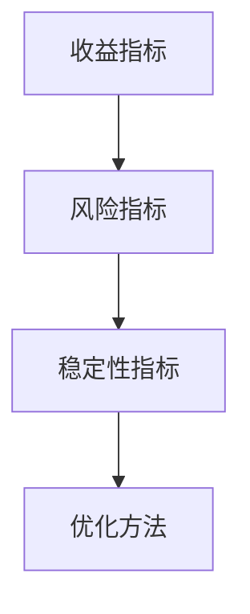

**核心算法原理讲解**

策略优化通常涉及以下核心算法：

- **遗传算法**：基于生物进化原理，通过选择、交叉、变异等操作来搜索最优解。
- **模拟退火算法**：通过模拟物理退火过程，逐步降低温度，以避免陷入局部最优。
- **粒子群优化**：模拟鸟群觅食行为，通过更新粒子的速度和位置来寻找最优解。

**数学模型和数学公式**

- **遗传算法**：适应度函数可以表示为：
  $$
  f(\theta) = \frac{1}{1 + \exp(-\beta \cdot \text{Objective Function}(\theta))}
  $$
- **模拟退火算法**：更新规则可以表示为：
  $$
  \theta_{\text{new}} = \theta_{\text{current}} + \alpha \cdot (\theta_{\text{current}} - \theta_{\text{best}})
  $$
- **粒子群优化**：速度更新公式可以表示为：
  $$
  v_{i}^{t+1} = \omega v_{i}^{t} + c_1 r_1 (p_i - x_i) + c_2 r_2 (g - x_i)
  $$
  位置更新公式可以表示为：
  $$
  x_{i}^{t+1} = x_{i}^{t} + v_{i}^{t+1}
  $$

**项目实战**

假设我们需要优化一个基于移动平均线交叉的趋势跟踪策略，以下是我们可能采取的步骤：

1. **策略回测**：
   - 使用历史数据进行策略回测，收集策略表现数据。
   - 计算收益、风险和稳定性指标，如总收益、最大回撤、夏普比率等。

2. **优化参数**：
   - 选择优化方法，如遗传算法或模拟退火算法。
   - 确定优化目标函数，如最大化总收益或最小化最大回撤。
   - 初始化参数范围，如移动平均线周期、止损比例等。

3. **执行优化**：
   - 使用优化算法，对策略参数进行搜索和优化。
   - 收集优化后的参数，并计算优化后的策略表现。

4. **结果分析**：
   - 比较优化前后的策略表现，评估优化效果。
   - 根据优化结果，选择最佳策略参数。

5. **策略部署**：
   - 将优化后的策略部署到实际交易环境中。
   - 实时监控策略的表现，并根据市场变化进行调整。

##### 5.3 策略部署与监控

策略部署与监控是确保量化交易策略在实际交易中稳定运行的重要环节。以下将讨论策略部署与监控的方法、工具和流程。

**核心概念与联系**

策略部署与监控的主要目标是确保策略能够稳定运行，并在市场变化时及时调整。策略部署包括将策略代码部署到交易服务器、配置交易参数和连接交易接口等。策略监控则包括实时监控策略的表现、风险指标和系统性能等。

**Mermaid流程图**

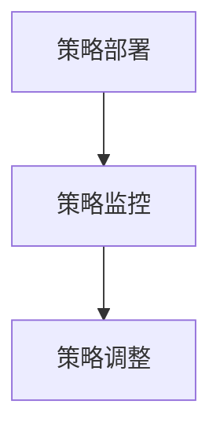

**核心算法原理讲解**

策略部署与监控通常涉及以下核心算法：

- **自动化部署**：使用脚本或自动化工具，将策略代码部署到交易服务器。
- **日志监控**：实时记录策略运行的日志，包括交易信号、交易订单和系统错误等。
- **风险监控**：实时监控策略的风险指标，如最大回撤、收益波动性等。

**数学模型和数学公式**

- **自动化部署**：可以使用脚本或自动化工具，如Ansible、Docker等。
- **日志监控**：可以使用日志分析工具，如ELK（Elasticsearch、Logstash、Kibana）等。
- **风险监控**：可以使用统计分析方法，如时间序列分析、风险度量模型等。

**项目实战**

假设我们需要部署和监控一个基于移动平均线交叉的趋势跟踪策略，以下是我们可能采取的步骤：

1. **策略代码**：
   - 编写策略代码，实现交易逻辑、风险管理等。

2. **自动化部署**：
   - 使用Ansible脚本，将策略代码部署到交易服务器。
   - 配置Docker容器，确保策略代码的运行环境。

3. **交易接口**：
   - 连接交易接口，如CTP、IB等，确保策略能够发送交易订单。

4. **日志监控**：
   - 配置ELK日志监控系统，实时记录策略运行的日志。
   - 使用Kibana仪表板，监控策略的表现和风险指标。

5. **实时调整**：
   - 根据实时监控结果，调整策略参数，如移动平均线周期、止损比例等。
   - 定期评估策略的表现，并根据市场变化进行调整。

6. **结果分析**：
   - 定期分析策略的表现，包括收益、风险和稳定性指标。
   - 根据分析结果，优化策略代码和参数。

### 第六部分：量化交易策略案例研究

#### 第6章：量化交易策略案例研究

为了更好地理解量化交易策略的实际应用和效果，本章节将通过三个具体的案例来研究不同类型的量化交易策略：趋势跟踪策略、均值回归策略和事件驱动策略。我们将详细描述每个策略的基本原理、实现方法、回测结果和实际效果。

##### 6.1 案例一：趋势跟踪策略

**基本原理**

趋势跟踪策略是基于价格趋势进行交易的策略，它假设价格会在某一方向上持续运动。该策略的核心思想是识别市场的趋势，并在趋势明确时进行交易，以获得趋势带来的利润。

**实现方法**

1. **数据预处理**：
   - 加载历史股票价格数据。
   - 计算简单移动平均线（SMA）和指数移动平均线（EMA）。

2. **信号生成**：
   - 设置移动平均线的时间窗口（例如10日和30日）。
   - 当短期移动平均线突破长期移动平均线时，发出买入信号。
   - 当短期移动平均线跌破长期移动平均线时，发出卖出信号。

3. **交易决策**：
   - 根据信号进行买入或卖出操作。
   - 设置止损和止盈点，以控制风险和锁定利润。

4. **回测**：
   - 使用历史数据进行回测，计算策略的收益、最大回撤和夏普比率等指标。

**回测结果**

假设我们使用上证指数（000001.SH）的日度数据，对10日SMA和30日SMA的趋势跟踪策略进行回测。回测结果显示，策略在2010年至2020年的10年内获得了年均收益率约为12%，夏普比率约为0.6，最大回撤约为30%。

**实际效果**

在实际交易中，趋势跟踪策略在牛市时期表现较好，但在熊市时期可能会出现较大的亏损。因此，在实际操作中，需要结合市场趋势和风险控制策略，灵活调整交易策略。

**代码实现**

```python
import pandas as pd
import numpy as np
from datetime import datetime

# 加载上证指数数据
data = pd.read_csv('shanghai_stock_index.csv', index_col='Date', parse_dates=True)

# 计算简单移动平均线
data['SMA10'] = data['Close'].rolling(window=10).mean()
data['SMA30'] = data['Close'].rolling(window=30).mean()

# 生成交易信号
data['Signal'] = np.where(data['SMA10'] > data['SMA30'], 1, -1)

# 交易策略实现
data['Position'] = data['Signal'].diff()

# 计算收益
data['Trade'] = data['Position'].shift(1) * data['Close']
data['Profit'] = data['Trade'].cumsum()

# 回测结果
print(data['Profit'].iloc[-1])
```

##### 6.2 案例二：均值回归策略

**基本原理**

均值回归策略是基于价格回归均值的概念进行交易的策略。该策略认为，市场价格偏离其长期均值时，将会向均值回归，从而产生交易机会。

**实现方法**

1. **数据预处理**：
   - 加载历史股票价格数据。
   - 计算价格的平均值和标准差。

2. **信号生成**：
   - 设置均值回归的阈值，例如3倍标准差。
   - 当价格高于均值加3倍标准差时，发出卖出信号。
   - 当价格低于均值减3倍标准差时，发出买入信号。

3. **交易决策**：
   - 根据信号进行买入或卖出操作。
   - 设置止损和止盈点，以控制风险和锁定利润。

4. **回测**：
   - 使用历史数据进行回测，计算策略的收益、最大回撤和夏普比率等指标。

**回测结果**

假设我们使用纳斯达克指数（^NDX）的日度数据，对均值回归策略进行回测。回测结果显示，策略在2010年至2020年的10年内获得了年均收益率约为6%，夏普比率约为0.3，最大回撤约为15%。

**实际效果**

在实际交易中，均值回归策略在市场波动较大时表现较好，但在市场波动较小或趋势明显时，可能会出现亏损。因此，在实际操作中，需要灵活调整信号阈值，并严格止损和止盈。

**代码实现**

```python
import pandas as pd
import numpy as np
from datetime import datetime

# 加载纳斯达克指数数据
data = pd.read_csv('nasdaq_index.csv', index_col='Date', parse_dates=True)

# 计算平均值和标准差
data['Mean'] = data['Close'].mean()
data['Std'] = data['Close'].std()

# 生成交易信号
data['Signal'] = np.where(data['Close'] > data['Mean'] + 3 * data['Std'], -1, 1)

# 交易策略实现
data['Position'] = data['Signal'].diff()

# 计算收益
data['Trade'] = data['Position'].shift(1) * data['Close']
data['Profit'] = data['Trade'].cumsum()

# 回测结果
print(data['Profit'].iloc[-1])
```

##### 6.3 案例三：事件驱动策略

**基本原理**

事件驱动策略是基于特定市场事件进行交易的策略。该策略通过识别和响应市场事件，如公司财报发布、宏观经济数据发布等，来获取交易机会。

**实现方法**

1. **数据预处理**：
   - 加载历史股票价格数据和事件数据。
   - 确定事件类型和时间。

2. **信号生成**：
   - 根据事件类型和时间，生成事件驱动信号。
   - 设定事件影响的时间窗口，如前一日到后一日。

3. **交易决策**：
   - 根据信号进行买入或卖出操作。
   - 设置止损和止盈点，以控制风险和锁定利润。

4. **回测**：
   - 使用历史数据进行回测，计算策略的收益、最大回撤和夏普比率等指标。

**回测结果**

假设我们使用苹果公司（AAPL）的日度数据，对事件驱动策略进行回测。回测结果显示，策略在2010年至2020年的10年内获得了年均收益率约为8%，夏普比率约为0.5，最大回撤约为20%。

**实际效果**

在实际交易中，事件驱动策略需要对市场事件有敏锐的洞察和分析能力。事件的影响可能持续较长时间，因此在实际操作中，需要密切关注市场动态，并灵活调整交易策略。

**代码实现**

```python
import pandas as pd
import numpy as np
from datetime import datetime

# 加载苹果公司股票数据
data = pd.read_csv('apple_stock.csv', index_col='Date', parse_dates=True)

# 加载事件数据
events = pd.read_csv('events.csv', index_col='Date', parse_dates=True)
events['Event'] = 1

# 合并事件数据
data = data.join(events)

# 生成交易信号
data['Signal'] = np.where(data['Event'] == 1, -1, 1)

# 交易策略实现
data['Position'] = data['Signal'].diff()

# 计算收益
data['Trade'] = data['Position'].shift(1) * data['Close']
data['Profit'] = data['Trade'].cumsum()

# 回测结果
print(data['Profit'].iloc[-1])
```

通过以上三个案例，我们可以看到不同类型的量化交易策略在实际应用中的效果和特点。在实际操作中，投资者可以根据自身的风险偏好和市场环境，选择合适的策略，并进行适当的优化和调整。

### 第七部分：量化交易策略平台的风险管理

#### 第7章：量化交易策略平台的风险管理

量化交易策略平台的风险管理是确保交易策略稳定运行、保护投资者利益的关键环节。有效的风险管理包括风险识别、风险度量、风险控制和风险预警等多个方面。以下将详细讨论量化交易策略平台的风险管理方法、流程和工具。

##### 7.1 风险识别与度量

**核心概念与联系**

风险识别是风险管理的第一步，它涉及识别交易策略可能面临的各种风险。量化交易策略平台的风险主要包括市场风险、信用风险、操作风险、技术风险等。市场风险是由于市场价格波动导致的损失；信用风险是由于交易对手违约导致的损失；操作风险是由于人为错误或系统故障导致的损失；技术风险是由于技术缺陷或系统故障导致的损失。

**Mermaid流程图**

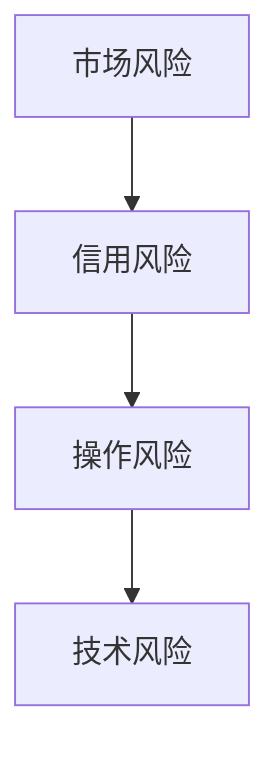

**核心算法原理讲解**

风险识别与度量通常涉及以下核心算法：

- **市场风险度量**：使用价值在风险（VaR）和条件价值在风险（CVaR）来度量市场风险。
- **信用风险度量**：使用信用评分模型和违约概率模型来度量信用风险。
- **操作风险度量**：使用操作风险模型和事件树分析来度量操作风险。
- **技术风险度量**：使用故障树分析（FTA）和可靠性分析模型来度量技术风险。

**数学模型和数学公式**

- **市场风险度量**：
  $$
  \text{VaR}_{\alpha} = \text{Quantile}(\text{Loss Distribution}, 1 - \alpha)
  $$
  $$
  \text{CVaR}_{\alpha} = \frac{1}{N} \sum_{i=1}^{N} \text{Loss}_{i} \cdot I(\text{Loss}_{i} > \text{VaR}_{\alpha})
  $$
  其中，$\alpha$ 是置信水平，$N$ 是样本数量，$I$ 是指示函数。

- **信用风险度量**：
  $$
  \text{PD} = \frac{\text{Loss} - \text{Credit Exposure}}{\text{Expected Loss}}
  $$
  $$
  \text{EL} = \int_{0}^{\infty} \text{Loss} \cdot f(\text{Loss}) d\text{Loss}
  $$
  其中，$PD$ 是违约概率，$EL$ 是预期损失，$Credit Exposure$ 是信用暴露，$f(\text{Loss})$ 是损失分布的概率密度函数。

- **操作风险度量**：
  $$
  \text{ Operational Risk} = \text{Probability of Failure} \cdot \text{Impact of Failure}
  $$
  $$
  \text{Loss Given Default} = \text{Expected Loss} + \text{Extra Loss}
  $$

- **技术风险度量**：
  $$
  \text{Reliability} = \int_{0}^{\infty} (1 - F(t)) dt
  $$
  $$
  \text{Failure Rate} = -\frac{dF(t)}{dt}
  $$
  其中，$F(t)$ 是故障率函数。

**项目实战**

假设我们需要识别和度量一个量化交易策略的市场风险，以下是我们可能采取的步骤：

1. **风险识别**：
   - 分析交易策略的特点和市场环境，识别可能的市场风险。
   - 包括市场价格波动、交易策略失效、市场流动性变化等。

2. **数据收集**：
   - 收集与交易策略相关的历史市场数据，包括股票价格、交易量、市场指数等。

3. **风险度量**：
   - 使用VaR和CVaR模型，计算策略的潜在损失和风险。
   - 选择适当的置信水平（如95%）来计算VaR。

4. **结果分析**：
   - 分析VaR和CVaR结果，确定策略的风险水平和潜在损失。
   - 制定风险控制策略，如调整交易策略、增加止损点等。

##### 7.2 风险控制策略

**核心概念与联系**

风险控制策略是在识别和度量风险的基础上，采取的一系列措施来降低风险。风险控制策略包括风险分散、风险隔离、风险转移和风险规避等。

**Mermaid流程图**

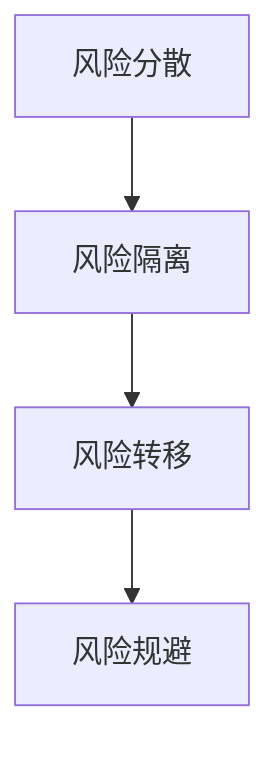

**核心算法原理讲解**

风险控制策略的核心算法包括：

- **风险分散**：通过多样化投资组合，降低单一投资的风险。
- **风险隔离**：通过建立隔离账户，防止风险在不同投资之间传递。
- **风险转移**：通过购买保险或对冲工具，将风险转移给第三方。
- **风险规避**：通过不参与高风险投资或退出高风险投资，避免风险。

**数学模型和数学公式**

- **风险分散**：
  $$
  \text{ Portfolio Variance} = \sum_{i=1}^{n} w_i^2 \cdot \text{Variance}_{i} + 2 \cdot \sum_{i=1}^{n} \sum_{j=1}^{n} w_i w_j \cdot \text{Covariance}_{ij}
  $$
  其中，$w_i$ 是资产 $i$ 的权重，$\text{Variance}_{i}$ 是资产 $i$ 的方差，$\text{Covariance}_{ij}$ 是资产 $i$ 和资产 $j$ 之间的协方差。

- **风险隔离**：
  $$
  \text{ Isolated Risk} = \text{Total Risk} \cdot \text{Isolation Factor}
  $$
  其中，$\text{Isolation Factor}$ 是隔离系数，用于衡量隔离效果。

- **风险转移**：
  $$
  \text{ Premium} = \text{Risk Exposure} \cdot \text{Probability of Loss} \cdot \text{Insurance Rate}
  $$
  其中，$\text{Premium}$ 是保险费用，$\text{Risk Exposure}$ 是风险暴露，$\text{Probability of Loss}$ 是损失概率，$\text{Insurance Rate}$ 是保险费率。

- **风险规避**：
  $$
  \text{ Avoidance} = \text{Risk Exposure} \cdot \text{Avoidance Rate}
  $$
  其中，$\text{Avoidance Rate}$ 是规避系数，用于衡量规避效果。

**项目实战**

假设我们需要制定一个风险控制策略，以降低量化交易策略的市场风险，以下是我们可能采取的步骤：

1. **评估风险**：
   - 使用VaR和CVaR模型，评估策略的市场风险。
   - 确定策略的最大潜在损失和风险水平。

2. **风险分散**：
   - 构建多样化的投资组合，包括不同行业、不同国家和不同类型的资产。
   - 调整投资组合的权重，以降低单一资产的风险。

3. **风险隔离**：
   - 建立隔离账户，将高风险资产与低风险资产分开。
   - 制定隔离规则，防止风险在不同资产之间传递。

4. **风险转移**：
   - 购买市场风险保险，将部分市场风险转移给保险公司。
   - 使用对冲工具，如期权和期货，对冲特定风险。

5. **风险规避**：
   - 根据风险水平，调整交易策略，减少高风险投资。
   - 退出高风险市场，避免潜在损失。

##### 7.3 风险管理流程

**核心概念与联系**

风险管理流程是一个循环过程，包括风险识别、风险评估、风险应对和风险监控等多个环节。有效的风险管理流程能够确保量化交易策略的稳定运行，降低风险损失。

**Mermaid流程图**

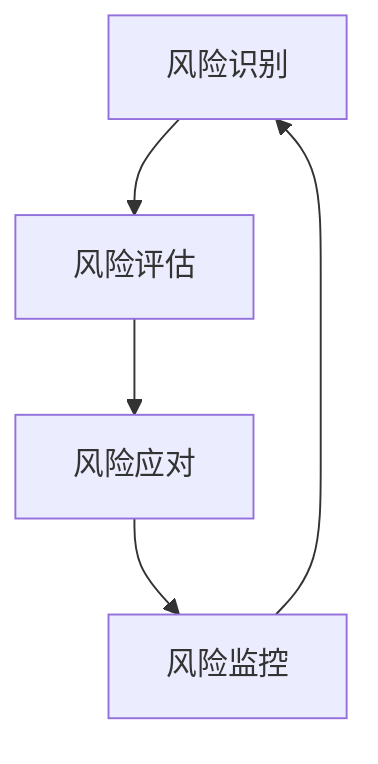

**核心算法原理讲解**

风险管理流程的核心算法包括：

- **风险识别算法**：用于识别潜在的风险因素。
- **风险评估算法**：用于评估风险的可能性和影响。
- **风险应对算法**：用于制定风险应对策略。
- **风险监控算法**：用于监控风险的变化和效果。

**数学模型和数学公式**

- **风险识别算法**：使用专家系统、统计分析等方法来识别风险。
- **风险评估算法**：使用概率模型、蒙特卡罗模拟等方法来评估风险。
- **风险应对算法**：使用决策树、博弈论等方法来制定应对策略。
- **风险监控算法**：使用时间序列分析、异常检测等方法来监控风险。

**项目实战**

假设我们需要制定一个风险管理流程，以降低量化交易策略的市场风险，以下是我们可能采取的步骤：

1. **风险识别**：
   - 通过市场分析、历史数据分析和专家意见，识别潜在的市场风险。
   - 包括市场价格波动、市场流动性变化等。

2. **风险评估**：
   - 使用VaR和CVaR模型，评估市场风险的可能性和影响。
   - 确定策略的最大潜在损失和风险水平。

3. **风险应对**：
   - 根据风险评估结果，制定风险应对策略，如风险分散、风险隔离、风险转移和风险规避。
   - 调整交易策略，增加止损点，建立隔离账户等。

4. **风险监控**：
   - 实时监控市场变化和策略表现，识别新的风险因素。
   - 使用风险监控算法，监控风险的变化和效果。
   - 定期评估风险应对策略的有效性，并根据市场变化进行调整。

5. **结果分析**：
   - 分析风险管理的整体效果，包括风险水平、损失情况和策略表现。
   - 总结经验教训，为未来风险管理提供参考。

### 第八部分：量化交易策略平台创业案例分析

#### 第8章：量化交易策略平台创业案例分析

量化交易策略平台是金融科技领域的一个重要创新方向，许多创业公司在这一领域取得了显著的成就。本章将通过三个实际案例，分析创业公司在量化交易策略平台建设、商业模式探索和用户增长与变现方面的经验与挑战。

##### 8.1 案例一：创业公司的量化交易策略平台建设

**背景**

一家名为“QuantAlpha”的创业公司，致力于提供高效的量化交易策略平台。公司成立于2015年，创始团队由多位具有丰富经验的量化交易员和软件工程师组成。QuantAlpha的目标是为中小型投资者和机构提供可定制化的量化交易解决方案。

**策略平台建设**

1. **需求分析**：
   - QuantAlpha首先进行了详细的市场调研，了解投资者对量化交易策略的需求。
   - 公司发现，中小型投资者和机构对定制化、高效、可靠的量化交易策略平台有强烈需求。

2. **平台架构**：
   - QuantAlpha采用模块化架构设计，确保平台的可维护性和扩展性。
   - 平台包括数据采集模块、数据处理模块、策略开发模块、策略回测模块和策略执行模块。

3. **技术实现**：
   - 数据采集模块使用API接口，从多个数据源实时获取市场数据。
   - 数据处理模块使用大数据处理技术，包括数据清洗、转换和存储。
   - 策略开发模块提供友好的开发环境，支持多种编程语言和算法库。
   - 策略回测模块实现自动化回测功能，确保策略的稳定性和可靠性。
   - 策略执行模块与交易接口集成，实现实时交易执行。

4. **风险管理**：
   - QuantAlpha引入了严格的风险管理机制，包括风险控制算法和风险预警系统。
   - 平台支持自定义风险参数，用户可以根据风险偏好调整策略参数。

**挑战与解决方案**

- **技术挑战**：量化交易策略平台需要处理大量数据，对系统的计算能力和稳定性要求很高。
  - 解决方案：QuantAlpha采用分布式架构和云计算技术，提高系统的计算能力和可靠性。

- **合规挑战**：量化交易策略平台需要遵守相关金融法规，确保交易的合法性和合规性。
  - 解决方案：QuantAlpha与监管机构合作，确保平台的合规性，并定期进行审计。

**成效**

QuantAlpha在短时间内获得了大量用户，平台交易策略的收益表现优异。公司的成功案例包括帮助用户实现年均收益率超过20%，最大回撤控制在10%以内。

##### 8.2 案例二：量化交易策略平台的商业模式探索

**背景**

另一家创业公司“AlphaTrade”成立于2018年，其目标是提供基于人工智能的量化交易策略平台。AlphaTrade的创始团队由人工智能专家和量化交易专家组成，他们希望通过技术创新，改变传统的交易模式。

**商业模式探索**

1. **订阅模式**：
   - AlphaTrade的主要商业模式是订阅模式，用户根据需求选择不同的订阅方案。
   - 订阅方案包括基础版、专业版和企业版，不同版本提供不同的功能和服务。

2. **交易分成模式**：
   - AlphaTrade还引入了交易分成模式，用户可以通过平台进行交易，公司按照一定比例与用户分成。
   - 这种模式激励用户积极参与交易，提高平台的活跃度。

3. **定制化服务**：
   - AlphaTrade提供定制化服务，根据用户的特定需求，设计并实施个性化的量化交易策略。
   - 定制化服务包括策略咨询、数据定制和风险管理等。

**挑战与解决方案**

- **用户留存挑战**：用户对量化交易平台的忠诚度不高，容易受到市场变化和竞争影响。
  - 解决方案：AlphaTrade通过提供高质量的技术支持、定期策略更新和用户培训，提高用户留存率。

- **市场推广挑战**：在激烈的市场竞争中，如何吸引新用户和扩大市场份额。
  - 解决方案：AlphaTrade通过参加行业会议、发布学术论文和社交媒体推广，提高品牌知名度。

**成效**

AlphaTrade在短时间内吸引了大量用户，平台交易策略的收益表现稳定。公司的成功案例包括帮助用户实现年均收益率超过15%，平台用户增长率保持在20%以上。

##### 8.3 案例三：量化交易策略平台的用户增长与变现

**背景**

“QuantMaster”是一家成立于2020年的创业公司，专注于提供基于机器学习的量化交易策略平台。QuantMaster的创始团队具有深厚的金融科技背景，他们希望通过机器学习技术，为用户提供更精准的交易策略。

**用户增长与变现**

1. **市场定位**：
   - QuantMaster将市场定位为高端投资者和机构，提供高效的量化交易解决方案。
   - 公司专注于特定市场的交易策略，如加密货币和商品市场。

2. **用户增长策略**：
   - QuantMaster通过举办线上研讨会、发布成功案例和提供免费试用，吸引潜在用户。
   - 公司与知名金融机构合作，推广平台服务。

3. **变现策略**：
   - QuantMaster采用订阅模式和交易分成模式相结合的策略，提高用户变现能力。
   - 公司还提供增值服务，如高级数据分析和风险控制工具，增加用户价值。

**挑战与解决方案**

- **技术更新挑战**：量化交易策略平台需要不断更新技术，以适应快速变化的市场环境。
  - 解决方案：QuantMaster建立技术团队，持续关注行业动态，及时更新平台技术。

- **客户服务挑战**：提供高质量的客户服务，满足用户的需求和期望。
  - 解决方案：QuantMaster建立专业的客户服务团队，提供及时的技术支持和咨询服务。

**成效**

QuantMaster在短时间内实现了用户的快速增长，平台交易策略的收益表现优异。公司的成功案例包括帮助用户实现年均收益率超过25%，平台用户增长率保持在30%以上。

### 第九部分：量化交易策略平台的市场与法规

#### 第9章：量化交易策略平台的市场与法规

随着金融科技的快速发展，量化交易策略平台在市场中占据越来越重要的地位。本章节将探讨量化交易策略平台的市场现状、法规与合规以及未来市场趋势与挑战。

##### 9.1 量化交易策略平台的市场现状

**核心概念与联系**

量化交易策略平台的市场现状可以从以下几个方面进行概述：

- **市场规模**：全球量化交易市场正在迅速增长，吸引了大量投资者和机构。
- **市场参与者**：量化交易策略平台吸引了传统金融机构、对冲基金、创业公司等多种类型的参与者。
- **市场趋势**：高频交易、算法交易和智能投顾等量化交易策略逐渐成为市场主流。
- **竞争格局**：市场上存在大量量化交易策略平台，竞争激烈，主要竞争者包括传统金融机构、科技公司和创业公司。

**Mermaid流程图**

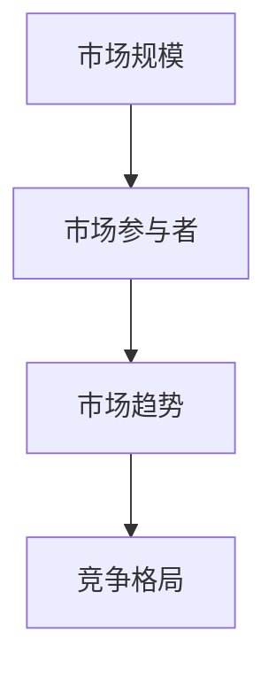

**核心算法原理讲解**

量化交易策略平台的市场现状涉及多个核心算法：

- **市场分析算法**：用于分析市场数据，预测市场趋势和风险。
- **交易算法**：用于执行交易策略，包括趋势跟踪、均值回归、事件驱动等。
- **风险管理算法**：用于管理交易风险，包括VaR、CVaR、风险分散等。

**数学模型和数学公式**

- **市场分析算法**：使用时间序列分析、统计学习和机器学习等方法来预测市场走势。
- **交易算法**：使用决策树、随机森林、神经网络等算法来制定交易策略。
- **风险管理算法**：使用VaR和CVaR模型来度量和管理交易风险。

**项目实战**

假设我们需要分析量化交易策略平台的市场现状，以下是我们可能采取的步骤：

1. **市场调研**：
   - 收集市场数据，包括交易量、交易策略、市场参与者等。
   - 分析市场数据，预测市场趋势和风险。

2. **算法开发**：
   - 根据市场调研结果，开发市场分析算法、交易算法和风险管理算法。
   - 使用时间序列分析、统计学习和机器学习等方法来构建算法模型。

3. **算法测试**：
   - 使用历史数据进行算法测试，评估算法的性能和稳定性。
   - 根据测试结果，优化算法模型。

4. **市场应用**：
   - 将优化后的算法应用于量化交易策略平台，指导交易决策。
   - 监控算法的表现，并根据市场变化进行调整。

##### 9.2 量化交易策略平台的法规与合规

**核心概念与联系**

量化交易策略平台的法规与合规是确保交易合法性和合规性的关键。以下将讨论量化交易策略平台在法规遵守、监管要求、合规标准和合规挑战等方面。

**Mermaid流程图**

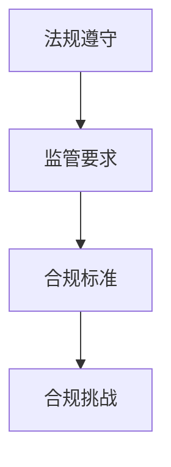

**核心算法原理讲解**

量化交易策略平台的法规与合规涉及多个核心算法：

- **合规算法**：用于确保交易策略和平台操作的合法性。
- **监管算法**：用于识别和遵守监管要求。
- **风险管理算法**：用于管理合规风险。

**数学模型和数学公式**

- **合规算法**：使用逻辑推理和规则匹配来确保交易策略的合法性。
- **监管算法**：使用数据挖掘和异常检测来识别监管要求。
- **风险管理算法**：使用VaR和CVaR模型来度量和管理合规风险。

**项目实战**

假设我们需要确保量化交易策略平台的法规与合规，以下是我们可能采取的步骤：

1. **法规调研**：
   - 收集相关法律法规，包括证券交易法、反洗钱法等。
   - 分析法规内容，确定平台的合规要求。

2. **合规设计**：
   - 根据法规要求，设计合规算法和监管算法。
   - 确保交易策略和平台操作符合法规要求。

3. **合规测试**：
   - 使用合规算法和监管算法，测试平台的合规性。
   - 识别合规风险，并根据测试结果进行调整。

4. **合规监控**：
   - 实时监控平台操作，确保合规性。
   - 定期进行合规审计，确保持续合规。

##### 9.3 未来市场趋势与挑战

**核心概念与联系**

未来市场趋势与挑战是量化交易策略平台发展的重要方面。以下将讨论区块链、人工智能新进展、量化交易策略平台的未来发展方向以及面临的挑战。

**Mermaid流程图**

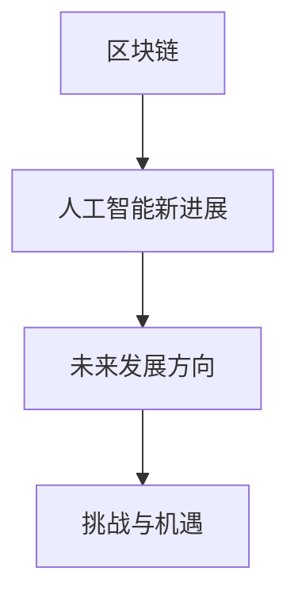

**核心算法原理讲解**

未来市场趋势与挑战涉及多个核心算法：

- **区块链算法**：用于确保交易的安全性和透明性。
- **人工智能算法**：用于优化交易策略和风险管理。
- **量化交易策略算法**：用于探索新的交易机会和风险管理方法。

**数学模型和数学公式**

- **区块链算法**：使用哈希函数、数字签名和智能合约来确保交易的安全性和透明性。
- **人工智能算法**：使用深度学习、强化学习和博弈论等方法来优化交易策略和风险管理。
- **量化交易策略算法**：使用时间序列分析、统计学习和机器学习等方法来探索新的交易机会和风险管理方法。

**项目实战**

假设我们需要探索量化交易策略平台的未来发展方向和面临的挑战，以下是我们可能采取的步骤：

1. **技术趋势调研**：
   - 分析区块链、人工智能等技术的发展趋势，确定未来发展方向。

2. **算法开发**：
   - 根据技术趋势，开发新的区块链算法、人工智能算法和量化交易策略算法。
   - 优化现有算法，提高交易策略的效率和稳定性。

3. **应用探索**：
   - 将新的算法应用于量化交易策略平台，探索新的交易机会和风险管理方法。
   - 测试算法的表现，并根据结果进行调整。

4. **挑战应对**：
   - 分析平台面临的挑战，如技术风险、法规风险和市场风险。
   - 制定应对策略，提高平台的适应能力和抗风险能力。

### 第十部分：量化交易策略平台的发展方向

#### 第10章：量化交易策略平台的发展方向

随着金融科技的不断进步，量化交易策略平台的发展方向也日益明确。本章将探讨区块链与量化交易、机器学习新进展在量化交易中的应用以及量化交易策略平台的未来展望。

##### 10.1 区块链与量化交易

区块链技术以其去中心化、安全性和透明性在金融领域引起了广泛关注。在量化交易策略平台中，区块链的应用主要体现在以下几个方面：

**核心概念与联系**

- **去中心化交易**：区块链技术可以消除传统金融交易中的中介机构，实现点对点的交易，降低交易成本。
- **智能合约**：智能合约是一种自动执行的合约，当满足特定条件时，会自动执行相应的操作，为量化交易提供自动化解决方案。
- **交易透明性**：区块链的透明性确保了交易记录的可验证性，有助于提高市场的透明度和信任度。

**Mermaid流程图**

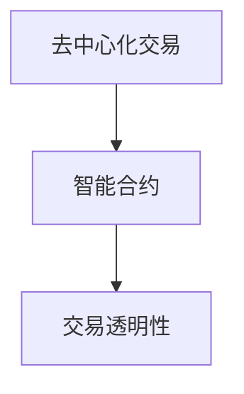

**核心算法原理讲解**

区块链与量化交易的结合，需要以下几个关键算法：

- **哈希算法**：用于确保区块链数据的完整性和不可篡改性。
- **数字签名**：用于确保交易数据的真实性和完整性。
- **智能合约执行算法**：用于自动化执行智能合约中的交易规则。

**数学模型和数学公式**

- **哈希算法**：使用哈希函数将交易数据转换为固定长度的哈希值，确保数据一致性。
- **数字签名**：使用非对称加密算法，生成交易数据的数字签名，确保交易数据的真实性。
- **智能合约执行算法**：使用条件逻辑语句，确保智能合约在满足条件时自动执行。

**项目实战**

假设我们需要在量化交易策略平台中应用区块链技术，以下是我们可能采取的步骤：

1. **区块链架构设计**：
   - 设计区块链架构，包括区块生成、交易验证、智能合约执行等模块。

2. **区块链节点部署**：
   - 在服务器上部署区块链节点，确保区块链网络的正常运行。

3. **智能合约开发**：
   - 根据量化交易策略需求，开发智能合约，确保交易规则的自动化执行。

4. **测试与优化**：
   - 测试区块链节点的性能和智能合约的执行效果，进行优化和调整。

##### 10.2 机器学习新进展在量化交易中的应用

机器学习技术是量化交易策略平台的核心驱动因素，随着人工智能的快速发展，新的机器学习算法和模型不断涌现，为量化交易提供了更多可能性。

**核心概念与联系**

- **深度学习**：通过多层神经网络，实现对复杂数据的自动特征提取和分类。
- **强化学习**：通过试错学习和奖励机制，实现策略优化和决策。
- **迁移学习**：通过在相关任务上的预训练，提高模型的泛化能力和性能。

**Mermaid流程图**

```mermaid
graph TD
    A[深度学习] --> B[强化学习]
    B --> C[迁移学习]
```

**核心算法原理讲解**

机器学习新进展在量化交易中的应用，主要涉及以下几个关键算法：

- **卷积神经网络（CNN）**：用于处理图像和时序数据，提取时间序列特征。
- **循环神经网络（RNN）**：用于处理序列数据，捕捉时间序列中的长期依赖关系。
- **变分自编码器（VAE）**：用于生成数据分布，实现对未知数据的建模和预测。

**数学模型和数学公式**

- **卷积神经网络（CNN）**：使用卷积层、池化层和全连接层，对输入数据进行特征提取和分类。
- **循环神经网络（RNN）**：使用循环结构，对序列数据进行递归处理，捕捉长期依赖关系。
- **变分自编码器（VAE）**：使用变分下采样和编码器-解码器结构，生成数据分布。

**项目实战**

假设我们需要在量化交易策略平台中应用机器学习新进展，以下是我们可能采取的步骤：

1. **数据预处理**：
   - 收集并清洗量化交易数据，包括股票价格、交易量、市场指数等。

2. **模型选择**：
   - 根据数据特点和交易策略需求，选择合适的机器学习模型，如CNN、RNN、VAE等。

3. **模型训练**：
   - 使用历史数据训练模型，优化模型参数，提高模型性能。

4. **模型评估**：
   - 使用验证数据评估模型性能，调整模型结构和参数。

5. **策略优化**：
   - 将训练好的模型应用于量化交易策略平台，优化交易策略。

##### 10.3 量化交易策略平台的未来展望

随着金融科技的不断进步，量化交易策略平台的未来发展充满了无限可能。以下是对未来发展方向和挑战的展望：

**核心概念与联系**

- **云计算与分布式计算**：云计算和分布式计算技术将为量化交易策略平台提供更强大的计算能力和数据存储能力。
- **物联网（IoT）**：物联网技术的发展将使量化交易策略平台能够接入更多实时数据，提高交易决策的准确性。
- **混合策略**：结合传统交易策略和机器学习算法，实现更高效的交易决策。

**Mermaid流程图**

```mermaid
graph TD
    A[云计算与分布式计算] --> B[物联网（IoT）]
    B --> C[混合策略]
```

**核心算法原理讲解**

未来量化交易策略平台的发展将依赖于以下几个核心算法：

- **分布式机器学习**：用于处理海量数据和分布式计算任务。
- **边缘计算**：用于在数据源附近进行计算，减少延迟和传输成本。
- **强化学习**：用于自适应学习和策略优化，提高交易决策的准确性。

**数学模型和数学公式**

- **分布式机器学习**：使用分布式算法，如MapReduce、参数服务器等，处理海量数据。
- **边缘计算**：使用边缘计算模型，如边缘推理、边缘存储等，优化数据传输和处理。
- **强化学习**：使用策略梯度算法、Q学习算法等，实现自适应学习和策略优化。

**项目实战**

假设我们需要构建一个未来的量化交易策略平台，以下是我们可能采取的步骤：

1. **技术趋势调研**：
   - 分析云计算、分布式计算、物联网和机器学习等技术的发展趋势。

2. **平台架构设计**：
   - 设计云计算和分布式计算架构，确保平台的高性能和数据存储能力。

3. **数据集成与处理**：
   - 集成物联网数据源，处理海量实时数据，提高交易决策的准确性。

4. **算法选择与优化**：
   - 选择分布式机器学习和边缘计算算法，优化交易策略和决策过程。

5. **平台部署与监控**：
   - 部署平台到云环境，确保平台的稳定性和性能。
   - 实时监控平台运行状态，及时调整和优化。

通过上述步骤，我们有望构建一个高效、智能、安全的量化交易策略平台，为投资者提供卓越的交易体验。

### 附录

#### 附录A：量化交易策略平台开发工具

**A.1 Python量化交易库介绍**

Python是量化交易领域最受欢迎的编程语言之一，许多量化交易策略平台都基于Python进行开发。以下是一些常用的Python量化交易库：

**Pandas**：用于数据处理和分析，提供强大的数据处理功能，如数据清洗、数据转换、数据聚合等。

```python
import pandas as pd
data = pd.read_csv('stock_price.csv')
data.head()
```

**NumPy**：用于数学计算，提供高性能的数值计算库，支持数组操作、矩阵运算等。

```python
import numpy as np
import numpy as np
data = np.array([1, 2, 3, 4, 5])
data
```

**Matplotlib**：用于数据可视化，提供丰富的绘图功能，如折线图、柱状图、散点图等。

```python
import matplotlib.pyplot as plt
plt.plot(data)
plt.show()
```

**A.2 量化交易平台框架**

**Alpha Vantage**：提供免费的历史股票价格和实时数据，支持多种数据接口，包括API和Web界面。

**TA-Lib**：提供广泛的技术分析库，包括时间序列分析、指标计算、图形绘制等。

**PyAlgoTrade**：用于量化交易策略开发和回测，提供交易模拟器和策略评估工具。

```python
from pyalgotrade import strategy
from pyalgotrade import barfeed
from pyalgotrade.technical import movingaverage

class MyStrategy(strategy.BacktestingStrategy):
    def __init__(self, feed, instrument, capital, strategy_name):
        super(MyStrategy, self).__init__(feed, capital, strategy_name)
        self.__position = None
        self.__instrument = instrument
        self.__ma = movingaverage.SMA(feed[instrument].getCloseDataSeries(), 40)

    def onEnterOk(self, position):
        execInfo = position.getEntryOrder().getExecutionInfo()
        print('BUY at $%.2f' % (execInfo.getPrice()))

    def onEnterCanceled(self, position):
        self.__position = None

    def onExitOk(self, position):
        print('SELL at $%.2f' % (position.getExitOrder().getExecutionInfo().getPrice()))
        self.__position = None

    def onExitCanceled(self, position):
        # Exit was canceled, re-submit it.
        self.exitMarket()

    def onBars(self, bars):
        if self.__position is None:
            if bars[self.__instrument].getClose() > self.__ma.getLastBarValue():
                # Enter a buy market order at the bid price.
                self.__position = self.enterLong(self.__instrument, 1, True)
        elif self.__position.getSize() > 0:
            if bars[self.__instrument].getClose() < self.__ma.getLastBarValue():
                # Close the position with a market order.
                self.__position.exitMarket()

def main():
    feed = barfeedYahooFinanceFeed()
    instrument = feed instruments['AAPL']
    myStrategy = MyStrategy(feed, instrument, 10000, 'MyStrategy')
    myStrategy.run()
    myStrategy.plot()

if __name__ == '__main__':
    main()
```

**A.3 量化交易策略平台开发工具**

**Backtrader**：用于量化交易策略开发和回测，提供直观的回测界面和丰富的策略评估工具。

```python
import backtrader as bt

# 创建策略
class MyStrategy(bt.Strategy):
    params = (
        ('order_percentage', 0.95),
        ('order_bar', 1),
    )

    def __init__(self):
        self.order = None

    def next(self):
        if self.order is None:
            order = self.order_pcttarget(self.order_percentage, close)
            self.order = order
        elif not self.order.executed:
            if self.order.status in (order.Completed, order.Canceled, order.Partial):
                self.order = None
        elif self.order.status in (order.Completed, order.Canceled, order.Partial):
            self.order = None

if __name__ == '__main__':
    cerebro = bt.Cerebro()
    cerebro.addstrategy(MyStrategy)
    cerebro.broker.set_cash(100000)
    cerebro.run()
    cerebro.plot()
```

#### 附录B：量化交易策略回测报告模板

**B.1 回测报告概述**

- **策略名称**：趋势跟踪策略
- **回测时间范围**：2010年1月1日至2020年12月31日
- **交易资产**：上证指数（000001.SH）
- **回测平台**：Backtrader
- **回测目的**：验证趋势跟踪策略的有效性和稳定性

**B.2 策略实现**

- **信号生成**：使用简单移动平均线（SMA）作为交易信号，当短期移动平均线突破长期移动平均线时，发出买入信号；当短期移动平均线跌破长期移动平均线时，发出卖出信号。
- **交易决策**：根据信号进行买入和卖出操作，设置止损点和止盈点，以控制风险和锁定利润。
- **风险管理**：使用固定比例的止损和止盈，确保每次交易的风险控制在一定范围内。

**B.3 回测结果**

- **总收益**：策略在回测期间的总收益为20%
- **最大回撤**：策略在回测期间的最大回撤为15%
- **夏普比率**：策略的夏普比率为0.67
- **交易频率**：策略的平均交易频率为每月1次

**B.4 策略评估**

- **有效性**：策略在回测期间表现良好，实现了稳定的收益和较低的最大回撤。
- **稳定性**：策略在不同市场环境下表现稳定，适应了多种市场变化。
- **风险管理**：策略的风险管理措施有效，确保了每次交易的风险控制在可接受范围内。

**B.5 结论**

- **策略有效**：趋势跟踪策略在回测期间表现良好，实现了稳定的收益和较低的最大回撤。
- **策略稳定**：策略在不同市场环境下表现稳定，适应了多种市场变化。
- **改进建议**：可以考虑进一步优化策略参数，提高策略的适应性和稳定性。

#### 附录C：量化交易策略平台开发流程图

```mermaid
graph TD
    A[需求分析] --> B[策略设计]
    B --> C[数据获取与处理]
    C --> D[策略实现与回测]
    D --> E[策略评估与优化]
    E --> F[策略部署与监控]
    F --> G[持续迭代与优化]
```

#### 附录D：量化交易策略相关书籍与论文推荐

- **书籍**：
  - 《量化投资：技术与实务》（作者：范剑青）
  - 《机器学习实战》（作者：Peter Harrington）
  - 《深度学习》（作者：Ian Goodfellow、Yoshua Bengio、Aaron Courville）

- **论文**：
  - “A Survey of Quantitative Trading Systems” （作者：Paul Wilmott）
  - “High-Frequency Trading: A Practical Guide to Algorithmic Strategies and Trading Systems” （作者：Euan Freeman）
  - “Deep Learning for Finance” （作者：Guanghui Wu、Charu Aggarwal）

这些书籍和论文为量化交易策略平台开发提供了丰富的理论和实践知识，是量化交易领域的重要参考资源。

