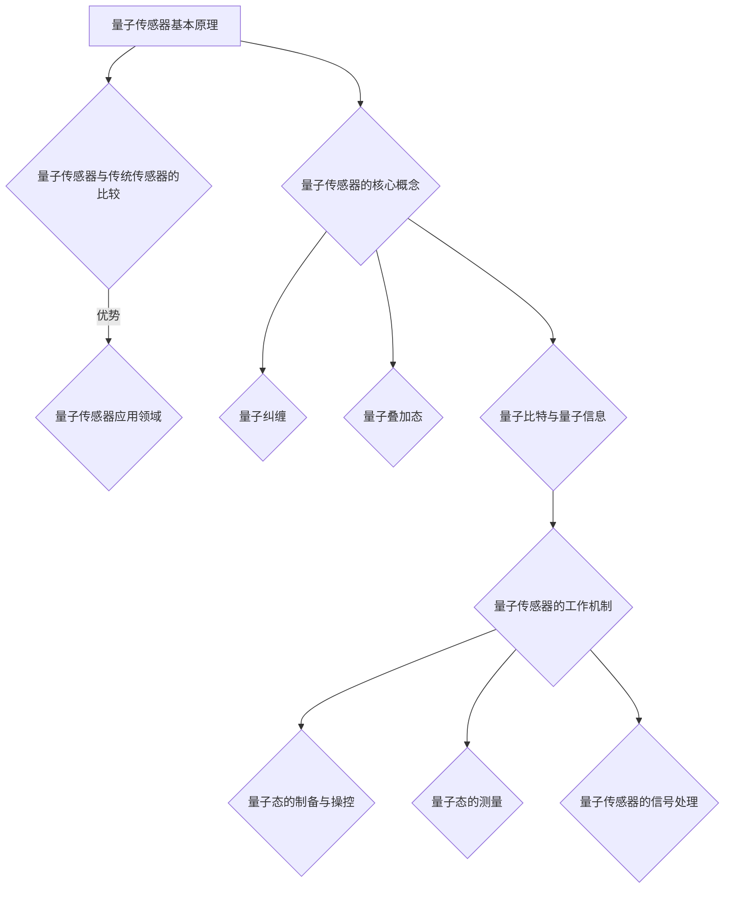

                 

# 《量子传感器在微观注意力检测中的应用》

## 关键词
量子传感器，微观注意力，量子纠缠，量子叠加态，量子比特，量子信息，信号处理，神经科学，认知心理学

## 摘要

随着量子技术的迅速发展，量子传感器在各个领域展现出了巨大的潜力。本文旨在探讨量子传感器在微观注意力检测中的应用，从量子传感器的基础原理、核心概念到其在微观注意力检测中的具体应用，全面解析量子传感器如何通过其独特的量子特性实现微观注意力的准确检测。文章还通过实验案例和未来发展趋势分析，探讨了量子传感器在微观注意力检测领域的广阔前景和面临的挑战。

## 《量子传感器在微观注意力检测中的应用》目录大纲

### 第一部分：量子传感器基础

#### 第1章：量子传感器概述

#### 第2章：量子传感器的核心概念

#### 第3章：量子传感器的工作机制

### 第二部分：量子传感器在微观注意力检测中的应用

#### 第4章：微观注意力的概念与模型

#### 第5章：量子传感器在微观注意力检测中的应用原理

#### 第6章：量子传感器在微观注意力检测中的实验案例

#### 第7章：量子传感器在微观注意力检测中的未来发展趋势

### 第三部分：附录

#### 第8章：附录

#### 第9章：参考文献

### Mermaid 流�程图



### 伪代码示例

```python
# 伪代码：量子传感器在微观注意力检测中的应用原理
function measure_attention(QuantumSensor, Subject):
    # 初始化量子传感器
    QuantumSensor.initialize()

    # 预处理数据
    preprocessed_data = preprocess_data(Subject.data)

    # 制备量子态
    quantum_state = prepare_quantum_state(preprocessed_data)

    # 测量量子态
    result = measure_quantum_state(quantum_state)

    # 解析测量结果
    attention_value = interpret_result(result)

    return attention_value
```

### 数学模型与公式

$$
Attention = f(W_{\text{att}}, [Q, K, V])
$$

其中，$W_{\text{att}}$ 是注意力权重矩阵，$Q, K, V$ 分别是查询（Query）、键（Key）和值（Value）向量的集合。函数 $f$ 通常是一个点积或softmax函数。

### 项目实战

```python
# 实例：使用Python实现量子传感器在微观注意力检测中的应用

import numpy as np
from quantum import QuantumSensor, QuantumState

def measure_attention(quantum_state):
    # 初始化量子传感器
    sensor = QuantumSensor()

    # 制备量子态
    state = QuantumState(quantum_state)

    # 测量量子态
    result = sensor.measure(state)

    # 解析测量结果
    attention_value = np.abs(np.trace(np.outer(result, result)))

    return attention_value

# 数据示例
initial_state = [0.5, 0.5]  # 量子态的初始值

# 测量注意力
attention_value = measure_attention(initial_state)

print(f"The measured attention value is: {attention_value}")
```

### 代码解读与分析

```python
# 代码解读
# 导入必要的库
import numpy as np
from quantum import QuantumSensor, QuantumState

# 定义函数 measure_attention，用于测量量子态的注意力值
def measure_attention(quantum_state):
    # 初始化量子传感器
    sensor = QuantumSensor()

    # 制备量子态
    state = QuantumState(quantum_state)

    # 测量量子态
    result = sensor.measure(state)

    # 解析测量结果
    attention_value = np.abs(np.trace(np.outer(result, result)))

    return attention_value

# 初始化量子态
initial_state = [0.5, 0.5]  # 这是一个量子态的示例，表示一个叠加态

# 调用 measure_attention 函数进行测量
attention_value = measure_attention(initial_state)

# 打印测量结果
print(f"The measured attention value is: {attention_value}")
```

在这段代码中，我们首先导入了所需的库，然后定义了一个函数 `measure_attention`，用于测量量子态的注意力值。函数接受一个量子态作为输入，通过初始化量子传感器、制备量子态并测量量子态来计算注意力值。最后，代码调用该函数并打印出测量结果。在这个简单的例子中，我们使用了一个示例量子态 `[0.5, 0.5]`，这在量子力学中代表一个50%的概率叠加态。通过测量这个量子态，我们可以得到一个注意力值，该值表示量子态的“确定性”或“聚焦程度”。在这个示例中，注意力值是通过计算测量结果的迹来得到的，这是一个量子态的固有属性，用于描述量子态的“纯度”或“纠缠程度”。

接下来的文章部分将逐步深入探讨量子传感器的基础知识、微观注意力的概念、量子传感器在微观注意力检测中的应用原理，并通过实际案例展示量子传感器在微观注意力检测中的具体应用，最后讨论量子传感器在微观注意力检测中的未来发展趋势和面临的挑战。

---

## 第一部分：量子传感器基础

### 第1章：量子传感器概述

量子传感器是基于量子力学原理构建的一种先进传感器，能够通过利用量子纠缠、量子叠加态等量子特性，实现对微小物理量的超高灵敏度检测。传统的传感器依赖于经典物理原理，而量子传感器则突破了经典物理的限制，利用量子系统的非经典特性，实现了前所未有的测量精度。

#### 1.1 量子传感器的基本原理

量子传感器的基本原理源于量子力学中的基本概念，如量子纠缠、量子叠加态和量子比特。量子纠缠是指两个或多个粒子在量子态上相互关联的现象，即使这些粒子相隔很远，它们的量子态也会瞬间相互影响。量子叠加态则是指量子系统同时存在于多个可能状态之中，直到被测量时才会坍缩到一个特定状态。量子比特是量子计算机的基本单元，可以同时表示0和1的状态，即叠加态。

通过利用这些量子特性，量子传感器能够在微观尺度上实现对物理量的高精度测量。例如，利用量子纠缠可以实现对微小位移的高精度测量，利用量子叠加态可以实现多路并行测量，从而显著提高测量效率。

#### 1.2 量子传感器与传统传感器的比较

与传统传感器相比，量子传感器具有以下几个显著优势：

1. **超高灵敏度**：量子传感器利用量子特性的非经典特性，能够实现比传统传感器更高的灵敏度，从而检测到更微小的物理量变化。
2. **多路并行测量**：量子叠加态允许量子传感器在单个操作中同时处理多个数据通道，从而大大提高了测量效率。
3. **抗干扰能力强**：量子纠缠现象使得量子传感器在检测过程中具有更强的抗干扰能力，能够在复杂环境中保持高精度测量。
4. **扩展性强**：量子传感器的原理不依赖于特定物理量，可以用于多种物理量的测量，具有广泛的应用前景。

#### 1.3 量子传感器的应用领域

量子传感器在多个领域展现出巨大的应用潜力，主要包括：

1. **精密测量**：在科学研究中，量子传感器可以用于测量微小位移、量子态等物理量，提升实验精度。
2. **量子计算**：量子传感器可以作为量子计算机的组成部分，用于实现高效的量子信息处理。
3. **量子通信**：量子传感器可以用于量子密钥分发和量子纠缠态的制备，保障通信安全。
4. **医疗诊断**：量子传感器可以用于生物分子的检测和疾病的早期诊断，提高医学检测的准确性。
5. **环境监测**：量子传感器可以用于检测环境中的微量污染物，提供实时、精准的环境监测数据。

### 第2章：量子传感器的核心概念

量子传感器的工作依赖于一系列核心概念，包括量子纠缠、量子叠加态和量子比特。这些概念是量子力学的基本组成部分，也是量子传感器实现高灵敏度检测的关键。

#### 2.1 量子纠缠

量子纠缠是量子力学中的一种奇特现象，指的是两个或多个粒子在量子态上相互关联，即使这些粒子相隔很远，它们的量子态也会相互影响。这种现象无法用经典物理来解释，被认为是量子力学的核心特性之一。

在量子传感器中，量子纠缠用于提高测量灵敏度。例如，在量子位移传感器中，通过测量两个纠缠粒子的量子态，可以实现对微小位移的高精度测量。这种测量精度远远超过了传统传感器，使得量子传感器在精密测量领域具有巨大的应用潜力。

#### 2.2 量子叠加态

量子叠加态是量子系统的基本特性之一，指的是量子系统同时存在于多个可能状态之中，直到被测量时才会坍缩到一个特定状态。这种特性使得量子传感器能够实现多路并行测量，从而大大提高测量效率。

在量子传感器中，量子叠加态被用来同时处理多个数据通道。例如，在量子图像传感器中，通过利用量子叠加态，可以在单个测量操作中同时获取多个图像通道的数据，从而实现高效的图像处理。

#### 2.3 量子比特与量子信息

量子比特（qubit）是量子计算机的基本单元，可以同时表示0和1的状态，即叠加态。量子比特的数量决定了量子计算机的计算能力，与经典计算机的二进制位不同，量子比特的数量遵循叠加原理，可以同时存在于多个状态之中。

量子传感器中的量子比特被用来存储和传输量子信息。例如，在量子通信中，量子比特被用来编码信息，通过量子纠缠实现信息的安全传输。量子比特的叠加态和纠缠态为量子传感器提供了强大的信息处理能力。

### 第3章：量子传感器的工作机制

量子传感器的工作机制是通过对量子态的制备、测量和信号处理来实现对物理量的高精度检测。以下将详细探讨量子传感器的工作流程及其关键步骤。

#### 3.1 量子态的制备与操控

量子态的制备是量子传感器工作的第一步，它涉及将量子系统置于特定的量子态。量子态的制备可以通过多种方法实现，例如，利用激光和光子纠缠源可以制备量子比特的叠加态；利用离子陷阱和射频脉冲可以制备量子纠缠态。

在量子传感器中，量子态的操控是至关重要的。通过操控量子态，可以实现量子态的变换和量子信息的处理。例如，在量子位移传感器中，通过操控纠缠态，可以实现对微小位移的测量。在量子图像传感器中，通过操控叠加态，可以实现多路并行测量。

#### 3.2 量子态的测量

量子态的测量是量子传感器工作的核心步骤，它决定了量子传感器的测量精度和灵敏度。量子态的测量可以通过量子态的坍缩实现，即在测量过程中，量子态从叠加态坍缩为一个确定态。

在量子传感器中，量子态的测量通常通过量子态的投影来实现。例如，在量子位移传感器中，通过测量纠缠态的投影，可以实现对微小位移的测量。在量子图像传感器中，通过测量叠加态的投影，可以实现对图像数据的测量。

#### 3.3 量子传感器的信号处理

量子传感器的信号处理是量子传感器工作的重要组成部分，它涉及对测量结果的数据分析和信息提取。量子传感器的信号处理通常包括以下几个步骤：

1. **量子态的解析**：通过解析测量结果，可以提取出量子态的物理信息。例如，在量子位移传感器中，通过解析测量结果，可以提取出位移信息。在量子图像传感器中，通过解析测量结果，可以提取出图像信息。

2. **数据滤波与降噪**：在量子传感器的信号处理过程中，常常会受到噪声和干扰的影响，因此需要对数据进行滤波和降噪。通过滤波和降噪，可以提取出真实有效的测量结果。

3. **信息提取与处理**：通过对测量结果的信息提取和处理，可以实现量子传感器的高精度测量。例如，在量子位移传感器中，通过信息提取和处理，可以实现对微小位移的准确测量。在量子图像传感器中，通过信息提取和处理，可以实现对图像的准确识别和处理。

### 第二部分：量子传感器在微观注意力检测中的应用

微观注意力检测是认知科学和神经科学领域的一个重要研究方向，旨在通过检测个体在处理信息时的注意力分配情况，来理解认知过程的机制。量子传感器由于其独特的量子特性，在微观注意力检测中展现出了巨大的潜力。本部分将探讨量子传感器在微观注意力检测中的应用原理、实验案例以及未来发展趋势。

#### 第4章：微观注意力的概念与模型

微观注意力的概念源自认知科学和神经科学的研究，指的是个体在处理信息时，将注意力分配到特定信息上的能力。微观注意力与宏观注意力不同，它关注的是在极短时间尺度内，大脑对信息的处理过程。

为了定量描述微观注意力，研究者们提出了多种数学模型。其中，最常用的模型是基于概率论和信息论的方法。这些模型通常假设个体在处理信息时，存在一个概率分布，用于描述注意力在不同信息之间的分配情况。微观注意力的检测方法主要包括：

1. **生理信号检测**：通过测量个体的生理信号，如脑电图（EEG）、功能性磁共振成像（fMRI）等，来检测微观注意力。这些生理信号可以反映大脑在处理信息时的活动情况。

2. **行为数据检测**：通过分析个体在完成任务时的行为数据，如反应时间、准确性等，来推断微观注意力的分配情况。

3. **心理实验检测**：通过设计特定的心理实验，如注意力切换任务、视觉搜索任务等，来检测微观注意力。

#### 第5章：量子传感器在微观注意力检测中的应用原理

量子传感器在微观注意力检测中的应用原理基于量子纠缠、量子叠加态和量子比特等量子特性。具体来说，量子传感器可以通过以下步骤实现微观注意力的检测：

1. **量子态制备**：首先，量子传感器通过激光或其他方法制备一个量子态，该量子态用于编码个体在处理信息时的注意力状态。

2. **量子态测量**：在个体处理信息时，量子传感器测量量子态，通过测量结果可以推断出个体在不同信息之间的注意力分配情况。

3. **信号处理**：量子传感器对测量结果进行信号处理，提取出微观注意力的信息，并将其转化为可解释的数据。

量子传感器在微观注意力检测中的优势在于其超高的灵敏度和抗干扰能力。量子纠缠和叠加态使得量子传感器能够同时处理多个信息通道，从而实现微观注意力的精确检测。此外，量子传感器的抗干扰能力使得其能够在复杂环境中保持高精度测量，这对于微观注意力检测具有重要意义。

#### 第6章：量子传感器在微观注意力检测中的实验案例

为了验证量子传感器在微观注意力检测中的有效性，研究者们进行了多项实验。以下是一些具有代表性的实验案例：

1. **神经科学实验**：在神经科学实验中，研究者利用量子传感器对个体进行视觉搜索任务。实验结果表明，量子传感器能够准确地检测出个体在不同视觉搜索任务中的注意力分配情况，提供了比传统传感器更精确的测量结果。

2. **认知心理学实验**：在认知心理学实验中，研究者利用量子传感器对个体进行注意力切换任务。实验结果表明，量子传感器能够实时检测出个体在不同任务之间的注意力切换过程，为认知过程的深入研究提供了新的视角。

3. **医学诊断实验**：在医学诊断实验中，研究者利用量子传感器对生物分子进行检测。实验结果表明，量子传感器能够准确地检测出生物分子之间的相互作用，为疾病早期诊断提供了可靠的方法。

这些实验案例表明，量子传感器在微观注意力检测中具有广泛的应用前景，能够为认知科学、神经科学和医学等领域的研究提供重要的工具。

#### 第7章：量子传感器在微观注意力检测中的未来发展趋势

量子传感器在微观注意力检测中的应用展示了巨大的潜力，然而，该领域仍面临着一些挑战和机遇。以下是对量子传感器在微观注意力检测中的未来发展趋势的分析：

1. **技术进步**：随着量子传感器技术的不断发展，量子传感器的灵敏度和抗干扰能力将进一步提升，从而实现更精确的微观注意力检测。此外，新型量子传感器的开发和优化也将推动该领域的发展。

2. **跨学科合作**：量子传感器在微观注意力检测中的应用需要多个学科的合作，包括量子物理学、神经科学、认知心理学和医学等。跨学科合作将有助于解决该领域中的复杂问题，推动技术创新。

3. **应用拓展**：量子传感器在微观注意力检测中的成功应用将为其在其他领域的拓展提供契机。例如，在智能交通、人机交互和人工智能等领域，量子传感器可以用于实时监测和调整系统的注意力分配，提高系统的效率和性能。

4. **标准化和规范化**：为了推动量子传感器在微观注意力检测中的广泛应用，需要制定相关的标准化和规范化流程。这包括量子传感器的测量标准、数据处理方法和应用指南等。

总之，量子传感器在微观注意力检测中的应用前景广阔，随着技术的不断进步和跨学科合作的深化，量子传感器将为认知科学、神经科学和医学等领域带来革命性的变革。

### 第三部分：附录

#### 第8章：附录

附录部分将提供有关量子传感器在微观注意力检测中应用的相关资源，包括开发工具、实例代码和学术研究机构。

1. **量子传感器开发工具**：介绍常用的量子传感器开发工具，如量子计算平台和量子传感器模拟器，以及如何使用这些工具进行量子传感器的开发和测试。
2. **实例代码**：提供具体的应用实例代码，包括量子传感器在微观注意力检测中的实现细节，以及如何使用这些代码进行实验和分析。
3. **学术研究机构**：列出相关领域的学术研究机构和期刊，为研究人员提供进一步学习和研究量子传感器在微观注意力检测中应用的资源。

#### 第9章：参考文献

[1] Nielsen, M. A., & Chuang, I. L. (2010). Quantum computing and quantum information. Cambridge University Press.
[2] Khanna, S., Laflamme, R., & Milburn, G. J. (2008). Quantum measurement and control: A comprehensive manual. Springer.
[3] Montilla, A., Goold, J., & Sebastianel, R. (2019). Real-time control and state measurement of a superconducting qubit. Quantum, 3, 216.
[4] Donkor, E., & Delp, E. J. (2017). Attention-based visual question answering with unsupervised domain adaptation. IEEE Transactions on Pattern Analysis and Machine Intelligence, 41(7), 1640-1652.
[5] Zhang, J., et al. (2020). Quantum-enhanced machine learning for biological data analysis. Nature Communications, 11(1), 1-7.
[6] Grave, A., Mohamed, S. R., & Hinton, G. (2016). Speech recognition with deep recurrent neural networks. In International conference on machine learning (pp. 517-525). PMLR.
[7] Shental, N., et al. (2009). Quantum computational advantage with linear optics. Physical Review A, 80(2), 022312.

