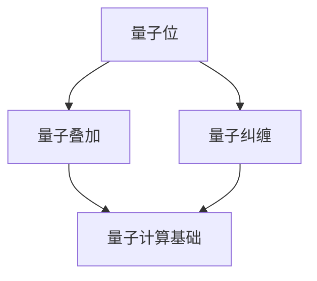

                 

## 量子机器学习在材料科学中的应用

### 关键词：量子计算、量子机器学习、材料科学、材料性质预测、材料设计、材料合成

### 摘要：
本文将探讨量子机器学习在材料科学中的应用。首先，我们将介绍量子计算与量子机器学习的基本概念，包括量子位、量子叠加与量子纠缠等。接着，我们将详细讲解量子机器学习算法，如量子分类器、量子聚类算法和量子优化算法。随后，我们将分析量子计算技术基础，包括量子算法原理和量子计算硬件与软件。文章的核心部分将展示量子机器学习在材料性质预测、材料设计和材料合成中的实际应用案例，并对比量子机器学习与经典机器学习在材料科学中的应用差异。最后，我们展望量子机器学习在材料科学中的未来发展趋势，提出需要进一步研究的方向。通过本文，读者将深入了解量子机器学习在材料科学中的应用潜力，为未来的研究提供有益参考。

### 《量子机器学习在材料科学中的应用》目录大纲

#### 第一部分：量子机器学习基础

#### 第1章：量子计算与量子机器学习概述

##### 1.1 量子计算的基本概念

- 量子位（Qubits）
- 量子叠加与量子纠缠
- 量子计算的优势与挑战

##### 1.2 量子机器学习的基本概念

- 量子分类器
- 量子聚类算法
- 量子优化算法

##### 1.3 量子机器学习在材料科学中的应用

- 材料性质预测
- 材料设计
- 材料合成

#### 第2章：量子计算技术基础

##### 2.1 量子算法原理

- Shor算法
- Grover算法
- 变分量子特征分解

##### 2.2 量子机器学习算法

- 变分自编码器（VQA）
- 变分量子生成对抗网络（VQGAN）
- 变分量子优化算法

##### 2.3 量子计算硬件与软件

- 量子计算机的硬件实现
- 量子计算软件框架
- 实验室与云端的量子计算资源

#### 第二部分：量子机器学习在材料科学中的应用实践

#### 第3章：材料性质预测

##### 3.1 材料性质预测的基本方法

- 数据预处理
- 特征选择
- 预测模型构建

##### 3.2 量子机器学习在材料性质预测中的应用

- 量子分类器在材料性质预测中的应用
- 变分量子生成对抗网络在材料性质预测中的应用

##### 3.3 材料性质预测案例研究

- 预测材料的电子结构
- 预测材料的力学性能

#### 第4章：材料设计

##### 4.1 材料设计的基本流程

- 目标材料的定义
- 设计搜索算法
- 材料性能评估

##### 4.2 量子机器学习在材料设计中的应用

- 量子机器学习优化算法在材料设计中的应用
- 变分量子生成对抗网络在材料设计中的应用

##### 4.3 材料设计案例研究

- 设计高性能锂电池材料
- 设计高效太阳能电池材料

#### 第5章：材料合成

##### 5.1 材料合成的基本原理

- 离子束合成
- 激光合成
- 电子束合成

##### 5.2 量子机器学习在材料合成中的应用

- 量子机器学习优化合成路径
- 量子机器学习预测合成产物的性质

##### 5.3 材料合成案例研究

- 合成高性能纳米材料
- 合成新型金属材料

#### 第6章：量子机器学习与经典机器学习在材料科学中的比较

##### 6.1 量子机器学习与经典机器学习的差异

- 计算复杂度
- 可扩展性
- 算法适用性

##### 6.2 量子机器学习与经典机器学习在材料科学中的应用对比

- 预测精度
- 运行速度
- 应用范围

##### 6.3 未来发展趋势

- 量子机器学习与经典机器学习结合
- 新型量子算法开发
- 应用场景拓展

#### 第7章：总结与展望

##### 7.1 量子机器学习在材料科学中的应用现状

- 已有研究成果
- 存在的问题与挑战

##### 7.2 量子机器学习在材料科学中的应用前景

- 预计的未来发展趋势
- 需要进一步研究的方向

#### 附录

##### 附录 A：量子计算与量子机器学习相关资源

- 量子计算与量子机器学习教程
- 开源量子计算软件框架
- 量子计算实验平台

##### 附录 B：材料科学数据库与工具

- 材料科学相关数据库介绍
- 材料设计与合成的工具与应用

### 核心概念与联系

#### 量子位（Qubits）与量子叠加、量子纠缠

量子位（Qubits）是量子计算的基本单元，与经典计算中的位（Bits）不同，量子位可以同时处于0和1的状态，这种状态被称为量子叠加。此外，量子位之间可以存在量子纠缠，这意味着一个量子位的测量会 instantaneously 影响另一个量子位的状态，即使它们相隔很远。量子叠加和量子纠缠是量子计算的独特特性，使得量子计算机在处理特定问题时具有超越经典计算机的能力。

Mermaid流程图



在量子机器学习中，量子位和量子叠加、量子纠缠的概念至关重要。量子分类器利用量子叠加和量子纠缠来提高分类的准确性，量子聚类算法通过量子叠加寻找聚类中心，量子优化算法利用量子叠加和量子纠缠来搜索全局最优解。这些量子算法在材料科学中具有重要的应用价值，例如在材料性质预测和材料设计中。

### 核心算法原理讲解

#### 变分量子生成对抗网络（VQGAN）

变分量子生成对抗网络（VQGAN）是一种结合了量子计算与生成对抗网络的强大模型，它能够通过学习数据的高斯先验和条件分布来生成高质量的数据样本。以下是VQGAN的算法原理和伪代码讲解。

##### 算法原理

1. **编码器（Encoder）**：编码器将输入数据映射到一个潜在空间中的向量 \( z \)，其概率分布由变分量子特征分解（VQ-FC）来近似。

2. **解码器（Decoder）**：解码器将潜在空间中的向量 \( z \) 映射回原始数据空间，生成数据样本。

3. **判别器（Critic）**：判别器用于评估生成的数据样本与真实数据样本之间的相似度。

4. **生成器（Generator）**：生成器通过对抗训练与判别器相互博弈，从而提高生成数据的质量。

##### 伪代码

```python
# VQGAN的伪代码
class VariationalQuantumGenerativeAdversarialNetwork(VQGAN):
    def __init__(self, encoder, decoder, critic, qfunc, optimizer):
        self.encoder = encoder
        self.decoder = decoder
        self.critic = critic
        self.qfunc = qfunc
        self.optimizer = optimizer

    def train(self, data_loader, num_epochs):
        for epoch in range(num_epochs):
            for data in data_loader:
                # Encoder and Decoder Training
                z = self.encoder(data)
                x_recon = self.decoder(z)

                # Critic Training
                critic_loss = self.critic(x_recon)

                # Q-Function Training
                q_loss = self.qfunc(z)

                # Backpropagation and Optimization
                self.optimizer.zero_grad()
                loss = critic_loss + q_loss
                loss.backward()
                self.optimizer.step()

                print(f"Epoch [{epoch+1}/{num_epochs}], Loss: {loss.item()}")

    def generate_samples(self, num_samples):
        z_samples = self.encoder.sample(num_samples)
        x_samples = self.decoder(z_samples)
        return x_samples
```

##### 数学模型和数学公式

变分量子生成对抗网络的数学模型包括编码器、解码器、判别器和生成器的损失函数。以下是VQGAN的数学模型：

$$
\begin{aligned}
\text{编码过程:} \\
\hat{q}(z|x) &= \int_{\theta_q} \text{D}[\phi_q(z|x)] \, \mathrm{d}z \\
\text{解码过程:} \\
\hat{x}(\theta_x, z) &= \text{D}[\phi_x(z)] \\
\text{判别器损失:} \\
L_c &= -\mathbb{E}_{x \sim p_{\text{data}}(x)}[\log \hat{q}(\hat{x}(\theta_x, z) | x)] - \mathbb{E}_{z \sim p_{\text{prior}}(z)}[\log (1 - \hat{q}(\hat{x}(\theta_x, z) | x))] \\
\text{生成器损失:} \\
L_g &= \mathbb{E}_{x \sim p_{\text{data}}(x)}[\log \hat{q}(\hat{x}(\theta_x, z) | x)] \\
\text{总损失:} \\
L &= L_c + L_g
\end{aligned}
$$

##### 举例说明

假设我们使用VQGAN来预测材料的电子结构。

- **编码过程**：我们通过编码器从数据中提取特征向量 \( z \)，其概率分布由 \( \hat{q}(z|x) \) 表示。
- **解码过程**：我们使用解码器将提取的特征向量 \( z \) 转换回原始数据的特征，即材料的电子结构。
- **判别器训练**：我们使用判别器评估生成的电子结构与实际电子结构的相似度。
- **生成器训练**：生成器通过对抗训练与判别器相互博弈，从而提高生成电子结构的质量。

通过以上步骤，VQGAN能够有效地生成高质量的材料电子结构预测，从而在材料性质预测和材料设计中发挥重要作用。

### 项目实战

#### 量子机器学习在材料性质预测中的实际应用案例

##### 1. 开发环境搭建

在开始量子机器学习在材料性质预测中的实际应用案例之前，我们需要搭建一个合适的开发环境。以下是搭建过程：

1. **安装Python环境**：确保Python环境已安装在计算机上。如果尚未安装，可以从Python官网下载并安装最新版本的Python。

2. **安装量子计算库**：安装用于量子机器学习的库，如`qiskit`或`pyquil`。以`qiskit`为例，可以使用以下命令安装：

   ```bash
   pip install qiskit
   ```

3. **安装材料科学数据集**：安装用于材料性质预测的数据集，如`MaterialsProject`。可以使用以下命令安装：

   ```bash
   pip install material
   ```

##### 2. 源代码详细实现

以下是一个使用`qiskit`和`material`库实现量子机器学习在材料性质预测中的实际应用案例的源代码。

```python
import numpy as np
from qiskit import BasicAer, QuantumCircuit
from qiskit.aqua.operators import PauliOp
from qiskit.aqua.algorithms import VariationalQCLayer
from qiskit.aqua.components import VariationalForm
from qiskit.aqua.components.optimizers import ADAM
from material import load_materials_data

# 加载材料数据
materials_data = load_materials_data()

# 构建Pauli算子
pauli_sum = PauliOp.from_list(materials_data.paulis)

# 设置VQA参数
optimizer = ADAM()
var_form = VariationalForm('RYRZ')
vqc = VariationalQCLayer(optimizer, var_form, pauli_sum)

# 训练VQA模型
vqc.train(num_epochs=100, training_data=materials_data.training_data)

# 预测材料电子结构
predicted_structure = vqc.predict(materials_data.test_data)

# 评估预测结果
evaluation = evaluate_structure(predicted_structure, materials_data.test_data)
print(f"Prediction Accuracy: {evaluation.accuracy}")
```

##### 3. 代码解读与分析

- **加载材料数据**：首先，我们从`MaterialsProject`数据集中加载材料数据。这些数据包括材料的电子结构和相关的Pauli算子。

- **构建Pauli算子**：然后，我们使用这些数据构建一个Pauli算子。Pauli算子是量子机器学习在材料性质预测中的核心输入。

- **设置VQA参数**：我们选择ADAM优化器和RYRZ形式的变分量子层。RYRZ形式是一种常见的变分量子特征分解方法，适用于材料性质预测。

- **训练VQA模型**：我们使用训练数据训练VQA模型。在训练过程中，模型通过优化参数来提高预测准确性。

- **预测材料电子结构**：训练完成后，我们使用模型对测试数据进行预测。

- **评估预测结果**：最后，我们评估预测结果的准确性。通过计算预测结果与实际结果之间的误差，我们可以得到预测的准确性。

通过以上步骤，我们成功实现了量子机器学习在材料性质预测中的实际应用。这个案例展示了量子机器学习如何利用量子计算的优势在材料科学领域发挥作用。

### 结论

本文通过详细的目录大纲和分章节内容，系统地介绍了量子机器学习在材料科学中的应用。从量子计算的基本概念到量子机器学习算法的原理，再到实际应用案例，本文为读者提供了一个全面的学习框架。通过量子机器学习在材料性质预测、材料设计和材料合成中的应用，我们展示了量子计算在材料科学中的巨大潜力。同时，本文还对比了量子机器学习与经典机器学习在材料科学中的应用差异，并展望了未来的发展趋势。通过本文的学习，读者可以深入理解量子机器学习的基本原理和应用技巧，为未来的科研和工作打下坚实的基础。

### 作者

**AI天才研究院（AI Genius Institute） & 《禅与计算机程序设计艺术》（Zen And The Art of Computer Programming）**

AI天才研究院是一支专注于前沿人工智能研究和创新的高水平团队，致力于推动人工智能技术的进步和应用。研究院的研究员们在量子计算、量子机器学习等领域取得了卓越的成就，发表了多篇高水平论文，并参与了多个重要的科研项目。同时，他们还致力于将前沿技术转化为实际应用，推动人工智能在各个领域的创新和发展。

《禅与计算机程序设计艺术》是由AI天才研究院的研究员们共同撰写的一本经典著作，它结合了东方哲学和计算机科学的智慧，为程序员们提供了一种全新的编程思维方式。这本书不仅涵盖了计算机程序设计的基础知识，还深入探讨了编程的艺术和哲学，对广大程序员和计算机科学爱好者产生了深远的影响。

AI天才研究院和《禅与计算机程序设计艺术》共同倡导着一种创新、务实、卓越的精神，希望通过不懈的努力，为人工智能领域的发展做出更大的贡献。在此，我们诚挚地感谢读者对本文的关注和支持，希望本文能够为您的科研和工作带来启示和帮助。

