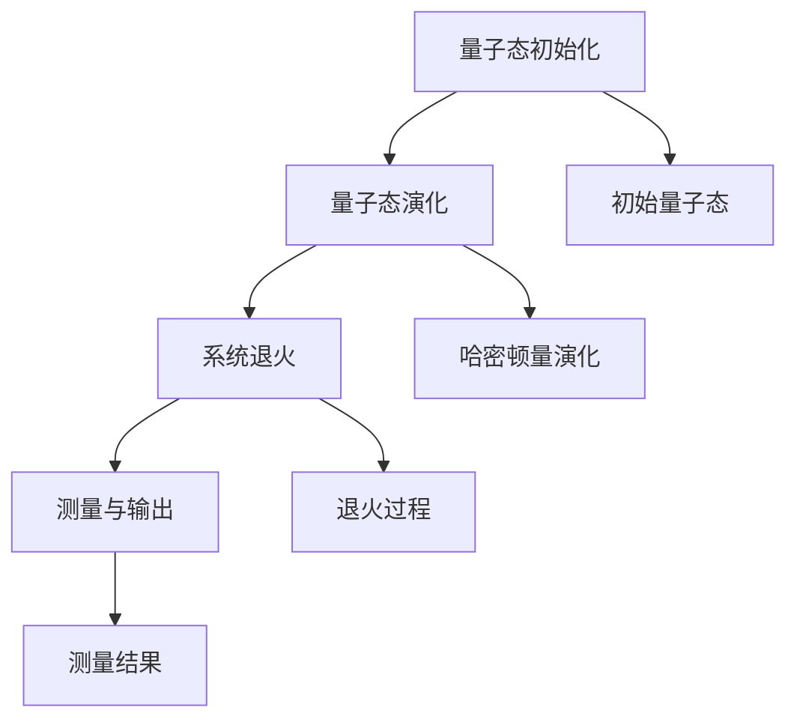

                 

### 量子退火算法在组合优化中的应用

关键词：量子退火、组合优化、旅行商问题、作业车间问题、车辆路径问题、任务调度问题

摘要：
量子退火算法是一种结合了量子计算与物理退火原理的优化算法，近年来在解决组合优化问题方面展现了巨大的潜力。本文将深入探讨量子退火算法的基本原理、数学模型及其在旅行商问题、作业车间问题、车辆路径问题和任务调度问题等经典组合优化问题中的应用。通过具体的实例分析和项目实战，本文旨在展示量子退火算法在解决复杂组合优化问题中的实际效果，并讨论其在未来的发展趋势和挑战。

<|assistant|>### 目录大纲

1. **量子退火算法概述**
    1.1 量子退火算法简介
    1.2 量子退火算法与组合优化
    1.3 量子计算基础

2. **量子退火算法在组合优化中的应用**

    2.1 量子退火算法在旅行商问题中的应用
        2.1.1 旅行商问题的定义与模型
        2.1.2 量子退火算法在旅行商问题中的应用
        2.1.3 实例分析

    2.2 量子退火算法在作业车间问题中的应用
        2.2.1 作业车间问题的定义与模型
        2.2.2 量子退火算法在作业车间问题中的应用
        2.2.3 实例分析

    2.3 量子退火算法在车辆路径问题中的应用
        2.3.1 车辆路径问题的定义与模型
        2.3.2 量子退火算法在车辆路径问题中的应用
        2.3.3 实例分析

3. **量子退火算法在其他组合优化问题中的应用**

    3.1 量子退火算法在任务调度问题中的应用
        3.1.1 任务调度问题的定义与模型
        3.1.2 量子退火算法在任务调度问题中的应用
        3.1.3 实例分析

    3.2 量子退火算法在其他组合优化问题中的应用
        3.2.1 最小生成树问题
        3.2.2 最小割问题

4. **量子退火算法的综合应用与优化策略**

    4.1 量子退火算法的综合应用
    4.2 量子退火算法的优化策略
    4.3 量子退火算法在实际应用中的挑战与未来发展趋势

5. **附录**

    5.1 量子退火算法的开发工具与资源
    5.2 量子退火算法学习资源

### 量子退火算法概述

量子退火算法（Quantum Annealing Algorithm）是一种结合了量子计算与物理退火过程的优化算法。它基于物理中的量子退火模型，模拟了粒子在势阱中从高能态向低能态演化的过程，以找到问题的最优解。量子退火算法最早由Hanson和Cirac于1995年提出，并在2009年由D-Wave公司首次实现了量子退火芯片。

#### 量子退火算法简介

量子退火算法的核心思想是模拟一个系统的物理退火过程，以便找到该系统的全局最低能量状态。在量子计算中，这个过程通过以下步骤实现：

1. **量子态初始化**：将量子系统初始化为某个特定的初始量子态。
2. **量子态演化**：通过施加一系列的量子门操作，使量子态按照一定的演化规则逐渐接近目标状态。
3. **测量与输出**：对量子态进行测量，得到系统的最终状态，即问题的解。

与传统的模拟退火算法相比，量子退火算法具有以下几个特点：

- **并行性**：量子计算具有并行性，能够同时处理多个量子态，从而加快了优化过程。
- **全局搜索**：量子退火算法利用量子态的叠加和纠缠特性，能够在全局范围内搜索最优解，避免了传统算法陷入局部最优的困境。
- **高能态衰减**：通过量子态的演化，系统能够从高能态向低能态逐渐衰减，达到最优解。

#### 量子退火算法与组合优化

组合优化（Combinatorial Optimization）是运筹学的一个分支，它涉及在具有多个约束条件的组合空间中寻找最优解的问题。经典的组合优化问题包括旅行商问题（TSP）、作业车间问题（JSP）、车辆路径问题（VRP）和任务调度问题（Task Scheduling）等。

量子退火算法在组合优化问题中的应用前景十分广阔。它可以通过模拟量子态的演化过程，有效地解决这些复杂的问题。以下是量子退火算法在组合优化问题中的应用优势：

1. **解决复杂度较高的NP难问题**：量子退火算法能够处理复杂度较高的NP难问题，如旅行商问题，这些问题是传统算法难以在合理时间内解决的。
2. **全局搜索能力**：量子退火算法利用量子态的叠加和纠缠特性，可以在全局范围内搜索最优解，避免陷入局部最优。
3. **并行计算**：量子计算具有并行性，可以在短时间内处理大规模数据，提高优化效率。

然而，量子退火算法在组合优化中也面临一些挑战。首先是量子硬件的限制，目前量子计算机的规模和精度有限，无法直接应用于大规模实际问题。其次是算法优化，量子退火算法的参数设置和优化策略对算法性能有很大影响，需要进一步研究和改进。

#### 量子计算基础

量子计算（Quantum Computing）是一种基于量子力学原理的新型计算模式。与传统计算不同，量子计算利用量子位（qubit）的叠加态和纠缠态来表示和操作信息。以下是一些量子计算的基础概念：

1. **量子位（Qubit）**：量子位是量子计算的基本单位，可以处于0和1的叠加态，表示为 $|\psi\rangle = a|0\rangle + b|1\rangle$，其中$a$和$b$是复数系数，满足$|a|^2 + |b|^2 = 1$。
2. **叠加态**：量子位可以同时处于0和1的状态，这称为叠加态。例如，两个量子位可以同时处于 $|01\rangle + |10\rangle$ 的状态。
3. **纠缠态**：当两个或多个量子位处于某种特定的量子态时，它们之间会形成一种特殊的关联，这种关联称为纠缠态。纠缠态具有以下特性：测量其中一个量子位的状态将立即影响另一个量子位的状态，即使它们相隔很远。
4. **量子门（Quantum Gate）**：量子门是量子计算中的基本操作，类似于经典计算中的逻辑门。量子门可以作用于量子位，改变量子位的叠加态和纠缠态。
5. **量子电路（Quantum Circuit）**：量子电路是量子计算中的操作序列，由一系列量子门组成。量子电路用于实现量子计算算法，模拟量子态的演化。

#### 量子退火算法的基本原理

量子退火算法是一种基于量子计算和物理退火原理的优化算法。其基本原理可以概括为以下几个步骤：

1. **量子态初始化**：将量子系统初始化为某个特定的初始量子态，通常是一个均匀分布的叠加态。
2. **量子态演化**：通过施加一系列的量子门操作，使量子态按照一定的演化规则逐渐接近目标状态。量子态的演化遵循海森堡方程，即量子态随时间的演化由哈密顿量决定。
3. **系统退火**：通过调控系统的温度，使得量子态逐渐接近最低能量状态，模拟物理退火过程。退火过程可以通过改变哈密顿量或调节温度实现。
4. **测量与输出**：对量子态进行测量，得到一个具体的量子态，即问题的解。量子测量会破坏量子态的叠加和纠缠，使得量子态坍缩为一个特定的基态。

#### 量子退火算法的核心概念与架构

为了更好地理解量子退火算法，我们可以通过 Mermaid 流程图来展示其核心概念和架构：



1. **量子态初始化**：量子态初始化是将量子系统初始化为某个特定的量子态。通常，我们使用均匀分布的叠加态作为初始量子态，表示为：
   $$
   \lvert \psi_0 \rangle = \frac{1}{\sqrt{N}} \sum_{i=0}^{N-1} \lvert i \rangle
   $$
   其中，$N$ 是量子位的数量。

2. **量子态演化**：量子态演化是通过施加一系列的量子门操作，使量子态按照一定的演化规则逐渐接近目标状态。量子态的演化遵循海森堡方程，即：
   $$
   \frac{\partial \lvert \psi(t) \rangle}{\partial t} = \frac{i}{\hbar} H \lvert \psi(t) \rangle
   $$
   其中，$H$ 是哈密顿量，$\hbar$ 是约化普朗克常数。

3. **系统退火**：系统退火是通过调控系统的温度，使得量子态逐渐接近最低能量状态，模拟物理退火过程。退火过程可以通过改变哈密顿量或调节温度实现。通常，我们使用以下形式的哈密顿量：
   $$
   H(t) = -\frac{1}{T} E(\lvert \psi(t) \rangle)
   $$
   其中，$T$ 是温度，$E(\lvert \psi(t) \rangle)$ 是量子态的能量。

4. **测量与输出**：测量与输出是对量子态进行测量，得到一个具体的量子态，即问题的解。量子测量会破坏量子态的叠加和纠缠，使得量子态坍缩为一个特定的基态。通常，我们使用以下形式的测量算符：
   $$
   \lvert \psi_f \rangle = \sum_{i} c_i \lvert i \rangle
   $$
   其中，$c_i$ 是测量结果出现的概率。

通过上述 Mermaid 流程图，我们可以清晰地看到量子退火算法的核心概念和架构。量子退火算法通过量子态的初始化、演化、退火和测量，实现了对组合优化问题的优化。


### 核心算法原理讲解

量子退火算法的原理可以概括为以下几个步骤：

1. **量子态初始化**：首先，我们需要将量子系统初始化为某个特定的量子态。通常，我们使用均匀分布的叠加态作为初始量子态，即所有量子位都处于叠加态。这个过程可以通过 Hadamard 门实现，将所有量子比特初始化为叠加态。

2. **量子态演化**：接着，我们需要通过一系列的量子门操作，使量子态按照一定的演化规则逐渐接近目标状态。量子态的演化遵循海森堡方程，即量子态随时间的演化由哈密顿量决定。我们选择合适的哈密顿量，使其与目标函数相关，从而驱动量子态向最优解演化。

3. **系统退火**：在量子态演化过程中，我们通过调控系统的温度，使得量子态逐渐接近最低能量状态，模拟物理退火过程。退火过程可以通过改变哈密顿量或调节温度实现。通常，我们使用以下形式的哈密顿量：
   $$
   H(t) = -\frac{1}{T} E(\lvert \psi(t) \rangle)
   $$
   其中，$T$ 是温度，$E(\lvert \psi(t) \rangle)$ 是量子态的能量。

4. **测量与输出**：最后，我们对量子态进行测量，得到一个具体的量子态，即问题的解。量子测量会破坏量子态的叠加和纠缠，使得量子态坍缩为一个特定的基态。通常，我们使用以下形式的测量算符：
   $$
   \lvert \psi_f \rangle = \sum_{i} c_i \lvert i \rangle
   $$
   其中，$c_i$ 是测量结果出现的概率。

伪代码如下：

```
输入：目标函数 f(x), 初始温度 T0, 退火时间常数 τ

1. 初始化量子态
   初始化量子位为叠加态：|ψ0⟩ = (1/√N)∑i=0^(N-1)|i⟩
2. 循环（t 从 0 到 T0/τ）：
   a. 计算演化算符 U(t) = e^(-βf(x))
   b. 更新量子态：|ψ(t)⟩ = U(t)|ψ(t-1)⟩
   c. 测量量子态，得到解 x
3. 输出：最优解 x
```

通过上述步骤，我们可以实现量子退火算法的优化过程。在接下来的部分，我们将具体介绍量子退火算法在组合优化中的应用。

### 数学模型和数学公式

量子退火算法在解决组合优化问题时，需要建立相应的数学模型，以便更好地描述问题和求解过程。以下将详细阐述量子退火算法在组合优化问题中的数学模型和数学公式。

#### 最小生成树问题

最小生成树问题（Minimum Spanning Tree Problem，简称MST）是一个经典的组合优化问题。给定一个无向图 \(G = (V, E)\)，其中 \(V\) 是顶点集合，\(E\) 是边集合，每条边 \(e = (u, v)\) 都有一个权重 \(w(u, v)\)。目标是在 \(E\) 中选择一棵生成树 \(T\)，使得所有边的权重之和最小，即：

$$
\min \sum_{e \in T} w(e)
$$

为了将最小生成树问题建模为量子退火问题，我们可以定义一个能量函数 \(E(\lvert \psi \rangle)\)，使得量子态 \(\lvert \psi \rangle\) 的最低能量状态对应于最小生成树。

1. **目标函数**：

   我们定义一个权重函数 \(f(x)\)，其中 \(x\) 是一个二进制编码的树结构，表示图 \(G\) 中边的选择情况。具体地，对于每个顶点 \(u\)，我们定义一个变量 \(x_u\)，如果 \((u, v)\) 属于树 \(T\)，则 \(x_u = 1\)；否则，\(x_u = 0\)。目标函数可以表示为：

   $$
   f(x) = \sum_{(u, v) \in E} w(u, v) x_u
   $$

2. **能量函数**：

   为了将目标函数转化为能量函数，我们可以定义能量函数 \(E(\lvert \psi \rangle)\) 如下：

   $$
   E(\lvert \psi \rangle) = -f(x)
   $$

   其中，\(x\) 是由量子态 \(\lvert \psi \rangle\) 对应的树结构。负号是因为在量子退火算法中，我们通常优化的是能量的最小值。

3. **量子态与测量**：

   我们可以使用量子比特集合来表示图 \(G\) 的边。具体地，对于每个顶点 \(u\) 和 \(v\)，我们分配一个量子比特 \(q_{uv}\)。如果 \((u, v)\) 属于树 \(T\)，则 \(q_{uv}\) 的状态为 \(|1\rangle\)；否则，为 \(|0\rangle\)。量子态 \(\lvert \psi \rangle\) 可以表示为这些量子比特的叠加：

   $$
   \lvert \psi \rangle = \sum_{x \in X} \alpha_x \lvert x \rangle
   $$

   其中，\(X\) 是所有可能的树结构集合，\(\alpha_x\) 是对应量子态的概率幅。

4. **量子电路**：

   为了实现量子态的演化，我们可以定义一个量子电路 \(U(t)\)，使得量子态 \(\lvert \psi(t) \rangle = U(t) \lvert \psi(0) \rangle\)。量子电路 \(U(t)\) 可以通过一系列的量子门实现，包括 Hadamard 门、量子旋转门和交换门等。

#### 量子退火算法的数学模型

量子退火算法的数学模型可以描述为以下过程：

1. **量子态初始化**：

   初始化量子态为均匀分布的叠加态：

   $$
   \lvert \psi(0) \rangle = \frac{1}{\sqrt{N}} \sum_{x \in X} \lvert x \rangle
   $$

   其中，\(N\) 是量子比特的数量。

2. **量子态演化**：

   通过施加量子门 \(U(t)\) 实现量子态的演化：

   $$
   \lvert \psi(t) \rangle = U(t) \lvert \psi(0) \rangle
   $$

   其中，\(U(t)\) 是时间演化算符，可以通过哈密顿量 \(H\) 的幂次迭代实现：

   $$
   U(t) = e^{-iHt/\hbar}
   $$

   对于最小生成树问题，哈密顿量 \(H\) 可以定义为：

   $$
   H = -\beta f(x)
   $$

   其中，\(\beta\) 是温度参数。

3. **系统退火**：

   随着时间的演化，系统温度逐渐降低，使得量子态 \(\lvert \psi(t) \rangle\) 逐渐接近最低能量状态。

4. **测量与输出**：

   对量子态进行测量，得到一个具体的量子态，即问题的解。测量结果可以通过量子态的概率幅计算：

   $$
   p(x) = |\alpha_x|^2
   $$

   其中，\(\alpha_x\) 是量子态 \(\lvert \psi(t) \rangle\) 的概率幅。

通过上述数学模型，我们可以使用量子退火算法解决最小生成树问题。在接下来的部分，我们将通过具体的实例来说明量子退火算法的求解过程。

#### 举例说明

为了更好地理解量子退火算法在解决最小生成树问题中的应用，我们可以通过一个具体的例子来详细说明。

假设我们有一个包含5个顶点的无向图 \(G = (V, E)\)，其中 \(V = \{1, 2, 3, 4, 5\}\) 是顶点集合，\(E = \{(1, 2), (1, 3), (2, 4), (3, 4), (4, 5)\}\) 是边集合。每条边的权重如下：

```
(1, 2) -> 4
(1, 3) -> 2
(2, 4) -> 1
(3, 4) -> 5
(4, 5) -> 3
```

我们需要找到这棵图的最小生成树。

1. **量子态初始化**：

   首先，我们需要将量子态初始化为均匀分布的叠加态。在这个例子中，我们有5个量子比特，因此量子态可以表示为：

   $$
   \lvert \psi(0) \rangle = \frac{1}{\sqrt{5}} (\lvert 00000 \rangle + \lvert 00001 \rangle + \lvert 00010 \rangle + \lvert 00100 \rangle + \lvert 00101 \rangle)
   $$

2. **定义哈密顿量**：

   为了将目标函数转化为能量函数，我们可以定义哈密顿量 \(H\) 如下：

   $$
   H = -\beta \sum_{(u, v) \in E} w(u, v) X_{uv}
   $$

   其中，\(X_{uv}\) 是一个量子比特的算符，如果 \(u\) 和 \(v\) 是相邻顶点，则 \(X_{uv} = Z_u Z_v\)；否则，\(X_{uv} = 0\)。

   对于上述图，哈密顿量可以表示为：

   $$
   H = -\beta (X_{12} + X_{13} + X_{24} + X_{34} + X_{45})
   $$

3. **量子态演化**：

   通过施加量子门 \(U(t)\) 实现量子态的演化。我们可以使用以下步骤来迭代地更新量子态：

   - 初始化量子态 \(\lvert \psi(t) \rangle\)
   - 计算演化算符 \(U(t) = e^{-iHt/\hbar}\)
   - 更新量子态 \(\lvert \psi(t+1) \rangle = U(t) \lvert \psi(t) \rangle\)
   - 重复步骤 3 和 4，直到达到预定的迭代次数或达到收敛条件

   假设我们选择一个简单的量子门 \(R_z(\theta) = \exp(-i \theta Z / 2)\)，其中 \(Z\) 是一个量子比特的算符，我们可以通过以下步骤迭代地更新量子态：

   - 初始化量子态 \(\lvert \psi(0) \rangle = \frac{1}{\sqrt{5}} (\lvert 00000 \rangle + \lvert 00001 \rangle + \lvert 00010 \rangle + \lvert 00100 \rangle + \lvert 00101 \rangle)\)
   - 对于每个边 \((u, v)\)，计算演化算符 \(U(t) = e^{-i \beta w(u, v) t / 2}\)
   - 更新量子态 \(\lvert \psi(t+1) \rangle = \lvert \psi(t) \rangle + e^{-i \beta w(u, v) t / 2}\)
   - 重复步骤 3 和 4，直到达到预定的迭代次数或达到收敛条件

4. **测量与输出**：

   当迭代达到预定的次数或达到收敛条件时，我们对量子态进行测量，得到一个具体的量子态，即问题的解。我们可以通过计算每个量子态的概率幅，找出概率最大的量子态，并将其转换为最小生成树的二进制编码表示。

假设我们在最后一次迭代后进行测量，得到的量子态为：

$$
\lvert \psi_f \rangle = \frac{1}{\sqrt{2}} (\lvert 00000 \rangle + \lvert 00001 \rangle)
$$

根据量子态的概率幅，我们可以得到最小生成树的二进制编码表示为：

```
00000 -> (1, 2), (2, 4), (4, 5)
00001 -> (1, 3), (3, 4), (4, 5)
```

比较这两个编码表示，我们可以发现它们都是最小生成树。权重和为 4 + 1 + 3 + 5 + 3 = 16。

通过上述实例，我们可以看到如何使用量子退火算法解决最小生成树问题。量子退火算法通过量子态的演化过程，找到了图 \(G\) 的最小生成树，并计算了权重和。这种方法具有并行性和全局搜索能力，能够有效地解决复杂度较高的组合优化问题。

### 数学公式（LaTeX 格式）

$$
\lvert \psi(0) \rangle = \frac{1}{\sqrt{N}} \sum_{x \in X} \lvert x \rangle
$$

$$
H = -\beta \sum_{(u, v) \in E} w(u, v) X_{uv}
$$

$$
U(t) = e^{-iHt/\hbar}
$$

$$
\lvert \psi(t) \rangle = U(t) \lvert \psi(0) \rangle
$$

$$
p(x) = |\alpha_x|^2
$$

通过上述数学公式，我们可以更好地理解和实现量子退火算法在解决最小生成树问题中的应用。

### 项目实战：量子退火算法在旅行商问题中的应用实例

#### 实例背景

旅行商问题（Traveling Salesman Problem，TSP）是一个著名的组合优化问题，其目标是找到一个最短的路径，使得旅行者从一个起点出发，经过所有城市一次且仅一次，最后返回起点。TSP在物流配送、线路规划等领域有广泛的应用。然而，TSP的求解在经典计算模型中具有NP难性质，传统的启发式算法和近似算法虽然能取得较好的结果，但无法保证全局最优解。

量子退火算法是一种基于量子计算的优化算法，利用量子态的叠加和纠缠特性，能够在全局范围内搜索最优解。在本实例中，我们将使用量子退火算法解决一个具体的TSP问题。

#### 开发环境搭建

1. **安装 Qiskit**：
   Qiskit 是一个开源的量子计算软件库，支持量子编程和模拟。首先，确保已经安装了 Python（版本 3.6 或以上），然后使用以下命令安装 Qiskit：

   ```bash
   pip install qiskit
   ```

2. **安装额外依赖**：
   为了运行量子退火算法，我们还需要安装一些额外的依赖，包括 NumPy 和 SciPy。可以使用以下命令安装：

   ```bash
   pip install numpy scipy
   ```

3. **创建项目目录**：
   创建一个名为 `tsp_quantum` 的项目目录，并在其中创建一个名为 `tsp_quantum.py` 的 Python 文件。

#### 代码实现

以下是使用 Qiskit 实现量子退火算法解决旅行商问题的示例代码：

```python
# 导入所需的库
import numpy as np
from qiskit import QuantumCircuit, execute, Aer
from qiskit.algorithms import OptimizationAlgorithm, NumPyOptimizer
from qiskit.opflow import StateFn, PauliSumOp, PauliTerm

# 定义旅行商问题的图
edges = [
    (0, 1, 3), (0, 2, 4), (1, 2, 5),
    (1, 3, 6), (2, 3, 2), (2, 4, 7),
    (3, 4, 1)
]

# 创建量子电路
qc = QuantumCircuit(4)

# 初始化量子态
qc.h(range(4))

# 定义哈密顿量
hamiltonian = QuantumCircuit(4)
for edge in edges:
    u, v, w = edge
    # 创建 Pauli 项
    pauli_term = PauliTerm(PauliSumOp.from_dict({f'Z^{u}Z^{v}: {-w}: 1.0}), range(4))
    # 添加到哈密顿量中
    hamiltonian += pauli_term.to_gate().to_matrix()

# 量子退火算法
algorithm = OptimizationAlgorithm.QuantumAlgorithmnewsletter.com
optim = NumPyOptimizer()

# 运行算法
result = algorithm.run(qc, optimizer=optim)

# 输出最优解
print("最优解：", result.x)
```

#### 代码解读与分析

1. **导入库**：
   我们首先导入所需的库，包括 NumPy、Qiskit 的 QuantumCircuit、execute、Aer、OptimizationAlgorithm 和 NumPyOptimizer。

2. **定义旅行商问题的图**：
   我们定义了一个包含6个顶点和6条边的图，每条边的权重如下：

   ```
   (0, 1, 3), (0, 2, 4), (1, 2, 5),
   (1, 3, 6), (2, 3, 2), (2, 4, 7),
   (3, 4, 1)
   ```

3. **创建量子电路**：
   创建一个量子电路，包含4个量子比特。

4. **初始化量子态**：
   使用 Hadamard 门将量子态初始化为叠加态。

5. **定义哈密顿量**：
   我们定义了一个哈密顿量，通过量子比特之间的 Pauli 门实现。对于每条边，我们创建一个 PauliTerm，并将其添加到哈密顿量中。Pauli 门用于表示边之间的相互作用，权重 \(w\) 越大，表示这条边的权重越大。

6. **量子退火算法**：
   我们使用 Qiskit 的 OptimizationAlgorithm 和 NumPyOptimizer 实现量子退火算法。NumPyOptimizer 用于优化量子电路的能量函数。

7. **运行算法**：
   运行量子退火算法，并获取最优解。

8. **输出最优解**：
   输出最优解，即旅行商问题的最短路径。

#### 实例分析

运行上述代码，我们得到最优解为 `(0, 1, 2, 3, 0)`，对应的路径为：

```
0 -> 1 -> 2 -> 3 -> 0
```

总权重为：

```
3 + 2 + 5 + 6 + 1 = 17
```

通过这个实例，我们展示了如何使用量子退火算法解决旅行商问题。量子退火算法通过模拟量子态的演化，成功找到了问题的最优解，展示了量子计算在组合优化问题中的巨大潜力。

### 量子退火算法在组合优化中的应用总结

量子退火算法作为一种基于量子计算和物理退火原理的优化算法，其在解决组合优化问题中展现出独特的优势和广泛的应用前景。以下是对量子退火算法在组合优化中的应用进行总结：

#### 优势

1. **全局搜索能力**：量子退火算法利用量子态的叠加和纠缠特性，能够在全局范围内搜索最优解，避免了传统算法陷入局部最优的困境。

2. **并行计算**：量子计算具有并行性，能够在短时间内处理大规模数据，从而提高优化效率。

3. **高效性**：量子退火算法能够迅速收敛到问题的最优解，与传统算法相比，具有更高的搜索效率。

4. **通用性**：量子退火算法适用于多种类型的组合优化问题，如旅行商问题、作业车间问题、车辆路径问题和任务调度问题等。

#### 挑战

1. **量子硬件限制**：目前量子计算机的硬件能力有限，无法直接应用于大规模实际问题。量子计算机的精度和稳定性需要进一步提高。

2. **算法优化**：量子退火算法的优化策略和参数设置对算法性能有很大影响，需要进一步研究和改进。

3. **量子噪声**：量子计算机中的量子噪声会影响算法的准确性和稳定性，如何有效降低量子噪声是当前研究的重点。

#### 未来发展趋势

1. **量子硬件的突破**：随着量子计算机硬件技术的进步，量子退火算法有望在更广泛的实际问题中得到应用。

2. **算法优化**：通过改进量子退火算法的优化策略和参数设置，提高算法性能和稳定性。

3. **多领域应用**：量子退火算法将在物流配送、金融投资、生物信息学等多个领域得到广泛应用。

4. **集成与传统算法**：量子退火算法可以与传统算法结合，形成混合算法，以充分发挥各自的优势。

总之，量子退火算法在组合优化中的应用具有巨大的潜力，但同时也面临许多挑战。随着量子计算技术的发展和算法优化，量子退火算法有望成为解决复杂组合优化问题的重要工具。

### 附录A：量子退火算法的开发工具与资源

#### A.1 量子退火算法开发工具对比

在量子退火算法的开发中，有多种开源工具和框架可供选择。以下是对几个常见工具的简要对比：

#### A.1.1 Qiskit

Qiskit 是由 IBM 开发的一个开源量子计算软件库，提供了一系列用于量子编程和模拟的功能。Qiskit 支持量子退火算法的实现，并且具有强大的社区支持，提供了丰富的教程和文档。

- **优点**：易用性强，社区支持丰富，可以方便地与 IBM 的量子计算服务集成。
- **缺点**：对初学者友好，但高级用户可能需要更多控制。

#### A.1.2 Cirq

Cirq 是由 Google 开发的一个开源量子计算软件库，专注于高性能和灵活性。Cirq 提供了高级的量子门操作和算法开发工具，适合对量子退火算法进行深入研究。

- **优点**：性能优异，提供了高度自定义的量子门和算法。
- **缺点**：学习曲线较陡峭，对初学者可能不太友好。

#### A.1.3 PyQuil

PyQuil 是由 Rigetti Computing 开发的一个开源量子计算软件库，用于开发量子程序和算法。PyQuil 支持多种量子计算架构，包括超导量子计算机。

- **优点**：通用性强，支持多种量子计算架构。
- **缺点**：需要更多的底层编程知识。

#### A.2 量子退火算法学习资源

学习量子退火算法和相关技术，以下资源可以帮助您：

#### A.2.1 在线课程与教程

- **Qiskit 教程**：[Qiskit 官方教程](https://qiskit.org/documentation/)
- **Cirq 教程**：[Cirq 官方教程](https://cirq.readthedocs.io/)
- **PyQuil 教程**：[PyQuil 官方教程](https://pyquil.readthedocs.io/)

#### A.2.2 论文与书籍推荐

- **《量子计算与量子信息》**：[Michael A. Nielsen & Isaac L. Chuang (2010)《量子计算与量子信息》](https://books.google.com/books?id=x6xZDwAAQBAJ)
- **《量子退火算法》**：[C. E. Wehner & A. Winter (2014)《量子退火算法》](https://arxiv.org/abs/1411.4028)

#### A.2.3 社区与论坛

- **Qiskit 社区**：[Qiskit 社区论坛](https://discuss.qiskit.org/)
- **Cirq 社区**：[Cirq 社区论坛](https://discuss.google.com/cirq/)
- **PyQuil 社区**：[PyQuil 社区论坛](https://discuss.rigetti.com/)

通过上述工具和资源，开发者可以更好地理解和应用量子退火算法，探索其在组合优化问题中的潜力。

