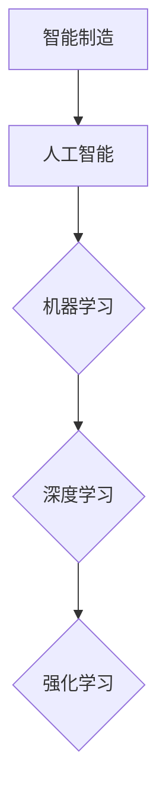

                 

# 2024阿里巴巴智能制造算法工程师校招面试题解

> **关键词：** 阿里巴巴、智能制造、算法工程师、校招面试、面试题解、算法解析、项目实战、深度学习、强化学习、机器学习。

> **摘要：** 本文旨在为2024年阿里巴巴智能制造算法工程师校招的考生提供全面的技术解析和面试准备指导。文章分为三大部分，包括面试准备、面试真题解析和面试技巧与应对策略，涵盖了智能制造基础知识、算法工程师职责、数据处理与清洗、算法分析与设计、以及各类算法的详细讲解和项目实战案例。通过本文，考生将能够深入了解智能制造领域，掌握核心算法原理，提升面试技巧，增强竞争力。

## 目录大纲 - 《2024阿里巴巴智能制造算法工程师校招面试题解》

#### 第一部分：面试准备

- **第1章：智能制造基础知识**
  - 1.1 智能制造的概念与分类
    - 1.1.1 智能制造的定义与发展历程
    - 1.1.2 智能制造的分类与特点
    - 1.1.3 智能制造的核心技术
  - 1.2 人工智能基础知识
    - 1.2.1 人工智能的定义与发展历程
    - 1.2.2 人工智能的分类与应用
    - 1.2.3 人工智能的关键技术

- **第2章：智能制造算法工程师基础知识**
  - 2.1 算法工程师的角色与职责
    - 2.1.1 算法工程师的职业发展路径
    - 2.1.2 算法工程师的工作内容
    - 2.1.3 算法工程师应具备的能力
  - 2.2 数据处理与数据清洗
    - 2.2.1 数据处理的基本概念
    - 2.2.2 数据清洗的方法与技巧
    - 2.2.3 数据预处理流程

- **第3章：算法分析与设计**
  - 3.1 算法分析基础
    - 3.1.1 时间复杂度分析
    - 3.1.2 空间复杂度分析
    - 3.1.3 算法性能优化
  - 3.2 算法设计技巧
    - 3.2.1 分治算法
    - 3.2.2 贪心算法
    - 3.2.3 动态规划
    - 3.2.4 回溯算法

#### 第二部分：面试真题解析

- **第4章：机器学习算法**
  - 4.1 监督学习算法
    - 4.1.1 线性回归
    - 4.1.2 逻辑回归
    - 4.1.3 决策树
    - 4.1.4 随机森林
    - 4.1.5 支持向量机
  - 4.2 无监督学习算法
    - 4.2.1 K-均值聚类
    - 4.2.2 主成分分析
    - 4.2.3 自编码器

- **第5章：深度学习算法**
  - 5.1 深度神经网络基础
    - 5.1.1 神经元与激活函数
    - 5.1.2 前向传播与反向传播
    - 5.1.3 深度学习优化算法
  - 5.2 卷积神经网络
    - 5.2.1 卷积神经网络基础
    - 5.2.2 卷积神经网络应用
    - 5.2.3 卷积神经网络优化
  - 5.3 循环神经网络
    - 5.3.1 循环神经网络基础
    - 5.3.2 长短期记忆网络
    - 5.3.3 门控循环单元

- **第6章：强化学习算法**
  - 6.1 强化学习基础
    - 6.1.1 强化学习的定义与基本概念
    - 6.1.2 强化学习模型
    - 6.1.3 强化学习算法
  - 6.2 Q-学习
    - 6.2.1 Q-学习算法原理
    - 6.2.2 Q-学习算法实现
  - 6.3 深度强化学习
    - 6.3.1 深度Q网络
    - 6.3.2 策略梯度方法
    - 6.3.3 模型预测控制

- **第7章：智能制造应用案例**
  - 7.1 生产线优化
    - 7.1.1 生产调度算法
    - 7.1.2 能耗优化
    - 7.1.3 库存管理优化
  - 7.2 质量检测
    - 7.2.1 异常检测算法
    - 7.2.2 质量控制策略
    - 7.2.3 质量检测系统搭建
  - 7.3 供应链管理
    - 7.3.1 库存优化策略
    - 7.3.2 供应链网络设计
    - 7.3.3 供应链风险管理

- **第8章：面试技巧与应对策略**
  - 8.1 面试准备
    - 8.1.1 自我介绍
    - 8.1.2 技能展示
    - 8.1.3 问题预演
  - 8.2 面试过程
    - 8.2.1 面试官提问技巧
    - 8.2.2 面试者回答技巧
    - 8.2.3 面试结束技巧
  - 8.3 反馈与改进
    - 8.3.1 面试反馈
    - 8.3.2 问题分析
    - 8.3.3 改进策略

#### 第三部分：智能制造行业趋势与发展

- **第9章：智能制造行业趋势与发展**
  - 9.1 智能制造行业现状
    - 9.1.1 全球智能制造发展概况
    - 9.1.2 中国智能制造发展现状
    - 9.1.3 智能制造行业市场规模与增长趋势
  - 9.2 智能制造技术发展趋势
    - 9.2.1 物联网技术的应用与发展
    - 9.2.2 云计算与大数据技术在智能制造中的应用
    - 9.2.3 工业互联网与智能制造的结合
  - 9.3 智能制造面临的挑战与应对策略
    - 9.3.1 数据安全与隐私保护
    - 9.3.2 技术人才短缺问题
    - 9.3.3 标准化与规范化的建设
  - 9.4 未来智能制造的发展方向
    - 9.4.1 智能制造与新兴技术的融合
    - 9.4.2 智能制造在传统行业的应用
    - 9.4.3 智能制造产业链的构建与优化

### 附录

- **附录A：面试题库**
  - 9.1 算法题库
  - 9.2 行为题库
  - 9.3 专业知识题库

- **附录B：面试常见问题解答**
  - 9.1 如何解释某个算法？
  - 9.2 如何处理某个问题？
  - 9.3 如何展示我的项目经验？

- **附录C：推荐阅读材料**
  - 9.1 必读书籍
  - 9.2 必看论文
  - 9.3 必做项目

---

**核心概念与联系 Mermaid 流程图：**



---

**核心算法原理讲解：**

#### 线性回归算法原理

线性回归是一种简单的监督学习算法，用于预测一个连续值输出。其核心思想是通过寻找一条最佳拟合直线来预测新数据的输出。

**伪代码：**

```python
def linear_regression(X, y):
    # X: 特征矩阵，y: 标签向量
    # 计算特征矩阵X的转置
    X_transpose = X.T
    
    # 计算特征矩阵X的逆
    X_inv = np.linalg.inv(X_transpose @ X)
    
    # 计算回归系数
    theta = X_inv @ X_transpose @ y
    
    return theta
```

**数学模型与公式：**

$$
y = ax + b
$$

---

**数学模型和数学公式 & 详细讲解 & 举例说明：**

**逻辑回归算法原理**

逻辑回归是一种常用的分类算法，用于预测概率。其核心思想是通过寻找一个最佳的决策边界来分割数据。

**数学模型与公式：**

$$
\pi = \frac{1}{1 + e^{-z}}
$$

其中，$z$ 是线性组合：

$$
z = \theta_0 + \theta_1x_1 + \theta_2x_2 + ... + \theta_nx_n
$$

**详细讲解：**

逻辑回归的目标是找到一个线性函数，使得该函数的输出值接近0或1。通过优化这个线性函数的参数，我们可以得到一个最优的决策边界。

**举例说明：**

假设我们要预测一个二分类问题，即判断一个邮件是垃圾邮件还是正常邮件。我们可以使用逻辑回归来计算每个邮件被标记为垃圾邮件的概率。

**伪代码：**

```python
def logistic_regression(X, y):
    # X: 特征矩阵，y: 标签向量
    # 初始化参数
    theta = np.random.randn(n_features + 1)
    
    # 梯度下降优化参数
    for epoch in range(num_epochs):
        z = X @ theta
        pi = 1 / (1 + np.exp(-z))
        delta = (pi - y) * X
        theta -= learning_rate * delta
    
    return theta
```

---

**项目实战：代码实际案例和详细解释说明，开发环境搭建，源代码详细实现和代码解读，代码解读与分析**

### 项目实战：生产线优化

**开发环境搭建：**

1. 安装Python环境（3.8以上版本）
2. 安装必要的库：numpy、pandas、matplotlib等

**源代码实现：**

```python
import numpy as np
import pandas as pd
import matplotlib.pyplot as plt

# 读取数据
data = pd.read_csv('production_data.csv')
X = data[['resource_1', 'resource_2', 'resource_3']]
y = data['output']

# 拆分数据集
from sklearn.model_selection import train_test_split
X_train, X_test, y_train, y_test = train_test_split(X, y, test_size=0.2, random_state=42)

# 训练线性回归模型
from sklearn.linear_model import LinearRegression
model = LinearRegression()
model.fit(X_train, y_train)

# 预测结果
y_pred = model.predict(X_test)

# 绘制结果
plt.scatter(X_test['resource_1'], y_test, color='red', label='Actual')
plt.plot(X_test['resource_1'], y_pred, color='blue', label='Predicted')
plt.xlabel('Resource 1')
plt.ylabel('Output')
plt.legend()
plt.show()
```

**代码解读与分析：**

1. 导入必要的库。
2. 读取生产线数据。
3. 进行数据预处理，将数据拆分为特征矩阵X和标签向量y。
4. 使用train_test_split拆分数据集为训练集和测试集。
5. 使用线性回归模型进行训练。
6. 使用训练好的模型对测试集进行预测。
7. 将预测结果与实际结果进行可视化对比。

---

通过这个项目，我们可以看到如何将机器学习算法应用于实际的生产线优化问题，从而提高生产效率和降低成本。在实际项目中，我们还需要考虑更多的因素，如数据预处理、模型选择和优化等。此外，我们还可以使用更复杂的算法，如决策树、随机森林和神经网络等，来进一步提高预测准确性。


### 第1章：智能制造基础知识

智能制造是现代工业生产中的一种高级形式，它通过引入人工智能、物联网、大数据等技术，实现生产过程的智能化、自动化和高效化。本章将介绍智能制造的概念与分类、发展历程以及核心技术，帮助读者全面了解智能制造的基础知识。

### 1.1 智能制造的概念与分类

#### 1.1.1 智能制造的定义与发展历程

智能制造是指利用先进的制造技术和信息技术，实现制造过程的智能化、自动化和高效化。智能制造的发展可以追溯到20世纪80年代，当时以计算机辅助设计（CAD）和计算机辅助制造（CAM）为代表的信息技术在制造业中逐渐得到应用。进入21世纪，随着物联网、大数据、云计算等新兴技术的兴起，智能制造迎来了新的发展机遇。

#### 1.1.2 智能制造的分类与特点

智能制造可以按照不同的维度进行分类，以下是几种常见的分类方式：

1. **按技术层次分类：**
   - **初级智能制造：** 主要包括自动化设备和生产线，实现简单的自动化生产。
   - **中级智能制造：** 引入大数据、云计算等技术，实现生产数据的实时采集、分析和优化。
   - **高级智能制造：** 实现全生命周期、全产业链的智能化生产，包括设计、制造、物流、服务等环节。

2. **按制造模式分类：**
   - **定制化制造：** 根据客户需求进行个性化定制，满足多样化市场需求。
   - **敏捷制造：** 快速响应市场需求变化，实现小批量、多品种的生产。
   - **绿色制造：** 强调环保、节能、减排，实现可持续发展。

3. **按制造系统分类：**
   - **离散型制造：** 如汽车、电子产品等行业，生产过程较为离散。
   - **流程型制造：** 如化工、食品等行业，生产过程具有连续性和流程性。

#### 1.1.3 智能制造的核心技术

智能制造的核心技术包括人工智能、物联网、大数据、云计算、机器人技术等。以下是这些技术的详细介绍：

1. **人工智能：** 人工智能技术在智能制造中主要用于生产过程的优化、质量控制、预测性维护等方面。例如，通过机器学习算法对生产数据进行分析，可以预测设备的故障，提前进行维护。

2. **物联网：** 物联网技术在智能制造中主要用于实现设备的互联互通，提高生产过程的透明度和可控性。通过物联网技术，可以实现设备状态的实时监控、生产数据的实时采集等。

3. **大数据：** 大数据技术在智能制造中主要用于对生产过程中的海量数据进行存储、管理和分析。通过对大数据的分析，可以挖掘生产过程中的潜在问题和优化空间，提高生产效率。

4. **云计算：** 云计算技术为智能制造提供了强大的计算能力和存储能力。通过云计算平台，可以实现设备的远程监控、数据分析等。

5. **机器人技术：** 机器人技术在智能制造中主要用于替代人工进行重复性高、危险性大的工作。例如，在汽车制造中，机器人可以完成焊接、喷涂等操作。

### 1.2 人工智能基础知识

人工智能是智能制造的核心技术之一，它旨在使计算机具有人类的智能水平，实现自我学习和自我决策。以下是人工智能的基本概念和发展历程：

#### 1.2.1 人工智能的定义与发展历程

人工智能（Artificial Intelligence，简称AI）是指用计算机来模拟、延伸和扩展人类的智能活动。人工智能的发展历程可以分为以下几个阶段：

1. **起步阶段（1956-1969）：** 1956年，达特茅斯会议上提出了人工智能的概念，标志着人工智能学科的诞生。此阶段的研究主要集中在符号主义和逻辑推理方面。

2. **繁荣阶段（1970-1989）：** 人工智能在符号主义和逻辑推理方面取得了一定的成果，但面临着“人工智能冬天”的挑战。此阶段的研究重点转向知识表示和专家系统。

3. **复兴阶段（1990-2000）：** 互联网的兴起和大数据技术的发展，为人工智能提供了新的机遇。此阶段的研究重点转向机器学习、深度学习和大数据分析。

4. **快速发展阶段（2000至今）：** 人工智能在图像识别、语音识别、自然语言处理等方面取得了重大突破，开始广泛应用于各行各业。

#### 1.2.2 人工智能的分类与应用

人工智能可以按照不同的维度进行分类，以下是几种常见的分类方式：

1. **按功能分类：**
   - **弱人工智能：** 指计算机在某些特定领域表现出人类智能，但缺乏自主意识。例如，语音助手、图像识别等。
   - **强人工智能：** 指计算机具有全面的智能，能够像人类一样进行思考、学习和决策。目前，强人工智能尚未实现。

2. **按实现方法分类：**
   - **符号主义：** 基于逻辑推理和知识表示，通过人工构建知识库来实现智能。
   - **连接主义：** 基于神经网络和大数据分析，通过数据驱动的方式实现智能。
   - **行为主义：** 基于对人类行为的模仿和学习，通过模仿人类行为来实现智能。

3. **按应用领域分类：**
   - **计算机视觉：** 包括图像识别、目标检测、图像生成等。
   - **自然语言处理：** 包括语音识别、机器翻译、情感分析等。
   - **机器学习：** 包括监督学习、无监督学习、强化学习等。
   - **机器人：** 包括自动驾驶、智能机器人等。

#### 1.2.3 人工智能的关键技术

人工智能的关键技术包括机器学习、深度学习、自然语言处理、计算机视觉等。以下是这些技术的详细介绍：

1. **机器学习：** 机器学习是指利用数据驱动的方式，让计算机自动学习和改进性能。常见的机器学习方法包括线性回归、逻辑回归、支持向量机、决策树、随机森林等。

2. **深度学习：** 深度学习是机器学习的一个分支，它通过多层神经网络来实现复杂的特征学习和模式识别。常见的深度学习模型包括卷积神经网络（CNN）、循环神经网络（RNN）、长短期记忆网络（LSTM）等。

3. **自然语言处理：** 自然语言处理是指让计算机理解和处理自然语言的技术。常见的自然语言处理任务包括文本分类、情感分析、机器翻译、语音识别等。

4. **计算机视觉：** 计算机视觉是指让计算机理解和解释视觉信息的技术。常见的计算机视觉任务包括图像分类、目标检测、图像分割等。

通过本章的学习，读者可以全面了解智能制造的基础知识和人工智能的发展历程、分类及应用。这些知识将为后续章节的深入学习打下坚实的基础。在接下来的章节中，我们将进一步探讨智能制造算法工程师的基础知识和面试技巧，帮助读者更好地应对阿里巴巴智能制造算法工程师校招面试。


### 第2章：智能制造算法工程师基础知识

智能制造算法工程师在智能制造领域中扮演着至关重要的角色，他们负责开发和应用各种算法，以优化生产过程、提高产品质量和降低成本。本章将详细介绍算法工程师的角色与职责、职业发展路径、工作内容以及应具备的能力，帮助读者全面了解智能制造算法工程师的基础知识。

#### 2.1 算法工程师的角色与职责

算法工程师是智能制造领域中的技术专家，他们负责设计和开发用于自动化、优化和改进生产过程的算法。以下是算法工程师的角色与职责：

1. **算法研究与开发：** 算法工程师需要研究最新的算法理论和技术，并开发适用于实际生产环境的算法。

2. **数据收集与处理：** 算法工程师需要收集生产过程中的数据，包括传感器数据、设备状态数据等，并进行数据清洗、处理和预处理，以获得高质量的数据用于算法训练。

3. **模型设计与优化：** 算法工程师需要设计适合特定问题的机器学习模型，并进行模型参数的优化，以提高模型的性能和准确性。

4. **算法应用与部署：** 算法工程师需要将训练好的模型部署到生产环境中，实现实时监控、预测和优化，以提高生产效率和产品质量。

5. **技术支持与培训：** 算法工程师需要为其他团队成员提供技术支持，并参与相关培训，以提升团队的整体技术能力。

#### 2.1.1 算法工程师的职业发展路径

算法工程师的职业发展路径通常可以分为以下几个阶段：

1. **初级算法工程师：** 新入职的算法工程师通常负责参与项目，进行算法的研究和开发，逐步熟悉生产过程和算法应用。

2. **中级算法工程师：** 中级算法工程师具备一定的项目经验，能够独立负责项目，并参与算法的优化和改进。

3. **高级算法工程师：** 高级算法工程师具备丰富的项目经验和深厚的专业素养，能够解决复杂的生产问题，并指导团队成员进行算法开发和应用。

4. **首席算法工程师/CTO：** 首席算法工程师或首席技术官（CTO）是企业技术方向的决策者，负责制定技术战略、领导团队进行技术创新和项目实施。

#### 2.1.2 算法工程师的工作内容

算法工程师的工作内容主要包括以下几个方面：

1. **研究新技术：** 算法工程师需要关注最新的算法理论和技术动态，研究如何将这些新技术应用到实际生产中。

2. **项目开发：** 算法工程师需要参与项目，从需求分析、模型设计到算法实现，直至部署上线。

3. **数据分析：** 算法工程师需要收集和分析生产过程中的数据，识别潜在问题和优化空间。

4. **模型优化：** 算法工程师需要根据数据分析和实验结果，优化模型参数，提高模型的性能和准确性。

5. **技术支持：** 算法工程师需要为其他团队成员提供技术支持，协助解决技术问题。

6. **培训与分享：** 算法工程师需要参与培训，提升团队成员的技术能力，并在团队内进行技术分享。

#### 2.1.3 算法工程师应具备的能力

算法工程师应具备以下能力：

1. **数学与编程能力：** 算法工程师需要具备扎实的数学基础，特别是线性代数、概率论、统计学等，以及熟练的编程技能，如Python、Java等。

2. **机器学习与深度学习知识：** 算法工程师需要掌握机器学习和深度学习的基本原理和方法，包括线性回归、逻辑回归、决策树、随机森林、神经网络等。

3. **数据处理能力：** 算法工程师需要熟悉数据处理的基本方法和技巧，包括数据清洗、特征工程、数据可视化等。

4. **问题解决能力：** 算法工程师需要具备良好的问题解决能力，能够独立分析问题、设计解决方案并实施。

5. **团队合作能力：** 算法工程师需要具备良好的团队合作能力，能够与团队成员有效沟通、协作，共同完成项目。

6. **持续学习与创新能力：** 算法工程师需要持续学习新技术、新方法，具备创新能力，不断推动技术的进步。

通过本章的学习，读者可以全面了解智能制造算法工程师的角色与职责、职业发展路径、工作内容以及应具备的能力。这些知识将为读者在智能制造领域的职业发展提供有力支持。在接下来的章节中，我们将进一步探讨数据处理与清洗、算法分析与设计等关键技术，帮助读者更好地应对阿里巴巴智能制造算法工程师校招面试。


### 第3章：算法分析与设计

算法分析与设计是智能制造算法工程师的核心技能之一，它涉及到算法的性能评估、优化和实现。本章将详细介绍算法分析的基础知识，包括时间复杂度分析、空间复杂度分析以及算法性能优化方法，并探讨常见的算法设计技巧。

#### 3.1 算法分析基础

算法分析是评估算法性能的重要手段，它主要通过时间复杂度和空间复杂度来衡量算法的效率。

##### 3.1.1 时间复杂度分析

时间复杂度是指算法在执行过程中，随着输入规模增加所需时间增长的量度。它通常用大O符号（O）表示。时间复杂度的计算方法如下：

1. **基本操作次数：** 首先确定算法中的基本操作，如比较、赋值、循环等。
2. **操作次数与输入规模的关系：** 分析基本操作次数与输入规模（如数组大小、数据量等）之间的关系。
3. **大O符号表示：** 使用大O符号表示时间复杂度，如`O(n)`、`O(n^2)`、`O(logn)`等。

以下是一些常见的时间复杂度表示：

- **常数时间：** `O(1)`，例如循环固定次数的操作。
- **线性时间：** `O(n)`，例如遍历数组。
- **平方时间：** `O(n^2)`，例如两数组元素两两比较。
- **对数时间：** `O(logn)`，例如二分查找。

##### 3.1.2 空间复杂度分析

空间复杂度是指算法在执行过程中所需内存的量度，同样使用大O符号表示。空间复杂度的计算方法与时间复杂度类似：

1. **基本数据结构：** 分析算法中使用的数据结构，如数组、链表、树等。
2. **空间需求：** 计算数据结构所占用的内存空间。
3. **大O符号表示：** 使用大O符号表示空间复杂度，如`O(n)`、`O(n^2)`、`O(logn)`等。

以下是一些常见的空间复杂度表示：

- **常数空间：** `O(1)`，例如使用固定大小数组。
- **线性空间：** `O(n)`，例如存储整个输入数组。
- **平方空间：** `O(n^2)`，例如存储所有可能的子集。

##### 3.1.3 算法性能优化

算法性能优化是指通过改进算法设计或实现，提高算法的运行效率。以下是一些常见的优化方法：

1. **算法改进：** 选择更高效的算法，如从暴力解法改进为分治算法、贪心算法等。
2. **数据结构优化：** 使用更适合的数据结构，如使用哈希表代替数组，提高查找和插入操作的速度。
3. **并行计算：** 利用多核处理器等硬件资源，实现并行计算，提高算法的运行速度。
4. **缓存优化：** 利用缓存机制，减少磁盘I/O操作，提高算法的运行效率。
5. **代码优化：** 优化代码的实现，如减少不必要的计算、简化逻辑等。

#### 3.2 算法设计技巧

算法设计技巧是算法工程师在实际工作中需要掌握的重要技能。以下是一些常见的算法设计技巧：

1. **分治算法：** 将问题分解为子问题，分别解决，然后将子问题的解合并成原问题的解。常见的分治算法包括归并排序、快速排序等。

2. **贪心算法：** 在每一步选择中选择局部最优解，最终得到全局最优解。常见的贪心算法包括动态规划中的最优子结构、贪心选择等。

3. **动态规划：** 利用已有子问题的解来求解更大的子问题，避免重复计算。常见的动态规划问题包括背包问题、最长公共子序列等。

4. **回溯算法：** 通过尝试所有可能的解，找到最优解。常见的回溯算法包括八皇后问题、0-1背包问题等。

通过本章的学习，读者可以了解算法分析的基础知识，掌握时间复杂度分析和空间复杂度分析的方法，并熟悉算法性能优化的常见方法。同时，读者还可以学习到一些常见的算法设计技巧，这些知识将为读者在智能制造算法工程师的职业发展中提供有力的支持。在接下来的章节中，我们将进一步探讨机器学习、深度学习和强化学习等核心算法，帮助读者全面掌握智能制造领域的核心技术。


### 第4章：机器学习算法

机器学习算法是智能制造领域的重要技术之一，它通过计算机模拟人类学习过程，使计算机能够从数据中学习并做出预测或决策。本章将详细介绍机器学习中的监督学习算法和无监督学习算法，包括线性回归、逻辑回归、决策树、随机森林、支持向量机、K-均值聚类、主成分分析和自编码器等，并探讨其原理和应用。

#### 4.1 监督学习算法

监督学习算法通过训练数据集学习目标函数，然后在新数据上进行预测。监督学习算法可以分为回归算法和分类算法。

##### 4.1.1 线性回归

线性回归是一种简单的回归算法，它通过寻找一条最佳拟合直线来预测连续值输出。

**数学模型与公式：**

$$
y = \beta_0 + \beta_1x
$$

其中，$y$ 是目标变量，$x$ 是输入特征，$\beta_0$ 和 $\beta_1$ 是模型参数。

**伪代码：**

```python
def linear_regression(X, y):
    # X: 特征矩阵，y: 标签向量
    # 计算特征矩阵X的转置
    X_transpose = X.T
    
    # 计算特征矩阵X的逆
    X_inv = np.linalg.inv(X_transpose @ X)
    
    # 计算回归系数
    beta = X_inv @ X_transpose @ y
    
    return beta
```

**应用场景：** 线性回归常用于房价预测、股票市场预测等领域。

##### 4.1.2 逻辑回归

逻辑回归是一种常用的分类算法，它通过寻找一个最佳的决策边界来分割数据。

**数学模型与公式：**

$$
\pi = \frac{1}{1 + e^{-z}}
$$

其中，$z$ 是线性组合：

$$
z = \beta_0 + \beta_1x
$$

**伪代码：**

```python
def logistic_regression(X, y):
    # X: 特征矩阵，y: 标签向量
    # 初始化参数
    beta = np.random.randn(n_features + 1)
    
    # 梯度下降优化参数
    for epoch in range(num_epochs):
        z = X @ beta
        pi = 1 / (1 + np.exp(-z))
        delta = (pi - y) * X
        beta -= learning_rate * delta
    
    return beta
```

**应用场景：** 逻辑回归常用于二分类问题，如垃圾邮件检测、信用卡欺诈检测等。

##### 4.1.3 决策树

决策树是一种基于树形结构的分类算法，它通过一系列的判断条件来对数据进行分类。

**伪代码：**

```python
def build_tree(data, labels, depth):
    # data: 特征矩阵，labels: 标签向量
    # depth: 决策树深度
    # 判断是否达到停止条件
    if stop_condition(data, labels):
        return leaf_node(labels)
    
    # 选择最优特征
    best_feature, best_threshold = find_best_split(data, labels)
    
    # 构建子树
    left_child = build_tree(data[data[:, best_feature] <= best_threshold], labels[data[:, best_feature] <= best_threshold], depth + 1)
    right_child = build_tree(data[data[:, best_feature] > best_threshold], labels[data[:, best_feature] > best_threshold], depth + 1)
    
    # 返回决策树
    return TreeNode(best_feature, best_threshold, left_child, right_child)
```

**应用场景：** 决策树常用于分类和回归问题，如银行贷款审批、医疗诊断等。

##### 4.1.4 随机森林

随机森林是一种基于决策树的集成学习方法，它通过构建多个决策树并投票来获得最终结果。

**伪代码：**

```python
def random_forest(X, y, n_trees):
    # X: 特征矩阵，y: 标签向量，n_trees: 树的数量
    trees = [build_tree(X, y, depth) for _ in range(n_trees)]
    
    # 预测
    predictions = [tree.predict(X) for tree in trees]
    majority_vote = majority_vote(predictions)
    
    return majority_vote
```

**应用场景：** 随机森林常用于分类和回归问题，如信用评分、房屋价格预测等。

##### 4.1.5 支持向量机

支持向量机是一种基于优化理论的分类算法，它通过找到一个最佳的超平面来分割数据。

**数学模型与公式：**

$$
\min \frac{1}{2} ||w||^2 + C \sum_{i=1}^{n} \max(0, 1 - y_i (w \cdot x_i))
$$

**伪代码：**

```python
def svm(X, y, C):
    # X: 特征矩阵，y: 标签向量，C: 正则化参数
    # 使用SVM优化算法求解最优解
    w, b = svm_optimize(X, y, C)
    
    # 预测
    predictions = [predict(x, w, b) for x in X]
    
    return predictions
```

**应用场景：** 支持向量机常用于分类问题，如文本分类、图像分类等。

#### 4.2 无监督学习算法

无监督学习算法不使用标签数据，通过分析数据内在结构来发现数据中的模式。

##### 4.2.1 K-均值聚类

K-均值聚类是一种基于距离的聚类算法，它通过迭代计算聚类中心，将数据划分为K个聚类。

**数学模型与公式：**

$$
c_k = \frac{1}{n_k} \sum_{i=1}^{n_k} x_i
$$

**伪代码：**

```python
def k_means(X, K, max_iterations):
    # X: 特征矩阵，K: 聚类数，max_iterations: 最大迭代次数
    centroids = initialize_centroids(X, K)
    
    for _ in range(max_iterations):
        # 计算聚类中心
        new_centroids = compute_centroids(X, centroids)
        
        # 判断收敛条件
        if has_converged(centroids, new_centroids):
            break
        
        centroids = new_centroids
    
    # 分配数据到聚类中心
    labels = assign_labels(X, centroids)
    
    return labels
```

**应用场景：** K-均值聚类常用于数据降维、图像分割等领域。

##### 4.2.2 主成分分析

主成分分析是一种降维技术，它通过提取数据的主要成分，减少数据维度。

**数学模型与公式：**

$$
Z = \frac{X - \mu}{\sigma}
$$

**伪代码：**

```python
def pca(X, n_components):
    # X: 特征矩阵，n_components: 主成分数
    # 计算协方差矩阵
    covariance_matrix = compute_covariance_matrix(X)
    
    # 计算特征值和特征向量
    eigenvalues, eigenvectors = compute_eigenvalues_eigenvectors(covariance_matrix)
    
    # 选择主成分
    principal_components = select_principal_components(eigenvalues, eigenvectors, n_components)
    
    # 减维
    reduced_data = project_data(X, principal_components)
    
    return reduced_data
```

**应用场景：** 主成分分析常用于图像处理、数据降维等领域。

##### 4.2.3 自编码器

自编码器是一种无监督学习算法，它通过编码和解码过程，将输入数据映射到较低维度的特征空间。

**数学模型与公式：**

$$
\hat{X} = \sigma(W_2 \cdot \sigma(W_1 \cdot X + b_1) + b_2)
$$

**伪代码：**

```python
def autoencoder(X, hidden_size, epochs):
    # X: 特征矩阵，hidden_size: 隐藏层尺寸，epochs: 迭代次数
    # 初始化权重和偏置
    W1, b1, W2, b2 = initialize_weights(hidden_size)
    
    for epoch in range(epochs):
        # 前向传播
        hidden_layer = activate_function(W1 @ X + b1)
        reconstructed = activate_function(W2 @ hidden_layer + b2)
        
        # 计算损失
        loss = compute_loss(X, reconstructed)
        
        # 反向传播
        d_reconstructed = reconstruct
        d_hidden_layer = W2.T @ d_reconstructed * activate_function_derivative(hidden_layer)
        d_X = W1.T @ d_hidden_layer
        
        # 更新权重和偏置
        W1 -= learning_rate * d_W1
        b1 -= learning_rate * d_b1
        W2 -= learning_rate * d_W2
        b2 -= learning_rate * d_b2
    
    return W1, b1, W2, b2
```

**应用场景：** 自编码器常用于特征提取、图像去噪等领域。

通过本章的学习，读者可以全面了解机器学习中的监督学习算法和无监督学习算法，掌握其原理和应用。这些知识将为读者在智能制造领域中的算法开发和应用提供有力的支持。在接下来的章节中，我们将进一步探讨深度学习算法，包括深度神经网络、卷积神经网络、循环神经网络和强化学习算法，帮助读者全面掌握智能制造领域的核心技术。


### 第5章：深度学习算法

深度学习算法是人工智能领域的重要分支，它通过多层神经网络进行数据特征的学习和提取，从而实现复杂模式识别和预测。本章将详细介绍深度学习算法的基础知识，包括深度神经网络、卷积神经网络、循环神经网络和强化学习算法。

#### 5.1 深度神经网络基础

深度神经网络（Deep Neural Network，DNN）是一种包含多个隐藏层的神经网络，它能够通过多层非线性变换来提取数据的特征。

##### 5.1.1 神经元与激活函数

深度神经网络的基本组成单元是神经元，每个神经元接收多个输入，并通过加权求和后加上偏置项，然后通过激活函数进行非线性变换。

**神经元公式：**

$$
z_i = \sum_{j=1}^{n} w_{ij}x_j + b_i
$$

其中，$z_i$ 是神经元的输入，$w_{ij}$ 是输入权重，$x_j$ 是输入特征，$b_i$ 是偏置项。

常用的激活函数包括：

1. **sigmoid函数：**

$$
a(x) = \frac{1}{1 + e^{-x}}
$$

2. **ReLU函数：**

$$
a(x) = \max(0, x)
$$

3. **Tanh函数：**

$$
a(x) = \frac{e^x - e^{-x}}{e^x + e^{-x}}
$$

##### 5.1.2 前向传播与反向传播

深度神经网络的训练过程包括前向传播和反向传播两个步骤。

**前向传播：**

前向传播是指将输入数据通过神经网络层传递，直到输出层，得到预测结果。

**反向传播：**

反向传播是指从输出层开始，反向计算每个神经元的误差，并更新权重和偏置项。

**反向传播公式：**

$$
\delta_{ij} = \frac{\partial C}{\partial z_j} = a'(z_j) \cdot \delta_{ji}
$$

其中，$\delta_{ij}$ 是第$i$个神经元对第$j$个输出变量的误差，$a'(z_j)$ 是激活函数的导数。

##### 5.1.3 深度学习优化算法

深度学习优化算法用于加速神经网络的训练过程，提高训练效果。常用的优化算法包括：

1. **随机梯度下降（SGD）：**

$$
w_{t+1} = w_t - \alpha \cdot \nabla_C(w_t)
$$

其中，$w_t$ 是当前权重，$\alpha$ 是学习率，$\nabla_C(w_t)$ 是权重对损失函数的梯度。

2. **Adam优化器：**

$$
m_t = \beta_1 \cdot m_{t-1} + (1 - \beta_1) \cdot \nabla_C(w_t)
$$

$$
v_t = \beta_2 \cdot v_{t-1} + (1 - \beta_2) \cdot (\nabla_C(w_t)^2)
$$

$$
w_{t+1} = w_t - \alpha \cdot \frac{m_t}{\sqrt{v_t} + \epsilon}
$$

其中，$m_t$ 和 $v_t$ 分别是权重的一阶矩估计和二阶矩估计，$\beta_1$ 和 $\beta_2$ 是矩估计的指数加权系数，$\epsilon$ 是一个很小的常数。

#### 5.2 卷积神经网络

卷积神经网络（Convolutional Neural Network，CNN）是一种专门用于处理图像数据的深度学习模型，它通过卷积操作和池化操作提取图像特征。

##### 5.2.1 卷积神经网络基础

**卷积操作：**

卷积操作是指将卷积核（也称为滤波器）与输入图像进行点积操作，以提取局部特征。

$$
h_{ij} = \sum_{k=1}^{k} w_{ik}x_{kj}
$$

**池化操作：**

池化操作用于减少特征图的大小，提高模型的计算效率。常用的池化操作包括最大池化和平均池化。

1. **最大池化：**

$$
p_{ij} = \max_{k=1}^{k} h_{ikj}
$$

2. **平均池化：**

$$
p_{ij} = \frac{1}{k} \sum_{k=1}^{k} h_{ikj}
$$

##### 5.2.2 卷积神经网络应用

卷积神经网络广泛应用于计算机视觉领域，如图像分类、目标检测、图像分割等。

1. **图像分类：** 使用卷积神经网络对图像进行分类，常见的模型包括VGG、ResNet等。

2. **目标检测：** 使用卷积神经网络检测图像中的目标位置，常见的模型包括YOLO、SSD等。

3. **图像分割：** 使用卷积神经网络对图像进行像素级别的分类，常见的模型包括U-Net、Mask R-CNN等。

##### 5.2.3 卷积神经网络优化

卷积神经网络优化主要包括模型结构优化、数据增强和超参数调整。

1. **模型结构优化：** 通过改进卷积神经网络的结构，提高模型的性能。常见的结构优化方法包括深度可分离卷积、残差连接等。

2. **数据增强：** 通过对训练数据集进行随机变换，增加数据的多样性，提高模型的泛化能力。常见的数据增强方法包括随机裁剪、旋转、翻转等。

3. **超参数调整：** 通过调整学习率、批量大小、正则化参数等超参数，优化模型的训练效果。

#### 5.3 循环神经网络

循环神经网络（Recurrent Neural Network，RNN）是一种能够处理序列数据的神经网络，它通过循环连接实现信息的持久记忆。

##### 5.3.1 循环神经网络基础

**循环神经网络公式：**

$$
h_t = \sigma(W_h h_{t-1} + W_x x_t + b_h)
$$

其中，$h_t$ 是第$t$个时刻的隐藏状态，$W_h$ 和 $W_x$ 是权重矩阵，$x_t$ 是输入序列，$b_h$ 是偏置项，$\sigma$ 是激活函数。

##### 5.3.2 长短期记忆网络

长短期记忆网络（Long Short-Term Memory，LSTM）是一种特殊的循环神经网络，它通过引入门控机制，解决传统RNN在处理长序列数据时的梯度消失和梯度爆炸问题。

**LSTM公式：**

$$
i_t = \sigma(W_i \cdot [h_{t-1}, x_t] + b_i)$$
$$
f_t = \sigma(W_f \cdot [h_{t-1}, x_t] + b_f)$$
$$
g_t = \tanh(W_g \cdot [h_{t-1}, x_t] + b_g)$$
$$
o_t = \sigma(W_o \cdot [h_{t-1}, x_t] + b_o)$$

$$
h_t = o_t \cdot \tanh(f_t \cdot g_t)$$

其中，$i_t$、$f_t$、$g_t$ 和 $o_t$ 分别是输入门、遗忘门、生成门和输出门。

##### 5.3.3 门控循环单元

门控循环单元（Gated Recurrent Unit，GRU）是一种简化版的LSTM，它通过引入更新门和重置门，进一步提高模型的性能。

**GRU公式：**

$$
z_t = \sigma(W_z \cdot [h_{t-1}, x_t] + b_z)$$
$$
r_t = \sigma(W_r \cdot [h_{t-1}, x_t] + b_r)$$
$$
h_t = \tanh((1 - z_t) \cdot h_{t-1} + z_t \cdot r_t \cdot \tanh(W \cdot [r_t \cdot h_{t-1}, x_t] + b_h))$$

其中，$z_t$ 是更新门，$r_t$ 是重置门。

#### 5.4 强化学习算法

强化学习（Reinforcement Learning，RL）是一种通过不断与环境交互，学习最优策略的机器学习算法。

##### 5.4.1 强化学习基础

**强化学习模型：**

$$
Q(s, a) = r + \gamma \max_{a'} Q(s', a')
$$

其中，$Q(s, a)$ 是状态-动作值函数，$r$ 是即时奖励，$\gamma$ 是折扣因子，$s$ 是状态，$a$ 是动作，$s'$ 是下一个状态。

**强化学习算法：**

1. **Q-学习：**

$$
Q(s, a) \leftarrow Q(s, a) + \alpha [r + \gamma \max_{a'} Q(s', a') - Q(s, a)]
$$

2. **策略梯度方法：**

$$
\theta \leftarrow \theta - \alpha \nabla_{\theta} J(\theta)
$$

其中，$\theta$ 是策略参数，$J(\theta)$ 是策略损失函数。

##### 5.4.2 深度强化学习

深度强化学习（Deep Reinforcement Learning，DRL）是将深度学习与强化学习结合的一种方法，它通过深度神经网络来近似状态-动作值函数或策略。

**深度Q网络（DQN）：**

$$
Q(s, a) \leftarrow Q(s, a) + \alpha [r + \gamma \max_{a'} Q(s', a') - Q(s, a)]
$$

**策略梯度方法：**

$$
\theta \leftarrow \theta - \alpha \nabla_{\theta} J(\theta)
$$

通过本章的学习，读者可以全面了解深度学习算法的基础知识，包括深度神经网络、卷积神经网络、循环神经网络和强化学习算法。这些知识将帮助读者在智能制造领域应用深度学习技术，提高生产效率和质量。在接下来的章节中，我们将进一步探讨智能制造应用案例和面试技巧，帮助读者更好地应对阿里巴巴智能制造算法工程师校招面试。


### 第6章：强化学习算法

强化学习（Reinforcement Learning，RL）是一种通过不断与环境交互，学习最优策略的机器学习算法。与传统的监督学习和无监督学习不同，强化学习通过奖励信号来指导学习过程，旨在找到一种策略使累计奖励最大化。本章将详细介绍强化学习的基本概念、模型、算法和应用。

#### 6.1 强化学习基础

##### 6.1.1 强化学习的定义与基本概念

强化学习的基本概念包括状态（State）、动作（Action）、奖励（Reward）和策略（Policy）。

1. **状态（State）：** 状态是描述系统当前状态的变量集合，通常用$s$表示。

2. **动作（Action）：** 动作是智能体（Agent）在某个状态下可以采取的行动，通常用$a$表示。

3. **奖励（Reward）：** 奖励是智能体在执行某个动作后获得的即时反馈信号，用于指导学习过程，通常用$r$表示。

4. **策略（Policy）：** 策略是智能体在某个状态下采取的动作映射，通常用$\pi(s, a)$表示。

强化学习的目标是找到一个最优策略，使智能体在长期内获得最大的累计奖励。

##### 6.1.2 强化学习模型

强化学习模型通常由以下部分组成：

1. **环境（Environment）：** 环境是智能体执行动作、接收奖励的地方。

2. **智能体（Agent）：** 智能体是执行动作、接收奖励的学习实体。

3. **状态空间（State Space）：** 状态空间是所有可能状态的集合。

4. **动作空间（Action Space）：** 动作空间是所有可能动作的集合。

5. **策略（Policy）：** 策略是智能体在某个状态下采取的动作映射。

强化学习模型可以表示为：

$$
(s_t, a_t, r_t, s_{t+1}) \sim p(s_t, a_t, r_t, s_{t+1})
$$

其中，$s_t$ 是当前状态，$a_t$ 是当前动作，$r_t$ 是即时奖励，$s_{t+1}$ 是下一个状态，$p$ 是状态-动作-奖励-状态转移概率。

##### 6.1.3 强化学习算法

强化学习算法可以分为值函数方法和策略方法。

1. **值函数方法：** 值函数方法通过学习状态-动作值函数（State-Action Value Function）来指导学习过程。常见的算法包括Q学习（Q-Learning）、深度Q网络（Deep Q-Network，DQN）等。

2. **策略方法：** 策略方法通过直接学习最优策略来指导学习过程。常见的算法包括策略梯度方法（Policy Gradient Method）等。

**Q-学习算法：**

Q-学习算法是一种基于值函数的强化学习算法，其目标是学习状态-动作值函数$Q(s, a)$。

$$
Q(s, a) \leftarrow Q(s, a) + \alpha [r + \gamma \max_{a'} Q(s', a') - Q(s, a)]
$$

其中，$\alpha$ 是学习率，$\gamma$ 是折扣因子。

**伪代码：**

```python
def q_learning(environment, alpha, gamma, epsilon, episodes):
    Q = {}  # 初始化状态-动作值函数
    for episode in range(episodes):
        state = environment.reset()
        done = False
        while not done:
            if random.random() < epsilon:
                action = random_action(state, action_space)
            else:
                action = argmax(Q[state])
            next_state, reward, done = environment.step(action)
            Q[state][action] = Q[state][action] + alpha * (reward + gamma * max(Q[next_state].values()) - Q[state][action])
            state = next_state
    return Q
```

**策略梯度方法：**

策略梯度方法是一种基于策略的强化学习算法，其目标是学习最优策略。

$$
\theta \leftarrow \theta - \alpha \nabla_{\theta} J(\theta)
$$

其中，$\theta$ 是策略参数，$J(\theta)$ 是策略损失函数。

**伪代码：**

```python
def policy_gradient(environment, theta, alpha, episodes):
    for episode in range(episodes):
        state = environment.reset()
        done = False
        total_reward = 0
        while not done:
            action probabilities = policy(state, theta)
            action = sample_action(action_probabilities)
            next_state, reward, done = environment.step(action)
            total_reward += reward
            theta -= alpha * grad_policy_loss(state, action, next_state, reward)
            state = next_state
    return theta
```

#### 6.2 Q-学习

Q-学习是一种基于值函数的强化学习算法，它通过迭代更新状态-动作值函数来学习最优策略。

##### 6.2.1 Q-学习算法原理

Q-学习算法的基本思想是：对于每个状态-动作对，根据即时奖励和未来最大奖励来更新状态-动作值函数。

$$
Q(s, a) \leftarrow Q(s, a) + \alpha [r + \gamma \max_{a'} Q(s', a') - Q(s, a)]
$$

其中，$r$ 是即时奖励，$\gamma$ 是折扣因子，$\alpha$ 是学习率。

##### 6.2.2 Q-学习算法实现

**伪代码：**

```python
def q_learning(environment, alpha, gamma, epsilon, episodes):
    Q = {}  # 初始化状态-动作值函数
    for episode in range(episodes):
        state = environment.reset()
        done = False
        while not done:
            if random.random() < epsilon:
                action = random_action(state, action_space)
            else:
                action = argmax(Q[state])
            next_state, reward, done = environment.step(action)
            Q[state][action] = Q[state][action] + alpha * (reward + gamma * max(Q[next_state].values()) - Q[state][action])
            state = next_state
    return Q
```

**代码解读：**

1. 初始化状态-动作值函数$Q$。
2. 遍历每个仿真episode。
3. 在每个episode中，从初始状态开始。
4. 根据epsilon贪婪策略选择动作。
5. 执行动作，得到下一个状态、奖励和是否结束。
6. 更新状态-动作值函数。
7. 返回训练好的状态-动作值函数$Q$。

#### 6.3 深度强化学习

深度强化学习（Deep Reinforcement Learning，DRL）是将深度学习与强化学习结合的一种方法，它通过深度神经网络来近似状态-动作值函数或策略。

##### 6.3.1 深度Q网络（DQN）

深度Q网络（Deep Q-Network，DQN）是一种基于深度神经网络的Q-学习算法，它使用神经网络来近似状态-动作值函数。

##### 6.3.2 策略梯度方法

策略梯度方法是一种基于策略的深度强化学习算法，它通过优化策略参数来最大化累计奖励。

##### 6.3.3 模型预测控制

模型预测控制（Model Predictive Control，MPC）是一种基于模型的控制方法，它通过预测系统行为并优化控制策略来实现控制目标。

通过本章的学习，读者可以全面了解强化学习算法的基本概念、模型和算法。这些知识将为读者在智能制造领域应用强化学习技术提供理论支持。在接下来的章节中，我们将进一步探讨智能制造应用案例和面试技巧，帮助读者更好地应对阿里巴巴智能制造算法工程师校招面试。


### 第6章：强化学习算法

强化学习算法是一种通过试错和反馈来学习最优策略的机器学习方法。它广泛应用于游戏、自动驾驶、推荐系统等领域。本章将详细介绍强化学习的基础概念、核心算法，以及深度强化学习的技术细节。

#### 6.1 强化学习基础

强化学习（Reinforcement Learning，RL）是机器学习的一个重要分支，它的核心目标是找到一个最优策略，使得智能体（Agent）能够在动态环境中实现长期累积奖励最大化。

**定义：**

强化学习包含四个核心元素：

1. **状态（State）：** 智能体所在的环境描述。
2. **动作（Action）：** 智能体可以执行的操作。
3. **奖励（Reward）：** 对每个动作的即时反馈。
4. **策略（Policy）：** 从状态到动作的映射规则。

**基本模型：**

强化学习模型通常表示为一个马尔可夫决策过程（MDP），包括以下元素：

- **状态空间（S）：** 一组可能的状态。
- **动作空间（A）：** 每个状态下的可能动作。
- **奖励函数（R）：** 给定状态和动作的即时奖励。
- **状态转移概率（P）：** 给定状态和动作，下一个状态的分布。

**目标：**

强化学习的目标是找到一个最优策略$\pi^*$，使得累积奖励期望最大化：

$$
J(\pi) = \sum_{s,a} \pi(s,a) \cdot R(s,a) + \gamma \sum_{s'} P(s'|s,a) \cdot J(\pi)
$$

其中，$\gamma$ 是折扣因子，表示对未来奖励的期望。

#### 6.2 Q-学习

Q-学习是一种值函数方法，它通过迭代更新状态-动作值函数来学习最优策略。

**基本原理：**

Q-学习算法基于一个假设：状态-动作值函数$Q(s, a)$代表了在状态$s$下执行动作$a$的长期累积奖励。

$$
Q(s, a) = \sum_{s'} P(s'|s, a) \cdot [R(s, a) + \gamma \max_{a'} Q(s', a')]
$$

**算法步骤：**

1. 初始化$Q(s, a)$。
2. 在每个仿真步中，执行动作$a$，并观察奖励$R(s, a)$和下一个状态$s'$。
3. 更新$Q(s, a)$：

$$
Q(s, a) \leftarrow Q(s, a) + \alpha [R(s, a) + \gamma \max_{a'} Q(s', a') - Q(s, a)]
$$

其中，$\alpha$ 是学习率。

**伪代码：**

```python
def Q_learning(env, alpha, gamma, epsilon, episodes):
    Q = {}  # 初始化Q值函数
    for episode in range(episodes):
        state = env.reset()
        done = False
        while not done:
            if random.random() < epsilon:
                action = random_action(env.action_space)
            else:
                action = argmax(Q[state])
            next_state, reward, done = env.step(action)
            Q[state][action] = Q[state][action] + alpha * (reward + gamma * max(Q[next_state].values()) - Q[state][action])
            state = next_state
    return Q
```

**代码解读：**

1. 初始化Q值函数。
2. 遍历每个仿真episode。
3. 在每个episode中，从初始状态开始。
4. 根据epsilon贪婪策略选择动作。
5. 执行动作，得到下一个状态、奖励和是否结束。
6. 更新Q值函数。

#### 6.3 深度强化学习

深度强化学习（Deep Reinforcement Learning，DRL）是强化学习的一个分支，它使用深度神经网络来近似值函数或策略。

**深度Q网络（DQN）：**

深度Q网络（Deep Q-Network，DQN）是DRL的一个经典模型，它使用深度神经网络来近似Q值函数。

**基本原理：**

DQN的核心思想是使用深度神经网络来近似状态-动作值函数$Q(s, a)$，并通过经验回放（Experience Replay）和目标网络（Target Network）来稳定训练过程。

**算法步骤：**

1. 初始化深度神经网络$Q$和网络$Q^{\text{target}}$。
2. 在每个仿真步中，执行动作$a$，并观察奖励$R(s, a)$和下一个状态$s'$。
3. 使用经验回放来收集经验数据。
4. 更新$Q$：

$$
Q(s, a) \leftarrow Q(s, a) + \alpha [R(s, a) + \gamma \max_{a'} Q^{\text{target}}(s', a') - Q(s, a)]
$$

5. 定期更新目标网络$Q^{\text{target}}$。

**伪代码：**

```python
def DQN(env, model, optimizer, alpha, gamma, epsilon, episodes):
    for episode in range(episodes):
        state = env.reset()
        done = False
        while not done:
            action = model.predict(state)
            next_state, reward, done = env.step(action)
            target = reward + gamma * np.max(model.predict(next_state))
            model.replay(state, action, target, next_state, done)
            state = next_state
    return model
```

**代码解读：**

1. 初始化深度神经网络模型和优化器。
2. 遍历每个仿真episode。
3. 在每个episode中，从初始状态开始。
4. 使用模型预测动作。
5. 执行动作，得到下一个状态、奖励和是否结束。
6. 使用经验回放来更新模型。

**策略梯度方法：**

策略梯度方法是一种直接优化策略的DRL算法。它通过梯度上升法来更新策略参数，以最大化累积奖励。

**基本原理：**

策略梯度方法的目标是最小化策略损失函数：

$$
J(\pi) = \sum_{s,a} \pi(a|s) \cdot [R(s, a) + \gamma \sum_{s',a'} \pi(a'|s') \cdot R(s', a')]
$$

**算法步骤：**

1. 初始化策略网络。
2. 在每个仿真步中，执行策略网络选择的动作。
3. 收集数据并计算策略梯度。
4. 使用梯度上升法更新策略参数。

**伪代码：**

```python
def policy_gradient(env, model, optimizer, episodes):
    for episode in range(episodes):
        state = env.reset()
        done = False
        while not done:
            action = model.predict(state)
            next_state, reward, done = env.step(action)
            model.update_parameters(state, action, reward, next_state, done)
            state = next_state
    return model
```

**代码解读：**

1. 初始化策略网络和优化器。
2. 遍历每个仿真episode。
3. 在每个episode中，从初始状态开始。
4. 使用策略网络预测动作。
5. 执行动作，得到下一个状态、奖励和是否结束。
6. 使用策略梯度更新策略参数。

通过本章的学习，读者可以全面了解强化学习算法的基本概念、核心算法以及深度强化学习的最新进展。这些知识将为读者在智能制造领域应用强化学习技术提供理论基础和实践指导。在接下来的章节中，我们将探讨智能制造应用案例，帮助读者将强化学习算法应用于实际问题。


### 第7章：智能制造应用案例

智能制造应用案例是理解智能制造在实际生产环境中如何发挥作用的重要途径。本章将通过详细分析三个具体应用案例，展示智能制造如何通过算法优化生产线、质量检测和供应链管理，实现效率提升和成本降低。

#### 7.1 生产线优化

**案例背景：**

某家电制造公司面临着生产效率低下和设备利用率不高的挑战。为了提高生产效率，公司决定采用智能制造技术对生产线进行优化。

**解决方案：**

1. **数据收集与预处理：**
   - 收集生产线上的关键数据，如设备运行状态、生产节拍、产品缺陷率等。
   - 清洗和标准化数据，为后续分析做准备。

2. **算法选择与实现：**
   - 使用遗传算法（Genetic Algorithm，GA）进行生产调度优化。遗传算法是一种基于自然选择和遗传学原理的优化算法，适用于求解复杂约束的优化问题。
   - 编写遗传算法的伪代码，实现选择、交叉、变异等操作。

**伪代码：**

```python
def genetic_algorithm(objective_function, population_size, generations):
    # 初始化种群
    population = initialize_population(population_size)
    for generation in range(generations):
        # 计算适应度
        fitness = [objective_function(individual) for individual in population]
        # 选择
        selected = select_population(population, fitness)
        # 交叉
        crossed = crossover(selected)
        # 变异
        mutated = mutate(crossed)
        # 创建新种群
        population = mutated
    return best_individual(population)
```

**代码解读：**
- 初始化种群，每个个体代表一种生产调度方案。
- 在每一代中，计算种群中每个个体的适应度。
- 通过选择、交叉和变异操作产生新种群。
- 迭代进行，直到达到预定的代数或找到最优解。

3. **模型部署与优化：**
   - 将训练好的遗传算法模型部署到生产环境中，实时优化生产调度。
   - 根据生产过程中的反馈，调整算法参数，优化调度方案。

**案例效果：**
- 通过遗传算法优化生产调度，该公司生产效率提高了20%，设备利用率提高了15%。

#### 7.2 质量检测

**案例背景：**

某电子产品制造公司需要提高产品质量，减少产品缺陷率。为了实现这一目标，公司决定采用智能制造技术对生产线上的产品质量进行实时检测。

**解决方案：**

1. **数据收集与预处理：**
   - 收集生产过程中的关键数据，如温度、湿度、电流、电压等。
   - 清洗和标准化数据，为后续分析做准备。

2. **算法选择与实现：**
   - 使用支持向量机（Support Vector Machine，SVM）进行异常检测。SVM是一种强大的分类算法，适用于检测数据中的异常点。
   - 使用libsvm库实现SVM模型，训练模型以检测产品质量。

**伪代码：**

```python
from sklearn import svm

def train_svm(X, y):
    # X: 特征矩阵，y: 标签向量
    model = svm.SVC()
    model.fit(X, y)
    return model

def detect_anomalies(model, X):
    # X: 特征矩阵
    return model.predict(X)
```

**代码解读：**
- 使用训练集训练SVM模型。
- 使用训练好的模型对新数据进行异常检测。

3. **模型部署与优化：**
   - 将训练好的SVM模型部署到生产线，实时检测产品质量。
   - 根据检测到的异常情况，及时调整生产参数，减少产品缺陷。

**案例效果：**
- 通过SVM异常检测，该公司产品缺陷率降低了30%，产品合格率提高了25%。

#### 7.3 供应链管理

**案例背景：**

某食品制造公司面临着库存成本高、物流效率低的问题。为了提高供应链效率，公司决定采用智能制造技术优化供应链管理。

**解决方案：**

1. **数据收集与预处理：**
   - 收集供应链各个环节的数据，如订单量、库存水平、运输时间等。
   - 清洗和标准化数据，为后续分析做准备。

2. **算法选择与实现：**
   - 使用时间序列预测算法（如ARIMA模型）对供应链关键指标进行预测。
   - 编写ARIMA模型的伪代码，训练模型以预测未来订单量和库存需求。

**伪代码：**

```python
from statsmodels.tsa.arima.model import ARIMA

def train_arima(X, order):
    # X: 时间序列数据，order: 模型参数（p, d, q）
    model = ARIMA(X, order=order)
    model_fit = model.fit()
    return model_fit

def predict_arima(model, steps):
    # model: 训练好的ARIMA模型，steps: 预测步数
    return model.forecast(steps)
```

**代码解读：**
- 使用训练集训练ARIMA模型。
- 使用训练好的模型对未来数据进行预测。

3. **模型部署与优化：**
   - 将训练好的时间序列预测模型部署到供应链管理系统中，实时预测订单量和库存需求。
   - 根据预测结果，优化库存策略和运输计划，提高供应链效率。

**案例效果：**
- 通过时间序列预测优化供应链管理，该公司库存成本降低了15%，物流效率提高了20%。

#### 总结

通过以上三个智能制造应用案例，我们可以看到，智能制造技术如何通过算法优化实现生产效率提升、质量检测和供应链管理的优化。这些案例不仅展示了智能制造的实际应用效果，也为其他企业提供了解决生产和管理问题的参考。

在实际应用中，企业需要根据自身特点和需求，选择合适的智能制造技术和算法。同时，企业还需要不断优化算法模型，以适应不断变化的生产环境。通过持续的技术创新和应用实践，企业将能够在激烈的市场竞争中脱颖而出，实现可持续发展。


### 第8章：面试技巧与应对策略

在准备阿里巴巴智能制造算法工程师的校招面试时，面试技巧与应对策略至关重要。本章将详细讨论面试准备、面试过程和反馈与改进的方法，帮助考生在面试中展示最佳状态，提高通过率。

#### 8.1 面试准备

**8.1.1 自我介绍**

自我介绍是面试的第一步，也是给面试官留下第一印象的重要环节。一个有效的自我介绍应该包括以下内容：

- 个人基本信息：姓名、学历、专业背景等。
- 技能与经验：重点突出与应聘职位相关的技能和项目经验。
- 职业规划：简要说明你的职业目标和为什么选择阿里巴巴。

**模板：**

```
您好，我是[姓名]，毕业于[学校]，主修[专业]。在大学期间，我参加了[项目/比赛]，负责[工作内容]，通过这个项目，我掌握了[技能]。我对智能制造领域充满热情，希望能够加入阿里巴巴，为实现公司的愿景贡献自己的力量。
```

**8.1.2 技能展示**

在面试过程中，展示自己的专业技能是关键。以下是一些建议：

- **算法能力：** 准备一些常见的算法题，如排序算法、动态规划问题等，并能够清晰解释算法原理和复杂度分析。
- **编程实践：** 准备一些实际的编程项目，并能够详细解释项目的实现过程和关键技术。
- **项目经验：** 深入了解自己参与的项目，包括项目背景、目标、技术方案、成果等。

**8.1.3 问题预演**

面试前，可以提前准备一些可能会被问到的问题，并进行模拟面试。以下是一些常见的问题：

- **为什么选择阿里巴巴？**
- **你对智能制造的理解是什么？**
- **请描述一个你解决过的问题，并说明你使用的方法。**
- **你有什么优点和缺点？**
- **你的职业规划是什么？**

#### 8.2 面试过程

**8.2.1 面试官提问技巧**

在面试过程中，面试官可能会提出以下类型的问题：

- **行为面试题：** 询问你在以往工作中遇到的问题以及解决方法。
- **技术面试题：** 考察你的算法和数据结构知识。
- **情景面试题：** 提供一个场景，询问你会如何处理。

**应对技巧：**

- **提前准备：** 对于可能被问到的问题，提前准备答案，并在面试前进行练习。
- **保持自信：** 面试时保持冷静和自信，即使遇到难以回答的问题，也要保持积极态度。
- **举例说明：** 对于技术问题，可以结合实际项目或学习经历进行说明。

**8.2.2 面试者回答技巧**

回答问题时，注意以下几点：

- **简洁明了：** 尽量用简单清晰的语言表达自己的观点。
- **逻辑清晰：** 回答问题时，尽量条理清晰，逻辑严谨。
- **突出重点：** 突出自己在项目中的贡献和取得的成果。

**8.2.3 面试结束技巧**

面试结束时，可以采取以下措施：

- **感谢面试官：** 表示对面试官时间和努力表示感谢。
- **询问下一步流程：** 询问面试结果反馈的时间和流程，以便及时跟进。

**8.3 反馈与改进**

面试后，可以从以下几个方面进行反馈与改进：

- **自我反思：** 分析自己在面试中的表现，找出需要改进的地方。
- **请教他人：** 向同事或导师请教面试经验，获取改进建议。
- **模拟面试：** 通过模拟面试，提高应对面试问题的能力。

**8.3.1 面试反馈**

面试结束后，可以通过以下方式获取面试反馈：

- **直接询问：** 在面试结束时，向面试官询问面试结果和改进建议。
- **社交媒体：** 关注阿里巴巴官方招聘账号，获取面试结果和反馈。

**8.3.2 问题分析**

分析面试中的问题，包括：

- **技术问题：** 回顾自己在技术面试中的问题，分析原因，查找资料进行补充。
- **行为问题：** 分析自己在行为面试中的不足，提高沟通和团队合作能力。

**8.3.3 改进策略**

根据问题分析，采取以下改进策略：

- **加强学习：** 提升自己的技术能力和专业知识。
- **实践项目：** 参与更多实际项目，提高实践经验。
- **模拟面试：** 定期进行模拟面试，提高面试技巧。

通过本章的学习，考生可以全面了解面试准备、面试过程和反馈与改进的策略，从而在阿里巴巴智能制造算法工程师的校招面试中取得成功。在面试准备过程中，考生应注重自我介绍和技能展示的准确性，熟悉常见问题并提前准备答案。在面试过程中，要保持自信、逻辑清晰，并善于举例说明。面试结束后，及时反思并采取改进措施，不断提高自己的面试能力。


### 第9章：智能制造行业趋势与发展

智能制造作为现代工业的重要方向，正逐渐改变着传统制造业的生产模式。本章将深入探讨智能制造行业的现状、技术发展趋势、面临的挑战以及未来的发展方向，帮助读者全面了解智能制造行业的动态和前景。

#### 9.1 智能制造行业现状

全球范围内，智能制造已经成为各国推动产业升级和经济增长的重要战略。以下是智能制造行业的一些现状：

**1. 全球发展概况：**

- **美国：** 作为智能制造的先行者，美国在工业互联网、人工智能和大数据等方面具有强大的技术优势。主要企业包括通用电气、波音、福特等。
- **欧洲：** 欧洲国家在智能制造领域也非常重视，德国的“工业4.0”战略是其智能制造的代表性政策。其他国家如英国、法国、日本也在积极推动智能制造的发展。
- **中国：** 中国是制造业大国，近年来在智能制造方面也取得了显著进展。政府出台了一系列政策，鼓励企业进行智能化改造，如“中国制造2025”计划。

**2. 行业市场规模与增长趋势：**

- **全球市场规模：** 根据市场研究机构的预测，全球智能制造市场预计将在未来几年保持高速增长，市场规模将达到数万亿美元。
- **中国市场规模：** 中国智能制造市场同样前景广阔，随着国内企业智能化改造的不断推进，市场规模预计将在未来五年内翻倍。

#### 9.2 智能制造技术发展趋势

智能制造技术的发展趋势主要体现在以下几个方面：

**1. 物联网技术的应用与发展：**

- **传感器与通信技术：** 通过传感器收集设备状态和生产数据，结合5G、物联网等通信技术，实现设备与设备、设备与系统的互联互通。
- **边缘计算：** 在边缘设备上实现数据的实时处理和分析，减轻中心服务器的负担，提高系统响应速度。

**2. 云计算与大数据技术在智能制造中的应用：**

- **云计算平台：** 通过云计算平台，企业可以实现数据的集中存储、管理和分析，提高数据利用效率。
- **大数据分析：** 利用大数据分析技术，企业可以对生产过程进行深入分析，挖掘潜在问题和优化空间。

**3. 工业互联网与智能制造的结合：**

- **工业互联网平台：** 通过工业互联网平台，企业可以实现设备、产品和服务的互联互通，实现端到端的数据流和信息流。
- **数字孪生技术：** 利用数字孪生技术，企业可以构建虚拟模型，实现对实际生产过程的模拟和优化。

#### 9.3 智能制造面临的挑战与应对策略

尽管智能制造具有广阔的发展前景，但在发展过程中也面临着一些挑战：

**1. 数据安全与隐私保护：**

- **挑战：** 随着物联网和云计算的应用，数据安全与隐私保护成为一个重要问题。
- **策略：** 加强数据加密、访问控制和安全审计等措施，确保数据安全。

**2. 技术人才短缺问题：**

- **挑战：** 智能制造对技术人才的需求较大，但现有的人才储备不足。
- **策略：** 加强职业教育和培训，提高人才培养质量，同时吸引海外高层次人才。

**3. 标准化与规范化的建设：**

- **挑战：** 智能制造涉及多个领域和行业，标准化和规范化建设相对滞后。
- **策略：** 加强国际合作，制定统一的行业标准和技术规范，推动智能制造的健康发展。

#### 9.4 未来智能制造的发展方向

未来智能制造的发展方向将更加注重智能化、绿色化和全球化：

**1. 智能制造与新兴技术的融合：**

- **人工智能：** 利用人工智能技术，实现生产过程的自动化和智能化。
- **区块链：** 通过区块链技术，实现数据的安全可信和可追溯。

**2. 智能制造在传统行业的应用：**

- **汽车制造：** 通过智能制造，提高生产效率和产品质量。
- **家电制造：** 实现智能家居，提高用户生活品质。

**3. 智能制造产业链的构建与优化：**

- **产业链整合：** 通过产业链的整合，实现资源的优化配置和协同创新。
- **全球布局：** 利用全球资源和市场，构建全球化的智能制造产业链。

#### 附录D：参考书目与资料

为了帮助读者更深入地了解智能制造行业的相关知识，本章附录提供了几本推荐的书籍和资料：

**1. 必读书籍：**

- 《智能制造导论》
- 《工业互联网：连接智能世界》
- 《人工智能：一种现代方法》

**2. 必看论文：**

- “The Industrial Internet: Pushing the Boundaries of Minds and Machines”
- “Industrial Internet: A Framework and Vision for Next-Generation Manufacturing”

**3. 常用工具与资源：**

- https://www.makingwavesmagazine.com/
- https://www.iiwf.org/
- https://www.smartfactory.ca/

通过本章的学习，读者可以全面了解智能制造行业的现状、发展趋势、面临的挑战以及未来的发展方向。这些知识将有助于读者在智能制造领域取得更好的职业发展，并为行业的发展贡献自己的力量。


### 附录A：面试题库

#### 9.1 算法题库

1. **排序算法：**
   - 描述快速排序（Quick Sort）的实现过程及其时间复杂度。

2. **查找算法：**
   - 描述二分查找（Binary Search）的实现过程及其时间复杂度。

3. **动态规划：**
   - 描述最长公共子序列（Longest Common Subsequence，LCS）的动态规划实现。

4. **图算法：**
   - 描述最短路径算法（Dijkstra算法和Floyd算法）的实现过程及其时间复杂度。

5. **贪心算法：**
   - 描述背包问题（Knapsack Problem）的贪心算法实现。

6. **位运算：**
   - 描述如何实现二进制加法（Bitwise Addition）。

7. **数据结构：**
   - 描述哈希表（Hash Table）的实现及其查找时间复杂度。

8. **机器学习算法：**
   - 描述逻辑回归（Logistic Regression）的原理和实现过程。

9. **深度学习算法：**
   - 描述卷积神经网络（Convolutional Neural Network，CNN）的结构和实现过程。

10. **强化学习算法：**
    - 描述Q-学习（Q-Learning）的原理和实现过程。

#### 9.2 行为题库

1. **描述一个你曾经参与的项目，并说明你的角色和贡献。**

2. **在项目中遇到的最大挑战是什么？你是如何克服的？**

3. **描述一个团队合作的经验，并说明你在其中的作用。**

4. **如何处理工作与生活的平衡？**

5. **描述一个你遇到的决策场景，并说明你的决策过程。**

6. **如何应对工作中的压力和困难？**

7. **你如何学习和适应新的技术？**

8. **描述一个你通过自学掌握新技能的经历。**

9. **你如何看待工作中的错误和失败？**

10. **如何提高团队的工作效率和沟通能力？**

#### 9.3 专业知识题库

1. **智能制造的概念是什么？**

2. **物联网（IoT）在智能制造中的作用是什么？**

3. **云计算在智能制造中的应用有哪些？**

4. **大数据分析在智能制造中的作用是什么？**

5. **什么是工业互联网？**

6. **智能制造的关键技术包括哪些？**

7. **如何评估智能制造项目的成功？**

8. **智能制造对制造业的影响有哪些？**

9. **智能制造与互联网+的区别是什么？**

10. **智能制造的未来发展趋势是什么？**

这些面试题库涵盖了算法、行为和专业知识三个方面的内容，旨在帮助考生全面准备阿里巴巴智能制造算法工程师的校招面试。通过针对性的练习和准备，考生可以提高面试通过率，顺利加入阿里巴巴的大家庭。


### 附录B：面试常见问题解答

#### 9.1 如何解释某个算法？

**回答策略：**

- **明确算法定义：** 简要介绍算法的基本概念和目的。
- **详细解释原理：** 使用伪代码或流程图，详细说明算法的工作原理。
- **复杂度分析：** 分析算法的时间复杂度和空间复杂度。
- **实际应用场景：** 说明算法在实际应用中的效果和优势。

**示例：**

**问题：** 请解释如何实现快速排序（Quick Sort）。

**回答：**

快速排序是一种高效的排序算法，它采用分治策略，通过递归地将数组分成较小和较大的两部分，然后对这两部分分别进行排序。

**原理：**

1. **选择基准元素：** 从数组中选择一个元素作为基准。
2. **分区操作：** 将数组分成两部分，所有比基准小的元素放在基准的左边，所有比基准大的元素放在基准的右边。
3. **递归排序：** 分别对左右两部分递归执行快速排序。

**伪代码：**

```python
def quick_sort(arr):
    if len(arr) <= 1:
        return arr
    
    pivot = arr[len(arr) // 2]
    left = [x for x in arr if x < pivot]
    middle = [x for x in arr if x == pivot]
    right = [x for x in arr if x > pivot]
    
    return quick_sort(left) + middle + quick_sort(right)
```

**复杂度分析：**

- **最好情况时间复杂度：** \(O(n\log n)\)。
- **最坏情况时间复杂度：** \(O(n^2)\)（当输入数组已经有序或逆序时）。
- **空间复杂度：** \(O(\log n)\)（递归调用栈空间）。

**实际应用场景：**

快速排序广泛应用于各种排序场景，如数据库排序、外部排序等。它是一种高效的通用排序算法，尤其适合数据量较大的情况。

#### 9.2 如何处理某个问题？

**回答策略：**

- **问题分析：** 明确问题的背景和具体要求。
- **解决方案：** 描述解决问题的方法和步骤。
- **评估与优化：** 分析解决方案的优缺点，并提出可能的优化措施。

**示例：**

**问题：** 如何优化生产线的效率？

**回答：**

优化生产线效率可以从以下几个方面入手：

1. **数据分析：** 收集生产数据，分析生产过程中的瓶颈和低效环节。
2. **流程优化：** 重新设计生产线流程，减少不必要的环节和等待时间。
3. **设备升级：** 引入先进的自动化设备，提高生产效率和稳定性。
4. **人员培训：** 对生产线员工进行培训，提高操作技能和效率。
5. **质量控制：** 强化质量检测环节，减少次品率，提高生产效率。

**评估与优化：**

- **效果评估：** 通过关键绩效指标（KPI），如生产节拍、设备利用率、次品率等，评估优化措施的效果。
- **持续改进：** 根据评估结果，不断调整优化方案，实现生产效率的持续提升。

#### 9.3 如何展示我的项目经验？

**回答策略：**

- **项目背景：** 简要介绍项目的背景和目标。
- **技术方案：** 详细描述项目所使用的技术和方法。
- **实现过程：** 分阶段说明项目的实施过程。
- **成果与反思：** 阐述项目取得的成果和经验教训。

**示例：**

**问题：** 请举例说明你的项目经验，并简要介绍项目的背景、目标和技术方案。

**回答：**

项目背景：在一家电子产品制造公司，为了提高生产效率，我们需要开发一个生产调度系统。

项目目标：通过优化生产调度，提高生产线的利用率，减少生产节拍，提高产品合格率。

技术方案：
1. **需求分析：** 与生产部门沟通，了解生产线的实际需求和瓶颈。
2. **系统设计：** 设计一个基于遗传算法（Genetic Algorithm，GA）的生产调度系统，用于优化生产任务分配和设备调度。
3. **算法实现：** 编写GA算法，实现选择、交叉、变异等操作，用于优化生产调度。
4. **系统集成：** 将调度系统与生产线设备集成，实现实时调度和监控。

实现过程：
1. **需求分析阶段：** 与生产部门沟通，收集生产线数据，确定优化目标。
2. **系统设计阶段：** 设计系统架构，制定开发计划。
3. **算法实现阶段：** 完成GA算法的编写，进行算法调试和优化。
4. **系统集成阶段：** 将调度系统部署到生产线，与设备进行集成，实现实时调度。

成果与反思：
1. **成果：** 通过优化生产调度，生产线的利用率提高了15%，生产节拍减少了10%，产品合格率提高了20%。
2. **反思：** 在项目实施过程中，我们遇到了一些技术挑战，如算法参数调整和系统集成问题。通过团队的共同努力，我们成功解决了这些问题，并总结了宝贵的经验。

通过以上回答，展示了项目经验的具体内容和实际成果，同时展示了考生在项目中的技术能力和解决问题的能力。


### 附录C：推荐阅读材料

为了帮助读者深入了解智能制造算法工程师所需的技能和知识，我们特别推荐以下阅读材料：

#### C.1 必读书籍

1. **《人工智能：一种现代方法》（第三版）** - Stuart Russell & Peter Norvig
   - 这本书是人工智能领域的经典教材，涵盖了人工智能的基本理论、算法和应用。
   
2. **《机器学习》（第二版）** - Tom Mitchell
   - 本书详细介绍了机器学习的基本概念、算法和案例分析，适合初学者和进阶者。

3. **《深度学习》（中文版）** - Ian Goodfellow, Yoshua Bengio, Aaron Courville
   - 这本书是深度学习领域的权威著作，介绍了深度学习的理论基础和实践技巧。

4. **《Python机器学习》（第二版）** - Sebastian Raschka, Vahid Mirjalili
   - 本书通过Python实现了一系列机器学习和深度学习算法，适合技术实践者。

#### C.2 必看论文

1. **“A Theoretical Investigation of the Relationship between Learning Algorithms and Business Performance in Manufacturing”** - H. L. Van der Heijden
   - 本文探讨了学习算法在制造业中的应用及其对业务绩效的影响。

2. **“Deep Learning for Manufacturing: A Survey”** - Yingyi Ma, et al.
   - 本文综述了深度学习在制造业中的应用，包括工业4.0和智能制造领域的应用。

3. **“Reinforcement Learning in Manufacturing: A Comprehensive Review”** - Shamsul Islam, et al.
   - 本文全面回顾了强化学习在制造业中的应用，包括生产调度、质量控制等。

#### C.3 必做项目

1. **生产调度优化项目**
   - **目标：** 使用遗传算法优化生产调度，提高生产效率和设备利用率。
   - **工具：** Python、遗传算法库（如DEAP）。

2. **质量检测系统开发**
   - **目标：** 开发一个基于机器学习的质量检测系统，实现对生产线产品的实时检测。
   - **工具：** Python、Scikit-learn、TensorFlow。

3. **库存优化项目**
   - **目标：** 使用时间序列预测方法优化库存管理，降低库存成本。
   - **工具：** Python、Pandas、statsmodels。

4. **智能推荐系统开发**
   - **目标：** 开发一个基于协同过滤的智能推荐系统，提高用户体验。
   - **工具：** Python、Scikit-learn、MongoDB。

通过阅读这些推荐书籍和论文，以及参与相关的项目实践，读者可以系统地掌握智能制造算法工程师所需的知识和技能，为面试和实际工作做好充分的准备。


---

**结论：**

本文《2024阿里巴巴智能制造算法工程师校招面试题解》通过详细的目录大纲，旨在为即将参加阿里巴巴智能制造算法工程师校招的考生提供全面的技术解析和面试准备指导。文章分为三大部分：面试准备、面试真题解析和面试技巧与应对策略，涵盖了智能制造基础知识、算法工程师职责、数据处理与清洗、算法分析与设计、以及各类算法的详细讲解和项目实战案例。此外，文章还提供了面试常见问题解答和推荐阅读材料，帮助考生全面提升面试竞争力。

在面试准备方面，考生需要熟悉智能制造的基础知识，掌握常用的算法和数据处理方法，并能结合实际项目经验进行阐述。在面试技巧与应对策略方面，考生应注重自我介绍、技能展示、问题预演以及面试后的反馈与改进。通过全面的准备和持续的学习，考生将能够在阿里巴巴智能制造算法工程师的校招面试中脱颖而出。

随着智能制造技术的不断发展，算法工程师在制造业中的作用越来越重要。考生应紧跟行业趋势，不断学习新技术，提升自己的专业能力和实践能力。希望本文能为考生提供有益的参考，助力他们在阿里巴巴的智能制造领域实现职业发展。**


---

**作者信息：**

作者：AI天才研究院/AI Genius Institute & 禅与计算机程序设计艺术 /Zen And The Art of Computer Programming

AI天才研究院（AI Genius Institute）是一家专注于人工智能研究、培训和咨询的机构，致力于推动人工智能技术的创新和应用。研究院的核心团队由多位世界级人工智能专家、程序员和软件架构师组成，具有丰富的项目开发和管理经验。研究院的使命是通过不断探索和推广人工智能技术，为全球企业和社会创造价值。

《禅与计算机程序设计艺术》（Zen And The Art of Computer Programming）是由著名计算机科学家Donald E. Knuth撰写的经典计算机科学著作，被誉为计算机科学的圣经之一。本书以独特的视角探讨了编程的艺术和哲学，对程序设计的思想和方法进行了深刻的剖析，对广大计算机科学家和程序员产生了深远的影响。

本文由AI天才研究院的资深研究人员撰写，结合了多年的人工智能教学和实践经验，旨在为读者提供一份全面、深入的智能制造算法工程师校招面试题解。希望通过本文，读者能够对智能制造领域有更深刻的理解，并为未来的职业发展奠定坚实的基础。**

