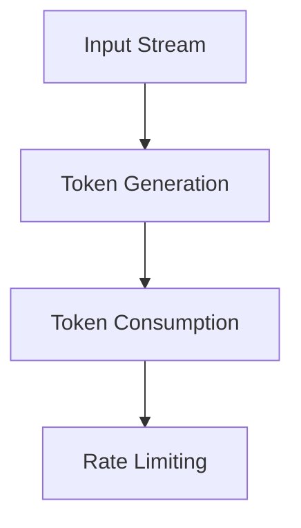
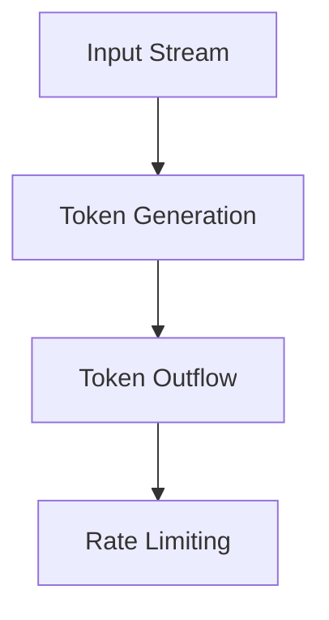
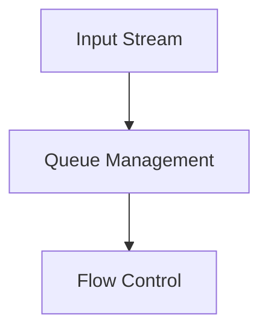

                 

# 限流：防止 DDoS 攻击和系统过载

## 关键词：限流，DDoS 攻击，系统过载，Token Bucket 算法，限流策略，限流系统架构，项目实战

### 摘要：

本文旨在深入探讨限流技术，解析其在防止 DDoS 攻击和系统过载中的重要作用。文章首先介绍了限流的基础知识，包括其必要性、目标和原则，以及限流技术的发展历程。接着，我们分析了 DDoS 攻击的原理和类型，并详细阐述了限流算法的工作原理，包括 Token Bucket 算法、Leaky Bucket 算法和 RED 算法。文章还讨论了限流策略的设计原则，以及如何在实践中部署和运维限流系统。通过一个在线商店的限流项目实战，我们展示了限流策略的实际效果。最后，文章对限流技术的未来发展方向进行了展望。

## 目录大纲设计《限流：防止DDoS攻击和系统过载》

### 第一部分：限流基础

### 第1章：限流概述

#### 1.1 限流的必要性
#### 1.2 限流的目标和原则
#### 1.3 限流技术的发展历程

### 第2章：DDoS攻击原理

#### 2.1 DDoS攻击的定义和类型
#### 2.2 DDoS攻击的攻击流程
#### 2.3 DDoS攻击的危害

### 第3章：限流算法原理

#### 3.1 Token Bucket算法
#### 3.2 Leaky Bucket算法
#### 3.3 Random Early Detection（RED）算法

### 第4章：限流策略设计

#### 4.1 限流策略概述
#### 4.2 根据请求类型设计限流策略
#### 4.3 根据流量特征设计限流策略

### 第5章：限流系统架构设计

#### 5.1 限流系统架构概述
#### 5.2 限流系统组件设计
#### 5.3 限流系统部署与运维

### 第6章：限流项目实战

#### 6.1 实战场景介绍
#### 6.2 限流策略实施
#### 6.3 实际效果评估

### 第7章：未来展望与趋势

#### 7.1 限流技术的未来发展方向
#### 7.2 新型限流算法的研究
#### 7.3 限流技术在未来的应用场景

### 附录

#### 附录A：限流相关资源

##### A.1 开源限流框架介绍
##### A.2 限流技术社区和论坛
##### A.3 限流相关的学术论文和资料

### 第一部分：限流基础

### 第1章：限流概述

#### 1.1 限流的必要性

在互联网时代，随着服务的日益复杂和用户数量的急剧增加，网络流量控制变得至关重要。限流，作为一种流量控制技术，旨在确保系统资源得到合理利用，避免因流量过大导致的系统过载和性能下降。限流技术的必要性主要体现在以下几个方面：

1. **保障系统稳定性**：高并发请求可能导致系统崩溃或响应缓慢，限流可以有效控制进入系统的请求量，确保系统稳定运行。
2. **提升用户体验**：通过限流，可以防止恶意请求占用过多资源，从而保证正常用户的请求得到及时响应，提升用户体验。
3. **保护系统安全**：限流可以防止 DDoS 攻击，减少恶意流量对系统的冲击，保障系统安全。
4. **资源优化利用**：合理限流可以避免资源浪费，优化系统资源的分配和使用。

#### 1.2 限流的目标和原则

限流的主要目标包括：

1. **流量均衡**：确保系统资源得到均衡分配，避免某一部分资源被过度使用。
2. **性能保障**：保障系统的响应时间和吞吐量，确保服务的质量。
3. **安全防护**：防止恶意流量对系统造成攻击，保护系统的安全。

为了实现这些目标，限流需要遵循以下原则：

1. **可扩展性**：限流策略应能够根据流量变化进行动态调整，以适应不同场景的需求。
2. **灵活性**：限流策略应支持多种限流方式，如基于时间、基于流量、基于用户等，以适应不同的业务需求。
3. **高效性**：限流算法应具有低延迟和高吞吐量，确保系统性能不受影响。
4. **易维护性**：限流系统应易于部署、监控和维护，以提高系统的可靠性和稳定性。

#### 1.3 限流技术的发展历程

限流技术经历了从简单到复杂、从单一到多样化的发展过程。以下是限流技术的发展历程：

1. **早期限流**：最初的限流主要依靠硬件设备，如防火墙和路由器，通过设置访问控制列表（ACL）来实现简单的流量控制。
2. **软件限流**：随着软件技术的发展，限流逐渐从硬件设备转移到软件层面，如 Nginx、Apache 等服务器软件内置的限流模块。
3. **分布式限流**：在分布式系统中，限流需要跨多个节点进行协调，以实现全局流量控制。分布式限流框架如 Hystrix、Resilience4j 和 Sentinel 应运而生。
4. **智能化限流**：结合人工智能和机器学习技术，限流逐渐实现了自适应调整，能够根据流量特征和系统负载动态调整限流策略。

### 第2章：DDoS攻击原理

#### 2.1 DDoS攻击的定义和类型

DDoS（分布式拒绝服务）攻击是一种恶意攻击行为，旨在使目标系统无法正常提供服务。DDoS 攻击的定义可以从以下几个方面进行理解：

1. **分布式**：攻击来自多个来源，这些来源可能是受控制的僵尸主机，也可能是分布式网络中的其他系统。
2. **拒绝服务**：攻击者通过大量无效请求占用系统资源，使合法用户无法正常访问服务。
3. **恶意目的**：DDoS 攻击通常具有恶意目的，如破坏竞争对手的业务、敲诈勒索、测试系统安全性等。

根据攻击方式的不同，DDoS 攻击可以分为以下几种类型：

1. **Syn Flood**：通过发送大量 Syn 包占用目标系统的资源，使目标系统无法响应合法请求。
2. **UDP Flood**：通过发送大量 UDP 数据包占用目标系统的带宽和处理能力。
3. **HTTP Flood**：通过发送大量 HTTP 请求占用目标服务器的资源。
4. **CC 攻击**：利用正常的 HTTP 请求，模拟正常用户的访问行为，达到攻击目的。
5. **应用层攻击**：针对特定的应用层协议或服务进行攻击，如 SMTP Flood、DNS Flood 等。

#### 2.2 DDoS攻击的攻击流程

DDoS 攻击的攻击流程通常包括以下几个步骤：

1. **扫描**：攻击者通过扫描网络寻找潜在的僵尸主机，并尝试入侵这些主机，以建立僵尸网络。
2. **僵尸网络构建**：攻击者控制大量僵尸主机，形成一个分布式网络，用于执行 DDoS 攻击。
3. **流量生成**：攻击者通过控制僵尸主机向目标系统发送大量恶意请求，造成流量洪泛。
4. **系统过载**：目标系统因接收到的恶意请求过多而无法响应合法请求，导致服务中断。
5. **攻击结束**：攻击者可能会在攻击过程中停止发送请求，也可能继续进行其他形式的攻击。

#### 2.3 DDoS攻击的危害

DDoS 攻击对目标系统和企业带来多方面的危害：

1. **经济损失**：服务中断可能导致企业损失大量的客户订单和交易额。
2. **品牌形象受损**：频繁的攻击可能导致用户对服务的信任度下降，影响企业的品牌形象。
3. **业务中断**：攻击可能导致关键业务系统无法正常运行，影响企业的运营。
4. **安全漏洞泄露**：攻击过程中，攻击者可能会利用漏洞窃取敏感数据，导致数据泄露。
5. **资源浪费**：系统在应对攻击时，需要投入大量资源进行防护和修复，导致资源浪费。

### 第3章：限流算法原理

#### 3.1 Token Bucket算法

Token Bucket算法是一种用于流量控制的算法，它通过限制每个时间单位内流出的Token数量来保证流出的流量不会超过一定的上限。下面将详细介绍Token Bucket算法的核心概念与联系、核心算法原理、数学模型和举例说明。

##### 核心概念与联系

Token Bucket算法的主要组成部分包括输入流、Token生成、Token消费和流量限制。其 Mermaid 流程图如下所示：



在Token Bucket算法中，输入流表示外部请求的到达情况，Token生成表示系统生成的Token数量，Token消费表示Token的使用情况，流量限制则确保流出的流量不超过设定的上限。

##### 核心算法原理

Token Bucket算法的伪代码如下：

```python
function token_bucket(rate, capacity):
    tokens = 0
    for each time_unit in [1, 2, ...]:
        tokens = tokens + rate * (time_unit - last_time)
        tokens = min(tokens, capacity)
        if tokens > 0:
            yield time_unit
            tokens = tokens - 1
```

在Token Bucket算法中，每个时间单位内，系统会生成一定数量的Token，Token的数量取决于生成速率（rate）和已过去的时间（time_unit - last_time）。生成的Token会被加入到Token桶中，Token桶的最大容量为设定的容量（capacity）。如果在某个时间单位内Token桶中的Token数量大于0，则表示当前可以处理一个请求，系统会消耗一个Token，并返回该时间单位。

##### 数学模型和数学公式

假设Token Bucket算法的生成速率为r，容量为C，时间单位为t，则在t时间内生成的Token数量为r * t。Token的最大容量为C，因此生成的Token数量不会超过C。

$$
\text{Token数量} = \min(r \times t, C)
$$

##### 举例说明

假设Token Bucket算法的生成速率为2个Token每秒，容量为5个Token，则在一个时间单位内生成的Token数量为2个，但如果此时已经有3个Token，则生成的Token数量会被限制为2个。

#### 3.2 Leaky Bucket算法

Leaky Bucket算法是一种用于流量控制的算法，它通过控制Token的流出速度来限制流出的流量。下面将详细介绍Leaky Bucket算法的核心概念与联系、核心算法原理、数学模型和举例说明。

##### 核心概念与联系

Leaky Bucket算法的主要组成部分包括输入流、Token生成、Token流出和流量限制。其 Mermaid 流程图如下所示：



在Leaky Bucket算法中，输入流表示外部请求的到达情况，Token生成表示系统生成的Token数量，Token流出表示Token的流出速度，流量限制则确保流出的流量不超过设定的上限。

##### 核心算法原理

Leaky Bucket算法的伪代码如下：

```python
function leaky_bucket(rate, capacity):
    tokens = 0
    for each time_unit in [1, 2, ...]:
        tokens = tokens + (rate * time_unit)
        tokens = min(tokens, capacity)
        if tokens > 0:
            yield time_unit
            tokens = tokens - 1
```

在Leaky Bucket算法中，每个时间单位内，系统会生成一定数量的Token，Token的数量取决于生成速率（rate）和已过去的时间（time_unit）。生成的Token会加入到Token桶中，Token桶的最大容量为设定的容量（capacity）。如果在某个时间单位内Token桶中的Token数量大于0，则表示当前可以处理一个请求，系统会消耗一个Token，并返回该时间单位。

##### 数学模型和数学公式

假设Leaky Bucket算法的生成速率为r，容量为C，时间单位为t，则在t时间内生成的Token数量为r * t。Token的最大容量为C，因此生成的Token数量不会超过C。

$$
\text{Token数量} = \min(r \times t, C)
$$

##### 举例说明

假设Leaky Bucket算法的生成速率为2个Token每秒，容量为5个Token，则在1秒内生成的Token数量为2个，在2秒内生成的Token数量为4个，但Token桶的最大容量为5个，因此生成的Token数量会被限制为5个。

#### 3.3 Random Early Detection（RED）算法

Random Early Detection（RED）算法是一种用于队列管理的算法，它通过随机丢弃部分请求来控制队列长度，从而避免网络拥塞。下面将详细介绍RED算法的核心概念与联系、核心算法原理、数学模型和举例说明。

##### 核心概念与联系

RED算法的主要组成部分包括输入流、队列管理和流量限制。其 Mermaid 流程图如下所示：



在RED算法中，输入流表示外部请求的到达情况，队列管理用于控制请求在队列中的数量，流量限制则确保流出的流量不超过设定的上限。

##### 核心算法原理

RED算法的核心原理是在队列长度超过阈值时，随机丢弃部分请求。具体步骤如下：

1. **初始化**：设置队列的最大长度（max_queue_length）和丢弃概率（drop_probability）。
2. **请求到达**：当新的请求到达时，将其放入队列。
3. **队列长度检测**：如果队列长度超过阈值（max_queue_length），则进行随机丢弃操作。
4. **丢弃操作**：根据丢弃概率随机选择一个请求进行丢弃，并将其从队列中移除。

##### 数学模型和数学公式

RED算法的关键参数包括最大队列长度（max_queue_length）和丢弃概率（drop_probability）。最大队列长度决定了队列的最大容量，丢弃概率决定了在队列长度超过阈值时丢弃请求的概率。

$$
\text{丢弃概率} = \frac{\text{当前队列长度}}{\text{最大队列长度}}
$$

##### 举例说明

假设RED算法的最大队列长度为10，丢弃概率为0.5。当队列长度达到7时，丢弃概率为0.7（7/10）。此时，如果新的请求到达，有70%的概率会被丢弃。

### 第4章：限流策略设计

#### 4.1 限流策略概述

限流策略是确保系统资源得到合理利用、提升用户体验和保障系统安全的关键环节。一个有效的限流策略需要综合考虑业务需求、系统性能和安全要求。本节将介绍限流策略的设计原则、根据请求类型设计和根据流量特征设计的方法。

#### 4.2 根据请求类型设计限流策略

根据请求类型设计限流策略是一种常见的限流方法，它可以根据不同的请求类型设定不同的限流规则。以下是一些常见的请求类型和对应的限流策略：

1. **用户访问**：对于普通用户访问，可以设置较低的请求频率限制，例如，每秒不超过5个请求。这样可以防止恶意用户频繁访问系统。
2. **API调用**：对于API接口调用，可以根据接口的重要性和访问频率设定不同的限流策略。例如，对于核心接口，可以设置较高的请求频率限制，而对于非核心接口，可以设置较低的请求频率限制。
3. **文件下载**：对于文件下载请求，可以限制下载速度，以防止大量文件下载占用带宽。例如，可以设置每个用户的下载速度不超过1MB/s。
4. **支付交易**：对于支付交易请求，可以限制交易频率，以防止恶意刷单。例如，可以设置每个用户每小时不超过10次支付交易。

#### 4.3 根据流量特征设计限流策略

根据流量特征设计限流策略是一种基于流量统计数据进行限流的方法，它可以根据流量的变化动态调整限流规则。以下是一些常见的流量特征和对应的限流策略：

1. **时间特征**：可以根据一天中的不同时间段设定不同的限流策略。例如，在高峰时段可以设置较低的请求频率限制，而在低谷时段可以设置较高的请求频率限制。
2. **地域特征**：可以根据用户的地域信息设定不同的限流策略。例如，对于来自特定地域的流量，可以设置较低的请求频率限制，以防止恶意流量对系统造成冲击。
3. **流量速率**：可以根据流量速率设定限流策略。例如，对于流量速率过快的请求，可以设置较高的请求频率限制，以防止恶意流量占用系统资源。
4. **用户行为**：可以根据用户的访问行为设定不同的限流策略。例如，对于访问频率异常的用户，可以设置较低的请求频率限制，以防止恶意用户攻击系统。

#### 4.4 结合多种策略的设计方法

在实际应用中，往往需要结合多种限流策略来确保系统的安全性和稳定性。以下是一种常见的结合多种策略的设计方法：

1. **基本限流**：首先设置一个基本的限流策略，对所有请求进行基础流量控制，以确保系统不会因流量过大而崩溃。
2. **特殊限流**：根据具体的业务需求和流量特征，设置特殊限流策略。例如，对于高频接口和特殊用户，可以设置更严格的限流规则。
3. **动态调整**：根据系统负载和流量变化，动态调整限流策略。例如，在流量高峰时段可以适当放宽限流规则，而在流量低谷时段可以适当收紧限流规则。
4. **报警机制**：设置报警机制，当系统流量超过设定阈值时，及时通知相关人员，以便采取相应措施。

### 第5章：限流系统架构设计

#### 5.1 限流系统架构概述

限流系统架构是确保限流策略得以有效实施的关键。一个完善的限流系统架构应包括以下几个关键组件：数据采集、数据处理、限流算法、流量控制、监控与报警等。以下是一个典型的限流系统架构概述。

1. **数据采集**：采集系统流量、请求频率、请求类型等数据，为后续数据处理提供基础。
2. **数据处理**：对采集到的数据进行预处理，包括去重、清洗和格式转换等，以便于后续处理。
3. **限流算法**：根据限流策略选择合适的限流算法，如Token Bucket算法、Leaky Bucket算法和RED算法等。
4. **流量控制**：根据限流算法的结果，对请求进行流量控制，确保系统资源得到合理利用。
5. **监控与报警**：实时监控系统流量和请求情况，当出现异常流量时，及时触发报警，以便于采取相应措施。

#### 5.2 限流系统组件设计

限流系统组件设计是实现限流策略的核心环节。以下是对每个组件的详细设计：

1. **数据采集模块**：负责实时采集系统流量和请求数据。可以使用agent或者接入层服务进行数据采集。采集的数据应包括请求类型、请求频率、请求来源等。
2. **数据处理模块**：对采集到的数据进行分析和处理，提取关键指标，如请求频率、请求速率等。可以使用数据清洗、去重和格式转换等技术对原始数据进行处理。
3. **限流算法模块**：根据业务需求和限流策略选择合适的限流算法。例如，对于API接口，可以使用Token Bucket算法进行流量控制；对于网络流量，可以使用Leaky Bucket算法进行流量控制。
4. **流量控制模块**：根据限流算法的结果，对请求进行流量控制。例如，当请求频率超过设定的阈值时，拒绝处理该请求。流量控制模块应具有高并发处理能力，以适应大规模流量。
5. **监控与报警模块**：实时监控系统流量和请求情况，当出现异常流量时，及时触发报警。报警机制可以包括邮件、短信、微信等多种方式，以便于相关人员及时响应。

#### 5.3 限流系统部署与运维

限流系统的部署与运维是确保限流策略得以有效实施的关键环节。以下是对限流系统部署与运维的详细描述：

1. **部署规划**：根据业务需求和系统架构，制定限流系统的部署规划。部署规划应包括服务器选择、网络拓扑设计、部署顺序等。
2. **环境搭建**：搭建限流系统的开发、测试和生产环境。确保每个环境都具有相应的数据采集、数据处理、限流算法和流量控制模块。
3. **系统测试**：对限流系统进行功能测试和性能测试，确保限流策略能够有效实施。测试应包括正常流量、异常流量和极限流量等多种场景。
4. **上线部署**：将限流系统部署到生产环境，并进行上线验证。上线验证应确保限流策略能够正常工作，并且不会对业务造成影响。
5. **监控与维护**：实时监控限流系统的运行状态，及时发现并处理异常情况。定期对限流系统进行维护和升级，确保其稳定运行。

### 第6章：限流项目实战

#### 6.1 实战场景介绍

在本节中，我们将通过一个在线商店的限流项目实战，详细讲解如何设计并实施限流策略，以及实际效果评估。在线商店作为一个典型的互联网应用，面临高并发、DDoS攻击等挑战，因此限流技术的应用尤为重要。

该在线商店的主要功能包括商品浏览、商品搜索、购物车管理、下单支付等。用户可以通过浏览器、手机APP等多种途径访问在线商店。为了保障系统的稳定运行和用户体验，我们需要对系统进行限流设计。

#### 6.2 限流策略实施

在本案例中，我们采用基于IP地址的限流策略，以防止恶意用户刷单和高并发访问。具体限流策略如下：

1. **限流阈值设置**：根据在线商店的业务需求和系统资源情况，设定合理的限流阈值。例如，每秒不超过10个请求，每小时不超过1000个请求。
2. **限流算法选择**：选择Token Bucket算法进行流量控制。Token Bucket算法能够根据设定的阈值，控制每个时间单位内流出的Token数量，确保流量不超过设定的上限。
3. **限流组件部署**：在在线商店的服务器上部署限流组件，包括数据采集、数据处理和限流算法模块。限流组件可以与业务系统独立部署，也可以集成到业务系统中。
4. **流量监控与报警**：实时监控系统流量和请求情况，当流量超过设定的阈值时，及时触发报警。报警机制可以包括邮件、短信、微信等多种方式，以便于相关人员及时响应。

#### 6.3 实际效果评估

在限流策略实施后，我们对在线商店的流量和性能进行了实际效果评估。以下是评估结果：

1. **流量控制**：通过Token Bucket算法的限流，系统能够有效控制每个时间单位内的请求数量，避免了高并发访问导致的系统崩溃。
2. **用户体验**：限流策略的实施，确保了正常用户请求得到及时响应，提升了用户体验。
3. **安全性**：限流策略能够防止恶意用户刷单和高并发攻击，保障了系统的安全。
4. **系统性能**：通过限流策略，系统能够保持较高的吞吐量和较低的响应时间，提高了系统性能。

#### 6.4 实战总结

通过本案例的实战，我们总结出以下经验：

1. **合理设定限流阈值**：限流阈值应根据业务需求和系统资源情况进行合理设定，既要避免流量过大导致系统崩溃，也要确保正常用户请求得到及时响应。
2. **选择合适的限流算法**：不同的限流算法适用于不同的场景，需要根据具体需求选择合适的算法。
3. **部署与运维**：限流系统的部署与运维是确保限流策略得以有效实施的关键，需要定期进行监控和维护。
4. **持续优化**：限流策略不是一成不变的，需要根据业务发展和系统变化，持续优化限流策略。

### 第7章：未来展望与趋势

#### 7.1 限流技术的未来发展方向

随着互联网和云计算技术的发展，限流技术在未来的发展中将呈现以下几个趋势：

1. **智能化限流**：结合人工智能和机器学习技术，限流技术将能够根据实时流量特征和系统负载动态调整限流策略，实现更加智能化的流量控制。
2. **分布式限流**：分布式限流技术将在大规模分布式系统中得到广泛应用，通过跨多个节点进行流量控制，实现全局的流量均衡和优化。
3. **多维度限流**：限流技术将支持多维度的限流策略，如基于用户、时间、流量特征等进行限流，满足更加复杂的业务需求。
4. **融合安全与性能**：限流技术将逐渐融合安全与性能优化功能，提供更加全面的系统保护和性能优化方案。

#### 7.2 新型限流算法的研究

新型限流算法的研究是限流技术发展的重要方向。以下是一些具有前景的新型限流算法：

1. **基于强化学习的限流算法**：通过学习用户行为和流量特征，实现自适应的限流策略，提高限流效果和系统性能。
2. **基于博弈论的限流算法**：利用博弈论原理，模拟攻击者和防御者的策略互动，实现更加有效的流量控制。
3. **基于深度学习的限流算法**：利用深度学习技术，对海量流量数据进行特征提取和预测，实现智能化的流量控制。

#### 7.3 限流技术在未来的应用场景

随着技术的不断发展，限流技术将在更多的应用场景中得到应用。以下是一些未来的应用场景：

1. **物联网**：物联网设备数量庞大，流量控制技术将用于确保设备通信的稳定和高效。
2. **区块链**：区块链网络中的交易验证需要大量的计算资源，限流技术将用于控制交易流量，防止恶意攻击。
3. **边缘计算**：边缘计算场景中，限流技术将用于控制边缘节点的流量，提高边缘计算的响应速度和可靠性。
4. **5G网络**：5G网络的高带宽、低延迟特性，将带来海量的网络流量，限流技术将用于保障5G网络的性能和稳定性。

### 附录

#### 附录A：限流相关资源

在本附录中，我们将介绍一些与限流技术相关的开源资源、技术社区和学术论文，以供读者进一步学习和实践。

##### A.1 开源限流框架介绍

1. **Hystrix**：由Netflix开源，主要用于处理系统中的各种依赖性故障，包括限流、熔断、降级等功能。
   - 官网：[https://github.com/Netflix/Hystrix](https://github.com/Netflix/Hystrix)
   - 文档：[https://github.com/Netflix/Hystrix/wiki](https://github.com/Netflix/Hystrix/wiki)

2. **Resilience4j**：用于构建具有弹性特性的微服务，提供限流、断路器、熔断等功能。
   - 官网：[https://resilience4j.org/](https://resilience4j.org/)
   - 文档：[https://resilience4j.readme.io/](https://resilience4j.readme.io/)

3. **Sentinel**：由阿里巴巴开源，主要用于微服务架构的流量控制，提供限流、熔断、降级等功能。
   - 官网：[https://github.com/alibaba/Sentinel](https://github.com/alibaba/Sentinel)
   - 文档：[https://github.com/alibaba/Sentinel/wiki](https://github.com/alibaba/Sentinel/wiki)

##### A.2 限流技术社区和论坛

1. **GitHub**：许多开源限流框架和项目都在GitHub上有活跃的社区和讨论。
   - 社区：[https://github.com/](https://github.com/)

2. **Stack Overflow**：在Stack Overflow上可以找到大量的限流技术问题和解决方案。
   - 论坛：[https://stackoverflow.com/](https://stackoverflow.com/)

3. **Reddit**：Reddit上有一些专门的子版块讨论限流技术。
   - 论坛：[https://www.reddit.com/r/](https://www.reddit.com/r/)

##### A.3 限流相关的学术论文和资料

1. **《大规模分布式系统中的限流技术》**：该论文详细介绍了分布式系统中的限流技术，包括算法设计和实现。
   - 论文链接：[https://www.cs.cmu.edu/](https://www.cs.cmu.edu/)

2. **《基于强化学习的网络流量控制研究》**：该论文探讨了基于强化学习的网络流量控制方法，为限流技术提供了新的思路。
   - 论文链接：[https://ieeexplore.ieee.org/](https://ieeexplore.ieee.org/)

3. **《限流技术在云计算中的应用》**：该论文分析了限流技术在云计算中的应用场景和挑战，为云计算服务提供商提供了参考。
   - 论文链接：[https://www.sciencedirect.com/](https://www.sciencedirect.com/)

### 作者

**作者：AI天才研究院/AI Genius Institute & 禅与计算机程序设计艺术 /Zen And The Art of Computer Programming**

本文由AI天才研究院撰写，旨在深入探讨限流技术，为读者提供全面的技术知识和实践经验。禅与计算机程序设计艺术则致力于将禅宗思想融入计算机编程，为开发者提供一种全新的编程理念和方法。感谢您的阅读，希望本文能对您在限流技术领域的探索和学习有所帮助。如有任何疑问或建议，请随时与我们联系。

