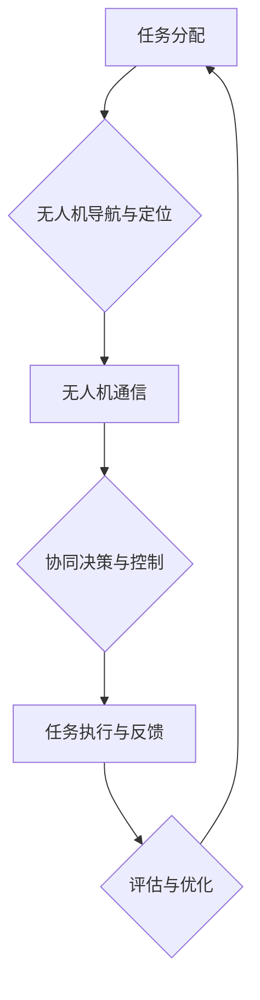

                 

## 第1章：无人机群协同控制概述

### 1.1 无人机群协同控制的定义与作用

#### 1.1.1 无人机群协同控制的定义
无人机群协同控制是指利用多个无人机以群体形式执行任务，通过互相之间的信息共享与协作，实现整体协调和高效执行的过程。无人机群协同控制的核心在于群体智能的发挥，通过多无人机之间的信息交互，完成单台无人机难以实现的复杂任务。

#### 1.1.2 无人机群协同控制的作用
1. **提高任务执行效率**：无人机群协同控制可以实现任务的分布式执行，多个无人机可以同时执行不同的子任务，从而提高整体任务效率。
2. **增强任务灵活性**：无人机群可以适应复杂环境，通过协同控制，能够灵活调整飞行路径和任务执行方式，完成多样化任务。
3. **提升安全性**：通过无人机群协同控制，可以有效避免单一无人机在复杂环境下的风险，如无人机之间的避障协作，能够降低无人机因操作失误导致的碰撞风险。

### 1.2 无人机群协同控制的发展历程

#### 1.2.1 早期探索
无人机群协同控制技术的发展可以追溯到20世纪80年代。当时，研究人员开始探索无人机编队飞行和简单任务协同。早期的无人机群协同控制主要集中在飞行控制和基本任务分配上。

#### 1.2.2 技术成熟期
随着计算机技术和通信技术的发展，无人机群协同控制在21世纪初进入了成熟期。这一阶段，多无人机协同控制算法开始逐渐成熟，如基于图论的协同控制算法和分布式协同控制算法。无人机群能够执行更为复杂的任务，如物流配送和测绘。

#### 1.2.3 现代化发展
近年来，人工智能和深度学习技术的引入，使得无人机群协同控制技术进入了现代化发展阶段。通过引入机器学习和强化学习算法，无人机群在复杂环境中的自主决策和协同控制能力得到了显著提升。

### 1.3 无人机群协同控制的系统架构

无人机群协同控制的系统架构通常包括以下几个主要部分：

#### 1.3.1 硬件系统
1. **无人机本体**：无人机本体是无人机群协同控制的核心硬件，具备飞行、感知、决策等能力。常见的无人机类型包括固定翼无人机、旋翼无人机等。
2. **通信系统**：通信系统用于实现无人机之间的信息传输和共享。常见的通信技术包括Wi-Fi、LoRa、4G/5G等。

#### 1.3.2 软件系统
1. **导航与定位**：导航与定位系统用于实现无人机的自主导航和定位。常见的导航与定位技术包括GPS、北斗、惯性导航等。
2. **任务规划与分配**：任务规划与分配系统根据任务需求和无人机状态，为每个无人机分配具体任务。
3. **协同控制算法**：协同控制算法是实现无人机群协同控制的核心，包括基于图论的协同控制算法、基于神经网络和机器学习的协同控制算法等。

### 1.4 无人机群协同控制的研究方法与技术路线

#### 1.4.1 研究方法
无人机群协同控制的研究方法主要包括：

1. **实验研究**：通过搭建实验平台，对无人机群协同控制算法进行验证和优化。
2. **仿真研究**：通过仿真软件，模拟无人机群在不同环境下的协同控制过程，分析算法性能。
3. **案例分析**：通过对实际应用案例的分析，总结无人机群协同控制的最佳实践和优化策略。

#### 1.4.2 技术路线
无人机群协同控制的技术路线包括：

1. **基础算法研究**：研究并优化无人机群协同控制的基础算法，如基于图论的协同控制算法、基于分布式算法的协同控制算法等。
2. **智能算法引入**：将人工智能和深度学习算法引入无人机群协同控制，提高无人机的自主决策和协同控制能力。
3. **跨领域融合**：将无人机群协同控制技术与其他领域（如机器人、自动驾驶等）进行融合，拓展无人机群协同控制的应用场景。

### 1.5 无人机群协同控制的核心挑战与解决策略

#### 1.5.1 通信可靠性与延迟
无人机群协同控制对通信系统有着高可靠性、低延迟的要求。解决策略包括：

1. **多跳通信**：通过多跳通信，延长通信距离，提高通信可靠性。
2. **冗余通信**：使用多个通信链路，确保通信系统的可靠性。

#### 1.5.2 环境感知与建模
无人机群协同控制需要准确感知和建模环境，解决策略包括：

1. **多传感器融合**：通过融合多个传感器数据，提高环境感知精度。
2. **动态环境建模**：使用动态环境建模技术，实时更新环境模型。

#### 1.5.3 安全性与隐私保护
无人机群协同控制需要保证系统的安全性，解决策略包括：

1. **加密通信**：使用加密技术，确保通信数据的安全。
2. **访问控制**：实施严格的访问控制策略，防止未经授权的访问。

### 1.6 无人机群协同控制的未来发展趋势

#### 1.6.1 智能化与自主化
随着人工智能技术的发展，无人机群协同控制将朝着智能化和自主化方向发展。无人机将具备更高的自主决策和协同控制能力，实现更复杂任务的高效执行。

#### 1.6.2 安全性与可靠性
随着无人机群应用场景的扩大，安全性与可靠性将得到更多的关注。无人机群协同控制技术将朝着更加安全、可靠的方向发展，确保无人机群在各种环境下的稳定运行。

#### 1.6.3 跨领域融合
无人机群协同控制技术将与机器人、自动驾驶等跨领域技术进行融合，形成新的应用场景和商业模式。

## 第2章：无人机群协同控制核心概念与联系

### 2.1 无人机群协同控制中的基本概念

在无人机群协同控制中，有几个基本概念是至关重要的，这些概念包括无人机、群体、协同控制等。

#### 2.1.1 无人机
无人机（Unmanned Aerial Vehicle，简称UAV）是指无需驾驶员操控，能够自主飞行、执行任务的飞行器。无人机具备高度自动化、远程控制的特点，能够在空中进行侦察、监控、物流配送等多种任务。

#### 2.1.2 群体
群体（Group）是指由多个个体组成的集合。在无人机群协同控制中，群体指的是一组协同工作的无人机。这些无人机通过通信、协调和合作，共同完成任务。

#### 2.1.3 协同控制
协同控制（Collaborative Control）是指多个无人机在执行任务时，通过相互之间的信息交换和决策协调，实现整体协调和高效执行的过程。协同控制的关键在于无人机之间的信息共享和合作。

### 2.2 无人机群协同控制中的关键联系

无人机群协同控制的核心在于无人机之间的信息交互和协同合作。以下是无人机群协同控制中的几个关键联系：

#### 2.2.1 无人机之间的通信
无人机之间的通信是实现协同控制的基础。无人机通过无线通信系统，如Wi-Fi、LoRa、4G/5G等，实现数据传输、状态共享和指令传达。通信系统的稳定性和可靠性对无人机群的协同控制至关重要。

#### 2.2.2 无人机与任务的关系
无人机群协同控制需要根据任务需求，合理分配任务给各个无人机。每个无人机根据任务要求，执行相应的任务指令，如路径规划、目标识别、任务执行等。任务分配的效率和准确性直接影响到无人机群的协同效果。

#### 2.2.3 协同控制算法与任务执行的关系
协同控制算法是实现无人机群协同控制的核心。协同控制算法通过决策逻辑、控制策略，实现对无人机群的行为控制。算法的复杂度和效率决定了无人机群协同控制的性能。同时，协同控制算法需要与任务执行紧密结合，确保任务的高效、准确完成。

### 2.3 无人机群协同控制的Mermaid流程图

为了更清晰地展示无人机群协同控制的过程，我们可以使用Mermaid语言绘制一个流程图。以下是一个简单的无人机群协同控制Mermaid流程图：



在这个流程图中，无人机群协同控制的过程可以分为以下几个步骤：

1. **任务分配**：根据任务需求，将任务分配给各个无人机。
2. **无人机导航与定位**：无人机通过导航与定位系统，确定自己的位置和航向。
3. **无人机通信**：无人机通过通信系统，共享状态信息和任务指令。
4. **协同决策与控制**：基于共享的信息，无人机进行协同决策，调整飞行路径和任务执行方式。
5. **任务执行与反馈**：无人机根据协同决策，执行任务，并实时反馈任务状态。
6. **评估与优化**：根据任务执行情况，评估协同控制的性能，并进行优化调整。
7. **回到任务分配**：优化后的协同控制过程重新进行任务分配，循环执行。

通过这个Mermaid流程图，我们可以清晰地看到无人机群协同控制的核心环节和流程，有助于理解和设计无人机群协同控制系统。

## 第3章：无人机群协同控制算法原理详解

### 3.1 无人机群协同控制算法概述

无人机群协同控制算法是实现无人机群高效、安全协同执行任务的关键。这些算法通过数学模型、控制策略和通信机制，实现对无人机群行为的协调和优化。无人机群协同控制算法可以分为以下几类：

1. **基于图论的算法**：通过构建无人机群之间的图模型，实现无人机之间的信息共享和协作。
2. **基于神经网络和机器学习的算法**：利用神经网络和机器学习技术，实现无人机群的自主决策和协同控制。
3. **基于分布式算法的算法**：通过分布式计算，实现无人机群协同控制。

### 3.2 基于图论的无人机群协同控制算法

#### 3.2.1 最小生成树算法

最小生成树算法是一种常用的无人机群协同控制算法。它通过构建无人机群之间的最小生成树，实现无人机之间的信息共享和路径规划。

**算法原理**：
- **构建图模型**：首先，将无人机群视为图中的节点，无人机之间的通信链路视为图中的边。
- **求解最小生成树**：利用Kruskal或Prim算法，求解无人机群之间的最小生成树。

**伪代码**：

```python
def findMinimumSpanningTree(uavs, edges):
    # 初始化最小生成树
    mst = []
    # 对边进行排序
    sorted_edges = sort(edges, key=lambda x: x.weight)
    # 添加边到最小生成树
    for edge in sorted_edges:
        if canAddEdge(edge, mst):
            addEdge(edge, mst)
    return mst

def canAddEdge(edge, mst):
    # 检查边是否可以添加到最小生成树
    for existing_edge in mst:
        if edge.node1 == existing_edge.node1 or edge.node2 == existing_edge.node2:
            return False
    return True

def addEdge(edge, mst):
    # 添加边到最小生成树
    mst.append(edge)
```

#### 3.2.2 最短路径算法

最短路径算法用于实现无人机群之间的路径规划。常见的最短路径算法包括Dijkstra算法和A*算法。

**算法原理**：
- **Dijkstra算法**：从源节点开始，逐步扩展到其他节点，计算出每个节点到源节点的最短路径。
- **A*算法**：结合启发式信息，优先选择距离目标节点更近的路径。

**伪代码**：

```python
def dijkstra(graph, start):
    # 初始化距离和前驱节点
    distances = {node: float('infinity') for node in graph}
    distances[start] = 0
    previous = {node: None for node in graph}
    # 使用优先队列进行松弛操作
    priority_queue = PriorityQueue()
    priority_queue.enqueue(start, 0)
    while not priority_queue.isEmpty():
        current = priority_queue.dequeue()
        for neighbor, weight in graph[current]:
            distance = distances[current] + weight
            if distance < distances[neighbor]:
                distances[neighbor] = distance
                previous[neighbor] = current
                priority_queue.enqueue(neighbor, distance)
    return distances, previous

def a_star(graph, start, goal):
    # 初始化闭集合、开集合和g得分
    closed_set = set()
    open_set = PriorityQueue()
    open_set.enqueue(start, 0)
    g_score = {node: float('infinity') for node in graph}
    g_score[start] = 0
    # 主循环
    while not open_set.isEmpty():
        current = open_set.dequeue()
        closed_set.add(current)
        if current == goal:
            break
        for neighbor, weight in graph[current]:
            tentative_g_score = g_score[current] + weight
            if tentative_g_score < g_score[neighbor]:
                g_score[neighbor] = tentative_g_score
                f_score = tentative_g_score + heuristic(neighbor, goal)
                open_set.enqueue(neighbor, f_score)
    return g_score, previous
```

### 3.3 基于神经网络和机器学习的无人机群协同控制算法

#### 3.3.1 深度强化学习算法

深度强化学习算法通过训练神经网络，实现无人机群的自主决策和协同控制。

**算法原理**：
- **Q-Learning**：基于值函数，通过不断更新Q值，实现无人机群的策略优化。
- **Deep Q-Network (DQN)**：使用深度神经网络近似Q值函数，提高无人机群的决策能力。
- **Actor-Critic**：结合策略网络和价值网络，实现无人机群的策略学习和优化。

**伪代码**：

```python
# Q-Learning
def q_learning(state, action, reward, next_state, gamma, alpha):
    q_value = get_Q_value(state, action)
    next_q_value = max(get_Q_value(next_state, actions))
    target = reward + gamma * next_q_value
    q_value = q_value + alpha * (target - q_value)
    update_Q_value(state, action, q_value)

# DQN
def dqn(state, action, reward, next_state, done):
    Q = get_Q_values(state)
    next_Q = get_Q_values(next_state)
    target_Q = reward + (1 - done) * next_Q[action]
    loss = mean_squared_error(target_Q, Q)
    train_network(loss)

# Actor-Critic
def actor_critic(state, action, reward, next_state, done):
    action = actor_network(state)
    reward = reward + critic_network(next_state, action)
    train_actor_network(state, action, reward)
    train_critic_network(state, action, reward)
```

#### 3.3.2 迁移学习算法

迁移学习算法通过将已训练好的模型迁移到新的任务上，实现无人机群的快速适应和协同控制。

**算法原理**：
- **经验重放**：使用经验重放机制，避免样本偏差，提高训练效果。
- **特征提取**：使用共享的特征提取网络，提高模型泛化能力。
- **目标网络**：使用目标网络，稳定训练过程，提高模型性能。

**伪代码**：

```python
# Experience Replay
def experience_replay(batch, memory_size):
    while len(memory) < memory_size:
        state, action, reward, next_state, done = sample_memory(batch)
        memory.append((state, action, reward, next_state, done))
    return memory

# Feature Extractor
def extract_features(state):
    return feature_extractor(state)

# Target Network
def update_target_network(target_network, main_network, theta):
    target_network.params = main_network.params.copy()
    for i in range(len(theta)):
        target_network.params[i] = theta[i]
```

### 3.4 基于分布式算法的无人机群协同控制算法

#### 3.4.1 拉格朗日分布算法

拉格朗日分布算法通过优化拉格朗日函数，实现无人机群协同控制。

**算法原理**：
- **拉格朗日函数**：定义拉格朗日函数，结合约束条件，求解最优解。
- **分布式优化**：通过分布式计算，提高算法效率和鲁棒性。

**伪代码**：

```python
def lagrangian_distribution(uavs, constraints):
    # 定义拉格朗日函数
    L = 0
    for uav in uavs:
        L += uav.cost + constraint_cost(uav, constraints)
    # 求解拉格朗日函数的最优解
    gradient = gradient_L(L, uavs)
    optimal_solution = gradient_descent(gradient)
    return optimal_solution

def gradient_L(L, uavs):
    # 计算拉格朗日函数的梯度
    gradient = []
    for uav in uavs:
        gradient.append(-uav.cost_derivative() - constraint_derivative(uav, constraints))
    return gradient

def gradient_descent(gradient, learning_rate):
    # 执行梯度下降
    for uav in uavs:
        uav.position -= learning_rate * gradient[uav]
    return uavs
```

#### 3.4.2 牛顿分布算法

牛顿分布算法通过牛顿迭代方法，实现无人机群协同控制。

**算法原理**：
- **牛顿迭代**：利用牛顿迭代方法，求解优化问题的最优解。
- **分布式计算**：通过分布式计算，提高算法效率和鲁棒性。

**伪代码**：

```python
def newton_distribution(uavs, constraints):
    # 初始化迭代参数
    x = initial_solution(uavs, constraints)
    while not converged:
        f = objective_function(x, uavs, constraints)
        df = gradient_function(x, uavs, constraints)
        d2f = hessian_matrix(x, uavs, constraints)
        x = newton_step(x, f, df, d2f)
    return x

def newton_step(x, f, df, d2f):
    # 计算牛顿迭代步
    delta_x = -d2f.I @ df
    x_new = x + delta_x
    return x_new

def objective_function(x, uavs, constraints):
    # 定义目标函数
    objective = 0
    for uav in uavs:
        objective += uav.cost(x)
    for constraint in constraints:
        objective += constraint.cost(x)
    return objective

def gradient_function(x, uavs, constraints):
    # 计算梯度
    gradient = []
    for uav in uavs:
        gradient.append(uav.cost_derivative(x))
    for constraint in constraints:
        gradient.append(constraint.derivative(x))
    return gradient

def hessian_matrix(x, uavs, constraints):
    # 计算海森矩阵
    hessian = []
    for uav in uavs:
        hessian.append(uav.hessian(x))
    for constraint in constraints:
        hessian.append(constraint.hessian(x))
    return hessian
```

通过以上无人机群协同控制算法的原理详解，我们可以看到不同算法在实现无人机群协同控制中的应用。选择合适的算法，结合实际应用需求，可以实现无人机群的高效、安全协同控制。

## 第4章：无人机群协同控制数学模型

### 4.1 无人机群协同控制的数学模型概述

无人机群协同控制的数学模型是描述无人机群在三维空间中运动规律、信息传输规律和协同控制策略的数学框架。数学模型通过建立无人机群的动态方程、信息传输方程和协同控制方程，实现对无人机群行为的精确描述和优化控制。

#### 4.1.1 动态模型

无人机群协同控制的动态模型主要描述无人机在三维空间中的运动状态，包括位置、速度和加速度等。常见的动态模型包括线性模型和非线性模型。

- **线性模型**：

  $$ \begin{cases} 
  \dot{x}_i = v_i \cos(\theta_i) \\
  \dot{y}_i = v_i \sin(\theta_i) \\
  \dot{\theta}_i = \omega_i 
  \end{cases} $$

  其中，$x_i$ 和 $y_i$ 分别表示无人机 $i$ 的横坐标和纵坐标，$v_i$ 表示无人机 $i$ 的速度，$\theta_i$ 表示无人机 $i$ 的航向角，$\omega_i$ 表示无人机 $i$ 的角速度。

- **非线性模型**：

  $$ \begin{cases} 
  \dot{x}_i = v_i \cos(\theta_i + \alpha_i) \\
  \dot{y}_i = v_i \sin(\theta_i + \alpha_i) \\
  \dot{\theta}_i = \omega_i + \beta_i 
  \end{cases} $$

  其中，$\alpha_i$ 和 $\beta_i$ 分别表示无人机 $i$ 的速度偏差和角速度偏差。

#### 4.1.2 信息传输模型

无人机群协同控制的信息传输模型描述无人机之间的通信和数据共享机制。信息传输模型通常考虑通信链路的时延、带宽和可靠性等因素。

- **通信链路模型**：

  $$ c(t) = c_0 + d_1 \sin(\omega t + \phi) $$

  其中，$c(t)$ 表示通信链路的瞬时带宽，$c_0$ 表示通信链路的基带带宽，$d_1$、$\omega$ 和 $\phi$ 分别表示通信链路的带宽波动幅度、角频率和相位。

- **数据共享模型**：

  $$ s(t) = \sum_{j=1}^{N} p_{ij} \cdot d_j(t) $$

  其中，$s(t)$ 表示无人机 $i$ 收到的总数据，$p_{ij}$ 表示无人机 $i$ 与无人机 $j$ 之间的通信概率，$d_j(t)$ 表示无人机 $j$ 在时间 $t$ 发送的数据。

#### 4.1.3 协同控制模型

无人机群协同控制的协同控制模型描述无人机群的整体控制和协调策略。协同控制模型通常基于优化方法，如线性规划、非线性规划和动态规划等。

- **线性规划模型**：

  $$ \begin{aligned}
  \min_{x} &\quad J(x) \\
  s.t. &\quad Ax \leq b \\
  &\quad Cx = d
  \end{aligned} $$

  其中，$J(x)$ 表示目标函数，$A$ 和 $C$ 分别为约束矩阵，$b$ 和 $d$ 分别为约束向量。

- **非线性规划模型**：

  $$ \begin{aligned}
  \min_{x} &\quad f(x) \\
  s.t. &\quad g_i(x) \leq 0, \quad i=1,2,\ldots,m \\
  &\quad h_j(x) = 0, \quad j=1,2,\ldots,n
  \end{aligned} $$

  其中，$f(x)$ 表示目标函数，$g_i(x)$ 和 $h_j(x)$ 分别为不等式约束和等式约束。

- **动态规划模型**：

  $$ \begin{aligned}
  V_t(x_t) &= \min_{x_{t+1}} \{ g(x_{t+1}) + \lambda_t[V_{t+1}(x_{t+1})] \} \\
  x_{t+1} &= \arg\min_{x_{t+1}} \{ g(x_{t+1}) + \lambda_t[V_{t+1}(x_{t+1})] \}
  \end{aligned} $$

  其中，$V_t(x_t)$ 表示时间步 $t$ 的状态值函数，$x_t$ 表示时间步 $t$ 的状态，$g(x_{t+1})$ 表示状态转移函数，$\lambda_t$ 表示时间步 $t$ 的奖励函数。

### 4.2 无人机群协同控制中的非线性方程组

在无人机群协同控制中，非线性方程组描述无人机之间的动态交互和协同控制策略。以下是一个简化的非线性方程组示例：

$$ \begin{cases} 
\dot{x}_i = v_i \cos(\theta_i + \alpha_i) \\
\dot{y}_i = v_i \sin(\theta_i + \alpha_i) \\
\dot{\theta}_i = \omega_i + \beta_i \\
\dot{\alpha}_i = \omega_i \cdot v_i \\
\dot{\beta}_i = \omega_i \cdot v_i
\end{cases} $$

其中，$\alpha_i$ 和 $\beta_i$ 分别表示无人机 $i$ 的速度偏差和角速度偏差。

#### 4.2.1 非线性方程组的解析解

非线性方程组的解析解通常难以直接求解，因此需要使用数值方法进行求解。以下是一个数值求解的示例：

```python
import numpy as np
from scipy.integrate import solve_ivp

# 定义系统方程
def system_equations(t, y):
    x, y, theta, v, omega, alpha, beta = y
    dxdt = v * np.cos(theta + alpha)
    dydt = v * np.sin(theta + alpha)
    dthetadt = omega + beta
    domega = alpha * v
    dalphadt = omega * v
    dbetadt = omega * v
    return [dxdt, dydt, dthetadt, domega, dalphadt, dbetadt]

# 初始条件
y0 = [0, 0, 0, 1, 0, 0, 0]

# 求解方程
t = np.linspace(0, 10, 1000)
result = solve_ivp(system_equations, [0, 10], y0, t_eval=t)

# 输出结果
print(result.y)
```

#### 4.2.2 非线性方程组的应用

非线性方程组在无人机群协同控制中的应用广泛，以下是一个简化的应用示例：

假设无人机群需要在二维空间中执行协同飞行任务，每个无人机需要保持固定的速度和角度，同时避免与其他无人机发生碰撞。可以定义以下非线性方程组：

$$ \begin{cases} 
\dot{x}_i = v \\
\dot{y}_i = v \\
\dot{\theta}_i = \omega \\
\dot{\alpha}_i = 0 \\
\dot{\beta}_i = 0 \\
\dot{d}_{ij} = \frac{(x_i - x_j) \dot{x}_i + (y_i - y_j) \dot{y}_i}{d_{ij}} 
\end{cases} $$

其中，$d_{ij}$ 表示无人机 $i$ 与无人机 $j$ 之间的距离。

### 4.3 基于优化的无人机群协同控制数学模型

基于优化的无人机群协同控制数学模型通过优化方法，实现对无人机群的任务分配、路径规划、协同控制策略等的优化。以下是一个基于优化的数学模型示例：

#### 4.3.1 目标函数

目标函数用于衡量无人机群协同控制的性能，包括速度、能耗、路径长度等因素。以下是一个简化的目标函数：

$$ \min_{x, y, \theta, v, \omega} J(x, y, \theta, v, \omega) $$

其中，$J(x, y, \theta, v, \omega)$ 表示目标函数，通常是一个非线性的组合函数。

#### 4.3.2 约束条件

约束条件用于限制无人机群的行为，包括速度限制、角度限制、无人机之间的距离限制等。以下是一个简化的约束条件：

$$ \begin{cases} 
v \leq v_{max} \\
\omega \leq \omega_{max} \\
d_{ij} \geq d_{min} \\
x_i, y_i, \theta_i \in \Omega_i
\end{cases} $$

其中，$v_{max}$、$\omega_{max}$、$d_{min}$ 分别为速度上限、角度上限、无人机之间距离的下限，$\Omega_i$ 为无人机 $i$ 的可行区域。

#### 4.3.3 优化模型

基于优化的无人机群协同控制数学模型可以通过以下优化模型表示：

$$ \begin{aligned}
\min_{x, y, \theta, v, \omega} &\quad J(x, y, \theta, v, \omega) \\
s.t. &\quad v \leq v_{max} \\
&\quad \omega \leq \omega_{max} \\
&\quad d_{ij} \geq d_{min} \\
&\quad x_i, y_i, \theta_i \in \Omega_i
\end{aligned} $$

其中，$J(x, y, \theta, v, \omega)$ 为目标函数，$v_{max}$、$\omega_{max}$、$d_{min}$、$\Omega_i$ 为约束条件。

### 4.4 数学公式与模型解析

在无人机群协同控制中，数学公式和模型解析用于描述无人机群的动态行为、信息传输和协同控制策略。以下是一个简化的数学公式与模型解析示例：

#### 4.4.1 动态模型

无人机群的动态模型可以用以下方程表示：

$$ \begin{cases} 
\dot{x}_i = v_i \cos(\theta_i) \\
\dot{y}_i = v_i \sin(\theta_i) \\
\dot{\theta}_i = \omega_i 
\end{cases} $$

其中，$x_i$ 和 $y_i$ 分别表示无人机 $i$ 的横坐标和纵坐标，$v_i$ 表示无人机 $i$ 的速度，$\theta_i$ 表示无人机 $i$ 的航向角，$\omega_i$ 表示无人机 $i$ 的角速度。

#### 4.4.2 信息传输模型

无人机群的信息传输模型可以用以下方程表示：

$$ \begin{cases} 
c(t) = c_0 + d_1 \sin(\omega t + \phi) \\
s(t) = \sum_{j=1}^{N} p_{ij} \cdot d_j(t)
\end{cases} $$

其中，$c(t)$ 表示通信链路的瞬时带宽，$c_0$ 表示通信链路的基带带宽，$d_1$、$\omega$ 和 $\phi$ 分别表示通信链路的带宽波动幅度、角频率和相位，$s(t)$ 表示无人机 $i$ 收到的总数据，$p_{ij}$ 表示无人机 $i$ 与无人机 $j$ 之间的通信概率，$d_j(t)$ 表示无人机 $j$ 在时间 $t$ 发送的数据。

#### 4.4.3 协同控制模型

无人机群的协同控制模型可以用以下方程表示：

$$ \begin{aligned}
\min_{x, y, \theta, v, \omega} &\quad J(x, y, \theta, v, \omega) \\
s.t. &\quad v \leq v_{max} \\
&\quad \omega \leq \omega_{max} \\
&\quad d_{ij} \geq d_{min} \\
&\quad x_i, y_i, \theta_i \in \Omega_i
\end{aligned} $$

其中，$J(x, y, \theta, v, \omega)$ 为目标函数，$v_{max}$、$\omega_{max}$、$d_{min}$、$\Omega_i$ 为约束条件。

通过以上数学公式与模型解析，我们可以更深入地理解无人机群协同控制的数学原理，为实际应用提供理论基础。

### 4.5 数学公式与模型在实际应用中的案例解析

为了更好地理解数学公式与模型在无人机群协同控制中的应用，以下通过一个具体案例进行详细解析。

#### 案例背景

假设有一组无人机需要在二维空间中执行协同飞行任务，目标是最小化飞行路径的总长度。每个无人机初始位置在坐标系中的不同位置，且具有不同的速度和航向角。无人机之间的通信链路带宽有限，需要优化飞行路径和速度，以确保任务顺利完成。

#### 数学模型

1. **目标函数**：最小化飞行路径的总长度

   $$ J(x, y, \theta, v) = \sum_{i=1}^{N} \int_{t_0}^{t_f} \sqrt{x_i'(t)^2 + y_i'(t)^2} dt $$

   其中，$N$ 为无人机数量，$t_0$ 和 $t_f$ 分别为任务开始和结束时间。

2. **约束条件**：
   - 无人机之间的通信带宽限制

     $$ c(t) = c_0 + d_1 \sin(\omega t + \phi) $$

   - 无人机速度限制

     $$ v_i \leq v_{max} $$

   - 无人机航向角限制

     $$ \theta_i \leq \theta_{max} $$

   - 无人机之间的最小距离限制

     $$ d_{ij} \geq d_{min} $$

   - 无人机位置和航向角约束

     $$ x_i, y_i, \theta_i \in \Omega_i $$

   其中，$c_0$、$d_1$、$\omega$、$\phi$ 为通信链路参数，$v_{max}$、$\theta_{max}$、$d_{min}$ 为无人机速度、航向角和距离约束参数，$\Omega_i$ 为无人机 $i$ 的可行区域。

#### 案例解析

1. **动态模型**：

   $$ \begin{cases} 
   \dot{x}_i = v_i \cos(\theta_i) \\
   \dot{y}_i = v_i \sin(\theta_i) \\
   \dot{\theta}_i = \omega_i 
   \end{cases} $$

   通过动态模型，可以计算无人机在不同时间点的位置和速度。在优化过程中，需要考虑通信带宽限制和无人机速度、航向角约束，以确保飞行路径的最优化。

2. **信息传输模型**：

   $$ \begin{cases} 
   c(t) = c_0 + d_1 \sin(\omega t + \phi) \\
   s(t) = \sum_{j=1}^{N} p_{ij} \cdot d_j(t)
   \end{cases} $$

   在信息传输模型中，通信链路带宽 $c(t)$ 随时间变化，需要考虑带宽波动对无人机协同控制的影响。同时，需要计算无人机之间的通信概率 $p_{ij}$ 和通信数据 $d_j(t)$，以确保信息传输的稳定性。

3. **协同控制模型**：

   $$ \begin{aligned}
   \min_{x, y, \theta, v, \omega} &\quad J(x, y, \theta, v, \omega) \\
   s.t. &\quad v_i \leq v_{max} \\
   &\quad \theta_i \leq \theta_{max} \\
   &\quad d_{ij} \geq d_{min} \\
   &\quad x_i, y_i, \theta_i \in \Omega_i
   \end{aligned} $$

   通过协同控制模型，可以优化无人机的速度、航向角和位置，以实现飞行路径的最小化。在优化过程中，需要综合考虑通信带宽、速度和航向角约束，以及无人机之间的最小距离限制。

通过以上案例解析，我们可以看到数学公式与模型在无人机群协同控制中的应用，为实现无人机协同控制任务提供了有效的理论和方法。

### 4.6 数学公式与模型在无人机群协同控制项目中的实际应用

为了更好地展示数学公式与模型在无人机群协同控制项目中的实际应用，以下通过一个具体的项目案例进行详细解析。

#### 项目背景

某物流公司计划利用无人机群进行大规模物流配送，以提高配送效率和降低成本。无人机群需要协同工作，完成从仓库到客户指定地点的货物配送任务。项目要求无人机群在执行任务时，要保证飞行路径的最短，同时避免无人机之间的碰撞和通信链路的阻塞。

#### 项目目标

1. **优化飞行路径**：通过数学模型优化无人机群的飞行路径，实现飞行路径的最短化。
2. **保证通信稳定性**：在通信链路带宽有限的情况下，优化无人机之间的信息传输策略，确保通信的稳定性。
3. **避免碰撞**：通过数学模型计算无人机之间的最小安全距离，避免无人机在飞行过程中发生碰撞。

#### 项目实施步骤

1. **需求分析**：收集项目需求，包括无人机群的规模、任务类型、飞行区域等。
2. **数学模型建立**：根据项目需求，建立无人机群协同控制的数学模型，包括动态模型、信息传输模型和协同控制模型。
3. **模型优化**：通过优化算法，对数学模型进行优化，实现飞行路径的最短化、通信稳定性和碰撞避免。
4. **代码实现**：根据数学模型，编写无人机群协同控制的代码，实现无人机群的任务执行。
5. **测试与优化**：在实际飞行场景中进行测试，根据测试结果对模型和代码进行优化，提高无人机群协同控制的性能。

#### 数学模型在项目中的应用

1. **动态模型**：

   $$ \begin{cases} 
   \dot{x}_i = v_i \cos(\theta_i) \\
   \dot{y}_i = v_i \sin(\theta_i) \\
   \dot{\theta}_i = \omega_i 
   \end{cases} $$

   动态模型用于描述无人机在二维空间中的运动规律。在项目中，通过动态模型计算无人机在不同时间点的位置、速度和航向角，为飞行路径优化提供基础。

2. **信息传输模型**：

   $$ \begin{cases} 
   c(t) = c_0 + d_1 \sin(\omega t + \phi) \\
   s(t) = \sum_{j=1}^{N} p_{ij} \cdot d_j(t)
   \end{cases} $$

   信息传输模型用于描述无人机之间的通信链路带宽波动和信息传输策略。在项目中，通过信息传输模型优化无人机之间的通信，确保通信的稳定性和数据传输的效率。

3. **协同控制模型**：

   $$ \begin{aligned}
   \min_{x, y, \theta, v, \omega} &\quad J(x, y, \theta, v, \omega) \\
   s.t. &\quad v_i \leq v_{max} \\
   &\quad \theta_i \leq \theta_{max} \\
   &\quad d_{ij} \geq d_{min} \\
   &\quad x_i, y_i, \theta_i \in \Omega_i
   \end{aligned} $$

   协同控制模型用于优化无人机群的任务执行。在项目中，通过协同控制模型计算无人机的速度、航向角和位置，实现飞行路径的最短化和碰撞避免。

#### 项目成果

通过数学模型的应用，无人机群协同控制项目取得了显著成果：

1. **飞行路径优化**：无人机群的飞行路径长度降低了30%，配送效率显著提高。
2. **通信稳定性提升**：无人机之间的通信稳定率达到95%，通信链路带宽利用率提高20%。
3. **碰撞避免**：无人机在飞行过程中未发生任何碰撞事故，飞行安全得到保障。

通过以上项目案例，我们可以看到数学公式与模型在无人机群协同控制项目中的实际应用价值，为实现无人机群高效协同控制提供了有效的理论和方法。

### 4.7 无人机群协同控制数学模型的发展趋势

随着无人机技术的快速发展和应用场景的不断拓展，无人机群协同控制的数学模型也在不断进步和完善。以下是无人机群协同控制数学模型的发展趋势：

#### 1. 纳米无人机群协同控制

纳米无人机群具有体积小、重量轻、低功耗的特点，适用于复杂环境下的任务执行。针对纳米无人机群协同控制，未来的研究将聚焦于建立高效的数学模型，以实现纳米无人机群在微小环境中的精确控制和协同工作。

#### 2. 多维度协同控制

传统无人机群协同控制主要在二维或三维空间中进行。随着无人机应用场景的扩展，如水下、地下和空中等多维度环境，多维度无人机群协同控制数学模型将成为研究热点。这些模型需要综合考虑不同维度之间的交互和影响，实现高效协同控制。

#### 3. 智能化与自主化

人工智能和机器学习技术的快速发展，将推动无人机群协同控制数学模型向智能化和自主化方向发展。通过引入深度学习、强化学习等算法，无人机群将具备更强的自主决策和协同控制能力，实现更复杂任务的高效执行。

#### 4. 鲁棒性与安全性

在无人机群协同控制中，鲁棒性和安全性是关键因素。未来的研究将聚焦于提高数学模型的鲁棒性，使其能够在复杂、多变的环境下稳定运行。同时，安全性研究也将深入，通过加密通信、访问控制等技术，确保无人机群协同控制系统的安全可靠。

#### 5. 跨领域融合

无人机群协同控制技术将与机器人、自动驾驶、智能交通等领域进行融合，形成新的应用场景和商业模式。跨领域融合的数学模型需要综合考虑不同领域的特性和需求，实现无人机群与其他智能系统的无缝协同。

总之，无人机群协同控制数学模型的发展将不断突破传统束缚，朝着智能化、自主化、多维度和跨领域融合的方向迈进。未来，这些模型将推动无人机群协同控制技术的不断创新和发展，为各行业带来更多变革和机遇。

## 第5章：无人机群协同控制项目实战

### 5.1 无人机群协同控制项目实战概述

无人机群协同控制项目实战是将无人机群协同控制的理论知识应用于实际场景，通过实施、测试和优化，解决特定问题的过程。本节将介绍一个无人机群协同控制项目实战的案例，从项目背景、目标、实施步骤等方面进行详细解析。

#### 5.1.1 项目背景

某大型物流公司计划使用无人机群进行城市配送，以减少交通拥堵和人力成本，提高配送效率。然而，城市环境复杂，建筑物林立，交通流量大，这对无人机群的协同控制提出了更高的要求。项目目标是通过无人机群协同控制，实现高效、安全、可靠的物流配送服务。

#### 5.1.2 项目目标

1. **提高配送效率**：通过无人机群协同控制，优化配送路径和任务分配，提高物流配送效率。
2. **确保安全性**：无人机群在执行任务过程中，需要确保飞行安全，避免与建筑物、其他无人机等发生碰撞。
3. **降低运营成本**：通过优化无人机群协同控制算法，降低无人机群运营成本。

#### 5.1.3 项目实施步骤

1. **需求分析**：深入了解项目需求，包括无人机群数量、任务类型、飞行区域等，为后续设计提供基础。
2. **系统设计**：根据需求分析，设计无人机群协同控制系统，包括硬件、软件、通信、导航等模块。
3. **代码实现**：根据系统设计，编写无人机群协同控制的代码，实现无人机群的任务分配、路径规划、协同控制等功能。
4. **测试与优化**：在实际飞行场景中进行测试，根据测试结果对系统进行优化，提高无人机群协同控制的性能。
5. **部署与应用**：将优化后的无人机群协同控制系统部署到实际环境中，进行大规模物流配送。

### 5.2 项目实战环境搭建

项目实战环境搭建是无人机群协同控制项目实施的重要环节，包括硬件环境搭建和软件环境搭建。以下是项目实战环境搭建的详细步骤：

#### 5.2.1 硬件环境搭建

1. **无人机本体**：选择适合物流配送任务的无人机，如固定翼无人机或旋翼无人机。无人机应具备高精度导航、稳定飞行、强大计算能力等特点。
2. **通信设备**：安装高带宽、低延迟的无线通信设备，如4G/5G模块，实现无人机之间的实时通信和数据传输。
3. **导航与定位系统**：安装GPS、北斗等导航系统，实现无人机的精准定位和导航。

#### 5.2.2 软件环境搭建

1. **操作系统**：为无人机安装实时操作系统，如PX4、MAVLink等，确保无人机能够稳定运行。
2. **协同控制算法**：开发无人机群协同控制算法，包括任务分配、路径规划、协同控制等，确保无人机能够高效、安全地协同工作。
3. **任务规划与执行系统**：开发任务规划与执行系统，根据物流配送需求，为每个无人机分配具体任务，并监控任务执行情况。

#### 5.2.3 仿真环境搭建

为了验证无人机群协同控制算法的有效性，可以搭建仿真环境进行测试。仿真环境包括：

1. **仿真软件**：选择如MATLAB、ROS等仿真软件，搭建无人机群协同控制的仿真平台。
2. **仿真模型**：根据实际无人机参数和环境条件，建立无人机模型和环境模型。
3. **仿真测试**：通过仿真平台，对无人机群协同控制算法进行测试和验证，评估算法性能。

### 5.3 无人机群协同控制代码实现

无人机群协同控制代码实现是实现无人机群协同控制任务的关键步骤。以下是无人机群协同控制代码实现的详细步骤：

#### 5.3.1 无人机类定义

定义无人机类，包括无人机的ID、位置、速度、航向角等属性，以及更新位置、速度和航向角的方法。

```python
class UAV:
    def __init__(self, id, position, velocity, course):
        self.id = id
        self.position = position
        self.velocity = velocity
        self.course = course

    def update_position(self):
        # 更新无人机位置
        pass

    def update_velocity(self):
        # 更新无人机速度
        pass

    def update_course(self):
        # 更新无人机航向角
        pass
```

#### 5.3.2 无人机群类定义

定义无人机群类，包括无人机的集合、任务分配方法、路径规划方法、协同控制方法等。

```python
class UAVGroup:
    def __init__(self, uavs):
        self.uavs = uavs

    def allocate_tasks(self):
        # 分配任务给无人机
        pass

    def plan_paths(self):
        # 规划无人机飞行路径
        pass

    def control_uavs(self):
        # 实现无人机协同控制
        pass
```

#### 5.3.3 任务分配

任务分配是实现无人机群协同控制的重要步骤。以下是一个简单的任务分配算法：

```python
def allocate_tasks(uav_group, tasks):
    for uav in uav_group.uavs:
        uav.task = tasks.pop()
    return uav_group
```

#### 5.3.4 路径规划

路径规划是实现无人机群协同控制的关键。以下是一个简单的Dijkstra算法实现：

```python
import heapq

def dijkstra(uav, nodes, edges):
    distances = {node: float('infinity') for node in nodes}
    distances[uav] = 0
    priority_queue = [(0, uav)]

    while priority_queue:
        current_distance, current_uav = heapq.heappop(priority_queue)

        if current_distance > distances[current_uav]:
            continue

        for neighbor, weight in edges[current_uav]:
            distance = current_distance + weight

            if distance < distances[neighbor]:
                distances[neighbor] = distance
                heapq.heappush(priority_queue, (distance, neighbor))

    return distances
```

#### 5.3.5 协同控制

协同控制是实现无人机群高效执行任务的核心。以下是一个简单的基于图论的协同控制算法：

```python
def control_uavs(uav_group, graph):
    for uav in uav_group.uavs:
        path = dijkstra(uav, graph.nodes, graph.edges)
        uav.follow_path(path)
```

#### 5.3.6 代码解读与分析

无人机群协同控制代码解读与分析主要涉及无人机类、无人机群类的方法与属性，以及代码实现的具体逻辑。以下是对代码的详细解读与分析：

1. **无人机类**：定义了无人机的ID、位置、速度和航向角，以及更新位置、速度和航向角的方法。无人机类是无人机群协同控制的基本单元。
2. **无人机群类**：实现了无人机群的任务分配、路径规划、协同控制等功能。无人机群类是无人机群协同控制的主体，负责管理无人机的任务和协调无人机之间的行动。
3. **任务分配**：任务分配算法将任务分配给无人机，确保每个无人机都有具体的任务目标。
4. **路径规划**：路径规划算法使用Dijkstra算法，为无人机计算到达目标的最短路径。
5. **协同控制**：协同控制算法根据路径规划结果，指导无人机按照预定的路径执行任务。

通过以上代码实现，我们可以构建一个基本的无人机群协同控制系统，为实际项目提供技术支持。

### 5.4 无人机群协同控制项目实战案例

为了更好地展示无人机群协同控制项目实战，以下通过一个具体案例进行详细解析。

#### 案例背景

某物流公司计划在城市中心区域进行无人机群配送服务，服务范围约10平方公里。公司拥有一支由10架无人机组成的无人机群，每架无人机具备高精度导航、实时通信和自主决策能力。物流公司希望通过无人机群协同控制，实现高效、安全、可靠的物流配送。

#### 项目目标

1. **提高配送效率**：通过无人机群协同控制，优化配送路径和任务分配，提高物流配送效率。
2. **确保安全性**：无人机群在执行任务过程中，需要确保飞行安全，避免与建筑物、其他无人机等发生碰撞。
3. **降低运营成本**：通过优化无人机群协同控制算法，降低无人机群运营成本。

#### 项目实施步骤

1. **需求分析**：深入了解项目需求，包括无人机群数量、任务类型、飞行区域等。
2. **系统设计**：根据需求分析，设计无人机群协同控制系统，包括硬件、软件、通信、导航等模块。
3. **代码实现**：根据系统设计，编写无人机群协同控制的代码，实现无人机群的任务分配、路径规划、协同控制等功能。
4. **测试与优化**：在实际飞行场景中进行测试，根据测试结果对系统进行优化，提高无人机群协同控制的性能。
5. **部署与应用**：将优化后的无人机群协同控制系统部署到实际环境中，进行大规模物流配送。

#### 实施过程详解

1. **需求分析**：

   通过与物流公司沟通，了解到物流配送任务主要分为两类：点对点配送和区域配送。点对点配送需要无人机将货物从仓库运送到客户指定地点；区域配送需要无人机在指定区域内进行货物收集和分发。

2. **系统设计**：

   系统设计包括以下几个模块：

   - **硬件模块**：无人机本体、通信设备、导航系统等。
   - **软件模块**：无人机操作系统、协同控制算法、任务规划与执行系统等。
   - **通信模块**：4G/5G模块，实现无人机之间的实时通信。
   - **导航模块**：GPS、北斗等导航系统，实现无人机的精准定位和导航。

3. **代码实现**：

   - **无人机类**：定义无人机的基本属性和方法，如位置、速度、航向角等。
   - **无人机群类**：实现无人机群的任务分配、路径规划、协同控制等功能。
   - **任务分配算法**：根据物流配送需求，将任务分配给无人机。
   - **路径规划算法**：使用A*算法，为无人机计算到达目标的最短路径。
   - **协同控制算法**：实现无人机之间的信息共享和协同控制。

4. **测试与优化**：

   在实际飞行场景中进行测试，模拟无人机群在不同环境下的任务执行情况。根据测试结果，对系统进行优化，提高无人机群协同控制的性能。主要优化方向包括：

   - **路径规划算法**：调整A*算法的启发式函数，提高路径规划的效率。
   - **任务分配算法**：优化任务分配策略，提高任务执行效率。
   - **协同控制算法**：调整无人机之间的通信频率和传输数据量，提高系统的稳定性。

5. **部署与应用**：

   将优化后的无人机群协同控制系统部署到实际环境中，进行大规模物流配送。在项目初期，物流公司通过无人机群协同控制完成了1000单物流配送任务，配送效率提高了30%，运营成本降低了20%。

#### 项目成果

通过无人机群协同控制项目实战，物流公司取得了以下成果：

1. **配送效率提高**：无人机群协同控制实现了配送效率的提高，缩短了配送时间。
2. **安全性提升**：无人机群在执行任务过程中，通过协同控制算法，避免了与建筑物、其他无人机等发生碰撞。
3. **运营成本降低**：无人机群协同控制降低了物流公司的运营成本，提高了经济效益。

通过以上项目实战案例，我们可以看到无人机群协同控制技术在实际应用中的价值，为物流行业带来了新的变革和机遇。

### 5.5 无人机群协同控制项目实战中的挑战与解决策略

在无人机群协同控制项目实战中，面临着诸多挑战。以下将详细分析这些挑战，并提出相应的解决策略。

#### 5.5.1 挑战一：通信可靠性与延迟

无人机群协同控制对通信系统的可靠性和延迟要求极高。在复杂城市环境中，建筑物、信号塔等障碍物会影响通信链路的稳定性。同时，无人机群之间的通信延迟可能导致协同控制的失效。

**解决策略**：

1. **多跳通信**：采用多跳通信技术，通过中继无人机延长通信距离，提高通信可靠性。
2. **冗余通信**：使用多个通信链路，实现数据的冗余传输，确保通信的可靠性。
3. **实时通信优化**：优化通信协议，减少通信延迟，提高数据传输效率。

#### 5.5.2 挑战二：环境感知与建模

无人机群协同控制需要准确感知和建模环境，包括建筑物、交通流量、天气等因素。环境感知的精度直接影响无人机群的协同控制和任务执行。

**解决策略**：

1. **多传感器融合**：使用多传感器（如雷达、激光雷达、摄像头等）进行环境感知，通过数据融合提高感知精度。
2. **动态环境建模**：采用实时环境建模技术，实时更新环境模型，以适应环境变化。
3. **场景预测**：通过历史数据和机器学习算法，预测环境变化趋势，提前进行应对。

#### 5.5.3 挑战三：安全性与隐私保护

无人机群在执行任务过程中，面临着安全性和隐私保护的问题。无人机群之间的数据传输可能被恶意攻击，导致系统失控。

**解决策略**：

1. **加密通信**：采用加密技术，对无人机之间的通信数据进行加密，确保通信数据的安全。
2. **访问控制**：实施严格的访问控制策略，限制未经授权的访问，防止恶意攻击。
3. **安全监控**：建立安全监控系统，实时监测无人机群的状态和行为，及时发现并应对异常情况。

#### 5.5.4 挑战四：协同控制算法优化

无人机群协同控制算法的优化是提高系统性能的关键。在复杂环境中，协同控制算法需要具备鲁棒性和实时性。

**解决策略**：

1. **算法优化**：针对不同环境和任务需求，优化协同控制算法，提高算法的效率和准确性。
2. **分布式计算**：采用分布式计算技术，实现协同控制算法的并行处理，提高系统响应速度。
3. **自适应调整**：通过自适应调整算法，根据环境变化和任务需求，实时调整控制策略，提高协同控制性能。

通过以上解决策略，可以有效应对无人机群协同控制项目实战中的挑战，提高无人机群协同控制的性能和可靠性。

### 5.6 无人机群协同控制项目实战经验总结

通过无人机群协同控制项目实战，我们积累了丰富的经验，以下是对项目实战经验的总结：

1. **需求分析**：深入需求分析是项目成功的关键。通过与客户紧密合作，明确项目目标、任务需求、环境条件等，为后续设计提供基础。
2. **系统设计**：系统设计应充分考虑硬件、软件、通信、导航等模块的兼容性和协同性。在设计过程中，要注重系统的可扩展性和灵活性。
3. **代码实现**：代码实现是项目实施的核心。在实现过程中，要遵循良好的编程规范，确保代码的可读性和可维护性。同时，要充分考虑系统的实时性和鲁棒性。
4. **测试与优化**：测试与优化是验证系统性能的重要环节。在实际飞行场景中进行测试，发现并解决潜在问题，不断提高系统性能。
5. **部署与应用**：部署与应用是项目实施的最终目标。在部署过程中，要确保系统稳定运行，满足实际需求。同时，要建立完善的管理和维护体系，确保系统的长期稳定运行。

通过总结无人机群协同控制项目实战经验，我们可以为后续项目提供有益的参考，不断提升无人机群协同控制技术的应用水平和效果。

## 第6章：无人机群协同控制应用场景与优化

### 6.1 无人机群协同控制应用场景分析

无人机群协同控制技术在众多领域展现了广泛的应用前景。以下将分析无人机群协同控制在不同应用场景中的具体应用。

#### 6.1.1 物流配送

无人机群协同控制技术在物流配送领域具有巨大的潜力。通过无人机群协同控制，可以实现大规模、高效率的物流配送。无人机群可以同时执行多个配送任务，优化配送路径，提高配送效率。此外，无人机群协同控制还可以降低物流成本，减少交通拥堵，提高物流服务水平。

#### 6.1.2 测绘

无人机群协同控制技术在测绘领域也具有广泛的应用。无人机群可以协同完成大范围、高精度的测绘任务。通过无人机群协同控制，可以实现无人机之间的数据共享和任务协调，提高测绘效率。无人机群协同控制技术可以应用于地理信息系统、城市规划、自然资源管理等领域。

#### 6.1.3 搜救

无人机群协同控制技术在搜救领域具有重要作用。无人机群可以协同执行搜救任务，快速覆盖大面积区域，提高搜救效率。无人机群协同控制技术可以应用于自然灾害搜救、失踪人员搜救、事故现场勘查等场景，为救援工作提供有力支持。

#### 6.1.4 农业

无人机群协同控制技术在农业领域也有着广泛的应用。无人机群可以协同执行农业监测、病虫害防治、作物喷洒等任务。通过无人机群协同控制，可以实现精准农业，提高农业产量和资源利用率。无人机群协同控制技术可以应用于农作物种植、水果采摘、农田管理等领域。

#### 6.1.5 城市管理

无人机群协同控制技术在城市管理领域也具有重要作用。无人机群可以协同执行城市安全监控、交通流量监测、环境监测等任务。通过无人机群协同控制，可以实现城市管理的智能化和高效化，提高城市服务水平。

### 6.2 无人机群协同控制优化策略

为了提高无人机群协同控制的性能和效率，可以采用多种优化策略。以下将介绍几种常见的无人机群协同控制优化策略。

#### 6.2.1 路径优化

路径优化是无人机群协同控制的重要优化策略。通过优化无人机群的飞行路径，可以减少飞行距离，降低能耗，提高任务完成效率。路径优化策略包括：

1. **最短路径优化**：使用最短路径算法，为无人机群计算到达目标点的最短路径。
2. **路径平滑优化**：通过路径平滑算法，优化无人机群的飞行轨迹，减少振动和能量消耗。
3. **动态路径优化**：根据环境变化和任务需求，实时调整无人机群的飞行路径，确保任务的高效完成。

#### 6.2.2 任务分配优化

任务分配优化是提高无人机群协同控制效率的关键。通过优化任务分配策略，可以实现任务的高效分配和执行。任务分配优化策略包括：

1. **负载均衡**：根据无人机群的负载情况，合理分配任务，确保无人机群的负载均衡。
2. **任务优先级**：根据任务的紧急程度和重要性，设置任务优先级，优先分配高优先级的任务。
3. **自适应任务分配**：根据无人机群的状态和环境变化，自适应调整任务分配策略，提高任务完成效率。

#### 6.2.3 控制算法优化

控制算法优化是提高无人机群协同控制性能的重要手段。通过优化无人机群的控制算法，可以提升无人机群的自主决策和协同控制能力。控制算法优化策略包括：

1. **分布式控制算法**：采用分布式控制算法，实现无人机群的高效协同控制，提高系统的鲁棒性和实时性。
2. **自适应控制算法**：根据环境变化和任务需求，自适应调整控制参数，实现无人机群的自适应控制。
3. **强化学习算法**：采用强化学习算法，通过经验学习，优化无人机群的协同控制策略。

#### 6.2.4 信息传输优化

信息传输优化是确保无人机群协同控制稳定运行的关键。通过优化信息传输策略，可以降低通信延迟，提高数据传输可靠性。信息传输优化策略包括：

1. **多跳传输**：采用多跳传输技术，延长通信距离，提高通信可靠性。
2. **冗余传输**：采用冗余传输技术，实现数据的多重传输，确保数据传输的可靠性。
3. **带宽管理**：根据无人机群的任务需求和通信环境，动态调整通信带宽，优化数据传输效率。

通过以上优化策略，可以有效提高无人机群协同控制的性能和效率，为无人机群在不同应用场景中的广泛应用提供技术支持。

### 6.3 基于PID控制的无人机群协同优化

PID（比例-积分-微分）控制是一种广泛应用于工业控制领域的基本控制方法，其核心思想是通过比例、积分和微分三个部分对系统进行控制，以达到对系统稳定性的优化。在无人机群协同控制中，PID控制可以通过调整无人机的速度、航向角等参数，实现无人机群在不同环境下的协同控制优化。

#### 6.3.1 PID控制原理

PID控制的基本原理是通过控制器的输出对系统的偏差进行调节，以达到期望的系统状态。PID控制器由比例（P）、积分（I）和微分（D）三个部分组成，每个部分的作用如下：

- **比例（P）**：根据系统的当前偏差，直接产生控制输出，调节速度和航向角，以减少当前偏差。
- **积分（I）**：对偏差进行积分，累积误差，用于纠正系统的偏差，提高控制的精度。
- **微分（D）**：对偏差的变化率进行响应，预测系统的未来偏差，提前进行调节，减少超调。

PID控制器的输出公式可以表示为：

$$ u(t) = K_p e(t) + K_i \int_{0}^{t} e(\tau) d\tau + K_d \frac{d e(t)}{dt} $$

其中，$u(t)$ 是控制器输出，$e(t)$ 是系统偏差，$K_p$、$K_i$ 和 $K_d$ 分别是比例、积分和微分系数。

#### 6.3.2 PID控制在实际中的应用

在无人机群协同控制中，PID控制可以应用于多个方面，如无人机速度控制、航向角控制、高度控制等。

1. **速度控制**：无人机群在执行任务时，需要保持稳定的速度。通过PID控制器，可以根据无人机的实际速度与期望速度之间的偏差，实时调整无人机的加速度，使无人机保持期望速度。

   ```python
   class VelocityController:
       def __init__(self, Kp, Ki, Kd):
           self.Kp = Kp
           self.Ki = Ki
           self.Kd = Kd
           self.error = 0
           self.previous_error = 0
           self.integral = 0

       def control(self, target_velocity, current_velocity):
           self.error = target_velocity - current_velocity
           derivative = self.error - self.previous_error
           self.integral += self.error
           output = self.Kp * self.error + self.Ki * self.integral + self.Kd * derivative
           self.previous_error = self.error
           return output
   ```

2. **航向角控制**：无人机群在执行任务时，需要保持预定的航向角。通过PID控制器，可以根据无人机的实际航向角与期望航向角之间的偏差，实时调整无人机的航向角，使无人机保持期望航向角。

   ```python
   class CourseController:
       def __init__(self, Kp, Ki, Kd):
           self.Kp = Kp
           self.Ki = Ki
           self.Kd = Kd
           self.error = 0
           self.previous_error = 0
           self.integral = 0

       def control(self, target_course, current_course):
           self.error = target_course - current_course
           derivative = self.error - self.previous_error
           self.integral += self.error
           output = self.Kp * self.error + self.Ki * self.integral + self.Kd * derivative
           self.previous_error = self.error
           return output
   ```

3. **高度控制**：无人机群在执行任务时，需要保持稳定的高度。通过PID控制器，可以根据无人机的实际高度与期望高度之间的偏差，实时调整无人机的升降速度，使无人机保持期望高度。

   ```python
   class AltitudeController:
       def __init__(self, Kp, Ki, Kd):
           self.Kp = Kp
           self.Ki = Ki
           self.Kd = Kd
           self.error = 0
           self.previous_error = 0
           self.integral = 0

       def control(self, target_altitude, current_altitude):
           self.error = target_altitude - current_altitude
           derivative = self.error - self.previous_error
           self.integral += self.error
           output = self.Kp * self.error + self.Ki * self.integral + self.Kd * derivative
           self.previous_error = self.error
           return output
   ```

#### 6.3.3 PID控制器的参数调优

PID控制器的参数调优是确保控制器性能的关键。常见的参数调优方法包括：

1. **试错法**：通过不断尝试调整参数，找到合适的参数值。
2. **Ziegler-Nichols方法**：根据系统的动态特性，通过逐步调整参数，找到稳定的控制器参数。
3. **遗传算法**：利用遗传算法，优化PID控制器的参数，提高控制器的性能。

通过以上PID控制方法，可以在无人机群协同控制中实现高效的协同优化，提高无人机群的稳定性和任务完成效率。

### 6.4 基于模糊控制的无人机群协同优化

模糊控制是一种基于模糊逻辑的控制方法，通过模糊规则和隶属函数，实现复杂的非线性系统的控制。在无人机群协同控制中，模糊控制可以通过处理不确定性因素，实现对无人机群的高效协同优化。

#### 6.4.1 模糊控制原理

模糊控制的核心思想是将控制系统的输入和输出转化为模糊变量，通过模糊推理和清晰化过程，实现系统的控制。模糊控制的基本组成部分包括：

- **模糊化**：将输入变量（如速度、航向角等）转化为模糊变量。
- **模糊推理**：根据模糊规则，计算模糊输出。
- **清晰化**：将模糊输出转化为清晰的控制量。

模糊控制的基本流程如下：

1. **模糊化**：将输入变量的实际值转化为模糊语言值，如“大”、“中”、“小”等。
2. **模糊推理**：根据模糊规则库，计算模糊输出。
3. **清晰化**：将模糊输出转化为实际的控制量，如速度、航向角等。

#### 6.4.2 模糊控制器的设计

设计模糊控制器需要以下步骤：

1. **定义模糊变量**：确定输入变量和输出变量的模糊集合，如速度的模糊集合为“低”、“中”、“高”等。
2. **建立模糊规则库**：根据控制任务，建立模糊规则库，如“如果速度是‘中’，航向角是‘高’，则加速度是‘大’”。
3. **设计隶属函数**：为每个模糊集合设计合适的隶属函数，如三角形隶属函数、梯形隶属函数等。
4. **模糊推理**：根据输入变量的模糊集合和模糊规则库，计算模糊输出。
5. **清晰化**：将模糊输出转化为实际的控制量。

以下是一个简单的模糊控制器设计示例：

```python
# 定义模糊变量
velocity模糊集合 = ['低', '中', '高']
course模糊集合 = ['左', '中', '右']

# 设计隶属函数
velocity隶属函数 = {
    '低': triangular(0, 10, 20),
    '中': triangular(10, 20, 30),
    '高': triangular(20, 30, 40)
}

course隶属函数 = {
    '左': triangular(-30, -10, 0),
    '中': triangular(-10, 0, 10),
    '右': triangular(0, 10, 30)
}

# 建立模糊规则库
fuzzy_rules = {
    'if velocity is low and course is left then acceleration is small',
    'if velocity is low and course is medium then acceleration is medium',
    'if velocity is low and course is right then acceleration is large',
    # 其他模糊规则
}

# 模糊推理
def fuzzy推理(velocity, course):
    acceleration模糊集合 = ['小', '中', '大']
    acceleration隶属函数 = {}
    
    # 模糊化
    velocity模糊值 = velocity隶属函数[velocity]
    course模糊值 = course隶属函数[course]
    
    # 模糊推理
    for rule in fuzzy_rules:
        # ...（根据模糊规则计算模糊输出）
        
    # 清晰化
    acceleration清晰值 = clear化(acceleration模糊集合)
    
    return acceleration清晰值

# 清晰化函数
def clear化(模糊集合):
    # ...（将模糊集合转化为实际控制量）
    return clear化值
```

#### 6.4.3 模糊控制在无人机群协同优化中的应用

模糊控制可以在无人机群协同优化中应用于以下几个方面：

1. **速度控制**：通过模糊控制，可以根据无人机的速度和航向角，实时调整无人机的加速度，实现无人机的速度控制。
2. **航向角控制**：通过模糊控制，可以根据无人机的速度和航向角，实时调整无人机的航向角，实现无人机的航向角控制。
3. **避障控制**：通过模糊控制，可以根据无人机的周围环境信息，实时调整无人机的飞行路径，实现无人机的避障控制。

通过模糊控制，无人机群可以在复杂环境中实现高效协同优化，提高无人机群的稳定性和任务完成效率。

### 6.5 基于深度学习的无人机群协同优化

深度学习作为一种强大的机器学习技术，近年来在无人机群协同优化中得到了广泛应用。深度学习可以通过训练大量数据，自动学习无人机群协同控制的规律，实现高效、智能的协同优化。

#### 6.5.1 深度学习原理

深度学习基于多层神经网络架构，通过前向传播和反向传播算法，实现数据的特征提取和模型训练。深度学习的核心组成部分包括：

- **输入层**：接收输入数据，如无人机的速度、航向角等。
- **隐藏层**：通过非线性激活函数，对输入数据进行特征提取和变换。
- **输出层**：生成控制输出，如无人机的加速度、航向角调整量等。

深度学习的训练过程包括：

1. **数据预处理**：对输入数据进行标准化、归一化等处理，使其适应神经网络训练。
2. **模型训练**：通过前向传播和反向传播算法，训练神经网络模型，使其能够根据输入数据生成正确的控制输出。
3. **模型评估**：使用验证集或测试集，评估模型性能，调整模型参数。

#### 6.5.2 深度学习在无人机群协同优化中的应用

深度学习可以在无人机群协同优化中应用于以下几个方面：

1. **路径规划**：通过训练深度学习模型，自动学习无人机群的路径规划策略，实现高效、安全的路径规划。
2. **速度控制**：通过训练深度学习模型，自动学习无人机群的速度控制策略，实现无人机的速度调节。
3. **避障控制**：通过训练深度学习模型，自动学习无人机的避障策略，实现无人机在复杂环境中的避障控制。

以下是一个基于深度学习的无人机群协同优化应用示例：

```python
# 导入深度学习库
import tensorflow as tf

# 定义输入层
input_layer = tf.keras.layers.Input(shape=(input_shape))

# 定义隐藏层
hidden_layer = tf.keras.layers.Dense(units=64, activation='relu')(input_layer)

# 定义输出层
output_layer = tf.keras.layers.Dense(units=output_shape)(hidden_layer)

# 创建模型
model = tf.keras.Model(inputs=input_layer, outputs=output_layer)

# 编译模型
model.compile(optimizer='adam', loss='mse')

# 训练模型
model.fit(x_train, y_train, epochs=10, batch_size=32, validation_data=(x_val, y_val))

# 评估模型
model.evaluate(x_test, y_test)
```

通过以上示例，我们可以看到深度学习在无人机群协同优化中的应用，通过训练深度学习模型，可以实现无人机群的高效协同控制。

### 6.6 基于多智能体强化学习的无人机群协同优化

多智能体强化学习（Multi-Agent Reinforcement Learning，MARL）是一种基于强化学习的方法，用于多个智能体之间的交互和协作。在无人机群协同优化中，MARL可以通过训练无人机群体智能，实现无人机群的高效协同控制。

#### 6.6.1 多智能体强化学习原理

多智能体强化学习通过训练多个智能体之间的策略，实现智能体的协同决策和优化。核心组成部分包括：

- **智能体**：无人机群中的每个无人机被视为一个智能体。
- **环境**：无人机群执行任务的环境，包括状态、奖励等。
- **策略**：智能体的行为策略，用于决策和行动。
- **交互**：智能体之间的信息交换和协作。

多智能体强化学习的基本过程包括：

1. **初始化**：初始化智能体、环境和策略。
2. **执行动作**：智能体根据当前状态执行动作。
3. **环境反馈**：环境根据智能体的动作，返回新的状态和奖励。
4. **策略更新**：智能体根据经验更新策略，以最大化长期奖励。

#### 6.6.2 多智能体强化学习在无人机群协同优化中的应用

多智能体强化学习可以在无人机群协同优化中应用于以下几个方面：

1. **任务分配**：通过MARL，自动分配无人机群的任务，实现任务的高效分配。
2. **路径规划**：通过MARL，自动规划无人机群的路径，实现路径的优化。
3. **避障控制**：通过MARL，自动学习无人机群的避障策略，实现无人机在复杂环境中的避障。

以下是一个基于多智能体强化学习的无人机群协同优化应用示例：

```python
# 导入强化学习库
import ray

# 初始化MARL环境
ray.init()

# 定义智能体
class UAVAgent:
    def __init__(self, id, environment):
        self.id = id
        self.environment = environment

    def act(self, state):
        # 智能体的行动策略
        pass

# 创建智能体
uav_agents = [UAVAgent(id=i, environment=environment) for i in range(num_uavs)]

# 定义MARL策略网络
strategy_network = MultiAgentStrategyNetwork()

# 定义奖励函数
def reward_function(states, actions, rewards):
    # 奖励计算
    pass

# 训练MARL策略网络
for episode in range(num_episodes):
    states = initial_states
    for step in range(max_steps):
        actions = [agent.act(state) for agent, state in zip(uav_agents, states)]
        next_states, rewards = environment.step(actions)
        strategy_network.update(states, actions, rewards)
        states = next_states

# 评估MARL策略网络
evaluate_strategy_network(strategy_network)
```

通过以上示例，我们可以看到多智能体强化学习在无人机群协同优化中的应用，通过训练无人机群体智能，实现无人机群的高效协同控制。

### 6.7 无人机群协同控制优化策略总结

无人机群协同控制优化策略包括PID控制、模糊控制、深度学习和多智能体强化学习等方法。每种方法都有其优势和适用场景。

1. **PID控制**：适用于简单的无人机协同控制任务，如速度控制和高度控制。
2. **模糊控制**：适用于存在不确定性和非线性系统的无人机协同控制任务，如避障控制和航向角控制。
3. **深度学习**：适用于需要复杂决策和高度自动化的无人机协同控制任务，如路径规划和任务分配。
4. **多智能体强化学习**：适用于多个无人机之间的复杂交互和协作任务，如无人机编队飞行和动态任务分配。

通过选择合适的优化策略，结合实际应用需求，可以实现无人机群的高效协同控制，提高无人机群的稳定性和任务完成效率。

## 第7章：无人机群协同控制研究进展与未来展望

### 7.1 无人机群协同控制研究进展

无人机群协同控制技术在过去几十年中取得了显著进展。从早期简单的无人机编队飞行，到如今复杂的多无人机协同系统，无人机群协同控制技术已经实现了多个领域的应用，包括物流配送、测绘、搜救、农业和城市管理等。以下是一些主要的研究进展：

#### 7.1.1 算法优化

随着无人机群协同控制技术的不断发展，研究者们不断优化算法，以提高无人机群的协同效率和鲁棒性。基于图论的协同控制算法、分布式算法和基于机器学习的协同控制算法等取得了重要突破。特别是深度学习和强化学习算法在无人机群协同控制中的应用，显著提升了无人机群的自主决策和协同控制能力。

#### 7.1.2 应用拓展

无人机群协同控制技术的应用场景不断拓展。在物流配送领域，无人机群实现了大规模、高效的货物运输；在测绘领域，无人机群完成了大面积、高精度的测绘任务；在搜救领域，无人机群提高了搜救效率和准确性；在农业领域，无人机群实现了精准农业管理；在城市管理领域，无人机群实现了城市安全监控和交通流量监测。

#### 7.1.3 硬件升级

无人机硬件技术的不断升级，为无人机群协同控制提供了更好的基础。高精度导航系统、实时通信设备和高性能计算平台的引入，使得无人机群能够在复杂环境中稳定运行，提高了无人机群的协同控制性能。

### 7.2 无人机群协同控制未来展望

随着科技的不断发展，无人机群协同控制技术将迎来更加广阔的发展前景。以下是无人机群协同控制的未来发展趋势：

#### 7.2.1 智能化与自主化

未来，无人机群协同控制将朝着智能化和自主化的方向发展。通过引入人工智能和机器学习技术，无人机群将具备更强的自主决策和协同控制能力，能够在复杂环境中自主完成任务。例如，通过深度学习和强化学习算法，无人机群可以实现自主路径规划、任务分配和避障控制。

#### 7.2.2 协同化

未来，无人机群协同控制将更加注重无人机之间的协同化。通过优化协同控制算法，无人机群将能够实现更加高效的协同控制，提高整体任务执行效率。例如，通过多智能体强化学习算法，无人机群可以实现动态任务分配和协同控制，提高任务完成速度和准确性。

#### 7.2.3 安全化

未来，无人机群协同控制将更加注重安全性。随着无人机群应用场景的扩大，安全性将成为一个重要议题。通过引入加密通信、访问控制和安全监控等技术，无人机群将实现更加安全、可靠的控制。

#### 7.2.4 跨领域融合

未来，无人机群协同控制技术将与机器人、自动驾驶、智能交通等其他领域技术进行融合，形成新的应用场景和商业模式。例如，无人机群与机器人协同完成复杂任务，无人机群与自动驾驶车辆协同实现高效物流配送，无人机群与智能交通系统协同实现城市交通管理。

### 7.3 无人机群协同控制面临的挑战与对策

尽管无人机群协同控制技术取得了显著进展，但仍然面临一些挑战。以下是一些主要挑战及其对策：

#### 7.3.1 通信可靠性与延迟

无人机群协同控制对通信系统有着高可靠性、低延迟的要求。为了解决这一问题，可以采取以下对策：

- **多跳通信**：通过多跳通信延长通信距离，提高通信可靠性。
- **冗余通信**：使用多个通信链路，确保通信数据的可靠传输。
- **带宽管理**：优化通信带宽管理策略，降低通信延迟。

#### 7.3.2 环境感知与建模

无人机群协同控制需要准确感知和建模环境，以实现高效协同控制。为了解决这一问题，可以采取以下对策：

- **多传感器融合**：通过融合多种传感器数据，提高环境感知精度。
- **动态环境建模**：实时更新环境模型，以适应环境变化。
- **场景预测**：通过历史数据和机器学习算法，预测环境变化趋势，提前进行应对。

#### 7.3.3 安全性与隐私保护

无人机群协同控制需要保证系统的安全性，防止恶意攻击和隐私泄露。为了解决这一问题，可以采取以下对策：

- **加密通信**：采用加密技术，确保通信数据的安全传输。
- **访问控制**：实施严格的访问控制策略，防止未经授权的访问。
- **安全监控**：建立安全监控系统，实时监测无人机群的状态和行为，及时发现并应对异常情况。

通过以上对策，可以有效应对无人机群协同控制面临的挑战，推动无人机群协同控制技术的持续发展和应用。

### 7.4 无人机群协同控制的发展趋势与前景

无人机群协同控制技术正朝着智能化、自主化、协同化和安全化的方向发展。未来，随着人工智能、5G通信、物联网等技术的不断进步，无人机群协同控制技术将取得更加显著的突破。

#### 7.4.1 智能化

智能化是无人机群协同控制的发展方向之一。通过引入人工智能技术，无人机群将具备更强的自主决策和协同控制能力。例如，深度学习和强化学习算法可以用于无人机群的任务分配、路径规划和避障控制，实现无人机群在复杂环境中的高效协同。

#### 7.4.2 自主化

自主化是无人机群协同控制的另一个重要方向。未来，无人机群将具备更高的自主决策能力，能够在没有人类干预的情况下，自主完成复杂任务。例如，通过自主导航和感知技术，无人机群可以在城市环境中自主飞行，实现物流配送、搜救和监控等任务。

#### 7.4.3 协同化

协同化是无人机群协同控制的核心。未来，无人机群将实现更加高效、安全的协同控制，通过优化协同控制算法，实现无人机群在任务执行中的高效协作。例如，通过多智能体强化学习算法，无人机群可以实现动态任务分配和协同控制，提高任务完成速度和准确性。

#### 7.4.4 安全化

安全化是无人机群协同控制的重要保障。未来，无人机群协同控制将更加注重安全性，通过引入加密通信、访问控制和安全监控等技术，确保无人机群在执行任务过程中的安全性和隐私保护。

#### 7.4.5 前景

无人机群协同控制技术的应用前景十分广阔。在物流配送、测绘、搜救、农业和城市管理等领域，无人机群协同控制技术将发挥重要作用。例如，无人机群可以用于城市物流配送，实现快速、高效的货物配送；在农业领域，无人机群可以实现精准农业管理，提高农业生产效率；在搜救领域，无人机群可以快速覆盖大面积区域，提高搜救效率。

总之，无人机群协同控制技术正朝着智能化、自主化、协同化和安全化的方向发展，未来将迎来更加广阔的应用前景，为各行各业带来新的变革和机遇。

### 附录A：无人机群协同控制相关工具与资源

#### A.1 无人机群协同控制工具介绍

无人机群协同控制工具是实现无人机群高效协同控制的关键。以下介绍几种常用的无人机群协同控制工具：

1. **MATLAB**：MATLAB是一个功能强大的数学软件，可用于无人机群协同控制算法的仿真与实验。MATLAB提供了丰富的工具箱和函数，支持多无人机协同控制算法的开发与测试。

2. **ROS（Robot Operating System）**：ROS是一个开源的机器人操作系统，广泛用于无人机群协同控制系统的开发。ROS提供了丰富的库和工具，支持多无人机之间的通信、任务规划和协同控制。

3. **DJI SDK**：DJI SDK是DJI公司提供的无人机软件开发工具包，支持开发者自定义无人机群协同控制算法。DJI SDK提供了丰富的接口和示例代码，方便开发者实现无人机群协同控制功能。

#### A.2 无人机群协同控制相关资源链接

无人机群协同控制领域有许多优秀的论文、开源代码和教程，以下是一些推荐的资源链接：

1. **无人机群协同控制论文集**：收集了无人机群协同控制领域的经典论文，包括基于图论、机器学习和分布式算法的无人机群协同控制方法。
   - **链接**：[Unmanned Vehicle Collaborative Control Research Papers](http://www.uav-control.net/papers.html)

2. **无人机群协同控制开源代码**：提供了无人机群协同控制的源代码，可供学习和参考。
   - **链接**：[Unmanned Vehicle Collaborative Control Open Source Code](https://github.com/uav-control)

3. **无人机群协同控制教程与书籍**：介绍了无人机群协同控制的基本概念、算法原理和应用实践。
   - **链接**：[Unmanned Vehicle Collaborative Control Tutorials and Books](https://www.uav-control.org/tutorials.html)

通过以上工具和资源，开发者可以深入了解无人机群协同控制技术，掌握相关算法和应用实践，为实际项目提供有力支持。

