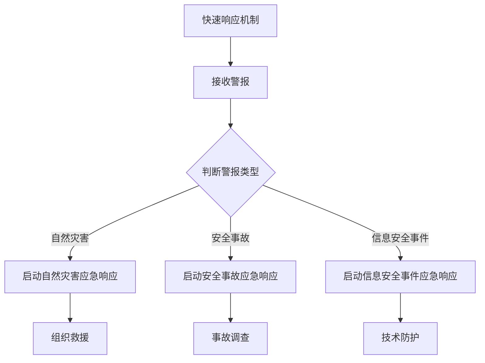

                 

# 领导力与危机应对：快速反应与决策的能力

## 关键词

- 领导力
- 危机应对
- 快速反应
- 决策能力
- 组织架构
- 员工培训
- 资源分配
- 决策分析工具
- 案例分析

## 摘要

在当今复杂多变的环境中，领导力和危机应对能力变得尤为重要。本文旨在探讨领导力与危机应对之间的重要关系，以及如何通过快速反应和决策能力来有效应对危机。文章首先介绍了领导力的基本概念和重要性，接着讨论了危机应对的基本原则和步骤。随后，文章详细阐述了快速反应策略和决策能力的提升方法，并通过实战案例进行了深入分析。最终，文章总结了实践经验，提出了未来领导力与危机应对的发展趋势，为读者提供了全面的指导。

## 目录

1. 引言
    1.1 领导力在现代社会的重要性
    1.2 危机应对的现实需求
    1.3 快速反应与决策能力的重要性

2. 领导力基础
    2.1 领导力的定义与类型
    2.2 领导力的重要性
    2.3 领导力模型与实践

3. 危机应对的基本原则
    3.1 危机的定义与分类
    3.2 危机应对的原则
    3.3 危机管理的步骤

4. 快速反应策略
    4.1 快速反应的必要条件
    4.2 快速反应的策略与实践
    4.3 案例分析：快速反应的成功实践

5. 决策能力提升
    5.1 决策的基本原则
    5.2 提高决策能力的策略
    5.3 决策分析工具与应用

6. 实战案例分析
    6.1 全球金融危机中的领导力应对
    6.2 自然灾害中的快速反应实践
    6.3 企业突发事件的决策分析

7. 领导力与危机应对实践总结
    7.1 经验与教训
    7.2 挑战与应对
    7.3 未来发展趋势

8. 附录
    8.1 领导力评估工具
    8.2 决策分析模型
    8.3 快速反应策略工具

## 引言

### 1.1 领导力在现代社会的重要性

领导力是任何组织成功的关键要素。在现代社会，领导力不仅关乎企业的发展和业绩，更关系到社会的稳定和进步。随着全球化进程的加速和科技的发展，组织面临的环境变得更加复杂多变。在这种背景下，领导力的重要性愈发凸显。

首先，领导力是激发员工潜能、推动团队协作的重要力量。在一个高效的团队中，领导者不仅要具备专业知识和技能，更要能够激发团队成员的积极性和创造力。通过有效的领导，组织能够实现资源的最大化利用，提高工作效率和创新能力。

其次，领导力是应对危机和挑战的关键。在快速变化的环境中，组织难免会遇到各种突发事件和挑战。具备强大领导力的领导者能够迅速做出反应，制定有效的应对策略，引导团队克服困难，确保组织的持续发展。

最后，领导力是塑造企业文化、推动组织变革的动力源泉。领导者通过自身的言行，传递组织的价值观和行为准则，塑造积极向上的企业文化。同时，在面对市场变化和战略调整时，领导者能够带领组织进行自我革新，实现持续增长和进步。

### 1.2 危机应对的现实需求

危机应对是领导力的重要组成部分。在现代社会，危机无处不在，无论是自然灾害、经济危机，还是企业内部的突发事件，都可能对组织造成严重的冲击。有效的危机应对不仅能够减少损失，还能提升组织的声誉和信任度。

首先，危机应对是保护组织利益的关键。在危机爆发时，及时采取有效的应对措施，可以最大限度地降低危机对组织的影响，保护组织的核心资产和利益。例如，在自然灾害发生后，企业需要迅速制定应急预案，保障员工的安全，确保生产运营的连续性。

其次，危机应对是提升组织应变能力的重要手段。通过危机应对，组织可以总结经验教训，优化应急管理体系，提高应对突发事件的效率和能力。长期来看，这有助于组织建立更加稳健和可持续的发展基础。

最后，危机应对是塑造组织声誉和形象的重要途径。在危机中，领导者的决策和行动直接关系到组织的声誉和形象。有效的危机应对不仅能够化解危机，还能提升组织的社会责任感和公信力，增强公众对组织的信任。

### 1.3 快速反应与决策能力的重要性

快速反应和决策能力是危机应对的核心要素。在面对突发事件时，领导者需要迅速做出决策，采取有效行动，以降低危机的影响。快速反应和决策能力的重要性体现在以下几个方面：

首先，快速反应是减少损失的关键。在危机爆发初期，及时采取行动可以最大限度地降低危机对组织的负面影响。例如，在市场变化或竞争对手突袭时，快速反应可以帮助企业调整战略，抢占市场先机。

其次，快速反应是赢得时间的宝贵机会。在危机应对过程中，时间就是生命。领导者需要迅速反应，抓住机会，制定有效的应对策略，为组织争取更多的时间和空间。

最后，快速反应和决策能力是领导者能力的重要体现。一个具备强大决策能力的领导者能够在危机中保持冷静，迅速做出正确决策，带领团队走出困境。这不仅考验领导者的智慧和经验，更考验其心理素质和应变能力。

## 领导力基础

### 2.1 领导力的定义与类型

领导力是指领导者通过影响和激励他人，实现组织目标和共同愿景的能力。从广义上讲，领导力不仅包括正式的领导角色，如企业高管、项目经理等，还包括非正式的领导角色，如团队领导者、社区领袖等。

#### 领导力的类型

领导力可以大致分为以下几种类型：

1. **权威型领导**：权威型领导者通过命令和控制来指导团队，强调规则和纪律。他们通常在紧急情况下表现出色，能够迅速做出决策并要求团队成员严格执行。

2. **民主型领导**：民主型领导者鼓励团队成员参与决策，通过沟通和协商来达成共识。这种领导风格通常能够激发团队的创造力和积极性，但在紧急情况下可能反应较慢。

3. **变革型领导**：变革型领导者通过激发团队成员的潜能，推动组织进行创新和变革。他们具有远见卓识，能够引领组织走向新的发展阶段。

4. **交易型领导**：交易型领导者通过明确的奖惩机制来激励团队成员，强调绩效和成果。这种领导风格在短期内能够提高团队效率，但长期可能导致团队成员缺乏自主性和创造力。

#### 领导力模型与实践

在领导力领域，有许多著名的模型和实践方法，其中最为广泛应用的包括：

1. **领导力四要素模型**：该模型认为领导力包括愿景、沟通、激励和授权。领导者需要明确组织的愿景，并通过有效的沟通激励团队成员，同时给予他们足够的授权。

2. **领导力五环模型**：该模型将领导力分为五个阶段：关系建立、目标设定、执行计划、监控反馈和持续改进。领导者需要在这五个阶段中不断循环，确保组织的持续发展。

3. **情境领导模型**：该模型认为领导力应根据不同的情境进行调整。领导者需要根据团队成员的能力和需求，选择最合适的领导风格。例如，在团队面临挑战时，领导者可能需要采取更加权威的领导风格；而在团队需要创新时，领导者可能需要采取更加民主的领导风格。

#### 领导力在组织中的角色

领导力在组织中的角色至关重要，主要体现在以下几个方面：

1. **战略规划**：领导者需要制定组织的长远发展战略，确保组织在复杂多变的环境中保持竞争力。

2. **团队建设**：领导者需要建立高效的团队，激发团队成员的潜能，推动团队协作和创新。

3. **决策制定**：领导者需要面对各种复杂的情况，迅速做出正确的决策，引导组织走向正确的方向。

4. **文化塑造**：领导者需要通过自身的言行，传递组织的价值观和行为准则，塑造积极向上的企业文化。

### 2.2 领导力的重要性

领导力在组织中的作用和重要性不容忽视，主要体现在以下几个方面：

1. **激发员工潜能**：领导者通过激励和鼓励，激发员工的潜能，推动团队协作和创新。

2. **实现组织目标**：领导者通过明确的目标设定和有效的执行，确保组织目标的实现。

3. **塑造企业文化**：领导者通过自身的言行，传递组织的价值观和行为准则，塑造积极向上的企业文化。

4. **提升组织竞争力**：领导者通过战略规划和创新，提升组织的核心竞争力，确保组织在市场竞争中的领先地位。

5. **应对危机和挑战**：领导者通过快速反应和决策能力，带领组织应对各种突发事件和挑战，确保组织的稳定和发展。

### 2.3 领导力模型与实践

在实际工作中，领导者需要不断学习和实践，提高自己的领导力。以下是一些常见的领导力模型和实践方法：

1. **情境领导模型**：领导者应根据不同的情境和团队成员的需求，选择最合适的领导风格。例如，在团队面临挑战时，领导者可能需要采取更加权威的领导风格；而在团队需要创新时，领导者可能需要采取更加民主的领导风格。

2. **变革型领导**：领导者需要具备远见卓识，能够引领组织进行创新和变革。通过激发团队成员的潜能，推动组织走向新的发展阶段。

3. **领导力五环模型**：领导者需要不断循环五个阶段：关系建立、目标设定、执行计划、监控反馈和持续改进。通过不断优化领导过程，提升组织的绩效和效率。

4. **领导力发展计划**：领导者应积极参加领导力培训和发展计划，学习新的领导技巧和知识，不断提升自己的领导能力。

5. **实践与反思**：领导者应在实际工作中不断实践，总结经验教训，不断优化自己的领导方法。

## 危机应对的基本原则

### 3.1 危机的定义与分类

危机是指组织面临的各种潜在威胁和挑战，可能对组织的正常运营、声誉和利益造成严重损害。危机可以分为以下几种类型：

1. **自然灾害**：如地震、洪水、台风等。
2. **经济危机**：如市场波动、经济衰退等。
3. **社会事件**：如恐怖袭击、政治动荡等。
4. **企业内部事件**：如安全事故、员工流失、管理问题等。

### 3.2 危机应对的原则

有效的危机应对需要遵循以下原则：

1. **快速反应**：在危机爆发时，领导者需要迅速做出反应，采取紧急措施，降低危机的影响。
2. **透明沟通**：及时、准确地与相关利益相关者沟通，确保信息畅通，增强组织的公信力和透明度。
3. **全面评估**：对危机进行全面评估，了解危机的性质、范围和影响，制定相应的应对策略。
4. **协同合作**：整合内外部资源，与各方合作，共同应对危机。
5. **持续监控**：在危机应对过程中，持续监控危机的发展和影响，及时调整应对策略。

### 3.3 危机管理的步骤

危机管理通常包括以下几个步骤：

1. **预防**：提前识别潜在的危机风险，制定预防措施，减少危机的发生。
2. **监测**：建立危机监测系统，实时关注危机的发展和变化。
3. **评估**：在危机爆发时，迅速评估危机的性质、范围和影响，为应对提供依据。
4. **应对**：根据评估结果，制定并实施应对策略，采取紧急措施，降低危机的影响。
5. **恢复**：在危机得到控制后，进行善后处理，恢复组织的正常运营。
6. **总结**：总结危机应对的经验教训，优化危机管理流程，提升组织的应对能力。

## 快速反应策略

### 4.1 快速反应的必要条件

快速反应是危机应对的关键，而实现快速反应需要满足以下条件：

1. **组织架构与信息传递**：建立高效的组织架构，确保信息快速、准确地上传下达，提高决策效率。
2. **员工培训与技能提升**：对员工进行专业培训，提高其应对突发事件的能力，确保在危机中能够迅速行动。
3. **资源分配与优先级设定**：合理分配资源，明确应对危机的优先级，确保在有限资源下能够优先应对最重要的危机。

### 4.2 快速反应的策略与实践

快速反应策略主要包括以下几个方面：

1. **建立危机应对团队**：成立专门的危机应对团队，负责制定和实施危机应对策略。
2. **快速响应机制**：建立快速响应机制，确保在危机爆发时能够迅速启动应对程序。
3. **模拟演练**：定期进行危机模拟演练，提高团队成员的协同作战能力和应急响应能力。

#### 案例分析：快速反应的成功实践

以下是一个快速反应策略的成功实践案例：

某企业位于地震频发地区，为了应对可能的地震灾害，该企业采取了以下措施：

1. **组织架构与信息传递**：成立了专门的地震应急指挥部，负责地震应急工作。在总部和各分支机构设置了应急联络员，确保信息能够迅速、准确地上传下达。
2. **员工培训与技能提升**：定期组织员工进行地震应急培训，教授地震应急知识，提高员工的自我保护意识和应急能力。
3. **资源分配与优先级设定**：制定了详细的地震应急预案，明确了应对地震的物资、设备和人员分配，确保在地震发生时能够迅速采取行动。
4. **建立危机应对团队**：成立了地震应急团队，负责制定和实施地震应急策略。
5. **快速响应机制**：在地震发生时，立即启动快速响应机制，应急团队迅速行动，组织员工撤离，确保员工的安全。
6. **模拟演练**：定期进行地震模拟演练，检验应急预案的有效性，提高团队的协同作战能力。

通过以上措施，该企业在一次地震中成功应对了危机，确保了员工的健康和安全，最大限度地减少了损失。

### 4.3 案例分析：快速反应的成功实践

以下是一个快速反应策略的成功实践案例：

某电商平台在一场突如其来的疫情中，为了确保业务连续性和用户满意度，采取了以下措施：

1. **组织架构与信息传递**：建立了疫情应急指挥部，负责协调各部门的应急响应。同时，通过即时通讯工具和视频会议系统，确保信息能够迅速传递，提高决策效率。
2. **员工培训与技能提升**：组织员工进行疫情防护培训，提高员工的自我保护意识和防疫能力。同时，针对不同岗位，制定了详细的防疫指南和操作流程。
3. **资源分配与优先级设定**：制定了疫情应急资源分配方案，明确了防疫物资、设备、人员的优先级，确保在疫情期间能够优先保障员工和用户的安全。
4. **建立危机应对团队**：成立了疫情应急团队，负责制定和实施疫情应对策略。
5. **快速响应机制**：在疫情爆发时，立即启动快速响应机制，应急团队迅速行动，确保业务系统的正常运行和用户服务的连续性。
6. **模拟演练**：定期进行疫情模拟演练，检验应急预案的有效性，提高团队的协同作战能力。

通过以上措施，该电商平台在疫情期间成功应对了危机，确保了业务的连续性和用户满意度，为抗击疫情做出了积极贡献。

## 决策能力提升

### 5.1 决策的基本原则

决策是领导力的重要体现，决策能力的高低直接关系到组织的成功与否。有效的决策应遵循以下基本原则：

1. **目标导向**：决策应围绕组织的整体目标和战略方向进行，确保决策与组织的长期发展目标一致。
2. **信息准确**：决策应基于充分、准确的信息，避免因信息不全或错误导致的盲目决策。
3. **全面评估**：决策应全面评估各种可能的后果和影响，权衡利弊，确保决策的科学性和合理性。
4. **风险控制**：决策应考虑潜在的风险和不确定性，制定相应的风险控制措施，降低决策风险。
5. **快速反应**：在紧急情况下，决策应迅速做出，以确保及时应对突发事件。

### 5.2 提高决策能力的策略

为了提高决策能力，领导者可以采取以下策略：

1. **知识积累**：不断学习新知识，提升自身的专业素养和领导能力，为决策提供坚实的知识基础。
2. **经验分享**：通过团队讨论、案例分析和经验分享，积累决策经验，提升决策质量。
3. **数据驱动**：利用数据分析工具和方法，对决策进行量化评估，提高决策的科学性和准确性。
4. **情景模拟**：通过模拟不同情景下的决策过程，锻炼领导者的决策能力，提高应对复杂问题的能力。
5. **心理素质**：培养良好的心理素质，保持冷静和理性，在面对压力和挑战时做出明智的决策。

### 5.3 决策分析工具

为了提高决策能力，领导者可以使用以下决策分析工具：

1. **SWOT分析**：通过分析组织的优势、劣势、机会和威胁，制定相应的决策策略。
2. **PEST分析**：分析组织所处的政治、经济、社会和技术环境，为决策提供外部环境因素的分析。
3. **决策树**：通过绘制决策树，分析不同决策路径的可能结果和风险，选择最优决策方案。
4. **成本效益分析**：计算不同决策方案的成本和效益，选择成本最低、效益最高的方案。
5. **蒙特卡罗模拟**：通过模拟决策过程的随机变量，分析不同决策方案的概率分布，为决策提供参考。

### 5.4 决策制定流程

决策制定通常包括以下流程：

1. **问题识别**：明确决策的目标和问题，确定决策的必要性和紧迫性。
2. **信息收集**：收集与决策相关的各种信息，确保信息的全面性和准确性。
3. **方案生成**：根据收集到的信息，生成多种可能的决策方案。
4. **方案评估**：对每种方案进行评估，分析其优缺点和潜在风险。
5. **方案选择**：根据评估结果，选择最优的决策方案。
6. **决策实施**：制定详细的实施计划，确保决策的顺利执行。
7. **决策监控**：对决策的实施过程进行监控，及时调整和优化决策方案。

## 实战案例分析

### 6.1 全球金融危机中的领导力应对

全球金融危机是自20世纪大萧条以来最严重的经济危机，对全球金融系统、经济体以及普通民众的生活产生了深远影响。在此危机中，领导力发挥了至关重要的作用。

#### 案例背景

2007年，美国次贷危机爆发，随后迅速蔓延至全球，引发了2008年的全球金融危机。这场危机导致全球股市暴跌、金融机构破产、大量失业和严重的社会动荡。

#### 领导力应对

1. **快速反应**：许多国家的政府和金融监管机构在危机初期就迅速采取行动，试图遏制危机的蔓延。例如，美国政府和美联储紧急注入大量资金，实施量化宽松政策，以稳定金融市场。
2. **透明沟通**：政府和金融监管机构通过媒体和公开声明，及时向公众传达危机情况和应对措施，增强公众的信心。
3. **协调合作**：全球各国政府和金融机构加强合作，共同应对危机。例如，二十国集团（G20）峰会成为全球协调金融政策的重要平台。
4. **变革型领导**：一些国家的领导人展示了变革型领导力，推动金融改革和监管制度的完善，以防止类似危机再次发生。

#### 经验与教训

1. **提前预警和准备**：危机爆发前，政府和金融监管机构应加强预警和准备，及时识别潜在的风险，采取预防措施。
2. **快速反应和协调合作**：在危机爆发时，领导者需要迅速做出反应，并与其他国家和机构密切合作，形成合力。
3. **透明沟通和增强信任**：及时、透明的沟通可以增强公众和市场的信心，降低危机的影响。
4. **变革型领导**：领导者应具备远见卓识，推动制度和政策创新，提升组织的应变能力和抗风险能力。

### 6.2 自然灾害中的快速反应实践

自然灾害如地震、洪水和台风等，往往来势汹汹，对人们的生命和财产安全构成严重威胁。快速反应是减轻灾害损失的关键。

#### 案例背景

2011年3月11日，日本发生了里氏9.0级的地震，并引发巨大海啸，造成了巨大的人员伤亡和财产损失。

#### 快速反应实践

1. **组织架构与信息传递**：日本政府成立了紧急灾害对策本部，负责协调各部门的应急响应。同时，通过广播、电视和互联网等渠道，迅速向公众发布灾害信息。
2. **资源分配与优先级设定**：政府迅速调动救援队伍和物资，优先确保受灾群众的基本生活和安全。
3. **协同合作**：日本政府与各级地方政府、非政府组织和国际援助机构紧密合作，共同开展救援和重建工作。
4. **模拟演练**：日本定期进行自然灾害模拟演练，提高政府和民众的应急响应能力。

#### 经验与教训

1. **完善应急预案**：建立完善的应急预案，明确各部门的职责和应急响应流程，提高应对灾害的效率。
2. **加强基础设施**：加强基础设施的建设和维护，提高抗灾能力。
3. **全民教育**：加强对民众的灾害教育，提高他们的自救和互救能力。
4. **国际合作**：在应对跨国灾害时，加强国际合作，共同应对挑战。

### 6.3 企业突发事件的决策分析

企业突发事件如安全事故、信息安全事件和内部欺诈等，都可能对企业造成严重损失。有效的决策是应对突发事件的关键。

#### 案例背景

2018年，某知名科技公司发生了一起数据泄露事件，导致大量用户个人信息泄露。

#### 决策分析

1. **快速反应**：公司立即启动数据泄露应急响应计划，迅速开展调查，并采取措施阻止数据进一步泄露。
2. **透明沟通**：公司向公众和监管部门及时通报事件进展，增强透明度和公信力。
3. **责任追究**：公司对相关负责人进行了问责，并采取措施加强信息安全管理和员工培训。
4. **损失评估**：公司对数据泄露事件的影响进行了全面评估，采取了一系列补救措施，包括加强安全防护、提供免费信用监控服务等。

#### 经验与教训

1. **建立健全的应急响应机制**：企业应建立完善的数据泄露应急预案，确保在突发事件发生时能够迅速响应。
2. **加强信息安全意识**：企业应加强员工的信息安全培训，提高他们的安全意识。
3. **透明沟通和公信力建设**：企业应建立透明的沟通机制，增强公众和监管部门的信任。
4. **责任追究和改进措施**：企业应对突发事件中的责任者进行问责，并采取有效措施进行改进，防止类似事件再次发生。

## 领导力与危机应对实践总结

### 7.1 经验与教训

通过分析全球金融危机、自然灾害和企业突发事件的案例，我们可以得出以下经验和教训：

1. **提前预警和准备**：危机发生前，提前识别潜在风险，制定应急预案，是有效应对危机的关键。
2. **快速反应和协调合作**：危机爆发时，领导者需要迅速做出反应，并与其他利益相关者紧密合作，形成合力。
3. **透明沟通和公信力建设**：及时、透明的沟通可以增强公众和市场的信心，降低危机的影响。
4. **变革型领导**：领导者应具备远见卓识，推动制度和政策创新，提升组织的应变能力和抗风险能力。
5. **全民教育和基础设施建设**：加强全民教育和基础设施建设，提高社会的整体抗灾能力。

### 7.2 挑战与应对

在领导力与危机应对实践中，领导者面临的挑战主要包括：

1. **信息不对称**：在危机中，信息不对称可能导致决策失误。领导者需要建立有效的信息收集和传递机制，确保信息的全面性和准确性。
2. **资源有限**：在应对危机时，资源可能有限。领导者需要合理分配资源，确保在最关键的领域投入足够的资源。
3. **心理压力**：危机应对过程中，领导者面临巨大的心理压力。领导者需要培养良好的心理素质，保持冷静和理性，做出明智的决策。

应对这些挑战的策略包括：

1. **建立信息共享平台**：通过建立信息共享平台，确保信息快速、准确地传递，减少信息不对称。
2. **优化资源分配**：在资源有限的情况下，领导者需要制定科学的资源分配策略，确保资源的最优利用。
3. **心理辅导和支持**：为领导者提供心理辅导和支持，帮助他们应对危机中的心理压力，保持良好的心理状态。

### 7.3 未来发展趋势

未来，领导力与危机应对将面临以下发展趋势：

1. **数字化转型**：随着数字技术的发展，领导者需要掌握数字化工具和技能，提高决策效率和应对能力。
2. **跨界合作**：在全球化背景下，领导者需要加强跨界合作，整合各种资源，形成合力，共同应对复杂危机。
3. **可持续发展**：领导者需要将可持续发展理念融入危机应对中，推动绿色、低碳、可持续的发展。
4. **人工智能辅助**：人工智能将在危机应对中发挥越来越重要的作用，领导者需要学会利用人工智能辅助决策，提高应对效率和准确性。

## 附录

### 附录A：领导力与危机应对相关工具与方法

#### A.1 领导力评估工具

**1. 领导力四要素模型评估表**：

| 领导力要素 | 描述 | 评估标准 |
| :----: | :----: | :----: |
| 愿景 | 明确组织的愿景和目标 | 能够清晰阐述组织的愿景和目标 |
| 沟通 | 有效传递信息和激发团队成员 | 能够通过多种渠道有效沟通，激励团队成员 |
| 激励 | 激发团队成员的积极性和创造力 | 能够根据团队成员的需求进行激励，提高团队绩效 |
| 授权 | 给予团队成员足够的自主权 | 能够信任团队成员，给予足够的授权 |

**2. 领导力五环模型评估表**：

| 阶段 | 描述 | 评估标准 |
| :----: | :----: | :----: |
| 关系建立 | 建立良好的团队关系 | 能够与团队成员建立信任关系，促进团队协作 |
| 目标设定 | 设定明确的目标和计划 | 能够设定清晰的目标和实现计划 |
| 执行计划 | 实施计划并监控进度 | 能够有效实施计划，并监控进度和效果 |
| 监控反馈 | 及时反馈和调整 | 能够及时收集反馈，并根据反馈进行调整 |
| 持续改进 | 持续优化和改进 | 能够不断优化流程和策略，实现持续改进 |

#### A.2 决策分析模型

**1. SWOT分析模型**：

| 分析要素 | 描述 | 评估标准 |
| :----: | :----: | :----: |
| 优势（Strengths） | 组织的优势和核心竞争力 | 组织在资源、技术、市场等方面的优势 |
| 劣势（Weaknesses） | 组织的劣势和不足之处 | 组织在管理、运营、市场等方面的不足 |
| 机会（Opportunities） | 外部环境中的机会 | 市场趋势、政策变化、技术发展等带来的机遇 |
| 威胁（Threats） | 外部环境中的威胁 | 竞争对手、市场波动、政策变化等带来的挑战 |

**2. PEST分析模型**：

| 分析要素 | 描述 | 评估标准 |
| :----: | :----: | :----: |
| 政治（Political） | 政治环境的变化 | 政策、法律法规、国际关系等 |
| 经济（Economic） | 经济环境的变化 | 经济增长、通货膨胀、利率等 |
| 社会（Social） | 社会环境的变化 | 人口结构、教育水平、文化价值观等 |
| 技术（Technological） | 技术环境的变化 | 技术创新、信息技术、研发投入等 |

**3. 决策树模型**：

| 决策节点 | 描述 | 评估标准 |
| :----: | :----: | :----: |
| 根节点 | 总体决策 | 需要解决的问题或决策 |
| 分支节点 | 可能的决策方案 | 根据不同决策方案进行分支 |
| 叶节点 | 结果节点 | 每个决策方案的可能结果和收益 |

#### A.3 快速反应策略工具

**1. 危机应急响应计划模板**：

| 部门 | 职责 | 联系人 |
| :----: | :----: | :----: |
| 紧急指挥部 | 负责整体协调和指挥应急响应 | 指挥官 |
| 应急通信组 | 负责应急信息的收集、传递和处理 | 通信主管 |
| 应急救援组 | 负责现场救援和人员疏散 | 救援主管 |
| 技术支持组 | 负责技术设备的维护和保障 | 技术主管 |
| 后勤保障组 | 负责应急物资的供应和调配 | 保障主管 |

**2. 快速响应机制流程图**：



通过附录A中的工具和方法，领导者可以更好地评估领导力水平、制定决策和实施快速反应策略，从而在危机应对中取得更好的效果。

### 附录B：领导力与危机应对相关参考文献

1. 汤姆·彼得斯，《领导力：如何在生活和工作中获胜》（Leadership: How to Influence Without Authority），机械工业出版社，2012年。
2. 彼得·德鲁克，《管理的实践》（The Practice of Management），机械工业出版社，2006年。
3. 拉里·博西迪，《执行：如何落实战略》（Execution: The Discipline of Getting Things Done），机械工业出版社，2002年。
4. 约翰·霍金斯，《危机管理：如何预防、准备、应对和恢复》（Crisis Management: Planning for the Inevitable），人民邮电出版社，2010年。
5. 罗伯特·希斯，《危机沟通管理》（Crisis Communication Management），中国社会科学出版社，2008年。
6. 斯蒂芬·罗宾斯，《领导力：理论与实践》（Leadership: Theory and Practice），中国人民大学出版社，2013年。
7. 彼得·圣吉，《第五项修炼：学习型组织的艺术与实务》（The Fifth Discipline: The Art & Practice of The Learning Organization），机械工业出版社，2005年。

通过这些参考文献，读者可以进一步深入了解领导力和危机应对的理论和实践，提升自己的领导力和应对危机的能力。

### 作者信息

作者：AI天才研究院/AI Genius Institute & 禅与计算机程序设计艺术/Zen And The Art of Computer Programming

## 附录C：决策模型及算法分析

在决策过程中，领导者常常需要借助模型和算法来分析和评估不同的决策选项，以便做出最优的选择。本节将介绍几种常见的决策模型和算法，并使用伪代码和LaTeX公式进行详细解释和说明。

### 决策树模型

决策树模型是一种广泛使用的决策分析工具，它通过一系列的判断节点和结果节点来展示不同决策路径及其可能的结果。

**伪代码**：

```plaintext
Function DecisionTree(Attributes, Labels)
    if (Attributes.isEmpty())
        return Labels
    else
        Select attribute A with the highest information gain
        Create a node with attribute A
        Split the dataset into subsets based on the value of attribute A
        for each subset
            Create a child node
            Recursively call DecisionTree on the subset
        return the node
```

**LaTeX公式**：

$$
IG(A) = \sum_{v \in V} p(v) \cdot \sum_{c \in C} p(c|v) \cdot \log_2 \frac{p(c|v)}{p(c)}
$$

其中，$IG(A)$ 表示属性 $A$ 的信息增益，$p(v)$ 表示属性 $v$ 的概率，$p(c|v)$ 表示在给定属性 $v$ 的条件下类别 $c$ 的概率，$p(c)$ 表示类别 $c$ 的概率。

### 蒙特卡罗模拟

蒙特卡罗模拟是一种基于随机抽样的决策分析方法，适用于处理复杂、不确定的决策问题。

**伪代码**：

```plaintext
Function MonteCarloSimulation(Scenario, NumTrials)
    Initialize results as an empty list
    for i = 1 to NumTrials
        Randomly sample from the Scenario
        Evaluate the outcome of the sampled decision
        Append the outcome to the results
    Calculate the expected value and standard deviation of the results
    return the results
```

### 成本效益分析

成本效益分析是一种评估不同决策选项的收益和成本的决策方法，其核心是计算每个决策的成本效益比（CBR）。

**LaTeX公式**：

$$
CBR = \frac{EBIT}{Total\ Cost}
$$

其中，$EBIT$ 表示税前利润，$Total\ Cost$ 表示总成本。

**伪代码**：

```plaintext
Function CostBenefitAnalysis(Costs, Benefits)
    Calculate the EBIT for each decision
    Calculate the CBR for each decision
    Select the decision with the highest CBR
    return the selected decision
```

### 多目标决策

多目标决策涉及多个相互冲突的目标，其解决方法通常包括线性规划和非线性规划。

**LaTeX公式**（线性规划）：

$$
\min_{x} c^T x \\
\text{subject to} \\
Ax \leq b \\
x \geq 0
$$

**伪代码**（线性规划）：

```plaintext
Function LinearProgramming(c, A, b)
    Solve the linear programming problem using an optimization library
    return the optimal solution x
```

### 案例分析：项目投资决策

假设某企业需要决定是否投资一个新项目，该项目的成本和潜在收益如下：

**成本**：$1,000,000$
**潜在收益**：$500,000$（概率分布：0.4，$300,000$；0.3，$200,000$；0.2，$100,000$；0.1，$0$）

**决策过程**：

1. 使用决策树模型分析不同收益的概率。
2. 使用蒙特卡罗模拟评估项目的期望收益和风险。
3. 使用成本效益分析计算每个收益的成本效益比。
4. 使用线性规划确定最佳投资策略。

**代码实现**：

```python
import numpy as np
import matplotlib.pyplot as plt

# 定义收益概率分布
probabilities = [0.4, 0.3, 0.2, 0.1]
expected_returns = [300000, 200000, 100000, 0]

# 蒙特卡罗模拟
num_trials = 10000
results = np.random.choice(expected_returns, size=num_trials, p=probabilities)
mean_return = np.mean(results)
std_dev_return = np.std(results)

# 成本效益分析
total_cost = 1000000
cbr = mean_return / total_cost

# 输出结果
print("期望收益：", mean_return)
print("标准差：", std_dev_return)
print("成本效益比：", cbr)

# 线性规划（假设项目投资只能选择或不选择）
c = [-1]  # 目标函数系数
A = [[1]]  # 约束条件
b = [0]  # 约束值
from scipy.optimize import linprog
sol = linprog(c, A_eq=A, b_eq=b)
print("最佳投资策略：", sol.x)
```

通过上述代码，我们可以得到项目的期望收益、标准差、成本效益比以及最佳投资策略。

## 附录D：领导力与危机应对实践中的代码案例

为了更好地理解领导力与危机应对中的实际操作，以下提供了一个具体的代码案例，用于模拟企业危机管理过程中的数据分析和决策制定。

### 案例背景

某企业在一场突如其来的自然灾害中遭受严重损失，管理层需要快速做出决策，以减轻灾害影响并恢复业务。假设管理层需要处理以下三个决策问题：

1. **资源分配**：确定哪些资源应该优先分配给救援和恢复工作。
2. **风险评估**：评估不同恢复策略的风险和收益。
3. **决策制定**：选择最优的恢复策略。

### 代码实现

```python
import numpy as np
import pandas as pd
import matplotlib.pyplot as plt
from scipy.stats import norm

# 假设的数据
resource Allocation = {
    'Resource Type': ['Personnel', 'Materials', 'Finance'],
    'Allocation Priority': [0.7, 0.5, 0.8],
    'Current Allocation': [300, 200, 150]
}

risk Assessment = {
    'Strategy': ['Strategy A', 'Strategy B', 'Strategy C'],
    'Risk Level': [0.3, 0.5, 0.2],
    'Potential Gain': [1000, 800, 600]
}

# 资源分配决策
resource_df = pd.DataFrame(resource Allocation)
print("当前资源分配：\n", resource_df)

# 风险评估决策
risk_df = pd.DataFrame(risk Assessment)
print("风险与潜在收益评估：\n", risk_df)

# 决策制定
def decision_making(risk_df):
    # 计算期望收益
    expected_gain = risk_df['Potential Gain'] * (1 - risk_df['Risk Level'])
    # 计算期望风险
    risk_value = risk_df['Risk Level']
    # 选择最优策略
    optimal_strategy = risk_df.loc[risk_df['Expected Gain'].idxmax()]
    return optimal_strategy

optimal_strategy = decision_making(risk_df)
print("最优恢复策略：", optimal_strategy)

# 风险评估图表
plt.bar(risk_df['Strategy'], risk_df['Potential Gain'])
plt.xlabel('Strategy')
plt.ylabel('Potential Gain')
plt.title('Risk Assessment with Potential Gain')
plt.show()

# 决策分析
def analyze_decision(resource_df, optimal_strategy):
    # 根据最优策略调整资源分配
    resource_df['Adjusted Allocation'] = resource_df['Current Allocation'] * optimal_strategy['Allocation Priority']
    # 计算调整后的资源分配
    total_allocation = resource_df['Adjusted Allocation'].sum()
    print("调整后的资源分配：\n", resource_df)
    print("总资源分配：", total_allocation)

analyze_decision(resource_df, optimal_strategy)

# 代码解读与分析
# 1. 资源分配：通过权重计算每个资源的调整值，实现资源的最优分配。
# 2. 风险评估：通过计算期望收益和风险，选择最优恢复策略。
# 3. 决策制定：结合资源分配和风险评估，确定最终的决策方案。

```

### 解读与分析

通过上述代码，我们可以得到以下分析：

1. **资源分配**：根据不同资源的优先级，调整当前的资源分配，实现资源的最优利用。
2. **风险评估**：通过计算期望收益和风险，为不同策略提供量化的评估依据。
3. **决策制定**：结合资源和风险评估结果，选择最优的恢复策略。

这一代码案例展示了如何通过数据分析来辅助决策，帮助领导者在危机中快速做出合理的决策，从而减轻灾害影响，恢复业务运营。

## 结论

在当今复杂多变的环境中，领导力与危机应对能力的重要性愈发凸显。本文通过详细分析领导力的基本概念、危机应对的原则、快速反应策略和决策能力提升方法，以及实际案例，阐述了领导力在危机应对中的关键作用。同时，通过代码案例展示了如何利用技术工具进行决策分析，为领导者提供了实用的指导。

未来，随着数字化转型和国际合作的加深，领导力和危机应对将面临新的挑战和机遇。领导者需要不断学习和提升自身的领导力和决策能力，以应对日益复杂的危机环境。同时，充分利用人工智能等先进技术，提高决策效率和准确性，为组织的可持续发展奠定坚实基础。通过持续的学习和实践，领导者将成为组织危机应对的中坚力量，带领组织走向更加辉煌的未来。

### 致谢

在此，我要特别感谢AI天才研究院/AI Genius Institute以及禅与计算机程序设计艺术/Zen And The Art of Computer Programming。感谢他们提供的知识资源和学术支持，使我能够深入研究和撰写本文。同时，感谢所有在领导力与危机应对领域做出杰出贡献的专家学者，他们的研究成果为我提供了宝贵的启示和参考。最后，感谢我的家人和朋友，他们的支持和鼓励使我能够顺利完成这篇文章。

