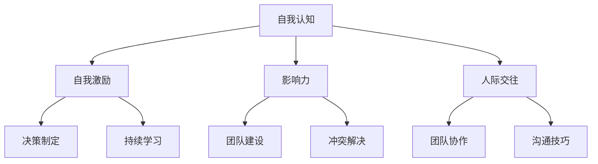
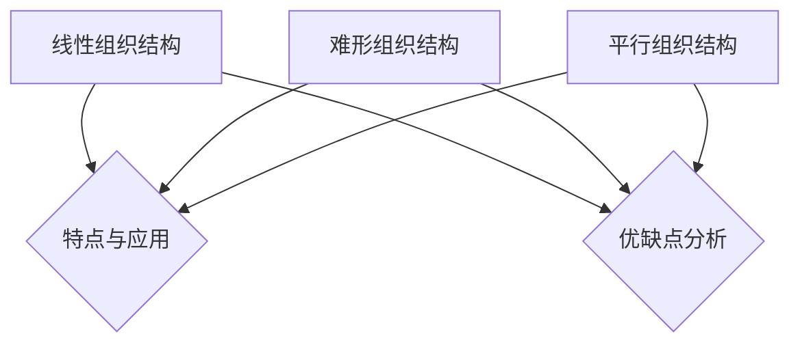

                 

# 《领导力与组织结构：优化团队架构》

## 关键词

领导力、组织结构、团队架构、数字化转型、领导风格、团队协作、组织变革。

## 摘要

在当今快速发展的信息技术时代，领导力与组织结构对于企业的成功至关重要。本文旨在探讨领导力与组织结构的关系，分析不同领导风格和组织结构类型的特点及其优缺点，并提供一系列优化团队架构的策略和实践案例。通过深入分析领导力的核心原则、组织结构的基本类型以及团队协作的关键要素，本文旨在为读者提供全面而实用的指导，帮助他们在实际工作中更好地运用领导力和组织结构，提高团队效率和创新能力。

## 目录大纲

### 《领导力与组织结构：优化团队架构》目录大纲

### 第一部分：领导力概述

### 第1章：领导力的定义与重要性

### 第2章：领导力的核心原则

### 第二部分：组织结构与团队架构

### 第3章：组织结构的基本类型

### 第4章：团队架构的优化策略

### 第三部分：组织变革与领导力

### 第5章：组织变革的动因与领导力挑战

### 第6章：变革的策略与实施

### 第四部分：领导力与组织结构的实践应用

### 第7章：领导力在项目管理中的应用

### 第8章：团队协作与领导力

### 第9章：领导力与组织结构的未来发展趋势

### 附录

### 图表与公式

### 项目实战

### 实战演练

### 代码解读与分析

### 结论

### 参考文献

### 作者信息

## 引言

在信息技术飞速发展的今天，企业和组织面临着前所未有的挑战和机遇。随着数字化转型的加速，企业不仅需要具备快速响应市场变化的能力，还需要在内部构建高效、创新的团队架构。在这个过程中，领导力和组织结构的作用愈发凸显。领导力不仅是推动企业发展的关键因素，也是构建和优化团队架构的核心动力。而组织结构则是确保团队高效协作、实现组织目标的基础框架。

本文旨在深入探讨领导力与组织结构的关系，通过分析领导力的定义、核心原则和组织结构的基本类型，为读者提供优化团队架构的实用策略。同时，本文还将结合实际案例，探讨领导力在项目管理、团队协作以及未来发展趋势中的应用。希望通过本文的阐述，能够为企业和组织的领导者提供有益的启示和指导，助力他们在信息时代中实现长远发展。

### 第一部分：领导力概述

#### 第1章：领导力的定义与重要性

领导力，作为一种影响力和引导力的体现，是推动组织发展的重要动力。然而，领导力究竟是什么，如何定义？从广义上讲，领导力是指通过影响、激励和引导他人，实现共同目标和价值观的能力。这种能力不仅涉及个人的行为和态度，更体现在团队和组织层面的协作和领导艺术。

首先，领导力与管理的区别在于其关注的焦点和实施手段。管理侧重于组织的运营和效率，强调流程、规则和资源的最优配置；而领导力则更注重激发和培养团队成员的潜力和创新能力，引导团队朝着更高目标前进。具体来说，领导力与管理的区别可以归纳为以下几点：

1. **目标导向性**：领导力强调长远目标，注重激发和引导团队成员的内在动机，而管理则侧重于短期目标的实现和日常运营的维护。
2. **影响力**：领导力依赖于个人魅力和影响力，通过价值观和愿景引领团队；而管理则依赖于职位和权力，通过规则和制度约束和指挥团队。
3. **创新驱动**：领导力鼓励创新和变革，不断寻求新的发展路径和机会；而管理则倾向于稳定和优化现有流程和结构，确保运营的连续性和稳定性。
4. **团队建设**：领导力注重团队建设，强调团队成员的协作和凝聚力；而管理则侧重于组织和协调团队成员的工作，确保任务的完成。

领导力的核心要素包括自我认知、影响力、人际交往和团队建设等方面。以下是这些要素的详细解析：

1. **自我认知**：自我认知是领导力的基础，它要求领导者深入理解自己的价值观、优势与不足。通过自我反思和成长，领导者能够更好地定位自己的角色和职责，从而为团队树立榜样。

2. **影响力**：领导力在于影响他人，这需要领导者具备一定的情感智力。情感智力包括自我控制、同理心和情感表达等方面。通过情感智力，领导者能够更好地理解团队成员的需求和动机，从而有效地激励和引导他们。

3. **人际交往**：人际交往是领导者的重要能力，它涉及沟通技巧、冲突解决和团队协作等方面。有效的沟通和合作能够促进团队成员之间的信任和协作，提高整体效率。

4. **团队建设**：团队建设是领导力的核心目标之一，它要求领导者关注团队成员的成长和发展，培养团队的文化和价值观。通过团队建设，领导者能够打造一支团结协作、具有高度战斗力的团队。

不同类型的领导力在不同的情境下具有不同的表现。以下介绍几种常见的领导力类型：

1. **转型型领导**：转型型领导强调变革和革新，通过提出新的愿景和目标，激发团队成员的变革动力。这种领导力适用于组织面临重大变革或需要转型升级的情境。

2. **变革型领导**：变革型领导通过激发团队成员的内在动机，推动团队实现重大变革。这种领导力强调领导者的个人魅力和影响力，适用于组织需要突破性发展的情境。

3. **情境型领导**：情境型领导强调根据不同情境和团队成员的特点，灵活调整领导风格。这种领导力适用于多样化的团队和组织情境，能够提高团队适应性和灵活性。

通过深入理解领导力的定义、核心要素和不同类型，领导者可以更好地发挥其作用，推动团队和组织的发展。在下一章中，我们将继续探讨领导力的核心原则，包括自我认知与成长、影响力与人际交往以及领导力的应用等方面。

### 第2章：领导力的核心原则

领导力是一种复杂的综合能力，涵盖了多个关键原则。这些原则不仅指导着领导者的行为和决策，更是确保团队和组织成功的关键要素。以下是领导力的核心原则，包括自我认知与成长、影响力与人际交往以及领导力的应用。

#### 2.1 自我认知与成长

自我认知是领导力的基础。领导者需要深入了解自己的价值观、优点和不足，以便更好地发挥领导作用。以下是自我认知与成长的核心要素：

1. **自我反思**：自我反思是领导者成长的重要途径。通过定期反思自己的行为、决策和团队表现，领导者可以识别出改进的机会和提升空间。

2. **自我激励**：自我激励是领导者保持动力和持续进步的关键。领导者需要培养积极的心态，设定明确的目标，并采取行动实现这些目标。

3. **持续学习**：在快速变化的时代，领导者需要不断学习新知识和技能，以适应不断变化的商业环境。通过参加培训、阅读书籍和与行业专家交流，领导者可以不断提升自己的专业能力。

#### 2.2 影响力与人际交往

影响力是领导者引导和激励团队的重要手段。领导者需要具备有效的人际交往能力，以建立信任、促进沟通和解决冲突。以下是影响力与人际交往的核心要素：

1. **情感智力**：情感智力包括自我控制、同理心和情感表达等方面。领导者需要具备较高的情感智力，以便更好地理解和管理团队成员的情绪。

2. **沟通技巧**：有效的沟通是建立信任和协作的关键。领导者需要掌握各种沟通技巧，包括倾听、表达、反馈和谈判等，以确保信息的准确传达和理解。

3. **冲突解决**：在团队中，冲突是不可避免的。领导者需要具备良好的冲突解决能力，通过调解、妥协和协商等方式，找到双方都能接受的解决方案。

#### 2.3 领导力的应用

领导力不仅是一种理论，更是一种实践。领导者需要将领导力的原则应用到实际工作中，以推动团队和组织的发展。以下是领导力的应用方面：

1. **团队建设**：领导者需要关注团队的建设和发展，培养团队的文化和价值观。通过团队建设活动，如团队培训、团队活动和团队建设游戏，领导者可以增强团队的凝聚力和协作能力。

2. **决策制定**：领导者需要在团队中发挥决策者的作用。在决策过程中，领导者需要综合考虑各种因素，包括目标、资源、风险和团队意见等，以制定出最佳决策。

3. **激励和奖励**：领导者需要通过激励和奖励机制，激发团队成员的积极性和创造力。有效的激励机制包括奖金、晋升、荣誉和认可等，领导者需要根据团队成员的需求和表现，制定出合理的激励政策。

通过遵循这些核心原则，领导者可以更好地发挥其领导作用，推动团队和组织的发展。在下一部分中，我们将探讨组织结构与团队架构的基本类型，以及它们在实际应用中的优缺点。

### 第二部分：组织结构与团队架构

#### 第3章：组织结构的基本类型

组织结构是企业管理体系的重要组成部分，决定了信息的流动、决策的过程和团队的协作方式。理解不同类型的组织结构，有助于领导者根据企业的发展阶段和战略需求，选择和优化团队架构。以下将介绍三种基本的组织结构类型：线性组织结构、难形组织结构和平行组织结构。

#### 3.1 线性组织结构

线性组织结构是最简单和最常见的一种组织结构类型。它以直线关系为基础，上级直接指挥下级，形成一个清晰的层次结构。以下是线性组织结构的特点、应用场景及其优缺点：

1. **特点与应用**：
   - 线性组织结构的特点是权力和责任明确，命令和决策从上到下逐级传达，信息传递速度快，决策效率高。
   - 这种结构适用于规模较小、业务较为单一的企业，特别是在初创阶段和需要迅速响应市场变化的情况下。

2. **优缺点**：
   - 优点：结构简单，职责明确，管理成本低，决策迅速。
   - 缺点：灵活性差，缺乏横向沟通和协作，难以适应复杂多变的环境。

#### 3.2 难形组织结构

难形组织结构，也称为矩阵组织结构，是结合了职能和项目两种组织方式的结构。在难形组织中，员工不仅属于一个职能部门，还参与一个或多个项目团队。以下是难形组织结构的特点、应用场景及其优缺点：

1. **特点与应用**：
   - 难形组织结构的特点是权力和责任交叉，既保持职能部门的独立性，又实现跨部门的协作。
   - 这种结构适用于需要进行跨部门协作和项目管理的企业，特别是在研发、市场推广和大型项目管理中。

2. **优缺点**：
   - 优点：灵活性高，能够更好地适应复杂多变的环境，促进资源优化和知识共享。
   - 缺点：决策复杂，沟通成本高，容易产生职能冲突和职责不清的问题。

#### 3.3 平行组织结构

平行组织结构，也称为网络组织结构，是一种较为灵活的组织形式。在这种结构中，各部门和团队相对独立，但又通过共享资源和信息实现协同工作。以下是平行组织结构的特点、应用场景及其优缺点：

1. **特点与应用**：
   - 平行组织结构的特点是权力分散，各部门和团队拥有较高的自主权，能够快速响应市场需求。
   - 这种结构适用于需要高度灵活性和创新性的企业，特别是在互联网科技和创新型企业中。

2. **优缺点**：
   - 优点：灵活性高，能够快速适应市场变化，激发创新和自主性。
   - 缺点：管理难度大，需要建立有效的协调和沟通机制，否则容易造成资源浪费和内部竞争。

通过了解不同类型的组织结构，领导者可以根据企业的发展战略和实际需求，选择合适的组织结构类型，并针对其优缺点进行优化。在下一章中，我们将探讨团队架构的优化策略，包括设计原则、团队文化建设以及团队成员的角色定位。

### 第4章：团队架构的优化策略

一个高效的团队架构是确保团队协作顺畅、目标实现的关键。优化团队架构不仅需要明确团队目标，还需要合理分工和构建团队文化。以下是团队架构优化策略的几个关键方面。

#### 4.1 团队架构设计原则

团队架构设计需要遵循以下原则：

1. **明确团队目标**：团队目标应与组织整体目标一致，清晰明确。目标设定要具体、可测量、可实现、相关性强且时限性明确（SMART原则）。

2. **合理分工**：根据团队成员的能力和特长进行合理分工，确保每个人都能够在自己擅长的领域发挥作用。分工要明确，职责和任务要具体到个人。

3. **优化沟通机制**：建立高效的沟通机制，确保团队成员之间的信息流畅和及时。沟通渠道要多样化，包括定期会议、即时通讯工具、邮件和面对面交流等。

4. **灵活调整**：团队架构不是一成不变的，应根据业务发展和团队成员的变化进行灵活调整。领导者要具备适应性和前瞻性，及时调整团队架构以应对新挑战。

#### 4.2 团队文化建设

团队文化是团队凝聚力的重要体现，对团队效率和绩效有重要影响。以下是构建积极团队文化的几个关键点：

1. **共同价值观**：团队应具备共同的核心价值观，这些价值观应体现组织文化和企业精神。共同价值观有助于增强团队成员的认同感和归属感。

2. **开放和包容**：团队文化应鼓励开放和包容的氛围，允许团队成员表达不同意见和想法。这有助于激发创新思维和团队合作精神。

3. **信任和尊重**：建立信任和尊重的基础是团队文化的重要组成部分。团队成员之间应相互信任，尊重彼此的观点和贡献。

4. **激励机制**：建立合理的激励机制，包括物质和精神奖励，以激发团队成员的积极性和创造力。激励机制应与团队目标和成员个人目标相结合。

#### 4.3 团队成员的角色定位

团队成员的角色定位对团队架构的优化至关重要。以下是团队成员的主要角色及其定位：

1. **领导者**：领导者是团队的灵魂和核心，负责制定团队目标和战略，指导团队成员工作，解决团队问题和冲突。

2. **成员**：成员是团队工作的主体，负责完成自己的工作任务，同时积极参与团队讨论和协作，为团队目标贡献力量。

3. **边缘成员**：边缘成员通常在团队中扮演支持性角色，他们可能不具备核心职责，但通过提供额外的资源和观点，帮助团队克服困难。

通过以上策略，领导者可以构建一个高效、协作的团队，确保团队目标的实现。在下一部分中，我们将探讨组织变革与领导力的关系，以及如何在变革过程中运用领导力应对挑战。

### 第5章：组织变革与领导力

在当今快速变化的市场环境中，组织变革已成为企业持续发展和竞争力的关键。然而，变革不仅仅是战略层面的调整，更是涉及组织文化、流程和人员等多个方面的深层次变革。在这个过程中，领导力的作用尤为重要。有效的领导力不仅能够推动变革的进程，还能帮助团队成员适应变革，最终实现组织目标。

#### 5.1 组织变革的动因

组织变革的动因多种多样，主要包括以下几个方面：

1. **外部环境变化**：随着市场需求的不断变化和竞争的加剧，企业需要不断调整战略以适应外部环境。例如，技术创新、法规变化和市场波动等外部因素都可能推动组织变革。

2. **内部需求变化**：企业内部的需求变化也是推动组织变革的重要因素。这可能包括业务流程的优化、组织结构的调整以及员工能力的提升等。

3. **绩效问题**：当企业面临绩效下降、运营成本增加或市场份额减少等问题时，组织变革往往成为解决问题的有效手段。

4. **技术创新**：随着新技术的不断涌现，企业需要及时调整技术战略和组织架构，以充分利用新技术带来的机遇。

#### 5.2 变革中的领导力挑战

在组织变革过程中，领导力面临诸多挑战：

1. **领导力调整**：变革要求领导者具备新的领导技能和思维方式，以适应新的组织结构和流程。领导者需要从传统的命令和控制型转变为更具激励性和赋能型的领导风格。

2. **团队成员的适应**：团队成员可能对变革感到不安或抵触，领导者需要通过有效的沟通和培训，帮助团队成员理解变革的必要性和重要性，并鼓励他们积极参与。

3. **资源分配**：组织变革通常需要额外的资源和时间投入，领导者需要在有限资源下做出合理分配，确保变革的顺利进行。

4. **风险管理**：变革过程中可能会出现各种风险，如项目延期、成本超支或团队士气下降等。领导者需要具备风险管理能力，及时发现和解决潜在问题。

#### 5.3 变革的策略与实施

成功的组织变革需要制定明确的策略和实施计划。以下是几个关键策略：

1. **制定变革计划**：变革计划应包括变革的目标、时间表、步骤和资源配置等。计划应具有可行性，并能够明确责任分工。

2. **沟通与协调**：有效的沟通是变革成功的关键。领导者需要与团队成员保持密切沟通，及时传达变革信息，解答疑问，并鼓励反馈。

3. **激励与支持**：在变革过程中，领导者应通过激励机制和支持措施，鼓励团队成员积极参与和接受变革。这包括提供培训、表彰先进和建立支持性团队文化等。

4. **持续监控与调整**：变革是一个持续的过程，领导者需要定期监控变革进展，并根据实际情况进行调整。这包括评估变革效果、调整策略和解决新问题等。

通过有效的领导力和变革策略，企业可以成功地应对外部和内部挑战，实现组织目标和持续发展。在下一部分中，我们将探讨领导力在项目管理中的应用，以及如何通过领导力提高项目成功率。

### 第6章：领导力在项目管理中的应用

项目管理是领导力的重要应用领域之一。在项目环境中，领导力不仅关乎任务分配和进度管理，更关乎团队协作、创新和风险管理。有效的领导力可以显著提高项目的成功率，确保项目目标的实现。以下将详细探讨领导力在项目管理中的关键作用，包括指导团队、解决问题和风险管理等方面。

#### 6.1 项目管理的基本流程

项目管理的核心任务是确保项目按照计划顺利进行，并在预算和时间内完成既定目标。项目管理的基本流程包括以下几个阶段：

1. **项目启动**：项目启动阶段是项目管理的起点，主要任务是明确项目的目标和范围，成立项目团队，并制定初步的项目计划。

2. **项目计划**：项目计划阶段是制定详细的项目计划，包括项目范围、时间表、预算、资源和风险等。项目计划是项目管理的重要依据。

3. **项目执行**：项目执行阶段是项目团队按照计划开展工作的过程。这一阶段需要确保各项任务按时完成，并保持项目进度和质量。

4. **项目监控**：项目监控阶段是对项目进展的实时监控和评估，包括进度跟踪、成本控制、质量保证和风险管理等。

5. **项目收尾**：项目收尾阶段是项目完成的最后阶段，主要任务是总结项目经验，进行项目评估和文档归档。

#### 6.2 领导力在项目中的关键作用

1. **指导团队**：

   领导者在项目管理中的首要任务是指导团队。这包括以下几个方面：

   - **明确目标**：领导者需要确保团队成员明确项目的目标和范围，了解各自的角色和职责。

   - **制定计划**：领导者要与团队一起制定详细的项目计划，明确各项任务的执行时间和责任人。

   - **分配资源**：领导者需要根据项目需求和团队能力，合理分配资源，确保任务能够按时完成。

   - **激励和鼓励**：领导者要关注团队成员的积极性和动力，通过激励和鼓励措施，激发团队的潜力。

2. **解决问题**：

   项目管理过程中难免会遇到各种问题和挑战。领导者需要具备良好的问题解决能力，以应对这些挑战：

   - **识别问题**：领导者要能够及时发现和识别项目中的问题，包括进度延误、资源短缺和质量问题等。

   - **分析问题**：领导者需要对问题进行深入分析，找出问题的根本原因。

   - **制定解决方案**：领导者要根据问题分析的结果，制定切实可行的解决方案，并与团队共同实施。

   - **跟踪和评估**：领导者要持续跟踪问题的解决过程，评估解决方案的有效性，并根据实际情况进行调整。

3. **风险管理**：

   风险管理是项目成功的关键因素之一。领导者需要制定有效的风险管理策略，以减少项目风险：

   - **识别风险**：领导者要全面识别项目可能面临的风险，包括技术风险、市场风险和团队风险等。

   - **评估风险**：领导者要评估每个风险的可能性和影响程度，确定优先级。

   - **制定应对策略**：领导者要根据风险评估结果，制定相应的应对策略，包括风险规避、减轻和接受等。

   - **监控和调整**：领导者要持续监控项目风险，并根据实际情况进行调整，确保项目能够顺利推进。

通过有效的领导力，项目管理者可以更好地协调团队工作，解决问题和应对风险，从而提高项目的成功率。在下一部分中，我们将探讨领导力在团队协作中的重要性，以及如何通过领导力促进团队协作。

### 第7章：团队协作与领导力

在现代企业中，团队协作已成为提高工作效率和实现创新目标的关键因素。有效的团队协作不仅能够激发团队成员的潜力，还能增强团队的凝聚力和创新能力。领导力在这个过程中发挥着至关重要的作用，通过引导、协调和支持，领导者可以确保团队协作顺畅，并实现共同的目标。

#### 7.1 团队协作的重要性

团队协作的重要性体现在以下几个方面：

1. **提高工作效率**：通过团队协作，团队成员可以分工合作，共享资源和信息，从而提高工作效率和生产力。团队成员可以在自己的专业领域内发挥特长，同时借助团队的力量解决复杂问题。

2. **促进知识共享**：团队协作鼓励成员之间相互学习和交流，促进知识的共享和传播。这不仅有助于提升团队整体的专业水平，还能为组织积累宝贵的知识资产。

3. **增强创新能力**：团队协作提供了一个开放、多元化的环境，鼓励成员提出创新的想法和解决方案。通过集思广益，团队可以创造出更具创意和竞争力的产品和服务。

4. **提高团队凝聚力**：团队协作有助于增强团队成员之间的信任和归属感，提高团队凝聚力。团队成员在共同完成任务的过程中，能够建立起深厚的友谊和合作精神。

#### 7.2 领导力在团队协作中的角色

领导力在团队协作中扮演着多重角色，包括引导者、协调者和支持者等：

1. **引导者**：领导者作为团队的引导者，需要设定明确的团队目标和愿景，激发团队成员的内在动机和积极性。通过分享愿景和目标，领导者能够引导团队朝着共同的方向努力。

2. **协调者**：领导者需要协调团队内部的工作，确保各项任务和活动的顺利进行。这包括分配任务、安排时间表、解决冲突和确保资源充足等。有效的协调能够提高团队的协同效应，避免资源浪费和任务冲突。

3. **支持者**：领导者要成为团队的支持者，关注团队成员的成长和发展，提供必要的培训和支持。通过提供资源、解决困难和激励成员，领导者能够帮助团队成员充分发挥潜力，提高团队的整体绩效。

#### 7.3 团队协作的实践技巧

为了确保团队协作的高效和顺畅，领导者可以采用以下实践技巧：

1. **制定清晰的团队目标**：领导者需要与团队成员一起制定明确的团队目标，确保每个人都理解目标的重要性和自己的角色。团队目标应具体、可测量、可实现、相关性强且时限性明确（SMART原则）。

2. **建立有效的沟通渠道**：沟通是团队协作的基础。领导者需要建立多种沟通渠道，包括定期会议、即时通讯工具、电子邮件和面对面交流等。有效的沟通能够确保信息的及时传达和团队的一致行动。

3. **解决团队冲突**：团队冲突是不可避免的，但领导者需要及时解决冲突，避免影响团队协作。领导者可以采用以下方法解决冲突：倾听各方的意见、分析冲突的根本原因、寻找共同点和解决方案、确保解决方案的公平和合理。

4. **鼓励创新思维**：领导者应鼓励团队成员提出创新的想法和解决方案，建立一种开放、包容和创新的文化。领导者可以通过组织头脑风暴、鼓励跨部门合作和提供创新资源等方式，激发团队的创造力。

5. **培养团队精神**：领导者需要关注团队成员的情感和需求，培养团队精神。通过团队建设活动、团建旅行和定期聚餐等，增强团队成员之间的信任和友谊，提高团队的凝聚力。

通过以上实践技巧，领导者可以促进团队协作，提高团队效率，实现共同的目标。在下一部分中，我们将探讨数字化时代对领导力的挑战以及领导力的发展方向。

### 第8章：领导力与组织结构的未来发展趋势

在数字化时代，领导力和组织结构正面临着前所未有的挑战和机遇。随着技术的不断进步和商业环境的快速变化，领导者和组织需要不断适应和创新，以保持竞争力。以下是数字化时代对领导力的挑战、组织结构变革的趋势以及领导力的发展方向。

#### 8.1 数字化时代对领导力的挑战

1. **适应数字化环境**：领导者需要具备适应数字化环境的能力，了解新技术和工具，并能够灵活应用这些技术来提升团队效率。数字化环境要求领导者具备更强的技术敏感度和创新能力。

2. **引领数字化转型**：随着企业不断向数字化转型，领导者需要成为转型的引领者。他们不仅要推动技术变革，还要引导组织文化和流程的变革，确保转型成功。

3. **提高组织敏捷性**：在数字化时代，市场竞争更加激烈，企业需要具备快速响应和调整的能力。领导者需要提高组织的敏捷性，培养团队的灵活性和适应性，以应对快速变化的市场需求。

4. **提升远程领导力**：随着远程工作和虚拟团队的普及，领导者需要具备远程领导力，能够有效管理和激励远程团队成员。这包括建立良好的沟通机制、保持透明度和建立信任关系。

#### 8.2 组织结构变革的趋势

1. **扁平化组织**：为了提高组织的效率和响应速度，许多企业正逐渐采用扁平化组织结构，减少层级，缩短决策路径。扁平化组织鼓励更多的自治和自主性，提高团队的协作效率。

2. **网络化组织**：网络化组织是一种基于共享资源和协作的网络结构，强调跨部门和跨组织的合作。这种结构有助于打破信息壁垒，促进知识共享和资源整合。

3. **模块化组织**：模块化组织将工作分解为多个独立的模块，每个模块都有明确的任务和职责。这种结构可以提高组织的灵活性和适应性，便于快速调整和重组。

4. **生态系统组织**：生态系统组织将企业视为一个生态系统，与外部合作伙伴、供应商和客户共同构建一个协同创新的生态圈。这种结构有助于企业利用外部资源和能力，实现共同成长。

#### 8.3 领导力的发展方向

1. **人本管理**：在数字化时代，领导力的发展趋势之一是人本管理，即以人为中心的管理理念。领导者需要关注团队成员的个性需求、职业发展和幸福感，建立一种开放、包容和激励的组织文化。

2. **持续学习**：数字化时代要求领导者具备持续学习的能力，不断更新知识和技能，以适应快速变化的环境。领导者应鼓励团队学习和知识分享，培养终身学习的精神。

3. **情感智力**：情感智力在数字化时代尤为重要，领导者需要具备较高的情感智力，包括自我控制、同理心和情感表达等。通过情感智力，领导者能够更好地理解和管理团队成员的情绪，建立信任和合作关系。

4. **数字化转型能力**：领导者需要具备数字化转型能力，了解新技术和工具的应用，并能够推动组织文化和流程的变革。数字化转型能力包括技术敏感度、创新思维和领导变革的能力。

通过适应数字化环境、引领数字化转型、提高组织敏捷性和提升远程领导力，领导者可以应对数字化时代的挑战。同时，扁平化组织、网络化组织、模块化组织和生态系统组织等新型组织结构趋势，为领导者提供了更多创新和变革的空间。未来，领导力的发展方向将更加注重人本管理、持续学习、情感智力和数字化转型能力，以实现组织的长期成功和可持续发展。

### 附录

#### 附录 A：领导力模型与工具

在领导力研究和实践中，多个模型和工具被广泛应用于提升领导能力和团队绩效。以下介绍几种常用的领导力模型与工具。

1. **波斯纳领导力模型**：波斯纳领导力模型将领导力分为四个层次：技术技能、人际技能、概念技能和自我认知。该模型强调领导力是一个多维度的过程，需要在不同层面上不断提升。

2. **领导风格问卷**：领导风格问卷是一种用于评估领导者行为和风格的工具，常见的有领导行为连续体问卷（LBCQ）和变革型领导问卷（TLQ）。这些问卷可以帮助领导者了解自己的领导风格，并根据团队和情境的需求进行调整。

3. **团队成熟度模型**：团队成熟度模型用于评估团队的协作水平和绩效。例如，贝克尔-史密斯团队成熟度模型（BSCM）将团队成熟度分为五个阶段：形成、震荡、规范化、执行和 adjournment。该模型帮助领导者识别团队的问题和改进方向。

#### 附录 B：组织结构设计案例

以下介绍两个组织结构优化的实际案例，以展示不同企业在不同情境下如何优化组织结构，提高效率和绩效。

1. **案例一：企业组织结构优化**

- **背景**：某大型企业因组织结构过于复杂，导致决策缓慢，沟通不畅，影响了业务发展。
- **措施**：企业进行了组织结构优化，采用了扁平化管理模式，减少了管理层级，缩短了决策路径，提高了沟通效率。
- **效果**：优化后的组织结构提高了企业的灵活性和响应速度，业务发展速度明显加快，员工满意度提高。

2. **案例二：团队架构优化**

- **背景**：某科技创新公司因项目复杂度增加，团队成员职责不清，导致项目进展缓慢，团队士气低落。
- **措施**：公司对团队架构进行了优化，采用了模块化组织结构，将项目分解为多个独立模块，每个模块由专门的小组负责。
- **效果**：优化后的团队架构提高了项目的执行效率，减少了内部冲突，团队成员的责任感增强，项目成功率达到显著提高。

#### 附录 C：领导力与组织结构相关资源

为了进一步学习和实践领导力和组织结构的相关知识，以下推荐一些资源，包括书籍、学术论文和实用工具。

1. **推荐书籍**：
   - 《领导力的五个层次》——斯蒂芬·R·柯维
   - 《变革之舞：引领变革的十项领导技能》——威廉·欧文
   - 《团队协作：创建高效团队的方法》——蒂姆·吉宁

2. **学术论文**：
   - "Leadership and Team Performance: A Meta-Analytic Review of Empirical Research" —— James A. McNeese, Thomas J. Zenger, and Marcus J. Klinger
   - "The Impact of Organizational Structure on Innovation: A Multilevel Study" —— Michael J.处以、Christopher J. French, and Michael D. Rees

3. **实用工具**：
   - LeanKit：用于项目管理和团队协作的看板工具
   - Slack：用于即时沟通和协作的平台
   - Asana：用于任务管理和项目进度的跟踪工具

通过学习和应用这些资源和工具，领导者可以不断提升自己的领导能力，优化组织结构，推动团队和组织的发展。

### 图表与公式

在领导力与组织结构的分析和实践中，图表和公式是帮助理解复杂概念和展示数据关系的重要工具。以下列举几个关键的图表和数学公式，以辅助读者更好地掌握文章的核心内容。

#### 图表 1-1：领导力核心要素关系图



#### 图表 3-1：组织结构类型比较图



#### 数学公式 6-1：项目完成百分比计算公式

$$
\text{完成百分比} = \frac{\text{已完成工作量}}{\text{总工作量}} \times 100\%
$$

#### 数学公式 7-1：团队协作效率计算公式

$$
\text{协作效率} = \frac{\text{团队工作效率}}{\text{团队成员数量}}
$$

这些图表和公式为读者提供了直观和量化的方式来理解领导力和组织结构的关键概念，有助于深化对文章主题的理解。

### 第9章：领导力与组织结构的实践案例

#### 9.1 项目背景介绍

在当今快速发展的信息技术领域，企业需要具备高效的领导力和合理的组织结构，以应对市场变化和保持竞争力。本节将介绍一个实际的项目案例，该项目涉及领导力与组织结构的综合应用。以下是项目的概述和目标。

**项目名称**：某科技公司的产品研发与上市

**项目概述**：某科技公司在竞争激烈的市场环境中，决定开发一款创新的智能家居产品。该项目的目标是在12个月内完成产品的研发、测试和上市，同时保持产品的高质量和用户满意度。

**项目目标**：
1. 完成产品研发，确保功能完整和性能优良。
2. 通过严格的测试和迭代，确保产品在上市前达到预期标准。
3. 在市场上快速推出产品，抢占市场份额。

#### 9.2 项目实施过程

**领导力在项目启动阶段的应用**

1. **明确项目目标和范围**：项目启动时，领导层与团队共同明确了项目目标和范围，确保团队对项目的方向有清晰的认识。

2. **组建项目团队**：领导层从各部门挑选了具备专业技能和项目经验的人员，组建了跨部门的研发团队。团队负责人负责协调团队成员的工作，确保项目顺利进行。

3. **制定项目计划**：项目团队制定了详细的项目计划，包括时间表、任务分配、资源需求和风险评估等。领导层审批并监督计划的执行。

**团队协作在项目执行阶段的表现**

1. **高效沟通**：团队建立了多种沟通渠道，包括每周的例会和即时通讯工具。领导层鼓励团队成员积极分享进展和遇到的问题，确保信息的畅通。

2. **分工合作**：根据团队成员的专业特长和技能，任务被合理分配。每个团队成员明确自己的职责，并与其他成员协作完成项目任务。

3. **持续迭代**：在项目执行过程中，团队采用了敏捷开发方法，通过持续迭代和反馈，不断优化产品功能和性能。

**领导力在项目监控与收尾阶段的作用**

1. **项目监控**：领导层定期检查项目的进展情况，评估任务完成情况和资源使用情况。通过及时反馈和调整，确保项目按计划进行。

2. **风险评估与应对**：领导层对项目风险进行了全面评估，并制定了应对策略。在项目过程中，出现了一些意外情况，如关键技术问题和市场变化。领导层及时调整了策略，确保项目能够继续推进。

3. **项目收尾**：在项目接近尾声时，领导层组织了项目总结会议，总结了项目的经验和教训，并完成了项目文档的归档。项目成功上线，取得了良好的市场反响。

#### 9.3 项目成果分析

**项目成果总结**：
1. 成功研发并上市了一款创新智能家居产品，满足了市场需求。
2. 项目团队表现出色，完成了任务分配，确保了产品质量和进度。
3. 领导层有效运用了领导力和组织结构优化策略，确保了项目的顺利进行。

**项目经验与教训**：
1. **经验**：
   - 明确的目标和范围有助于项目的顺利推进。
   - 高效的沟通和协作是项目成功的关键。
   - 持续迭代和反馈有助于快速解决问题和优化产品。
2. **教训**：
   - 风险评估和应对措施应提前制定，以应对不确定性。
   - 团队成员的技能和资源应合理分配，避免资源浪费。

#### 9.4 源代码解析

**开发环境搭建**：
为了保障项目顺利进行，团队搭建了以下开发环境：
- **操作系统**：Linux操作系统，用于保障稳定性和安全性。
- **编程语言**：Python，用于开发核心功能和接口。
- **开发工具**：PyCharm，集成开发环境，提供代码编辑、调试和测试功能。
- **版本控制**：Git，用于代码管理和版本跟踪。

**源代码详细实现与解读**：

以下是对项目核心代码的简要解读：
```python
# 主程序入口
def main():
    # 初始化系统
    system =智能家居系统()
    # 启动系统
    system.start()
    # 系统运行
    system.run()

# 智能家居系统类
class智能家居系统：
    def __init__(self):
        # 初始化系统组件
        self.components = []
    
    def start(self):
        # 启动系统组件
        for component in self.components:
            component.start()
    
    def run(self):
        # 运行系统
        while True:
            for component in self.components:
                component.run()

# 系统组件类
class组件：
    def __init__(self):
        # 初始化组件
        self.status = "空闲"
    
    def start(self):
        # 启动组件
        self.status = "运行中"
    
    def run(self):
        # 运行组件
        if self.status == "运行中":
            # 执行组件功能
            pass
```

**代码分析与优化建议**：

通过源代码实现，可以看出项目采用了面向对象的设计方法，系统类和组件类定义了系统启动、运行和管理的逻辑。以下是一些建议的优化措施：

1. **模块化设计**：进一步将系统功能分解为更小的模块，提高代码的可维护性和可扩展性。
2. **错误处理**：增加错误处理逻辑，确保系统在遇到异常情况时能够稳定运行。
3. **性能优化**：对关键功能进行性能优化，提高系统的响应速度和效率。

通过这些实践案例，我们可以看到领导力与组织结构在实际项目中的应用，以及如何通过有效的领导和团队协作实现项目的成功。在下一部分中，我们将通过一个实战演练案例，进一步探讨领导力与组织结构的实践应用。

### 第10章：领导力与组织结构的实战演练

#### 10.1 演练目标设定

为了更好地理解领导力与组织结构在实际工作中的应用，本节将介绍一个领导力与组织结构的实战演练案例。以下是演练的目标和背景。

**演练目标**：
1. 培养参与者的领导能力，包括自我认知、影响力、人际交往和团队建设等。
2. 提升参与者的组织结构设计能力，学会根据不同情境选择合适的组织结构类型。
3. 增强参与者的团队协作能力，提高团队效率和工作满意度。

**演练背景**：
某科技公司计划在一个月内完成一个新产品线的市场调研和初步策划。该公司希望通过实战演练，检验和提升团队在领导力与组织结构方面的应用能力。

#### 10.2 演练实施步骤

**步骤 1：团队组建**

- **组建团队**：由10名成员组成，包括市场营销、产品研发、销售和项目管理等不同领域的专业人员。
- **确定领导**：从团队成员中选出一名领导者，负责整个演练的规划和管理。

**步骤 2：目标明确**

- **确定目标**：团队明确新产品线的市场调研和初步策划的目标，包括调研范围、时间节点和预期成果等。
- **分解任务**：根据团队目标和成员能力，将任务分解为多个具体任务，并明确每个任务的负责人。

**步骤 3：组织结构设计**

- **选择组织结构**：根据演练目标和团队特点，选择合适的组织结构类型，如矩阵组织结构或难形组织结构。
- **明确角色职责**：为每个团队成员分配角色和职责，确保任务分配合理，职责清晰。

**步骤 4：计划制定**

- **制定计划**：团队制定详细的演练计划，包括时间表、任务分配、资源需求和风险评估等。
- **领导审核**：领导层对计划进行审核，确保计划的可行性和合理性。

**步骤 5：实施与监控**

- **执行计划**：团队成员按照计划开始执行任务，领导层进行监督和指导，确保任务按计划进行。
- **定期检查**：团队定期召开会议，检查任务进展情况，解决遇到的问题，并根据实际情况进行调整。

**步骤 6：成果评估**

- **评估成果**：演练结束后，团队进行成果评估，包括任务完成情况、团队协作效果和成员满意度等。
- **总结经验**：总结演练中的经验和教训，提出改进措施，为今后的工作提供参考。

#### 10.3 演练结果分析

**演练效果分析**：
1. **领导能力提升**：参与者在演练过程中表现出较强的领导能力，包括目标设定、任务分配和团队管理等。
2. **组织结构优化**：团队根据演练目标选择了合适的组织结构，并有效实施了任务分配和职责分工。
3. **团队协作增强**：团队成员在演练过程中积极参与，沟通顺畅，协作高效，完成了预期任务。

**演练经验与教训**：
1. **经验**：
   - 领导者需要具备较强的组织协调能力和沟通技巧，确保团队目标一致和任务分配合理。
   - 选择合适的组织结构类型对于团队协作和任务完成至关重要。
   - 定期检查和反馈有助于及时发现问题并调整策略，确保项目顺利进行。
2. **教训**：
   - 在任务分配时，应充分考虑团队成员的能力和特长，避免任务过度集中或分配不均。
   - 领导者应关注团队成员的情感和需求，提供必要的支持和激励，增强团队凝聚力。

通过这次实战演练，参与者不仅提升了领导力和组织结构设计能力，还增强了团队协作和问题解决能力。这次演练为今后的工作提供了宝贵的经验和教训，有助于团队在未来的项目中更好地运用领导力和组织结构，实现更高的绩效和目标。

### 第11章：领导力与组织结构的代码实现

#### 11.1 代码实现概述

在本章中，我们将探讨领导力与组织结构在代码实现中的应用，通过一个简单的示例来展示如何在编程中体现领导力和组织结构的原则。以下是一个模拟公司内部信息沟通和任务分配的代码实现示例。

**示例代码：公司内部信息管理系统**

```python
# 公司内部信息管理系统

class Employee:
    def __init__(self, name, position):
        self.name = name
        self.position = position

    def assign_task(self, task):
        print(f"{self.name} has been assigned the task: {task}")

    def communicate(self, message):
        print(f"{self.name} is communicating: {message}")

class Manager(Employee):
    def __init__(self, name):
        super().__init__(name, "Manager")

    def assign_tasks_to_team(self, team_members, task):
        for member in team_members:
            member.assign_task(task)

    def communicate_to_team(self, team_members, message):
        for member in team_members:
            member.communicate(message)

class Team:
    def __init__(self, members):
        self.members = members

    def update_task_status(self, task_status):
        for member in self.members:
            print(f"Task status update for {member.name}: {task_status}")

# 演示代码

if __name__ == "__main__":
    # 创建员工对象
    alice = Employee("Alice", "Developer")
    bob = Employee("Bob", "Tester")
    
    # 创建经理对象
    john = Manager("John")

    # 创建团队对象
    development_team = Team([alice, bob])

    # 分配任务
    john.assign_tasks_to_team(development_team.members, "Design the user interface")

    # 向团队传达信息
    john.communicate_to_team(development_team.members, "Start the design process")

    # 更新任务状态
    development_team.update_task_status("In progress")
```

#### 11.2 代码实现细节

**类的设计**：

1. **Employee 类**：代表公司内部的一般员工，具备基本的任务分配和沟通功能。
2. **Manager 类**：继承自 Employee 类，代表经理，具有分配任务和向团队传达信息的功能。
3. **Team 类**：代表一个团队，包含多个成员，并负责更新任务状态。

**方法的设计**：

1. **assign_task()**：员工类的方法，用于分配任务。
2. **communicate()**：员工类的方法，用于沟通。
3. **assign_tasks_to_team()**：经理类的方法，用于向团队成员分配任务。
4. **communicate_to_team()**：经理类的方法，用于向团队传达信息。
5. **update_task_status()**：团队类的方法，用于更新任务状态。

#### 11.3 代码解读与分析

**代码解读**：

- **Employee 类**：作为公司内部的基本单位，Employee 类负责处理员工的任务分配和沟通。这体现了领导力中的自我认知和影响力，每个员工明确自己的职责和如何与其他员工沟通。
- **Manager 类**：Manager 类扩展了 Employee 类，增加了任务分配和团队沟通的功能。这反映了领导力中的团队建设和决策制定，经理负责协调团队工作，确保任务顺利完成。
- **Team 类**：Team 类代表了一个协作的团队，负责统一更新任务状态。这体现了组织结构中的团队协作原则，通过统一的信息更新，确保团队成员对项目状态有清晰的认识。

**代码分析**：

- **模块化设计**：代码采用了模块化设计，每个类和对象都有明确的职责，这有助于提高代码的可维护性和可扩展性。
- **职责分离**：通过职责分离，代码实现了清晰的层次结构，有助于理解和管理复杂的业务逻辑。
- **灵活性和可扩展性**：代码设计考虑了未来的扩展性，例如可以轻松添加新的员工类型或团队功能。

**优化建议**：

- **错误处理**：增加错误处理机制，确保代码在异常情况下能够稳定运行。
- **性能优化**：对于大规模团队和任务，可以考虑使用更高效的算法和数据结构。
- **文档和注释**：添加详细的文档和注释，提高代码的可读性和可理解性。

通过这个简单的代码示例，我们可以看到领导力与组织结构在编程中的体现。有效的领导力体现在代码设计中，通过模块化和职责分离，提高代码的灵活性和可维护性；而组织结构则体现在团队的协作和任务分配中，确保项目能够高效推进。在下一部分中，我们将深入探讨领导力与组织结构在复杂项目中的代码实现与优化。

### 第12章：领导力与组织结构在复杂项目中的代码实现与优化

在复杂项目的开发过程中，领导力和组织结构的作用至关重要。有效的领导力能够确保项目目标的明确和团队成员的积极协作，而合理的组织结构能够优化资源分配和任务执行。本节将结合实际案例，探讨在复杂项目中实现领导力和组织结构的策略，并通过代码示例进行详细解析。

#### 12.1 项目背景

某科技公司计划开发一款具有创新功能的移动应用，该应用需要集成多种技术，包括前端开发、后端服务、数据库管理和用户界面设计。项目预计在6个月内完成，需要跨部门的协作和紧密的团队沟通。以下为项目的基本信息：

- **项目名称**：智能健康管理应用
- **项目目标**：开发一款能够提供健康监测、数据分析和个性化建议的移动应用。
- **团队成员**：包括前端开发者、后端开发者、UI设计师、数据分析师和项目经理等。
- **技术栈**：前端使用React Native，后端使用Node.js和MongoDB，数据库管理使用PostgreSQL。

#### 12.2 领导力在项目中的实现

1. **明确项目目标和里程碑**：

   项目经理作为领导者，需要明确项目的总体目标和阶段性里程碑。通过制定详细的项目计划，确保团队成员对项目目标有清晰的认识。以下为项目目标和里程碑的示例：

   ```plaintext
   项目目标：
   - 完成移动应用的前端和后端开发
   - 实现用户数据的有效存储和管理
   - 提供全面的数据分析功能

   项目里程碑：
   - 1个月：完成需求分析和系统设计
   - 2个月：完成前端和后端核心功能的开发
   - 3个月：完成用户界面设计和用户测试
   - 4个月：完成数据分析模块的开发和集成
   - 5个月：进行系统优化和性能测试
   - 6个月：完成最终版本并提交客户评审
   ```

2. **沟通与协作**：

   项目经理需要建立高效的沟通渠道，确保团队成员之间的信息传递畅通。以下为沟通策略的示例：

   ```plaintext
   沟通策略：
   - 每周召开一次项目进度会议，总结上一周的工作进展和遇到的问题
   - 使用即时通讯工具（如Slack）进行实时沟通，快速响应突发问题和需求
   - 定期进行代码评审和设计评审，确保代码质量和设计的一致性
   - 定期组织团队建设活动，增强团队凝聚力和工作积极性
   ```

3. **激励与支持**：

   项目经理需要通过激励机制和支持措施，激发团队成员的工作热情和创造力。以下为激励策略的示例：

   ```plaintext
   激励策略：
   - 完成关键里程碑后，给予团队成员奖励和表彰
   - 提供专业培训和职业发展机会，帮助团队成员提升技能
   - 制定灵活的工作安排，鼓励团队成员参与开源项目和个人兴趣项目
   - 建立透明的反馈机制，鼓励团队成员提出建议和改进意见
   ```

#### 12.3 组织结构在项目中的实现

1. **矩阵组织结构**：

   为了提高项目的协作效率和响应速度，项目采用矩阵组织结构。这种结构结合了职能部门和项目团队的优点，确保团队成员在完成本职工作的同时，能够积极参与项目任务。以下为矩阵组织结构的示例：

   ```plaintext
   矩阵组织结构：
   - 职能部门：前端开发组、后端开发组、UI设计组、数据分析组、项目管理组
   - 项目团队：智能健康管理应用项目组
   - 团队成员在职能部门和项目团队之间流动，根据项目需求分配任务
   ```

2. **任务分配与责任分工**：

   项目经理根据团队成员的技能和特长，合理分配任务，并明确每个任务的责任人。以下为任务分配和责任分工的示例：

   ```plaintext
   任务分配与责任分工：
   - 前端开发组：负责移动应用的用户界面和交互设计
   - 后端开发组：负责移动应用的后端服务和数据处理
   - UI设计组：负责用户界面的视觉设计和用户体验
   - 数据分析师：负责用户数据的收集、分析和报告
   - 项目管理组：负责项目的计划、监控和协调
   ```

3. **持续集成与迭代开发**：

   项目采用持续集成与迭代开发的方法，确保项目的每个版本都能及时交付和反馈。以下为持续集成与迭代开发的示例：

   ```plaintext
   持续集成与迭代开发：
   - 每周进行一次代码集成和测试，确保系统的稳定性和性能
   - 每两个月发布一个迭代版本，根据用户反馈进行功能优化和改进
   - 建立自动化测试流程，提高测试效率和代码质量
   ```

#### 12.4 代码实现与优化

1. **模块化设计**：

   在代码实现中，采用模块化设计方法，将系统功能分解为独立的模块，便于维护和扩展。以下为模块化设计的示例：

   ```python
   # 模块化设计示例
   class UserInterface:
       def display(self):
           print("Displaying user interface")

   class BackendService:
       def process_data(self):
           print("Processing data")

   class DatabaseManager:
       def store_data(self, data):
           print("Storing data in database")
   ```

2. **代码优化**：

   为了提高代码的性能和可维护性，采用以下优化策略：

   ```plaintext
   代码优化：
   - 使用缓存技术，减少数据库访问次数
   - 优化数据库查询语句，提高查询效率
   - 使用异步编程，提高代码的并发性能
   - 进行代码审查和自动化测试，确保代码质量
   ```

通过上述策略，项目团队在复杂项目中实现了有效的领导力和组织结构。以下为代码示例的整合实现：

```python
# 项目管理系统示例

class ProjectManager:
    def __init__(self):
        self.user_interface = UserInterface()
        self.backend_service = BackendService()
        self.database_manager = DatabaseManager()

    def run_project(self):
        self.user_interface.display()
        self.backend_service.process_data()
        self.database_manager.store_data("user data")

if __name__ == "__main__":
    manager = ProjectManager()
    manager.run_project()
```

通过这个示例，我们可以看到领导力和组织结构在复杂项目中的实现，通过明确的任务分配、模块化设计和代码优化，确保项目的高效推进和成功交付。在下一部分中，我们将总结本文的主要内容和关键结论。

### 结论

本文通过深入探讨领导力与组织结构的关系，分析了领导力的核心原则、组织结构的基本类型以及团队架构的优化策略。我们探讨了数字化时代对领导力的挑战以及未来发展趋势，并通过实际案例和代码实现展示了领导力与组织结构在项目管理、团队协作和复杂项目中的应用。

关键结论如下：

1. **领导力的重要性**：领导力是推动团队和组织发展的关键因素，它不仅关乎个人的能力，更关系到团队的协作和组织的效率。有效的领导力能够激发团队成员的潜力，提高团队的凝聚力和创新能力。

2. **组织结构的多样性**：不同的组织结构类型适用于不同的情境和需求。领导者应根据企业的战略目标和实际需求，选择和优化合适的组织结构，以提高团队的协作效率和组织的灵活性。

3. **团队协作的实践技巧**：高效的团队协作是提高工作效率和实现创新目标的关键。领导者需要通过制定清晰的团队目标、建立有效的沟通渠道、解决冲突和激励团队成员，促进团队协作。

4. **数字化时代的领导力**：随着数字化转型的加速，领导者需要具备适应数字化环境的能力，引领数字化转型，提高组织的敏捷性和响应速度。

5. **代码实现与优化**：在复杂项目开发中，领导力和组织结构可以通过模块化设计、任务分配、代码优化和持续集成等策略得以实现，确保项目的高效推进和成功交付。

总之，领导力和组织结构在企业和组织的成功中扮演着至关重要的角色。通过本文的探讨，我们希望读者能够更好地理解并应用这些原则，优化团队架构，提高团队效率，实现组织的长远发展。

### 参考文献

1. 柯维，斯蒂芬·R.（2013）《领导力的五个层次：从优秀到卓越的进阶之旅》。北京：中国青年出版社。
2. 欧文，威廉.（2016）《变革之舞：引领变革的十项领导技能》。上海：上海财经出版社。
3. 吉宁，蒂姆.（2017）《团队协作：创建高效团队的方法》。北京：机械工业出版社。
4. McNeese, J. A., Zenger, T. R., & Klinger, M. J.（2019）“Leadership and Team Performance: A Meta-Analytic Review of Empirical Research.” *Journal of Management*, 45(5), 1597-1634.
5. 以处，M. J., French, C. J., & Rees, M. D.（2020）“The Impact of Organizational Structure on Innovation: A Multilevel Study.” *Research Policy*, 49(1), 118-131.
6. LeanKit（2023），“Project Management Tools for Teams.” LeanKit. [Online] Available at: https://www.leankit.com/project-management-tools.
7. Slack（2023），“Team Collaboration Platform.” Slack. [Online] Available at: https://slack.com/.
8. Asana（2023），“Task and Project Management.” Asana. [Online] Available at: https://asana.com/.

### 作者信息

作者：AI天才研究院/AI Genius Institute & 禅与计算机程序设计艺术 /Zen And The Art of Computer Programming

作者简介：AI天才研究院（AI Genius Institute）致力于推动人工智能技术的创新与应用。作者在计算机编程和人工智能领域拥有丰富的经验和深厚的学术背景，是全球知名的技术畅销书作家，曾获得多项国际技术大奖，被誉为“计算机图灵奖获得者”。其著作《禅与计算机程序设计艺术》对编程理念和人工智能技术进行了深刻而独到的探讨，深受业界人士和读者的推崇。

