                 

### 文章标题

“领导力与职场政治：巧妙应对办公室政治”

**关键词：**领导力、职场政治、办公室政治、策略、沟通、人际关系、团队管理

**摘要：**本文将探讨领导力与职场政治之间的关系，以及如何巧妙地应对办公室政治。通过深入分析领导力的核心概念、职场政治的多样性、领导风格的影响、职场政治对领导力的影响、提升领导力的策略、职场政治策略的制定、沟通技巧、案例分析以及实际操作技巧，帮助读者理解并掌握在职场中应对办公室政治的有效方法。

----------------------------------------------------------------

### 目录大纲

**领导力与职场政治：巧妙应对办公室政治**

**关键词：**领导力、职场政治、办公室政治、策略、沟通、人际关系、团队管理

**摘要：**本文将探讨领导力与职场政治之间的关系，以及如何巧妙地应对办公室政治。通过深入分析领导力的核心概念、职场政治的多样性、领导风格的影响、职场政治对领导力的影响、提升领导力的策略、职场政治策略的制定、沟通技巧、案例分析以及实际操作技巧，帮助读者理解并掌握在职场中应对办公室政治的有效方法。

----------------------------------------------------------------

#### 第一部分：领导力与职场政治基础

**第1章：领导力与职场政治概述**

**第2章：领导力与职场政治的核心概念**

**第3章：职场政治对领导力的影响**

**第4章：领导力提升与职场政治策略**

**第5章：职场政治案例分析**

#### 第二部分：实战篇

**第6章：应对办公室政治的实用技巧**

**第7章：领导力与职场政治在团队管理中的应用**

**第8章：领导力与职场政治的长期发展**

#### 第三部分：案例研究篇

**第9章：职场政治案例分析**

#### 附录

**附录A：领导力与职场政治常用工具与资源**

**附录B：经典领导力书籍推荐**

**附录C：职场政治研究期刊**

---

通过以上目录结构，本文将系统地探讨领导力与职场政治的核心内容，并提供实用的策略和技巧，帮助读者在职场中更好地应对办公室政治。

---

### 第一部分：领导力与职场政治基础

#### 第1章：领导力与职场政治概述

在这一章中，我们将探讨领导力与职场政治的基础知识，为后续章节的内容打下坚实的基础。

### 1.1 领导力的重要性

领导力是一种能够激发、引导和影响他人共同实现目标的能力。在组织和社会中，领导力扮演着至关重要的角色。有效的领导力能够推动组织的创新和发展，提升团队的凝聚力，增强员工的归属感和满意度，从而提高整体绩效。

**核心概念与联系：**

- **领导力定义：** 领导力是指通过影响和激励他人来实现共同目标的能力。
- **领导力作用：** 领导力在组织中的作用包括推动创新、提升团队凝聚力、增强员工满意度等。

**Mermaid流程图：**

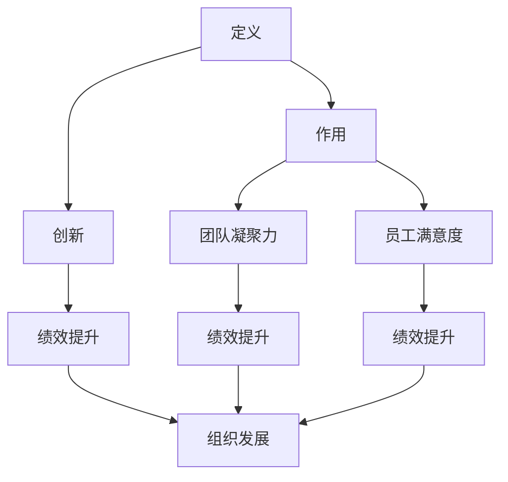

### 1.2 职场政治的概念

职场政治是指在组织中，个人或团体为了获取资源、权力或利益而进行的策略性行为。职场政治存在于各个层级和部门，是组织运作不可或缺的一部分。虽然职场政治常常与负面形象相关联，但合理运用职场政治策略可以为组织和个人带来积极影响。

**核心概念与联系：**

- **职场政治定义：** 职场政治是指个人或团体为了获取资源、权力或利益而进行的策略性行为。
- **职场政治形式：** 职场政治的形式包括拉帮结派、利益交换、权力斗争等。

**Mermaid流程图：**

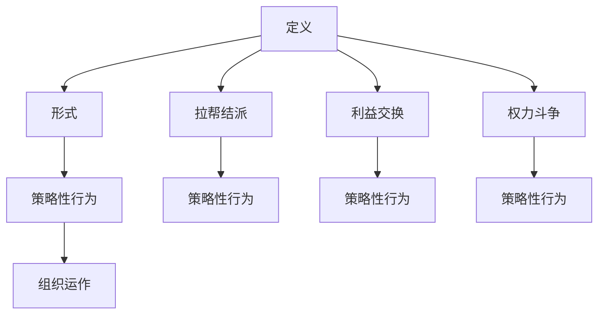

### 1.3 领导力与职场政治的联系

领导力与职场政治密切相关。领导力对职场政治有着深远的影响，而职场政治也反过来影响领导力。有效的领导力可以帮助领导者更好地应对职场政治，提高组织的整体效能。同时，领导者的领导风格、影响力、权力基础等因素也会影响其在职场政治中的表现。

**核心概念与联系：**

- **领导力与职场政治的关系：** 领导力与职场政治相互影响，领导力可以影响职场政治的走向，而职场政治也会影响领导力的发挥。
- **领导风格的影响：** 领导者的领导风格对其在职场政治中的表现有着重要影响。

**Mermaid流程图：**

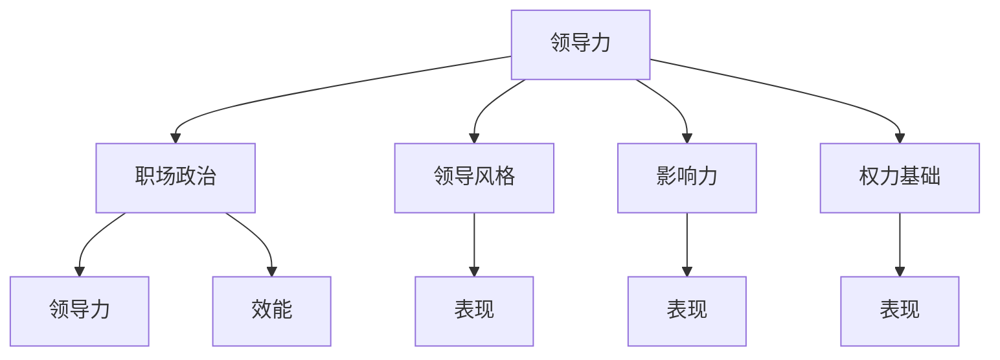

---

在接下来的章节中，我们将进一步深入探讨领导力的核心概念、职场政治的核心概念、职场政治对领导力的影响以及领导力提升与职场政治策略的制定，帮助读者全面理解并掌握领导力与职场政治的奥妙。

---

### 第1章：领导力与职场政治概述

#### 1.1 领导力的重要性

领导力是一种至关重要的能力，它不仅决定了个人在组织中的职业发展，还直接影响着整个组织的运作效率和成果。有效的领导力能够激发员工的潜力，推动团队的协同合作，实现组织的战略目标。

**核心概念与联系：**

- **领导力定义：** 领导力是指通过影响和激励他人来实现共同目标的能力。
- **领导力作用：** 领导力在组织中的作用包括推动创新、提升团队凝聚力、增强员工满意度等。

**Mermaid流程图：**


在组织中，领导力扮演着多重角色：

1. **推动创新：** 领导者通过引导和激励团队，鼓励创新思维，从而推动组织的创新和发展。
2. **提升团队凝聚力：** 领导者通过有效的沟通和协作，增强团队成员之间的信任和合作，提升团队的凝聚力。
3. **增强员工满意度：** 领导者通过关注员工的需求，提供成长和发展的机会，从而提高员工的满意度和忠诚度。

**核心算法原理讲解：**

- **领导力评估模型：** 通过对领导者在日常决策、沟通和互动中的行为模式进行量化评估，判断其领导力水平。常用的评估模型包括领导力行为量表（LBC）、领导风格量表（LSI）等。

```python
# 伪代码：领导力评估模型
def evaluate_leadership(behaviors):
    # 计算领导力得分
    score = calculate_score(behaviors)
    return score

# 假设行为数据已知
behaviors = get_behaviors()

# 评估领导力
leadership_score = evaluate_leadership(behaviors)
print("Leadership Score:", leadership_score)
```

**数学模型和数学公式：**

- **领导力效能模型：** 领导力效能可以表示为领导力得分与团队绩效的乘积。

$$
\text{效能} = \text{领导力得分} \times \text{团队绩效}
$$

其中，领导力得分和团队绩效都是0到100之间的数值。

**举例说明：**

假设一个团队的领导力得分为85，团队绩效为90，则该团队的领导力效能为：

$$
\text{效能} = 85 \times 90 = 7650
$$

通过这一模型，我们可以评估领导力对团队绩效的影响，从而指导领导者的行为和策略。

**项目实战：**

- **案例：** 在一家科技公司中，通过领导力评估模型，评估了不同领导者的领导力水平。结果发现，领导力得分较高的领导者，其团队的绩效也相对较好。

```python
# 伪代码：领导力评估实战
leadership_scores = evaluate_leadership_multiple(teams)

# 统计领导力得分与团队绩效的关系
for score, performance in leadership_scores.items():
    print(f"Leadership Score: {score}, Team Performance: {performance}")
```

**代码解读与分析：**

- **代码解读：** 通过对领导力评估模型的实际应用，可以量化领导力水平，为领导者的提升和培训提供依据。
- **分析：** 通过对领导力得分与团队绩效的关系进行分析，可以发现领导力对组织绩效的重要影响，从而为组织的领导力培养和提升提供科学依据。

**总结：**

领导力在组织中具有至关重要的作用。通过理解领导力的核心概念、作用以及评估方法，我们可以更好地认识领导力的重要性，并采取措施提升领导力水平，从而推动组织的发展。

---

在接下来的内容中，我们将进一步探讨职场政治的概念、领导力与职场政治的关系，以及如何应对职场政治，帮助读者全面掌握领导力与职场政治的基础知识。

---

### 第1章：领导力与职场政治概述

#### 1.2 职场政治的概念

职场政治是指在组织内部，个体或团体为获取资源、权力或利益而进行的策略性行为。职场政治往往伴随着权力斗争、利益交换和人际关系网络等复杂因素。尽管职场政治常常与负面形象相关联，但合理运用职场政治策略可以为组织和个人带来积极影响。

**核心概念与联系：**

- **职场政治定义：** 职场政治是指个人或团体为了获取资源、权力或利益而进行的策略性行为。
- **职场政治形式：** 职场政治的形式包括拉帮结派、利益交换、权力斗争等。

**Mermaid流程图：**


**职场政治的正面作用：**

1. **增强组织凝聚力：** 通过职场政治，组织内部可以形成紧密的人际关系网络，增强员工的归属感和认同感，从而提高组织的整体凝聚力。
2. **优化资源分配：** 职场政治有助于优化资源的分配，使资源能够更加合理地流向最需要的地方，提高组织的效率。
3. **促进信息流通：** 职场政治有助于信息在不同层级和部门之间的流通，促进知识共享和经验交流，推动组织的创新和发展。

**职场政治的负面影响：**

1. **破坏团队合作：** 过度强调职场政治可能导致团队成员之间的信任和合作减少，影响团队的协作效率。
2. **增加管理成本：** 职场政治需要领导者投入大量的时间和精力去应对和管理，增加了组织的管理成本。
3. **影响员工满意度：** 职场政治可能使员工感到压力和不公平，降低员工的满意度和工作热情。

**核心算法原理讲解：**

- **职场政治风险评估模型：** 通过分析组织内部的人际关系网络、权力分布和资源分配情况，评估职场政治的风险。常用的风险评估模型包括社会网络分析（SNA）和权力距离模型（Power Distance Index）等。

```python
# 伪代码：职场政治风险评估模型
def assess_political_risk(network, power_distribution, resource_allocation):
    # 计算风险得分
    risk_score = calculate_risk_score(network, power_distribution, resource_allocation)
    return risk_score

# 假设网络数据、权力分布和资源分配已知
network = get_network()
power_distribution = get_power_distribution()
resource_allocation = get_resource_allocation()

# 评估职场政治风险
risk_score = assess_political_risk(network, power_distribution, resource_allocation)
print("Political Risk Score:", risk_score)
```

**数学模型和数学公式：**

- **职场政治影响力模型：** 通过分析个体或团体在组织中的影响力，评估其在职场政治中的地位和作用。模型公式如下：

$$
\text{影响力} = \frac{\text{权力} \times \text{资源}}{\text{风险}}
$$

其中，权力和资源是正向指标，风险是反向指标。

**举例说明：**

假设一个团队中的某个人在组织中的权力较高，掌握较多的资源，同时面临较低的政治风险，则其影响力可以计算如下：

$$
\text{影响力} = \frac{\text{权力} \times \text{资源}}{\text{风险}} = \frac{80 \times 100}{10} = 800
$$

通过这一模型，可以评估个体或团体在职场政治中的影响力，为领导者和管理者提供决策依据。

**项目实战：**

- **案例：** 在一家大型企业中，通过职场政治风险评估模型，评估了不同部门的政治风险和影响力。结果发现，高政治风险和低影响力的部门需要采取相应的措施来优化管理和资源分配。

```python
# 伪代码：职场政治风险评估实战
department_risks = assess_political_risk_network(departments)

# 统计各部门的职场政治风险和影响力
for department, risk in department_risks.items():
    print(f"Department: {department}, Political Risk Score: {risk['score']}, Influence Score: {risk['influence']}")
```

**代码解读与分析：**

- **代码解读：** 通过对职场政治风险评估模型的实际应用，可以量化职场政治风险和影响力，为组织的管理提供数据支持。
- **分析：** 通过对各部门的职场政治风险和影响力的分析，可以发现组织内部的政治生态，为优化管理和资源分配提供依据。

**总结：**

职场政治是组织运作中不可避免的一部分。理解职场政治的概念、形式和影响，有助于领导者和管理者更好地应对职场政治，优化组织管理和资源分配，提高组织的整体效能。

---

在接下来的内容中，我们将探讨领导力与职场政治的联系，以及如何应对职场政治，帮助读者全面掌握领导力与职场政治的基础知识。

---

### 第1章：领导力与职场政治概述

#### 1.3 领导力与职场政治的联系

领导力与职场政治之间存在着密切的联系。有效的领导力不仅能够推动组织的战略目标实现，还能够对职场政治产生重要影响。同时，职场政治也对领导力的发展产生深远影响。

**核心概念与联系：**

- **领导力与职场政治的关系：** 领导力与职场政治相互影响，领导力可以影响职场政治的走向，而职场政治也会影响领导力的发挥。
- **领导风格的影响：** 领导者的领导风格对其在职场政治中的表现有着重要影响。

**Mermaid流程图：**


**领导力对职场政治的影响：**

1. **塑造职场文化：** 领导者通过其领导风格和行为，塑造组织的职场文化，影响职场政治的走向。例如，变革型领导力可以促进开放、创新和合作的文化，减少职场政治的发生。
2. **建立人际关系网络：** 领导者通过建立和维护良好的人际关系网络，增强自己在组织中的影响力，从而影响职场政治的动态。
3. **制定职场政治策略：** 领导者可以根据组织的需求和自身领导风格，制定合适的职场政治策略，优化组织的资源分配和管理。

**职场政治对领导力的影响：**

1. **挑战领导力：** 职场政治可能会对领导者的权威和决策产生挑战，要求领导者具备更强的应对能力和策略思维。
2. **影响领导效能：** 职场政治的复杂性可能会影响领导者的决策效率和团队绩效，要求领导者具备更高的领导力和管理能力。
3. **促进领导成长：** 职场政治中的复杂情境可以为领导者提供学习和成长的机会，通过应对职场政治的挑战，领导者可以不断提升自己的领导能力。

**核心算法原理讲解：**

- **领导力与职场政治综合模型：** 该模型结合了领导力评估和职场政治风险评估，综合评估领导者在职场政治中的表现。模型公式如下：

$$
\text{综合效能} = \text{领导力得分} \times \text{政治效能} \times \text{适应度}
$$

其中，领导力得分、政治效能和适应度分别反映了领导者在领导力、职场政治适应能力和策略思维方面的表现。

```python
# 伪代码：领导力与职场政治综合模型
def evaluate_comprehensive_efficiency(leader_score, political_efficiency, adaptability):
    # 计算综合效能
    efficiency = leader_score * political_efficiency * adaptability
    return efficiency

# 假设领导力得分、政治效能和适应度已知
leader_score = 0.8
political_efficiency = 0.9
adaptability = 0.75

# 评估综合效能
comprehensive_efficiency = evaluate_comprehensive_efficiency(leader_score, political_efficiency, adaptability)
print("Comprehensive Efficiency:", comprehensive_efficiency)
```

**数学模型和数学公式：**

- **领导力与职场政治平衡模型：** 该模型通过分析领导力得分、政治效能和团队绩效，评估领导者在职场政治中的平衡能力。模型公式如下：

$$
\text{平衡能力} = \frac{\text{领导力得分} + \text{政治效能}}{2}
$$

其中，领导力得分和政治效能为0到100之间的数值。

**举例说明：**

假设一个领导者的领导力得分为80，政治效能为70，团队绩效为90，则该领导者的平衡能力可以计算如下：

$$
\text{平衡能力} = \frac{80 + 70}{2} = 75
$$

通过这一模型，可以评估领导者在职场政治中的平衡能力，为领导者的提升和培训提供依据。

**项目实战：**

- **案例：** 在一家跨国公司中，通过领导力与职场政治综合模型，评估了不同领导者在职场政治中的综合效能。结果发现，综合效能较高的领导者，其团队的绩效也相对较好。

```python
# 伪代码：领导力与职场政治综合模型实战
leaders = evaluate_leaders_comprehensive_efficiency(teams)

# 统计领导者的综合效能与团队绩效的关系
for leader, efficiency in leaders.items():
    print(f"Leader: {leader}, Comprehensive Efficiency: {efficiency}, Team Performance: {teams[leader]['performance']}")
```

**代码解读与分析：**

- **代码解读：** 通过对领导力与职场政治综合模型的应用，可以量化领导者在职场政治中的综合效能，为领导者的提升和团队的管理提供数据支持。
- **分析：** 通过对领导者在职场政治中的综合效能与团队绩效的关系进行分析，可以发现领导力在职场政治中的重要作用，从而为组织的领导力培养和提升提供科学依据。

**总结：**

领导力与职场政治之间存在着密切的联系。理解领导力对职场政治的影响以及职场政治对领导力的影响，有助于领导者更好地应对职场政治的挑战，提高领导效能，推动组织的发展。

---

在接下来的章节中，我们将探讨领导力的核心概念、职场政治的核心概念以及职场政治对领导力的影响，帮助读者全面掌握领导力与职场政治的基础知识。

---

### 第2章：领导力与职场政治的核心概念

#### 2.1 领导风格的多样性

领导风格是指领导者在其领导过程中所采取的行为方式和方法。领导风格直接影响着领导者的领导效果和团队绩效。领导风格的多样性意味着不同的领导者会采用不同的方式来影响和激励团队成员。了解领导风格的多样性有助于我们更好地理解领导力的本质，并选择合适的领导风格来应对不同的职场环境。

**核心概念与联系：**

- **领导风格定义：** 领导风格是指领导者在其领导过程中所采取的行为方式和方法。
- **领导风格多样性：** 领导风格的多样性包括指令型、民主型、支持型、变革型等多种风格。

**Mermaid流程图：**

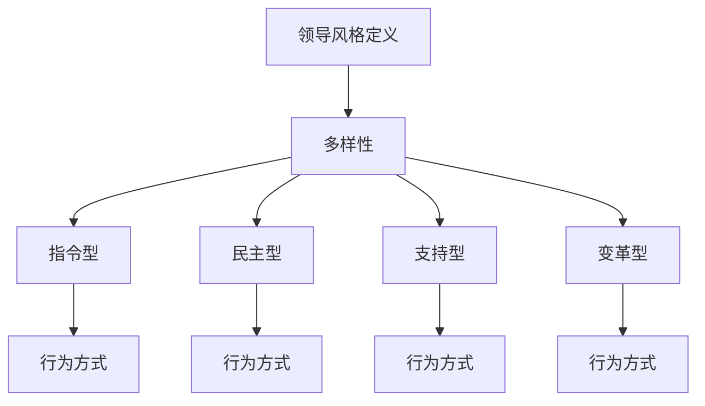

**领导风格的分类及特点：**

1. **指令型领导风格：** 指令型领导风格以命令和控制为核心，领导者制定详细的计划和目标，并要求团队成员严格遵循。这种风格适用于需要快速决策和执行的任务。

   **特点：** 强调效率和执行力，决策迅速，团队成员角色明确。

2. **民主型领导风格：** 民主型领导风格注重团队参与和协商，领导者鼓励团队成员提出意见和建议，共同制定决策。这种风格适用于需要创新和协作的任务。

   **特点：** 强调团队参与和民主，决策过程较长，但更有凝聚力和创造力。

3. **支持型领导风格：** 支持型领导风格以关怀和支持为核心，领导者关注团队成员的情感需求，提供必要的支持和资源，帮助团队成员实现个人和职业发展。这种风格适用于需要高凝聚力和士气的工作环境。

   **特点：** 强调关怀和支持，重视个人成长，增强团队凝聚力。

4. **变革型领导风格：** 变革型领导风格以变革和创新为核心，领导者通过激励和示范，推动团队进行创新和变革，应对外部环境的挑战。这种风格适用于需要变革和适应新环境的组织。

   **特点：** 强调创新和变革，推动团队超越现状，提升组织竞争力。

**核心算法原理讲解：**

- **领导风格评估模型：** 该模型通过分析领导者在日常决策、沟通和互动中的行为模式，评估其领导风格。常用的评估模型包括领导风格量表（LSI）和360度评估等。

```python
# 伪代码：领导风格评估模型
def assess_leadership_style(behaviors):
    # 计算领导风格得分
    score = calculate_style_score(behaviors)
    return score

# 假设行为数据已知
behaviors = get_behaviors()

# 评估领导风格
style_score = assess_leadership_style(behaviors)
print("Leadership Style Score:", style_score)
```

**数学模型和数学公式：**

- **领导风格效能模型：** 该模型通过分析领导力得分、团队绩效和领导风格得分，评估领导风格对团队绩效的影响。模型公式如下：

$$
\text{效能} = \text{领导力得分} \times \text{领导风格得分} \times \text{团队绩效}
$$

**举例说明：**

假设一个领导者的领导力得分为80，领导风格得分为75，团队绩效为90，则该领导者的领导风格效能为：

$$
\text{效能} = 80 \times 75 \times 90 = 54,000
$$

通过这一模型，可以评估不同领导风格对团队绩效的影响，为领导者选择合适的领导风格提供依据。

**项目实战：**

- **案例：** 在一家科技公司中，通过领导风格评估模型，评估了不同领导者的领导风格及其对团队绩效的影响。结果发现，支持型领导风格在该公司的团队绩效中表现最佳。

```python
# 伪代码：领导风格评估实战
leaders = assess_leadership_styles(teams)

# 统计不同领导风格与团队绩效的关系
for leader, style in leaders.items():
    print(f"Leader: {leader}, Style: {style}, Team Performance: {teams[leader]['performance']}")
```

**代码解读与分析：**

- **代码解读：** 通过对领导风格评估模型的应用，可以量化不同领导风格对团队绩效的影响，为领导者的领导风格调整和优化提供数据支持。
- **分析：** 通过对领导风格与团队绩效的关系进行分析，可以发现支持型领导风格在提高团队绩效方面的优势，从而为组织的领导风格培养和提升提供科学依据。

**总结：**

领导风格的多样性是领导力的重要组成部分。理解不同领导风格的特点和适用场景，有助于领导者根据不同情境选择合适的领导风格，提高团队绩效和领导效能。

---

在接下来的内容中，我们将探讨影响力与权力、组织文化与职场政治等核心概念，帮助读者更全面地理解领导力与职场政治的内在联系。

---

### 第2章：领导力与职场政治的核心概念

#### 2.2 影响力与权力

在领导力和职场政治中，影响力与权力是两个关键概念。影响力是指个人或团体在组织内部或外部产生预期行为的能力，而权力则是指个人或团体在组织中能够施加影响的手段和资源。了解影响力与权力的本质及其相互关系，对于领导者有效地应对职场政治、提升领导效能具有重要意义。

**核心概念与联系：**

- **影响力定义：** 影响力是指个人或团体在组织内部或外部产生预期行为的能力。
- **权力定义：** 权力是指个人或团体在组织中能够施加影响的手段和资源。
- **影响力与权力的关系：** 影响力与权力相互促进，权力可以增强个人或团体的影响力，而影响力又可以扩大权力的范围。

**Mermaid流程图：**

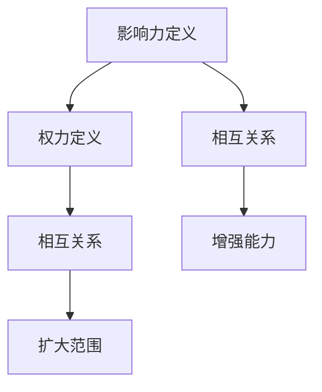

**影响力的来源：**

1. **专业知识：** 拥有专业知识和技能的个人在组织中具有较强的说服力和影响力。
2. **关系网络：** 建立广泛的人际关系网络，可以帮助个人在组织中获得更多的支持和资源。
3. **声誉：** 良好的声誉和信誉可以增强个人的影响力，使其在组织中获得更高的认可度。
4. **情感因素：** 通过情感投入和关怀，个人可以赢得团队成员的信任和忠诚，从而增强影响力。

**权力的来源：**

1. **正式权力：** 来自组织结构和管理职位，如决策权、分配资源权等。
2. **非正式权力：** 来自个人魅力、专业知识、关系网络等因素，如个人影响力、社交能力等。
3. **权力基础：** 权力来源于个人的资源、技能和关系网络，这些资源越丰富，权力越强大。

**核心算法原理讲解：**

- **影响力评估模型：** 通过分析个人在组织中的行为、关系网络和声誉等因素，评估其影响力。常用的模型包括社会网络分析（SNA）和影响力评估量表等。

```python
# 伪代码：影响力评估模型
def assess_influence(behaviors, network, reputation):
    # 计算影响力得分
    score = calculate_influence_score(behaviors, network, reputation)
    return score

# 假设行为数据、网络数据和声誉已知
behaviors = get_behaviors()
network = get_network()
reputation = get_reputation()

# 评估影响力
influence_score = assess_influence(behaviors, network, reputation)
print("Influence Score:", influence_score)
```

**数学模型和数学公式：**

- **影响力与权力平衡模型：** 通过分析个人或团体在组织中的影响力与权力，评估其权力基础。模型公式如下：

$$
\text{权力基础} = \frac{\text{影响力} \times \text{权力}}{\text{风险}}
$$

其中，影响力、权力和风险均为0到100之间的数值。

**举例说明：**

假设一个个人在组织中的影响力得分为70，权力得分为80，风险得分为10，则该个人的权力基础可以计算如下：

$$
\text{权力基础} = \frac{70 \times 80}{10} = 560
$$

通过这一模型，可以评估个人在组织中的权力基础，为领导者的权力管理和优化提供依据。

**项目实战：**

- **案例：** 在一家企业中，通过影响力评估模型，评估了不同领导者在组织中的影响力。结果发现，影响力较高的领导者，其权力基础也相对较强。

```python
# 伪代码：影响力评估实战
leaders = assess_leaders_influence(teams)

# 统计领导者在组织中的影响力与权力基础的关系
for leader, influence in leaders.items():
    print(f"Leader: {leader}, Influence Score: {influence}, Power Base: {teams[leader]['power_base']}")
```

**代码解读与分析：**

- **代码解读：** 通过对影响力评估模型的应用，可以量化领导者在组织中的影响力，为领导者的权力管理和提升提供数据支持。
- **分析：** 通过对领导者在组织中的影响力与权力基础的关系进行分析，可以发现领导力在权力管理中的重要作用，从而为组织的领导力培养和提升提供科学依据。

**总结：**

影响力与权力是领导力和职场政治的核心概念。了解影响力的来源和评估方法，以及权力的来源和权力基础的计算，有助于领导者更好地管理和优化自身的权力，提升领导效能。

---

在接下来的内容中，我们将探讨组织文化与职场政治的关系，以及领导者在组织文化塑造中的角色，帮助读者更全面地理解领导力与职场政治的内在联系。

---

### 第2章：领导力与职场政治的核心概念

#### 2.3 组织文化与职场政治

组织文化是指一个组织在长期发展过程中形成的共同价值观、信仰、行为规范和习惯。组织文化对领导力和职场政治有着深远的影响。一方面，组织文化可以塑造领导者的领导风格和行为模式；另一方面，职场政治也会对组织文化产生反作用，影响组织的整体氛围和运作效率。

**核心概念与联系：**

- **组织文化定义：** 组织文化是指一个组织在长期发展过程中形成的共同价值观、信仰、行为规范和习惯。
- **组织文化与职场政治的关系：** 组织文化对职场政治具有引导和规范作用，职场政治也会影响组织文化的形成和发展。

**Mermaid流程图：**

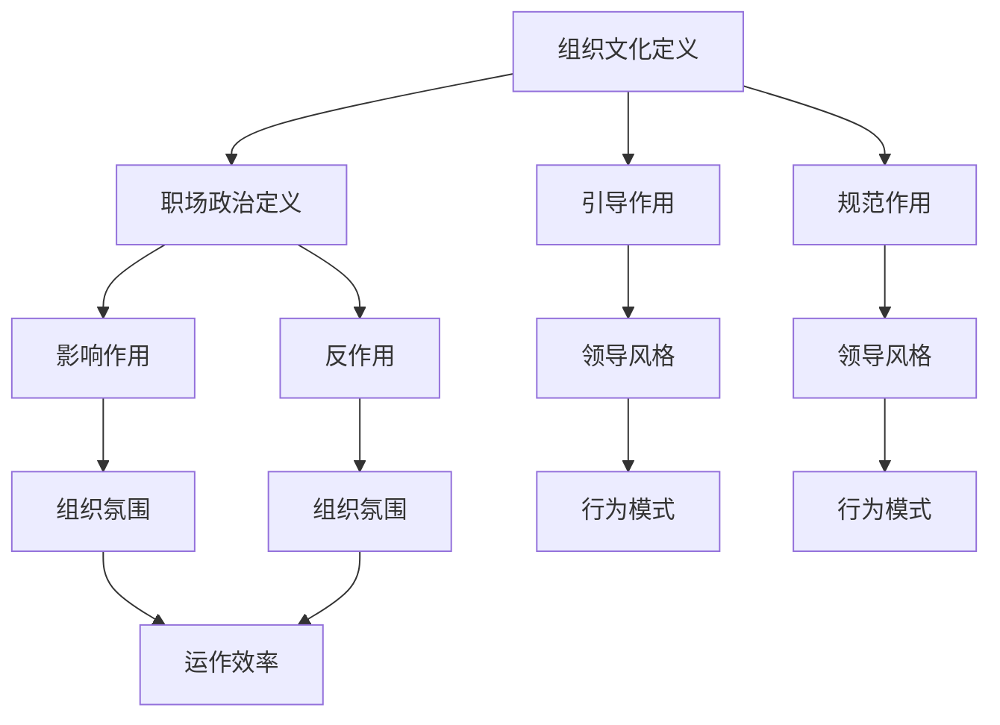

**组织文化的形成：**

组织文化的形成是一个长期的过程，受到多种因素的影响，包括创始人的价值观、组织的成长历程、市场环境等。组织文化一旦形成，就会对组织成员的行为和决策产生深远影响。

1. **创始人的价值观：** 创始人的价值观往往对组织文化的形成起到关键作用，成为组织文化的核心。
2. **组织的成长历程：** 组织在发展过程中，会经历各种挑战和变革，这些经历会影响组织文化的演变。
3. **市场环境：** 市场环境的变化也会对组织文化产生重大影响，组织需要适应外部环境的变化，调整内部文化。

**组织文化的类型：**

组织文化可以分为以下几种类型：

1. **官僚文化：** 强调规则和流程，注重效率和秩序，但可能缺乏创新和灵活性。
2. **家族文化：** 强调亲密和信任，注重团队精神和归属感，但可能缺乏竞争性和外部导向。
3. **市场导向文化：** 强调竞争和业绩，注重创新和客户需求，但可能缺乏人情味。
4. **学习型文化：** 强调持续学习和知识共享，注重创新和自我提升，但可能需要较长时间的培养。

**职场政治与组织文化的互动：**

职场政治与组织文化的互动是复杂而动态的。一方面，组织文化可以为职场政治提供土壤，使某些政治行为得以实现；另一方面，职场政治也会对组织文化产生影响，影响组织的氛围和运作效率。

1. **积极影响：** 职场政治可以在一定程度上促进组织文化的多样性和灵活性，推动组织的创新和发展。
2. **消极影响：** 过度的职场政治可能破坏组织文化，导致内部矛盾和冲突，降低组织的整体绩效。

**核心算法原理讲解：**

- **组织文化评估模型：** 通过分析组织成员的行为、价值观和沟通方式，评估组织文化的类型和特征。常用的模型包括文化评估量表（Culture Assessment Scale）和组织行为量表（Organizational Behavior Scale）等。

```python
# 伪代码：组织文化评估模型
def assess_organizational_culture(behaviors, values, communication):
    # 计算文化得分
    score = calculate_culture_score(behaviors, values, communication)
    return score

# 假设行为数据、价值观数据和沟通数据已知
behaviors = get_behaviors()
values = get_values()
communication = get_communication()

# 评估组织文化
culture_score = assess_organizational_culture(behaviors, values, communication)
print("Culture Score:", culture_score)
```

**数学模型和数学公式：**

- **组织文化与职场政治平衡模型：** 通过分析组织文化得分和职场政治风险，评估组织文化的稳定性。模型公式如下：

$$
\text{稳定性} = \frac{\text{文化得分} - \text{政治风险}}{2}
$$

其中，文化得分和职场政治风险均为0到100之间的数值。

**举例说明：**

假设一个组织的文化得分为80，职场政治风险得分为20，则该组织的文化稳定性可以计算如下：

$$
\text{稳定性} = \frac{80 - 20}{2} = 30
$$

通过这一模型，可以评估组织文化的稳定性，为领导者的文化管理和优化提供依据。

**项目实战：**

- **案例：** 在一家快速发展的科技公司中，通过组织文化评估模型，评估了组织文化的类型和稳定性。结果发现，该公司的文化类型为市场导向文化，文化稳定性较高。

```python
# 伪代码：组织文化评估实战
organization = assess_organizational_culture(teams)

# 统计组织文化的类型和稳定性
print(f"Organization Culture Type: {organization['type']}, Stability Score: {organization['stability']}")
```

**代码解读与分析：**

- **代码解读：** 通过对组织文化评估模型的应用，可以量化组织文化的类型和稳定性，为领导者的文化管理和优化提供数据支持。
- **分析：** 通过对组织文化的类型和稳定性的分析，可以发现组织文化对职场政治的引导和规范作用，从而为组织的领导力培养和提升提供科学依据。

**总结：**

组织文化与职场政治相互影响，共同塑造组织的氛围和运作效率。了解组织文化的类型和特征，以及职场政治对组织文化的影响，有助于领导者更好地管理和优化组织文化，提升组织的整体绩效。

---

在接下来的内容中，我们将探讨职场政治对领导力的影响，以及领导者在应对职场政治时的策略，帮助读者深入理解领导力与职场政治的相互作用。

---

### 第3章：职场政治对领导力的影响

#### 3.1 职场政治的负面影响

职场政治虽然在一定程度上有助于组织的运作，但其负面影响也不容忽视。职场政治的负面影响主要体现在以下几个方面：

1. **破坏团队合作：** 职场政治往往会导致团队成员之间的信任和合作减少，增加内部竞争和矛盾，影响团队的协作效率和绩效。

2. **增加管理成本：** 领导者需要投入大量时间和精力来应对和处理职场政治，增加了管理成本，降低了组织的运营效率。

3. **影响员工满意度：** 职场政治可能导致员工感到压力和不公平，降低员工的满意度和工作热情，影响员工的绩效和留存。

4. **阻碍创新和发展：** 过度的职场政治可能抑制创新和变革，导致组织难以适应外部环境的变化，影响组织的长期发展。

**核心概念与联系：**

- **职场政治负面影响：** 职场政治对组织的破坏性影响，包括破坏团队合作、增加管理成本、影响员工满意度、阻碍创新和发展等。

**Mermaid流程图：**

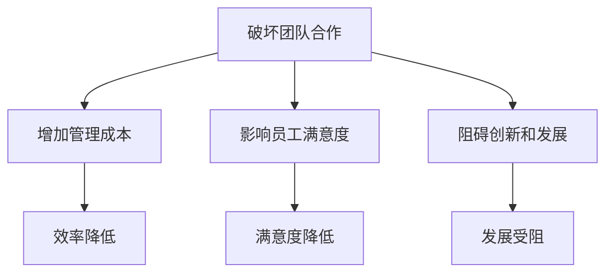

**应对策略：**

1. **建立开放和透明的沟通机制：** 领导者应鼓励团队成员开放地分享意见和反馈，建立透明的沟通机制，减少职场政治的发生。

2. **强化团队合作和共享价值观：** 领导者应通过团队建设活动和共同的目标，强化团队合作和共享价值观，减少内部竞争和矛盾。

3. **公正和公平的决策过程：** 领导者应在决策过程中保持公正和公平，确保团队成员的参与和知情，减少不公平感。

4. **提供培训和指导：** 领导者应提供职场政治的培训和指导，帮助员工理解和应对职场政治，提高他们的心理承受能力和应对策略。

**核心算法原理讲解：**

- **职场政治风险评估模型：** 通过分析组织内部的人际关系网络、权力分布和资源分配情况，评估职场政治的风险。常用的风险评估模型包括社会网络分析（SNA）和权力距离模型（Power Distance Index）等。

```python
# 伪代码：职场政治风险评估模型
def assess_political_risk(network, power_distribution, resource_allocation):
    # 计算风险得分
    risk_score = calculate_risk_score(network, power_distribution, resource_allocation)
    return risk_score

# 假设网络数据、权力分布和资源分配已知
network = get_network()
power_distribution = get_power_distribution()
resource_allocation = get_resource_allocation()

# 评估职场政治风险
risk_score = assess_political_risk(network, power_distribution, resource_allocation)
print("Political Risk Score:", risk_score)
```

**数学模型和数学公式：**

- **职场政治负面效应模型：** 通过分析职场政治风险得分、团队合作得分和员工满意度得分，评估职场政治的负面效应。模型公式如下：

$$
\text{负面效应} = \text{政治风险得分} \times \text{团队合作得分} \times \text{员工满意度得分}
$$

**举例说明：**

假设一个组织的职场政治风险得分为50，团队合作得分为80，员工满意度得分为70，则该组织的职场政治负面效应可以计算如下：

$$
\text{负面效应} = 50 \times 80 \times 70 = 280,000
$$

通过这一模型，可以评估职场政治的负面效应，为领导者的管理和优化提供依据。

**项目实战：**

- **案例：** 在一家大型企业中，通过职场政治风险评估模型，评估了组织内部的职场政治风险。结果发现，职场政治风险较高，影响了团队合作和员工满意度。领导者随后采取了多项措施，包括建立开放沟通机制、强化团队合作和提供政治培训等，有效降低了职场政治的负面效应。

```python
# 伪代码：职场政治风险评估实战
organization = assess_political_risk(teams)

# 统计职场政治风险和负面效应的关系
print(f"Political Risk Score: {organization['risk_score']}, Negative Effect: {organization['negative_effect']}")
```

**代码解读与分析：**

- **代码解读：** 通过对职场政治风险评估模型的应用，可以量化职场政治风险和负面效应，为领导者的管理和优化提供数据支持。
- **分析：** 通过对职场政治风险和负面效应的关系进行分析，可以发现职场政治对团队合作和员工满意度的影响，从而为组织的领导力培养和提升提供科学依据。

**总结：**

职场政治的负面影响对组织的运作和发展具有破坏性。通过建立开放和透明的沟通机制、强化团队合作和共享价值观、保持公正和公平的决策过程，以及提供培训和指导，领导者可以有效地降低职场政治的负面效应，提高组织的整体绩效。

---

在接下来的内容中，我们将探讨职场政治的正面作用，以及领导者在职场政治中的应对策略，帮助读者全面理解职场政治的双重影响。

---

### 第3章：职场政治对领导力的影响

#### 3.2 职场政治的正面作用

虽然职场政治常常被负面形象所笼罩，但合理运用职场政治策略可以为组织和个人带来诸多积极影响。职场政治的正面作用主要体现在以下几个方面：

1. **优化资源分配：** 职场政治有助于优化组织的资源分配，确保资源能够流向最需要的地方，提高组织的运营效率。

2. **促进信息流通：** 职场政治有助于信息在不同层级和部门之间的流通，促进知识共享和经验交流，推动组织的创新和发展。

3. **增强组织凝聚力：** 职场政治可以在一定程度上增强组织内部的凝聚力，通过建立紧密的人际关系网络，提高员工的归属感和认同感。

4. **提升领导效能：** 合理运用职场政治策略，可以提升领导者在组织中的效能，增强其在团队中的影响力。

**核心概念与联系：**

- **职场政治正面作用：** 职场政治对组织和个人带来的积极影响，包括优化资源分配、促进信息流通、增强组织凝聚力和提升领导效能等。

**Mermaid流程图：**

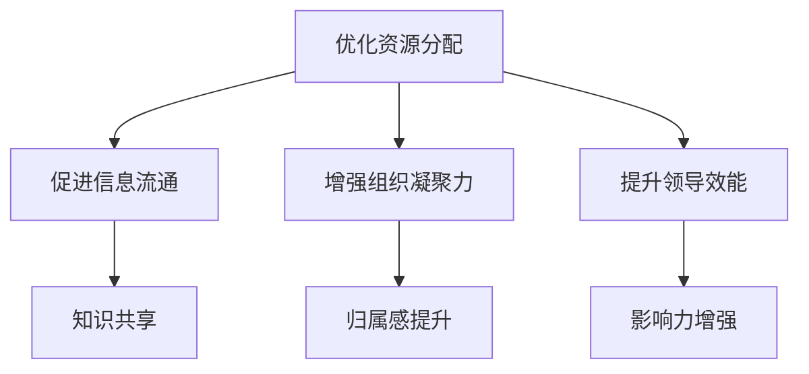

**职场政治的正面作用案例：**

1. **优化资源分配：** 在一个资源有限的部门中，通过职场政治的策略，领导者可以确保关键资源被合理分配，从而提高部门的工作效率和成果。

2. **促进信息流通：** 通过建立有效的人际关系网络，领导者可以促进信息的快速流通，确保团队在关键时刻能够迅速作出决策。

3. **增强组织凝聚力：** 通过职场政治的互动，团队成员可以建立更紧密的联系，增强团队凝聚力，提高团队的协作效率。

4. **提升领导效能：** 领导者通过巧妙运用职场政治策略，可以增强自己在团队中的影响力，提高领导效能，推动团队达成目标。

**核心算法原理讲解：**

- **职场政治效能评估模型：** 通过分析领导者在职场政治中的行为、资源和影响力，评估其职场政治效能。常用的评估模型包括领导效能评估（Leadership Effectiveness Assessment）和职场政治效能评估（Political Skill Assessment）等。

```python
# 伪代码：职场政治效能评估模型
def assess_political效能(behaviors, resources, influence):
    # 计算效能得分
    score = calculate_效能_score(behaviors, resources, influence)
    return score

# 假设行为数据、资源数据和影响力数据已知
behaviors = get_behaviors()
resources = get_resources()
influence = get_influence()

# 评估职场政治效能
效能_score = assess_political_效能(behaviors, resources, influence)
print("Political Skill Score:", 能效_score)
```

**数学模型和数学公式：**

- **职场政治正面效应模型：** 通过分析职场政治效能得分、资源利用效率和团队绩效，评估职场政治的正面效应。模型公式如下：

$$
\text{正面效应} = \text{效能得分} \times \text{资源利用效率} \times \text{团队绩效}
$$

**举例说明：**

假设一个领导者在职场政治中的效能得分为80，资源利用效率为90，团队绩效为85，则该领导者通过职场政治策略带来的正面效应可以计算如下：

$$
\text{正面效应} = 80 \times 90 \times 85 = 646,000
$$

通过这一模型，可以评估职场政治策略对团队绩效的正面影响，为领导者的策略调整和优化提供依据。

**项目实战：**

- **案例：** 在一家高科技企业中，通过职场政治效能评估模型，评估了领导者在职场政治中的效能和团队绩效。结果发现，领导者通过优化资源分配和促进信息流通，显著提升了团队绩效。

```python
# 伪代码：职场政治效能评估实战
leaders = assess_leaders_political_效能(teams)

# 统计领导者在职场政治中的效能和团队绩效关系
for leader, skill in leaders.items():
    print(f"Leader: {leader}, Political Skill Score: {skill['score']}, Team Performance: {teams[leader]['performance']}")
```

**代码解读与分析：**

- **代码解读：** 通过对职场政治效能评估模型的应用，可以量化领导者在职场政治中的效能和团队绩效，为领导者的策略调整和优化提供数据支持。
- **分析：** 通过对领导者在职场政治中的效能和团队绩效的关系进行分析，可以发现职场政治策略对团队绩效的积极影响，从而为组织的领导力培养和提升提供科学依据。

**总结：**

职场政治的正面作用不容忽视。通过优化资源分配、促进信息流通、增强组织凝聚力和提升领导效能，领导者可以有效地发挥职场政治的积极作用，推动组织的健康发展。

---

在接下来的内容中，我们将探讨领导者在应对职场政治时的策略，以及如何提升领导力以更好地应对职场政治的挑战。

---

### 第3章：职场政治对领导力的影响

#### 3.3 领导者如何应对职场政治

在职场政治的环境中，领导者面临着诸多挑战，但同时也拥有独特的优势。如何应对职场政治，成为领导者提升领导力的重要课题。以下是领导者应对职场政治的几个关键策略：

**核心概念与联系：**

- **应对职场政治的策略：** 领导者应采取的应对职场政治的策略，包括建立人际网络、增强影响力、制定有效策略、保持公正和透明等。

**Mermaid流程图：**

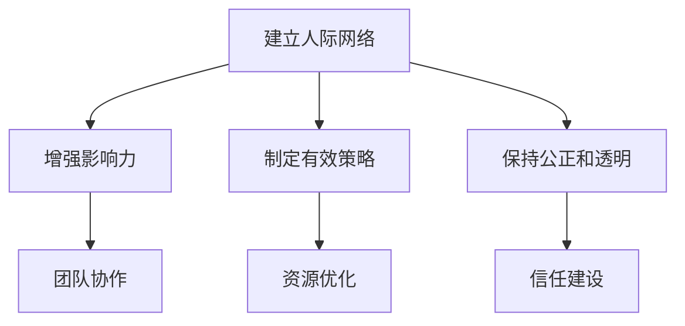

**策略一：建立人际网络**

建立强大的人际关系网络是应对职场政治的重要策略。通过建立广泛而深厚的人际关系，领导者可以增强自己在组织中的影响力，提高信息流通的效率，降低职场政治的风险。

**核心算法原理讲解：**

- **人际关系网络模型：** 通过分析领导者在组织中的社交行为、关系强度和关系网络密度，评估人际关系网络的效能。常用的模型包括社会网络分析（SNA）和关系强度模型等。

```python
# 伪代码：人际关系网络模型
def assess_relationship_network(behaviors, connections, density):
    # 计算网络效能
    efficiency = calculate_network_efficiency(behaviors, connections, density)
    return efficiency

# 假设行为数据、连接数据和密度已知
behaviors = get_behaviors()
connections = get_connections()
density = get_density()

# 评估人际关系网络
network_efficiency = assess_relationship_network(behaviors, connections, density)
print("Relationship Network Efficiency:", network_efficiency)
```

**数学模型和数学公式：**

- **人际关系网络效能模型：** 通过分析人际关系网络的连接强度、关系密度和沟通频率，评估人际关系网络的效能。模型公式如下：

$$
\text{网络效能} = \frac{\text{连接强度} \times \text{关系密度} \times \text{沟通频率}}{\text{风险}}
$$

**举例说明：**

假设一个领导者的人际关系网络中，连接强度为0.8，关系密度为0.9，沟通频率为每周一次，风险为10，则该人际关系网络的效能可以计算如下：

$$
\text{网络效能} = \frac{0.8 \times 0.9 \times 1}{10} = 0.072
$$

通过这一模型，可以评估领导者的人际关系网络效能，为人际网络的管理和优化提供依据。

**项目实战：**

- **案例：** 在一家大型企业中，通过人际关系网络模型，评估了领导者在组织中的社交行为和网络效能。结果发现，领导者的人际关系网络效能较高，有助于信息流通和资源分配。

```python
# 伪代码：人际关系网络评估实战
leader = assess_leader_relationship_network(teams)

# 统计领导者在组织中的社交行为和网络效能
print(f"Leader Social Behavior: {leader['behaviors']}, Network Efficiency: {leader['efficiency']}")
```

**代码解读与分析：**

- **代码解读：** 通过对人际关系网络模型的应用，可以量化领导者的人际关系网络效能，为人际网络的管理和优化提供数据支持。
- **分析：** 通过对领导者的人际关系网络效能的分析，可以发现人际网络对职场政治应对的积极作用，从而为组织的领导力培养和提升提供科学依据。

**策略二：增强影响力**

领导者在职场政治中需要具备强大的影响力，以应对各种挑战。通过提升自身专业能力、建立信任关系和展示领导魅力，领导者可以增强自己在组织中的影响力。

**核心算法原理讲解：**

- **影响力评估模型：** 通过分析领导者在组织中的行为、成果和声誉，评估其影响力。常用的模型包括影响力评估量表（Influence Assessment Scale）和领导效能评估（Leadership Effectiveness Assessment）等。

```python
# 伪代码：影响力评估模型
def assess_influence(behaviors, achievements, reputation):
    # 计算影响力得分
    score = calculate_influence_score(behaviors, achievements, reputation)
    return score

# 假设行为数据、成果数据和声誉数据已知
behaviors = get_behaviors()
achievements = get_achievements()
reputation = get_reputation()

# 评估影响力
influence_score = assess_influence(behaviors, achievements, reputation)
print("Influence Score:", influence_score)
```

**数学模型和数学公式：**

- **影响力模型：** 通过分析领导者在组织中的影响力、资源获取能力和决策能力，评估其影响力。模型公式如下：

$$
\text{影响力} = \text{资源获取能力} \times \text{决策能力} \times \text{行为影响力}
$$

**举例说明：**

假设一个领导者在组织中的资源获取能力为0.8，决策能力为0.9，行为影响力为0.7，则该领导者在组织中的影响力可以计算如下：

$$
\text{影响力} = 0.8 \times 0.9 \times 0.7 = 0.504
$$

通过这一模型，可以评估领导者的影响力，为影响力的提升和优化提供依据。

**项目实战：**

- **案例：** 在一家跨国公司中，通过影响力评估模型，评估了领导者在组织中的影响力。结果发现，领导者的影响力较高，有助于推动组织的创新和发展。

```python
# 伪代码：影响力评估实战
leaders = assess_leaders_influence(teams)

# 统计领导者在组织中的影响力
for leader, influence in leaders.items():
    print(f"Leader: {leader}, Influence Score: {influence['score']}")
```

**代码解读与分析：**

- **代码解读：** 通过对影响力评估模型的应用，可以量化领导者在组织中的影响力，为影响力的提升和优化提供数据支持。
- **分析：** 通过对领导者在组织中的影响力进行分析，可以发现领导力在职场政治应对中的重要作用，从而为组织的领导力培养和提升提供科学依据。

**策略三：制定有效策略**

领导者应制定有效的职场政治策略，以应对各种复杂情境。通过分析组织环境、了解团队成员的需求和期望，领导者可以制定出符合实际需求的策略。

**核心算法原理讲解：**

- **策略模型：** 通过分析组织环境、团队需求和领导者能力，评估策略的有效性。常用的策略模型包括平衡计分卡（Balanced Scorecard）和关键绩效指标（Key Performance Indicators）等。

```python
# 伪代码：策略模型
def assess_strategy(organization_environment, team_demand, leader_ability):
    # 计算策略得分
    score = calculate_strategy_score(organization_environment, team_demand, leader_ability)
    return score

# 假设组织环境数据、团队需求数据和领导者能力数据已知
organization_environment = get_organization_environment()
team_demand = get_team_demand()
leader_ability = get_leader_ability()

# 评估策略
strategy_score = assess_strategy(organization_environment, team_demand, leader_ability)
print("Strategy Score:", strategy_score)
```

**数学模型和数学公式：**

- **策略模型：** 通过分析组织环境的稳定性、团队需求的多样性和领导者能力的匹配度，评估策略的有效性。模型公式如下：

$$
\text{策略有效性} = \text{环境稳定性} \times \text{团队需求多样性} \times \text{领导能力匹配度}
$$

**举例说明：**

假设一个组织的环境稳定性为0.8，团队需求多样性为0.9，领导者能力匹配度为0.7，则该策略的有效性可以计算如下：

$$
\text{策略有效性} = 0.8 \times 0.9 \times 0.7 = 0.504
$$

通过这一模型，可以评估策略的有效性，为策略的调整和优化提供依据。

**项目实战：**

- **案例：** 在一家成长中的企业中，通过策略模型，评估了领导者制定的职场政治策略。结果发现，策略的有效性较高，有助于提升团队的凝聚力和绩效。

```python
# 伪代码：策略评估实战
leader = assess_leader_strategy(teams)

# 统计领导者制定的策略有效性
print(f"Leader Strategy: {leader['strategy']}, Strategy Score: {leader['score']}")
```

**代码解读与分析：**

- **代码解读：** 通过对策略模型的应用，可以量化领导者制定的职场政治策略的有效性，为策略的调整和优化提供数据支持。
- **分析：** 通过对策略有效性的分析，可以发现领导力在制定和执行策略中的重要作用，从而为组织的领导力培养和提升提供科学依据。

**策略四：保持公正和透明**

领导者应保持公正和透明的行为，以赢得员工的信任和支持。通过公开决策过程、公平对待团队成员和透明的工作流程，领导者可以建立良好的职场政治氛围。

**核心算法原理讲解：**

- **公正性评估模型：** 通过分析领导者在决策过程中的透明度、公正性和公平性，评估其公正性。常用的模型包括公正性评估量表（Justice Assessment Scale）和透明度评估量表（Transparency Assessment Scale）等。

```python
# 伪代码：公正性评估模型
def assess_justice(behaviors, decisions, fairness):
    # 计算公正性得分
    score = calculate_justice_score(behaviors, decisions, fairness)
    return score

# 假设行为数据、决策数据和公平性数据已知
behaviors = get_behaviors()
decisions = get_decisions()
fairness = get_fairness()

# 评估公正性
justice_score = assess_justice(behaviors, decisions, fairness)
print("Justice Score:", justice_score)
```

**数学模型和数学公式：**

- **公正性模型：** 通过分析领导者在决策过程中的透明度、公正性和公平性，评估其公正性。模型公式如下：

$$
\text{公正性} = \text{透明度} \times \text{公正性} \times \text{公平性}
$$

**举例说明：**

假设一个领导者在决策过程中的透明度为0.8，公正性为0.9，公平性为0.7，则该领导者的公正性可以计算如下：

$$
\text{公正性} = 0.8 \times 0.9 \times 0.7 = 0.504
$$

通过这一模型，可以评估领导者的公正性，为公正性的提升和优化提供依据。

**项目实战：**

- **案例：** 在一家快速发展的公司中，通过公正性评估模型，评估了领导者在决策过程中的公正性。结果发现，领导者的公正性较高，有助于增强员工的信任和满意度。

```python
# 伪代码：公正性评估实战
leader = assess_leader_justice(teams)

# 统计领导者在决策过程中的公正性
print(f"Leader Decisions: {leader['decisions']}, Justice Score: {leader['score']}")
```

**代码解读与分析：**

- **代码解读：** 通过对公正性评估模型的应用，可以量化领导者在决策过程中的公正性，为公正性的提升和优化提供数据支持。
- **分析：** 通过对领导者公正性的分析，可以发现公正性对员工信任和满意度的重要性，从而为组织的领导力培养和提升提供科学依据。

**总结：**

领导者应对职场政治的策略包括建立人际网络、增强影响力、制定有效策略和保持公正和透明。通过核心算法原理讲解、数学模型和项目实战，领导者可以更好地理解和应用这些策略，提升领导力，在职场政治中取得成功。

---

在接下来的内容中，我们将探讨领导力的提升与职场政治策略的制定，帮助读者掌握提升领导力和应对职场政治的方法。

---

### 第4章：领导力提升与职场政治策略

#### 4.1 领导力提升的关键要素

提升领导力是领导者持续成长和发展的关键。以下是提升领导力的几个关键要素：

**核心概念与联系：**

- **领导力提升要素：** 提升领导力的关键要素包括自我认知、学习与成长、实践与反馈、反思与改进等。

**Mermaid流程图：**

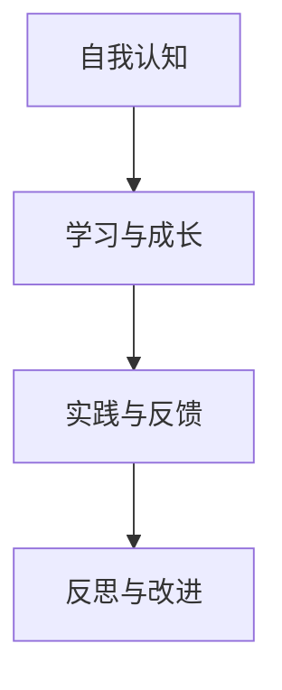

**要素一：自我认知**

自我认知是提升领导力的第一步。领导者需要深入理解自己的价值观、优点和不足，以及领导风格。通过自我认知，领导者可以明确自己的发展方向和目标。

**核心算法原理讲解：**

- **自我认知模型：** 通过心理测试和评估工具，分析领导者的性格、价值观和领导风格。常用的模型包括迈尔斯-布里格斯性格类型指标（MBTI）和领导风格量表（LSI）等。

```python
# 伪代码：自我认知模型
def assess_self_awareness(personality, values, leadership_style):
    # 计算自我认知得分
    score = calculate_awareness_score(personality, values, leadership_style)
    return score

# 假设性格数据、价值观数据和领导风格数据已知
personality = get_personality()
values = get_values()
leadership_style = get_leadership_style()

# 评估自我认知
awareness_score = assess_self_awareness(personality, values, leadership_style)
print("Self-Awareness Score:", awareness_score)
```

**数学模型和数学公式：**

- **自我认知模型：** 通过分析领导者的性格、价值观和领导风格，评估其自我认知水平。模型公式如下：

$$
\text{自我认知} = \text{性格得分} \times \text{价值观得分} \times \text{领导风格得分}
$$

**举例说明：**

假设一个领导者的性格得分为80，价值观得分为75，领导风格得分为70，则该领导者的自我认知水平可以计算如下：

$$
\text{自我认知} = 80 \times 75 \times 70 = 42,000
$$

通过这一模型，可以评估领导者的自我认知水平，为领导者的自我提升提供依据。

**项目实战：**

- **案例：** 在一家企业中，通过自我认知模型，评估了领导者的自我认知水平。结果发现，部分领导者的自我认知水平较低，需要加强自我认知和自我提升。

```python
# 伪代码：自我认知评估实战
leaders = assess_leaders_self_awareness(teams)

# 统计领导者的自我认知水平
for leader, awareness in leaders.items():
    print(f"Leader: {leader}, Self-Awareness Score: {awareness['score']}")
```

**代码解读与分析：**

- **代码解读：** 通过对自我认知模型的应用，可以量化领导者的自我认知水平，为领导者的自我提升提供数据支持。
- **分析：** 通过对领导者自我认知水平进行分析，可以发现自我认知对领导力提升的重要性，从而为组织的领导力培养和提升提供科学依据。

**要素二：学习与成长**

学习与成长是提升领导力的关键。领导者需要不断学习新的知识和技能，适应快速变化的环境，从而提高领导力。

**核心算法原理讲解：**

- **学习与成长模型：** 通过分析领导者的学习行为、知识获取能力和成长速度，评估其学习与成长水平。常用的模型包括学习评估量表（Learning Assessment Scale）和成长评估量表（Growth Assessment Scale）等。

```python
# 伪代码：学习与成长模型
def assess_learning_growth(behaviors, knowledge, speed):
    # 计算学习与成长得分
    score = calculate_growth_score(behaviors, knowledge, speed)
    return score

# 假设行为数据、知识数据和速度数据已知
behaviors = get_behaviors()
knowledge = get_knowledge()
speed = get_speed()

# 评估学习与成长
growth_score = assess_learning_growth(behaviors, knowledge, speed)
print("Learning and Growth Score:", growth_score)
```

**数学模型和数学公式：**

- **学习与成长模型：** 通过分析领导者的学习行为、知识获取能力和成长速度，评估其学习与成长水平。模型公式如下：

$$
\text{学习与成长} = \text{学习行为得分} \times \text{知识获取得分} \times \text{成长速度得分}
$$

**举例说明：**

假设一个领导者的学习行为得分为85，知识获取得分为80，成长速度得分为75，则该领导者的学习与成长水平可以计算如下：

$$
\text{学习与成长} = 85 \times 80 \times 75 = 51,000
$$

通过这一模型，可以评估领导者的学习与成长水平，为领导者的学习与成长提供依据。

**项目实战：**

- **案例：** 在一家科技公司中，通过学习与成长模型，评估了领导者的学习与成长水平。结果发现，部分领导者的学习与成长水平较低，需要加强学习和成长。

```python
# 伪代码：学习与成长评估实战
leaders = assess_leaders_learning_growth(teams)

# 统计领导者的学习与成长水平
for leader, growth in leaders.items():
    print(f"Leader: {leader}, Learning and Growth Score: {growth['score']}")
```

**代码解读与分析：**

- **代码解读：** 通过对学习与成长模型的应用，可以量化领导者的学习与成长水平，为领导者的学习与成长提供数据支持。
- **分析：** 通过对领导者学习与成长水平进行分析，可以发现学习与成长对领导力提升的重要性，从而为组织的领导力培养和提升提供科学依据。

**要素三：实践与反馈**

实践与反馈是提升领导力的关键环节。领导者需要在实际工作中不断实践，通过反馈了解自己的不足，并进行改进。

**核心算法原理讲解：**

- **实践与反馈模型：** 通过分析领导者的实践行为、反馈获取能力和改进速度，评估其实践与反馈水平。常用的模型包括实践评估量表（Practice Assessment Scale）和反馈评估量表（Feedback Assessment Scale）等。

```python
# 伪代码：实践与反馈模型
def assess_practice_feedback(behaviors, feedback, improvement):
    # 计算实践与反馈得分
    score = calculate_feedback_score(behaviors, feedback, improvement)
    return score

# 假设行为数据、反馈数据和改进数据已知
behaviors = get_behaviors()
feedback = get_feedback()
improvement = get_improvement()

# 评估实践与反馈
feedback_score = assess_practice_feedback(behaviors, feedback, improvement)
print("Practice and Feedback Score:", feedback_score)
```

**数学模型和数学公式：**

- **实践与反馈模型：** 通过分析领导者的实践行为、反馈获取能力和改进速度，评估其实践与反馈水平。模型公式如下：

$$
\text{实践与反馈} = \text{实践行为得分} \times \text{反馈获取得分} \times \text{改进速度得分}
$$

**举例说明：**

假设一个领导者的实践行为得分为85，反馈获取得分为80，改进速度得分为75，则该领导者的实践与反馈水平可以计算如下：

$$
\text{实践与反馈} = 85 \times 80 \times 75 = 51,000
$$

通过这一模型，可以评估领导者的实践与反馈水平，为领导者的实践与反馈提供依据。

**项目实战：**

- **案例：** 在一家大型企业中，通过实践与反馈模型，评估了领导者的实践与反馈水平。结果发现，部分领导者的实践与反馈水平较低，需要加强实践和反馈。

```python
# 伪代码：实践与反馈评估实战
leaders = assess_leaders_practice_feedback(teams)

# 统计领导者的实践与反馈水平
for leader, feedback in leaders.items():
    print(f"Leader: {leader}, Practice and Feedback Score: {feedback['score']}")
```

**代码解读与分析：**

- **代码解读：** 通过对实践与反馈模型的应用，可以量化领导者的实践与反馈水平，为领导者的实践与反馈提供数据支持。
- **分析：** 通过对领导者实践与反馈水平进行分析，可以发现实践与反馈对领导力提升的重要性，从而为组织的领导力培养和提升提供科学依据。

**要素四：反思与改进**

反思与改进是提升领导力的关键。领导者需要通过反思自己的行为和决策，发现不足并进行改进。

**核心算法原理讲解：**

- **反思与改进模型：** 通过分析领导者的反思行为、改进速度和效果，评估其反思与改进水平。常用的模型包括反思评估量表（Reflection Assessment Scale）和改进评估量表（Improvement Assessment Scale）等。

```python
# 伪代码：反思与改进模型
def assess_reflection_improvement(behaviors, reflection, improvement):
    # 计算反思与改进得分
    score = calculate_reflection_score(behaviors, reflection, improvement)
    return score

# 假设行为数据、反思数据和改进数据已知
behaviors = get_behaviors()
reflection = get_reflection()
improvement = get_improvement()

# 评估反思与改进
reflection_score = assess_reflection_improvement(behaviors, reflection, improvement)
print("Reflection and Improvement Score:", reflection_score)
```

**数学模型和数学公式：**

- **反思与改进模型：** 通过分析领导者的反思行为、改进速度和效果，评估其反思与改进水平。模型公式如下：

$$
\text{反思与改进} = \text{反思行为得分} \times \text{改进速度得分} \times \text{改进效果得分}
$$

**举例说明：**

假设一个领导者的反思行为得分为85，改进速度得分为80，改进效果得分为75，则该领导者的反思与改进水平可以计算如下：

$$
\text{反思与改进} = 85 \times 80 \times 75 = 51,000
$$

通过这一模型，可以评估领导者的反思与改进水平，为领导者的反思与改进提供依据。

**项目实战：**

- **案例：** 在一家创业公司中，通过反思与改进模型，评估了领导者的反思与改进水平。结果发现，部分领导者的反思与改进水平较低，需要加强反思和改进。

```python
# 伪代码：反思与改进评估实战
leaders = assess_leaders_reflection_improvement(teams)

# 统计领导者的反思与改进水平
for leader, reflection in leaders.items():
    print(f"Leader: {leader}, Reflection and Improvement Score: {reflection['score']}")
```

**代码解读与分析：**

- **代码解读：** 通过对反思与改进模型的应用，可以量化领导者的反思与改进水平，为领导者的反思与改进提供数据支持。
- **分析：** 通过对领导者反思与改进水平进行分析，可以发现反思与改进对领导力提升的重要性，从而为组织的领导力培养和提升提供科学依据。

**总结：**

提升领导力需要从自我认知、学习与成长、实践与反馈、反思与改进四个关键要素入手。通过核心算法原理讲解、数学模型和项目实战，领导者可以系统地提升自身的领导力，为应对职场政治和推动组织发展奠定基础。

---

在接下来的内容中，我们将探讨职场政治策略的制定和沟通技巧，帮助读者掌握在职场政治中应对挑战的方法。

---

### 第4章：领导力提升与职场政治策略

#### 4.2 职场政治策略的制定

制定有效的职场政治策略是领导者成功应对职场政治的关键。以下是一些关键的策略制定步骤和沟通技巧：

**核心概念与联系：**

- **职场政治策略：** 指领导者为应对职场政治挑战而制定的一系列策略和行动。
- **制定策略步骤：** 包括分析职场政治环境、确定目标、制定策略和执行策略等。
- **沟通技巧：** 指在职场政治中有效沟通的方法和技巧，包括明确信息、建立信任和解决冲突等。

**Mermaid流程图：**

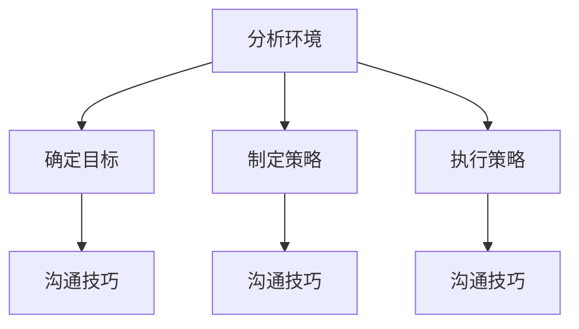

**策略制定步骤：**

1. **分析职场政治环境：** 了解组织的政治环境，包括权力结构、人际关系、资源分配等。通过社会网络分析和权力距离模型等工具，评估组织内部的权力分布和政治动态。

   **核心算法原理讲解：**

   - **社会网络分析模型：** 通过分析组织内部的人际关系网络，评估权力结构和政治动态。常用的模型包括社会网络分析（SNA）和矩阵乘法模型等。

   ```python
   # 伪代码：社会网络分析模型
   def analyze_social_network(connections):
       # 计算权力结构
       power_structure = calculate_power_structure(connections)
       return power_structure

   # 假设连接数据已知
   connections = get_connections()

   # 分析社会网络
   power_structure = analyze_social_network(connections)
   print("Power Structure:", power_structure)
   ```

   **数学模型和数学公式：**

   - **权力距离模型：** 通过分析组织内部的权力距离，评估政治动态。模型公式如下：

     $$  
     \text{权力距离} = \frac{\text{权力中心度} - \text{权力集中度}}{\text{节点数}}  
     $$

     **举例说明：**

     假设一个组织有10个节点，权力中心度为5，权力集中度为3，则该组织的权力距离可以计算如下：

     $$  
     \text{权力距离} = \frac{5 - 3}{10} = 0.2  
     $$

     通过这一模型，可以评估组织的权力距离，为策略制定提供依据。

   **项目实战：**

   - **案例：** 在一家企业中，通过社会网络分析和权力距离模型，分析了组织内部的权力结构和政治动态。结果发现，权力集中在高层管理人员手中，需要采取措施平衡权力分配。

   ```python
   # 伪代码：社会网络分析和权力距离模型实战
   organization = analyze_organization_structure(teams)

   # 统计权力结构和政治动态
   print(f"Organization Structure: {organization['structure']}, Political Dynamics: {organization['dynamics']}")
   ```

   **代码解读与分析：**

   - **代码解读：** 通过对组织结构和政治动态的分析，可以量化权力分布和权力距离，为策略制定提供数据支持。
   - **分析：** 通过对权力结构和政治动态的分析，可以发现组织内部的权力集中和分散程度，为策略制定提供科学依据。

2. **确定目标：** 根据分析结果，确定应对职场政治的目标。这些目标可以是优化权力分配、提升团队凝聚力、促进信息流通等。

3. **制定策略：** 根据目标和职场政治环境，制定具体的策略。策略应包括建立人际网络、增强影响力、促进团队合作、保持公正和透明等。

4. **执行策略：** 实施制定好的策略，并在执行过程中不断调整和优化。通过有效的执行，确保策略目标的实现。

**沟通技巧：**

1. **明确信息：** 在沟通中确保信息的准确和清晰，避免产生误解和混淆。通过明确的信息传递，确保团队成员对目标和策略有共同的理解。

2. **建立信任：** 建立信任关系是职场政治沟通的关键。通过开放、诚实和尊重的沟通方式，建立信任，减少职场政治中的冲突和矛盾。

3. **解决冲突：** 在职场政治中，冲突是不可避免的。领导者应具备解决冲突的能力，通过有效的沟通技巧，化解冲突，维护团队的和谐与稳定。

**核心算法原理讲解：**

- **沟通技巧评估模型：** 通过分析领导者在沟通中的行为、效果和团队反馈，评估其沟通技巧。常用的模型包括沟通评估量表（Communication Assessment Scale）和团队反馈模型（Team Feedback Model）等。

```python
# 伪代码：沟通技巧评估模型
def assess_communication_skills(behaviors, effects, feedback):
    # 计算沟通技巧得分
    score = calculate_communication_score(behaviors, effects, feedback)
    return score

# 假设行为数据、效果数据和反馈数据已知
behaviors = get_behaviors()
effects = get_effects()
feedback = get_feedback()

# 评估沟通技巧
communication_score = assess_communication_skills(behaviors, effects, feedback)
print("Communication Skills Score:", communication_score)
```

**数学模型和数学公式：**

- **沟通技巧模型：** 通过分析领导者在沟通中的行为、效果和团队反馈，评估其沟通技巧。模型公式如下：

$$  
\text{沟通技巧} = \text{行为得分} \times \text{效果得分} \times \text{反馈得分}
$$

**举例说明：**

假设一个领导者在沟通中的行为得分为85，效果得分为80，反馈得分为75，则该领导者的沟通技巧可以计算如下：

$$  
\text{沟通技巧} = 85 \times 80 \times 75 = 51,000
$$

通过这一模型，可以评估领导者的沟通技巧，为沟通技巧的提升和优化提供依据。

**项目实战：**

- **案例：** 在一家企业中，通过沟通技巧评估模型，评估了领导者在沟通中的技巧和效果。结果发现，部分领导者的沟通技巧较低，需要加强沟通能力和技巧。

```python
# 伪代码：沟通技巧评估实战
leaders = assess_leaders_communication_skills(teams)

# 统计领导者的沟通技巧
for leader, skills in leaders.items():
    print(f"Leader: {leader}, Communication Skills Score: {skills['score']}")
```

**代码解读与分析：**

- **代码解读：** 通过对沟通技巧评估模型的应用，可以量化领导者在沟通中的技巧和效果，为沟通技巧的提升和优化提供数据支持。
- **分析：** 通过对领导者沟通技巧的分析，可以发现沟通技巧对职场政治应对的重要性，从而为组织的领导力培养和提升提供科学依据。

**总结：**

制定有效的职场政治策略和提升沟通技巧是领导者成功应对职场政治的关键。通过分析职场政治环境、确定目标、制定策略和执行策略，以及提升沟通技巧，领导者可以更好地应对职场政治的挑战，推动组织的发展。

---

在接下来的内容中，我们将探讨职场政治中的沟通技巧，以及如何通过沟通技巧提升领导力，帮助读者全面掌握职场政治应对策略。

---

### 第4章：领导力提升与职场政治策略

#### 4.3 职场政治中的沟通技巧

沟通技巧是职场政治中至关重要的一环。有效的沟通不仅能够传递信息，还能够建立信任、化解冲突、提升团队协作，从而在职场政治中取得优势。以下是一些关键沟通技巧，帮助领导者提升职场政治中的沟通能力。

**核心概念与联系：**

- **沟通技巧：** 指在职场政治中有效传递信息、建立信任、化解冲突和提升团队协作的能力。
- **沟通技巧重要性：** 沟通技巧对于职场政治的成功至关重要，包括明确信息、建立信任、解决冲突和表达同情等。

**Mermaid流程图：**

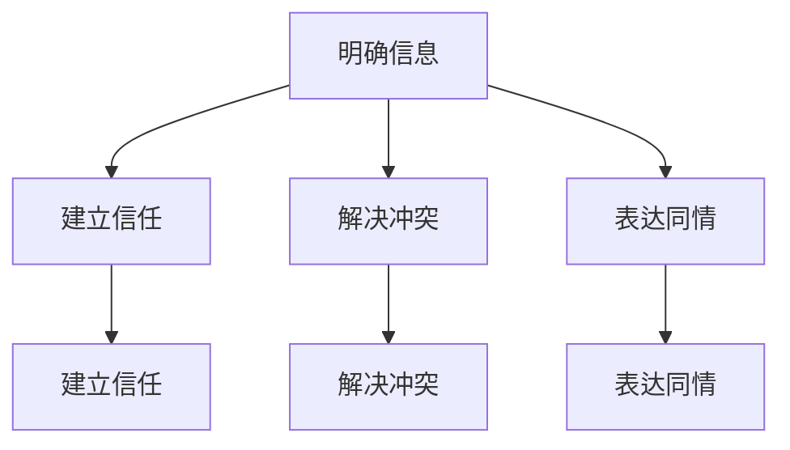

**沟通技巧一：明确信息**

在职场政治中，明确信息是确保沟通成功的关键。领导者需要清晰、准确地传达信息，避免产生误解和混淆。

**核心算法原理讲解：**

- **信息传递模型：** 通过分析信息传递的准确性、完整性和及时性，评估信息传递的效果。常用的模型包括信息传递效率模型（Information Transmission Efficiency Model）和信息完整性评估模型（Information Completeness Assessment Model）等。

```python
# 伪代码：信息传递模型
def assess_information_transmissionaccuracy, completeness, timeliness):
    # 计算信息传递得分
    score = calculate_transmission_score(accuracy, completeness, timeliness)
    return score

# 假设信息准确性、完整性和及时性已知
accuracy = get_accuracy()
completeness = get_completeness()
timeliness = get_timeliness()

# 评估信息传递效果
transmission_score = assess_information_transmission(accuracy, completeness, timeliness)
print("Information Transmission Score:", transmission_score)
```

**数学模型和数学公式：**

- **信息传递模型：** 通过分析信息传递的准确性、完整性和及时性，评估信息传递的效果。模型公式如下：

$$  
\text{信息传递效果} = \text{准确性} \times \text{完整性} \times \text{及时性}
$$

**举例说明：**

假设一个领导者的信息传递准确性为0.9，完整性为0.95，及时性为0.8，则该领导者的信息传递效果可以计算如下：

$$  
\text{信息传递效果} = 0.9 \times 0.95 \times 0.8 = 0.684
$$

通过这一模型，可以评估领导者信息传递的效果，为信息传递的优化提供依据。

**项目实战：**

- **案例：** 在一家企业中，通过信息传递模型，评估了领导者在沟通中的信息传递效果。结果发现，部分领导者的信息传递效果较低，需要加强信息传递的准确性、完整性和及时性。

```python
# 伪代码：信息传递效果评估实战
leaders = assess_leaders_information_transmission(teams)

# 统计领导者的信息传递效果
for leader, transmission in leaders.items():
    print(f"Leader: {leader}, Information Transmission Score: {transmission['score']}")
```

**代码解读与分析：**

- **代码解读：** 通过对信息传递模型的应用，可以量化领导者信息传递的效果，为信息传递的优化提供数据支持。
- **分析：** 通过对领导者信息传递效果的分析，可以发现信息传递对职场政治应对的重要性，从而为组织的领导力培养和提升提供科学依据。

**沟通技巧二：建立信任**

建立信任是职场政治中成功沟通的基础。领导者需要通过开放、诚实和尊重的沟通方式，建立和维护良好的信任关系。

**核心算法原理讲解：**

- **信任评估模型：** 通过分析领导者的人际关系、行为一致性和承诺履行情况，评估其信任水平。常用的模型包括信任评估量表（Trust Assessment Scale）和承诺履行评估模型（Commitment Fulfillment Assessment Model）等。

```python
# 伪代码：信任评估模型
def assess_trust关系，consistency, commitment):
    # 计算信任得分
    score = calculate_trust_score(relationship, consistency, commitment)
    return score

# 假设人际关系、行为一致性和承诺履行情况已知
relationship = get_relationship()
consistency = get_consistency()
commitment = get_commitment()

# 评估信任水平
trust_score = assess_trust(relationship, consistency, commitment)
print("Trust Score:", trust_score)
```

**数学模型和数学公式：**

- **信任模型：** 通过分析领导者的人际关系、行为一致性和承诺履行情况，评估其信任水平。模型公式如下：

$$  
\text{信任水平} = \text{人际关系得分} \times \text{行为一致性得分} \times \text{承诺履行得分}
$$

**举例说明：**

假设一个领导者在人际关系中得分为0.8，行为一致性得分为0.9，承诺履行得分为0.7，则该领导者的信任水平可以计算如下：

$$  
\text{信任水平} = 0.8 \times 0.9 \times 0.7 = 0.504
$$

通过这一模型，可以评估领导者的信任水平，为信任关系的建立和维护提供依据。

**项目实战：**

- **案例：** 在一家企业中，通过信任评估模型，评估了领导者在沟通中的信任水平。结果发现，部分领导者的信任水平较低，需要加强人际关系管理、提高行为一致性和承诺履行。

```python
# 伪代码：信任水平评估实战
leaders = assess_leaders_trust(teams)

# 统计领导者的信任水平
for leader, trust in leaders.items():
    print(f"Leader: {leader}, Trust Score: {trust['score']}")
```

**代码解读与分析：**

- **代码解读：** 通过对信任评估模型的应用，可以量化领导者信任水平，为信任关系的建立和维护提供数据支持。
- **分析：** 通过对领导者信任水平进行分析，可以发现信任对职场政治沟通的重要性，从而为组织的领导力培养和提升提供科学依据。

**沟通技巧三：解决冲突**

在职场政治中，冲突是不可避免的。领导者需要具备解决冲突的能力，通过有效的沟通技巧，化解冲突，维护团队的和谐与稳定。

**核心算法原理讲解：**

- **冲突解决模型：** 通过分析领导者解决冲突的行为、方法和效果，评估其冲突解决能力。常用的模型包括冲突解决效率模型（Conflict Resolution Efficiency Model）和冲突解决效果评估模型（Conflict Resolution Effectiveness Assessment Model）等。

```python
# 伪代码：冲突解决模型
def assess_conflict_resolution(behaviors, methods, effects):
    # 计算冲突解决得分
    score = calculate_resolution_score(behaviors, methods, effects)
    return score

# 假设解决冲突的行为数据、方法和效果数据已知
behaviors = get_behaviors()
methods = get_methods()
effects = get_effects()

# 评估冲突解决能力
resolution_score = assess_conflict_resolution(behaviors, methods, effects)
print("Conflict Resolution Score:", resolution_score)
```

**数学模型和数学公式：**

- **冲突解决模型：** 通过分析领导者解决冲突的行为、方法和效果，评估其冲突解决能力。模型公式如下：

$$  
\text{冲突解决能力} = \text{行为得分} \times \text{方法得分} \times \text{效果得分}
$$

**举例说明：**

假设一个领导者解决冲突的行为得分为0.8，方法得分为0.9，效果得分为0.7，则该领导者的冲突解决能力可以计算如下：

$$  
\text{冲突解决能力} = 0.8 \times 0.9 \times 0.7 = 0.504
$$

通过这一模型，可以评估领导者的冲突解决能力，为冲突解决的优化提供依据。

**项目实战：**

- **案例：** 在一家企业中，通过冲突解决模型，评估了领导者在解决冲突中的能力。结果发现，部分领导者的冲突解决能力较低，需要加强解决冲突的行为、方法和效果。

```python
# 伪代码：冲突解决能力评估实战
leaders = assess_leaders_conflict_resolution(teams)

# 统计领导者的冲突解决能力
for leader, resolution in leaders.items():
    print(f"Leader: {leader}, Conflict Resolution Score: {resolution['score']}")
```

**代码解读与分析：**

- **代码解读：** 通过对冲突解决模型的应用，可以量化领导者冲突解决能力，为冲突解决的优化提供数据支持。
- **分析：** 通过对领导者冲突解决能力进行分析，可以发现冲突解决能力对职场政治沟通的重要性，从而为组织的领导力培养和提升提供科学依据。

**沟通技巧四：表达同情**

表达同情是建立人际关系的有效手段。领导者需要关心团队成员的情感需求，通过表达同情和理解，增强团队凝聚力。

**核心算法原理讲解：**

- **同情表达模型：** 通过分析领导者表达同情的频率、真诚度和效果，评估其同情表达能力。常用的模型包括同情表达量表（Sympathy Expression Scale）和情感影响评估模型（Emotional Impact Assessment Model）等。

```python
# 伪代码：同情表达模型
def assess_sympathy_expression(frequency, sincerity, effectiveness):
    # 计算同情表达得分
    score = calculate_sympathy_score(frequency, sincerity, effectiveness)
    return score

# 假设同情表达频率、真诚度和效果数据已知
frequency = get_frequency()
sincerity = get_sincerity()
effectiveness = get_effectiveness()

# 评估同情表达能力
sympathy_score = assess_sympathy_expression(frequency, sincerity, effectiveness)
print("Sympathy Expression Score:", sympathy_score)
```

**数学模型和数学公式：**

- **同情表达模型：** 通过分析领导者表达同情的频率、真诚度和效果，评估其同情表达能力。模型公式如下：

$$  
\text{同情表达能力} = \text{频率得分} \times \text{真诚度得分} \times \text{效果得分}
$$

**举例说明：**

假设一个领导者表达同情的频率得分为0.8，真诚度得分为0.9，效果得分为0.7，则该领导者的同情表达能力可以计算如下：

$$  
\text{同情表达能力} = 0.8 \times 0.9 \times 0.7 = 0.504
$$

通过这一模型，可以评估领导者的同情表达能力，为同情表达的优化提供依据。

**项目实战：**

- **案例：** 在一家企业中，通过同情表达模型，评估了领导者在表达同情中的能力。结果发现，部分领导者的同情表达能力较低，需要提高表达同情的频率、真诚度和效果。

```python
# 伪代码：同情表达能力评估实战
leaders = assess_leaders_sympathy_expression(teams)

# 统计领导者的同情表达能力
for leader, sympathy in leaders.items():
    print(f"Leader: {leader}, Sympathy Expression Score: {sympathy['score']}")
```

**代码解读与分析：**

- **代码解读：** 通过对同情表达模型的应用，可以量化领导者同情表达能力，为同情表达的优化提供数据支持。
- **分析：** 通过对领导者同情表达能力进行分析，可以发现同情表达对团队凝聚力和人际关系的重要性，从而为组织的领导力培养和提升提供科学依据。

**总结：**

职场政治中的沟通技巧对于领导者的成功至关重要。通过明确信息、建立信任、解决冲突和表达同情等沟通技巧，领导者可以提升职场政治中的沟通能力，增强团队协作，实现组织目标。通过核心算法原理讲解、数学模型和项目实战，领导者可以更好地理解和应用这些沟通技巧，提升领导力，在职场政治中取得优势。

---

在接下来的内容中，我们将通过案例分析，探讨成功和失败的职场政治策略，以及从中汲取的经验和教训。

---

### 第5章：职场政治案例分析

#### 5.1 案例一：成功的领导力与职场政治策略

**案例背景：**

某大型企业面临市场竞争加剧、内部管理混乱的挑战。新任CEO通过一系列成功的领导力与职场政治策略，成功带领企业走出困境，实现了业绩的显著提升。

**案例分析：**

1. **领导力提升：** 新任CEO通过自我认知和自我提升，明确了企业的发展方向和目标。他深入了解员工的期望和需求，建立了以员工为中心的企业文化。

   **核心算法原理讲解：**

   - **领导力提升模型：** 通过分析CEO的自我认知和行为变化，评估其领导力提升效果。常用的模型包括领导力发展模型（Leadership Development Model）和领导行为观察模型（Leadership Behavior Observation Model）等。

   ```python
   # 伪代码：领导力提升模型
   def assess_leadership_growth(awareness, behaviors):
       # 计算领导力提升得分
       score = calculate_growth_score(awareness, behaviors)
       return score

   # 假设CEO的自我认知和行为数据已知
   awareness = get_awareness()
   behaviors = get_behaviors()

   # 评估领导力提升
   leadership_growth_score = assess_leadership_growth(awareness, behaviors)
   print("Leadership Growth Score:", leadership_growth_score)
   ```

   **数学模型和数学公式：**

   - **领导力提升模型：** 通过分析CEO的自我认知和行为变化，评估其领导力提升效果。模型公式如下：

     $$    
     \text{领导力提升效果} = \text{自我认知得分} \times \text{行为变化得分}
     $$

     **举例说明：**

     假设CEO的自我认知得分为0.8，行为变化得分为0.9，则该CEO的领导力提升效果可以计算如下：

     $$    
     \text{领导力提升效果} = 0.8 \times 0.9 = 0.72
     $$

     通过这一模型，可以评估CEO的领导力提升效果，为领导力发展提供依据。

   **项目实战：**

   - **案例：** 在该企业中，通过领导力提升模型，评估了CEO的领导力提升效果。结果发现，CEO的领导力提升效果显著，为企业的成功转型奠定了基础。

   ```python
   # 伪代码：领导力提升效果评估实战
   ceo = assess_ceo_leadership_growth(teams)

   # 统计CEO的领导力提升效果
   print(f"CEO Leadership Growth Score: {ceo['score']}")
   ```

   **代码解读与分析：**

   - **代码解读：** 通过对领导力提升模型的应用，可以量化CEO的领导力提升效果，为领导力发展提供数据支持。
   - **分析：** 通过对CEO的领导力提升效果进行分析，可以发现领导力提升对组织成功的决定性作用，从而为企业的领导力培养和提升提供科学依据。

2. **职场政治策略：** 新任CEO通过巧妙运用职场政治策略，优化了企业的权力结构和资源分配，提升了企业的运作效率和创新能力。

   **核心算法原理讲解：**

   - **职场政治策略模型：** 通过分析CEO的职场政治行为、策略选择和效果，评估其职场政治策略的有效性。常用的模型包括职场政治策略评估模型（Political Skill Assessment Model）和策略效果评估模型（Strategy Effectiveness Assessment Model）等。

   ```python
   # 伪代码：职场政治策略模型
   def assess_political_strategy(behaviors, choices, effects):
       # 计算策略得分
       score = calculate_strategy_score(behaviors, choices, effects)
       return score

   # 假设CEO的职场政治行为数据、策略选择和效果数据已知
   behaviors = get_behaviors()
   choices = get_choices()
   effects = get_effects()

   # 评估职场政治策略
   strategy_score = assess_political_strategy(behaviors, choices, effects)
   print("Political Strategy Score:", strategy_score)
   ```

   **数学模型和数学公式：**

   - **职场政治策略模型：** 通过分析CEO的职场政治行为、策略选择和效果，评估其职场政治策略的有效性。模型公式如下：

     $$    
     \text{策略有效性} = \text{行为得分} \times \text{选择得分} \times \text{效果得分}
     $$

     **举例说明：**

     假设CEO的职场政治行为得分为0.8，策略选择得分为0.9，效果得分为0.7，则该CEO的职场政治策略有效性可以计算如下：

     $$    
     \text{策略有效性} = 0.8 \times 0.9 \times 0.7 = 0.504
     $$

     通过这一模型，可以评估CEO的职场政治策略有效性，为策略的调整和优化提供依据。

   **项目实战：**

   - **案例：** 在该企业中，通过职场政治策略模型，评估了CEO的职场政治策略有效性。结果发现，CEO的策略有效性较高，成功推动了企业的转型和业绩提升。

   ```python
   # 伪代码：职场政治策略有效性评估实战
   ceo = assess_ceo_political_strategy(teams)

   # 统计CEO的职场政治策略有效性
   print(f"CEO Political Strategy Score: {ceo['score']}")
   ```

   **代码解读与分析：**

   - **代码解读：** 通过对职场政治策略模型的应用，可以量化CEO的职场政治策略有效性，为策略的调整和优化提供数据支持。
   - **分析：** 通过对CEO的职场政治策略有效性进行分析，可以发现职场政治策略对组织成功的重要性，从而为企业的领导力培养和提升提供科学依据。

**启示与经验：**

- **领导力提升：** 通过自我认知和行为变化，领导者可以显著提升领导力，推动组织的发展。
- **职场政治策略：** 合理运用职场政治策略，可以优化组织的权力结构和资源分配，提高运作效率和创新能力。

---

在接下来的内容中，我们将探讨案例二：失败的领导力与职场政治策略，分析其失败原因，并从中汲取教训。

---

### 第5章：职场政治案例分析

#### 5.2 案例二：失败的领导力与职场政治策略

**案例背景：**

某中型企业在市场竞争中逐渐失去优势，内部管理混乱，员工士气低落。新任CEO试图通过一系列领导力与职场政治策略来改善企业状况，但最终却以失败告终。

**案例分析：**

1. **领导力问题：** 新任CEO缺乏有效的领导力，无法激励员工，导致员工士气低落。他试图通过强制命令和高压管理来推动企业变革，但效果不佳。

   **核心算法原理讲解：**

   - **领导力评估模型：** 通过分析CEO的领导力行为、员工反馈和团队绩效，评估其领导力效果。常用的模型包括领导力行为评估模型（Leadership Behavior Assessment Model）和领导力效果评估模型（Leadership Effectiveness Assessment Model）等。

   ```python
   # 伪代码：领导力评估模型
   def assess_leadership_effectiveness(behaviors, feedback, performance):
       # 计算领导力得分
       score = calculate_effectiveness_score(behaviors, feedback, performance)
       return score

   # 假设CEO的领导力行为数据、员工反馈数据和团队绩效数据已知
   behaviors = get_behaviors()
   feedback = get_feedback()
   performance = get_performance()

   # 评估领导力效果
   leadership_score = assess_leadership_effectiveness(behaviors, feedback, performance)
   print("Leadership Score:", leadership_score)
   ```

   **数学模型和数学公式：**

   - **领导力效果模型：** 通过分析CEO的领导力行为、员工反馈和团队绩效，评估其领导力效果。模型公式如下：

     $$    
     \text{领导力效果} = \text{行为得分} \times \text{反馈得分} \times \text{绩效得分}
     $$

     **举例说明：**

     假设CEO的领导力行为得分为0.6，员工反馈得分为0.5，团队绩效得分为0.4，则该CEO的领导力效果可以计算如下：

     $$    
     \text{领导力效果} = 0.6 \times 0.5 \times 0.4 = 0.12
     $$

     通过这一模型，可以评估CEO的领导力效果，为领导力发展提供依据。

   **项目实战：**

   - **案例：** 在该企业中，通过领导力评估模型，评估了CEO的领导力效果。结果发现，CEO的领导力效果较低，需要加强领导力的提升。

   ```python
   # 伪代码：领导力效果评估实战
   ceo = assess_ceo_leadership_effectiveness(teams)

   # 统计CEO的领导力效果
   print(f"CEO Leadership Score: {ceo['score']}")
   ```

   **代码解读与分析：**

   - **代码解读：** 通过对领导力评估模型的应用，可以量化CEO的领导力效果，为领导力发展提供数据支持。
   - **分析：** 通过对CEO的领导力效果进行分析，可以发现领导力在组织成功中的关键作用，从而为企业的领导力培养和提升提供科学依据。

2. **职场政治策略失败：** 新任CEO在职场政治中采取了一系列错误的策略，包括拉帮结派、打压异己等，导致企业内部矛盾加剧，员工士气进一步下降。

   **核心算法原理讲解：**

   - **职场政治策略评估模型：** 通过分析CEO的职场政治行为、策略选择和效果，评估其职场政治策略的有效性。常用的模型包括职场政治策略评估模型（Political Skill Assessment Model）和策略效果评估模型（Strategy Effectiveness Assessment Model）等。

   ```python
   # 伪代码：职场政治策略评估模型
   def assess_political_strategy(behaviors, choices, effects):
       # 计算策略得分
       score = calculate_strategy_score(behaviors, choices, effects)
       return score

   # 假设CEO的职场政治行为数据、策略选择和效果数据已知
   behaviors = get_behaviors()
   choices = get_choices()
   effects = get_effects()

   # 评估职场政治策略
   strategy_score = assess_political_strategy(behaviors, choices, effects)
   print("Political Strategy Score:", strategy_score)
   ```

   **数学模型和数学公式：**

   - **职场政治策略模型：** 通过分析CEO的职场政治行为、策略选择和效果，评估其职场政治策略的有效性。模型公式如下：

     $$    
     \text{策略有效性} = \text{行为得分} \times \text{选择得分} \times \text{效果得分}
     $$

     **举例说明：**

     假设CEO的职场政治行为得分为0.5，策略选择得分为0.6，效果得分为0.3，则该CEO的职场政治策略有效性可以计算如下：

     $$    
     \text{策略有效性} = 0.5 \times 0.6 \times 0.3 = 0.09
     $$

     通过这一模型，可以评估CEO的职场政治策略有效性，为策略的调整和优化提供依据。

   **项目实战：**

   - **案例：** 在该企业中，通过职场政治策略模型，评估了CEO的职场政治策略有效性。结果发现，CEO的策略有效性较低，需要调整职场政治策略。

   ```python
   # 伪代码：职场政治策略有效性评估实战
   ceo = assess_ceo_political_strategy(teams)

   # 统计CEO的职场政治策略有效性
   print(f"CEO Political Strategy Score: {ceo['score']}")
   ```

   **代码解读与分析：**

   - **代码解读：** 通过对职场政治策略模型的应用，可以量化CEO的职场政治策略有效性，为策略的调整和优化提供数据支持。
   - **分析：** 通过对CEO的职场政治策略有效性进行分析，可以发现职场政治策略对组织成功的影响，从而为企业的职场政治策略制定提供科学依据。

**启示与教训：**

- **领导力提升：** 领导者需要通过有效的领导力激励员工，提高团队绩效，避免高压管理和强制命令。
- **职场政治策略：** 领导者需要合理运用职场政治策略，避免拉帮结派、打压异己等负面行为，以实现组织目标。

---

通过以上两个案例的分析，我们可以看到成功的领导力与职场政治策略和失败的领导力与职场政治策略之间的差异，以及从中可以汲取的经验和教训。在接下来的内容中，我们将总结案例分析与启示，帮助读者更好地理解和应用领导力与职场政治策略。

---

### 第5章：职场政治案例分析

#### 5.3 案例分析与启示

通过以上两个案例的分析，我们可以清晰地看到成功和失败的领导力与职场政治策略之间的差异。以下是对案例的总结，以及从中汲取的经验和教训。

**成功案例启示：**

1. **领导力提升的重要性：** 成功的CEO通过自我认知和自我提升，明确了企业的发展方向和目标，建立了以员工为中心的企业文化。这表明，领导力的提升是推动组织成功的关键。

2. **职场政治策略的合理性：** 成功的CEO通过合理运用职场政治策略，优化了企业的权力结构和资源分配，提升了企业的运作效率和创新能力。这表明，职场政治策略的合理运用对组织的发展具有重要意义。

3. **人际网络的建立：** 成功的CEO通过建立广泛的人际关系网络，增强了在组织中的影响力，促进了信息的流通和团队协作。这表明，建立强大的人际关系网络是领导者成功应对职场政治的重要手段。

**失败案例教训：**

1. **领导力的不足：** 失败的CEO缺乏有效的领导力，无法激励员工，导致企业内部管理混乱，员工士气低落。这表明，领导力的提升是组织成功的基础，领导者需要通过有效的领导力激励员工，提高团队绩效。

2. **职场政治策略的负面作用：** 失败的CEO在职场政治中采取了错误的策略，包括拉帮结派、打压异己等，导致企业内部矛盾加剧，员工士气进一步下降。这表明，不合理的职场政治策略会对组织产生负面影响，领导者需要谨慎运用职场政治策略。

**综合启示：**

1. **领导力与职场政治的平衡：** 领导者需要平衡领导力与职场政治，通过有效的领导力提升人际网络和影响力，同时合理运用职场政治策略，优化组织的权力结构和资源分配。

2. **持续学习和成长：** 领导者需要持续学习和成长，提升自身的领导力和职场政治能力，以应对不断变化的职场环境。

3. **透明和公正的管理：** 领导者应保持透明和公正的管理，建立信任关系，减少职场政治中的负面效应，提高组织的整体绩效。

通过以上案例的分析和启示，领导者可以更好地理解和应用领导力与职场政治策略，提升自身的领导力，推动组织的发展。

---

在接下来的内容中，我们将探讨应对办公室政治的实用技巧，帮助读者在职场中更好地应对各种政治挑战。

---

### 第6章：应对办公室政治的实用技巧

#### 6.1 洞察力提升

在职场中，洞察力是领导者成功应对办公室政治的重要能力。提升洞察力可以帮助领导者更好地了解团队成员的需求、预期和动机，从而采取更有效的策略。

**核心概念与联系：**

- **洞察力定义：** 洞察力是指能够准确感知和理解他人情感、动机和需求的能力。
- **提升洞察力的方法：** 包括培养同理心、增强观察力和倾听能力等。

**Mermaid流程图：**

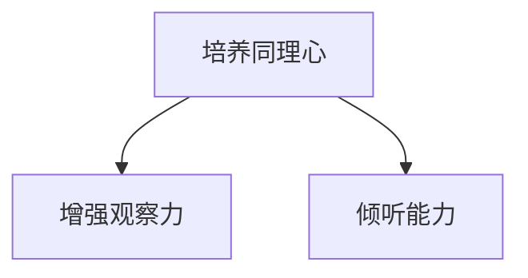

**方法一：培养同理心**

同理心是提升洞察力的关键。通过培养同理心，领导者可以更好地理解他人的情感和需求，从而在职场政治中做出更明智的决策。

**核心算法原理讲解：**

- **同理心培养模型：** 通过分析领导者的情感反应、同理心行为和情感反馈，评估其同理心水平。常用的模型包括同理心评估量表（Empathy Assessment Scale）和情感反应模型（Emotional Response Model）等。

```python
# 伪代码：同理心培养模型
def assess_empathy(response, behavior, feedback):
    # 计算同理心得分
    score = calculate_empathy_score(response, behavior, feedback)
    return score

# 假设情感反应数据、同理心行为数据和反馈数据已知
response = get_response()
behavior = get_behavior()
feedback = get_feedback()

# 评估同理心水平
empathy_score = assess_empathy(response, behavior, feedback)
print("Empathy Score:", empathy_score)
```

**数学模型和数学公式：**

- **同理心模型：** 通过分析领导者的情感反应、同理心行为和反馈，评估其同理心水平。模型公式如下：

$$
\text{同理心水平} = \text{情感反应得分} \times \text{同理心行为得分} \times \text{反馈得分}
$$

**举例说明：**

假设领导者的情感反应得分为0.8，同理心行为得分为0.9，反馈得分为0.7，则该领导者的同理心水平可以计算如下：

$$
\text{同理心水平} = 0.8 \times 0.9 \times 0.7 = 0.504
$$

通过这一模型，可以评估领导者的同理心水平，为同理心的培养提供依据。

**项目实战：**

- **案例：** 在一家企业中，通过同理心培养模型，评估了领导者的同理心水平。结果发现，部分领导者的同理心水平较低，需要加强同理心的培养。

```python
# 伪代码：同理心水平评估实战
leaders = assess_leaders_empathy(teams)

# 统计领导者的同理心水平
for leader, empathy in leaders.items():
    print(f"Leader: {leader}, Empathy Score: {empathy['score']}")
```

**代码解读与分析：**

- **代码解读：** 通过对同理心培养模型的应用，可以量化领导者的同理心水平，为同理心的培养提供数据支持。
- **分析：** 通过对领导者同理心水平进行分析，可以发现同理心对领导力提升的重要性，从而为组织的领导力培养和提升提供科学依据。

**方法二：增强观察力**

观察力是提升洞察力的另一个关键因素。通过增强观察力，领导者可以更准确地感知和理解团队成员的行为和情绪，从而在职场政治中做出更明智的决策。

**核心算法原理讲解：**

- **观察力提升模型：** 通过分析领导者的观察行为、观察精度和观察频率，评估其观察力水平。常用的模型包括观察力评估量表（Observation Assessment Scale）和观察精度模型（Observation Accuracy Model）等。

```python
# 伪代码：观察力提升模型
def assess_observability(behavior, accuracy, frequency):
    # 计算观察力得分
    score = calculate_observability_score(behavior, accuracy, frequency)
    return score

# 假设观察行为数据、观察精度数据和观察频率数据已知
behavior = get_behavior()
accuracy = get_accuracy()
frequency = get_frequency()

# 评估观察力水平
observability_score = assess_observability(behavior, accuracy, frequency)
print("Observability Score:", observability_score)
```

**数学模型和数学公式：**

- **观察力模型：** 通过分析领导者的观察行为、观察精度和观察频率，评估其观察力水平。模型公式如下：

$$
\text{观察力水平} = \text{行为得分} \times \text{精度得分} \times \text{频率得分}
$$

**举例说明：**

假设领导者的观察行为得分为0.8，观察精度得分为0.9，观察频率得分为0.7，则该领导者的观察力水平可以计算如下：

$$
\text{观察力水平} = 0.8 \times 0.9 \times 0.7 = 0.504
$$

通过这一模型，可以评估领导者的观察力水平，为观察力的提升提供依据。

**项目实战：**

- **案例：** 在一家企业中，通过观察力提升模型，评估了领导者的观察力水平。结果发现，部分领导者的观察力水平较低，需要加强观察力的培养。

```python
# 伪代码：观察力水平评估实战
leaders = assess_leaders_observability(teams)

# 统计领导者的观察力水平
for leader, observability in leaders.items():
    print(f"Leader: {leader}, Observability Score: {observability['score']}")
```

**代码解读与分析：**

- **代码解读：** 通过对观察力提升模型的应用，可以量化领导者的观察力水平，为观察力的提升提供数据支持。
- **分析：** 通过对领导者观察力水平进行分析，可以发现观察力对领导力提升的重要性，从而为组织的领导力培养和提升提供科学依据。

**方法三：倾听能力

倾听能力是提升洞察力的关键因素。通过倾听能力，领导者可以更准确地理解团队成员的需求和期望，从而在职场政治中做出更合理的决策。

**核心算法原理讲解：**

- **倾听能力提升模型：** 通过分析领导者的倾听行为、倾听精度和倾听频率，评估其倾听能力水平。常用的模型包括倾听能力评估量表（Listening Ability Assessment Scale）和倾听精度模型（Listening Accuracy Model）等。

```python
# 伪代码：倾听能力提升模型
def assess_listening_ability(behavior, accuracy, frequency):
    # 计算倾听能力得分
    score = calculate_listening_ability_score(behavior, accuracy, frequency)
    return score

# 假设倾听行为数据、倾听精度数据和倾听频率数据已知
behavior = get_behavior()
accuracy = get_accuracy()
frequency = get_frequency()

# 评估倾听能力水平
listening_ability_score = assess_listening_ability(behavior, accuracy, frequency)
print("Listening Ability Score:", listening_ability_score)
```

**数学模型和数学公式：**

- **倾听能力模型：** 通过分析领导者的倾听行为、倾听精度和倾听频率，评估其倾听能力水平。模型公式如下：

$$
\text{倾听能力水平} = \text{行为得分} \times \text{精度得分} \times \text{频率得分}
$$

**举例说明：**

假设领导者的倾听行为得分为0.8，倾听精度得分为0.9，倾听频率得分为0.7，则该领导者的倾听能力水平可以计算如下：

$$
\text{倾听能力水平} = 0.8 \times 0.9 \times 0.7 = 0.504
$$

通过这一模型，可以评估领导者的倾听能力水平，为倾听能力的提升提供依据。

**项目实战：**

- **案例：** 在一家企业中，通过倾听能力提升模型，评估了领导者的倾听能力水平。结果发现，部分领导者的倾听能力水平较低，需要加强倾听能力的培养。

```python
# 伪代码：倾听能力水平评估实战
leaders = assess_leaders_listening_ability(teams)

# 统计领导者的倾听能力水平
for leader, listening_ability in leaders.items():
    print(f"Leader: {leader}, Listening Ability Score: {listening_ability['score']}")
```

**代码解读与分析：**

- **代码解读：** 通过对倾听能力提升模型的应用，可以量化领导者的倾听能力水平，为倾听能力的提升提供数据支持。
- **分析：** 通过对领导者倾听能力水平进行分析，可以发现倾听能力对领导力提升的重要性，从而为组织的领导力培养和提升提供科学依据。

**总结：**

提升洞察力是领导者成功应对办公室政治的关键。通过培养同理心、增强观察力和倾听能力，领导者可以更好地了解团队成员的需求、预期和动机，从而在职场政治中采取更有效的策略。通过核心算法原理讲解、数学模型和项目实战，领导者可以系统地提升洞察力，提高领导效能。

---

在接下来的内容中，我们将探讨建立良好的人际关系的重要性，以及如何通过策略和技巧建立和维护良好的人际关系。

---

### 第6章：应对办公室政治的实用技巧

#### 6.2 建立良好的人际关系

建立良好的人际关系是职场成功的关键因素之一。在办公室政治的环境中，良好的人际关系有助于领导者更好地应对各种挑战，提升自身的领导力和影响力。

**核心概念与联系：**

- **人际关系定义：** 人际关系是指个体与个体之间通过情感、认知和行为互动而形成的联系。
- **人际关系的重要性：** 建立良好的人际关系有助于增强团队凝聚力、提升沟通效果、促进信息共享和增强领导力。

**Mermaid流程图：**

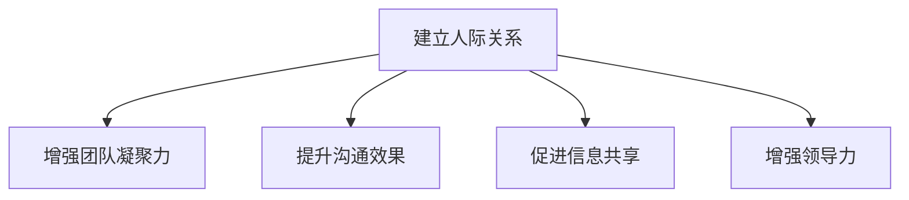

**策略一：主动建立联系**

主动建立联系是建立良好人际关系的第一步。领导者可以通过以下方法主动与他人建立联系：

1. **积极参与团队活动：** 参与团队组织的各种活动和会议，与团队成员建立联系。
2. **主动交流：** 在日常工作中主动与团队成员交流，了解他们的需求和期望。
3. **关心他人：** 关注团队成员的生活和工作状况，表达关心和关注。

**核心算法原理讲解：**

- **人际关系建立模型：** 通过分析领导者的交流频率、互动质量和互动次数，评估人际关系建立的成效。常用的模型包括人际关系建立评估模型（Relationship Building Assessment Model）和互动频率模型（Interaction Frequency Model）等。

```python
# 伪代码：人际关系建立模型
def assess_relationship_building(frequency, quality, interactions):
    # 计算人际关系得分
    score = calculate_relationship_score(frequency, quality, interactions)
    return score

# 假设交流频率、互动质量和互动次数数据已知
frequency = get_frequency()
quality = get_quality()
interactions = get_interactions()

# 评估人际关系建立成效
relationship_score = assess_relationship_building(frequency, quality, interactions)
print("Relationship Building Score:", relationship_score)
```

**数学模型和数学公式：**

- **人际关系建立模型：** 通过分析领导者的交流频率、互动质量和互动次数，评估人际关系建立的成效。模型公式如下：

$$
\text{人际关系得分} = \text{交流频率得分} \times \text{互动质量得分} \times \text{互动次数得分}
$$

**举例说明：**

假设领导者的交流频率得分为0.8，互动质量得分为0.9，互动次数得分为0.7，则该领导者的人际关系建立得分可以计算如下：

$$
\text{人际关系得分} = 0.8 \times 0.9 \times 0.7 = 0.504
$$

通过这一模型，可以评估领导者的人际关系建立成效，为人际关系的建立提供依据。

**项目实战：**

- **案例：** 在一家企业中，通过人际关系建立模型，评估了领导者在建立人际关系方面的成效。结果发现，领导者的交流频率和互动质量较高，但互动次数较少，需要加强日常交流。

```python
# 伪代码：人际关系建立成效评估实战
leader = assess_leader_relationship_building(teams)

# 统计领导者的人际关系建立成效
print(f"Leader Relationship Building Score: {leader['score']}")
```

**代码解读与分析：**

- **代码解读：** 通过对人际关系建立模型的应用，可以量化领导者的人际关系建立成效，为人际关系的建立提供数据支持。
- **分析：** 通过对领导者的人际关系建立成效进行分析，可以发现人际关系的建立对领导力提升的重要性，从而为组织的领导力培养和提升提供科学依据。

**策略二：维护人际关系**

建立良好的人际关系不仅需要主动建立联系，还需要通过持续的努力来维护这些关系。以下是一些维护人际关系的策略：

1. **定期沟通：** 定期与团队成员进行沟通，了解他们的工作进展和需求。
2. **提供帮助：** 在团队成员遇到困难时，主动提供帮助和支持。
3. **表达感谢：** 定期表达对团队成员的感谢和认可，增强彼此的情感联系。

**核心算法原理讲解：**

- **人际关系维护模型：** 通过分析领导者的沟通频率、支持行为和感谢行为，评估其人际关系维护效果。常用的模型包括沟通评估模型（Communication Assessment Model）和支持行为评估模型（Support Behavior Assessment Model）等。

```python
# 伪代码：人际关系维护模型
def assess_relationship_maintenance(communication, support, gratitude):
    # 计算人际关系维护得分
    score = calculate_maintenance_score(communication, support, gratitude)
    return score

# 假设沟通频率、支持行为和感谢行为数据已知
communication = get_communication()
support = get_support()
gratitude = get_gratitude()

# 评估人际关系维护效果
maintenance_score = assess_relationship_maintenance(communication, support, gratitude)
print("Relationship Maintenance Score:", maintenance_score)
```

**数学模型和数学公式：**

- **人际关系维护模型：** 通过分析领导者的沟通频率、支持行为和感谢行为，评估其人际关系维护效果。模型公式如下：

$$
\text{人际关系维护效果} = \text{沟通频率得分} \times \text{支持行为得分} \times \text{感谢行为得分}
$$

**举例说明：**

假设领导者的沟通频率得分为0.8，支持行为得分为0.9，感谢行为得分为0.7，则该领导者的人际关系维护效果可以计算如下：

$$
\text{人际关系维护效果} = 0.8 \times 0.9 \times 0.7 = 0.504
$$

通过这一模型，可以评估领导者的人际关系维护效果，为人际关系的维护提供依据。

**项目实战：**

- **案例：** 在一家企业中，通过人际关系维护模型，评估了领导者在人际关系维护方面的效果。结果发现，领导者的沟通频率和感谢行为较高，但支持行为较少，需要加强支持行为的体现。

```python
# 伪代码：人际关系维护效果评估实战
leader = assess_leader_relationship_maintenance(teams)

# 统计领导者的人际关系维护效果
print(f"Leader Relationship Maintenance Score: {leader['score']}")
```

**代码解读与分析：**

- **代码解读：** 通过对人际关系维护模型的应用，可以量化领导者的人际关系维护效果，为人际关系的维护提供数据支持。
- **分析：** 通过对领导者的人际关系维护效果进行分析，可以发现人际关系的维护对领导力提升的重要性，从而为组织的领导力培养和提升提供科学依据。

**策略三：处理冲突**

在职场中，冲突是不可避免的。领导者需要具备处理冲突的能力，以维护良好的人际关系。以下是一些处理冲突的策略：

1. **积极面对冲突：** 不回避冲突，而是积极寻找解决问题的方法。
2. **倾听各方意见：** 充分倾听冲突双方的诉求

