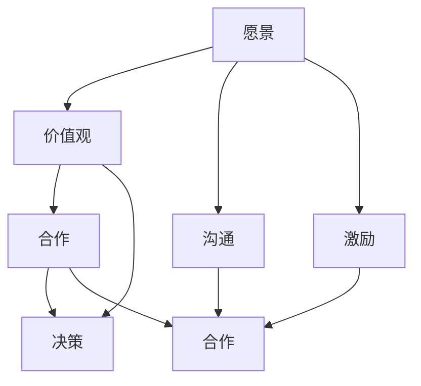

                 

### 引言：领导力的现代意义与重要性

在现代商业和社会环境中，领导力已经成为组织成功和持续发展的关键因素。随着全球化和技术进步的加速，领导者不仅需要具备传统的管理技能，还需要适应快速变化的环境，具备前瞻性和创新精神。因此，领导力的重要性在当今社会中得到了广泛的认可。

首先，从组织角度来看，领导力直接影响组织的战略方向、文化氛围和运营效率。一个优秀的领导者能够明确组织的愿景和目标，激发团队成员的潜力，形成协同效应，推动组织向前发展。同时，领导力还能帮助组织应对外部挑战，如市场竞争、技术变革等，确保组织的长期竞争力。

其次，从个人角度来看，领导力不仅是一种职业能力，更是一种生活智慧。具备领导力的人能够更好地处理人际关系，提升沟通协调能力，增强自我管理和解决问题的能力。这些能力不仅在职场中发挥着重要作用，也在日常生活中具有积极的影响。

本篇文章将深入探讨领导力的现代意义，通过介绍领导力的发展历程、现代定义和三大支柱，帮助读者建立起对领导力的全面认识。同时，我们将详细分析领导者角色与职责、领导力模型与理论，以及领导力的核心概念原理和架构。希望通过这篇文章，读者能够对领导力有更加深刻的理解，并学会如何在实践中提升领导力。

### 1.1 领导力的发展历程

领导力作为一种社会现象，其发展历程可以追溯到古代文明时期。在古代，领导力主要体现在君主制和封建制度中，领导者通常是凭借权力和地位来管理国家和人民。这一时期的领导风格以权威为主，领导者通过强制和压制来维持秩序。

随着工业革命的发展，领导力开始从权力导向转向能力导向。领导者需要具备管理技能和专业知识，以应对大规模生产和技术进步带来的挑战。泰勒的科学管理理论、韦伯的官僚组织理论等，都是这一时期的重要代表。这些理论强调了标准化、流程化和科学管理，为现代领导力奠定了基础。

进入20世纪，领导力研究开始从行为学、心理学和管理学等多个角度进行探讨。行为学家赫茨伯格提出了双因素理论，揭示了工作满意度与工作环境、工作条件之间的关系。心理学家马斯洛提出了需求层次理论，指出人的需求层次从生理需求到自我实现需求，领导者需要根据员工的不同需求进行激励和管理。

随着信息技术的迅猛发展，领导力再次面临新的挑战和变革。领导者需要具备跨学科的知识结构，具备创新思维和全球化视野。这一时期的领导风格更加注重团队合作和共创，强调领导者的服务意识和共享精神。彼得·德鲁克的“目标管理”理论和约翰·科特的“变革型领导”理论，都是这一时期的重要代表。

总体来看，领导力的发展历程体现了从权力导向到能力导向，再到价值观导向的演变过程。每个阶段都有其特定的社会背景和理论基础，但共同的核心目标都是提高组织的绩效和员工的幸福感。

### 1.2 领导力的现代定义

在现代社会，领导力被赋予了更为丰富的内涵和多样的表现形式。相较于传统定义，现代领导力更加注重领导者的行为、价值观以及与团队成员的关系。

首先，现代领导力强调的是一种引导和激励团队成员的能力，而不仅仅是权威和命令。领导者需要通过设定愿景、明确目标，激发团队成员的积极性和创造力，共同实现组织的目标。这种领导风格被称为变革型领导，其核心在于领导者能够引导团队成员超越自我，追求更高的目标。

其次，现代领导力强调的是一种价值观的引领。领导者需要具备强烈的使命感和社会责任感，不仅关注组织的短期绩效，更注重组织的长期发展和社会的可持续发展。领导者通过传递正确的价值观，引导团队成员形成共同的理念和信仰，从而实现组织的共同目标。

此外，现代领导力还强调与团队成员的深度互动和沟通。领导者需要具备出色的沟通能力和倾听能力，能够理解团队成员的需求和期望，建立互信和尊重的关系。这种关系不仅有助于提升团队的凝聚力和合作效率，还能激发团队成员的潜能，实现个人的成长和发展。

综合来看，现代领导力不仅是一种管理能力，更是一种综合素养和人格特质。它涵盖了领导者的愿景、价值观、行为模式以及与团队成员的关系等多个方面，是一种动态、复杂且不断发展的领导形态。

### 1.3 领导力的三大支柱

领导力作为一种综合能力，其核心可以概括为三大支柱：领导者的素质、团队的能力和领导环境。

首先，领导者的素质是领导力的基础。一个优秀的领导者需要具备多项素质，包括但不限于：

1. **决策能力**：领导者需要能够迅速而明智地做出决策，以应对各种复杂和不确定的情况。这要求领导者具备良好的逻辑思维和分析能力，同时还需要具备敢于承担风险的勇气。

2. **沟通能力**：领导者需要具备出色的沟通能力，包括口头和书面沟通，以及倾听能力。有效的沟通能够确保信息传递的准确性，增强团队的凝聚力和合作效率。

3. **领导力价值观**：领导者需要具备明确的价值观，并能够将这些价值观传递给团队成员。这有助于形成统一的目标和信仰，提升团队的士气和战斗力。

4. **创新精神**：在快速变化的现代社会，领导者需要具备创新精神，能够引领团队探索新的方法和思路，推动组织的发展和进步。

其次，团队的能力是领导力的关键。一个高效的团队需要具备以下几方面的能力：

1. **协作能力**：团队成员需要能够协同工作，共同完成团队的目标。这要求团队成员具备良好的沟通和合作能力，能够互相支持和信任。

2. **学习能力**：团队需要具备快速学习和适应新知识、新技能的能力。这有助于团队在面临新的挑战时，能够迅速调整策略，保持竞争优势。

3. **创新思维**：团队需要鼓励创新思维，鼓励成员提出新的想法和解决方案，通过集体智慧和协作，实现团队的突破和进步。

最后，领导环境是领导力得以发挥的重要条件。一个良好的领导环境需要具备以下几方面的特征：

1. **组织文化**：组织文化对领导力有着深远的影响。一个积极向上的组织文化能够激发团队成员的潜能，增强团队的凝聚力和归属感。

2. **制度支持**：有效的制度能够为领导力提供保障，确保领导者的决策和行动得到充分的支持和执行。

3. **资源保障**：领导者需要具备充分的资源保障，包括人力、物力和财力等，以确保团队能够高效运作，实现目标。

总之，领导力的三大支柱相互影响、相互促进，共同构成了领导力体系。一个优秀的领导者不仅需要具备良好的个人素质，还需要构建一支高效能的团队，并在良好的领导环境中发挥领导力，实现组织的长期发展和持续成长。

### 2.1 领导者的角色转变

在当今快速变化的商业环境中，领导者的角色经历了显著的转变。传统的领导者更多扮演的是指挥和控制的角色，而现代领导者则更倾向于成为团队的合作者和引导者。这种角色的转变不仅反映了领导力理论的发展，也回应了组织需求和员工期望的变化。

首先，现代领导者需要从传统的命令式领导转向赋能型领导。传统的命令式领导强调领导者的权威和控制，而赋能型领导则更注重激发团队成员的内在动力和自我实现。领导者通过赋予团队成员更多的自主权和责任，帮助他们发挥潜力，实现个人和团队的目标。

其次，现代领导者需要从单一领域的专家转变为多领域的通才。在信息爆炸和全球化的背景下，领导者需要具备跨学科的知识结构和多样化的技能。这不仅有助于领导者更好地理解和应对复杂的问题，还能促进团队的跨领域合作和协同创新。

此外，现代领导者还需要从单向沟通的传递者转变为双向沟通的倾听者。传统的领导者更多是信息的发布者，而现代领导者则需要具备良好的倾听能力，能够理解团队成员的想法和需求。这种双向沟通不仅有助于建立信任和合作关系，还能确保决策的准确性和有效性。

总的来说，现代领导者的角色转变体现了从控制到赋能、从专家到通才、从传递到倾听的三大趋势。这种转变不仅要求领导者提升自身的素质和能力，还需要领导者关注团队成员的成长和发展，创造一个积极、开放和包容的工作环境。

### 2.2 领导者的三大核心职责

作为团队的领导者，承担明确的职责对于实现团队目标至关重要。领导者的三大核心职责包括战略规划、团队管理和个人发展。

**1. 战略规划**

战略规划是领导者的重要职责之一。领导者需要明确组织的愿景和目标，制定实现这些目标的长期和短期计划。这包括市场分析、资源分配和风险管理等关键步骤。有效的战略规划能够确保团队在复杂多变的环境中保持清晰的方向和稳定的步伐。

**具体步骤：**

- **愿景设定**：明确组织的长期目标和愿景，确保团队成员对未来的共同认知。
- **市场分析**：了解外部市场环境，识别机遇和挑战，为战略制定提供依据。
- **资源分配**：根据战略目标，合理分配人力、物力和财力等资源，确保团队具备实现目标所需的条件。
- **风险管理**：识别潜在风险，制定应对策略，降低不确定性对团队目标实现的影响。

**2. 团队管理**

团队管理是领导者的核心职责之一，包括团队组建、团队协作和团队激励。一个高效的团队能够协同工作，实现个人和团队的目标。

**具体步骤：**

- **团队组建**：根据团队目标和工作需求，选择合适的团队成员，确保团队成员的能力和背景与团队目标相匹配。
- **团队协作**：建立有效的沟通机制和协作流程，确保团队成员能够高效合作，共享信息和资源。
- **团队激励**：通过适当的激励措施，如奖励、认可和培训等，激发团队成员的积极性和创造力，提升团队的整体绩效。

**3. 个人发展**

领导者的个人发展不仅关系到自身职业生涯的成功，也直接影响到团队的整体表现。因此，领导者需要不断学习和提升自身的能力和素质。

**具体步骤：**

- **自我反思**：定期进行自我反思，识别自身优势和不足，制定个人发展计划。
- **持续学习**：通过参加培训、阅读专业书籍和参与行业交流活动等，不断更新知识和技能，保持与时俱进。
- **培养他人**：通过培训和指导团队成员，提升团队的整体能力和素质，实现共同成长。

总的来说，领导者的三大核心职责是战略规划、团队管理和个人发展。只有承担这些职责，领导者才能有效地引导团队，实现组织的目标和愿景。

### 2.3 如何承担并履行领导职责

领导者承担并履行领导职责是一项复杂的任务，需要领导者具备多方面的能力和技巧。以下是一些关键步骤和实用技巧，帮助领导者更好地承担和履行领导职责。

**1. 明确角色定位**

领导者首先需要明确自己的角色定位，了解自己在团队中的角色和职责。这包括：

- **愿景设定**：领导者需要明确组织的愿景和目标，并将这些目标传达给团队成员，确保团队成员对组织的发展方向有清晰的认识。
- **任务分配**：根据团队成员的能力和特长，合理分配任务，确保每个人都能在适合自己的岗位上发挥最大潜力。

**2. 沟通和协调**

有效的沟通和协调是领导者履行职责的重要手段。以下是一些建议：

- **建立沟通机制**：领导者需要建立定期沟通的机制，如每周或每月的团队会议，确保信息流畅，减少误解和冲突。
- **倾听和反馈**：领导者需要具备良好的倾听能力，认真倾听团队成员的意见和建议，并提供及时的反馈，帮助团队成员改进工作。

**3. 激励和培养团队**

领导者需要激励和培养团队，提升团队的士气和绩效。以下是一些建议：

- **认可和奖励**：领导者需要适时对团队成员的成就和努力给予认可和奖励，如公开表扬、发放奖金等，激发团队成员的积极性和创造力。
- **培训和发展**：领导者需要为团队成员提供培训和发展机会，帮助团队成员提升技能和知识，实现个人和团队的目标。

**4. 主动解决问题**

领导者需要具备解决问题的能力，主动面对和解决团队中出现的各种问题。以下是一些建议：

- **识别问题**：领导者需要敏锐地识别团队中存在的问题，如效率低下、沟通不畅等，并分析问题的根本原因。
- **制定解决方案**：领导者需要制定切实可行的解决方案，并指导团队成员实施，确保问题得到有效解决。

**5. 持续学习和自我提升**

领导者需要不断学习和提升自身的能力和素质，以适应不断变化的环境和需求。以下是一些建议：

- **自我反思**：领导者需要定期进行自我反思，识别自身的不足，并制定改进计划。
- **学习新知**：领导者需要通过阅读、培训、交流等方式，不断更新知识和技能，保持与时俱进。

总之，领导者承担并履行领导职责需要明确角色定位、有效沟通和协调、激励和培养团队、主动解决问题以及持续学习和自我提升。通过这些方法和技巧，领导者能够更好地发挥领导力，推动团队和组织的发展。

### 3.1 领导力模型概述

领导力模型是理解和评估领导者行为和效果的重要工具。不同的领导力模型从不同的角度对领导行为进行了分类和解释。常见的领导力模型包括变革型领导、情境领导、路径-目标理论和领导者-成员交换理论等。这些模型不仅帮助我们理解领导行为的不同维度，还为领导者提供了具体的实践指导。

**变革型领导**：变革型领导是一种以激发团队成员潜力和推动组织变革为目标的领导风格。变革型领导者通过激励、赋能和愿景引领，激发团队成员的内在动机，推动组织实现变革。该模型的核心在于领导者的愿景、价值观和影响力。

**情境领导**：情境领导模型认为领导行为应该根据不同情境和团队成员的特点进行调整。该模型将领导行为分为任务导向和关系导向两种类型，并根据团队成员的能力和动机进行匹配。情境领导强调灵活性和适应性，帮助领导者在不同情境下做出最佳决策。

**路径-目标理论**：路径-目标理论认为领导者的主要任务是帮助团队成员明确目标，并提供实现目标的路径和支持。领导者通过设定目标、提供路径和激励员工，帮助团队成员克服障碍，实现目标。该模型强调领导者的目标设定、路径引导和激励作用。

**领导者-成员交换理论**：领导者-成员交换理论（LMX理论）认为领导者与成员之间的关系分为高关系和低关系两种类型。高关系成员通常得到更多的关注和支持，而低关系成员则受到较少的重视。该理论强调领导者如何通过建立高关系来提升团队成员的满意度和绩效。

通过了解和运用这些领导力模型，领导者可以更好地理解自身的领导行为，并根据不同情境和团队成员的特点进行调整，从而提高领导效果和团队绩效。

### 3.2 变革型领导理论

变革型领导理论是由美国学者詹姆斯·麦格雷戈·伯恩斯（James MacGregor Burns）在1978年首次提出的，它强调领导者通过激发和提升团队成员的内在动机和愿景，推动组织实现变革和进步。与传统的交易型领导不同，变革型领导更注重领导者的远见卓识和影响力，旨在激发团队成员的创造力和自主性。

**核心概念**：

- **愿景引领**：变革型领导者拥有清晰的愿景，能够将这个愿景转化为具体的行动目标，并带领团队成员共同追求。这种愿景不仅是领导者个人的目标，更是团队成员共同认同和追求的愿景。
- **激励与赋能**：变革型领导者通过激励和赋能，激发团队成员的内在动力，帮助他们发现自身潜力，实现个人和团队的目标。领导者通过鼓励创新、提供支持和信任，帮助团队成员克服困难和挑战。
- **个性化领导**：变革型领导者关注团队成员的个性特点和发展需求，提供个性化的领导和支持。领导者通过与团队成员建立深厚的信任关系，了解他们的动机和目标，从而更好地激励和引导他们。
- **价值观传递**：变革型领导者通过传递正确的价值观，如诚信、公正、创新等，引导团队成员形成共同的理念和信仰。这种价值观不仅影响团队成员的行为和决策，还塑造组织的文化氛围。

**模型结构**：

变革型领导理论通常包括以下几个步骤：

1. **激发愿景**：领导者首先需要明确组织的愿景和目标，并将其转化为团队成员可以理解和认同的愿景。通过激发团队成员的内在动机，使他们愿意为实现这个愿景而努力。
2. **个性化领导**：领导者通过了解团队成员的个性特点和发展需求，提供个性化的指导和激励。领导者与团队成员建立深厚的信任关系，使团队成员感受到被重视和关心。
3. **激励与赋能**：领导者通过激励和赋能，激发团队成员的内在动力，帮助他们克服困难，实现个人和团队的目标。领导者鼓励创新和自主性，为团队成员提供支持和资源。
4. **价值观传递**：领导者通过传递正确的价值观，如诚信、公正、创新等，引导团队成员形成共同的理念和信仰。这种价值观不仅影响团队成员的行为和决策，还塑造组织的文化氛围。
5. **变革执行**：在明确了愿景、建立了信任、激励了团队成员后，领导者需要确保变革的执行和持续。领导者通过有效的沟通和协调，确保团队成员能够共同推进变革，实现组织的目标。

**案例解析**：

以谷歌（Google）的创始人拉里·佩奇（Larry Page）和谢尔盖·布林（Sergey Brin）为例，他们就是变革型领导的典范。佩奇和布林通过明确的愿景和价值观，带领谷歌从一个小型搜索引擎公司发展成为全球最大的科技公司之一。他们鼓励员工创新和自主性，提供了丰富的资源和支持，使谷歌的工程师们能够自由地探索和实现他们的想法。同时，佩奇和布林通过传递谷歌的核心价值观，如“不作恶”（Don't Be Evil），塑造了谷歌独特的企业文化。

总的来说，变革型领导理论强调领导者通过激发和提升团队成员的内在动机和愿景，推动组织实现变革和进步。领导者需要具备远见卓识、激励与赋能的能力，以及传递正确价值观的智慧。通过这些核心概念和模型结构，变革型领导理论为领导者提供了一套有效的领导方法和实践指南。

### 3.3 情境领导理论

情境领导理论（Situation Leadership Theory）是由保罗·赫塞（Paul Hersey）和肯·布兰查德（Ken Blanchard）在1969年提出的，旨在帮助领导者根据不同情境和团队成员的特点，采取合适的领导风格和策略。该理论认为，领导者的行为应该随着情境的变化而调整，以最大限度地提高团队绩效和成员满意度。

**核心概念**：

1. **情境因素**：情境领导理论强调领导者需要考虑情境因素，包括任务结构、团队成员的能力、动机和工作环境等。这些因素决定了领导者的行为应该具备灵活性和适应性。

2. **领导风格**：情境领导理论将领导风格分为四种类型，根据情境因素的不同进行匹配：

   - **指示型领导（Directing）**：领导者明确指导和命令团队成员，具体说明任务要求和方法，适用于任务结构清晰但团队成员能力较弱的情况。
   - **推销型领导（Supporting-Controlling）**：领导者提供指导和监督，同时关注团队成员的情感需求，适用于任务结构较为复杂，团队成员能力较强但需要额外激励的情况。
   - **参与型领导（Supporting-Supportive）**：领导者与团队成员共同参与决策，关注成员的情感需求，适用于任务结构复杂且团队成员具备高能力的情况。
   - **授权型领导（Participating）**：领导者赋予团队成员高度自主权，让他们自主决定任务的方法和执行过程，适用于任务结构简单且团队成员能力极高的情况。

3. **情境匹配**：情境领导理论的核心在于领导者根据不同情境因素，选择最合适的领导风格。这要求领导者具备敏锐的洞察力和灵活的应变能力，以应对不断变化的工作环境。

**模型结构**：

情境领导理论通常包括以下几个步骤：

1. **评估情境因素**：领导者需要评估当前情境的任务结构、团队成员的能力和动机等，明确情境类型。
2. **选择领导风格**：根据评估结果，选择最合适的领导风格。不同情境可能需要不同的领导风格，领导者需要灵活调整。
3. **实施领导行为**：领导者按照选定的领导风格，与团队成员进行沟通和互动，确保任务目标的实现。
4. **调整和反馈**：领导者需要根据情境的变化和团队成员的反应，及时调整领导行为，提供必要的反馈和支持。

**案例解析**：

以苹果公司（Apple）的创始人史蒂夫·乔布斯（Steve Jobs）为例，乔布斯在不同的情境下展现了不同的领导风格。在产品开发初期，乔布斯通常采用指示型领导，明确产品功能和设计要求，确保团队成员按照既定目标开展工作。而在产品开发后期，乔布斯则采用参与型领导，与团队成员共同讨论和决策，激发团队成员的创新思维和参与度。通过灵活调整领导风格，乔布斯成功带领苹果公司推出了一系列革命性的产品。

总的来说，情境领导理论为领导者提供了一种基于情境的领导方法和实践指南。通过理解不同情境因素和领导风格，领导者可以更有效地应对复杂多变的工作环境，提升团队绩效和成员满意度。

### 4.1 领导力核心概念原理

领导力作为一种复杂的社会现象，其核心概念原理涉及多个方面。以下是领导力中几个关键的核心概念及其相互关系。

**1. 愿景**

愿景是领导力的基石，代表了领导者对未来的憧憬和期望。一个清晰的愿景能够激发团队成员的内在动机，引领他们共同追求共同的目标。愿景不仅需要具有远见，还需要具有实际可行性，使团队成员能够看到并相信自己能够实现。

**2. 价值观**

价值观是领导者行为的指导原则，代表了领导者对正确和错误的判断标准。领导者通过传递和践行正确的价值观，塑造组织的文化氛围，确保团队成员在行为和决策上保持一致。

**3. 沟通**

沟通是领导者与团队成员之间传递信息和建立信任的关键手段。有效的沟通不仅包括信息的传递，还需要倾听和理解团队成员的意见和需求。通过沟通，领导者能够更好地了解团队成员，提供必要的支持和指导。

**4. 激励**

激励是领导者激发团队成员内在动机和积极性的过程。领导者通过认可、奖励和赋能，帮助团队成员克服困难和挑战，实现个人和团队的目标。

**5. 合作**

合作是领导力的关键要素，代表了团队成员之间的协同工作和共同追求。领导者需要建立良好的合作关系，促进团队成员之间的沟通和协作，形成协同效应。

**6. 决策**

决策是领导力的核心职责之一，代表了领导者面对复杂问题和不确定性时做出选择的智慧。有效的决策不仅需要领导者具备良好的分析能力和判断力，还需要考虑团队成员的意见和需求。

**相互关系**

这些核心概念相互关联，共同构成了领导力的整体框架。愿景和价值观为领导力提供了方向和原则，沟通和激励为领导者与团队成员之间的关系奠定了基础，合作和决策则确保了团队目标的实现。通过理解这些核心概念及其相互关系，领导者能够更有效地运用领导力，推动团队和组织的发展。

### 4.2 领导力架构 Mermaid 流程图

为了更直观地展示领导力的核心概念及其相互关系，我们使用Mermaid语言绘制了一个简单的流程图。以下代码展示了领导力架构的Mermaid流程图：

**流程图解析**：

1. **愿景**（A）：作为领导力的起点，愿景是领导者对未来的憧憬和期望，引领团队前进。
2. **价值观**（B）：愿景和价值观共同构成了领导力的原则，指导领导者的行为和决策。
3. **沟通**（C）：有效的沟通是建立领导者和团队成员之间信任和合作关系的基础。
4. **激励**（D）：领导者通过激励激发团队成员的内在动机，提升团队的整体绩效。
5. **合作**（E）：合作是团队成员协同工作、共同追求目标的关键，是实现团队目标的重要保障。
6. **决策**（F）：在愿景、价值观和沟通的基础上，领导者通过决策确保团队目标的实现。
7. **合作**（G）：合作不仅体现在团队成员之间，还体现在领导者和团队成员之间，形成协同效应。

通过这个流程图，我们可以清晰地看到领导力核心概念之间的相互关系，有助于领导者更好地理解和运用领导力。

### 5.1 有效沟通的核心要素

有效沟通是领导者与团队成员之间建立信任、促进合作的重要手段。要实现有效沟通，领导者需要关注以下几个核心要素：

**1. 清晰表达**

领导者需要能够清晰、准确地表达自己的观点和期望。这要求领导者具备良好的语言表达能力和逻辑思维能力，确保信息传递的准确性和一致性。同时，领导者还需要根据不同的听众和情境，调整表达方式和语言风格，以增强沟通的效果。

**2. 倾听能力**

倾听是有效沟通的另一关键要素。领导者需要认真倾听团队成员的意见和建议，理解他们的需求和期望。通过倾听，领导者不仅能够获取有价值的信息，还能建立与团队成员之间的信任和尊重。倾听还包括非语言沟通，如姿态、眼神和肢体语言，领导者需要通过这些方式表达出对团队成员的关注和认可。

**3. 反馈与确认**

领导者需要提供及时的反馈，确认团队成员是否理解了他们的观点和信息。这可以通过提问、复述和总结等方式进行。及时的反馈有助于消除误解和困惑，确保沟通的有效性。同时，领导者还需要鼓励团队成员提出问题和反馈，建立双向沟通的机制，增强沟通的透明度和开放性。

**4. 文化敏感性**

在多元文化环境中，领导者需要具备文化敏感性，理解不同文化背景下的沟通习惯和价值观。这有助于避免文化冲突，促进跨文化团队的协作和沟通。领导者可以通过了解和尊重团队成员的文化差异，调整沟通策略，提升沟通的效果。

**5. 情绪管理**

领导者需要具备良好的情绪管理能力，能够在压力和冲突面前保持冷静和理智。通过有效的情绪管理，领导者能够避免情绪波动对沟通的影响，确保沟通的顺利进行。同时，领导者还需要帮助团队成员管理情绪，创造一个积极、开放和包容的沟通环境。

**案例解析**：

以苹果公司的史蒂夫·乔布斯为例，乔布斯是一位出色的沟通者。他在产品发布会上的演讲总是清晰、生动，能够准确地传达产品的特点和优势。同时，乔布斯也非常善于倾听团队成员的意见，经常在会议中鼓励员工发言。通过有效的沟通，乔布斯成功地将苹果公司的愿景和价值观传递给团队成员，激发他们的创新热情和协作精神。

总之，有效沟通的核心要素包括清晰表达、倾听能力、反馈与确认、文化敏感性和情绪管理。通过关注这些要素，领导者能够建立良好的沟通机制，提升团队协作和绩效。

### 5.2 激励理论的应用

激励是领导者激发团队成员内在动机和积极性的过程，是提升团队绩效和实现目标的关键因素。激励理论提供了理解和管理激励行为的方法和框架。以下是一些主要激励理论的介绍及其应用方法。

**1. 马斯洛需求层次理论**

马斯洛需求层次理论认为，人的需求可以分为五个层次：生理需求、安全需求、社交需求、尊重需求和自我实现需求。领导者可以通过满足团队成员的不同层次需求来激励他们。例如：

- **生理需求**：确保团队成员的基本生活和工作条件，如合理的薪资待遇、舒适的工作环境等。
- **安全需求**：提供稳定的工作环境，减少团队成员的工作压力和不确定性。
- **社交需求**：鼓励团队成员之间的沟通和合作，帮助他们建立良好的人际关系。
- **尊重需求**：通过认可和奖励团队成员的贡献，提高他们的自尊心和归属感。
- **自我实现需求**：为团队成员提供发展机会和挑战，帮助他们实现个人潜力和职业目标。

**2. 双因素理论**

赫茨伯格的双因素理论将工作满意度的影响因素分为两类：激励因素和保健因素。激励因素包括工作本身、成就、认可、责任和成长等，能够激发团队成员的内在动机；而保健因素包括公司政策、工作条件、薪资福利和工作环境等，能够预防工作不满意。领导者可以通过以下方式应用这一理论：

- **关注激励因素**：设计有趣和富有挑战性的工作任务，提供成就感和责任感，激发团队成员的内在动力。
- **改善保健因素**：优化工作环境，提供合理的薪资福利，确保团队成员的基本需求得到满足。

**3. 辛普森激励理论**

辛普森激励理论认为，人的行为是由动机、能力和环境三个因素共同决定的。领导者可以通过以下方法应用这一理论：

- **明确动机**：了解团队成员的内在动机，设定与其动机一致的目标，提高激励效果。
- **提升能力**：提供培训和发展机会，提升团队成员的能力，增强他们实现目标的可能性。
- **创造有利环境**：营造积极的工作氛围，减少外部干扰，为团队成员实现目标提供支持和资源。

**4. 激励-需要理论**

激励-需要理论认为，人的行为是由未满足的需要驱动的。领导者可以通过以下方法应用这一理论：

- **识别需要**：通过调查和沟通，了解团队成员的未满足需要，制定有针对性的激励策略。
- **满足需要**：通过奖励、认可和晋升等手段，满足团队成员的未满足需要，提高他们的工作满意度和积极性。

**案例解析**：

以谷歌公司为例，谷歌通过多种激励手段，成功激发了员工的内在动机。首先，谷歌提供了富有竞争力的薪资福利，满足了员工的基本需求。其次，谷歌注重员工的发展，提供了丰富的培训机会和职业发展路径，帮助员工提升能力。此外，谷歌鼓励创新和自主性，为员工创造了自由、开放的工作环境，满足了员工的自我实现需求。通过这些激励措施，谷歌成功吸引了顶尖人才，并保持了高绩效和创新能力。

总之，激励理论提供了多种方法和框架，帮助领导者理解和应用激励行为。通过识别和管理团队成员的内在动机和需求，领导者可以有效地激发团队成员的积极性，提升团队绩效和实现目标。

### 5.3 领导者如何激励团队

领导者激励团队的核心在于激发团队成员的内在动机和积极性，帮助他们实现个人和团队的目标。以下是一些具体的策略和技巧，帮助领导者有效地激励团队：

**1. 设定明确的目标**

领导者需要明确团队的目标和期望，并将其传达给团队成员。具体的目标可以提供清晰的方向，使团队成员了解他们的工作对团队目标的贡献。领导者可以通过以下方法设定目标：

- **具体化目标**：将目标具体化，明确任务的完成标准和时间节点。
- **参与式目标设定**：鼓励团队成员参与目标设定过程，增强他们的责任感和参与感。

**2. 提供即时反馈**

及时反馈是激励团队的重要手段。领导者需要给予团队成员及时的反馈，无论是正面还是负面。正面反馈可以增强团队成员的信心和积极性，而负面反馈则可以帮助他们认识到问题并改进。

- **正面反馈**：认可团队成员的成就和努力，通过表扬、奖励等方式增强他们的自信心和动力。
- **负面反馈**：指出团队成员存在的问题，并提供具体的改进建议，帮助他们提升绩效。

**3. 创造积极的工作环境**

积极的工作环境能够激发团队成员的内在动力和创造力。领导者可以通过以下方法创造积极的工作环境：

- **提供资源和支持**：确保团队成员具备完成工作任务所需的资源和支持，如培训、工具和技术等。
- **营造信任氛围**：建立信任和尊重的工作氛围，鼓励团队成员之间的沟通和合作，减少冲突和摩擦。

**4. 激发内在动机**

领导者需要关注团队成员的内在动机，通过以下策略激发他们的热情和动力：

- **赋予责任和自主权**：赋予团队成员更多的责任和自主权，让他们能够自主决定工作方法和进度，增强他们的责任感和主人翁意识。
- **提供成长和发展机会**：为团队成员提供培训和发展机会，帮助他们实现个人和职业目标，提升他们的内在动机。

**5. 鼓励创新和自主性**

领导者需要鼓励团队成员的创新思维和自主性，为他们提供发挥创意的空间和支持。以下是一些具体策略：

- **建立创新文化**：鼓励团队成员提出新的想法和解决方案，支持他们尝试和实践。
- **提供创新资源**：为团队成员提供创新的资源和支持，如时间、资金和技术等。

**案例解析**：

以谷歌公司为例，谷歌的领导者通过多种策略激励团队。首先，谷歌设定了明确的目标和期望，通过年度目标和季度目标，确保团队成员了解他们的工作对公司的贡献。其次，谷歌提供了即时反馈，通过每周的团队会议和月度绩效评估，及时认可团队成员的成就和努力。此外，谷歌创造了积极的工作环境，提供了丰富的资源和支持，鼓励团队成员之间的沟通和合作。通过这些策略，谷歌成功激发了员工的内在动机和积极性，保持了高绩效和创新能力。

总之，领导者通过设定明确的目标、提供即时反馈、创造积极的工作环境、激发内在动机和鼓励创新自主性，可以有效地激励团队，提升团队绩效和实现目标。

### 6.1 决策的核心原则

决策是领导者的一项核心职责，有效的决策能力对团队和组织的成功至关重要。决策的核心原则包括以下几方面：

**1. 完整信息**

决策的基础是信息，领导者需要确保决策过程中信息的完整性和准确性。这包括收集来自不同渠道的信息，如市场数据、竞争对手情报和员工反馈等。领导者需要具备敏锐的洞察力和分析能力，从大量信息中提取出关键信息，为决策提供有力支持。

**2. 系统分析**

在决策过程中，领导者需要运用系统分析的方法，全面考虑各种因素和潜在影响。这包括评估决策的潜在风险和收益，分析不同方案的可能结果，以及考虑决策对团队成员和外部环境的影响。系统分析有助于领导者做出更为全面和科学的决策。

**3. 多样性思考**

多样性思考是决策的重要原则之一。领导者需要鼓励团队成员提出不同的观点和建议，确保决策过程中的多样性和创新性。通过多样性思考，领导者可以避免陷入思维定式，发现更多潜在的机会和解决方案。

**4. 持续学习**

决策是一个不断学习和优化的过程。领导者需要保持开放的心态，不断学习和吸收新的知识和经验。通过持续学习，领导者可以不断提升决策能力，适应不断变化的环境和需求。

**5. 快速行动**

在决策过程中，领导者需要具备快速行动的能力。及时采取行动可以抓住机遇，避免决策延误带来的负面影响。同时，快速行动还可以增强团队成员的信心和执行力，推动决策的有效实施。

**6. 责任承担**

领导者需要承担决策的责任，无论是成功还是失败。通过承担责任，领导者可以树立榜样，增强团队成员的责任感和使命感。同时，领导者还需要从失败中吸取教训，不断优化决策过程，提升决策效果。

通过遵循这些核心原则，领导者可以做出更为科学和有效的决策，提升团队和组织的绩效。

### 6.2 问题解决的步骤

在领导过程中，问题解决是一项重要且常见的任务。有效的问题解决不仅能够帮助团队克服困难，还能提升团队的整体能力和应变能力。以下是问题解决的详细步骤：

**1. 识别问题**

首先，领导者需要准确识别问题。这可以通过观察、倾听、收集数据和调查等方式进行。领导者需要确保问题定义的准确性和清晰性，避免对问题产生误解或误判。

**2. 分析问题**

在问题识别后，领导者需要深入分析问题，找出其根本原因。这可以通过以下方法进行：

- **因果图分析**：绘制因果图，明确问题的直接和间接原因，帮助领导者理解问题的全貌。
- **五问法**：通过连续提问“为什么”，挖掘问题的深层原因，直至找到根本原因。
- **数据支持**：利用数据分析工具，如统计分析、趋势分析和回归分析等，对问题进行定量分析，提供客观的数据支持。

**3. 制定解决方案**

在分析问题后，领导者需要制定具体的解决方案。这包括：

- **备选方案**：列出所有可能的解决方案，确保涵盖各种可能的情境。
- **评估方案**：对每个方案进行评估，考虑其可行性、成本和潜在影响。
- **优先级排序**：根据评估结果，确定每个方案的优先级，确保资源得到合理配置。

**4. 实施解决方案**

制定解决方案后，领导者需要确保解决方案的有效实施。这包括：

- **资源分配**：确保所需资源得到合理配置，包括人力、物力和财力等。
- **责任分配**：明确每个团队成员的责任和任务，确保解决方案能够顺利执行。
- **监督和调整**：在实施过程中，领导者需要持续监督方案执行情况，并根据实际情况进行必要的调整。

**5. 验证和反馈**

在解决方案实施后，领导者需要验证解决方案的有效性，并收集反馈。这可以通过以下方式：

- **绩效评估**：评估解决方案对问题的解决程度和团队绩效的影响。
- **反馈收集**：通过访谈、调查和小组讨论等方式，收集团队成员的反馈，了解解决方案的实际效果和改进空间。

**6. 持续改进**

问题解决并非一次性的任务，而是一个持续改进的过程。领导者需要根据验证和反馈结果，不断优化问题解决方法，提升团队的问题解决能力。

通过以上步骤，领导者可以系统性地解决各种问题，提升团队的整体能力和应变能力，确保组织的长期稳定和持续发展。

### 6.3 领导者如何制定和执行策略

领导者制定和执行策略是确保团队和组织目标实现的关键步骤。以下是领导者制定和执行策略的详细步骤和关键要点：

**1. 明确目标和战略**

首先，领导者需要明确团队和组织的长期目标和战略方向。这包括确定关键绩效指标（KPI）和具体目标，确保团队和组织的努力方向一致。领导者可以通过与团队成员沟通和讨论，确保他们对目标和战略有清晰的理解。

**2. 分析环境和竞争**

在制定策略时，领导者需要分析外部环境和竞争情况。这包括市场趋势、竞争对手策略、客户需求等。通过这些分析，领导者可以识别潜在的机会和威胁，为制定策略提供依据。

**3. 设定关键策略**

根据目标和环境分析，领导者需要设定关键策略。这包括确定主要行动步骤、资源配置和优先级。关键策略需要具有可执行性和可测量性，以便于后续的执行和评估。

**4. 制定详细的执行计划**

在策略设定后，领导者需要制定详细的执行计划。这包括明确每个任务的责任人、时间节点和预期结果。执行计划需要具有明确的步骤和指导，以确保团队成员能够顺利执行。

**5. 分配资源和预算**

领导者需要确保策略执行所需的资源和预算得到合理分配。这包括人力、物力和财力等资源，确保团队成员能够获得必要的支持和工具，顺利完成工作任务。

**6. 激励和沟通**

在策略执行过程中，领导者需要激励和沟通团队成员。通过设定目标和奖励机制，激发团队成员的积极性和创造力。同时，领导者需要保持开放和透明的沟通，确保团队成员了解策略和执行计划，消除疑虑和误解。

**7. 监督和调整**

在策略执行过程中，领导者需要持续监督和调整。通过定期检查执行情况，领导者可以及时发现和解决问题，确保策略按照预期进行。如果出现偏差，领导者需要及时调整策略和执行计划，确保目标实现。

**8. 反馈和评估**

在策略执行完成后，领导者需要收集反馈和进行评估。通过绩效评估和反馈收集，领导者可以了解策略的实际效果和团队成员的满意度。根据评估结果，领导者可以总结经验教训，为未来的策略制定和执行提供参考。

**9. 持续改进**

最后，领导者需要根据反馈和评估结果，持续改进策略和执行过程。通过不断优化和调整，领导者可以提升团队和组织的能力，实现长期发展和目标。

通过以上步骤和要点，领导者可以有效地制定和执行策略，确保团队和组织的长期成功和持续发展。

### 7.1 团队建设的三大关键

团队建设是提升团队绩效和凝聚力的重要手段。一个高效的团队需要具备共同的目标、良好的沟通和协调、以及高度的信任和协作。以下是团队建设的三大关键要素及其重要性：

**1. 共同目标**

共同目标是团队建设的基石。一个明确的共同目标能够统一团队成员的努力方向，激发他们的工作热情和积极性。共同目标不仅能够提高团队的凝聚力，还能帮助团队成员理解他们的工作对团队和组织的贡献，从而增强他们的责任感和使命感。

**2. 良好的沟通**

良好的沟通是团队协作的基础。有效的沟通能够确保团队成员之间信息的畅通，减少误解和冲突，增强团队的协调性和合作效率。良好的沟通还包括倾听和反馈，领导者需要鼓励团队成员积极表达意见，并提供及时的反馈和支持，建立互信和尊重的关系。

**3. 高度的信任**

高度的信任是团队长期稳定和高效运作的保障。团队成员之间的信任能够减少摩擦和猜疑，增强团队的凝聚力。建立信任的关键在于领导者需要以身作则，践行诚信和公平，为团队成员树立榜样。同时，领导者需要通过建立共同目标和有效的沟通，增强团队成员之间的互信，确保团队能够共同面对挑战，实现共同目标。

总之，共同目标、良好的沟通和高度的信任是团队建设的三大关键要素。只有通过这些关键要素的有机结合，团队才能实现高效运作和长期发展。

### 7.2 团队冲突的处理策略

在团队运作过程中，冲突是不可避免的现象。有效的团队冲突管理策略有助于解决冲突，提升团队绩效和凝聚力。以下是处理团队冲突的几种策略：

**1. 直面冲突**

面对冲突，领导者需要保持冷静和客观，直面问题。通过召开会议或个别谈话，领导者可以深入了解冲突的原因和双方的立场。这有助于领导者找到冲突的核心问题，为后续解决提供依据。

**2. 探寻共识**

在了解冲突的根源后，领导者需要探寻双方的共识点，寻找解决问题的共同基础。这可以通过引导双方进行开放和诚实的对话，寻求共同目标和利益，从而减少冲突的激化。

**3. 分配责任**

领导者需要根据冲突的性质和原因，合理分配责任。这包括明确责任人的任务和目标，确保每个团队成员都清楚自己的职责和期望。通过责任分配，领导者可以避免责任模糊和推诿现象，提高团队的工作效率。

**4. 寻求妥协**

在冲突无法通过直接解决时，领导者可以引导双方寻求妥协。妥协是一种平衡双方利益的有效手段，通过相互让步和调整，找到双方都能接受的解决方案。

**5. 建立规则**

为了避免重复冲突，领导者需要制定明确的团队规则和流程。这些规则和流程可以规范团队成员的行为，减少冲突的发生。同时，领导者需要确保这些规则和流程得到全体成员的认可和遵守。

**6. 提供培训**

领导者可以为团队成员提供冲突管理和沟通技巧的培训，帮助他们更好地理解和应对冲突。通过培训，团队成员可以提升自己的沟通能力和冲突解决能力，从而减少冲突的发生和影响。

**7. 调整团队结构**

如果冲突长期存在且无法解决，领导者可以考虑调整团队结构，如重新分配任务、调整团队成员等。通过调整团队结构，领导者可以减少冲突的影响，提高团队的整体绩效。

总之，处理团队冲突需要领导者具备敏锐的洞察力和有效的策略。通过直面冲突、探寻共识、分配责任、寻求妥协、建立规则、提供培训和调整团队结构等多种策略，领导者可以有效地解决团队冲突，提升团队凝聚力和绩效。

### 7.3 团队绩效的评估与提升

团队绩效的评估与提升是领导者的一项关键任务，通过科学合理的评估方法和有效的提升策略，可以确保团队高效运作和持续发展。以下是团队绩效评估与提升的详细步骤和策略。

**1. 制定评估指标**

首先，领导者需要制定科学合理的评估指标，这些指标应与团队目标紧密相关，能够全面反映团队的工作绩效。常见的评估指标包括：

- **数量和质量指标**：如完成的任务数量、项目成功率等。
- **效率指标**：如完成任务所需的时间、资源利用率等。
- **创新能力指标**：如新产品的开发数量、创新项目的成功率等。
- **团队协作指标**：如沟通效率、团队凝聚力、跨部门协作等。

**2. 量化评估数据**

在制定评估指标后，领导者需要收集和量化相关数据，确保评估的客观性和准确性。这可以通过以下方式实现：

- **定期收集数据**：通过定期收集任务完成情况、项目进度、质量报告等，获取量化数据。
- **使用数据分析工具**：运用数据分析工具，如绩效管理系统、KPI分析工具等，对数据进行分析和可视化，发现问题和趋势。

**3. 撰写评估报告**

在量化数据的基础上，领导者需要撰写详细的评估报告，报告应包括以下内容：

- **评估结果**：详细列出各项评估指标的得分和排名。
- **问题分析**：分析团队在各项指标中的表现，找出存在的问题和瓶颈。
- **改进建议**：根据问题分析，提出具体的改进建议和措施。

**4. 反馈与沟通**

评估报告完成后，领导者需要与团队成员进行反馈和沟通。这可以通过以下方式进行：

- **个体反馈**：针对每个团队成员的评估结果，进行一对一的反馈，帮助团队成员理解评估结果和改进方向。
- **团队会议**：召开团队会议，讨论评估结果和改进建议，确保团队成员对评估过程和结果有共同的理解。

**5. 实施改进措施**

在反馈和沟通后，领导者需要制定和实施改进措施，确保评估结果能够转化为实际的绩效提升。这包括：

- **培训和发展**：为团队成员提供培训和发展机会，提升其技能和知识。
- **流程优化**：优化团队的工作流程和协作机制，提高工作效率。
- **激励机制**：建立和调整激励机制，鼓励团队成员积极参与改进措施。

**6. 持续监控与评估**

绩效提升是一个持续的过程，领导者需要持续监控和评估改进措施的效果。这可以通过以下方式实现：

- **定期回顾**：定期回顾和总结改进措施的实施情况，确保改进目标的实现。
- **持续反馈**：通过定期的团队会议和绩效评估，收集团队成员的反馈，不断优化改进措施。

**7. 激励和认可**

为了激励团队成员，领导者需要在绩效提升过程中给予及时的认可和奖励。这可以通过表彰优秀员工、发放奖金、晋升等方式进行，增强团队成员的积极性和工作热情。

总之，通过制定评估指标、量化评估数据、撰写评估报告、反馈与沟通、实施改进措施、持续监控与评估和激励认可等多方面的努力，领导者可以有效地评估和提升团队绩效，确保团队持续高效运作和长期发展。

### 8.1 领导力自我提升的路径

领导力的提升是一个持续的过程，需要领导者通过不断学习和实践，提升自身的能力和素质。以下是领导力自我提升的几个关键路径：

**1. 持续学习**

持续学习是提升领导力的基础。领导者需要不断更新知识和技能，了解行业最新动态和发展趋势。这可以通过以下方式实现：

- **专业培训**：参加领导力培训课程，学习先进的管理理念和实践方法。
- **阅读专业书籍**：阅读领导力、管理、心理学等领域的专业书籍，提升理论素养。
- **在线学习**：利用在线学习平台，如Coursera、edX等，参加相关的课程和研讨会。

**2. 反思与自我评估**

领导者需要定期进行自我反思和评估，识别自身的优点和不足，制定改进计划。这可以通过以下方式实现：

- **日记反思**：每天或每周记录自己的工作经历和反思，总结经验教训。
- **360度评估**：通过同事、下属和上级的反馈，全面了解自己在领导力各方面的表现。
- **领导力评估工具**：使用专业的领导力评估工具，如领导力360度评估、领导力发展问卷等。

**3. 主动承担责任**

主动承担责任是提升领导力的关键。领导者需要勇于面对挑战和困难，承担责任并从中学习和成长。这可以通过以下方式实现：

- **接受新任务**：主动接受新的工作任务和挑战，提升自身的能力和经验。
- **承担跨部门项目**：参与跨部门项目，扩展自己的视野和技能。
- **接受失败**：勇于面对失败，从失败中吸取教训，不断提升自身的能力。

**4. 培养他人**

领导者需要具备培养他人的能力，通过培养团队成员，提升团队的整体绩效。这可以通过以下方式实现：

- **指导与反馈**：为团队成员提供指导和反馈，帮助他们提升能力和绩效。
- **培训与发展**：为团队成员提供培训和发展机会，支持他们的职业成长。
- **建立导师制度**：建立导师制度，为新人提供指导和支持，帮助他们快速适应工作环境。

**5. 拓展人际关系**

建立良好的人际关系是提升领导力的重要途径。领导者需要与团队成员、同事和上级建立积极的关系，增强沟通和协作。这可以通过以下方式实现：

- **主动沟通**：主动与团队成员和同事沟通，了解他们的需求和期望。
- **参与社交活动**：参与团队和组织的社交活动，增强团队的凝聚力和信任。
- **跨部门合作**：积极参与跨部门合作项目，拓展人际关系网络。

**6. 保持开放心态**

领导者需要保持开放心态，接受新观念和不同意见。这有助于领导者不断学习和进步，提升领导力。这可以通过以下方式实现：

- **倾听不同意见**：鼓励团队成员提出不同意见，认真倾听并考虑。
- **参与多样性培训**：参加多样性培训，了解不同文化和观点。
- **反馈与改进**：根据反馈和改进意见，调整自己的领导方式和策略。

总之，通过持续学习、反思与自我评估、主动承担责任、培养他人、拓展人际关系和保持开放心态，领导者可以不断提升自身的领导力，为团队和组织的发展做出更大贡献。

### 8.2 有效的领导力发展工具

为了有效提升领导力，领导者可以借助多种工具和方法。以下是一些常见的领导力发展工具及其应用：

**1. 领导力360度评估**

领导力360度评估是一种全面的反馈机制，通过收集同事、下属和上级的反馈，帮助领导者识别自身的优点和不足。这种评估工具通常包括一系列标准化的问卷，涉及领导力的各个方面，如沟通能力、决策能力、团队管理能力等。

**应用方法**：定期进行领导力360度评估，分析反馈结果，制定个人发展计划，并寻求改进措施。

**2. 情景模拟**

情景模拟是一种通过模拟真实工作场景来提升领导力的工具。领导者可以参与各种模拟情境，如危机管理、团队建设等，通过应对不同情境，提升决策能力和应变能力。

**应用方法**：组织定期的情景模拟培训，让领导者模拟处理各种复杂情境，总结经验和教训。

**3. 培训课程**

参加专业的领导力培训课程是提升领导力的有效途径。这些课程通常由专业的培训机构或高校提供，涵盖领导力的各个方面，如变革管理、团队沟通、领导力心理学等。

**应用方法**：定期参加培训课程，获取最新的领导力理论和实践方法，并与同行交流经验。

**4. 反思日志**

反思日志是一种通过记录自己的工作经历和反思来提升领导力的工具。领导者可以每天或每周记录自己的工作情况、遇到的挑战和解决方案，通过反思总结经验教训。

**应用方法**：坚持写反思日志，定期回顾和总结，识别改进点，制定个人发展计划。

**5. 团队建设活动**

团队建设活动是一种增强团队凝聚力和信任感的方法。通过参与各种团队活动，如拓展训练、团建活动等，领导者可以更好地了解团队成员，提升团队协作能力。

**应用方法**：定期组织团队建设活动，创造团队互动和合作的机会，增强团队凝聚力。

**6. 在职辅导**

在职辅导是一种通过导师或教练指导来提升领导力的工具。领导者可以与经验丰富的导师或教练建立一对一的关系，获取专业的指导和建议。

**应用方法**：寻求在职辅导，定期与导师或教练沟通，讨论领导力提升和个人发展计划。

**7. 网络学习**

网络学习提供了丰富的领导力学习资源，包括在线课程、研讨会、论坛等。通过利用网络学习平台，领导者可以随时随地进行学习。

**应用方法**：加入网络学习社区，参加在线课程和研讨会，与其他领导者交流经验，拓宽视野。

通过以上工具和方法，领导者可以系统地提升自身的领导力，为团队和组织的发展做出更大的贡献。

### 8.3 持续领导力发展的策略

为了实现领导力的持续发展，领导者需要采取一系列系统性的策略。以下是一些关键策略：

**1. 制定个人发展计划**

领导者应制定详细的个人发展计划，明确短期和长期的目标。这包括提升专业技能、拓展知识领域和增强领导能力。个人发展计划需要具体、可衡量，并定期进行评估和调整。

**2. 持续学习和培训**

持续学习和培训是领导力发展的基础。领导者应积极参加各种形式的培训课程，如公开课、研讨会和在线学习。此外，领导者还应主动阅读专业书籍、参加行业会议，以保持知识和技能的更新。

**3. 定期反思和评估**

领导者需要定期进行自我反思和评估，识别自身的优点和不足，并制定改进计划。通过反思和评估，领导者可以不断优化自己的领导方式和行为模式。

**4. 建立导师和教练关系**

建立导师和教练关系是提升领导力的有效途径。领导者可以寻求经验丰富的导师或教练的指导，获取专业的反馈和建议。通过导师和教练的关系，领导者可以快速成长和进步。

**5. 实践和应用**

理论知识只有通过实践才能转化为实际能力。领导者应将所学知识和技能应用于实际工作中，通过实践中的反馈和经验总结，不断提升自己的领导力。

**6. 建立反馈机制**

建立有效的反馈机制是持续发展的重要保障。领导者需要建立一个开放、透明的反馈体系，鼓励团队成员和上级提供反馈。通过反馈，领导者可以及时了解自己的表现和改进方向。

**7. 积极参与团队建设**

积极参与团队建设活动，如团建活动、拓展训练等，有助于增强团队的凝聚力和信任感。通过这些活动，领导者可以更好地了解团队成员，提升团队协作能力。

**8. 拓展人际关系**

领导者应积极拓展人际关系，建立广泛的人脉网络。通过人际交往，领导者可以获取更多的资源和信息，促进个人和团队的发展。

通过以上策略，领导者可以实现领导力的持续发展，不断提升自己的领导能力和影响力，为团队和组织的发展做出更大贡献。

### 9.1 成功领导力案例分享

成功领导力案例为领导者提供了宝贵的经验和启示。以下是一些经典的成功领导力案例，以及从中可以吸取的经验和教训。

**案例一：杰克·韦尔奇与通用电气（GE）的转型**

杰克·韦尔奇在1981年成为通用电气（GE）的CEO，并领导公司进行了一系列重大的变革。他推行了“瘦身计划”，关闭了多个亏损业务，出售了非核心资产，使公司更加专注于核心业务。同时，韦尔奇倡导“多元化与集中化”的战略，通过并购和内部发展，使公司涉足多个行业。在他的领导下，通用电气实现了持续的高增长和卓越的财务表现。

**经验与教训**：
1. **战略明确**：领导者需要明确公司的愿景和目标，制定清晰的战略方向。
2. **敢于变革**：领导者应勇于面对挑战，敢于推动变革，即使面临困难和阻力。
3. **专注于核心业务**：领导者应确保公司资源集中在最具潜力的业务领域。

**案例二：乔布斯与苹果公司的创新**

史蒂夫·乔布斯在1984年回到苹果公司，并带领公司实现了一系列革命性的创新。他推出了iPod、iPhone和iPad等标志性产品，彻底改变了音乐、手机和电脑行业的格局。乔布斯通过强调设计美学、用户体验和品牌价值，使苹果公司成为全球最具创新力和品牌影响力的公司之一。

**经验与教训**：
1. **用户至上**：领导者应始终关注用户需求，致力于提供卓越的用户体验。
2. **持续创新**：领导者需要鼓励创新思维，不断探索新的产品和市场。
3. **品牌建设**：领导者应重视品牌价值，通过品牌建设提升公司的市场竞争力。

**案例三：马云与阿里巴巴的全球化**

马云在1999年创立了阿里巴巴，并带领公司在全球范围内取得了巨大成功。阿里巴巴不仅在中国市场取得了领先地位，还在国际市场上积极拓展。马云通过强调电子商务、支付和物流等领域的整合，构建了一个庞大的电商生态系统。同时，他积极推动“全球化”战略，将阿里巴巴的业务扩展到全球多个国家和地区。

**经验与教训**：
1. **全球化视野**：领导者应具备全球化视野，积极拓展国际市场。
2. **生态系统建设**：领导者需要构建生态系统，通过整合不同业务模块，提升整体竞争力。
3. **文化适应性**：领导者需要了解和尊重不同文化，灵活调整战略以适应不同市场。

**案例四：李健熙与三星电子的转型**

李健熙在1997年成为三星电子的CEO，并领导公司进行了一系列重大变革。他推行了“新经营理念”，强调创新、质量和全球化，使三星电子从一家以低端产品为主的公司转变为全球领先的科技巨头。李健熙还推行了“垂直一体化”战略，通过整合上游原材料和下游销售渠道，提升公司的竞争力。

**经验与教训**：
1. **质量与创新**：领导者应重视产品质量和创新，以提升公司的竞争力。
2. **垂直一体化**：领导者可以通过整合上下游资源，提升供应链的效率和竞争力。
3. **文化变革**：领导者需要推动文化变革，建立适应新时代的价值观和行为规范。

通过这些成功领导力案例，我们可以看到，优秀的领导者不仅具备远见卓识和坚定的执行力，还具备适应变革、创新思维和全球化视野。这些经验和教训为领导者提供了宝贵的指导，帮助他们更好地发挥领导力，推动组织的发展和成功。

### 9.2 领导力失败案例剖析

虽然成功的领导力案例为我们提供了宝贵的经验，但失败的领导力案例同样具有深刻的启示意义。以下是一些典型的领导力失败案例，以及从中可以吸取的教训。

**案例一：诺基亚的衰落**

诺基亚曾是全球最大的手机制造商，但在面对智能手机时代的到来时，却未能及时调整战略和产品线。诺基亚的领导层在技术选择和产品开发方面存在重大失误，导致公司在苹果和安卓系统的竞争中逐渐失去市场份额。最终，诺基亚被微软收购，成为历史的尘埃。

**教训**：
1. **忽视市场变化**：领导者应密切关注市场动态，及时调整战略和产品线，以应对外部环境的变化。
2. **技术创新滞后**：领导者应重视技术创新，确保公司能够在技术竞争中保持领先地位。
3. **决策失误**：领导者应避免在重大决策上犯错误，特别是在涉及公司核心业务和未来发展方向的决策上。

**案例二：通用汽车的困境**

通用汽车（GM）曾是美国汽车工业的巨头，但在2008年金融危机中，由于长期存在管理不善、成本高昂和产品创新不足等问题，导致公司陷入严重的财务危机。最终，通用汽车不得不申请破产保护，并在政府资助下进行重组。

**教训**：
1. **财务管理不善**：领导者应重视财务管理，确保公司具备应对突发危机的能力。
2. **成本控制不足**：领导者应加强成本控制，避免资源浪费和效率低下。
3. **产品创新不足**：领导者应鼓励产品创新，确保公司产品具有市场竞争力。

**案例三：丰田公司的“加速门”事件**

丰田公司在2010年因“加速门”事件而陷入信任危机。由于产品设计缺陷和质量管理问题，丰田汽车的多个车型出现了加速失控的问题，导致多起交通事故。虽然丰田公司迅速采取了召回措施，但事件对公司的声誉和市场信心造成了严重打击。

**教训**：
1. **质量管理问题**：领导者应重视产品质量和质量管理，确保产品符合安全和性能标准。
2. **危机公关**：领导者应具备良好的危机公关能力，及时应对和处理突发事件，保护公司声誉。
3. **透明沟通**：领导者应保持与消费者和股东的透明沟通，增强信任和合作。

**案例四：美国安然公司的破产**

安然公司曾是美国最大的能源公司之一，但在2001年因财务造假和内部腐败问题而破产。公司的领导层在财务报告中隐瞒债务和虚假利润，导致投资者和股东遭受巨大损失。

**教训**：
1. **诚信问题**：领导者应具备诚信品质，确保公司的财务报告和信息披露真实、透明。
2. **内部监督**：领导者应建立健全的内部监督机制，防止腐败和舞弊行为。
3. **合规性**：领导者应确保公司遵守相关法律法规和行业标准，避免法律风险。

通过剖析这些失败的领导力案例，我们可以看到，领导力的失败往往源于忽视市场变化、财务管理不善、产品质量问题、危机公关不当、诚信问题和内部监督不力等多个方面。领导者需要从中吸取教训，不断提升自身的领导能力，以避免重蹈覆辙。

### 9.3 领导力实战案例综合解读

通过综合分析成功与失败的领导力实战案例，我们可以提炼出一些关键经验和教训，为现代领导者提供实践指南。

**成功案例**：

**案例一**：苹果公司（Apple）的乔布斯（Steve Jobs）

- **经验**：
  - **用户导向**：乔布斯始终关注用户体验，将用户需求放在首位，这使得苹果产品在市场上脱颖而出。
  - **创新文化**：乔布斯推动了苹果的创新文化，鼓励员工提出新想法，推动技术进步和产品革新。
  - **愿景引领**：乔布斯具备清晰的愿景，能够激励员工为共同目标而努力。

- **教训**：
  - **持续创新**：领导者需要不断推动创新，以应对市场的快速变化。
  - **灵活调整**：在面临挑战时，领导者需要灵活调整战略和方向，避免陷入惯性思维。

**案例二**：谷歌公司（Google）的拉里·佩奇（Larry Page）和谢尔盖·布林（Sergey Brin）

- **经验**：
  - **开放文化**：佩奇和布林建立了开放、包容的公司文化，鼓励员工自由表达意见和探索新领域。
  - **人才战略**：谷歌通过吸引和保留顶尖人才，建立了强大的创新团队。
  - **自主管理**：谷歌采用了自主管理团队（Agile）的模式，提高了团队的灵活性和效率。

- **教训**：
  - **文化适应性**：领导者需要根据公司发展阶段调整文化，保持文化的活力和适应性。
  - **人才培养**：领导者应关注员工的职业发展，提供培训和发展机会，提升团队整体能力。

**失败案例**：

**案例一**：诺基亚（Nokia）

- **教训**：
  - **忽视市场变化**：诺基亚未能及时调整战略，面对智能手机时代的到来反应迟钝。
  - **技术创新滞后**：诺基亚在技术研发方面滞后，未能保持技术领先地位。
  - **决策失误**：领导层在战略决策上出现重大失误，导致公司市场份额大幅下滑。

- **经验**：
  - **关注市场动态**：领导者应密切关注市场变化，及时调整战略和产品线。
  - **技术创新**：领导者应重视技术创新，确保公司在技术竞争中保持领先。
  - **灵活决策**：领导者应具备灵活的决策能力，在关键时刻做出正确的决策。

**案例二**：通用汽车（GM）

- **教训**：
  - **财务管理不善**：通用汽车在财务管理方面存在重大问题，导致公司陷入财务危机。
  - **产品创新不足**：通用汽车在产品创新方面滞后，未能满足市场需求。
  - **内部监督不足**：公司内部监督机制不健全，导致腐败和舞弊行为。

- **经验**：
  - **财务管理**：领导者应重视财务管理，确保公司具备良好的财务状况。
  - **产品创新**：领导者应鼓励产品创新，确保公司产品具有市场竞争力。
  - **内部监督**：领导者应建立健全的内部监督机制，防止腐败和舞弊行为。

通过综合解读这些案例，我们可以看到，成功的领导力离不开用户导向、创新文化、愿景引领、人才战略和自主管理。而失败的领导力则往往源于忽视市场变化、技术创新滞后、决策失误、财务管理不善和内部监督不足等问题。领导者需要从这些经验和教训中汲取智慧，不断提升自身的领导能力，为团队和组织的发展奠定坚实基础。

### 10.1 危机管理的核心策略

在现代社会，危机管理已成为领导者必须掌握的一项重要技能。有效的危机管理不仅能够减轻危机带来的负面影响，还能增强组织的抗风险能力和公信力。以下是危机管理的核心策略：

**1. 及时识别**

危机管理的第一步是及时识别潜在危机。领导者需要通过建立全面的监测系统，密切关注市场环境、政策变化、行业动态和内部运营情况，及时发现可能出现的危机信号。

**2. 快速响应**

在识别危机后，领导者需要迅速做出响应。这包括立即召开危机应对会议，成立专门的小组或委员会，制定应对方案，并确保相关资源得到迅速调配。

**3. 公开沟通**

公开沟通是危机管理的关键。领导者需要及时向内部员工、客户、股东和公众传达危机信息和应对措施，确保信息的透明和一致。通过有效的沟通，可以减少误解和恐慌，维护组织的公信力。

**4. 制定应急预案**

应急预案是危机管理的重要组成部分。领导者需要制定详细的应急预案，明确危机发生的不同情景下的应对措施，确保在危机爆发时能够迅速行动，降低损失。

**5. 应对策略实施**

在制定应对策略后，领导者需要确保策略的有效实施。这包括监督和协调各相关部门的行动，确保措施得到有效执行，并根据实际情况进行及时调整。

**6. 反馈与总结**

危机过后，领导者需要进行反馈和总结，评估应对策略的效果，识别改进空间，为未来的危机管理提供参考。

通过以上策略，领导者可以有效地应对危机，减轻危机带来的负面影响，确保组织的稳定和发展。

### 10.2 领导者在危机中的角色转变

在危机中，领导者的角色发生了显著转变，从日常运营的管理者转变为危机应对的决策者和指挥者。以下是领导者在这种特殊情境下的角色转变：

**1. 快速反应者**

在危机爆发时，领导者需要迅速做出反应，立即召开紧急会议，评估危机形势，制定应对方案。领导者需要具备快速决策的能力，以减少危机带来的负面影响。

**2. 信任建立者**

危机期间，领导者需要建立信任，确保团队成员和利益相关者对组织的信心。领导者需要通过公开、透明和及时的沟通，传达危机信息和应对措施，增强组织的凝聚力。

**3. 协调者**

领导者需要协调各相关部门和利益相关者的行动，确保危机应对措施得到有效实施。这包括调配资源、协调各部门之间的沟通和合作，确保应对策略的顺利执行。

**4. 决策者**

在危机中，领导者需要做出关键决策，如调整运营策略、优化资源配置、调整组织结构等。领导者需要具备敏锐的洞察力和果断的决策能力，确保组织能够迅速应对危机。

**5. 心理支持者**

危机对团队成员的心理和情绪产生重大影响。领导者需要提供心理支持，关注团队成员的情感需求，帮助他们在危机中保持积极的心态和应对能力。

**6. 长期规划者**

在应对危机的同时，领导者需要考虑危机对组织的长期影响，制定长期发展规划，确保组织能够从危机中恢复并实现可持续发展。

通过以上角色转变，领导者可以有效地应对危机，保护组织的利益和声誉，确保组织的稳定和发展。

### 10.3 应对危机的领导力实践

在应对危机时，领导者需要采取一系列具体措施，以减轻危机影响并确保组织的稳定和发展。以下是一些关键步骤和策略：

**1. 快速响应**

危机爆发时，领导者需要立即采取行动，快速响应。首先，召开紧急会议，评估危机的严重程度和影响范围，制定初步的应对方案。领导者需要确保所有关键利益相关者（如高层管理团队、核心员工、股东等）都能迅速得到通知，并参与到危机应对中来。

**2. 明确沟通策略**

有效的沟通是危机应对的重要一环。领导者需要制定明确的沟通策略，确保信息传递的及时性和准确性。这包括：

- **内部沟通**：及时向员工传达危机信息和应对措施，减少恐慌和误解，增强团队凝聚力。
- **外部沟通**：与客户、供应商、合作伙伴和公众保持密切沟通，确保他们了解危机状况和公司的应对措施，维护组织声誉。

**3. 制定详细的应对计划**

在初步评估和沟通后，领导者需要制定详细的应对计划。这包括：

- **短期应对措施**：立即采取紧急措施，如调整运营策略、优化资源配置、加强与关键供应商的合作等，以缓解危机带来的直接影响。
- **长期应对策略**：制定长期发展规划，包括优化组织结构、提升创新能力、改善客户关系等，确保组织能够在危机后恢复正常运营并实现可持续发展。

**4. 调配关键资源**

危机应对过程中，领导者需要确保关键资源得到有效调配。这包括：

- **人力资源**：确保关键岗位的人员到位，提供必要的培训和指导，提高员工的应对能力和工作效率。
- **财务资源**：确保公司具备足够的财务资源，用于危机应对和长期恢复。
- **技术资源**：利用先进的技术手段，如大数据分析、人工智能等，提高危机应对的效率和准确性。

**5. 实施监督和调整**

在应对危机的过程中，领导者需要持续监督和调整应对措施。通过定期评估危机应对效果，领导者可以及时发现和解决问题，确保应对措施的有效性和及时性。

**6. 收集反馈和总结经验**

危机过后，领导者需要收集反馈，总结经验教训。这包括：

- **内部反馈**：通过员工调查和反馈机制，了解员工在危机中的表现和需求，为未来改进提供参考。
- **外部反馈**：收集客户、供应商和公众的反馈，评估危机应对的效果，识别改进空间。

通过以上实践，领导者可以有效地应对危机，保护组织的利益和声誉，确保组织的稳定和发展。

### 11.1 跨文化团队的挑战

跨文化团队在组织中日益普遍，但由于文化差异，这些团队面临着一系列独特的挑战。以下是一些主要的挑战及其解决方案：

**1. 沟通障碍**

跨文化团队中的沟通障碍可能源于语言障碍、沟通风格和文化差异。例如，某些文化可能强调间接沟通，而其他文化则偏好直接表达。解决方案包括：

- **语言培训**：为团队成员提供语言培训，提高语言能力，减少沟通障碍。
- **文化意识培训**：通过文化意识培训，帮助团队成员了解不同文化的沟通习惯和价值观，提升跨文化沟通能力。

**2. 冲突管理**

跨文化团队中的冲突可能源于文化差异、价值观不一致和利益冲突。有效的冲突管理策略包括：

- **建设性对话**：鼓励团队成员通过建设性对话解决冲突，避免情绪化和攻击性的言语。
- **中立的调解者**：在冲突严重时，引入中立的调解者，帮助双方找到共识。

**3. 团队凝聚力**

跨文化团队可能面临团队凝聚力的挑战，因为团队成员可能来自不同的背景和价值观。提升团队凝聚力的策略包括：

- **团队建设活动**：组织跨文化团队建设活动，如文化交流、团队拓展等，增强团队成员之间的联系。
- **共同目标**：确保团队成员有共同的目标和愿景，促进团队协作。

**4. 领导风格**

跨文化团队中的领导风格可能受到文化差异的影响，导致领导效果不佳。解决方案包括：

- **适应性领导**：领导者需要具备适应性，能够根据不同文化背景和团队成员的特点调整领导风格。
- **多元文化领导培训**：为领导者提供多元文化领导培训，提高他们的跨文化管理能力。

通过上述策略，跨文化团队可以更好地应对挑战，提升团队绩效和凝聚力。

### 11.2 跨文化沟通技巧

在跨文化团队中，有效的沟通是确保团队协作和项目成功的关键。以下是一些关键的跨文化沟通技巧，帮助团队成员克服语言障碍和文化差异，提高沟通效率：

**1. 适应语言风格**

在跨文化沟通中，了解和适应对方的文化语言风格至关重要。例如，有些文化倾向于直接和坦率的沟通，而另一些文化则偏好委婉和间接的表达。领导者可以通过以下方式适应语言风格：

- **倾听与理解**：积极倾听团队成员的表达，理解他们的意图和需求，避免误解。
- **使用简单清晰的语言**：尽量使用简单、直接的语言，避免使用复杂的词汇和句子结构。

**2. 提高跨文化意识**

提高跨文化意识是有效跨文化沟通的基础。团队成员可以通过以下方式提升自己的跨文化意识：

- **文化培训**：参加跨文化沟通培训，学习不同文化的沟通习惯、价值观和行为规范。
- **文化交流**：参与文化交流活动，增进对其他文化的了解和尊重。

**3. 灵活调整沟通策略**

在跨文化团队中，领导者需要灵活调整沟通策略，以适应不同的文化背景和团队成员的需求。以下是一些具体的沟通策略：

- **使用多种沟通渠道**：结合面对面沟通、电子邮件、视频会议等多种渠道，确保信息传递的全面性和准确性。
- **提供文化背景信息**：在沟通中提供相关的文化背景信息，帮助团队成员更好地理解和接受不同的观点和意见。

**4. 促进开放和诚实的沟通**

跨文化团队中，促进开放和诚实的沟通是建立信任和合作的重要步骤。以下是一些促进开放和诚实沟通的方法：

- **建立信任关系**：通过建立信任关系，增强团队成员之间的互信和尊重，促进开放和诚实的沟通。
- **鼓励反馈和提问**：鼓励团队成员在沟通中提出问题和反馈，确保信息的畅通和透明。

**案例解析**：

以跨国公司IBM为例，IBM在全球范围内拥有多元文化的团队。为了提高跨文化沟通效率，IBM采用了以下策略：

- **提供跨文化培训**：为全球员工提供定期的跨文化沟通培训，提升他们的跨文化意识和沟通技巧。
- **建立多元文化团队**：鼓励不同文化背景的团队成员共同工作，促进文化交流和协作。
- **采用灵活的沟通方式**：在项目管理中，IBM采用多种沟通方式，如视频会议、即时通讯和邮件，确保信息在不同文化背景下的有效传递。

通过这些策略，IBM成功克服了跨文化沟通的障碍，提高了团队协作效率，确保了全球项目的顺利进行。

### 11.3 跨文化领导力策略

跨文化领导力在全球化背景下变得尤为重要。有效的跨文化领导力策略不仅有助于提升团队绩效，还能增强组织的全球竞争力。以下是一些关键的跨文化领导力策略：

**1. 建立文化意识**

文化意识是跨文化领导力的基础。领导者需要了解并尊重不同文化的差异，包括语言、价值观、行为习惯等。以下是一些提升文化意识的方法：

- **文化培训**：为领导者提供跨文化管理培训，帮助他们了解不同文化的特点和管理风格。
- **参与文化体验**：鼓励领导者亲自参与不同文化的活动，如文化交流、国际会议等，增强对其他文化的理解和尊重。

**2. 促进文化融合**

跨文化团队中的文化融合是提升团队凝聚力和协作效率的关键。领导者可以通过以下策略促进文化融合：

- **建立共同目标**：确保团队成员有共同的目标和愿景，促进不同文化背景下的协作。
- **鼓励文化交流**：组织文化交流活动，如团队建设、国际节日庆祝等，增强团队成员之间的联系和理解。

**3. 适应性领导**

适应性领导是跨文化领导力的核心。领导者需要具备适应不同文化背景和团队需求的能力。以下是一些适应性领导策略：

- **灵活调整领导风格**：根据不同文化背景和团队成员的特点，灵活调整领导风格，以获得最佳领导效果。
- **授权和赋能**：鼓励团队成员发挥自身优势，自主决策和承担责任，提升团队整体绩效。

**4. 建立有效的沟通机制**

有效的沟通是跨文化团队成功的关键。领导者需要建立开放的沟通机制，确保信息在不同文化背景下流畅传递。以下是一些沟通策略：

- **多渠道沟通**：采用多种沟通方式，如面对面会议、电子邮件、视频会议等，确保信息传递的全面性和准确性。
- **促进反馈和提问**：鼓励团队成员在沟通中积极提问和反馈，确保团队成员的理解和认同。

**案例解析**：

以跨国公司思科（Cisco）为例，思科在全球拥有多元文化的团队。为了提升跨文化领导力，思科采用了以下策略：

- **文化敏感培训**：为全球领导者提供定期的文化敏感培训，提高他们的跨文化管理能力。
- **领导力发展项目**：实施领导力发展项目，帮助领导者提升跨文化沟通和协作能力。
- **全球领导团队**：建立全球领导团队，促进不同文化背景的领导者之间的交流和合作。

通过这些策略，思科成功构建了一个高效的跨文化团队，提高了团队绩效和全球竞争力。

### 12.1 远程工作的特点与挑战

随着信息技术的快速发展，远程工作逐渐成为现代组织的重要组成部分。远程工作具有以下特点：

**1. 弹性工作时间**

远程工作允许员工根据个人需求灵活安排工作时间，提高工作效率和满意度。

**2. 灵活的工作地点**

远程工作打破了传统的办公室束缚，员工可以在任何有网络连接的地方工作，提高了工作便利性。

**3. 独立的工作模式**

远程工作强调独立性和自主性，员工需要自我管理和自我激励，以保持高效的工作状态。

然而，远程工作也带来了一系列挑战：

**1. 沟通障碍**

远程工作可能导致沟通障碍，信息传递不畅，增加误解和冲突的风险。

**2. 社交隔阂**

远程工作减少了面对面交流和社交机会，可能导致员工之间的隔阂和团队凝聚力的下降。

**3. 工作与生活平衡**

远程工作可能使工作与生活的界限模糊，员工容易陷入工作过度和时间管理的困境。

**4. 工作监控和绩效评估**

远程工作对工作监控和绩效评估提出了新的挑战，如何有效评估远程员工的工作表现成为领导者需要面对的问题。

### 12.2 领导者在远程环境中的职责

在远程工作环境中，领导者的职责发生了显著变化。以下是一些关键职责和策略：

**1. 建立信任和透明沟通**

在远程环境中，建立信任和保持透明沟通尤为重要。领导者需要定期与团队成员进行一对一沟通，了解他们的工作进展和个人需求。同时，通过定期的团队会议和邮件更新，确保团队成员之间信息畅通，减少误解和隔阂。

**2. 促进社交互动**

远程工作可能导致社交隔阂，领导者需要采取措施促进团队成员之间的社交互动。可以通过组织虚拟团队建设活动、定期举办线上社交聚会等方式，增强团队成员之间的联系和团队凝聚力。

**3. 确保工作目标明确**

在远程环境中，领导者需要确保工作目标明确，并传达给每个团队成员。通过设定具体的任务目标和期望，帮助团队成员明确自己的工作方向和责任，确保工作目标的实现。

**4. 提供必要的支持和资源**

领导者需要为远程员工提供必要的支持和资源，包括技术支持、培训机会和职业发展指导。通过确保员工具备完成工作任务所需的工具和资源，提高工作效率和满意度。

**5. 监控和评估工作绩效**

在远程环境中，领导者需要采用适当的监控和评估方法，确保员工的工作绩效。可以通过定期的工作报告、在线绩效评估工具和360度评估等方式，了解员工的工作表现，提供反馈和改进建议。

### 12.3 远程领导力最佳实践

为了在远程环境中有效发挥领导力，领导者可以借鉴以下最佳实践：

**1. 明确角色和责任**

领导者需要明确自己的角色和责任，确保团队成员对领导者的期望和角色有清晰的认识。通过设定明确的期望和责任，有助于提高团队效率和团队成员的参与感。

**2. 建立有效的沟通机制**

建立有效的沟通机制是远程领导力的关键。领导者可以采用多种沟通工具，如即时通讯、视频会议、邮件和项目管理工具等，确保信息流畅传递，减少误解和冲突。

**3. 促进团队合作**

远程工作可能导致团队合作的难度增加，领导者需要采取措施促进团队合作。可以通过设置跨部门项目、组织团队讨论和虚拟团队建设活动等方式，增强团队成员之间的协作和互动。

**4. 提供灵活的工作安排**

领导者需要为远程员工提供灵活的工作安排，尊重他们的个人时间和需求。通过灵活的工作时间安排和远程工作政策，提高员工的工作满意度和生产力。

**5. 关注员工心理健康**

远程工作可能对员工的心理健康产生负面影响，领导者需要关注员工的心理健康。可以通过提供心理健康支持、定期组织线上心理健康讲座和活动等方式，帮助员工保持良好的心理健康状态。

**6. 持续反馈和激励**

领导者需要通过持续反馈和激励，确保远程员工保持工作动力和积极性。可以通过定期的绩效评估、及时的正向反馈和奖励机制等方式，激励员工持续提升工作表现。

通过以上最佳实践，领导者可以在远程环境中有效发挥领导力，提升团队绩效和员工满意度，确保组织的长期发展。

### 附录 A: 领导力相关书籍与资源推荐

为了进一步提升对领导力的理解和应用，以下是几本经典领导力书籍和相关的在线资源推荐：

#### 经典领导力书籍推荐

1. **《领导力的五个层次》（The Five Levels of Leadership）** - by John C. Maxwell
   - 本书详细介绍了领导力的五个层次，从“职位领导”到“传承领导”，帮助领导者逐步提升领导能力。

2. **《领导力陷阱》（The Leadership Challenge）** - by Jim Kouzes and Barry Posner
   - 本书通过大量案例研究，揭示了领导者常见的陷阱和误区，并提供了解决方案，帮助领导者避免走入陷阱。

3. **《变革型领导力》（Transforming Leadership）** - by James MacGregor Burns
   - 本书深入探讨了变革型领导力，强调领导者通过愿景引领和价值观传递，推动组织变革和进步。

4. **《领导力引擎》（The Leadership Engine）** - by Ken Blanchard and Lawrence Hawkins
   - 本书介绍了领导力引擎模型，通过激发团队成员的内在动力，提升团队绩效和领导力。

#### 领导力学习资源介绍

1. **哈佛商学院领导力课程（Harvard Business School Leadership Courses）**
   - 哈佛商学院提供了多种领导力在线课程，涵盖领导力理论、实践和管理技能等多个方面。

2. **Coursera领导力课程**
   - Coursera平台上有多门领导力相关的在线课程，包括《变革型领导力》、《领导力与组织行为》等，适合不同层次的领导者学习。

3. **edX领导力课程**
   - edX平台上同样提供了丰富的领导力课程，包括《领导力与影响力》、《全球领导力》等，涵盖了领导力的多个方面。

#### 领导力发展社区推荐

1. **领导力大师网（Leadership Master Class）**
   - 领导力大师网是一个在线学习社区，提供了大量的领导力资源，包括视频讲座、文章和案例分析，帮助领导者提升领导能力。

2. **领英领导力论坛（LinkedIn Leadership Forum）**
   - 领英上的领导力论坛是领导者交流和分享经验的重要平台，涵盖了各种领导力主题，是提升领导力的宝贵资源。

3. **领导力博客（Leadership Blog）**
   - 许多领导力专家和学者都有自己的博客，定期发布领导力相关文章和观点，如John C. Maxwell的博客等，提供了深入、实用的领导力知识。

通过阅读这些书籍、参加在线课程和使用这些社区资源，领导者可以不断学习和提升自己的领导力，为团队和组织的发展做出更大贡献。

### 结语：领导力，成就卓越团队的关键

在总结全文之前，让我们再次回顾领导力的核心价值和重要性。领导力不仅是推动团队和组织发展的重要动力，更是实现个人和集体目标的关键因素。本文通过深入探讨领导力的发展历程、核心概念、模型与理论，以及实战案例，系统地阐述了领导力的多维面貌和实践方法。

从领导力的发展历程中，我们看到了从古代权威到现代赋能、从单一技能到跨学科知识的转变。这一过程不仅反映了社会的进步，也揭示了领导力的动态本质。在现代商业和社会环境中，领导力的重要性愈发凸显，它不仅是企业成功的关键，也是个人成长和职业发展的基石。

在核心概念和理论部分，我们详细分析了愿景、价值观、沟通、激励、合作等领导力要素，并通过Mermaid流程图直观地展示了领导力的架构。这些概念和理论为我们提供了理解领导力的框架，帮助我们更好地应用和提升领导力。

通过成功的领导力案例，如乔布斯、马云等，我们学到了如何通过用户导向、创新文化和全球化视野，实现组织的卓越发展。而失败的案例则提醒我们，忽视市场变化、技术创新滞后和决策失误，都可能对组织造成严重后果。这些案例为我们提供了宝贵的经验和教训。

在危机管理、跨文化团队领导、远程工作环境等特殊情境下，领导力也展现了其独特的应对策略和实践方法。这些情境下的领导力实践，不仅提升了组织的抗风险能力，也为领导者的成长提供了新的挑战和机遇。

最后，通过附录部分，我们推荐了一系列领导力书籍和在线资源，为领导者提供了持续学习和提升的平台。这些书籍和资源不仅涵盖了理论，还包含了丰富的实战经验和实用工具，是领导者不断提升自我的重要参考。

总结来说，领导力是成就卓越团队和个体发展的重要力量。通过本文的探讨，我们希望读者能够对领导力有更深刻的理解，并学会如何在实践中运用和提升领导力。无论你是企业的领导者，还是希望提升自身领导能力的职场人士，掌握有效的领导力将帮助你实现更高的目标，成就更加辉煌的职业生涯。

让我们以坚定的信念和持续的行动，共同追求卓越的领导力，为团队和组织的发展注入新的动力和活力。未来，领导力的挑战与机遇并存，让我们携手共进，共创美好未来。

---

**作者信息：**

作者：AI天才研究院/AI Genius Institute & 禅与计算机程序设计艺术 /Zen And The Art of Computer Programming

感谢您的阅读，希望这篇文章能够为您在领导力的发展和应用上带来新的启示和帮助。让我们在领导力的道路上不断前行，共同成就更加卓越的团队和组织。再次感谢您的支持和关注！

