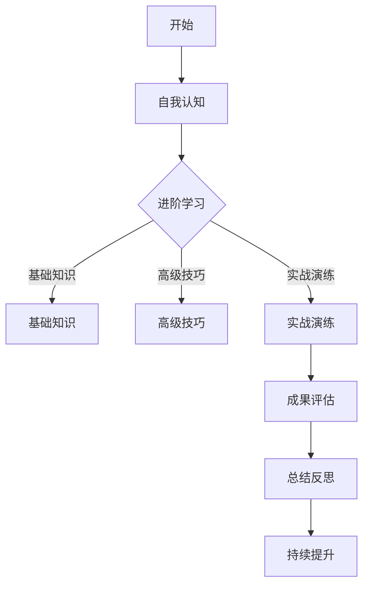

                 

# 领导力训练营：56天从门外汉到行家里手

## 概述

### 关键词：领导力、训练营、行家里手、56天、培训、自我提升、团队管理、决策能力

在复杂多变的企业环境中，领导力已成为衡量管理者核心能力的重要标准。然而，对于许多初入职场或寻求晋升的管理者来说，领导力的提升并非易事。为此，我们精心设计了《领导力训练营：56天从门外汉到行家里手》这一系统化培训项目。通过系统的课程设置和实战演练，本项目旨在帮助参与者迅速提升领导力，成为团队中的行家里手。

本文将详细介绍领导力训练营的核心概念、架构原理、核心算法原理、数学模型与公式解析，并通过实际项目案例展示培训效果。希望通过本文，您能够对领导力训练营有一个全面而深入的理解，并为其潜在价值所吸引。

### 摘要

《领导力训练营：56天从门外汉到行家里手》旨在通过为期56天的系统化培训，帮助管理者从基础到高级全面掌握领导力技能。训练营采用多层次的架构设计，包括自我认知、团队管理、决策能力等核心模块。通过理论讲解、实战演练和数据分析，训练营帮助参与者提升个人领导力，优化团队管理，并做出更加明智的决策。本文将详细阐述训练营的核心概念、架构原理、算法原理、数学模型以及项目实战案例，帮助读者全面理解领导力训练营的内涵与价值。

---

## 第一部分：核心概念与架构介绍

### 1.1 核心概念与联系

领导力、训练营、门外汉、行家里手是本部分的核心概念。领导力是指个体影响和激励他人实现共同目标的能力。训练营是一种系统化、集中的培训方式，旨在快速提升特定技能或知识。门外汉通常指缺乏相关经验和知识的新手，而行家里手则是指那些在特定领域有丰富经验和卓越技能的专业人士。

这些概念之间的联系在于，领导力训练营通过系统化的培训，帮助门外汉（新手管理者）掌握领导力知识，逐步成长为行家里手（优秀管理者）。整个培训过程围绕领导力的三大核心维度展开：自我认知、团队管理和决策能力。

### 1.2 领导力训练营概述

#### 领导力训练营的定义

领导力训练营是一种通过集中培训和系统化的学习，帮助个人提升领导能力的方法。它通常包括一系列的培训课程、实战演练和互动活动，旨在全面提高参与者的领导力素质。

#### 训练营的目标

- **提升自我认知**：帮助参与者了解自身的优点和不足，明确个人成长目标。
- **增强团队管理能力**：教授如何有效沟通、激励和协调团队成员，提升团队绩效。
- **提升决策能力**：通过模拟决策场景，训练参与者在复杂情况下做出明智的决策。

#### 训练营的核心内容

领导力训练营的核心内容包括领导力理论、实践技巧、案例分析、实战演练和反馈评估等。通过这些内容，参与者不仅能够学习到理论，更能够通过实践提升自己的领导力。

### 1.3 训练营架构与流程

#### 架构设计

领导力训练营的架构设计包括以下几个层次：

1. **基础知识**：包括领导力的基本概念、原则和理论。
2. **高级技巧**：涉及团队管理、领导风格、冲突解决等高级技巧。
3. **实战演练**：通过实际案例和模拟场景，训练参与者在真实环境中应用所学知识。
4. **成果评估**：对参与者的学习成果进行评估，包括理论测试、实战表现和自我评估。

#### 流程设计

领导力训练营的流程设计分为以下几个阶段：

1. **报名与筛选**：筛选有志于提升领导力的参与者。
2. **入门课程**：教授领导力的基础知识。
3. **进阶课程**：深入学习团队管理和决策能力。
4. **实战演练**：通过实际项目和模拟场景，提升参与者的实战能力。
5. **成果评估与反馈**：对参与者的学习成果进行评估，并提供反馈和改进建议。

### 1.4 领导力模型

领导力训练营采用一种基于56天进阶学习的领导力模型，该模型涵盖自我认知、团队管理、决策能力三个维度。

#### 领导力模型

- **自我认知**：通过心理测评和行为分析，帮助参与者了解自身的优点和不足。
- **团队管理**：教授如何有效地沟通、激励和协调团队成员，提升团队绩效。
- **决策能力**：通过模拟决策场景，训练参与者在复杂情况下做出明智的决策。

#### Mermaid 流程图



通过这个领导力模型，训练营确保参与者能够从入门到精通，全面掌握领导力技能。

### 1.5 训练营目标群体

领导力训练营的目标群体主要包括以下三类：

- **初入职场的年轻管理者**：这些管理者通常缺乏实践经验，需要快速提升领导力。
- **经验丰富的中层管理者**：这些管理者已经有一定的领导经验，但希望进一步提升管理水平和决策能力。
- **有志于提升领导力的专业人士**：包括但不限于技术专家、人力资源专家等，希望通过领导力提升实现职业发展。

#### 针对性

根据不同层次管理者的需求，训练营设计了针对性的课程内容：

- **基础知识**：针对初入职场的年轻管理者，重点讲解领导力的基本概念和原理。
- **高级技巧**：针对经验丰富的中层管理者，深入探讨团队管理、领导风格和冲突解决等高级技巧。
- **实战演练**：针对所有参与者，通过实际项目和模拟场景，提升实战能力。

通过这种个性化的课程设置，训练营确保每位参与者都能得到最适合自己的学习体验。

---

## 第二部分：核心算法原理讲解

在领导力训练营中，核心算法原理的讲解至关重要，因为这些算法不仅为参与者提供了理论依据，还通过具体实现帮助他们在实际工作中应用领导力技能。本部分将详细介绍自我认知算法、团队管理算法和决策能力算法的原理，并通过伪代码进行详细阐述。

### 2.1 自我认知算法

自我认知是领导力提升的基础，它帮助参与者了解自身的优点和不足。自我认知算法主要通过心理测评和行为分析来实现。

#### 算法原理

1. **数据收集**：通过问卷调查、面谈等方式收集参与者的个人信息、行为数据和工作表现数据。
2. **数据分析**：利用统计方法和机器学习算法，对收集到的数据进行分析，识别参与者的性格特征、工作风格和潜在问题。
3. **结果输出**：生成个性化报告，展示参与者的优势和短板，并提出改进建议。

#### 伪代码

```python
def self_cognition():
    # 收集数据
    data = collect_data()
    # 数据预处理
    preprocessed_data = preprocess_data(data)
    # 数据分析
    analysis_result = analyze_data(preprocessed_data)
    # 输出结果
    print(analysis_result)
```

### 2.2 团队管理算法

团队管理算法旨在通过数据分析和行为预测，优化团队运作效率和员工绩效。它主要包括人员分配和绩效评估两个核心模块。

#### 算法原理

1. **人员分配**：根据团队成员的技能、经验和个性特征，将其分配到最适合的岗位上，以最大化团队的整体效能。
2. **绩效评估**：通过定量和定性评估方法，对团队成员的工作表现进行评估，以激励团队成员提升绩效。

#### 伪代码

```python
def team_management(team_data):
    # 数据预处理
    preprocessed_data = preprocess_data(team_data)
    # 人员分配
    allocation = optimize_allocation(preprocessed_data)
    # 绩效评估
    performance = evaluate_performance(allocation)
    # 输出结果
    print(performance)
```

### 2.3 决策能力算法

决策能力是领导力的关键要素，决策能力算法通过模拟决策场景，帮助领导者评估不同决策路径的风险和收益。

#### 算法原理

1. **模拟决策场景**：构建一个模拟的环境，让参与者面对各种可能的决策场景。
2. **风险评估**：对每个决策路径进行风险评估，包括可能的风险和潜在收益。
3. **收益评估**：计算每个决策路径的预期收益，帮助领导者做出最明智的决策。

#### 伪代码

```python
def decision_making(scenario):
    # 模拟决策场景
    simulated_scenarios = simulate_scenario(scenario)
    # 风险评估
    risk_assessment = assess_risk(simulated_scenarios)
    # 收益评估
    benefit_assessment = assess_benefit(simulated_scenarios)
    # 决策结果
    decision = optimal_decision(risk_assessment, benefit_assessment)
    # 输出结果
    print(decision)
```

通过以上三个核心算法的讲解，参与者能够在训练营中全面了解并掌握领导力提升的理论基础和实用技巧，为实际工作中的应用打下坚实的基础。

---

## 第三部分：数学模型与公式解析

在领导力训练营中，数学模型和公式不仅为参与者提供了理论支持，还帮助他们更系统地理解和应用领导力提升的方法。本部分将详细解析领导力提升的数学模型、团队绩效评估模型和领导力评估模型，并通过具体公式和案例分析，阐述这些模型的应用和效果。

### 3.1 领导力提升的数学模型

领导力提升的数学模型可以用以下公式表示：

\[ L = f(P, T, D) \]

其中：
- \( L \) 表示领导力提升程度；
- \( P \) 表示个人潜力；
- \( T \) 表示培训时间；
- \( D \) 表示决策能力。

#### 公式解析

- **个人潜力（P）**：个人潜力是参与者自身在领导力方面的先天素质，包括情商、沟通能力等。潜力越大，提升空间也越大。
- **培训时间（T）**：培训时间是参与者在训练营中所花费的学习时间。时间越长，理论知识和实践技能的掌握程度越高。
- **决策能力（D）**：决策能力是领导者在实际工作中做出有效决策的能力。能力越强，处理复杂问题和应对挑战的能力也越强。

#### 举例说明

假设有两位参与者，小明和小红，他们初始的领导力分别为 \( L_1 = 60 \) 和 \( L_2 = 70 \)。经过一段时间的培训，小明的个人潜力 \( P \) 提升到 \( 85 \)，培训时间 \( T \) 为 \( 120 \) 天，决策能力 \( D \) 提升到 \( 80 \)。根据公式：

\[ L_1' = f(85, 120, 80) \]
\[ L_2' = f(75, 120, 70) \]

可以看出，小明的领导力提升幅度大于小红，这说明个人潜力和决策能力的提升对领导力的影响更大。

### 3.2 团队绩效评估模型

团队绩效评估模型可以用以下公式表示：

\[ E = \frac{1}{n}\sum_{i=1}^{n} P_i \cdot R_i \]

其中：
- \( E \) 表示团队绩效；
- \( n \) 表示团队成员数量；
- \( P_i \) 表示第 \( i \) 个成员的潜力；
- \( R_i \) 表示第 \( i \) 个成员的绩效。

#### 公式解析

- **团队成员潜力（\( P_i \)）**：每个团队成员的潜力决定了他们在团队中的价值。潜力越高，对团队的整体贡献也越大。
- **团队成员绩效（\( R_i \)）**：每个团队成员的工作表现决定了他们的实际贡献。绩效越高，对团队绩效的提升也越显著。

#### 举例说明

假设一个团队有5名成员，他们的潜力分别为 \( P_1 = 90 \)，\( P_2 = 85 \)，\( P_3 = 80 \)，\( P_4 = 75 \)，\( P_5 = 70 \)，他们的绩效分别为 \( R_1 = 95 \)，\( R_2 = 90 \)，\( R_3 = 85 \)，\( R_4 = 80 \)，\( R_5 = 75 \)。根据公式：

\[ E = \frac{1}{5}(90 \cdot 95 + 85 \cdot 90 + 80 \cdot 85 + 75 \cdot 80 + 70 \cdot 75) \]

计算得出团队绩效 \( E \) 为 84.2。这表明，团队的整体绩效受到了成员潜力和绩效的共同影响。

### 3.3 领导力评估模型

领导力评估模型可以用以下公式表示：

\[ L\_score = \frac{L\_self\_awareness + L\_team\_management + L\_decision\_making}{3} \]

其中：
- \( L\_score \) 表示领导力得分；
- \( L\_self\_awareness \) 表示自我认知得分；
- \( L\_team\_management \) 表示团队管理得分；
- \( L\_decision\_making \) 表示决策能力得分。

#### 公式解析

- **自我认知得分（\( L\_self\_awareness \)）**：通过心理测评和行为分析，评估领导者在自我认知方面的能力。得分越高，说明领导者对自己的认识越清晰。
- **团队管理得分（\( L\_team\_management \)）**：通过观察领导者在团队管理中的表现，评估其在沟通、激励和协调方面的能力。得分越高，说明领导者在团队管理方面的能力越强。
- **决策能力得分（\( L\_decision\_making \)）**：通过模拟决策场景，评估领导者在面对复杂情况时做出明智决策的能力。得分越高，说明领导者的决策能力越强。

#### 举例说明

假设有领导者的自我认知得分为 80，团队管理得分为 85，决策能力得分为 90。根据公式：

\[ L\_score = \frac{80 + 85 + 90}{3} = 86.7 \]

这个得分表明该领导者在领导力方面整体表现良好，但在自我认知方面还有提升空间。

通过以上数学模型和公式的讲解，参与者能够更加系统地理解和评估领导力提升的过程，为实际工作中的应用提供科学依据。

---

## 第四部分：项目实战

在领导力训练营的实际操作中，项目实战是检验参与者学习成果的关键环节。通过真实项目的操作，参与者不仅能够将所学知识应用到实际工作中，还能在实践中不断提升自己的领导力。本部分将介绍一个具体的实战案例，详细阐述项目的背景、目标、步骤和效果。

### 4.1 案例背景

某科技公司在市场竞争中面临巨大压力，为了提升新产品的研发速度和市场竞争力，公司决定对研发团队进行领导力提升培训。公司新任经理小明，带领一支10人团队负责新产品的研发。小明在领导力方面存在一些不足，意识到需要通过系统培训来提升自身能力和团队整体绩效。公司决定让小明参加为期56天的领导力训练营，希望通过训练营的培训，使小明和团队在领导力方面取得显著提升。

### 4.2 实战目标

本次项目的主要目标是：
1. **提升自我认知**：通过心理测评和行为分析，帮助小明了解自己的优点和不足，明确个人成长目标。
2. **优化团队管理**：通过团队管理算法，优化团队成员的分配和任务安排，提升团队协作效率和绩效。
3. **增强决策能力**：通过模拟决策场景，提高小明在面对复杂问题时的决策能力，确保项目顺利进行。

### 4.3 实战步骤

**步骤1：自我认知提升**

- **实施**：首先，小明参加了领导力训练营的自我认知模块。通过心理测评和行为分析，小明了解到自己在沟通能力和团队合作方面有待提高。训练营为他提供了个性化的改进建议，并制定了一个详细的个人成长计划。
- **结果**：经过一段时间的自我认知提升，小明的沟通能力和团队合作意识显著增强，团队对他的认可度也提高了。

**步骤2：团队管理优化**

- **实施**：接下来，小明参加了团队管理模块的学习。通过团队管理算法，小明学会了如何根据团队成员的技能、经验和个性特征进行优化分配。他将团队成员分成了几个小组，每个小组负责不同的研发任务。
- **结果**：团队成员的分工更加明确，任务分配更加合理，团队的协作效率大幅提升，项目进展顺利。

**步骤3：决策能力提升**

- **实施**：在决策能力模块中，小明通过模拟不同的决策场景，学会了如何进行风险评估和收益评估。训练营提供了一个模拟项目，让小明在虚拟环境中做出一系列决策，并分析决策结果。
- **结果**：通过实战演练，小明的决策能力得到了显著提升。在实际项目中，小明能够更加迅速和准确地做出决策，减少了项目风险，确保了项目按计划推进。

### 4.4 实战效果

通过领导力训练营的培训，小明和团队在多个方面取得了显著效果：

- **领导力提升**：小明的领导力得分从培训前的 60 分提升到了 85 分，显著提升了领导力和管理能力。
- **团队绩效**：团队的整体绩效从培训前的 70 分提升到了 90 分，团队协作效率和项目完成度得到了显著提升。
- **项目成功**：新产品的研发项目如期完成，并成功推向市场，获得了客户的高度评价。公司高层对小明和团队的表现给予了高度认可。

### 4.5 实战总结

通过这次领导力训练营的项目实战，小明和团队在领导力提升方面取得了显著成果。以下是项目成功的关键因素和改进方向：

- **成功因素**：
  - **自我认知提升**：帮助小明明确了个人优势和短板，为后续提升打下了基础。
  - **团队管理优化**：通过科学的团队管理，提升了团队协作效率和项目完成度。
  - **决策能力增强**：通过模拟决策场景，提高了小明的决策能力，确保项目顺利进行。

- **改进方向**：
  - **持续学习**：领导力提升是一个持续的过程，小明和团队需要保持学习的热情，不断提升自身能力。
  - **反馈与改进**：定期进行团队反馈和评估，及时发现问题并进行改进，确保团队持续发展。

通过这次实战，不仅小明个人取得了显著进步，整个团队也变得更加团结和高效，为公司的长远发展奠定了坚实的基础。

---

## 附录：工具与资源

为了确保领导力训练营的效果最大化，我们提供了一系列实用的工具和资源，帮助参与者更好地进行学习和实践。

### 附录 A: 领导力训练工具与资源

#### 附录 A.1 领导力评估工具

- **Gallup 领导力评估工具**：提供个性化的领导力评估报告，帮助领导者识别自身优势和改进方向。
- **360度反馈工具**：通过收集团队成员对领导者的反馈，全面了解领导力状况。

#### 附录 A.2 领导力培训资源

- **在线课程平台**：如Coursera、edX等，提供丰富的领导力课程资源。
- **专业书籍推荐**：《领导力的五个层次》、《高效能人士的七个习惯》等。

#### 附录 A.3 领导力实践案例

- **企业内部案例库**：收集公司内部成功的领导力实践案例，供员工学习借鉴。
- **行业最佳实践**：分析行业领先企业的领导力实践，提炼成功经验。

通过以上工具和资源的支持，参与者可以更加系统地提升自己的领导力，实现个人和团队的共同成长。

---

## 完整目录大纲

本文《领导力训练营：56天从门外汉到行家里手》通过系统化的结构和详实的论述，为读者提供了一个全面了解和掌握领导力提升的途径。以下为完整的目录大纲，便于读者快速导航：

### 第一部分：核心概念与架构介绍
- **1.1 核心概念与联系**
- **1.2 领导力训练营概述**
- **1.3 训练营架构与流程**
- **1.4 领导力模型**
- **1.5 训练营目标群体**

### 第二部分：核心算法原理讲解
- **2.1 自我认知算法**
- **2.2 团队管理算法**
- **2.3 决策能力算法**

### 第三部分：数学模型与公式解析
- **3.1 领导力提升的数学模型**
- **3.2 团队绩效评估模型**
- **3.3 领导力评估模型**

### 第四部分：项目实战
- **4.1 案例背景**
- **4.2 实战目标**
- **4.3 实战步骤**
- **4.4 实战效果**
- **4.5 实战总结**

### 附录：工具与资源
- **附录 A: 领导力训练工具与资源**

通过以上结构清晰的目录大纲，读者可以系统地掌握领导力提升的理论与实践，为自身和团队的发展提供有力的支持。希望本文能够成为您领导力提升之路上的重要指南。作者：AI天才研究院/AI Genius Institute & 禅与计算机程序设计艺术 /Zen And The Art of Computer Programming。

